# 第十章：部署和托管应用程序

在遵循良好的开发流程、实施良好实践并覆盖应用程序所需的所有功能之后，将其发布到环境中是必要的。为了成功完成此操作，了解超越源材料的各种概念、实践和应用打包模型非常重要。在本章中，我们将讨论不同的应用程序托管和部署方法，以及理解与**持续集成和持续部署**（**CI/CD**）和容器相关的概念。

ASP.NET Core 9 提供了一个强大的配置系统，允许开发者有效地管理配置和行为。本章将探讨应用程序配置的重要性，如何使用配置系统来管理它们，以及如何在运行时使您的应用程序具有适应性。

在本章中，我们将涵盖以下主题：

+   准备发布您的应用程序并本地托管

+   在云环境中发布解决方案

+   理解 Docker 原则以及如何将应用程序打包到容器中

+   理解 DevOps 方法与 CI/CD

# 技术要求

为了完成本章，以下工具必须存在于您的开发环境中：

+   **Azure 订阅**：在本章中，我们将创建 Microsoft Azure 中的资源。为此，如果您还没有，您将需要一个 Azure 订阅，以便您能够访问该平台。您可以在[`azure.microsoft.com/en-us/free`](https://azure.microsoft.com/en-us/free)注册一个带有有限信用额的订阅，以了解本章中介绍的概念。

+   **Docker Hub 账户**：您需要在 Docker Hub 网站上创建一个账户，网址为[`hub.docker.com`](https://hub.docker.com)。

+   **Azure 工具扩展**：您需要从[`marketplace.visualstudio.com/items?itemName=ms-vscode.vscode-node-azure-pack`](https://marketplace.visualstudio.com/items?itemName=ms-vscode.vscode-node-azure-pack)安装 Visual Studio Code 的 Azure Tools 扩展。安装完成后，使用您的 Azure 凭据登录。

本章的代码示例可以在本书的 GitHub 仓库中找到：[`github.com/PacktPublishing/ASP.NET-Core-9.0-Essentials/tree/main/Chapter10`](https://github.com/PacktPublishing/ASP.NET-Core-9.0-Essentials/tree/main/Chapter10)。

# 准备发布您的应用程序并本地托管

发布应用程序是软件开发生命周期中的一个自然过程。在开发和测试之后，下一步是将应用程序提供给用户。这涉及到创建可部署的应用程序版本，并在可以访问和使用的环境中对其进行配置。

让我们了解在遵循各种策略的同时发布应用程序的细节，从手动到自动化的 CI/CD。但在我们这样做之前，让我们了解一些基本概念，例如发布过程的重要性。

## 发布过程的重要性

发布过程将您的应用程序从源代码转换为可部署的格式。此过程确保所有依赖项、配置和编译的代码打包在一起，使得在不同环境中部署和运行应用程序更加容易。

ASP.NET Core 9 中的发布过程涉及三个步骤：

1.  恢复包。

1.  编译应用程序。

1.  生成可发布的包。

生成的发布包可能因开发的应用程序类型而异。它可能包含不同的文件，例如以下内容：

+   应用程序的 DLL 文件

+   第三方依赖项和库

+   静态文件（例如，JavaScript、CSS 和图片）

+   配置文件（例如，**appsettings.json**）

+   独立部署的可执行文件

要了解此过程的工作原理，请按照 *技术要求* 部分提供的说明从本书的 GitHub 仓库下载示例应用程序。这将是本章的基础。

现在，让我们了解如何生成发布包。

## 生成发布包

我们在本书中广泛使用 .NET 平台 CLI 工具来创建和运行应用程序。CLI 工具还有一个特定命令用于为 ASP.NET Core 9 项目生成发布包。

**publish** 命令提供了各种选项，允许我们配置发布包的输出，如 *表 10.1* 中所示：

| **选项** | **描述** | **示例** |
| --- | --- | --- |
| **<** **项目文件** > | 指定要操作的项目文件。如果未指定，则默认为当前目录。 |

```cs
dotnet publish project_name.csproj
```

|

| **-c**，**--configuration** | 定义构建配置（**Debug** 或 **Release**）。默认为 **Debug**。 |
| --- | --- |

```cs
dotnet publish –c Release
```

|

| **-f**，**--framework** | 指定目标框架 – 例如，**net8.0**。 |
| --- | --- |

```cs
dotnet publish –f net8.0
```

|

| **--runtime** | 为特定运行时发布应用程序（例如，**win-x64**、**linux-x64** 或 **osx-x64**）。 |
| --- | --- |

```cs
dotnet publish –runtime linux-x64
```

|

| **-o**，**--output** | 指定发布文件的输出目录。 |
| --- | --- |

```cs
dotnet publish –o ./publish
```

|

| **--self-contained** | 将应用程序作为自包含部署发布，包括 .NET 运行时。 |
| --- | --- |

```cs
dotnet publish –self-contained
```

|

| **--no-restore** | 在发布操作期间禁用恢复项目依赖项的能力。假设恢复已经完成。这在 CI/CD 管道中很有用。 |
| --- | --- |

```cs
dotnet publish –no-restore
```

|

| **--manifest** | 指定一个或多个目标清单，以计算包含在发布输出中的包集。 |
| --- | --- |

```cs
dotnet publish –manifest ProjectManyfest.xml
```

|

| **--** **version-suffix** | 设置在构建项目时使用的 **$(VersionSuffix)** 属性值。对于预发布版本很有用。 |
| --- | --- |

```cs
dotnet publish –version-suffix beta1
```

|

表 10.1 – dotnet publish CLI 工具选项

每个选项的使用将取决于每个场景。在我们的上下文中，我们将使用 **<PROJECT>** 、 **-c** 、 **-o** 和必要时 **--** **no-restore** 选项。

现在，让我们为 **UrlShortener** 应用程序生成一个发布包。为此，打开您的终端或 bash，访问之前下载的应用程序目录，并执行以下命令：

```cs
dotnet publish UrlShortener.csproj -c Release -o ./published
```

前面的命令将在**发布**文件夹中生成**发布**包。然而，了解**-c**参数的详细信息非常重要：

+   **-c** 选项指定构建配置，通常有两种主要配置：**调试**和**发布**：

    +   **调试**配置包含额外的调试信息，并针对调试进行了优化。当使用 **dotnet run** 命令在本地运行项目时，默认配置是**调试**，这允许执行调试过程。

    +   **发布**配置针对性能进行了优化，不包含调试信息。通常用于将应用程序部署到生产环境。

当访问**发布**文件夹时，我们必须模拟目录/文件结构：

```cs
publish/
├── appsettings.Development.json
├── appsettings.json
├── Azure.Core.dll
├── Azure.Identity.dll
├── Microsoft.Bcl.AsyncInterfaces.dll
├── Microsoft.Data.SqlClient.dll
├── Microsoft.EntityFrameworkCore.Abstractions.dll
├── Microsoft.EntityFrameworkCore.dll
├── Microsoft.EntityFrameworkCore.Relational.dll
├── Microsoft.EntityFrameworkCore.SqlServer.dll
├── Microsoft.Identity.Client.dll
├── Microsoft.Identity.Client.Extensions.Msal.dll
├── Microsoft.IdentityModel.Abstractions.dll
├── Microsoft.IdentityModel.JsonWebTokens.dll
├── Microsoft.IdentityModel.Logging.dll
├── Microsoft.IdentityModel.Protocols.dll
├── Microsoft.IdentityModel.Protocols.OpenIdConnect.dll
├── Microsoft.IdentityModel.Tokens.dll
├── Microsoft.SqlServer.Server.dll
├── Microsoft.Win32.SystemEvents.dll
├── runtimes/
│ ├── (runtime-specific files and directories)
├── System.Configuration.ConfigurationManager.dll
├── System.Drawing.Common.dll
├── System.IdentityModel.Tokens.Jwt.dll
├── System.Memory.Data.dll
├── System.Runtime.Caching.dll
├── System.Security.Cryptography.ProtectedData.dll
├── System.Security.Permissions.dll
├── System.Windows.Extensions.dll
├── UrlShortener
├── web.config
└──wwwroot/
├── (static files like css, js, images)
```

如我们所见，有几个 **.dll** 文件，这些是应用程序使用的依赖项，除了静态文件如 **wwwroot** 和配置文件。

该文件夹的内容正是应该在一个环境中发布的，无论是本地还是通过云提供商。

通过在终端中访问**发布**目录并执行以下命令，可以运行应用程序：

```cs
dotnet UrlShorterner.dll
```

**UrlShorterner.dll** 文件是一个 ASP.NET Core 9 应用程序的可执行文件。由于您的开发机器上已安装 .NET SDK，因此可以通过 **.dll** 文件在您的开发机器上运行应用程序。SDK 不应安装在将运行应用程序的服务器上。为此，您只需安装 **.NET 运行时** 。

.NET 运行时

.NET 运行时是由微软开发的一个软件框架，它为运行 .NET 应用程序提供了一个托管执行环境。它包括运行 .NET 程序、管理内存、处理异常和收集垃圾所需的组件。.NET 运行时通常安装在运行特定 .NET 应用程序的服务器和机器上。与 .NET SDK 不同，.NET 运行时具有运行应用程序的功能，而不是构建和开发它们。要了解更多关于 .NET 运行时的信息，请访问 [`learn.microsoft.com/en-us/dotnet/core/introduction`](https://learn.microsoft.com/en-us/dotnet/core/introduction) 。

.NET 平台和 ASP.NET Core 9 是可移植的，这意味着它们可以在安装了 SDK 或.NET 运行时的不同操作系统上运行。*表 10.2*显示了在最重要的每个操作系统上可以使用的应用程序服务器：

| **操作系统** | **先决条件** |
| --- | --- |
| Linux |

+   .NET SDK/Runtime, Kestrel

+   可选：Nginx/Apache，托管套餐

|

| macOS |
| --- |

+   .NET SDK/Runtime, Kestrel

+   可选：Nginx/Apache

|

| Windows |
| --- |

+   .NET SDK/Runtime, Kestrel

+   可选：IIS、NGINX、HTTP.sys、ASP.NET Core 托管套餐

|

| 表 10.2 – ASP.NET Core 9 应用程序的 Web 服务器选项

使用 CLI 工具生成发布包的过程很简单。我们将遵循此过程，并通过 CI/CD 自动化，我们将在*理解 CI/CD 的 DevOps 方法*部分进行介绍。

现在我们已经学会了如何生成发布包，是时候学习如何在云环境中发布它们了。

# 在云环境中发布解决方案

使用 ASP.NET Core 9 开发现代应用程序的优势不仅在于能够使用实现最佳实践的能力，还在于需要向应用程序用户提供高质量解决方案。

到目前为止，我们已经了解了使用.NET 平台各种功能的重要性，例如使用.NET CLI 编译应用程序和安装支持工具，如 Entity Framework Core。我们还了解了生成可在本地和任何使用.NET 运行时的环境中运行的发布包的过程。

在撰写本文时，不工作在云环境中是不可能的。这为我们提供了诸如弹性、可用性、安全性以及许多其他简化通过持续交付价值的过程来部署、维护和演进应用程序的好处。

要了解如何在云环境中发布解决方案，我们将使用 Azure 作为我们的云提供商。

将 ASP.NET Core 9 应用程序迁移到 Azure 允许开发者利用这种云提供商提供的动态功能，同时关注应用程序上下文和业务目标。Azure 通过其多样化的资源和服务，允许应用程序处理各种工作负载，保持对用户的可用性，并保护免受安全威胁。

基于我们之前工作的**UrlShortener**应用程序以及生成可发布包的过程，我们将实现 Azure 的好处并将此应用程序发布在云环境中。

## 创建 Azure 应用程序服务和数据库资源

Azure 环境为发布应用程序提供了不同类型的资源，这些资源在不同的服务级别和不同的发布方法中有所不同。

对于这个应用程序，我们将使用一个名为 **App Service** 的资源，这是 Azure 提供的 **平台即服务** ( **PaaS** ) 产品，它允许我们专注于我们的应用程序。App Service 提供了一个出色的应用程序服务器，同时为我们提供了访问已发布应用程序的 URL。

您必须根据 *技术要求* 部分提供的信息准备您的环境。

应用程序服务和 PaaS

Azure App Service 是一个完全管理的 PaaS，允许开发者在他们选择的编程语言中构建、部署和扩展 Web 应用程序、移动后端和 RESTful API，而无需进行基础设施管理。App Service 提供了一个准备好的服务器，提供运行您的应用程序所需的运行时。PaaS 方法是一种云计算模型，它提供了一个完整的开发部署环境在云中，使开发者从处理基础设施的需求中解放出来。有关更多详细信息，请参阅 Azure App Service 文档：[`docs.microsoft.com/en-us/azure/app-service/`](https://docs.microsoft.com/en-us/azure/app-service/)。

我们的目标不会是耗尽 Azure 环境中所有可用的资源选项，因为需要一本专门介绍这个主题的书。

相反，我们将专注于使用 Azure App Service 作为 Web 服务器发布 **UrlShortener** 应用程序。

按照以下步骤发布应用程序：

1.  访问 Azure 门户 ([`portal.azure.com`](https://portal.azure.com) )。

1.  在主屏幕上，点击 **创建资源** 按钮，如图 *图 10.1* 所示：

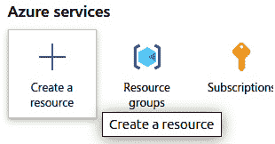

图 10.1 – 创建新的 Azure 资源

1.  然后，在 **Web App** 资源下选择 **创建**，如图 *图 10.2* 所示：


图 10.2 – 创建新的 Web App 资源

1.  在新的 **Web App** 资源的 **基本创建** 屏幕上，填写 *表 10.3* 中提供的信息：

| **参数** | **值** | **描述** |
| --- | --- | --- |
| **订阅** | 选择您的订阅。 | 订阅是上线资源和相关成本所必需的。 |
| **资源组** | 在这里，值是 **rg-aspnetcore8**。如果此资源组不存在，请点击 **资源组** 字段下方的 **创建新链接** 并创建它。 | 资源是 Azure 中资源的逻辑组。 |
| **名称** | **urlshortener.<您的** **姓氏>** | 此参数将是您应用程序的 URL。请保持其唯一性。 |
| **发布** | **代码** | App Service 有不同的方式来托管和发布应用程序。在这种情况下，我们使用 **代码** 选项，因为我们将会发布生成的包。 |
| **运行时堆栈** | **.NET** **9 (LTS)** | 此参数定义将在 App Service 上托管的应用程序类型。它支持 .NET、Node.js、Java、PHP 和 Python。 |
| **操作系统** | Linux. | Linux 是许多用例的良好选择。然而，对于这个练习，你也可以选择 Windows。操作系统的定义取决于应用程序的需求。 |
| **区域** | **EastUS 2** | App Service 将托管的应用程序所在的区域。我们使用 **East US 2** 是因为我们将创建的数据库在 East US 区域不可用。 |
| **Linux 平台** | 保持原样。 | 我们将创建一个新的服务计划来托管应用程序。服务计划是应用服务的一个重要组成部分。根据定价计划，服务计划可以托管多个应用程序。 |
| **定价计划** | **基本 B1** . | **基本 B1** 选项对于这个例子来说已经足够了。请记住，如果你选择不同的定价计划，可能会产生更高的费用。 |
| **区域冗余** | 禁用。 | 此参数用于需要高可用性配置的生产环境中的应用程序。 |

表 10.3 – 新 Web 应用资源的基本参数

5. 点击 **下一步：数据库 >** 按钮。

6. 选择 **创建数据库** 选项，并按照 *图 10* *.3* 中的说明填写参数：

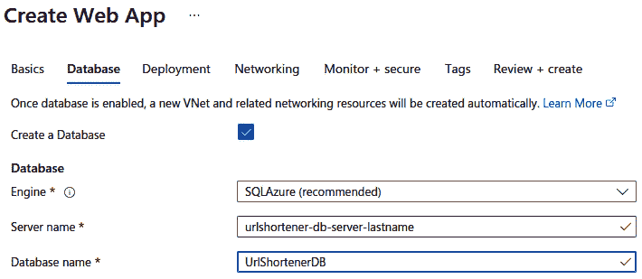

图 10.3 – 数据库服务器配置

在这个阶段，我们正在配置数据库，这对于 **URLShortener** 应用程序是必要的。我们将使用 Azure SQL Server 资源，因为它提供了一个可以托管不同数据库的服务器。在这个例子中，我们只使用一个数据库。但是，如果需要，以后可以添加其他数据库。

7. 现在，点击 **监控 + 安全** 选项卡，并将 **启用 Application Insights** 选项设置为 **否** 。

此选项旨在为应用程序创建一个监控资源。这是一个最佳实践，特别是对于生产资源。因此，在这个阶段，目标是发布应用程序；目前不需要监控，这可以在以后添加。

8. 接下来，点击 **审查和创建** 。然后，点击 **创建** 并等待资源创建完成。

9. 在审查屏幕上，在 **数据库** 部分中，你会看到用户名和密码信息，如图 *图 10* *.4* 所示。复制这些详细信息并妥善保管；我们稍后会需要密码来配置数据库：

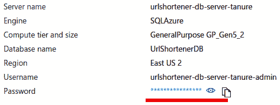

图 10.4 – 数据库凭据

10. 最后，点击 **创建** 并等待资源创建完成。

11. 一旦资源创建完成，点击如图 *图 10* *.5* 所示的 **转到资源** 按钮：

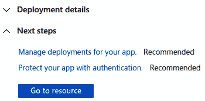

图 10.5：资源创建屏幕

你将被重定向到之前创建的 **应用服务** 设置摘要屏幕。

如 *图 10* *.6* 所示，你将能够看到可用的 **默认域名** URL，以便你可以访问应用程序：

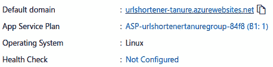

图 10.6 – 创建的应用程序服务的默认域名 URL

**默认域名**URL 是 Azure 根据创建应用程序服务时定义的参数自动创建的，可以使用自定义域名进行自定义。我们将保持 URL 可用并运行。点击 URL 后，您将被重定向到一个包含类似*图 10.7*所示信息的页面：

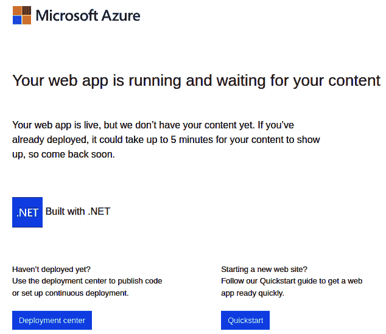

图 10.7 – 新应用程序服务的默认网站内容

到目前为止，服务器已启动并运行，但我们必须在 Azure 上发布应用程序。然而，在发布应用程序之前，让我们先配置数据库。

## 配置 Azure SQL 服务器

在创建我们的应用程序服务时，还创建了其他资源，例如数据库服务器和数据库。

我们需要配置数据库，以便我们能够持久化应用程序中使用的 URL 表。

我们将使用 Entity Framework Core 工具以与本地相同的方式更新数据库。然而，由于安全原因，Azure 自动创建的数据库服务是公开不可访问的。

要做到这一点，我们必须提前进行一些配置更改，以便我们可以操作数据库。按照以下步骤操作：

1.  前往之前创建的资源组 – 即**rg-aspnetcore8**。您将能够看到创建的资源列表。

1.  搜索**UrlshortenerDB**资源并访问它。

1.  然后，在**设置**菜单组中，单击**连接字符串**。

1.  连接字符串应如下所示：

    ```cs
    Server=tcp:urlshortener-db-server-tanure.database.windows.net,1433;Initial Catalog=UrlshortenerDB;Persist Security Info=False;User ID=urlshortener-db-server-tanure-admin;Password={your_password}; MultipleActiveResultSets=False;Encrypt=True;TrustServerCertificate=False;Connection Timeout=30;
    ```

1.  注意**Password={your_password}**参数。在创建应用程序服务时，将此参数替换为您复制的密码。

1.  从**ADO.NET (SQL** **Authentication)**字段复制连接字符串。

1.  现在，打开**URLShortener**应用程序的**appsettings.json**文件，将**DefaultConnection**属性更改为您之前复制的连接字符串。结果将如下所示：

    ```cs
    "Logging": {
      "LogLevel": {
        "Default": "Information",
        "Microsoft.AspNetCore": "Warning"
      }
    },
    "ConnectionStrings": {
      "DefaultConnection":
        "Server=tcp:urlshortener-db-server-tanure.database.windows.net,1433;Initial Catalog=UrlshortenerDB;Persist Security Info=False;User ID=urlshortener-db-server-tanure-admin;Password=XL6l61uv9t4$K4Q6;MultipleActiveResultSets=False;Encrypt=True;TrustServerCertificate=False;Connection Timeout=30;"
      },
      "AllowedHosts": "*"
    }
    ```

1.  保存**appsettings.json**文件。

1.  现在，让我们配置对数据库服务器的访问。为此，返回到**rg-aspnetcore8**资源组，并单击**urlshortener-db-server<your last** **name>**资源。

1.  从主菜单转到**安全** | **网络**，然后单击**添加您的客户端 IPv4 地址**选项，如图*图 10.8*所示：

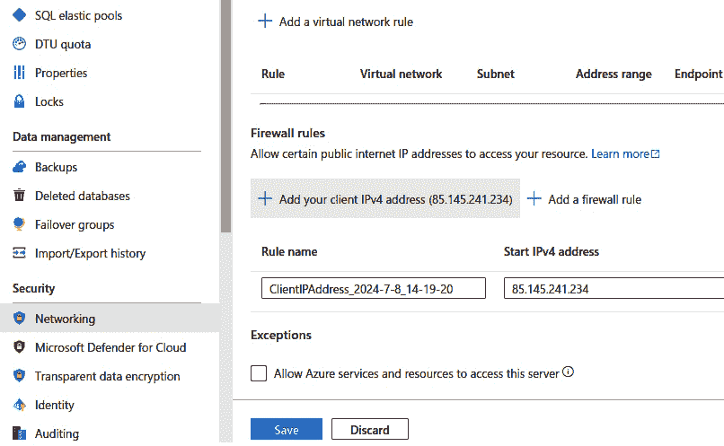

图 10.8 – 添加防火墙规则以访问 IPv4 地址的私有数据库

此配置将创建一个规则，使得数据库只能通过其当前 IP 地址访问。请注意，如果您的 IP 地址更改，您将必须再次执行这些步骤以添加新的 IP 地址。

1.  最后，单击**保存**。

通过这种方式，我们已经为托管在 Azure 上的数据库连接字符串配置了应用程序，并添加了防火墙规则，以便可以通过我们当前的 IP 地址访问数据库。

现在，我们需要更新数据库。为此，访问您的操作系统终端并导航到 **URLShortener** 项目目录。然后，运行以下命令：

```cs
dotnet ef database update
```

等待过程完成。要检查表是否正确创建，请在 Azure 门户（[`portal.azure.com`](https://portal.azure.com)）中访问 **rg-aspnetcore9** 资源组，然后访问 **UrlShortenerDB** 资源。点击 **查询编辑器** 菜单并使用创建应用程序服务时提供的凭据访问数据库。

如 *图 10.9* 所示，新表已创建：

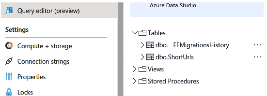

图 10.9 – 使用 Entity Framework Core 迁移创建的数据库表

这就是使用 Entity Framework Core 迁移的好处之一。通过这样做，可以应用到本地数据库或服务器上的更改，并保持与应用程序代码的一致性。

现在数据库已配置，是时候发布应用程序了。我们将通过 Visual Studio Code 来完成这项操作。

## 使用 Visual Studio Code 发布应用程序

在配置了在 Azure 上托管应用程序的所有先决条件后，现在是时候发布应用程序了。

通过 Visual Studio Code 或甚至 Visual Studio 发布的过程相当简单。

在 *技术要求* 部分，建议您安装和配置 Azure Tools 扩展 [(https://marketplace.visualstudio.com/items?itemName=ms-vscode.vscode-node-azure-pack](https://marketplace.visualstudio.com/items?itemName=ms-vscode.vscode-node-azure-pack) )。此扩展使手动发布过程更加容易。

按照以下步骤发布我们在之前创建的应用服务中的应用程序版本：

1.  访问 **UrlShortener** 应用程序目录并运行以下命令：

    ```cs
    code .
    ```

1.  然后，点击 Visual Studio Code 中的 Azure Tools 扩展图标，如图 *图 10.10* 所示：

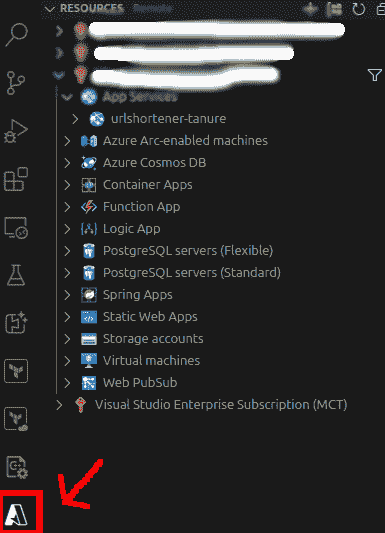

图 10.10 – Visual Studio Code 中的 Azure Tools

将显示您用户可用的订阅列表。通过展开订阅，我们将能够看到为 **UrlShortener** 应用程序创建的应用服务资源以及资源。

1.  现在，右键单击 **urlshortener-<你的姓氏>** 应用程序，并选择 **部署到 Web 应用…** 选项，如图 *图 10.11* 所示：

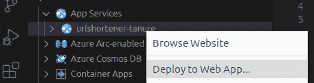

图 10.11 – 使用 Visual Studio Code 中的 Azure Tools 扩展部署 Web 应用

1.  您将需要提供一些配置细节，以便您可以部署。只需确认提供的选项，然后等待部署过程完成。

1.  发布过程完成后，将显示类似于*图 10* *.12* 中所示的通知：

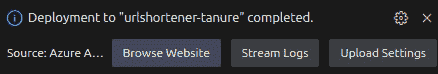

图 10.12 – 表示应用程序部署已完成的通知

1.  您可以通过点击**浏览网站**按钮导航到已发布的网站。您将看到类似于*图 10.13* *.*13* 中所示的结果：

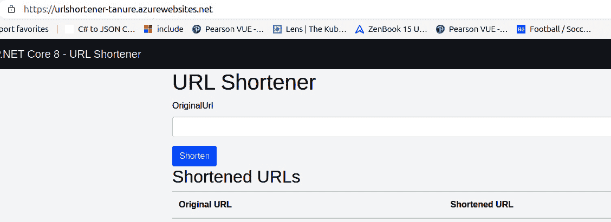

图 10.13 – 在 Azure 上运行的 URL 缩短器应用程序

现在，您可以直接在您的 Azure 环境中公开使用包含短网址功能的应用程序。

Azure 工具扩展通过在后台运行以下过程来自动化发布新应用程序版本的过程：

+   恢复包

+   编译应用程序

+   生成发布包

+   将发布包压缩成**.** **zip**格式

+   连接到 Azure 环境

+   部署包含发布包的 ZIP 文件

+   解压 ZIP 文件

这些步骤在您每次选择使用 Azure 工具扩展部署时都会执行。我们将在本章的*理解 DevOps 方法中的 CI/CD*部分了解另一种在 C/ICD 模型中发布包的方法。

在云环境中托管解决方案是当今的一项必要活动，并且有几种资源可以帮助我们完成这项任务。

每个托管资源和服务层的定义将取决于应用程序需求以及团队的知识水平。有些情况下，我们可以使用允许我们在不同环境中托管应用程序的策略，这种方式对云提供商的具体资源是无关紧要的。

为了实现这一点，云原生应用程序中常用的一种策略是容器策略。我们将在下一节中了解这一点。

# 理解 Docker 原则以及如何在容器中打包应用程序

现在，使用容器策略已经成为一项基本要求，特别是对于云原生应用程序。容器为开发、测试和部署提供了一个一致的环境，确保应用程序无论部署在哪里都能顺利运行。使用容器时，我们实际上拥有在给定环境中运行应用程序所需的一切，无需安装额外的包或运行时。

这样，我们就有了一致性，这对于像 Azure 或其他任何云提供商这样的云环境至关重要，因为它们提供强大的服务来管理和扩展容器化应用程序。作为一个类比，容器策略有助于对抗产生“*在我的机器上*”这种说法的行为

这个说法是正确的，因为开发环境拥有运行应用程序所需的一切。然而，无论在何种环境中运行应用程序都能敏捷地交付价值，并且没有运行应用程序的依赖性，这是容器的一个巨大优势。在我们创建容器之前，让我们先了解它们是什么。

## 理解什么是容器

容器是一个包含运行软件所需一切的自包含可执行软件包。容器彼此之间以及与主机系统隔离，提供一致的运行时环境。这种隔离确保了应用程序的行为在它运行的任何环境中都是相同的。

容器提供了一种与传统**虚拟**（**VMs**）提供的虚拟化类型不同的虚拟化。

虚拟机

虚拟机是物理计算机的软件模拟。每个虚拟机运行一个完整的操作系统，包括其自己的内核，并模拟操作系统所需的全部硬件。虚拟机在虚拟机管理程序上运行，该管理程序管理单个物理主机上的多个虚拟机。

*图 10* *.14* 展示了容器和虚拟机之间的一些差异：

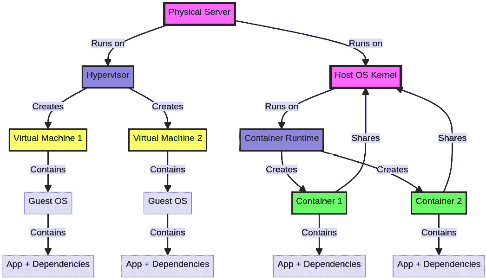

图 10.14 – 容器和虚拟机之间的差异

如我们所见，容器在执行时并不依赖于完整的操作系统，而仅依赖于共享机器资源的运行时，例如网络和处理。然而，它们是独立且隔离地执行的。

容器提供了几个好处：

+   **便携性**：容器封装了所有依赖项，使得在不同环境中移动应用程序变得容易，而不会出现兼容性问题。

+   **一致性**：它们确保应用程序在开发、测试和生产环境中运行的一致性。

+   **可扩展性**：它们可以轻松地扩展或缩减以处理不同的负载，这使得它们非常适合云环境。

+   **效率**：容器有效地共享内核和主机系统资源，与传统的虚拟机相比，具有更低的开销。

要运行容器，需要使用运行时来管理它，就像 ASP.NET Core 9 应用程序一样。最著名的容器运行时是**Docker**。我们将在下一节中了解其基础知识。

## 理解 Docker 基础知识

Docker 是一个开源平台，它自动化了部署、扩展和管理容器化应用程序的过程，提供了一种简单而强大的方式来构建、运输和操作容器。

Docker 提供了三个组件来管理容器：

+   **Docker Engine**：管理容器的运行时

+   **Docker CLI**：用于与 Docker 交互的命令行界面

+   **Docker Hub**：一个基于云的注册服务，用于共享和存储 Docker 镜像，类似于我们如何使用 GitHub 来管理源代码存储库

通过这些工具，Docker 提供了允许我们操作涉及容器开发策略的组件的机制。在这种情况下，容器具有以下组件：

+   **镜像**：镜像可以比作您应用程序当前版本的快照，包括运行应用程序所需的一切。镜像是容器的基础，并使用**Dockerfile**创建，其中包含构建镜像的指令集。

+   **容器**：容器是镜像的运行实例。我们可以将镜像比作一个类，将容器比作这个类的实例。容器由镜像创建并在 Docker Engine 上运行。每个容器与其他容器隔离，并拥有自己的文件系统、CPU、内存和进程空间。

+   **Dockerfile**：Dockerfile 是一个包含一系列构建 Docker 镜像指令的文本文件。它指定了要使用的基镜像、应用程序代码、依赖项以及配置环境所需的任何命令。

+   **容器注册库**：容器注册库是用于存储和分发镜像的仓库。Docker Hub 是一个流行的公共注册库，尽管还有像 Azure Container Registry 这样的私有注册库可用。

Docker 组件及其容器结构之间的关系在*图 10.15*中显示：

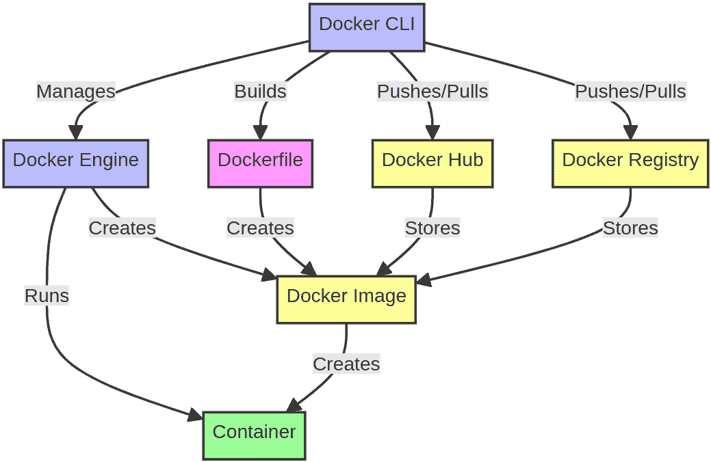

图 10.15 – Docker 及其容器组件之间的关系

如前所述，Docker 是最常用的容器解决方案，但还有其他类型的运行时可用，它们实现了这里介绍的概念。

*表 10.4* 解释了市场上可用的某些容器运行时：

| **运行时** | **描述** | **网站** |
| --- | --- | --- |
| **containerd** | Docker 和 Kubernetes 使用的核心运行时。它侧重于简单性和可移植性。 | [`containerd.io/`](https://containerd.io/) |
| **CRI-O** | 一种轻量级运行时，用于 Kubernetes，实现了 Kubernetes **容器运行时** **接口**（**CRI**）。 | [`cri-o.io/`](https://cri-o.io/) |
| **runc** | 根据 OCI 规范启动和运行容器的 CLI 工具。 | [`github.com/opencontainers/runc`](https://github.com/opencontainers/runc) |
| **Podman** | 一种无守护进程的容器引擎，与 Docker 兼容。 | [`podman.io/`](https://podman.io/) |
| **LXC** | 一种传统的容器运行时，提供类似虚拟机的体验。 | [`linuxcontainers.org/`](https://linuxcontainers.org/) |
| **Kata Containers** | 此运行时通过运行轻量级虚拟机，结合了虚拟机的安全性和容器的速度。 | [`katacontainers.io/`](https://katacontainers.io/) |
| **Rancher** | Rancher Desktop 提供容器和 Kubernetes 管理。 | [`rancherdesktop.io/`](https://rancherdesktop.io/) |

表 10.4 – 容器运行时选项

如我们所见，在环境中运行容器有多种选择，每种解决方案的使用将取决于每个应用程序和组织的需求。然而，值得记住的是，容器包括镜像、其他容器、Dockerfile 和容器注册表，所有这些都被运行时使用。

到目前为止，我们可以将 **UrlShortener** 应用程序打包到容器中。

## 打包 UrlShortener 应用程序

Docker 引擎为我们提供了不同类型的资源和命令来管理容器。我们将关注 **UrlShortener** 应用程序的打包过程，并使用容器的主要功能，包括镜像、容器和容器注册表。

在继续之前，请确保您已按照 *技术要求* 部分安装了 Docker 引擎。

我们的打包过程将通过以下流程进行：

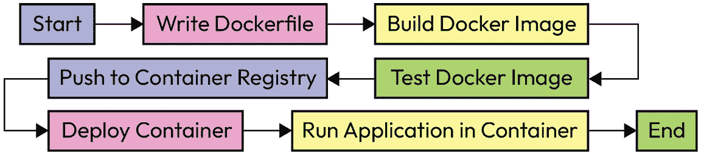

图 10.16 – 容器创建流程

在 Visual Studio Code 中，务必打开 **UrlShortener** 应用程序并执行以下步骤：

1.  在目录的根目录下，创建一个名为 **Dockerfile** 的文件。此文件没有扩展名。

1.  将以下内容添加到文件中：

    ```cs
    FROM mcr.microsoft.com/dotnet/aspnet:8.0 AS base
    WORKDIR /app
    EXPOSE 8080
    FROM mcr.microsoft.com/dotnet/sdk:8.0 AS build
    WORKDIR /src
    COPY ["UrlShortener.csproj", "MyApp/"]
    RUN dotnet restore "MyApp/UrlShortener.csproj"
    COPY . ./MyApp
    WORKDIR "/src/MyApp"
    RUN dotnet build "UrlShortener.csproj" -c Release
      -o /app/build
    FROM build AS publish
    RUN dotnet publish "UrlShortener.csproj" -c Release
      -o /app/publish
    FROM base AS final
    WORKDIR /app
    COPY --from=publish /app/publish .
    ENTRYPOINT ["dotnet", "UrlShortener.dll"]
    ```

1.  保存文件。

    前面的代码有点长，看起来有些复杂，所以让我们理解一下我们的 **Dockerfile** 中的每一行：

    +   **基础镜像和初始配置**：在这个阶段，我们正在配置一个基础镜像，其中包含运行 ASP.NET Core 9 应用程序默认配置。

    +   **FROM mcr.microsoft.com/dotnet/aspnet:8.0 AS base**：此行指定最终容器的基镜像，它使用来自 **Microsoft Container Registry**（**MCR**）的 ASP.NET Core 8.0 运行时镜像。所有 Docker 镜像都以对基镜像的引用开始。**AS base** 标签将此阶段命名为 **base**。

    +   **WORKDIR /app**：此行将容器内部的工作目录设置为 **/app**。所有后续命令都将在此目录中执行。

    +   **EXPOSE 8080**：此行告诉 Docker 容器在运行时将监听端口 **8080**。这用于文档目的，以及在运行容器时配置端口映射。

    +   **构建阶段**：构建阶段将是一个负责编译应用程序的镜像。它将使用已经安装了 .NET SDK 的镜像作为基础。

    +   **FROM mcr.microsoft.com/dotnet/sdk:8.0 AS build**：此行使用来自 MCR 的 .NET SDK 8.0 镜像版本来构建应用程序。**AS build** 标签将此阶段命名为 **build**。

    +   **WORKDIR /src**：将工作目录设置为 **/src**。

    +   **COPY ["UrlShortener.csproj", "MyApp/"]**：将 **UrlShortener.csproj** 项目文件复制到容器中的 **MyApp/** 目录。

    +   **RUN dotnet restore "MyApp/UrlShortener.csproj"**：恢复 **UrlShortener.csproj** 文件中指定的项目依赖项。

    +   **COPY . ./MyApp** : 将主机当前目录中的所有文件复制到容器中的 **MyApp** 目录。

    +   **WORKDIR "/src/MyApp"** : 将工作目录设置为 **/src/MyApp**。

    +   **RUN dotnet build "UrlShortener.csproj" -c Release -o /app/build** : 在 **Release** 配置下构建项目，并将构建结果输出到 **/app/build** 目录。

    +   **发布阶段** : 在此阶段，生成发布包。

    +   **FROM build AS publish** : 这行使用构建阶段作为发布阶段的基础。

    +   **RUN dotnet publish "UrlShortener.csproj" -c Release -o /app/publish** : 这行发布项目，意味着它编译应用程序，复制所有必要的文件，并在 **/app/publish** 目录中生成可部署的应用程序版本。

    +   **最终阶段** : 最终阶段将之前配置生成的包在包含基础镜像设置的镜像上运行。

    +   **FROM base AS final** : 使用基础阶段作为最终镜像的基础。

    +   **WORKDIR /app** : 将工作目录设置为 **/app**。

    +   **COPY --from=publish /app/publish .** : 将发布阶段的 **/app/publish** 目录内容复制到最终阶段的当前目录（**/app**）。

    +   **ENTRYPOINT ["dotnet", "UrlShortener.dll"]** : 设置容器的入口点，以便可以运行 **dotnet UrlShortener.dll** 命令，该命令启动 ASP.NET Core 应用程序。

如前所述，**Dockerfile** 文件中可用的代码使用多个阶段来生成应用程序的镜像。

Docker 构建阶段是 Docker 多阶段构建过程中的一个阶段，其中应用程序被编译，依赖项被还原，所有必需的文件都准备就绪以供部署。在多阶段构建中，每个阶段可以使用不同的基础镜像和环境来执行特定任务。

构建阶段通常使用开发镜像或 SDK 来编译和构建应用程序，生成后续阶段可用的输出工件。这种方法有助于您创建一个干净、优化的最终镜像，该镜像仅包含运行时依赖项和应用程序本身，不包含构建工具或中间文件。

Docker 多阶段构建

Docker 的多阶段构建过程允许您生成优化后的镜像，并使用容器技术来编译和生成可发布的应用程序。要了解更多信息，请访问[`docs.docker.com/build/building/multi-stage/`](https://docs.docker.com/build/building/multi-stage/)。

在观察多阶段方法的流程时，我们可以通过执行我们之前了解的包创建步骤来自动化生成 Docker 图像的过程。在没有使用多阶段过程的情况下也可以生成 Docker 图像。在这种情况下，需要手动编译和生成应用程序包，然后稍后只需将生成的包复制到图像中。这会导致一个类似于以下内容的**Dockerfile**文件：

```cs
FROM mcr.microsoft.com/dotnet/aspnet:8.0 AS base
WORKDIR /app
EXPOSE 8080
COPY ./published .
ENTRYPOINT ["dotnet", "UrlShortener.dll"]
```

通过这样做，**Dockerfile**文件将肯定更简单。然而，在生成图像之前，必须执行**docker build**和**docker publish**命令，以便我们可以生成将要复制到图像中的应用程序包。

现在我们已经了解了生成**Dockerfile**文件的原则，是时候生成一个图像了。

## 生成容器图像

要生成 Docker 图像，需要运行**docker build**命令。此命令将执行**Dockerfile**文件中描述的代码。

要这样做，请打开您的终端，在**UrlShortener**应用程序目录中，执行以下命令：

```cs
docker build -t urlshortener:1.0 .
```

前一个命令使用**-t**参数编译图像，并将其标记为**urlshortener:1.0**。图像标签作为要生成的图像的名称，其形式为**<name_lower_case>[:<version>]**。

版本是可选的。如果没有输入，Docker 将使用最新版本。然而，为图像定义一个版本是良好的实践。

定义图像标签后，编译过程将要执行的环境被告知这一点。环境由**.**参数定义，该参数指示包含**Dockerfile**文件的本地目录。重要的是要记住，**build**命令需要知道**Dockerfile**文件的位置，以便正确执行。

一旦图像生成过程运行完毕，运行以下命令以查看您计算机上的图像列表：

```cs
docker images
```

执行前一个命令后，您将能够查看本地容器注册库中的图像列表，如图*图 10.17*所示：

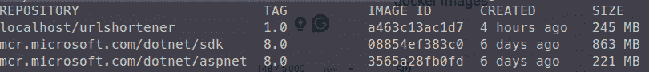

图 10.17 – 本地容器注册库中的 Docker 图像列表

在此示例中，有三个图像：

+   **localhost/urlshortener:1.0**：这是之前生成的包含应用程序的图像。图像名称前的**localhost/**前缀表示图像的所有者——在本例中是本地注册库。

+   **mcr.microsoft.com/dotnet/sdk:8.0**和**mcr.microsoft.com/dotnet/aspnet:8.0**：这些图像分别代表用于在容器中编译和运行应用程序的.NET SDK 和.NET 运行时。这些图像自动从 Docker Hub 下载。注意**mcr.microsoft.com/dotnet**前缀，它指的是图像的所有者。

此外，*图 10.17* 还显示了图像的大小（以 MB 为单位）。应用程序镜像比其他两个都要小。容器必须进行优化，因为它们可能会影响应用程序的性能和启动。

容器镜像应被视为不可变的——也就是说，每个版本都是唯一的。这意味着如果应用程序有任何更改，我们必须使用不同的标签生成一个新的镜像。遵循此约定是一种最佳实践，因为它允许您控制服务器上运行的容器。

生成图像后，是时候运行一个容器并测试其操作了。

## 运行 Docker 容器

要从先前生成的图像运行 Docker 容器，请运行以下命令：

```cs
docker run -d -p 8899:8080 localhost/urlshortener:1.0
```

让我们更仔细地看看这个命令：

+   它从 **localhost/urlshortener:1.0** 镜像运行一个新的容器。

+   它以分离模式（**-d**）运行容器，允许它在后台运行。

+   它将主机上的端口 **8899** 映射到容器内的端口 **8080**（**-p 8899:8080**）。这使得应用程序在容器内运行在端口 **8080** 上，可以通过主机上的端口 **8899** 访问。

成功执行命令的输出将是一个代表容器 ID 的密钥。要检查容器是否正在运行，请运行以下命令：

```cs
docker ps
```

将会显示类似于 *图 10.18* 的输出：

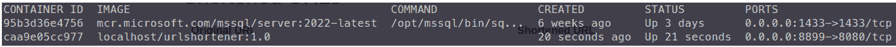

图 10.18 – 运行中的容器

现在，打开您选择的浏览器并访问 [**http://localhost:8899**](http://localhost:8899) 。

连接字符串

如果应用程序的连接字符串已配置为 Azure 中的数据库，并且您通过容器访问应用程序时遇到连接错误，请确保您添加了您的 IP 地址，如 *配置 Azure SQL Server* 部分所示。您还可以通过使用与 **docker run** 命令结合的环境变量来更改连接字符串，如下所示：

**docker run -d -p 8899:8080 -e ConnectionStrings__DefaultConnection="Server=.;Database=UrlShortenerDB;user id=sa;** **password=P4sword123;Encrypt=False;" localhost/urlshortener:1.0**

前面的命令包含 **-e <** **环境变量>=<值>** 参数。

我们可以为相同的镜像多次运行 **docker run** 命令，同时更改容器将在其上运行的宿主端口。例如，以下命令将在端口 **9900** 和 **9910** 上运行相同应用程序的两个新容器：

```cs
docker run -d -p 9900:8080 localhost/urlshortener:1.0
docker run -d -p 9910:8080 localhost/urlshortener:1.0
```

目前，在您的本地环境中，有三个不同的容器运行着相同的应用程序。

要完成运行容器，请执行以下命令：

```cs
docker stop <container ID>
```

您可以通过运行 **docker ps** 命令从正在运行的容器列表中获取容器 ID。

理解 Docker 原理以及如何将你的 ASP.NET Core 9 应用程序打包到容器中对于现代软件开发模型非常重要。容器提供了一致性、可移植性和效率，使它们非常适合云原生应用程序。

正如我们所学的，容器使用与图像等组件有关，这些图像是根据运行时和发布的应用程序生成的。后来，所使用的图像通过公共或私有容器注册库提供。最后，我们可以通过使用图像来运行已发布在容器注册库中的应用程序的不同实例，从而生成一个称为容器的执行应用程序。

接下来，我们将学习如何自动化在云环境中发布应用程序的过程。

# 理解 CI/CD 的 DevOps 方法

深入讨论 DevOps 文化是很常见的。尽管这个术语是两个特定领域的组合——即**开发**（**Dev**）和**运维**（**Ops**）——但这种方法远远超出了这两个团队。

DevOps 文化将流程、人员和工具连接起来，所有这些共同工作以生成价值，并在面对不断的市场需求时提供持续学习：

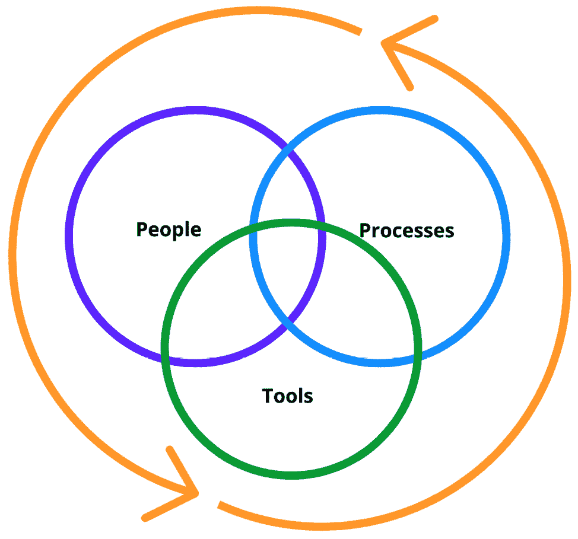

图 10.19 – DevOps 文化周期

*图 10.19* 表示了涉及 DevOps 文化的不同方面的这种持续协作流程。

在 DevOps 文化中建议的实践中，我们有 CI/CD 流程，使开发团队变得敏捷，消除依赖，最小化错误，并使团队能够持续进化和学习。

CI 和 CD 流程通常被称为管道，因为它们代表了一系列顺序指令，允许在这个流程中添加和重新组织新的管道或任务。

在我们查看管道开发模型之前，让我们了解 CI 和 CD 的基本原理。

## CI

CI 是一种开发实践，开发人员定期将他们的代码更改合并到一个中央存储库中，之后会有自动构建和测试。

开发团队是远程分布的，需要一个中央存储库，通常基于 Git。当开发新的代码并更改时，它会同步或集成到本地存储库中。

此过程是异步的——也就是说，每个开发人员在不同时间将他们的代码版本与其他开发人员同步。然后，执行 CI 管道，其主要目标是提前检测集成问题，然后频繁地集成代码更改并通过自动化测试进行检查。

*图 10.20* 展示了一个基本的 CI 管道场景：

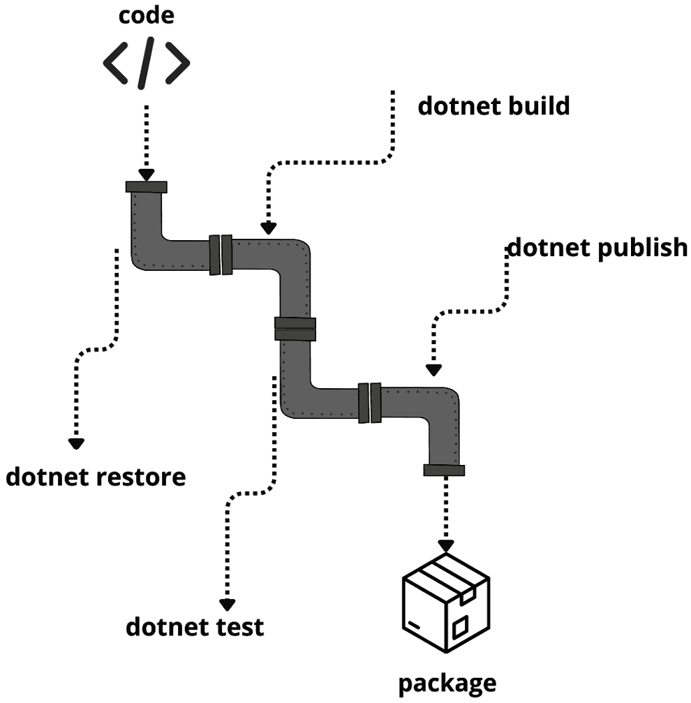

图 10.20 – CI 管道流程

如我们所见，*图 10.20* 展示了我们已经习惯手动执行的流程。自动化这些过程带来了许多好处：

+   **早期错误检测**：通过频繁集成代码更改，CI 帮助我们尽早识别和解决错误和集成问题。

+   **提高代码质量**：在每次集成时运行自动化测试，确保代码更改不会破坏现有功能并保持代码质量。

+   **更快的反馈周期**：开发者可以立即收到关于他们代码更改的反馈，使他们能够立即修复问题并快速迭代。

+   **改进的协作**：CI 通过将不同开发者的代码更改集成到共享仓库中，促进了团队成员之间的协作，确保每个人都在使用最新的代码库。

持续集成（CI）过程的另一个巨大好处是执行代码审查的实践，这允许团队成员分析要集成的代码，并执行良好实践的审查以及是否编写了单元测试，例如。

代码审查方法不断产生学习机会。然而，尽管它是手动完成的，但对于团队的演变来说却极为强大，并且得到了持续集成（CI）的支持，以确保不会对出现编译错误或测试失败的代码进行任何修订。这是一个持续的学习流程，使团队能够在将任何应用程序版本发布到生产环境之前采取主动。

代码审查

代码审查是一个人工审查过程，其中一个或多个开发者审查另一个开发者编写的代码。要了解更多关于这种方法的信息，请查看以下 GitHub 文章：[`github.com/resources/articles/software-development/how-to-improve-code-with-code-reviews`](https://github.com/resources/articles/software-development/how-to-improve-code-with-code-reviews)。

CI 流水线在开发流程中非常重要，因为其主要目标是准备一个符合开发和业务团队定义的质量要求的应用程序包。作为输出，它将此包交付给 CD 过程，该过程执行在一个或多个环境中实施此包的程序。

## CD

CD 是 CI 之后的下一步，它自动化了将应用程序部署到生产环境的过程。

CD 流水线模拟了 CI 中发生的情况，使得在为不同环境（如开发、测试和生产）的新版本应用程序执行自动部署程序之前，可以添加自动化测试等流程。

*图 10* *.21* 显示了 CD 流水线。它与 CI 的流水线非常相似，但它由不同的任务和流程组成：

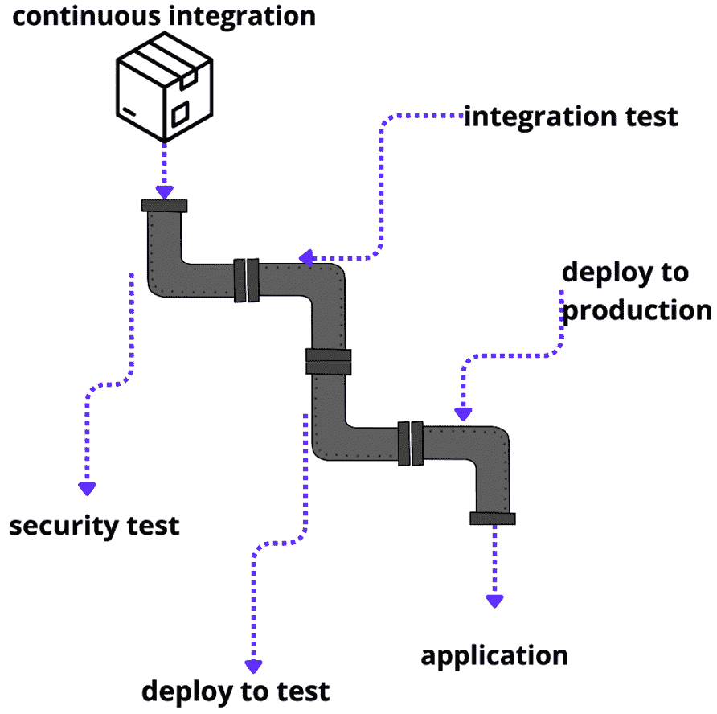

图 10.21 – CD 流水线流程

虽然 CI 流水线基于开发过程的质量流程生成有效的包，但 CD 流水线的主要目标是获取通过 CI 流水线生成的包，并在本地或云环境中进行分发。

CD 流水线带来了以下好处：

+   **加速交付**：CD 能够加快新功能和错误修复的交付速度，缩短上市时间并提高客户满意度。

+   **降低部署风险**：通过部署小的、增量更改，CD 最小化了与大型、不频繁部署相关的风险。

+   **一致的部署**：自动化部署过程确保部署是一致和可重复的，减少了人为错误。

+   **提高可靠性**：持续监控和自动回滚机制提高了部署过程的可靠性。

虽然 CD 管道是一个自动化流程，这意味着它能够自动在不同环境中发布应用程序的新版本，但可以建立审批流程，让每个环境的负责人可以选择是否批准部署。审批行为会根据需要触发自动部署流程或取消它。

批准门控方法带来了合规性好处，并允许团队在特定环境中完全控制部署流程。

审查部署

根据每个组织的交付流程，需要审查部署，尤其是在生产环境中。这种方法在 CD 管道和审查者之间生成一个自动的通信过程。GitHub、Azure DevOps、GitLab 等工具都有允许你配置此审批流程的机制。你可以在 GitHub Actions 中了解更多关于部署审查过程的信息，请参阅[`docs.github.com/en/actions/managing-workflow-runs/reviewing-deployments`](https://docs.github.com/en/actions/managing-workflow-runs/reviewing-deployments)。

CI 和 CD 是自动化流程的绝佳方法，以确保我们的应用程序可以持续且高质量地交付到不同的环境。这是允许我们在同一天多次交付应用程序版本的事情，同时它还帮助我们快速在这些环境中提供纠正和回滚，如果需要的话。

在下一节中，我们将使用 GitHub Actions 实现 CI/CD 流程，并学习如何自动在容器注册库中发布 Docker 镜像。

## 使用 GitHub Actions 进行自动化

为了展示 CI/CD 的实际应用，我们将使用 GitHub Actions 来自动化从**UrlShortener**应用程序生成和发布 Docker 镜像的过程。确保你已经安装了*技术要求*部分中提到的所有内容，以便你可以利用这里描述的步骤。

为了自动化包含 CI/CD 的过程，我们需要做以下几步：

1.  在 GitHub 仓库中配置密钥。

1.  创建 GitHub Actions。

1.  每次向仓库发送的推送事件都激活 GitHub Actions。

1.  构建 Docker 镜像。

1.  将创建的镜像发布到 Docker Hub。

1.  在本地机器上运行之前创建的 Docker 镜像。

在开始自动化之前，你必须了解 GitHub Actions 的基本知识。

### 理解 GitHub Actions 的基础知识

GitHub Actions 是一个内置在 GitHub 中的自动化工具，它允许你直接在你的仓库中创建、管理和运行工作流程。

如同通常所知，动作可以通过各种事件触发，例如代码提交、拉取请求创建或时间触发器。

可以使用位于本书 GitHub 仓库 **.github/workflows** 目录中的 **YML/YAML** 文件结构创建 GitHub Actions。工作流程的基本结构在 *图 10.22* 中以高层次表示：

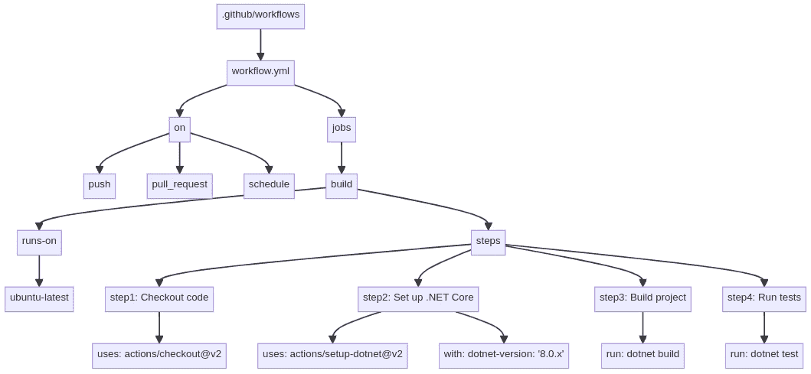

图 10.22 – GitHub Actions 的基本结构

YAML 文件

一个 **YAML Ain’t Markup Language** ( **YAML** ) 文件是一种人类可读的数据标准，通常用于配置文件和在不同数据结构之间交换编程语言的数据。YAML 文件使用缩进来表示结构，这使得它们易于阅读和编写。它通常用于需要人类可读性和易于机器解析的场景，例如在 CI/CD 管道、云配置文件和应用程序配置设置中。在 GitHub Actions 的上下文中，YAML 文件定义了自动化构建、测试和部署应用程序等流程的工作流程。要了解更多信息，请访问 [`docs.github.com/en/actions/using-workflows/workflow-syntax-for-github-actions`](https://docs.github.com/en/actions/using-workflows/workflow-syntax-for-github-actions)。

*图 10.22* 显示了 GitHub Actions 结构中的一部分主要组件。让我们更仔细地看看：

+   **workflow.yml**：一个定义工作流程的 YAML 文件。

+   **on**：这指定了触发工作流程的事件。例如包括 **push**、**pull_request** 和 **schedule**。

+   **作业**：定义了在工作流程中要执行的一组作业。

+   **构建作业**：一个名为 **build** 的作业，在 **ubuntu-latest** 上运行。在这里，**ubuntu-latest** 是一种代理或机器，它将执行作业的所有步骤。这台机器由 GitHub 本身提供。

    此流程包含一系列步骤：

    +   **检出代码**：使用 **actions/checkout@v2** 动作。

    +   **设置 .NET Core**：使用 **actions/setup-dotnet@v2** 动作，.NET 版本为 **'8.0.x'**。

    +   **构建项目**：运行 **dotnet build** 命令。

    +   **运行测试**：运行 **dotnet test** 命令。

GitHub 主机运行器

在 GitHub 上，代理被称为运行器，并且适用于 Windows、Linux 和 macOS。

运行器是运行 GitHub Actions 的基本组件，并在 CI 或 CD 管道中配置。

要了解更多关于运行器的信息，请访问 [`docs.github.com/en/actions/using-github-hosted-runners/about-github-hosted-runners/about-github-hosted-runners`](https://docs.github.com/en/actions/using-github-hosted-runners/about-github-hosted-runners/about-github-hosted-runners)。

使用 GitHub Actions，我们有多种自动化流程的可能性，这些流程不仅限于 CI/CD 上下文。

现在我们已经了解了 GitHub Actions 的工作原理，让我们首先配置我们的仓库并创建我们的第一个操作。

### 准备 GitHub 仓库

要通过 GitHub Actions 自动化创建和发布 Docker 镜像的过程，了解我们将创建的管道如何工作是很重要的，如图 10.23 所示：

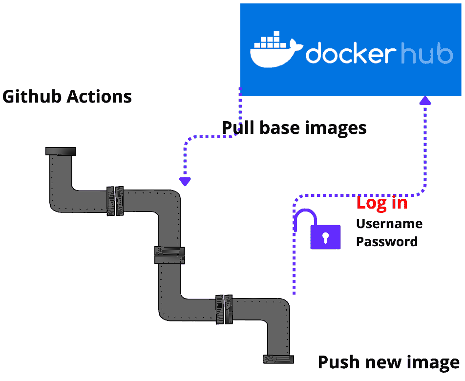

图 10.23 – GitHub Actions 与 Docker Hub 集成的示例

此前，我们学习了使用 Docker 时的容器策略基础，并使用 Docker 的构建多阶段方法来实现它。

这种多阶段方法包含了生成应用程序包所需的所有步骤，最终生成一个可以使用的镜像。

如图 10.23 所示，在管道流程中，需要调用 Docker Hub 进行一些操作。这是我们打包**URLShortener**应用程序时使用的公共容器注册库。然而，我们可以在不需要与 Docker Hub 通信的情况下生成本地镜像。

要能够将 Docker 镜像发布到公共或私有容器注册库，必须执行身份验证。

在 Docker Hub 的情况下，这种身份验证是通过用户名和密码进行的。由于这些信息是敏感的，我们不应将其直接添加到 GitHub Actions YAML 文件中，尤其是如果仓库是公开的。

最佳实践是使用秘密安全地管理这些凭证。因此，按照以下步骤添加必要的秘密：

1.  通过您的 GitHub 用户访问您的**ASP.NET-8.0-Core-Essentials**仓库。这应该按照**技术****要求**部分准备。

1.  然后，访问**设置**标签页。

1.  从侧边菜单，访问**秘密和变量**|**操作**。

1.  在屏幕中央，点击**新建仓库****秘密**按钮。

1.  将**名称**字段设置为**DOCKER_HUB_USERNAME**。

1.  在**秘密**字段中，添加您的 Docker Hub 用户。

1.  点击**添加****秘密**按钮。

1.  再次，点击**新建仓库****秘密**按钮。

1.  将**名称**字段设置为**DOCKER_HUB_PASSWORD**。

1.  将**秘密**字段设置为您的密码。

1.  点击**添加****秘密**按钮。

在运行 GitHub Actions 时，秘密将被安全访问。现在，让我们创建 CI/CD 管道。

### 创建 CI/CD 管道

到目前为止，我们已经学习了如何安全地管理 Docker Hub 凭证，这是我们将在管道中进行身份验证并提交新生成的镜像所必需的。

仍然在 GitHub 仓库中，访问**操作**标签页。如图 10.24 所示，有几个现成的管道模板适用于不同类型的应用程序，是创建管道的一个很好的起点：

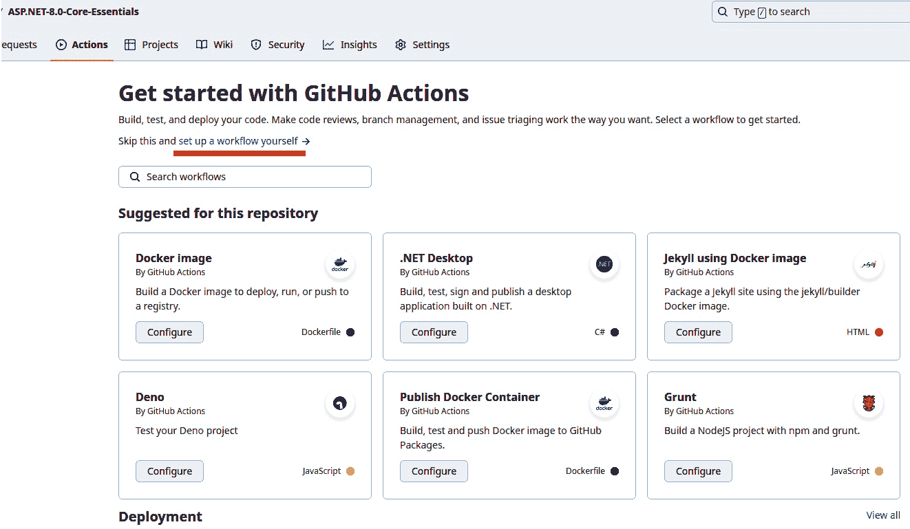

图 10.24 – GitHub Actions 模板屏幕

对于这个例子，我们将点击*图 10.24*中突出显示的**设置自己的工作流程**链接。

您将看到一个编辑器、一个**特色动作**列表以及文件名，如*图 10.25*所示：

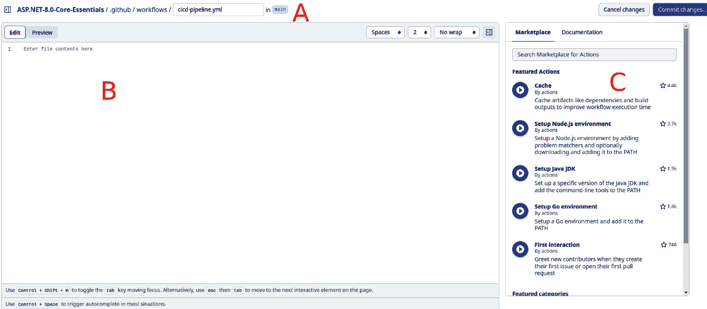

图 10.25 – GitHub Actions 编辑器

*图 10.25*显示了 GitHub Actions 编辑器的三个重要区域：

+   **A**：这是您可以定义文件名的地方。注意建议的目录结构。我们将文件名设置为**cicd-pipeline.yml**。

+   **B**：这是我们添加管道代码的地方。

+   **C**：管道由称为动作的任务组成。这些动作是执行与特定技术相关的任务的抽象。技术社区共享不同类型的自定义动作，我们可以使用。

将以下代码添加到管道编辑器中：

```cs
name: CI/CD Pipeline
on:
  push:
    branches:
      - main
jobs:
  build-and-deploy:
    name: Build and deploy
    runs-on: ubuntu-latest
    steps:
    - name: Checkout code
      uses: actions/checkout@v4.1.7
    - name: Build and publish Docker image
      run: |
        docker build -t ${{ secrets.DOCKER_HUB_USERNAME }}
          /urlshortener:latest .
        echo ${{ secrets.DOCKER_HUB_PASSWORD }} |
          docker login -u ${{ secrets
          .DOCKER_HUB_USERNAME }} --password-stdin
        docker push ${{ secrets.DOCKER_HUB_USERNAME }}
          /urlshortener:latest
      working-directory: ./Chapter-10/UrlShortener
```

YAML 文件的层次结构是通过空格创建的。因此，嵌套元素定义了层次结构。如果不尊重这些空格，文件将无效。以下示例显示了在层次结构中的每个项目使用两个空格：

```cs
on:
<space><space>push:
<space><space><space><space>branches:
<space><space><space><space><space><space>-main
```

让我们更仔细地看看这个管道代码：

+   **on**：这定义了动作的执行方式。在这种情况下，每当主分支有更新或推送时，此动作将被触发，执行 CI 管道。

+   **作业**：作业是按顺序执行的过程。可能有用于**构建**、**测试**、**生成包**等作业。使用**作业**允许我们拥有定义良好的步骤和步骤之间的依赖关系，从而创建管道流程。

+   **build-and-deploy**：这是名为**build-and-deploy**的作业的定义。**name**参数在管道执行期间产生一个更用户友好的描述，但可以在管道流程中引用作业的名称。

+   **步骤**：步骤是在每个作业中执行的任务或动作。对于这个例子，只需要执行两个任务。

+   **uses: actions/checkout@v4.1.7**：这是一个旨在克隆存储库的本地 GitHub 动作。由于运行器是按需创建的，并且没有应用程序的源代码，因此**checkout**动作是必要的。

+   **name: Build and publish Docker image**：在这里，我们执行一个内联动作，其中定义了一个构建和发布 Docker 镜像的脚本。

+   **docker build -t ${{ secrets.DOCKER_HUB_USERNAME }} /urlshortener:latest .**：此脚本构建 Docker 镜像。注意使用包含 Docker Hub 用户名的秘密。这是必要的，以便我们可以用其所有者的标签标记镜像——即 Docker Hub 用户名。我们在这里使用**latest**标签以方便理解。

+   **echo ${{ secrets.DOCKER_HUB_PASSWORD }} | docker login -u ${{ secrets.DOCKER_HUB_USERNAME }} --password-stdin**：此命令在 Linux bash shell 中执行，允许我们通过从先前执行的命令获取输入和输出来组合命令并执行其他命令。在这种情况下，我们正在写入包含 Docker Hub 用户密码的秘密，并将输出作为参数发送到**docker login**命令。这样，秘密就不会在管道执行日志中暴露。**docker login**命令是发布新版本镜像所必需的。

+   **working-directory: ./Chapter-10/UrlShortener**：包含**Dockerfile**文件的目录。

+   **docker push**：**docker push**命令将先前生成的镜像提交到 Docker Hub。

通过这种方式，管道已经配置完毕，并包含 CI 和 CD 管道，在管道的末尾发布 Docker 镜像的新版本。此时，是时候运行创建的 GitHub 操作了。

### 运行 CI/CD 管道

在管道编辑器中，点击**提交更改**按钮。您将被带到新页面，在那里您必须再次点击**提交更改**。这是必要的，因为我们正在在存储库中创建一个新文件。

当您提交这些更改时，管道将自动触发。

点击**操作**选项卡；您将看到管道的执行，如图*图 10* *.26* 所示：

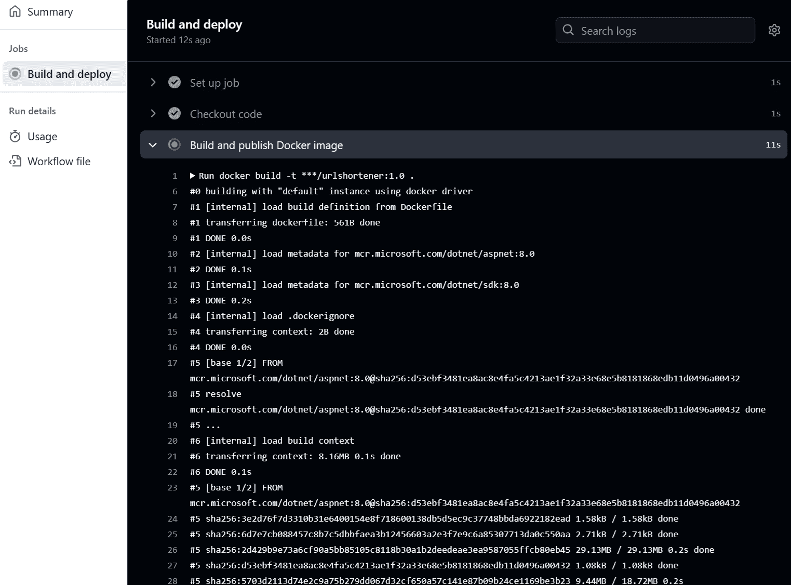

图 10.26 – 运行 GitHub 操作

运行管道后，新镜像将在 Docker Hub 中生成，如图*图 10* *.27* 所示：

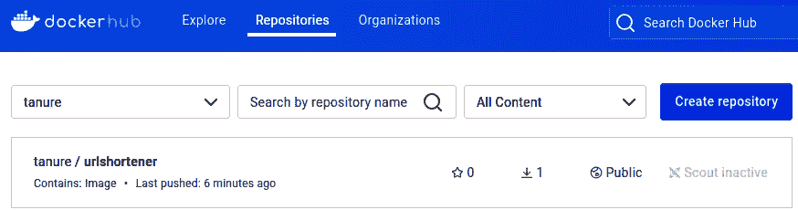

图 10.27 – GitHub Actions 在 Docker Hub 上发布的容器镜像

要在本地机器上测试新镜像，请运行以下命令：

```cs
docker run -d -p 7777:8080 -e ConnectionStrings__DefaultConnection="<Your Connection String>" <your username>/urlshortener:latest
```

新镜像将被下载，这意味着您可以在本地机器上运行应用程序，地址为[`localhost:7777`](http://localhost:7777)。

正如我们所学的，GitHub Actions 可以自动化 CD 环境中的任务。这带来了敏捷性和一致性，并允许团队在面对市场对持续变化的需求时迅速行动。

在此阶段，对您的存储库所做的任何更改并提交到 GitHub 都将自动为您的 Docker Hub 用户生成一个新的容器版本。

GitHub Actions 有多个应用，与 ASP.NET Core 9 中开发的解决方案一起，它是一个创建高质量应用程序的强大工具。

在本节中，我们学习了在持续的价值交付流程中工作的基础知识。我们将在下一章探讨如何获得云原生应用程序开发的心态。

# 摘要

在本章中，我们学习了如何使用**dotnet** CLI 工具发布 ASP.NET Core 9 应用程序并生成发布包。此外，我们还学习了如何在 Azure 云环境中发布应用程序，并探讨了 Docker 容器策略的基础。利用我们所获得的知识，我们能够了解价值交付如何通过 CI 和 CD 等 DevOps 实践流动，并从 GitHub Actions 的自动化流程中受益。本章所获得的所有知识构成了下一章的基础，我们将学习如何使用 ASP.NET Core 9 进行云原生开发。
