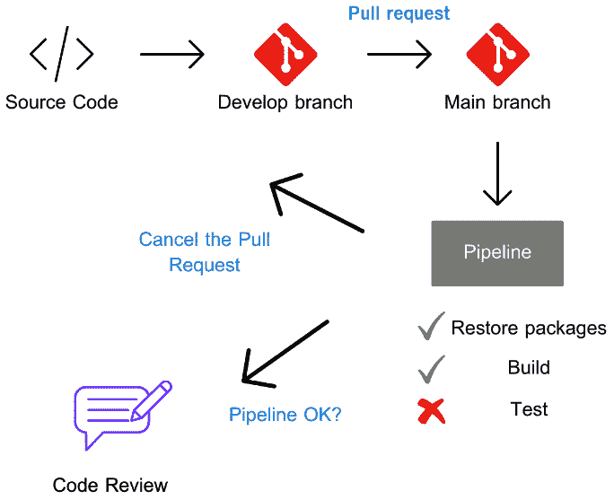

# 11

# 使用 ASP.NET Core 9 进行云原生开发

现代应用程序被设计成在云环境中运行并利用提供的各种功能，如敏捷性、可伸缩性、可用性和弹性。ASP.NET Core 9 为我们提供了一套强大的工具，使我们能够开发高质量解决方案。然而，了解与云原生开发模型相关的模式和最佳实践同样重要。

在本章中，我们将学习与云环境中托管的应用程序相关的重要方面，探讨模式、最佳实践、云原生应用程序开发所需的心态、十二要素应用的原则以及架构设计原则，以便您能够充分利用您的云环境。

在本章中，我们将重点关注以下主题：

+   培养云原生心态

+   使用云原生工具

+   十二要素应用的原则

+   理解云架构原则

# 技术要求

本章中使用的代码示例可以在本书的 GitHub 代码库中找到：[`github.com/PacktPublishing/ASP.NET-Core-9.0-Essentials/tree/main/Chapter11`](https://github.com/PacktPublishing/ASP.NET-Core-9.0-Essentials/tree/main/Chapter11)。

为了充分利用本章中提出的所有示例，您需要将本书的代码库进行分支。分支是 GitHub 上的一项功能，它可以将代码库复制出来，以便 Git 用户进行管理。您可以通过以下网址了解如何分支一个代码库：[`docs.github.com/en/pull-requests/collaborating-with-pull-requests/working-with-forks/fork-a-repo`](https://docs.github.com/en/pull-requests/collaborating-with-pull-requests/working-with-forks/fork-a-repo)。

# 培养云原生心态

每年云计算都会带来新的创新：总有新的功能带来新的可能性，以及希望以新的方式向用户交付价值的公司。

在前面的章节中，我们学习了各种工具、模式和最佳实践，并与云资源进行了交互。即使在考虑最佳实践和标准的情况下构建的应用程序，它们是否能够充分利用云环境提供的所有功能？

即使在今天，仍有许多组织在私有环境中（本地）运行应用程序，这带来了许多好处。因此，在这些环境中开发的应用程序具有有限的可伸缩性，并且需要承担购买服务器和聘请合格专业人员维护它们的高昂成本。在这种解决方案模型中，计算资源有限，但同时也为公司带来了更大的控制权、合规性和安全性。

云似乎为组织提供了一种增强计算能力的替代模型，但同时也带来了其他挑战，包括在开发模型和流程中。

要使用云模型，我们需要了解其工作原理、服务层、必要的投资以及如何将我们的应用程序适配到原生云模型。

让我们从查看云环境中提供的服务层开始。

## 理解云环境中的服务层

也许你已经听说过**CapEx**和**OpEx**，以及这两个词在商业世界中的重要性：

+   **资本支出** ( **CapEx** )：CapEx 不是一个仅限于 IT 领域的术语，而是一个与资产相关支出或投资的财务术语。计算很简单：如果需要更多服务器来支持用户需求，CapEx 就会发挥作用，并涉及服务器投资成本、服务器安装的物理位置、电力、不间断电源（UPS）等。

+   **运营支出** ( **OpEx** )：OpEx 指的是日常运营的持续成本。这包括服务、公用事业、租金、软件许可以及其他运营活动，如员工工资。

观察这些概念，每个组织都需要反思其投资、成本和专业人员，以保持竞争力。

当转向涉及云计算的方法时，从 CapEx 到 OpEx 的转变就会发生。这种变化有几个影响：

+   **降低前期成本**：采用云服务减少了在物理硬件和基础设施上的大量前期投资需求。相反，组织只需为使用的云服务付费。

+   **可伸缩的成本**：云服务提供按使用付费的模式，允许组织根据需求调整其使用和支出。

+   **运营灵活性**：能够快速适应业务需求的变化，而不依赖于硬件投资。

+   **维护和更新**：云服务提供商，如 Azure，提供基础设施维护、更新和安全服务，减轻了组织 IT 团队的操作负担，使他们能够专注于战略举措。

然而，在云中运行服务并不意味着成本会降低，因为存在按使用付费的模式。就像任何工具或策略一样，如果不正确使用，云可能会给组织带来重大问题。

云服务提供商，如 Azure，负责提供计算服务的整个基础设施；然而，与使用这些服务的组织之间存在共同管理。这种服务模式非常重要，需要理解。

在云计算模型中，组织将精力集中在他们的产品和服务上，并从与云提供商的共同管理中受益。组织在决定他们想要的服务模型时，基本上有三个选择：


图 11.1 – 云计算服务提供

如*图 11.1*所示，我们有以下类型的服务层：

+   **基础设施即服务 (IaaS)**：提供虚拟化计算资源，公司可以动态配置虚拟机、存储和网络。它是在地迁移到云的常见采用模型。

+   **平台即服务 (PaaS)**：提供一个平台，该平台抽象化基础设施，使组织和开发团队能够专注于解决方案和数据。我们在*第十章*中发布 Azure App Service 应用程序时使用了 PaaS 资源。

+   **软件即服务 (SaaS)**：基于订阅提供软件应用程序，例如流媒体应用程序和 Microsoft 365 应用程序。

云服务是云原生开发的关键组件，有助于定义迁移策略、成本优化、可扩展性、弹性、安全性和部署。

为了了解我们应如何调整我们的工具和开发流程并从云计算的强大功能中受益，从最佳实践开始是非常重要的。

## 云原生开发最佳实践

微软在 Azure 中提供了广泛的文档和强大的服务，其中可以使用不同的技术托管应用程序，当然，还包括在 ASP.NET Core 9 中开发的解决方案。

除了记录 Azure 中可用的资源外，开发团队了解**云采用框架**（**CAF**）和**架构良好框架**（**WAF**）非常重要。这两个资源有不同的用例，并帮助团队应对云环境带来的各种挑战。

让我们简要了解这些功能中的每一个。

### The CAF

微软的 CAF 拥有一套优秀的文档、实施指南、最佳实践和工具，旨在帮助组织规划和执行其云采用战略。

CAF 基本上包括七个阶段：

1.  **策略**：定义业务成果，建立云采用计划，并优先考虑迁移的工作负载。

1.  **规划**：评估您的当前数字资产，创建云采用计划，并确定所需技能和资源方面的差距。

1.  **准备**：通过配置包括治理、安全和管理工作在内的着陆区来准备云采用环境。

1.  **迁移**：使用工具和方法将工作负载迁移到云，确保平稳过渡。

1.  **创新**：开发新的云原生应用程序或现代化现有应用程序以充分利用云功能。

1.  **治理**：实施治理最佳实践以确保合规性、管理风险并建立安全控制。

1.  **管理**：操作和管理云环境，使用监控和管理工具确保性能、可靠性和成本效率。

CAF

CAF 拥有广泛的文档和资源，这些资源应该是软件工程师日常生活的组成部分。要了解更多信息，请访问[`learn.microsoft.com/en-us/azure/cloud-adoption-framework/`](https://learn.microsoft.com/en-us/azure/cloud-adoption-framework/)。

CAF 旨在帮助组织采用云原生思维，强调规划、治理和持续改进的重要性，确保云采用与业务目标一致。

CAF 是知识宝库，通常，其重点并不完全在于一个应用程序（或工作负载，如它们通常被称为），而是在于一般性地构建整个环境。然而，它可以作为知识库和规划新工作负载的绝佳来源，因为它涉及业务团队、开发、基础设施和整个持续交付流程。

除了 CAF，在定义云环境中的应用架构模型时，还必须考虑另一个非常重要的资源。

### WAF

WAF 是由微软提供的一套能力，包含设计、构建和运营安全、高性能、弹性且高效的云应用程序基础设施的最佳实践、原则和架构指导。WAF 分为五个支柱：

1.  **运营卓越**：这个支柱侧重于保持应用程序平稳高效运行的运营流程。这包括监控、自动化和事件响应。

1.  **安全性**：这个支柱确保应用程序和数据免受威胁。它涵盖了身份管理、基础设施保护、数据加密和威胁检测。

1.  **可靠性**：这个支柱确保应用程序能够从故障中恢复并继续按预期运行。这包括灾难恢复策略、容错和数据备份。

1.  **性能效率**：这个支柱确保应用程序高效地使用资源，并且可以扩展以满足需求。它包括容量规划、资源优化和性能监控。

1.  **成本优化**：这个支柱侧重于在提供最佳性能和价值的同时有效管理成本。这包括成本监控、使用分析和实施成本降低策略。

了解更多关于 WAF

WAF 不仅提供了包含与五个支柱相关的策略和最佳实践的出色文档，还提供了工具，例如**评估**，可以分析现有的云工作负载以改进它们，清单和其他许多资源。要了解更多关于 WAF 的信息，请访问[`learn.microsoft.com/en-us/azure/well-architected/`](https://learn.microsoft.com/en-us/azure/well-architected/)。

之前提出的每个支柱都支持云原生思维模式，为每个工作负载提供清晰和实用的指南。这使得团队能够从不同角度分析解决方案，并通过满足组织目标（如成本优化）的高质量解决方案充分利用云环境。

## 超越代码开发

为了实现云原生解决方案的思维模式，作为软件工程师，我们必须准备好超越代码开发的边界。

DevOps 文化带来了一种协作模式，这种模式不仅限于不同团队的有效沟通，还扩展到知识、标准和最佳实践的共享。

运维团队通过使用基础设施即代码、GitHub 仓库甚至流水线等技术，已经适应了代码开发模型。

同样，学习与网络、基础设施、安全和数据相关的概念也很重要。这将在最佳利用云环境的解决方案的架构设计和开发中产生重大差异，并有助于形成云原生思维模式。

现在我们已经了解了与云计算相关的挑战，是时候学习云原生工具了。

# 使用云原生工具

在日益竞争激烈的市场中，敏捷和快速交付解决方案已经成为成功的同义词。

云原生方法与敏捷性和速度相关联，允许团队创建解决方案，并通过松散耦合、弹性、管理和可观察性添加服务层和功能层。

然而，当我们谈到开发云原生应用时，我们必须理解敏捷性和速度之间的关系。敏捷并不意味着快速，快速也不一定意味着敏捷。这完全改变了我们思考解决方案的方式。

假设你的团队收到了一个创建 API 的请求，该 API 的目的是提供在线商店中可销售产品的数据，如图 *图 11.2* 所示：


图 11.2 – 在线商店消费产品 API

在 *图 11.12* 所示的示例中，产品 API 将是一个 ASP.NET Core 9 应用程序，包含良好的层和包分离实践——假设它托管在 Microsoft Azure 上。从应用程序的角度来看，所有预期的 API 功能很可能都已根据功能和非功能需求实现。还预期质量过程已经得到满意地执行，如图 *图 11.3* 所示：


图 11.3 – 开发和发布流程

*图 11.3* 展示了一个软件开发过程的常见场景，涉及任务管理、需求、编码、部署和应用程序维护。

主要目标是快速满足市场需求，即缩短交付价值的时间。

领先时间越短越好。为了使团队和组织能够在敏捷性和速度之间取得良好的平衡，了解*图 11.3*中所示每个流程步骤中的因素非常重要。

在某个环境中开发和交付的应用程序不一定是云原生解决方案。作为软件工程师，我们必须超越编译代码后生成的工件，并准备应用程序以便充分利用云环境并处理不断增长的用户需求，我们必须准备好在不同的知识领域采取行动。

因此，云原生解决方案必须基于以下因素：

+   基础设施

+   现代设计

+   DevOps

+   支持服务

+   容器和编排器

+   微服务

这些因素可以用以下图表表示：


图 11.4 – 云原生因素

这些因素是云原生解决方案发展的基础，并且必须持续工作，因为服务需求和市场需求的变化是持续的。

在*图 11.4*中，我们可以注意到的一个重要因素是，这些因素与特定的云提供商（如 Azure、AWS 或 GCP）之间没有关系。相反，云原生模型是一个供应商无关的范式，因此，与通常炒作技术的情况相反，存在一系列的采用模式、定义和最佳实践，这些由**云原生计算基金会**（**CNCF**）维护。

## 了解 CNCF

CNCF 是 2015 年在 Linux 基金会范围内创建的一个联盟。它涉及超过 400 家公司，旨在在技术、标准和最佳实践之间建立一种共同语言，独立于供应商。CNCF 旨在通过汇集开发者、最终用户和供应商的社区来构建可持续的云原生软件解决方案生态系统。

CNCF 推广云原生技术，支持并维护那些使容器化、微服务和动态编排等实践得以采用的项目，促进开放标准和最佳实践，并允许云原生应用程序以互操作的方式工作。此外，CNCF 通过培养贡献者社区并维护一个中立的环境来支持创新，以促进前沿云原生工具和项目的发展。

CNCF 的重要资源之一是技术景观，它是一个视觉表示和交互式指南，以分类方式映射云原生生态系统，展示了一系列工具、项目和与 CNCF 使命相关或属于 CNCF 的技术。

CNCF 的生态系统

CNCF 的景观是组织和专业人士的优秀资源，帮助您了解可用的技术和工具选项，它们之间的关系以及它们在云原生生态系统中的作用。要了解更多关于 CNCF 景观的信息，请访问以下网址：[`landscape.cncf.io`](https://landscape.cncf.io)。

为了了解我们如何利用 CNCF 的优势，让我们看看一个托管在 Microsoft Azure 上的 ASP.NET Core 9 解决方案的开发场景。

## 与 CNCF 合作

想象以下场景：

*您正在使用 ASP.NET Core 9 开发一个 Web 应用程序，该应用程序托管在 Azure 上。您希望确保您的应用程序是按照云原生原则开发的，并且利用了可用的最佳工具进行部署、监控和管理工作。*

让我们看看 CNCF 的使用如何支持我们在以下场景中定义应用程序架构和开发：

+   **容器化策略**：基于上一章获得的知识，您选择使用 Docker 并将您的 ASP.NET Core 9 应用程序容器化。为了回顾，Docker 是由 CNCF 形成的一个项目，允许您将应用程序及其依赖项打包到容器中，确保在不同环境中的一致性。

    +   这些是好处：

        +   确保应用程序在开发、测试和生产环境之间的一致性

        +   简化依赖管理和隔离

+   **容器编排**：为了使此应用程序托管，您决定使用 Kubernetes，这是另一个 CNCF 毕业项目，用于容器编排。**Azure Kubernetes Service**（**AKS**）在 Azure 中提供了一个托管的 Kubernetes 环境，使得部署、管理和扩展您的容器化应用程序变得容易。AKS 使用 CNCF 为 Kubernetes 定义的相同标准，但抽象了创建集群的复杂性，并提供了几项其他服务。

    +   这些是好处：

        +   管理容器生命周期、扩展和负载均衡

        +   确保高可用性和弹性

+   **自动化**：您决定使用 CI/CD 工具，如 Jenkins 或 GitHub Actions，来自动化您的构建、测试和部署流程。这些工具确保您的代码更改持续集成和部署，从而提高您的开发工作流程。

    +   这些是好处：

        +   自动化部署过程，确保一致性并降低人为错误的风险

        +   加速开发周期，实现持续集成和部署

+   **监控和日志记录**：作为云原生解决方案软件工程师，完成开发、执行持续集成和实现持续部署只是项目工作的第一步。重要的是要整合可观察性工具，如**Prometheus**和**Grafana**，这两个都是 CNCF 孵化项目，以监控您应用程序的性能和健康状况。Prometheus 收集指标，Grafana 将其可视化，为您提供有关应用程序行为的洞察。Azure Monitor 也是 CNCF 生态系统中特色的可观察性工具。此外，其他类型的工具，如由 CNCF 孵化的**OpenTelemetry**，对于应用程序来说，拥有一个无厂商依赖的收集器是一个很好的选择，这可以减少应用程序对专有库的依赖。

    +   这些是好处：

        +   为您的应用程序提供实时监控和警报

        +   帮助您快速诊断和解决性能问题

利用 CNCF 及其生态系统，为开发、部署和管理云原生应用程序提供了众多工具和最佳实践。通过采用这些工具，在 Azure 上托管 ASP.NET Core 9 应用程序的软件工程师可以确保他们的应用程序是可扩展的、有弹性的和可维护的。使用 Docker 容器化、使用 Kubernetes 进行编排、使用 Prometheus 和 Grafana 进行可观察性，以及使用 Jenkins 或 GitHub Actions 进行自动化的 CI/CD 管道，只是 CNCF 项目如何增强您的云原生开发工作流程的几个例子。

然而，之前提到的场景提供了一个与 Azure 无关的解决方案模型，这使得它可以在不同的云提供商上托管，因为提到的每个工具都遵循 CNCF 为无云提供商解决方案制定的标准。

定期访问 CNCF 网站，了解云模型的新闻和变化，并分析 CNCF 生态系统中可用的工具，以满足您解决方案的需求，这一点非常重要。这些资源将帮助您创建越来越强大的解决方案，以适应您组织和市场不同的需求。

我们知道 CNCF 是一个重要的资源，它为云原生解决方案设定了标准，应该被添加到任何软件工程师的工具箱中。此外，还有一些其他原则，以实际的方式指导我们在开发云原生解决方案的过程。ASP.NET Core 9 可以帮助我们实现这些原则，例如**十二要素应用方法**。我们将在下一节中讨论这些原则。

# 十二要素应用原则

十二要素应用方法（[`12factor.net`](https://12factor.net)）是一套最佳实践，旨在帮助开发者构建现代、可扩展和可维护的云原生应用程序。它是由 Heroku 开发者创建的，旨在为开发可以部署和管理的云应用程序提供框架。

Heroku

根据网站自身的定义，Heroku 是一个云平台，允许公司创建、交付、监控和扩展应用程序。

Heroku 是一个成立于 2007 年的云平台即服务（PaaS），允许开发者以简化的方式在云中构建、运行和操作应用程序。了解更多信息，请访问 [`www.heroku.com/home`](https://www.heroku.com/home)。

如其名所示，十二要素应用方法包含十二个要素或原则：

1.  **代码库**：使用版本控制跟踪的代码库。

1.  **依赖项**：明确声明并隔离依赖项。

1.  **配置**：将配置存储在环境中。

1.  **后端服务**：将支持服务视为附加资源。

1.  **构建、发布、运行**：严格分离构建和运行阶段。

1.  **进程**：以一个或多个无状态进程运行应用程序。

1.  **端口绑定**：通过端口绑定导出服务。

1.  **并发**：通过进程模型进行扩展。

1.  **可处置性**：通过快速启动和平稳关闭最大化鲁棒性。

1.  **开发/生产一致性**：尽可能保持开发、预发布和生产环境的相似性。

1.  **日志**：将日志视为事件流。

1.  **管理流程**：作为单个进程执行管理/管理任务。

让我们更详细地了解所提到的每个要素。

## 代码库

在解决方案开发周期中，你应该在远程仓库中维护源代码，例如基于 Git 的仓库。

代码库要素意味着每个应用程序上下文都应该有一个代码库，这有助于正确分离责任并提高代码管理。

*图 11.5* 描述了应用程序不同上下文的管理，例如配置、源代码和基础设施脚本。这些上下文可以在开发流程的不同时间、不同环境中进行分发。


图 11.5 – 代码库管理

尽管在应用程序开发流程中被视为一个自然的原则，但其重要性超出了远程服务器上的源代码管理。开发团队必须对端到端解决方案负责，定义源代码管理流程，例如分支的使用、开发标准、代码审查、质量流程和文档。

在云环境中，通常有一个用于管理应用程序代码的仓库，另一个专门用于存储基础设施代码的仓库。在仓库中实现上下文的具体化和分离，允许开发团队和运维团队之间持续协作和管理。

代码库原则是所有其他原则的基础。接下来，我们将学习关于依赖项的内容。

## 依赖项

依赖关系是应用程序开发的一部分，正如我们在书中的一些示例中已经看到的那样，当使用 NuGet 包时。使用包带来了诸如可重用性等好处，并且与包管理机制一起，可以轻松更新包。目前大多数编程语言都提供了基于包管理的可扩展性机制。

依赖关系原则定义了依赖关系必须在清单文件中管理，并且必须使用包管理工具。

例如，ASP.NET Core 9 应用程序有 NuGet 包管理器，所有依赖项都通过 **<ProjectName>.csproj** 文件进行管理，该文件包含应用程序中使用的包的引用和版本。

通过此功能，我们可以从 .NET 平台的互操作性中受益，并且与 .NET CLI 工具结合使用，我们可以以简单的方式获取依赖项，执行 **dotnet restore** 命令，并允许我们构建和生成部署包，而无需担心人为错误的风险。

使用包管理可以避免手动管理依赖文件。

正如依赖关系在应用程序中是必要的，配置同样重要。让我们了解配置因子如何帮助配置管理。

## 配置

所有应用程序都有某种类型的配置文件，这可能包括敏感信息，如加密密钥和连接字符串。在配置文件中保持设置是一种很好的做法，可以避免在配置更改时需要更改源代码。

在云中，应用程序通常有不同的环境以确保每次更新后，解决方案的质量保持较高。此外，出于安全原因，生产环境有访问限制；生产环境中的应用程序配置不应可访问。

配置因子表示配置必须与代码分开，这使得管理不同的环境变得更容易。*图 11.6* 说明了配置因子提出的方法：


图 11.6 – 配置服务器和环境

如我们在 *图 11.6* 中所见，开发流程使用自动化管道、CI 和 CD，当获得工件时，它将在不同的环境中发布。

应用程序随后根据执行环境获取其相应的配置。

在 *第十章* 中，我们学习了如何使用 Azure App Configuration 管理应用程序配置和行为。这样，我们可以抽象化开发人员配置的管理，并定义对敏感配置的访问，并且应用程序可以在不同的环境中动态部署。

在任何应用程序的上下文中，配置非常重要，所做的集成也是如此。下一个因素建议了一种最佳实践，这直接影响了解决方案的架构定义。

## 后端服务

大多数应用程序都对外部资源或在这种情况下，后端服务有一定的依赖。这些资源可以是数据库、电子邮件服务器和存储服务器，以及其他服务。

应用程序必须准备好隔离这样的依赖关系，同时，能够独立于执行环境使用这些服务，而无需对代码进行任何更改。后端服务必须通过 URL 和相应的凭据公开，具体取决于资源。资源必须被维护并在隔离中提供，应用程序必须引用它们。让我们看看*图 11.7*：


图 11.7 – 应用程序与后端服务之间的交互

如我们在*图 11.7*中可以看到，该应用程序的架构模型提出了外部消费的服务之间的隔离，例如数据库、消息代理和存储服务。当在源代码级别反思架构方法时，使用**六边形架构**或**洋葱架构**可以帮助在这种服务隔离的背景下。

六边形架构和洋葱架构

六边形架构（或端口-适配器架构）是一种设计模式，旨在在核心业务逻辑和外部元素之间创建清晰的分离，例如用户界面、数据库和其他服务。在这种架构中，核心应用程序逻辑位于中心，周围环绕着几个端口，这些端口定义了不同功能性的接口。适配器是用于与某些外部资源交互的接口的具体实现。

洋葱架构，也是一种设计模式，强调应用程序内部关注点的分离。它将核心领域放在中心，周围是包含基础设施和表示关注点的层。最内层代表领域模型和业务逻辑，它们独立于外部关注点。围绕这个核心是应用程序服务层，然后是基础设施和用户界面层，最外层。依赖关系流向内部，这意味着外部层可以依赖于内部层，但反之则不行。

要了解更多关于六边形架构和洋葱架构的信息，请访问[`alistair.cockburn.us/hexagonal-architecture/`](https://alistair.cockburn.us/hexagonal-architecture/)和[`jeffreypalermo.com/blog/the-onion-architecture-part-1/`](https://jeffreypalermo.com/blog/the-onion-architecture-part-1/)。

如果进一步分析后备服务因素，我们可以反思在云环境中重要的其他架构方面，例如弹性和可用性。由于应用程序依赖于其他服务，会引发某些问题，例如：

+   *如果数据库或缓存不工作，应用程序应该如何表现？*

+   *如果电子邮件服务* *不工作怎么办？*

这些问题的答案使我们能够超越源代码的视野，转向云原生思维。

后备服务因素提出的隔离允许在价值交付流程中使用自动化方法。

## 构建、发布、运行

在 *第十章* 中，我们学习了 DevOps 和自动化流程的重要性，在 *通过 CI/CD 理解 DevOps 方法* 部分中。

自动化正是构建、发布、运行因素所定义的概念。

CI 流程与构建工件的时刻相关联，此时执行下载依赖项、构建和执行质量和安全流程，以及使工件可供其他流程（如 CD）使用。

*图 11.8* 展示了 CI 流程：



图 11.8 – 持续集成与拉取请求方法

除了 CI 流程外，我们还有 CD，其目标是部署不同环境中的工件。

*图 11.9* 展示了 CD 流程：


图 11.9 – 使用回滚方法的 CD

如 *图 11.9* 所示，自动流程的使用给 CD 流程带来了巨大的好处。CD 在 CI 之后执行，如果任何环境中存在不一致，甚至在生产环境中，可以快速执行回滚流程，再次发布应用程序的最新稳定版本。此外，还可以在此过程中使用其他技术，例如功能开关，如 *第十章* 中所述。

下一个因素对于云原生环境非常重要。

## 流程

流程因素定义了应用程序应在无状态的环境中独立执行。如果需要状态存储，必须通过外部支持服务进行存储。无状态流程易于调整大小和替换，而不会丢失状态，从而提高可靠性和可伸缩性。

*图 11.10* 显示了在不同流程中运行的应用程序及其与基于数据库的状态持久化模型的交互的高级视图。


图 11.10 – 使用数据库管理应用程序状态

在 ASP.NET Core 中开发的 Web API 是无状态应用程序的例子，其中没有通过内存中的会话进行状态管理。每个请求都有 API 需要处理的信息的上下文，正如我们在 *第六章* 中所学，在那里我们实现了身份验证和授权。对于每个请求，用户信息作为令牌发送在请求头中。然后，API 使用 ASP.NET Core 9 中间件将用户的上下文与请求相关联，允许或不允许执行操作。每个请求都是独立的，状态是在请求周期中获得的。

这是一个重要的功能，允许应用程序能够动态扩展，例如在 Docker 容器中执行同一应用程序的多个实例。

请参阅 *图 11.11* 中的示例：


图 11.11 – 无状态应用程序

*图 11.11* 中展示的图解说明了应用程序如何通过容器实例执行多个无状态过程来处理请求。以下是图中每个组件的简要描述：

+   **用户**：用户发起 API 请求。

+   **API 网关**：API 网关接收请求并充当负载均衡器。

+   **负载均衡器**：负载均衡器将 API 请求分发到容器应用程序的各个实例。

+   **容器实例**：几个容器实例独立处理请求。

+   **数据库**：每个容器实例与共享数据库交互以处理请求并恢复或存储必要的数据。

+   **响应流**：请求后，每个容器实例通过 API 网关发送响应，API 网关将最终响应返回给用户。

除了进程因素外，理解端口绑定的概念也是至关重要的。

## 端口绑定

与前面的因素一样，这里，每个应用程序都应该映射并可通过特定的地址和端口提供。

如果每个服务器都有一个地址和 URL，则每个服务器可以同时负责响应多个应用程序。为了区分哪个应用程序将响应特定的请求，必须映射端口。因此，**服务 A** 可以通过端口 4040 在服务器上托管，**服务 B** 通过端口 3030，**服务 C** 通过端口 8080，如 *图 11.12* 所示：


图 11.12 – 端口绑定

当使用本书中开发的 **dotnet run** 命令执行应用程序时，我们观察到提供了一个格式为 **http:// localhost:<端口>** 的 URL。端口号可能因环境而异，应用程序可以定义哪个端口将被执行。

当采用 Docker 的容器策略时，这种模式同样适用，其中我们将主机和容器的端口映射，如 *图 11.13* 所示：


图 11.13 – 容器的端口绑定

在图 11.13 中，有三个相同应用程序的实例，通过主机响应不同的端口。尽管是相同的应用程序，但每个容器都在一个隔离的进程中执行。拥有不同实例的容器是应用程序中常见的场景，这些应用程序需要扩展以应对来自用户的竞争性请求，这是下一个因素的主题。

## 并发

云环境允许应用程序以动态方式处理不同的需求。弹性的特性不仅使软件工程师能够根据用户需求保持应用程序正常运行，而且还允许优化应用程序的见解。

在一个环境中托管的应用程序需要资源来运行，无论是内存、CPU 还是存储。这些指标对于定义应用程序的限制以及确定何时需要扩展至关重要。

通常来说，使用带有监控和测试技术的策略应该是持续应用程序流程的组成部分，指导基于具体数据的决策。

如果需要扩展性，我们必须定义策略将是水平还是垂直，如下面的示例所示：


图 11.14 – 垂直和水平扩展性

基本上，有两种类型的扩展性：

+   **垂直扩展性**：当向服务器添加更多功能时，例如内存、CPU 或存储，以支持应用程序处理时，会应用此方法。

+   **水平扩展性**：水平扩展性涉及创建新的服务器实例，例如集群。在此方法中，处理在服务器之间交错进行，通过负载均衡器支持负载需求。水平扩展性是 Kubernetes 等编排器广泛使用的策略，用于创建应用程序容器的不同实例以支持持续的用户请求。

除了提到的点之外，每个应用程序在其上下文中可能依赖于不同类型的并发处理，这些处理可以划分为后台进程。也许你的应用程序包括异步处理 HTTP 请求，同时生成必须后台处理的信息，因为它是一个长期执行的任务。因此，其架构可以提供一个用于 HTTP 处理的 Web 应用程序，以及一个与工作进程协同工作的应用程序，能够后台处理长期请求。与这种策略相结合，遵循十二要素应用程序特性的 Web 应用程序和后台进程可以垂直和/或水平扩展。

在下一节中，我们将了解可处置性。

## 可处置性

可丢弃原则强调最大化应用程序的鲁棒性，包括快速启动和优雅关闭，使应用程序能够处理快速变化的规模、部署和代码，而不会影响用户体验或系统稳定性。

快速启动时间可以实现快速停机并迅速恢复，而优雅的关闭确保在应用程序中断之前，正在进行的请求被完成，资源被正确释放。

在*第十章*中，当我们学习 Docker 的原理时，我们使用了多阶段构建，目的是生成一个优化的容器镜像，如果需要，它支持容器的快速启动。

此外，可丢弃原则有助于维护系统弹性和可靠性，使应用程序能够更好地抵抗硬件故障，产生动态云环境，其中实例可以频繁地创建和销毁。

见 *图 11* *.15* :


图 11.15 – 可丢弃示例

展示的图表说明了应用程序应该如何处理快速启动和优雅启动过程，以在原生云环境中保持鲁棒性和可靠性。

在以下各点中，我们可以看到图表中提到的每个项目的详细信息：

+   **用户**：用户发起负载均衡请求。

+   **负载均衡器**：负载均衡器将输入请求分配到可用的容器实例。

+   **扩展** :

    +   **新容器实例 - 启动**：在扩展时，创建一个新的容器实例。应用程序快速启动，使实例在最短时间内准备好处理请求。

    +   一旦准备就绪，负载均衡器开始将请求分配到这个新实例。

+   **关闭** :

    +   **旧容器实例**：在缩放或部署新版本时，负载均衡器停止向旧容器实例发送新请求。

    +   **优雅关闭**：旧实例在关闭之前完成任何正在进行的请求，确保没有请求被突然终止。

    +   **终止** **实例**：在完成所有请求并释放资源后，旧实例被终止。

在 ASP.NET Core 9 中，你可以通过设置托管和取消令牌的处理来实现优雅关闭，以确保在应用程序关闭之前完成连续请求。

让我们看看 **Program.cs** 文件中的一个代码示例：

```cs
using Microsoft.AspNetCore.Builder;
using Microsoft.Extensions.Hosting;
using Microsoft.Extensions.Logging;
var builder = WebApplication.CreateBuilder(args);
builder.Services.AddControllers();
var app = builder.Build();
app.UseRouting();
app.UseEndpoints(endpoints =>
{
    endpoints.MapControllers();
});
var host = app.Services
  .GetService<IHostApplicationLifetime>();
// Handle graceful shutdown
host.ApplicationStopping.Register(() =>
{
    var logger = app.Services
      .GetService<ILogger<Program>>();
    logger.LogInformation("Application is shutting down...");
    // Add more cleanup tasks here
});
app.Run();
```

在前面的代码中，**app.Services.GetService<IHostApplicationLifetime>()** 服务被配置来处理应用程序停止事件。

**host.ApplicationStopping.Register** 方法允许你注册一个回调，当应用程序停止时将被调用。

在注册的回调返回中，你可以执行必要的清理任务，例如注册关闭事件、释放资源以及填写正在进行的任务。

通过遵循这种方法，你可以确保你的应用能够优雅地停止，保持其健壮性和可靠性。此外，在应用和环境层面保持一致性也非常重要，因为当我们查看下一个因素，即开发/生产环境一致性时，我们会理解这一点。

## 开发/生产环境一致性

多年来，开发者们经常引用的一句话是：

它在我的机器上运行！

在某种程度上，这个说法是正确的。应用在不同的执行环境中可能会有不同的行为。有许多变量可能导致故障，例如 CPU、内存、存储量，甚至对资源和依赖项的访问权限。

为了最小化与环境的关联问题，每个服务器之间必须尽可能多地保持兼容性。

正因如此，对于团队来说，与用于创建基础设施代码的技术合作非常重要，例如 Terraform 和 Bicep，这些技术除了提供敏捷性外，还改善了管理、治理、合规性和安全性。

*图 11.16* 展示了这一概念：


图 11.16 – 开发/生产环境一致性

*图 11.16* 展示了一个涉及以自动化方式交付应用和通过 IaC 方法自动化创建基础设施环境的开发流程，确保所有环境都是相似的。

除了基础设施，正如我们已经学到的，容器策略还允许容器化应用在不同的环境中运行。

现在让我们谈谈日志因素，它不仅仅是在文件中记录应用事件。

## 日志

很长时间以来，日志被纯粹地视为应用执行流程中的事件记录，通常记录在文本文件中，只有在需要纠正问题时才会访问。

然而，在云环境中，将日志写入文件可能会给那些在持续变化的应用上工作的团队带来一些挑战。

日志因素决定了这类信息应该被视为事件流，而不是由文件管理，而是由特定的监控相关环境维护，例如 **Elasticsearch**、**Logstash**、**Azure Monitor** 和 **Datadog**，或者像 **Prometheus** 和 **Grafana** 这样的开源解决方案。

因此，通过应用生成的事件流可以提供关于特定请求执行流程的重要信息，生成趋势图，甚至实时监控应用如何根据需求表现。

日志收集生成数据在决策中起着基本作用，使团队能够主动行动，优化资源，定义自动扩展的限制，当然，也支持问题纠正。

市面上有几种支持事件流管理模型的解决方案，包括付费和开源解决方案。许多这些解决方案在 CNCF 景观中都有所提及。

在实现我们应用程序中的日志因素时，我们必须考虑到遥测和日志信息必须以透明的方式进行收集；然而，管理这些信息不是应用程序上下文的一部分。

因此，每个日志和指标解决方案都有不同的收集方法，这导致应用程序需要依赖 SDK 来连接到收集工具。如果需要更改日志检测工具，这种依赖可能是一个缺点。

隔离机制和依赖关系非常重要。为了帮助完成这项任务，有如**OpenTelemetry**这样的选项，它提供了一种供应商无关的方法，并允许日志和指标在多个监控服务之间进行协作和分发，从而避免了应用程序之间更大的耦合，如图*图 11* *.17* 所示：


图 11.17 – 使用 OpenTelemetry 隔离日志收集机制

了解更多关于 OpenTelemetry 的信息

OpenTelemetry 是由 CNCF 维护的云原生软件的开源可观察性框架，它提供了一种标准化的方式来收集、处理和导出来自应用程序的遥测数据，如跟踪、指标和日志。OpenTelemetry 提供了一些 SDK，它们抽象了从应用程序中收集数据并将其分发到不同的日志管理工具。有关更多详细信息，请访问[`opentelemetry.io/docs/`](https://opentelemetry.io/docs/)。

日志收集是云原生应用程序中的一个重要且战略性的任务，如前所述，它允许团队深入了解应用程序过程的执行流程，并支持应用程序中的错误修复。与日志策略相关联的，还可以包括发送关于不符合规范、异常和应用程序不良行为的警报的策略，这为团队提供了主动采取行动的可能性。

在基于事件和微服务的架构策略中，日志同样至关重要，尤其是在信息分布式处理的情况下。通过日志，可以映射整个执行流程，如果需要进行审计、优化和错误修复。

我们可以看到，当与云原生解决方案一起工作时，我们隔离了责任，确保解决方案的每个部分都是解耦的，这为团队提供了灵活性、改进的维护和更好的安全性，以及其他方面。管理员流程因素也对此有所贡献。

## 管理员流程

当谈到十二要素时，我们最常提到的是应用域的上下文化，确保其尽可能独立地构建和交付，耦合度尽可能低。

然而，即使在这样的情况下，应用程序的复杂性也意味着需要与行政任务进行交互，例如执行数据库迁移。

尽管数据库是构成应用程序的解决方案的一部分，但诸如迁移和用于播种基本信息的脚本等任务，以及其他类型的行政任务，并不属于应用程序的责任。

管理流程因素建议行政任务必须在与应用程序隔离的情况下执行，在一个单独的流程中，并且必须能够监控此类更改。

如 CI/CD 之类的流程运行在应用程序范围之外。因此，在执行管道和 CI 期间，可以执行诸如生成数据库迁移脚本之类的任务，例如，这些脚本与 CD 管道共享，CD 管道可能需要执行不同的任务以应用更改，如图*图 11.18*所示：


图 11.18 – 管理流程实现示例

*图 11.18*展示了通过 CD 流程执行的管道流程，通过这种方式，执行两个不同的任务，以便应用程序可以在环境中正确执行。

执行一次性的管理流程有助于维护应用程序状态，并确保在这些任务期间所做的任何更改都能立即反映在实时环境中，从而减少差异和潜在错误。

管理流程因素在应用程序生命周期中起着重要作用，正如十二要素应用程序方法中提出的其他因素一样。

## 十二要素应用程序方法的重要性

正如我们在前面章节中讨论的那样，十二要素应用程序方法中描述的原则旨在帮助开发者创建现代、可扩展和可维护的应用程序，强化为提供持续价值的应用程序所需的云原生思维模式。

一些原则已经在软件工程师的日常工作中存在；其他原则则开阔了我们的视野，让我们看到了不同的视角和可能性。然而，我们可以注意到，12 个原则是相互关联的，并且与云原生计算的主要特征（如微服务架构、容器化和 CI/CD）紧密一致。

使用十二要素应用程序方法提出的方法，以及本章中提出的其他方法（如 CAF、WAF 和 CNCF 上的项目），是任何软件工程师最佳实践的典范。

ASP.NET Core 9 提供的概念和能力很容易实现这些原则。

在下一节中，我们将了解与云架构相关的概念。

# 理解云架构原则

现代云架构是可扩展、弹性高和高度可用应用程序的基础。在本章中，我们学习了软件工程师结合 ASP.NET Core 9 解决方案的开发并充分利用云环境（如 Microsoft Azure）的益处所必需的几个原则和工具。

在云环境中，资源的可用性不足以提供今天这样高要求的市场中用户所需的质量和体验。

开发流程的每个阶段都有助于组织提供满足用户需求的应用程序和服务，同时提高公司的投资回报率，当然，也使用户越来越忠诚于开发出的解决方案。

在这种背景下，我们必须超越源代码和分层定义的界限，考虑允许应用程序处理用户需求和需求的策略。因此，适应云原生应用程序中可用的架构概念非常重要。

让我们了解一些这些架构原则以及它们如何增强在 ASP.NET Core 9 中开发的应用程序。

## 与现代设计架构打交道

作为软件工程师，我们习惯于处理基于最佳实践和建筑风格（如 Clean Code、六边形架构和设计模式等）的代码实现。

通过采用云原生方法进行开发，我们不仅为应用程序增加了巨大的可能性，还带来了其他挑战，如本章中提到的。

软件工程师必须超越编写代码，探索一个充满不同变量和方法的世界，例如 DevOps、基础设施、网络、弹性、可用性、敏捷性、安全性、成本以及其他方面。

组织已经将重点转向强调不仅重视在业务环境和战略中用户界面（如表单和屏幕）的重要性，而且强调处理大量数据、提供 API 等服务、实施人工智能以及促进不同系统之间无缝集成的关键需求。

处理大量数据请求、摄取和分析是组织需要考虑的重要特性。

因此，一些现代建筑风格允许组织在云环境中获得最佳效果，同时为业务带来极大的鲁棒性。

想象一下，在像黑色星期五这样的促销活动中，如果一个在线商店应用程序没有适应用户需求和处理不断增长的支付网关购买请求的能力，如果虚拟商店应用程序的支付流程中存在一个错误，如果系统在五分钟内处于不活动状态，公司会损失多少？

当然，后果将是严重的。因此，需要具备处理异步处理和与基于事件架构风格协同工作的能力。

## 事件驱动架构

事件驱动架构允许应用程序异步处理信息，根据事件或状态变化实现实时反应。它们还使重要业务流程（如在线商店的支付处理）的处理一致性更好。事件驱动架构的另一个强大功能是能够解耦组件，生成独立性，并提高应用程序的维护和演进。ASP.NET Core 9 可以与事件驱动系统集成以创建可扩展和健壮的应用程序。让我们看看 *图 11.19* 中所示的示例：


图 11.19 – 事件驱动架构示例

在此示例中，以下流程作为事件驱动架构实现方法执行：

+   **事件生产者** :

    +   **订单服务** : 订单服务作为事件生产者。当创建订单时，它发布一个订单创建事件。

+   **事件代理** :

    +   **Azure 事件网格** : Azure 事件网格作为事件代理。它从订单服务接收事件并将其分发到已订阅的消费者。

+   **事件消费者** :

    +   **库存服务** : 库存服务消费订单创建事件并相应地更新库存。

    +   **通知服务** : 通知服务消费事件以向用户发送关于订单创建的通知。

    +   **计费服务** : 计费服务消费事件以处理订单的计费。

将此架构示例与其他技术（如可扩展性）相结合，可以进一步提高解决方案的质量。

根据应用程序需求，必须考虑一些事件驱动架构策略，例如这些：

+   **事件源** : 事件源的工作方式类似于跟踪，按顺序执行时捕获所有状态变化。这种方法有利于整个执行链的完整可追溯性，同时提供已执行事件的回放。ASP.NET Core 9 可以轻松集成 Azure Event Hubs 和 Apache Kafka 等技术以实现事件源，如下所示 *图 11.20* :


图 11.20 – 事件源示例

+   **命令查询责任分离 (CQRS)** : CQRS 将应用程序的读操作和写操作分离。在持久化或信息写入（称为命令）的流程独立于查询（读取）流程的上下文中，这种方法非常强大。*图 11.21* 展示了 CQRS 的使用：


图 11.21 – ASP.NET Core 9 中的 CQRS

+   **消息代理**：消息代理通过发送和接收消息来促进解耦服务之间的通信。它们确保消息可靠地传递，并允许服务独立扩展。这种方法的绝佳例子是在线商店中的支付处理。在收到支付请求后，应用程序将消息发送给代理。该消息由一个或多个应用程序处理，目的是与其他服务（如支付网关）通信。如果服务器上的代理出现问题，消息将保存在一个称为死信队列的队列中。因此，当代理资源重新建立其操作时，未处理的消息将重新进入队列，确保应用程序可以处理它们。ASP.NET Core 9 应用程序可以与消息代理（如 Azure Service Bus 或 RabbitMQ）集成，以处理异步处理和跨服务通信，如 *图 11* *.22* 所示：


图 11.22 – 带有死信队列的消息代理

死信队列

**死信队列**（**DLQ**）是一个专门的消息队列，用于存储由于某些服务器或代理故障而无法处理的消息。消息在 DLQ 中保持隔离，并在服务器问题解决后重新提取以进行重新处理。有关更多信息，您可以访问 Azure Service Bus DLQ 文档：[`docs.microsoft.com/en-us/azure/service-bus-messaging/service-bus-dead-letter-queues`](https://docs.microsoft.com/en-us/azure/service-bus-messaging/service-bus-dead-letter-queues)。

理解和应用事件驱动架构方法对于创建准备应对不同类型用户需求的开源云解决方案至关重要。

基于事件驱动架构原则，另一个对云原生开发至关重要的架构范式是微服务，这进一步增强了应用程序的模块化和可扩展性。

## 理解微服务

微服务是一种架构风格，它完全支持云原生解决方案的开发，并且本质上应用了本章中提到的最佳实践。

微服务提供了一种方法，意味着一个应用程序具有以下特征：

+   它具有有界实现上下文

+   它是自治的，因此可以独立部署

+   它是独立的且可扩展的

+   它不依赖于特定语言，因此可以有不同技术的不同微服务

+   您的过程独立运行，并可以从不同类型的通信协议中受益，例如 HTTP/HTTPS 和 gRPC 以及消息队列

+   通常，微服务独立管理自己的数据

*图 11* *.23* 展示了微服务和单体之间的比较：


图 11.23 – 单体与微服务

非常重要的是要记住，微服务不是为了取代单体应用。每种方法都有其各自的优点、缺点和挑战。选择一种方法而不是另一种方法将取决于上下文和应用需求。

当分析*图 11.23*时，我们可以看到在单体方法中，应用层负责管理所有相关过程，由符号表示，并且与同一数据库中所有应用状态共享访问权限。

在微服务方法中，每个服务都在一个独立的应用程序中进行上下文化，独立地管理状态，但提供与单体方法相同的业务流程。

与微服务相关联存在几个挑战，例如通信、事务管理、可伸缩性、粒度、团队、分布式数据、一致性、可用性、可靠性和弹性。

微服务甚至可以使用与 ASP.NET Core 9 结合的容器策略进行开发，它提供了一个强大且性能卓越的平台，为软件工程师带来了许多好处。

此外，除了开发过程之外，无论使用哪种架构策略，我们最终都必须在云环境中交付解决方案。这个过程非常重要，并且必须尽可能减少对用户的影响，这需要部署策略。

## 考虑部署策略

部署策略在云原生开发中至关重要，它使得应用能够以尽可能小的对用户影响进行交付。

云环境和其他技术支持不同的部署策略。以下要点提到了最常用的策略：

+   **蓝绿部署**：蓝绿部署基于使用两个相同的环境：蓝色（当前生产环境）和绿色（新版本）。应用的新版本在绿色环境中部署，并在进行验证后进行交换；也就是说，流量从蓝色转移到绿色。在 Azure 中，可以通过配置 Azure App Service 中的单独槽位来实现此策略。通过部署槽位，可以安全地进行部署，如果新版本有任何错误，即使在验证后，也可以简单地再次运行交换，以便使旧版本可用。Azure App Service 实现负载均衡并将用户请求导向以避免损失，如*图 11.24*所示：


图 11.24 – 使用 Azure App Service 的蓝绿部署

+   **金丝雀部署**：金丝雀部署是蓝绿部署的一种变体，在将新版本推广到整个用户群之前，它逐渐将新版本引入一小部分用户。微软 Azure 提供流量管理工具，如 Azure 流量管理器，将部分流量导向新版本，同时监控其性能，如图 *图 11.25* 所示：


图 11.25 – 使用 Azure 流量管理器的金丝雀部署

蓝绿和金丝雀部署策略显著提高了部署过程的可靠性、灵活性和安全性，最小化了用户的影响，同时还能以敏捷的方式恢复到最后一个稳定的环境。

这些策略、工具和现代架构模型的结合加强了实现云原生解决方案所需的思维模式。

ASP.NET Core 9 是一个为不同环境和挑战做好准备的平台，在云环境中提供强大的解决方案。

作为一名软件工程师，考虑本书中提到的方法和技巧对于将你的解决方案提升到更高水平非常重要。

# 摘要

在本章中，我们讨论了各种资源、工具、策略和架构方法，旨在培养一种专注于云原生解决方案的思维模式。我们了解了云环境提供的不同服务层，并了解了 CNCF 及其景观，它详细介绍了实现云概念和最佳实践的杰出开源项目。我们还学习了十二要素应用的原则、CAF 和 WAF，并讨论了现代云架构和价值交付策略的原则。本章中所有内容的组合，加上 ASP.NET Core 9 平台，将使任何软件工程师能够超越代码，交付高价值解决方案。一切始于 *Hello World*。
