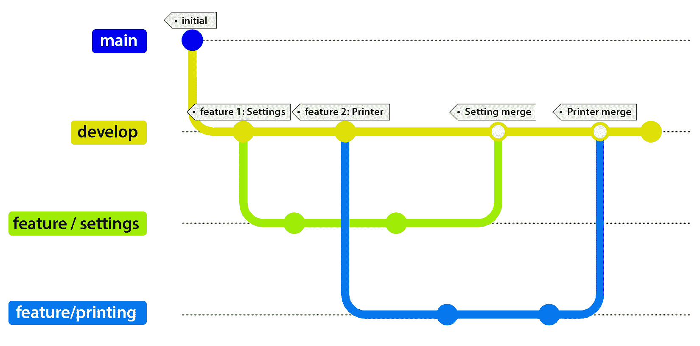
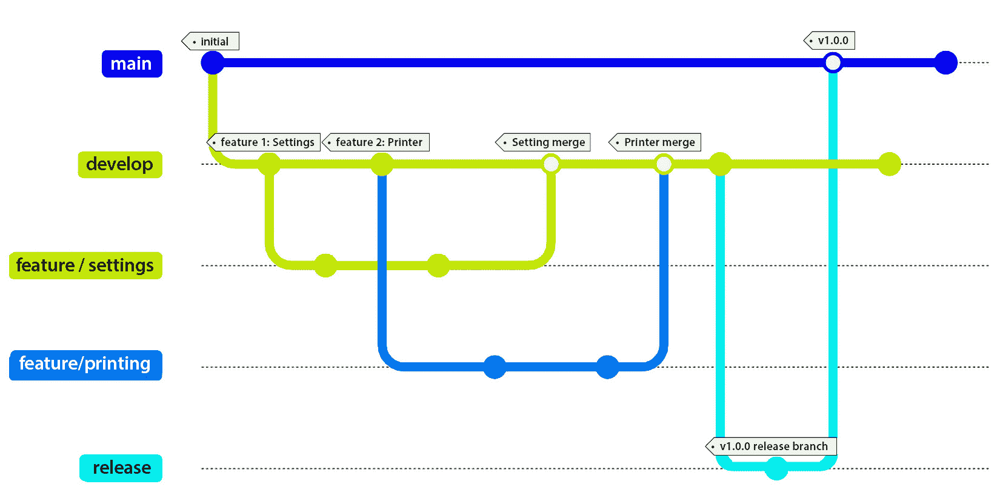
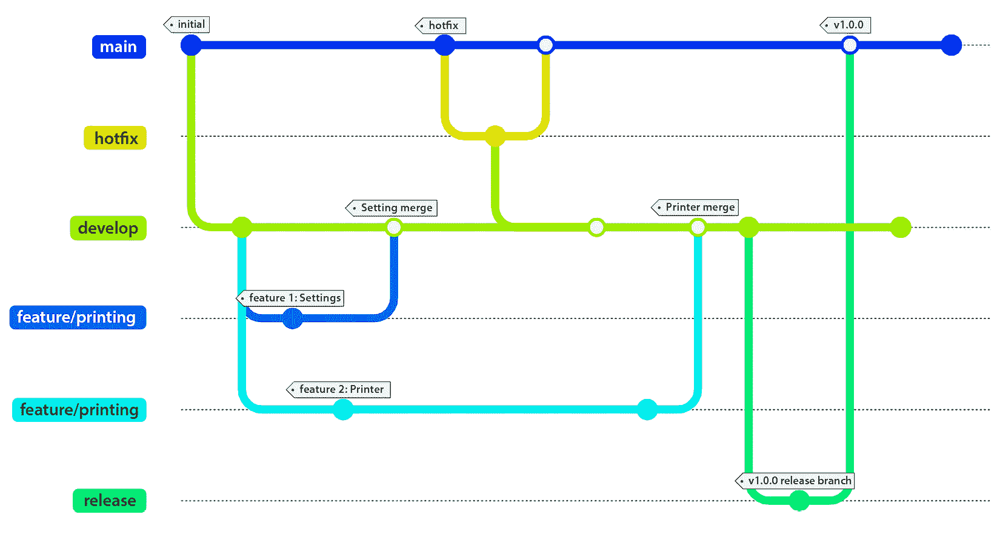
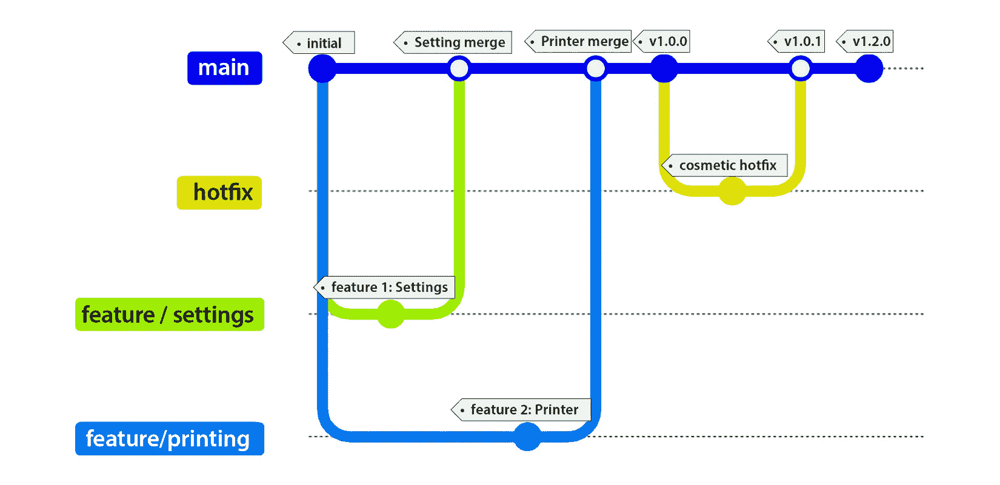
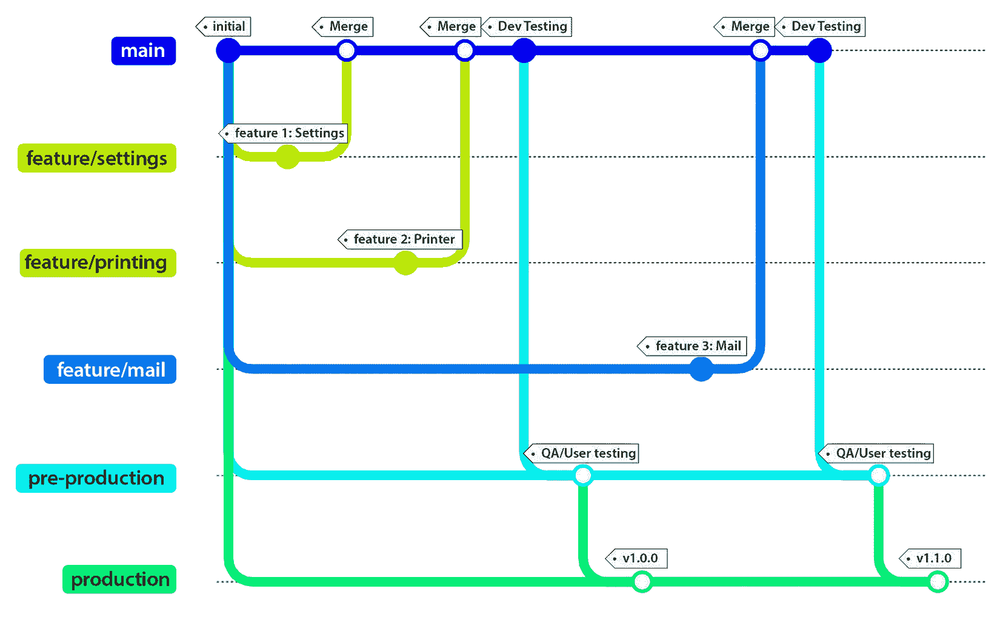
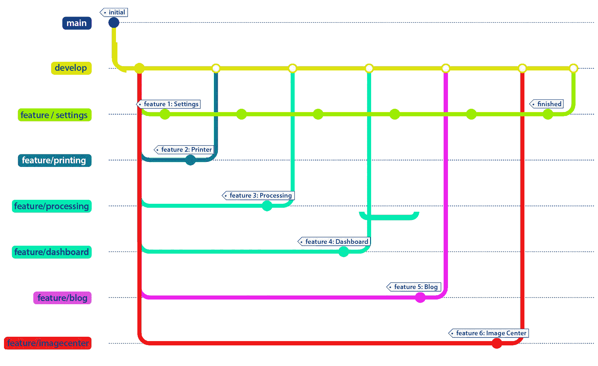

# 1

# 使用源代码管理来掌握控制权

源代码管理是开发者的最佳拍档，并为他们提供了一个在不丢失重要更改的情况下实验代码的方法。源代码管理是在整个开发过程中跟踪和维护对代码所做的更改的能力。虽然这可能包括代码，但它也可以用于文档、资产（如图像）和其他资源。能够测试某些条件，以及无需担心代码库就能重构代码，是大多数开发者认为的超级能力。

在团队环境中工作，源代码管理非常重要。如果开发者提交了代码，后来意识到他们犯了一个错误，源代码管理为开发者提供了一个回滚更改或更新分支并重新提交的方法。几乎总是不使用某种类型源代码管理的企业会引发红旗。

在本章中，我们将探讨开发者在使用源代码管理时在行业中使用的常见做法。我们还将涵盖实现代码分支工作流程的各种方法，并检查每个流程中的不同分支类型。为了结束本章，我们将回顾开发者在使用源代码管理时的常见礼仪。

在本章中，我们将涵盖以下主题：

+   分支策略

+   创建短期分支

+   提交前始终“获取最新”

+   理解常见实践

到本章结束时，你将学会以有组织的方式创建代码库的最佳方法，以及开发社区中的常见指南。

# 技术要求

虽然本节涉及许多有关源代码管理的指南，但本章的唯一要求是任何操作系统的计算机。Git 是可选的。

如果你没有安装 Git，你可以从以下网址下载并安装它：

[`git-scm.com/`](https://git-scm.com/)

我们已经使用 mermaid-js 来直观地展示分支策略。截至 2022 年 2 月，GitHub 页面现在支持 Mermaid-js。一些章节将包含 mermaid 图表来展示不同的分支层次结构。

如需了解更多关于 Mermaid-js 的信息，请访问以下网址：

[`mermaid-js.github.io`](https://mermaid-js.github.io)

# 分支策略

在本节中，我们将探讨各种分支策略，解释每个策略的工作原理，并突出它们之间的差异。

虽然每个公司都有其独特的流程，但我们将关注行业中的常用策略。

由于 GitFlow 是初始流程，因此在行业中每个人都熟悉它，其后续者通过微调流程进行了改进。

在接下来的章节中，我们将讨论每个流程，但首先，我们必须了解 GitFlow 的基础知识。

## GitFlow

行业中最常见且最成熟的流程之一是 GitFlow。它由*文森特·德里森*于 2010 年创建。

最小 Git 仓库应包含以下分支：

+   main/master/trunk（从现在起称为 main）

+   develop

`main` 分支是在创建新仓库时开始的。这个分支的目的是始终拥有稳定且可用于发布的生产就绪代码。

`develop` 分支用于编写新代码，并防止未经测试的代码被合并到 `main`。

如果你是一个独立开发者，正在从事一个侧项目，这可能是一个合适的流程。如果 `develop` 上的所有内容都正常，你可以将你的更改合并到 `main` 并部署你的第一个版本。

好消息是你可以进一步发展你的分支层次结构。你可以轻松创建额外的分支，例如功能分支、发布分支或热修复分支，以获得更好的工作流程，我们将在后面介绍。

请记住，以下讨论的每个分支工作流程都允许任何团队，无论是 1 个开发者还是 50 个开发者，都能对 GitFlow 有一个稳固的理解。

在任何源代码管理系统中，通常有三种类型的分支用于帮助管理软件工作流程：功能分支、发布分支和热修复分支。

### 功能分支

功能分支将新功能隔离到单个分支中，这样开发者就可以编写代码，而不用担心会影响 `develop` 分支中的核心代码。

在以下示例中（见 *图 1**.1*），一个团队创建了一个 GitHub 仓库。它将其主分支命名为 `main`，将开发分支命名为 `develop`。

图 1.1：GitFlow 中的功能分支

一旦每个人都收到了他们的任务，一位开发者被分配从 `develop` 分支创建 `feature/settings`。

另一位开发者被分配了从 `develop` 分支来的 `feature/printing` 分支。

分支命名

除了标准化的 `main` 和 `develop` 分支之外，一种常见的命名分支的方式是使用前缀。以下是一些示例：

* `feature/`, `features/`, 或 `feature-`: 分支名称应尽可能具有描述性和帮助性。例如，`feature/1234-settings` 与 `feature/jd-settings` 相关)。

* `"bug/<userstory/task number>-<problem>/"`: 这个例子有助于立即识别错误。这种技术的例子可以是 `bug/1234-string-overflow`。在分支前缀为“bugfix”也是可接受的。

一旦完成并得到批准，每个开发者都会将他们的更改合并到 `develop` 分支。

### 发布分支

发布分支用于最后的润色、小错误修复以及/或为你的软件的新版本做准备（多么令人兴奋啊！）

让我们来看看发布分支是如何融入我们之前的示例中的。以下图表展示了 GitFlow 中发布分支的样子：

图 1.2：GitFlow 中的发布分支

初始时，开发者根据分配的任务创建一个功能分支。一旦他们将更改合并到`develop`，就会从`develop`分支创建一个新的发布。发布分支会合并到`main`并打上版本号。现在，`main`分支将合并到`develop`分支，以便开发者在发布过程中如果有代码更改，可以拥有最新的更改。

它与功能分支完全相同，但如果你注意到，我们是从`develop`分支而不是从`main`分支创建`release`分支的。

在创建并确认`release`分支按预期工作后，将`release`分支合并到`main`分支。

一旦合并到`main`，建议以某种方式标识一个成功的发布。按照惯例，带有版本号的标签是最好的方法。

## 热修复分支

虽然大多数开发者不会犯编码错误（嗯嗯），但有时需要对`main`分支进行即时更改。

回到我们的例子，似乎有一个开发者的代码出现了问题。当任何人选择**设置**选项时，应用程序会崩溃，使得应用程序无法使用。这需要一个热修复分支。

以下图表展示了如何实现热修复分支的示例：

**图 1.3**：GitFlow 中的热修复分支

热修复分支是从`main`分支创建的，一旦代码经过验证，需要合并回`main`分支和`develop`分支。

在 GitFlow 中，长期运行的分支是`main`和`develop`。短期分支包括功能、热修复和错误修复分支。

现在我们已经介绍了 GitFlow 及其分支类型，接下来我们将探讨下一个工作流程，称为 GitHub Flow，以及它与 GitFlow 的不同之处。

## GitHub Flow

随着时间的推移，GitFlow 已经演变成更简单的流程。这些流程中的第一个是 GitHub Flow，它于 2011 年创建。

GitHub Flow 旨在通过删除`develop`分支并在`main`分支上创建功能来简化流程。

以下图表展示了功能分支和热修复分支是如何工作的。

**图 1.4**：GitHub flow 中的热修复分支

在**图 1.4**中，创建了两个特征，并将这两个特征合并回`main`。立即，发布了版本 1.0.0。在 1.0.0 版本发布后，网站上的一些文本出现了错误，法律团队要求修复这些问题。

其中一位开发者创建了一个热修复分支，更改了标签，提交了一个 PR，得到了批准，将更改合并到`main`，更新了版本，并立即将代码部署到生产环境中。

热修复和功能分支之间的区别是什么？热修复是从`main/master`创建的分支，代码已检查、审查、更新，并立即合并回`main/master`。功能分支更像是组织或计划的方法。功能分支是从`develop`分支创建的，代码已检查、审查并合并回功能分支。功能分支被计划合并到发布分支。

那么，发布分支在哪里？在每个工作流程中，都存在某种类型的发布分支，我们将如下进行审查。这个分支的概念是始终有一个没有版本错误、经过测试且随时可以部署的版本。一些小型初创公司在起步时使用这种类型的工作流程。由于 GitFlow 在行业中被视为基准，当团队扩大并寻求更结构化的工作流程时，很容易应用 GitFlow 的概念。

在 GitHub Flow 中，这里的长期分支仍然是`main`，而短期分支是功能、热修复和错误修复分支。

在审查了 GitHub Flow 之后，让我们继续到最后一个常用的分支策略，称为 GitLab Flow。

## GitLab Flow

我们将要介绍的最后一个工作流程是 GitLab Flow。GitLab Flow 于 2014 年创建，它对 GitFlow 工作流程采取了不同的方法，并结合了以功能驱动的发展来使用功能分支和问题跟踪。

GitLab Flow 将发布分支转换为稳定的环镜分支，例如生产和 QA。当然，你可以根据需要创建尽可能多的“环境分支”。如果我们有一个 QA 环境分支，这可能被用来测试最终产品。在*图 1*.5 中，我们看到从`main`分支创建的标准`feature`分支，以及另外两个环境分支（预生产和生产）。

图 1.5：GitLab Flow

在 GitLab Flow 中，`main`被视为一个测试分支。无论是 QA 还是经理，它都是一个测试功能分支的地方。

与 GitHub Flow 类似，所有内容都合并到`main`分支。当功能分支被提交时，会进行代码审查（这是强制性的），并合并到`main`，所有测试（是的，*所有*）都会运行。如果测试运行时间超过五分钟，请将它们配置为并行运行。

一旦在`main`上完成测试，`main`就会被推送到`预生产`进行进一步测试，最后推送到生产环境。由于 GitLab Flow 中的发布基于标签，每个标签都应该创建一个新的发布。

如果开发者引入了一个错误，它首先必须在主分支上修复，然后是环境分支。开发者必须创建一个修复错误的分支，提交带有 PR 批准的代码，进行代码审查，并在继续工作流程之前，合并代码并运行与错误相关的测试。

一旦在主分支上测试通过，它就会被标记并自动提升到预生产环境，然后是生产环境。在这个工作流程中，长期运行的分支包括主分支和环境分支。短期分支是功能、热修复和错误修复分支。

在本节中讨论的每个策略中，我们都看到了每个策略是如何从最初的 GitFlow 发展而来，并且（请原谅这个双关语）分支到一个更好的工作流程。

下一节将介绍使用源代码控制时的常见礼仪。

# 创建短期分支

一旦您初始化了您的仓库并创建了您的第一个分支，您就可以开始为您的功能编写代码。

虽然这很令人兴奋，但这个指南更多的是针对团队，而不是个人构建的副项目。团队越大，这对您的工作流程就越关键。

让我们通过 *图 1.6* 来看看一个使用多个功能分支的例子。

图 1.6：长期存在的功能分支（功能/设置）

每个人都被分配了他们各自的功能分支，这些分支是为他们创建的。正如您所看到的，开发者在完成他们的功能并将它们检查到 `develop` 中。

然而，正在设置功能（`feature/settings`）的开发者落后了。由于他们一周内没有更新代码，他们的分支正在变得过时。它只包含他们第一次创建分支时的功能。

如果他们决定在未更新分支的情况下将代码提交到仓库，你认为会发生什么？会有很多不高兴的开发者。为什么？

`feature/settings` 分支将被提交并覆盖合并到 `develop` 分支的所有人的更改。您的分支寿命越短，您遇到合并冲突的可能性就越小。

如果不是每天两次，最好是每天进行更新，以防止您的分支变得过时。

# 理解常见实践

从技术上讲，了解如何使用源代码控制只是战斗的一半。另一半是在使用源代码控制的同时作为一个团队玩家。考虑到你的队友的能力将使你在职业生涯中走得更远，成为一个周到和值得信赖的开发者。

以下各节旨在作为指南，帮助您在团队环境中取得成功。如果您作为一个个人开发者在一个开源项目中工作，实施这些实践也不会有害。

## 私下重置，公开合并

当在私有功能分支上工作时，可能会有多个提交是必要的。这些提交会给 `main`/`master` 分支添加不必要的噪音。

变基代码会将多个本地提交合并为一个提交，并更新另一个分支。这本质上重写了提交历史。当然，这与合并不同。合并是将一个分支的所有提交合并到另一个分支的过程。合并保留了所有提交的历史。

将变基想象成在向潜在买家展示房子之前打扫房子。如果你在本地分支中犯了许多错误，你希望主/主分支提供清晰简洁的注释，说明提交代码时应用了哪些代码。

## 提交代码前始终“获取最新版本”

在保持分支最新这个话题上，在你提交代码之前“获取最新版本”是一个好习惯。

“获取最新版本”是指从中央仓库检索任何更新并将这些更新应用到你的本地代码仓库。

无论你使用 Git、**团队基础服务器**（**TFS**）还是其他源代码控制系统，你都需要始终考虑团队，获取最新的代码更新。每个源代码工具都有获取代码最新版本的方式。无论你使用什么工具，获取最新版本总是一个好习惯。

由于 Git 因其灵活性和对源控制的细粒度方法而被视为行业标准，大多数开发环境都提供与 Git 交互的界面（图形界面或命令行界面）。

使用 Git，有几种推送和拉取更改的方法：

+   **拉取**：从远程仓库检索元数据到本地仓库。

+   **拉取**：检索远程元数据并从远程仓库拉取这些更改的副本到本地仓库。

+   **推送**：将提交推送到远程分支。

+   **同步**：先执行一次*拉取*，然后执行一次*推送*。记住，获取最新更改并将这些更改应用到你的代码上，然后推送你的提交更改到服务器的仓库。

在提交代码之前，最好先执行一次拉取操作，以获取所有内容。

## 提交代码前始终构建和测试

虽然在提到我们之前的指南后，这听起来可能是一个简单的概念，但仍有不少开发者继续在提交代码时遗漏这一步。一旦你拉取了最新版本，下一步就是编译代码，并运行本地单元测试。不要假设你拉取的代码没有错误。

周五下午，开发者 B 执行了拉取操作来更新他们的代码，提交代码时没有编译，然后匆匆离开。

他们不知道的是，开发者 A 在开发者 B 之前提交了代码。代码无法编译，而开发者 A 已经离开去周末了。现在开发者 B 拉取了代码，但他无法编译它。

在周一，他们发现他们的代码根本无法构建，单元测试也没有通过。

或者更糟糕的是，他们在周五晚上接到这个消息的电话。

## 避免提交二进制文件

源代码控制系统已经存在了一段时间，大多数都已经过时（比如 SourceForge，对吗？），但它们都已被用作源代码仓库。

最近，有相当多的**内容管理系统**（**CMSes**）使用源代码系统作为内容存储库，在那里它们管理和版本控制网站的资产，例如图片、MP3 和视频。

然而，对于开发者来说，我们的内容是我们的源代码。大多数开发者仓库甚至没有 Word 文档大。

如果开发者想要通过提交所有内容来保持系统的“快照”，这将违背源代码控制的目的。

对于.NET 应用程序，编译应用程序意味着`\bin`和`\obj`文件夹将包含程序集。这些程序集在编译时自动创建，*不需要*提交到仓库。

在大多数源代码控制系统中，存在某种类型的忽略文件，用于在提交代码之前过滤和删除仓库中的冗余。例如，在 Git 中，有一个`.gitignore`文件，它应该包括这些`\bin`和`\obj`目录以及其他对于构建解决方案或项目不必要的文件类型。

作为一般准则，当你从一个仓库克隆并立即在新机器上构建它时，无论是内部企业项目还是 GitHub 上的开源框架，都不应该出现错误。

如果你从自己的项目或第三方项目中提交程序集到 Git，目的是保持其可运行状态，那么你做错了。最好不要将任何二进制文件提交到 Git。

如果你需要一个第三方库的特定版本，考虑使用 NuGet 包管理器。当你将 NuGet 包添加到项目中时，它会自动连接并检索特定版本，并将其放置到`\bin`文件夹中，使应用程序每次都能编译、构建并成功运行。

## 使用标签进行版本控制

标签在源代码控制中使用时非常有帮助。事实上，它们是 GitLab Flow 的驱动力。虽然标签对于源代码控制来说很棒，但它们也可以被用于邪恶的目的。例如，一些公司在整个工作流程过程中使用标签作为注释，这是不建议的。标签提供了一种方式，可以在地面上放置一个标志来表示，“这是版本 x.x.x。”它们是稳定发布的代码快照的标记。这表示这个标签下的代码应该构建、编译、测试和运行*不修改代码*和*没有错误*。

在整个工作流程中，最好严格使用标签来版本控制你的发布。

# 摘要

在本章中，你学习了可用的不同分支工作流程，包括 GitFlow、GitHub Flow 和 GitLab Flow，以及每个工作流程是如何运作的。除了工作流程，你还学习了行业标准化的分支名称，例如 main/trunk/master、develop、features、release 和 hotfix 分支，以及它们在每个工作流程中的运作方式。你还学习了与源代码控制一起工作的正确方法，例如始终获取最新代码，何时进行变基而不是合并，让分支拥有短暂的生命周期，在提交前编译和测试你的代码，永远不要提交程序集，以及正确使用标签。

在下一章中，我们将从我们的仓库中提取源代码，创建一个自动构建过程以生成工件。我们还将介绍如何自动将其部署到服务器上。
