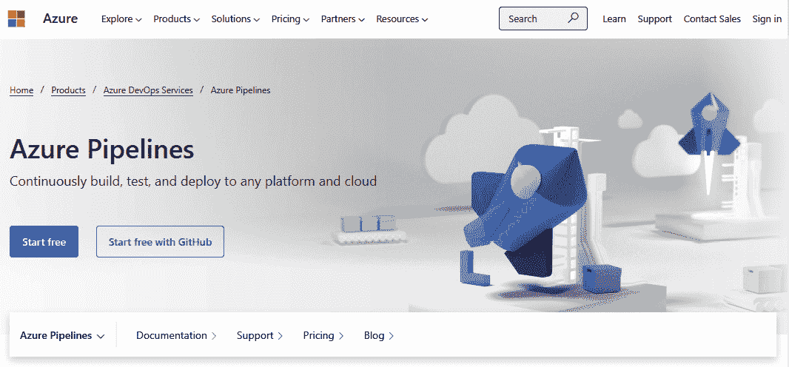
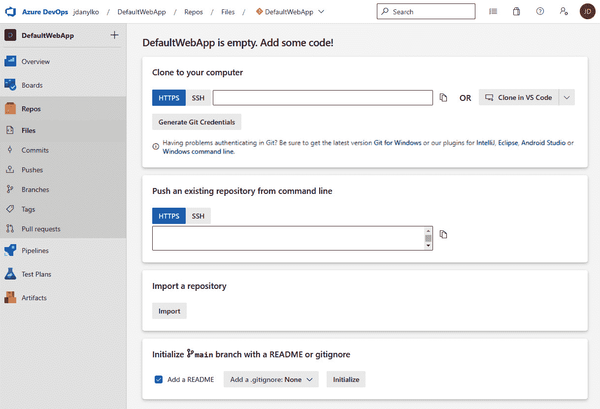
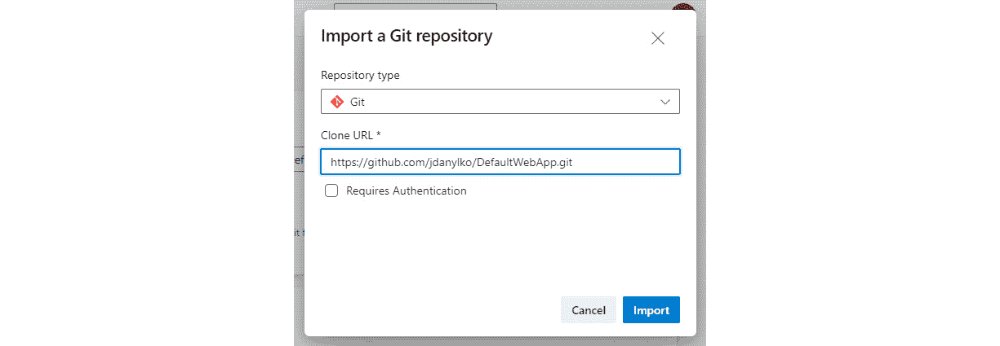
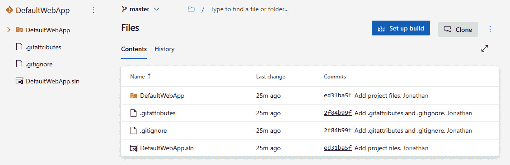
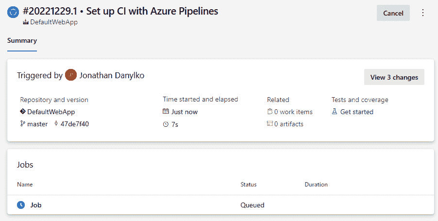
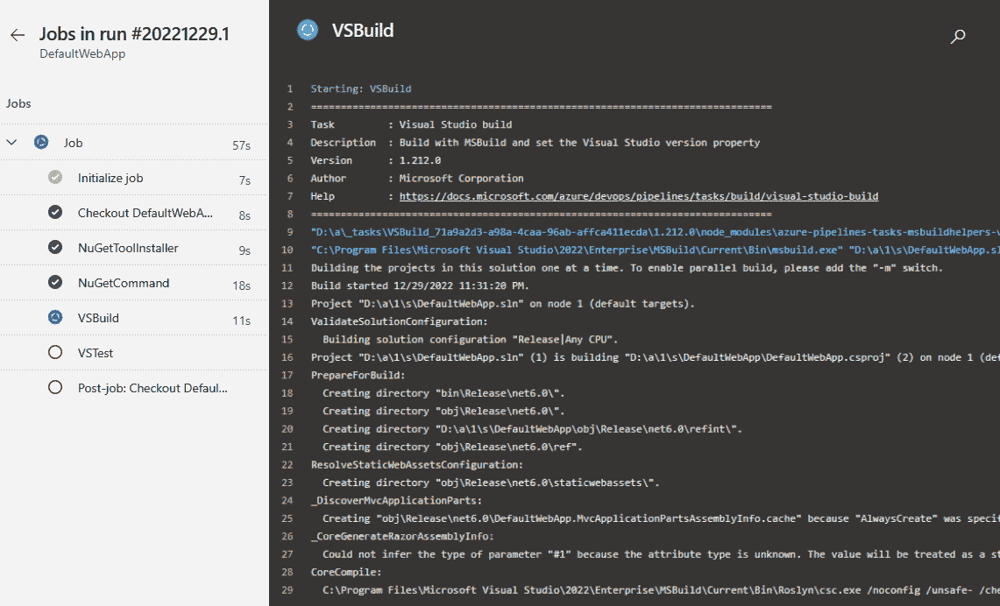
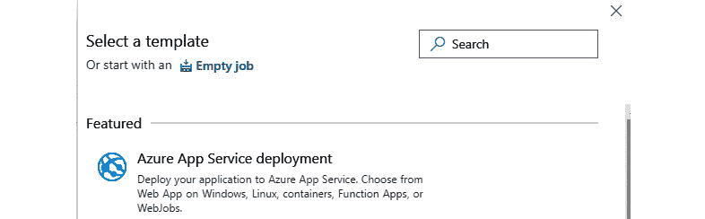
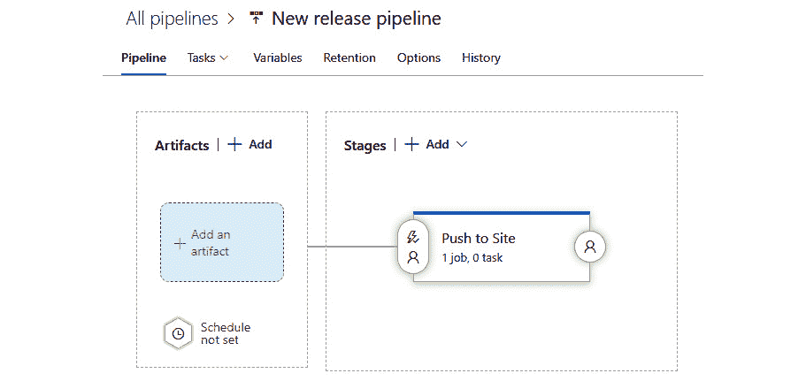
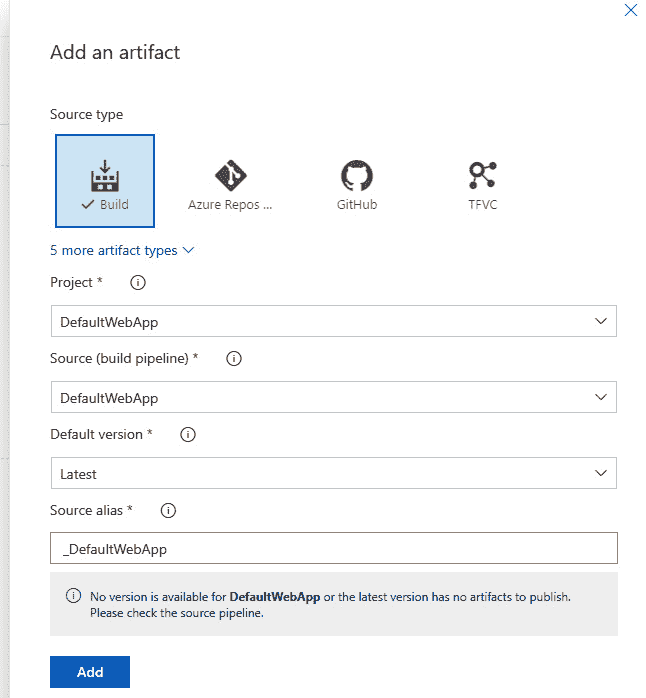
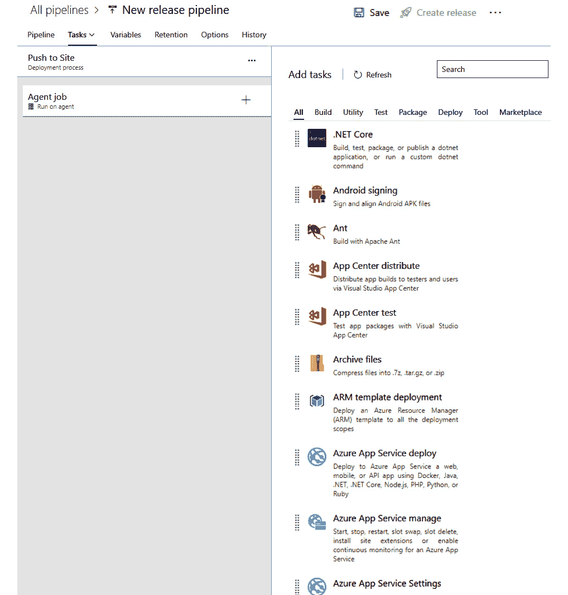

# CI/CD – 自动构建高质量软件

在我的职业生涯中，有人曾经对我说，“*CI/CD 已死，长命 CI/CD*。”当然，这句话并不意味着它已经完全死亡。它只是意味着 CI/CD 现在已经成为软件开发的标准，是开发者在软件开发生命周期中应该采用和学习的常见做法。现在，它被视为你开发过程的一部分，而不是一个光鲜的新流程。

在本章中，我们将回顾 **持续集成**/**持续部署**（**CI**/**CD**）的含义以及如何为管道准备你的代码。一旦我们涵盖了需要包含在代码中的必要更改，我们将讨论构建软件的常见管道是什么样的。一旦我们理解了管道过程，我们将探讨两种从失败的部署中恢复的方法以及如何通过管道部署数据库。我们还将涵盖你可用的三种不同类型的云服务（本地和远程以及混合型）并回顾互联网上顶级 CI/CD 提供商的列表。最后，我们将带你了解为示例应用程序创建构建的过程，以及其他类型的项目。

在本章中，我们将涵盖以下主题：

+   什么是 CI/CD？

+   准备你的代码

+   理解管道

+   两种“坠落”方法

+   部署数据库

+   三种构建提供者类型

+   CI/CD 提供商

+   Azure Pipelines 演示

完成本章后，你将能够在准备软件部署代码时识别软件中的缺陷，了解常见管道在产生高质量软件时包含的内容，识别两种从失败的部署中恢复的方法，知道如何通过管道部署数据库，了解不同类型的 CI/CD 提供商，以及了解 CI/CD 提供商空间中的关键参与者。

最后，我们将通过 Azure Pipelines 中的一个常见管道来回顾本章所学的一切。

# 技术要求

对于本章，唯一的技术要求是能够访问一台笔记本电脑，以及 *CI/CD 提供商* 部分中提到的云服务提供商的账户（最好是微软的 Azure Pipelines – 不要担心，它是免费的）。

一旦你了解了如何创建管道，你将能够将相同的概念应用到其他云服务提供商及其管道策略上。

# 什么是 CI/CD？

在本节中，我们将了解持续集成和持续部署对开发者意味着什么。

**持续集成**（**CI**）是将所有开发者的代码合并到主线中，以触发自动构建过程，这样你可以快速使用单元测试和代码分析来识别代码库中的问题。

当开发者将他们的代码检入分支时，它会被同行开发者审查。一旦被接受，它就会被合并到主线中，并自动开始构建过程。这个构建过程将在稍后介绍。

**持续部署**（**CD**）是持续创建软件以便在任何时候都可以部署的过程。

一旦所有内容都通过自动化过程构建完成，构建过程会准备编译后的代码并创建工件。这些工件用于在各种环境中的一致部署，例如开发、测试和生产环境。

实施 CI/CD 管道的好处超过了没有它的情况：

+   **自动化测试**：当提交被触发时，你的测试会自动与构建一起执行。想象一下，有人在每次提交时都会检查你的代码。

+   **更快的反馈循环**：作为开发者，总是收到即时的反馈以了解某件事是否工作是非常好的。如果你收到一封构建失败的邮件，那么你只能自己处理。

+   **一致的构建**：一旦你的项目在构建服务器上构建，你就可以创建带有测试的按需构建——并且是一致的。

+   **团队协作**：我们都在同一个战壕里，CI/CD 包括开发者、系统管理员、项目经理/敏捷大师以及 QA 测试员等，以实现创建优秀软件的目标。

在本节中，我们回顾了在自动化方式开发软件时，持续集成和持续部署的定义以及实施 CI/CD 管道的好处。

在下一节中，我们将了解在自动化软件构建时应避免的某些代码实践。

# 准备你的代码

在本节中，我们将讨论你的代码的某些方面以及它们如何可能影响你软件的部署。这些软件问题可能包括代码无法编译（构建失败）、避免使用相对路径名称，以及确保你编写了适当的单元测试。这些是我多年来遇到的一些常见错误；在本节中，我还会提供如何修复它们的解决方案。

在我们审查 CI 管道之前，有一些注意事项我们需要事先解决。尽管我们在上一章中已经涵盖了版本控制的大部分内容，但你的代码需要处于某种状态才能实现“一键”构建。

在接下来的章节中，你将了解如何准备你的代码以便它“CI/CD 就绪”，并检查你在部署软件时可能遇到的问题以及如何避免这些问题。

## 无缝构建

如果新员工被雇佣并立即开始工作，你希望他们能够迅速上手，开始开发软件而无需延迟。这意味着能够将他们指向一个仓库并拉取代码，这样你就可以*立即*运行代码，并且*最小化*设置。

我说“最小化设置”，因为可能涉及权限问题，以便访问公司中某些资源，以便它们可以在本地运行。

尽管如此，代码应该处于可运行状态，引导你到一个简单的屏幕，并通知用户跟进权限问题或提供一些通知以解决问题。

在上一章中，我们提到了代码应该始终编译。这意味着以下内容：

+   代码应该在克隆或检出后始终编译

+   单元测试应该包含在构建中，而不是在单独的项目中

+   你的版本控制提交信息应该是有意义的（它们可能用于发布说明）

这些标准允许你的管道落入成功的陷阱。当你的代码处于干净状态时，它们帮助你更快、更轻松地创建构建。

## 避免使用基于文件的操作的相对路径名称

这些年来，我在处理 Web 应用程序时遇到的一个棘手问题是文件如何在 Web 应用程序中被访问。

我也见过通过网页进行基于文件的操作，其中文件使用相对路径移动，结果出了问题。这涉及到删除目录，结果并不好。

例如，假设你有一个指向图像的相对路径，如下所示：

```cs
../images/myimage.jpg
```

现在，假设你坐在一个网页上，比如`https://localhost/kitchen/chairs`。

如果你退回到一个目录，你会在厨房里找到一个缺失的图像，而不是在网站的根目录。根据你的相对路径，你正在寻找`https://localhost/kitchen/images/myimage.jpg`中的图像目录。

更糟糕的是，如果你使用自定义路由，这甚至可能不是正常的路径，谁知道它在哪里寻找图像。

在准备你的代码时，最佳做法是在你的 URL 开头使用单个斜杠（`/`），因为它被认为是“绝对”的：

```cs
/images/myimage.jpg
```

这使得在网站上定位文件时更容易导航到根目录，无论你处于什么环境。无论你是位于[`www.myfakewebsite.com/`](https://www.myfakewebsite.com/)还是[`localhost/`](http://localhost/)，根目录就是根目录，你将始终使用源开头的一个斜杠找到你的文件。

## 确认你的单元测试是单元测试

代码中的测试是为了提供检查和平衡，以确保代码按预期工作。每个测试都需要仔细检查，以确认它没有做任何不寻常的事情。

单元测试被认为是针对内存中代码的测试，而集成测试是需要*任何*外部资源的测试：

+   你的测试访问任何文件吗？集成测试。

+   你是否连接到数据库来测试某些内容？集成测试。

+   你正在测试业务逻辑吗？单元测试。

正如你开始推测的那样，当你在一个其他机器上构建你的应用程序时，云服务无法访问你的数据库服务器，也可能没有每个测试通过所需的附加文件。

如果你正在访问外部资源，将你的测试重构为更内存驱动的方法可能是一个更好的选择。我将在*第七章*中解释原因，届时我们将涵盖**单元测试**。

## 创建环境设置

无论你是在项目中间，还是第一次点击 **创建新项目…**，你都需要一种方法来为你的 Web 应用程序创建环境设置。

在 ASP.NET Core 应用程序中，我们默认提供了`appsettings.json`和`appsettings.Development.json`配置文件。`appsettings.json`文件旨在作为一个基本配置文件，并且根据环境的不同，每个`appsettings`文件都会应用，并且只覆盖现有的属性到`appsettings.json`文件。

这的一个常见例子是连接字符串和应用程序路径。根据环境的不同，每个文件都会有自己的设置。

环境也需要提前定义。总会有开发和发布环境。可能有一个选项在另一台机器上创建另一个名为 QA 的环境，因此需要一个`appsettings.qa.json`文件，其中包含其自己的特定环境设置。

确认这些设置已为每个相关环境保存，因为它们在 CI/CD 流水线中很重要。*这些环境设置应始终与你的解决方案/项目一起提交到版本控制中，以帮助流水线将正确的设置部署到正确的环境中*。

在本节中，我们介绍了如何通过确保我们可以在克隆或本地拉取存储库后立即构建来准备代码以供 CI/CD 流水线使用，为什么我们应该避免基于相对路径的文件路径，并确认我们正在使用特定环境的应用程序设置，这使得构建和部署我们的应用程序变得容易。

在代码已提交后，我们现在可以继续前进，描述常见流水线的所有阶段。

# 理解流水线

在本节中，我们将介绍在 CI/CD 服务中构建软件时，常见流水线包括的步骤。当你到达本节的结尾时，你将理解常见流水线中的每个步骤，以便你可以生产出高质量的软件。

CI 流水线是一系列必要的步骤，用于编码、构建、测试和部署软件。每个步骤不是由特定个人拥有，而是由一个共同协作并专注于生产卓越软件目标的团队拥有。好消息是，如果你遵循了上一章的建议，你已经领先一步了。

每个公司的流水线可能因产品而异，但 CI 过程总会有一个共同的步骤集。这取决于你的需求，流水线的阶段可能会受到参与过程中的每个利益相关者的影响。当然，对于开发者来说，需要拉取代码、构建和测试是必需的，但 QA 团队需要将最终产品（工件）发送到另一台服务器进行测试。

*图 2.1* 展示了一个常见的流水线：


图 2.1 – 构建流水线的一个示例

如*图 2**.1*所示，在创建软件部署时，过程是顺序的。以下是步骤的总结：

1.  从单个存储库拉取代码。

1.  构建应用程序。

1.  在*步骤 2*中构建的代码上运行单元测试/代码分析。

1.  创建工件。

1.  创建容器（可选）。

1.  将工件部署到服务器（开发/测试/预发布/生产）。

现在我们已经定义了一个通用管道，让我们深入了解每个步骤，了解在构建您的软件时每个过程包含什么。

在以下子节中，我们将根据这里定义的步骤详细检查每个过程。

## 拉取代码

在我们构建应用程序之前，我们需要在我们的管道中确定我们要构建的项目。管道服务需要一个存储库位置。一旦您提供了存储库 URL，该服务就可以在他们的服务器上为编译准备存储库。

在上一节中，我们提到了为什么在克隆后您的代码需要完美编译。代码是在与您的完全不同的机器上克隆和构建的。如果应用程序只在您的计算机上工作，而其他人则不行，就像行业中的一句俗语所说，“我们得把您的电脑运给所有我们的用户。”虽然这是一句行业中的幽默说法，但在现实世界中编写和部署软件时通常是不受欢迎的。

每个 DevOps 服务都有其优点。例如，Azure Pipelines 可以检查您的存储库，并根据您项目的结构做出假设。

分析项目后，它使用一种称为 YAML（发音为 Ya-mel）的文件格式来定义项目应该如何构建。虽然 YAML 现在被认为是行业标准，但我们不会深入探讨 YAML 所包含的所有内容。YAML 功能可能是一本单独的书。

Azure 会根据如何构建您的应用程序创建一个 YAML 模板。

它知道如何编译应用程序，确定容器是否包含在项目中，并在构建之前检索 NuGet 包。

最后要提到的是，大多数 DevOps 服务允许每个项目一个存储库。这种方法的优点包括以下内容：

+   **简单性**：管理并构建一个应用程序比在一个项目中编排数百个应用程序要简单得多。

+   **协作**：与其让多个团队专注于一个大项目，不如让一个或两个较小的团队在一个更易于管理的单一项目上工作。

+   **更快地构建**：CI/CD 管道旨在提供快速的反馈和更快的改进。项目越小，构建、测试和部署就会越快。

话虽如此，我们现在已经准备好构建应用程序。

## 构建应用程序

如前所述，YAML 文件定义了服务如何构建您的应用程序。

总是确认在构建之前 YAML 文件包含你所需的一切是一个好习惯。如果你有一个简单的项目，向导中包含的样板文件可能就足够了，但它允许你在需要时进行更新，或者进行其他应用程序检查。

可能需要尝试几次来调整 YAML 文件，但一旦文件处于稳定状态，看到一切按预期工作是非常令人欣慰的。

确保在构建应用程序之前已经检索了所有代码。如果这一步失败，流程将退出管道。

如果你提交了糟糕的代码并且构建失败，根据警报级别，适当的权威机构（开发者或管理员）将被通知，并且你将因为破坏构建而得到一个傻瓜帽或填充的猴子，直到有人打破它。

接下来，我们将专注于对应用程序运行单元测试和其他测试。

## 运行单元测试/代码分析

构建完成后，我们可以继续进行单元测试和/或代码分析。

单元测试应该针对编译后的应用程序运行。这包括单元测试和集成测试，但如我们之前提到的，要小心集成测试。管道服务可能无法访问某些资源，这可能导致你的测试失败。

单元测试，按其本质，应该非常快。为什么？因为你不希望等待 30 分钟来运行单元测试（这是痛苦的）。如果你有单元测试需要那么长时间，请识别运行时间最长的单元测试并进行重构。

一旦代码编译并加载，单元测试应该每 10-30 秒运行一次，这是一个一般性指南，因为它们是基于内存的。

虽然单元测试和集成测试在大多数测试场景中很常见，但你可以在你的管道中添加额外的检查，包括识别安全问题和代码度量，以便在构建结束时生成报告。

接下来，我们的构建会创建用于部署的工件。

## 创建工件

一旦构建成功并且所有测试通过，下一步就是创建我们的构建工件并将其存储在中央位置。

作为一般规则，最好只创建一次二进制文件。一旦它们被构建，它们可以随时使用。这些工件可以随意将版本部署到服务器，而无需再次通过整个构建过程。

工件应该是防篡改的，并且任何人都不应该修改它们。如果工件存在问题，管道应该从头开始并创建一个新的工件。

让我们继续讨论容器。

## 创建容器

一旦创建了自包含的工件，一个可选的步骤是围绕它构建容器或将其安装到容器中。虽然大多数企业使用各种平台和环境，如 Linux 或 Windows，但使用 Docker 等工具“容器化”应用程序允许它在任何平台上运行，同时隔离应用程序。

考虑到容器已成为行业标准，因此创建一个容器以便它可以轻松地部署到任何平台，如 Azure、**亚马逊网络服务**（**AWS**）或 Google Cloud Provider 是有意义的。再次强调，这是一个可选步骤，但在行业中它正变得不可避免。

当使用 Visual Studio 创建新项目时，你将自动通过生成的 Docker 文件获得一个容器包装器。这个 Docker 文件定义了容器将如何允许访问你的应用程序。

一旦你将 Docker 文件添加到你的项目中，Azure 就会将其识别为容器项目，并使用包含的项目创建容器。

最后，我们将检查软件的部署。

## 部署软件

一切生成完毕后，我们所需做的就是部署软件。

记得你`appsettings.json`文件中的环境设置吗？这对于部署非常有用。

根据你的环境，你可以在部署时将适当的 JSON 文件合并到`appsettings.json`文件中。

一旦你的环境设置就绪，你可以以任何你喜欢的任何方式定义你的部署目的地。

部署可能包括将工件 FTP 或 WebDeploy 到服务器，或将容器推送到某个服务器。所有这些选项都是现成的。

然而，你必须以相同的方式部署到每个环境。唯一改变的是`appsettings`文件。

在成功（或失败）部署后，应向所有参与部署结果的人员发送报告或通知。

在本节中，我们学习了常见的管道包括什么以及每个步骤如何依赖于成功的上一个步骤。如果在管道中的任何步骤失败，过程将立即停止。这种“传送带”方法为软件开发提供了可重复的步骤、以质量驱动的软件和可部署的软件。

# 两种“回退”方法

在本节中，我们将了解两种从失败的软件部署中恢复的方法。完成本节后，你将知道如何使用这两种方法对不良部署的恢复做出合理的决定。

在标准管道中，公司有时在部署到 Web 服务器时会遇到软件故障。当用户在网站上执行操作时，他们可能会看到错误消息。

当软件不符合预期时，你会怎么做？这在 DevOps 管道中是如何工作的？

每次构建软件时，总有可能出错。在软件部署之前，你总是需要一个备份计划。

让我们来看看当软件部署失败时我们可以使用的两种恢复方法。

## 回退（或回退）

如果产品中引入了各种错误，而前一个版本似乎没有这些错误，那么回滚软件或回退到前一个版本是有意义的。

在管道中，末尾的过程创建工件，这是您产品的自包含、可部署版本。

这里有一个向后跌倒的例子：

1.  您上周的软件部署成功，并被标记为版本 1.1（v1.1）。

1.  在两周内，开发人员为软件创建了两个新功能，并希望尽快发布它们。

1.  创建并发布了一个新版本，称为版本 1.3（v1.3）。

1.  当用户在使用最新版本（v1.3）时，他们遇到了一个新功能的问题，导致网站显示错误。

1.  由于上一个版本（v1.1）没有这个问题，且影响不严重，开发人员可以将 v1.1 部署到服务器上，以便用户可以继续保持生产力。

这种类型的发布被称为**向后跌倒**。

如果您必须用旧版本（v1.1）替换当前版本（v1.3）（数据库除外，我稍后会讨论），您可以轻松地识别并部署最后一个已知的工件。

## 向前跌倒

如果回退方法不是一个可行的恢复策略，那么替代方案就是向前跌倒。

当向前跌倒时，产品团队接受带有错误的部署（包括所有瑕疵），并继续推出新的版本，同时将这些错误置于高度优先级，并承认这些错误将在下一个或未来的版本中得到修复。

这里有一个向前跌倒的类似例子：

1.  再次，上周的软件部署成功，并被标记为版本 1.5（v1.5）。

1.  在接下来的两周内，开发人员为软件创建了另一个新的大型功能。

1.  创建并发布了一个新版本，称为版本 1.6（v1.6）。

1.  当用户在使用最新版本（v1.6）时，他们遇到了一个新功能的问题，导致网站显示错误。

1.  经过分析，开发人员意识到这是一个“快速修复”，创建了适当的单元测试以证明问题已修复，通过管道推送了新的发布，并立即在新版本（v1.7）中部署了修复后的代码。

这种类型的发布被称为**向前跌倒**。

产品团队可能必须检查每个错误，并决定哪种恢复方法最适合产品的声誉。

例如，如果产品功能（如业务逻辑或用户界面更新）是问题所在，那么最好的恢复方法可能是向前跌倒，因为对系统的影响最小，用户的流程不会被打断，且保持生产力。

然而，如果涉及代码和数据库更新，更好的方法是将回退——即恢复数据库并使用工件的前一个版本。

如果这是一个关键功能，且无法回滚，那么可能需要采用“热修复”方法（如前一章所述）来修复软件。

再次，这取决于每个问题对系统造成的影响，以确定哪种恢复策略是最好的方法。

在本节中，我们学习了两种从失败的软件部署中恢复的方法：向后回退和向前跌倒。虽然这两个选项都不是强制性的选择，但每种方法都应根据错误类型、修复的恢复时间和软件的部署计划进行慎重考虑。

# 部署数据库

部署应用程序代码是一回事，但如果操作不当，部署数据库可能是一项令人畏惧的任务。在部署数据库时有两个痛点：结构和记录。

在数据库结构方面，您会遇到向表中添加、更新和删除列/字段的问题，以及更新相应的存储过程、视图和其他与表相关的功能，以反映表更新。

在记录方面，这个过程并不像更改表结构那样复杂。更新记录的频率并不规律，但一旦发生，您可能希望用默认记录填充数据库，或者用新值更新这些种子记录。

以下几节将介绍在 CI/CD 管道中部署数据库的一些常见做法。

## 部署前备份

由于公司数据对业务至关重要，在修改或更新数据库之前必须对其进行备份。

一项建议是将整个数据库部署过程分为两步：首先备份数据库，然后应用数据库更新。

DevOps 团队可以在应用数据库更新之前包含一个预部署脚本，以**自动**备份数据库。如果备份成功，您可以继续部署您的更改到数据库中。如果不成功，您可以立即停止部署并确定失败的原因。

如前文所述，这是为了采用“回退”方法而不是“向前跌倒”策略。

## 制定表结构策略

更新表的一种策略是采取一种非破坏性的方法：

+   **添加列**：在添加列时，为创建记录时该列放置一个默认值。这将防止在添加记录时应用程序出错，通知用户该字段没有值或为必填项。

+   **更新/重命名列**：更新列略有不同，因为您可能正在更改数据库中的数据类型或值。如果您正在将列名和/或类型更改为其他内容，请添加一个具有新列类型的新列，确保设置默认值，然后继续在应用程序代码中使用它。一旦代码稳定并且按预期运行，从表中删除旧列，然后从代码中删除。

+   **删除列**：处理此过程有几种不同的方法。如果字段是用默认值创建的，请在你的应用程序代码中做出相应的更改以停止使用该列。当记录添加到表中时，默认值不会创建错误。一旦应用程序代码已更新，*重命名*表中的列而不是删除它。如果你的代码仍在使用它，你将能够识别代码问题并修复它。一旦你的代码运行无误，就可以安全地从表中删除该列。

在对表结构进行适当的更改时，不要忘记更新额外的数据库代码以反映表更改，包括存储过程、视图和函数。

## 创建数据库项目

如果你的 Visual Studio 解决方案连接到数据库，你需要将另一种项目类型添加到你的解决方案中，称为数据库项目类型。当你将此项目添加到解决方案中时，它会对你的数据库进行快照，并将其作为代码添加到项目中。

为什么要在你的解决方案中包含它？包含它的有三个原因：

1.  当你从头创建数据库时，它提供了一个数据库模式作为 T-SQL。

1.  它允许你根据**基础设施即代码**（**IaC**）范式对数据库进行版本控制。

1.  当你在 Visual Studio 中构建解决方案时，它会自动从数据库项目生成 DAC 文件，以便与自定义脚本一起部署。将 DAC 包含在解决方案中，管道可以首先使用 DAC 文件部署和更新数据库。一旦数据库部署（和备份）完成，管道可以部署工件。

如你所见，将其包含在解决方案中非常方便。

## 使用 Entity Framework Core 的迁移

Entity Framework 自从早期以来已经取得了长足的进步。迁移是另一种通过 C#而不是 T-SQL 来包含数据库更改的方法。

在创建迁移时，Entity Framework Core 会对数据库和`DbContext`进行快照，并使用 C#创建数据库模式和`DbContext`之间的差异。

在初始迁移中，整个 C#代码都通过`Up()`方法生成。

任何后续的迁移都将包含一个`Up()`方法和一个`Down()`方法，分别用于升级和降级数据库。这允许开发者保存他们的数据库增量更改，以及他们的代码更改。

Entity Framework Core 的迁移是使用 DAC 和自定义脚本的替代方案。这些迁移可以根据 C#代码执行数据库更改。

如果你需要种子记录，则可以使用 Entity Framework Core 的`.HasData()`方法轻松为表创建种子记录。

在本节中，我们学习了如何通过始终创建备份来准备我们的数据库部署，查看添加、更新和删除表字段的一种常见策略，并学习了如何使用 DAC 或 Entity Framework Core 的迁移在 CI/CD 管道中部署数据库。

# 三种构建提供商类型

现在我们已经了解了标准管道的工作原理，在本节中，我们将探讨不同类型的管道提供商。

三种提供商类型是本地、离场和混合。

**本地**（意味着现场或本地）与您拥有的软件相关，您可以在公司的地点使用它来构建您的产品。本地构建服务的优势是，一旦您购买了软件，就拥有它；没有订阅费。因此，如果构建服务器出现问题，您可以轻松地在本地上查看软件以识别和解决问题。

**离场**（或云）提供商是现在更常见的服务。由于每个人都希望立即得到一切，因此设置起来更快，通常也是创建软件管道的即时方式。

如你所猜，**混合服务**是本地和离场服务的混合。一些公司喜欢控制软件开发的一些方面，并将工件发送到远程服务器进行部署。

虽然混合服务是一个选项，但使用离场服务进行自动化的软件构建更有意义。

在本节中，我们了解了三种提供商类型：本地、离场和混合服务。虽然这些服务在各种公司中使用，但大多数公司倾向于使用离场（或云）服务来自动化他们的软件构建。

# CI/CD 提供商

在本节中，我们将回顾互联网上的一些当前提供商列表，以帮助您自动化构建。虽然还有其他提供商可用，但这些被认为是行业中开发者使用的标准。

由于我们针对 ASP.NET Core，请放心，这些提供商在其构建过程和部署中都支持 ASP.NET Core。

## 微软 Azure 管道

由于微软创建了 ASP.NET Core，因此提及其离场云服务是合理的。它也提供本地和混合支持。Azure 管道为 ASP.NET Core 应用程序和部署机制提供了迄今为止最自动化的支持。

虽然 Azure 被认为是世界上最大的云服务提供商之一，但我认为 Azure 管道是 Azure 品牌下的一个较小组件。

重要提示

您可以在此处了解更多关于 Azure 管道的信息：[`azure.microsoft.com/en-us/products/devops/pipelines/`](https://azure.microsoft.com/en-us/products/devops/pipelines/)。

## GitHub Actions

当微软在 2018 年 6 月收购 GitHub 后，GitHub 在同年的 10 月推出了带有 GitHub Actions 的自动化管道。

由于 GitHub 是所有与源代码相关事物的提供者，GitHub Actions 被认为是将代码部署为可部署的必然步骤。

在注册 Actions 之后，您会注意到屏幕非常“Azure 风格”，在构建软件管道时提供非常相似的界面。

重要提示

您可以在此处了解更多关于 GitHub Actions 的信息：[`github.com/features/actions`](https://github.com/features/actions)。

## Amazon CodePipeline

随着 Amazon 在电子商务领域的领先地位以及其 Amazon Web Services (AWS)提供的服务，它还为开发者提供了自动化的管道。

它的管道被分为几个类别：

+   `CodeCommit`：用于识别源代码存储库

+   `CodeArtifact`：构建工件的中心位置

+   `CodeBuild`：一个基于存储库更新的产品构建服务，这些更新在`CodeCommit`中定义。

+   `CodeDeploy`：用于管理软件部署的环境

+   `CodePipeline`：将所有内容粘合在一起

您可以根据需求选择所需的服务。Amazon CodePipeline 与大多数云服务类似，您可以使用一个服务或所有服务。

重要提示

您可以在此处了解更多关于 Amazon CodePipeline 的信息：[`aws.amazon.com/codepipeline/`](https://aws.amazon.com/codepipeline/)。

## Google CI

最后一个云提供商非 Google CI 莫属。Google CI 也提供了执行自动化构建和部署所需的工具。

Google CI 提供类似工具，如工件注册库、源存储库、Cloud Build 以及甚至私有容器注册库。

如前所述，一旦您了解了一个云提供商的工作方式，您就会开始在其他云提供商中看到类似的提供。

重要提示

您可以在此处了解更多关于 Google CI 的信息：[`cloud.google.com/solutions/continuous-integration`](https://cloud.google.com/solutions/continuous-integration)。

在本节中，我们探讨了四个 CI/CD 云提供商：Microsoft 的 Azure Pipelines、GitHub Actions、Amazon 的 CodePipeline 和 Google 的 CI。这些提供商中的任何一个都适合创建 ASP.NET Core 管道。

# Azure 管道的概述

在我们讨论了所有这些之后，本节将带我们了解每个开发者都应该熟悉的：ASP.NET Core Web 应用程序的标准管道。

如果您有自己的 Web 应用程序，您将能够跟随并修改您的 Web 应用程序。

在本节中，我们将通过考虑一个示例应用程序并遍历所有将使其成为成功构建的组件来展示管道由什么组成。

## 准备应用程序

在我们继续前进之前，我们需要确认我们版本控制中的应用程序是否已准备好进行管道：

+   应用程序是否编译和克隆时没有错误？

+   伴随应用程序的所有单元测试都通过了吗？

+   您的应用程序中是否有正确的环境设置？（例如，`appsettings.json`、`appsettings.qa.json` 等。）

+   您是否要将此应用程序部署到 Docker 容器中？如果是这样，请确认您在应用程序的根目录中有一个 Dockerfile。

再次强调，Dockerfile 是可选的，但大多数公司都包含一个，因为它们在多种操作系统上运行着多个环境。我们将把 Dockerfile 包含在我们的 Web 应用程序中，以完成此演练。

一旦在我们的清单中确认了一切，我们就可以继续前进并创建我们的管道。

## 介绍 Azure Pipelines

Azure Pipelines 是一个免费服务，供开发者使用来自动化、测试和将他们的软件部署到任何平台。

由于 Azure 是针对特定用户的，您必须登录到您的 Azure Pipelines 账户或在新 [`azure.microsoft.com/en-us/products/devops/pipelines/`](https://azure.microsoft.com/en-us/products/devops/pipelines/) 上创建一个新账户。别担心——注册和创建管道是免费的：

1.  要继续此演练，请点击如图 *图 2.2* 所示的 **免费使用 GitHub 开始** 按钮：



图 2.2 – Azure Pipelines 网页

一旦您登录到 Azure Pipelines，您就可以创建一个项目了。

1.  在右上角点击 **新建项目**。输入 **项目名称** 和 **描述** 的详细信息，并确定它是 **私有** 还是 **公共**。

1.  点击 **创建** 后，我们需要定义在管道中使用哪个存储库。

## 识别存储库

我们还没有为 Azure Pipelines 指定一个存储库来使用。因此，我们需要导入一个现有的存储库：

1.  如果您点击 **文件** 下的任何选项，您会注意到一条消息说 **<在此处输入您的项目名称> 是空的。添加一些代码！**。听起来像是一条很好的建议。

1.  点击 **导入存储库** 部分下的 **导入** 按钮，如图 *图 2.3* 所示：



图 2.3 – 导入存储库

1.  点击 **导入** 按钮将弹出一个侧面板，询问您的源代码位于何处。目前，只有 Git 和 **团队基础版本控制**（**TFVC**）。

1.  由于 `DefaultWebApp` 的代码在 Git 中，我复制了克隆 URL 并将其粘贴到文本框中，然后点击侧面板底部的 **导入** 按钮，如图 *图 2.4* 所示：



图 2.4 – 识别 Azure Pipelines 将使用的存储库

Azure Pipelines 将继续导入存储库。下一个屏幕将是大家熟悉的标准 **资源管理器** 视图，您的存储库左侧有树状视图，右侧是当前目录的详细文件列表。

这样，我们就已经将存储库导入到 Azure Pipelines 中了。

## 创建构建

现在我们已经导入了我们的存储库，Azure Pipelines 通过添加一个名为**设置构建**的按钮，使这个过程对我们来说变得极其简单，如图 *2.5* 所示：



图 2.5 – 导入的存储库，下一步是“设置构建”按钮

尽管 Azure Pipelines 的功能可能非常丰富，但仍有几个预设模板可用于构建。每个模板都针对.NET 生态系统中的特定项目，以及一些不太常见的项目：

1.  对于我们的目的，我们将选择**ASP.NET Core (.NET 框架**)选项。

1.  在我们的向导中的**配置**步骤之后（见顶部？），我们将进入**审查**步骤，在那里我们可以检查 YAML 文件。

1.  话虽如此，你任何时候都可以添加任务。有**显示助手**可以帮助你将新任务添加到现有的 YAML 文件中。

对于 DefaultWebApp 示例，我们不需要更新我们的 YAML 文件，因为我们没有进行任何更改；这是因为我们想要创建一个非常简单的构建。默认的 YAML 文件看起来像这样：

```cs
# ASP.NET Core (.NET Framework)
# Build and test ASP.NET Core projects targeting the full .NET Framework.
# Add steps that publish symbols, save build artifacts, and more:
# https://docs.microsoft.com/azure/devops/pipelines/languages/dotnet-core
trigger:
- master
pool:
  vmImage: 'windows-latest'
variables:
  solution: '**/*.sln'
  buildPlatform: 'Any CPU'
  buildConfiguration: 'Release'
steps:
- task: NuGetToolInstaller@1
- task: NuGetCommand@2
  inputs:
    restoreSolution: '$(solution)'
- task: VSBuild@1
  inputs:
    solution: '$(solution)'
    msbuildArgs: '/p:DeployOnBuild=true /p:WebPublishMethod=Package /p:PackageAsSingleFile=true /p:SkipInvalidConfigurations=true /p:DesktopBuildPackageLocation="$(build.artifactStagingDirectory)\WebApp.zip" /p:DeployIisAppPath="Default Web Site"'
    platform: '$(buildPlatform)'
    configuration: '$(buildConfiguration)'
- task: VSTest@2
  inputs:
    platform: '$(buildPlatform)'
    configuration: '$(buildConfiguration)'
```

Azure Pipelines 创建的新文件被称为`azure-pipelines.yml`。那么，当它创建时，这个新的`azure-pipelines.yml`文件在哪里？它被提交到存储库的根目录。一旦我们确认 YAML 文件中的所有内容看起来都很好，我们就可以点击**保存并运行**按钮。

完成此操作后，将出现一个侧面板，要求你输入提交消息和可选的描述，以及指定是否直接提交到主分支或为这次提交创建新分支的选项。一旦你在侧面板底部点击**保存并运行**按钮，它将立即将新的 YAML 文件提交到你的存储库并执行管道。

## 创建工件

一旦构建开始运行，你会看到类似于 *图 2.6* 的内容：



图 2.6 – 排队我们的 DefaultWebApp 构建过程

如前一个屏幕截图底部所示，我的作业状态是**排队**。一旦它离开队列并开始执行，你可以通过点击底部蓝色时钟旁边的**作业**来监视构建进度。

在 **DefaultWebApp** 方面，构建过程看起来就像 *图 2.7* 中所示：



图 2.7 – DefaultWebApp 的构建进度

恭喜！你已经成功创建了一个管道和工件。

为了不写一本关于 Azure Pipelines 的整本书，接下来，我们将继续创建发布。

## 创建发布

完成并成功构建后，我们现在可以专注于发布我们的软件。请按照以下步骤操作：

1.  如果你点击**发布**，你会看到我们需要创建一个新的发布管道。点击**新建** **管道**按钮。

1.  立即，您将看到一个侧边面板出现，其中列出了您可以从中选择的模板。在侧边面板的顶部选择**空作业**，如图*图 2.8*所示：



图 2.8 – 选择空作业模板

在**发布**中有一个术语称为**阶段**，您的软件可以在发送到最终阶段之前经过几个阶段。这些阶段也可以与环境同义。这些阶段包括开发、质量保证、预发布和生产。一旦一个阶段获得批准（开发），它将移动到下一个阶段（质量保证），直到最终的阶段，通常是生产。然而，这些阶段可能会变得极其复杂。

1.  点击**应用**按钮后，您将看到一个侧边面板，您可以在其中定义您的阶段。由于我们只是部署网站，我们将称之为**推送到网站**阶段。

1.  输入您的**阶段**名称（听起来并不正确）后，点击**X**按钮关闭侧边面板并检查管道。

如*图 2.9*所示，我们需要添加一个工件：



图 2.9 – 推送到网站阶段已定义，但没有工件

1.  当您点击**添加工件**时，另一个侧边面板将滑出并要求您添加工件。由于我们在前面的子节中创建了一个工件，我们可以使用**DefaultWebApp**项目和源填充所有输入，如图*图 2.10*所示：



图 2.10 – 将 DefaultWebApp 工件添加到我们的发布管道中

1.  点击**添加**将您的工件添加到管道中。

## 部署构建

一旦我们定义了我们的阶段，我们可以在每个阶段之前和之后附加某些部署条件。定义部署后批准、门控和自动重新部署触发器的功能是可能的，但默认情况下对每个阶段都是禁用的。

在任何阶段，您都可以通过点击每个阶段名称下的“x 作业，x 任务”链接来添加、编辑或删除任何您想要的任务，如图*图 2.11*所示：



图 2.11 – 阶段允许您添加任意数量的任务

每个阶段都有一个代理作业，可以执行任何数量的任务。可供选择的任务列表令人眼花缭乱。如果您能想到的，就有相应的任务。

例如，我们可以使用 Azure、IIS Web Deploy 或甚至简单地复制一个目录到另一个目录的文件来部署网站。想要通过 FTP 将文件传输到服务器？点击**实用工具**选项卡并找到**FTP 上传**。

您添加的每个任务都有每个主题的参数，并且可以轻松修改以满足开发者的需求。

在本节中，我们介绍了如何通过准备应用程序以满足某些要求来创建管道。我们通过登录并添加我们的示例项目、确定我们将在管道中使用的存储库，并创建构建来实现这一点。一旦完成这些，我们就找到了我们的工件，创建了发布，并找到了部署构建的方法。

# 摘要

在本章中，我们确定了为我们的代码准备 CI/CD 管道的方法，以便我们可以完美构建，避免在基于文件的操作中使用相对路径名称，确认我们的单元测试*确实是*单元测试，并为我们的应用程序创建环境设置。一旦我们的代码准备就绪，我们就检查了常见 CI/CD 管道中包含的内容，包括拉取代码、构建它、运行可选的代码分析单元测试、创建工件、将我们的代码封装在容器中，以及部署工件。

我们还介绍了两种使用回退或前向方法从失败的部署中恢复的方法。然后，我们讨论了为部署数据库做准备的一些常见方式，这包括备份您的数据、制定修改表的战略、将数据库项目添加到您的 Visual Studio 解决方案中，以及使用 Entity Framework Core 的迁移，以便您可以使用 C#修改您的表。

我们还回顾了三种 CI/CD 提供者类型：本地、远程和混合提供者，每种提供者都针对公司的特定需求，然后检查了提供完整管道服务的四个云提供者：微软的 DevOps 管道、GitHub Actions、亚马逊的 CodePipeline 和谷歌的 CI。

最后，我们学习了如何通过准备应用程序以满足某些要求来创建一个示例管道，登录到 Azure Pipelines 并定义我们的示例项目，确定我们将在管道中使用的存储库，并创建构建。一旦构建完成，它就生成了我们的工件，我们学习了如何创建发布并找到部署构建的方法。

在下一章中，我们将了解一些在 ASP.NET Core 中使用中间件的最佳方法。
