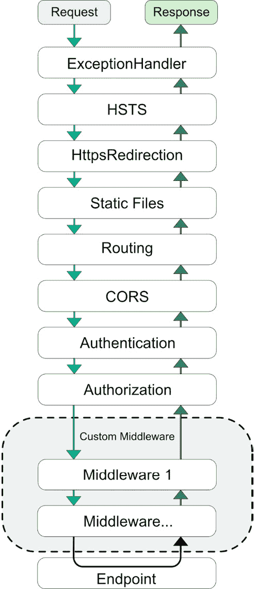
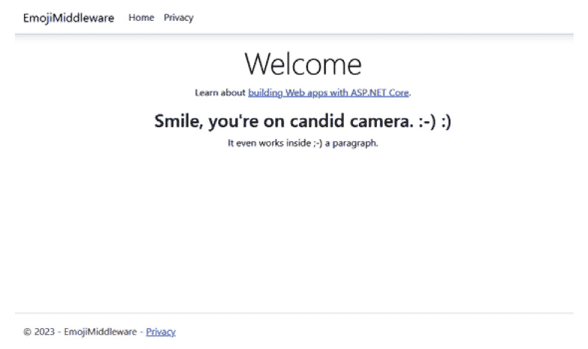
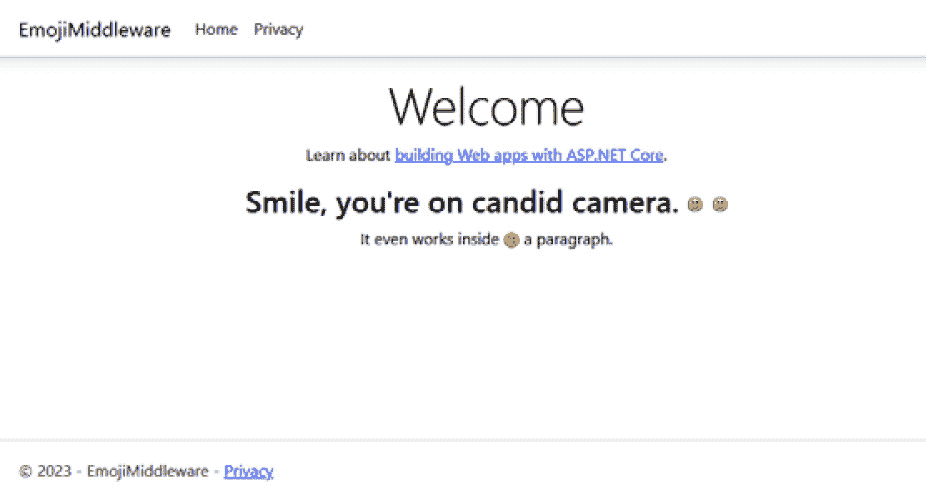

# 中间件的最佳方法

中间件是 ASP.NET Core 中最强大的概念之一。对于传统的 ASP.NET 开发者来说，*中间件*是一个相对较新的术语。在中间件之前，有 HTTP 处理程序和模块，它们需要通过`web.config`进行单独的代码配置。现在，中间件被认为是 ASP.NET 应用程序中的一等公民，使得在单个代码库中维护它变得更加容易。中间件首次在 ASP.NET Core 1.0 中引入，常见的请求和响应概念被认为是应用程序的管道，具有控制请求和响应体的能力。这为创建 ASP.NET Core Web 应用程序的惊人功能打开了众多可能性。

在本章的开头，我们将探讨如何使用中间件以及几乎每个 ASP.NET Core 应用程序中都存在的常见内置中间件组件。接下来，我们将检查三个请求委托（`Run`、`Map`和`Use`）并解释在管道中每个委托的用途。我们还将介绍一些清理中间件的方法，最后将这些概念应用于构建一个简单的中间件示例。

在本章中，我们将涵盖以下主要主题：

+   使用中间件

+   中间件的常见实践

+   创建一个表情符号中间件组件

到本章结束时，您将学习中间件的工作原理，如何编写自己的中间件时使用请求委托和标准，以及如何创建自己的中间件组件。

# 技术要求

由于这是第一章（我们现在是编码领域，所以将有许多章节），包含技术要求，选择支持 ASP.NET Core 7.0 或更高版本和 C#代码的您最喜欢的编辑器将是理想的。我的前三款编辑器如下：

+   Visual Studio（最好是 2022 或更新的版本）

+   Visual Studio Code

+   JetBrains Rider

我们将使用的编辑器是 Visual Studio 2022 Enterprise，但任何版本（社区版或专业版）都适用于本章。

本章的代码位于 Packt Publishing 的 GitHub 仓库中，链接如下：[`github.com/PacktPublishing/ASP.NET-Core-8-Best-Practices`](https://github.com/PacktPublishing/ASP.NET-Core-8-Best-Practices)。

# 使用中间件

中间件是在应用程序启动时配置的软件。需要注意的是，您添加的中间件应基于您的应用程序需求。没有必要添加每个单独的组件。简化中间件管道非常重要，我们将在稍后讨论这一点。

据说，库和框架之间的区别在于，库是从您的应用程序中调用的代码，而框架是以某种方式结构化的，以便调用您的代码。这就是中间件从 ASP.NET 早期版本演变而来的。

在本节中，我们将介绍中间件管道的常见流程以及如何控制中间件组件中的操作。在本节结束时，你将了解中间件管道是如何工作的。

## 理解中间件管道

当你的 Web 应用程序启动时，中间件会在每个**应用程序生命周期**中调用和构建一次。一旦中间件组件被注册，它们将按照一定的顺序执行。在整个管道中，这个顺序很重要，因为每个中间件组件都可以依赖于之前注册的组件。

例如，在配置授权组件之前，认证组件非常重要，因为在我们确定某人能做什么之前，我们需要知道他们是谁。

在**图 3.1**中，我们可以看到标准中间件管道在 Web 应用程序中的组成，我们将在下一节中讨论：



图 3.1 – ASP.NET 8 Web 应用程序的标准中间件管道

这些组件都是可选的，但某些中间件组件依赖于其他组件。当用户请求一个 URL 时，第一个中间件组件会被调用。在这种情况下，它是`ExceptionHandler`。一旦`ExceptionHandler`完成，管道将移动到下一个组件，即 HSTS 组件。随着我们通过每个中间件组件前进，我们最终会到达端点。一旦端点被处理，响应将通过中间件管道以相反的顺序发送回来。

如本节开头所述，你的中间件取决于在添加额外组件时你的应用程序需要什么。如果你的应用程序是一个**单页应用程序**（SPA），包含 CORS、静态文件和路由中间件将非常重要。

每个中间件组件负责根据你的配置将信息传递给下一个组件，或者终止进程。如果他们决定终止管道，它们被称为**终端中间件**组件。它们故意停止中间件处理任何其他请求并退出管道。

## 使用请求代理 - 运行、使用和映射

到目前为止，我们已经讨论了这么多，你可能想知道我们是如何创建管道的。

可用的三个请求代理是`Run`、`Use`和`Map`扩展方法。你无疑在`Program.cs`代码中多次使用过它们，但三者之间有什么区别呢？

### 运行

`Run()`请求代理是严格终端中间件，这意味着它将运行并立即退出管道。它不包含`next`参数。它只是运行并立即终止管道。

如果我们查看以下代码，这将立即终止管道的执行：

```cs
app.Run(async context =>
{
    await context.Response.WriteAsync("This will terminate the web         app.");
});
```

注意在委托中没有引入`next`参数。前面的代码将消息`"This will terminate the web app."`写入浏览器，并立即终止管道。

### 使用

`Use()`请求委托用于在管道中链接多个请求委托。

实现适当的`Use`请求委托的关键是使用`await next.Invoke()`。`next.Invoke()`将按顺序执行下一个中间件组件。在此行之前的内容将在请求上处理，在此行之后的内容将在响应用户时处理。

让我们看看以下代码片段中两个匿名中间件组件的代码示例：

```cs
app.Use(async (context, next) =>
{
    await context.Response.WriteAsync("In the first middleware call.\        r\n");
    await context.Response.WriteAsync("Executing the next         Middleware...\r\n");
    await next();
    await context.Response.WriteAsync("In the first middleware call…on the return trip.\r\n");
});
app.Use(async (context, next) =>
{
    await context.Response.WriteAsync("We're in the second middleware         call\r\n");
    await next();
    await context.Response.WriteAsync("On our way back from the second         middleware call\r\n");
});
```

此代码生成以下输出：

```cs
In the first middleware call.
Executing the next Middleware...
We're in the second middleware call
On our way back from the second middleware call
In the first middleware call…on the return trip.
```

你会注意到在执行`next.invoke()`代码行之前的内容，然后执行顺序移动到下一个中间件。一旦我们到达中间件管道的末尾，我们就返回，这会执行每个中间件`await next();`语句之后的全部代码。

在每个中间件组件执行之后，应用程序运行并按相反顺序返回。

### 映射

`Map()`请求委托旨在根据特定的请求路径或路由分支管道。虽然这是针对特定的中间件条件，但创建一个新的映射几乎是不可能的。通常最好使用预构建的中间件组件，例如`.MapRazorPages()`、`.MapControllers()`或任何其他`.MapXxxx()`方法。这些方法已经设置了预定义的路由。大多数路由发生在其他扩展中，如之前提到的中间件方法。

此外，还有一个`MapWhen()`扩展方法，用于根据给定谓词的结果进行条件中间件分支。例如，如果你想为你的网站创建一个受控的维护页面，你可以使用一个简单的布尔值`underMaintenance`，并使用它来显示一条简单的消息，直到你的网站再次可用：

```cs
app.MapWhen(_ => underMaintenance, ctx =>
    ctx.Run(async context =>
    {
        await context.Response
            .WriteAsync("We are currently under maintenance.");
    })
);
```

在前面的代码中，我们添加了`.MapWhen()`委托来使用特定的布尔值来识别我们是否处于维护状态。注意我们使用`.Run`委托，因为我们不想继续中间件管道的任何进一步操作。这种方法只是中间件灵活性的一个示例。

使用内置中间件组件

虽然你可以创建自己的中间件组件，但最好的方法是查看是否已经存在大量内置组件中的一个中间件组件。整个列表位于[`learn.microsoft.com/en-us/aspnet/core/fundamentals/middleware/?view=aspnetcore-7.0#built-in-middleware`](https://learn.microsoft.com/en-us/aspnet/core/fundamentals/middleware/?view=aspnetcore-7.0#built-in-middleware)。此图表提供了每个中间件组件的描述以及在中间件管道中放置的位置。除了内置组件之外，还可以使用 NuGet 查找创新的中间件组件。

在本节中，我们介绍了中间件管道，学习了如何使用请求代理以及每个请求代理可以做什么，还了解了所有可用于 ASP.NET Web 应用程序的内置中间件组件。在下一节中，我们将检查使用中间件的常见做法。

# 中间件的常见做法

在本节中，我们将回顾在编写自己的中间件时的一些常见做法，以确保你的 Web 应用程序中一切运行得尽可能优化。让我们开始吧！

## 延迟异步操作

当与中间件一起工作时，我们希望获得尽可能好的性能，以便我们的用户可以开始使用应用程序。随着更多用户继续使用应用程序，性能可能会受到影响。

同步操作是指代码执行，应用程序必须等待其完成，这意味着它是单线程的，在应用程序的主线程上运行，但当异步操作执行时，它会创建一个新的线程，并让框架知道在处理完成后调用什么。这通过`async`/`await`关键字表示。

对于大多数中间件操作，当适用时最好使用异步调用。这将提高中间件（和应用程序）的性能，同时提供更好的可伸缩性和响应性。

## 优先级排序

设置你的中间件时，一个非常重要的点是确认所有内容都处于正确的顺序。

将你的应用程序需求与之前的图表进行比较，以确定你需要哪些中间件组件以及它们在 Web 应用程序中的正确顺序。

例如，如果你想包含一个 W3C 日志中间件组件（该组件包含在 Microsoft 提供的内置中间件组件中），它必须位于管道的起始位置，以便记录应用程序中发出的任何后续请求。每个组件在管道中都有其位置。

## 合并现有的中间件

当你创建一个新的 ASP.NET 项目时，你会在`Program.cs`中注意到列出的`app.UseXxx()`集合。虽然这是准备你的管道的“开箱即用”方法，但还有其他方法可以组织和注册应用程序的组件。

一种方法是根据你逻辑上如何将使用情况划分为相似的分组，同时保持组件的相同顺序来使用扩展方法。

一个例子是将所有客户端中间件移动到其自己的扩展方法`.UseClientOptions()`中：

```cs
public static class WebApplicationExtensions
{
    public static void UseClientOptions(this WebApplication app)
    {
        app.UseHttpsRedirection();
        app.UseStaticFiles();
    }
}
```

现在，你的`Program.cs`文件中只包含一行代码，你确切地知道扩展方法的作用：

```cs
app.UseClientOptions();
```

当使用这种方法时，你的`Program.cs`文件会更加整洁、易于维护，并且包含更少的代码行。

其他可能的分区区域如下：

+   `UseDataXxxxx()` – 应用连接字符串的集中位置

+   `UseMapping()/UseRouting()` – 为你的应用和 API 创建一组路由

+   `RegisterDependencyInjection()` – 将类集中到一系列类似于这种分组方法的扩展方法中，但按应用中的部分进行分区 – 例如，`RegisterDIPayroll()`用于注册与应用工资部分相关的类

虽然这只是一些建议，但其概念是缩减`Program.cs`文件的大小，以便其他开发者能够通过更少的代码行数理解这种方法，并且为其他开发者提供足够的清晰度，以便进一步扩展技术。

作为建议，首先包含所有重要的中间件组件，并确认应用按预期运行，然后通过创建你的合并组进行重构。记住，中间件组件的顺序很重要。

## 封装你的中间件

当你创建你的第一个中间件组件时，你可能会有这样的冲动：创建它并以这种方式使用：

```cs
app.Use(async (context, next) =>
{
    app.Logger.LogInformation("In our custom Middleware...");
    // Prepare work for when we write to the Response
    await next();
    // work that happens when we DO write to the response.
});
```

这种方法的一个问题是，如果有很多自定义中间件组件，前面的代码可能会使你的`Program.cs`文件看起来有些杂乱。

一旦你的自定义组件开始工作，最好是将其封装到自己的类中以提高重用性。如果我们使用之前的例子，我们的新类将看起来像这样：

```cs
public class MyFirstMiddleware
{
    private readonly ILogger _logger;
    private readonly RequestDelegate _next;
    public MyFirstMiddleware(ILogger logger, RequestDelegate next)
    {
        _logger = logger;
        _next = next;
    }
    public async Task InvokeAsync(HttpContext context)
    {
        _logger.LogInformation("In our custom Middleware...");
        // Prepare work for when we write to the Response
        await _next(context);
        // work that happens when we DO write to the response.
    }
}
```

在这个例子中，`MyFirstMiddleware`组件是一个简单的类，它只能包含一个`Invoke`或`InvokeAsync`方法。如前所述，我们将使用`InvokeAsync`异步方法。

如果你想知道`ILogger`是如何传递的，ASP.NET Core 有一系列类自动注册到其开箱即用的依赖注入库中。`ILogger`就是其中之一，所以我们不需要担心将其传递到我们的`MyFirstMiddleware`组件中。

我们可以在`Program.cs`文件中使用我们的类，如下所示：

```cs
app.UseMiddleware<MyFirstMiddleware>();
```

然而，由于我们是优秀的 ASP.NET 开发者，我们当然可以改进代码。大多数中间件组件都有附加的扩展方法来简化它们的使用（我们现在将添加以下代码）：

```cs
public static class MyFirstMiddlewareExtensions
{
    public static IApplicationBuilder UseMyFirstMiddleware(
        this IApplicationBuilder builder)
    {
        return builder.UseMiddleware<MyFirstMiddleware>();
    }
}
```

现在的`Program.cs`文件更加简单和整洁：

```cs
app.UseMyFirstMiddleware();
```

这些简单的实践使得开发者在重用和封装方面的生活更加轻松。

在本节中，我们通过使用异步调用、优先考虑组件的顺序以及将现有的中间件合并到扩展方法中，介绍了一系列编写可维护和高效中间件的标准方法。我们还探讨了如何通过创建类和扩展方法来封装组件，使代码更容易阅读。

# 创建 Emoji 中间件组件

随着表情符号（对不起，是 emoji）在 2000 年代的兴起，许多遗留网站使用老式的基于文本的表情符号而不是更现代的 emoji。遗留的**内容管理系统**（**CMS**）在其内容中必须有很多这些基于文本的字符。要将网站的内容更新为用适当的 emoji 替换所有这些表情符号，听起来非常耗时。

在本节中，我们将应用我们的标准来创建一个 emoji 中间件组件，其中如果检测到基于文本的表情符号，它将将其转换为更现代的 emoji。

## 封装中间件

使用这个新的中间件组件，我们希望在`EmojiMiddleware.cs`中创建它自己的类。

这里是我们组件的第一个草稿：

```cs
public class EmojiMiddleware
{
    private readonly ILogger _logger;
    private readonly RequestDelegate _next;
    public EmojiMiddleware(ILogger logger, RequestDelegate next)
    {
        _logger = logger;
        _next = next;
    }
    public async Task InvokeAsync(HttpContext context)
    {
        await _next(context);
    }
}
public static class EmojiMiddlewareExtensions
{
    public static IApplicationBuilder UseEmojiMiddleware(
        this IApplicationBuilder builder)
    {
        return builder.UseMiddleware<EmojiMiddleware>();
    }
}
```

虽然这并不非常令人兴奋，但这个样板代码符合之前提到的构建中间件组件的所有标准，包括以下内容：

+   封装的中间件组件

+   使用异步方法（`InvokeAsync()`）

+   用于重用和可读性的扩展方法

我们现在可以专注于转换过程。

## 检查组件的管道

在中间件中，有两种处理请求和响应的方式：使用流或管道。虽然管道是高性能的更好选择，但我们将专注于我们的`EmojiMiddleware`流。我们将在后面的章节中探讨管道。

我们的中间件流位于`HttpContext`的`HttpRequest.Body`和`HttpResponse.Body`中。在我们的`Invoke`方法中，我们方便地传入一个`HttpContext`。

我们的首要任务是创建`EmojiStream`。这将接受一个简单的响应流并将其读入内存。一旦我们有了 HTML，我们就可以搜索和替换我们的表情符号。我们需要一个映射来识别基于文本的字符以及在我们的 HTML 中用哪个图像来替换它们。

为了让我们的工作更轻松一些，我们将继承自`Stream`基类，并简单地重写特定方法以满足我们的需求。我们的`EmojiStream`类只需要实现基于文本的表情符号到表情的映射和`.Write()`方法，如下面的代码所示：

```cs
public class EmojiStream: Stream
{
    private readonly Stream _responseStream;
    private readonly Dictionary<string, string> _map = new()
    {
        { ":-)", " :) " },
        { ":)", " :) " },
        { ";-)", " ;) " }
    };
    public EmojiStream(Stream responseStream)
    {
        ArgumentNullException.ThrowIfNull(responseStream);
        _responseStream = responseStream;
    }
    public override bool CanRead => _responseStream.CanRead;
    public override bool CanSeek => _responseStream.CanSeek;
    public override bool CanWrite => _responseStream.CanWrite;
    public override long Length => _responseStream.Length;
    public override long Position
    {
        get => _responseStream.Position;
        set => _responseStream.Position = value;
    }
    public override void Flush()
    {
        _responseStream.Flush();
    }
    public override int Read(byte[] buffer, int offset, int count)
    {
        return _responseStream.Read(buffer, offset, count);
    }
    public override long Seek(long offset, SeekOrigin origin)
    {
        return _responseStream.Seek(offset, origin);
    }
    public override void SetLength(long value)
    {
        _responseStream.SetLength(value);
    }
    public override void Write(byte[] buffer, int offset, int count)
    {
        var html = Encoding.UTF8.GetString(buffer, offset, count);
        foreach (var emoticon in _map)
        {
            if (!html.Contains(emoticon.Key)) continue;
            html = html.Replace(emoticon.Key, emoticon.Value);
        }
        buffer = Encoding.UTF8.GetBytes(html);
        _responseStream.WriteAsync(buffer, 0, buffer.Length);
    }
}
```

在代码的开始处，我们创建了一个映射，用于在 HTML 中查找表情符号。`EmojiStream`类相当常见，除了`WriteAsync()`方法。我们将使用`GetString()`方法获取 HTML 并搜索响应中的每个表情符号。如果我们找到它，我们将用图像标签替换它，最后将字节写回流中。

由于我们专注于在中间件中使用流，我们将流传递给构造函数而不是创建一个新的实例。

在中间件部分完成后，我们可以在我们的类中使用 `EmojiStream`：

```cs
public class EmojiMiddleware
{
    private readonly RequestDelegate _next;
    public EmojiMiddleware(RequestDelegate next)
    {
        _next = next;
    }
    public async Task InvokeAsync(HttpContext context)
    {
        using var buffer = new MemoryStream();
        // Replace the context response with our buffer
        var stream = context.Response.Body;
        context.Response.Body = buffer;
        // Invoke the rest of the pipeline
        // if there are any other middleware components
        await _next(context);
        // Reset and read out the contents
        buffer.Seek(0, SeekOrigin.Begin);
        // Adjust the response stream to include our images.
        var emojiStream = new EmojiStream(stream);
        // Reset the stream again
        buffer.Seek(0, SeekOrigin.Begin);
        // Copy our content to the original stream and put it back
        await buffer.CopyToAsync(emojiStream);
        context.Response.Body = emojiStream;
    }
}
```

虽然我们的中间件组件接受一个简单的 `RequestDelegate`，但组件的大部分代码都在 `InvokeAsync()` 方法中。首先，我们为我们的响应创建一个新的流。接下来，我们用我们自己的流替换标准响应。当我们从端点返回时，我们创建我们的 `EmojiStream` 实例并将我们的自定义流传递给 `Response.Body`。

由于 `HttpContext` 将 `HttpRequest.Body` 和 `HttpResponse.Body` 作为流公开，因此将 `HttpContext` 传递到自定义中间件组件中更容易。

当然，我们不能忘记我们的扩展方法，它在这里显示：

```cs
public static class EmojiMiddlewareExtensions
{
    public static IApplicationBuilder UseEmojiMiddleware(
        this IApplicationBuilder builder)
    {
        return builder.UseMiddleware<EmojiMiddleware>();
    }
}
```

这个扩展方法被视为一个外观，用于隐藏我们的 `EmojiStream` 在幕后执行的具体细节。虽然我们可以在 `Program.cs` 文件中使用 `builder.UseMiddleware<EmojiMiddleware>()` 语法，但扩展方法使其看起来更专业。

最后需要做的是将 `EmojiMiddleware` 添加到 `Program.cs` 文件中的管道：

```cs
app.UseEmojiMiddleware();
```

在创建一个新的 ASP.NET Core 网站之后，我们将在 Index 页面的底部添加以下 HTML：

```cs
<div class="text-center">
    <h2>Smile, you're on candid camera. :-) :)</h2>
    <p>It even works inside ;-) a paragraph.</p>
</div>
```

当我们运行应用程序而不使用我们的中间件组件时，我们得到以下输出（**图 3.2**）：



图 3.2 – 在我们的 EmojiMiddleware 添加到管道之前

当我们将我们的 Emoji 中间件添加到管道并再次运行我们的应用程序时，我们收到以下输出（**图 3.3**）：



图 3.3 – 在我们的 EmojiMiddleware 添加到管道之后

在本节中，我们通过将逻辑封装在类中来构建我们的第一个中间件组件，使用流检查了组件管道，并在 web 应用程序中使用了中间件组件。

# 摘要

在本章中，我们深入理解了中间件管道、其组件以及在使用 ASP.NET Core 中间件的最佳实践。我们还学习了使用中间件时的常见做法，例如始终使用异步方法、优先考虑顺序、将你的中间件组件组合成组，并将你的中间件封装成类。了解这些中间件概念对于创建可维护和可读的代码至关重要。

最后，我们通过创建一个简单的组件来替换流中的文本为图像来结束本章。

在下一章中，我们将开始探讨将安全性应用于新和现有应用程序。
