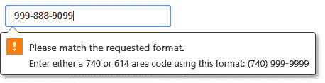
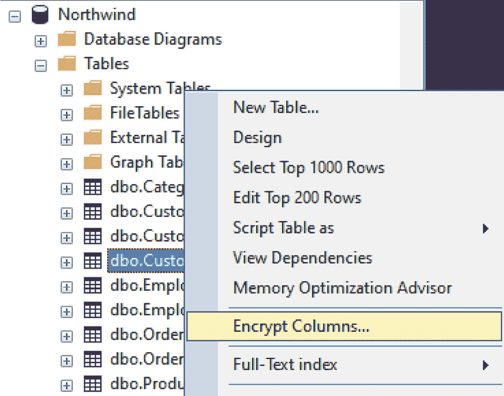

# 第四章：从一开始就应用安全

除了性能之外，在构建网络应用程序时，安全始终应该是首要任务。在互联网威胁不断演变的背景下，如**跨站脚本**（**XSS**）和注入技术，创建安全网络应用程序的能力仍然是一个问题。尽管最好的开发者可以保护应用程序免受最严重的威胁，但大多数攻击是通过人为交互和环境问题成功的。开发者保护其应用程序的最佳方法是从零开始，并尽可能多地设置障碍，以阻止最警觉的攻击者访问他们的系统。

首先，我们将学习如何识别高度敏感数据以及如何确保访问安全。然后，我们将继续讨论常见的安全实践，并提供各种 ASP.NET Core 特性，你可以将这些特性应用到你的应用程序中。最后，我们将回顾根据**开放式全球应用程序安全项目**（**OWASP**）评定的前三大安全威胁，以及如何保护你的应用程序。

在本章中，我们将涵盖以下主要主题：

+   开发安全

+   常见安全实践

+   防御前三大安全威胁

到本章结束时，你将了解什么被认为是敏感数据，行业中的各种常见安全实践，以及根据 OWASP 基金会如何保护自己免受前三大威胁。

# 技术要求

尽管我们将在本章讨论安全，但大部分讨论将包含你可以包含到你的项目中的小段代码。理解开发者级别的安全基本要素不需要访问代码编辑器。

本章的代码文件可以在以下位置找到：https://github.com/PacktPublishing/ASP.NET-Core-8-Best-Practices。

# 开发安全

在本节中，我们将检查有关如何识别需要保护的数据的术语和概念，并解释三种极其重要的保护网站的方法。

太频繁地，当开发者开始构建一个 ASP.NET 网络项目时，安全通常是在项目结束时才被应用，而不是主动地意识到安全措施。实现安全的一种方法是在你的应用程序中检查，并寻找以下这些高度敏感的数据：

+   名称和位置

+   用户名和密码

+   联系信息（电话号码、电子邮件地址等）

+   社会安全号码

+   财务信息（客户计划、信用卡等）

+   数据库连接

+   自定义设置

根据网络应用程序的目的，可能还会涉及其他类型，例如对权限隐含的特定区域的访问。根据行业或甚至政府法规，某些类型的数据可能被认为是敏感的。

应根据以下章节中讨论的标准来检查应用程序中的安全。

## 我是否有任何敏感数据需要保护？

根据您应用程序和上一节中的列表，问问自己：“如果任何数据泄露并公开，会出现问题吗？”

从上述来源暴露任何数据将是一场灾难。使用加密、访问控制和安全的编码实践来保持敏感信息的安全，并且仅在必要时使用。

## 我是否通过应用程序暴露了任何内容？

当从一个网页切换到另一个网页时，我在浏览网站时是否传递了敏感信息？应用程序是否在 URL 中使用主键？数据是如何传递到下一页的？

注意用户可见的线索，这些线索包含诸如主键或敏感信息等信息。我们将在本章后面讨论这一点。

## 我是否清理了用户输入？

当从用户那里请求输入时，始终是一个好习惯对数据进行清理。清理，或称为擦洗，是获取用户输入并确认它不是可能损害系统的恶意内容的过程。一种哲学是永远不要信任提交的数据。

在客户端使用 JavaScript/HTML 进行轻量级验证，同时在服务器端进行大量验证和数据清理，这一点极其重要。

轻量级验证包括确保所需字段已填充，并包含最小和最大数据长度，以及某些字段符合特定格式（如电话号码、信用卡等）。

重量级验证将重申轻量级验证，但也会确认各种场景，例如用户有权访问某些内容，引用的实体存在，或数据伪装以造成恶意活动。

## 保护访问

在构建网站时，最好考虑用户是否需要登录到您的网站。如果您正在创建一个博客，用户不需要登录就可以查看帖子。他们只需匿名查看即可。

然而，如果您要求用户登录到您的网站，您必须了解至少三个强制性的要求，才能开始保护您的应用程序。我们将在接下来的章节中探讨它们。

### 验证

当验证用户时，您在用户登录到您的系统时正在*识别和验证他们的身份*。

这是微软身份框架的核心概念。它提供了各种方法来验证用户，无论是使用用户名/密码，还是使用第三方社交网络（如 Facebook、Google 或 Twitter），使用**双因素认证**（**2FA**），甚至使用第三方验证器。

您可能已经在网站上体验过这种情况，您需要输入用户名和密码。这是验证用户的第一步。一旦验证通过，您将被要求输入发送到您的电子邮件或手机上的验证器应用程序的代码。这是第二步。

许多网站使用用户名和密码进行登录。虽然这是保护网站的最基本方法，但在验证用户时实施额外的安全措施可能会有所帮助。

再次强调，创建尽可能多的额外障碍来保护你的应用程序免受攻击者侵害是一个更好的方法。障碍越多，你的网站被破坏的可能性就越小。

### 授权

一旦用户完成身份验证，他们可以在系统中做什么？这就是授权介入的地方。

授权是**在系统或网站上允许做某事的进程**。例如，博客的作者在登录时可以更新他们的文章，但除非管理员授权，否则他们不允许编辑其他文章。为了实现这一点，需要一个授权系统。

如在**身份验证**部分所述，Microsoft 的 Identity 框架包含各种技术，用于在整个系统中实现基于角色和基于用户的声明。在我们之前的例子中，我们提到作者只能更新他们自己的文章。在一个基于角色的系统中，作者可以被分组到一个“作者”角色中，允许他们创建和更新他们自己的文章。在一个基于用户的系统中，可以在用户级别分配特殊权限，例如编辑其他作者的文章。

虽然 Microsoft Identity 足够灵活，可以整合任何类型的授权机制，但开发者在编写代码之前应该从一开始就考虑如何构建应用程序级别的授权。

当你确定登录用户可以在你的网站上做什么（以及不能做什么）时，授权非常重要。

### 安全套接字层（SSL）

如果你正在构建一个网站，SSL 是**绝对必需的**。

拥有启用 SSL 的网站是必要的，原因如下：

+   你想让你的访客知道他们在一个安全的网站上。

+   它防止同一网络上的其他人查看你的登录凭证。

+   HTTPS 有助于防止**中间人攻击**（**MITM**），攻击者将自己插入两个用户之间的对话中，可能会更改数据交换。

+   **搜索引擎优化**（**SEO**）。谷歌和其他搜索引擎将 HTTPS 作为排名信号（参考：https://developers.google.com/search/blog/2014/08/https-as-ranking-signal）。如果你想增加你的网站在搜索结果中达到第一名的机会，你应该让你的网站启用 SSL。

大多数托管公司**免费**为你的网站提供 SSL 证书。这就是 SSL 对网站的重要性。

在本节中，我们确定了被认为是敏感数据的内容，并了解了在构建 ASP.NET Core 应用程序时如何使用三个关键概念来确保访问安全。

在下一节中，我们将回顾一些你可以立即在你的应用程序中开始使用的常见安全实践。

# 常见的安全实践

作为一名开发者，安全有时似乎是一个黑盒子。你总是听到网站被黑客攻击的事件，但你自己可能会想，“那不可能发生在我身上，”直到它真的发生。当你亲眼目睹你构建的网站被攻击时，这是一种令人谦卑的经历。

尽管我们即将介绍的技巧只是对 ASP.NET 网站表面的触及，但它们鼓励开发者在其编码中更加*主动*，而不是等到发现被黑客攻击后立即变得*被动*。

在本节中，我们将回顾行业内常见的安全实践，你可以使用这些实践来保护自己，以便你知道你的系统在做什么，并且不会向世界暴露太多。我们将了解不同类型的日志、如何更新库和框架以及如何删除头部信息。我们将通过学习如何加密 Entity Framework Core 数据库列来结束本章。

## 记录

在你创建网站之后，在你可以为所有人铺上红地毯之前，还需要一些额外的功能。

你如何知道你的网站发生了什么？当有人删除帖子时，你会怎么知道？关于交易呢？你的 Web API 完成整个数据呈现请求需要多长时间？这些问题应该通过创建审计跟踪并启用应用程序的一般记录来回答。

审计跟踪是一种日志类型，你可以跟踪用户在你的系统中执行的每一个操作。Microsoft Identity 应该已经内置了用于在应用程序中散布的日志代码。

IIS 日志是一种审计跟踪。每个访问你系统的用户，包括匿名用户，都会通过 IIS 进行记录。这里显示了一个简单的日志条目：

```cs
192.168.15.11, -, 01/01/22, 7:55:20, W3SVC2, -, 182.15.22.90, 4502, 163, 3223, 200, 0, GET, /Index, -,
```

审计跟踪中使用的标准数据将包含以下内容：

+   日期/时间

+   IP 地址/端口

+   URL

+   执行的操作

+   执行操作的用戶

+   执行操作前后的实体状态（可选）

一般记录通常在应用层面而不是系统层面进行。大多数一般记录包括如下数据：

+   日期/时间

+   URL

+   日志类型（信息性、警告或错误）

+   关于操作的评论

+   执行操作的方 法/操作/部分名称

+   过程持续时间（可选）

这些类型的日志在 API 世界中至关重要。这些日志由开发者创建并存储在磁盘或数据库中。一旦你创建了一个 Web API，你可能会想知道它在做什么，以及为什么它需要这么长时间来完成一个请求。日志是了解系统的窗口。那里到底发生了什么？

当涉及到安全时，你的日志就是金子。如果有人冒充其他用户，你可以立即检查日志，识别用户和 IP，并采取必要的措施防止其再次发生。这可以通过重置密码、断开或禁用用户登录，甚至从系统中删除用户来实现。

没有日志记录，你将无法了解系统中发生的事件。

## 保持您的框架和库最新。

每个开发者都有自己的库和框架。在使用.NET 时，有时框架需要更新以防止可能的安全威胁。

一旦你意识到这些安全更新，就有责任更新框架和/或库，或者通知某人*可以*执行更新（如果开发者不允许更新服务器），以防止基于更新漏洞的任何类型的安全威胁。

在我的职业生涯中，有两个.NET 版本存在安全问题，并发布了安全更新以应用于框架。补丁没有立即应用。两周后，发生了安全漏洞，结论是如果两周前应用了补丁，漏洞本可以预防。

对公司来说，那是一个糟糕的日子。

要查看.NET 是否有安全补丁，请参考微软更新目录，网址为 https://www.catalog.update.microsoft.com/home.aspx。

## 总是强制使用 SSL。

如果访客通过 HTTP URL 而不是 HTTPS 到达，最好将他们重定向到您网站的加密部分。

**HTTP 严格传输安全协议**（**HSTS**）是通过响应头由 Web 应用指定的安全增强功能。当浏览器接收到 HSTS 头时，它阻止用户使用不受信任或无效的证书。

然而，使用它有一些限制：

+   现代客户端必须支持 HSTS。

+   HSTS 必须建立一个 HTTPS 连接来建立 HSTS 策略。

+   Web 应用必须检查每个 HTTP 请求，并重定向或拒绝 HTTP 请求。

要在代码中实现这一点，你必须重新检查中间件，并将 HSTS 扩展添加到生产环境中。如果你刚刚创建了一个新的 Web 应用，这将默认自动添加。以下是一个示例：

```cs
var builder = WebApplication.CreateBuilder(args);
builder.Services.AddRazorPages();
var app = builder.Build();
if (!app.Environment.IsDevelopment())
{
    app.UseExceptionHandler("/Error");
    app.UseHsts();
}
app.UseHttpsRedirection();
app.UseStaticFiles();
app.UseRouting();
app.UseAuthorization();
app.MapRazorPages();
app.Run();
```

`app.UseHttpsRedirection()` 方法必须在 `app.UseHsts()` 扩展方法之后出现，以确保用户将访问一个启用了 SSL 的网站。

## 永远不要信任客户端。

我总是将这种方法比作古老的谚语，“腰间系上背带，再系上皮带。”至少你不会被发现裤子掉下来（我将其用作安全隐喻）。

如本章开头所述，这里的意图是尽可能使用 JavaScript 和 HTML 验证和清理客户端提交的数据，然后在表单提交时使用 C#进行额外的验证。

例如，HTML 5 现在几乎在所有浏览器中都可用，能够将某些类型应用于文本输入，例如 `type="number"` 或 `type="date"`。这个输入类型的集合中一个受欢迎的补充是能够添加正则表达式模式，使客户端侧的验证更加容易：

```cs
<input type="text"
       placeholder="Enter a Columbus Phone Number"
       title="Enter either a 740 or 614 area code using this format: (740) 999-9999"
       pattern="^\(?(740|614)\)?(\s+)?[0-9]{3}-?[0-9]{4}$"
       required />
```

此模式允许电话号码中包含 740 或 614 区号。如果模式不匹配，你将收到一个提示信息，说明为什么它无效：



图 4.1 – 输入验证失败的影响

然而，这并不能证明在服务器上忽略验证是合理的。对于用户输入数据的每个字段，当服务器接收到数据时，都应该应用相同的验证努力。

## 总是编码用户输入

在服务器上清理用户输入的最简单方法之一是**编码**。

如果用户输入的数据将在任何时间显示在页面上，最好对数据进行编码以防止 XSS 攻击。编码用户输入的最简单方法是将`HtmlEncoder`依赖注入到方法中以执行编码，如下面的代码片段所示：

```cs
    public async Task<IActionResult> OnGet(
        [FromServices] HtmlEncoder htmlEncoder,
        string q = "")
    {
        PageResults = await PerformTheSearch(htmlEncoder.Encode(q));
        return Page();
    }
```

.NET 已经定义了各种可注入的服务。`HtmlEncoder`就是其中之一，并且可以通过添加`[FromServices]`属性自动注入。一旦我们有了编码器，我们就可以对传入的字符串进行编码，并安全地执行请求的操作。

在本节中，你学习了如何从客户端编码用户输入，使你的网站免受恶意数据的影响。

在下一节中，你将学习如何隐藏服务器向世界传达的信息，以及如何创建可重用的中间件组件。

## 保护你的头信息

默认情况下，HTTP 请求会添加几个头信息以识别服务器、使用的版本、所使用的技术堆栈以及支撑网站的技术。虽然这些默认头信息很有帮助，但其中一些不是必需的，而另一些可以使你的网站更加安全。

在本节中，我们将专注于通过 ASP.NET 的中间件来保护推荐的头部更改。

### 移除服务器头信息

通常情况下，向世界宣布你正在运行的服务器和版本并不是一个好主意，尤其是对于一个匿名用户来说。这样做会暴露你正在运行的 Web 服务器类型，并允许攻击者找到针对 IIS 的特定技术来访问你的 Web 服务器。

在 ASP.NET 中，你可以在`Program.cs`中禁用 Kestrel（ASP.NET 中使用的开源服务器）的服务器头：

```cs
var builder = WebApplication.CreateBuilder(args);
builder.WebHost.UseKestrel(options => options.AddServerHeader = false);
```

当我们将`AddServerHeader`设置为`false`时，头信息不会显示服务器类型和版本。

除了服务器头之外，我们还需要移除`X-Powered-By`头，以避免暴露过多信息。这可以通过中间件实现，如下所示：

```cs
app.Use(async (context, next) =>
{
    context.Response.Headers.Remove("Server");
    context.Response.Headers.Remove("X-Powered-By");
    await next();
});
```

然而，你还需要将其添加到`web.config`文件中，该文件应位于项目的根目录下。以下是`web.config`文件应存在于项目中的唯一原因：

+   压缩配置

+   移除特定的 IIS 头信息

+   自定义 MIME 映射

如果它不存在，将其添加到你的项目中，并添加以下路径以移除`X-Powered-By`头：

```cs
<?xml version="1.0" encoding="UTF-8"?>
<configuration>
  <system.webServer>
    <httpProtocol>
      <customHeaders>
        <remove name="X-Powered-By" />
```

需要移除的其他头部值包括 `X-Aspnet-Version` 和 `X-AspnetMvc-Version`。你应该移除这些头部的原因是它们提供了关于你在服务器上运行的技术详细信息的详细资料。如果有针对 ASP.NET 或 ASP.NET Core MVC 的特定安全漏洞，这些头部会使你的网站更容易被攻击者缩小攻击范围，并导致不可避免的安全事件。

要移除这两个头部，请将以下两行添加到你的 `Program.cs` 文件中的中间件：

```cs
context.Response.Headers.Remove("X-Aspnet-version");
context.Response.Headers.Remove("X-AspnetMvc-version");
```

### 禁止嗅探

当你在头部包含 `X-Content-Type-Options` 时，这告诉浏览器遵守 `Content-Type` 头部中注册的 MIME 类型。这些不应该被更改或遵循：

```cs
context.Response.Headers.Add("X-Content-Type-Options", new
   StringValues("nosniff"));
```

这个标记告诉浏览器这些 MIME 类型是故意配置为避免 MIME 类型嗅探的。这有助于防止基于 MIME 类型混淆的攻击，其中非 MIME 类型可能会被视为有效的 MIME 类型。

### 也禁止框架使用

当浏览器看到 `X-Frame-Options` 头部响应时，它表示浏览器是否应该在 `<frame>`、`<iframe>`、`<embed>` 或 `<object>` 中渲染网页：

```cs
context.Response.Headers.Add("X-Frame-Options", new
    StringValues("DENY"));
```

`X-Frame-Options` 头部防止点击劫持攻击，其中有人可能会使用框架、嵌入或对象将你的内容嵌入到其他网站。将此设置为 `DENY` 可以保护你免受此类攻击。

### 创建一个安全中间件组件

为了完成本节，我们将创建一个简单的中间件组件，我们可以在我们的 .NET Core Web 应用程序中重用它。

由于我们在 *第三章* 中创建了我们的中间件框架，我们可以重用 `RemoveInsecureHeadersMiddleware` 组件的代码，如下所示：

```cs
public class RemoveInsecureHeadersMiddleware
{
    private readonly RequestDelegate _next;
    public RemoveInsecureHeadersMiddleware(RequestDelegate next)
    {
        _next = next;
    }
    public async Task Invoke(HttpContext httpContext)
    {
        httpContext.Response.OnStarting((state) =>
        {
            httpContext.Response.Headers.Remove("Server");
            httpContext.Response.Headers.Remove("X-Powered-By");
            httpContext.Response.Headers.Remove("X-Aspnet-version");
            httpContext.Response.Headers.Remove("X-AspnetMvc-                version");
            httpContext.Response.Headers.Add("X-Content-Type-Options",
                new StringValues("nosniff"));
            httpContext.Response.Headers.Add("X-Frame-Options",
                new StringValues("DENY"));
            return Task.CompletedTask;
        }, null!);
        await _next(httpContext);
    }
}
```

不要忘记我们的扩展方法：

```cs
public static class RemoveInsecureHeadersMiddlewareExtensions
{
    public static IApplicationBuilder RemoveInsecureHeaders(
        this IApplicationBuilder builder)
    {
        return builder.UseMiddleware<RemoveInsecureHeadersMiddleware>();
    }
}
```

我们可以在我们的 `Program.cs` 文件中使用新创建的安全扩展：

```cs
app.RemoveInsecureHeaders();
```

虽然我们已经添加了最明显的头部，但好消息是你可以通过添加额外的头部来更新这个组件，从而进一步提高你网站的安全性。

在本节中，你学习了如何保护你的头部并创建一个可重用的中间件组件，用于所有你的 Web 应用程序。在下一节中，你将学习如何通过加密数据、使用存储过程和使用参数化查询来保护 Entity Framework。

## 保护 Entity Framework Core

Entity Framework Core 是那些让我持续感到惊奇的技术之一。Entity Framework Core 每次发布的版本都提供了一些新的性能提升、改进的技术方法，或者一些其他方法来让我们的工作变得稍微容易一些。

在本节中，我们将了解如何在数据库级别加密我们的数据。

### 加密您的数据

对公司来说最有价值的东西之一就是数据。为了防止攻击，你可以采取的一种安全措施是在表中加密数据。

在本章的开头，我们解释了需要特别注意的数据类型，例如电话号码、电子邮件地址和信用卡数据。

最佳做法是在数据库级别应用安全，无论使用的是 SQL Server 还是类似的数据库。

SQL Server 通过使用 SQL Server Management Studio（**SSMS**）中的“加密列…”选项来加密特定的列，如图*4.2*所示：



图 4.2 – SQL Server Management Studio 中的“加密列…”选项

如果您正在使用 Entity Framework，生成 DbContext 时会考虑安全列。同样，在数据库级别创建加密时，这将是阻止攻击者访问敏感数据的另一个障碍。

在本节中，我们探讨了保护数据的最佳方法——即通过使用 SQL Server 的“加密列…”功能来加密数据。在下一节中，我们将探讨如何保护您的页面免受**跨站请求伪造**（**XSRF**）攻击。

## 使用 Microsoft Entra 保护应用程序

如前所述，在登录网站时，最好通过加密数据库来保护数据库免受入侵者侵害。这意味着使用现有方法而不是编写自定义加密算法。应避免创建自定义加密算法，因为大多数算法都很容易被黑客工具破解。最好使用现有的框架，如 Microsoft Identity（现在称为 Entra）。

随着 Blazor 和 SPA（单页应用程序）的流行，使用 API 保护应用程序可能会很困难。以前，通过 API 使用 Microsoft Identity 需要大量工作，这使得实现安全应用程序变得更加困难。

在最新的.NET 8 中，Microsoft Entra 为**单页应用程序**（**SPA**）的 Web 应用程序的每个安全方面引入了基于 API 的调用。在创建新应用程序时，以下代码将一个启用 Entra 的基于 REST 的 API 添加到应用程序中：

```cs
var builder = WebApplication.CreateBuilder(args);

// Add services to the container.
builder.Services
    .AddAuthentication(JwtBearerDefaults.AuthenticationScheme)
    .AddMicrosoftIdentityWebApi(builder.Configuration.GetSection(“AzureAd”));
builder.Services.AddAuthorization(); 
```

上述代码创建我们的 Web 应用程序，并定义了一个 JwtBearerDefault 身份验证方案，并添加了一个专门针对 Microsoft Identity 的 Web API。

如果 JWT 令牌不是选项，.NET 8 还引入了 Bearer 令牌，如下所示：

```cs
var builder = WebApplication.CreateBuilder(args);

// Add services to the container.
builder.Services
    .AddAuthentication()
    .AddBearerToken();
builder.Services.AddAuthorization();
```

快速编写 API 以及简单的身份验证和授权能力，为使用 Blazor 和 SPA（单页应用程序）编写 Web 应用程序的 Web 开发者提供了更多选择。在探讨创建更好的 Web API 时，我们将在*第九章*中更详细地介绍 Microsoft Entra。

## 使用反伪造保护您的页面

跨站请求伪造，或 XSRF，是指攻击发生的地方，欺骗用户在当前已认证的 Web 应用程序中执行不受欢迎的操作。例如，用户可能会被欺骗在不知道的情况下使用他们的信用卡在不同的网站上。

为了防止通过您的 Web 表单进行 XSRF（跨站请求伪造）攻击，建议的方法是使用反伪造令牌。

要添加一些到我们的中间件中，我们将它们添加到我们的管道中，如下面的代码片段所示：

```cs
services.AddAntiforgery();
```

当创建 HTML 表单时，如果`<form>`标签包含`method="post"`并且以下条件之一为真，则会自动生成反伪造令牌：

+   动作属性为空（`action=""`）

+   动作属性未提供（`<form method="post">`）

如果您在表单标签中附加了其他属性，您可以在表单标签内显式添加一个名为`AntiForgeryToken()`的`HtmlHelper`：

```cs
@Html.AntiForgeryToken();
```

这将生成一个具有任意值的隐藏输入。如果客户端返回的值与服务器最初发送的不相同，则请求将被拒绝。

在本节中，您了解了审计跟踪和常规日志记录，如何保持您的框架和库最新，如何始终强制使用 SSL 以使您的连接安全，以及永远不要信任客户端的输入。您还了解到，每当服务器接收到用户输入时，都应该对其进行编码，如何保护您的标题，如何使用 Entity Framework Core 保护您的数据库，以及最后如何通过使用`.AddAntiForgery()`中间件服务来保护您的表单免受跨站请求伪造攻击。

在下一节中，我们将探讨一些现实世界的问题以及如何根据 OWASP 解决前三大威胁。

# 防御前三大安全威胁

开放式全球应用程序安全项目（Open Worldwide Application Security Project，简称 OWASP）是一个非营利性基金会，致力于提高软件的安全性。由于新的威胁不断出现，他们保持一个名为 OWASP Top 10 的列表，旨在使软件开发者了解最新的安全威胁以及如何预防它们。Top 10 列表包括以下安全威胁：

1.  破坏的访问控制

1.  密码学失败

1.  注入

1.  不安全的设计

1.  安全配置错误

1.  易受攻击和过时的组件

1.  身份识别和身份验证失败

1.  软件和数据完整性失败

1.  安全日志记录和监控失败

1.  **服务器端请求伪造**（**SSRF**）

在本节中，我们将介绍前三大威胁以及如何保护您的 ASP.NET Core 应用程序免受这些威胁——即破坏的访问控制、密码学失败和注入。

## 破坏的访问控制

破坏的访问控制是指用户可以在系统外部执行超出其预期权限的特定操作。软件中可能缺少权限检查，或者软件中可能没有正确检查权限。

在这里需要关注的重点关键字是**授权**。将用户授权进入您的系统是一项重大的责任。

让我们看看如何提高访问控制的水平。

### 默认拒绝访问

当有人访问网站时，请将其视为匿名用户，并限制其访问管理区域。当管理员将某人添加到系统中时，他们现在已通过身份验证，应该能够登录到系统中。

您的授权系统应该进行全面测试。即使用户被允许登录，除非管理员授权，否则他们不应能够做任何事情。

“默认拒绝”意味着当用户使用系统时，他们应该被拒绝访问，直到权限被授予。

对于 Razor Pages，您可以使用`.AddRazorPages()`中间件组件配置来授权某些页面和文件夹，如下面的代码片段所示：

```cs
services.AddRazorPages(options =>
{
    options.Conventions.AuthorizeAreaFolder("Admin", "/Areas/Admin");
    options.Conventions.AllowAnonymousToFolder("/");
});
```

在`AddRazorPages`方法中，我们只允许认证用户进入`Admin`区域；匿名用户只能访问网站的根目录。

对于基于控制器的页面，例如 ASP.NET MVC，您可以使用`[Authorize]`属性允许认证用户查看页面，如下所示：

```cs
[Authorize]
public class MySecretController : Controller
{
    public ActionResult Index()
    {
    }
}
```

在前面的代码中，由于`MySecretController`上存在`[Authorize]`属性，认证用户无法访问`Index`页面。

如果您只想让认证用户可以访问`Index`页面，请将`[Authorize]`属性放在`Index()`方法上，如下所示：

```cs
[Authorize]
public ActionResult Index()
{
}
```

这些技术默认拒绝匿名用户，这应该是正确的做法。

### 避免暴露密钥

当您构建博客时，最好有一个不带帖子 ID 的 URL 作为整数。当我写博客文章时，我见过在页面公开之前我的页面上的点击。看到人们对我的最新帖子感兴趣真是太好了，但他们是如何到达那里的呢？他们会去我的博客，拉出最新帖子，然后给帖子 ID 加`1`。那里就是——一篇未完成的帖子，以其未完成的所有荣耀呈现。

想象一下在银行网站上出现这种情况。用户登录到他们的账户，他们看到以下 URL：https://www.bobsbank.com/view/accountid=511324。

一个好奇的用户可能会将账户 ID 加`1`，然后查看另一个人的账户。

避免向用户暴露账户或主键，并且如果用户猜出了账户号码，在查看之前确认认证用户是该账户的所有者。

### 关于损坏的访问控制的最后注意事项

这里还有一些您应该考虑的事项：

+   审计跟踪和日志是宝贵的。它们将帮助您识别用户的风险和模式。

+   通过运行单元测试和集成测试来确认您的授权系统是否正常工作。我们将在后面的章节中介绍单元和集成测试。

在本节中，我们学习了如何通过默认拒绝用户、隐藏主键以及确认用户是否有权查看特定页面来保护自己免受损坏的访问控制的影响，以及如何实现审计跟踪和日志并测试我们的授权系统。

在下一节中，我们将探讨如何防止密码学失败。

## 密码学失败

OWASP 将加密失败视为未加密的敏感数据、使用无效访问控制的安全措施，甚至包括过时的服务器环境，如不包含最新安全补丁的服务器。这包括使用已在 Microsoft Entra 中包含的行业标准加密算法。

以下部分详细介绍了行业中更常见的事件。

### 明文传输

如果你正在通过电线传输敏感数据，应该使用 SSL 连接对其进行加密。

一个普遍的规则是，客户端应该是向服务器发送敏感数据的一方，而不是反过来。

如果你需要将敏感数据发送回客户端以供批准，最好以某种方式对数据进行屏蔽以供显示（例如，使用 XXXX-XXXX-XXXX-9999 作为信用卡号）并在更新时，通过让已认证的用户重新输入密码或提供某种方式再次验证他们来确认这一点。

### 无效/过期 SSL 证书

一旦你的代码到达服务器，其主要任务是以尽可能快和尽可能安全的方式交付数据。

证书对于 SSL 来说，是创建具有过期日期的安全连接所必需的。应该有一些提醒或通知让管理员知道证书何时过期。不建议在网站上继续使用过期的证书。

### 未加密的数据库

再次强调，如果你的数据库包含敏感信息，最好采取主动措施，使用数据库推荐的加密方法对数据库进行加密。

### 关于加密失败的最后注意事项

让我们来看一些最后的注意事项：

+   避免使用 MD5、SHA1 或 PKCS 1 v1.5 等弱算法，这些算法很容易被破解。

+   避免将敏感数据发送到客户端。如果这是必要的，请屏蔽数据。

+   使用适当的访问密钥管理，将密钥存储在安全位置，如 Microsoft 的密钥保管库、Google 的云密钥管理或 Amazon 的密钥管理服务。

在本节中，我们学习了如何通过避免发送明文、更新过时或无效的 SSL 证书以及始终对包含敏感数据的数据库进行加密来避免加密失败。

在最后一节中，我们将探讨注入如何影响你的应用程序。

## 注入

2017 年，OWASP 报告称，在编写 Web 代码时，SQL 注入是最大的威胁。现在，他们的前 10 名包括仅仅是“注入”，这是一个涵盖 SQL 注入和 XSS 的通用术语。

### SQL 注入

我们已经提到，你永远不应该信任客户端，并且始终清理和编码用户输入，但由于它仍然被视为一种威胁，即使它已经下降到第三位，这一点仍然值得重复。

好消息是，Entity Framework Core 支持参数化查询，可以帮助你避免 SQL 注入。然而，这并不意味着你不需要对用户输入进行清理和编码。

### 脚本注入

脚本注入是指有人在一个文本框中输入一个脚本标签，其值被接受并保存在数据库中。当数据在页面上显示时，脚本被触发并执行特定的操作。

这里有一个简单的扩展方法，它使用正则表达式搜索并销毁 HTML 中的恶意标签：

```cs
public static class StringExtensions
{
    public static string Sanitize(this string content)
    {
        // Replace the malicious tags with nothing.
        var maliciousTagsPattern =
            @"<(applet|embed|frameset|head|noframes|noscript|object|            form|select|option|script|style|title)(.*?)>"+
            "((.|\n)*?)"+
            "</(applet|embed|frameset|head|noframes|noscript|object|            select|form|option|script|style|title)>";
        var options = RegexOptions.IgnoreCase | RegexOptions.            Multiline;
        var regex = new Regex(maliciousTagsPattern, options);
        content = regex.Replace(content, @"");
        // Remove the Javascript function on the tags (i.e.            OnChange="Javascript:<blah blah blah>")
        var inlinePattern = @"<[^>]*=""javascript:[^""]*""[^>]*>";
        options = RegexOptions.IgnoreCase;
        var regex2 = new Regex(inlinePattern, options);
        return regex2.Replace(content, @"");
    }
}
```

虽然`.Sanitize()`扩展方法会从字符串中移除任何恶意标签，如果你传递的是 HTML 格式的文本，它也会移除任何带有 JavaScript 事件的标签（例如`onclick='alert("gotcha");'`）。然后返回清洗后的字符串以供使用。

就像使用其他任何字符串扩展方法一样使用这个扩展方法：

```cs
var sanitizedString = inputFromUser.Sanitize();
```

你甚至可以进一步扩展该方法，使其包括其他安全措施，例如在返回之前对字符串进行编码。

总是验证、过滤和清洗用户输入。无论什么情况。

### 注射攻击的最终注意事项

这里有一些你应该考虑的最终事项：

+   你能将用户（以及有恶意意图的用户）与数据库保持的距离越远，就越好。

+   确保在单行输入上有一个`maxlength`属性，以最小化可接受的字符数并限制在 HTML 输入字段中允许脚本的能力。

注射攻击持续构成一个可信的威胁，并且始终被列入 OWASP 的前 10 大风险列表。

# 摘要

在本章中，我们学习了如何通过理解敏感数据是什么以及如何使用身份验证、授权和启用 SSL 的连接来保护我们的代码。

在本章的第二部分，我们回顾了行业中的某些常见标准，例如日志记录、保持我们的框架和库更新，以及始终重定向到启用 SSL 的站点。之后，我们学习了永远不要信任客户端数据，我们应该验证、过滤和清洗它，并且始终编码它，不要通过添加或删除安全头信息向世界宣布我们正在运行的服务器和版本。我们甚至创建了一个可重用的安全中间件组件。

我们还提到了如何使用 SQL Server 加密数据库列，以及通过主动保护字段的重要性，以及为什么应该避免创建自定义加密算法。我们还学习了如何通过使用反伪造令牌来避免跨站请求伪造。

最后，我们检查了由 OWASP 基金会确定的三大威胁，以及如何正确保护自己免受破坏性访问控制、加密失败和所有类型的注入攻击。

在下一章中，我们将再次讨论 Entity Framework Core，并学习如何通过使用一些直观的技术来优化使用 Entity Framework Core 的数据访问。
