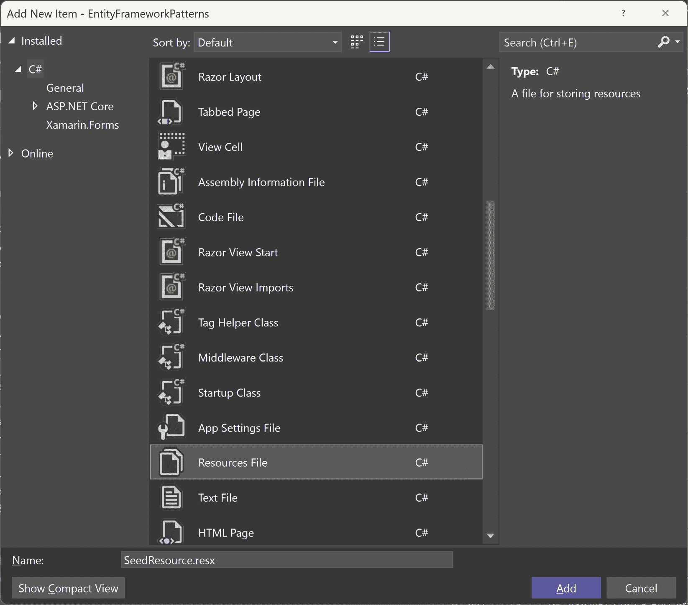
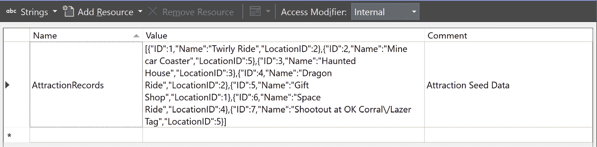
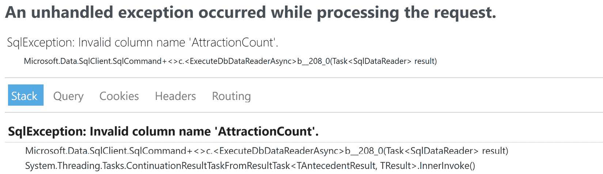

# 使用 Entity Framework Core 优化数据访问

在 2008 年 Entity Framework 介绍之前，开发者使用 **ActiveX 数据对象**（**ADOs**）和 **对象链接和嵌入数据库**（**OLE DB**）来访问其应用程序的数据。自其引入以来，Entity Framework 在这些年来已经发展成为一个高性能的桥梁，连接 **面向对象**（**OO**）系统和关系数据库。它使开发者能够使用 **语言集成查询**（**LINQ**）语法，通过 C# 执行复杂的查询。然而，一些 LINQ 语句可能会让新开发者感到不知所措。由于这是数据访问中最常讨论的话题之一，我们将涵盖使用 Entity Framework Core 时各种标准和实现。

本章将与 *第二章*，*CI/CD – 使用软件构建高质量软件* 相似，我们将回顾实现 Entity Framework Core 访问数据的模式，同时还将查看一些行业中对 Entity Framework Core 的常见使用。

在本章中，我们将涵盖以下主要主题：

+   Entity Framework Core 实现

+   常见的 Entity Framework Core 实践

+   实现主题公园示例

当您阅读完本章后，您将更好地理解您可以使用 Entity Framework Core 的各种设计模式和采用的方法，以及涉及的各种标准；我们将通过将这些标准应用于主题公园示例来结束本章。

让我们开始，通过检查许多开发者使用的各种 Entity Framework Core 常见实现来入门。

# 技术要求

我建议使用您最喜欢的编辑器来查看 GitHub 仓库。我们的建议包括以下内容：

+   Visual Studio（最好是 2022 或更新版本）

+   Visual Studio Code

+   JetBrains Rider

我们将要使用的编辑器是 Visual Studio Enterprise 2022，但任何版本（社区版或专业版）都可以与代码一起使用。

我们还将使用 **SQL Server Management Studio**（**SSMS**）在本章末尾的示例中。但是，如果您觉得您不需要下载另一个工具，您也可以通过 Visual Studio 2022 查看 SQL Server 数据，而无需安装 SSMS。

下载 SQL Server 开发者版

要运行本地副本的 SQL Server，请从 [`www.microsoft.com/en-us/sql-server/sql-server-downloads`](https://www.microsoft.com/en-us/sql-server/sql-server-downloads) 下载 SQL Server 开发者版。

本章的代码位于 Packt Publishing 的 GitHub 仓库中，您可以在此导航：[`github.com/PacktPublishing/ASP.NET-Core-8-Best-Practices`](https://github.com/PacktPublishing/ASP.NET-Core-8-Best-Practices)。

# Entity Framework Core 实现

这些年来，开发者以各种方式使用了 Entity Framework Core。其中一些非常 **有创意**。

在本节中，我们将讨论以下架构方法：

+   仓库/工作单元

+   规格

+   扩展方法

虽然这些实现基于现实世界的经验，但它们仅仅是观察，如*第一章*中提到的，决定将取决于团队和/或社区成员，以及应用程序的正确方法和所承受的权衡。

## 仓库/工作单元

虽然这种实现已经引起了一些开发者的摩擦，但它对于早期采用 ASP.NET Entity Framework 应用程序的开发者（包括我）来说是一个常见的模式。然而，社区成员表示，由于仓库的重复，这并不是在架构上高效使用 Entity Framework 的方法。

### 实现

默认情况下，`DbContext` 遵循 **仓库** 和 **工作单元** 设计模式。

仓库设计模式是一个类，它管理业务域和数据库属性映射之间的对象，使用列表和单个域对象。

仓库在 `DbContext` 中是自包含的，这被认为是工作单元设计模式。工作单元模式管理一系列对象（如仓库所做的那样），使用 `ChangeTracker` 来跟踪事务状态中的更改，并组织每个更改应该如何保存以及如何解决并发问题。

在 Entity Framework 中，仓库以 `DbSet` 实例的形式表示在 `DbContext` 中，其中 `DbContext` 本身就是工作单元。

让我们来看一个例子。我们有一个名为 `ThemePark` 的数据库，它包含两个表：景点和位置。我们还创建了一个 `ThemeParkDbContext` 类来管理我们的实体。如果你在任何时候使用过 Entity Framework，你很可能遇到过以类似方式实现的仓库设计模式：

```cs
public class AttractionRepository
{
    private readonly ThemeParkDbContext _context;
    public AttractionRepository(ThemeParkDbContext context)
    {
        _context = context;
    }
    public List<Attraction> GetAttractions()
    {
        return _context.Attractions.ToList();
    }
    public Attraction GetAttraction(int id)
    {
        return _context.Attractions.FirstOrDefault(e => e.Id == id,             null);
    }
}
```

这种实现有什么问题？虽然这确实将业务规则与数据访问分离，但当 `DbContext` 中已经存在仓库层时，对于应用程序来说，这是一个不必要的层。

我从开发者社区中喜欢的一个笑话是，“*计算机科学中最难的两个问题是什么？缓存失效、命名事物和* *off-by-one 错误*。”

将这视为一个命名错误的情况。如果我们将其名称更改为 `Service`，会怎样呢？

```cs
public class AttractionService
{
    private readonly ThemeParkDbContext _context;
    public AttractionService(ThemeParkDbContext context)
    {
        _context = context;
    }
}
```

为什么是 `Service`？仓库模式已经包含在 `DbContext` 中的 `DbSet<Attraction>` 中。服务使用仓库模式来检索数据并在返回数据之前执行额外的更新。将类名从 `Repository` 更改为 `Service` 表示我们不需要在现有的仓库之上再使用仓库模式。当为单个仓库（`DbSet` 实例）创建服务时，这提供了以下多个好处：

1.  `DbContext`。在 `DbContext` 上添加 `.Include()` 以检索相关实体。

1.  通过构造函数传递 `DbContext` 实例，允许采用多种方法访问数据，包括 LINQ 语句、存储过程，甚至调用原始 SQL。

1.  **附加处理**——在调用数据访问服务时，有时数据在返回结果之前需要更多的处理。虽然在这个服务中这是暂时可接受的，但它可能需要重构到适当的企业实体或通过另一个类进行处理。

通过这种方法看到的益处可以轻松地将现有的存储库命名约定转换为服务名称。

## 规范模式

开发者总是寻求重用现有代码，并使其尽可能灵活以方便维护；更新一行代码可能会改变所需的数据检索。

随着测试驱动开发（**TDD**）的兴起，规范模式正在解决将需求附加到对象上的问题，这使得通过查询检索的结果更容易理解。它使用基类以列表或单个实体形式检索数据，同时编写最少的代码。

### 实现

在创建规范类时，你需要两个类：一个用于处理请求，另一个用于规范所需的内容。规范类构建得正好像其名称所暗示的那样：它定义了单个实体或实体列表的过滤器、排序和分组，以及包含各种相关实体。你可以使用 LINQ 查询做的任何事情都可以在规范类中定义。

一个示例规范（接口）的结构可能如下所示：

```cs
public interface ISpecification<T>
{
    Expression<Func<T, bool>> Filter { get; }
    Expression<Func<T, object>> OrderBy { get; }
    Expression<Func<T, object>> OrderByDescending { get; }
    List<Expression<Func<T, object>>> Includes { get; }
    Expression<Func<T, object>> GroupBy { get; }
}
```

`Specification`类的实现可能如下所示：

```cs
public class Specification<TEntity>: ISpecification<TEntity> where TEntity: class
{
    public Expression<Func<TEntity, bool>> Filter { get; }
    public Expression<Func<TEntity, object>> OrderBy { get; set; } =         null!;
    public Expression<Func<TEntity, object>> OrderByDescending { get;         set; } = null!;
    public Expression<Func<TEntity, object>> GroupBy { get; set; } =         null!;
    public List<Expression<Func<TEntity, object>>> Includes { get; } =         null!;
    public Specification(Expression<Func<TEntity, bool>> filter)
    {
        Filter = filter;
    }
}
```

如本节开头所述，类中的属性代表检索数据的各个方面：过滤、包含、排序和分组。

一旦定义了规范，我们需要一种基于规范构建查询的方法。在这种情况下，我们将创建一个`SpecificationBuilder<T>`类：

```cs
public static class SpecificationBuilder<TEntity> where TEntity: class
{
    public static IQueryable<TEntity> GetQuery(IQueryable<TEntity> inputQuery,
        ISpecification<TEntity> specification)
    {
        var query = inputQuery;
        if (specification == null)
        {
            return query;
        }
        if (specification.Filter != null)
        {
            query = query.Where(specification.Filter);
        }
        if (specification.Includes != null
            && specification.Includes.Any())
        {
            foreach (var include in specification.Includes)
            {
                query = query.Include(include);
            }
        }
        if (specification.OrderBy != null)
        {
            query = query
                .OrderBy(specification.OrderBy);
        }
        else if (specification.OrderByDescending != null)
        {
            query = query
                .OrderByDescending(specification.OrderByDescending);
        }
        if (specification.GroupBy != null)
        {
            query = query
                .GroupBy(specification.GroupBy)
                .SelectMany(x => x);
        }
        return query;
    }
}
```

在前面的代码片段中，我们的`SpecificationBuilder`类创建了一个 LINQ 查询来检索数据。由于一切都是自包含的，并且完全独立于自身，因此该类被标记为静态。

对于每个规范类，我们需要一种检索数据的方法。我们将使该类抽象并命名为`BaseSpecificationService<TEntity>`：

```cs
public abstract class BaseSpecificationService<TEntity> where TEntity : class
{
    private readonly ThemeParkDbContext _context;
    protected BaseSpecificationService(ThemeParkDbContext context)
    {
        _context = context;
    }
    protected ISpecification<TEntity> Specification { get; set; } =         null!;
    protected IQueryable<TEntity> GetQuery()
    {
        return SpecificationBuilder<TEntity>
            .GetQuery(_context.Set<TEntity>().AsQueryable(),                  Specification);
    }
}
```

在前面的代码中，`BaseSpecificationService`是我们将用来创建特定数据需求的。我们需要一个规范属性以及根据该规范检索查询的方法。

使用规范模式，你的类名就是所需数据的规范。

让我们看看另一个使用简单的`Product`类的示例：

```cs
public class Product
{
    public string Name { get; private set; }
    public int Price { get; private set; }
}
```

如果你需要一个所有产品价格低于$5.00 的列表，一个规范类可能看起来像以下这样：

```cs
public class GetProductsLessThanFiveDollars : BaseSpecificationService<Product>
{
    public GetProductsLessThanFiveDollars(InventoryDbContext context) : base(context)
    {
        Specification = new Specification<Product>(product => product.Price <= 5);
    }
}
```

此代码创建规范并使用它来检索结果：

```cs
var productsBelowFiveDollarsSpecification = new GetProductsLessThanFiveDollars(_context);
var results = productsBelowFiveDollarsSpecification.GetQuery().ToList();
```

上述代码将生成一个低于 5 美元的产品列表。

虽然这是一个简单的例子，但还有更多致力于此类 Entity Framework 设计模式的广泛库，例如位于 [`specification.ardalis.com`](https://specification.ardalis.com) 的 Steve Smith 的规范库。

## 扩展方法

如果我们回顾仓库/单位工作方法，特定业务逻辑与数据之间的关联应该相对接近 `DbContext`。为什么不直接将数据访问附加到实际的 `DbSet` 实例本身作为 `IQueryable` 扩展方法，而不是创建传递 `DbContext` 的服务类呢？

能够向 `DbContext` 或 `DbSet` 实例添加特定调用非常吸引人，因为它们可以放置在你的项目的任何位置。

扩展方法方法在特定实体方面确实需要一定的纪律性。例如，如果你创建了一个产品实体，你的 `IQueryable` 扩展方法应该只返回产品，而不是订单实体。将订单扩展方法与产品扩展方法混合通常是不受欢迎的。

### 实现

扩展方法允许你的代码在访问数据时更加直接。

由于我们可以将扩展方法附加到接口，让我们为我们的 `ThemeParkDbContext` 类定义一个简单的接口，如下所示：

```cs
public interface IThemeParkDbContext
{
    DbSet<Attraction> Attractions { get; set; }
    DbSet<Location> Locations { get; set; }
    DbSet<TEntity> Set<TEntity>() where TEntity : class;
    DatabaseFacade Database { get; }
}
```

在我们的主题公园想法中，我们为数据访问创建了 `AttractionExtensions` 和 `LocationExtensions` 文件，如下所示：

```cs
public static class AttractionExtensions
{
    public static List<Attraction> GetAttractions(this IThemeParkDbContext context)
    {
        return context.Attractions.ToList();
    }
    public static Attraction GetAttraction(this IThemeParkDbContext context, int id)
    {
        return context.Attractions
            .Include(t => t.Location)
            .FirstOrDefault(e => e!.Id == id, null)!;
    }
}
```

我们的 `AttractionExtensions` 文件中只有两个方法，`GetAttractions()` 和 `GetAttraction()`，我们将它们附加到 `ThemeParkDbContext` 类。

我们的 `LocationExtensions` 文件同样小巧紧凑，如下所示：

```cs
public static class LocationExtensions
{
    public static List<Location> GetLocations(this IThemeParkDbContext context)
    {
        return context.Locations.ToList();
    }
    public static Location GetLocation(this IThemeParkDbContext context, int id)
    {
        return context.Locations.FirstOrDefault(e => e!.Id == id, null)!;
    }
}
```

在本节中，我们回顾了一些在现实世界应用程序中使用的更常见的 Entity Framework Core 设计模式，例如仓库和单位工作模式、规范模式和访问数据的扩展方法方法。

虽然这些在 .NET 社区中很常见，但还有其他模式可用于 Entity Framework Core，允许更容易地访问你的数据，但它们确实有缺点。让我们更仔细地看看这些：

+   应用程序中的每个分区功能都会存在一个 `DbContext` 实例；例如，一个 `DbContext` 实例用于 `Books` 和 `BookAuthors` 表，另一个 `DbContext` 实例用于 `Orders` 和 `Books` 表。一个可能的缺点是多个 `DbContext` 实例之间可能存在状态冲突（**不推荐**）。

+   在不使用 LINQ 的情况下直接调用存储过程时，将 `DbContext` 实例作为通道。一个缺点是，当对存储过程进行更改且映射代码没有反映返回的结果时，会导致错误。

在下一节中，我们将介绍在现实世界应用程序中使用 Entity Framework Core 的常见实践。

# 常见的 Entity Framework Core 实践

尽管 Entity Framework 模式为您的代码提供了额外的结构，但在使用 Entity Framework 构建应用程序时，还有一些常见的实践需要牢记。

在本节中，我们将回顾 Entity Framework 的一些更常见的用法及其好处：`async`/`await`如何使您的应用程序更具可扩展性，记录查询以优化 SQL 输出，创建资源文件以保存表的种子数据，了解延迟执行，使用名为 `.AsNoTracking()` 的只读方法来加快访问速度，在合理的地方利用数据库，以及使用 AutoMapper 将源对象映射到目标对象。

## 确认您的模型

如果您正在使用数据库优先的方法（即您有一个现有的数据库来工作）来生成模型，在使用 `Scaffold-DbContext` 之前，请确认您所有的索引、关系、标识字段和外键都相应地表示了您的模型。`Scaffold-Database` 命令基于现有数据库创建您的 `DbContext` 实例。在创建 `DbContext` 实例时，该命令会考虑所有因素。

如果您的关系不正确，这将导致在通过您的 `DbContext` 实例访问它们时，您的模型上的导航属性出现问题。本质上，您的导航属性将是空的。

## 使用 Async/Await

对于 I/O 密集型活动，例如数据库操作，使用 `async`/`await` 来创建可扩展的应用程序是有意义的。虽然当在开发机器上运行 Web 应用程序时可能不明显，但使用 `async`/`await` 的真正好处在于当有成百上千的人同时访问网站时。

使用 `async`/`await` 的原因是为了避免阻塞线程请求。当一个请求进入网络服务器时，.NET Framework 维护一个线程池来处理这些传入的请求。对于每个请求，都会从池中取出一个线程来同步处理该请求。在线程被使用期间，直到处理完成之前，没有任何东西可以使用它（“阻塞线程”）。一旦处理完成，线程就会被释放并返回到线程池以处理下一个请求。

当您使用 `async`/`await` 时，您并没有从线程池中取出一个线程。在 `async` 和 `await` 之间的任何内容都不使用线程，这意味着您在长期运行中节省了内存，并允许您的应用程序表现更好。

当涉及到调用 Entity Framework Core 时，出于性能原因，最好使用 `async`/`await`。

## 记录您的查询

大多数 `OptionsBuilder` 类专门用于日志记录，以帮助解决这个问题。

对于使用 Entity Framework 的简单日志记录，将 `.LogTo()` 方法放入您的 `DbContext` 实例的 `onConfiguring()` 方法中，如下面的代码片段所示：

```cs
    protected override void OnConfiguring(DbContextOptionsBuilder optionsBuilder)
    {
        if (!optionsBuilder.IsConfigured)
        {
            optionsBuilder.LogTo(Console.WriteLine);
        }
    }
```

`.LogTo()` 方法接受一个动作或一个函数，用于指定发送日志数据的位置。在这个片段中，我们只是将日志记录到调试窗口中。

将简单的日志记录到调试窗口是最容易实现的，因为它是一个简单的`Console.Write()`方法，不需要任何第三方包，但还有其他类型的日志记录可供选择，它们同样容易集成到 Entity Framework Core 中。

其他日志记录选项

对于 Entity Framework Core 中的其他日志记录方法，请访问以下 URL：[`learn.microsoft.com/en-us/ef/core/logging-events-diagnostics/`](https://learn.microsoft.com/en-us/ef/core/logging-events-diagnostics/)

## 使用资源文件处理大量种子数据

如果您需要少于 20 条记录的初始种子数据，只需在您的`DbContext`实例中即时使用`.HasData()`手动编码记录即可。

但如果您有一个在初始加载时需要数百条记录的表怎么办？使用代码手动输入记录可能会很痛苦。

.NET 中的一个隐藏宝藏是使用资源文件来存储简单的字符串（通常用于本地化/翻译），但它也可以用于填充种子数据。

让我们使用我们的`Attraction`/`Location`表示例，并展示在资源文件中创建种子数据的步骤：

1.  打开 SQL Server Management Studio。

1.  确认每个表（`Attraction`和`Location`）中创建的种子记录符合您的期望。

1.  执行一个带有 JSON 子句的`SELECT`操作，如下面的 SQL 片段所示：

    ```cs
    SELECT
         [ID]
         ,[Name]
         ,[LocationID]
    FROM [dbo].Attraction
    FOR JSON AUTO, INCLUDE_NULL_VALUES
    ```

1.  点击结果，将打开一个新的结果面板，其中包含您的 JSON。JSON 将看起来像这样：

    ```cs
    [{
            "ID": 1,
            "Name": "Twirly Ride",
            "LocationID": 2
        }, {
            "ID": 2,
            "Name": "Mine car Coaster",
            "LocationID": 5
        }, {
            "ID": 3,
            "Name": "Haunted House",
            "LocationID": 3
        }, {
            "ID": 4,
            "Name": "Dragon Ride",
            "LocationID": 2
        }, {
            "ID": 5,
            "Name": "Gift Shop",
            "LocationID": 1
        }, {
            "ID": 6,
            "Name": "Space Ride",
            "LocationID": 4
        }, {
            "ID": 7,
            "Name": "Shootout at OK Corral\/Lazer Tag",
            "LocationID": 5
        }
    ]
    ```

1.  复制返回的 JSON。

1.  打开 Visual Studio，并通过 Visual Studio 添加资源文件。以下屏幕截图说明了该过程：



图 5.1 – 在 Visual Studio 中创建名为 SeedResource.resx 的资源文件

1.  您的资源文件将自动打开。在我们的示例中，我们将使用以下参数创建资源：

    1.  `AttractionRecords`

    1.  **值**：在此粘贴您的 JSON

    1.  **注释**：（这些是可选的，但添加以供其他开发者识别）

    1.  **访问修饰符**：将其更改为**内部**

您的资源记录应如下所示：



图 5.2 – Resources.resx 文件中的一个示例记录，包含用于吸引表的 JSON

1.  保存您的资源文件。

1.  打开您的`AttractionConfiguration`类，并在您的`DbContext`实例中找到您的`.HasData()`吸引操作，并将其替换为以下代码：

    ```cs
    var records = JsonSerializer.Deserialize<Attraction[]>(
        SeedResource.AttractionRecords);
    if (records != null)
    {
        builder.HasData(records);
    }
    ```

1.  保存并编译您的代码。

如果您需要大量的种子数据，最好创建包含 JSON 数据的资源文件，而不是手动将所有记录编码到代码中。在`DbContext`配置中找到大段大段的 JSON 字符串可能会让一些开发者感到震惊。

## 理解延迟执行

在调用 Entity Framework 时进行延迟执行意味着 LINQ 查询将延迟到需要实际值时才执行。

以下是一个示例：

```cs
var products = this.Products.ToList().Where(r => r.CategoryId == 15);
```

虽然这将返回正确的项目列表，但它的性能并不如它本可以做到的那样好。在`Products` `DbSet`实例之后添加`.ToList()`方法后，整个`Products`表被加载，然后才执行`.Where()`方法。

以下代码片段展示了处理此调用的一种更好的方法：

```cs
var products = this.Products.Where(r => r.CategoryId == 15).ToList();
```

这也将返回正确的产品列表。然而，生成的 SQL 查询将包含一个`WHERE`子句，用于过滤并返回正确的记录列表。这里的区别是第一个查询将返回`Products`表中的所有记录，然后使用`.Where()` LINQ 方法过滤出结果产品列表。记住——LINQ 也可以与数组一起工作。

在第二个查询中，当遇到`.ToList()`方法时，会创建一个`WHERE`子句，并返回一个记录子集，并将其“物化”为实体，这使得此查询非常快。

延迟执行意味着你正在构建查询而不是立即执行它。当你完成查询构建并想要结果时，使用`.ToList()`方法结束你的 LINQ 查询。如果你正在寻找一个实体，使用`.Single()`、`.SingleOrDefault()`、`.First()`或`.FirstOrDefault()`方法结束你的 LINQ 查询。

## 使用.ReadOnly 状态与.AsNoTracking()

当使用 LINQ 检索数据时，`DbContext`实例有一个名为`ChangeTracker`的东西，当实体的状态发生变化时，它会更新。这需要开销——虽然开销很小，但毕竟还是有开销。

如果你在一个只读情况下使用`DbSet`，请在 LINQ 语句的开始处使用`.AsNoTracking()`方法，让 Entity Framework Core 知道它不需要跟踪返回的模型的状态。

例如，以下 LINQ 查询将检索一个`Attraction`对象，而不会更新`ChangeTracker`：

```cs
public Attraction GetAttraction(int id)
{
    return _context.Attractions
        .AsNoTracking()
        .FirstOrDefault(e => e!.Id == id, null)!;
}
```

在前面的代码片段中，我们在`DbSet`实例之后放置了`.AsNoTracking()`方法，让 Entity Framework Core 知道不要跟踪任何内容。

## 利用数据库

虽然创建所有内容在 Entity Framework 中很有吸引力，但有时让数据库执行数据密集型操作会更好。

在一个项目中，我需要在代码中编写大型的 LINQ 查询来将实体检索到内存中。然后，我继续编写代码来计算项目数量、汇总总额，最后将所有类型的子实体关联到主实体集合中。

我意识到我可以通过存储过程来实现所有这些，并且完全绕过 Entity Framework。存储过程处理了这些细节，而 Entity Framework Core 只是检索了结果。

有时，让数据库执行计算数据的繁重工作并提供结果给应用程序是有意义的，因为那是它的职责。

## 避免手动属性映射

当向客户端发送要渲染的实体时，最好创建 **数据传输对象**（**DTOs**）。你只想发送与当前显示的网页相关的最小数据量。

然而，手动编写从左到右的属性赋值会让人感到疲倦。一个建议是使用 AutoMapper。

AutoMapper 可以自动化将属性从一个源对象映射到目标对象。在下面的示例中，我们正在将一个 `Attraction` 对象的属性复制到一个新的 `AttractionDto` 对象。AutoMapper 通过匹配属性并将数据复制到目标对象来为我们处理繁重的工作：

```cs
var config = new MapperConfiguration(cfg =>
    cfg.CreateMap<Attraction, AttractionDto>());
IMapper mapper = new Mapper(config);
var dest = mapper.Map<Attraction, AttractionDto>(attractionObject);
```

`AutoMapper` 非常灵活，满足特定需求，已被从 NuGet 上下载超过 400,000 次，并且被行业中的超过 100,000 名开发者使用。

AutoMapper 库

之前的功能仅触及了 AutoMapper 为开发者所能做的功能表面。要了解 AutoMapper 的全部潜力，请访问以下 URL 的完整文档网站：[`docs.automapper.org/`](https://docs.automapper.org/)。

在本节中，我们了解了 Entity Framework Core 在行业中的常见用法。我们学习了在创建数据库-first `DbContext` 实例之前最好确认你的数据库，以及如何利用数据库的能力而不是手动编写一切，以及如何使用 `.AsNoTracking()` 执行只读查询，为什么最好使用 `async`/`await`，以及为什么在编写 LINQ 查询时理解延迟执行很重要。最后，我们探讨了如何记录你的查询，如何使用资源文件来初始化你的表，以及如何通过使用 AutoMapper 避免手动从左到右映射属性。

在下一节中，我们将对一个简单的 Entity Framework 应用程序应用我们所有的标准，并且甚至学习一些新技术。

# 实现主题公园示例

当涉及到 Entity Framework Core 及其所有功能时，有很多东西需要消化。关于 Entity Framework Core 的书籍有很多；本章将仅触及表面。

Entity Framework Core 推荐

要深入了解 Entity Framework Core，我推荐阅读《Mastering Entity Framework Core 2.0》[`www.packtpub.com/product/mastering-entity-framework-core-20/9781788294133`](https://www.packtpub.com/product/mastering-entity-framework-core-20/9781788294133)。

在本节中，我们将更新一个小型 ASP.NET 应用程序，该应用程序使用 Entity Framework Core，并包含上一节中讨论的所有标准，以及一些额外的技术来更好地理解 Entity Framework Core。

## 概述

在这个示例中，我们将使用我们之前的 `DbContext` 实例以及 `Attractions` 和 `Locations` 表，并使用 SQL Server 创建一个数据库。

运行 Web 应用程序

本节使用的应用程序可在 Packt Publishing 的 GitHub 仓库中的 `Ch5/EFApplication` 下找到。

我们将保持我们的数据访问简单。我们将使用服务方法，接受一个 `DbContext` 实例来检索我们的数据，并从我们的 `DbContext` 模型在 SQL Server 中创建数据库。

## 创建数据库

为了使我们的应用程序正常工作，我们需要在 SQL Server 中创建我们的数据库。由于我们已经创建了 `DbContext` 实例（使用模型优先方法），我们可以使用 Entity Framework Core 迁移来构建我们的表。

要创建你的本地数据库版本，请在包管理控制台（通过 **视图** | **其他窗口** | **包** **管理器** **控制台**）中输入以下内容：

```cs
Update-Database
```

一旦你按下 *Enter*，Entity Framework Core 将定位到 `DbContext` 实例，读取配置文件（`appsettings.json`），并使用连接字符串来创建我们的数据库和表，其中包含种子数据。

## 添加异步只读模式

我们当前的首要任务是应用 `async`/`await` 到正确的服务中，以便我们以后可以扩展应用程序。如果你正在使用带有 Entity Framework 的现有 ASP.NET 应用程序并想使用 `async`/`await` 方法，最好从数据库开始。如果你正在创建一个“绿色”项目（即从头开始），立即使用 `async`/`await` 方法以避免将来头疼。

在 `AttractionService` 和 `LocationService` 类中，我们可以将所有 LINQ 调用转换为以下形式：

```cs
public List<Attraction> GetAttractions()
{
    return _context.Attractions
        .ToList();
}
```

我们将它们转换为以下形式，使用 `async`/`await`：

```cs
public async Task<List<Attraction>> GetAttractionsAsync()
{
    return await _context.Attractions
        .ToListAsync();
}
```

此外，由于我们不会创建、更新或删除数据，我们可以安全地说这是一个只读查询。因此，我们可以将 `.AsNoTracking()` 方法应用于查询，如下所示：

```cs
public async Task<List<Attraction>> GetAttractionsAsync()
{
    return await _context.Attractions
        .AsNoTracking()
        .ToListAsync();
}
```

如前所述，`.AsNoTracking()` 方法将减少 Entity Framework 的开销，因为我们不是跟踪模型的状态，而只是简单地填充模型。

## 包含子实体

当我们查询我们的景点时，我们还想获取景点的位置。我们如何在查询中包含位置（存储在单独的表中）？

当我们调用 `GetAttractionsAsync()` 方法时，我们放置一个 `.Include()` 方法来检索相关实体。我们修改后的 `GetAttractionsAsync()` 方法如下所示：

```cs
public async Task<List<Attraction>> GetAttractionsAsync()
{
    return await _context.Attractions
        .AsNoTracking()
        .Include(r=> r.Location)
        .ToListAsync();
}
```

`.Include()` 方法在很大程度上依赖于你在构建模型时创建的数据库关系。我将回想起我们之前讨论的“确认你的模型”最佳实践。Entity Framework Core 使用模型的关系来加载相关实体。

## 扩展你的模型

在我们的 `Location` 模型中，我们需要一种方式来知道一个位置上有多少个景点；我们需要一个新的属性，称为 `AttractionCount`。

虽然这是一个添加到 `Location` 类中的简单属性，但这里需要做出多个决定。

首先，让我们在 `Partials` 文件夹下创建一个具有相同类名的新文件，名为 `Location`：

```cs
namespace EFApplication.DataContext.Models;
public partial class Location
{
    public int AttractionCount { get; set; }
}
```

在前面的代码片段中，某些内容可能看起来有些奇怪。尽管文件位于 `Partials` 文件夹中，但**部分命名空间必须与实体主模型相同的命名空间**，部分才能正常工作。.NET 项目通常遵循命名空间与文件夹结构匹配的约定。

当我们运行应用程序时，我们应该会遇到 `Location` 模型当前存在的问题，如下所示：



图 5.3 – 在实体框架对象上创建属性时的错误信息

Entity Framework Core 告诉我们的是，表中没有 `AttractionCount` 字段，因为它不存在，所以它不能填充该属性。

我们有三个选项，如下所示：

1.  在属性上放置一个 `[NotMapped]` 属性，这样它就不会尝试填充属性，并手动计算我们的景点数量。

1.  创建一个 SQL Server 函数来计算一个名为 `AttractionCount` 的计算属性，并返回它，以便它可以填充我们的额外属性。

1.  自动计算模型中已有的景点数量。

让我们专注于快速成功实施**选项 3**。

虽然我们确实需要一个 `[NotMapped]` 属性，这样 Entity Framework Core 就不会尝试加载它，但我们将属性改为 `expression-bodied` 属性。我们可以将其制作为一个自动属性（`{get;set;}`），但我们只使用它作为 `get` 属性，如下面的代码片段所示：

```cs
public partial class Location
{
    [NotMapped]
    public int AttractionCount => Attractions.Count;
}
```

请记住，这是假设你在 SQL Server 实例中创建了一个外键关系，用于在加载位置时加载景点。如果你没有 `.Include()` 方法，你的景点计数将为 0。

在本节中，我们学习了如何使用模型优先方法创建数据库，如何使用 `.AsNoTracking()` 方法添加异步、只读模式，以便状态不会附加到对象上，如何在检索父模型时包含子实体，以及最后如何使用部分类扩展模型，并将 `[NotMapped]` 属性附加到属性上，让 Entity Framework 知道它是否应该将字段映射到属性。

# 摘要

在本章中，我们学习了三个不同的 Entity Framework Core 模式，包括仓储模式和单位工作模式、规范和扩展方法，以及如何将它们实现到自己的项目中。

然后，我们检查了行业的一些标准，例如确认你的模型，将 `async`/`await` 添加到你的 LINQ 调用中，实现日志记录，使用资源文件进行数据初始化，以及理解延迟执行。

我们还回顾了如何执行只读查询以及如何通过让数据库执行数据密集型过程来利用数据库。

最后，我们将这些标准应用于一个现有应用程序，通过使用模型优先的方法创建我们的数据库，然后检查如何使用 `.AsNoTracking()` 方法添加异步、只读模式，以便状态不会附加到对象上，如何在检索父模型时包含子实体，以及最后如何在扩展模型的同时让 Entity Framework 知道哪些属性需要填充以及哪些属性需要忽略。

在下一章中，我们将学习使用 MVC、Razor Pages、ViewComponents、HTMLHelpers 和 Task Runners 的 UI 标准。
