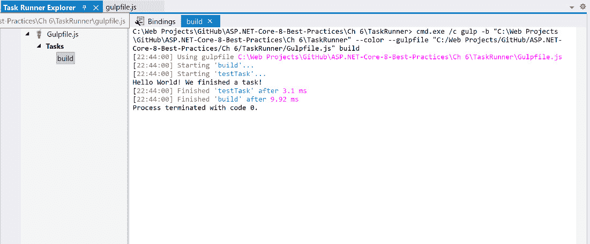
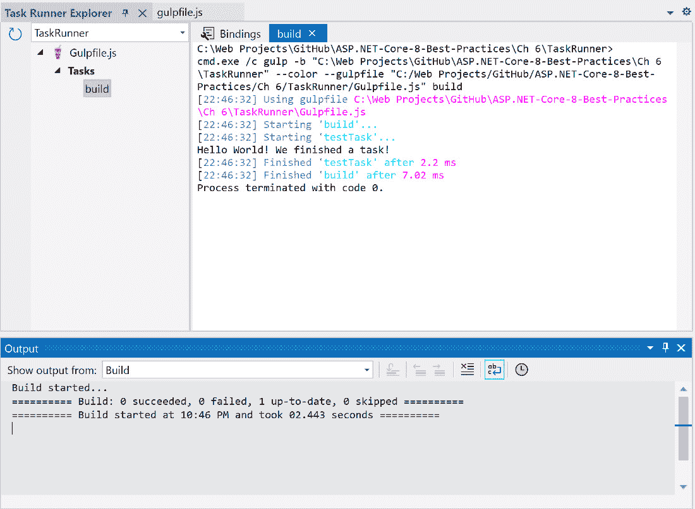
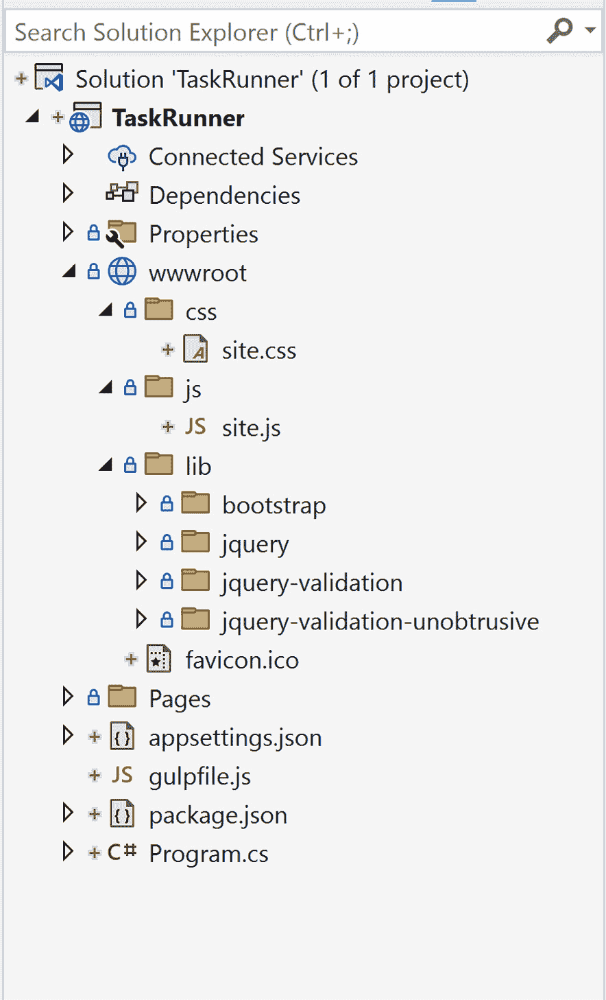
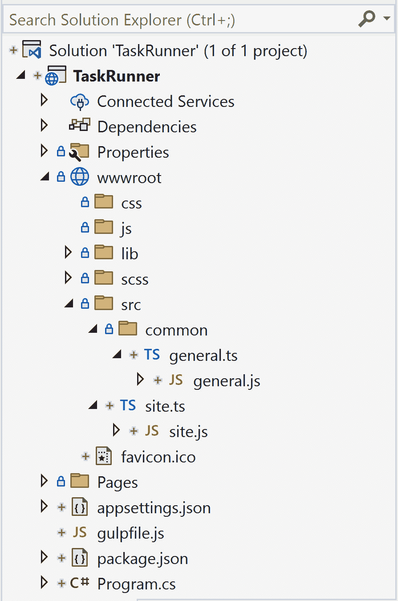

# 第六章：Web 用户界面的最佳实践

当使用 ASP.NET 8 创建 **用户界面**（**UI**）时，可能会让人感到害怕，因为大多数开发者都习惯了使用 C#。在创建 Web 应用程序时需要考虑许多因素，例如避免重复、识别可重用组件的类似界面、创建结构化的网站，以及使搜索引擎更容易索引网站——这个过程称为 **搜索引擎优化**（**SEO**）。

在本章中，我们将涵盖以下主要主题：

+   使用任务运行器

+   将标准应用于 UI

+   介绍 Buck’s 咖啡店项目

在第一部分，我们将探讨为什么任务运行器对开发者来说如此重要，如何设置和自动运行它，以及如何打包和压缩脚本。然后，在下一部分，我们将回顾与 ASP.NET 8 网站相关的许多常见标准，包括集中链接、保持控制器和 Razor 页面小巧、为什么 `ViewComponent` 类比 `HTMLHelper` 类或部分更好，用标签助手替换 HTML 助手，以及为什么创建对搜索引擎友好的 URL 很重要。

最后，我们将创建一个名为 *Buck’s Coffee Shop* 的新项目，应用我们所学的一切。

到本章结束时，我们将了解如何将客户端资源包含到任务运行器中，实施 UI 的常见实践，理解如何使用任务运行器工具将附加功能构建到现有的 Web 应用程序中，使用扩展方法合并链接，并通过创建我们自己的 HTML 标签来扩展 HTML。

# 技术要求

即使是一个简单的 Web UI，Visual Studio 家族的产品也提供了一个使用 IntelliSense 轻松构建 Web 应用程序的方法。我们建议使用您最喜欢的编辑器查看 GitHub 仓库。我们推荐以下选项：

+   Visual Studio（最新版本）

+   Visual Studio Code

+   JetBrains Rider

我们将使用的编辑器是 Visual Studio 2022 Enterprise，但任何版本（社区版或专业版）都可以与代码一起使用。

*第六章* 的代码位于 Packt Publishing 的 GitHub 仓库中，可在 [`github.com/PacktPublishing/ASP.NET-Core-8-Best-Practices`](https://github.com/PacktPublishing/ASP.NET-Core-8-Best-Practices) 找到。

# 使用任务运行器

在本节中，我们将解释什么是任务运行器，它的职责是什么，如何在构建解决方案时自动执行它，并提供一些使用示例。

作为开发者，我们总是在寻找更快地自动化任务的方法。在使用 JavaScript 框架时，这项任务至关重要，尤其是在构建 **持续集成/持续交付**（**CI/CD**）管道中的解决方案时。某些任务的持续重复变得单调乏味，并占用了开发时间。为什么不让计算机处理这项工作呢？

作为开发者，在这一章中包含任务运行器部分的目的在于向开发者展示如何自动化任务，以使客户端工作更加高效。近年来，我遇到了一些从未使用过任务运行器进行客户端任务甚至不知道它是什么的开发者。任务运行器对所有开发者来说都是一个巨大的好处。

## 什么是任务运行器？

随着 JavaScript 的流行，开发者想要一种方法来构建他们的 JavaScript 以及构建他们的解决方案。除了使用 JavaScript 之外，TypeScript 被创建出来，以给 JavaScript 带来更强的类型感，并且也需要一个编译步骤。

除了“编译”TypeScript 之外，大多数网站还需要额外的任务，如压缩和打包 JavaScript 以及优化。当与 C# 和 JavaScript 一起工作时，需要一个工具来使开发者的体验无缝。

这就是为什么创建并集成到 Visual Studio 中的 Task Runner 工具的原因。其主要责任是使用 Grunt 或 Gulp 以及构建脚本来自动化任务。

Gulp 和 Grunt 也是任务运行器，但在定义任务时，每个都有不同的 JavaScript 文件格式。虽然我们可以在 Visual Studio 任务运行器中使用 Grunt 或 Gulp 脚本，但我们将使用 Gulp 格式。

Visual Studio 中的任务运行器是我认为的“客户端的迷你管道”。任务运行器是开发者学习为应用程序创建 CI/CD 管道的一个很好的入门。

## 设置任务运行器

任务运行器在运行脚本时严重依赖于 Node.js。默认情况下，Node.js 应该已经通过 Visual Studio 安装。

要检查您的机器上是否已安装 Node.js，请执行以下操作：

1.  从 **视图** | **其他窗口** 中选择 **包管理器控制台**。

1.  当出现提示时，输入 `npm --version`。如果显示版本号，我们可以进行下一步。如果没有显示，可能需要通过 Visual Studio 安装程序修复 Visual Studio。

1.  输入 `npm install -g gulp --save-dev`。`-g` 选项是为了全局安装 Gulp，而 `--save-dev` 是为了将依赖项保存到 `package.json` 文件中。因此，解决方案中应该添加一个 `package.json` 文件。

1.  在项目的根目录中添加一个新的 JavaScript 文件，命名为 `gulpfile.js`。

根据我们是否使用 Grunt 或 Gulp，任务运行器需要特定的文件。在示例（如我之前提到的）中，我们将使用 Gulp 格式。

## gulpfile 的结构

创建 gulpfile 时，应命名为 `gulpfile.js`。文件应放置在解决方案的根目录中。

gulpfile 的结构包括以下内容：

+   **定义的包**—这些是在 gulpfile 中使用的模块。

+   **处理和清理任务**—每个任务将包含一个处理任务和一个清理任务。

+   **导出分组**—这提供了一个特定顺序中要执行的任务的列表。通常，首先使用清理程序，然后是常规处理任务。

Gulp 需要一个 `gulpfile.js` 文件位于解决方案的根目录。`gulpfile` 的标准布局通常使用以下结构进行分段：

+   `npm` 安装。

+   在 `gulpfile.js` 文件中，应该有两个任务：一个处理任务和一个清理任务。处理任务旨在实现我们想要自动化的内容，而清理任务旨在删除创建或处理过的文件。

+   **全局默认和清理任务**—在构建脚本时将处理和清理任务分段到逻辑分组中。

由于我们已经有我们的文件，我们将为我们的解决方案创建一个简单的任务。将以下 JavaScript 代码复制到新的 `gulpfile.js` 文件中：

```cs
const { series } = require('gulp');
// Packages defined at the top
const gulp = require('gulp');
// Tasks (no cleanup for Hello World) ;-)
function testTask(done) {
    console.log('Hello World! We finished a task!');
    done();
}
// Global default and cleanup tasks
exports.build = series(
    testTask
);
```

由于这是一个构建脚本，我们将使用 Gulp 包中的 `series()` 函数，它定义了顺序过程。这通过第一行表示。第二行创建了一个代表 Gulp 包的 `const` 实例，使我们能够使用 Gulp 函数。

我们为 Task Runner 定义的简单任务是全世界闻名的“Hello World！”任务，通过 `testTask` 函数定义，并传递 `done` 函数，Gulp 为我们处理。

最后，我们将一个 `build` 属性附加到我们的导出中，它定义了一系列来自前面代码的任务。`series` 函数定义在 Gulp 包中。`exports` 命名空间之后的名称可以是 Task Runner 中出现的任何名称。如果构建任务在 Task Runner 中没有显示，请点击 `gulpfile.js` 文件。

当在 **build** 选项上右键单击（或双击），构建将执行并显示结果，如下面的截图所示：



图 6.1 – 我们第一次 Task Runner 流程的结果

在下一节中，我们将学习如何在构建我们的解决方案时自动运行我们的 gulpfile。

## 自动运行

为了帮助自动运行我们的 `gulpfile.js` 文件，我们可以在构建解决方案时将某些任务绑定到事件。在 Task Runner 中右键单击任务以选择构建的适当操作，如下所示：

+   **Before Build**—在编译解决方案之前执行任务

+   **After Build**—在解决方案编译后执行任务

+   **Clean Build**—在执行“Clean Solution”或“Clean <Project>”操作时执行任务

+   **Project Open**—在项目开启后执行任务

当我们选择 `gulpfile.js` 文件时：

```cs
/// <binding BeforeBuild='build' />
```

当我们构建应用程序时，Task Runner 将执行构建任务，如果成功，它将继续编译应用程序，如下面的截图所示。如果不成功，Task Runner 将在结果窗格中显示错误消息：



图 6.2 – 客户端任务和解决方案的成功构建

虽然这为我们应用程序提供了一个基本的基础，但我们需要定义我们的客户端目录结构，以便在添加资源（如图片、脚本和样式）时，我们的任务知道在哪里找到这些资源。

在下一节中，我们将探讨如何设置客户端工作流程的结构。

## 创建工作流程结构

在我们为`gulpfile.js`文件编写脚本之前，我们需要为我们的任务运行器定义一个简单的工作流程。通常，我们的 gulpfile 至少包含一个 JavaScript 和 CSS 打包器和压缩器。哪个先执行并不重要，但它们甚至可以是并行任务集合的候选者。虽然 Visual Studio 为我们创建了服务器端应用程序，但客户端结构需要更多的关注，以确定在整个应用程序中放置文件的位置。

在每个 ASP.NET 8 应用程序中，我们都有一个包含客户端脚本、样式和静态内容（如图片）的`wwwroot`文件夹。这被认为是我们的静态内容根路径，因此如果我们有一个名为[`www.mywebsite.com/`](https://www.mywebsite.com/)的网站，wwwroot 文件夹将是我们的根。例如，如果我们想访问我们的 CSS 文件夹，我们将通过`https://www.mywebsite.com/css/`来访问它。虽然每个资源（如脚本和样式）都有其自己的处理方式和创建生产级输出文件的方式，但需要在我们的任务运行器中有一个工作流程来指导每个任务如何执行。

当前目录结构如下：



图 6.3 – 常见的 ASP.NET 8 结构

上述结构是为生产级应用程序设计的。`css`目录不包含任何用于处理的 SASS 或 LESS 文件，`js`目录只包含简单的 JavaScript 文件。我们需要额外的目录来确保我们的工作流程正常工作。

对于我们的应用程序，我们将使用 TypeScript 和 SASS。SASS 是 CSS 文件的预处理器，需要一个用于源文件的目录（扩展名为`.scss`）。TypeScript 还需要转换为 JavaScript 文件，因此我们将为 SASS 文件创建一个`scss`目录，为 TypeScript 文件创建一个`src`目录。

在`wwwroot`文件夹下创建一个`src`文件夹和一个`scss`文件夹。这些文件夹将包含我们应用程序的源代码。`src`文件夹将包含应用程序的所有 TypeScript 文件，而`scss`文件夹将包含所有准备编译成生产级 CSS 文件的样式。

以下步骤展示了任务运行器的一个常见工作流程：

1.  TypeScript 文件：

    +   将`src`文件夹中的 TypeScript 文件转换为 JavaScript 文件。输出文件将位于`src`文件夹中。输出文件是 JavaScript 文件。

1.  JavaScript 文件：

    +   使用打包器处理`.js`文件。打包器应该自动知道如何根据 JavaScript 模块模式包含所有文件。

    +   使用压缩器处理捆绑的 JavaScript 文件。输出文件从 `src` 文件夹复制到 `js` 文件夹。这些文件也被重命名，以添加 `.min.js` 后缀来标识它们为压缩文件。

1.  样式：

    +   使用“样式编译器”例如 LESS 或 SASS。我们将使用 SASS 来预编译我们的样式。这些文件将位于 `scss` 文件夹中。一旦编译完成，文件夹将包含 `.css` 文件，并不可避免地移动到 `css` 文件夹。

我们应用程序的工作流程结构意味着 `js` 和 `css` 文件夹是生产级别的文件夹，而我们的 `src` 和 `scss` 文件夹是针对开发者修改的特定文件夹。

## 定义我们的工作流程路径

由于我们创建了工作流程结构，我们需要告诉 Gulp 在我们的应用程序中源文件夹和目标文件夹的位置。`path` 模块包含一个 `resolve` 函数，用于在执行过程中连接文件夹名称，如下所示：

```cs
// Packages defined at the top
const gulp = require('gulp'),
      path = require('path');
// define our paths for our app
const basePath = path.resolve(__dirname, "wwwroot");
```

`__dirname` 是一个保留字，基于当前目录（在我们的情况下，这是应用程序的根目录）。`basePath` 用于仅在 `wwwroot` 文件夹及其以下操作，并且不会干扰我们的 ASP.NET 8 应用程序。

## 转译 TypeScript

我们的首要任务是转译我们的 TypeScript 文件为 JavaScript 文件。转译是将 TypeScript 转换为 JavaScript 的过程。对于我们的大多数 TypeScript 项目，我们几乎总是有一个 `tsconfig.json` 配置文件，它将位于 `wwwroot` 文件夹的根目录。然而，我们需要一个特殊的包来专门读取 Gulp 的配置文件。

要包含该包，请按以下步骤操作：

1.  在 `npm install -g gulp-cli`。然后应将其添加到您的 `package.json` 文件中。

1.  在 `npm install gulp@4` 中安装 Gulp 作为项目依赖项。

1.  最后一次在 `npm install gulp-typescript typescript gulp-clean --save-dev` 中安装 TypeScript、`gulp-typescript` 以及删除文件的能力 (`gulp-clean`)。

1.  在 `gulpfile.js` 文件顶部定义模块，如下所示：

    ```cs
    const gulp = require('gulp'),
          path = require('path'),
          tsConfig = require("gulp-typescript");
    ```

1.  使用 `createProject` 函数通过引用 `tsconfig.json` 文件的路由来加载配置，如下所示：

    ```cs
    // define our paths for our app
    const basePath = path.resolve(__dirname, "wwwroot");
    const tsProject = tsConfig.createProject(path.resolve(basePath, 'tsconfig.json'));
    ```

1.  定义 TypeScript 源文件夹，如下所示：

    ```cs
    const tsSource = path.resolve(basePath, "src");
    ```

1.  我们将通过一个源对象来跟踪路径。我们的 `srcPaths` 对象将包含一个指向源代码的 `js` 路径：

    ```cs
    const srcPaths = {
        js: [
            path.resolve(tsSource, '**/*.js')
        ]
    };
    ```

1.  我们需要为 TypeScript 创建处理 (`ts_transpile`) 和清理 (`ts_cleanup`) 函数。以下代码实现了这一点：

    ```cs
    function ts_transpile(done) {
        tsProject
            .src()
            .pipe(tsProject()).js
            .pipe(gulp.dest(tsSource));
        done();
    }
    function ts_clean(done) {
        gulp.src(srcPaths.js, {allowEmpty: true})
            .pipe(clean({ force: true }));
        done();
    }
    ```

1.  `ts_transpile` 函数使用 `tsProject` 配置来定位源文件（通过 `tsconfig.json` 文件末尾附近的 `include` 属性）并将所有 TypeScript 文件转换为同一目录中的 JavaScript 文件。

1.  我们的 `ts_clean` 函数将简单地从每个目录中删除所有 JavaScript (*不是 TypeScript*) 文件。

1.  一旦我们定义了 TypeScript 任务，我们只需将它们添加到我们的 `gulpfile.js` 文件底部的构建过程中，如下所示：

    ```cs
    // Global default and cleanup tasks
    exports.build = series(
        ts_clean,
        ts_transpile
    );
    ```

1.  首先，我们使用 `ts_clean` 删除所有 JavaScript 文件，然后执行 `ts_transpile` 进行转换。

1.  如示例所示，我们的工作流程结构定位所有 TypeScript 文件并将它们转换为 JavaScript 文件：



图 6.4 – src 文件夹中的 TypeScript 文件转换为 JavaScript

由于我们的 TypeScript 现在已转换为 JavaScript，我们可以专注于打包和压缩文件。

## 打包和压缩

从本质上讲，JavaScript 在浏览器中加载需要一段时间。更糟糕的是，如果 JavaScript 文件格式化为可读性，文件加载时间会更长，因此下载速度会变慢。需要一个压缩过程尽可能缩短加载过程，以给用户更好的体验。

打包是将应用程序的脚本和样式合并为一个脚本或样式的过程，而不是加载多个文件。

由于空格和制表符占用空间，压缩脚本和样式是将客户端文件缩小到更小尺寸的过程，以便更快地发送到浏览器。

要打包我们的脚本，我们需要一个名为 Browserify 的模块来处理我们的 Gulp 脚本。让我们开始向 `gulpfile.js` 文件添加打包功能。以下是步骤：

1.  在 `npm install -g browserify gulp-rename vinyl-source-stream vinyl-buffer vinyl-transform gulp-uglify-es` 中。我们应该看到这些模块被添加到 `package.json` 文件中。

1.  一旦这些安装到 `package.json` 文件中，我们需要包含另一个 `srcPath` 对象，其中包含我们想要打包/压缩的所有文件：

    ```cs
    const srcPaths = {
        js: [
            path.resolve(tsSource, '**/*.js') // all *.js in every                                              folder
        ],
        jsBundles: [
            path.resolve(tsSource, 'site.js') // specific files to                                              bundle/minify
        ]
    };
    ```

我们将属性命名为 `jsBundles`。由于每个 TypeScript 文件都已转换为 JavaScript 文件，我们必须确定要加载哪些文件。一个良好的做法是将文件名与实际页面名称相同。好消息是 Browserify 模块将遵循每个文件的导入并将它们包含在打包中。随着我们向项目中添加更多的 TypeScript，将主要脚本添加到列表中以便自动编译。

1.  为网络应用程序中的脚本创建一个新的变量：

    ```cs
    const destPaths = {
        jsFolder: path.resolve(basePath, 'js') // wwwroot/js
    };
    ```

我们将变量命名为 `destPaths`。

1.  接下来，我们创建打包和压缩脚本的预处理和清理：

    ```cs
    /* JavaScript */
    function js_bundle_min(done) {
        srcPaths.jsBundles.forEach(file => {
            const b = browserify({
                entries: file, // Only need initial file, browserify                               finds the deps
                transform: [['babelify', { 'presets': ["es2015"] }]]
            });
            b.bundle()
                .pipe(source(path.basename(file)))
                .pipe(rename(path => {
                    path.basename += ".min";
                    path.extname = ".js";
                }))
                .pipe(buffer())
                .pipe(uglify())
                .pipe(gulp.dest(destPaths.jsFolder));
            done();
        });
    }
    function js_clean(done) {
        gulp.src(path.resolve(destPaths.jsFolder, '**/*.js'), { read: false })
            .pipe(gp_clean({ force: true }));
        done();
    }
    ```

在前面代码片段中显示的 `js_bundle_min` 函数中，我们遍历所有要打包的文件。我们创建一个带有设置选项的 `browserify` 对象并按文件启动打包过程。

第一个过程是获取当前处理文件的基准名称。一旦我们有了文件名，我们可以将基准名称从 `site` 改为 `site.min`，然后在文件末尾添加 `.js` 扩展名。然后我们缓冲文件并对它执行 `uglify` 操作，这意味着我们压缩它。在打包和压缩完成后，我们将文件写入目标文件夹，即 `wwwroot/js`。

`js_clean` 函数会从 `wwwroot/js` 文件夹中删除所有的 `.js` 文件。

1.  最后，我们可以在文件的底部将 `js_bundle_min` 和 `js_clean` 函数添加到我们的构建导出中：

    ```cs
    // Global default and cleanup tasks
    exports.build = series(
        ts_clean,
        js_clean,
        ts_transpile,
        js_bundle_min
    );
    ```

保存 gulpfile 后，双击构建，文件应该会出现在 `wwwroot/js` 文件夹中。如果我们双击 JavaScript 文件，我们会看到它已经被打包和压缩。

## 实现附加任务

虽然打包和压缩脚本是一个大问题，但我们还可以向任务运行器添加其他任务。这些任务可能包括以下内容：

+   SCSS/LESS 预编译

+   图片优化

+   发布说明

+   在构建时从 `node_modules` 复制 `dist` 文件夹到 `lib` 文件夹

这些只是准备网络应用程序时可用的一些简单任务。对于更多任务，请参考 GitHub 上 `TaskRunner` 项目的源代码中的 *第六章*，项目地址为 [`github.com/PacktPublishing/ASP.NET-Core-8-Best-Practices`](https://github.com/PacktPublishing/ASP.NET-Core-8-Best-Practices)。

在本节中，我们回顾了任务运行器的定义及其对开发者的帮助，并展示了如何在构建解决方案时自动执行它。我们还通过创建工作流程结构和定义我们的工作流程路径、如何转换 TypeScript、如何压缩和打包脚本来展示了任务运行器的强大功能。正如我们所看到的，这通过自动化客户端任务和使用单一构建来简化了开发者的体验。

在下一节中，我们将探讨更多的 UI 标准，以及当涉及到 ASP.NET 8 网络应用程序时，哪些被认为是常识。

# 将标准应用于 UI

ASP.NET 的网页模型在多年中不断发展。在 Web Forms 中，它是 `ViewState` 和组件。在 MVC 中，它有部分和 HTML 辅助器。现在，ASP.NET 8 提供了使用 `ViewComponent` 类和 `TagHelper` 类的更高级技术。

对于本节，我们将检查 ASP.NET 8 如何使用其特定于语言的特性来构建更快、更灵活的 UI。我们将看到如何在整个网站上合并链接，为什么保持控制器/页面小很重要，`ViewComponent` 类比部分和 `HTMLHelper` 类更好，以及如何创建 SEO 友好的路由。

## 集中您的网站链接

如果我们有一个拥有数百个链接的大型网站，开发者会明白当一个页面被重命名、移动或（天哪）删除意味着什么。在大型网站上更改每个链接肯定是一个耗时的工作。虽然 `TagHelper` 类是有帮助的，但一个常见的做法是使用 `UrlHelper` 类来合并链接。

让我们检查以下 ASP.NET 8 `TagHelper` 类的网站：

```cs
<a asp-page="Index">Go to Main Page</a>
```

想象一下所有这些在二级页面中指向主页面 `Index.cshtml`，并且我们收到一个请求要更改页面的名称为 `Index2`。

使用扩展方法，我们可以为每个页面创建自定义的特定站点的`UrlHelper`类 URL，如下例所示：

```cs
    Public static class SiteLinkExtensions
    {
        public static string HomeUrl(this UrlHelper helper) =>
            helper.RouteUrl(new UrlRouteContext
            {
                RouteName = "Default",
                Values = new
                {
                    Controller="Home",
                    Action ="Index"
                }
            });
    }
```

扩展方法需要三个东西：一个静态类、一个静态方法，并且方法签名中的第一个参数必须声明`this`。

什么是扩展方法？

关于使用扩展方法的更多详细信息，请导航至[`learn.microsoft.com/en-us/dotnet/csharp/programming-guide/classes-and-structs/extension-methods`](https://learn.microsoft.com/en-us/dotnet/csharp/programming-guide/classes-and-structs/extension-methods)。

我们可以使用`PageLink`方法将此技术应用于 Razor 页面，如下所示：

```cs
Public static string DetailsUrl(this IurlHelper helper, string blogId) =>
    helper.PageLink("Detail", values: new { Id = blogId, area = "admin" });
```

这两种方法之间的唯一区别是扩展方法附加到`IurlHelper`类而不是`UrlHelper`类，对于 Razor 页面，我们使用`.PageLink`方法。

如果使用带有`asp-page`属性的`TagHelper`锚点，这种方法限制了我们的灵活性，因为我们正在多个地方定义一个页面。通过向`UrlHelper`类添加扩展方法，我们可以通过使用 HTML 的`href`属性来简化它，如下所示：

```cs
<a href="@Url.HomeUrl()">Go to Main Page</a>
```

使用`UrlHelper`扩展方法，整个网站的所有链接都更容易集成且更新效率更高。

## 保持控制器/页面的小型化

当 ASP.NET MVC 被引入时，控制器通常是大多数代码的垃圾场，包括对数据库的调用、创建模型和验证模型。

MVC 控制器（以及现在的 Razor 页面）应该是“交通警察”，根据页面的功能将逻辑引导到应用程序的特定部分。

虽然以下列表远非完整，但某些方面可以卸载到 ASP.NET 8 的其他部分，以使控制器和页面更加精简：

+   `[Required]`和`[Email]`。

+   `DbContext`实例和使用 Entity Framework。如果 Entity Framework 不是一个可行的解决方案，请将数据库处理卸载到`Service`类中（参见*第五章*关于 Entity Framework Core）。

+   **次要过程**——如果应用程序包含发送电子邮件、处理记录或构建对象的代码，请将其重构到自己的类中，并将其注入到控制器/Razor 页面中，使其更加整洁且易于测试。

在控制器或 Razor 页面中，大型方法在尝试测试或调试代码时可能会使问题更加复杂。在这种情况下，较小的代码是更好的方法。

## 使用视图组件

当 MVC 引入 HTML 辅助器和部分视图时，将对象传递到一个小部分并创建用于视图的 HTML 片段的能力对开发者来说是一个伟大的功能。然而，使用这两个功能有一些缺点。

使用 HTML 助手的缺点是能够通过代码创建新的 HTML 片段并将其渲染回视图。如果 HTML 发生变化，则需要更新和重新编译代码，违反了**关注点分离**（**SoC**）（“你的 C# 在我的 HTML 中”）。没有与助手关联的 HTML；它必须使用代码创建。

反过来，部分组件引入了在部分中拥有无代码 HTML 的能力，并且可以将对象传递到部分中。这种方法的缺点是能够在 HTML 中放置 `if`…`then` 语句。当在 HTML 中引入 `if`…`then` 语句时，这被视为代码异味（看起来不属于或看起来可疑的代码），并且意味着是业务规则。HTML 应该是声明性的——几乎像模板一样，不涉及分支。

在 ASP.NET Core 中，引入了 `ViewComponent` 类，虽然它们不是为了取代 `HTMLHelper` 类或部分组件，但满足了构建模块化 Web 应用程序更大的需求。被视为“迷你控制器”的 `ViewComponent` 类为 ASP.NET 开发者提供了以下原因的更好方法：

+   **SoC**——通过 HTML 和 C# 的组合，这允许以更好的方式编写模块化组件。

+   `ViewComponent` 类仅渲染视图的一部分而不是整个响应。这使得组件可以独立快速渲染。

+   `ViewComponent` 类在本质上被隔离，这使得它们非常容易测试。创建一个新的 `ViewComponent` 类，传递参数，并测试它是否返回了预期的结果。

`ViewComponent` 类为我们提供了两全其美的解决方案，在单个组件中渲染 HTML 的同时使用 C# 应用业务规则。

额外的 `ViewComponent` 材料内容

关于 `ViewComponent` 类的更多详细信息，请访问 [`learn.microsoft.com/en-us/aspnet/core/mvc/views/view-components`](https://learn.microsoft.com/en-us/aspnet/core/mvc/views/view-components)。

## 使用标签助手而不是 HTML 助手

虽然 HTML 助手提供了创建小段 HTML 的能力（但不要过度使用），但 `TagHelper` 类更进一步。

标签助手和 HTML 助手之间的区别在于 `TagHelper` 类允许我们通过代码构建自己的标签元素，而 `HTMLHelper` 类则直接在 HTML 中作为方法调用。

例如，如果我们正在构建一个酒店应用程序，一些 `TagHelper` 类将包括 `<calendar>`、`<availability>` 和 `<room-gallery>` 标签。这些在 HTML 中看起来像全新的标签，但 ASP.NET 会将它们在服务器上渲染，并根据提供的数据模型创建 HTML。

标签助手（Tag Helpers）是开发者创建自定义领域特定 HTML 标签库的极有力功能。

## 创建 SEO 友好的 URL

在构建网站时，网站架构很重要。如果是一个面向公众的网站，网站应该易于爬取，并且具有简单的 URL。

从另一个角度来看，检查以下两个 URL：

+   `https://www.mysite.com/Blog/my-first-blog-post`

+   `https://www.mysite.com/?blogpost=E1FCFB35-87C7-442F-9516-7C8585E8CD49`

如果我们找到了这些链接，并且正在与某人通电话，我们会告诉他们跟随哪一个？

创建友好的 URL 提供了以下好处：

+   **更容易识别页面**—我们知道第一个 URL 是某人的第一篇博客文章。第二个 URL 是……嗯，我们不知道它是什么类型的页面。

+   **易于重复**—在电话中说第一个 URL 比说 GUID 更容易。

+   **更好的 SEO**—如果我们有机会，总是好的，帮助搜索引擎识别创建的页面类型。

谷歌 URL 结构的最佳实践

为了更好地命名 URL 以及谷歌推荐的做法，请导航至[`developers.google.com/search/docs/crawling-indexing/url-structure`](https://developers.google.com/search/docs/crawling-indexing/url-structure)。

创建这些 SEO 友好的 URL 需要使用映射方法，如`.MapRoute()`，以及如果使用 Razor Pages，命名与内容相关的页面。

在本节中，我们学习了如何使用扩展方法对链接进行分类，如何尽可能使控制器和页面保持小，`ViewComponent`类如何提高编写模块化代码的效率，为什么`TagHelper`类可以将 HTML 提升到新的高度，以及为什么创建 SEO 友好的 URL 如此重要。

在最后一节中，我们将应用我们对实现这些概念的知识到应用程序中。

# 介绍巴克咖啡店项目

在上一节中，我们涵盖了大量的内容，解释了各种概念。解释`ViewComponent`和`TagHelper`类是一回事，但我们在网站上如何应用这些概念呢？

在本节中，我们将将这些概念应用到全新的项目中。我们的朋友想要他的咖啡店有一个新网站，所以我们使用 ASP.NET 8 Web 应用程序模板作为网站的起点。

## 设置巴克网站

由于我们有一个新的网站，我们想要创建客户端管道，这样我们就可以专注于网站的功能。

这听起来像是任务运行器的工作。

虽然我们在项目中包含了 TypeScript 的转译和 JavaScript 的打包/压缩，但我们还可以添加额外的任务来使我们的生活更加轻松。

一个简单的任务是将我们的样式使用 SASS 打包和压缩，如下所示：

1.  在`npm install --save-dev sass gulp-sass`中。这些模块应该添加到`package.json`文件中。

1.  一旦这些被安装到`package.json`文件中，我们就在`gulpfile.js`文件的开头按需包含模块，如下所示：

    ```cs
    gp_sass = require('gulp-sass')(require("sass"));
    ```

1.  创建一个包含 SCSS 文件路径的变量：

    ```cs
    const sassSource = path.resolve(basePath, "scss");
    ```

1.  将样式文件添加到`srcPaths`对象（在`sassSrc`属性中）：

    ```cs
    const srcPaths = {
        js: [
            path.resolve(tsSource, '**/*.js') // all *.js in every                                              folder
        ],
        jsBundles: [
            path.resolve(tsSource, 'site.js') // specific files to                                              bundle/minify
        ],
        sassSrc: [
            path.resolve(sassSource, 'site.scss')
        ]
    }
    ```

1.  将样式路径添加到`destPaths`对象（使用`cssFolder`属性）：

    ```cs
    const destPaths = {
        jsFolder: path.resolve(basePath, 'js'), // wwwroot/js
        cssFolder: path.resolve(basePath, 'css') // wwwroot/css
    };
    ```

1.  添加处理和清理函数：

    ```cs
    /* SASS/CSS */
    function sass_clean(done) {
        gulp.src(destPaths.cssFolder + "*.*", { read: false })
            .pipe(gp_clean({ force: true }));
        done();
    }
    function sass(done) {
        gulp.src(srcPaths.sassSrc)
            .pipe(gp_sass({ outputStyle: 'compressed' }))
            .pipe(rename({
                suffix: '.min'
            }))
            .pipe(gulp.dest(destPaths.cssFolder));
        done();
    }
    ```

1.  最后，将函数添加到构建过程中：

    ```cs
    // Global default and cleanup tasks
    exports.build = series(
        ts_clean,
        js_clean,
        sass_clean,
        ts_transpile,
        js_bundle_min,
        sass
    );
    ```

那些 JavaScript 库呢？它们位于令人讨厌的`node_modules`文件夹中。大多数 JavaScript 库都有一个`dist`文件夹用于分发。当我们安装 Bootstrap 和 Font Awesome 库时就是这种情况。为什么不为我们的本地用途将它们复制到我们的`/lib`文件夹中呢？

1.  在`gulpfile.js`文件中创建一个变量，包含到`node_modules`文件夹的路径。这应该在解决方案的根目录：

    ```cs
    const moduleSource = path.resolve(__dirname, "node_modules");
    ```

1.  创建一个新变量，包含放置我们的`dist`包的目的地（我们的`/lib`文件夹）：

    ```cs
    const libSource = path.resolve(basePath, "lib");
    ```

1.  在一个名为`lib`的属性中定义复制细节：

    ```cs
    const srcPaths = {
        js: [
            path.resolve(tsSource, '**/*.js') // all *.js in every                                              folder
        ],
        jsBundles: [
            path.resolve(tsSource, 'site.js') // specific files to                                              bundle/minify
        ],
        sassSrc: [
            path.resolve(sassSource, 'site.scss')
        ],
        // local dev (copy dist into lib)
        lib: [
            {
                src: path.resolve(moduleSource, 'bootstrap/                dist/**/*'),
                dest: path.resolve(libSource, 'bootstrap/')
            },
            {
                src: path.resolve(moduleSource, '@fortawesome/                fontawesome-free/**/*'),
                dest: path.resolve(libSource, 'fontawesome/')
            }
        ]
    };
    ```

1.  添加处理和清理函数：

    ```cs
    /* Copy Libraries to their location */
    function copyLibraries(done) {
        srcPaths.lib.forEach(item => {
            return gulp.src(item.src)
                .pipe(gulp.dest(item.dest));
        });
        done();
    }
    function cleanLibraries(done) {
        srcPaths.lib.forEach(item => {
            return gulp.src(item.dest + "/*.*")
                .pipe(gp_clean({ force: true }));
        });
        done();
    }
    ```

1.  最后，将我们的库复制添加到构建过程中：

    ```cs
    // Global default and cleanup tasks
    exports.build = series(
        cleanLibraries,
        copyLibraries,
        ts_clean,
        js_clean,
        sass_clean,
        ts_transpile,
        js_bundle_min,
        sass
    );
    ```

这使我们能够自动接收应用程序的最新版本包。当更新我们的`package.json`文件时，我们将从`node_modules`中的最新版本中受益，直接送到我们的`/lib`文件夹。

## 更新链接

由于我们有一个新的应用程序，我们将创建`Url`助手来帮助编目网站。根据模板，我们有两条链接：`Home`和`Privacy`。让我们创建这些`Url`助手，如下所示：

```cs
public static class BucksUrlExtensions
{
    public static string HomeUrl(this IUrlHelper helper) =>
        helper.PageLink("/Index")!;
    public static string PrivacyUrl(this IUrlHelper helper) =>
        helper.PageLink("/Privacy")!;
}
```

这使得我们的 HTML 更容易阅读。我们可以用 Url Helper 替换锚点标签助手。以下是替换隐私锚点标签助手的示例：

```cs
    <footer class="border-top footer text-muted">
        <div class="container">
            &copy; 2023 - Buck's Coffee Shop - <a href="@Url.PrivacyUrl()">Privacy</a>
        </div>
    </footer>
```

虽然这是页面上的一个实例，但我们已经看到了我们努力的回报。注意导航栏吗？

在导航栏中，还有一个位置我们可以移除硬编码的 URL 并使用强类型的`UrlHelper`类，如下所示：

```cs
<ul class="navbar-nav flex-grow-1">
    <li class="nav-item">
        <a class="nav-link text-dark" href="@Url.HomeUrl()">Home</a>
    </li>
    <li class="nav-item">
        <a class="nav-link text-dark" href="@Url.PrivacyUrl()">Privacy</a>
    </li>
</ul>
```

我们替换了`Privacy`和`Home`链接。

这种技术也适用于控制器或 Razor 页面。如果我们需要重定向到另一个页面，默认情况下有一个`UrlHelper`类可供我们使用，如下所示：

```cs
public IActionResult OnGet()
{
    return Redirect(Url.HomeUrl());
}
```

这消除了硬编码 URL 的需求，为在大型网站上引用链接提供了一种更有效的方法。

## 创建 OffCanvas 标签助手

由于响应式网站很重要，我们需要有一个`OffCanvas`菜单，以便用户在用移动设备查看网站时使用。

当在移动设备上点击汉堡菜单（显示为重叠的三条线）时，`OffCanvas`菜单被激活。`OffCanvas`菜单在网页的主内容中隐藏，因此得名。它们只有在实际需要时才隐藏导航项。

我们正在为 Buck 的网站创建一个`OffCanvas`菜单。然而，我们希望将其用于多个网站，因此需要创建一个可重用的组件。

Bootstrap 有一个`OffCanvas`组件，虽然它是简单的 HTML，但我们可以通过标签助手将其转换为可重用的组件。

首先，我们需要标签助手的结构。以下是我们需要执行的代码：

```cs
[HtmlTargetElement("offcanvas")]
public class OffCanvasTagHelper: TagHelper
{
    [HtmlAttributeName("id")]
    public string Id { get; set; }
    [HtmlAttributeName("tabindex")]
    public string TabIndex { get; set; }
    public override async Task ProcessAsync(TagHelperContext context,
        TagHelperOutput output)
    {
        var childData = (await output.GetChildContentAsync()).GetContent();
        output.Attributes.Clear();
        output.TagName = "div";
        output.Attributes.Add("class", "offcanvas offcanvas-start");
        if (!string.IsNullOrEmpty(Id))
        {
            output.Attributes.Add("id ", Id);
        }
        if (!string.IsNullOrEmpty(TabIndex))
        {
            output.Attributes.Add("tabindex", TabIndex);
        }
        output.Content.SetHtmlContent(childData);
    }
}
```

在代码的开始部分，我们需要确定我们想要为我们的标签助手使用哪个 HTML 标签。在这种情况下，它是一个简单的`offcanvas`标签。由于 HTML 标签、属性和 CSS 类默认都是小写，所以对`OffCanvas`类的每个引用都应该包含一个标签的小写字符串。

我们希望根据示例包含一个 ID 和一个 tab index，因此我们需要两个属性，分别称为`Id`和`TabIndex`，每个属性都应用了`[HtmlAttributeName]`数据注解。

主要方法是`ProcessAsync`（或`Process`）方法。我们立即获取`offcanvas`标签内的任何子元素并处理子标签，我们将在本节稍后讨论。

我们将`tagname`设置为`DIV`，将`classname`设置为`offcanvas`，设置属性，最后将`innerHTML`设置为从`ProcessAsync`方法开始检索的子数据。

根据 Bootstrap `OffCanvas`文档，我们需要一个标题和一个主体。我们可以轻松地复制此代码来为`offcanvasTagHelper`创建一个`header`和`body`标签：

```cs
[HtmlTargetElement("header", ParentTag = "offcanvas")]
public class OffCanvasHeaderTagHelper: TagHelper
{
    public override async Task ProcessAsync(TagHelperContext context,
        TagHelperOutput output)
    {
        var childData = (await output.GetChildContentAsync()).GetContent();
        output.TagName = "div";
        output.Attributes.Add("class", "offcanvas-header");
        var header = new TagBuilder("h5")
        {
            TagRenderMode = TagRenderMode.Normal
        };
        header.Attributes.Add("id", "offcanvasLabel");
        header.AddCssClass("offcanvas-title");
        header.InnerHtml.Append(childData);
        var button = new TagBuilder("button")
        {
            TagRenderMode = TagRenderMode.Normal
        };
        button.AddCssClass("btn-close");
        button.Attributes.Add("type","button");
        button.Attributes.Add("data-bs-dismiss","offcanvas");
        button.Attributes.Add("aria-label","Close");
        output.Content.AppendHtml(header);
        output.Content.AppendHtml(button);
    }
}
```

`HTMLTargetElement`数据注解有一点不同。我们称这个标签为`header`。这不会与常规的 HTML 标题标签冲突吗？只要我们将`ParentTag`作为第二个参数包含进来，说明这个元素只在一个`offcanvas`元素内有效。

在这个`Process`方法中，我们创建一个标题和按钮，并将 HTML 内容附加到输出内容的底部。这个内容作为子数据发送回父`offcanvasTagHelper`实例。

我们只需要使用`OffCanvasBodyTagHelper`创建主体，如下面的代码所示：

```cs
[HtmlTargetElement("body", ParentTag = "offcanvas")]
public class OffCanvasBodyTagHelper: TagHelper
{
    public override async Task ProcessAsync(TagHelperContext context,
        TagHelperOutput output)
    {
        var childData = (await output.GetChildContentAsync()).            GetContent();
        output.TagName = "div";
        output.Attributes.Add("class", "offcanvas-body");
        output.Content.SetHtmlContent(childData);
    }
}
```

这将包含与我们的标题相同的`HTMLTargetElement`数据注解，但我们将称之为`body`标签。同样，由于我们处于`<offcanvas>`元素内部，它不会与标准的 body HTML 标签冲突。我们获取子数据（应该是大量的 HTML），设置类和`TagName`属性，最后将内容设置为 body 标签内的内容。

最后，为了让我们的标签助手工作，我们需要通过`_ViewImports.cshtml`文件将项目中的所有`TagHelper`实例包含进来，如下所示：

```cs
@addTagHelper *, BucksCoffeeShop
```

我们可以在 HTML 中添加一个按钮来触发`offcanvas`，如下所示：

```cs
<button class="btn btn-primary btn-sm" type="button" data-bs-toggle="offcanvas" data-bs-target="#offcanvasExample" aria-controls="offcanvasExample">
    Open
</button>
```

我们现在可以在我们的 HTML 中创建一个简单的`offcanvas`组件，如下所示：

```cs
<offcanvas id="offcanvasExample" tabindex="-1">
    <header>Buck's Coffee Shop</header>
    <body>
        <p>
            Content for the offcanvas goes here.
            You can place just about any Bootstrap
            component or custom elements here.
        </p>
    </body>
</offcanvas>
```

一旦渲染完成，它将生成一个有效的`OffCanvas`组件的 Bootstrap 结果。

这种强大的技术可以应用于创建任何领域的简化 HTML 语言，即使非开发者也能理解网页。

在本节中，我们选取了一个示例网站并优化了我们的客户端脚本和样式，通过创建 URL Helper 扩展方法集中了我们的链接，并最终构建了一个`OffCanvas` Tag Helper 来展示我们如何创建自己的 HTML 库中的强大元素。

# 摘要

在本章中，我们首先讨论了任务运行器对于客户端任务的重要性以及如何设置任务运行器，然后了解了 gulpfile 的结构以及如何创建工作流程结构。一旦我们的任务运行器开始工作，我们就将其用于将 TypeScript 转换为 JavaScript，并将其捆绑和压缩成适合生产网站的内容。

我们继续探讨在 ASP.NET 8 中 UI 的标准是什么。我们学习了如何通过集中所有链接在一个地方来节省时间，为什么保持控制器和 Razor Pages 小很重要，以及为什么应该使用`ViewComponent`类的关键原因。我们还学习了为什么`TagHelper`类比`HTMLHelper`类更好，以及为什么网站应该使用 SEO 友好的 URL。

为了完成本章，我们查看了一个示例网站，并使用任务运行器捆绑和压缩样式，同时在构建过程中自动更新库。我们还应用了 URL Helper 扩展方法到网站上，使其更容易更改网站范围内的链接。最后，我们将 Bootstrap 的`offcanvas` HTML 组件转换成了一个可重用的`TagHelper`类，以展示 Tag Helper 的强大功能。

在下一章中，我们将探讨不同的测试类型以及测试我们代码的最佳方法。
