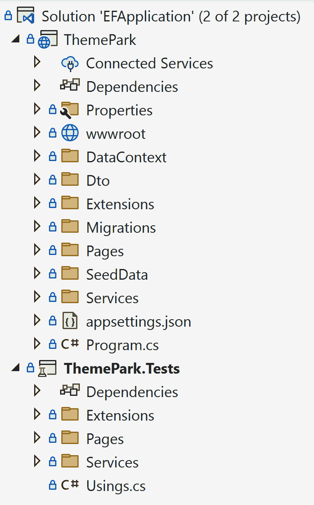

# 测试您的代码

**测试代码**在开发中是一个多义词。它可以指代多个概念，例如负载测试、单元测试或集成测试，仅举几例。所有测试概念对于开发者理解**软件开发生命周期**（**SDLC**）都至关重要。每个概念都有其目的，并且对于提供稳定性和信心同样重要，甚至可以提供文档。

在本章中，我们将介绍以下主要主题：

+   理解测试概念

+   测试的最佳方法

+   测试 Entity Framework Core

在第一部分，我们将介绍测试的基本概念，包括单元测试、集成测试、回归测试、负载测试、系统测试和 UI 测试。

接下来，我们将回顾编写稳健测试软件的一些最佳方法，包括为什么测试是必要的，需要多少单元测试，在编写单元测试时使用**安排（Arrange）、执行（Act）、断言（Assert）**（**AAA**）技术，为什么应该避免单元测试脚手架，为什么应该避免大型单元测试，如何以及为什么应该避免静态方法，以及最后如何使用测试进行文档化。

最后，我们将通过创建一个完整的集成测试来应用本章的知识，使用 Entity Framework Core。

# 技术要求

我们建议使用您喜欢的编辑器查看本书的 GitHub 仓库。我们的建议包括以下内容：

+   Visual Studio（最好是 2022 版，尽管任何版本都可以）

+   Visual Studio Code

+   JetBrains Rider

我们将使用的编辑器是 Visual Studio 2022 Enterprise，但任何版本（社区版或专业版）都可以与代码一起使用。

本章的代码位于 Packt Publishing 的 GitHub 仓库中，位于`Chapter07`文件夹，网址为[`github.com/PacktPublishing/ASP.NET-Core-8-Best-Practices`](https://github.com/PacktPublishing/ASP.NET-Core-8-Best-Practices)。

# 理解测试概念

单元测试对于开发者来说很重要，因为它们为软件提供稳定性，对其代码有信心，并且提供了记录复杂代码的额外好处。在本章中，我们将看到单元测试提供了许多好处。

在本节中，我们将回顾测试的概念以及为什么每个概念对于构建网站时的稳定性和信心都至关重要。

## 单元测试

我们能编写的最小测试来确认代码按预期工作的是单元测试。单元测试通常用于测试小（或较小）的方法，以及测试发送到这些方法的多参数并期望得到特定结果。

确定要编写的单元测试类型是一个简单的过程，即找到方法中的条件并编写相关的测试以实现该行为。

以下场景可以证明在方法中编写单元测试的合理性：

+   方法的成功流程（即，成功的路径）

+   方法行为的失败（即，不愉快的路径）

+   任何分支或条件（例如 if..then、switch、内联 if 等）

+   方法中传递的不同参数

+   异常处理

如果我们有一个大型系统，单元测试的数量预计会有数百个，因为这些小而细粒度的方法构成了系统的大部分。

以下示例展示了一个扩展方法，用于格式化日期/时间对象以供显示。由于它是自包含的，我们可以简单地创建一个日期/时间对象并对其进行测试：

```cs
[TestMethod]
public void FormattedDateTimeWithTimeTest()
{
    // Arrange
    var startDate = new DateTime(2023, 5, 2, 14, 0, 0);
    const string expected = @"May 2<sup>nd</sup>, 2023 at 2:00pm";
    // Act
    var actual = startDate.ToFormattedDateTime();
    // Assert
    Assert.AreEqual(expected, actual);
}
```

此代码创建了一个新的日期和时间。单元测试使用 AAA 技术进行格式化（我们将在稍后介绍），并返回一个要在我们的 HTML 中显示的字符串。

一旦设置了单元测试，下一步就是提供集成测试。

## 集成测试

测试的下一级别是集成测试，这需要额外的系统测试功能。集成测试涉及将模块分组并能够作为一组测试这些组件，这与单元测试形成对比。

根据我的经验，集成测试和单元测试之间的主要区别是外部资源。如果一个单元测试访问外部资源（例如磁盘驱动器、数据库、网络调用或 API），它可以被认为是集成测试。

以下示例展示了一个简单的集成测试，其中我们连接到本地测试数据库以确认数据库的连接并返回一个有效的 `IndexModel` 对象：

```cs
[TestClass]
public class PageTests
{
    private DbContextOptions<ThemeParkDbContext> _options;
    private ThemeParkDbContext _context;
    [TestInitialize]
    public void Setup()
    {
        _options = new DbContextOptionsBuilder<ThemeParkDbContext>()
            .UseSqlServer("Data Source=localhost;Initial                  Catalog=ASPNetCore8BestPractices;" +
                 "Integrated                  Security=True;MultipleActiveResultSets=True;")
                 .Options;
        var config = new Mock<IConfiguration>();
        _context = new ThemeParkDbContext(_options, config.Object);
    }
    [TestMethod]
    [TestCategory("Integration")]
    public void ReturnAnIndexModelTest()
    {
        // Arrange
        var logger = new Mock<ILogger<IndexModel>>();
        var service = new AttractionService(_context);
        // Act
        var actual = new IndexModel(logger.Object, service);
        // Assert
        Assert.IsNotNull(actual);
        Assert.IsInstanceOfType(actual, typeof(IndexModel));
    }
}
```

在 `DbContextOptionsBuilder` 中，我们连接到我们的本地数据库，创建了一个有效的 `AttractionService`，同时传递了我们的有效 `ThemeParkDbContext`，并确认我们拥有正确的模型类型。

最后，有不同方式进行集成测试，例如创建模拟的数据库或 API、复制环境，甚至为我们的测试创建新的服务器。

## 回归测试

回归测试是我们过去执行的功能性和非功能性测试。根据其本质，这些是我们对系统运行过的成功测试。回归测试是进行以确认新功能不会破坏现有功能的测试类型。这包括单元测试和集成测试。

## 负载测试

一旦你在 CI/CD 流程中运行了测试（单元和集成测试）（见*第二章*）并且预期会有大量用户访问网站，为该网站创建负载测试（或多个负载测试）是有利的。

当对网站进行负载测试时，将其置于单个开发者独立运行网站时体验到的压力水平之上。负载测试模拟了大量用户同时访问网站，并报告网站是否能够处理大量用户涌入。

负载测试的结果可能需要多个团队成员帮助提高网站的性能。不仅开发者会参与，还包括**数据库管理员**（**DBAs**）、系统管理员，甚至架构师都会参与修复网站的性能问题。

网站的性能持续提升应该是目标，创建负载测试来衡量性能是实现这一目标的关键。

## 系统测试（端到端或 E2E）

系统测试基于某些场景，是团队协作的结果。系统用户测试系统中新引入的功能，而其他团队成员则进行回归系统测试，以确认新功能不会破坏现有功能。

团队成员为用户创建场景。然后要求这些用户逐一走过每个场景，并提供关于其是否有效的工作反馈。

一个示例场景可以分解为几个类别，如下所示：

+   购物车：

    +   登录网站

    +   将商品放入购物车

    +   点击结账

    +   收到带有订单号的确认页面

如果场景成功，顶级场景（“购物车”）将包含一个绿色的勾选标记，表示所有步骤都通过且没有问题。如果某个步骤失败，则会出现一个带有原因的红色“X”，并将其放入待办事项中供开发人员稍后检查。

这些类型的测试需要多个用户通过网站并找出特定场景中的问题。有时手动测试网站是必要的，但如果有时间，可能更有意义的是使用**用户界面**（**UI**）测试方法来自动化这些场景。

## UI 测试

UI 测试通过如 Selenium 或 Cypress 等软件工具进行视觉操作，并自动化最终用户在给定场景下的点击或客户在网站上的导航。这要求测试人员了解 UI 测试软件的工作原理；他们应该知道如何访问页面上的元素，知道如何将这些值放入这些元素中，以及知道如何激活事件，如点击和模糊，以模拟最终用户点击按钮。

这些类型的测试通常在下班后通过 CI/CD 管道进行，但也可以在工作时间内在专用服务器（即 QA 服务器）上运行，以尽早识别问题。

在本节中，我们回顾了各种类型的测试，包括单元测试、集成测试、回归测试、负载测试、系统测试和 UI 测试，以及每种测试的重要性及其如何利用其他测试。

在下一节中，我们将探讨开发人员对单元测试的习惯，包括为什么编写单元测试，驳斥 100%测试覆盖率神话，使用 AAA 是单元测试的绝佳方法，为什么我们应该编写单元测试库，创建大型单元测试，为什么应该避免不必要的模拟，以及为什么单元测试具有额外的文档优势。我们还将学习如何识别缓慢的集成测试，何时编写单元测试，以及如何避免测试.NET 代码。

# 测试的最佳方法

每家公司都有其测试软件的方式。无论是手动还是自动化，对开发人员来说都是一项要求。开发人员正在成为不仅仅是编写代码的人。我们被要求设计、编写、测试、调试、编写文档、构建和部署软件。

使用 CI/CD 方法自动化测试可以帮助公司在向公众发布软件时节省时间，并提供一致性和质量。

在本节中，我们将讨论测试为什么重要，如何避免 100%测试覆盖率的神话，AAA 是什么以及为什么它是单元测试的绝佳方法，如何避免编写单元测试库、大型单元测试和不必要的模拟。我们还将了解为什么测试具有额外的文档优势，如何识别缓慢的集成测试，何时编写单元测试，以及如何避免测试.NET 代码。

## 我们为什么编写测试？

当有些人认为测试应该从开发者开始时，我认为它应该从管理层开始。

开发者认为在编写软件时测试是一个绝对的要求，但如果管理层认为测试是浪费时间，那么可能是时候更新简历了。

管理层以及可能的一些开发者对软件的稳定性以及测试对时间表的影响有不同的看法。

测试的原因很简单：它允许开发者确认他们编写的代码按预期执行。此外，如果测试提供了简单的方式来消费某个代码模块，那么这些测试也为其他人以及原始作者提供了清晰度。

## “100%测试覆盖率”的神话

当我们将摆锤摆向另一边时，一些管理者要求 100%的测试覆盖率。尽管有些人认为这是可能的，但 100%是无法实现或理想的。

测试应该在需要的地方创建，而不仅仅是为了覆盖率的 sake。如果为了满足某个指标而包含一些单元测试，这会创造一个虚假的指标，并呈现出“100%测试覆盖率”的幻觉。开发者可能会为了“完成配额”而构建测试，以实现这个神话般的指标。每个测试都应该提供与坚实结果和价值的完整性。

这个指标与**代码行数**（**LoC**）的虚假指标也密切相关，因为能够用最少的行数编写代码的开发者比编写效率低下的开发者更有效率。更多并不总是意味着更好。

## 使用 AAA

当我们编写单元测试时，最好的方法是使用 AAA 技术：

+   **安排**：为测试初始化代码

+   **行动**：执行实际测试

+   **断言**：确定结果是否是预期的行为

**安排**步骤应该初始化代码，并尽可能保持最小化。

**行动**步骤应该执行相关代码，并且应该看起来类似于（如果不是完全一样）生产环境中的代码。

最后，**断言**步骤将结果与我们期望从代码中返回的内容进行比较。

AAA 技术提供了识别系统测试如何进行的最容易的方法。

## 避免为你的代码编写单元测试代码

虽然 AAA 概念是编写单元测试的简单方法，但我认为还有另一种方法，我认为这是一种代码异味。

想象这个场景：开发者必须编写一个单元测试，其中他们必须使用 Entity Framework Core 进行数据库调用。安排步骤有 30 行代码来准备行动步骤以正常工作。开发者将这些 30 行代码移动到一个库中，使它们可用于其他单元测试。

这 30 行代码是我提到的代码异味。将代码重构并进一步抽象以简化代码更有意义。安排步骤不应包含一个额外的自定义代码库来运行单元测试。它应该专注于测试已经编写好的生产代码，而不是编写额外的测试代码来使代码通过。

然而，如果需要辅助库，它不应包含任何分支语句，这将需要单元测试单元测试辅助库的需求。

## 避免大型单元测试

开发者对“大”的定义各不相同。应避免具有超过一页（一个屏幕）的代码或超过 30 行代码的单元测试。

这些类型的单元测试方法存在一个问题：它们仅一步之遥就快要创建一个用于我们之前提示的安排步骤的库。

再次强调，这被认为是一种代码异味，可能需要某人退一步，寻找更好的方法来产生更小的设置，而不是大块的初始化代码。

## 避免不必要的模拟、伪造或存根

有时，一个类上的方法没有任何依赖项，并且是完全隔离的。当我们遇到这种情况时，我们可能不需要创建模拟对象来完全单元测试该方法。

模拟是我们想要测试预定义行为时的情况，存根返回预定义的值。伪造是具有工作实现的完整填充对象。

在本章的开头，我们提到了单元测试是什么。我们还创建了一个简单的扩展方法，称为 `.ToFormattedDateTime()`。由于它是一个独立的方法，我们不需要模拟日期/时间对象。我们只需调用该方法。

例如，如果我们有一个包含字符串的大库的扩展方法，我们可以创建一个单元测试，创建一个字符串，传递它，并检查返回值是否如预期。如果需要进一步测试，可以用不同的参数重复这个过程。

当有一个简单的方法时，有时测试其功能更容易。不需要模拟、伪造或存根。

## 使用测试作为文档

每个单元测试都应该包含一些解释，说明测试了什么，无论是在方法签名中还是在注释中解释情况。

单元测试应该对同行（以及我们的未来自己）具有信息性，并表明对完成每个单元测试所涉及的内容以及它与测试的生产代码的关系的了解。

除了信息性单元测试外，目录结构也可以作为文档，并且可以走很长的路。我们应该在单元测试中反映应用程序的目录结构。

如果我们在应用程序（或项目中）看到一个名为`Data`的文件夹，为单元测试创建一个类似的文件夹或项目，命名为`Data.Tests`。虽然这可能是一个简单的概念，但它帮助我们的同事立即知道测试与项目中的哪些部分相关。

例如，如果我们查看一个带有单元测试的示例项目，你可能已经看到了这种结构：



图 7.1 – 项目良好结构化测试的示例

虽然在`ThemePark.Tests`项目中可能缺少一些文件夹，但我们可以立即看到`Extensions`、`Pages`和`Services`文件夹至少包含一种测试类型。存在与项目文件夹相对应的测试文件夹表明它们包含单元或集成测试，并表明需要在测试项目中包含额外的测试。

## 识别缓慢的集成测试

集成测试使用外部资源（如数据库、文件系统或 API）进行。因此，集成测试的运行速度总是比单元测试慢。

如果我们正在使用测试环境来模拟另一个环境（例如，安排一个 QA 环境来模拟生产环境），检测缓慢连接的能力提供了一个保障，即环境按预期工作。你以前听说过“在 QA 中工作得很好，但在生产中不行”的说法吗？

然而，如果我们正在处理环境的内存表示，确定测试是否缓慢就没有意义，对吧？与实际环境相比，环境的内存表示总是运行得更快。

例如，使用`Stopwatch`类来衡量过程（页面或 API）以确定它们是否运行得快或*非常快*。

如果我们查看我们的 Entity Framework 示例来自*第五章*，并且我们向项目中添加一个集成测试，我们可以创建一种简单的方法来识别我们的页面调用是否缓慢，如下面的示例所示：

```cs
using System.Diagnostics;
using EFApplication.Pages;
using EFApplication.Services;
using Microsoft.Extensions.Logging;
using Moq;
namespace ThemePark.Tests.Pages;
[TestClass]
public class PagesTest
{
    [TestMethod]
    [TestCategory("Integration")]
    public void ConfirmTheMainPageReturnsWithinThreeSecondTest()
    {
        // Arrange
        var logger = new Mock<ILogger<IndexModel>>();
        var service = new Mock<IAttractionService>();
        var stopwatch = Stopwatch.StartNew();
        // Act
        _ = new IndexModel(logger.Object, service.Object);
        // Assert
        // Make sure our call is less than 3 seconds
        stopwatch.Stop();
        var duration = stopwatch.Elapsed.Seconds;
        Assert.IsTrue(duration <= 3);
    }
}
```

在这个集成测试中，我们正在测试我们的`ThemePark`应用程序的主页，以确定其性能是否良好。首先，我们安排我们的类，因为`IndexModel`接受`ILogger<PageModel>`和`IAttractionService`。一旦我们创建好计时器，我们就调用`IndexModel`（Act）并立即停止计时器。我们将它转换为秒，并执行我们的断言步骤。

当然，我们正在进行内存集成测试以供说明，但这个概念最适合与外部资源一起进行的集成测试，以识别延迟问题。

在上面的示例中，仅通过阅读测试我们无法判断它是否在内存中。它被封装在`IndexModel`中，其目的是确定它是否执行得快。

## 找到错误，编写测试

单元测试对于稳定的产品至关重要，无论它是 Web 应用程序还是智能手机应用程序。每个开发者都肯定会遇到应用程序中的错误，因此始终保持单元测试是最新的是有意义的。

当我们（或用户）遇到错误时，重复这个咒语：*找到错误，编写测试*。这可能是一个简单的概念，但这是推荐的。

当任何人发现应用程序中的错误时，立即为该错误编写一个单元测试。这使我们部署应用程序时感到安心。如果我们有一个错误并且确认单元测试修复了问题，我们将有足够的信心说它在部署前已经过测试。修复问题是一回事，但添加测试使代码更加坚不可摧，并提供了信心，即错误不会再次发生。

## 避免测试 .NET

.NET 是一个庞大的框架。单元测试旨在测试特定的代码。*你的代码*。当微软已经测试过时，就没有必要为 .NET 代码（或其他库/框架）创建单元测试。

例如，如果有一个测试用于确定子字符串方法是否返回正确的值，这实际上是测试 .NET 框架。*不要编写这个* *单元测试*。

我们的努力更适合于方法的高层次范围。专注于测试我们代码所在的位置的调用方法，而不是 .NET 方法。

在本节中，我们探讨了创建单元测试的重要性以及为什么 100% 的测试覆盖率是一个神话。我们还了解了各种常见的单元测试策略，例如如何使用 AAA 框架进行单元测试，为什么在创建大型单元测试时编写额外的单元测试库被认为是代码异味，以及为什么有时不需要为所有内容使用模拟库。

我们还学习了如何使用注释和文件夹将测试作为文档，通过添加计时器来识别慢速集成测试，找到错误并立即编写测试以进一步增强代码的坚不可摧性，以及如何避免测试 .NET 方法。

在下一节中，我们将回顾我们的策略并将它们应用于第五章中的 `ThemePark` 应用程序。

# 测试数据访问

几年来，Entity Framework 一直努力成为可单元测试的，并在与数据访问工作时应开发者拥有更高的信心水平。

基于第五章中我们使用 Entity Framework Core 创建示例数据库的情况，在本节中，我们将介绍一种使用 SQLite 内存数据库来确认应用程序功能的方法……即使我们没有数据库连接。使用内存提供者选项，微软建议避免这种方法，而是使用 SQLite 进行数据库调用或使用生产（或更好的，QA）数据库进行查询。

避免内存提供者

由于内存是一个极其简化的数据库实现，Microsoft 建议使用替代方法进行测试，并避免使用内存提供程序进行数据库测试。有关详细信息，请参阅以下 URL：[`learn.microsoft.com/en-us/ef/core/testing/testing-without-the-database`](https://learn.microsoft.com/en-us/ef/core/testing/testing-without-the-database)。

## 添加 SQLite 提供程序

由于我们还没有在测试中访问数据的方法，我们必须添加 SQLite 以尽可能接近实现。使用 NuGet，我们必须添加以下 NuGet 包：

+   `Microsoft.EntityFrameworkCore.Sqlite`

+   `Microsoft.EntityFrameworkCore.InMemory`

一旦我们在测试中有了这些，我们就可以继续创建我们的`AttractionService`和`LocationService`测试，以确认它们按预期工作。

## 创建 AttractionService 测试

由于我们将`AttractionService`用作“仓库”，我们只需要传入`DbContext`即可按预期工作。目前，`ThemeParkDbContext`为空数据库创建种子数据。

这非常适合我们的需求，因为当传入`ThemeParkDbContext`时，`DbContext`可以是内存中的表示形式或实际连接到生产数据库。在这种情况下，我们正在创建一个内存中的 SQLite 数据库以供我们的目的使用。

SQLite 提供程序在调用时打开连接，并在关闭时删除连接。我们在设置期间创建连接，并提供一个`[Cleanup]`属性来释放连接。这专门针对 SQLite。

我们的`AttractionService`集成测试示例如下：

```cs
using Microsoft.EntityFrameworkCore;
using System.Data.Common;
using Microsoft.Data.Sqlite;
using Microsoft.Extensions.Configuration;
using Moq;
using ThemePark.DataContext;
using ThemePark.Services;
namespace ThemePark.Tests.Services;
[TestClass]
public class AttractionServiceTest
{
    private DbConnection _connection = null!;
    private DbContextOptions<ThemeParkDbContext> _options = null!;
    private IThemeParkDbContext _context = null!;
    [TestInitialize]
    public void Setup()
    {
        _connection = new SqliteConnection("Filename=:memory:");
        _connection.Open();
        // These options will be used by the context instances in this            test suite,
        // including the connection opened above.
        _options = new DbContextOptionsBuilder<ThemeParkDbContext>()
            .UseSqlite(_connection)
            .Options;
        var config = new Mock<IConfiguration>();
        // Create the schema and seed some data
        _context = new ThemeParkDbContext(_options, config.Object);
        _context?.Database.EnsureCreated();
    }
    [TestCleanup]
    public void Cleanup()
    {
        _connection.Dispose();
    }
    [TestMethod]
    public async Task ReturnAllAttractionsTest()
    {
        // Arrange
        var service = new AttractionService(_context);
        // Act
        var records = await service.GetAttractionsAsync();
        // Assert
        Assert.IsTrue(records.Any());
    }
}
```

在前面的示例中，我们使用`[TestInitialize]`属性告诉我们的测试运行设置方法，并使用`[TestCleanup]`属性清理我们的混乱。`[TestInitialize]`属性用于初始化目的的方法。`[TestCleanup]`属性标识一个用于清理由`[TestInitialize]`属性初始化的内容的方法。

由于我们使用 SQLite 作为数据库，我们必须在`Setup()`方法中创建一个连接并打开它。一旦打开，我们需要为我们的模拟数据库创建`DbContextOptions`。最后一步是确保数据库已为我们测试创建。

这里有两个需要注意的地方。首先，我们不需要为`DbContext`创建模拟对象。在`DbContext`的`OnConfiguring()`配置方法中，如果我们有配置（例如`appsettings.json`文件），我们应该使用它。如果没有，我们应该为测试创建一个 SQLite 内存数据库。

第二个需要注意的地方是我们集成测试中的 Act 步骤。这一行应该与我们在生产代码中拥有的相同。我们越能使测试调用与生产中的调用相匹配，我们就越有信心，同时也会对代码、测试的准确性和价值更有信心。

## 创建 LocationService 测试

由于我们现在有了测试的结构，我们可以使用这些测试来针对`LocationService`。我们的`LocationService`测试包括两个方法——`GetAllLocationsAsync()`和`GetLocationAsync(int)`：

```cs
[TestMethod]
public async Task ReturnAllLocationsTest()
{
    // Arrange
    var service = new LocationService(_context);
    // Act
    var records = await service.GetLocationsAsync();
    // Assert
    Assert.IsTrue(records.Any());
}
[TestMethod]
[TestCategory("Integration")]
public async Task ReturnOneLocationByIdTest()
{
    // Arrange
    var service = new LocationService(_context);
    // Act
    var record = await service.GetLocationAsync(1);
    // Assert
    Assert.IsNotNull(record);
    Assert.IsTrue(record.Id==1);
}
```

再次注意，我们不需要模拟`DbContext`。我们通过传递`ThemeParkDbContext`来创建`LocationService`，并像在生产环境中一样使用它。设置和拆除完整数据库的能力是测试数据库功能的最有效方法之一。虽然使用现有数据库同样有益，但这提供了一种更快的“设置”和“拆除”数据库功能的方法，避免了当其他人更新数据库时的混乱或修改。如果其他人使用现有数据库，这可能导致集成测试在 CI/CD 管道中失败。

在本节中，我们学习了如何使用 SQLite 设置测试，以及如何使用内存数据库执行查询来模拟生产数据库。我们还提供了三个测试 Entity Framework Core 的示例。

# 摘要

测试和文档通常是开发团队优先级较低或被忽视的领域。然而，测试是代码库的必要要求。作为一个最后的观点，开发者应该尽可能使用接近生产环境的代码在 Act 步骤中使测试尽可能小和快。

在本章中，我们介绍了不同类型的测试，包括单元测试、集成测试、回归测试、负载测试、系统（或端到端测试）和 UI 测试。

一旦我们理解了这些测试类型之间的区别，我们就探讨了为什么创建单元测试很重要，以及为什么测试覆盖率目标不应该达到 100%。然后我们介绍了常见的单元测试策略，例如如何为我们的单元测试使用 AAA 脚手架，为什么为单元测试编写过多的代码被认为是代码异味，以及为什么不需要模拟库。

最后，我们学习了如何通过使用注释和文件夹来补充文档，如何通过添加计时器来识别慢速集成测试，如何找到错误并立即编写测试来进一步增强我们的代码的安全性，以及如何避免测试.NET 方法。

在下一章中，我们将介绍异常处理以及处理应用程序错误的一些更好的方法。
