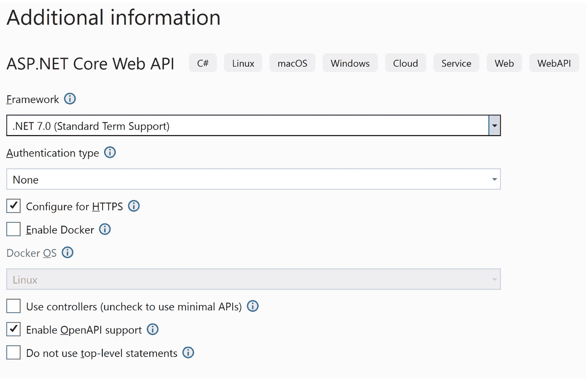
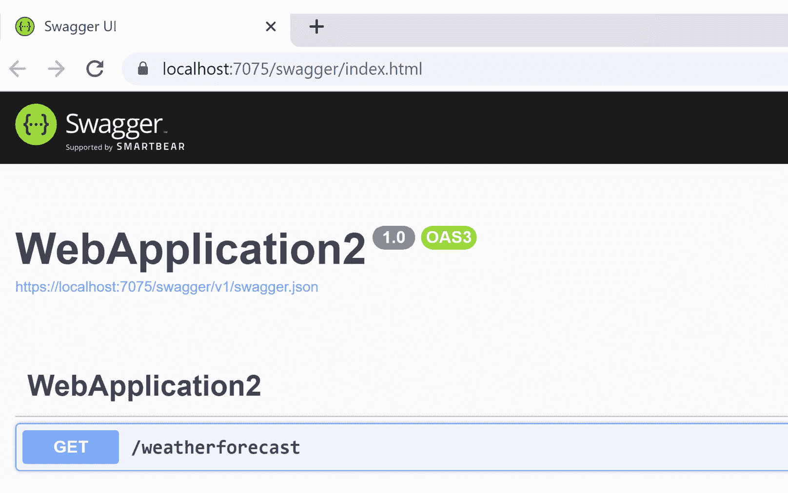
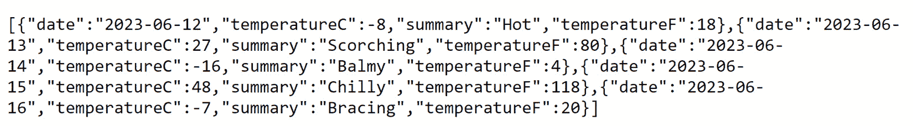
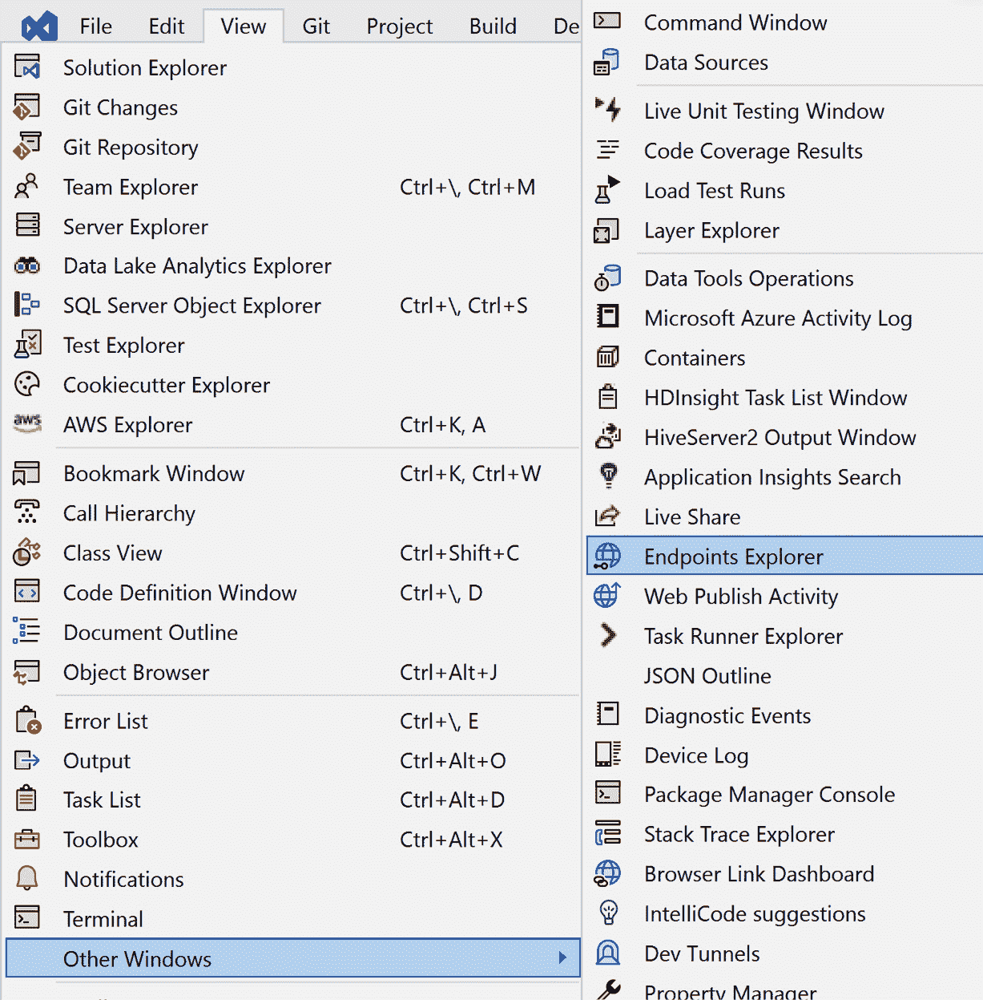
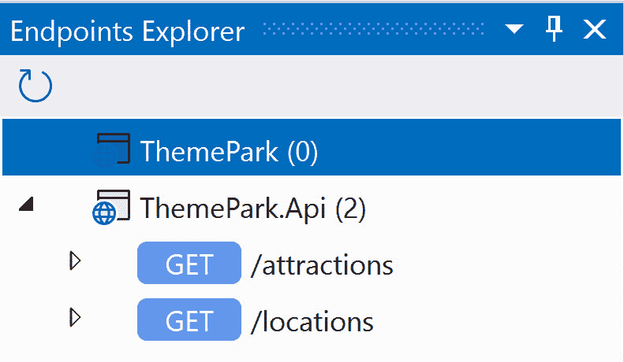
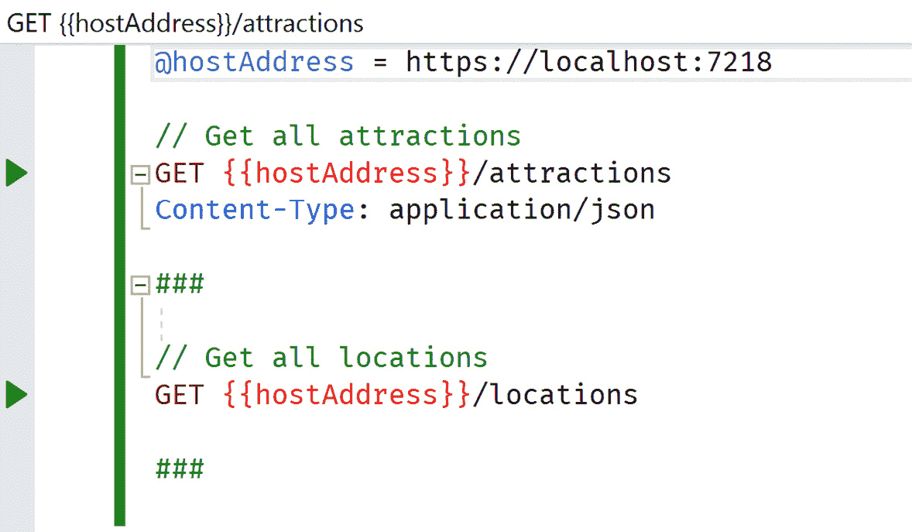

# 第九章：创建更好的 Web API

Web API 是互联网的核心。它们为开发者提供了网络的开放性和访问互联网上任何数据的可能性。然而，有一些最佳实践是针对 API 的。选择正确的 HTTP 动词、如何记录 API 以及测试 API 只是我们将要讨论的一些主题。

话虽如此，本章中涵盖的技术广泛且密集。我们将尽量提供尽可能多的信息，以帮助构建高质量的 API。我们还将提供相关链接以供进一步研究。

在本章中，我们将涵盖以下主要主题：

+   快速创建 API

+   设计 API

+   测试 Web API

+   标准化的 Web API 技术

在本章中，我们将学习如何设计、创建、测试和记录 API，以及如何通过 CI/CD 管道执行 API 的全面端到端测试。

我们将通过回顾一些编写 API 的更常见技术来结束本章，例如使用正确的 HTTP 动词和状态码、如何避免大型依赖资源、如何在 API 中实现分页、API 版本控制、使用 DTO 而不是实体，以及从 .NET 调用其他 API 的最佳方式。

# 技术要求

在 .NET 8 中，Web API 占据了主导地位。Visual Studio 增加了新功能，使构建和测试 Web API 更加容易。对于本章，我们建议使用 Visual Studio 2022，但查看 GitHub 仓库的唯一要求是一个简单的文本编辑器。

*第九章* 的代码位于 Packt Publishing 的 GitHub 仓库中，网址为 [`github.com/PacktPublishing/ASP.NET-Core-8-Best-Practices`](https://github.com/PacktPublishing/ASP.NET-Core-8-Best-Practices)。

# 快速创建 API

使用 .NET 8，API 已集成到框架中，这使得创建、测试和记录 API 更加容易。在本节中，我们将学习一种快速简单的方法来使用 Visual Studio 2022 创建最小 API，并浏览它生成的代码。我们还将了解为什么最小 API 是构建基于 REST 的服务的最佳方法。

## 使用 Visual Studio

.NET 8 的一个特性是能够极快地创建最小 REST API。一种方法是通过使用 dotnet 命令行工具，另一种方法是通过使用 Visual Studio。要这样做，请按照以下步骤操作：

1.  打开 Visual Studio 2022 并创建一个 **ASP.NET Core Web API** 项目。

1.  在选择项目目录后，点击 **下一步**。

1.  在项目选项下，进行以下更改：

    +   取消选中 **使用控制器** 选项以使用最小 API

    +   选中 **启用 OpenAPI 支持** 以包括使用 Swagger 的 API 文档支持：



图 9.1 – 网络最小 API 项目的选项

1.  点击 **创建**。

就这样——我们得到了一个简单的 API！虽然它可能不是特别复杂，但仍然是一个完整的 API，带有 Swagger 文档。Swagger 是一个用于创建 API 文档并实现 OpenAPI 规范的工具，而 Swashbuckle 是一个使用 Swagger 实现微软 API 的 NuGet 包。如果我们查看项目，会发现有一个名为 `Program.cs` 的单个文件。

1.  打开 `Program.cs` 将会显示整个应用程序。这是 .NET 的一个优点——能够相对快速地创建一个脚手架式的 REST API：

    ```cs
    var builder = WebApplication.CreateBuilder(args);
    // Add services to the container.
    // Learn more about configuring Swagger/OpenAPI at
       https://aka.ms/aspnetcore/swashbuckle
    builder.Services.AddEndpointsApiExplorer();
    builder.Services.AddSwaggerGen();
    var app = builder.Build();
    // Configure the HTTP request pipeline.
    if (app.Environment.IsDevelopment())
    {
        app.UseSwagger();
        app.UseSwaggerUI();
    }
    app.UseHttpsRedirection();
    var summaries = new[]
    {
        "Freezing", "Bracing", "Chilly", "Cool", "Mild",
        "Warm", "Balmy", "Hot", "Sweltering", "Scorching"
    };
    app.MapGet("/weatherforecast", () =>
    {
        var forecast = Enumerable.Range(1, 5).Select(index
        =>
            new WeatherForecast
            (
                DateOnly.FromDateTime(DateTime.Now.AddDays
                    (index)),
                Random.Shared.Next(-20, 55),
                summaries[Random.Shared.Next(
                    summaries.Length)]
            ))
            .ToArray();
        return forecast;
    })
    .WithName("GetWeatherForecast")
    .WithOpenApi();
    app.Run();
    internal record WeatherForecast(DateOnly Date,
    int TemperatureC, string? Summary)
    {
        public int TemperatureF => 32 +
            (int)(TemperatureC / 0.5556);
    }
    ```

在前面的代码中，我们通过 `.CreateBuilder()` 方法创建了我们的“应用程序”。我们还添加了 `EndpointsAPIExplorer` 和 `SwaggerGen` 服务。`EndpointsAPIExplorer` 允许开发者查看 Visual Studio 中的所有端点，我们将在后面介绍。另一方面，`SwaggerGen` 服务在通过浏览器访问时创建 API 的文档。下一行使用 `.Build()` 方法创建我们的应用程序实例。

1.  一旦我们有了应用程序实例并且处于开发模式，我们就可以添加 Swagger 和 Swagger UI。`.UseHttpsRedirection()` 的目的是在网页协议为 HTTP 时重定向到 HTTPS，以使 API 安全。

1.  下一行使用 `.MapGet()` 创建我们的 GET `weatherforecast` 路由。我们添加了 `.WithName()` 和 `.WithOpenApi()` 方法来标识要调用的主要方法，并让 .NET 知道它使用 OpenAPI 标准。最后，我们调用了 `app.Run()`。

1.  如果我们运行应用程序，我们将看到有关如何使用我们的 API 以及可用的文档化的 API。运行应用程序会产生以下输出：



图 9.2 – 我们文档化的 Web API 的屏幕截图

如果我们调用 `/weatherforecast` API，我们会看到返回带有 200 HTTP 状态的 JSON。



图 9.3 – 我们 /weatherforecast API 的结果

将这个小型 API 想象成将 API 控制器与中间件结合到一起的一个紧凑文件（`Program.cs`）。

## 为什么需要最小 API？

我认为最小 API 是 .NET 8 的一个特性，尽管它是一个语言概念。如果应用程序非常大，添加最小 API 应该以以下四种方式吸引人：

+   **自包含**：一个文件内的简单 API 功能对其他开发者来说很容易理解

+   **性能**：由于我们没有使用控制器，因此在使用这些 API 时不需要 MVC 的开销

+   **跨平台**：使用 .NET，API 现在可以部署在任何平台上

+   **自文档化**：虽然我们可以将 Swashbuckle 添加到其他 API 中，但它也会为最小 API 构建文档

接下来，我们将使用这些最小 API 并开始查看 Visual Studio 的测试功能。

在本节中，我们在 Visual Studio 中创建并审查了一个最小 API 项目，并讨论了为什么最小 API 对我们的项目很重要。

在下一节中，我们将探讨设计 API 以帮助消除长资源（URL）名称和标准化 API 命名的最佳方法。

# 设计 API

在本节中，我们将介绍向用户提供直观和清晰的 API 的最佳方法。API 的设计应该是经过深思熟虑的，当用户希望发起请求时，它应该是有意义的。

要创建一个真正基于 REST 的 API，我们必须使用不同的思维方式。我们必须把自己当作用户，而不是开发者。在编写 API 时，API 的用户是其他开发者。

## 断开与现有模式的连接

在设计 API 时，我们需要从用户的角度出发，而不是基于类层次结构或数据库模式来构建 API。虽然开发者可能会认为基于类层次结构或数据库模式创建 API 是一种捷径，但它可能会在检索数据时产生更多的复杂性。一个例子是使用订单资源来查找联系人。虽然 Entity Framework Core 中的订单实体可能包含一个`Company`属性，而我们需要公司的联系人信息，我们不会编写`https://www.myfakesite.com/Order/15/Company/Contact`。基于现有层次结构或模式构建 URL 结构应该避免。

在设计合理的 API 时，忽略现有模式至关重要。用新的视角看待 API 以获得最佳设计。最受欢迎的 API 是最干净和最直观的，因为它们使用了`collection/item/collection`语法。一个很好的例子是 `/orders/15/companys`。

## 识别资源

在系统中，观察用户如何与网站交互，并从特定场景中提取名词。这些将成为 API 的资源。

例如，用户可以在购物车系统中执行以下操作：

+   查看产品列表

+   查看产品

+   将产品添加到购物车

+   从购物车中移除产品

+   结账

从这些场景中，我们可以提取以下资源：

+   产品

+   产品

+   购物车

我们开始根据系统中的资源识别和逻辑分区我们的 API。

从这里，我们可以根据每个场景为每个资源应用一个 HTTP 动词。

## 将 HTTP 动词与资源相关联

一旦我们有了主要资源，我们就可以根据上一节中定义的特定场景为每个资源应用一个 HTTP 动词。

当创建一个 API 时，可能会倾向于使用名词/动词语法——例如，[`www.myurl.com/products/get`](https://www.myurl.com/products/get) 或 [`www.myurl.com/getproducts`](https://www.myurl.com/getproducts)。这种方法是适得其反的，因为网络标准已经存在用于此目的。

虽然这样做是可行的，但它违反了一些 REST 原则（我们将在以下部分讨论标准化的 Web API 技术）。现在，让我们一步一步来，创建一个简单的购物车 API。

每个 HTTP 动词都有基于其上下文的默认操作：

+   `GET`：返回资源

+   `POST`：创建新的资源

+   `PUT`：根据标识符替换整个资源

+   `PATCH`：根据标识符更新资源中的特定项

+   `DELETE`：删除资源

例如，上一节中的场景可以根据资源和它们的动词开始成形：

+   `GET /api/products`：查看产品列表

+   `GET /api/product/{id}`：查看产品

+   `POST /api/cart/{cartId}`：使用`POST`数据（即`new { ProductId = {productId}, Qty = ` `1 }`）将产品添加到购物车

+   `PATCH /api/cart/{cartId}`：使用`POST`数据（即`new { ProductId = {productId}, Qty = {``productId} }`）从购物车中删除产品

+   `GET /api/cart/{cartId}`：检索包含购物车中所有产品的购物车

+   `POST /api/cart/{cartId}/checkout`：结账

一旦我们将资源与已定义的场景匹配，我们就可以继续返回状态码给调用者。

## 返回 HTTP 状态码

在定义了资源之后，我们需要知道请求是否成功。这就是我们返回 HTTP 状态码的地方。

这些状态码分为以下类别：

+   **1xx**：信息代码

+   **2xx**：成功代码

+   **3xx**：重定向代码

+   **4xx**：客户端代码

+   **5xx**：服务器错误

与单元测试类似，我们查看“快乐”路径和“破损”路径。但是，对于 API，我们需要添加一个不可恢复路径，以防发生不可恢复的错误。

让我们看看两个 URL 及其应该返回的状态码。

`GET /api/products` 将返回以下状态码：

+   **200 Success**：成功返回产品

+   **500 Internal Server Error**：如果发生问题则可选

如果 API 成功，它将以 200 状态码返回产品列表。如果存在问题，它将返回 500 状态码。API 还可以返回其他状态码。例如，如果对特定用户进行 API 调用，API 可以返回 401，这是一个未授权状态码。

`POST /api/cart/{cartId}`带有正文(`new { ProductId = {productId}, Qty = 1 }`)将返回以下状态码：

+   **201 Created**：项目已创建并添加到购物车

+   **202 Accepted**：项目已添加到购物车

+   **404 Not Found**：购物车或产品未找到

+   **500 Internal Server Error**：发生了不可恢复的错误

使用此 API，我们可以返回 201 Created 或 202 Accepted 状态码。如果我们找不到要添加到购物车的购物车或产品，则返回 404 状态码。否则，返回 500 状态码。

虽然这两个例子并不是一成不变的，但它们应该为团队提供一个讨论模板，以确定哪些业务规则决定了返回给用户的状态码。无论返回什么状态码，它们都应该提供足够的信息，以了解通过 API 发出的请求。

一些在野外看到的 API 使用全有或全无的方法；它们要么返回 200，要么返回 500。这取决于我们想要向客户端发送多少信息。这类 API 好像缺少更多功能，例如未经授权（401）或未找到（404）状态码。将尽可能多的信息包含到 API 的调用者中是一种最佳实践。

HTTP 状态码

HTTP 状态码在 Web 开发中是标准的，并通过 RFC `HttpStatusCodeEnum` 类以及每个状态码在 [`learn.microsoft.com/en-us/dotnet/api/system.net.httpstatuscode`](https://learn.microsoft.com/en-us/dotnet/api/system.net.httpstatuscode) 以及 `IActionResults`，如 `Ok(object)` 来呈现。具体的状态码可以在 [`learn.microsoft.com/en-us/dotnet/api/microsoft.aspnetcore.http.results.statuscode`](https://learn.microsoft.com/en-us/dotnet/api/microsoft.aspnetcore.http.results.statuscode) 找到。

在本节中，我们学习了如何设计 API，并分解了每个步骤——即断开与技术的连接，识别资源，知道应用于资源的正确动词，以及向我们的 API 提供正确的响应代码。

在下一节中，我们将探讨两种测试我们的 API 的方法：一种是在 Visual Studio 中使用新的 Endpoints Explorer，另一种是通过创建完整的集成测试。

# 测试 Web API

一旦我们设计和创建了我们的 API，我们需要一种方法在我们的 IDE 和集成测试中测试它们。幸运的是，Visual Studio 添加了新的 Endpoints Explorer。

在本节中，我们将学习两种测试我们的 API 的方法。一种是通过我们的开发环境使用 Visual Studio。第二种测试我们的 API 的方法是通过集成测试。如果我们有一个 CI/CD 管道（我们应该从 *第二章* 开始），这些将自动运行以确认我们的 API 如预期那样工作。

## Visual Studio Endpoints Explorer

历史上，使用 Visual Studio 的开发者必须运行一个单独的工具来测试他们的 API，但随着 .NET 8 最新版本的推出，Visual Studio 团队增加了一个名为 **Endpoints Explorer** 的新面板：



图 9.4 – Endpoints Explorer

如果我们在 `Program.cs` 文件中定义了一组 API，我们的集合将如下所示：



图 9.5 – Endpoints Explorer 中的 API 集合

右键单击一个 API 将在新的 HTTP 编辑器中生成一个请求。HTTP 编辑器允许为列出的 API 自定义定义变量：



图 9.6 – HTTP 编辑器中的示例 API 集合

在 **图 9.6** 中，HTTP 编辑器使用以下命令来发出 HTTP 请求：

+   `@`: 为文件创建一个变量（例如，`@variable` = `value`)

+   `//`: 这指定了注释

+   `###`: 这指定了 HTTP 请求的结束

+   `<HTTP Verb>`：创建基于 REST 的请求，包括`DELETE`、`GET`、`HEAD`、`OPTIONS`、`PATCH`、`POST`、`PUT`和`TRACE`请求

+   `<Headers>`：在定义 URL 后直接添加标题，以便它们包含在请求中

一旦我们定义了 API，左侧的空白区域会出现绿色箭头。运行应用程序以在本地测试 API。当 API 正在运行时，按下左侧空白区域最远的箭头将在右侧面板中产生结果：


图 9.7 – `/attractions`请求的结果

在这个例子中，我们测试了`/attractions`请求，接收了数据，并在右侧显示它。

### 为什么这很重要？

通过使用这个新的 Visual Studio 功能，我们获得了以下优势：

+   **集中式 API**：我们在一个地方拥有所有 API 的目录

+   `.http`文件，执行示例请求，并了解每个 API 在系统中的功能

+   **集成开发环境集成**：测试我们的 API 不需要额外的工具

这个新功能对于想要在本地测试现有 API 的开发者来说非常有帮助，同时也补充了系统中新引入的最小 API。

端点资源管理器额外材料

关于端点资源管理器的额外材料，赛义德·易卜拉欣·哈希米提供了一篇关于它所能做一切的精彩文章，请参阅[`devblogs.microsoft.com/visualstudio/web-api-development-in-visual-studio-2022/#endpoints-explorer`](https://devblogs.microsoft.com/visualstudio/web-api-development-in-visual-studio-2022/#endpoints-explorer)。

在本节中，我们了解了端点资源管理器，我们如何使用它来帮助本地测试 API，以及为什么它很重要。在下一节中，我们将学习如何使用集成测试来快速生成结果。

## 集成测试 API

在上一节中，我们学习了如何使用端点资源管理器来测试我们的 API。然而，我们不应该需要在服务器上安装 Visual Studio 来测试我们的 API。

在本节中，我们将探讨为我们的 API 应用集成服务器以实现完整的端到端测试。

当我们在*第八章*中创建单元测试时，我们创建了一个数据库的内存表示。我们可以创建一个类似的环境，在那里我们可以为 API 测试启动和关闭整个环境。

在我们的 CI/CD 管道中，我们可以为我们的集成测试构建一个可丢弃的服务器，以提供 API 和服务以及可丢弃数据库的全端到端测试。

### 构建集成服务器

由于.NET 为我们提供了简单的`Program.cs`文件来构建应用程序，我们可以将整个应用程序包装起来，并用一个 Web 和数据库服务器替换我们想要模拟的服务。

我们可以使用`WebApplicationFactory`类来设置环境。我们将最小 API 项目作为依赖项包含在我们的`Api.Tests`项目中。一旦我们在程序中有了依赖项，我们就可以创建我们的`WebApplicationFactory`类：

```cs
using System.Data.Common;
using Microsoft.AspNetCore.Mvc.Testing;
using Microsoft.EntityFrameworkCore;
using Microsoft.EntityFrameworkCore.Storage;
using Microsoft.Extensions.DependencyInjection;
using Microsoft.Extensions.DependencyInjection.Extensions;
using Microsoft.Extensions.Hosting;
using ThemePark.Data.DataContext;
namespace ThemePark.Api.Tests;
public class TestThemeParkApiApplication :
WebApplicationFactory<Program>
{
    protected override IHost CreateHost(
    IHostBuilder builder)
    {
        var root = new InMemoryDatabaseRoot();
        builder.ConfigureServices(services =>
        {
            services.RemoveAll(typeof(
                DbContextOptionsBuilder<ThemeParkDbContext>
                ));
            services.AddScoped(sp => new
            DbContextOptionsBuilder<ThemeParkDbContext>()
                .UseInMemoryDatabase("TestApi", root)
                .UseApplicationServiceProvider(sp)
                .Options);
            services.AddDbContext<ThemeParkDbContext>(
            (container, options) =>
            {
                var connection = container
                    .GetRequiredService<DbConnection>();
                options.UseSqlite(connection);
            });
            services.AddTransient<IThemeParkDbContext,
                ThemeParkDbContext>();
        });
        return base.CreateHost(builder);
    }
}
```

在前面的代码示例中，我们继承了`WebApplicationFactory<Program>`。泛型`<Program>`来自我们引用的包含的依赖项。然后，我们为我们的内存数据库创建了一个根，并继续通过删除所有`DbContextOptionsBuilder<ThemeParkDbContext>`实例来配置我们的服务。一旦我们删除了这些，我们就可以使用更新的数据库设置创建一个新的作用域引用到同一类型。

接下来，我们使用 SQLite 数据库添加了我们的新`ThemeParkDbContext`和更新的连接。记住，Entity Framework Core 会自动使用`.EnsureCreated()`方法创建我们整个数据库的结构。最后，我们为应用程序中的服务添加了对`IThemeParkDbContext`的依赖注入注册。

我们的集成服务器就到这里。现在，我们可以在集成测试中使用`TestThemeParkApiApplication`。例如，如果我们想为我们的`/attractions` API 创建一个测试，我们的集成测试将如下所示：

```cs
using Microsoft.Extensions.DependencyInjection;
using ThemePark.Data.DataContext;
namespace ThemePark.Api.Tests;
[TestClass]
public class ApiTests
{
    private TestThemeParkApiApplication _app;
    [TestInitialize]
    public void Setup()
    {
        _app = new TestThemeParkApiApplication();
        using (var scoped = _app.Services.CreateScope())
        {
            var context = scoped.ServiceProvider
                .GetService<IThemeParkDbContext>();
            context?.Database.EnsureCreated();
        }
    }
    [TestMethod]
    [TestCategory("Integration")]
    public async Task GetAllAttractions()
    {
        // Arrange
        var client = _app.CreateClient();
        var expected = TestData.ExpectedAttractionData;
        // Act
        var response = await
            client.GetAsync("/attractions");
        var actual = await response.Content
            .ReadAsStringAsync();
        // Assert
        Assert.AreEqual(expected, actual);
    }
}
```

在前面的代码片段中，我们在设置时初始化了`TestThemeParkApiApplication`，以便通过`.EnsureCreated()`方法确保每个实例都是新的。`_app.CreateClient`为我们提供了`HttpClient`来调用 URL。我们调用我们的`/attractions` API，并将其与创建的资源字符串进行比较，而不是在我们的测试方法中添加大量的 JSON 字符串。最后，我们的测试将 JSON 结果与 API 返回的结果进行比较。

能够创建整个前后端集成测试，证明 API、Entity Framework 查询和数据库代码在 CI/CD 管道中运行时按预期工作，应该会增加对代码的信心。

在本节中，我们学习了如何在 Visual Studio 的端点资源管理器中测试 API，以及如何通过使用`WebApplicationFactory`包装我们的 API 项目，使这些 API 在 CI/CD 管道中可测试。

在下一节中，我们将介绍在构建 API 时行业常用的某些常见做法。

# 标准化的 Web API 技术

在本节中，我们将学习如何正确使用 HTTP 动词和状态码，如何避免大型依赖资源，如何为 API 创建分页，如何对 API 进行版本控制，使用 DTO 而不是实体，以及从.NET 中调用 API 的最佳方式。

## 使用正确的 HTTP 动词和状态码

到目前为止，我们已经探讨了如何使用 HTTP 动词以及如何返回状态码。虽然这看起来可能是一件微不足道的事情，但一些系统忽略了这些标准，总是使用 POST，无论功能如何。

Swagger 为 API 文档提供了一个很好的模板，而 Visual Studio 的新端点资源管理器将这一基本文档带到了开发者的 IDE 中，使得 API 更容易阅读和在其他项目中实现，向开发者展示了应该使用哪些动词以及预期的状态码。

在本章前面提到的购物车 API 示例中，用户本打算将产品添加到购物车并继续结账。他们将使用购物车开始这个过程。结账的功能让我们使用了购物车 API，并采用结账方法（`/cart/checkout`），这非常合理。我们应该将用户的行为与 API 中的行为相匹配。

## 小心依赖资源

但我如何根据资源来扩展我的 API？如果一个资源属于另一个资源，而这个资源又依赖于另一个资源，依此类推怎么办？

以下是一个示例：`/users/{userId}/projects/{projectId}/tasks`。

我们想要获取一个用户的项目任务，但这个 URL 似乎有点长，不是吗？我们如何将其分解成更易于管理的东西？任何超过三个级别的都只是自找麻烦。

此 URL 需要一个更细粒度的方法——也就是说，将每个资源分离出来。而不是前面的 URL，更好的方法是用`/users/{userId}/projects`来检索用户正在进行的项目的列表。下一个 URL 将根据所选项目提供任务，看起来像`/projects/{projectId}/tasks`。

作为开发者，我们都知道一切都是妥协。在这种情况下，我们提供了一个更简单的 API，但需要两次调用而不是一次。

这些是与团队成员讨论的话题，但基本上，URL 越小，实现起来越容易。URL 越长，为了满足请求，所需的资源查找就越多。

## API 结果中的分页

对于大多数 API 调用，结果以原始的**JavaScript 对象表示法**（**JSON**）格式返回，通常作为一个集合或单个项目。如果客户端需要分页结果，但现在只想获取一页数据怎么办？

为了协助客户端开发者，JSON 结果可以包含以下内容：

```cs
{
    "total": 7,
    "pageSize": 7,
    "currentPage": 1,
    "next": false,
    "previous": false,
    "results": 
        {
            "id": 1,
            "name": "Twirly Ride",
            "locationId": 2,
            "locationName": "Fantasy"
        },
        {
            "id": 2,
            "name": "Mine car Coaster",
            "locationId": 5,
.
.
```

虽然通常需要将结果作为集合返回，但在头部返回的字段如下：

+   `Total`: 记录总数

+   `PageSize`: 此响应中返回的记录数

+   `TotalPages`: 根据页面大小指定总页数

+   `CurrentPage`: 指定我们当前所在的页面

+   `Next`和`Previous`：是否有足够的记录可以向前或向后移动？

+   `Sort`: 指定结果的排序方式

+   `Filter`: 指定应用于结果中的过滤器

头部旨在帮助我们的同行客户端开发者充分利用响应。虽然这不是包含字段的完整列表，但它应该在客户端显示记录子集时，在每次响应中保持一致性。

在头部避免使用“状态码”字段或“成功”字段，因为 HTTP 状态码被认为是预期的响应。

## API 版本控制

在创建 API 时，默认情况下，它们很可能会处于原始状态，没有版本控制。有四种类型的版本控制：

+   **无版本控制**：当我们创建第一个 API 时

+   （省略部分内容）

+   （省略部分内容）

+   使用`custom-header`将版本放入头部：

    ```cs
    GET /users
    Custom-Header: api-version=1
    ```

最常用的版本化技术是 URI 版本化。虽然每个人的效果可能不同，但这种技术很有吸引力，因为它立即显而易见我们正在使用哪个版本。

## 使用 DTO 而不是实体！

在测试我们的 API 时，我们没有返回实体（`Attraction`或`Location`）。相反，我们返回的是**数据传输对象**（**DTOs**），这是属性的一个子集。

我们的安全章节（[*第四章*）提到，在涉及主键或敏感信息时不要暴露太多。DTOs（数据传输对象）给开发者提供了一个选择哪些属性应该暴露给客户端的机会。

例如，我们的`Attraction` DTO 旨在提供最小量的信息；我们将在查看以下代码示例之后讨论这一点：

```cs
public static class AttractionExtensions
{
    public static AttractionDto ToDto(
    this Attraction attraction)
    {
        return new AttractionDto
        {
            Id = attraction.Id,
            Name = attraction.Name,
            LocationId = attraction.LocationId,
            LocationName = attraction.Location == null
                ? string.Empty
                : attraction.Location.Name
        };
    }
}
```

在这里，我们有一个简化版的`AttractionDto`类，包含简单的属性。我们还有一个基于我们依赖的`Location`类的`LocationName`属性。

虽然我们有一个`.ToDto()`方法，但我们也可以创建其他 DTO 扩展方法，在`.ToDifferentDto()`方法（或我们想叫的任何名字）中返回不同的数据。

使用 DTO 而不是 Entity Framework 实体另一个原因是导航属性的潜在递归性质。当一个实体从 API 返回时，它会被转换成一个 JSON 对象。如果我们有一个嵌套的实体，它将沿着链继续。当它们从 API 返回时，将实体属性隔离并提炼到它们的原生类型，以便在客户端进行基本消费，这会更好。

## 避免创建新的 HttpClient 实例

尽管本章的大部分内容讨论了创建和测试 API，但我感觉我们还需要提到如何在.NET 应用程序中消费它们。

消费 Web API 有多种方式，例如使用`WebRequest`或`WebClient`，但对于大多数目的，由于其灵活性和现代化，推荐使用`HttpClient`类。`WebRequest`和`WebClient`类被包含在内，是为了过渡到遗留应用程序。话虽如此，创建一个`HttpClient`的新实例很容易，但这并不是最佳方法。

微软表示，`HttpClient`应该在整个应用程序的生命周期中只使用一次。如果我们在我们应用程序的多个位置创建`HttpClient`的实例，我们将阻碍性能和可扩展性的机会。如果请求速率过高，这会导致 TCP 端口耗尽的问题，因此最好避免以下代码：

```cs
// Bad use of HttpClient
var client = new HttpClient();
```

一些开发者可能会更进一步，认为以下代码片段更好，因为它通过`using`语句正确地销毁了`HttpClient`类：

```cs
// Still not good
using (var client = new HttpClient())
{
    .
    .
}
```

这个代码的问题是我们仍在创建另一个`HttpClient`实例，仍然会导致端口耗尽，并且在我们很可能需要它的时候仍然会销毁它。

在 .NET Core 2.1 中，Microsoft 创建了一个 `IHttpClientFactory` 类来提供单个 `HttpClient` 实例。我们可以简单地请求一个 `HttpClient` 实例，并且我们会收到一个。最好的消息是它可以进行依赖注入。

一旦我们通过构造函数注入了类，代码就会变得更容易处理，如下面的代码片段所示：

```cs
public class IndexModel : PageModel
{
    private readonly ILogger<IndexModel> _logger;
    private readonly IHttpClientFactory _factory;
    public IndexModel(
        ILogger<IndexModel> logger,
        IHttpClientFactory factory)
    {
        _logger = logger;
        _factory = factory;
    }
    public async Task OnGet()
    {
        // Bad use of HttpClient
        // var client = new HttpClient();
        // Still not good
        //using (var client = new HttpClient())
        //{
        //    .
        //    .
        //}
        // Best way to use HttpClient
        var client = _factory.CreateClient();
        // use client.GetAsync("https://www.google.com") to
           grab HTML
    }
}
```

当我们使用 `.CreateClient()` 从 `HttpClientFactory` 获取客户端时，除非必须，否则它不会创建一个新的 `HttpClient` 实例。

将 `.CreateClient()` 方法视为在幕后使用单例设计模式，类似于以下代码所示：

```cs
private static HttpClient _client { get; set; }
public HttpClient CreateClient()
{
    if (_client == null)
    {
        _client = new HttpClient();
    }
    return _client;
}
```

作为旁注，前面的代码**不是**线程安全的；它被提供出来以展示单例设计模式的概念。

我们总是得到一个 `HttpClient` 实例，这是进行服务器端 API 调用的更好方式。

# 摘要

在本章中，我们学习了几个技术，例如如何通过成为应用程序的用户、识别资源、使用正确的 HTTP 动词和状态码来设计 API。我们还学习了如何创建、测试和记录 API，以及为什么最小 API 很重要。之后，我们学习了如何在 Visual Studio 2022 中使用新的端点探索器，以及如何在 CI/CD 管道中构建我们 API 的自动化端到端测试。

一旦我们了解了编写 API 的过程，我们就检查了在行业中用于创建通用和有用 API 的标准，例如使用正确的 HTTP 动词和状态码、避免大型 URL、如何使用 API 进行分页、API 版本化、使用 DTO 而不是实体，以及从 .NET 进行 API 调用时使用 `HttpClient` 的最佳方式。

在下一章中，我们将探讨如何提高本书中涵盖的各个主题的性能，并提供一些新的性能提示。
