# 2

# 设置开发环境

在本书中，我们将使用.NET 构建（并逐步改进）一个 CLI 应用程序。我们将从设置我们的开发环境开始，这意味着安装开始构建 CLI 应用程序所需的工具。

为了巩固和加强你的学习，从而最大限度地利用本书，我强烈建议你练习我将要展示的演示，并完成每章末尾的“你的机会！”部分中建议的练习。为此，你需要设置并正确配置你的开发环境。

更具体地说，在本章中，我们将做以下几件事：

+   安装 Visual Studio Code

+   安装所需的扩展

+   安装.NET SDK

+   安装和配置 Git

# 技术要求

本书中的代码可以在[`github.com/PacktPublishing/Building-CLI-Applications-with-C-Sharp-and-.NET`](https://github.com/PacktPublishing/Building-CLI-Applications-with-C-Sharp-and-.NET)找到。每章的代码将放在按章节划分的文件夹中，并在每章开头的技术要求部分中提及。

注意

本章将没有代码示例，因为我们将专注于安装必要的工具并准备好你的开发环境。请注意，所有必需的工具都可以免费获得。

在本书中，我将使用一台 Windows 11 开发机器。如果你正在使用 Linux 或 macOS，应该不会有任何重大差异，除了工具的安装，我将在本章需要时突出显示。

# 安装 Visual Studio Code

尽管可以使用各种代码编辑器和集成开发环境（IDE）来开发.NET 应用程序，但我们将依赖 Visual Studio Code。

Visual Studio Code 是来自微软的一个开源、免费、跨平台的强大代码编辑器，可用于开发多种技术（包括.NET）的应用程序。它的真正力量来自于可以添加到其中的各种扩展，这些扩展来自微软、第三方编辑器和社区，可以扩展其功能，使其成为独一无二的代码编辑器。据我拙见，随着扩展市场提供的所有可能性，Visual Studio Code 正在模糊“简单”代码编辑器和完整强大的 IDE 之间的界限。

我选择 Visual Studio Code 的首要原因是，由于其跨平台性，无论你在 Windows、Linux 还是 macOS 上运行，其使用方式都是相同的。因此，即使我将在 Windows 上运行，如果你在另一个平台上运行，你也不会有任何问题跟随我，这是一个巨大的优势！

下载和安装 Visual Studio Code 的最简单方法是访问[`code.visualstudio.com/`](https://code.visualstudio.com/)网站并从那里下载。

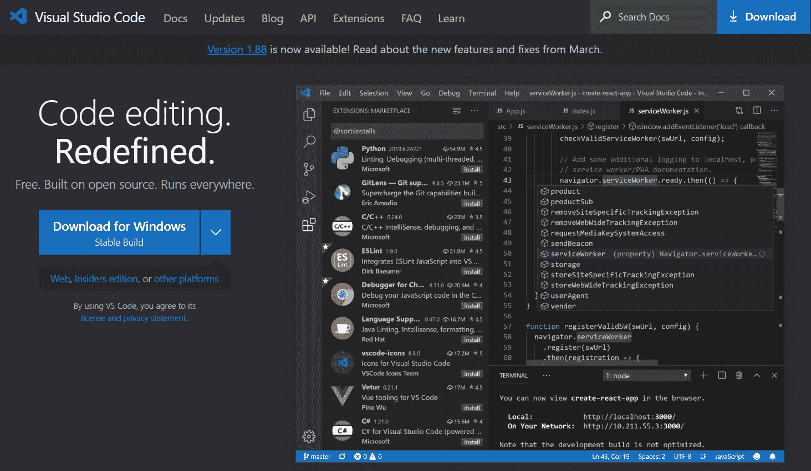

图 2.1 – 下载 Windows 版 Visual Studio Code

重要提示

网站上的**下载**链接应根据您访问网站的平台进行适配。换句话说，如果您的计算机正在运行 Linux，链接应显示为**下载 Linux**。如果不是，请点击下载链接右侧的下拉符号以显示其他选项。

下载完成后，请转到您的下载文件夹，双击安装文件。这将启动安装过程。在您选择**下一步**和**完成**，接受默认值后，您将在您的开发工作站上安装 Visual Studio Code！

在安装向导的**选择附加任务**屏幕上，我建议您检查以下图中突出显示的两个复选框。这些复选框将帮助您从当前文件/文件夹的上下文中打开 Visual Studio Code。我发现这非常实用。

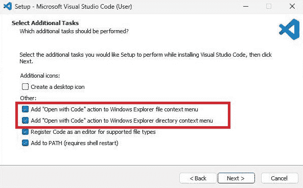

图 2.2 – “用 Code 打开”复选框

我们现在已安装并准备好使用代码编辑器。然而，Visual Studio Code 的真正力量在于其扩展。它们使开发过程变得顺畅且简单，同时提高开发者的生产力。

在本质上，扩展是一个软件包，它为 Visual Studio Code 编辑器添加新的功能、功能或自定义。

让我们安装一些扩展！

# 安装所需的扩展

在本节中，我们将安装一些我强烈推荐的扩展。

您也可以安装其他扩展。请通过社交媒体告诉我您安装了哪些其他扩展以及您为什么喜欢它们。我总是渴望学习新事物 😊。

我为这本书推荐的扩展如下：

+   **C#**：如果您想在 Visual Studio Code 中启用 C# 支持，此由微软提供的扩展是必选的。它提供语言支持（包括语法高亮和智能感知），调试功能以及代码补全。

+   **C# 开发工具包**：此由微软提供的扩展在 Visual Studio Code 中提供了完整功能的 Visual Studio 的解决方案资源管理器和测试资源管理器体验。如果您正在从 Visual Studio 迁移到 Visual Studio Code，或者您仍在使用两者，此扩展将在两个环境中为您提供类似的经验。

+   **IntelliCode for C# 开发工具包**：此由人工智能驱动的扩展提供整行补全、按排名的智能感知建议以及基于您的代码库的个性化见解。

+   **GitLens**：GitKraken 提供的此扩展通过提供诸如 Git 责任注释、代码导航和提交图导航等功能，极大地增强了您在 Visual Studio Code 中的 Git 体验。它大大提高了您的 Git 生产力。

重要提示

如果您在 Visual Studio Code 中使用 AI 助手扩展，如 GitHub Copilot，您可能会收到一条警告消息，指出如果启用了 AI 助手，IntelliSense 将无法工作。

要将扩展添加到您的 Visual Studio Code 环境，请通过点击 Visual Studio Code 界面左侧的相应图标来使用 **扩展** 窗口：

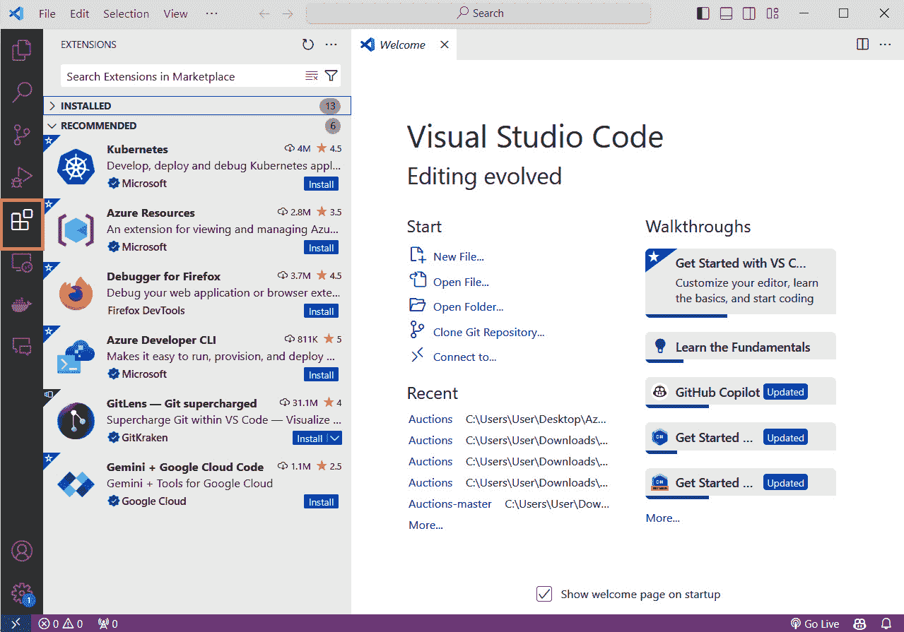

图 2.3 – Visual Studio Code 中的扩展窗口

从那里，您可以搜索（并安装）各种扩展。您也可能注意到 Visual Studio Code 会根据您正在开发的应用程序类型建议扩展。是否安装它们取决于您。只需记住，您安装的扩展越多，Visual Studio Code 消耗的计算机资源就越多。因此，您可能需要在您安装的扩展和您愿意接受的性能损失之间找到平衡。

让我们接下来安装 C# 开发工具包扩展。

首先，打开 `C# 开发工具包`。可能会返回多个结果，但我们寻找的应该是最上面的一个。在点击它以选择它并显示其产品页面之前，请确保它是正确的（由微软开发的 C# 开发工具包），然后点击下面的 **安装** 按钮。安装过程只需几秒钟。

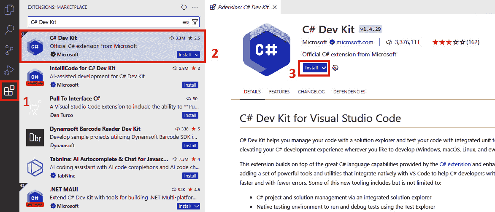

图 2.4 – 安装 C# 开发工具包扩展

安装完成后，一旦打开了一个项目，C# 开发工具包扩展将添加 **解决方案资源管理器** 功能，这与我们在 Windows 上的 Visual Studio 经验类似。

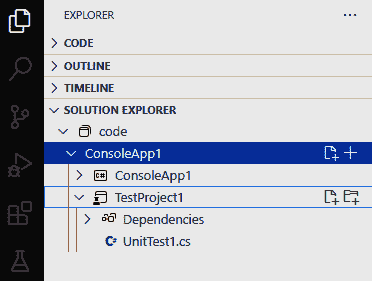

图 2.5 – C# 开发工具包扩展的实际应用

重要提示

注意，当您安装 C# 开发工具包扩展时，C# 扩展也会自动安装。

其他扩展可以通过完全相同的流程进行安装。

# 安装 .NET SDK

如您所猜，.NET SDK 是必需的，因为我们将会使用 .NET 开发 CLI 应用程序。

虽然任何版本的 .NET 都可以，但我们将使用 .NET 8，以下是一些原因：

+   这是 .NET 的最新 **长期支持** (**LTS**) 版本，并将支持到 2026 年 11 月 10 日 ([`dotnet.microsoft.com/en-us/platform/support/policy/dotnet-core`](https://dotnet.microsoft.com/en-us/platform/support/policy/dotnet-core))

+   它是跨平台的，因此我们使用 .NET 8 构建的 CLI 应用程序可以在 Windows、Linux 或 macOS 上执行

在您安装 .NET 8 SDK 之前，您可以使用此命令来验证它是否已经安装（在 Windows、Linux 和 macOS 上均有效）：

```cs
$ dotnet --list-sdks
```

这将返回您机器上安装的 .NET SDK 列表。

列表应如下所示：

```cs
3.1.424 [C:\program files\dotnet\sdk]
5.0.100 [C:\program files\dotnet\sdk]
6.0.402 [C:\program files\dotnet\sdk]
7.0.404 [C:\program files\dotnet\sdk]
```

如果您的机器上没有安装 .NET 8 SDK（如前所述列表所示，我的机器上没有安装），您可以通过访问此网站下载它：[`dotnet.microsoft.com/en-us/download`](https://dotnet.microsoft.com/en-us/download)

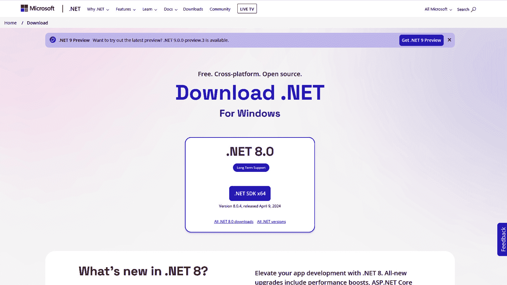

图 2.6 – 下载 Windows 版 .NET 8 SDK

下载完安装程序后，在您的下载文件夹中找到它，双击以启动安装过程。这需要点击几个按钮，然后是“下一步”和“完成”。

安装完成后，你会注意到不仅安装了 .NET 8 SDK，还安装了 .NET 运行时。

.NET 运行时是执行编译的 .NET 代码并提供内存管理、异常处理等运行时服务的核心组件。另一方面，.NET SDK 包含用于开发、构建、测试和调试 .NET 应用程序的工具和库。

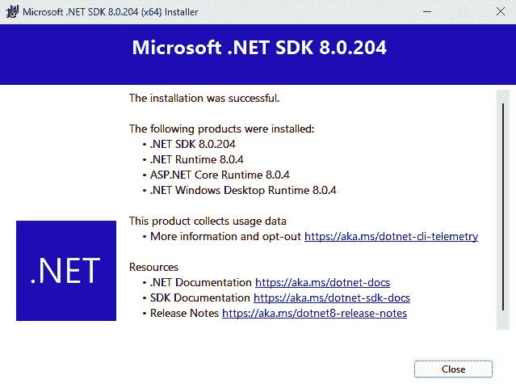

图 2.7 – .NET 8 SDK 已安装

然后，我们可以运行之前的命令来列出已安装的 .NET SDK：

```cs
$ dotnet --list-sdks
```

这次，你会注意到 .NET 8 SDK 已经存在：

```cs
3.1.424 [C:\program files\dotnet\sdk]
5.0.100 [C:\program files\dotnet\sdk]
6.0.402 [C:\program files\dotnet\sdk]
7.0.404 [C:\program files\dotnet\sdk]
8.0.204 [C:\program files\dotnet\sdk]
```

如果你正在 macOS 计算机上运行，访问 .NET SDK 安装网站将看起来像这样：

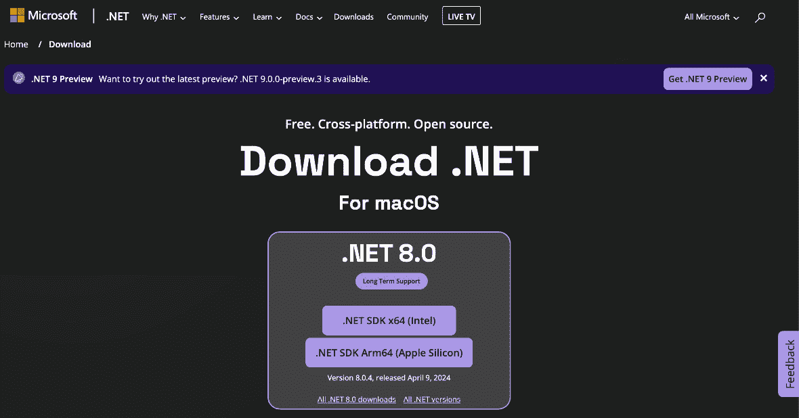

图 2.8 – 下载 macOS 版 .NET 8 SDK

我们现在拥有开发应用程序所需的一切。然而，如果你对开发认真负责，你需要一个代码管理和版本控制工具。这就是 Git 发挥作用的地方。

# 安装和配置 Git

Git 是一个强大且广泛使用的分布式版本控制系统，允许开发者跟踪更改、在代码上进行协作、管理项目历史记录并有效地维护代码库的不同版本。它提供了许多好处，包括版本跟踪、分支和协作，使其成为软件开发团队的必备工具。

换句话说，如果你对开发认真负责，你需要使用 Git。

从我们的角度来看，因为我们将会处理托管在 GitHub 上的代码仓库，我们需要使用 Git（因此，需要在我们的开发工作站上安装它）。

Git 可以安装在 Windows、Linux 和 macOS 上。

根据你使用的操作系统，Git 可能已经安装。你可以在终端窗口中运行此命令来检查：

```cs
git --version
```

如果它已经安装，你可以通过运行此命令来更新它：

```cs
git update
```

一旦完成，你可以跳过本节的其余部分。

安装 Git 最简单的方法是访问 [`git-scm.com/downloads`](https://git-scm.com/downloads) 网站，在那里你可以获取下载你选择平台 Git 的链接。

由于我正在 Windows 机器上运行，我将通过点击“**为 Windows 下载**”链接来下载 Git for Windows：

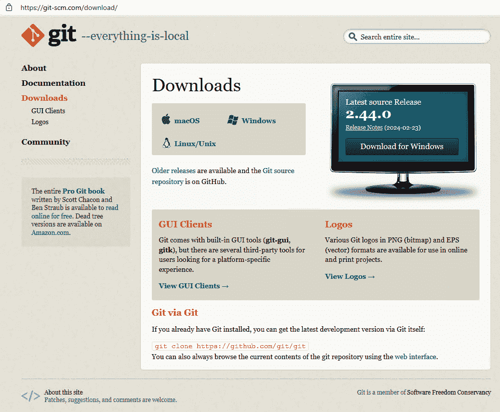

图 2.9 – 下载 Git for Windows

接下来，我将在 **独立安装程序** 下的 **64 位 Git for Windows 安装程序** 上点击，因为我正在运行 x64 机器：

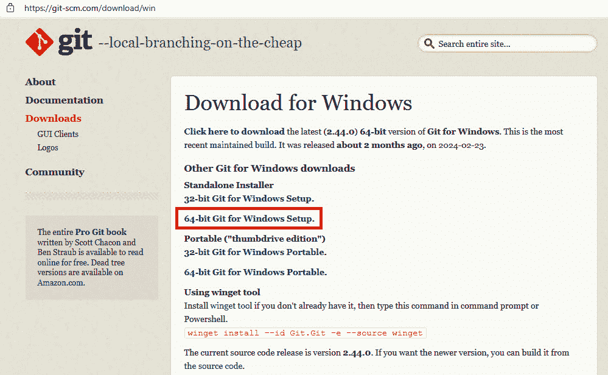

图 2.10 – 选择 Git for Windows 的 64 位版本

下载完成后，双击下载文件夹中的可执行文件以启动安装过程。同样，安装过程包括点击 **下一步** 和 **完成** 按钮。除了两个例外，你应该接受大多数默认值。

第一个例外是，我在安装向导的 **选择 Git 使用的默认编辑器** 屏幕上选择 **使用 Visual Studio Code 作为 Git 的默认编辑器**：

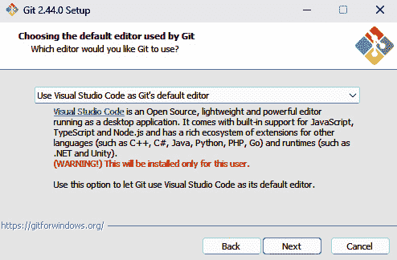

图 2.11 – 将 Visual Studio Code 设置为 Git 的默认编辑器

第二个例外是，我要求 Git 使用 `main` 而不是 **master** 来覆盖默认分支名称，以使用一个更具包容性的名称。

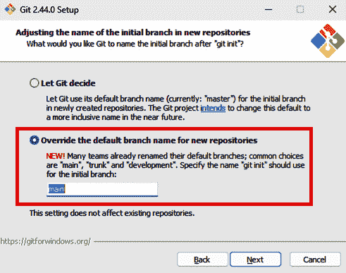

图 2.12 – 在 Git 中覆盖默认分支名称

安装完成后，我可以通过打开终端窗口并输入以下内容来验证 Git 是否确实已安装：

```cs
$ git
```

当安装过程成功完成后，你应该看到以下输出：

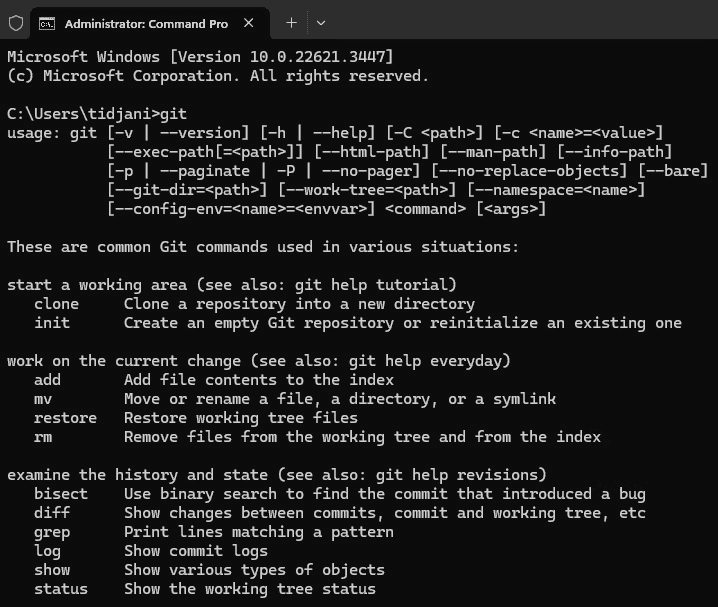

图 2.13 – Git 已安装！

重要提示

如果你正在使用 Linux 工作站，那么 Git 可能已经安装了。所以在尝试安装之前，我建议你通过打开终端并简单地输入 `git` 来验证它是否已经安装。如果已经安装，输出将显示该命令的帮助信息。

一旦 Git 安装完成，我们将执行一些基本配置，特别是设置 Git 用户身份，以便其他开发者可以识别我们的贡献。

为了这个目的，我们将使用以下两个命令：

```cs
$ git config --global user.name "Tidjani Belmansour"
$ git config --global user.email "Tidjani.Belmansour@gmail.com"
```

完美！我们现在不仅能够编写代码，还能够对其进行版本控制和跟踪更改。

# 摘要

恭喜！你现在拥有了一个配置正确且准备就绪的开发环境。

作为提醒，我们已经安装了以下内容：

+   Visual Studio Code，它将作为我们的代码编辑器

+   C#、C# 开发工具包、IntelliCode for C# 开发工具包和 GitLens 扩展程序，这些将使开发、调试和测试过程更加顺畅

+   .NET SDK，显然是必需的，因为我们将要开发一个 .NET CLI 应用程序

+   Git，由于我们将要处理 GitHub 仓库，是必需的

现在我们已经完全设置好并准备就绪，我们可以开始我们的 CLI 应用程序之旅了。我们的第一站将带我们探索 CLI 应用程序的概念和解剖结构。

# 轮到你了！

几乎本书的每一章都以一个 *你的机会！* 部分结束，在这个部分中，您将接受挑战，通过应用您刚刚完成的章节中学到的知识来完成一个或多个任务。

由于本章全部是关于配置您的开发环境，您的挑战就是配置您的环境，以便您能够练习在接下来的章节中学到的内容。如果您已经完成了这个任务，做得好！您在这里没有更多的任务要完成，我将在下一章见到您。
