# .NET 控制台应用程序的基本概念

现在我们已经设置了开发环境，是时候开始使用 .NET 开发 CLI 应用程序之旅了。

然而，首先，我们将探索控制台应用程序！

你可能对控制台应用程序很熟悉，你可能想知道为什么我们需要在一本关于 CLI 应用程序的书中讨论控制台应用程序。原因在于每个 CLI 应用程序的核心都是一个控制台应用程序。这就是为什么在本章中，我们将花一点时间来探索控制台应用程序。此外，你知道他们说什么：提醒从不伤害人 😉。

控制台应用程序可以被视为可以构建的最简单的 CLI 应用程序。

因此，通过探索我们如何创建、运行和交互控制台应用程序，我们将获得如何使用 CLI 应用程序以及如何利用 .NET SDK 提供的控制台应用程序模板来构建它们的基本理解。

然后，我们将创建一个非常简单的 .NET 控制台应用程序，它接受一些输入参数并显示一条消息作为输出。然后我们将增强这个应用程序，使其能够对输入进行一些基本验证，并显示适当的消息作为输出。这条消息将根据其严重性以给定颜色显示。

具体来说，本章涵盖了以下主题：

+   学习如何创建和执行控制台应用程序

+   利用 `System.Console` 类读取用户输入并输出响应

# 技术要求

本章的代码可以在本书配套的 GitHub 仓库中找到，[`github.com/PacktPublishing/Building-CLI-Applications-with-C-Sharp-and-.NET/tree/main/Chapter03/helloConsole`](https://github.com/PacktPublishing/Building-CLI-Applications-with-C-Sharp-and-.NET/tree/main/Chapter03/helloConsole)。

# 创建（并执行）一个简单的控制台应用程序

让我们从打开 Visual Studio Code 并通过转到 **视图** | **终端** 来显示集成终端窗口开始。

接下来，确定你想要创建代码文件夹的位置（我总是在我的 `C:` 驱动器上的 `code` 文件夹中创建代码文件夹；我发现将所有代码集中在一个位置很方便）。

在确保你处于正确的工作目录后，输入以下命令以创建一个 .NET 控制台应用程序：

```cs
$ dotnet new console -n helloConsole -o helloConsole --use-program-main
```

让我们分解这个命令来了解它做了什么：

+   `dotnet new console`：这将要求 .NET CLI 工具创建一个新的控制台应用程序。这将使用 C# 作为语言，.NET 8 作为框架（因为这些是默认值）。

+   `-n helloConsole`：我们的应用程序将被命名为 `helloConsole`。

+   `-o helloConsole`：将创建一个名为 `helloConsole` 的文件夹，其中将包含我们应用程序的所有代码文件。

+   `--use-program-main`：将包含 `Main` 方法的 `Program` 类添加到创建的 `Program.cs` 文件中。此方法是程序的入口点，我们在执行程序时将通过其参数将输入值传递给我们的控制台应用程序。当然，你可以跳过使用 `--use-program-main`，但我更喜欢使用它，因为它使 `Program` 类对从旧版 .NET 版本迁移的开发者来说更加明确和熟悉。

命令执行完成后，你应该会看到一个类似以下输出的内容：

```cs
PS C:\code> dotnet new console -n helloConsole -o helloConsole --use-program-main
The template "Console App" was created successfully.
Processing post-creation actions...
Restoring C:\code\helloConsole\helloConsole.csproj:
  Determining projects to restore...
  Restored C:\code\helloConsole\helloConsole.csproj (in 121 ms).
Restore succeeded.
```

这确认了应用程序已成功创建。

生成项目的简要浏览

生成项目包含三个文件：

- `Main` 方法（）。虽然在非常简单的应用程序中它可能包含所有应用程序的逻辑，但它通常作为起点，根据需要委托给其他类和方法。

- `.csproj` 文件对于 .NET 开发至关重要，因为它集中管理项目配置，使得管理、构建和在不同开发环境和构建系统之间共享项目变得更加容易。在现代 .NET 生态系统（该生态系统强调跨平台开发和灵活的项目结构）中尤为重要。在此文件中，我们通常可以找到有关项目定义、构建配置、依赖关系管理（包括项目引用和 NuGet 包的引用）、编译设置、资源包含、任何构建过程自定义、项目范围内的属性（如程序集名称和版本）、跨平台兼容性和 IDE 集成的信息。

- `.sln` 文件是一个基于文本的文件，用作组织和管理相关项目的容器。它在开发工作流程中扮演着至关重要的角色，尤其是在由多个项目组成的大型应用程序中。其目的是将多个相关项目组织成一个单一解决方案，为所有项目定义构建配置和平台，存储解决方案范围内的设置和元数据，并允许 Visual Studio 同时加载所有相关项目。

现在，让我们通过输入以下命令将项目加载到 Visual Studio Code 中：

```cs
$ code ./helloConsole
```

将打开一个新的 Visual Studio Code 实例，你将看到新创建的项目内容，其外观如下：

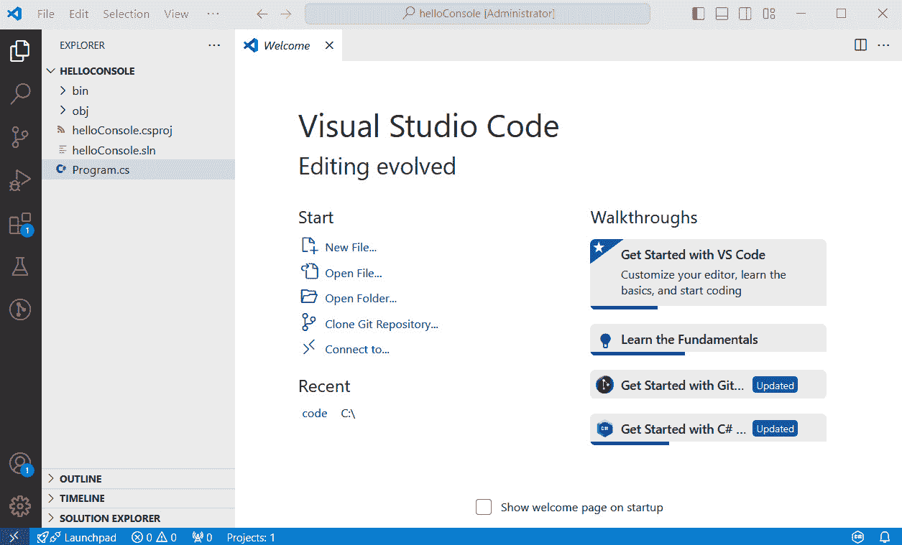

图 3.1 – 在 Visual Studio Code 中打开的 helloConsole 项目

不要混淆代码与代码！

前面的 `code` 命令是 Visual Studio Code 的可执行名称。它不应与 `code` 文件夹混淆 😉。

`Program.cs` 文件中的 `Main` 方法当前不包含太多代码。事实上，当应用程序执行时，它只显示一条 `"Hello, World!"` 消息：

```cs
namespace helloConsole;
class Program
{
    static void Main(string[] args)
    {
        Console.WriteLine("Hello, World!");
    }
}
```

让我们执行此应用程序并查看它返回的内容。为此，我们需要输入以下命令：

```cs
$ dotnet run
```

重要的是要注意，这个命令可以在任何终端中执行：PowerShell 终端、CMD 控制台或 Bash 终端（如果你正在运行 Linux 或 macOS）。然而，由于我们正在使用 Visual Studio Code，最简单的方法是使用 Visual Studio Code 中的集成终端来运行命令。也就是说，你必须确保你处于项目文件夹中，这意味着`dotnet run`命令应该在`.csproj`文件相同的当前工作目录中执行。

这将构建并执行应用程序。输出如下所示：

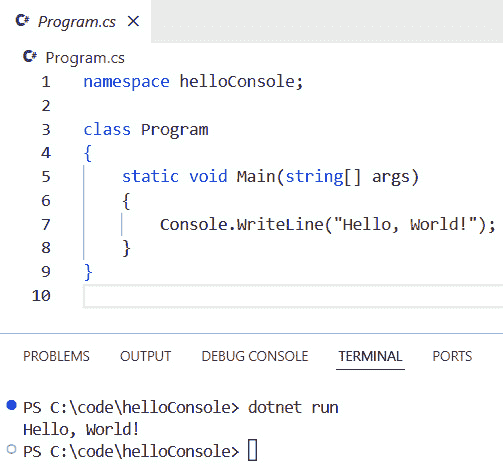

图 3.2 – Hello, World! 输出

这目前并不很有用，对吧？

然而，我们可以注意到`Main`方法接受一个字符串数组作为参数（即作为输入参数）。因此，让我们使用它来向我们的程序传递一些参数。

首先，我们修改我们的应用程序代码以显示该参数的值，如下所示：

```cs
namespace helloConsole;
class Program
{
    static void Main(string[] args)
    {
        Console.WriteLine($"Hello, {args[0]}!");
    }
}
```

现在，一旦执行，我们的程序将显示`Hello`消息，然后是作为参数传递的值。

让我们试试：

```cs
$ dotnet run Packt
```

结果将如下所示：

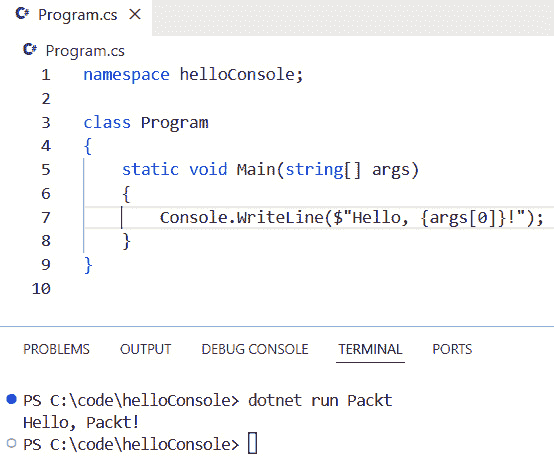

图 3.3 – 传递一个参数

我们当然可以传递多个参数，如下所示：

```cs
$ dotnet run Packt Publishing
```

这次，结果将如下所示：

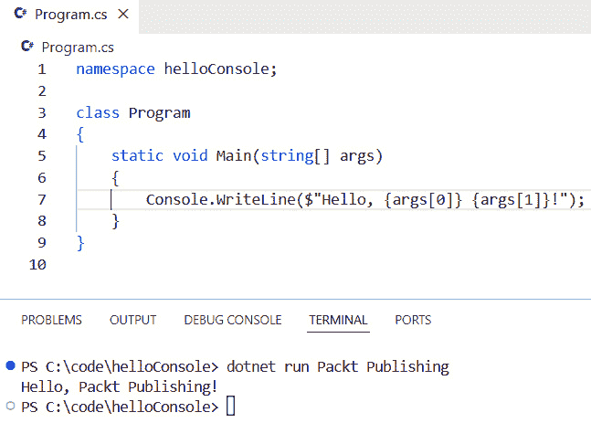

图 3.4 – 传递多个参数

重要提示

有三个注意事项你需要注意：

1. 传递给`Main`方法的参数是一个字符串数组。这意味着如果程序期望输入另一种数据类型（例如整数），你需要解析这些字符串。

2. 由于这个参数是一个字符串数组，你可以通过指定它们的索引来使用传递的值，这代表它们从程序执行的位置。

3. 如果你在代码中使用参数值但在执行程序时没有传递它，将会抛出异常。

从代码的角度来看，这些注意事项意味着什么？让我们考虑一些说明性的例子。

首先，我们将解决第一个注意事项。这个例子表明，尽管其值`42`代表整数，但输入参数的类型是`string`。为了将此值用作整数，我们需要解析它。

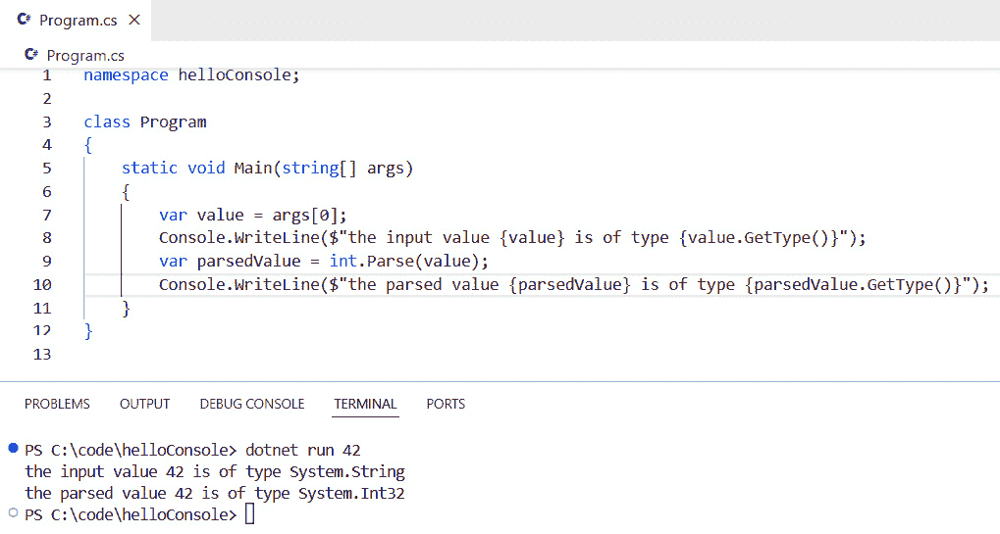

图 3.5 – 解析输入参数

接下来，让我们考虑第二个注意事项。这个例子表明，通过交换参数的索引，我们也会交换它们值的显示。

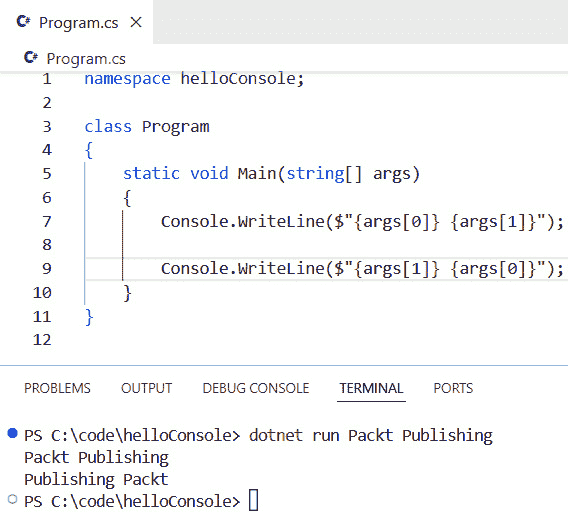

图 3.6 – 切换输入参数

最后，关于第三个注意事项，这个例子演示了在执行程序时未能为输入参数提供值会导致程序崩溃并抛出异常。

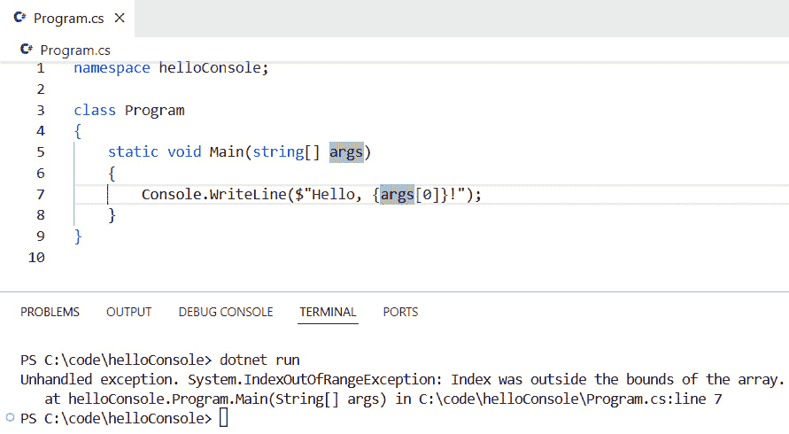

图 3.7 – 缺少输入参数

我们现在知道如何创建和执行 .NET 控制台应用程序。让我们看看我们如何与用户输入交互并更好地格式化我们的输出。

# 使用 System.Console 类

你可能已经注意到，到目前为止的所有示例中，我们都使用了 `Console` 类。更具体地说，我们只使用了它的一种方法（即 `WriteLine`）。这个方法显示传递给参数的表达式的值，然后转到下一行。如果我们不想转到下一行，我们可以使用 `Write` 方法代替。

然而，`Console` 类提供了其他有用的属性和方法。我们不会详细介绍所有这些（实际上，我建议你访问 [`learn.microsoft.com/en-us/dotnet/api/system.console`](https://learn.microsoft.com/en-us/dotnet/api/system.console)）。相反，我将突出显示在控制台应用程序中最有趣的一些。

## 有用的属性

有三个属性我想特别介绍一下：`BackgroundColor`、`ForegroundColor` 和 `Title`。

前两个，正如其名称所暗示的，用于更改终端的背景和前景颜色。

第三个，`Title`，用于更改终端窗口的标题。请记住，您需要在外部终端（而不是 Visual Studio Code 集成终端）中执行程序才能看到更改终端标题的效果。

这里有一个示例：

```cs
class Program
{
    static void Main(string[] args)
    {
        // performing a backup of the background and
        //foreground colors
        var originalBackroungColor = Console.BackgroundColor;
        var originalForegroundColor = Console.ForegroundColor;
        // changing the background and foreground colors
        Console.BackgroundColor = ConsoleColor.Blue;
        Console.ForegroundColor = ConsoleColor.Yellow;
     // setting the title of the terminal while the
     //application is running
        Console.Title = "Packt Publishing Console App";
        // displaying a message
        Console.WriteLine($"Hello from Packt Publishing!");
        // restoring the background and foreground colors
        // to their original values
        Console.BackgroundColor = originalBackroungColor;
        Console.ForegroundColor = originalForegroundColor;
        // waiting for the user to press a key to end the program.
        // this is useful to see the altering of the terminal's title
        Console.ReadKey(true);
    }
}
```

如您所见，在程序开始时，我们备份了前景和背景颜色，并在程序结束时恢复它们。

对于终端的标题，没有必要这样做，因为设置的值仅在程序执行期间有效。

## 有用的方法

我还想谈谈一些有趣（且有用）的方法。以下是它们：

+   `ReadLine`

+   `ReadKey`

+   `Clear`

让我们从 `ReadLine` 开始。这个方法读取用户输入的所有字符，直到他们按下 *Enter* 键，并将用户输入作为 `string` 返回。因此，它对于收集用户输入，如姓名、年龄或地址非常有用。

这里有一个示例：

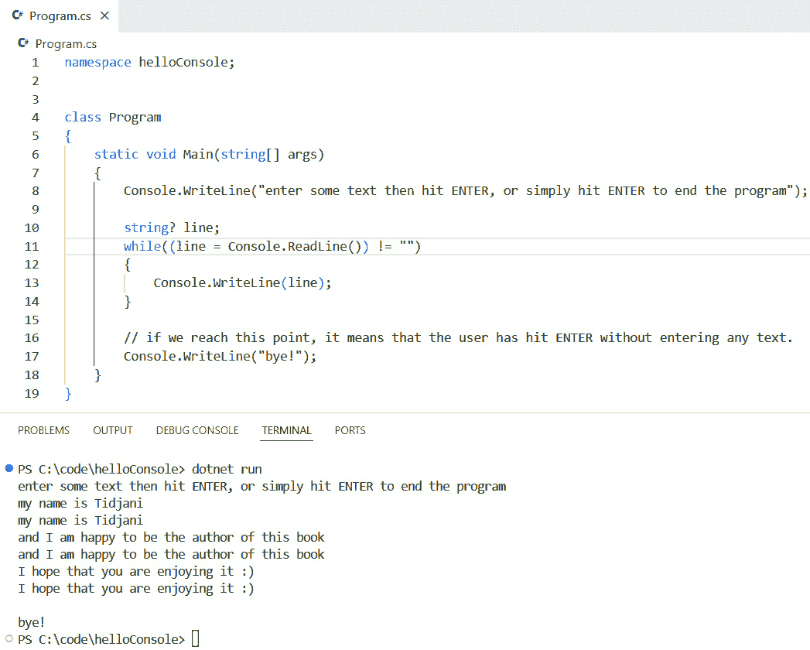

图 3.8 – 从控制台读取用户输入

接下来，让我们谈谈 `ReadKey`。这个方法读取用户按下的字符或功能键。它返回一个 `ConsoleKeyInfo` 类型的对象，其中包含有关按下的键的信息。它还接受一个可选的布尔参数，如果设置为 `true`，则不会在控制台显示按下的键，如果设置为 `false`，则显示。

这里有一个布尔参数设置为 `true` 的示例：

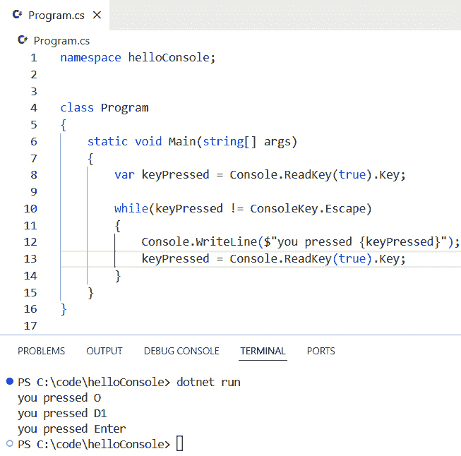

图 3.9 – 将布尔参数设置为 true 的 ReadKey 方法

现在，注意当布尔参数设置为 `false` 时的输出：

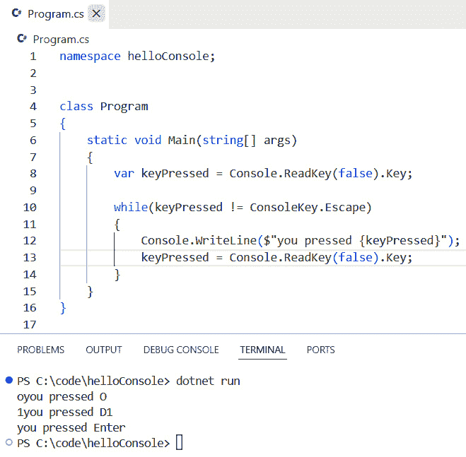

图 3.10 – 将布尔参数设置为 false 的 ReadKey 方法

你有没有注意到按下的键被显示两次：一次是在按下后，另一次是在输出消息时？

顺便说一句，你可以访问[`learn.microsoft.com/en-us/dotnet/api/system.consolekey`](https://learn.microsoft.com/en-us/dotnet/api/system.consolekey)以查找`ConsoleKey`枚举的所有值的列表。

最后，让我们看看`Clear`方法。正如其名所示，它清除了控制台：

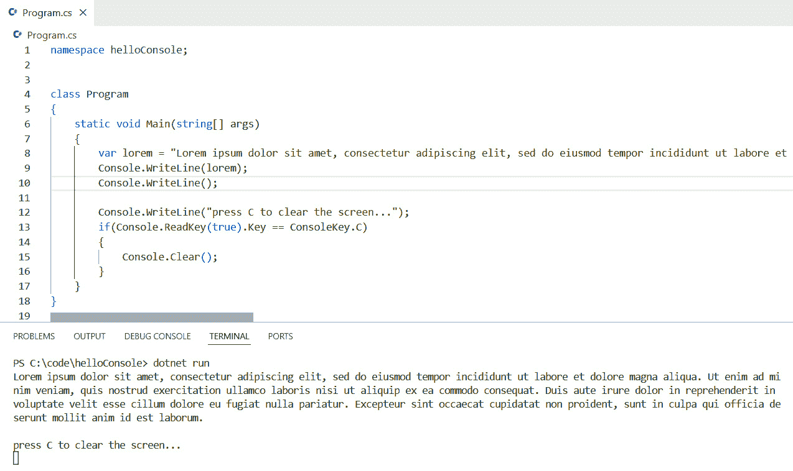

图 3.11 – 使用 Clear 方法清除控制台

当用户按下*C*键后，控制台将被清除。

此命令通常用于以下场景：

+   **在程序启动时**：在这里使用它是为了确保你的程序通过删除来自其他程序或命令的所有先前输出而获得一个干净的界面

+   **在进入新部分或菜单项时**：这防止了先前部分的输出污染当前部分

## 有用的事件

如果你曾经运行过 CLI 应用程序，你可能知道*Ctrl* + *C*或*Ctrl* + *Break*键组合，这可以在任何时候通过终止程序来退出。

在.NET 控制台应用程序中，这些键组合引发一个名为`CancelKeyPress`的事件。当按下其中一个键组合时，事件被引发并中断正在执行的操作。我们的代码可以处理此事件，以便允许程序优雅地关闭，在关闭前清理和释放资源。

让我们用一个例子来说明这一点。考虑以下代码：

```cs
using System.Threading.Tasks;
class Program
{
    static void Main(string[] args)
    {
        int counter = 1;
        while(true)
        {
            Console.WriteLine($"Printing line number {counter}");
            counter++;
            Task delayTask = Task.Run(async () => await Task.
            Delay(1000));
            delayTask.Wait();
        }
    }
}
```

如你可能注意到的，此代码使用了一个没有退出条件的无限循环。因此，从其中退出的唯一方法是使用取消键组合之一（*Ctrl* + *C*或*Ctrl* + *Break*）。然而，当按下时，这将突然终止程序，而不给它机会执行一些动作以优雅地退出，例如以下操作：

+   保存执行状态

+   退出服务

+   关闭数据库连接

我们将修改之前的代码以处理该终止事件，允许程序优雅地终止：

```cs
using System.Threading.Tasks;
class Program
{
    static void Main(string[] args)
    {
        Console.CancelKeyPress += (sender, e) =>
        {
            e.Cancel = true; // This will prevent the program from 
                             // terminating immediately
            Console.WriteLine("CancelKeyPress event raised!\
            nPerforming cleanup...");
            // Performing cleanup operations (logging out of services, 
            saving progress state, closing database connections,...)
            Environment.Exit(0); // This will terminate the program 
                                 // when cleanup is done
        };
        int counter = 1;
        while(true)
        {
            Console.WriteLine($"Printing line number {counter}");
            counter++;
            Task delayTask = Task.Run(async () => await Task.
            Delay(1000));
            delayTask.Wait();
        }
    }
}
```

现在，执行的结果看起来像这样：

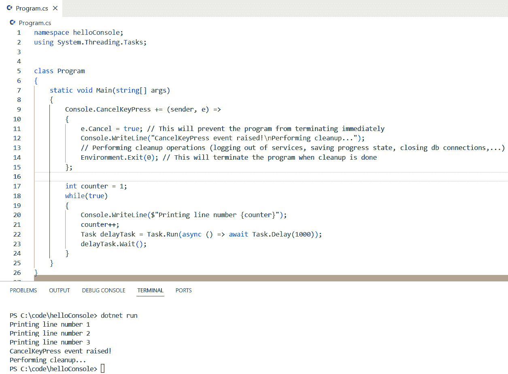

图 3.12 – 取消当前操作

因此，如果你的 CLI 应用程序与外部资源或服务交互（正如我们将在接下来的章节中做的那样），你应该利用`Console.CancelKeyPress`事件。

# 还有一件事

到目前为止，我们使用.NET CLI 的`run`命令执行了程序。

然而，如果你熟悉 CLI 应用程序，你会知道这类应用程序通常通过其可执行文件名来执行。

第一个浮现的问题可能是“为什么我们使用.NET CLI 的`run`命令来执行我们的程序？”。答案是“因为当你开发和测试 CLI 应用程序时，你就是这样做的。”

接下来的问题是“那么，我该如何使用它的可执行文件来执行我的程序呢？”这个问题的答案是“通过到达那个可执行文件的位置，并从那里运行程序。”

让我们看看我们是如何做到这一点的。

当你构建程序时，使用以下命令：

```cs
$ dotnet build
```

这将在你的硬盘上的`bin\Debug\net8.0`文件夹中生成可执行文件。

在 Windows 机器上，这看起来是这样的：

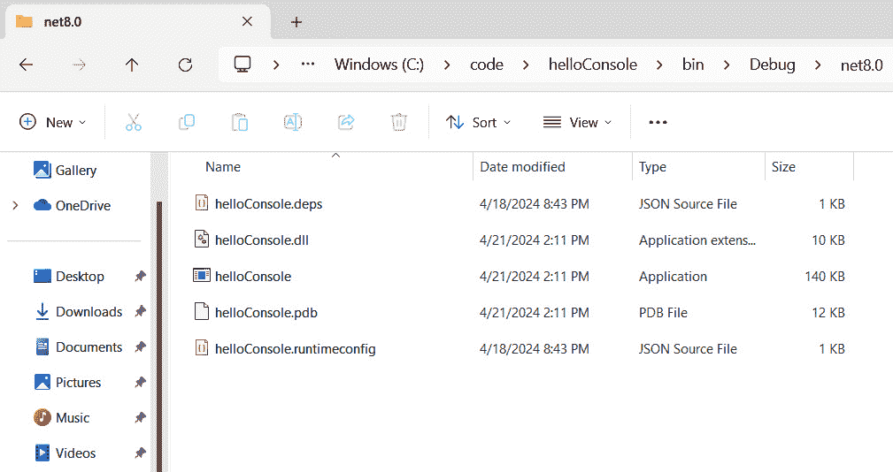

图 3.13 – 生成的可执行文件

要使用程序的可执行文件名来运行程序，请打开一个终端窗口，导航到该位置，然后输入以下命令（在这里，我们传递了`42`作为参数）：

```cs
$ .\helloConsole 42
```

结果应该类似于这样：

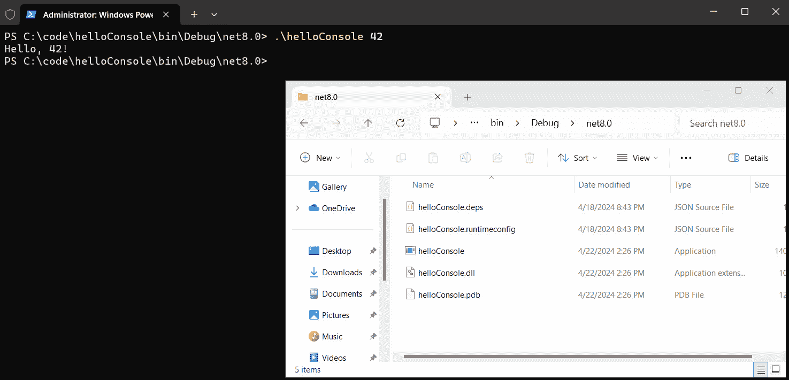

图 3.14 – 从可执行文件运行程序

我应该使用`dotnet run`还是运行可执行文件？

使用`dotnet run`命令运行程序和从其可执行文件运行程序之间有一些区别。以下是最显著的几个：

- `dotnet run`命令在运行程序之前会构建项目，这确保了我们总是运行代码的最新版本。可执行文件代表代码的最后编译版本。

- `dotnet run`由于构建步骤，比直接从可执行文件运行程序要慢。虽然`dotnet run`命令可能需要几秒钟来构建和执行代码，但可执行文件通常在毫秒内执行。

这很重要，因为在开发阶段，你可能会依赖`dotnet run`来执行你的程序。然而，在测试和生产阶段，你将依赖可执行文件名。所以，确保你仔细选择你程序（及其可执行文件）的名称 😉。

# 摘要

在本章中，我们探讨了 CLI 应用程序的核心：控制台应用程序！这就是为什么学习如何与控制台应用程序一起工作至关重要，因为它们是构建更复杂 CLI 应用程序的基础。

我们看到了如何执行控制台应用程序，提供输入参数值，并解析这些输入参数值以将它们转换为程序期望的数据类型。我们看到了如何通过使用`Console`类的`ReadKey`和`ReadLine`方法来收集用户输入。最后，我们看到了如何处理由于缺少输入参数值而引发的异常。

然而，CLI 应用程序不仅仅是控制台应用程序。它包含命名参数、标志和子命令。

在接下来的章节中，我们将看到如何利用这些功能构建一个功能齐全的 CLI 应用程序。在下一章中，我们将从创建 CLI 应用程序开始，学习如何解析其输入，包括命令、标志和参数。

# 轮到你了！

跟随提供的代码是一种通过实践学习的好方法。

一个更好的方法是挑战自己完成任务。因此，我挑战你完成以下任务：

创建一个控制台应用程序，执行以下操作：

+   将终端窗口的标题设置为 **猜数字游戏！**

+   生成一个介于 1 和 20 之间的随机整数

+   告诉玩家他们有三次机会猜出那个数字

+   在每位玩家的测试之后，程序应该执行以下操作：

    +   如果玩家猜出了数字，程序将以绿色文字显示 **恭喜你，你赢了**，以及玩家猜出数字所需的尝试次数

    +   如果玩家在三次尝试内未能猜出数字，程序应以红色文字显示 **下次好运！要猜的数字是** 以及要猜的数值

    +   如果玩家按下 *Enter* 而没有提供数字，程序应将其视为零值并继续执行

    +   如果玩家按下 *Ctrl* + *C*，程序应退出并显示，以黄色文字显示 **感谢** **您游玩！**

# 第二部分：构建 CLI 应用程序的基础

在这部分，你将深入了解 CLI 应用程序开发的必要组件。你将探索命令行解析技术，学习如何有效地使用库处理用户输入和解析参数。接下来，你将了解输入/输出操作和文件处理，包括从文件读取和写入文件的方法，以及如何操纵文件流以进行高效的数据处理。最后，你将发现错误处理和日志记录的最佳实践，包括实现具有不同严重级别的结构化日志、优雅地管理异常，并在保持详细日志以供调试目的的同时，向用户提供信息丰富的错误消息。

本部分包含以下章节：

+   *第四章**，命令行解析*

+   *第五章**，输入/输出和文件处理*

+   *第六章**，错误处理和日志记录*
