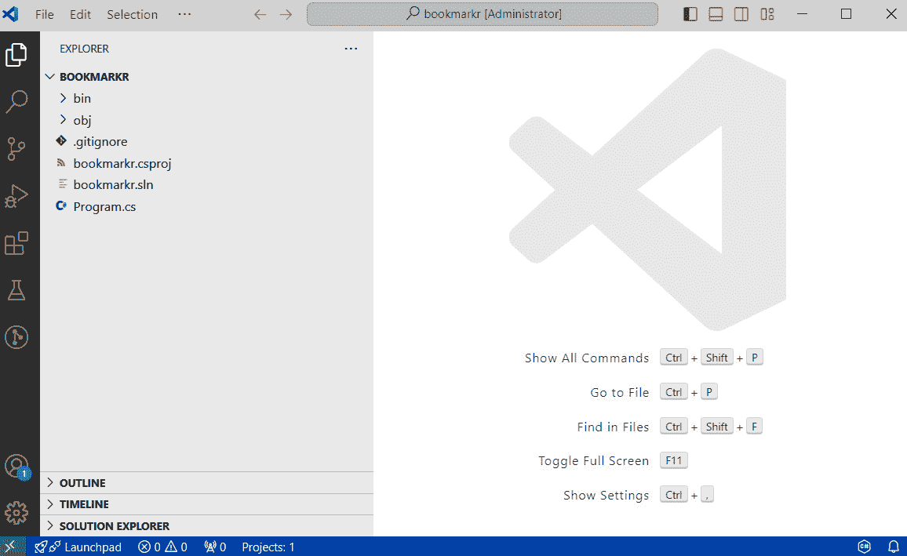
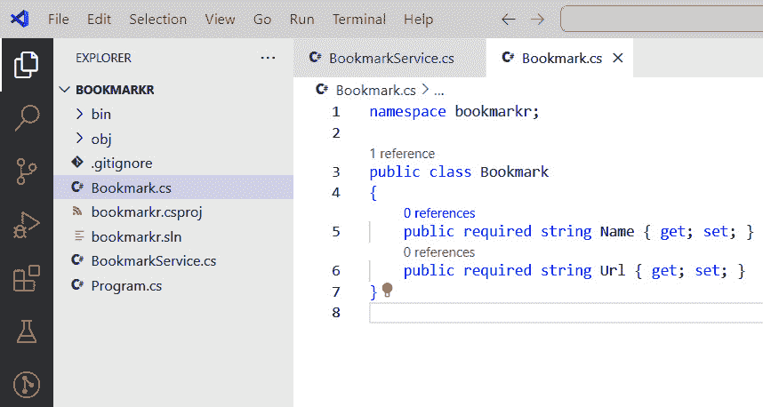
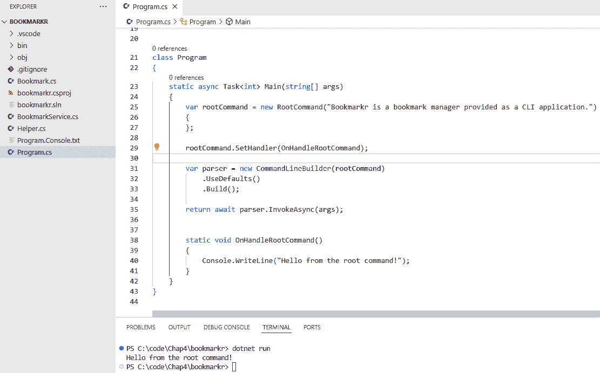
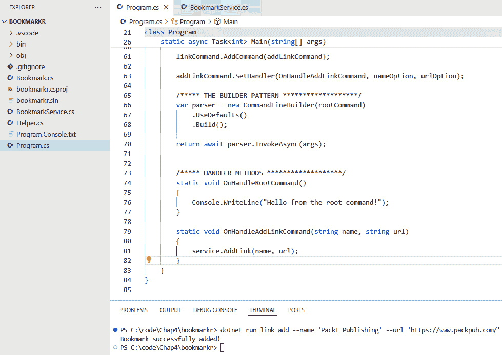
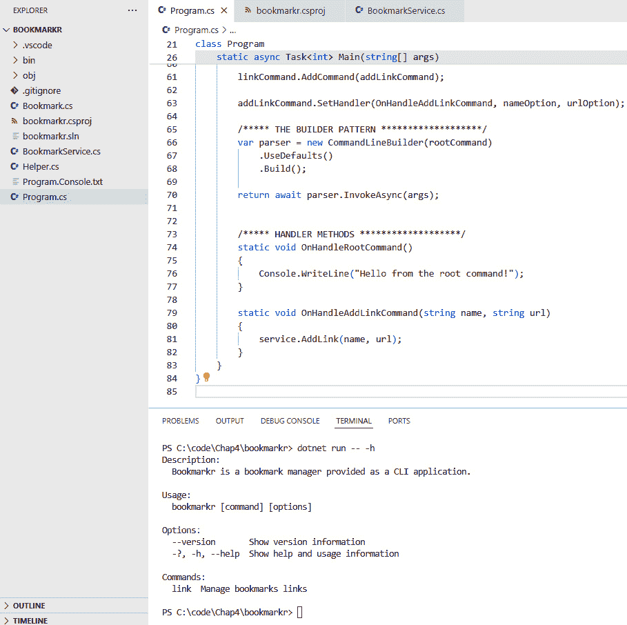
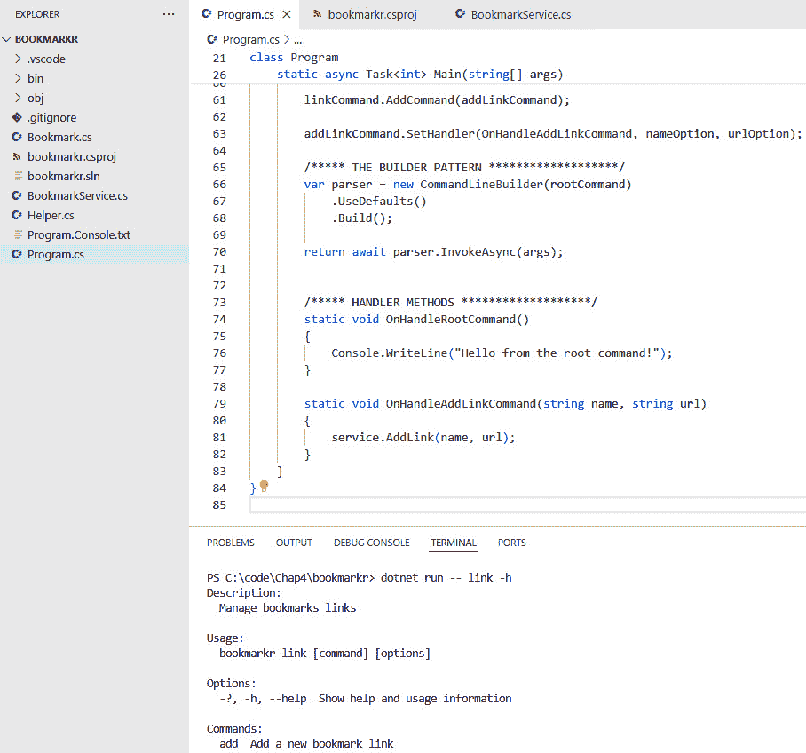
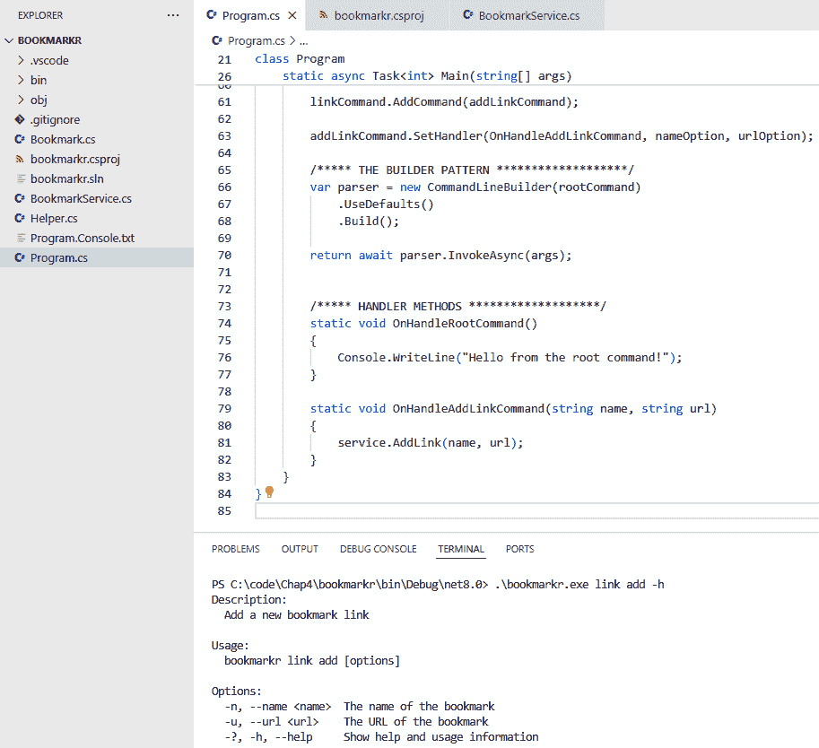

# 4

# 命令行解析

在上一章中，我们创建了一个控制台应用程序，并学习了如何向它传递参数，并在需要时将这些参数转换为预期的数据类型（记住，传递给控制台应用程序的参数是 `String` 类型）。

然而，尽管控制台应用程序是 CLI 应用程序的核心，但 CLI 应用程序不仅仅是控制台应用程序。CLI 应用程序包含命名参数、开关和子命令，以实现预期的目标。

借助我们创建控制台应用程序的知识，我们将在其基础上学习如何创建 CLI 应用程序。

要做到这一点，在本章中，我们将涵盖以下主题：

+   创建控制台应用程序

+   解析控制台应用程序的参数

+   从控制台到 CLI：使用现有库解析参数

到本章结束时，你将学习如何从一个简单的控制台应用程序开始，将其转换为处理命令、子命令和选项的强大 CLI 应用程序。

介绍 Bookmarkr

**Bookmarkr** 是我们将在这本书中构建的 CLI 应用程序的名称。

这是一个用于管理书签的命令行应用程序。

在本书的每一页，我们将让 *Bookmarkr* 生动起来，并为其添加更多功能。

*为什么需要一个* *书签管理器？*

因为每个人都使用过，所以他们熟悉这种工具的工作方式和它提供的功能。

通过移除理解我们正在构建的“什么”业务背景的负担，我们就可以将全部注意力集中在“如何”构建它上。这正是我选择这个应用程序的原因。此外，它仍然非常有用 😉。

# 技术要求

本章的代码可以在本书配套的 GitHub 仓库中找到，[`github.com/PacktPublishing/Building-CLI-Applications-with-C-Sharp-and-.NET/tree/main/Chapter04`](https://github.com/PacktPublishing/Building-CLI-Applications-with-C-Sharp-and-.NET/tree/main/Chapter04)。

# 创建控制台应用程序

让我们先创建控制台应用程序。为此，在 Visual Studio Code 中，通过转到 **视图**|**终端** 来显示 **终端** 窗口。

然后，将您定位到您想要创建代码文件夹的位置（我在上一章提到，我总是创建一个 `C:\Code` 文件夹，它将包含我所有的代码项目）。

从那里，键入以下命令以创建控制台应用程序：

```cs
$ dotnet new console -n bookmarkr -o bookmarkr --use-program-main
```

当在 Visual Studio Code 中加载时，.NET 项目看起来如下：



图 4.1 – 在 Visual Studio Code 中打开的 bookmarkr 项目

让我们在 `Program.cs` 文件中添加一些代码。

我们将实现的第一项功能是能够将新的书签添加到书签列表中。

要做到这一点，我们需要创建一个包含所有书签操作逻辑的 `BookmarkService` 类。通过遵循开发的最佳实践，我们将在这个名为 `BookmarkService.cs` 的单独代码文件中创建这个类：

```cs
namespace bookmarkr;
public class BookmarkService
{
}
```

接下来，我们需要向那个 `BookmarkService` 类添加一个 `Bookmark` 对象的列表：

```cs
namespace bookmarkr;
public class BookmarkService
{
    private readonly List<Bookmark> _bookmarks = new();
}
```

我们还需要定义 `Bookmark` 类。在这里，我们再次遵循开发的最佳实践，并将创建这个类在其自己的代码文件中，聪明地命名为 `Bookmark.cs` 😊。这个类看起来是这样的：

```cs
namespace bookmarkr;
public class Bookmark
{
    public required string Name { get; set; }
    public required string Url { get; set; }
}
```

由于 `Bookmark` 对象的两个属性不能为 `null`，我们使用 `required` 修饰符来声明它们。

更新的 .NET 项目现在看起来是这样的：



图 4.2 – 在 Visual Studio Code 中打开的更新后的 bookmarkr 项目

现在我们已经准备好了所有部件，让我们看看我们如何处理用户请求。

# 解析控制台应用程序的参数

向 CLI 应用程序发出的请求通常包含命令的名称（以及可选的子命令）以及为命令所需的参数提供值的参数。

我们将要添加的第一个命令是能够将新的书签添加到书签列表中。

预期命令的语法如下：

```cs
$ bookmarkr link add <name> <url>
```

那么，让我们修改代码以处理这样的命令！

我们将从 `Program` 类的 `Main` 方法（位于 `Program.cs` 文件中）开始。为什么？因为这个方法是接收用户输入参数的方法。

由于我们可能在未来有多个命令，我们将添加一个 `switch` 语句来处理每一个。因此，代码将看起来像这样：

```cs
namespace bookmarkr;
class Program
{
    static void Main(string[] args)
    {
        if(args == null || args.Length == 0)
        {
            Helper.ShowErrorMessage(["You haven't passed any argument. 
            The expected syntax is:", "bookmarkr <command-name> 
            <parameters>"]);
            return;
        }
        var service = new BookmarkService();
        switch(args[0].ToLower())
        {
            case "link":
                ManageLinks(args, service);
                break;
            // we may add more commands here...
            default:
                Helper.ShowErrorMessage(["Unknown Command"]);
                break;
        }
    }
    static void ManageLinks(string[] args, BookmarkService svc)
    {
        if(args.Length < 2)
        {
            Helper.ShowErrorMessage(["Unsufficient number  of 
            parameters. The expected syntax is:", "bookmarkr link 
            <subcommand> <parameters>"]);
        }
        switch(args[1].ToLower())
        {
            case "add":
                svc.AddLink(args[2], args[3]);
                break;
            // we may add more subcommands here...
            default:
                Helper.ShowErrorMessage(["Unsufficient number of 
                parameters. The expected syntax is:", "bookmarkr link 
                <subcommand> <parameters>"]);
                break;
        }
    }
}
```

让我们解释一下这段代码：

+   `Main` 方法将每个命令的处理调度到 `Program` 类中的特定方法。由于现在我们只有一个命令（`link`），我们只有一个处理方法（`ManageLinks`）。

+   `ManageLinks` 方法处理与链接相关的子命令。目前，我们只有一个子命令（`add`），但我们可以很容易地想象会有更多子命令，例如 `update`（更新现有链接的 URL）、`remove`（删除现有链接）和 `list`（列出所有现有链接）。

+   最后，`ShowErrorMessage` 方法是一个用于在红色文本中显示错误消息的实用方法。它的代码可以在 `Helper` 类中找到，这里省略因为它对我们讨论的主题没有提供价值。

如果你编写（或复制）这段代码，你会注意到它无法编译。这是因为 `AddLink` 方法在 `BookmarkService` 类中尚未可用。让我们添加它！

`AddLink` 方法的代码如下：

```cs
public void AddLink(string name, string url)
{
        if(string.IsNullOrWhiteSpace(name))
        {
            Helper.ShowErrorMessage(["the 'name' for the link is 
            not provided. The expected syntax is:", "bookmarkr link 
            add <name> <url>"]);
            return;
        }
        if(string.IsNullOrWhiteSpace(url))
        {
            Helper.ShowErrorMessage(["the 'url' for the link is 
            not provided. The expected syntax is:", "bookmarkr link 
            add <name> <url>"]);
            return;
        }
        if(_bookmarks.Any(b => b.Name.Equals(name, StringComparison.
        OrdinalIgnoreCase)))
        {
            Helper.ShowWarningMessage([$"A link with the name '{name}' 
            already exists. It will thus not be added",
            $"To update the existing link, use the command: bookmarkr 
            link update '{name}' '{url}'"]);
            return;
        }
        _bookmarks.Add(new Bookmark { Name = name, Url = url});
        Helper.ShowSuccessMessage(["Bookmark successfully added!"]);
}
```

这段代码相当简单直接，但让我们简要解释一下：

+   我们首先确保提供了 `name` 和 `url` 参数。如果没有，我们将向用户返回一个错误消息，其中包含命令的预期语法。

+   我们确保要添加的链接尚未存在于书签列表中。如果已存在，我们将通过警告消息通知用户，并邀请他们使用 `update` 子命令来更新现有链接。

+   如果链接尚不存在，我们将它添加到书签列表中，并通过成功消息通知用户。

很简单，不是吗？😊

然而，这种方法构建 CLI 应用程序存在一个问题。你能猜到是什么吗？

它基于位置参数。换句话说，我们期望第一个参数是命令的名称，第二个参数是子命令的名称，第三个参数是 `name` 参数的值，第四个参数是 `url` 参数的值。

但存在一些问题：

+   用户如何知道这个顺序呢？

+   如果用户将 `url` 值作为第三个参数，将 `name` 值作为第四个参数提供怎么办？

如果你熟悉使用 CLI 应用程序，你会知道 CLI 命令的常用语法看起来像这样：

```cs
$ bookmarkr link add --name <name> --url <url>
```

它也可以看起来像这样：

```cs
$ bookmarkr link add -n <name> -u <url>
```

这有助于用户了解预期的参数是什么，以及如何以适当的方式提供参数。

我们当然可以依赖参数的 `args` 列表，并将每个参数与预期值进行比较（例如，检查第三个参数的值是否为 `--name` 或 `-n`，这样我们就可以知道第四个参数代表链接的名称，依此类推），但这会使我们的代码过于复杂。

我知道你在想什么。你很聪明，你已经想出了解决这个问题的最佳方法，那就是开发一个库来解析这些参数并找出它们代表什么。

但是，因为我知道你很聪明，我知道你已经搜索过这样一个库。毕竟，你不想重新发明轮子，对吧？

# 从控制台到 CLI - 使用现有库解析参数

尽管存在许多针对不同编程语言的库，包括 .NET，但本书将专注于 `System.CommandLine`。

你可能想知道我们为什么选择这个库，尤其是如果你熟悉（或者听说过）`CommandLineParser`，这是一个针对该领域的另一个常见库。

这有多个原因。本质上，`System.CommandLine` 是一个更现代、功能更丰富、性能更好的库，而 `CommandLineParser` 则是一个更简单、更轻量级的替代方案。

此外，还有一些其他原因让我更喜欢 `System.CommandLine`：

+   `System.CommandLine` 是由微软和社区开发的 .NET 基金会项目，而 `CommandLineParser` 是一个第三方库

+   `System.CommandLine` 使用构建器模式和更声明性的方法来定义命令和选项，而 `CommandLineParser` 使用属性和更命令式的方法

+   `System.CommandLine` 提供了更多开箱即用的高级功能，例如命令层次结构、响应文件、自动完成和解析指令，而 `CommandLineParser` 则更轻量级，专注于基本的命令行解析

+   `System.CommandLine` 被认为是更快、更高效的，尤其是在处理大型命令行结构时

+   尽管这两个库都是跨平台的，但 `System.CommandLine` 对平台特定约定的支持更好，例如在 Windows 上的不区分大小写

现在，让我们重写我们的应用程序以利用 `System.CommandLine` 库！

重要提示 #1

`Program.cs` 文件的上一版代码已被移至 `Program.Console.txt` 文件以供进一步参考。

重要提示 #2

虽然您可以通过其可执行文件名（位于 `bin\Debug\net8.0\bookmarkr.exe`）执行应用程序，但在开发阶段，使用 `dotnet` `run` 命令会更方便。

我更喜欢依赖于可执行文件名，因为它与我们将在生产中使用应用程序的方式相匹配。如果您更喜欢使用 `dotnet run` 命令，只需在以下执行语法中将 `bookmarkr` 替换为 `dotnet run`。

我们需要做的第一件事是将 `System.CommandLine` NuGet 包库添加到我们的项目中。为此，打开 Visual Studio Code 终端并输入以下命令：

```cs
$ dotnet add package System.CommandLine --prerelease
```

在撰写本章时，这个库仍然处于测试版。当它不再需要 `--prerelease` 开关时。

`System.CommandLine` 的工作方式是拥有一个 `RootCommand` 对象，它将作为 CLI 应用程序中所有其他命令的根命令。这意味着应用程序中的每个命令都有一个父命令，要么是 `root` 命令，要么是最终父命令是根命令的其他命令。

## 添加根命令

根命令是在用户不带参数调用 CLI 应用程序时被调用的命令。

根命令是 `RootCommand` 类的一个实例：

```cs
var rootCommand = new RootCommand("Bookmarkr is a bookmark manager provided as a CLI application.")
{
};
```

一个命令有一个处理程序，这是一个在用户调用该命令时被调用的方法：

```cs
rootCommand.SetHandler(OnHandleRootCommand);
```

`SetHandler` 方法接受一个指向实际执行工作的方法的委托：

```cs
static void OnHandleRootCommand()
{
    Console.WriteLine("Hello from the root command!");
}
```

最后，由于 `System.CommandLine` 库遵循 `Builder` 模式，我们需要构建和调用解析器来启动操作：

```cs
var parser = new CommandLineBuilder(rootCommand)
    .UseDefaults()
    .Build();
return await parser.InvokeAsync(args);
```

最后但同样重要的是，让我们在文件顶部添加所需的 `using` 语句：

```cs
using System.CommandLine;
using System.CommandLine.Builder;
using System.CommandLine.Parsing;
```

我们现在可以执行我们的应用程序了！输入以下内容：

```cs
$ bookmarkr
```

当执行时，应用程序将调用适当的命令（在这里，由于没有向执行应用程序传递任何参数，所以是根命令），然后它将调用其处理方法（`OnHandleRootCommand`），并且其执行结果将返回给用户。在这个例子中，命令将显示消息 `"Hello from the"` `root command!"`。



图 4.3 – 调用根命令

这不是令人兴奋吗？不？您是对的…这（目前）看起来不是一个 CLI 应用程序。让我们添加另一个命令！

## 添加链接命令

使用我们的 CLI 应用程序添加书签的语法应该是这样的：

```cs
$ bookmarkr link add <name> <url>
```

因此，我们需要创建一个`link`命令。此命令将以根命令作为父命令：

```cs
var linkCommand = new Command("link", "Manage bookmarks links")
{
};
rootCommand.AddCommand(linkCommand);
```

接下来，我们需要一个`add`命令，其父命令将是`link`命令：

```cs
var addLinkCommand = new Command("add", "Add a new bookmark link")
{
};
linkCommand.AddCommand(addLinkCommand);
addLinkCommand.SetHandler(OnHandleAddLinkCommand);
```

现在，让我们执行这个应用程序：

```cs
$ bookmarkr link add
```

很接近，对吧？

缺少的唯一元素是`<name>`和`<url>`部分。这些被称为**选项**，我们将在稍后探讨它们。但首先，让我们专注于命令。

## 关于命令

命令就像一棵树，其中根命令是…嗯，那棵树的根。

每个命令都有一个父命令，它可以是另一个命令（例如，`add`的父命令是`link`），或者根命令本身（例如，`link`命令）。

命令树决定了 CLI 应用程序的语法。例如，我们无法执行以下调用：

```cs
$ bookmarkr add
```

这是因为没有`add`命令以根命令作为父命令。

## 所有命令都需要有处理方法吗？

答案是，不，它们不需要。只有实际执行一些处理的命令才需要处理方法。在我们的例子中，根命令和`link`命令都不需要处理方法。

## 向链接命令添加选项

由于`add`命令需要两个参数（`name`和`url`），我们将向其中添加两个选项：

```cs
var nameOption = new Option<string>(
    ["--name", "-n"],
    "The name of the bookmark"
);
var urlOption = new Option<string>(
    ["--url", "-u"],
    "The URL of the bookmark"
);
```

如您所见，一个`Option`是通过以下方式定义的：

+   其值的类型（这里是一个字符串）

+   它的别名（对于`urlOption`，这些是`--url`和`-u`）

+   它的描述，当请求该命令的帮助菜单时将很有用（对于`urlOption`，它是`"The URL of the bookmark"`）

接下来，我们需要将这些选项分配给命令，如下所示：

```cs
var addLinkCommand = new Command("add", "Add a new bookmark link")
{
    nameOption,
    urlOption
};
```

然后，我们需要将这些选项传递给`Handler`方法：

```cs
addLinkCommand.SetHandler(OnHandleAddLinkCommand, nameOption, urlOption);
```

最后，我们在`Handler`方法中使用这些选项的值：

```cs
static void OnHandleAddLinkCommand(string name, string url)
{
    // 'service' is an instance of 'BookmarkService'.
    service.AddLink(name, url);
}
```

现在，如果我们执行应用程序，我们会得到预期的结果。这次，我们没有解析控制台应用程序的参数并将此委托给`System.CommandLine`库，因此节省了大约一半的代码：



图 4.4 – 我们成功添加了一个书签

注意，使用别名，我们可以使用以下语法执行 CLI 应用程序：

```cs
$ bookmarkr --name 'Packt Publishing' --url 'https://www.packtpub.com'
```

我们也可以使用以下语法：

```cs
$ bookmarkr -n 'Packt Publishing' -u 'https://www.packtpub.com'
```

结果将与*图 4**.4*中显示的相同。

## 我们可以使用哪些其他类型的选项？

`System.CommandLine`不仅支持`string`选项。`Option<T>`是一个泛型类型，因此您可以为任何数据类型创建一个`Option<T>`。例如，以下可以是以下内容：

+   `int`

+   `double`

+   `bool`

+   `DateTime`

+   `Uri`

+   `TimeSpan`

+   `Regex`

+   `Enum`

+   `IPAddress`

+   `FileInfo`

如果您愿意，甚至可以是您自己的自定义类。

根据我们使用的数据类型，提供的选项值将被解析为该数据类型。如果解析失败，将引发异常，并在控制台显示错误信息。

这里有一个说明性的例子。根命令已被更新以接受一个整数选项。当程序执行时，如果为该选项提供了一个无法解析为整数的值，我们将得到以下错误信息：

```cs
$ bookmarkr --number toto
Cannot parse argument 'toto' for option '--number' as expected type 'System.Int32'.
```

嗯……虽然选项的名称表明它期望一个数字，但并不清楚这个数字是什么。它的目的是什么？这个数字的有效值范围是什么？一点帮助在这里……嗯，很有帮助 😊。

## 获取帮助

好消息是，当使用`System.CommandLine`时，我们自动获得为我们构建的帮助菜单。我们只需要为我们自己的命令和选项提供有意义的名称和描述，库就会完成其余的工作。

我们可以通过以下任一选项来获取帮助：

+   `--help`

+   `-h`

+   `-?`

结果看起来像这样：



图 4.5 – 帮助！

这也适用于子命令。例如，如果我们想获取有关`link`命令的帮助，我们可以输入以下内容：



图 4.6 – 获取链接命令的帮助

我们可以一次为一个子命令做这件事，例如`link add`命令，例如：



图 4.7 – 获取链接添加命令的帮助

重要提示

你可能已经注意到，获取帮助的`dotnet run`语法需要额外的`--`。这不是一个打字错误。这是必需的，因为否则，.NET CLI 工具会认为你正在请求`dotnet`工具的帮助。

额外的`--`用于将传递给`dotnet run`的参数与传递给正在运行的应用程序的参数分开。`--`之后的所有内容都被认为是应用程序的参数，而不是`dotnet run`的参数。

然而，我们应该记住的是，CLI 应用程序的使用（及其帮助）取决于应用程序的当前版本。但我们如何获取这些信息呢？

## 获取应用程序的版本号

有一个内置选项（`--version`）可以显示 CLI 应用的版本号。

要显示它，请按以下方式执行命令：

```cs
$ bookmarkr --version
```

但这个值是从哪里来的？

嗯，它可以在`.csproj`文件的开始处的`<PropertyGroup>`元素中找到：

```cs
<PropertyGroup>
    <OutputType>Exe</OutputType>
    <TargetFramework>net8.0</TargetFramework>
    <ImplicitUsings>enable</ImplicitUsings>
    <Nullable>enable</Nullable>
    <Version>2.0.0</Version>
</PropertyGroup>
```

注意，如果没有提供`<version>`元素，则默认返回的值将是`1.0.0`。

重要提示

在这里，如果你想使用`dotnet run`语法查询应用程序的版本号，你将需要使用额外的`--`，如下所示：`dotnet run -- --version`。

就这样！你现在已经准备好创建你的第一个 CLI 应用程序了！

# 摘要

在本章中，我们开始构建我们自己的 CLI 应用程序，*Bookmarkr*，这是一个作为 CLI 应用程序提供的书签管理器，因此它可以在终端窗口中使用。

我们从一个控制台应用程序开始（因为记住，“每个 CLI 应用程序的核心都是一个控制台应用程序”），然后我们引入了一个用于解析其命令行参数的库，包括命令、子命令和选项，这样我们就不需要重新发明轮子。

在接下来的章节中，我们将看到如何控制输入和输出，以及如何从文件读取数据并将数据写入文件，这样我们就可以为我们的书签执行备份和恢复操作。这将对将书签导入和导出我们的书签管理器应用程序特别有用

# 轮到你了！

跟随提供的代码是一种通过实践学习的好方法。

一个更好的方法是挑战自己完成任务。因此，我挑战你通过添加以下功能来改进*Bookmarkr*应用程序。

## 任务 #1 – 删除现有书签

语法如下：

```cs
$ bookmarkr link remove --name <name>
```

它也可以是这样的：

```cs
$ bookmarkr link remove -n <name>
```

如果请求的链接名称不存在，应用程序应向用户显示警告消息。否则，应用程序应删除该书签并向用户显示成功消息。

## 任务 #2 – 更新现有书签

语法如下：

```cs
$ bookmarkr link update --name <name> --url <url>
```

它也可以是这样的：

```cs
$ bookmarkr link update -n <name> -u <url>
```

如果请求的链接名称不存在，应用程序应向用户显示错误消息，并邀请他们使用`add`命令添加新的书签。否则，应用程序应使用新提供的 URL 更新现有书签，并向用户显示成功消息。

## 任务 #3 – 列出所有现有书签

语法如下：

```cs
$ bookmarkr link --list
```

它也可以是这样的：

```cs
$ bookmarkr link -l
```

如果书签列表中没有项目，应用程序应显示警告消息，说明书签列表为空，因此没有内容可显示。否则，应用程序应按以下方式呈现书签列表：

```cs
# <name 1>
<url 1>
# <name 2>
<url 2>
...
```
