# 输入/输出和文件处理

在上一章中，我们为将 CLI 功能注入应用程序奠定了 `System.CommandLine` 库的基础。

目前，我们的 CLI 应用程序只包含一个命令（`link`），允许通过添加新书签或列出、更新或删除现有书签来管理书签。

通过本章，我们致力于两个目标：

1.  为了进一步控制 CLI 应用程序命令选项的输入值，让我们更深入地探讨选项。

1.  要了解如何在 CLI 应用程序中处理输入和输出文件。这可能对导入和导出操作很有用，使备份和恢复我们的应用程序数据以及与其他应用程序共享数据变得更加容易。

具体来说，我们将涵盖以下主要主题：

+   控制选项的输入值，确定何时使用必填或非必填选项，设置选项的默认值，控制选项允许的值集合，以及验证输入值

+   与 CLI 应用程序作为参数传递的文件一起工作，这些文件作为输入和输出文件，这将有助于为我们的 CLI 应用程序添加导入和导出功能

# 技术要求

本章的代码可以在本书附带的 GitHub 仓库中找到，[`github.com/PacktPublishing/Building-CLI-Applications-with-C-Sharp-and-.NET/tree/main/Chapter05`](https://github.com/PacktPublishing/Building-CLI-Applications-with-C-Sharp-and-.NET/tree/main/Chapter05)。

# 控制选项的输入值

参数是任何应用程序的核心。它们允许用户指示他们想要执行哪个命令，并为输入参数提供值。这就是为什么在本节及其子节中，我们将介绍处理这些参数的细微差别。

## 必填与非必填选项

在当前状态下，添加新书签需要提供名称和 URL，这显然是我们想要的。

这意味着如果我们调用 `link add` 命令而没有传递这些选项或它们的值，我们应该得到如下错误：

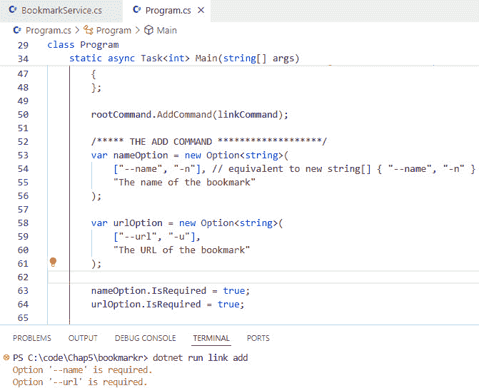

图 5.1 – 书签的名称和 URL 应该是必填项

然而，如果我们运行程序而不传递这两个选项，我们目前得到以下结果：

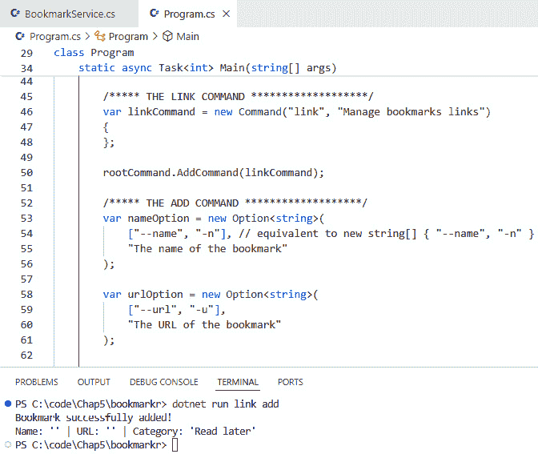

图 5.2 – 添加的书签的名称和 URL 目前是可选的

注意如何将没有名称和 URL 的新书签添加到书签集合中。这显然不是我们想要的！

幸运的是，`Option` 类提供了一个布尔值来指定它应该是必填还是可选的。

要使名称和 URL 选项成为必填项，让我们将它们各自的 `IsRequired` 属性设置为 `true`：

```cs
nameOption.IsRequired = true;
urlOption.IsRequired = true;
```

如果我们现在运行程序而不传递选项或其值，我们会得到一个错误消息：

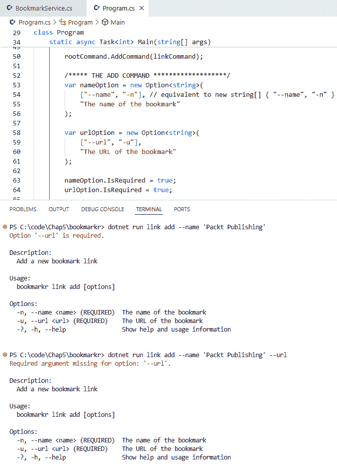

图 5.3 – 添加的书签的名称和 URL 现在是必需的

还要注意，帮助菜单清楚地说明了这两个选项是必需的。

到目前为止，我们有两个必需的选项。让我们添加一个可选的选项。

当一个选项不是必需的（即可选的）时，如果未传递该选项或其值，应用程序不应返回错误。

让我们用一个示例来说明。

假设我们想要按类别对我们的书签进行分类。通过这样做，我们可以想象我们可能只想列出属于特定类别的书签。

因此，我们首先将一个`Category`属性添加到`Bookmark`类中，如下所示：

```cs
public class Bookmark
{
    public required string Name { get; set; }
    public required string Url { get; set; }
    public required string Category { get; set; }
}
```

然后，我们将为类别添加一个选项，并将其传递给`add`命令：

```cs
var categoryOption = new Option<string>(
     ["--category", "-c"],
     "The category to which the bookmark is associated"
);
var addLinkCommand = new Command("add", "Add a new bookmark link")
{
     nameOption,
     urlOption,
     categoryOption
};
```

接下来，我们更新处理方法及其与命令的关联：

```cs
addLinkCommand.SetHandler(OnHandleAddLinkCommand, nameOption, urlOption, categoryOption);
static void OnHandleAddLinkCommand(string name, string url, string category)
{
     service.AddLink(name, url, category);
}
```

最后，不要忘记更新`BookmarkService`，以便它相应地处理`Category`属性。

现在，如果我们不传递类别就执行应用程序，不会返回错误：

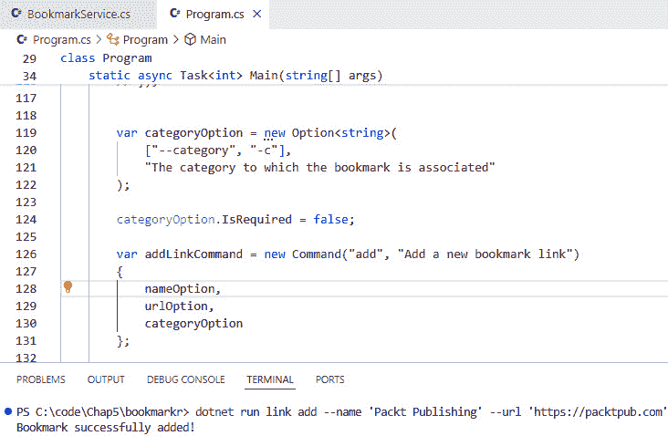

图 5.4 – 类别选项是可选的

当然，如果我们传递一个类别，它也会正常工作。😊

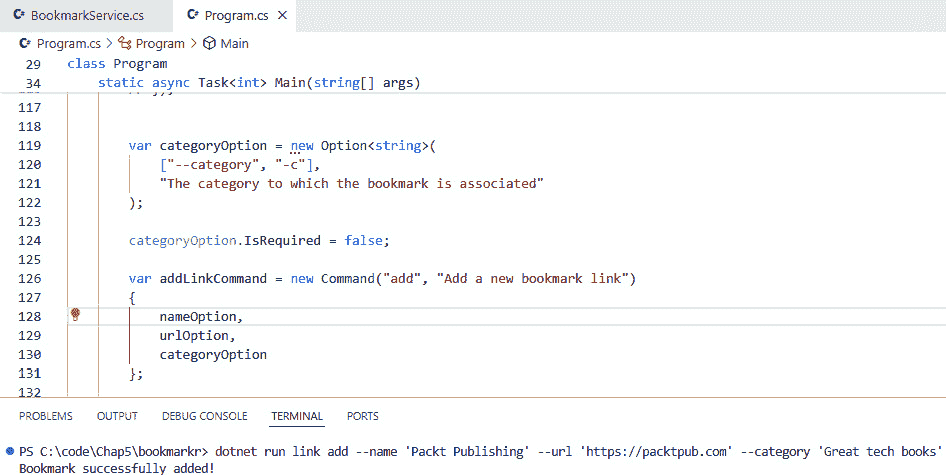

图 5.5 – 为新添加的书签分配类别

然而，由于类别现在是可选的，如果我们不传递它，它的值会是什么？

双横线还是单横线？

你可能想知道何时应该使用双横线与单横线。我们甚至需要使用两者吗？

答案是否定的！只有当你想为传递选项提供长格式和短格式时，你才需要使用两者，但你绝对可以选择其中之一。

例如，虽然`--set-max-concurrent-requests`可能对刚接触你的 CLI 的用户来说更易于理解，但如果他们经常使用你的 CLI 应用程序，反复输入这种长格式可能会变得令人沮丧。这就是为什么简短的形式，如`-m`，将更加合适。

在现实世界中，你会注意到刚开始使用你的 CLI 应用程序的用户会依赖于长格式选项，并随着他们对 CLI 应用程序的熟悉程度提高，逐渐过渡到短格式。

因此，例如，Bookmarkr 的初级用户可能会更喜欢这种语法：

`bookmarkr link add --name "Packt Publishing" --url "https://packtpub.com"`

另一方面，经验丰富的用户可能会更喜欢这种语法：

`bookmarkr link add -n "Packt Publishing" -u "https://packtpub.com"`

## 那么，参数怎么样？

啊！我可以看出你已经学习了关于参数的知识。参数是`Argument`类的一个实例，它们代表了执行命令所必需的参数。

但等等…为什么不用参数而不是选项来传递必需参数？

当然可以！但我不喜欢这些，因为它们是*位置参数*而不是*命名参数*。这意味着只有它们的顺序指导用户了解它们的目的，对我来说，这牺牲了 CLI 请求的可读性。

为了说明我的观点，以下是将`link add`命令的调用方式，如果它依赖于参数而不是参数：

```cs
$ bookmarkr link add 'Packt Publishing' 'https://packtpub.com' 'Great tech books'
```

看看这比我们之前的请求（依赖于选项）的可读性差多少？

这就是为什么我不喜欢参数，而更喜欢使用选项，指定哪些是必选的，哪些是可选的。

因此，让我们回到探索选项。

## 设置选项的默认值

好吧，正如你可能猜到的，一个选项的默认值将是（默认情况下）其数据类型的默认值（你还在吗？）。

由于`Category`选项是`string`类型，其默认值是`null`。然而，`Option`类允许我们定义一个默认值。

让我们将`Category`选项的默认值设置为`"以后阅读"`。这可以通过调用`SetDefaultValue`方法并传入默认值来完成：

```cs
categoryOption.SetDefaultValue("Read later");
```

如果我们不提供`Category`选项的值来运行程序，我们可以看到它将使用默认值：

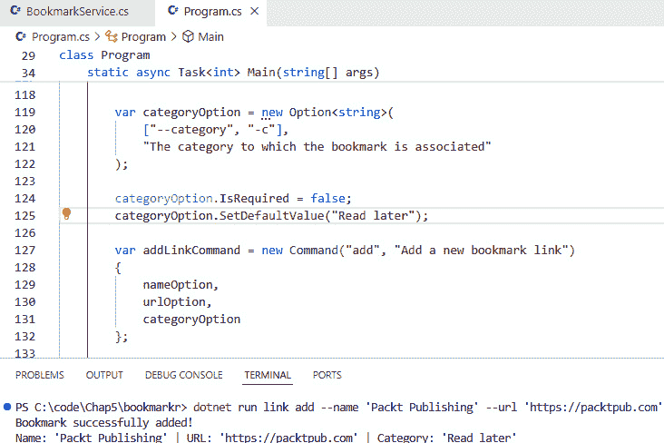

图 5.6 – 使用类别选项的默认值

然而，如果我们为类别提供了值，我们可以看到实际上使用了这个值：

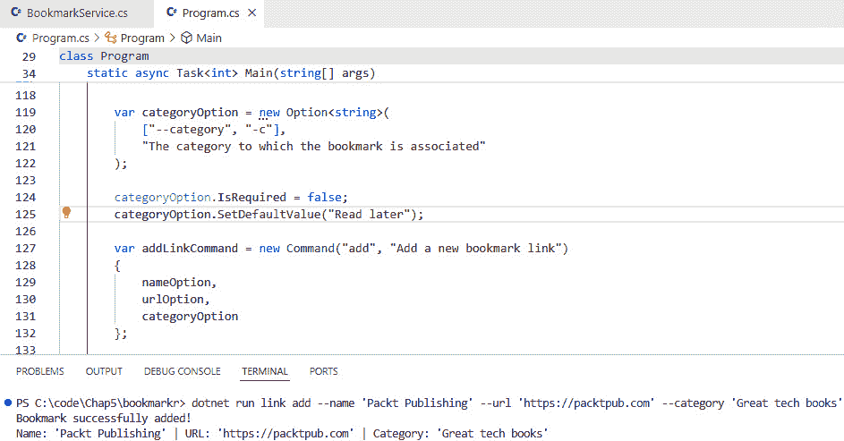

图 5.7 – 使用提供的类别选项值

### 我们是否应该为必选选项提供默认值？

不，我们不应该这样做！这是因为如果我们这样做，必选选项将不再表现为必选，而是表现为可选。

为什么？因为我们没有提供它的值，所以将使用默认值。

这就是为什么默认值应该只与可选选项一起使用。

注意，在先前的例子中，用户可以为`Category`选项指定任何字符串值。但如果我们想控制允许的值集呢？这就是`FromAmong`方法发挥作用的地方。

## 控制选项的允许值

让我们假设在我们的应用程序中我们只允许一组类别。是的，在现实生活中，我们会允许用户创建他们想要的任何数量的类别，但这将服务于我们解释如何只允许选项的一组特定值的用途。

假设我们允许以下类别：

+   以后阅读（作为默认值）

+   科技书籍

+   烹饪

+   社交媒体

我们将通过将这些值传递给`FromAmong`方法来完成这项工作，如下所示：

```cs
categoryOption.FromAmong("Read later", "Tech books", "Cooking", "Social media");
```

如果我们通过传递一个允许的类别来运行应用程序，一切都会正常工作：

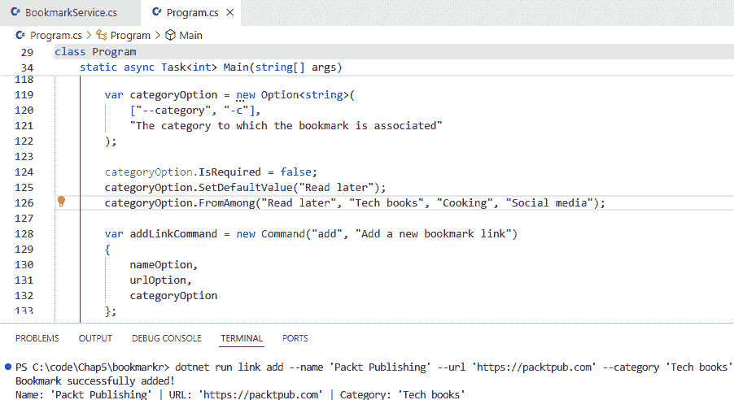

图 5.8 – 为类别传递一个允许值

然而，如果我们传递一个未分配的类别值，我们会得到一个错误消息：

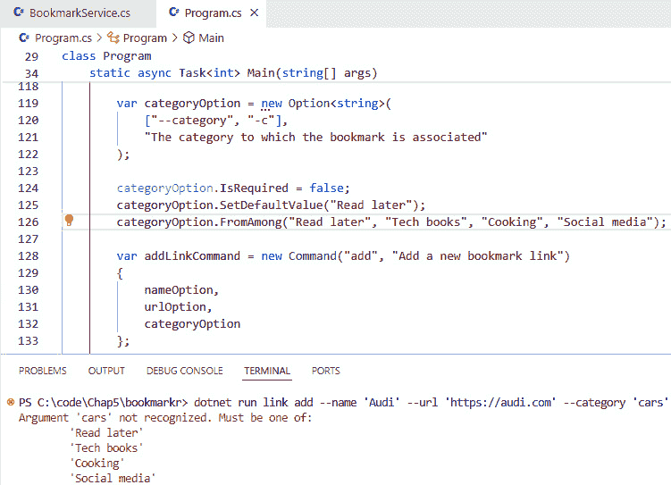

图 5.9 – 为类别传递不允许的值

注意，错误消息指示了允许的值。我们还可以从帮助菜单中看到允许的值：

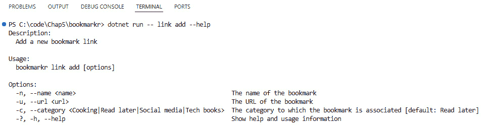

图 5.10 – 在帮助菜单中查看允许的值

使用`FromAmong`可以特别有用，以确保数据完整性和指导用户输入，尤其是在选项需要符合预定义的有效值集的场景中。

好的，那么让我们回顾一下。我们的 CLI 应用程序有必需和可选参数。它为它的可选参数指定了一个默认值，以及允许的值。然而，我们仍然缺少一些东西，一些重要的事情。你能猜到是什么吗？

是的，正是这样，确保为特定参数提供的值是有效的。

## 验证输入值

当添加新的书签时，我们需要为其传递一个 URL。但是，到目前为止，我们还没有检查提供的值是否确实是一个有效的 URL。让我们解决这个问题。

`Option`类允许我们配置验证函数。然后我们将为`urlOption`添加一个验证方法，以确保它只能获取有效的 URL。

这可以通过调用`AddValidator`方法来实现，如下所示：

```cs
urlOption.AddValidator(result =>
{
    if (result.Tokens.Count == 0)
    {
        result.ErrorMessage = "The URL is required";
    }
    else if (!Uri.TryCreate(result.Tokens[0].Value, UriKind.Absolute, 
    out _))
    {
        result.ErrorMessage = "The URL is invalid";
    }
});
```

在前面的代码片段中，`AddValidator`方法使用内联委托来确保提供给`urlOption`的值是有效的。在这种情况下，它确保它实际上是存在的（这就是`if`部分检查的内容）并且它是一个有效的 URL（这就是`else if`部分检查的内容）。

现在，如果我们用无效和有效的 URL 执行程序，我们可以看到它表现如预期：

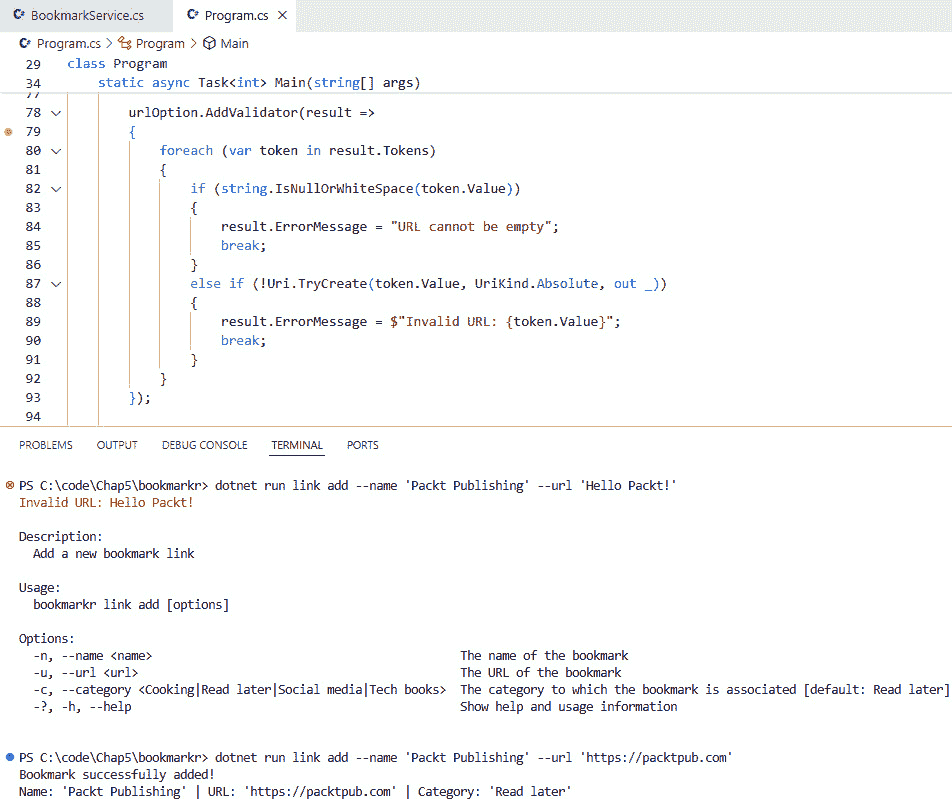

图 5.11 – 验证 URL 选项的输入值

更高级的验证

验证可能比这更复杂。我们的应用程序旨在从网络上的任何地方收集书签。然而，如果您希望将其使用限制在，比如说，您的组织内，您可能希望在验证过程中检查书签的 URL 是否仅指向您的企业域名，并忽略其他所有内容。

完美！现在，Bookmarkr 允许我们管理书签，确保只有有效信息可以被传递到（并存储在）CLI 应用程序中。

然而，到目前为止，我们仍然一次只能添加一个书签。如果我们能够作为同一请求的一部分提供一组名称和 URL，并且让 Bookmarkr 一次性添加它们，那不是很好吗？

`System.CommandLine`有一个功能允许我们做到这一点 😉。

## 一次性添加多个元素

让我们尝试向同一个请求传递多个名称和 URL，例如：

```cs
dotnet run link add --name 'Packt Publishing' --url 'https://packtpub.com/' --name 'Audi cars' --url 'https://audi.ca'
```

但是如果我们这样做，我们会得到以下错误：

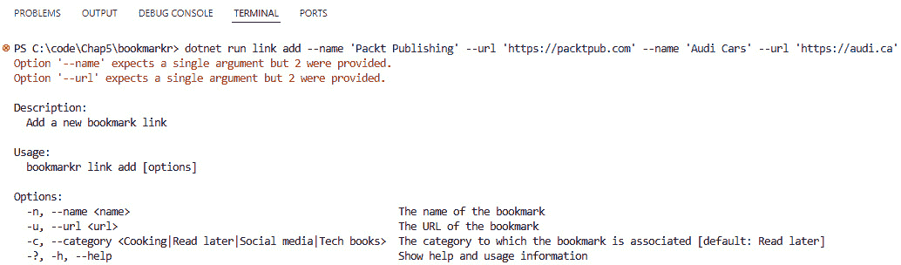

图 5.12 – 名称和 URL 选项默认只期望一个值

这是因为这些选项的参数数量。

**那么，参数数量究竟是什么意思呢？**

选项的参数数量表示如果指定了该选项，可以传递的值的数量。它用最小值和最大值来表示。

如果你的 CLI 应用程序通过一个或多个命令支持批量操作，这非常重要。在我们的例子中，我们想要同时添加多个书签的批量操作。

对于类型为 `string` 的选项，最小值和最大值都设置为 `1`，这意味着如果我们指定了选项，我们必须提供一个值。

布尔选项的最小值是 `0`，最大值是 `1`，因为我们不需要传递值，因为这两种语法都是有效的：

```cs
--force
-- force true
```

同样，一个元素列表的最小参数数量为 1，默认最大值为 100,000。

为了指定选项的参数数量，`System.CommandLine` 提供了一个名为 `ArgumentArity` 的枚举，它包含以下值：

+   `Zero`，意味着不允许任何值。所以，`--force` 是有效的，但 `--force true` 则不是。

+   `ZeroOrOne`，意味着允许零个或一个值。

+   `ZeroOrMore`，意味着允许零个、一个或多个值。

+   `ExactlyOne`，意味着至少一个且最多一个值是被允许的。对于我们的字符串选项，名称和 URL 就是这种情况。

+   `OneOrMore`，意味着允许一个或多个值。

为了设置一个选项的参数数量，我们可以使用 `ArgumentArity` 枚举提供的值之一，如下所示：

```cs
nameOption.Arity = ArgumentArity.OneOrMore;
```

现在，我们应该能够为给定选项提供多个值。让我们试试这个：

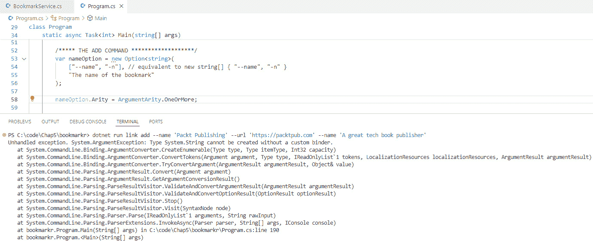

图 5.13 – 未为给定选项提供多个值

哎呀，这不是我们预期的结果，对吧？

这里的问题在于，尽管 `nameOption` 可以接受多个值，但程序并不清楚如何将这些值转换成一个字符串。这就是为什么错误信息提到了自定义绑定器（因此它被告知如何执行这种转换）。

为了解决这个问题，我们需要告诉程序将这些输入视为单独的参数。这是通过将 `AllowMultipleArgumentsPerToken` 属性设置为 `true` 来实现的，如下所示：

```cs
nameOption.AllowMultipleArgumentsPerToken = true;
```

首先，让我们通过注释掉相应的代码行来暂时去掉参数数量。

现在，如果我们运行程序，我们可以看到错误已经消失了，但我们仍然没有得到预期的结果…

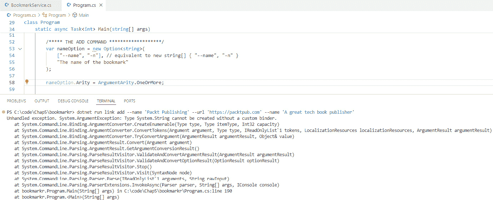

图 5.14 – nameOption 现在接受多个值

注意，只有最后的一对名称和 URL 被考虑并添加到书签列表中。

实际上发生的情况是，`System.CommandLine`注意到我们有两个名称和 URL 的出现，所以最后的那些覆盖了第一个，只有最后的那些实际上被传递给了`Handler`方法。这就是为什么我们只添加了一个带有最后对名称和 URL 值信息的书签。

但是，如果我们想要能够传递一个名称和 URL 的列表，并且让`Handler`方法添加与名称和 URL 对数量相等的书签，那会怎么样呢？

要做到这一点，我们需要两样东西。首先，让我们取消注释设置`nameOption`、`urlOption`和`categoryOption`的 arity 的代码行。

接下来，让我们更改名称、URL 和类别选项的声明，以及验证器和`Handler`方法的签名，以便它们接受字符串列表而不是单个字符串：

```cs
var nameOption = new Option<string[]>(
    ["--name", "-n"], // equivalent to new string[] { "--name", "-n" }
     "The name of the bookmark"
);
nameOption.IsRequired = true;
nameOption.Arity = ArgumentArity.OneOrMore;
nameOption.AllowMultipleArgumentsPerToken = true;
var urlOption = new Option<string[]>(
    ["--url", "-u"],
    "The URL of the bookmark"
);
urlOption.IsRequired = true;
urlOption.Arity = ArgumentArity.OneOrMore;
urlOption.AllowMultipleArgumentsPerToken = true;
urlOption.AddValidator(result =>
{
    foreach (var token in result.Tokens)
    {
        if (string.IsNullOrWhiteSpace(token.Value))
        {
            result.ErrorMessage = "URL cannot be empty";
            break;
        }
        else if (!Uri.TryCreate(token.Value, UriKind.Absolute, out _))
        {
            result.ErrorMessage = $"Invalid URL: {token.Value}";
            break;
        }
    }
});
var categoryOption = new Option<string[]>(
    ["--category", "-c"],
    "The category to which the bookmark is associated"
);
categoryOption.Arity = ArgumentArity.OneOrMore;
categoryOption.AllowMultipleArgumentsPerToken = true;
categoryOption.SetDefaultValue("Read later");
categoryOption.FromAmong("Read later", "Tech books", "Cooking", "Social media");
categoryOption.AddCompletions("Read later", "Tech books", "Cooking", "Social media");
static void OnHandleAddLinkCommand(string[] names, string[] urls, string[] categories)
{
    service.AddLinks(names, urls, categories);
    service.ListAll();
}
```

现在，如果我们运行程序，事情（终于）按预期工作！😊

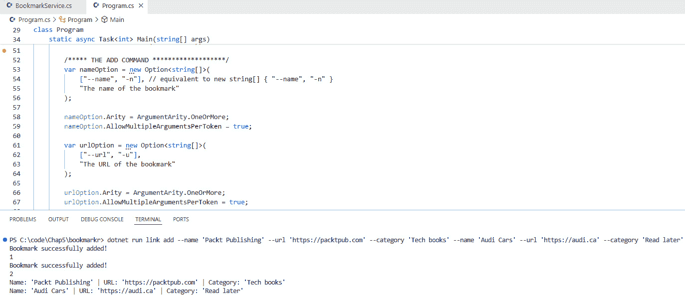

图 5.15 – Bookmarkr 接受书签列表

由于每个选项都接受多个值，让我们看看我们是否可以简化以下 CLI 请求：

```cs
$ dotnet run link add --name 'Packt Publishing' --url 'https://packtpub.com/' --category 'Tech books' --name 'Audi cars' --url 'https://audi.ca' --category 'Read later'
```

我们将按以下方式简化它：

```cs
$ dotnet run link add --name 'Packt Publishing' 'Audi cars' --url 'https://packtpub.com/' 'https://audi.ca' --category 'Tech books' 'Read later'
```

注意，我们只需要指定一次`--name`、`--url`和`--category`。

由于这两个 CLI 请求是等效的，它们导致相同的结果：

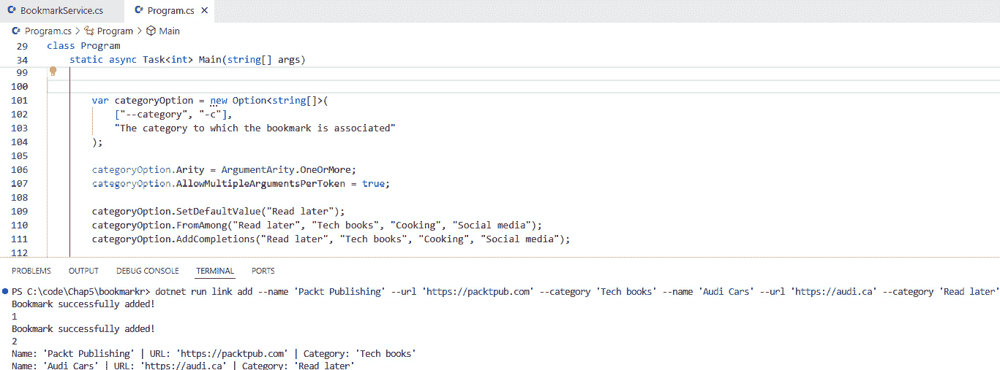

图 5.16 – 简化的 CLI 请求

太棒了！这工作得非常好！

但是……当列表增长时，输入一系列名称、URL 和类别可能会很快变得繁琐。

如果我们能够简单地提供一个包含所有名称、URL 和类别的文件路径作为参数，让应用程序读取该文件并相应地创建书签，那岂不是很好？

同样，如果我们能够指定一个输出文件的路径来存储 CLI 应用程序持有的所有书签，那岂不是很好？

# 处理作为选项值传递的文件

文件可以作为选项值提供，作为输入或输出参数。

作为输入参数，可以读取文件内容以将数据导入 CLI 应用程序。在我们的例子中，我们可以将来自其他浏览器（如 Chrome 或 Firefox）的书签导入到 Bookmarkr 中。

作为输出参数，可以创建一个文件来导出 Bookmarkr 持有的数据，该数据反过来可以导入到其他浏览器，如 Chrome 或 Firefox。

这两个功能结合在一起可以启用备份和恢复，也可以实现数据共享和交换场景。

让我们把这些功能构建到 Bookmarkr 中！

重要提示

浏览器，如 Chrome 或 Firefox，都有自己的专有结构来导入和导出书签。

为了简化，我们不会对这些格式进行解析或转换。我们的目标是专注于将输入和输出文件作为 CLI 应用程序的一部分进行处理。然而，我们将以 JSON 格式导入和导出书签。

让我们从`export`命令开始。

此命令的目的是获取 Bookmarkr 管理的所有书签并将它们保存到一个 JSON 文件中，该文件的路径作为 `--file` 选项的值指定。当然，此选项是必需的。

首先，我们需要创建一个类型为 `FileInfo` 的选项，并且它是必需的：

```cs
var outputfileOption = new Option<FileInfo>(
    ["--file", "-f"],
    "The output file that will store the bookmarks"
)
{
    IsRequired = true
};
```

接下来，我们需要创建一个新的命令并将其添加到 `root` 命令中：

```cs
var exportCommand = new Command("export", "Exports all bookmarks to a file")
{
    outputfileOption
};
rootCommand.AddCommand(exportCommand);
```

然后，我们需要为 `export` 命令设置一个 `Handler` 方法：

```cs
exportCommand.SetHandler(OnExportCommand, outputfileOption);
static void OnExportCommand(FileInfo outputfile)
{
    var bookmarks = service.GetAll();
    string json = JsonSerializer.Serialize(bookmarks, new 
    JsonSerializerOptions { WriteIndented = true });
    File.WriteAllText(outputfile.FullName, json);
}
```

`Handler` 方法调用 `BookmarkService` 来获取所有书签的列表，然后将它们转换为 JSON 并将此 JSON 内容保存到提供的文件中。如果文件已存在，则将其覆盖。

注意，你需要导入此命名空间才能使代码编译：

```cs
using System.Text.Json;
```

现在，让我们尝试它并看看它是否按预期工作！

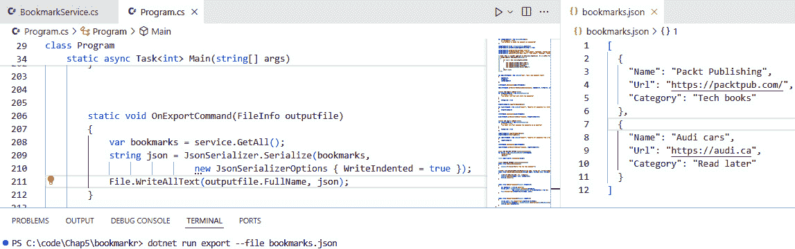

图 5.17 – 导出所有书签

完美！这正是我们预期的结果！

但我们如何确保提供的文件具有有效的名称呢？

我们当然可以创建一个验证方法来检查这一点，但 `System.CommandLine` 已经为这个问题提供了一个扩展方法（并且我想让你知道 😉）：

```cs
outputfileOption.LegalFileNamesOnly();
```

让我们尝试使用无效文件调用 `export` 命令：

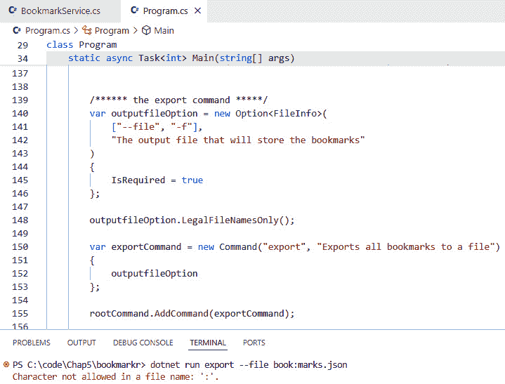

图 5.18 – 处理无效文件

看见了吗？这个错误是由于调用 `LegalFileNamesOnly` 方法而引发的。

好的！现在让我们继续添加 `import` 命令！

作为提醒，从现有文件导入书签数据的语法如下：

```cs
$ bookmarkr import --file <path to the input file>
```

由于许多步骤与我们创建 `export` 命令时遵循的步骤非常相似，所以我们在这里只分享代码并讨论差异：

```cs
var inputfileOption = new Option<FileInfo>(
    ["--file", "-f"],
    "The input file that contains the bookmarks to be imported"
)
{
    IsRequired = true
};
inputfileOption.LegalFileNamesOnly();
inputfileOption.ExistingOnly();
var importCommand = new Command("import", "Imports all bookmarks from a file")
{
    inputfileOption
};
rootCommand.AddCommand(importCommand);
importCommand.SetHandler(OnImportCommand, inputfileOption);
static void OnImportCommand(FileInfo inputfile)
{
    string json = File.ReadAllText(inputfile.FullName);
    List<Bookmark> bookmarks = JsonSerializer.
    Deserialize<List<Bookmark>>(json) ?? new List<Bookmark>();
    service.Import(bookmarks);
}
```

主要区别在于对 `ExistingOnly` 方法的调用。此方法确保 `inputfileOption` 只接受与现有文件对应的值，否则将引发错误。

另一个区别在于 `OnImportCommand` 处理方法的工作方式：它读取文件的内容，将其从 JSON 转换为 `Bookmark` 类型的项目列表，然后将这些项目传递给 `BookmarkService` 以将其添加到它管理的书签列表中（通过调用其 `Import` 方法）。

现在，让我们尝试这段代码！

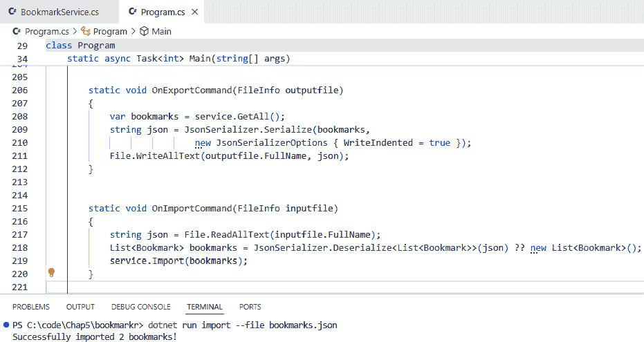

图 5.19 – 从文件导入书签

如果文件不存在会发生什么？

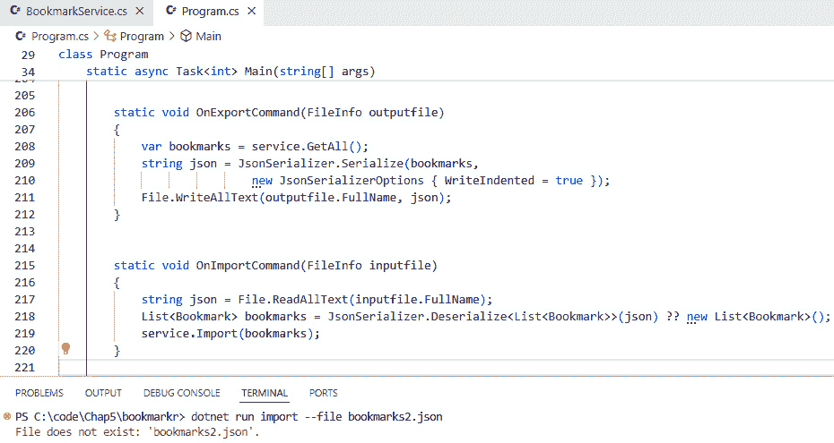

图 5.20 – 处理不存在的文件

再次强调，我们可以看到我们得到了预期的结果！😊

好了，到此为止！你现在知道如何在你的 CLI 应用程序中处理输入和输出文件了。恭喜！现在让我们结束这一章。

# 摘要

在本章中，我们通过添加对命令选项输入值的更好控制来改进了我们的 CLI 应用程序 Bookmarkr（通过明确指出哪些选项是必需的，在适当的地方设置默认值，设计验证器以确保输入值符合预期的类型、格式或值范围，并启用自动完成以简化用户操作）。

我们还添加了从文件导入和导出应用程序数据的功能。这使得备份和恢复数据以及离线共享数据变得更加容易。

在接下来的章节中，我们将看到如何实现每个应用程序都非常重要的功能：日志记录和错误处理。

# 轮到你了！

跟随提供的代码是一种通过实践学习的好方法。

一种更好的方法是挑战自己完成任务。因此，我挑战你通过添加以下功能来改进 Bookmarkr 应用程序。

## 任务 #1 – 验证输入文件的格式和访问能力

作为提醒，从现有文件导入书签数据的语法如下：

```cs
$ bookmarkr import --file <path to the input file>
```

如果无法访问输入文件，或者其数据不是预期的格式，那么应用程序应向用户显示相应的错误消息。否则，应用程序应从输入文件导入所有书签并向用户显示成功消息，指示已导入多少个书签。

## 任务 #2 – 合并输入文件中的现有链接

当从现有文件导入书签时，可能其中一些已经存在于应用程序持有的书签中。

在这种情况下，对于 CLI 应用程序来说，向用户提供一个选项来控制他们是否想要合并那些现有链接或简单地丢弃它们而不导入它们，是一种最佳实践。

在这个任务中，我挑战你通过在`import`命令中添加一个可选的`--merge`选项来实现这一最佳实践。

因此，带有`--merge`选项的`import`命令的语法如下：

```cs
$ bookmarkr import --file <path to the input file> --merge
```

当指定`--merge`选项时，`import`命令的预期行为是对于提供的输入文件中的每个书签，以下适用：

+   如果其 URL 已存在于应用程序持有的书签列表中，则现有书签的名称应更新为与输入文件中此 URL 对应的名称

+   否则，书签应简单地添加到应用程序持有的书签列表中
