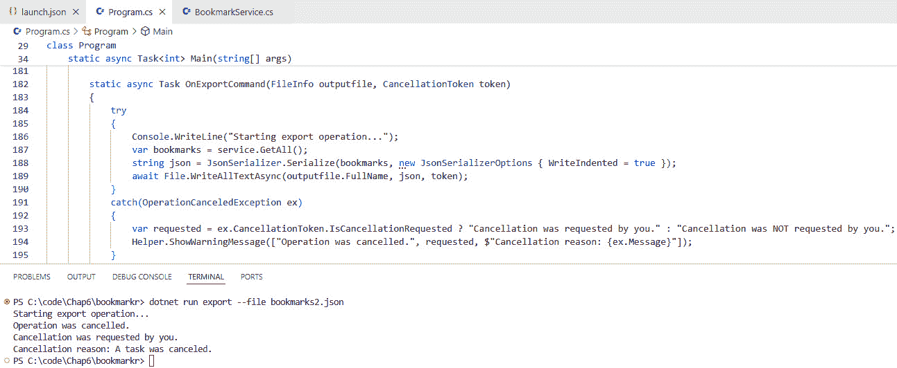
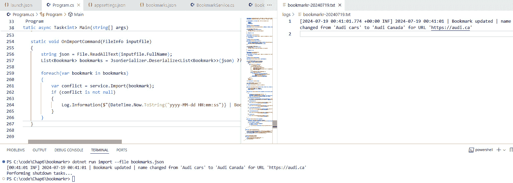

# 6

# 错误处理和日志记录

记录日志和错误处理是在构建任何应用程序时需要考虑（并实现）的两个重要概念，CLI 应用程序也不例外。

虽然错误处理确保了应用程序在面对意外事件时的优雅行为，但日志记录提供了对应用程序运行时行为的宝贵见解，并有助于故障排除和调试。

因此，在本章中，我们将涵盖这两个概念，从错误处理开始。

具体来说，本章将涵盖以下主要内容：

+   CLI 应用程序中的错误处理

+   CLI 应用程序中的日志记录

# 技术要求

本章的代码可以在本书附带的 GitHub 仓库中找到，[`github.com/PacktPublishing/Building-CLI-Applications-with-C-Sharp-and-.NET/tree/main/Chapter06`](https://github.com/PacktPublishing/Building-CLI-Applications-with-C-Sharp-and-.NET/tree/main/Chapter06)。

# CLI 应用程序中的错误处理

错误处理可能有两种形式：

+   由于意外事件（如无效输入或不可访问的依赖项）而引发异常

+   程序终止，我们希望通过允许它优雅地关闭来防止它崩溃

在本节中，我们将涵盖这两个主题。让我们从异常处理开始。

## 处理异常

与其他类型的应用程序相比，在 CLI 应用程序中处理异常并没有什么特别之处，因为它遵循相同的指南和最佳实践。这就是为什么在本节中，您可能会发现您已经知道我们将要讨论的所有概念，这是完全正常的，因为您很可能在其他应用程序中实现了它们，无论是 Web、API 还是桌面应用程序。

然而，值得注意的是，一个健壮的错误处理策略将对应用程序的质量、可靠性和弹性产生重大影响。这就是为什么花时间设计一个好的错误处理策略是值得的。

如您所知，每个错误处理策略都依赖于一个`try-catch-finally`块。但并非总是如此！并非每个方法都需要实现`try-catch-finally`块。实际上，错误处理的最佳实践表明，只有*调用者*方法（通常是顶级方法）应该处理异常，而*被调用者*方法应该让异常冒泡到被*调用者*方法捕获和处理。这导致方法更加精简、干净和专注。

另一个最佳实践是除非绝对必要，否则不要吞没异常。为什么？因为吞没异常隐藏了错误，使得代码看起来功能正常，而实际上却在失败。这掩盖了宝贵的错误信息，允许不可预测的行为和数据损坏。它使调试复杂化，并违反了快速失败的原则。换句话说，它导致难以检测和修复的静默失败，因此是一种不良实践。

`finally` 块很重要，尽管我经常看到它被遗忘。重要的是要记住，这个块用于确保即使在发生异常的情况下也能释放资源。

当捕获异常时，使用多个 `catch` 块，从最具体到最通用的异常进行捕获。这将确保比将所有异常作为通用异常捕获并应用相同的错误处理过程有更好的错误处理。一个例子是在处理文件时：我们不希望以处理文件找不到的方式处理文件无法写入的情况，因为权限不足。通过区分这些情况，我们可以应用特定的错误处理过程，并最终向用户提供发生情况的适当细节，而不是进行通用的处理并告诉用户我们无法写入文件。

我们还可以创建自己的异常。我经常这样做，因为这有助于提高代码的可读性。当 `CreateNewUser` 方法抛出 `UserAlreadyExistsException` 异常的实例时，很容易理解发生了什么，不是吗？

下面是这个自定义异常的外观：

```cs
public class UserAlreadyExistsException : Exception
{
    public string UserId { get; }
    public UserAlreadyExistsException(string userId)
        : base($"User with ID '{userId}' already exists.")
    {
        UserId = userId;
    }
    public UserAlreadyExistsException(string userId, Exception 
    innerException)
        : base($"User with ID '{userId}' already exists.", 
        innerException)
    {
        UserId = userId;
    }
}
```

要捕获还是不要捕获异常？

现在，有一种反对抛出异常的运动，因为这样做可能会带来性能成本，我完全理解这一点。关于这个主题的一个很好的视频是由尼克·查帕斯（Nick Chapsas）制作的，标题为 *Don’t throw exceptions in C#. Do this instead*，你可以在 YouTube 上找到它。我鼓励你去看看，并形成你自己的看法。

然而，无论你选择抛出异常还是不抛出异常而处理它，你很可能会处理异常。此外，请记住，.NET 框架以及你可能使用的某些其他库可能正在抛出异常，你需要捕获这些异常来处理它们。正因为如此，这里描述的原则仍然有效，并且值得了解。

当捕获异常时，你也可以过滤它们。这是因为某些异常可能需要根据它们被抛出的原因采取不同的处理机制。

这里的一个很好的例子是 `HttpResponseException` 异常类型，如这里所示：

```cs
try
{
    using var client = new HttpClient();
    var response = await client.GetAsync("https://api.packtpub.com/
    data");
    response.EnsureSuccessStatusCode();
}
catch (HttpRequestException ex) when (ex.StatusCode == System.Net.HttpStatusCode.NotFound)
{
    Console.WriteLine("Resource not found (404)");
}
catch (HttpRequestException ex) when (ex.StatusCode == System.Net.HttpStatusCode.Unauthorized)
{
    Console.WriteLine("Server error (401)");
}
```

正如你所看到的，我们在这里两次捕获了相同的异常（`HttpResponseException`），但在每个 `catch` 块中，我们关注的是一个非常具体的情况：在第一个中，我们处理资源未找到的情况，而在第二个中，我们处理访问资源的用户未认证的情况。

处理异常时的最后一个最佳实践是避免在抛出异常时丢失异常的堆栈跟踪。

为了说明这个原则，让我们考虑这个例子：

```cs
try
{
      // Attempt to read from a file
      string content = File.ReadAllText(fileName);
      Console.WriteLine($»File content: {content}»);
}
catch (FileNotFoundException ex)
{
      // Handle the specific exception
      Console.WriteLine($"File not found: {fileName}");
      Console.WriteLine($"Exception details: {ex.Message}");
      // Rethrow the exception
      throw ex;
}
```

如果我们使用 `throw ex;` 语句抛出异常，我们将丢失包含到目前为止发生详情的堆栈跟踪。正确的方法是简单地使用 `throw` 来确保堆栈跟踪被保留。

然而，在某些情况下，我们可能需要捕获异常，处理它，并通过将其封装到另一个异常类型中重新抛出，如下所示：

```cs
// Rethrow the exception by encapsulating it while preserving the 
// stack trace
throw new IOException($"File process error{fileName}", ex);
```

在这种情况下，堆栈跟踪被保留。

现在，让我们将这些原则应用到 *Bookmarkr* 中，更具体地说，是应用到从 *Bookmarkr* 导出书签的能力。

如果您还记得上一章的内容，导出处理方法 (`OnHandleExportCommand`) 看起来是这样的：

```cs
static void OnExportCommand(FileInfo outputfile)
{
    var bookmarks = service.GetAll();
    string json = JsonSerializer.Serialize(bookmarks, new 
    JsonSerializerOptions { WriteIndented = true });
    File.WriteAllText(outputfile.FullName, json);
}
```

然而，请注意，`WriteAllText` 方法可能会抛出许多异常，例如以下这些：

+   如果没有足够的权限访问文件，将抛出 `UnauthorizedAccessException`

+   如果路径无效，将抛出 `DirectoryNotFoundException`

+   如果路径超过系统定义的最大长度，将抛出 `PathTooLongException`

因此，让我们处理这些异常。代码将如下所示：

```cs
static void OnExportCommand(FileInfo outputfile)
{
    try
    {
         var bookmarks = service.GetAll();
         string json = JsonSerializer.Serialize(bookmarks, new 
         JsonSerializerOptions { WriteIndented = true });
         File.WriteAllText(outputfile.FullName, json);
    }
    catch(JsonException ex)
    {
        Helper.ShowErrorMessage([$"Failed to serialize bookmarks to 
        JSON.",
        $"Error message {ex.Message}"]);
    }
    catch (UnauthorizedAccessException ex)
    {
         Helper.ShowErrorMessage([$"Insufficient permissions to access
         the file {outputfile.FullName}",
          $"Error message {ex.Message}"]);
    }
    catch (DirectoryNotFoundException ex)
    {
         Helper.ShowErrorMessage([$"The file {outputfile.FullName} 
         cannot be found due to an invalid path",
         $"Error message {ex.Message}"]);
    }
    catch (PathTooLongException ex)
    {
         Helper.ShowErrorMessage([$"The provided path is exceeding the 
         maximum length.",
           $"Error message {ex.Message}"]);
     }
     catch (Exception ex)
     {
         Helper.ShowErrorMessage([$"An unknown exception occurred.",
           $"Error message {ex.Message}"]);
     }
}
```

在前面的示例中，我们正在处理最常见的异常，并且在出现意外异常的情况下，我们也在处理一般异常（是的，异常是例外情况，但仍然预期至少在大多数情况下会发生）。

注意，我们已经处理了序列化过程和文件写入过程中的异常。

如果您想了解更多关于处理异常的最佳实践，我建议您访问这个页面：[`learn.microsoft.com/en-us/dotnet/standard/exceptions/best-practices-for-exceptions`](https://learn.microsoft.com/en-us/dotnet/standard/exceptions/best-practices-for-exceptions)。

## 处理错误并不一定意味着处理异常

虽然这看起来可能令人惊讶，但这确实是事实，并且通过应用防御性编程技术，可以避免（至少在大多数情况下）异常的发生。

通过验证输入、强制执行先决条件和积极识别潜在失败场景，我们可以显著减少错误发生，并增强我们应用程序的整体弹性。

让我们看看在防御性编程方面我们能做些什么：

+   **验证输入**：我们可以确保输入文件存在，从而避免在文件不存在时引发异常。

+   如果 `bookmarks` 列表不为空。否则，`JsonSerializer` 将抛出 `NullReferenceException`。我们还可以确保列表不为空，因为如果列表为空，尽管序列化将返回一个空的 JSON 数组，但我们可能不想将此写入文件，尤其是如果这意味着覆盖现有文件。

+   **识别潜在失败场景**：我们已经通过捕获最常见的异常并处理它们来做到这一点。

好的。所以，到目前为止，我们知道如何在我们的 CLI 应用程序中处理异常，并且我们在 *Bookmarkr* 中实现了这一点。

然而，存在另一种意外事件，实际上它代表了正常行为。我指的是**程序终止**。

## 处理程序终止

程序可能在任何时候通过按特定的键盘组合（通常是*Ctrl* + *C*或*Ctrl* + *Break*）来终止。当这种情况发生时，操作系统会向程序发送一个信号，指示它立即停止执行。这个信号，通常被称为中断或终止信号，允许程序在退出之前执行任何必要的清理操作，例如关闭文件、释放资源或保存状态。如果程序有针对此特定信号的信号处理程序，它可以执行自定义代码以优雅地处理终止。否则，程序将突然终止，任何未保存的数据或不完整的操作可能会丢失。

程序终止允许优雅地停止执行时间过长或已无响应的程序。

`System.CommandLine`提供了一个处理程序终止并执行自定义代码的机制，允许我们的 CLI 应用程序优雅地终止。

让我们实现它来处理用户在导出操作进行中终止程序的情况。

为了处理程序终止，我们需要修改`SetHandler`方法的委托以检索取消令牌并将其传递给处理方法本身：

```cs
exportCommand.SetHandler(async (context) =>
{
    FileInfo? outputfileOptionValue = context.ParseResult.
    GetValueForOption(outputfileOption);
    var token = context.GetCancellationToken();
    await OnExportCommand(outputfileOptionValue!, token);
});
```

现在，我们可以修改处理方法，使其处理程序终止（即捕获`OperationCanceledException`异常）：

```cs
static async Task OnExportCommand(FileInfo outputfile, CancellationToken token)
{
     try
     {
        var bookmarks = service.GetAll();
        string json = JsonSerializer.Serialize(bookmarks, new 
        JsonSerializerOptions { WriteIndented = true });
        await File.WriteAllTextAsync(outputfile.FullName, json, 
        token);
     }
     catch(OperationCanceledException ex)
     {
        var requested = ex.CancellationToken.IsCancellationRequested ? 
        "Cancellation was requested by you.": "Cancellation was NOT 
        requested by you.";
        Helper.ShowWarningMessage(["Operation was cancelled.", 
        requested, $"Cancellation reason: {ex.Message}"]);
     }
     catch(JsonException ex)
// The rest of the method has been removed for brevity.
```

如果我们现在运行程序然后通过按*Ctrl* + *C*键盘组合来终止它，我们会得到以下控制台输出：



图 6.1 – 处理程序终止

值得注意的是，我们需要使用`WriteAllText`方法的异步版本（即`WriteAllTextAsync`），以便能够传递我们接收到的取消令牌，因此我们需要将`OnExportCommand`方法声明为`async`。

注意，通过处理程序终止，我们可以优雅地处理用户突然停止程序的情况。这导致程序优雅地关闭并释放所使用的资源，从而避免崩溃和错误信息。

为什么我们要将取消令牌作为参数传递给处理方法而不使用它？

这是一个非常好的问题！正如你所注意到的，尽管我们在`OnExportCommand`方法中作为参数接收了`CancellationToken`对象，但我们似乎并没有使用它。那么，我们最初为什么要传递它呢？

这与.NET 中取消令牌的工作方式有关。让我来解释一下！

当响应取消请求创建`OperationCanceledException`时，它通常包含有关触发取消的`CancellationToken`对象的信息。

就此而言，`OperationCanceledException`异常类有一个构造函数，它接受一个`CancellationToken`对象作为参数。

当.NET 框架异步方法创建此异常时，它们通常使用此构造函数并传递触发取消请求的取消令牌。

`OperationCanceledException`类有一个`CancellationToken`属性，可以用来获取与取消请求关联的令牌。

在我们的案例中，我们访问它是为了检查取消请求是否由用户发起。

在建立了一个健壮的错误处理框架之后，同样重要的是确保这些错误被记录和监控。这正是日志记录发挥作用的地方！

有效的日志记录不仅有助于诊断和解决问题，还提供了关于应用程序的行为、性能和使用的宝贵见解。在接下来的部分中，我们将深入了解实施全面日志记录机制的最佳实践和策略，这些机制补充了我们的错误处理策略。

到目前为止，我们已经涵盖了关于错误处理的大量信息。然而，错误处理与日志记录一起工作，以提高应用程序的可靠性和可维护性。因此，让我们将重点转向日志记录，并探讨如何捕获和保存有关错误以及程序执行期间发生的其他重要事件的宝贵信息。

# 在 CLI 应用程序中记录日志

当发生意外事件或错误时，错误处理更像是“即时”的补偿机制，但我们可能希望记录发生了什么，以便我们可以重现问题、分析它、了解它最初发生的原因，并修复它。

“记录发生了什么”的意思，要么是指导致意外行为或错误的事件的序列，要么是指错误发生时引发的异常的调用堆栈。

选择日志格式也很重要。我们希望在我们记录（并存储）的数据量和我们打算如何使用它的用途之间找到一个平衡。记录不必要的信息将使日志分析复杂化，增加存储（和保留）成本，也可能减慢日志记录过程。我们还需要确保我们没有记录敏感信息（如信用卡数据），如果确实记录了，那么我们必须以安全的方式进行。一些流行的日志格式包括 XML、JSON、CSV 和 syslog。

选择日志记录目的地同样重要。我们需要理解，没有好或坏的选择，只有根据我们的环境和需求是否合适的选择。如果我们打算分析日志，我们可能希望将这些日志存储在提供开箱即用日志分析机制的解决方案中，这样我们就不需要为它编写代码。这类解决方案的例子包括 Azure Log Analytics、Splunk、Datadog、Dynatrace、Serilog 和 Elasticsearch。

然而，请注意，依赖于云解决方案（如 Azure Log Analytics），我们的应用程序需要运行在云中或者保持对互联网的持续连接。当然，我们也可以构建我们的应用程序以遵循**偶尔连接的应用程序**（**OCA**）模式，这样当它离线运行时可以本地记录日志，当它重新上线时将它们发送到 Azure Log Analytics，但这里的想法是我们应该选择与我们的应用程序使用模式一致的日志解决方案。因此，对于打算本地运行的应用程序，我们将优先考虑本地运行的日志机制。

最后，定义日志保留期也很重要。这可以由组织的合规性规则或记录数据的关联性来强制执行：你还需要分析三年前发生的错误或客户行为的数据吗？如果不，你不需要保留这些数据。

无论哪种方式，将日志格式与您用于存储和分析这些日志的解决方案分开是很重要的。

由于我们的应用程序打算本地运行，我们将选择 JSON 作为日志格式，并使用 Serilog 作为日志机制。

## 为什么选择 JSON？

JSON 结构的日志易于阅读，并且可以很容易地被机器解析。许多现代日志管理解决方案可以接受 JSON 格式的日志，使其成为结构化日志的好选择。

此外，JSON 比 XML 更简洁，这导致文件体积更小，反过来又减少了我们需要存储它们的存储空间。

## 为什么选择 Serilog？

Serilog 是一个.NET 的诊断日志库。它是基于强大的结构化事件数据构建的，并支持各种“sink”，即日志事件可以写入的目的地。此类 sink 的例子包括文件、控制台、数据库或日志管理工具（如 Elasticsearch、Application Insights、Datadog 和 Splunk）。它易于设置，具有干净的 API，并且是可移植的。

Serilog 的一个关键特性是它能够记录结构化数据，这使得日志更有意义且可查询。它使用消息模板，这是一种简单的 DSL，扩展了.NET 格式字符串，可以捕获属性以及日志事件。

我确实喜欢 Serilog 的 NuGet 包的结构。首先，有一个基础包，它为我们代码中的 Serilog 提供功能。然后，有“sink”包，每个 sink 都有一个，而且有很多。如果我们需要的话，甚至可以创建我们自己的 sink。我还没有找到它的用途，因为几乎所有你能想到的东西都已经有了 sink...

哦！顺便说一下，Serilog NuGet 包（截至今天）已经被下载了超过 12.4 亿次！这应该意味着什么，对吧？😉

在我们将 Serilog 添加到我们的 CLI 应用程序之前，我们需要修改我们的代码以公开`IServiceCollection`属性，这样我们就可以配置我们的服务。

## 访问 IServiceCollection

我们需要采取的第一个步骤是将`System.CommandLine.Hosting` NuGet 包添加到我们的项目中。从 Visual Studio Code 终端，我们可以通过输入以下命令来完成：

```cs
dotnet add package System.CommandLine.Hosting --prerelease
```

然后，我们需要更新我们的`CommandLineBuilder`类实例化方式如下：

```cs
using System.CommandLine.Hosting;
using Microsoft.Extensions.Hosting;
var parser = new CommandLineBuilder(rootCommand)
            .UseHost(_ => Host.CreateDefaultBuilder(),
            host =>
            {
                host.ConfigureServices(services =>
                {
                });
            })
            .UseDefaults()
            .Build();
return await parser.InvokeAsync(args);
```

现在，我们可以访问`IServiceCollection`，因此可以向这个集合添加服务并配置它们的行为。

## 将 Serilog 添加到 IServiceCollection

将 Serilog 添加到这个集合需要`Serilog.Extensions.Hosting` NuGet 包。所以，让我们添加它！

```cs
dotnet add package Serilog.Extensions.Hosting
```

这允许我们通过在先前的代码示例中添加这一行代码来将 Serilog 添加到`IServiceCollection`：

```cs
services.AddSerilog();
```

## 添加（并配置）所需的 Serilog 输出

如前所述，Serilog 提供了大量的输出。然而，由于我们正在构建一个命令行应用程序，我们只会使用两个输出：`Console`和`File`。

我们还提到，Serilog 的结构是这样的，每个输出都有自己的 NuGet 包。然后，我们需要使用这些命令添加适当的 NuGet 包：

```cs
dotnet add package Serilog.Sinks.Console
dotnet add package Serilog.Sinks.File
```

我们可以通过在代码中配置输出来开始使用 Serilog。然后，用于实例化`CommandLineBuilder`类的更新代码如下：

```cs
using Serilog;
using System.CommandLine.Hosting;
using Microsoft.Extensions.Hosting;
var parser = new CommandLineBuilder(rootCommand)
            .UseHost(_ => Host.CreateDefaultBuilder(),
            host =>
            {
                host.ConfigureServices(services =>
                {
                    services.AddSerilog((config) =>
                    {
                        config.MinimumLevel.Information();
                        config.WriteTo.Console();
                        config.WriteTo.File("logs/bookmarkr-.txt", 
                        rollingInterval:RollingInterval.Day,
                        restrictedToMinimumLevel:Serilog.Events.
                        LogEventLevel.Error);
                        config.CreateLogger();
                    });
                });
            })
            .UseDefaults()
            .Build();
return await parser.InvokeAsync(args);
```

让我们更详细地看看配置 Serilog 的部分代码（即在`AddSerilog`方法内的委托函数）：

1.  这段代码作用于一个`LoggerConfiguration`类的实例，用于配置 Serilog 及其输出的行为。

1.  我们将最小日志级别定义为`Information`。这意味着除非被特定的输出覆盖，否则所有信息性或更高级别的日志（如警告和错误）都会被记录。

1.  我们注意到`File`输出已经以这种方式覆盖了日志级别，即只有错误或更高严重性的事件（如`Fatal`）会被记录。

1.  我们还可以注意到，`File`输出已经定义了文件的位置（`logs`文件夹）和日志文件的命名约定（`bookmark-.txt`）。文件名中的破折号符号不是拼写错误，而是故意的！它在那里是因为 Serilog 会向该文件名追加一个唯一标识符。由于我们定义的滚动间隔是按日进行的，Serilog 将每天创建一个新的日志文件。因此，我们的日志文件夹将包含名为`bookmark-20240705.txt`、`bookmark-20240706.txt`等文件。

1.  我们还注意到，我们明确告诉 Serilog 将日志记录到控制台。这是因为尽管我们添加了对`Serilog.Sinks.Console` NuGet 包的引用，我们仍然需要告诉 Serilog 实际使用这个输出。

1.  最后，我们调用`CreateLogger`方法，以便考虑所有这些配置。

## 在 appsettings.json 中配置输出

虽然在代码中直接配置 Serilog 及其输出的行为是完全可以的，但这种方式不够灵活。

如果我们想要添加一个新的输出或更新现有输出的配置呢？嗯，你已经猜到了，我们需要更新和重新部署代码。

将此配置移动到配置文件（如`appsettings.json`）使我们的应用程序更加灵活。

让我们看看我们如何做到这一点！

我们首先需要通过在 Visual Studio Code 终端中输入以下命令将`Serilog.Settings.Configuration` NuGet 包添加到我们的应用程序中：

```cs
dotnet add package Serilog.Settings.Configuration
```

然后，我们需要在我们的应用程序中添加一个`appsettings.json`文件。这可以通过在 Visual Studio Code 或你喜欢的代码编辑器中向项目中添加新文件轻松完成。

为了确保`appsettings.json`文件与我们的应用程序一起部署，我们需要确保其最新版本始终被复制到输出目录。这可以通过在`bookmarkr.csproj`文件中添加以下片段在`</Project>`元素之前完成：

```cs
<ItemGroup>
    <None Update="appsettings.json">
          <CopyToOutputDirectory>PreserveNewest</CopyToOutputDirectory>
    </None>
</ItemGroup>
```

现在，让我们将 Serilog 及其输出的配置从代码移动到`appsettings.json`配置文件。该文件的以下内容将是：

```cs
{
  "Serilog": {
    "Using": [ "Serilog.Sinks.Console", "Serilog.Sinks.File" ],
    "MinimumLevel": {
      "Default": "Information",
      "Override": {
        "Microsoft": "Warning",
        "System": "Warning"
      }
    },
    "WriteTo": [
      {
        "Name": "Console",
        "Args": {
          "outputTemplate": "[{Timestamp:HH:mm:ss} {Level:u3}] 
          {Message:lj}{NewLine}{Exception}"
        }
      },
      {
        "Name": "File",
        "Args": {
          "path": "logs/log-.txt",
          "rollingInterval": "Day",
          "outputTemplate": "[{Timestamp:yyyy-MM-dd HH:mm:ss.fff zzz} 
          {Level:u3}] {Message:lj}{NewLine}{Exception}"
        }
      }
    ],
    "Enrich": [ "FromLogContext", "WithMachineName", "WithThreadId" ]
  }
}
```

这个文件很容易阅读，相当直观。它描述了要使用的输出及其配置，并定义了最小日志级别。然而，这里有一件事需要注意！请注意，我们已经覆盖了`Microsoft`和`System`命名空间库的最小日志级别。这是因为这些库往往很健谈，这可能会导致大量不太有用的日志数据。通过将它们的最低日志级别设置为`Warning`，我们可以确保只捕获相关事件，如警告或错误。

`Enrich`部分是一个新的部分。正如其名所示，它在那里是为了通过添加额外的信息（如机器名和线程 ID）来丰富日志数据。如果你的 CLI 应用程序打算在你的组织内的多台计算机上执行，知道错误发生在哪台机器上可以帮助你缩小搜索范围。如果该应用程序打算在同一台机器上的多个实例中运行，线程 ID 将告诉你哪个实例记录了该信息。这在并发执行场景中可能很有帮助。

我们完成了吗？

不完全是这样……我们仍然需要更新`ConfigureServices`方法内部的代码。

由于所有配置都已移动到`appsettings.json`文件中，代码变得更加简单，正如你在这里可以看到的：

```cs
using Microsoft.Extensions.Configuration;
// Only the body of the ConfigureServices is shown here for clarity.
// To see the full version of the code, please refer to the GitHub 
// repo of the book.
services.AddSerilog((config) =>
{
      var configuration = new ConfigurationBuilder()
              .SetBasePath(Directory.GetCurrentDirectory())
              .AddJsonFile("appsettings.json")
              .Build();
      config.ReadFrom.Configuration(configuration);
});
```

代码中的配置还是文件中的配置？

你可能想知道是否应该在代码中还是在配置文件中配置你的日志记录器。这是一个很好的问题！

我个人同时依赖两者：我在代码中配置我的输出，在`appsettings.json`文件中配置日志级别。这样，我可以确保即使以后可能添加更多，我的“基本输出”始终在使用中。

这是一个个人选择，当然，你当然可以使用对你来说最有效的方法。

请记住，代码中的配置优先于配置文件中的配置。

## 让我们记录一些东西！

最后！到目前为止，我们只是配置了我们的日志记录器和其接收器。现在让我们看看它是如何工作的！

一切就绪并正确配置后，使用 Serilog 进行日志记录就相当简单了。

为了说明这一点，让我们举一个例子。

当我们在*第五章*中实现`import`命令时，如果现有的书签需要更新（因为一个具有相同 URL 但不同名称的书签已经存在于应用程序持有的书签列表中），我们在更新之前无法追踪那个冲突书签的名称。

如果这是一条关键信息（例如，出于合规性原因），日志记录将非常有用。

我们将重新访问此功能并实现日志记录以跟踪更新前后的名称，以及其 URL 和更新的时间日期。

那么日志格式将是以下这样：

```cs
<date and time> | Bookmark updated | name changed from '<old name>' to '<new name>' for URL '<Url>'
```

我们将要做的第一件事是为`BookmarkService`类创建`import`方法的新版本。这个新版本将接受一个书签作为参数，并检查是否已存在具有相同 URL 但名称不同的书签在应用程序持有的书签列表中。如果确实如此，它将用新名称替换现有的书签，然后返回一个包含原始和更新名称以及 URL 的`BookmarkConflictModel`类型的实例。如果没有检测到冲突，该方法简单地添加书签并返回`null`。

这是此方法的代码：

```cs
public BookmarkConflictModel? Import(Bookmark bookmark)
{
    var conflict = _bookmarks.FirstOrDefault(b => b.Url == bookmark.
    Url && b.Name != bookmark.Name);
    if(conflict is not null)
    {
        var conflictModel = new BookmarkConflictModel { OldName = 
        conflict.Name, NewName = bookmark.Name, Url = bookmark.Url };
        conflict.Name = bookmark.Name; // this updates the name of the 
                                       // bookmark.
         return conflictModel;
    }
    else
    {
        _bookmarks.Add(bookmark);
        return null;
    }
}
```

`BookmarkConflictModel` 类的代码如下：

```cs
public class BookmarkConflictModel
{
    public string? OldName { get; set; }
    public string? NewName { get; set; }
    public string? Url { get; set; }
}
```

最后，`Import`命令的处理方法代码被更新，以处理从文件中读取的每个书签，以便在检测到冲突时使用 Serilog 来跟踪它。

这是更新的代码：

```cs
static void OnImportCommand(FileInfo inputfile)
{
    string json = File.ReadAllText(inputfile.FullName);
    List<Bookmark> bookmarks = JsonSerializer.
    Deserialize<List<Bookmark>>(json) ?? new List<Bookmark>();
    foreach(var bookmark in bookmarks)
    {
        var conflict = service.Import(bookmark);
        if (conflict is not null)
        {
              Log.Information($"{DateTime.Now.ToString("yyyy-MM-dd HH:mm:ss")} | Bookmark updated | name changed from '{conflict.OldName}' to '{conflict.NewName}' for URL '{conflict.Url}'");
        }
    }
}
```

现在，如果我们运行这个程序，我们可以看到在发生冲突的情况下会记录日志：



图 6.2 – 发生冲突时的日志记录

如我们所见，此信息既被记录到控制台，也被记录到文件中。

我们现在能够使用 Serilog 来记录重要信息。但如果应用程序关闭或终止会发生什么？在这种情况下，我们可以依赖`CloseAndFlush`方法。

## 关闭并优雅地处理 Serilog

当使用 Serilog 时，会调用`Log.CloseAndFlush`方法以确保所有挂起的日志事件消息都被刷新到接收器中，并且日志系统被正确关闭。这对于有明确生命周期的应用程序尤为重要，例如控制台应用程序或批处理作业，以确保不会因为应用程序在日志完全写入之前关闭而错过任何日志条目。

当调用此方法时，会发生两件事：

+   **Close**：这向日志子系统发送一个信号，停止接受新的日志事件。这在我们决定关闭日志系统后，防止任何新的日志被生成非常重要。

+   **Flush**：这确保了所有已捕获并当前缓存的日志事件都被写入它们各自的接收器。Serilog 可能为了效率而在内存中缓冲事件，而刷新操作确保这些缓冲的事件不会丢失。

我建议在退出应用程序时调用此方法，无论是通过关闭还是通过终止。

就此而言，我总是创建一个方法（我称之为 `FreeSerilogLoggerOnShutdown`），该方法将订阅两个事件：

+   `AppDomain.CurrentDomain.ProcessExit`：当进程即将退出时，此事件被触发，允许我们执行清理任务或保存数据。

+   `Console.CancelKeyPress`：当用户按下 *Ctrl* + *C* 或 *Ctrl* + *Break* 时，此事件被触发，终止当前正在运行的应用程序。

在这两种情况下，这些订阅调用相同的委托方法（我称之为 `ExecuteShutdownTasks`），该方法将调用 Serilog 的 `CloseAndFlush` 方法。

下面是这两个方法的代码：

```cs
static void FreeSerilogLoggerOnShutdown()
{
    // This event is raised when the process is about to exit, 
    // allowing you to perform cleanup tasks or save data.
    AppDomain.CurrentDomain.ProcessExit += (s, e) => 
    ExecuteShutdownTasks();
    // This event is triggered when the user presses Ctrl+C or 
    // Ctrl+Break. While it doesn't cover all shutdown scenarios, it's 
    // useful for handling user-initiated terminations.
    Console.CancelKeyPress += (s, e) => ExecuteShutdownTasks();
}
// Code to execute before shutdown
static void ExecuteShutdownTasks()
{
    Console.WriteLine("Performing shutdown tasks...");
    // Perform cleanup tasks, save data, etc.
    Log.CloseAndFlush();
}
```

调用 `FreeSerilogLoggerOnShutDown` 方法的代码是 `Program` 类的 `Main` 方法的第一条指令。

虽然这不是一本关于 Serilog 的书（在我看来，Serilog 值得一本单独的书），但在本节中，我们涵盖了基础知识，这对于本书的目的已经足够。如果你想了解更多关于 Serilog 的信息，请访问 [`serilog.net/`](https://serilog.net/)。

# 摘要

在本章中，我们通过添加错误处理和日志记录到应用程序中，改进了我们的 CLI 应用程序 *Bookmarkr*。

通过错误处理，我们在 CLI 应用程序中实现了优雅降级。这意味着我们的应用程序现在具有更高的容错性，在发生意外事件时不会突然崩溃。

通过日志记录，我们可以记录应用程序的活动、错误和异常，以便在稍后的时间点分析，以了解导致该错误或意外行为的事件的顺序。但日志记录也使得可以监控应用程序的健康状况和性能随时间的变化。

在即将到来的章节中，我们将看到如何使我们的 CLI 应用程序更加交互式和用户友好。

# 轮到你了！

按照提供的代码进行操作是学习实践的好方法。

一个更好的方法是挑战自己完成任务。因此，我挑战你通过添加以下功能来改进 *Bookmarkr* 应用程序。

## 任务 #1 – 处理导入命令的错误

如果无法访问输入文件，或者其内容无法反序列化，代码可能会抛出异常。你的任务是识别可能抛出的异常，并相应地处理它们。

## 任务 #2 – 将错误记录到文件

在上一个任务中，目标是处理异常。然而，将这些异常的详细信息记录到文件中可能很有用，这样我们可以在以后回顾它们，并利用这些信息来提高我们应用程序的健壮性。

你的任务是使用 Serilog 按每日滚动间隔记录异常数据，并将这些日志文件存储在`logs/errors`文件夹中。

你还被要求自定义输出模板，以便日志包含以下信息：

+   事件的时间和日期

+   发生事件的机器名称

+   事件类型（警告、错误等）

+   异常的详细信息，包括其堆栈跟踪

# 第三部分：CLI 应用程序开发的高级主题

在本部分中，你将探索交互式命令行应用程序的世界，学习如何使用`Spectre.Console`等库创建引人入胜的用户体验。你将发现实现丰富提示、彩色输出和增强用户交互的交互式菜单的技术。接下来，你将深入研究构建模块化和可扩展的 CLI 应用程序，重点关注促进可维护性和可扩展性的架构模式。这包括对你的代码进行结构化以及将你的项目组织成逻辑组件。最后，你将了解如何将外部 API 和服务集成到你的 CLI 应用程序中。到本部分结束时，你将具备开发复杂的 CLI 工具的技能，这些工具可以消费各种外部服务和 API。

本部分包含以下章节：

+   *第七章**，交互式命令行应用程序*

+   *第八章**，构建模块化和可扩展的 CLI 应用程序*

+   *第九章**，与外部 API 和服务协作*
