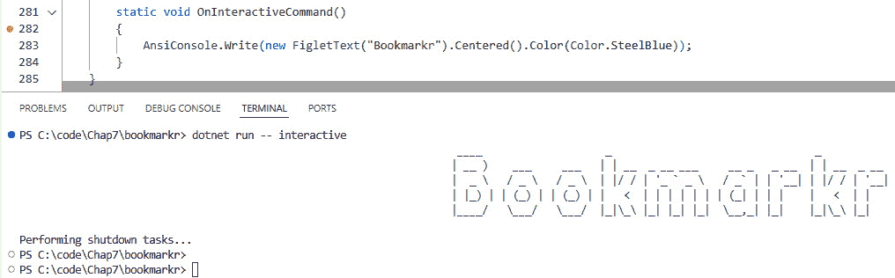
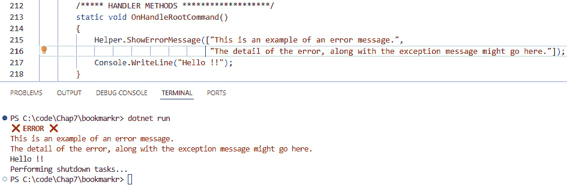
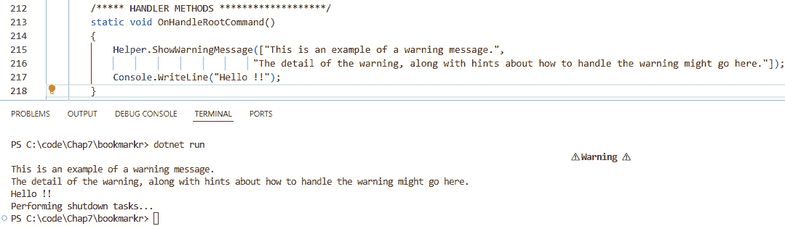
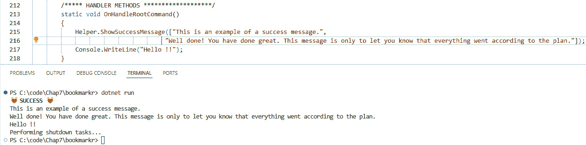
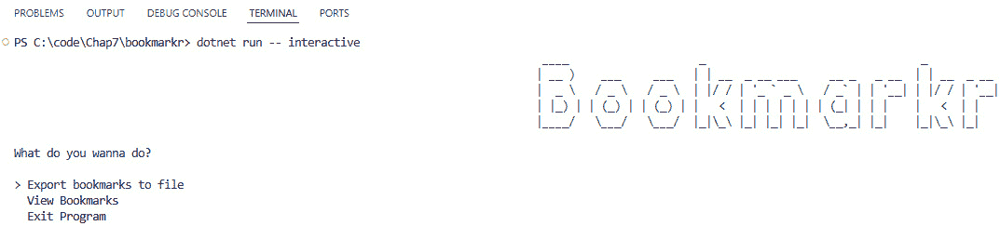
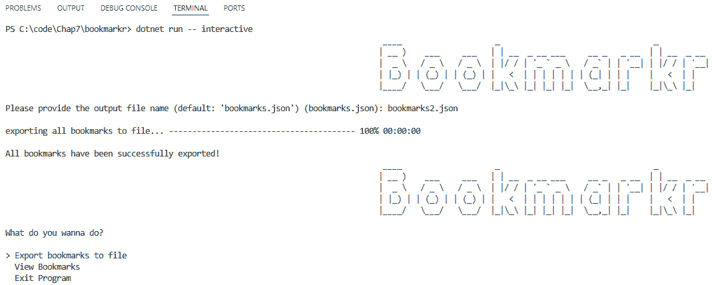
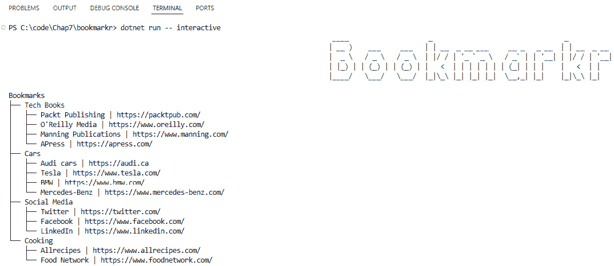

# 第七章：交互式命令行应用程序

到目前为止，与我们的 CLI 应用程序（*Bookmarkr*）的交互主要是基于文本的，这意味着应用程序对文本输入做出文本输出。从某种意义上说，它主要是一种请求-响应类型的应用程序。

是的，我们还在文本输出中添加了一些颜色，以便用户可以轻松地立即知道请求是否成功处理，或者它以错误或警告结束。

然而，尽管命令行应用程序不提供**图形用户界面**（**GUI**），但这并不意味着它们不能有趣！ 😉

在本章中，我们将学习如何增强我们的 CLI 应用程序的输出，使其更易于使用。我们将学习如何添加以下元素：

+   进度条和勾选标记，让用户知道他们请求的进度。这对于耗时较长的长时间运行操作（如下载或编码文件）特别有用。

+   列表项的列表，使其更容易从预定义项中选择。请注意，此列表不必是静态的；它可以动态地适应用户的当前上下文（例如，他们的权限）和请求（例如，请求的命令及其选项的值）。

通过依赖这些增强功能，我们不仅使我们的命令行界面（CLI）应用程序更易于使用，而且使其更具**交互性**，因为它可以与用户进行对话，向他们更新操作进度，或向他们展示针对其特定上下文定制的选项列表。

# 技术要求

本章的代码可以在与本书配套的 GitHub 存储库中找到，[`github.com/PacktPublishing/Building-CLI-Applications-with-C-Sharp-and-.NET/tree/main/Chapter07`](https://github.com/PacktPublishing/Building-CLI-Applications-with-C-Sharp-and-.NET/tree/main/Chapter07)。

# 构建交互式命令行应用程序

正如你可能已经注意到的——我相信你确实做到了 😉——我们已经创建了一些辅助方法来在不同场景中以不同颜色显示文本：绿色用于成功消息，黄色用于警告，红色用于错误。这些辅助方法的代码可以在`Helper.cs`文件中找到。

我们当然可以向此文件添加更多方法以支持其他功能，例如进度条和下拉列表。然而，正如我之前提到的，我相信你很聪明，所以你不会想要重新发明轮子，而是依赖一个适合这项工作的现有库 😊。

尽管可能存在多个库来满足这一目的，但我们在本章中将使用的是`Spectre.Console`。

`Spectre.Console`库旨在通过超越彩色文本来增强创建视觉上吸引人的控制台应用程序。它还允许您渲染树、下拉列表、表格、进度条以及许多其他图形元素。

这广泛的特性允许我们在 CLI 应用程序的控制台环境中创建丰富的用户界面。

关于 `Spectre.Console` 的更多详细信息，您可以访问其 GitHub 页面 [`github.com/spectreconsole/spectre.console`](https://github.com/spectreconsole/spectre.console)。特别是，我推荐查看以下两个存储库：

+   `spectre.console`：项目的官方存储库，这意味着它包含库的代码

+   `示例`：此存储库包含使用库的各种示例

因此，让我们首先将 `Spectre.Console` 库添加到我们的应用程序中。这可以通过以下命令实现：

```cs
dotnet add package Spectre.Console
```

让我们从添加一个名为 `interactive` 的新命令开始。这个命令将是 `root` 命令的子命令。同时，我们也为这个命令添加一个处理器：

```cs
var interactiveCommand = new Command("interactive", "Manage bookmarks interactively")
{
};
rootCommand.AddCommand(interactiveCommand);
interactiveCommand.SetHandler(OnInteractiveCommand);
```

让我们为这个新命令添加处理器方法：

```cs
static void OnInteractiveCommand()
{
}
```

由于我们正在使用 `Spectre.Console` 库，让我们引用它：

```cs
using Spectre.Console;
```

## 添加一个 FIGlet

FIGlet 是一种使用普通屏幕字符生成大型文本横幅的方式，以 ASCII 艺术的形式。最初于 1991 年发布，它因在终端会话中创建引人注目的文本而变得流行。因此，它非常适合使我们的 CLI 应用程序更易于使用！

因此，让我们向 *Bookmarkr* 添加一个 FIGlet！

由于 `Spectre.Console` 已经提供了这个功能，我们不需要自己创建 ASCII 艺术作品。所以，让我们利用它。

让我们更新我们的命令处理器方法，如下所示：

```cs
static void OnInteractiveCommand()
{
    AnsiConsole.Write(new FigletText("Bookmarkr").Centered().
    Color(Color.SteelBlue));
}
```

上述代码创建了一些 FIGlet 文本，将其居中，并以蓝色色调显示。

现在，让我们运行应用程序并查看我们目前所拥有的内容：

```cs
dotnet run -- interactive
```

我们应该看到以下输出：



图 7.1 – Bookmarkr 的一个 FIGlet

哇！这太棒了。这是我们交互式 CLI 应用程序的一个很好的开始，不是吗？😊

AnsiConsole 与 Console 的比较

如您所注意到的，我们不是使用 .NET 提供的 `Console.Write` 方法，而是使用 `AnsiConsole` 类提供的，它是 `Spectre.Console` 库的一部分。这是由于以下原因：

1\. `AnsiConsole` 类相比 `Console` 类提供了一套更丰富的功能，例如高级文本格式化、颜色、样式和交互元素。

2\. `AnsiConsole` 类旨在在不同操作系统和终端仿真器之间保持一致性。它自动检测当前终端的功能并根据其输出进行调整。

3\. `AnsiConsole` 类支持 24 位颜色、文本样式（如粗体和斜体）以及各种小部件，如表格、树形图，甚至 ASCII 图像。

4\. `AnsiConsole` 类使创建交互式提示、选择菜单和其他比标准 `Console` 类更复杂的用户输入机制成为可能。

5. `AnsiConsole` 类支持实时渲染功能，允许你动态更新内容，如进度条和状态指示器。

6. `AnsiConsole` 类提供了一种丰富的标记语言，使得在不复杂的代码中应用颜色和样式到文本变得容易。

7. 使用`IAnsiConsole`接口而不是静态的`AnsiConsole`类，使得对命令处理程序和其他与控制台相关的代码进行单元测试成为可能。

在这个阶段，我们已经为我们的 CLI 应用程序的交互式版本打下了基础。在下一节中，我们将添加更多功能，使 *Bookmarkr* 更加用户友好！

# 设计用户友好的 CLI 应用程序

尽管`Spectre.Console`提供了许多功能（并且我鼓励您通过访问[`spectreconsole.net`](https://spectreconsole.net)上的文档来查看它们），但我们将专注于这些功能的一个子集，以增加我们的 *Bookmarkr* 应用程序的交互性。

## 使用标记增强文本显示

让我们通过利用`Spectre.Console`提供的标记功能来改进我们的`Helper.cs`类。这些功能允许我们样式化和格式化文本，甚至渲染表情符号！然而，请注意，某些终端环境（尤其是较旧的系统或受限环境，如 CI/CD 系统）可能不支持表情符号渲染。

首先，让我们回顾我们的三个方法：`ShowErrorMessage`、`ShowWarningMessage` 和 `ShowSuccessMessage`。

这些方法在显示接收到的文本参数的颜色上有所不同，但它们在遵循相同过程的方式上是相似的：

+   首先，它们将当前的前景色保存到一个临时变量中。

+   然后，他们将前景色更改为预期的颜色（红色、黄色或绿色）。

+   接着，它们使用该颜色显示接收到的文本。

+   最后，它们将前景色恢复到保存的颜色。

这得益于`Spectre.Console`库。我们不必保存和恢复当前的前景色（库会为我们做这件事）。它还打开了一些新的可能性。让我们在重新定义这些方法的同时探索一些！

### `ShowErrorMessage`方法

我们仍然希望错误信息以红色显示，但我们还想使用表情符号使其更加引人注目。

代码看起来是这样的：

```cs
public static void ShowErrorMessage(string[] errorMessages)
{
    Console.OutputEncoding = System.Text.Encoding.UTF8;
    AnsiConsole.MarkupLine(
        Emoji.Known.CrossMark + " [bold red]ERROR[/] :cross_mark:");
        foreach(var message in errorMessages)
    {
        AnsiConsole.MarkupLineInterpolated($"[red]{message}[/]");
    }
}
```

在这个代码示例中有许多值得提及的地方：

+   首先，我们将编码设置为 UTF-8。这确保了表情符号能够正确渲染。否则，它们将被问号替换。

+   说到表情符号，请注意我们可以用两种方式显示它们：我们既可以使用`Emoji`类下的`Known`枚举，也可以使用标记代码（这里我们使用了`:cross_mark:`）。支持的完整表情符号列表，包括它们的标记代码和枚举常量，可以在[`spectreconsole.net/appendix/emojis`](https://spectreconsole.net/appendix/emojis)找到。

+   我们使用 `AnsiConsole.MarkupLine(…)` 来显示带交叉标记的粗体和红色单词 *ERROR*。语法基于 `BBCode` ([`en.wikipedia.org/wiki/BBCode`](https://en.wikipedia.org/wiki/BBCode))。

+   由于 `ShowErrorMessage` 方法接收一个字符串数组，我们以红色显示每个字符串。然而，这次，我们依赖于 `AnsiConsole` 类的 `MarkupLineInterpolated` 方法，因为我们正在进行字符串插值。

让我们看看调用 `ShowErrorMessage` 方法会发生什么：



图 7.2 – 更新的 ShowErrorMessage 方法执行效果

再次注意，*Hello!* 消息没有以红色显示，而是在终端的先前前景色中显示，我们无需处理这一点。

现在，让我们更新 `ShowWarningMessage` 和 `ShowSuccessMessage` 方法。

### ShowWarningMessage 方法

我们仍然希望以黄色显示警告消息，但让我们也使其居中显示在屏幕中央（是的，我们也会使用表情符号 😊）。

更新后的代码看起来是这样的：

```cs
public static void ShowWarningMessage(string[] errorMessages)
{
    Console.OutputEncoding = System.Text.Encoding.UTF8;
    var m = new Markup(
        Emoji.Known.Warning + " [bold yellow]Warning[/] :warning:"
    );
    m.Centered();
    AnsiConsole.Write(m);
    AnsiConsole.WriteLine();
    foreach(var message in errorMessages)
    {
        AnsiConsole.MarkupLineInterpolated(
            $"[yellow]{message}[/]"
        );
    }
}
```

这段代码与 `ShowErrorMessage` 的代码非常相似。然而，有一个细微的差别：我们不是调用 `MarkupLine` 方法来显示带表情符号的 *Warning* 文本，而是实例化一个 `Markup` 类型的对象，然后在其 `Centered()` 方法之前调用它，然后再将其作为参数传递给 `Write` 方法。这是必要的，以便我们可以将文本居中显示在屏幕上。

此外，注意在那之后，我们调用 `WriteLine` 方法而没有任何参数。这确保在显示警告信息之前执行换行。

让我们看看调用 `ShowWarningMessage` 方法会发生什么：



图 7.3 – 更新的 ShowWarningMessage 方法执行效果

再次注意，*Hello!* 消息没有以红色显示，而是在终端的先前前景色中显示，我们无需处理这一点。

### ShowSuccessMessage 方法

我们仍然希望以绿色显示成功消息。

更新后的代码看起来是这样的：

```cs
public static void ShowSuccessMessage(string[] errorMessages)
{
    Console.OutputEncoding = System.Text.Encoding.UTF8;
    AnsiConsole.MarkupLine(Emoji.Known.BeatingHeart + " [bold green]
    SUCCESS[/] :beating_heart:");
    foreach(var message in errorMessages)
    {
        AnsiConsole.MarkupLineInterpolated($"[green]{message}[/]");
    }
}
```

这里绝对没有什么值得提及的，也许只是我们决定使用心形表情符号来庆祝操作的顺利完成！😊 恭喜你 – 你开始掌握使用 `Spectre.Console` 风格化和格式化文本的技能了！

让我们看看调用 `ShowSuccessMessage` 方法会发生什么：



图 7.4 – 更新的 ShowSuccessMessage 方法执行效果

再次注意，*Hello!* 消息没有以红色显示，而是在终端的先前前景色中显示，我们无需处理这一点。

现在我们可以让我们的文本更加引人注目，让我们通过添加更多功能来改进我们的交互式命令。

## 使用选择提示向用户提供选项

以视觉上令人愉悦的方式显示文本很重要，但与用户交互并获取他们的输入同样重要。幸运的是，`Spectre.Console`提供了许多与用户交互的方式。让我们探索其中的一种。

目前，我们的交互式命令只显示一个 FIGlet。这当然很棒，但让我们让它对用户更有价值。我们可以添加的一件事是列出用户可以执行的所有操作。为此，我们将使用**选择提示**。这将允许用户使用键盘上的上下箭头导航列表，并确认要执行的操作。

下面是它在实际操作中的样子：



图 7.5 – 选择提示在实际操作中的应用

下面是`OnInteractiveCommand`方法的更新代码：

```cs
static void OnInteractiveCommand()
{
    bool isRunning = true;
    while(isRunning)
    {
        AnsiConsole.Write(
            new FigletText("Bookmarkr")
                .Centered()
                .Color(Color.SteelBlue)
        );
        var selectedOperation = AnsiConsole.Prompt(
            new SelectionPrompt<string>()
                .Title("[blue]What do you wanna do?[/]")
                .AddChoices([
                    "Export bookmarks to file",
                    "View Bookmarks",
                    "Exit Program"
            ])
        );
        switch(selectedOperation)
        {
            case "Export bookmarks to file":
                ExportBookmarks();
                break;
            case "View Bookmarks":
                ViewBookmarks();
                break;
            default:
                isRunning = false;
                break;
        }
    }
}
```

让我们更仔细地看看这段代码：

+   我们希望用户能够继续选择操作，直到他们决定退出程序（通过从选择提示中选择*退出程序*选项）。这就是为什么我们将代码放在一个依赖于初始设置为`true`的布尔变量的`while`循环中。当用户选择*退出程序*时，布尔变量被设置为`false`，程序退出。否则，在每次完成操作后，选择提示都会显示给用户。

+   我们实例化了`SelectionPrompt`类（由`Spectre.Console`提供），指定了一个标题和将显示给用户的可用选项列表。用户可以使用上下箭头导航此列表，并通过按下*Enter*键确认他们的选择。当他们这样做时，`selectedOperation`变量被设置为所选值。

+   最后，我们使用`switch`语句根据`selectedOperation`变量的值调用一个特定方法。该方法将处理请求的操作。请注意，这些方法尚未实现——我们将在接下来的章节中关注它们。

多选

`Spectre.Console`库还提供了多选提示，允许用户从可能的选项列表中选择多个项目。您可以在[`spectreconsole.net/prompts/multiselection`](https://spectreconsole.net/prompts/multiselection)找到一个说明性的示例，以及一个代码示例。

## 展示导出命令的实时进度

我们之前导出命令的迭代有点……枯燥！它确实按照预期将书签导出到指定的输出文件，但它没有提供关于操作进度的信息。我们无法知道它是否已经完成了一半，或者它是否仍然在千个项目的最前面几个。多亏了`Spectre.Console`的功能，我们可以在过程中显示实时进度。

展示实时进度的方法有两种：同步和异步。由于我们的导出代码是异步的，我们将使用后者。

因此，让我们实现上一节中看到的 `ExportBookmarks` 方法。以下是代码：

```cs
static void ExportBookmarks()
{
    // ask for the outputfilePath
    var outputfilePath = AnsiConsole.Prompt(
          new TextPrompt<string>("Please provide the output file name 
          (default: 'bookmarks.json')")
          .DefaultValue("bookmarks.json"));
    // export the bookmarks to the specified file, while showing 
    // progress.
    AnsiConsole.Progress()
        .AutoRefresh(true) // Turns on auto refresh
        .AutoClear(false)   // Avoids removing the task list when 
                            // completed
        .HideCompleted(false)   // Avoids hiding tasks as they are 
                                // completed
        .Columns(
        [
            new TaskDescriptionColumn(),    // Shows the task 
                                            // description
            new ProgressBarColumn(),        // Shows the progress bar
            new PercentageColumn(),         // Shows the current 
                                            // percentage
            new RemainingTimeColumn(),      // Shows the remaining 
                                            // time
            new SpinnerColumn(),            // Shows the spinner, 
                                            // indicating that the 
                                            // operation is ongoing
        ])
        .Start(ctx =>
        {
            // Get the list of all bookmarks
            var bookmarks = service.GetAll();
            // export the bookmarks to the file
            // 1\. Create the task
            var task = ctx.AddTask("[yellow]exporting all bookmarks to 
            file...[/]");
            // 2\. Set the total steps for the progress bar
            task.MaxValue = bookmarks.Count;
            // 3\. Open the file for writing
            using (StreamWriter writer = new 
            StreamWriter(outputfilePath))
            {
                while (!ctx.IsFinished)
                {
                    foreach (var bookmark in bookmarks)
                    {
                        // 3.1\. Serialize the current bookmark as JSON 
                        //and write it to the file asynchronously
                        writer.WriteLine(JsonSerializer.
                        Serialize(bookmark));
                        // 3.2\. Increment the progress bar
                        task.Increment(1);
                        // 3.3\. Slow down the process so we can see 
                        // the progress (since this operation is not 
                        // that much time-consuming)
                        Thread.Sleep(1500);
                    }
                }
            }
        });
    AnsiConsole.MarkupLine("[green]All bookmarks have been 
    successfully exported![/]");
}
```

让我们更仔细地看看这段代码：

1.  首先，我们要求用户输入文件名。我们通过使用 `AnsiConsole.Prompt` 并传递一个 `TextPrompt` 实例来实现这一点。此类还允许我们指定默认值，如果用户没有提供值或对此满意的话。

1.  接下来，我们通过调用 `AnsiConsole.Progress` 来显示进度条。导出操作的处理在 `Start` 方法内作为委托实现：

    1.  我们首先检索要导出的书签列表。

    1.  接下来，我们创建一个 `Task` 类的实例，该实例将负责跟踪导出操作的处理并增加进度条的百分比。我们还设置了该任务的最大值为要导出的书签数量。

    1.  然后，我们打开一个流写入器到导出文件。在任务未完成（由 `ctx.IsFinished` 布尔值指示）时，我们将每个书签序列化为 JSON 并将其写入文件，增加任务（这将反过来更新进度条），并等待 1.5 秒（这是可选的，但由于导出操作并不耗时，添加延迟可以让我们看到进度条的动画 😊）。

1.  你可能已经注意到了在调用 `Start` 方法之前的一些代码行。这些代码在这里是为了配置进度条的外观和行为：

    +   `AutoRefresh(true)`: 我们启用了进度条的自动刷新。否则，即使我们增加任务的值，进度条也不会动画化以反映更新的值。

    +   `AutoClear(false)`: 这将防止任务完成后被移除。这在显示多个并发操作的进度时特别有用。

    +   `HideCompleted(false)`: 这将防止任务完成后被隐藏。这在显示多个并发操作的进度时特别有用。

    +   `Columns`: 这个集合控制进度条的外观。在这种情况下，我们决定显示任务的描述、进度条、当前操作百分比、完成操作剩余时间以及一个指示操作正在进行的旋转器（这在处理进度条可能更新间隔较长的耗时操作时很有帮助，因为旋转器会一直旋转，用户就会有一种操作仍在进行的感受）。

现在代码已经实现，让我们运行程序看看我们得到什么结果：



图 7.6 – 导出书签时显示实时进度

现在，我们的导出操作更加用户友好（坦白说，使用起来更有趣 😊）。用户会被告知导出操作的进度，随着操作的继续运行。

重要提示

如果终端不被认为是交互式的（例如，在持续集成系统中运行时），任何进度将以更简单的方式显示（例如，当前百分比值显示在新行上）。

有了这个，我们已经将书签导出到文件中，并且可以从中查看它们。太棒了！但如果我们想直接在 CLI 应用程序中查看它们怎么办？让我们看看我们如何能够有一个视觉上令人愉悦的书签表示。

## 以树形视图显示书签

`Spectre.Console` 库提供了各种选项来显示元素列表。我们可以使用表格、树、布局、面板、网格等等。

由于我们想要根据书签所属的类别显示书签列表，我们将使用树表示。因此，让我们实现 `ViewBookmarks` 方法。

这是这个方法的代码：

```cs
static void ViewBookmarks()
{
    // Create the tree
    var root = new Tree("Bookmarks");
    // Add some nodes
    var techBooksCategory = root.AddNode("[yellow]Tech Books[/]");
    var carsCategory = root.AddNode("[yellow]Cars[/]");
    var socialMediaCategory = root.AddNode("[yellow]Social Media[/]");
    var cookingCategory = root.AddNode("[yellow]Cooking[/]");
    // add bookmarks for the Tech Book category
    var techBooks = service.GetBookmarksByCategory("Tech Books");
    foreach(var techbook in techBooks)
    {
        techBooksCategory.AddNode($"{techbook.Name} | {techbook.
        Url}");
    }
    // ... do the same for the other categories ;)
    // Render the tree
    AnsiConsole.Write(root);
}
```

让我们来解释一下这段代码：

1.  首先，我们创建树的根元素，并将其标记为 *Bookmarks*。这个标签将显示出来，以指示这个树展示了哪些元素。

1.  接下来，我们添加四个节点（每个类别一个）。这些标签是根节点的子节点，它们的标签以黄色显示。

1.  然后，我们调用 `BookmarkService` 的 `GetBookmarksByCategory` 方法来检索与指定类别（在这种情况下，*Tech Books*）关联的书签列表。之后，我们遍历这个列表，并将每个书签作为子节点添加到 `techBooksCategory` 节点。

1.  我们对其他类别做同样的事情。前面的代码示例已经简化，只显示了 *Tech Books* 类别的代码以供清晰。然而，完整的代码可以在本书的 GitHub 仓库中找到。

1.  最后，我们在控制台中显示标签。

很直接，不是吗？

现在，让我们运行程序并看看它的样子：



图 7.7 – 以树形视图显示书签，按类别分组

哇。多么大的改进！我们的 CLI 应用程序的交互式版本看起来很棒，更用户友好且更具吸引力，不是吗？😉

# 要交互还是不要交互？

提供一个 CLI 应用的交互式版本无疑增强了用户体验。那么，我们难道不应该总是提供它吗？它难道不应该成为默认版本吗？这些问题很棒。感谢提问！😊

让我们从第一个问题开始：**我们难道不应该总是提供它吗？** 我们当然应该提供，因为它（如前所述）可以改善用户体验和参与度。

**它难道不应该成为默认版本吗？** 它可以！这取决于你的目标受众：

+   如果你的 CLI 应用程序主要是为了由人类运行，那么是的！你应该将交互式版本设置为默认版本。在这种情况下，你的命令可以提供一个 `--non-interactive` 选项，以便在程序执行该命令时（例如在 CI/CD 管道中）禁用此交互行为。

+   如果你的 CLI 应用程序主要是为了由程序运行（例如用于处理大量文件或 CI/CD 管道），你的命令可以提供一个 `--interactive` 选项，以便在由人类执行时启用交互式行为。

换句话说，交互性非常棒，但请明智地使用它！

# 摘要

在本章中，我们通过引入进度条、勾选标记和项目列表，使 *Bookmarkr* 更加用户友好和图形化，以便于用户选择，并确保只选择有效值。

我们了解到，这些添加功能与文本着色相结合，有助于使我们的 CLI 应用程序更具吸引力和趣味性，并表明 CLI 应用程序在 GUI 应用程序面前没有任何可羞愧之处。

但这还不是全部！我们还了解到，这些添加功能有助于使我们的 CLI 应用程序与用户更加对话式（即交互式）。

在下一章中，我们将学习如何使我们的 CLI 应用程序具有更模块化的设计，以便更容易扩展。

# 轮到你了！

跟随提供的代码是一种通过实践学习的好方法。

一个更好的方法是挑战自己完成任务。因此，我挑战你通过添加各种功能来改进 *Bookmarkr* 应用程序。

## 任务 1 – 以用户友好的方式展示书签

你被要求添加一个 `show` 命令，该命令接受书签的名称，并以三列网格的形式显示它 – 一列用于名称，一列用于 URL，一列用于分类。

网格应包含一行用于标题（名称、URL 和分类）。

名称应以黄色和粗体显示；URL 应作为链接呈现；分类应以斜体和绿色显示。

命令的语法应如下所示：

```cs
bookmarkr link show --name <name of the bookmark>
```

## 任务 2 – 交互式更改书签的分类

你被要求实现一个名为 `category change` 的新命令，该命令更改现有 URL 的分类。

命令必须显示现有分类的列表作为选择菜单；用户将不得不根据其 URL 选择将其设置为该书签的新分类。然后，此更新将被保存到数据库中。

命令的语法应如下所示：

```cs
bookmarkr category change --for-url <url of the bookmark>
```
