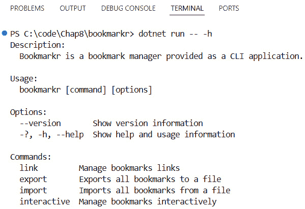
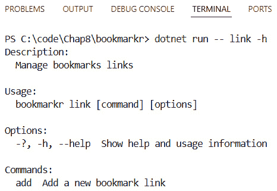
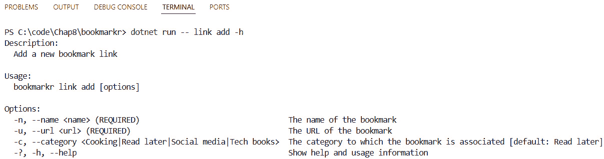
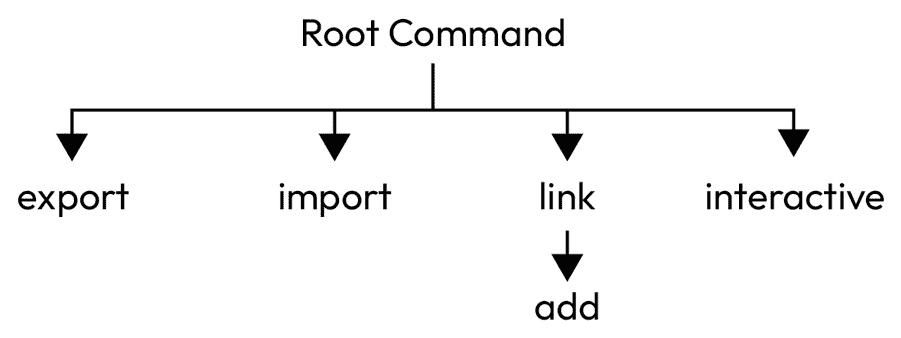
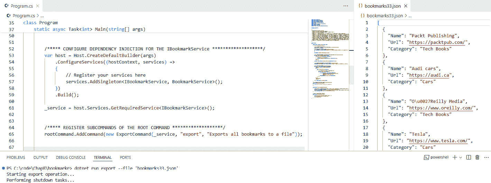
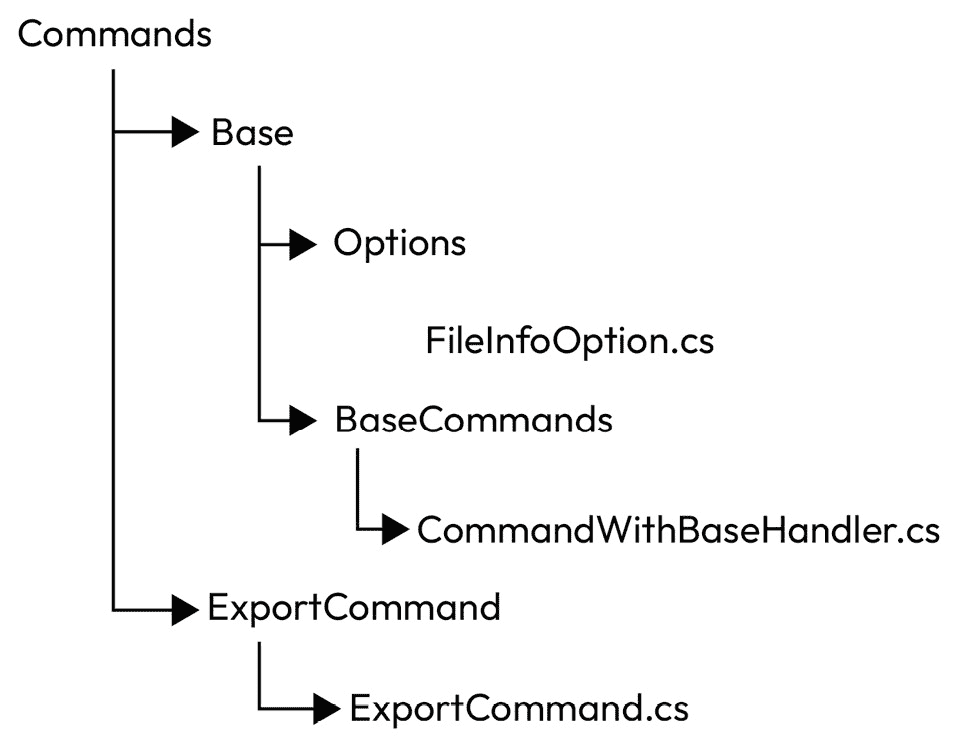

# 第八章：构建模块化和可扩展的 CLI 应用程序

在这本书的每一页，我们都为我们的心爱命令行应用程序 **Bookmarkr** 添加了更多功能。

问题是我们还向 `Program.cs` 文件中添加了越来越多的代码行。该文件的长度从第三章末的 191 行代码增长到第七章末的 479 行代码。

在本章中，我们将退后一步，重构我们的代码，使其更加模块化。这将使其更容易扩展、测试和维护。

重构是开发生命周期的一个基本部分。它应该定期发生，以确保代码质量符合标准。

通过采取这一必要的步骤，我们将极大地简化添加更多功能，提高我们应用程序的可读性和稳定性，甚至将其引入可测试性。

更具体地说，在本章中，我们将涵盖以下主题：

+   构建当前应用程序的代码图

+   决定从哪里开始重构

+   设计项目结构以支持重构

+   重构一个命令

+   应用依赖倒置原则

+   重构 `Program` 类

+   运行程序以验证重构没有破坏任何东西

+   将我们的重构推向新的边界

# 技术要求

本章的代码可以在本书配套的 GitHub 仓库中找到，[`github.com/PacktPublishing/Building-CLI-Applications-with-C-Sharp-and-.NET/tree/main/Chapter08`](https://github.com/PacktPublishing/Building-CLI-Applications-with-C-Sharp-and-.NET/tree/main/Chapter08)。

# 第 1 步 – 构建应用程序的代码图

当你重构一个应用程序时，首先要了解你即将重构的内容。这意味着要有一个对应用程序及其依赖关系的高级视图。这有助于你可视化所有涉及的移动部分，并通过确定从哪里开始来更好地规划你的重构活动。

如果你拥有 Visual Studio Enterprise 版本，你可以使用其出色的架构功能（例如代码图和依赖关系图）来可视化你的代码及其依赖关系。然而，由于我们正在使用 Visual Studio Code（或者如果你没有 Visual Studio 的企业版），我们可以做些其他的事情…

当然，我们可以运行代码并识别其每一个移动部分，但既然这是一个命令行应用程序，让我们来做点更聪明的事情。😉

## 使用帮助菜单构建代码图

`System.CommandLine` 确实非常适合学习如何使用应用程序，但它也非常适合确定应用程序的代码图。

让我们从在根命令中通过输入以下命令来显示帮助菜单开始：

```cs
dotnet run -- -h
```

我们将得到以下结果：



图 8.1 – 根命令的帮助菜单

接下来，我们将重复此操作（即显示帮助菜单）针对根命令的每个子命令，然后针对每个子命令的每个子命令，然后……好吧，你明白了！😉

这里是`link`命令的一个示例：



图 8.2 – 链接命令的帮助菜单

我们应该在什么时候停止？嗯，当当前命令没有更多子命令时。以下是一个关于`link` `add`命令的示例：



图 8.3 – 链接添加命令的帮助菜单

完成这个练习后，我们将得到以下代码图：



图 8.4 – Bookmarkr 应用程序的代码图

好吧，现在我们已经对我们的应用程序中的运动部件有了更清晰的了解，下一步该做什么呢？

# 第 2 步 – 决定从哪里开始

现在是时候决定先重构什么了。

我建议不要首先从根命令开始，而是从该根命令的子命令开始。

从那里开始，没有对或错的决策。你可以选择你想要的任何子命令开始。在本章的剩余部分，我们将以`export`命令为例。

虽然`export`命令没有子命令，但它仍然有助于我们为*Bookmarkr*的重构版本奠定基础。更具体地说，它将帮助我们完成以下工作：

+   定义项目结构以支持我们的重构

+   重构它并隐藏其“复杂性”（即移动部件到根命令）

+   重构`Program`类，使其更精简、更干净、更简洁

+   设置依赖注入以在命令和外部服务（如`BookmarkService`）之间进行交互

让我们从设计支持我们重构活动的项目结构开始。

# 第 3 步 – 设计项目结构

虽然一个人可以根据他们的喜好设计他们的项目结构，但我设计我的项目结构是为了让任何查看我的项目的人都能理解它做什么以及每个运动部件在哪里。

按照这个原则，所有命令都将被分组在一个名为`Commands`的文件夹中。这个文件夹将位于项目结构的根目录。

由于我们将重构`export`命令，让我们创建一个名为`Export`的子文件夹，其中将包含所有涉及`export`命令的代码工件。

一旦我们开始重构另一个命令，我们将为它创建一个特定的文件夹。

命令的子命令怎么办？

遵循面向对象编程中的**封装**原则，并且由于子命令只能通过其父命令调用，我建议将子命令放在与其父命令相同的文件夹中。

例如，`link add`命令。`add`子命令只能通过其父命令（`link`）来调用。因此，它们的生命周期紧密相关。

关于这一点，`add`命令的代码工件将位于其父命令（`link`）的代码工件附近，在`Link`文件夹中。

# 第 4 步 – 重构导出命令

在`Export`文件夹中，让我们创建一个名为`ExportCommand.cs`的新 C#文件。

每个命令类（包括`RootCommand`）都继承自`Command`基类。此外，该基类提供了一个接受`Command`类型参数的`AddCommand`方法，这意味着任何继承自`Command`类的类。

带着这个认识，我们可以开始重构`export`命令，通过使`ExportCommand`类继承自`Command`类。

在导入所需的`using`语句、指定`namespace`名称和添加所需的类构造函数之后，我们类的第一次迭代看起来如下所示：

```cs
using System.CommandLine;
namespace bookmarkr.Commands;
public class ExportCommand : Command
{
    #region Constructor
    public ExportCommand(string name, string? description = null)
        : base(name, description)
    {
    }
    #endregion
}
```

首先要移动到这个类中的是选项。`export`命令只有一个选项，即`outputfileOption`。

我喜欢我的类中的每个组件都很好地分割开。这就是为什么我是区域（regions）的粉丝。因此，让我们添加一个专门用于选项的区域，并将`outputfileOption`选项的代码移动到这个区域中。

代码看起来如下所示：

```cs
#region Options
private Option<FileInfo> outputfileOption = new Option<FileInfo>(
    ["--file", "-f"],
    "The output file that will store the bookmarks"
)
{
    IsRequired = true
}.LegalFileNamesOnly();
#endregion
```

然后，我们需要将此选项与命令关联起来。我们将在构造函数体内部调用`AddOption`方法来完成此操作，如下所示：

```cs
#region Constructor
public ExportCommand(string name, string? description = null)
    : base(name, description)
{
    AddOption(outputfileOption);
}
#endregion
```

下一步要移动的是对`SetHandler`方法的调用，它将命令连接到其处理方法。因此，构造函数的更新版本如下所示：

```cs
#region Constructor
public ExportCommand(string name, string? description = null)
    : base(name, description)
{
    AddOption(outputfileOption);
    this.SetHandler(async (context) =>
    {
        FileInfo? outputfileOptionValue = context.ParseResult.
        GetValueForOption(outputfileOption);
        var token = context.GetCancellationToken();
        await OnExportCommand(outputfileOptionValue!, token);
    });
}
#endregion
```

最后，要移动到新类中的最后一部分代码是命令处理方法。我们再次将创建一个新的区域来存放这部分代码，并将最后的代码移动过去。我们还将`static`修饰符更改为`private`。原因是类不是静态的（因此移除了`static`关键字），命令处理方法是私有的（因此使用了`private`关键字）：

```cs
#region Handler method
private async Task OnExportCommand(FileInfo outputfile,
    CancellationToken token)
{
    // method body removed for brevity.
    // It is exactly similar to the one from the previous chapters.
}
#endregion
```

如果你在这个过程中正在键入（或复制粘贴 😉）代码，你可以在这一点上看到代码因为两个错误而无法编译。

第一个问题很容易解决。只需在 C#文件顶部添加以下语句即可：

```cs
using System.Text.Json;
```

第二个问题不太明显，它表明类找不到`BookmarkService`类的实例。

当然，我们可以在当前类中简单地创建该服务的实例。然而，由于`BookmarkService`是`ExportCommand`类的外部依赖，这样做将违反面向对象编程所倡导的**依赖倒置**原则。

作为提醒，依赖倒置原则是面向对象编程和设计的五个 SOLID 原则之一。它指出，高级模块不应该依赖于低级模块；两者都应依赖于抽象。此外，抽象不应该依赖于细节；细节应该依赖于抽象。这个原则有助于解耦软件模块，使系统更加模块化、灵活，并且更容易维护。

这实际上意味着什么？这意味着我们应该将 `BookmarkService` 实例注入到 `ExportCommand` 类中。

让我们开始做吧！

# 第 5 步 – 应用依赖倒置原则

如果你熟悉依赖倒置原则，你肯定会已经注意到 `BookmarkService` 类没有实现任何接口。

让我们先解决这个问题。

我对依赖倒置原则不太熟悉！

如果你还没有这样做，有很多优秀的资源可以探索这个原则。这并不是一个难以理解的原则，坦白说，在你了解它之后，它将显得如此明显，以至于你会 wonder 为什么你之前不知道它。

可以在 [`www.c-sharpcorner.com/article/dependency-inversion-principle-in-c-sharp/`](https://www.c-sharpcorner.com/article/dependency-inversion-principle-in-c-sharp/) 找到该原则的出色解释。

我强烈建议你在应用依赖倒置原则之前和之后审查 `BookmarkService` 服务的实现，以便对它的好处有清晰的理解。

回到我们关于项目结构讨论的话题，我们首先将创建一个名为 `Services` 的新文件夹，用于组织我们所有的服务类。在这个文件夹内，为每个服务创建一个特定的文件夹。在我们的例子中，我们只有一个服务，所以让我们创建 `BookmarkService` 文件夹。这个文件夹将包含我们服务的接口和具体实现。

我们服务的文件夹结构将如下所示：


图 8.5 – `BookmarkService` 服务的文件夹结构

接下来，让我们将 `IBookmarkService` 接口从 `BookmarkService` 类中提取出来。该接口的代码如下：

```cs
namespace bookmarkr.Services;
public interface IBookmarkService
{
    void AddLink(string name, string url, string category);
    void AddLinks(string[] names, string[] urls, string[] categories);
    void ListAll();
    List<Bookmark> GetAll();
    void Import(List<Bookmark> bookmarks);
    BookmarkConflictModel? Import(Bookmark bookmark);
    List<Bookmark> GetBookmarksByCategory(string category);
}
```

现在，让我们让 `BookmarkService` 类实现 `IBookmarkService` 接口：

```cs
namespace bookmarkr.Services;
public class BookmarkService : IBookmarkService
{
    // method body removed for brevity.
    // It is exactly similar to the one from the previous chapters.
}
```

注意，我们为了更好地传达它们的意图，已经更改了这些实体的命名空间名称。

现在剩下的工作就是将该服务注入到 `ExportCommand` 类中。这意味着两件事：

1.  我们将在 `ExportCommand` 类中添加一个 `private` 类型的 `IBookmarkService` 属性，这将允许我们在命令类内部（更具体地说，在 `OnExportCommand` 方法内部）调用该服务的方法。

1.  我们将通过构造函数参数注入该服务的实例。

`ExportCommand`类的更新代码现在看起来是这样的：

```cs
using System.CommandLine;
using System.Text.Json;
using bookmarkr.Services;
namespace bookmarkr.Commands;
public class ExportCommand : Command
{
    #region Properties
    private IBookmarkService _service;
    #endregion
    #region Constructor
    public ExportCommand(IBookmarkService service, string name, 
    string? description = null)
        : base(name, description)
    {
        _service = service;
        AddOption(outputfileOption);
        this.SetHandler(async (context) =>
        {
            FileInfo? outputfileOptionValue = context.ParseResult.
            GetValueForOption(outputfileOption);
            var token = context.GetCancellationToken();
            await OnExportCommand(outputfileOptionValue!, token);
        });
    }
    #endregion
  // The "Options" region hasn't changed and removed for brevity.
#region Handler method
    private async Task OnExportCommand(FileInfo outputfile, 
    CancellationToken token)
    {
    // …
    var bookmarks = _service.GetAll();
    // …
    }
    #endregion
}
```

这段代码非常容易理解，不需要任何特别的解释。

依赖倒置原则可能会引入复杂性！

依赖注入可能会通过需要额外的设置和配置（例如添加额外的接口、类和间接引用）在简单应用中引入一些开销，这对于依赖较少的简单项目可能是多余的。

因此，找到在不给代码库增加太多复杂性的情况下应用此原则的平衡是很重要的。

这真是太好了。自从我们开始重构之旅以来，我们已经走了很长的路！

还有最后一段代码我们没有重构，这就是我们最初开始这段旅程的原因：`Program`类。

让我们现在将注意力转向这个类…

# 第 6 步 - 重构`Program`类

通过将命令重构到它们各自的类中，创建和处理这些命令的代码将从`Program`类中移除。

因此，`Program`类现在将仅用于组合我们的应用程序。更具体地说，`Program`类将执行以下操作：

1.  实例化根命令并注册其子命令。

1.  实例化和配置`CommandLineBuilder`类，并启动程序。

1.  配置日志。

1.  配置`BookmarkService`服务的依赖注入。

这里是`Program`类的重构代码（请注意，为了简洁和清晰，这里没有列出代码的部分，包括`using`语句）：

```cs
using Microsoft.Extensions.DependencyInjection;
class Program
{
    static async Task<int> Main(string[] args)
    {
        FreeSerilogLoggerOnShutdown();
        /** DECLARE A VARIABLE FOR THE IBookmarkService **/
        IBookmarkService _service;
        /** INSTANTIATE THE ROOT COMMAND **/
        var rootCommand = new RootCommand(
            "Bookmarkr is a bookmark manager provided as a CLI 
            application.")
        {
        };
        rootCommand.SetHandler(OnHandleRootCommand);
        /** CONFIGURE DEPENDENCY INJECTION FOR THE IBookmarkService 
        **/
        var host = Host.CreateDefaultBuilder(args)
            .ConfigureServices((hostContext, services) =>
            {
                // Register your services here
                services.AddSingleton<IBookmarkService, 
                BookmarkService>();
            })
            .Build();
        _service = host.Services.GetRequiredService<IBookmarkService>();
        /** REGISTER SUBCOMMANDS OF THE ROOT COMMAND **/
        rootCommand.AddCommand(new ExportCommand(_service, "export", 
        "Exports all bookmarks to a file"));
        /** THE BUILDER PATTERN **/
        // code removed for brevity.
    }
    /** HANDLER OF THE ROOT COMMAND **/
    static void OnHandleRootCommand()
    {
        Console.WriteLine("Hello from the root command!");
    }
    static void FreeSerilogLoggerOnShutdown()
    {
        // code removed for brevity.
    }
    static void ExecuteShutdownTasks()
    {
        // code removed for brevity.
    }
}
```

这段代码主要很容易理解。

值得解释的唯一部分是我们如何执行服务的依赖注入（这里使用`BookmarkService`）：

+   我们声明了一个`IBookmarkService`类型的变量，该变量将用于检索注入的服务实例。

+   我们通过利用.NET 提供的`HostBuilder`类并注册服务到`IServiceCollection`集合来配置依赖注入。

+   我们通过在`IServiceCollection`集合上调用`GetRequiredService`来检索已注册的服务实例，并将检索到的服务引用存储到我们之前声明的变量中。

+   当创建新命令的实例时，我们将该变量作为参数传递给命令的构造函数，以便新命令接收服务实例。

哇！服务被自动实例化并注入到需要它的各种命令中。

这种方法的优点是，如果我们需要更改服务实现，我们只需修改服务注册到`IServiceCollection`，其余的将神奇地得到处理。

注意到`Program.cs`文件从 479 行代码缩减到了 115 行代码！

最好的部分是？将新命令注册到根命令只需要一行额外的代码（即，在根命令上调用`AddCommand`并传递要注册的新命令的实例），而注入新服务只需要两行代码：一行用于将服务添加到服务集合中，另一行用于获取该服务的引用以便传递给需要它的类。

小心陷阱！

依赖注入的常见陷阱包括循环依赖，其中类相互依赖，以及由于服务生命周期不当而可能出现的意外单例行为。过度注入依赖项可能会违反单一职责原则，而过度依赖服务定位器会复杂化测试。为了避免这些问题，仔细管理服务生命周期并遵循最佳实践至关重要。

我强烈建议您查看第十四章中的阅读推荐，以便在需要时更深入地探索这个主题。

# 第 7 步 – 运行程序

完美！我们已经完成了`export`命令的重构。让我们运行代码以确保它仍然按预期工作。

调用`export`命令的语法没有变化。所以，让我们像以前一样通过输入以下内容来调用它：

```cs
dotnet run export --file 'bookmarks33.json'
```

我们将得到以下结果：



图 8.6 – 修改后调用导出命令

太棒了！应用程序仍然按预期工作。

到目前为止，我们已经对我们的应用程序进行了大量的重构。但这就是全部吗？或者我们可以将其提升到另一个层次？

# 将重构提升到新的高度

你可能想知道为什么我们没有将选项和处理器方法提取到它们自己的代码工件（如类）中。

原因是选项和处理器方法（以及参数）通常对特定命令是唯一的。因此，它们在命令类中定义。

然而，在它们需要被多个命令使用的情况下，我们会将它们提取到它们自己的代码工件中。记住这个推理很重要，以避免通过过度抽象而使我们的设计过于复杂化。

在选项的情况下，我们会创建一个专用类。以下是我们`ExportCommand`类中使用的`outputfileOption`的示例：

```cs
using System.CommandLine;
namespace bookmarkr.Options;
public class FileInfoOption : Option<FileInfo>
{
    public FileInfoOption(string[] aliases, string? description = 
    null, bool onlyAllowLegalFileNames = true, bool isRequired = true)
        : base(aliases, description)
    {
        if(onlyAllowLegalFileNames == true)
        {
            this.LegalFileNamesOnly();
        }
        this.IsRequired = isRequired;
    }
}
```

我们可以使用此选项在任何命令中，通过创建其实例，如下所示：

```cs
var outputfileOption = new FileInfoOption(["--file", "-f"], "The output file path");
```

下面是`ExportCommand`可能看起来像的样子：

```cs
public class ExportCommand : Command
{
    #region Constructor
    public ExportCommand(IBookmarkService service, string name, 
    string? description = null)
        : base(name, description)
    {
        _service = service;
        outputfileOption = new FileInfoOption(["--file", "-f"], "The 
        output file path");
        AddOption(outputfileOption);
        // remaining of the code removed for brevity.
    }
    #endregion
    #region Options
    private FileInfoOption outputfileOption;
    #endregion
    // remaining of the code removed for brevity.
}
```

请特别注意`outputfileOption`属性是如何声明的（在`Options`区域）以及它如何在构造函数中实例化和初始化。它的使用方式与之前没有不同。

在处理方法的情况下，我们会创建一个从`Command`派生的基类（让我们称它为`CommandWithBaseHandler`），向其中添加处理方法（允许它被覆盖），并使我们的命令类从那个`CommandWithBaseHandler`类派生，而不是从`Command`类派生。

`CommandWithBaseHandler`类可能看起来是这样的：

```cs
using System.CommandLine;
namespace bookmarkr.Commands.Base;
public class CommandWithBaseHandler : Command
{
    public CommandWithBaseHandler(string name, string? description = 
    null)
        : base(name, description)
    {
    }
    public virtual async Task OnExportCommand(FileInfo outputfile, 
    CancellationToken token)
    {
        // method body removed for brevity.
    }
}
```

注意到`OnExportCommand`方法已被标记为`virtual`。这意味着它提供了`CommandWithBaseHandler`类中的默认实现，但如果需要，允许该实现被覆盖。

然后，我们可以按照以下方式修改`ExportCommand`类：

```cs
using System.CommandLine;
using System.Text.Json;
using bookmarkr.Services;
using bookmarkr.Options;
using bookmarkr.Commands.Base;
namespace bookmarkr.Commands;
public class ExportCommand : CommandWithBaseHandler
{
    // the remaining code is not shown for brevity.
    // the OnExportCommand method is removed from this class since it 
    // has been moved to the CommandWithBaseHandler base class.
}
```

完美！但这些新的代码组件将如何融入我们的项目结构中？这是一个很好的问题！

让我们更新我们的项目结构以适应这些新的组件。

## 更新项目结构

按照迄今为止应用的项目结构原则，我建议以下做法：



图 8.7 – 命令的项目结构

太棒了！我们现在有一个更加模块化和易于扩展的应用程序。一切都有其合适的位置，这使得阅读和导航应用程序的代码变得更加容易。

等等，可扩展？！

你可能没有注意到，但我们在这章中进行的重构不仅从模块化的角度增强了我们的应用程序，还从可扩展性的角度进行了增强。

想想看：我们现在可以轻松地让其他团队成员参与到我们应用程序的开发中，使得向用户交付新特性变得更加迅速。

每个团队成员都可以专注于他们自己的命令，这只会影响一小部分代码组件，在大多数情况下，他们不会修改相同的文件，这减少了在将代码推送到源代码控制时可能发生的合并冲突的数量。

这次重构还允许加快新团队成员的入职流程。由于每个代码组件都有其合适的位置，代码更容易理解和掌握。如果你正在寻找为你的应用程序贡献者，这是一个非常重要的点需要记住！

# 摘要

在本章中，我们重构了*Bookmarkr*使其更加模块化。现在每个命令都有其自己的代码文件进行描述。

通过花时间重构我们的命令行应用程序，我们极大地提高了其可读性、可维护性、可测试性和可扩展性。现在添加新功能，例如新的命令（当然）以及现有命令的新特性，都变得更加容易。

说到这个，在下一章中，我们将看到如何调用外部服务和 API 来扩展我们应用程序的功能。

# 轮到你了！

通过跟随提供的代码进行实践是一种很好的学习方法。

一个更好的方法是挑战自己完成任务。因此，我挑战你通过添加以下特性来改进*Bookmarkr*应用程序。

## 任务#1 – 重构剩余的命令

尽管本章只提出了一个挑战，但它将需要你付出努力！

在本章的每一页中，我们都重构了`export`命令。现在，你被要求重构*Bookmarkr*应用程序的其他命令。

关于这一点，你可以遵循我们在之前的重构活动中使用的相同策略和步骤。通过反复练习，你将掌握这一过程。

你可以在`Program.Unrefactored.cs`文件中找到尚未重构的代码版本。

让我们开始吧！
