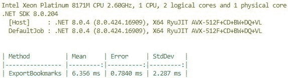
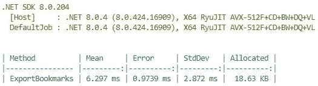
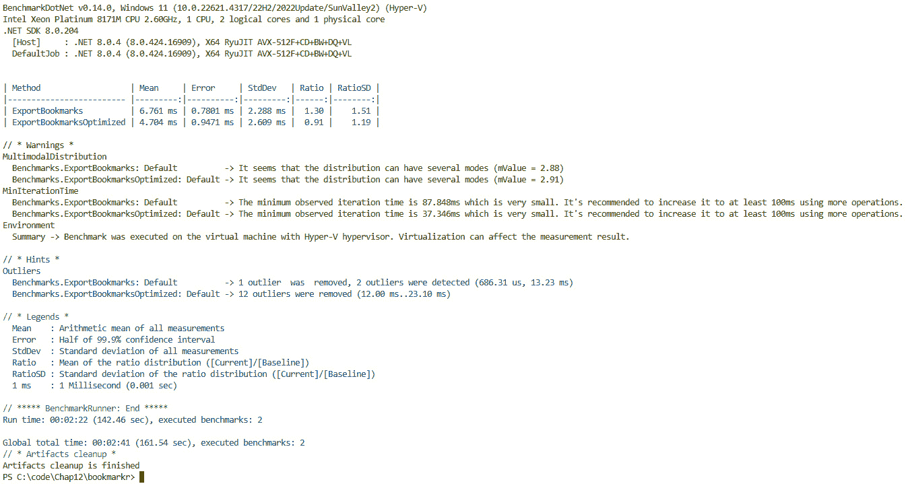

# 12

# 性能优化和调整

性能将使那些被使用和喜爱的应用程序与那些被卸载并被永远遗忘的应用程序区分开来。

仅有一个能够响应用户需求的应用程序是不够的。为了被频繁使用（并且很可能是每天使用），一个应用程序需要快速启动并执行任务。

这种速度和响应性直接影响到用户满意度，因为人们对数字体验的期望越来越高。研究表明，即使是加载时间或任务完成的小幅延迟也会显著降低用户参与度和整体满意度。

在本章中，我们将讨论可以提升性能的不同领域以及我们可以使用哪些技术来实现这一点。更具体地说，我们将涵盖以下内容：

+   需要考虑的不同领域以提升应用程序性能

+   如何对应用程序进行仪表化以识别性能问题

+   如何提升你的应用程序性能

# 技术要求

本章的代码可以在本书附带的 GitHub 仓库中找到，[`github.com/PacktPublishing/Building-CLI-Applications-with-C-Sharp-and-.NET/tree/main/Chapter12`](https://github.com/PacktPublishing/Building-CLI-Applications-with-C-Sharp-and-.NET/tree/main/Chapter12)。

# 性能优化领域

应用程序的性能并不仅仅是代码的问题。它是一系列在不同层面上进行的精细调整，有助于实现性能效率。

因此，性能优化发生在以下领域：

+   **应用程序设计和架构**：你必须走的路越长，到达目的地所需的时间就越长。正如我总是告诉我的客户，你可能跑得比我快两倍，但如果你的路是我路的两倍长，我们将在同一时间到达目的地。这里的观点是，如果你架构不够高效，那么使用高性能的框架和库是没有什么用的。我经常看到过度解耦的架构，有太多的跳跃和上下文切换，导致应用程序性能不佳且速度慢。关键是构建一个在性能和最佳解耦水平之间取得平衡的架构。从设计角度来看，我经常看到可以通过找到更短的路径来实现目标（从而产生更高效和性能更好的应用程序）的设计。当然，你不会对每一行代码都这样做，但你将希望将注意力集中在热点路径上，即用户经常使用的路径。对于一年只被一个用户使用一次的功能，优化其性能可能没有意义。你必须找到优化努力的成本（它需要时间，因此有成本）和从它期望得到的收益之间的平衡。

+   **基础设施**：如果我们托管应用程序在基础设施上，我们必须确保这个基础设施是高效的，并且已经优化以最大化应用程序的吞吐量同时最小化其延迟。然而，在 CLI 应用程序的上下文中，应用程序在用户的计算机上运行，所以我们可能会认为这里没有什么可做的，但我们会犯错误！我们可以执行一些调整任务，这将积极影响性能。例如，我们可以减少资源利用率，这样在用户的计算机上运行应用程序将消耗最少的资源，因此即使计算机同时运行其他应用程序或性能较弱，应用程序的执行也将是高效的。

+   **框架和库**：当然，使用高效且性能良好的框架和库有助于提高应用程序的性能。例如，.NET 的每个新版本都承诺更好的性能。因此，升级.NET 版本可以是我们提高应用程序性能的一种简单方法。同样适用于我们使用的库：一些库的性能比其他库更好。

+   **编码实践**：拼图的最后一块是编码实践。我们已经提到了热点和热点路径，但编码实践还包括使用最合适的数据结构。

在我们开始优化应用程序的性能之前，我们需要对其进行仪器化并识别其热点和热点路径。

# 仪器化.NET 应用程序

存在多个工具可以帮助我们为.NET 应用程序进行仪器化。这些工具之间的主要区别在于它们的作用范围。

尽管如此，仪器化的一个关键好处是能够检测内存泄漏并识别缓慢的代码路径。

仪器化可以在开发阶段实现，也可以在应用程序在生产环境中运行时持续进行。

| **开发时性能分析** | Visual Studio 诊断工具、`BenchmarkDotNet`、`dotTrace`、`dotMemory`和`PerfView`非常适合进行 CPU、内存泄漏和分配以及应用程序性能的性能分析。 |
| --- | --- |
| **生产时监控** | Azure Application Insights、AppDynamics 和 New Relic 有助于在生产环境中实时监控和诊断性能问题。 |

表 12.1 – 一些流行的仪器化工具

你可能已经注意到了术语*“性能分析”*和*“监控”*。它们之间存在一些关键区别：

+   性能分析提供了对应用程序性能的详细、细粒度视图，通常关注特定的代码部分或方法。这包括每个功能或方法的 CPU 使用情况、内存分配、执行时间和方法调用频率及持续时间。

+   监控通常在生产环境中进行，提供了应用程序健康状况的概述，随着时间的推移查看更广泛的性能趋势和运营数据，而不是专注于单个代码路径。这包括整个应用程序的 CPU 和内存使用情况，错误率（异常、失败），响应时间和吞吐量（例如，请求需要多长时间，每秒多少个请求），以及应用程序的资源使用情况（磁盘 I/O、网络使用等）。

由于 CLI 应用程序在用户的计算机上运行，可能更难对其进行监控。它需要用户授权以收集必要的数据，通常在频繁的时间间隔内进行。我们可能预期用户会拒绝共享遥测数据，因此监控可能无法进行。

虽然了解帮助我们进行应用程序度量的工具很重要，但同样重要的是要了解在哪里使用它们，换句话说，如何识别这些可能适合性能优化的区域。在这方面，能够识别热点和热路径非常重要。

## 热点与热路径

在本章中，我并不是第一次提到热点和热路径。然而，我还没有花时间解释它们。让我们立即解决这个问题！

**热点**是指代码中活动密集的区域，通常指的是频繁执行且消耗大量执行时间的方法。因此，热点代表了提高应用程序整体性能的潜在优化目标。

**热路径**指的是代码中频繁执行的执行路径，因此对应用程序的运行时间有**显著**的贡献。热路径可以帮助定位使用不充分的资源，例如内存使用和分配。

可能会出现的疑问是*“我们可以遵循什么流程来识别应用程序的热点和热路径？”*

## 识别应用程序的热点和热路径

幸运的是，识别应用程序的热点和热路径不必盲目进行。相反，我们可以遵循一个由三个步骤组成的结构化流程：分析、分析和优化。如果实现了监控，它将作为该过程的输入，因为此过程应定期执行，以确保应用程序的最佳性能。

以下表格描述了该过程：

| **步骤** | **要做什么** |
| --- | --- |

|

1.  分析和数据收集

|

+   使用性能分析器来收集应用程序执行的数据。例如，`BenchmarkDotNet`库可以收集关于 CPU 使用、内存消耗和执行时间的详细信息。

+   收集方法执行时间、资源使用和调用频率的指标，以识别性能瓶颈。

|

|

1.  分析和识别

|

+   分析分析器输出并找到：

    +   执行时间长的方法

    +   经常调用的方法

    +   高 CPU 或内存使用区域

    +   长时间运行的数据库查询或 I/O 操作

+   寻找数据中的模式，这些模式表明潜在的热点或热路径：

    +   消耗过多资源的函数

    +   经常执行且对总体运行时间贡献显著的执行路径

|

|

1.  优化

|

+   一旦确定了热点和热路径，就针对这些区域实施优化。

+   使用基准测试工具，如`BenchmarkDotNet`，来测量和比较优化前后的代码性能，以评估性能提升。您还可以测量和比较不同的实现，以确定最优的实现。

|

表 12.2 – 识别热点和热路径

我们提到`BenchmarkDotNet`可以帮助我们分析应用程序。那么，现在是时候学习如何使用它了。

## 使用 BenchmarkDotNet 分析 Bookmarkr

虽然`BenchmarkDotNet`被认为是一个基准测试库（即，它用于将不同的实现方案与基线进行比较，以确定哪个是最高效的），但如果我们有策略地使用它，它也可以识别我们代码中的热点和热路径。

让我们看看我们如何利用这个库来分析我们的 CLI 应用程序。

我们需要做的第一件事是引用`BenchmarkDotNet`库。这可以通过执行以下命令来实现：

```cs
dotnet add package BenchmarkDotNet
```

下一步是配置基准测试收集和报告。为此，让我们在`Main`方法的非常开始处添加以下代码块：

```cs
if(args.Length > 0 && args[0].ToLower() == "benchmark")
{
    BenchmarkRunner.Run<Benchmarks>();
    return 0;
}
```

这允许我们在执行应用程序并传递`benchmark`作为参数时运行基准测试。

这段代码所做的就是请求`BenchmarkDotNet`（通过`BenchmarkRunner`类）运行在`Benchmarks`类中找到的所有基准测试。

让我们创建那个`Benchmarks`类！

按照我们在前几章中定义的文件夹结构约定，我们将在其中创建一个`Benchmarks`文件夹，并在其中创建一个`Benchmarks.cs`文件。

我们可以选择将所有基准测试都放在一个单独的类中，或者为每个要基准测试的命令或服务创建一个基准测试类。在本章中，我们将采用第一种方法，因为我们只对`export`命令进行基准测试。

让我们添加我们的第一个基准测试方法。其代码如下所示：

```cs
public async Task ExportBookmarks()
{
    var exportCmd = new ExportCommand(_service!, "export", "Exports 
    all bookmarks to a file");
    var exportArgs = new string[] { "--file", "bookmarksbench.json" };
    await exportCmd.InvokeAsync(exportArgs);
}
```

此方法创建`ExportCommand`类的实例，并通过调用其`InvokeAsync`方法来执行它，传递命令所需的参数。

目前，这个方法还没有被`BenchmarkRunner`类视为基准测试。原因是，要使一个方法被视为基准测试，它需要用`[Benchmark]`属性进行装饰。让我们来修复这个问题！

```cs
[Benchmark]
public async Task ExportBookmarks()
{
    var exportCmd = new ExportCommand(_service!, "export", "Exports 
    all bookmarks to a file");
    var exportArgs = new string[] { "--file", "bookmarksbench.json" };
    await exportCmd.InvokeAsync(exportArgs);
}
```

太棒了！但我们还没有准备好运行它…

看看还缺少什么？

你明白了！`ExportCommand`类接受一个类型为`IBookmarkService`的实例作为参数，但我们迄今为止还没有提供这样一个对象的实例。

由于我们已经在 `Program` 类中定义了这样一个实例，您可能期望我们可以通过其构造函数将其传递给 `Benchmarks` 类，这将会是一个完全合理的假设。然而，`BenchmarkRunner` 类不允许我们这样做（至少在当前版本的 `BenchmarkDotNet` 中不允许）。

我们将采取的做法是直接在 `Benchmarks` 类中实例化此对象。然后代码将看起来像这样：

```cs
#region Properties
private IBookmarkService? _service;
#endregion
#region GlobalSetup
[GlobalSetup]
public void BenchmarksGlobalSetup()
{
    _service = new BookmarkService();
}
#endregion
```

注意，服务的实例化不是在类构造函数中进行的，而是在一个带有 `[GlobalSetup]` 属性的函数中进行的。这个特殊属性指示 `BenchmarkDotNet` 在执行每个基准方法之前调用此方法一次。这是为了确保每个基准方法都有一个干净的服务实例，从而防止之前基准测试的副作用。

全局设置与类构造函数

在计算基准测试方法执行时间时，不考虑 `[GlobalSetup]` 方法的执行时间，这与构造函数的执行时间不同。虽然这看起来可能微不足道，但如果该方法需要执行很多次，那么它就不会微不足道了。

我们现在可以执行基准测试了。

要做到这一点，我们首先需要构建应用程序，但这次我们需要在 `Release` 模式下构建它。否则，`BenchmarkDotNet` 将生成错误。原因是与在 `Release` 模式下运行程序相比，在 `Debug` 模式下运行程序不是最优的，并且与在 `Release` 模式下运行程序相比，性能成本显著。因此，在生产环境中运行应用程序时，应该以最佳性能模式运行应用程序。因此，在基准测试我们的应用程序时，我们应该在它的最佳性能模式下进行。

Debug 与 Release 模式

在 `Debug` 模式下构建代码会产生未优化的代码，带有完整的符号 `debug` 信息，这使得调试和设置断点更加容易。相比之下，`Release` 模式生成优化后的代码，以获得更好的性能和更小的文件大小。`Release` 构建通常省略 `debug` 符号、内联方法和应用各种优化，这些优化可能会使调试更具挑战性，但会导致更快的执行速度。虽然 `Debug` 构建非常适合开发和故障排除，但在部署到生产环境时通常使用 `Release` 构建。

要在 `Release` 模式下构建应用程序，可以输入以下命令：

```cs
dotnet build -c Release
```

我们然后通过输入以下命令来运行基准测试：

```cs
dotnet C:\code\Chap12\bookmarkr\bin\Release\net8.0\bookmarkr.dll benchmark
```

`C:\code\Chap12\bookmarkr\bin\Release\net8.0` 是 Bookmarkr 应用程序生成的 DLL 文件的位置。

结果如下：



图 12.1 – 导出命令的基准测试

基准测试方法已运行 98 次，平均每次运行 `export` 命令需要 6.356 毫秒，这并不算坏，对吧？

您可以在屏幕中间看到表格。该表格按基准方法编译指标。让我们解释一下每一列代表什么：

+   `Mean`：这代表基准测试方法在其所有执行中的平均持续时间（在我们的例子中是 98）。

+   `Error`：简单来说，这个值代表测量平均值精度的值。误差越小，平均值的测量越精确。例如，由于我们的平均值是 6.356 毫秒，误差是 0.7840 毫秒，所有测量值都在 6.356 毫秒 ± 0.7840 毫秒的范围内，这意味着在 5.572 毫秒和 7.140 毫秒之间。

+   `StdDev`：这个值代表所有测量的标准差。它量化了执行时间的变化或分散程度。换句话说，`StdDev`的值越低，表示执行时间越接近平均值。

基准测试不仅适用于命令！

虽然我们在这里对命令进行基准测试，但重要的是要注意，基准测试不仅适用于命令，而且适用于所有可能影响应用程序性能的代码工件，这包括服务。因此，通过基准测试命令*以及*它们使用的服务，我们可以确定执行时间和内存消耗中有多少可以归因于服务本身和命令。

太好了！然而，这里还有一个我们没有看到的测量值，那就是内存消耗的测量。让我们来解决这个问题！

要收集关于内存消耗的数据，我们只需在`Benchmarks`类顶部添加`[MemoryDiagnoser]`标签，如下所示：

```cs
[MemoryDiagnoser]
public class Benchmarks
{
    // …
}
```

现在，如果我们以完全相同的方式运行代码，我们会得到以下结果：



图 12.2 – 基准测试内存消耗

注意，现在我们有一个新的列叫做`Allocated`，它代表基准测试方法每次执行分配的内存量，以千字节为单位。这个列有两个有趣的原因：

+   这允许我们看到基准测试的方法是否使用了比预期多得多的内存。这可以表明我们的代码中存在需要进一步调查的内存泄漏。

+   当我们优化代码时，我们可以看到新的实现是否对内存消耗有影响。例如，我们可以提出一种实现，以牺牲显著的内存消耗为代价来加快执行时间。

执行时间与内存消耗优化

你可能想知道我们是否应该专注于优化内存消耗或执行时间。关于在哪里集中我们的注意力和精力，取决于我们最重视的是什么，内存消耗还是执行时间。值得注意的是，在某些情况下，我们甚至可能同时优化两者！为了做到这一点，我们必须提出一个创造性的实现，通过利用我们使用的框架和库的高级功能，结合高级和创造性的算法来解决这两个问题。

虽然 `BenchmarkDotNet` 帮助我们在开发阶段识别优化机会，但实施监控同样重要，这样我们才能在生产使用过程中持续检查应用程序的性能。

## 使用 Azure Application Insights 监控 BookmarkrSyncr

我们之前提到，命令行界面（CLI）应用程序在用户的计算机上本地运行，用户可能会拒绝我们收集对监控至关重要的遥测数据。这就是为什么我们不会在 Bookmarkr 中实现监控，而是在由 Bookmarkr 调用的外部网络服务 **BookmarkrSyncr** 中实现监控。由于这是一个由我们托管和管理的网络服务，我们可以实现监控并确保收集遥测数据，从而确保监控可以实施。

由于这个网络服务部署到了 **Microsoft Azure** 云平台，我们将依赖 Azure Application Insights，这是 Microsoft Azure 云平台提供的原生 **应用程序性能监控**（**APM**）解决方案。

当我们将 BookmarkrSyncr 部署到 Microsoft Azure 时，我们创建了一个托管它的基础设施。更具体地说，我们创建了一个 **Azure App Service** 实例。在创建此服务的过程中，我们有机会创建 **Azure Application Insights** 服务的实例。这项服务是由 Microsoft 提供和管理的监控解决方案。

Azure Application Insights 是一项出色的服务，它允许我们监控性能、可用性、失败的请求、异常、页面浏览量、跟踪、浏览器时间、使用情况（包括 **用户流程**，这使我们能够识别应用程序中的热点路径），甚至可以实时访问实时指标。**Azure Application Insights** 的另一个出色功能是能够配置警报，当某个指标达到某个阈值时触发，例如，如果服务器响应时间（衡量从接收 HTTP 请求到向客户端发送响应之间的持续时间）超过了我们组织标准定义的最大允许值。当警报被触发时，我们可以触发自动处理或通知（例如，向特定人群发送电子邮件）。

要了解使用 **Azure Application Insights** 的监控可能是什么样子，请查看（Microsoft Learn 上的这篇文章，可在 [`learn.microsoft.com/en-us/azure/azure-monitor/app/overview-dashboard`](https://learn.microsoft.com/en-us/azure/azure-monitor/app/overview-dashboard) 找到）。

好的。现在我们知道了如何识别应用程序中需要性能调优的区域（使用分析器和监控），让我们讨论一下我们可以用来提高应用程序性能的最常见技术。

# 常见的性能优化技术

值得注意的是，我们在这里讨论的技术不仅适用于 CLI 应用程序，而且可以应用于任何类型的应用程序。让我们根据我们之前提出的类别来分解这些技术。对于每个类别，我将为您提供一个常见技术的列表。

**应用程序设计和架构**：

+   建立实现目标的最短路径，移除所有不必要的中间环节。

+   这可以通过使用高效的算法来实现。

+   在解耦和低延迟之间找到最佳平衡。

+   对于不需要立即使用的资源，使用懒加载。

+   实现高效的错误处理和日志记录机制。

+   从一开始就设计可扩展性。

**基础设施**：

+   在打包和分发您的应用程序时，请以`Release`模式编译。虽然`Debug`模式在开发阶段很棒，但它可能会增加显著的性能开销。

+   此外，当打包和分发您的应用程序时，如果目标平台在事先已知或打包和分发机制不是跨平台的情况下，请将其编译为特定平台。例如，将我们的应用程序作为**Winget**包分发意味着它将仅用于 Windows 平台。同样，apt-get 包（其中应用程序将仅运行在**Linux**上）和**Homebrew**（其中应用程序将仅运行在**macOS**上）也是如此。因此，很容易知道应该使用哪种平台特定编译，这将使.NET 应用所有可能的优化，这是它如果目标平台事先未知（例如文件处理，它在 Windows、Linux 和 macOS 上有所不同）不会做的事情。这将导致一个在目标平台上以最有效方式运行的应用程序版本。

+   您还可以选择使用**AOT**（**提前编译**）来预编译您的代码为本地代码（而不是依赖于**JIT**），以实现更快的启动时间或减少对运行时编译的依赖。如果您针对的是移动（iOS/Android）或 WebAssembly 等环境，其中 JIT 可能不可行，这可能特别有用。请注意，平台目标化和 AOT 可以结合使用，以实现更好的性能优化。

**框架** **和库**：

+   除非绝对必要，否则避免使用依赖反射的库。

+   选择与您特定需求相匹配的轻量级框架和库。当您引用它们时，要警惕那些拉入大量其他库的库。

+   保持依赖项更新，以从性能改进中受益。

+   考虑使用适用于较小、专注任务的微框架。

**编码实践**：

+   在可能的情况下，依赖异步操作。这将避免阻塞主线程，并增加应用程序的响应感。

+   选择最适合追求目的的数据类型或数据结构。这将确保我们在计算机资源上占用最小的空间。

+   在可能的情况下，尽量以尽可能少的内存分配来完成一项任务。例如，在撰写本文时，.NET 9 已发布，并引入了通过调用 `AsSpan().Split(…)` 而不进行内存分配的分割操作。

+   实现缓存机制以避免对外部依赖（如 Web 服务或数据库）进行不必要的调用。

+   优化数据库查询并实现适当的索引。

+   说到数据库，如果你使用 `AsNoTracking()` 显著提高查询性能并减少内存使用，尤其是在处理大数据集或只读操作时。此方法告诉 ORM 不要跟踪检索到的实体的更改，绕过更改跟踪机制，从而实现更快查询和更低的内存开销。

+   使用连接池，它涉及重用已建立的数据库连接，而不是为每个请求创建一个新的连接。这是因为建立数据库连接可能很昂贵，因此连接池减少了连接延迟，并允许服务器实现高数据库吞吐量（每秒事务数）。

+   实现适当的内存管理并释放未使用的资源。

我们已经看到了许多常用的技术，这些技术可以用于优化任何使用任何技术栈构建的应用程序的性能，包括使用 .NET 构建的 CLI 应用程序。

现在，让我们应用一些这些技术来增强 Bookmarkr 的性能。

# 优化 Bookmarkr 的性能

我们不能优化已经完美的事物，对吧？

开个玩笑。当然我们可以！总有改进的空间。

让我们看看我们可以应用的一些快速胜利，以增强我们心爱的 CLI 应用程序的性能。

查看处理 `ExportCommand` 类的方法（即 `OnExportCommand`），我们可以看到它已经利用了异步操作。这是一个很好的开始，实际上也是我们之前描述的技术之一。

然而，处理方法可以进行优化。为了说明这一点，让我们创建 `ExportCommand` 类的副本并将其命名为 `ExportCommandOptimized`。让我们直接复制 `ExportCommand` 中的代码，我们将在稍后对其进行优化。

我们创建原始类的副本而不是直接优化它的原因是为了能够为优化版本添加基准方法，并与原始版本进行比较。

在 `ExportCommandOptimized` 类的处理方法中，让我们更改这两行代码：

```cs
string json = JsonSerializer.Serialize(bookmarks, new JsonSerializerOptions { WriteIndented = true });
await File.WriteAllTextAsync(outputfile.FullName, json, token);
```

将它们替换为以下两行：

```cs
using var fileStream = new FileStream(outputfile.FullName, FileMode.Create, FileAccess.Write, FileShare.None, 4096, true);
await JsonSerializer.SerializeAsync(fileStream, bookmarks, new JsonSerializerOptions { WriteIndented = true }, token);
```

让我们看看我们做了什么：

+   使用 `JsonSerializer.SerializeAsync` 对于大数据集来说更高效，因为它直接将 JSON 流式传输到文件中，而不需要在内存中保留整个序列化字符串。

+   使用`FileStream`和异步操作可以更好地控制文件 I/O 操作，并可以提高性能，特别是对于大文件。

好吧。让我们比较这个新实现和原始实现。

要做到这一点，让我们向`Benchmarks`类添加以下基准方法：

```cs
[Benchmark]
public async Task ExportBookmarksOptimized()
{
    var exportCmd = new ExportCommandOptimized(_service!, "export", 
    "Exports all bookmarks to a file");
    var exportArgs = new string[] { "--file", "bookmarksbench.json" };
    await exportCmd.InvokeAsync(exportArgs);
}
```

这个`benchmark`方法与上一个方法完全相同。嗯，几乎相同……唯一的区别是我们实例化（并调用）的是`ExportCommandOptimized`类，而不是`ExportCommand`类。

由于我们想要将新的、优化的实现与原始实现进行比较，我们将修改原始方法的`[Benchmark]`属性，使其看起来像这样。

这指示`BenchmarkDotNet`使用此方法作为比较的基线：

```cs
[Benchmark(Baseline = true)]
```

让我们重新构建应用程序（当然是在`Release`模式下）并执行基准测试。

结果如下：



图 12.3 – 将新实现与原始实现进行基准测试

注意出现了两个新的列：

+   `Ratio`: 这表示相对于基线基准方法的性能的平均度量

+   `RatioSD`: 这表示相对于基线基准方法的标准偏差的平均标准偏差

`Ratio`列中的`0.91`值表示优化后的实现（`ExportCommandOptimized`）平均比基线实现（`ExportCommand`）快 9%。我们之前提到，我们在`ExportCommandOptimized`中做出的实现特别适用于处理大文件。因此，我们可以预期，随着输出文件变大，它甚至会比基线实现更快。

太棒了！我们现在知道如何提高我们心爱的 CLI 应用程序的性能，并且让我们的用户感到满意。

# 摘要

在本章中，我们探讨了性能优化的各个领域，我们学习了识别性能热点和热点路径的技术，并看到了如何提高它们的性能，最终目标是向我们的用户提供一个他们喜欢使用的出色且高效的应用程序。

希望你已经理解了，没有单一的区域或行动会导致更好的性能，而是一系列在此处和彼处的微调才能达到效果。

太棒了！所以我们有一个高效提供出色功能的应用程序。

然而，当我们谈到构建 CLI 应用程序时（以及任何类型的应用程序），有一个关键领域我们还没有涉及。这个关键领域是**安全性**，这也是下一章的主题。

# 你的回合！

跟随提供的代码是一种通过实践学习的好方法。

一个更好的方法是挑战自己完成任务。因此，我挑战你通过添加以下功能来改进 Bookmarkr 应用程序。

## 任务 #1 – 编写更多基准测试

在本章中，我们通过仅编写`export`命令的基准来展示了编写基准方法。然而，正如我们之前提到的，基准不仅适用于命令，它们也可以适用于服务。

正因如此，你被分配了为每个命令以及由 Bookmarkr 应用程序使用的服务编写额外的基准方法。

## 任务 #2 – 优化 Bookmarkr 以获得最佳性能

在本章中，我们并没有实现每一个性能优化的机会，我们可能也错过了一些（这是故意的吗？*眨眼*）。因此，你被分配了在 Bookmarkr 中识别其他潜在的性能优化并实施它们。
