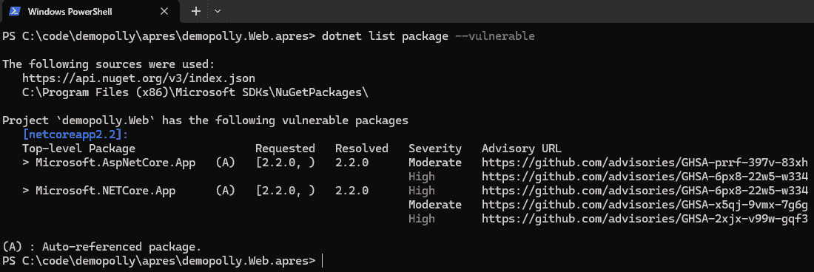
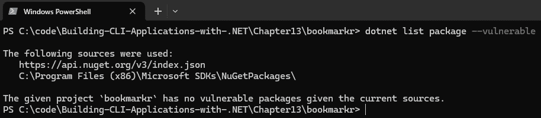
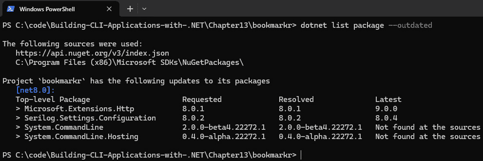
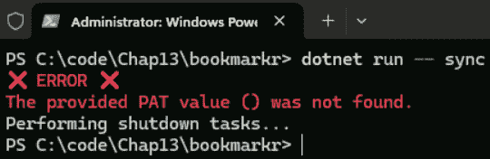
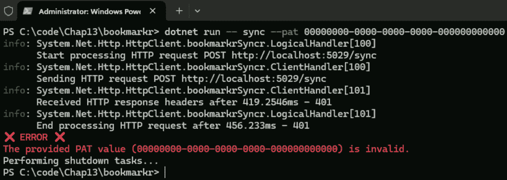
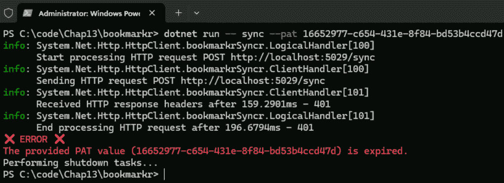
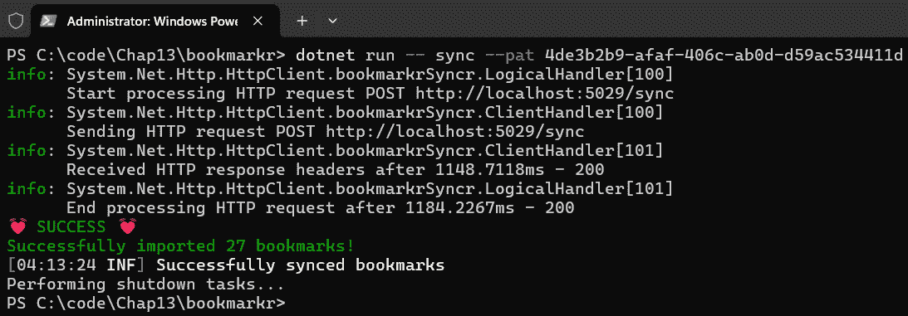

# 13

# CLI 应用程序的安全考虑因素

安全性是任何应用程序开发项目中最重要的关注点之一。有趣的是，在许多项目中，开发团队往往认为，由于他们实施了防止应用程序代码受到 SQL 注入、XSS 攻击或类似攻击的措施，他们的应用程序就是安全的。

然而，重要的是要记住，安全性具有不同的形式，覆盖不同的领域，这意味着它不仅关乎应用程序代码的安全性或其使用，还扩展到整个开发生命周期的安全性。

在本章中，我们将讨论这些不同领域以及它们如何与确保 CLI 应用程序的安全性相关，并涵盖您需要考虑的关键领域，以增强您的 CLI 应用程序和开发生命周期的安全性。更具体地说，我们将做以下几件事：

+   讨论应该考虑安全性的不同领域

+   学习如何评估 CLI 应用程序的安全状况

+   学习如何实现身份验证以确保用户数据的访问安全

# 技术要求

本章的代码可以在本书配套的 GitHub 仓库中找到，[`github.com/PacktPublishing/Building-CLI-Applications-with-C-Sharp-and-.NET/tree/main/Chapter13`](https://github.com/PacktPublishing/Building-CLI-Applications-with-C-Sharp-and-.NET/tree/main/Chapter13)

# 安全性领域

如前所述，安全性不仅限于应用程序代码，也不能仅通过实现身份验证来实现，尽管这些领域非常重要。

让我们先强调一下在整个生命周期中确保应用程序安全性的关键领域。我必须在这里强调（或提醒）这一点，因为我仍然遇到一些客户，他们在应用程序的生命周期中引入安全性太晚（通常是在应用程序开发并发布到生产之后），期望安全专家能够创造奇迹，以最小的或没有修改应用程序的方式确保应用程序的安全，这显然是不现实的。

总是要牢记，安全性应该贯穿应用程序的整个生命周期。具体来说，安全性应该从设计应用程序的早期阶段就成为一个关注点：

+   **在设计阶段**：定义安全需求和目标，并使用 STRIDE 等方法进行威胁建模，以识别潜在的安全风险，以便我们可以将适当的安全控制措施纳入初始设计，这是非常重要的。STRIDE 帮助将威胁分类为六个组：欺骗、篡改、否认、信息泄露、拒绝服务和权限提升。在识别威胁后，我们可以使用 DREAD 模型根据其损害潜力、可重复性、可利用性、受影响用户和可发现性进行定量评估和优先排序。在此阶段，我们还应考虑隐私和数据保护措施，如加密、身份验证和授权。

+   **在架构阶段**：我们在这里讨论的不仅仅是软件架构，还包括基础设施和网络架构。当然，我们需要设计一个包含深度防御策略并集成安全机制（如身份验证和授权）的安全架构。但我们还需要计划安全的通信通道和数据存储，使用诸如静态和传输中的加密以及网络分段等技术，以确保只有适当的通信路径、通过适当的网络地址、端口和域名，并使用适当的协议被允许。

+   **在开发阶段**：通过依赖编码标准，如实现输入验证和清理，并确保我们的应用程序不受常见的 OWASP Top 10 安全风险的影响，应用安全编码实践非常重要。同样重要的是，在代码审查期间也要应用安全编码实践。但这还不够！您应该使用安全的库和框架。换句话说，确保您的框架和库仍然受到支持并接收安全更新。由于我们在这里使用.NET 8，我们知道它仍然受到支持（并且将接收安全更新）直到 2026 年 11 月 10 日（我在 2024 年 11 月写下这些）。随着框架或库变得不再受支持，重要的是要计划迁移到较新版本（顺便说一下，不一定是最新的版本 😉）。

    假设我们的应用程序与外部依赖项进行通信，例如 Web 服务。在这种情况下，我们必须确保这些通信以安全的方式进行（通过利用身份验证和授权）并使用适当的协议（例如 HTTPS）。

+   **在基础设施配置阶段**：如果应用程序运行的基础设施不安全，那么所有提高应用程序安全性的努力都可能徒劳。在 CLI 应用程序的情况下，这些应用程序在用户的计算机上运行，责任通常委托给用户或其组织的 IT 部门，该部门通常控制员工的工作站。

+   **在测试阶段**：在测试阶段应进行特定于安全的测试，包括渗透测试和漏洞评估，以确保用户数据不会泄露，用户账户不会被破坏，并且应用程序不会被用于恶意活动。执行安全测试可以让我们验证是否满足安全要求。成熟的安全开发运营（DevSecOps）团队会定期进行此类测试。然而，安全测试至少应在将应用程序发布到生产之前进行。

+   **在部署阶段**：每个 DevSecOps 工程师都知道，如果你的 CI/CD 管道没有得到适当的安全保护，它可能成为安全威胁。秘密（如密码、API 密钥、服务连接、连接字符串等）应该保密。每个 CI/CD 工具都有自己的秘密管理机制，这通常以密钥库的形式出现，但我们也可以依赖为这些目的设计的工具，如 Azure Key Vault 或 HashiCorp Vault。对这些秘密的访问通常通过角色和权限进行限制。

+   **在应用程序使用期间**：对于不成熟的小组和组织来说，认为一旦应用程序发布到生产环境，安全工作就完成了，这是一个常见的错误。错误！这正是一切开始的地方。你可能认为我们在发布给用户之前投入了大量精力来确保应用程序的安全性，你是对的。然而，通过将我们的应用程序发布到野外，它将经历各种使用模式和用户环境，远远超出我们所能预期的、考虑的和计划的。因此，我们必须通过实施日志记录和审计机制，并定期更新和修补应用程序及其依赖项，来监控安全事件和异常。

+   `Destructure.ByMaskingProperties` 方法用于在记录日志时忽略一系列属性。

+   **随着新版本或错误修复的发布**：无论是引入新功能还是修复错误，对引入的更改进行安全影响分析都是非常重要的。这可以通过执行回归测试来完成，以确保现有的安全控制仍然满足要求，并且没有引入任何漏洞。

幸运的是，有各种各样的工具可以帮助我们完成每个阶段。如果你的团队或组织已经采用了 DevSecOps 文化，你将已经了解其中许多工具。

由于 DevSecOps 超出了本书的范围，我们不会讨论你可能在每一步使用的工具的广泛范围。然而，我想介绍一些可以帮助我们评估和增强 CLI 应用程序安全状态的工具。

# 评估 CLI 应用程序的安全状态

有多种工具可以帮助评估应用程序的安全状态（包括 CLI 应用程序）。在广泛使用的工具中，我们发现以下工具：

+   使用 `.csproj` 文件来检测第三方库中的漏洞。

+   **Snyk**：这个流行的工具为 .NET 项目提供漏洞报告和扫描。它可以集成到本地开发环境中，也可以集成到 CI/CD 管道中进行持续监控。

+   **Mend Bolt**：之前被称为 **WhiteSource Bolt**，这是一款安全扫描工具，可以与 **Azure DevOps** 或 **GitHub** 管道集成，扫描 .NET 项目中的开源漏洞并生成详细报告。

+   **OWASP Dependency-Check**：这个工具对于扫描第三方库和依赖项非常有效，这对于经常依赖外部包的 .NET 应用程序至关重要。

+   **GitHub Advanced Security**：这个工具将安全功能直接集成到 GitHub 或 Azure DevOps 工作流程中，执行代码扫描（它使用静态分析来检测潜在的安全漏洞和编码错误）和秘密扫描（它识别密码、API 密钥和其他秘密的模式，并检测它们是否以明文形式存储在存储库中），并执行依赖项审查并突出显示易受攻击的项。

这些工具的共同点是它们会告诉我们易受攻击的库，并为我们提供关于漏洞本身及其推荐修复的详细信息。

这些工具要么是免费的（例如 Mend Bolt 和 OWASP Dependency-Check），要么提供免费计划但功能有限（例如 SonarQube、Snyk 和 GitHub Advanced Security）。

它们在设置和配置的复杂性和所需努力方面也有所不同。因此，你会发现 SonarQube 设置最复杂，Snyk 设置中等容易，而 Mend Bolt、OWASP Dependency-Checker 和 GitHub Advanced Security 则是最容易设置的。

我建议从 Mend Bolt 开始，因为它作为 Azure DevOps 或 GitHub 的免费扩展提供，可以从它们各自的市场中获得。因此，这些工具通常是为组织或大型团队设计的。

然而，好消息是 .NET 已经为我们提供了一个现成的工具来评估和增强我们应用程序的安全状态。

这个工具通常被称为 dotnet-audit，它通过依赖 `GitHub Advisory Database` 来检测 .NET 项目依赖项（特别是 `NuGet` 包）中的漏洞。对于仅使用 .NET 的项目，例如 **Bookmarkr**，这个工具是完美的起点！

要执行此工具，我们只需输入以下命令：

```cs
dotnet list package --vulnerable
```

结果将在终端窗口中显示，看起来像这样：



图 13.1 – 列出易受攻击的包

如您在此图中可能已经注意到的，该命令并未在 Bookmarkr 的代码上执行，而是针对另一个应用程序。结果证明，我们对没有在 Bookmarkr 中检测到漏洞感到高兴（是的！），但随着时间的推移，随着引用库中漏洞的发现，这可能会发生变化。



图 13.2 – Bookmarkr 没有易受攻击的包

请记住，此命令可能要求您在执行之前运行`dotnet restore`。如果这是您第一次克隆 Git 仓库，这尤其正确。

另有一个命令不会直接扫描漏洞，但我推荐使用。此命令列出过时的包。虽然这些包可能没有已知的漏洞，但过时意味着它们将不再接收安全更新。我的建议是您考虑将这些包升级到较新的受支持版本（再次强调，如果这引入了破坏性更改，则不一定是最新版本）。

要运行此命令，只需键入以下内容：

```cs
dotnet list package --outdated
```

如您从执行此命令的结果中可以看到，尽管在 Bookmarkr 的依赖项中没有检测到漏洞，但其中一些已经过时：



图 13.3 – 列出过时的包

升级这些包的适当方式是创建一个新的分支，更新包，测试应用程序（如*第十章*中所述，使用手动和自动测试），以确保应用程序仍然按预期工作，并且我们没有引入回归，最后，提交一个拉取请求以将修改合并到`main`分支。

我们现在拥有必要的知识和工具来评估，并最终增强我们 CLI 应用程序的安全态势。让我们将注意力集中在保护我们的 CLI 应用程序与外部服务之间的通信上，以防止未经授权的访问并确保适当的管理用户。这可以通过身份验证来实现。

# 使用身份验证来保护远程通信

在*第九章*中，我们介绍了`sync`命令，它允许 Bookmarkr 将本地书签备份到远程位置，并在需要时检索它们。在执行此操作时，该命令还会同步本地和远程书签。

到目前为止，本地 CLI 应用程序与远程外部服务之间的通信一直是以不安全的方式进行。这意味着任何调用`sync`命令的人都可以检索您的个人书签，这显然不是您想要的，对吧？

为了解决这个问题，我们需要实现身份验证。

## 为什么身份验证很重要？

你可能想知道为什么在 CLI 应用程序的上下文中需要认证。毕竟，CLI 应用程序是在用户的计算机上运行的，这已经要求用户认证到他们的会话。

在 CLI 应用程序的上下文中，认证通常在与外部服务通信时（即向这些服务发送数据并从这些服务检索数据）是必需的。这确保了用户通过证明自己的身份，可以访问远程位置的数据。

## 如何进行认证

认证可以通过许多方式实现。最常见的一种是外部服务提供商为你提供一个**个人访问令牌**（**PAT**）。通常，你可以通过访问服务提供商的网站并登录到你的账户来获取或生成这样的令牌。从那里，在你的账户设置页面，你应该能够获取该令牌或生成一个新的令牌。这样的令牌通常在给定的时间内有效，并在之后过期。

一旦你有了这个令牌，你就可以将其作为参数传递给执行对外部服务调用的命令。一个例子就是`sync`命令，它可以按照以下方式调用：

```cs
bookmarkr sync --pat YOUR_PAT
```

在这里，`YOUR_PAT`最常见的是一个 GUID 值。

这个调用将使用接收到的 PAT 值对用户进行认证，然后再执行同步操作。

正如你可能注意到的，这种方法可能会很快变得繁琐，因为记住 PAT 的值并不容易。因此，CLI 应用程序通常会将这样的值存储在本地配置文件中、环境变量中，或者操作系统的密钥库中。这使用户可以在不总是需要传递 PAT 作为参数的情况下调用命令。命令将足够智能，能够在本地配置文件或环境变量中查找它，并在存在时使用它。如果不存在，命令应显示错误消息，提示用户提供它。如果 PAT 无效或已过期，命令还应能够通知用户这一点。

这是 GitHub 采用的方法——例如：你可以在 GitHub 账户内创建一个个人访问令牌（PAT），然后你可以使用它来从外部服务或应用程序中认证和访问 GitHub 资源。在我们的用例中，外部服务是提供和管理令牌的那个，而 CLI 应用程序只负责将这些令牌发送到外部服务。

另一种常用的方法是使用 `auth` 对用户进行身份验证。调用此命令通常会触发默认网络浏览器并将用户重定向到应用程序提供者的登录页面。身份验证成功后，身份提供者提供访问权限和一个 ID 令牌，CLI 可以使用该令牌进行后续对外部服务的请求。这些令牌，就像 PAT 一样，通常在对外部服务进行请求时包含在 HTTP 头部中。这种方法利用了 `OAuth 2.0` 和 `OpenID Connect` 协议。

在本章的剩余部分，我们将探讨如何为 Bookmarkr 实现身份验证以保护与 **BookmarkrSyncr** 外部服务的通信。

# 实现身份验证

在这里，我们将利用 PAT 方法，因为它更方便，甚至可以在无法启动网络浏览器的环境中工作，例如 CI/CD 管道。

为了说明如何实现这一点，我们需要在两个级别上实现功能：

+   **BookmarkrSyncr**：外部服务将接收 PAT，验证它，如果有效则对用户进行身份验证

+   **Bookmarkr**：CLI 应用程序的责任是将令牌传递给外部服务并根据发送的请求的响应采取行动

让我们从将所需功能添加到 BookmarkrSyncr 开始。

## 使用 PAT 验证外部服务

为了简化问题，我们假设 BookmarkrSyncr（其代码可在 `AppendixB` 文件夹中找到）持有两个 PAT 令牌：一个有效的和一个已过期的。用户传递的所有其他值都将被视为无效，并将因此被拒绝。

令牌验证服务也将是一个非常基础的。

尽管大部分代码保持不变，但我们不得不对传递给 `MapPost` 方法的参数进行以下更改：

```cs
app.MapPost("/sync", async ([FromHeader(Name = "X-PAT")] string pat, List<Bookmark> bookmarks, ITokenValidator tokenValidator, HttpContext context) =>
{
     …
}
```

让我们来解释这些更改：

1.  我们指出 PAT 令牌的值来自名为 `X-PAT` 的 HTTP 头部，并且该值将存储在名为 `pat` 的输入参数中。

1.  我们传递一个类型为 `ITokenValidator` 的参数，这是一个我们创建的服务，用于检索和验证 PAT 令牌。

1.  我们传递当前的 HTTP 上下文，我们将需要为 HTTP 响应设置 HTTP 头部，特别是通知客户端收到的 PAT 令牌是无效或已过期的。我们使用不同的响应头部以确保客户端确切地知道请求为何未经授权，因为这是一种良好的编程实践。

然后，我们调用 `TokenValidator` 服务的相关方法来检查 PAT 令牌是否无效或已过期，如果是这样，我们在响应对象中设置适当的 HTTP 头部。代码如下：

```cs
// Ensure the Personal Access Token (PAT) is valid
if (!tokenValidator.IsValid(pat))
{
    context!.Response.Headers["X-Invalid-PAT"] = pat;
    return Results.Unauthorized();
}
// Ensure the Personal Access Token (PAT) is not expired
if (tokenValidator.IsExpired(pat))
{
    context!.Response.Headers["X-Expired-PAT"] = pat;
    return Results.Unauthorized();
}
```

注意我们是如何设置 HTTP 头部的。我们使用索引器语法。这将设置头部。如果头部已经存在，它将用新值替换现有值。

我们最后需要做的是注册 `TokenValidator` 服务。这可以通过使用这个广为人知的语法为任何服务完成：

```cs
builder.Services.AddScoped<ITokenValidator, TokenValidator>();
```

`TokenValidator` 服务非常基础，其代码如下所示：

```cs
public class TokenValidator : ITokenValidator
{
    private readonly List<PatToken> _tokens = new();
    public TokenValidator()
    {
        // we are simulating a token store here...
        _tokens.Add(new PatToken { Value = "4de3b2b9-afaf-406c-ab0d-
        d59ac534411d", IsExpired = false });
        _tokens.Add(new PatToken { Value = "16652977-c654-431e-8f84-
        bd53b4ccd47d", IsExpired = true });
    }
    public bool IsExpired(string token)
    {
        var retrievedToken = _tokens.FirstOrDefault(t => t.Value.
        Equals(token, StringComparison.OrdinalIgnoreCase));
        if(retrievedToken == null) return false;
        return retrievedToken.IsExpired;
    }
    public bool IsValid(string token)
    {
        var retrievedToken = _tokens.FirstOrDefault(t => t.Value.
        Equals(token, StringComparison.OrdinalIgnoreCase));
        return retrievedToken != null;
    }
}
```

值得注意的是，我们在这里模拟了一个令牌存储（在类的构造函数中）。在现实世界的场景中，我们会有一个持久的令牌存储（例如数据库）。但为了演示的目的，将这些 PAT 令牌存储在内存中使得代码更容易理解。我还想让你注意到，为了演示的目的，我们有两个令牌：一个是有效的令牌，另一个代表已过期的令牌。任何其他值都将被视为无效，因为它无法在令牌存储中找到（顺便说一句，这是现实的）。因此，客户端（CLI 应用程序）将根据令牌的有效性表现出不同的行为。

太棒了！现在我们已经准备好了外部服务，是时候更新客户端，使其能够传递 PAT。

## 将 PAT 从 CLI 应用程序传递到外部服务

为了实现这一点，我们需要修改 `sync` 命令和服务代理的代码。

更具体地说，我们需要做以下事情：

1.  在 `sync` 命令中添加一个 `--pat` 参数。

1.  修改 HTTP 客户端对外部服务发出的请求，以便发送 PAT 令牌。

1.  修改代码以将 PAT 令牌存储在环境变量中，并在调用 `sync` 命令时未指定 `--pat` 参数时从那里检索它。

让我们从第一步开始。

让我们转到 `SyncCommand.cs` 文件，在 `Options` 区域中，让我们添加一个用于 PAT 的 `Option`，如下所示：

```cs
private Option<string> patOption = new Option<string>(
    ["--pat", "-p"],
    "The PAT used to authenticate to BookmarkrSyncr"
);
```

如我们之前提到的，这个 `Option` 是可选的。

接下来，我们需要让命令使用这个 `Option`。为此，我们需要将此指令添加到类的构造函数中：

```cs
AddOption(patOption);
```

现在，让我们修改命令的处理方法，以便 HTTP 客户端可以向 BookmarkrSyncr 服务发送 PAT。为此，我们需要修改处理方法签名，将 PAT 作为参数传递，如下所示：

```cs
private async Task OnSyncCommand(string patValue)
{
    ...
}
```

再次回到类的构造函数，我们需要修改对 `SetHandler` 方法的调用，以便传递 PAT Option 作为参数。修改后的方法调用如下所示：

```cs
this.SetHandler(OnSyncCommand, patOption);
```

接下来，我们需要将此令牌传递给服务代理。为此，我们首先需要修改处理方法中对服务代理的调用，如下所示：

```cs
var mergedBookmarks = await _serviceAgent.Sync(patValue, retrievedBookmarks);
```

然后，我们需要更新 `BookmarkrSyncrServiceAgent` 类的代码，以确保在调用外部服务之前令牌的存在。

我们首先需要做的是，显然地，将 PAT 值作为参数传递给其 `Sync` 方法，如下所示：

```cs
public async Task<List<Bookmark>> Sync(string pat, List<Bookmark> localBookmarks)
```

之后，方法应该做的第一件事是确保 PAT 的存在（即确保我们没有向外部服务发送空或空值）。我们通过在方法开头添加以下代码来实现这一点：

```cs
// ensure that the pat is present
if(string.IsNullOrWhiteSpace(pat))
{
    string? value = Environment.GetEnvironmentVariable("BOOKMARKR_
    PAT");
    if(value == null) throw new PatNotFoundException(pat);
    pat = value;
}
```

在这里需要注意以下几点：

+   我们既不验证令牌，也不检查它是否已过期。这是 BookmarkrSyncr 外部服务的角色。

+   用于存储 PAT 令牌的环境变量名为 `BOOKMARKR_PAT`。这个名字确保这个变量不会与用户计算机上设置的任何其他变量冲突。

+   我们创建了一个自定义异常类 `PatNotFoundException`，以便在找不到 PAT 令牌时通知客户端。

现在，由于已经检索到 PAT 令牌，我们需要将其发送到外部服务。因此，我们需要修改 HTTP 客户端，以便在请求的 HTTP 标头中传递令牌，如下所示：

```cs
var client = _clientFactory.CreateClient("bookmarkrSyncr");
// Add the PAT to the request header
client.DefaultRequestHeaders.Add("X-PAT", pat);
var response = await client.PostAsync("sync", content);
```

如果对外部服务的请求成功，我们知道 PAT 令牌是有效的。如果它尚未存在于那里，我们将将其保存到环境变量中。因此，更新的代码如下：

```cs
if (response.IsSuccessStatusCode)
{
    // saving the PAT to the environment variable, if not already
    string? value = Environment.GetEnvironmentVariable("BOOKMARKR_
    PAT");
    if(value == null || !value.Equals(pat)) Environment.
    SetEnvironmentVariable("BOOKMARKR_PAT", pat);
    // remaining of the code
}
```

然而，如果 PAT 令牌无效或已过期，我们需要通知客户端，以便向用户显示适当的错误消息。因此，我们需要修改处理 `Unauthorized` 状态码的代码块，如下所示：

```cs
switch(response.StatusCode)
{
    case HttpStatusCode.Unauthorized:
        if (response.Headers.TryGetValues("X-Invalid-PAT", out var 
        headerValues))
            throw new PatInvalidException(pat);
        if (response.Headers.TryGetValues("X-Expired-PAT", out var 
        headerValues2))
            throw new PatExpiredException(pat);
        throw new HttpRequestException($"Unauthorized access: 
        {response.StatusCode}");
    // remaining of the code
}
```

这段代码简单易懂。不过，值得一提的是，我们在这里又创建了自定义异常类，即 `PatInvalidException` 和 `PatExpiredException`，以便在抛出它们时清楚地表达错误意图。这些异常类可以在 `BookmarkrSyncrServiceAgent` 文件夹中的 `Exceptions.cs` 文件中找到。

最后一步是回到 `SyncCommand` 类，处理服务代理的响应，并向用户显示适当的错误消息。为此，我们需要修改 `OnSyncCommand` 处理方法中的代码，以捕获之前描述的自定义异常。`catch` 块如下：

```cs
catch(PatNotFoundException ex)
{
    Helper.ShowErrorMessage([$"The provided PAT value ({ex.Pat}) was 
    not found."]);
}
catch(PatInvalidException ex)
{
    Helper.ShowErrorMessage([$"The provided PAT value ({ex.Pat}) is 
    invalid."]);
}
catch(PatExpiredException ex)
{
    Helper.ShowErrorMessage([$"The provided PAT value ({ex.Pat}) is 
    expired."]);
}
```

就这样 – 我们已经完成了 Bookmarkr 为确保通过 PAT（it was about time, right? 😉）与外部服务 BookmarkrSyncr 安全通信所需的所有代码修改。

让我们看看这行不行！

第一个测试是不传递 PAT 令牌调用 `sync` 命令。鉴于它不会在 `BOOKMARKR_PAT` 环境变量中找到，我们预期会看到以下错误：



图 13.4 – 未找到 PAT 令牌

第二个测试是使用无效的 PAT 令牌调用 `sync` 命令。这里也预期会看到一个错误消息：



图 13.5 – PAT 令牌无效

下一个测试是使用过期的 PAT 令牌调用 `sync` 命令。这里也预期会看到一个错误消息：



图 13.6 – PAT 令牌已过期

最后的测试是使用有效的 PAT 令牌调用 `sync` 命令。我们可以看到书签已经同步，并且 PAT 令牌已保存到 `BOOKMARKR_PAT` 环境变量中：



图 13.7 – PAT 令牌有效

太棒了！我们现在已经知道所有需要了解的知识和技能来评估和增强我们的 CLI 应用程序的安全性。

# 摘要

在本章中，我们探讨了安全可以采取的各种形式，并了解到它不仅限于应用程序代码的安全性，而是涵盖了整个生命周期中的广泛领域。我们学习了我们可以使用哪些工具和技术来评估和增强我们的 CLI 应用程序的安全状况。我们还学习了如何通过实现身份验证和授权来保护用户数据的访问，尤其是在处理外部服务时。

恭喜！您现在拥有了构建、安全、测试、打包和发布您自己的 CLI 应用程序到世界上的所有必要知识和技能。看看你——你取得了多么大的成就。花点时间为自己感到自豪，并庆祝一下！

在这本书的每一页上，与您的旅程一起，我的旅程几乎结束了。但在您翻到最后一页并轻轻合上这本书的封面之前，我还有最后一件事想与您分享，那就是一个最后的章节，其目的是为您提供额外的学习材料，帮助您继续您的旅程，并指向一些有用的工具和库。

# 轮到你了！

按照提供的代码进行实践是学习的好方法。

更好的方法是挑战自己完成任务。因此，我挑战您通过添加以下功能来改进 Bookmarkr 应用程序。

## 任务 #1 – 更新依赖项版本

我们已经看到了如何列出已达到其支持结束的过时包，并讨论了更新这些包的重要性。然而，我还没有更新这些。

您的任务是将代码克隆到您的 GitHub 或 Azure DevOps 账户中，并更新它。

一旦依赖项已更新，您需要验证应用程序的行为是否受到影响，换句话说，您需要确保应用程序仍然按预期运行。这可以通过运行您之前开发的测试来完成。

## 任务 #2 – 使用 Mend Bolt 扫描代码中的漏洞

您的任务是将代码克隆到您的 GitHub 或 Azure DevOps 账户中，启用 Mend Bolt，并运行安全扫描。如果发现任何漏洞，请修复它！

## 任务 #3 – 允许 BookmarkrSyncr 管理多个用户

尽管我们更新了 BookmarkrSyncr 以接收和验证 PAT，但它并没有使用此令牌来检索和更新适当用户的数据。

您的任务是更新代码以实现这一点。最简单的方法是为每个与 PAT 值匹配名称的用户创建一个单独的 JSON 文件。因此，每个用户的书签都可以存储和检索于此。
