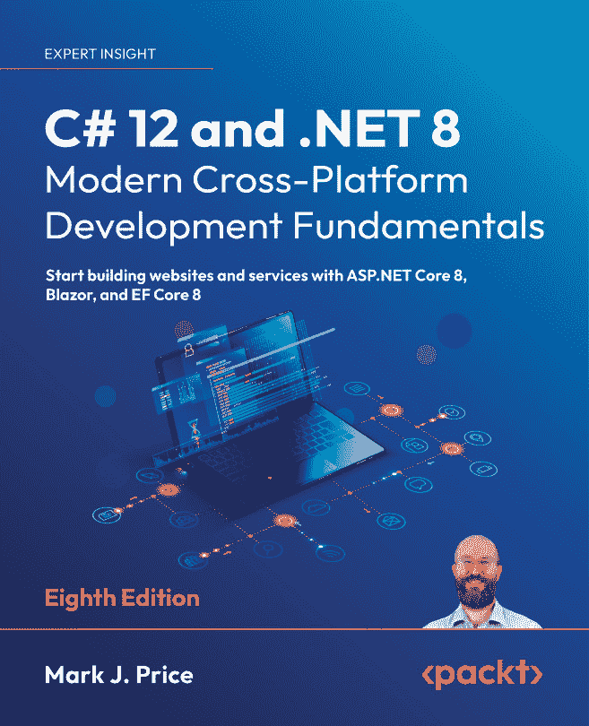
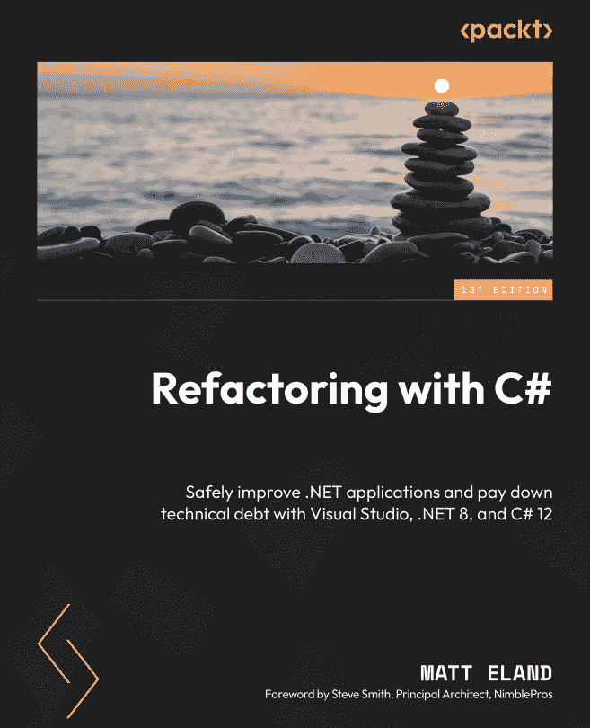
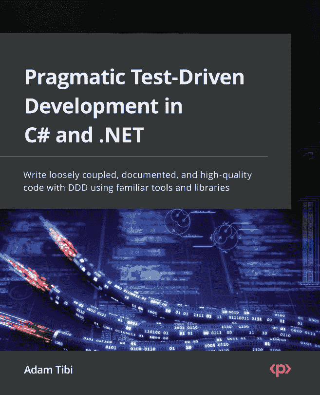
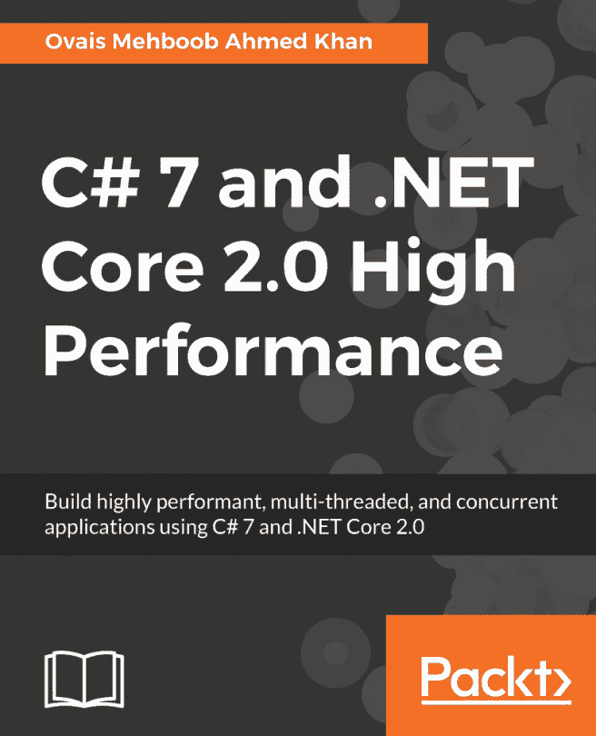

# 第十四章：其他资源和库

到目前为止，您已经拥有了开始构建出色的 CLI 应用程序所需的一切。在这本书的每一页中，我们都涵盖了每一步：设置您的开发环境、理解 CLI 应用程序的基础、开发 CLI 应用程序——从基本概念到最先进的概念、测试、安全性、性能优化，最后是打包和部署。

然而，在开发您的 CLI 应用程序时，您可能会遇到需要加深在这些一个或多个领域技能的情况。您也可能遇到需要设计复杂功能或代码的情况。这些是每个开发者都会遇到的情况，无论他们构建什么类型的应用程序，您也不例外。

正因如此，我设计了最后一章：为您提供在这些情况下的指导，以免您迷失方向。在需要指导时，请将其作为参考。

# 进一步阅读和资源

虽然在网上有很多很有趣的内容可以阅读，但我将提到一些 Packt Publishing 收集中我发现特别有用的书籍。

## 《C# 12 和 .NET 8》，作者：Mark J. Price

如果您正在学习 .NET，不可能不推荐 Mark J. Price 的书。这本书涵盖了您需要了解的所有关于 .NET 开发的内容。此外，Mark 还会随着每个新的 .NET 版本更新他的书。截至写作时，最新版本是涵盖 .NET 8 的版本。

要了解更多关于这本书的信息，请访问 [`www.packtpub.com/en-ca/product/c-12-and-net-8-modern-cross-platform-development-fundamentals-9781837635870`](https://www.packtpub.com/en-ca/product/c-12-and-net-8-modern-cross-platform-development-fundamentals-9781837635870)。

## 《使用 C# 进行重构》，作者：Matt Eland

当您构建 CLI 应用程序时，您很可能会遇到现有的代码，并且可能需要对其进行重构以提高其安全性和性能。在这种情况下，您会很高兴拥有这本书。

通过阅读这本书，您将学习到许多利用最新 C# 特性的重构技术。您还将了解如何利用 AI 助手，如 GitHub Copilot Chat，来帮助您进行重构、测试和文档编写。

要了解更多关于这本书的信息，请访问 [`www.packtpub.com/en-ca/product/refactoring-with-c-9781835089989`](https://www.packtpub.com/en-ca/product/refactoring-with-c-9781835089989)。

## 《C# 和 .NET 的实用测试驱动开发》，作者：Adam Tibi

如果你不实施自动化测试，你根本无法保证应用程序的质量。虽然你可以不依赖**测试驱动开发（TDD**）来实施自动化测试，正如我经常在每个教授这个主题的课堂上所说的：“自动化测试确保你的代码执行它被设计要执行的任务，而 TDD 确保你的代码执行你的业务需求所声明的任务。”这总结了简单自动化测试和 TDD 实践之间的区别。

本书不仅涵盖了你在应用程序中实现单元测试（包括模拟外部依赖项）所需了解的内容，还涵盖了集成 TDD 实践。

要了解更多关于这本书的信息，请访问[`www.packtpub.com/en-ca/product/pragmatic-test-driven-development-in-c-and-net-9781803230191`](https://www.packtpub.com/en-ca/product/pragmatic-test-driven-development-in-c-and-net-9781803230191)。

## 《C# 7 和.NET Core 2.0 高性能》，作者：Ovais Mehboob Ahmed Khan

尽管本书依赖于.NET 的较旧版本，但它所教授的概念和原则仍然有价值且适用。

通过阅读这本书，你将了解影响应用程序性能的常见陷阱。你还将学习如何测量应用程序的性能（整体上，但更重要的是在其热点路径上）。然后，你将学习设计和内存管理技术（包括异步编程、多线程和优化数据结构），这些技术将帮助你提高应用程序的性能。

要了解更多关于这本书的信息，请访问[`www.packtpub.com/en-ca/product/c-7-and-net-core-20-high-performance-9781788470049`](https://www.packtpub.com/en-ca/product/c-7-and-net-core-20-high-performance-9781788470049)。

这些阅读将使你对本书涵盖的各个主题有更深入的知识和理解。

然而，你会发现，在许多情况下，已经存在一个库可以满足你想要实现的功能。你应该考虑使用这样的库。

我在这里特意强调“应该”。我的观点是，你不必使用任何库，但至少在分析它并决定它不符合你的需求后，你应该有意识地忽略它。

通过依赖现有的库，你可以避免编写额外的代码、维护它以及测试它。你只需将其作为实现目标的一种快速方式。

如果你已经开发了一段时间，你很可能遇到过一些你认为有用并且反复在项目中使用的库。在下一节中，我将与你分享我在旅途中发现的一些库（以及我使用过的）。

# CLI 应用程序开发的实用库

有很多有用的库，本节并不打算列出它们全部（那样需要一本百科全书了😉）。此外，这里列出的也绝不是最好的。它们是我沿途发现并经常使用的。这些库与我们在这本书的各页中已经使用的库相加。

## Polly

`Polly` 是一个弹性和暂态故障处理的库。对于 CLI 应用程序，它可以帮助管理在与外部服务或数据库交互时出现的网络故障、超时和其他暂态错误。这确保了您的 CLI 应用程序即使在不可靠的环境中也能保持稳健和响应。

要了解更多关于 `Polly` 的信息，请访问 [`github.com/App-vNext/Polly`](https://github.com/App-vNext/Polly)。

## HangFire

`HangFire` 是一个不依赖于 Windows 服务或单独进程的后台作业处理库。在 CLI 应用程序中，它可以用于异步地安排和执行长时间运行的任务。这允许您的 CLI 应用程序在不阻塞主执行线程的情况下处理耗时操作。

要了解更多关于 `HangFire` 的信息，请访问 [`github.com/HangfireIO/Hangfire`](https://github.com/HangfireIO/Hangfire)。

## StackExchange.Redis

`StackExchange.Redis` 是一个高性能的 Redis 客户端。虽然主要用于 Web 应用程序，但它对需要缓存或需要与 Redis 数据库进行数据存储或检索的 CLI 应用程序非常有用。这允许您的 CLI 应用程序从外部服务检索数据并将其本地缓存，从而减少对网络连接的依赖，同时提高应用程序的整体性能。

要了解更多关于 `StackExchange.Redis` 的信息，请访问 [`github.com/StackExchange/StackExchange.Redis`](https://github.com/StackExchange/StackExchange.Redis)。

## MediatR

`MediatR` 实现了中介者模式，这有助于简化并解耦 CLI 应用程序中组件之间的通信。它特别适用于组织命令处理和实现复杂的工作流程。

要了解更多关于 `MediatR` 的信息，请访问 [`github.com/jbogard/MediatR`](https://github.com/jbogard/MediatR)。

## MassTransit

`MassTransit` 是一个分布式应用程序框架。对于需要与消息队列交互或实现事件驱动架构的 CLI 应用程序非常有用。为此，`MassTransit` 使得创建利用基于消息的、松散耦合的异步通信的应用程序和服务变得容易，从而提高了可用性、可靠性和可伸缩性。

要了解更多关于 `MassTransit` 的信息，请访问 [`github.com/MassTransit/MassTransit`](https://github.com/MassTransit/MassTransit)。

## BenchmarkDotNet

`BenchmarkDotNet`是一个强大的基准测试库。它对于需要测量和优化性能的命令行应用程序来说极其有用，它允许你识别应用程序中最慢的路径，比较不同的实现，并做出基于数据的决策。

要了解更多关于`BenchmarkDotNet`的信息，请访问[`github.com/dotnet/BenchmarkDotNet`](https://github.com/dotnet/BenchmarkDotNet)。

## Portable.BouncyCastle

`BouncyCastle`是一个加密库。它允许你使用不同的设置生成随机密码，以满足 OWASP 的要求。对于命令行应用程序来说，当你想要为用户账户生成默认密码或一次性密码（例如，用于访问加密文件）时，这可能很有用。

要了解更多关于`BouncyCastle`的信息，请访问[`github.com/novotnyllc/bc-csharp`](https://github.com/novotnyllc/bc-csharp)。

## NSubstitute

`NSubstitute`是一个用于单元测试的模拟框架。它在执行单元测试时模拟外部依赖项时非常有用。

要了解更多关于`NSubstitute`的信息，请访问[`github.com/nsubstitute/NSubstitute`](https://github.com/nsubstitute/NSubstitute)。

## AutoFixture

`AutoFixture`是一个.NET 开源库，它通过自动化测试数据生成过程，帮助开发者通过简化编写和维护单元测试的过程来编写可维护的单元测试。它与流行的测试框架（如 MS Test、NUnit 和 xUnit）以及流行的模拟框架（如 NSubstitute 和 Moq）集成。

要了解更多关于`AutoFixture`的信息，请访问[`github.com/AutoFixture/AutoFixture`](https://github.com/AutoFixture/AutoFixture)。

## RichardSzalay.MockHttp

`MockHttp`是 Microsoft 的`HttpClient`类的测试层。它允许为匹配的 HTTP 请求配置模拟响应，并且可以在不实际执行网络调用的情况下测试你的应用程序的服务层。在测试阶段，它对于模拟 CLI 应用程序可能依赖的外部 API 和服务的调用非常有用。

要了解更多关于`MockHttp`的信息，请访问[`github.com/richardszalay/mockhttp`](https://github.com/richardszalay/mockhttp)。

# 摘要

在这些阅读材料和图书馆的帮助下，你可以将你的命令行应用程序提升到下一个层次，并构建一些相当令人印象深刻且实用的应用程序。我迫不及待地想看看你会创造出什么。不要犹豫，让我知道你的想法。

还有一件事：这个列表不是一成不变的。它是活生生的，你应该保持它的活力。如何做到？通过不断地回顾和更新它，随着技术和趋势的发展。我将这个任务传给了你。

# 你的回合！

跟随提供的代码是一种通过实践学习的好方法。

一个更好的方法是挑战自己完成任务。因此，我挑战你通过添加以下功能来改进**Bookmarkr**应用程序。

## 任务 #1 – 为 Bookmarkr 列出附加功能

这时，我将向你介绍**Bookmarkr**，让你可以将其变成你自己的。

我在挑战你列出一些你希望在**Bookmarkr**中拥有的额外功能。你可以将它们作为功能请求添加到 GitHub 上，这样你或者其他人就可以实现它们。

## 任务 #2 – 列出实现功能所需的技能和库

一旦你决定了想要实现的功能，首先列出你需要用到的技能和库。这一步的目的是为了避免重新发明轮子，而是利用现有的资源，并利用它们来实现新的目标。

记住：你的用户对你的编码技能不感兴趣（他们甚至看不到代码）。他们感兴趣的是你的（命令行界面）应用程序为他们带来的价值。
