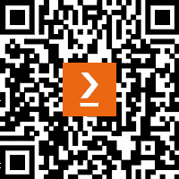

# 前言

我从.NET 的初期就开始从事.NET 应用的开发工作。我认为我在这几年中几乎使用过所有可能的.NET 工具，无论是前端还是后端，无论是好是坏！这包括为处理设施提供培训工具、构建远程监控工具以及开发优化解决方案——所有这些都是在.NET 上完成的！

在这本书中，我结合了我在过去 20 年中参与过的许多项目中的经验，希望为读者提供一个有趣且富有信息性的视角，了解如何使用.NET 构建现代**软件即服务**（**SaaS**）应用。

这本书旨在详细阐述并揭开使用.NET 和 Microsoft 技术栈构建 SaaS 应用的世界，并旨在提供构建、测试、部署和维护现代 SaaS 应用所需的技术知识。我们首先介绍我们将使用的技术，并通过一个演示应用来展示它。随着我们继续阅读本书，我们将添加更多的工具和技术，直到我们描述并演示了构建 SaaS 应用所需的所有主要主题。

在阅读这本书的过程中，你将学习到开发现代 SaaS 应用所需的工具、技术和最佳实践，这些应用将给你的用户留下深刻印象并为你的企业提供价值。我们涵盖了整个技术栈，从数据库到**用户界面**（**UI**），然后继续到在生产环境中部署和维护应用。

我试图让这本书对每个人都是可访问的。为此，我专门使用了免费和开源的工具，并尝试通过将新主题与核心原则联系起来，尽可能减少假设知识来介绍新主题。在可能的情况下，我用实际示例来阐述理论。

到这本书结束时，你将对所需的理论有全面的理解，并且将通过实际示例探索其中很多内容。你应该已经准备好交付你的第一个真实世界的 SaaS 应用了！

我希望这本书不仅能让你感到教育性和信息性，还能让你觉得有趣。我也非常希望这本书中的学习内容能帮助你事业发展以及在所有未来的努力中！

# 这本书面向的对象

这本书的目标是面向任何想要构建 SaaS 应用并希望使用 Microsoft 技术栈来构建它的人！然而，SaaS 开发是一个相对高级的话题，这是不争的事实。如果你对 C#和.NET 有扎实的知识，这将大有裨益。同时，对数据库和 Web 开发有实际了解也将非常有用。

尽管本书涵盖了高级主题，但如果你仍然是一个初学者，请不要气馁！在本书中，即使是更高级的主题也是以易于理解的方式介绍和解释的，并且通常以示例为基础，这样每个人都可以学到一些东西——无论技能水平如何！

# 本书涵盖的内容

*第一章**，我们所有人都需要的现代分销模型*，简要介绍了 SaaS 的历史，并介绍了本书中将使用的技术。

*第二章**，构建一个简单的演示应用程序*，深入探讨了本书将关注的技术，并构建了一个我们可以随着学习过程逐步添加的骨架应用程序。

*第三章**，什么是多租户，为什么它在 SaaS 应用程序中很重要？*，涵盖了多租户，特别关注 SaaS 应用程序。我们在*第二章*的示例中添加了多租户。

*第四章**，构建数据库和为数据丰富的应用程序规划*，专注于数据库，特别是使用 SQL Server 和 Entity Framework 进行构建。

*第五章**，构建 RESTful API*，在数据库层所涵盖的内容基础上，通过添加 API 使数据可以通过 HTTP 进行访问。除了构建示例应用程序外，本章还深入探讨了 RESTful API 背后的理论。

*第六章**，SaaS 应用程序的微服务*，探讨了微服务和 SaaS，这两者是相辅相成的。本章涵盖了构建微服务应用程序的理论和实践，并将一些学习成果应用于演示应用程序。

*第七章**，构建用户界面*，解释了为什么 UI 是 SaaS 拼图中非常重要的一部分。本章涵盖了理论，并使用 Blazor 为演示应用程序添加了 UI。

*第八章**，身份验证和授权*，涵盖了向 SaaS 应用程序添加身份验证和授权的复杂主题。特别提到了在处理多租户和微服务应用程序时遇到的挑战。

*第九章**，SaaS 应用程序的测试策略*，解释了在构建 SaaS 应用程序时测试的重要性。在本章中，我们探讨了测试的如何和为什么，包括单元测试、集成测试和端到端测试。

*第十章**，监控和日志记录*，阐述了如果没有这两个既相互独立又相关的概念，在生产应用程序中识别和解决问题可能会非常具有挑战性。本章涵盖了这两个主题，并提供了关于使用哪些工具和技术的一些建议。

*第十一章**，频繁发布，尽早发布*，介绍了使用**持续集成/持续部署**（**CI/CD**）管道以管理方式构建和发布应用程序的过程。

*第十二章**，成长之痛 - 规模化运营*，讨论了随着 SaaS 应用程序开始增长并获得用户，开发团队必须面对和解决的一系列全新问题。本章涵盖了这些挑战，并提供了如何解决这些问题的指导。

*第十三章**，收尾工作*，回顾了本书中涵盖的内容，并探讨了读者如何部署他们新获得的 SaaS 知识！

# 为了充分利用本书

本书旨在尽可能地为任何想要进入构建 SaaS 应用程序领域的人提供便利。尽管如此，SaaS 是一个复杂且高级的主题，因此对以下内容的良好了解将有所帮助：

+   使用 C#进行.NET 应用程序开发

+   SQL Server 和 Entity Framework

+   通用 Web 开发

+   对 Docker 的一些了解可能有用，但不是必需的

然而，我希望任何在软件行业工作或仍在学习技艺的人都能阅读这本书，并提高他们的理解！

以下工具和技术将在本书中广泛使用：

| 本书涵盖的**软件/硬件** | **操作系统要求** |
| --- | --- |
| Visual Studio Code | Windows、macOS 或 Linux |
| Docker Desktop | Windows、macOS 或 Linux |
| .NET v7 | Windows、macOS 或 Linux |
| Entity Framework | Windows、macOS 或 Linux |
| Blazor | Windows、macOS 或 Linux |
| SQL Server | Windows、macOS 或 Linux |

所有初始设置说明都包含在*第二章*中。在阅读本书的过程中，任何进一步的设置都会根据需要详细说明。

**如果您正在使用本书的数字版，我们建议您亲自输入代码或从本书的 GitHub 仓库（下一节中提供链接）获取代码。这样做将帮助您避免与代码的复制和粘贴相关的任何潜在错误。**

# 下载示例代码文件

您可以从 GitHub 下载本书的示例代码文件：[`github.com/PacktPublishing/Building-Modern-SaaS-Applications-with-C-and-.NET`](https://github.com/PacktPublishing/Building-Modern-SaaS-Applications-with-C-and-.NET)。如果代码有更新，它将在 GitHub 仓库中更新。

我们还提供了来自我们丰富的图书和视频目录中的其他代码包，可在[`github.com/PacktPublishing/`](https://github.com/PacktPublishing/)找到。查看它们吧！

# 下载彩色图像

我们还提供了一份包含本书中使用的截图和图表彩色图像的 PDF 文件。您可以从这里下载：[`packt.link/IOZxh`](https://packt.link/IOZxh)。

# 使用的约定

本书中使用了多种文本约定。

`文本中的代码`：表示文本中的代码单词、数据库表名、文件夹名、文件名、文件扩展名、路径名、虚拟 URL、用户输入和 Twitter 昵称。以下是一个示例：“`Up`方法在数据库中创建表，而`Down`方法删除表。这被转换成 SQL 代码，当发出`数据库更新`命令时，该代码会被发送到数据库引擎。”

代码块设置如下：

```cs
[HttpPut("{id}")]
public async Task<IActionResult> UpdateAsync(int id, UpdateHabitDto request)
{
    var habit = await _habitService.UpdateById(id, request);
    if (habit == null)
    {
        return NotFound();
    }
    return Ok(habit);
}
```

小贴士或重要注意事项

它看起来像这样。

**粗体**：表示新术语、重要单词或您在屏幕上看到的单词。例如，菜单或对话框中的单词以**粗体**显示。以下是一个示例：“Sara 点击了列表下方的**添加新**按钮。”

# 联系我们

我们始终欢迎读者的反馈。

**一般反馈**：如果您对本书的任何方面有疑问，请通过电子邮件发送至 customercare@packtpub.com，并在邮件主题中提及书名。

**勘误表**：尽管我们已经尽最大努力确保内容的准确性，但错误仍然可能发生。如果您在这本书中发现了错误，如果您能向我们报告，我们将不胜感激。请访问[www.packtpub.com/support/errata](http://www.packtpub.com/support/errata)并填写表格。

**盗版**：如果您在互联网上以任何形式发现我们作品的非法副本，如果您能向我们提供位置地址或网站名称，我们将不胜感激。请通过电子邮件发送至 copyright@packt.com 并提供材料的链接。

**如果您有兴趣成为作者**：如果您在某个领域有专业知识，并且您有兴趣撰写或为书籍做出贡献，请访问[authors.packtpub.com](http://authors.packtpub.com)。

# 分享您的想法

一旦您阅读了《使用 C#和.NET 构建现代 SaaS 应用程序》，我们很乐意听听您的想法！[请点击此处直接进入此书的亚马逊评论页面并分享您的反馈](https://packt.link/r/1-804-61087-9)。

您的评论对我们和科技社区非常重要，并将帮助我们确保我们提供高质量的内容。

# 下载此书的免费 PDF 副本

感谢您购买此书！

您喜欢在路上阅读，但又无法携带您的印刷书籍到处走？

您的电子书购买是否与您选择的设备不兼容？

不必担心，现在每本 Packt 书籍都附赠一本无 DRM 的 PDF 版本，无需额外费用。

在任何地方、任何设备上阅读。直接从您最喜欢的技术书籍中搜索、复制和粘贴代码到您的应用程序中。

优惠不会就此停止，您还可以获得独家折扣、时事通讯和每日免费内容的每日电子邮件。

按照以下简单步骤获取好处：

1.  扫描下面的二维码或访问以下链接



[`packt.link/free-ebook/9781804610879`](https://packt.link/free-ebook/9781804610879)

1.  提交您的购买证明

1.  就这些！我们将直接将您的免费 PDF 和其他福利发送到您的邮箱

# 第一部分：入门

本节首先介绍了**软件即服务**（**SaaS**）的历史，并介绍了我们将在此书中逐步构建的演示应用程序。

本节包含以下章节：

+   *第一章*，*我们都需要的现代分销模式*

+   *第二章*，*构建一个简单的演示应用程序*
