# 2

# 构建一个简单的演示应用

在本章节中，我们将构建一个非常简单的演示应用，这将成为我们在后续章节中构建的 SaaS 应用的基础和框架。本章节的目的是让你熟悉我们将在本书的后续部分以及作为 SaaS 应用构建者职业生涯中利用的所有工具和技术！一旦我们有了这个基础知识和框架应用，开始构建更复杂的功能将会容易得多。

在我们开始构建框架应用之前，我们必须首先发现并安装我们将要使用的工具。然后，我们将构建骨架应用。一旦这个应用开始工作，我们再开始考虑将这个应用扩展成一个真正的 SaaS 应用所需的内容！

本章节将简要介绍许多不同的技术。请不要感到不知所措！我们将从头开始配置一个开发环境，使用 Docker，然后初始化数据库、API 和 UI。

本章节使用了许多不同的技术，其中一些你可能不熟悉。不用担心！本章节中所有内容都写得非常详细，任何在本章节中快速跳过的内容都将在后续章节中详细解释。

开发 SaaS 应用，几乎可以说是定义上就需要广泛的不同技术。在本章节中，我们将快速浏览它们，然后在后续章节中深入我们的知识和理解！

本章节涵盖了以下主要主题：

+   准备工作 - 安装工具

+   构建一个简单的示例应用

+   我们接下来该做什么？

到本章节结束时，你将已经构建、安装和配置了你的开发环境，并且初始化了构建 SaaS 应用所需的所有组件。希望你能在本章节结束时，对如何充分利用这些工具和技术感到启发！

# 技术要求

本章节的所有代码都可以在[`github.com/PacktPublishing/Building-Modern-SaaS-Applications-with-C-and-.NET/tree/main/Chapter-2`](https://github.com/PacktPublishing/Building-Modern-SaaS-Applications-with-C-and-.NET/tree/main/Chapter-2)找到。

# 设置

在本节中，我们将介绍我推荐用于完成本书示例的工具。请注意，实际上并没有专门用于构建 SaaS 应用的特定工具——你可能会习惯的典型开发者工具就可以完成这项工作。然而，本书中我将提到一组特定的工具，因此在本节中我将描述它们，解释我的选择，并介绍如何安装和配置这些工具。

我相信任何流行的工具都完全可以满足需求，所以请不要觉得您**必须**选择我的选择，您可以自由使用您最舒适的方式！您应该能够将示例适应到您选择的工具中。

在您的机器上，只需安装两个工具即可跟随本书提供的代码：

+   Docker Desktop

+   Visual Studio Code

这些工具相当稳定，使用最新版本可能是最佳选择。为了参考，我正在使用 Docker v20.10.17 和 VS Code v1.71.2。

这些工具被特意选择，因为它们适用于所有操作系统，它们是免费使用的，并且将为我们在代码示例中工作的基础提供一致性。这些是我作为软件开发者在日常工作中发现最有用的两个工具！通常，在构建新的开发者机器时，我会首先安装这两个应用程序。

我将使用 Docker 的一个巧妙技巧来容器化整个开发者设置，这就是为什么这两个工具是您需要在机器上安装的唯一工具，也是我为什么有信心提供的示例可以在任何操作系统上工作。

## Visual Studio Code

Visual Studio Code 已经从全功能的 Visual Studio 应用程序的**轻量**版本转变为所有类型开发工作的绝对工作马。随着大量扩展的可用性，它可以配置为几乎任何编码任务，然后进一步修改以适应个人偏好。

VSCode 已经成为我众多不同项目的首选 IDE，但 SaaS 项目的真正优势在于它可以配置为支持将要构建的所有不同层。您可以添加用于数据库开发、API 开发和 UI 开发的扩展，并构建一个高度定制的开发者环境，该环境专门针对您的项目和您首选的工具。

首先，安装 Visual Studio Code。这可以通过点击此 URL 并遵循您选择的操作系统的说明来完成：[`code.visualstudio.com/download`](https://code.visualstudio.com/download)

当安装了 VSCode 后，您还需要安装几个扩展。

您需要为 VS Code 安装三个扩展：

+   远程容器

+   Remote WSL

+   Docker

所需扩展的标签如下：

```cs
ms-vscode-remote.remote-containers
ms-vscode-remote.remote-wsl
ms-azuretools.vscode-docker
```

当 VSCode 正确配置后，**扩展**面板应该看起来像这样：

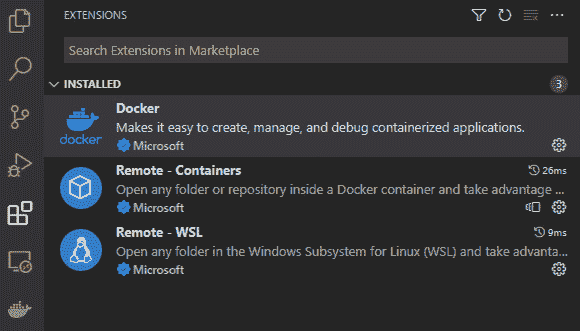

图 2.1 – 配置了扩展的 Visual Studio Code

我们将使用一些针对项目的其他特定扩展，但这些将在便于使用的开发容器中安装——关于这一点稍后会有更多介绍！

## Docker

Docker 是开发者工具箱中相对较新的补充，但它很快就成为了构建和部署应用程序不可或缺的工具。在最近几年，Docker 也成为了封装开发机器上所需的所有设置的不可思议的工具。

Docker 是一个容器化工具。其原理来源于货柜。货柜是标准尺寸的，这意味着移动它们以及在内港和船只上装载它们的机械在全球范围内是完全标准化的。当然，货柜里可以装任何东西，从汽车到黄瓜，但移动容器的基础设施是相同的。

这个原则适用于使用 Docker 打包的软件。任何要运行的软件工具都被放入一个 Docker 容器中——类似于一个货柜——然后使用 Docker 基础设施来运行这个容器。

你可以将容器视为一个微型的虚拟机，或者可能是它自己的可执行文件。重要的是要记住，任何被放入 Docker 容器中的代码、应用程序、服务等等，都可以在任何安装了 Docker 的计算机上运行。此外，它将以相同的方式（或不会）运行，无论主机操作系统是 Windows、Mac 还是 Linux。

这种容器概念对于运输运行中的软件来说非常棒。我现在可以拉取几乎任何我能想到的软件实用程序的 Docker 镜像，无论我在什么平台上工作，我都可以执行那个软件。

从软件供应商的角度来看，巨大的好处是，他们可以确信他们的代码在我的机器上能够正确运行，因为它是运行在一个标准平台上的——Docker！

你可能会想知道，当涉及到设置开发者环境时，这为什么很重要。

开发容器是一个相对较新但极其强大的概念，可以将 Docker 在运行应用程序时的所有功能应用到开发应用程序上。现在，可以配置整个开发环境——包括所有相关的依赖项——并将所有这些放入一个容器中！

这可能对更基础的项目来说不是最重要的，但 SaaS 应用程序很少是基础项目。

SaaS 应用程序的本质通常要求在每个开发者机器上安装许多特定项目的工具。更糟糕的是，通常需要特定版本的工具，这往往会使新团队成员的初始设置特别痛苦。这些工具可能包括以下内容：

+   数据库平台

+   一个框架，如.NET——通常有特定的版本要求

+   软件包管理，如 NPM 或 NuGet

+   前端某种类型的 Web 服务器

+   数量庞大的 CLI 工具

+   以及许多其他开发工具

如果你的开发团队支持多个项目——这种情况很常见——这可能会成为一个真正的痛点。

我会尽可能多地使用开发容器来封装依赖项，并在本书的示例中使用这项技术。

请注意，Docker 本身是一个庞大的主题，本书的范围不包括对其进行深入探讨。我将只介绍足够的内容，以便熟悉我使用的技术，并将更深入的探索留给读者自行完成！

## 开发容器

作为开发者，我们每个人都有自己每天工作中最喜欢的工具集。这将从我们选择的操作系统开始，然后我们将选择 IDE、数据库平台、前端框架以及所有相关的工具。

这么多系统、工具、平台和框架的多样性，对撰写如何构建 SaaS 平台书籍的作者来说是一个挑战...

为了使本书的教程尽可能吸引广泛的开发者，我将使用一个相对较新的概念，称为**开发容器**。这允许我们配置一个 Docker 容器来完成所有开发工作。这将为你提供一个一致的工作平台，并确保提供的所有示例在实际上任何机器上都能运行。

利用开发容器，我们可以获得一个完全一致的开发平台来工作，这样我们就可以确保本书的所有读者都能够运行提供的示例代码，但启动时需要一些小的配置开销。

## 什么是开发容器？

继续使用运输容器的类比，开发容器只是围绕你在本书代码工作中使用的各种开发者工具的一个包装。

广义而言，所需的工具和服务如下：

+   数据库平台

+   .NET SDK

+   支持数据库开发的扩展

+   支持 API 开发的扩展

+   支持前端和 Blazor 开发的扩展

所有这些都将被打包进一个开发容器中。

## 配置 Docker 容器

这个第一个示例的代码可在[`github.com/PacktPublishing/Building-Modern-SaaS-Applications-with-C-and-.NET/tree/main/Chapter-2`](https://github.com/PacktPublishing/Building-Modern-SaaS-Applications-with-C-and-.NET/tree/main/Chapter-2)找到。你可以克隆仓库或按照这个示例设置进行操作。

如果你正在跟随，那么首先创建一个新的文件夹，这个文件夹将成为你项目的根目录，然后在该文件夹中打开 VSCode。这是一个完全空白的画布，但到本章结束时，我们将拥有一个功能 SaaS 应用的骨架框架。

首先创建以下文件夹和文件结构：

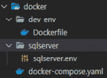

图 2.2 – 预期文件夹结构

在创建文件夹结构后，我们现在可以开始填充这些文件。我们将从 `dev-env` 文件夹中的 Dockerfile 开始。这将用于配置开发环境，并将包含安装用于构建应用程序的工具的指令。

### Dockerfile

打开文件：

```cs
docker/dev-env/Dockerfile
```

然后粘贴以下内容：

```cs
# [Choice] .NET version: 7.0, 6.0, 5.0, 3.1, 6.0-bullseye, 5.0-bullseye, 3.1-bullseye, 6.0-focal, 5.0-focal, 3.1-focal
ARG VARIANT="7.0"
FROM mcr.microsoft.com/vscode/devcontainers/dotnet:0-${VARIANT}
# [Choice] Node.js version: none, lts/*, 16, 14, 12, 10
ARG NODE_VERSION="none"
RUN if [ "${NODE_VERSION}" != "none" ]; then su vscode -c "umask 0002 && . /usr/local/share/nvm/nvm.sh && nvm install ${NODE_VERSION} 2>&1"; fi
# [Optional] Uncomment this section to install additional OS packages.
RUN apt-get update && \
    export DEBIAN_FRONTEND=noninteractive && \
    apt-get -qy full-upgrade && \
    apt-get install -qy curl && \
    apt-get -y install --no-install-recommends vim && \
    curl -sSL https://get.docker.com/ | sh
RUN dotnet tool install -g dotnet-ef
ENV PATH $PATH:/root/.dotnet/tools
# configure for https
RUN dotnet dev-certs https
```

这配置了开发环境以促进 .NET 应用程序开发。让我们详细了解一下。第一行确定将使用的 .NET 版本：

```cs
ARG VARIANT="7.0"
```

我们使用的是 7.0，这是撰写本文时的最新版本。

接下来，配置 Node 的版本：

```cs
ARG NODE_VERSION="none"
```

没有安装任何 Node 版本。启用 node 或 npm 通常很有用，但目前在当前情况下并不需要。

下一个命令用于安装您可能想要使用的任何包或工具：

```cs
RUN apt-get update && export DEBIAN_FRONTEND=noninteractive \
&& apt-get -y install --no-install-recommends vim
```

此命令更新包管理器并安装我们将稍后使用的 Vim CLI 工具。

上述内容都是环境的“标准”配置。接下来，我们将添加一些定制化配置，这将使我们能够使用 Entity Framework：

```cs
RUN dotnet tool install -g dotnet-ef
```

此命令安装我们将用于与数据库交互的 .NET **Entity Framework**（**EF**）工具。

最后，我们将 dot net 工具添加到 `path` 变量中，这样我们就可以从命令行使用它们：

```cs
ENV PATH $PATH:/root/.dotnet/tools
```

### Sqlserver.env

此文件仅设置一些环境变量，用于我们即将启动的 SQL Server 实例。复制以下内容：

```cs
ACCEPT_EULA="Y"
SA_PASSWORD="Password1"
```

应该不用说，密码永远不应该在任何环境（除了这个示例）中使用！另外，请注意，将密码提交到版本控制是极其糟糕的做法，在开发生产应用程序时不应这样做。我们将在讨论安全性的*第八章**中解决这个问题*。

### Docker-compose.yaml

这里事情变得有趣。Docker Compose 是一个工具，它允许我们同时使用多个容器。它是一个容器编排工具！

将以下内容粘贴到 `docker-compose` 文件中：

```cs
version: '3.4'
services:
  sql_server:
    container_name: sqlserver
    image: "mcr.microsoft.com/mssql/server:2022-latest"
    ports:
      - "9876:1433"
    volumes:
      - habit-db-volume:/var/lib/mssqlql/data/
    env_file:
      - sqlserver/sqlserver.env
  dev-env:
    container_name: dev-env
    build:
      context: ./dev-env
    volumes:
      - "..:/workspace"
    stdin_open: true # docker run -i
    tty: true # docker run -t
volumes:
  habit-db-volume: null
```

上述 Docker Compose 命令将我们所做的一切整合在一起。有了这个脚本，我们可以启动一组 Docker 容器，允许我们构建 API、UI，并且与数据库交互——所有这些都不需要在主机机器上直接安装任何东西！

回顾一下：我们已经构建了一个名为 `dev-env` 的容器，它符合我们的需求。我们还配置了一个包含 SQL Server 2022 实例的容器，该实例将作为我们的数据库平台。

### 运行容器

这就是所有的 Docker 特定配置。现在我们将运行容器并开始交互。

我们已经构建了一个基于 Docker 的环境——现在是时候启动它了。为此，打开 VSCode，打开一个新的终端，并输入以下内容：

```cs
cd .\docker\
docker compose up
```

您的终端应该看起来像以下这样：

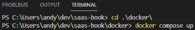

图 2.3 – 预期输出

第一次运行此命令可能需要一些时间，但在后续使用中会显著更快。此命令将启动 `docker compose` 文件中描述的服务。具体来说，是一个 SQL Server 实例，以及我们使用 .NET 6.0 和 Entity Framework 配置的开发环境。

通过以上步骤，我们已经创建了一个安装了 .NET 和 Entity Framework 的容器。你可以通过尝试以下操作来证实我们确实实现了这一点。在 VSCode 中打开一个新的终端，并输入以下命令以 `exec` 进入 dev-env 容器：

```cs
docker exec -it dev-env /bin/bash
```

`exec` 命令允许通过终端与已运行的容器进行交互。

运行前面的命令将在 `dev-env` Docker 容器中打开一个交互式终端，我们可以在通过前面的 `exec` 命令打开的控制台中输入以下内容来检查 .NET 和 EF 工具是否正确安装：

```cs
dotnet –-version
dotnet-ef --version
```

前面的命令应该返回以下内容：

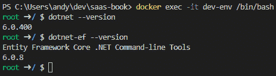

图 2.4 – 预期终端输出

接下来，我们可以执行类似的操作以确保 SQL Server 容器正在运行。再次，在 VSCode 中打开一个新的终端，并输入以下内容：

```cs
docker exec -it sqlserver /bin/bash
```

再次，这将在 `sqlserver` 容器中打开另一个交互式终端。你可以通过输入以下内容来证实这一点：

```cs
/opt/mssql-tools/bin/sqlcmd -S localhost -U SA
```

当提示时，输入 `sqlserver.env` 文件中的密码（`Password1`）以进入 SQL Server 命令行界面。你可以对数据库平台进行简单的检查，例如检查版本：

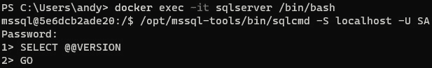

图 2.5 – 检查版本

到目前为止，我们已经完成了所有的 Docker 容器设置，但我们与我们的环境交互的唯一方式是使用命令行，而如今这并不是一个真正可接受的做法！幸运的是，Visual Studio Code 有一个巧妙的技巧！

## 配置 VSCode 中的 dev 容器

你会记得我们为 VSCode 安装了 `Remote Containers` 扩展。这将允许我们打开一个 VSCode 实例，该实例利用了我们之前设置的 Docker 容器。这需要一些额外的配置，但一旦设置好，它将在项目的剩余部分“正常工作”！

首先在项目根目录下创建一个名为 `dev-env` 的文件夹：

```cs
.devcontainer
```

这是 VSCode 将查找以获取配置的地方。

在此文件夹中创建一个名为 `devcontainer.json` 的文件。你的文件夹结构应该如下所示：

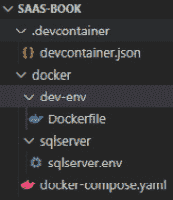

图 2.6 – 文件夹结构

在 `devcontainer.json` 文件中，粘贴以下内容：

```cs
{
    "name": "SaaS Book",
    "dockerComposeFile": ["../docker/docker-compose.yaml"],
    "service": "dev-env",
    "workspaceFolder": "/workspace",
    "customizations": {
        "vscode": {
            "extensions": [
                "ms-dotnettools.csharp",
                "shardulm94.trailing-spaces",
                "mikestead.dotenv",
                "fernandoescolar.vscode-solution-explorer",
                "jmrog.vscode-nuget-package-manager",
                "patcx.vscode-nuget-gallery",
                "pkief.material-icon-theme",
                "ms-mssql.mssql",
                "humao.rest-client",
                "rangav.vscode-thunder-client",
                "formulahendry.dotnet-test-explorer",
                "kevin-chatham.aspnetcorerazor-html-css-
                  class-completion",
                "syncfusioninc.blazor-vscode-extensions",
                "ms-dotnettools.vscode-dotnet-runtime",
                "ms-dotnettools.blazorwasm-companion"
                ]
          }
    },
    "remoteUser": "root"
}
```

让我们逐行分析。以下代码行告诉 VSCode 在哪里查找 `docker compose` 文件。这是我们之前创建的文件，它配置了两个 Docker 容器：

```cs
"dockerComposeFile": ["../docker/docker-compose.yaml"],
```

下一行只是告诉 VSCode，名为 `dev-env` 的容器是主要容器：

```cs
"service": "dev-env",
```

下一行定义了容器内部的工作文件夹——稍后将有更多介绍：

```cs
"workspaceFolder": "/workspace",
```

以下内容相当巧妙，包括开发容器配置。本节允许我们定义在开始使用开发容器工作时希望可用的扩展。我已经列出三个扩展以供开始，但随着项目的复杂化，这个列表将会增长：

```cs
"extensions": [ … ],
```

这是从微软来的一个特别巧妙的补充，因为这允许 VSCode 配置作为 JSON 格式存在于项目中。此文件已提交到仓库并与代码一起移动，这意味着任何新团队成员拉取此仓库时，他们都将立即拥有一个针对项目完全配置的编辑器。

近年来，我们都熟悉了 *基础设施即代码*。使用开发容器允许你将 *开发者环境作为代码进行配置*。这样做使得接纳新团队成员变得极其容易，同时也意味着“好吧，在我的机器上它运行正常”的时代的结束。使用这种技术意味着无论物理硬件、操作系统选择，还是 .NET 或 Node 的具体版本，每个人都在一个完全一致的平台上进行工作。

对于开发 SaaS 应用程序来说，这是一个巨大的胜利，因为新团队成员从零开始的过程既复杂又艰难。

## 启动环境

这就是配置的结束。我希望我们现在都在一个一致且可预测的平台上进行工作，并且不会在跟随本书中的示例时遇到任何麻烦！

要在 Docker 中启动环境，按 *F1* 打开命令菜单，并搜索 `Remote-Containers: Rebuild and Reopen` `in Container`。

你将在 *图 2.7* 中看到选项。选择第一个并按 *Enter* 继续操作。

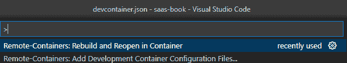

图 2.7 – 在容器中重建和重新打开

这将关闭当前的 VSCode 实例，并重新打开一个新实例，该实例在之前配置的 `dev-env` 容器中运行。请注意，第一次这样做可能需要一些时间，但在后续使用中会更快。

你会注意到一些差异！首先，看看左下角，你会看到你正在运行一个名为 `SaaS Book` 的开发容器：


如果你点击查看已安装的扩展，你将看到一个单独的面板，显示 VSCode 此实例中安装的扩展与 `devcontainers.json` 文件中指定的扩展匹配。随着本书的进行，项目逐渐成形，这个列表将显著增长。

*图 2.8* 展示了一些在容器中安装的扩展：


图 2.8 – 已安装的扩展

如果你打开一个终端，你也会注意到这是一个 Linux 环境。你可以通过运行以下代码来验证这一点：

```cs
cat /etc/os-release
```

你将看到以下输出：

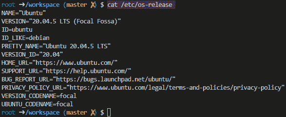

图 2.9 – 输出

这表明我们处于 Debian 环境。请注意，我们正在一个名为 `workspace` 的文件夹中工作，这是之前在 `devcontainer.json` 文件中配置的。这是可配置的，根据您的偏好。

为了进一步确信这确实是之前配置的 `dev-env` 容器，你可以在 VSCode 的终端中再次检查 .NET 和 Entity Framework 的版本：

```cs
dotnet –-version
dotnet-ef --version
```

你将看到以下输出：

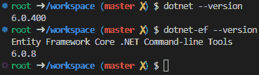

图 2.10 – 终端输出

这就是目前所需的配置环境。让我们回顾一下：

+   我们有一个安装了 .NET SDK 的容器，准备好用于构建任何类型的 .NET 应用程序。

+   同一个容器安装了 Entity Framework 命令行工具，这样我们就可以使用 Entity Framework 来构建和与数据库交互。你可能会记得我们在 Dockerfile 中安装了 Entity Framework。

+   我们有一个运行 SQL Server 的独立容器，它托管了我们可以与之交互的数据库。值得注意的是，我们并没有在主机机器上安装 SQL Server 本身。我们通过 Docker 容器访问数据库。你将在 *第三章* 和 *第四章* 中看到更多关于这一点的内容。

这现在是一个可以用来构建 SaaS 应用程序的开发者机器的基础，我们没有在您正在工作的机器上直接安装任何这些工具就实现了这一点——所有这些都打包在 Docker 容器中。这个配置作为代码存在，因此它随着仓库移动。任何克隆此仓库的本地开发者都将立即获得所有项目特定的工具和配置。

随着我们在这个项目中的进展，这个设置将变得更加复杂。随着项目的增长，它也会增长。但就目前而言，这已经足够了，所以我们将在这里停止，并开始拼凑一个非常基础的应用程序。

## 配置 VSCode

在这个早期阶段，由于我们没有真正有应用程序特定的代码，所以不需要很多配置。然而，我们将在这里打下基础。打开一个终端，并输入以下内容：

```cs
mkdir .vscode; \
cd .vscode; \
touch launch.json; \
touch settings.json; \
touch tasks.json; \
cd ..;
```

将以下内容添加到 `settings.json` 中：

```cs
{
    "thunder-client.saveToWorkspace": true,
    "thunder-client.workspaceRelativePath": ".thunder-client"
}
```

前面的配置是一些我们将用于 *第五章* 的 HTTP 测试工具的配置。目前我们不需要在 `launch.json` 或 `tasks.json` 中放入任何内容。

这应该是目前所需的全部配置，因此我们可以继续前进。

## 退出环境

从开发容器环境退出并返回到主机非常简单。只需再次按 *F1* 并搜索“在本地重新打开文件夹”：

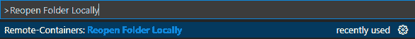

图 2.11 – 返回本地工作区

这将迅速将你带回到主机环境。你将不再看到左下角的指示器，表明你处于开发容器中，终端将再次直接连接到主机机器。

我们在本节中取得了许多成果，并为自己搭建了一个开始使用 Docker 化环境的平台。这可能会感觉比直接在本地机器上编写代码要麻烦一些，但我希望随着我们一起阅读这本书，你将开始看到在项目一开始就花费时间搭建这个环境的价值！

在下一节中，我们将真正开始构建应用程序，并展示前面技术的能力。

# 构建示例应用程序

在本节中，我们将使用刚刚安装的工具来创建一个 SaaS 应用程序的基础框架。目前，这仅仅是一个可以后续章节中更加完善的基础应用程序。然而，这将让我们熟悉我们将要使用到的所有不同工具。

在我们阅读本书的过程中，我们将构建的示例应用程序是一个跟踪习惯的应用程序 – 这可能是一天中你可能想尝试做的事情，比如学习一门新语言，或者为了跟上出版截止日期而写几页书！我希望这将是你在完成本书后可能能够使用到的东西！

## 数据库技术

我们将从数据库开始。我们使用 SQL Server 作为数据库平台 – 这是一本基于微软技术的书，所以我们将尽可能坚持使用它们！然而，其他数据库平台也是可用的，并且可以轻松使用。上面提供的基于 Docker 的设置使得实验其他数据库平台变得非常容易。你可以用 Postgres 容器替换 SQL Server 容器，看看一切是否仍然正常工作！

数据库和数据库平台在让开发者加入项目并快速熟悉项目时常常是痛点之一。这在 SaaS 项目中尤为明显，而且使用上述 Docker 化解决方案只能部分缓解。

现在，使用对象关系映射器（**ORM**）来管理代码与数据库之间的交互非常普遍，我将在本书中遵循这一模式。最初，我将使用 Entity Framework 进行所有交互，但请注意，当我们讨论性能和扩展时，我会涉及到其他在数据库性能至关重要的时刻可以使用的技巧。

我将利用 Entity Framework 的“代码优先”方法来定义数据库，并用一些初始启动数据填充它，同时我会利用迁移来保持数据库的更新。这在后续章节中会非常有用，当我们讨论使用数据库进行测试时，以及当我们查看 CI/CD 和如何更新生产数据库时。

### 创建数据库

确保你处于开发容器中（检查 VSCode 的左下角）并打开一个新的终端。使用终端创建一个新的.NET 类库，名为`GoodHabits.Database`，代码如下：

```cs
dotnet new classlib --name GoodHabits.Database;
```

你应该在文件资源管理器中看到文件夹出现，并在终端中看到以下输出：

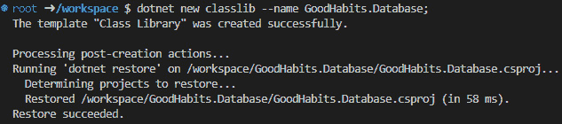

图 2.12 – 创建数据库

在我们能够使用此项目与数据库交互之前，我们需要添加一些 NuGet 包。所以，再次在终端中输入以下内容：

```cs
cd GoodHabits.Database; \
dotnet add package Microsoft.EntityFrameworkCore; \
dotnet add package Microsoft.EntityFrameworkCore.Design; \
dotnet add package Microsoft.EntityFrameworkCore.Analyzers; \
dotnet add package Microsoft.EntityFrameworkCore.Relational; \
dotnet add package Microsoft.EntityFrameworkCore.SqlServer; \
dotnet add package Microsoft.EntityFrameworkCore.Tools; \
touch GoodHabitsDbContext.cs; \
rm Class1.cs; \
touch SeedData.cs; \
mkdir Entities; \
cd Entities; \
touch Habit.cs; \
cd ..;
```

在前面的步骤中，我们已经指导.NET CLI 添加了所有必要的 NuGet 包，以方便与数据库交互。我们还添加了`GoodHabitsDbContext`类、`SeedData`类和`Habit`类。现在，我们将在这三个文件中添加一些基本的设置，这将为我们后续章节的工作提供一个基础。

在`Habits.cs`文件中输入以下代码：

```cs
namespace GoodHabits.Database.Entities;
public class Habit
{
  public int Id { get; set; }
  public string Name { get; set; } = default!;
  public string Description { get; set; } = default!;
}
```

上面的代码是一个非常简单的实体类，代表一个用户可能希望嵌入其日常生活中的习惯。

接下来，通过在`SeedData.cs`文件中添加以下代码添加一些模拟数据：

```cs
using GoodHabits.Database.Entities;
using Microsoft.EntityFrameworkCore;
public static class SeedData
{
    public static void Seed(ModelBuilder modelBuilder)
    {
        modelBuilder.Entity<Habit>().HasData(
            new Habit { Id = 100, Name = "Learn French",
              Description = "Become a francophone" },
            new Habit { Id = 101, Name = "Run a marathon",
              Description = "Get really fit" },
            new Habit { Id = 102, Name = "Write every day",
              Description = "Finish your book project"  }
        );
    }
}
```

现在通过在`GoodHabitsDbContext.cs`文件中输入以下代码创建一个`DbContext`：

```cs
using GoodHabits.Database.Entities;
using Microsoft.EntityFrameworkCore;
namespace GoodHabits.Database;
public class GoodHabitsDbContext : DbContext
{
    public DbSet<Habit>? Habits { get; set; }
    protected override void
      OnConfiguring(DbContextOptionsBuilder options)
       => options.UseSqlServer("Server=
         sqlserver;Database=GoodHabitsDatabase;User
         Id=sa;Password=Password1 ;Integrated
         Security=false;TrustServerCertificate=true;");
    protected override void OnModelCreating(ModelBuilder
      modelBuilder) => SeedData.Seed(modelBuilder);
}
```

这做了几件事情。首先，我们定义了一个`DbSet`。这映射到数据库中的一个表。

接下来，我们将硬编码数据库连接字符串。当然，硬编码连接字符串是不良的做法，将密码以明文形式放在那里更是双倍的不良做法。我们将在*第三章*中纠正这些错误，但这对证明我们已经连接到数据库是足够的。

在完成此设置后，我们可以测试一下，看看我们是否可以将这些信息迁移到我们在第二个 Docker 容器中运行的 SQL Server 数据库中。

要做到这一点，让我们首先使用 Entity Framework 创建一个初始迁移。在终端中输入以下内容以生成初始迁移：

```cs
dotnet-ef migrations add InitialSetup;
```

你会在文件资源管理器中看到一个名为`Migrations`的文件夹，其中`InitialSetup`迁移被建模为一个类。目前你不必过于担心这个，但花时间看看这个类是值得的。

然后输入以下内容以将迁移部署到 SQL Server 数据库：

```cs
dotnet-ef database update;
```

这将迁移发送到数据库。

到此为止。我们已经使用 Entity Framework 在“代码优先”模式下配置了一个基本的数据库，并将第一个迁移发送到数据库。

### 我们如何知道这已经成功了？

理解命令已成功执行是一回事，但眼见为实，我们需要深入数据库以确保所有这一切确实按预期工作。

您会注意到，当我们定义要在 dev 容器中安装的扩展时，我们指定了以下扩展应该包含在内：

```cs
"ms-mssql.mssql",
```

这是一个来自微软的 VSCode 扩展，允许我们从 VSCode 直接查询 SQL 服务器数据库。点击扩展，我们将添加一个新的连接，并添加以下信息：

| **参数** | **值** | **备注** |
| --- | --- | --- |
| 主机名 | `sqlerver` | *这是配置为运行 SQL Server 2022 实例的 Docker 容器的名称* |
| 要连接的数据库 | `GoodHabitsDatabase` | *这是在`DbContext`类的连接字符串中定义的* |
| 认证类型 | `SQL 登录` |  |
| 用户名 | `sa` |  |
| 密码 | `Password1` | *在`sqlserver.env`中定义* |
| 保存密码 | `是` |  |
| 显示名称 | `GoodHabits` |  |

您可能需要确认一个安全弹出窗口。

正确输入以上信息后，你现在应该可以看到数据库的视图，如下所示：

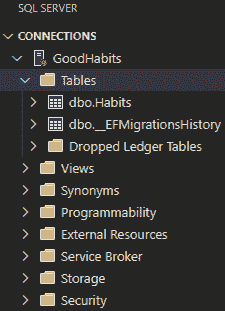

图 2.13 – 浏览数据库

您会注意到，我们已经在`DbContext`文件中将`Habits`表定义为`DbSet`，并且该表已成功迁移到 SQL Server 数据库。您可以在名为`dbo.Habits`的表上右键单击，然后点击**选择到 1000**以查看内容。

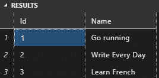

图 2.14 – 数据库中存储的数据

再次，您会看到我们在`DbContext`文件中添加的信息在数据库中是存在且正确的。

## API 技术

接下来，我们将转向 API。API 的目的是通过用户方便地存储和检索数据库中的信息，以及进行任何必要的数据处理。

可用于构建 API 的技术有很多种。本书专注于微软技术，因此我们将使用.NET Web API 框架和 C#语言。然而，所描述的工具和技术可以很容易地适应以利用不同的技术。

此外，关于如何最佳地构建 API 有许多不同的想法，没有一种“一刀切”的方法可以适用于所有项目。我决定，我将在这本书的示例中使用 RESTful 范式，但再次强调，如果您的项目使用其他结构，如 GraphQL，所提出的概念和想法应该可以很好地复制。

SaaS 应用程序的本质是，在项目启动时需要做出大量的选择。即使项目是一个书中的演示应用程序，这也依然成立。

### 创建 HabitService API

确保您处于开发容器环境中，并且位于项目的根目录（`workspace` 文件夹），然后创建一个新的 `webapi` 项目，如下所示：

```cs
dotnet new webapi --name GoodHabits.HabitService; \
cd GoodHabits.HabitService; \
dotnet add reference ../GoodHabits.Database/GoodHabits.Database.csproj; \
dotnet add package Microsoft.EntityFrameworkCore.Design; \
cd ..;
```

.NET CLI 在设置 API 方面做了很多工作。我们需要对 `launchSettings.json` 文件进行更改。打开 `Properties` 文件夹，并用以下内容替换默认的启动设置：

```cs
{
  "$schema":
    "https://json.schemastore.org/launchsettings.json",
  "profiles": {
    "HabitService": {
      "commandName": "Project",
      "dotnetRunMessages": true,
      "launchBrowser": false,
      "applicationUrl": "http://localhost:5100",
      "environmentVariables": {
        "ASPNETCORE_ENVIRONMENT": "Development"
      }
    }
  }
}
```

最重要的是要注意，我们将运行 `HabitService` 在端口 `5100` 上。当我们开始查看微服务时，这一点很重要，见 *第六章*。

默认情况下，Web API 包含了天气 API，您可以查看它以了解这些端点是如何配置的。我们可以通过在终端中输入以下内容来测试：

```cs
dotnet run
```

这将启动在 `launchSettings.json` 中指定的端口上运行的应用程序 – 在这种情况下是端口 `5100`。

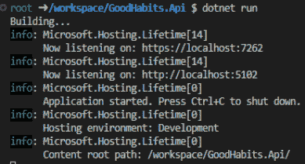

图 2.15 – 表示成功的控制台输出

您可以通过在浏览器中访问以下 URL 来检查应用程序是否正在运行（记得检查端口号！）：[`127.0.0.1:5100/swagger/index.html`](http://127.0.0.1:5100/swagger/index.html)

注意，您可能会从浏览器收到一些 HTTPS 警告，如下所示：

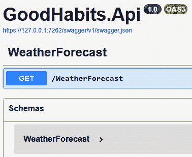

图 2.16 – GoodHabits API

## 用户界面技术

最后，我们需要一个用户界面来显示信息。

就像我对数据库和 API 所指出的那样，有许多不同的 UI 技术，本书中您将学习的底层工具和技术可以应用于其中任何一个。通常，在特定情况下使用最佳技术的是您最熟悉的技术。

这是一本以 Microsoft 为中心的书籍，面向现有的 .NET 开发者，因此我将使用 Blazor 来提供示例。如果您更喜欢 Angular、React、Vue 或其他数百万个 UI 框架中的任何一个，请不要气馁。实际上，将这些示例修改为与您选择的 UI 一起使用将是一个很好的练习，可以帮助您进一步理解本书中将要介绍的概念。

### 创建 UI

使用 Microsoft 提供的 CLI 工具创建简单的 Blazor UI 是直接的。在终端中输入以下命令以创建 UI：

```cs
dotnet new blazorwasm -o GoodHabits.Client;
```

这遵循了我们创建 HabitServer 项目的相同模式。同样，像 HabitServer 项目一样，我们需要修改 `launchSettings.json` 中的启动配置。再次，查看 `Properties` 文件夹，并用以下内容覆盖内容：

```cs
{
  "profiles": {
    "GoodHabitsClient": {
      "commandName": "Project",
      "dotnetRunMessages": true,
      "launchBrowser": true,
      "inspectUri": "{wsProtocol}://{url.hostname}:
        {url.port}/_framework/debug/ws-
        proxy?browser={browserInspectUri}",
      "applicationUrl": "http://localhost:5900",
      "environmentVariables": {
        "ASPNETCORE_ENVIRONMENT": "Development"
      }
    }
  }
}
```

再次注意客户端正在运行的端口。我们将使用 `5900` 作为客户端。

配置完成后，您现在可以通过在控制台中输入 `dotnet run` 来启动客户端。

再次，你会看到 `Client` 应用正在 `launchSettings.json` 中指定的端口上运行，应该是端口 `5900`：

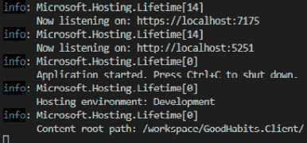

图 2.17 – 表示成功的控制台输出

再次，正如 API 一样，你可以在浏览器中点击此链接查看运行的 Blazor 应用：

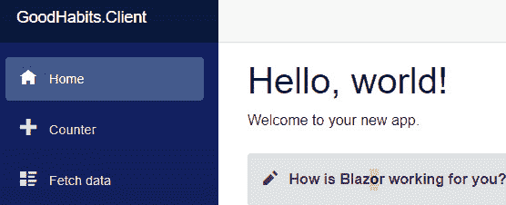

图 2.18 – Hello, world!

## 启动应用程序

目前，我们只有两个项目要运行，即 HabitService API 和 Blazor 客户端。因此，我们可以通过两次输入 `dotnet run` 来相对容易地启动整个项目。随着我们对这个应用程序的开发，它将变得越来越复杂，以这种方式运行将变得更加困难。因此，我们将创建构建和启动配置来告诉 VSCode 如何启动应用程序。

我们已经在 `.vscode` 文件夹中创建了这些配置文件。

首先，打开 `tasks.json`，并复制以下内容：

```cs
{
    "version": "2.0.0",
    "tasks": [
        {
            "label": "build-client",
            "type": "shell",
            "command": "dotnet",
            "args": [
                "build",
                "${workspaceFolder}/GoodHabits.Client/
                  GoodHabits.Client.csproj"
            ],
            "group": {
                "kind": "build",
                "isDefault": true
            }
        },
        {
            "label": "build-habit-service",
            "type": "shell",
            "command": "dotnet",
            "args": [
                "build",
                "${workspaceFolder}/GoodHabits.HabitService
                  /GoodHabits.HabitService.csproj"
            ],
            "group": {
                "kind": "build",
                "isDefault": true
            }
        },
    ]
}
```

你可以在上面的 JSON 中看到定义了两个任务来构建客户端和习惯服务。

接下来，通过添加以下 JSON 配置来修改 `launch.json`：

```cs
{
    "version": "0.2.0",
    "configurations": [
        {
            "name": "RunClient",
            "type": "blazorwasm",
            "request": "launch",
            "preLaunchTask": "build-client",
            "cwd": "${workspaceFolder}/GoodHabits.Client",
            "url": "https://localhost:5900"
        },
        {
            "name": "RunHabitService",
            "type": "coreclr",
            "request": "launch",
            "preLaunchTask": "build-habit-service",
            "program": "${workspaceFolder}/
              GoodHabits.HabitService/bin/Debug/net7.0/
              GoodHabits.HabitService.dll",
            "args": [],
            "cwd":
              "${workspaceFolder}/GoodHabits.HabitService",
            "stopAtEntry": false,
            "console": "integratedTerminal"
        },
    ],
    "compounds": [
        {
            "name": "Run All",
            "configurations": [
                "RunHabitService",
                "RunClient"
            ]
        }
    ]
}
```

再次，你可以看到添加了两个配置来运行单个项目。你还可以看到靠近底部有一个设置为运行所有项目的 `compounds launch` 命令。

你可以通过按 *Ctrl* + *Shift* + *D* 进入 **运行和调试** 菜单，从下拉菜单中选择 **运行** 所有，然后按播放按钮来测试它。

你会看到这同时启动了 API 和客户端。当项目数量开始增加时，这将非常方便！

注意，你也可以按 *F5* 来启动应用程序。

## 添加解决方案文件

在我们真正开始构建应用程序之前，还有一个小步骤要做，那就是添加解决方案文件。这并不是严格必要的，但在处理 .NET 项目时通常这样做，这将使我们能够通过单个命令轻松构建、清理和测试项目。

要添加解决方案文件，只需导航到项目根目录，并运行以下命令：

```cs
dotnet new sln --name GoodHabits; \
dotnet sln add ./GoodHabits.Client/GoodHabits.Client.csproj; \
dotnet sln add ./GoodHabits.HabitService/GoodHabits.HabitService.csproj; \
dotnet sln add ./GoodHabits.Database/GoodHabits.Database.csproj;
```

这只是添加了一个解决方案文件，并引用了我们创建的三个项目。

那就是最后需要完成的一步设置工作——现在我们可以继续构建应用程序。

# 我们接下来该做什么？

我们在本章中做了很多工作，但我们还没有真正开始构建应用程序。相反，我们专注于选择我们将使用的工具，并围绕这些工具构建开发环境。我们现在有一个 SaaS 应用的轮廓，我们可以随着本书的进展继续与之合作。

在项目开始时花时间选择正确的工具是任何 SaaS 项目的重要步骤，这个步骤不应被跳过。

在开发任何应用程序时取得成功需要考虑将要使用的技术和框架，以及将要使用的工具。在本章中，我们已经为探索构建 SaaS 应用程序所需的概念做好了充分的准备，以便我们可以亲自动手尝试。

以下章节将开始介绍更多与 SaaS 相关的特定考虑因素，我们将使用这个轮廓应用程序来演示它们。

# 摘要

在本章中，我们简要地介绍了很多不同的工具、主题和技术。这是开发 SaaS 应用程序的本质——请不要感到不知所措！为了开始，我们安装了我们需要工作的工具，即 Docker Desktop 和 Visual Studio Code。这对于 SaaS 项目来说是一套相当轻量级的工具。但正如你所看到的，我们使用了 Docker 来封装开发环境。我们学习了 dev containers，以及它们如何显著简化复杂项目（如 SaaS 应用程序）的设置，然后我们配置了一个 dev container 并学习了如何在那个环境中工作。

在设置好环境的核心之后，我们使用 Entity Framework 创建了一个数据库，并用一些数据填充它，然后通过 API 使数据可用，最后在 Blazor UI 上展示数据！

通过以上所有内容，我们已经配置了构建功能齐全的 SaaS 应用程序所需的全部单个部分。继续阅读，我们将这样做！

在下一章中，你将学习构建 SaaS 应用程序的核心部分，即多租户。我们将介绍这是什么以及为什么它如此重要，并开始思考如何在我们的示例应用程序中实现它。

# 进一步阅读

+   在容器内开发：[`code.visualstudio.com/docs/devcontainers/containers`](https://code.visualstudio.com/docs/devcontainers/containers)

+   Docker 中的 Entity Framework 开发环境：[`itnext.io/database-development-in-docker-with-entity-framework-core-95772714626f`](https://itnext.io/database-development-in-docker-with-entity-framework-core-95772714626f)

+   .NET 在 Docker 中使用 Dev Containers 进行开发：[`itnext.io/net-development-in-docker-6509d8a5077b`](https://itnext.io/net-development-in-docker-6509d8a5077b)

+   Blazor 教程 - 构建你的第一个 Blazor 应用程序：[`dotnet.microsoft.com/en-us/learn/aspnet/blazor-tutorial/intro`](https://dotnet.microsoft.com/en-us/learn/aspnet/blazor-tutorial/intro)

+   教程：使用 ASP.NET Core 创建 Web API：[`learn.microsoft.com/en-us/aspnet/core/tutorials/first-web-api?view=aspnetcore-7.0&tabs=visual-studio`](https://learn.microsoft.com/en-us/aspnet/core/tutorials/first-web-api?view=aspnetcore-7.0&tabs=visual-studio)

# 问题

1.  使用 dev containers 的优势是什么？

1.  我们是如何能够在不安装 SQL Server 的情况下使用 SQL Server 的？

1.  常与 RESTful API 相关联的 HTTP 动词有哪些？

1.  使用 Entity Framework 的好处是什么？

在本章中我们涵盖了大量的内容！如果目前对上述问题的答案不是 100%清晰，请不要担心——我们将在接下来的章节中详细展开所有这些内容。

# 第二部分：构建后端

本节涵盖了所有与后端相关的内容，从数据库开始，逐步扩展到 API 层。本节还介绍了多租户和微服务这两个主题，它们对于开发 SaaS 应用都非常重要。

本节包含以下章节：

+   *第三章*, *什么是多租户，为什么它在 SaaS 应用中很重要？*

+   *第四章*, *构建数据库和为数据丰富应用规划*

+   *第五章*, *构建 RESTful API*

+   *第六章*, *SaaS 应用的微服务*
