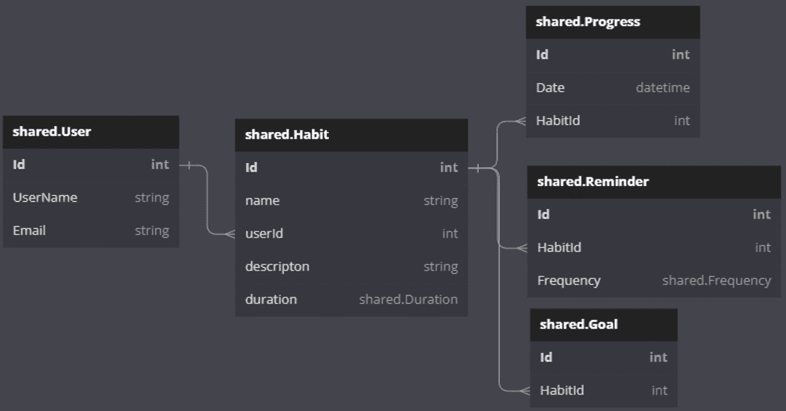

# 4

# 构建数据库和规划数据丰富的应用

在前面的章节中，我们建立了一个基础 SaaS 应用，该应用包含一个简单的数据库和单个表。该数据库连接到 API，我们展示了使用 SQL Server、.NET 和 Entity Framework 实现的 secure multi-tenancy。

在本章中，我们将更深入地探讨数据库层及其与 Entity Framework 的交互。作为整个应用的基础，数据库层面的设计选择将影响堆栈中的每一层。我们将探讨如何构建和设计适用于数据密集型 SaaS 应用的健壮数据库。您将掌握各种技能，例如规范化、索引、性能优化，以及测试和维护数据库的技术。

一旦部署，数据库通常代表系统中最具挑战性的部分，需要保持最新状态。数据库本质上是状态化的，在更新过程中防止数据丢失或损坏至关重要。除了学习数据库设计和构建，我们还将探讨维护和更新数据库的几种策略，重点介绍 Entity Framework 提供的工具。

本章中获得的技能对于创建可扩展和可靠的 SaaS 应用至关重要。通过掌握本章讨论的方法，您将能够设计出针对性能、可扩展性和可维护性优化的数据库，从而促进 SaaS 应用的开发和维护。

本章涵盖了以下主要主题：

+   数据在 SaaS 应用中的重要性

+   使用 SQL Server 和 Entity Framework 构建数据库

+   测试数据库和数据丰富的应用

+   在生产环境中工作，保持数据库更新，并确保数据安全

数据和数据库是 SaaS 应用的基础。让我们首先考虑它们的重要性。

# 技术要求

所有本章的代码都可以在[`github.com/PacktPublishing/Building-Modern-SaaS-Applications-with-C-and-.NET/tree/main/Chapter-4`](https://github.com/PacktPublishing/Building-Modern-SaaS-Applications-with-C-and-.NET/tree/main/Chapter-4)找到。

# 数据在 SaaS 应用中的重要性

在 SaaS 应用中，数据库是应用的基础。数据库（或更准确地说，其中的数据）是驱动应用并位于用户主要价值所在的地方。没有数据的 SaaS 应用只是一个空壳！

在构建 SaaS 应用程序时，一个关键的考虑因素是应用程序将存储的数据类型以及其使用方式。应用程序是否会存储大量结构化数据，例如客户记录或交易历史？或者它是否会存储非结构化数据，例如支撑社交媒体数据流的数据？数据类型将对应用程序的设计和架构产生重大影响。

另一个重要的考虑因素是数据如何被访问和操作。数据是否会被大量用户同时访问，或者只是由少数用户一次访问？数据是否会被频繁更新，或者主要是静态的？这些因素将影响数据库技术选择和数据模型设计。

在 SaaS 应用程序中，考虑数据如何在不同的租户之间共享也很重要。正如我们在上一章中讨论的，每个租户的数据必须保持独立和安全，同时仍然允许高效地访问和操作与当前租户相关的数据。这需要仔细规划和设计数据模型和数据库模式。

还需要考虑可扩展性。虽然 SaaS 应用程序可能一开始用户基础较小，因此读写次数相对较低，但随着用户基础的快速增长，这可能会迅速改变！设计数据模型和模式时，重要的是要确保应用程序可以扩展。同样，通过互联网传输的数据量也必须得到管理。带宽不是免费的，也不是无限的，在数据密集型应用程序中，这可能会成为一种负担。

数据的重要性不仅限于技术考虑。数据在用户体验中扮演着至关重要的角色。数据的表现方式、组织方式和访问方式可以显著影响应用程序的可用性。当然，这取决于用户界面、底层数据的结构和查询的便捷性和速度，这些都会在前端被最终用户注意到。

对于构建应用程序并托管数据库的公司来说，数据可以是一个关键的收入来源。一些 SaaS 应用程序通过向寻求针对特定市场细分市场的企业销售有关消费者人口统计和购买习惯的信息来货币化其数据。这些数据通常由机器学习算法收集和分类，从而可以深入了解数据的用户和创建者。有了这些宝贵的信息，企业可以创建有针对性的营销活动，并改进其产品和服务，更好地满足客户的需求。

数据对于众多原因来说都很重要，因此维护数据安全和合规性是构建成功的 SaaS 应用程序的一个关键方面。确保敏感数据，如财务或个人信息，得到安全保护并符合相关法规是 SaaS 提供商的责任。为了实现这一点，SaaS 提供商可能需要实施各种安全措施，如加密和访问控制，以保护数据。

数据和数据库是 SaaS 应用程序中绝对关键的部分，对于 SaaS 开发人员来说，了解如何设计、构建和维护数据丰富的应用程序非常重要。

# 构建数据库

在本节中，我们将重点介绍使用 SQL Server 和 Entity Framework 设计和构建您的 SaaS 应用程序的数据库。我们将涵盖一系列主题，包括选择合适的数据库技术、使用 Entity Framework 设计高效且可扩展的数据模型，以及使用 SQL Server 实施数据库安全性和合规性措施。在本节结束时，您将深入了解如何为您的 SaaS 应用程序构建一个强大且可靠的数据库。

## 数据库类型

因为这是一本专注于利用 Microsoft 堆栈的书籍，所以我会重点关注 SQL Server 作为底层数据库平台，并使用 Entity Framework 与数据库交互。SQL Server 是一种 **关系数据库**，它以表的形式存储数据，其中行代表单个记录，列代表数据属性。这是一种非常结构化的数据存储方式，数据的“形状”必须在设计时预先知道并构建到应用程序中。

虽然我们将重点关注 SQL Server 以及因此关系数据，但简要考虑替代方案是有价值的，这些替代方案超出了本书的范围。如果您有特定的用例可能需要除关系数据之外的数据，以下的一些替代方案可能值得进一步研究：

+   **文档数据库**：文档数据库是一种以文档形式存储数据的数据库类型。在这个上下文中，文档是由键值对组成的数据，旨在可扩展和灵活。在文档数据库中，数据的结构或形状在数据库设计时不会被设定，这使得它成为存储和查询具有不同结构的大量数据的良好选择。

+   **图数据库**：这些数据库以节点（表示数据实体）和边（表示节点之间的关系）的形式存储数据。它们通常用于需要表示数据实体之间复杂关系的应用程序中，例如社交网络或推荐引擎。

+   **键值存储**：这些数据库以键值对的形式存储数据，其中键用于标识数据，值是数据本身。它们通常用于简单的数据存储和检索场景，其中数据不需要查询或索引。这与文档数据库类似，但更有限，因为它仅真正适用于简单的用例。

+   **内存数据库**：这些数据库将数据存储在内存中，而不是磁盘上。它们通常用于需要快速读写数据访问的应用程序，例如在线游戏或金融应用程序。请注意，内存数据库也可以用于帮助测试数据库。这两个用例是分开的，不应混淆。

+   **时间序列数据库**：这些数据库专门设计用于存储和查询带时间戳的数据，如传感器读数或金融交易。它们通常用于需要分析随时间变化数据的程序。

在本章中，我们将专注于 SQL Server，这是一个关系型数据库。我们将使用微软专门为此目的开发的工具与数据库进行交互——即实体框架（Entity Framework）。

## 什么是 ACID？

当与数据库（尤其是关系型数据库）一起工作时，你经常会遇到**ACID**这个缩写。这指的是数据库事务的四个属性——即原子性、一致性、隔离性和持久性：

+   **原子性**：事务被视为一个单一、不可分割的工作单元，要么所有操作都完成，要么一个都不完成

+   **一致性**：事务将数据库从一个有效状态转换到另一个有效状态，保持数据库的不变性和约束

+   **隔离性**：事务的并发执行会导致一个系统状态，这个状态就像事务按某种顺序串行执行一样

+   **持久性**：一旦事务被提交，其对数据库的更改将持久存在并能够生存未来的系统故障

这些属性是一组由数据库管理系统保证的属性，以确保数据库中存储数据的可靠性和一致性。ACID 最常与**关系型数据库管理系统**（**RDBMS**）相关联，例如 Oracle、MySQL、PostgreSQL 和 Microsoft SQL Server。然而，一些较新的数据库，如 NoSQL 数据库和新 SQL 数据库，也可能提供 ACID 保证，尽管它们可能具有不同的一致性和持久性级别。ACID 支持的水平取决于特定的数据库技术以及它的实现和配置。

ACID 通常与关系型数据库中的事务相关联，而在 NoSQL 或文档数据库中则较少见。在本章中，实际上在整个书中，我们将专注于 SQL Server，这是一个提供 ACID 事务支持的关系型数据库。

## 实体框架（Entity Framework）

Entity Framework 是一个 **对象关系映射**（**ORM**）工具，它允许开发者使用 .NET 对象与数据库进行交互。它通过消除编写 SQL 查询和手动将数据映射到对象的需求来简化访问和操作数据的过程。Entity Framework 对于熟悉 .NET 并希望简化数据访问和操作任务的开发者来说非常适合，这使得它成为本以 .NET 为重点的书籍中学习的绝佳选择！

虽然我们会专注于 SQL Server，但使用 Entity Framework 的一大好处是它能够生成数据库无关的代码，这使得开发者能够在不显著重写代码的情况下更改数据库平台或支持多个数据库平台。当处理多租户 SaaS 应用程序时，这一特性尤其有趣，因为某些客户可能要求使用特定的数据库平台。

Entity Framework 包含了与编写与数据库交互的代码相关的许多复杂性。例如，懒加载、更改跟踪以及数据模式和架构更改的自动迁移等概念都是开箱即用的。

与许多其他 ORM 不同，Entity Framework 支持与数据库交互的几种不同方法，包括传统的数据库优先方法、代码优先方法和模型优先方法。这为开发者提供了选择最适合他们需求的方法的灵活性。

Entity Framework 是一个强大的工具，可以通过简化数据访问和操作任务来大大提高经验丰富的 .NET 开发者的生产力，并且在处理高度依赖于数据平台的项目（如 SaaS 应用程序）时，它被高度推荐。

本章的范围不包括所有可能的 Entity Framework 使用方式，因此我将专注于其中一种——代码优先。

#### 使用 Entity Framework 的代码优先

使用 Entity Framework 的代码优先是一种开发方法，它允许开发者使用 C# 代码创建他们的 .NET 应用程序的数据模型，而不是使用 SQL Server Management Studio 等用户界面来设计数据库，或者通过编写和维护 SQL 脚本来实现。这种方法对于喜欢使用代码并且希望对应用程序的数据模型有更多控制的开发者来说特别有用。使用代码优先，开发者可以使用代码中的类和属性来定义他们的数据模型，而 Entity Framework 将处理底层数据库的创建和管理。这种方法允许开发者专注于应用程序的数据模型和业务逻辑，而无需担心数据库的实现细节。

我们在*第二章*中看到了这种方法。当数据库配置时，我们没有写一行 SQL 代码——我们编写了一个名为 `GoodHabits.cs` 的 C# 类，并在 C# 代码中定义了数据结构。然后我们使用了两个 Entity Framework CLI 命令来更新数据库。在*第三章*中，我们修改了这个文件以支持多租户。

#### 使用 Entity Framework 的存储过程

传统上，在数据库设计时使用存储过程是非常常见的。虽然这仍然是一种非常有效且实用的数据库开发方法，但它越来越被视为最佳实践，即使用 ORM（对象关系映射）如 Entity Framework 来访问和操作数据库中的数据，而不是使用存储过程。这有几个原因。

Entity Framework 允许你在代码中与对象和实体一起工作，而不是必须编写原始的 SQL 查询。这为你提供了一个更高层次的抽象，可以使开发应用程序变得更加容易。采用这种方法，你可以以熟悉面向对象的方式构建数据库，这可以使推理和维护变得更加容易。Entity Framework 能够从 C# 代码中解析对象之间的关系，并创建数据库关系。如果你在存储过程中创建逻辑并将其建模，Entity Framework 就会失去对这种逻辑的视线。

使用 Entity Framework 的另一个巨大好处是，许多数据库平台都支持即插即用。然而，存储过程中的逻辑通常无法在不同数据库平台之间迁移，并且必须分别在每个平台上单独构建和维护。

最后，Entity Framework 提供了多种可用的测试工具。使用存储过程和触发器将需要特定的测试基础设施和技术，这可能会使得测试应用程序变得更加困难，因为逻辑被分散在代码和数据库之间。

在某些情况下，使用存储过程或触发器可能是有益的。以下是一些例子：

+   当处理非常大的数据集或在性能至关重要的场合时，通过存储过程直接在数据库上执行逻辑可能是有利的。

+   在数据安全是关注点的情况下，存储过程可以帮助通过限制对数据库可以运行的查询类型来防止对数据的未授权访问。

+   在你想要将应用程序的数据访问层从底层数据库模式抽象出来的情况下，使用存储过程可以帮助解耦这两个部分。这在数据库模式可能频繁变化的情况下尤其有用。

在决定是否在数据库中使用存储过程时，理解你的具体用例非常重要。对于演示应用程序，我们将继续使用 Entity Framework 来操作和访问数据库。

#### 规范化

数据库规范化是将数据库组织成减少冗余并提高数据完整性的过程。它涉及将数据库划分为更小、更专注的表，这些表通过关系相互关联。规范化的目标是消除冗余并确保每条数据只存储在数据库中的一个地方。规范化是数据库设计过程中的一个重要步骤，可以极大地提高数据库的性能和可靠性。

Entity Framework 支持以多种方式支持数据库的规范化过程。其中主要的方式是通过在数据库中创建和修改表以及关系。这允许开发者以减少冗余并提高数据完整性的方式来结构化他们的数据——这是规范化的关键目标。Entity Framework 还包括对数据变更自动迁移的支持。这意味着当开发者对他们的数据模型进行更改时，这些更改会自动反映在底层数据库中。这在规范化数据库时尤其有用，因为它允许开发者轻松地更新他们的数据结构，而无需在表之间手动迁移数据。

此外，Entity Framework 的 LINQ 查询语法允许开发者轻松地从规范化数据库中检索和操作数据。它支持广泛的操作，包括过滤、排序和聚合，使得处理来自多个表的数据变得容易。最后，Entity Framework 对预加载和懒加载的支持允许开发者通过仅在需要时加载数据来优化应用程序的性能，而不是一次性加载所有数据。这在规范化不良的数据库中可能更困难。总的来说，Entity Framework 提供了一系列工具和功能，以帮助开发者规范化他们的数据库，并提高他们应用程序的性能和可靠性。

有几种范式可以用来衡量数据库中规范化的程度。前三个（称为 1NF、2NF 和 3NF）用于解决数据库中的冗余问题，并且在大多数情况下通常被认为是良好的实践。

超过前三个，额外的范式是为了解决特定类型的问题而设计的；然而，这些范式使用较少，并且被认为超出了本章的范围。

值得注意的是，实现更高的范式并不总是构成更好的数据库设计。通常，围绕特定的用例设计一个高效且性能良好的数据库比盲目遵循规范化规则要好。尽管如此，实现 3NF 通常是一个良好的起点，从这里可以进一步进行规范化，或者实际上进行反规范化。

让我们用一个例子来说明这一点。让我们考虑向我们在*第二章*中开发的`GoodHabit`示例中添加一个用户表。

要达到第一范式（1NF），数据库中的所有属性都必须是原子的。这意味着数据库中的每一列都应该包含一个单一值。我们可以设计一个看起来像这样的用户表：


图 4.1 – 未良好归一化的数据

前面的表格显示了未良好归一化的数据。**名称**列包含两份数据（姓名和姓氏），这些信息可能单独使用时很有用。**习惯**列包含以逗号分隔的数据列表。这可以通过以下方式改进：


图 4.2 – 第一范式（1NF）中的数据

前面的表格显示了 1NF 中的数据。每个属性只包含一个值。现在数据库中为每个习惯都有一个行，但用户出现了多次。如果 Dave 决定他更愿意被称为 David，我们就必须更新多个地方的数据。

要将此数据移动到第二范式，我们需要将数据拆分为两个表——一个用于用户，一个用于习惯。我们还需要一个第三张表来将用户与将要工作的习惯联系起来：


图 4.3 – 第二范式（2NF）中的数据

这样就更好了，我们可以开始看到这些数据可以非常整洁地进行查询和更新。尽管如此，我们还可以进行一项进一步的改进。**习惯**表有一个**频率**列，它是间接依赖于**ID**列的。这被称为传递依赖。为了将此数据移动到第三范式，我们必须通过添加一个**频率**表来打破这种传递依赖：


图 4.4 – 第三范式（3NF）中的数据

在这个阶段，第三范式已经足够了，我们不会进一步扩展。你可以看到所有数据都被分离到单独的表中，并通过外键约束与**用户习惯**表相连接。这允许高效地查询和更新数据库中的数据。

### 索引和性能优化

索引数据库意味着创建一个单独的数据结构，用于提高某些类型查询的性能。索引通常在表中的特定列上创建，允许数据库快速定位匹配给定条件的行。例如，如果你有一个包含大量客户记录的大表，并且你经常通过姓氏搜索客户，你可以在`last_name`列上创建一个索引来提高这些搜索的性能。索引可以显著提高某些类型查询的性能，但它们在存储空间和维护方面也有成本。因此，仔细考虑哪些列应该被索引，并权衡索引的好处与成本是很重要的。

为了使用 Entity Framework 进行索引，开发者可以使用各种工具和方法。进行索引的一种方法是使用 Entity Framework Fluent API，它允许开发者通过代码在其实体上定义索引。要使用 Fluent API 创建索引，开发者可以使用`HasIndex`方法并指定应包含在索引中的属性。另一个选项是使用 Entity Framework Designer，这是一个可视化工具，允许开发者通过图形界面设计他们的数据模型。设计器包括通过在实体上右键单击并选择**添加索引**来定义实体索引的能力。最后，开发者可以通过向迁移文件中添加适当的代码来使用数据库迁移在他们的实体上创建索引。

使用 Entity Framework 配置索引非常简单！

如果我们考虑我们在*第二章*中开发的`GoodHabit`表，我们使用了以下 C#代码来定义表的结构：

```cs
public class GoodHabit
{
  public int Id { get; set; }
  public string Name { get; set; } = default!;
}
```

我们可以通过以下方式使用属性装饰类来向`Name`列添加索引：

```cs
[Index(nameof(Name))]
public class GoodHabit
{
  public int Id { get; set; }
  public string Name { get; set; } = default!;
}
```

这将指导数据库平台为`Name`列创建一个索引。我们可以以同样的方式为`ID`列创建索引。你可以通过以下方式设置属性来创建一个组合索引：

```cs
[Index(nameof(Name), nameof(Id))]
```

如果你需要设置索引的排序顺序，你可以使用以下方法之一：

```cs
[Index(nameof(Name), nameof(Id)), AllDescending = true]
[Index(nameof(Name), nameof(Id)), IsDescending = new[] { false, true }]
```

如果你想要给你的索引命名，你可以使用以下方法：

```cs
[Index(nameof(Name), Name = "Index_Name")]
```

Entity Framework 提供了大量的灵活性，本书的范围不包括所有内容。

你可以在[`learn.microsoft.com/en-us/ef/core/modeling/indexes?tabs=data-annotations`](https://learn.microsoft.com/en-us/ef/core/modeling/indexes?tabs=data-annotations)了解更多信息。

现在，我们将为示例应用程序构建数据库，同时考虑到我们刚刚学到的内容。

### 使用 Entity Framework 代码首先设计数据库模式

在我们开始设计数据库之前，让我们先停下来思考一下我们的需求是什么：

+   数据库将存储用户信息以识别单个用户

+   用户可以向数据库添加习惯以跟踪他们的进度并实现他们的目标

+   用户可以为每个习惯记录进度并设置提醒来执行它

+   用户可以为他们的习惯设置目标，例如跑一定数量的英里或存一定数量的钱

+   数据库可以通过跟踪和管理用户习惯来支持用户实现目标并提高他们的整体福祉

下面的图示显示了代表我们刚刚配置的数据库的图表。这显示了表、列以及表之间的关系：



图 4.5 – 建议的数据库模式

前面的图示显示了一个可以满足先前定义要求的模式。

### 创建实体类

由于我们使用的是 Entity Framework 代码优先，我们将通过编写 C# 代码来构建这个数据库。使用以下内容创建实体类：

```cs
cd GoodHabits.Database/Entities; \
touch Goal.cs; \
touch Progress.cs; \
touch Reminder.cs; \
touch User.cs;
```

我们已经有了 `Habit` 实体，但我们将使用一些额外的属性来更新它。将以下代码复制到 `Habit.cs` 中：

```cs
using Microsoft.EntityFrameworkCore;
namespace GoodHabits.Database.Entities;
[Index(nameof(Name), nameof(Id))]
public class Habit : IHasTenant
{
    public int Id { get; set; }
    public string Name { get; set; } = default!;
    public string Description { get; set; } = default!;
    public int UserId { get; set; }
    public virtual ICollection<Progress> ProgressUpdates {
      get; set; } = default!;
    public virtual ICollection<Reminder> Reminders { get;
      set; } = default!;
    public virtual Goal Goal { get; set; } = default!;
    public Duration Duration { get; set; }
    public string TenantName { get; set; } = default!;
}
public enum Duration { DayLong, WeekLong, MonthLong }
```

接下来，`Goal.cs` 应该看起来像这样：

```cs
using Microsoft.EntityFrameworkCore;
namespace GoodHabits.Database.Entities;
[Index(nameof(Id))]
public class Goal
{
    public int Id { get; set; }
    public int HabitId { get; set; }
    public virtual Habit Habit { get; set; } = default!;
}
```

`Progress.cs` 应该看起来像这样：

```cs
using Microsoft.EntityFrameworkCore;
namespace GoodHabits.Database.Entities;
[Index(nameof(Id))]
public class Progress
{
    public int Id { get; set; }
    public DateTime Date { get; set; }
    public int HabitId { get; set; }
    public virtual Habit Habit { get; set; } = default!;
}
```

`Reminder.cs` 应该看起来像这样：

```cs
using Microsoft.EntityFrameworkCore;
namespace GoodHabits.Database.Entities;
[Index(nameof(Id))]
public class Reminder
{
    public int Id { get; set; }
    public Frequency Frequency { get; set; }
    public int HabitId { get; set; }
    public virtual Habit Habit { get; set; } = default!;
}
public enum Frequency { Daily, Weekly, Monthly }
```

最后，`User.cs` 应该看起来像这样：

```cs
using Microsoft.EntityFrameworkCore;
namespace GoodHabits.Database.Entities;
[Index(nameof(Id))]
public class User
{
    public int Id { get; set; }
    public string FirstName { get; set; } = default!;
    public string LastName { get; set; } = default!;
    public string Email { get; set; } = default!;
}
```

将以下代码行添加到 `GoodHabitsDbContext` 类中：

```cs
  public DbSet<User>? Users { get; set; }
  public DbSet<Progress>? Progress { get; set; }
  public DbSet<Reminder>? Reminders { get; set; }
  public DbSet<Goal>? Goals { get; set; }
```

您可以通过在控制台中运行以下命令来创建迁移：

```cs
dotnet-ef migrations add AdditionalEntities --startup-project ../GoodHabits.HabitService/GoodHabits.HabitService.csproj
```

当 `HabitService` 运行时，迁移将自动应用到数据库中，因此只需运行习惯服务即可将更改推送到数据库。

使用服务器资源管理器查看数据库，我们可以看到模式已成功应用！


图 4.6 – 应用到数据库的模式

前面的图示显示，模式已成功迁移到数据库中。

# 测试数据丰富的应用程序

测试 SaaS 应用程序的数据库层是开发过程中的一个重要部分。数据库是任何应用程序的关键组件，因为它存储和管理应用程序所依赖的数据。确保数据库正常工作对于应用程序的整体稳定性和性能至关重要。

在测试应用程序的数据库层时，您可能会遇到几个挑战。一个挑战是确保数据库模式正确，并且数据被正确存储和检索。另一个挑战是确保数据库已适当优化以获得性能，尤其是如果您处理大量数据时。

您可以使用多种不同的技术来测试应用程序的数据库层。一种常见的技术是使用单元测试来验证单个数据库功能是否正常工作。另一种技术是使用集成测试来确保数据库与应用程序的其余部分一起正确工作。您还可能想使用性能测试来确保数据库能够处理大量数据而不会出现任何问题。

单元测试是一种自动化测试类型，用于验证单个代码单元的行为，例如单个函数或方法。与单元测试不同，集成测试关注于测试应用程序的不同部分作为一个系统如何协同工作。集成测试用于确保应用程序的不同组件能够正确地相互通信和交互。

# 升级数据库

使用 Entity Framework 升级数据库涉及对数据库架构和数据进行更改，以反映应用程序中的更改。这可能包括添加新表或列、修改现有表或列，以及将数据从一种格式迁移到另一种格式。

当使用 Entity Framework 升级数据库时，你可以采取几种方法。一种方法是用`DbMigrations`类自动生成和执行必要的 SQL 命令来更新数据库架构。这可能是方便的，因为它允许你使用高级 API 对数据库进行更改，而不是必须编写原始 SQL 命令。然而，它可能不如其他方法灵活，因为它依赖于 Entity Framework 生成 SQL 命令，而这可能并不总是产生最佳结果。这是我们本章将采用的方法。

值得注意的是，有一个流行的替代方法，即使用 Entity Framework 的`DbContext`类手动执行 SQL 命令来更新数据库。这可以更加灵活，因为你可以完全控制执行的 SQL 命令。然而，这也可能更加耗时和容易出错，因为你必须自己编写和调试 SQL 命令。

最后，当然，你可以使用任何首选方法独立于 Entity Framework 更新数据库，这很可能涉及执行 SQL 脚本。

我认为通常最好使用内置的迁移工具，并让 Entity Framework 为我们做繁重的工作。

我们在实践中看到了这个过程两次——当我们创建*第二章*中的初始迁移时，以及当我们刚刚更新架构时。

如果你查看“数据库”项目中的“迁移”文件夹，你应该会看到以下文件：


图 4.7 – 迁移文件夹

在前面的图中，我们可以看到包含我们第一次尝试的`.._InitialSetup.cs`文件，包含我们在*第三章*中做出的修改的`.._MultiTenant.cs`文件，以及我们在这章中添加的`AdditionalEntities.cs`文件。

如果你还记得，在*第二章*中，我们添加了以下初始迁移：

```cs
dotnet-ef migrations add Initial
```

然而，在创建第二个迁移时，我们使用了以下方法：

```cs
dotnet-ef migrations add MultiTenant --startup-project ../GoodHabits.Api/GoodHabits.Api.csproj
```

这是因为我们在*第三章*中引入多租户所做的工增加了构造函数的参数，这些参数在 API 项目中定义。将迁移工具指向 API 项目允许它通过`HabitService`项目创建迁移。

如果你查看这些生成的类中的任何一个，你会看到两个名为`Up`和`Down`的方法。这些方法允许迁移被添加到数据库中，或者回滚。

## 应用迁移

由于我们在*第三章*中配置了数据库的多租户模式，因此我们不需要手动更新每个数据库。然而，如果你发现你需要手动更新数据库，你可以使用以下方法：

```cs
dotnet-ef database update --startup-project ../GoodHabits.Api/GoodHabits.HabitService.csproj
```

发出此命令将指示 Entity Framework 在`Migrations`文件夹中查找，并将找到的迁移与数据库中现有的迁移进行比较。如果有任何尚未应用到数据库的额外迁移，Entity Framework 将应用这些迁移。让我们更详细地看看我们创建的第一个迁移，名为`initial`：

```cs
using Microsoft.EntityFrameworkCore.Migrations;
#nullable disable
#pragma warning disable CA1814 // Prefer jagged arrays over
                               // multidimensional
namespace GoodHabits.Database.Migrations
{
    /// <inheritdoc />
    public partial class InitialSetup : Migration
    {
        /// <inheritdoc />
        protected override void Up(MigrationBuilder
          migrationBuilder)
        {
            migrationBuilder.CreateTable(
                name: "Habits",
                columns: table => new
                {
                    Id = table.Column<int>(type: "int",
                      nullable: false)
                        .Annotation("SqlServer:Identity",
                          "1, 1"),
                    Name = table.Column<string>(type:
                      "nvarchar(max)", nullable: false),
                    Description =
                      table.Column<string>(type:
                      "nvarchar(max)", nullable: false)
                },
                constraints: table =>
                {
                    table.PrimaryKey("PK_Habits",
                      x => x.Id);
                });
            migrationBuilder.InsertData(
                table: "Habits",
                columns: new[] { "Id", "Description",
                  "Name" },
                values: new object[,]
                {
                    { 100, "Become a francophone",
                      "Learn French" },
                    { 101, "Get really fit",
                      "Run a marathon" },
                    { 102, "Finish your book project",
                      "Write every day" }
                });
        }
        /// <inheritdoc />
        protected override void Down(MigrationBuilder
          migrationBuilder)
        {
            migrationBuilder.DropTable(
                name: "Habits");
        }
    }
}
```

此代码由迁移工具自动生成，但如果有必要，可以手动调整此处的代码。我们在这里可以看到两个方法。一个叫做`Up`，另一个叫做`Down`。

`Up`方法在数据库中创建表，而`Down`方法删除表。这被转换为 SQL 代码，当发出`database update`命令时，将向数据库引擎发出。

# 摘要

我们在本章中涵盖了大量的内容！

我们了解到数据在 SaaS 应用程序中非常重要。这不仅从技术角度来看是如此，而且从用户的角度以及构建应用程序的组织角度来看也是如此。

然后，我们转向使用 Entity Framework 的技术实现，展示了如何使用 C#在代码中构建数据库，然后自动生成迁移并更新数据库。

我们还讨论了测试策略和在生产中维护数据库。

在下一章中，我们将构建 API 层并开始与之前创建的数据结构进行交互。应用程序将开始成形！

# 进一步阅读

+   什么是 Code-First?：[`www.entityframeworktutorial.net/code-first/what-is-code-first.aspx`](https://www.entityframeworktutorial.net/code-first/what-is-code-first.aspx)

+   使用 Entity Framework 进行测试：[`www.michalbialecki.com/en/2020/11/28/unit-tests-in-entity-framework-core-5/`](https://www.michalbialecki.com/en/2020/11/28/unit-tests-in-entity-framework-core-5/)

+   数据驱动文化：[`www.smartkarrot.com/resources/blog/data-driven-culture/`](https://www.smartkarrot.com/resources/blog/data-driven-culture/)

+   数据库规范化：[`www.sqlshack.com/what-is-database-normalization-in-sql-server/`](https://www.sqlshack.com/what-is-database-normalization-in-sql-server/)

# 问题

1.  商业如何货币化 SaaS 应用程序中存在的数据？

1.  数据货币化有哪些伦理考量？

1.  外键关系在 Entity Framework 中是如何表示的？

1.  单元测试和集成测试之间有什么区别？

1.  如果我想在实时数据库中回滚迁移，我如何确保不丢失任何数据？
