# 第五章：构建 RESTful API

在当今以在线为中心的数字景观中，**应用程序编程接口**（**APIs**）在**软件即服务**（**SaaS**）应用程序的开发中变得无处不在。它们允许不同的系统和应用程序相互通信并共享数据。在众多类型的 API 中，**表征状态转移**（**REST**）API 已成为最广泛使用和接受的标准，这也是本章我们将关注的重点。

本章将向您介绍构建 RESTful API 的基础以及指导其设计的核心原则。您将了解 RESTful API 的关键组件，例如资源、表示和主要的 HTTP 动词（`GET`、`POST`、`PUT`、`PATCH`和`DELETE`）。

此外，您还将了解各种版本 RESTful API 的策略，例如 URL 版本控制、自定义头版本控制、媒体类型版本控制和弃用及停用。

本章涵盖的主要主题如下：

+   什么是 RESTful API？

+   将 API 操作与 HTTP 动词匹配

+   使用 REST 设计得更好

+   公共 API 版本控制

+   测试 API

到本章结束时，您将对构建 RESTful API 的关键原则和策略有扎实的理解，并且将准备好设计、开发和测试它们。

# 技术要求

本章中所有代码均可在[`github.com/PacktPublishing/Building-Modern-SaaS-Applications-with-C-and-.NET/tree/main/Chapter-5`](https://github.com/PacktPublishing/Building-Modern-SaaS-Applications-with-C-and-.NET/tree/main/Chapter-5)找到。

# 什么是 RESTful API？

REST 是由 Roy Fielding 在 2000 年于加州大学欧文分校的博士论文中提出的。在他的论文中，Fielding 定义了构成 RESTful 系统基础的架构约束，并描述了如何使用 REST 来构建可扩展和灵活的 Web 服务。他在论文中概述的概念自那时起已被广泛采用，并作为构建许多现代 Web API 的基础。

RESTful API 是一种基于 Web 的接口，允许不同软件系统之间的通信。它们利用 REST 架构定义的标准约束和原则，在客户端和服务器之间交换数据。资源通过唯一的 URL 进行标识，对这些资源的行为由使用的 HTTP 方法定义。RESTful API 通常用于构建可扩展和灵活的 Web 服务，可以以不同的格式返回数据，如 JSON 或 XML。它们为不同的软件系统在互联网上交互和交换数据提供了一种简单灵活的方式。

让我们来分解一下 REST 这个缩写的含义！

**表示**指的是 RESTful API 中每个资源都由一个唯一的标识符（如 URL）表示，并且可以用多种格式表示，例如 JSON 或 XML。资源的表示是其当前状态的快照，客户端可以使用它来操作资源。

你可以将资源视为一个对象，例如系统中用户描述。用户通常会有一个唯一的 ID，用于引用该用户。在 REST 系统中，ID 为 123 的用户*资源*可以通过以下 URL 表示：

`https://www.a-system.com/api/v1/users/123`

用户可以通过使用此 URL 检索、修改或删除。该 URL*代表*在消费**PAI**的任何外部系统上的用户。

`GET`、`POST`、`PUT`和`DELETE`。

如果你向前面的虚拟 URL 发出`GET`请求，你会收到该 URL 所表示对象的*状态*。

**传输**指的是将资源的表示从服务器传输到客户端，反之亦然。传输通常通过 HTTP 协议执行，并基于无状态和统一资源标识的原则。在 RESTful API 中，状态的传输用于在服务器上创建、读取、更新和删除资源。

RESTful API 不一定要通过 HTTP 进行通信，尽管它们通常是这样。它们可以使用任何其他可能的通信协议，例如**远程过程调用**（**RPCs**）。然而，绝大多数 RESTful API 使用 HTTP 作为选择的通信机制，这是我们本章将考虑的全部内容。如果你有使用替代通信协议的用例，那么我希望本章中的信息在更广泛的意义上是有用的！

在我们深入探讨构建 RESTful API 的细节之前，有一些一般性的观点需要考虑，这将有助于我们理解随后将出现的某些更复杂的概念。

## 幂等性

在 RESTful API 的上下文中，幂等性是 API 端点的一个属性，它允许多个相同的请求产生与单个请求相同的效果。这意味着，无论相同的请求被发出多少次，最终结果都应该是相同的。

幂等性请求无论执行多少次，都会从服务器产生相同的响应。这个属性在向同一端点发出多个请求时非常有用，尤其是在处理网络连接问题或其他类型的故障时，可以减少错误和冲突的可能性。

考虑到幂等的 HTTP 方法最常见的是`GET`、`PUT`、`DELETE`和某些类型的`POST`请求。另一方面，非幂等的方法，如未指定幂等语义的`POST`，如果多次重复执行，可能会产生意外的副作用。

这意味着你可以根据需要多次从 URL 获取资源，并且每次的响应都将相同。`GET` 请求是幂等的。

## 安全性

在 RESTful API 的上下文中，“安全”操作是指保证不会修改服务器状态或产生任何副作用的操作。安全操作是只读的，并且不会更改服务器上的任何资源。

最常见的安全操作示例是 `GET` 请求，它从服务器检索数据而不更改它。其他安全操作可能包括 `OPTIONS`、`HEAD` 以及一些专门设计为仅检索数据而不更改服务器状态的 `POST` 请求类型。

安全操作与“不安全”操作（如 `PUT`、`POST` 和 `DELETE`）相对，这些操作会修改服务器状态并可能产生副作用。这些操作被认为是“不安全”的，因为如果执行不当，可能会产生意外的后果，例如删除重要数据或以意想不到的方式更改资源。

## HTTP 状态码

HTTP 状态码是服务器在响应客户端请求时返回的三位数。这些代码指示请求的结果，并提供有关请求资源状态的信息。

HTTP 状态码有很多，我只会简要地引用我认为对构建 RESTful API 最适用的那一组。不必担心记住所有这些！正如你将看到的，当我们开始构建示例时，哪些应该使用以及何时使用是非常直观的！而且记住，像这样的信息永远只在 Google 搜索的一步之遥！

每个状态码是一个三位数。第一位数字给出了状态码的类别。有五种类别代码，每种都有特定的含义和目的。具体如下：

+   `100 继续进行`。

+   `200 OK` 和 `201 已创建`。

+   `301 永久移动` 和 `302 找到`。

+   `400 错误请求` 和 `401 未授权`。

+   `500 内部服务器错误` 和 `503 服务不可用`。

这些类别中有许多状态码。其中一些常见且适用于 RESTful API 的状态码如下：

+   `200 OK`: 请求成功，并返回了请求的资源。这个状态通常在成功的 `GET`、`PUT` 或 `PATCH` 请求中返回。

+   `201 已创建`: 请求成功，并且因此创建了一个新的资源。这个状态码通常作为成功 `POST` 请求的结果返回。

+   `204 无内容`: 请求成功，但没有返回任何资源。这个状态通常在成功的 `DELETE` 请求中返回。

+   `400 错误请求`: 请求格式不正确或无效。在 RESTful API 中，请求通常以 JSON 格式。这意味着对象不符合 API 的预期。

+   `401 未授权`: 请求需要身份验证，但客户端没有提供有效的凭据。

+   `403 禁止访问`: 客户端没有访问请求资源的权限。

+   `404 Not Found`：请求的资源找不到。请求正在寻找一个不存在的资源。

+   `405 Method Not Allowed`：请求方法（如 `GET`、`POST` 和 `DELETE`）在服务器上不允许对请求的资源进行操作。

+   `500 Internal Server Error`：服务器上发生了未指定的错误。这个状态码是一个“通配符”错误，用于让用户知道服务器上出了问题——例如，后端代码中可能发生了异常。

+   `503 Service Unavailable`：服务器目前无法处理请求，可能是由于维护或流量过高。

有许多其他 HTTP 状态码可以使用，每个都有其特定的含义和目的。我们将在本章后面的示例中利用这些代码。

## 处理错误

当涉及到处理 RESTful API 上的错误代码时，实施一个清晰且一致的方法非常重要。HTTP 状态码是这个方法的一个基本部分，通过正确使用状态码，API 的客户端能够理解发生了什么问题，并会有一个关于为什么发生问题的想法。

除了正确使用状态码外，提供清晰且信息丰富的错误消息也有帮助。这些消息应以易于理解的方式解释发生了什么问题，并在可能的情况下，提供解决问题的指导。

这将帮助 API 的用户，但 API 的开发者当出现错误时也应得到通知，以便他们可以采取措施解决问题或防止再次发生。由于开发者无法监控每个 API 交互，这通常是通过日志记录来完成的。

日志记录是指捕获和记录有关 API 行为和性能的信息，并将这些信息持久化存储在数据存储中，以便以后可以搜索以识别问题和排除故障。日志记录是任何 API 运营基础设施的重要组成部分，因为它记录了系统上发生的事情。

本章将重点介绍 API 实现，但我们没有忘记日志记录和监控——我们将在第九章中详细介绍这两者！

## JSON 数据格式化

虽然 RESTful API 不必使用 **JavaScript 对象表示法**（**JSON**）格式，但它是一个非常流行的选择，并将成为本书中使用的格式标准。JSON 是一种轻量级的数据交换格式，易于人类阅读和编写，同时也易于机器解析和生成。它是完全语言无关的，但它确实使用了与 C 家族语言（C、C++、C#、Java 等）熟悉的约定。

以下是一些以 JSON 格式表示的信息示例：

```cs
{
    "name": "Roger Waters",
    "age": 79,
    "isBassist": true,
    "numbers": [90, 80, 85, 95],
    "address": {
        "street": "123 Main St",
        "city": "A Town",
    }
}
```

JSON 数据采用键值对的形式，其中每个键都是字符串，每个值可以是字符串、数字、布尔值、null、数组或另一个 JSON 对象。嵌套 JSON 对象的能力允许以这种方式表示复杂类型。

键始终是字符串，因此它们被双引号包围。如果值是字符串，则被引号包围；如果是数组，则被方括号包围；如果是对象，则被花括号包围。所有这些都在前面的代码片段中展示。

我们已经确定 JSON 编码的数据将通过 HTTP 发送和接收。接下来，我们将探讨这些数据是如何传输的，查看最常用的 HTTP 动词，并描述如何以及何时使用它们。

# 将 API 操作与 HTTP 动词匹配

在语言中，动词是一个“动作”词。它描述了一个动作、状态或事件。在英语中，动词的例子包括“run”（跑）、“think”（思考）、“sing”（唱歌）和“do”（做），以及成千上万的更多！

HTTP 动词描述了您可以通过 HTTP “执行”的事情！使用了五个主要动词——`GET`、`POST`、`PUT`、`PATCH` 和 `DELETE`。每个动词都有不同的用途，尽管每个动词的确切用途并没有严格定义，而且不小心使用错误的动词并不少见。在本节中，我们将介绍五个常用 HTTP 动词的用法，并给出它们在我们演示应用程序中使用的示例。

## GET

`GET` HTTP 动词用于从服务器*检索资源*。当客户端向服务器发送 `GET` 请求时，服务器通过返回请求的资源来响应客户端。资源可以是任何类型的数据，例如网页、图像或文件。`GET` 动词是使用最广泛的 HTTP 动词，被认为是安全且幂等的，这意味着它可以多次调用而不会产生任何副作用。它还可以缓存，这意味着响应可以存储在缓存中并重复使用以提高性能。`GET` 动词应仅用于检索信息，绝不应用于在服务器上做出更改。

当涉及到 RESTful API 时，`GET` 动词用于从服务器检索资源或资源集合的表示。资源可以通过 `GET` 请求识别，也可以包括查询参数，这些参数可以用于过滤结果或指定返回数据的格式。服务器通过以 HTTP 响应的形式返回资源的表示以及适当的 HTTP 状态码来响应 `GET` 请求。`GET` 请求最常见的状态码是 `200 OK`，表示请求成功且资源已返回。

## POST

`POST` HTTP 动词用于将实体提交给由 URI 标识的资源进行处理。通常情况下，`POST` 请求用于创建新的资源或（有时）更新现有的资源。`POST` 动词不是幂等的，这意味着它的效果可能因调用次数的不同而不同。它也不是安全的，意味着它可以修改服务器上的资源。

当客户端向 RESTful API 发送 `POST` 请求时，通常情况下，服务器会使用请求体中提供的数据创建新的资源，并返回一个包含状态码的响应，指示请求的结果。对于成功的 `POST` 请求，最常见的状态码是 `201 Created`，表示新资源已成功创建。新创建资源的 URI 通常包含在响应头中，以便客户端应用程序可以立即检索和处理新创建的资源。`POST` 请求中的数据可以是任何格式，如 JSON 或 XML，但通常使用 JSON 格式。

## DELETE

`DELETE` HTTP 动词用于从服务器中删除资源。`DELETE` 请求用于从服务器中删除指定的资源。`DELETE` 动词是幂等的，这意味着它可以多次调用而不会产生任何副作用。它也不是安全的，意味着它可以修改服务器上的资源。

当客户端向 RESTful API 发送 `DELETE` 请求时，服务器会删除指定的资源，并返回一个包含状态码的响应，指示请求的结果。对于成功的 `DELETE` 请求，最常见的状态码是 `204 No Content`，表示资源已成功删除。客户端通常不会在响应体中收到任何内容，只有状态码。`DELETE` 请求通常需要在请求中指定资源的 URI，以便服务器能够识别要删除的资源。

值得注意的是，一些 RESTful API 可能不允许 `DELETE` 请求，如果收到 `DELETE` 请求，将返回 `405 Method Not Allowed` 状态码。

## PUT

`PUT` HTTP 动词用于更新现有资源或（如果不存在）创建新资源。`PUT` 请求用于提交要更新或创建的资源表示。资源的表示包含在请求体中，通常以 JSON 或 XML 等格式编码。`PUT` 动词是幂等的，这意味着它可以多次调用而不会产生任何副作用。它也不是安全的，意味着它可以修改服务器上的资源。

当客户端向 RESTful API 发送 `PUT` 请求时，服务器使用请求体中提供的数据更新指定的资源，并返回一个包含状态码的响应，指示请求的结果。成功的 `PUT` 请求最常见的状态码是 `200 OK`，表示资源已成功更新。如果创建了新的资源，将返回 `201 Created` 状态码。更新资源的 URI 通常包含在响应头中。

值得注意的是，`PUT` 请求可能要求客户端在请求体中发送资源的完整表示，包括所有属性，即使只有少数属性需要更新。这可能会使 `PUT` 请求在带宽使用方面效率低下，可能更好的选择是使用 `PATCH` 动词。

## PATCH

`PATCH` HTTP 动词用于在服务器上*部分更新现有的资源*。`PATCH` 请求用于提交要应用于指定资源的更改集，而不是替换整个资源。更改集通常以 JSON 或 XML 等格式编码，并包含在请求体中。`PATCH` 动词是幂等的，这意味着它可以多次调用而不会产生任何副作用。它也不是安全的，这意味着它可以修改服务器上的资源。

在 RESTful API 的上下文中，`PATCH` 动词通常用于在服务器上部分更新现有的资源。当客户端向 RESTful API 发送 `PATCH` 请求时，服务器将请求体中提供的更改应用于指定的资源，并返回一个包含状态码的响应，指示请求的结果。成功的 `PATCH` 请求最常见的状态码是 `200 OK`，表示资源已成功更新。更新资源的 URI 通常包含在响应头中。`PATCH` 请求中的数据可以是任何格式，例如 JSON 或 XML。

值得注意的是，`PATCH` 请求要求客户端发送要应用于资源的特定更改集，而不是资源的完整表示。这使得 `PATCH` 请求在部分更新方面比 `PUT` 请求更轻量级和高效。

# 数据传输对象

在与 API 一起工作时，另一个需要理解的重要概念是**数据传输对象**（**DTOs**）。DTO 是一种常用的设计模式，用于在层或系统之间传输数据。在 RESTful API 的情况下，这通常是用于将后端（API）的数据传输到前端**用户界面**（**UI**）。DTO 的一般目的是将数据的结构与其使用的底层系统解耦，从而提供更大的灵活性和更易于维护。它们还提供了一种标准化的数据处理方式，使得系统中的不同组件之间的通信和交换信息变得更加容易。

DTOs 在 RESTful API 中特别有用，因为它们提供了一个在客户端和服务器之间发送和接收请求时表示数据的标准方式。在设计 RESTful API 时，使用 DTOs 允许 API 定义交换数据的结构，而无需将 API 的实现与数据的结构紧密耦合。这种解耦使得 API 更容易进化，并且可以在不影响 API 客户端的情况下对底层数据模型进行更改。此外，使用 DTOs 可以使 API 修改返回的数据以更好地满足客户端的需求，减少通过网络传输的数据量，并提高性能。此外，DTOs 还可以用来验证客户端和服务器之间传递的数据，确保只接受和处理有效数据。

在本章中，我们将看到的第一个 DTO 集将非常类似于我们在 *第三章* 和 *第四章* 中为数据库定义的实体类型，并且它们将与我们可能希望对数据库执行的操作相关。例如，以下实体类型代表了数据库中的 `Habit`：

```cs
[Index(nameof(Id), nameof(UserId))]
public class GoodHabit : IHasTenant
{
    public int Id { get; set; }
    public string Name { get; set; } = default!;
    public int UserId { get; set; }
    public virtual User User { get; set; } = default!;
    public virtual ICollection<Progress> ProgressUpdates {
      get; set; } = default!;
    public virtual ICollection<Reminder> Reminders { get;
      set; } = default!;
    public virtual Goal Goal { get; set; } = default!;
    public Duration Duration { get; set; }
    public string TenantName { get; set; } = default!;
}
```

假设我们想要创建一个简单的 `Habit`，它只包含一个已填充的 `Name` 属性，并且与某个 `User` 相关联。我们可以发送以下 DTO：

```cs
    public class CreateHabitDto {
        public string Name { get; set; }
        public int UserId { get; set; }
    }
```

这可以被后端用来在数据库中创建一个简单的 `GoodHabit` 对象。

如果我们只想检索具有名称和 ID 属性的 `GoodHabit` 对象，我们可以使用一个看起来像这样的 DTO：

```cs
    public class GetGoodHabitDto {
        public int Id { get; set; }
        public string Name { get; set; }
    }
```

如果我们需要比仅仅名称和 ID 更多的信息，我们可以进一步定义另一个看起来像这样的 DTO：

```cs
    public class GetGoodHabitDetailDto {
        public int Id { get; set; }
        public string Name { get; set; }
        public string UserName { get; set; }
        public string GoalName { get; set; }
        public string Duration { get; set; }
    }
```

您可以看到我们如何从一个具有大量数据库特定信息的实体类型开始，并且我们可以根据不同的用例选择性地以不同的方式建模这些数据。

我们将在本章的后面通过示例来说明这一点！

# 使用 REST 设计得更好

使用 RESTful API 进行良好的设计对于创建易于使用和理解的 API 至关重要。REST 的一个关键原则是它基于资源及其表示的使用。因此，设计 API 的资源和它们的表示方式，使其有意义且一致是至关重要的。

在设计资源时，使用有意义的和一致的 URI 非常重要。资源应该以易于理解的方式命名，并且 URI 应该以逻辑和层次结构的方式组织 – 例如，`/users/1/orders/2` 比起 `/users?id=1&orderid=2` 更有意义。

资源的表现形式应该是一个易于解析的格式，例如 JSON 或 XML。同时，使用 `Content-Type` 和 `Accept` 头部来指定请求和响应的格式也很重要。这允许客户端指定其首选的格式，服务器提供适当的表示。

良好的 RESTful API 设计的另一个重要方面是无状态通信。这意味着客户端和服务器在请求之间不应保持任何状态。这可以通过使用 HTTP 头和 cookie 来实现。这允许更高的可扩展性和灵活性，因为服务器不需要为每个客户端维护任何状态。

安全性也是 RESTful API 设计的一个重要方面。使用安全的通信协议，如 HTTPS，以及实现身份验证和授权机制来保护 API 的资源是很重要的。

除了上述要点外，良好的 RESTful API 设计还包括错误处理、缓存、版本控制和文档。良好的文档对于开发者理解如何使用 API 是必不可少的。当发生错误时，向客户端提供清晰且信息丰富的错误消息也很重要。在前一章中，我们建立了一个数据库。在本章中，我们将现在添加一个 API 来与我们所构建的数据库交互。我们将使用一个非常典型的 SaaS 应用程序层结构，看起来像这样：

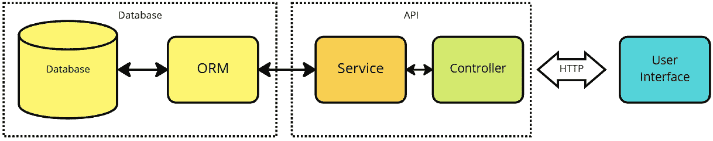

图 5.1 – 层次结构

在前面的图中，我们可以看到我们之前章节中提到的数据库和**对象关系映射**（**ORM**）。在本章中，我们将学习关于 API 的内容，因此我们将构建一个服务层来与数据库交互，以及一个控制器层来处理与 UI 或任何其他客户端的通信。

服务层是软件设计中的一个架构模式，它充当应用程序的 UI 和底层数据存储之间的中介。服务层的主要目的是封装和抽象应用程序的业务逻辑，促进关注点的分离，并使代码的维护和修改更容易。它还允许更好的单元测试，因为服务层可以在与应用程序的其他部分隔离的情况下进行测试。此外，它可以通过允许 UI 和数据存储组件独立演变来提高应用程序的可扩展性。

在 RESTful API 中，控制器负责处理来自客户端的 HTTP 请求并返回适当的 HTTP 响应。它们充当客户端和应用程序业务逻辑之间的中介，使用适当的服务层执行任何必要的操作。

控制器负责将 URL 映射到应用程序中的特定操作，例如从数据库检索数据、创建新资源或更新现有资源。它们解析传入的请求以确定所需操作，然后使用适当的服务层执行该操作并生成响应。

## 一个示例 API 设计

你可能会记得，在 *第三章* 中，我们开始构建 `HabitService` API，并添加了一些端点。我们将从 *第三章* 中我们停止的地方开始，但我们将向控制器添加更多功能！

我们已经添加的三个端点是以下这些：

一个 `GET` 端点，根据传入的 ID 获取单个习惯：

```cs
public async Task<IActionResult> GetAsync(int id) => Ok(await _habitService.GetById(id));
```

另一个 `GET` 端点，用于返回所有习惯：

```cs
public async Task<IActionResult> GetAsync() => Ok(await _habitService.GetAll());
```

最后，一个用于在数据库中创建新习惯的 `POST` 端点：

```cs
public async Task<IActionResult> CreateAsync(CreateHabitDto request) => Ok(await _habitService.Create(request.Name, request.Description));
```

在本节中，我们将为本章讨论的五个主要 HTTP 动词中的每一个添加一个端点。我们已经有 `GET` 和 `POST`，所以我们将添加 `PUT`、`PATCH` 和 `DELETE`。

### DTOs

但是，在我们编写端点之前，我们首先会添加 DTOs。我们已经在 *第三章* 中添加了 `CreateHabitDto`。从根目录运行以下脚本，或者手动添加文件：

```cs
cd GoodHabits.HabitService/Dtos; \
touch HabitDetailDto.cs; \
touch HabitDto.cs; \
touch UpdateHabitDto.cs; \
cd ..;
```

将以下内容复制到 `HabitDetailDto` 类中：

```cs
namespace GoodHabits.HabitService.Dtos;
public class HabitDetailDto {
    public int Id { get; set; }
    public string Name { get; set; } = default!;
    public string UserName { get; set; } = default!;
    public string GoalName { get; set; } = default!;
    public string Duration { get; set; } = default!;
}
```

然后将以下内容添加到 `HabitDto` 类中：

```cs
namespace GoodHabits.HabitService.Dtos;
public class HabitDto
{
    public int Id { get; set; } = default!;
    public string Name { get; set; } = default!;
    public string Description { get; set; } = default!;
}
```

最后，将以下内容添加到 `UpdateHabitDto` 类中：

```cs
namespace GoodHabits.HabitService.Dtos;
public class UpdateHabitDto
{
    public string Name { get; set; } = default!;
    public string Description { get; set; } = default!;
}
```

对于 DTOs，这就足够了。当我们开始构建端点时，我们将使用这些。

### AutoMapper

我们现在需要考虑一个工具，我们将使用它来在数据库类型和 DTOs 之间进行转换。这个工具就是 AutoMapper。

AutoMapper 是一个开源库，它允许你建立配置以将一个对象转换为另一个对象。这在将不同类型的对象（如数据库实体和 DTOs）之间进行转换时尤其有用。尽管 DTO 和实体可能具有相似的结构，但它们的实现可能不同。这个库通过减少在不同类型之间转换所需的重复和样板映射代码量，有助于保持你的代码库整洁和可维护，使你的应用程序更高效，更容易修改或添加新功能。

AutoMapper 被设计成简化将一种类型的对象映射到另一种类型的过程，并提供了一个简单、流畅的 API 来定义映射。AutoMapper 的一些关键特性包括：

+   支持对象层次结构的展开和折叠

+   支持在不同数据类型和自定义类型转换器之间进行转换

+   支持高级配置选项，例如映射到和从接口以及继承层次结构

+   支持在映射过程中使用自定义逻辑和约定

+   支持使用 **语言集成查询**（**LINQ**）表达式来定义映射

AutoMapper 可以通过减少在不同类型之间转换所需的重复、样板映射代码量，帮助你保持代码库整洁和可维护。这可以使你的应用程序更高效，并使添加新功能或修改现有功能变得更加容易。

要开始使用 AutoMapper，请在 API 项目中使用以下命令安装工具：

```cs
dotnet add package AutoMapper.Extensions.Microsoft.DependencyInjection
```

如前代码片段所示，更新了包后，我们可以开始为创建的数据库类型创建映射。

您会记得我们在数据库项目中添加了一个名为“Habit”的实体类型，在 *第三章* 中，我们还在 *第四章* 中为该对象添加了多个附加属性。如果您运行 `HabitService` 并使用 Thunder Client 打击返回所有习惯的端点，您将看到返回的数据包括所有这些附加属性。

这个习惯类代表了一个数据库实体。它非常具体于数据库，并且非常适合代表特定用例中良好习惯的概念。但是，它不适合将数据传输到 UI。

我们更希望数据以 DTO 的形式发送到 UI，就像我们之前创建的那样。

+   没有必要包括进度更新或提醒的集合。包含这些信息可能会大大增加应用程序所需的带宽。

+   `TenentName` 属性对用户没有用处，因为他们已经知道他们属于哪个租户！

我们创建的 DTO 看起来是这样的：

```cs
namespace GoodHabits.HabitService.Dtos;
public class HabitDto
{
    public int Id { get; set; } = default!;
    public string Name { get; set; } = default!;
    public string Description { get; set; } = default!;
}
```

在这个例子中，我们直接从实体类型中获取习惯的 ID、名称和描述，但更复杂的转换也是可能的。

虽然我们可以简单地手动复制属性，但这可能会很快变得非常乏味，所以我们将使用 `AutoMapper` 自动完成这项工作！

首先，进入 `Program.cs` 类并添加 `AutoMapper` 服务：

```cs
builder.Services.AddAutoMapper(AppDomain.CurrentDomain.GetAssemblies());
```

接下来，打开 `HabitsController` 类，并在 `using` 语句中添加以下内容：`using AutoMapper`。

然后，在类定义中添加以下内容：

```cs
private readonly IMapper _mapper;
```

接下来，添加 `using` 语句：

```cs
using AutoMapper;
```

接下来，修改构造函数以接受映射器，如下所示：

```cs
    public HabitsController(
        ILogger<HabitsController> logger,
        IHabitService goodHabitsService,
        IMapper mapper
        )
    {
        _logger = logger;
        _habitService = goodHabitsService;
        _mapper = mapper;
    }
```

最后，修改控制器中现有的两个 `GET` 端点以使用 `AutoMapper`，如下所示：

```cs
    [HttpGet("{id}")]
    public async Task<IActionResult> GetAsync(int id) =>
      Ok(_mapper.Map<HabitDto>(await
      _habitService.GetById(id)));
    [HttpGet]
    public async Task<IActionResult> GetAsync() =>
      Ok(_mapper.Map<ICollection<HabitDto>>(await
      _habitService.GetAll()));
```

在之前，控制器只是简单地从数据库返回实体对象，现在该对象正在自动映射到一个 DTO，该 DTO 由控制器返回。但这确实需要一点配置。

最后一步是告诉 `AutoMapper` 如何在两种类型之间进行转换。

在 `HabitService` 项目中添加一个名为 `Mappers` 的文件夹和一个名为 `HabitMapper.cs` 的类。您可以使用以下脚本：

```cs
mkdir Mappers; \
cd Mappers; \
touch HabitMapper.cs; \
cd ..;
```

在这个类中，添加以下内容：

```cs
using AutoMapper;
using GoodHabits.HabitService.Dtos;
using GoodHabits.Database.Entities;
namespace GoodHabits.HabitService.Mappers;
public class HabitMapper : Profile
{
    public HabitMapper()
    {
        CreateMap<Habit, HabitDto>();
    }
}
```

`CreateMap` 方法指示 `AutoMapper` 在两种类型之间进行映射。

现在，您可以使用 Thunder Client 打击端点以获取习惯，您应该看到如下内容：

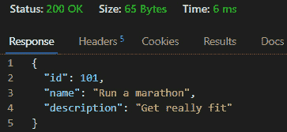

图 5.2 – 成功的响应

本节展示了我们如何自动在数据库类型和数据传输类型之间进行转换。这是 API 拼图中的一个非常关键的组成部分，理解如何操作 AutoMapper 将帮助你编写更好的代码，并减少 API 和任何连接的客户端之间传输的数据量。

### 修改服务

在我们可以在 API 上构建更新和删除习惯的额外端点之前，我们需要在服务类中添加一些功能。我们已经在*第三章*中创建了服务类和接口，但我们将在这里扩展其功能。

将以下内容添加到接口中：

```cs
using GoodHabits.Database.Entities;
using GoodHabits.HabitService.Dtos;
namespace GoodHabits.HabitService;
public interface IHabitService
{
Task<Habit> Create(string name, string description);
Task<Habit> GetById(int id);
Task<IReadOnlyList<Habit>> GetAll();
Task DeleteById(int id);
Task<Habit?> UpdateById(int id, UpdateHabitDto request);
}
```

实现前面接口的`HabitService`类需要添加两个方法来删除和更新存储在数据库中的习惯。将以下两个方法添加到`HabitService`类中：

```cs
    public async Task DeleteById(int id)
    {
        var habit = await _dbContext.Habits!.FindAsync(id)
          ?? throw new ArgumentException("User not found");
        _dbContext.Habits.Remove(habit);
        await _dbContext.SaveChangesAsync();
    }
    public async Task<Habit?> UpdateById(int id,
      UpdateHabitDto request)
    {
        var habit = await _dbContext.Habits!.FindAsync(id);
        if (habit == null) return null;
        habit.Name = request.Name;
        habit.Description = request.Description;
        await _dbContext.SaveChangesAsync();
        return habit;
    }
```

你还需要在服务类中添加一个`using`语句：

```cs
using GoodHabits.HabitService.Dtos;
```

服务层中所需的所有内容都已添加。

这已经有很多配置了，但我们现在准备好构建控制器类。

### 添加到控制器

我们已经通过添加 DTOs、配置 AutoMapper 和构建服务层完成了大部分繁重的工作。我们需要在控制器中添加三个额外的端点。让我们从`DELETE`端点开始：

```cs
    [HttpDelete("{id}")]
    public async Task<IActionResult> DeleteAsync(int id)
    {
        await _habitService.DeleteById(id);
        return NoContent();
    }
```

这非常直接。它使用服务方法来删除数据库中的条目，然后返回`NoContent`——这是删除方法的最佳实践。

接下来，添加使用`PUT`动词更新对象的端点：

```cs
    [HttpPut("{id}")]
    public async Task<IActionResult> UpdateAsync(int id,
      UpdateHabitDto request)
    {
        var habit = await _habitService.UpdateById(id,
          request);
        if (habit == null)
        {
            return NotFound();
        }
        return Ok(habit);
    }
```

这里有一些错误处理，如果客户端尝试更新一个不存在的条目，它将返回`404`。

最后，添加使用`PATCH`动词更新对象的端点：

```cs
    [HttpPatch("{id}")]
    public async Task<IActionResult> UpdateAsync(int id,
      [FromBody] JsonPatchDocument<UpdateHabitDto> patch)
    {
        var habit = await _goodHabitsService.GetById(id);
        if (habit == null) return NotFound();
        var updateHabitDto = new UpdateHabitDto { Name =
          habit.Name, Description = habit.Description };
        try
        {
            patch.ApplyTo(updateHabitDto, ModelState);
            if (!TryValidateModel(updateHabitDto)) return
              ValidationProblem(ModelState);
            await _goodHabitsService.UpdateById(id,
              updateHabitDto);
            return NoContent();
        }
        catch (JsonPatchException ex)
        {
            return BadRequest(new { error = ex.Message });
        }
    }
```

这部分内容稍微复杂一些，因为它使用了`JsonPatchDocument`来修改对象。你还需要添加两个`using`语句：

```cs
using Microsoft.AspNetCore.JsonPatch;
using Microsoft.AspNetCore.JsonPatch.Exceptions;
```

到目前为止，我们只需要做这些。现在我们有一个很好的例子，展示了五种最常见的 HTTP 动词。在我们继续之前，我们应该测试这些是否都正常工作。我们将使用 Thunder Client 进行测试。

### 测试

为了测试我们刚刚添加的端点，我们需要一个测试客户端。遵循使用**Visual Studio Code**（**VS Code**）的主题，我们将向代码中添加一个扩展，以便我们可以在一个地方完成所有操作。我们已经提到了这个工具几次，但我们将在本节中对其进行详细探讨。

你将在扩展工具栏上看到 Thunder Client 图标：


图 5.3 – Thunder Client 图标

使用 Thunder Client，你可以直接从 VS Code 中调用你的 API 并检查其是否按预期运行。我们现在就做这个。通过在 VS Code 的终端中启动 API，导航到 API 项目，并输入以下内容来启动 API：

```cs
dotnet run
```

这将构建项目并启动 API。现在我们可以开始添加测试了！

#### 添加一个 GET 请求

现在，完成以下步骤：

1.  点击 Thunder Client 图标（如果你在左侧菜单中看不到它，退出并重新启动* *Docker 环境*）。

1.  点击`GoodHabits`。

1.  在新创建的集合上*右键点击*，点击`GET`习惯（不要点击在**新请求**按钮下面的部分；右键点击集合）。

你的集合应该看起来像这样：

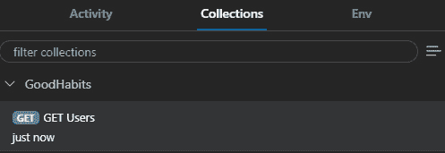

图 5.4 – Thunder Client 集合

1.  点击带有`CloudSphere`值的`tenant`键（你会记得从*第三章*中，我们需要为多租户指定租户）。

当你完成时，它应该看起来像这样：

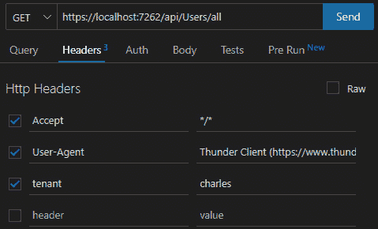

图 5.5 – 配置的请求

前面的截图显示了一个正确配置的`GET`请求，它应该返回数据库中的所有习惯。

最后，点击`GET`请求并测试端点。你会看到以下内容：

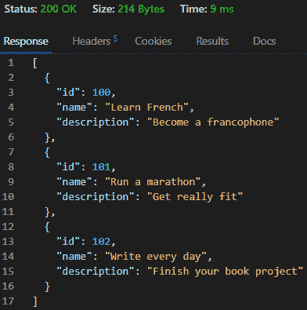

图 5.6 – 返回的习惯

我们为了达到这个阶段投入了相当多的工作！我们正在展示数据库项目中`SeedData`文件的数据，这些数据是从我们的`HabitsService`返回的。我们很快将构建一个 UI 来展示这些信息。

#### 添加一个 POST 请求

重复前面的步骤，构建一个`POST`用户请求。在这种情况下，我们需要在正文中以 JSON 格式指定习惯详情：

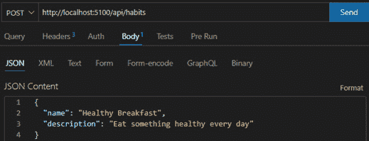

图 5.7 – 配置的 POST 请求

你可以看到指定的 JSON 与`CreateHabitDto`类匹配。

不要忘记在头部设置租户并将请求类型更改为`POST`！点击**发送**将确认习惯已被创建。

到目前为止，我们已经测试了`get all`端点和`POST`端点。添加另一个`GET`来测试`get-by-id`端点也是一个有用的练习！

#### 添加一个 DELETE 请求

我们可能想要从数据库中删除一个习惯，因此我们已经向服务和控制器中添加了所需的方法。我们可以以同样的方式再次测试：

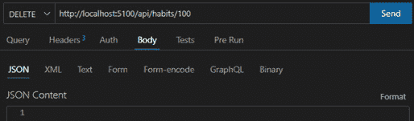

图 5.8 – 配置的 DELETE 请求

前面的截图显示在正文中不需要任何内容。但不要忘记添加租户头部！

#### 添加一个 PUT 请求

测试我们添加的`PUT`端点是相当直接的。配置一个像这样的`PUT`请求：

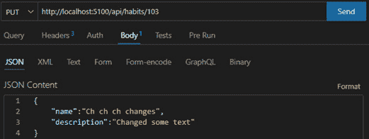

图 5.9 – 配置的 PUT 请求

前面的图示显示了如何配置一个`PUT`请求。这将更改`id=103`的习惯的名称和描述。如果你在过程中对数据进行过更改，可能需要更改 URL 中的 ID。你可以通过再次点击`get-by-id`端点来检查是否已进行了更改。

#### 添加一个 PATCH 请求

测试 `PATCH` 端点稍微有些棘手。您会记得，我们在控制器中构建的 `PATCH` 端点期望一个 `JsonPatchDocument` 对象，因此这就是我们必须提供的。一个 `Patch` 文档可能看起来像这样：

```cs
[
    {
        "op": "replace",
        "path": "/Name",
        "value": "A New Name"
    }
]
```

上述代码使用 `replace` 操作符来更改 `Name` 变量的值。我们可以这样设置请求：

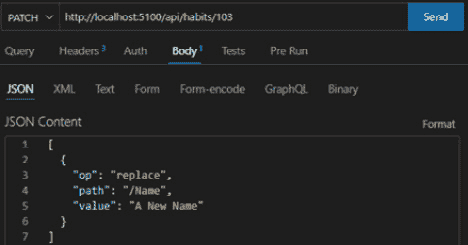

图 5.10 – 配置的 PATCH 请求

配置此设置并点击发送将更新具有 `id=103` 的习惯。再次提醒，您可能需要更改 URL 中的 ID。

您会注意到，在成功修补后，服务将返回 `204 No Content` 响应。这是预期的行为，并且被认为是成功 `PATCH` 响应的最佳实践。

这将是讨论更多关于 HTTP 状态码的好时机！

### 使用正确的 HTTP 状态码

在本章前面，我们讨论了 HTTP 状态码，并查看了一些可能对基本示例有用的状态码。

我们应该添加并测试的两个是以下内容：

+   如果请求获取一个不存在的用户，正确的状态码应该是 `404` `未找到`

+   如果成功请求创建一个新用户，正确的状态码应该是 `201 Created`

由于我们已经将服务和控制器分离，我们不需要更改任何服务逻辑来促进这一点。控制器负责分配 HTTP 状态码。虽然这里的例子相当直接，但我希望您能看出以这种方式分离逻辑在事情变得复杂时非常有好处。

我们将从修改 `GET` 方法开始，该方法接受一个 `id` 参数，如下所示：

```cs
    [HttpGet("{id}")]
    public async Task<IActionResult> GetAsync(int id)
    {
        var habit = await _habitService.GetById(id);
        if (habit == null) return NotFound();
        return Ok(_mapper.Map<HabitDto>(await
          _habitService.GetById(id)));
    }
```

我们只是添加了一个检查，看看用户对象是否为 `null`，如果是，则返回 `NotFound()`，这将返回 `404` 状态码。

您可以在 Thunder Client 中通过请求一个您知道在数据库中不存在的用户 ID 来测试这一点：

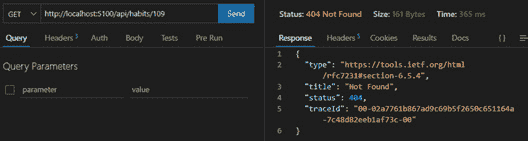

图 5.11 – 未找到习惯

在前面的屏幕截图中，我们演示了请求一个不存在的用户现在会导致 `404` HTTP 状态码。

接下来，让我们修复创建新用户的 HTTP 状态码。将 `Create` 端点修改如下：

```cs
    [HttpPost]
    public async Task<IActionResult>
      CreateAsync(CreateHabitDto request)
    {
        var habit = await _habitService
          .Create(request.Name, request.Description);
        var habitDto = _mapper.Map<HabitDto>(habit);
       return CreatedAtAction("Get", "Habits", new { id =
         habitDto.Id }, habitDto);
    }
```

我们已经将返回值从 `Ok()` 更改为 `CreatedAtAction(…)`。这将返回 `201 – Created` 以及新创建的资源位置给用户。

如果您回到 Thunder Client 并创建另一个用户，您将看到以下内容：

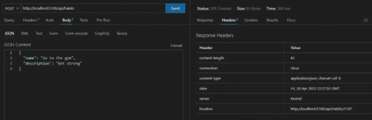

图 5.12 – 使用 201 状态码创建

点击 **Headers** 选项卡将给出新创建资源的位置。这对希望立即与新资源交互的 API 消费者非常有用。

如果你查看`HabitsController`中的`PUT`和`PATCH`端点，你会看到我们根据处理响应时发生的情况返回几个不同的状态码。这是一个很好的练习，你可以通过这些来确信你已经理解了为什么选择了每一个。

如果你查看`PATCH`端点，你会看到它执行以下操作：

+   它会检查提供的 ID 是否有效，如果不是，则返回`404 –` `Not Found`。

+   它会检查更新的模型是否有效，如果不是，则返回一个验证问题（`400` `Bad Request`的一个子集）。

+   如果更新有任何其他问题，它返回`400` `Bad Request`。

+   如果没有问题，它返回`204` `No Content`。

使用`No Content` HTTP 状态码（`204`）来表示服务器已成功处理请求，并且没有响应体需要返回。在`PATCH`请求的情况下，`No Content`状态码用于表示服务器已成功处理对资源的更新，但在响应中未返回任何内容。其理念是客户端已经知道更新后的资源看起来是什么样子，因此没有必要在响应中返回更新后的资源信息。客户端可以简单地假设更新已成功，并且资源已按请求更新。

# 公共 API 的版本控制

版本控制公共 RESTful API 是创建和维护多个 API 版本的过程，以适应更改和新功能。这确保了现有客户端不会受到对 API 所做的更改的影响，并且新客户端可以利用新功能。

版本控制是 API 开发和维护的关键方面，因为它使得 API 随着时间的推移而演变，同时保持与现有客户端的兼容性。这在 API 被多个客户端使用的情况下尤为重要，因为破坏性更改会影响这些客户端的功能。通过版本控制，可以同时存在多个 API 版本，客户端可以选择升级到最新版本或继续使用满足其需求的早期版本。这样，版本控制为 API 随着时间的推移而演变和改进提供了必要的灵活性，而不会破坏现有集成的稳定性。

有几种策略可以用于版本控制 RESTful API，每种策略都有其自身的优缺点：

+   `/v1/users`或`/v2/users`。这种方法易于实现和理解，但随着版本数量的增加，可能难以维护和扩展。

+   `X-API-Version`。这种方法允许更大的灵活性，因为 URI 不需要改变，但它可能更复杂来实现，并且可能不被所有客户端支持。

+   `application/vnd.example.v1+json` 或 `application/vnd.example.v2+json`。这种方法提供了更大的灵活性，因为 URI 和头信息不需要更改，但实现起来可能更复杂，并且可能不被所有客户端支持。

+   **弃用和停用**：这种策略涉及将 API 的旧版本标记为弃用，并最终将其停用。这种方法允许逐步过渡，并为客户端提供时间在旧版本被移除之前更新他们的代码。

值得注意的是，最合适的版本控制策略将取决于 API 及其客户端的具体需求。向 API 的客户端传达版本控制策略和旧版本弃用的时间表，以最小化中断并允许他们相应地规划，这是非常重要的。

为 API 进行版本控制最常见的方式是将版本号包含在 API 端点的 URL 中。例如，API 端点的 URL 可能看起来像这样：

```cs
https://api.example.com/v1/resources
```

这种方法允许不同版本的 API 共存，并且通过简单地更改 URL 中的版本号，就可以轻松地管理 API 随时间的变化。这也允许客户端选择他们希望在应用程序中使用的 API 版本，并有助于防止 API 的破坏性更改影响现有的客户端应用程序。

如果创建了前面示例的第二版本，它可以在以下链接中找到：

```cs
https://api.example.com/v2/resources
```

这个好处是，两个版本可以同时存在，并且那些仍然期望`v1`版本的客户端用户可以无缝地继续工作。当然，支持多个版本可能很困难，理想情况下，这应该是一个过渡状态，目的是在某个时候弃用`v1`版本。

## 示例代码展示如何对 API 进行版本控制

在本章的前面部分，我们构建了一个控制器来管理用户，并向其添加了多个端点。尽管如此，我们还没有为 API 添加任何版本控制；请注意，我们使用 Thunder Client 测试的 URL 没有与它们关联的版本，如下所示：

```cs
http://localhost:5100/api/habits
```

让我们改变一下！

首先打开控制台，并将版本控制包添加到`HabitService`项目中：

```cs
dotnet add package Microsoft.AspNetCore.Mvc.Versioning
```

将`using`语句添加到`Program.cs`文件中：

```cs
using Microsoft.AspNetCore.Mvc.Versioning;
```

接下来，将以下内容复制到`Program.cs`文件中：

```cs
builder.Services.AddApiVersioning(opt =>
    {
        opt.DefaultApiVersion = new
          Microsoft.AspNetCore.Mvc.ApiVersion(1,0);
        opt.AssumeDefaultVersionWhenUnspecified = true;
        opt.ReportApiVersions = true;
        opt.ApiVersionReader = ApiVersionReader.Combine(new
          UrlSegmentApiVersionReader(),
          new HeaderApiVersionReader("x-api-version"),
          new MediaTypeApiVersionReader("x-api-version"));
    });
```

让我们详细回顾一下前面的代码：

+   第一个标志设置默认的 API 版本。这允许客户端在无需指定版本的情况下与 API 一起工作。

+   第二个标志指示应用程序在没有指定任何内容时使用默认版本。这是一个防御性编程的例子——你的用户会感谢你的！

+   第三个标志是返回选项——这会在响应头中返回可用的版本，以便调用客户端可以看到该方法有可用的选项。

+   最后，`ApiVersionReader`使客户端能够选择是否将版本放在 URL 中或请求头中。再次强调，给 API 的消费者选择是很好的。

现在，我们需要更新`HabitsController`以支持多个版本。

为了说明这一点，我们将只使用一个简单的`GET`端点。但您可以将相同的逻辑应用于任何端点。

将`HabitsController`类的属性更改为以下内容：

```cs
[ApiController]
[Route("api/[controller]")]
[Route("api/v{version:apiVersion}/[controller]")]
[ApiVersion("1.0")]
```

让我们通过向控制器添加一个端点并将其映射到`version 1.0`来证明我们所做的工作，如下所示：

```cs
    [MapToApiVersion("1.0")]
    [HttpGet("version")]
    public virtual async Task<IActionResult> GetVersion()
    {
        return Ok("Response from version 1.0");
    }
```

我们已将此方法标记为虚拟，以便我们可以在后续版本中覆盖它。

创建一个名为`HabitsControllerv2.cs`的文件，并将其添加以下内容：

```cs
using Microsoft.AspNetCore.Mvc;
namespace GoodHabits.HabitService.Controllers.v2;
[ApiController]
[Route("api/[controller]")]
[Route("api/v{version:apiVersion}/[controller]")]
[ApiVersion("2.0")]
public class HabitsController : ControllerBase
{
    [MapToApiVersion("2.0")]
    [HttpGet("version")]
    public virtual IActionResult GetVersion()
    {
        return Ok("Response from version 2.0");
    }
}
```

注意，这将`version`端点映射到`v2` API。您可以在 Thunder Client 中按常规方式测试它，您将看到更改 URL 中提供的版本将更改您收到的响应。

此外，请注意，我们已两次指定`Route`属性——一次包含版本，一次不包含。这允许在`Program.cs`中指定的默认版本生效。

在 Thunder Client 中运行三个测试——一个没有版本，一个有`v1`，一个有`v2`：

+   没有版本：http://localhost:5100/api/Habits/version

+   版本 1：`http://localhost:5100/api/v1/Habits/version`

+   版本 2：`http://localhost:5100/api/v2/Habits/version`

您将看到第一个返回`v1`，因为这是默认版本，您将看到其他两个按预期执行。

您还应该注意，我们在 Thunder Client 中之前设置的所有请求继续按预期运行。从 API 消费者的角度来看，这是非常好的。我们刚刚引入了版本控制并添加了`v2`，而没有破坏任何现有功能！

# 测试 API

在本章中，我们广泛地展示了如何使用 Thunder Client 测试您的 API。测试 API（以及一般测试）是一个巨大的主题，可以成为一本单独的书的主题。如果您感兴趣，我在以下部分提供了一些进一步阅读的指南！

以下列表提供了一些测试类型示例，以确保您的 API 正常运行。单元测试涉及测试 API 的各个组件以确保它们按预期工作。这通常使用单元测试框架，如 NUnit，并且可以自动化：

+   功能测试涉及端到端测试 API 以确保所有组件都正确协同工作。这可以手动完成或使用自动化测试工具，如 Selenium 或 TestComplete。

+   集成测试涉及在与其他系统（如数据库或其他 API）结合的情况下测试 API。这可以通过使用集成测试框架，如 Cucumber 或 FitNesse 来完成。

+   性能测试包括测试一个 API 以确保其能够处理预期的负载并表现最佳。

+   安全测试包括测试一个 API 以确保其安全且不受常见安全威胁的影响，例如 SQL 注入或跨站脚本攻击。这可以通过使用安全测试工具，如 Nessus 或 OWASP ZAP 来实现。

+   可用性测试包括测试一个 API 以确保其易于使用和理解。这可以手动进行或使用可用性测试工具，如 UserTesting 或 Crazy Egg。

+   Postman 是测试 RESTful API 的流行工具。它允许开发者轻松创建、发送和分析 HTTP 请求。它具有用户友好的界面，支持各种功能，如请求和响应验证、环境变量和自动化测试。它还允许我们测试端到端场景，并且可以与其他工具如 Jenkins 集成。

值得注意的是，测试 RESTful API 是一个持续的过程，应该在开发过程中始终进行，而不仅仅是最后。这将有助于确保 API 按预期工作，并且任何问题都能迅速识别和解决。

在本章中，我们展示了如何在 VS Code 中使用 Thunder Client 测试 API。这是一个非常有用的工具，其优点是定义的测试被保存在仓库中，并与代码进行比对。

# 摘要

本章我们涵盖了很多内容！希望它没有让你感到不知所措！我们从 REST 的定义开始，然后介绍了 HTTP 状态码和 HTTP 动词，以提供一些关于 REST API 底层基础知识的背景。

然后，我们查看了一个示例，介绍了五个最重要的 HTTP 动词（`GET`、`POST`、`DELETE`、`PUT`和`PATCH`），并展示了我们如何在 VS Code 中直接使用 Thunder Client 构建和测试它们！

我们还研究了`AutoMapper`以及如何简化对象转换以从实体类型创建 DTO。

最后，我们通过一个示例演示了如何对 API 进行版本控制，并探讨了额外的测试技术。

在下一章中，我们将考虑微服务，并探讨如何将此应用程序拆分为多个较小的微服务！

# 进一步阅读

+   HTTP 响应状态码：[`developer.mozilla.org/en-US/docs/Web/HTTP/Status`](https://developer.mozilla.org/en-US/docs/Web/HTTP/Status)

+   使用 HTTP 方法进行 RESTful 服务：[`www.restapitutorial.com/lessons/httpmethods.html`](https://www.restapitutorial.com/lessons/httpmethods.html)

+   HATEOAS 及其在 RESTful API 中的必要性 [`www.geeksforgeeks.org/hateoas-and-why-its-needed-in-restful-api/`](https://www.geeksforgeeks.org/hateoas-and-why-its-needed-in-restful-api/)

+   测试一个 API：[`learning.postman.com/docs/designing-and-developing-your-api/testing-an-api/`](https://learning.postman.com/docs/designing-and-developing-your-api/testing-an-api/)

+   如何在 ASP.NET Core Web API 中使用 API 版本控制并将其与 .NET 6 集成：[`blog.christian-schou.dk/how-to-use-api-versioning-in-net-core-web-api/`](https://blog.christian-schou.dk/how-to-use-api-versioning-in-net-core-web-api/)

# 问题

1.  使用 `PATCH` 而不是 `PUT` 的优势是什么？

1.  使用 AutoMapper 的好处是什么？

1.  当创建新资源时应该使用哪个 HTTP 状态码？

1.  HTTP 状态码的 `500` 范围表示什么？

1.  REST 代表什么？

1.  DTO 的用途是什么？
