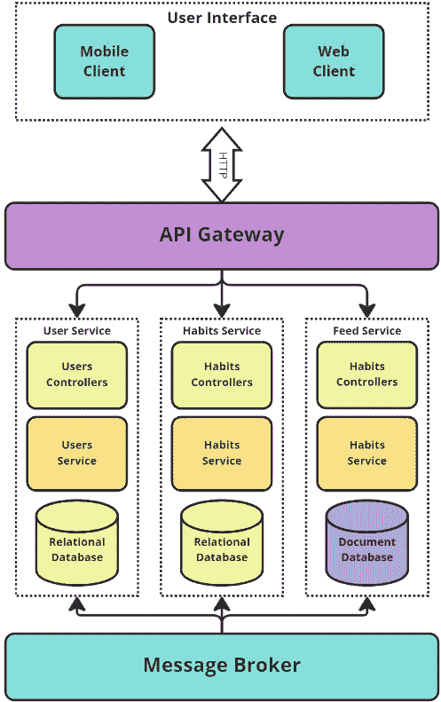

# 6

# SaaS 应用程序的微服务

微服务是一种强大的架构模式，在现代软件开发中越来越受欢迎。微服务是将大型应用程序组织成更小、更易于管理和独立的子服务的方式，这些子服务可以使用定义良好的接口相互通信。随着公司寻求构建更具可扩展性和健壮性的软件系统，这种方法在近年来越来越受欢迎。随着现代应用程序复杂性的增加，传统的单体软件构建方法已不再足够。微服务提供了一种将复杂应用程序分解为更小、更易于管理、可独立开发、部署和维护的组件的方法。

实施微服务需要改变我们思考构建和部署软件的方式。使用微服务，我们摆脱了在单个应用程序中构建一切的单体方法，转而构建一系列较小的、独立的子服务，这些子服务可以独立部署和扩展。这种方法的转变使我们能够构建更灵活和有弹性的系统，因为我们能够独立更新、测试和部署单个服务。同时，我们需要确保我们的微服务能够高效地相互通信，并且我们有机制来处理分布式系统中的错误和故障。

本章将探讨构建微服务时的重要考虑因素，并提供指南，帮助您在软件开发项目中开始实施微服务。

本章将涵盖以下主要主题：

+   微服务及其用途

+   构建高性能和安全的微服务的最佳实践

+   如何使用我们学到的技能来处理微服务的 RESTful API

+   构建微服务时的常见陷阱以及如何避免它们

+   一些实用建议

# 技术要求

本章中所有代码均可在[`github.com/PacktPublishing/Building-Modern-SaaS-Applications-with-C-and-.NET/tree/main/Chapter-6`](https://github.com/PacktPublishing/Building-Modern-SaaS-Applications-with-C-and-.NET/tree/main/Chapter-6)找到。

# 什么是微服务以及为什么使用它们？

微服务是一种软件架构风格，它将应用程序结构化为一系列松散耦合的服务。与所有功能都打包在单个代码库中的传统单体架构不同，微服务将功能分解为更小、更独立的子服务，这些子服务可以独立开发、部署和扩展。

微服务架构最早在 2000 年代初被引入，近年来由于对更快开发周期、灵活扩展和改进应用程序弹性的需求增加而受到欢迎。微服务被视为快速向客户提供价值并具有更高敏捷性的方式，这使得它们非常适合寻求快速迭代和创新的组织。

微服务也为组织带来了多项好处。通过将应用程序分解为更小、更专注的服务，组织可以提升其开发流程的速度和效率。团队可以并行工作在更小、独立的服务上，减少延迟的风险，并确保每个服务都能以高质量交付。此外，微服务可以独立部署和扩展，使组织能够更快地响应需求变化并优化其应用程序的性能。

在学习微服务时，理解松散耦合和紧密耦合的底层概念非常重要。

## 松散耦合与紧密耦合的区别

在紧密耦合的系统中，组件之间相互依赖性很强，彼此之间关系紧密。这意味着一个组件的变化可以对系统中的其他组件产生重大且通常是破坏性的影响。紧密耦合的系统可能会迅速变得非常复杂且难以维护。系统某一部分的更改可能导致其他地方出现意外的后果。如果自动化测试有限，这可能会非常难以检测，并可能导致生产代码中的错误。

相比之下，松散耦合的系统具有独立组件，彼此之间的依赖性最小。这允许组件独立开发、部署和维护，对系统中的其他组件影响很小或没有影响。松散耦合使团队能够更高效、更敏捷地工作，因为对单个组件的更改对系统其他部分的影响很小或没有影响。虽然松散耦合听起来像是一个明显的选择，但在实践中，设计一个松散耦合的系统需要大量的额外工作。

微服务架构基于松散耦合的原则，即应用程序被分解为更小、更专注的服务，这些服务可以独立开发、部署和扩展。这使组织能够更快地响应需求变化，优化其应用程序的性能，并提高其开发流程的速度和效率。

SaaS 应用程序通常相当复杂。项目上通常会有一支相当大的团队在合作，每个团队都有自己的专业领域。通过将应用程序分解成更小、更专注的服务，团队可以并行工作，降低延迟风险并提高交付速度。这有助于组织更快地响应需求变化并向客户更快地交付价值。

微服务的另一个优点是更好的可伸缩性。依赖基于云的基础设施，每个服务都可以独立部署和扩展，使组织能够更快地响应需求变化并优化其应用程序的性能。这对于经常经历使用模式波动的 SaaS 应用程序尤为重要。当使用量高时，可以通过提供更多资源来提高应用程序的性能。当使用量低时，可以关闭一些资源，帮助组织管理其云计算成本并优化资源的使用。

微服务还应设计为具有高度弹性，这意味着即使一个服务失败，对整个系统的影响也最小。这使得微服务非常适合 SaaS 应用程序，因为停机时间可能会对客户满意度产生重大影响，并相应地影响提供应用程序的公司的收入。通过将应用程序分解成更小、更专注的服务，组织可以降低在系统更改时意外后果的风险，使维护和修改更容易，并降低停机风险。

微服务是有志于开发 SaaS 应用程序的组织的一个有价值的工具。它们提供了更高的敏捷性、更好的可伸缩性、改进的弹性、更简单的维护和更好的成本管理，使它们成为寻求快速迭代和创新的组织的理想选择。

## Docker

使用`GoodHabits`服务，我们一直在使用 Docker 运行一个包含开发环境和 SQL 服务器数据库的`devcontainer`。这只是 Docker 可以使用的多种方式之一。在其核心，Docker 是一个可以在容器中运行进程的工具。你可以将容器想象成一个非常轻量级的虚拟机，通常运行 Linux 发行版。

Docker 经常成为构建微服务时非常重要的工具。一个微服务应用程序通常会有许多不同的组件，这些组件必须运行才能使整个系统运行。这可能包括使用不同的编程语言运行代码，以及针对多个不同的数据库平台运行。试图在开发机器上可靠地运行所有内容，并在多个云环境中运行，很快就会变成一场噩梦！

Docker 提供了一种高效且可靠的方式来在一系列网络容器中运行您的微服务。通过容器化您的微服务，您可以隔离它们，使它们更容易构建和运行。

此外，Docker 允许您轻松打包您的微服务和它们的依赖项，使您能够将服务部署到不同的环境中，包括在开发环境中运行。这有助于确保您的微服务能够在不同的系统上保持一致的工作，这对于微服务构建来说是至关重要的，尽管具有挑战性。

虽然 Docker 对于构建微服务并非绝对必要，但它作为最佳实践被高度推荐，以提高微服务部署的效率和可靠性。我们将在下一节中详细讨论一些更多最佳实践。

# 构建微服务的最佳实践

在构建微服务时，考虑最佳实践以确保您从构建微服务应用程序所需的额外工作中获得好处是非常重要的。系统应该是可扩展的、可维护的和有弹性的——这是额外努力的回报！以下是一些最重要的最佳实践或“原则”，您需要记住。

## 失败设计

微服务应该“设计为失败”。如果它们会失败（所有软件都会失败！），它们应该优雅地失败，内置冗余以确保即使一个服务失败，系统也能继续运行。

在设计失败时，一个重要的步骤是*向您的系统添加冗余*。这可以通过让每个服务的多个实例并行运行来实现，这样如果其中一个失败，其他实例可以继续运行。请注意，这将产生一些额外的成本，例如云托管成本。负载均衡有助于在服务的多个实例之间均匀分配负载，降低单个实例过载的风险，并在一个实例失败时帮助将负载重定向到另一个实例。

*断路器*在设计失败时也是另一个有用的工具。这些可以用来自动检测和隔离失败的服务，防止它们影响系统的其余部分。这使得即使一个服务失败，整体系统也有更大的可能性继续运行。

在接受“失败设计”原则时，*幂等性*也是至关重要的。这涉及到确保每个服务都是幂等的，意味着它可以多次执行并得到相同的结果。这允许您在服务失败时重试请求，从而降低数据丢失或不一致结果的风险。您会记得，我们在上一章学习某些 HTTP 动词时遇到了这个话题。这里的原理是相同的。

应该使用*健康检查*定期测试每个服务并确定其是否正常运行。然后，可以使用这些信息在原始实例失败时自动将请求重定向到该服务的其他实例（依赖于冗余原则）。这些健康检查应该自动运行或在定义的计划上运行，并在出现任何问题时立即通知团队。

## 专注于解耦

微服务应该是（按定义）松散耦合的，服务之间依赖性最小。这允许服务独立地进行开发、部署和修改，从而降低意外后果的风险。

解耦是一个核心原则，也是构建基于微服务系统的关键方面。解耦指的是在不同服务之间分离关注点，使它们能够独立运行并降低级联故障的风险。

必须有*明确的服务边界*——每个服务都应该有特定的责任和目的，不与其他服务重叠。这样做将有助于确保每个服务可以独立开发和部署，减少服务之间的相互依赖。

*异步通信*是解耦服务的重要方面。而不是直接通信，消息可以在服务之间发送并在稍后处理。这允许每个服务独立运行，降低阻塞和级联故障的风险。

在解耦服务时实施某种形式的*版本控制*非常重要。每个服务都应该有一个版本号，这可以允许系统中共存多个服务版本。这允许对服务进行更改，而不会影响其他服务，减少服务之间的相互依赖。我们已经在上一章中讨论了版本控制。

*使用事件驱动架构*是解耦服务的重要部分。事件可以在其他服务中触发动作，减少直接通信的需求。这允许每个服务独立运行，减少服务之间的相互依赖。这在基于事件的消息队列促进系统内各种服务之间的通信时经常看到。

最后，*服务发现*是解耦服务的有用工具。如果你考虑一个系统，该系统可能包含 20 个不同的松散耦合服务，这些服务以 Docker 容器的星系形式托管在云中，并且可能有一些服务的多个版本，跟踪它们所有运行的地点可能会变得非常具有挑战性。使用某种形式的服务发现允许系统自动检测并连接到其他服务，减少硬编码连接的需求。

接受“关注解耦”原则有助于构建一个健壮的基于微服务的系统。通过定义清晰的服务边界，使用异步通信，实现版本控制，使用事件驱动架构，以及考虑服务发现，你可以确保你的系统是可扩展的、灵活的并且具有弹性。

## 接受自动化

自动化对于微服务的有效运行至关重要，因为它有助于确保服务之间的一致性和可靠性。应尽可能使用自动化来提高测试（使用自动化测试套件）、部署（CI/CD）和扩展（可能使用 Terraform）。

自动化是所有类型软件开发中的一个非常重要的原则，但在构建利用微服务架构的 SaaS 应用程序时，这一点尤为重要。自动化部署和测试流程有助于减少人工工作量并加快将新功能交付给用户的速度。自动化的部署和测试流程确保服务的一致部署，并在开发周期早期发现任何问题。这有助于减少停机时间并提高系统的整体效率。

*实施 CI/CD*有助于确保代码更改自动构建、测试和部署。这有助于减少测试新功能所涉及的人工工作量，并尽可能快地将它们交付给用户。CI/CD 还有助于确保代码更改的一致部署，并在开发周期早期发现任何问题。使用管道自动构建、测试和部署微服务将使项目管理在项目开始增长时变得更加容易！

自动化监控和日志记录也是有用的。自动化监控和日志记录有助于早期发现问题并减少停机时间。自动化的监控和日志记录流程确保系统持续被监控，并且任何问题都能被早期发现，减少人工工作量并提高系统的整体效率。

在生产环境中，SaaS 应用程序可能会经历系统各部分需求量的快速波动。自动化可以促进自动扩展，以确保系统在无需人工干预的情况下处理增加的流量。自动扩展流程确保系统可以根据流量进行扩展或缩减，减少人工工作量并提高系统的整体效率。

接受“拥抱自动化”原则有助于构建一个健壮且高效的基于微服务的系统。自动化部署和测试流程、实施 CI/CD、自动化监控和日志记录以及自动化扩展流程有助于简化流程、减少人工工作量并提高系统的效率。

## 使用基于合同的开发

微服务应该有定义良好的合同，这些合同定义了服务之间的接口。这允许服务独立演进，同时仍确保兼容性。在这个背景下，“合同”指的是一个协议，它指定了服务之间的交互，包括每个服务的输入和输出细节、通信协议和数据格式。这个合同可以用各种形式表示，如 API 规范、消息格式或文档，并且应由所有参与构建和维护服务的团队达成一致。

基于合同的开发要求在服务之间定义清晰的合同。这些合同应定义每个服务的输入和输出，并确保服务按预期运行。这有助于降低破坏性变更的风险，并提高系统的整体稳定性。

就像应用的其他许多部分一样，测试非常重要。*合同测试*确保服务之间的合同得到测试并遵守，降低破坏性变更的风险，并提高系统的整体稳定性。

“使用基于合同的开发”原则有助于构建一个健壮且稳定的基于微服务的系统。在服务之间定义清晰的合同、测试合同、实施合同测试和自动化合同测试，有助于确保服务按预期运行并遵守定义的接口，降低破坏性变更的风险，并提高系统的整体稳定性。

## 主动监控和记录

微服务系统生成大量数据，因此实施一个健壮的监控和日志记录策略至关重要。这将帮助您检测和诊断问题——希望在此之前，这些问题不会对您的用户产生影响！

系统应持续自动监控，监控范围包括服务的整体健康状况、整个系统和每个微服务的响应时间以及资源利用率。

除了监控解决方案之外，还应该有一个日志记录机制。日志记录有助于跟踪系统的活动、检测问题以及排除任何故障。这种日志记录应包括记录请求、响应时间和任何错误消息。

使用集中式日志记录和监控有助于减少人工工作量并提高系统的效率。集中式日志记录和监控确保日志和监控数据存储在单一位置，这使得检测问题和故障排除变得更加容易。

如果系统从未报告任何问题，进行这种监控和记录就没有意义了！自动警报流程确保任何问题都能及早发现，并且适当的团队会得到通知，从而减少人工工作量并提高系统的整体效率。

监控、日志记录和警报有助于确保系统稳健高效。虽然它们确实会在开发过程中增加一点额外的工作量，这在系统运行顺畅时并不明显，但当事情不可避免地出错时，这些投入的时间是非常值得的！

## 实施安全

这一点虽然不言而喻，但微服务应该是安全的，应具备适当的身份验证、授权和加密协议。同时，拥有涵盖整个系统（包括网络、基础设施和自身服务）的安全策略也非常重要。

微服务的本质使得安全可能具有挑战性。经常会运行多个容器，运行各种不同的软件，每个软件都有自己的攻击向量。

接受“实施安全”原则是构建基于微服务系统的基本方面。安全有助于保护敏感信息，降低安全漏洞的风险，并确保数据的机密性和完整性。我们必须遵循一些步骤来接受这一原则。

实施身份验证和授权是接受“实施安全”原则的第一步。身份验证和授权有助于确保只有授权用户才能访问敏感信息，降低安全漏洞的风险。身份验证和授权过程应该是稳健和安全的，以确保数据的机密性和完整性，并且必须涵盖系统的每个部分。

*加密敏感数据*是接受“实施安全”原则的关键方面。加密有助于保护敏感信息，降低安全漏洞的风险，并确保数据的机密性和完整性。加密应应用于所有敏感数据，包括静态数据和传输中的数据。

由于 SaaS/微服务系统中有许多动态部分，因此应在网络层面实施安全措施，以涵盖系统的每个部分。网络层面的安全措施应包括防火墙、入侵检测和预防系统以及网络分段。

在任何应用程序中，安全都极其重要。SaaS 应用程序通常具有复杂的安全需求。从项目一开始就接受“实施安全”原则有助于构建一个安全可靠的基于微服务的 SaaS 应用程序。实施身份验证和授权、加密敏感数据以及在网络层面实施安全措施有助于降低安全漏洞的风险并确保数据的机密性和完整性。

## 关注可扩展性

微服务应该设计成可扩展的，无论是水平扩展（通过添加更多实例）还是垂直扩展（通过向现有实例添加更多资源）。这将使您能够快速响应需求的变化，并确保系统在重负载下仍能良好运行。

拥抱“关注可扩展性”原则是构建基于微服务的 SaaS 应用程序的另一个重要方面。可扩展性有助于确保系统可以处理增加的流量，减少停机时间，并提高系统的整体性能。

设计可扩展性是拥抱“关注可扩展性”原则的第一步。可扩展的设计有助于确保系统可以处理增加的流量，减少停机时间，并提高系统的整体性能。设计应考虑预期的流量和资源利用率，并应包括在需要时增加资源的措施。

如我们之前讨论的，容器化通过打包服务和它们的依赖项，有助于提高系统的可扩展性，使得按需部署和扩展服务变得更加容易。

要从容器化应用程序中获得最大利益，您应包括负载均衡器。负载均衡有助于在可用资源之间均匀分配流量，减少停机时间并提高系统的整体性能。

通过容器和负载均衡器，可以实现应用程序的自动化扩展。实施自动扩展有助于确保系统可以处理增加的流量，减少停机时间，并提高系统的整体性能。自动扩展会根据流量和资源利用率自动增加或减少所需的资源。

设计可扩展性、拥抱容器化、实施负载均衡和实施自动扩展有助于确保系统可以处理增加的流量，减少停机时间，并提高系统的整体性能。

## 分离的数据存储

大多数应用程序都有一个数据库，存储与该应用程序相关的所有信息。虽然这种方法也可以在微服务应用程序中采用，但您还可以按服务实现数据库。这种方法有其优缺点，并且您不一定需要为每个服务使用单独的数据存储。是否使用每个服务的单独数据存储或共享数据存储取决于您系统的需求和限制。

为每个服务拥有单独的数据存储可以提供如下好处：

+   **提升可扩展性**：每个服务都可以独立扩展其数据存储，从而实现更好的资源利用并降低资源争用的可能性

+   **提升弹性**：即使数据存储中的一个出现问题时，每个服务仍可以继续运行

+   **提高数据隔离性**：每个服务对其数据有完全的控制权，这使得维护数据一致性和完整性更容易

然而，独立的数据存储也可能带来挑战：

+   **增加的操作复杂性**：管理多个数据存储可能比管理单个数据存储更复杂

+   **增加延迟**：服务之间为了访问不同数据存储中的数据而进行的通信可能会引入延迟

+   **增加的数据重复**：相同的数据可能需要在多个数据存储中存储，这会增加存储成本和数据不一致的风险

另一方面，使用共享数据存储可以简化架构并减少操作复杂性，但它也可能对可扩展性、弹性和数据隔离引入限制。

最终，选择独立数据存储和共享数据存储取决于你系统的具体需求和限制，并且应该基于对涉及到的权衡的仔细评估来做出决定。

设计微服务应用程序是困难的。有很多事情需要考虑，以确保你能实现这种方法的益处！这些最佳实践将帮助你构建可扩展、可维护和有弹性的微服务。通过遵循它们，你可以确保你的基于微服务的系统在性能、效率和可靠性方面得到优化！

# 混合微服务和 RESTful API

当构建基于微服务的架构时，REST 通常用作不同服务之间的通信协议。**REST**，或**表征状态转移**，是一种常用且广泛采用的 Web 服务架构，为客户端和服务器之间提供了标准化的通信方式。微服务和 REST 是自然匹配的，因为 REST 为微服务之间的通信和数据交换提供了必要的通信基础设施。我们之前讨论了基于契约的开发；REST API 的表面可以看作是服务之间通信的契约。

在基于微服务的系统中使用 REST 的一个关键优点是，它为服务之间提供了清晰和标准的通信方式。REST 定义了一套规则，用于服务如何交换数据，包括使用 HTTP 方法（如 GET、POST 和 DELETE）以及使用 HTTP 状态码来指示成功或失败。这使得开发者更容易构建和维护微服务，因为他们知道在与其他服务通信时可以期待什么。

在基于微服务的系统中使用 REST 的另一个优点是，它为服务之间提供了一种可扩展且灵活的通信方式。REST 是平台无关的，通常通过 HTTP 进行通信，这意味着它可以与各种编程语言和技术一起使用，使其成为构建微服务的理想选择。

最后，在基于微服务的系统中使用 REST 提供了一种安全的服务间通信方式。REST 使用标准的 Web 安全措施，如 SSL/TLS 加密，这有助于保护传输中的数据，以及 HTTP 身份验证，这有助于确保只有授权客户端可以访问数据。

微服务和 REST 是天生匹配的，使用 REST 作为微服务之间的通信协议提供了一种清晰、可扩展且安全的服务间通信和交换数据的方式。通过使用 REST，开发者可以自信地构建和维护基于微服务的系统，因为他们知道他们有一个可靠且广泛采用的通信基础设施。

## 将单个 REST API 拆分为微服务

当你想到一个“典型”的 RESTful API 时，你可能会想到一个包含多个控制器、每个控制器包含几个相关方法或端点的系统。一个企业系统拥有单个**单体**API 并拥有数十个控制器和数百个端点并不罕见。将它们拆分为基于契约的微服务系统并不容易。没有一种正确的方法来处理这个问题，这更像是一门艺术而不是科学。

这里有一些可以将单体 REST API 拆分为微服务的方法：

+   **功能驱动**: 这种方法涉及根据它们提供的功能将单体 API 分解为更小的服务。例如，可以创建一个服务来处理用户身份验证，另一个服务来处理产品管理。这种方法使得管理和维护服务变得更加容易，因为每个服务都专注于特定的任务。

+   **数据驱动**: 在这种方法中，单体 API 被分解为基于它们管理的数据的服务。例如，可以创建一个服务来管理客户信息，另一个服务来管理订单信息。当不同数据集有不同的数据访问模式、安全要求或性能要求时，这种方法很有用。

+   **领域驱动**: 这种方法涉及根据它所代表的领域将单体 API 分解为服务。例如，可以创建一个服务来管理客户信息，另一个服务来管理产品信息。当存在可以分解为更小、更易管理的部分的复杂业务领域时，这种方法很有用。

+   **微前端**: 这种方法涉及将单体 API 分解为微服务，并使用微前端架构将服务组合成一个单一的用户界面。这种方法提供了一种独立扩展前端和后端的方式，同时仍然提供无缝的用户体验。

无论使用哪种方法，在确定将单体 API 拆分为微服务的最佳方式时，考虑 API 的复杂性、API 不同部分之间的依赖关系以及开发团队的技能和资源都是非常重要的。此外，根据需要持续评估和重构微服务，以确保它们继续满足应用程序和业务的需求。

讨论 REST 和微服务时，经常被问到的问题是，“*API 中的每个控制器是否应该是自己的微服务？*”

答案并不直接，取决于您系统的具体要求以及每个控制器的规模和复杂性。一般来说，每个微服务应代表一个单一、自包含的业务能力，如果多个控制器共同提供单一业务功能，它们可以是一个微服务的一部分。

如果控制器紧密耦合且无法分离，将它们放在单个微服务中可能是有意义的。另一方面，如果每个控制器具有独立的企业逻辑和数据存储，并且可以独立部署和扩展，那么每个控制器在其自己的微服务中可能更适合。

关键在于确定需要执行的业务功能，并将系统分解成一系列自包含的微服务，这些微服务可以独立开发、部署和扩展。当不确定时，最好从较小的微服务开始，如果需要的话再进行整合。这有助于简化测试和调试，以及更快的开发和部署周期。

API 中的每个控制器不一定是自己的微服务，但决策应基于您系统的具体要求以及每个控制器的规模和复杂性。

当结合微服务和 REST 时，有几个重要主题需要涵盖，以构建一个健壮且可扩展的系统，这在构建基于微服务的系统中起着至关重要的作用：

+   **设计 RESTful API**：RESTful API 应设计为可扩展、灵活且易于消费。

+   **API 文档**：API 文档应清晰、简洁且易于理解，并提供如何消费 API 的明确说明。

+   **API 版本控制**：API 版本控制有助于确保系统可以进化，而不会破坏现有的集成。

+   **API 安全**：应实施 API 安全以防止未经授权的访问、数据盗窃和其他安全风险。

+   **错误处理**：应实施错误处理以确保系统能够一致和可预测地处理和响应错误。

+   **数据一致性**：数据一致性是构建基于微服务系统的关键方面。应在微服务之间保持数据一致性，以确保系统按预期运行。

当结合微服务和 REST 时，重要的是要专注于设计 RESTful API，提供清晰的 API 文档，实现 API 版本控制，确保 API 的安全性，处理错误，并维护数据一致性。这些主题有助于构建一个健壮且可扩展的系统，能够处理增加的流量并提供更好的用户体验。

# 常见陷阱及其避免方法

构建 SaaS 应用很难。构建微服务应用很难。将两者结合起来真的很难，而且有几个常见的陷阱你应该避免！

避免的第一个、最常见且最重要的陷阱是过早地构建微服务。通常情况下，从单体开始，并在需要时逐渐将应用的小部分拆分为小型、自包含的服务，而不是提前这样做，会更容易。

因此，关于微服务，我能给出的最好建议可能就是不要使用它们……除非你真的需要！但是，鉴于这是一本关于微服务的章节，以下是一些如果你决定走这条路应该避免的常见陷阱！

+   **过度复杂化**：在构建微服务时最常见的陷阱之一就是过度复杂化架构。这可能导致额外的错误、增加的维护成本和更长的开发时间。

+   **缺乏沟通和协调**：在构建微服务时，确保团队之间有有效的沟通和协调是很重要的。没有这一点，可能会出现延误和误解，这可能导致整体架构出现问题，这不可避免地会表现为系统用户体验的下降。

+   **数据不一致**：在使用微服务时，确保数据在所有服务中保持一致是很重要的。否则，可能会导致数据完整性和准确性问题。

+   **部署复杂性增加**：微服务可能会增加部署复杂性，因为每个服务都必须单独部署和管理。

+   **调试复杂性**：调试复杂的微服务架构可能比调试单体架构更困难。

下面是如何在构建微服务时避免常见陷阱的方法：

+   **过度复杂的微服务架构**：可以通过保持架构简单、专注于单一职责原则，并为每个微服务定义清晰的边界来避免。同样重要的是要优先考虑需要构建的微服务，并确保它们与业务目标一致。

+   **团队间缺乏沟通和协作**：可以通过营造协作文化，在团队之间建立清晰的沟通渠道来缓解。定期召开团队会议也很重要，以确保每个人都处于同一页面上。

+   **低估数据管理的复杂性**：为了避免这一点，重要的是要为每个微服务合理规划数据管理策略。这包括定义数据源、数据所有权和数据一致性。使用数据管理解决方案，如数据管理平台或事件溯源，也可以有所帮助。

+   **未能充分监控微服务**：为了避免这个陷阱，重要的是要有一个稳固的监控策略。这包括为每个微服务设置日志记录和监控，并在出现问题时设置警报机制。

+   **缺乏安全考虑**：为了避免这一点，重要的是要有一个稳固的安全策略。这包括在微服务开发的每个阶段（包括架构、设计、开发和部署）考虑安全。定期审查安全策略并根据需要做出更改也同样重要。

# 一些实用建议

微服务是一个庞大且复杂的话题——而不是在这里尝试展示一个完整的微服务应用程序的演示，我将提供一些基于我们一直在构建的演示应用程序的实用建议。具体的实现留给你来完成！

## 微服务架构示例

值得重申的是，在规划新的应用程序时，在许多情况下，最佳做法是从一个单体的应用程序开始，并在需要时将应用程序的部分划分为微服务。

对于这个示例，我将假设 Good Habits 应用程序已经发展到需要开始考虑将其划分为微服务的地步。我认为一种有用的分割方式可能如下：



图 6.1 – 建议的微服务架构

让我们更详细地讨论一下这个图中的组件。

### 用户界面和客户端

现在，一个应用程序既有网络客户端应用程序又有移动应用程序——有时，还有桌面应用程序，这种情况非常普遍。所有这些客户端都将与同一个后端和同一个微服务进行通信。通常，会构建一个单一的 **网关** API 来管理各种微服务之间的所有外部通信。

### API 网关

虽然有可能让用户界面应用程序直接与微服务进行通信，但管理这一点可能会变得极其复杂。图中只显示了三个微服务，但实际上可能有 20 个或更多。考虑一下在 20 个或更多的微服务以及三种或更多类型的客户端 UI 之间协调通信的附加复杂性——这种情况在视觉上变得更加困难，在实践中也更难以管理！

在微服务架构中使用 API 网关提供了几个好处。首先，API 网关充当客户端的单一点入口，使得请求管理、身份验证和授权更加容易。它还允许将不同的微服务组合成一个统一的 API，这可以简化客户端与系统的交互。API 网关还可以提供负载均衡和故障转移功能，这对于高可用性系统非常重要。另一个重要好处是能够强制执行安全性和流量策略，以及监控和记录请求。通过使用 API 网关，开发者可以更容易地管理和演进微服务架构，同时保持高水平的安全性和性能。

### 消息代理

消息代理用于促进各种后端微服务之间的通信。这在后端执行的功能与 API 网关在前端执行的功能非常相似。它解开了服务之间的所有通信。虽然我们图中只有三个服务，但我们应记住，现实世界的系统可能拥有更多服务，并且服务间的通信可能会迅速变得极其复杂和低效。

在微服务架构中使用消息代理提供了许多好处。其中一个主要优势是它允许服务以异步方式相互通信，解耦发送者与接收者。这可以提高可靠性和可伸缩性，因为服务可以以自己的速度处理消息，不会被其他服务的性能所阻塞。消息代理还可以作为服务之间的缓冲区，这在某个服务暂时不可用时尤其有用。它可以通过持久化消息直到它们可以被交付到适当的服务来帮助避免消息丢失。消息代理还可以提供一种集中式的方式来监控和管理服务之间的消息流，这使得跟踪和调试问题更加容易。最后，通过将通信关注点从业务逻辑中分离出来，服务可以更容易地进行测试和独立部署。

使用消息代理（以及 API 网关）遵循了我们之前在本章中讨论的许多微服务良好设计原则。

在.NET 微服务应用程序中，常用的几个消息代理包括以下：

+   **RabbitMQ**：一个支持多种消息协议的开源消息代理，包括 AMQP、MQTT 和 STOMP

+   **Apache Kafka**：一个优化的分布式流平台，适用于处理高容量和高速度的数据流

+   **Azure Service Bus**：由 Microsoft Azure 提供的一个完全托管的 messaging 服务，支持传统消息模式和 pub/sub 场景

+   **AWS Simple Queue Service (SQS)**: 亚马逊网络服务提供的一项完全托管的消息队列服务，用于解耦和扩展微服务、分布式系统和无服务器应用程序

+   **NServiceBus**: 一个.NET 消息框架，提供了一种统一的编程模型，用于使用各种消息模式构建分布式系统

所有这些工具都提供可靠的消息传递、可扩展性和容错性，并且可以帮助简化分布式系统中微服务之间的通信。

## 服务

以举例来说，我已经概述了三种服务：

+   一个用户服务，将处理与用户相关的一切。这包括身份验证、密码管理和保持个人信息更新。

+   一个习惯服务，处理与用户试图跟踪的习惯相关的一切。

+   一个内容服务。在这个更高级的 Good Habits 应用版本中，我假设将能够以社交媒体风格的内容流查看你朋友的进度。

请注意，我选择将数据存储也分开到单独的数据库中。这使我们能够对每个数据存储进行稍微不同的处理。我还决定为用户和习惯服务使用关系型数据库，而为内容服务使用文档（NoSQL）数据库。这是微服务的一个超级功能——可以根据单个微服务的用例使用不同类型的数据存储。

### 用户服务

我特别将其分开，因为存储用户私人数据应该非常认真对待。这些数据可能包括银行信息（如果服务有付费层）和可能包括个人信息。很容易理解存储在用户服务中的数据可能需要比习惯服务中的数据更安全地处理。

我们还应该考虑许多司法管辖区中的用户有权被遗忘。通过将所有个人数据集中在一个地方，我们使这一点更容易实现。

用户服务可能不会面临特别高的需求。预计用户不会经常更新他们的详细信息，因此可以为这个服务分配较少的资源。

### 习惯服务

在 Good Habits 应用程序中，预计习惯服务将在应用程序中承担大部分繁重的工作，因此将分配额外的资源给它。这个服务还应设计得易于扩展，以便可以将更多的时间投入到性能上，也许对用户服务的关注会少于对安全性的关注。（当然，安全性仍然很重要！！）

该服务中的数据类型将高度相关，因此关系型存储是最合适的。

### 内容服务

如果我们设想一个更高级的 Good Habits 应用程序版本，我们可能已经扩展到拥有类似社交网络的功能集，这允许用户看到他们朋友的成绩并与他们一起庆祝他们的成功。

这种类型的服务通常使用文档存储或类似 GraphQL 的东西来建模。关系型存储不合适。使用微服务架构允许我们选择最合适的数据存储类型！

播放器中的所有信息都将由用户选择以供公开，因此在此服务中数据安全不太重要。我们可以确信在此服务中没有私有数据，因为用户数据存储对此服务不可访问。

### 总体架构

**图 6**.1 中的架构展示了我们可以使用微服务来拆分应用程序的一种方式。但做这件事有许多可能的方法，这更多的是艺术而非科学。

最重要的是要遵循用户的需求，并考虑到你在拆分单体应用时所做的选择将如何影响用户。

# 实际示例

虽然在本章范围内提供微服务项目的完整示例超出了范围，但我们可以在`GoodHabits`项目中构建一些原则，以巩固我们对先前建议的理解。

为了说明这一点，我们可以做以下操作：

1.  添加一个非常基础的`UserService`，以展示我们如何与多个微服务交互。

1.  添加一个 API 网关，作为所有客户端与系统交互时的单一入口点。

## UserService

运行以下脚本以添加用户服务的项目和文件：

```cs
dotnet new webapi -n GoodHabits.UserService; \
cd GoodHabits.UserService; \
rm ./WeatherForecast.cs; \
rm ./Controllers/WeatherForecastController.cs; \
touch Controllers/UsersController.cs; \
dotnet add package Microsoft.AspNetCore.Mvc.Versioning; \
dotnet add reference ../GoodHabits.Database/GoodHabits.Database.csproj; \
cd ..; \
dotnet sln add ./GoodHabits.UserService/GoodHabits.UserService.csproj;
```

接下来，我们将配置如何启动用户微服务。设置`launchSettings.json`文件，使其看起来像这样：

```cs
{
  "$schema": "https://json.schemastore.org/launchsettings.json",
  "profiles": {
    "UserService": {
      "commandName": "Project",
      "dotnetRunMessages": true,
      "launchBrowser": false,
      "applicationUrl": "http://localhost:5200",
      "environmentVariables": {
        "ASPNETCORE_ENVIRONMENT": "Development"
      }
    }
  }
}
```

最后，将以下代码添加到控制器中：

```cs
using GoodHabits.Database.Entities;
using Microsoft.AspNetCore.Mvc;
namespace GoodHabits.UserService.Controllers;
[Route("api/[controller]")]
public class UsersController : ControllerBase
{
    private readonly Ilogger<UsersController> _logger;
    public UsersController(
        Ilogger<UsersController> logger
        )
    {
        _logger = logger;
    }
    [HttpGet()]
    public async Task<IactionResult> GetAsync()
    {
        return Ok(new List<User>()
        {
            new User() { Id = 111, FirstName = "Roger",
              LastName = "Waters", Email = "rw@pf.com"},
            new User() { Id = 222, FirstName = "Dave",
              LastName = "Gilmore", Email = "dg@pf.com"},
            new User() { Id = 333, FirstName = "Nick",
              LastName = "Mason", Email = "nm@pf.com"}
        });
    }
}
```

这就是设置一个非常简单的用户服务所需的所有内容。你可以独立启动它，并查看它与 Swagger 如何协同工作。提供的功能非常基础，尝试构建这个服务更多一些将是一项极好的练习。

## API 网关

如前所述，API 网关为使用应用程序的客户端提供了一个进入应用程序的单一点。他们需要做的只是与网关通信，从而隐藏了微服务实现的复杂性。

我们将使用一个名为 Ocelot 的包，它提供了我们需要的绝大多数功能。要开始，执行以下脚本以设置`ApiGateway`项目：

```cs
dotnet new webapi -n GoodHabits.ApiGateway; \
cd GoodHabits.ApiGateway; \
rm ./WeatherForecast.cs; \
rm ./Controllers/WeatherForecastController.cs; \
dotnet add package Ocelot; \
dotnet add package Ocelot.Cache.CacheManager; \
dotnet sln add ./GoodHabits.ApiGateway/GoodHabits.ApiGateway.csproj; \
touch ocelot.json;
```

正如我们对`UserService`所做的那样，我们需要修改`launchsettings.json`文件来配置 API 网关的启动方式。设置文件如下：

```cs
{
  "$schema": "https://json.schemastore.org/launchsettings.json",
  "profiles": {
    "ApiGateway": {
      "commandName": "Project",
      "launchBrowser": true,
      "launchUrl": "swagger",
      "environmentVariables": {
        "ASPNETCORE_ENVIRONMENT": "Development"
      },
      "applicationUrl": "http://localhost:5300",
      "dotnetRunMessages": true
    }
  }
}
```

接下来，使`Program.cs`文件看起来像这样：

```cs
using Ocelot.Cache.CacheManager;
using Ocelot.DependencyInjection;
using Ocelot.Middleware;
var builder = WebApplication.CreateBuilder(args);
builder.Services.AddControllers();
builder.Services.AddEndpointsApiExplorer();
builder.Services.AddSwaggerGen();
builder.Configuration.AddJsonFile("ocelot.json", optional: false, reloadOnChange: true);
builder.Services.AddOcelot(builder.Configuration)
    .AddCacheManager(x =>
    {
        x.WithDictionaryHandle();
    });
var app = builder.Build();
if (app.Environment.IsDevelopment())
{
    app.UseSwagger();
    app.UseSwaggerUI();
    app.UseCors(policy =>
        policy.AllowAnyOrigin()
                .AllowAnyHeader()
                .AllowAnyMethod()
                );
}
app.UseHttpsRedirection();
app.UseAuthorization();
app.MapControllers();
await app.UseOcelot();
app.Run();
```

在这里，你可以看到`Ocelot`包的关键行。

最后，通过向`Ocelot.json`添加以下配置来配置`Ocelot`：

```cs
{
    "GlobalConfiguration": {
      "BaseUrl": "http://localhost:5900"
    },
    "Routes": [
      {
        "UpstreamPathTemplate": "/gateway/habits",
        "UpstreamHttpMethod": [ "Get", "Post" ],
        "DownstreamPathTemplate": "/api/habits",
        "DownstreamScheme": "http",
        "DownstreamHostAndPorts": [
          {
            "Host": "localhost",
            "Port": 5100
          }
        ],
        "RateLimitOptions": {
          "EnableRateLimiting": true,
          "Period": "10s",
          "PeriodTimespan": 10,
          "Limit": 3
        }
      },
      {
        "UpstreamPathTemplate": "/gateway/habits/{id}",
        "UpstreamHttpMethod": [ "Get", "Delete", "Put",
          "Patch" ],
        "DownstreamPathTemplate": "/api/habits/{id}",
        "DownstreamScheme": "http",
        "DownstreamHostAndPorts": [
          {
            "Host": "localhost",
            "Port": 5100
          }
        ],
        "RateLimitOptions": {
          "EnableRateLimiting": true,
          "Period": "10s",
          "PeriodTimespan": 10,
          "Limit": 1
        }
      },
      {
        "UpstreamPathTemplate": "/gateway/users",
        "UpstreamHttpMethod": [ "Get" ],
        "DownstreamPathTemplate": "/api/users",
        "DownstreamScheme": "http",
        "DownstreamHostAndPorts": [
          {
            "Host": "localhost",
            "Port": 5200
          }
        ]
      }
    ]
  }
```

如果你查看配置文件，你会看到我们只是在网关中的一个 URL 和我们创建的两个微服务（`HabitService` 和 `UserService`）中的另一个 URL 之间进行映射。这看起来可能是一个不必要的复杂性，但如果你考虑到可能还会添加更多微服务到整个应用程序中，那么提供一个单一的入口点是有意义的。

## 运行组合应用程序

要运行完整的应用程序，我们需要分别启动四个项目（`HabitService`、`UserService`、`APIGateway` 和 `Client`）。这可能会变得具有挑战性，因此我们将设置任务和启动配置来帮助我们管理。

在 `.vscode` 文件夹中，将以下代码添加到 `tasks.json`：

```cs
        {
            "label": "build-user-service",
            "type": "shell",
            "command": "dotnet",
            "args": [
                "build",
                "${workspaceFolder}/GoodHabits.UserService/
                  GoodHabits.UserService.csproj"
            ],
            "group": {
                "kind": "build",
                "isDefault": true
            }
        },
        {
            "label": "build-api-gateway",
            "type": "shell",
            "command": "dotnet",
            "args": [
                "build",
                "${workspaceFolder}/GoodHabits.ApiGateway/
                  GoodHabits.ApiGateway.csproj"
            ],
            "group": {
                "kind": "build",
                "isDefault": true
            }
        }
```

在同一文件夹中，将以下代码添加到 `launch.json`：

```cs
        {
            "name": "RunUserService",
            "type": "coreclr",
            "request": "launch",
            "preLaunchTask": "build-user-service",
            "program": "${workspaceFolder}/
              GoodHabits.UserService/bin/Debug/net7.0/
              GoodHabits.UserService.dll",
            "args": [],
            "cwd": "${workspaceFolder}/
              GoodHabits.UserService",
            "stopAtEntry": false,
            "console": "integratedTerminal"
        },
        {
            "name": "RunApiGateway",
            "type": "coreclr",
            "request": "launch",
            "preLaunchTask": "build-api-gateway",
            "program": "${workspaceFolder}/
              GoodHabits.ApiGateway/bin/Debug/net7.0/
              GoodHabits.ApiGateway.dll",
            "args": [],
            "cwd": "${workspaceFolder}/
              GoodHabits.ApiGateway",
            "stopAtEntry": false,
            "console": "integratedTerminal"
        }
```

还在 `launch.json` 中添加以下复合任务：

```cs
    "compounds": [
        {
            "name": "Run Server",
            "configurations": [
                "RunHabitService",
                "RunUserService",
                "RunApiGateway"
            ]
        },
        {
            "name": "Run All",
            "configurations": [
                "RunHabitService",
                "RunClient",
                "RunUserService",
                "RunApiGateway"
            ]
        }
    ]
```

上述配置将允许通过按 *F5* 键或使用构建和运行菜单来启动 VSCode 的所有四个项目。

在此阶段，我们还可以对演示应用程序做更多的事情。以下是一些建议：

+   将用户服务构建得更加完善，使其包含更多对于真实应用程序所必需的功能

+   向 `Ocelot` 配置中添加额外的路由

+   添加一个消息队列（提示：尝试 RabbitMQ）

我希望我们已经成功地展示了本章的大部分关键学习内容，并为您提供了进一步构建的基础。

# 摘要

微服务是一个庞大且复杂的话题，远远超出了在 SaaS 书籍的一章中可以解决的问题！在本章中，我们简要介绍了微服务，包括它们是什么以及为什么很重要。我们讨论了使用微服务的优点，包括提高可伸缩性、容错性和灵活性。我们还讨论了实现微服务架构的挑战和陷阱，例如复杂性增加。

接下来，我们探讨了设计微服务的常见模式，包括服务发现、API 网关和消息代理。我们还研究了容器和容器编排系统（如 Docker）在部署和管理微服务中的作用。最后，我们提供了一系列关于如何使用 C#、.NET 和各种支持工具实现微服务架构的指南。虽然这仅仅是微服务世界的一小部分，但我们希望这有助于为您进一步探索这个重要话题打下基础。

在下一章中，我们将学习如何使用 Blazor 构建用户界面。我们将把这个 UI 与我们在前几章中构建的 Good Habits 后端接口起来！

# 进一步阅读

要了解更多关于本章所涵盖的主题，请查看以下资源：

+   如何构建 .NET Core 微服务：[`www.altkomsoftware.com/blog/microservices-service-discovery-eureka/`](https://www.altkomsoftware.com/blog/microservices-service-discovery-eureka/)

+   创建一个简单的数据驱动 CRUD 微服务：[`learn.microsoft.com/en-us/dotnet/architecture/microservices/multi-container-microservice-net-applications/data-driven-crud-microservice`](https://learn.microsoft.com/en-us/dotnet/architecture/microservices/multi-container-microservice-net-applications/data-driven-crud-microservice)

+   8 种保护微服务架构安全的方法：[`www.okta.com/resources/whitepaper/8-ways-to-secure-your-microservices-architecture/`](https://www.okta.com/resources/whitepaper/8-ways-to-secure-your-microservices-architecture/)

+   按照以下 6 个关键步骤在生产环境中部署微服务：[`www.techtarget.com/searchitoperations/tip/Follow-these-6-steps-to-deploy-microservices-in-production`](https://www.techtarget.com/searchitoperations/tip/Follow-these-6-steps-to-deploy-microservices-in-production)

+   使用 .NET 的微服务：[`dotnet.microsoft.com/en-us/apps/aspnet/microservices`](https://dotnet.microsoft.com/en-us/apps/aspnet/microservices)

# 问题

回答以下问题以测试你对本章知识的掌握：

1.  单体架构和微服务架构之间的区别是什么？

1.  微服务架构中 API 网关的目的是什么？

1.  消息代理如何促进微服务之间的通信？

1.  使用微服务架构如何影响数据库设计和管理？

1.  在实施微服务时，需要考虑哪些常见的挑战或陷阱？

# 第三部分：构建前端

在上一节学习了后端之后，我们将继续学习前端。在本节中，我们将使用 Blazor 构建一个简单的 **用户界面**（**UI**），并将其与上一节的后端连接起来。除了实践技能外，本节还将介绍许多关于前端开发以及构建优秀用户界面的理论。

本节包含以下章节：

+   *第七章*, *构建用户界面*

+   *第八章*, *身份验证和授权*
