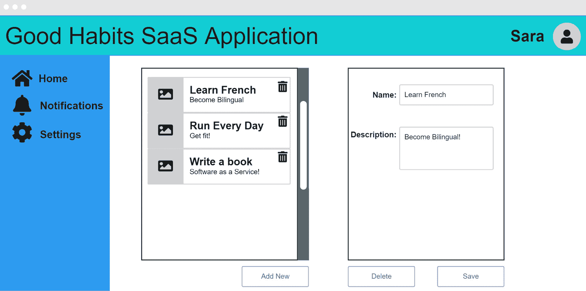
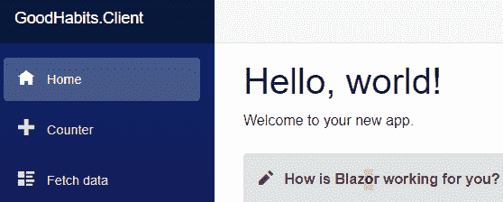
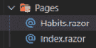
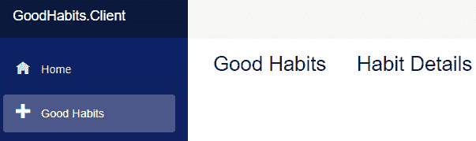
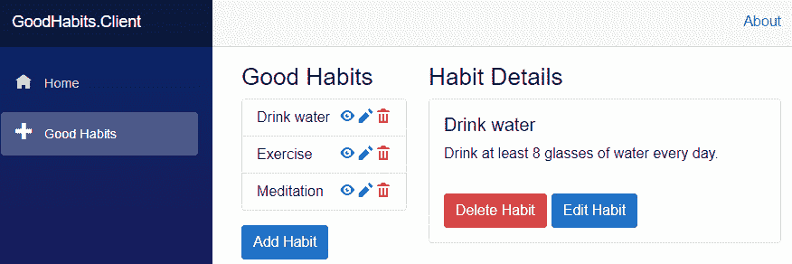
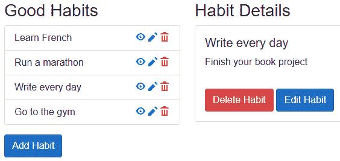

# 7

# 构建用户界面

在本章中，我们将探讨如何使用 Blazor 构建基于 Web 的前端，Blazor 是一个客户端 Web 框架，它与我们之前章节中构建的.NET Web API 后端进行交互。Blazor 是一个强大且灵活的框架，它允许我们编写在浏览器中运行的 C#代码，使我们能够使用单个代码库创建丰富和交互式的 Web 应用程序。

我们将首先探讨在构建用户界面之前你必须理解的重要技术。这些任务包括生成用户画像、构建用户旅程、线框图和创建票据。

在我们完成背景工作之后，我们将开始修改 Docker 化的开发环境，以方便前端开发并创建一个新的 Blazor 项目。我们还将探索 Blazor 应用程序的基本结构，包括组件、页面和布局。

接下来，我们将介绍如何连接到.NET Web API 后端。我们将展示如何从 Web API 中获取数据，使用客户端代码调用 API 端点并检索数据，然后在用户界面中显示它。

接下来，我们将深入了解设计用户界面的细节，包括创建布局、设计组件以及添加必要的控件和元素，以创建一个响应式且视觉上吸引人的用户界面。

到本章结束时，你将全面了解如何构建一个连接到.NET Web API 后端的 Blazor 前端，以及如何创建一个响应式且可扩展的 Web 应用程序，为你的客户提供无缝的用户体验。

本章涵盖的主要主题如下：

+   技术栈的一般介绍

+   如何确保你的应用程序满足客户需求

+   一些使用 Blazor 构建 UI 的实用示例

+   如何与后端交互

# 技术要求

本章的所有代码都可以在[`github.com/PacktPublishing/Building-Modern-SaaS-Applications-with-C-and-.NET/tree/main/Chapter-7`](https://github.com/PacktPublishing/Building-Modern-SaaS-Applications-with-C-and-.NET/tree/main/Chapter-7)找到。

# 技术栈介绍

构建 SaaS 应用程序的前端有许多可用的选项。Angular 和 React 是流行的基于 JavaScript 的框架，它们被广泛使用，并且是构建 SaaS 应用程序前端的良好选择。然而，鉴于这是一本以.NET 为重点的书籍，我们将坚持使用.NET 技术并使用 Blazor。

Blazor 是由微软开发的一个现代 Web 应用程序框架，它允许开发者使用 C#和.NET 而不是 JavaScript 来构建客户端 Web 应用程序。Blazor 最初于 2018 年作为一个实验性项目推出，后来在 2019 年作为.NET Core 3.0 的一部分发布。Blazor 的主要目标是使开发者能够完全使用 C#和.NET 编写全栈 Web 应用程序，从而提供一个更加熟悉和高效的开发体验。

Blazor 设计用于解决开发和管理复杂、数据驱动的 Web 应用程序的问题，这些应用程序需要大量的客户端交互性，例如 SaaS 应用程序。使用 Blazor，开发者可以编写在浏览器中运行的代码，使用 WebAssembly，使他们能够创建丰富的交互式用户界面，而无需依赖 JavaScript。Blazor 还提供了一系列内置的功能和工具，如路由、数据绑定和表单验证，这些可以帮助开发者更快、更轻松地构建复杂的 Web 应用程序。

由于其易用性、灵活性和生产力，Blazor 近年来变得流行。通过允许开发者在使用客户端时使用 C# 和 .NET，Blazor 提供了一种更一致、更熟悉的开发体验，降低了学习曲线，并使开发者能够更加高效。此外，Blazor 与 .NET 的紧密集成提供了一个无缝的开发体验，包括内置的调试、测试和部署工具。

Blazor 特别适合构建 SaaS 应用程序，因为它提供了一个可扩展且可靠的开发平台，能够处理大量用户和数据。Blazor 与 .NET 网络 API 后端的接口能力使其成为创建完整端到端解决方案的强大工具，具有强大的后端和响应式的前端。此外，Blazor 内置的用于处理用户输入、数据验证和安全的特性和工具使其成为构建复杂和安全 SaaS 应用程序的理想选择。

## 什么是 WebAssembly？

WebAssembly 是一种低级二进制格式，它使得代码能够在网页浏览器中执行。它是一个可移植的、基于栈的虚拟机，与 JavaScript 并行运行，为在浏览器中执行代码提供了一种更快、更高效的方式。WebAssembly 设计用于与 HTML、CSS 和 JavaScript 协同工作，允许开发者使用包括 C、C++、Rust 和 AssemblyScript 在内的多种编程语言编写 Web 应用程序。

WebAssembly 与 JavaScript 不同，因为它是一种编译型语言，而 JavaScript 是一种解释型语言。这意味着在 WebAssembly 中编写的代码可以预先编译，使其在浏览器中加载和执行更快。此外，WebAssembly 提供了一个更安全、更沙箱化的执行环境，这有助于防止安全漏洞并提高 Web 应用程序的可靠性。

WebAssembly 作为构建 Web 应用程序的方式越来越受欢迎，尤其是在游戏、图像和视频处理以及科学模拟等性能密集型任务中。随着 Blazor 等工具和框架的日益流行，WebAssembly 在构建使用 JavaScript 以外的语言编写的客户端 Web 应用程序的背景下也被更频繁地使用。总的来说，WebAssembly 是一项令人兴奋且强大的技术，它改变了我们构建 Web 应用程序的方式，并使 Web 上的创新进入了一个新的时代。

## 开发环境

到目前为止，我们所有的工 作都是在 Visual Studio Code 中完成的。我们添加了扩展，使我们能够操作.NET 项目、托管和交互数据库，以及执行 API 上的测试。

我选择 Visual Studio Code 作为本书的示例，因为它免费、跨平台，并且允许我们做各种事情，而无需安装大量工具。此外，我使用了 dev 容器来尝试确保无论你在什么电脑上运行，一切都将“正常工作”。

我认为这真的很酷，而且在将演示应用程序组合到书中时也非常实用。我将继续在这一章中构建 UI 时采用这种理念，但在此处需要承认的是，“主要”的 Visual Studio 应用程序的开发环境优于 Blazor。我希望这将在不久的将来改变，并且这一章能够经受住时间的考验。

对于我这里提供的简单示例，Visual Studio Code 是足够的。如果你正在构建一个更复杂的现实世界项目，那么你可能需要投资 Visual Studio。

# UX 考虑因素——了解你的客户

**用户体验**（**UX**）在现代应用程序开发中至关重要。用户如何与你的 SaaS 应用程序互动至关重要，因为糟糕的 UX 可能导致用户感到沮丧和放弃。因此，在设计 UI 时，考虑用户体验应该是过程中的最重要部分。

UX 的核心是设计对用户来说有用、易用且令人愉悦的数字产品、服务和系统。在当今这个人们每天都要与技术互动的数字时代，UX 在创造成功的产品和服务方面变得越来越重要。良好的 UX 可以提升用户的满意度、参与度和忠诚度，而糟糕的 UX 则可能导致用户感到沮丧、困惑和放弃。UX 设计涉及理解用户的需求、目标和行为，并利用这些知识来指导 UI 设计和交互。它包括视觉设计、交互设计、信息架构和用户研究等多个学科。随着数字产品和服务的日益重要，UX 将继续成为其成功的关键因素。

用户体验很重要，但它也是一个复杂且多面的领域，可能难以掌握。虽然有一些科学方法和原则可以应用于用户体验设计，例如用户研究、可用性测试和数据分析，但创建出色的用户体验的过程通常需要大量的艺术性和创造性。与一些其他领域不同，用户体验设计中没有绝对的对或错，对某个用户或产品有效的方法可能对另一个用户或产品无效。用户体验设计师必须平衡广泛的考虑因素，包括用户需求、业务目标、技术限制和视觉美学等。这需要结合分析技能、设计技能和直觉来创建既有效又美观的用户体验。简而言之，虽然有一些科学方法和原则可以帮助指导用户体验设计，但在创建出色的用户体验中仍然涉及大量的艺术性。

在 SaaS 应用的背景下，用户体验（UX）甚至比其他类型的软件更重要。SaaS 应用通常是基于订阅的，这意味着用户需要持续支付以获取软件的访问权限。这意味着如果他们对所获得的服务不满意，他们可以随时切换到竞争对手。换句话说，SaaS 公司始终在与用户保持关系上处于一场持续的战斗中，而糟糕的用户体验可能是用户留下或离开的决定性因素。此外，SaaS 应用通常复杂且功能丰富，具有广泛的选择和设置。这可能会使得用户体验设计变得更加具有挑战性，因为用户需要能够快速且轻松地找到他们需要的东西。因此，设计出色的用户体验对于 SaaS 应用的成功至关重要，因为它可以帮助提高用户满意度，减少流失率，并最终推动业务的成功。

在本节中，我将提供一些在构建 SaaS 应用时可能有用的通用指南。

## 用户画像

用户画像是一系列虚构的角色，代表可能与应用程序互动的不同类型的用户。它们通过调查、访谈和其他研究形式收集关于真实用户的信息来开发。用户体验设计师使用这些信息创建一组代表目标用户不同需求、行为和动机的用户画像。用户画像在用户体验设计过程中非常重要，因为它们有助于对将使用应用程序的人有一个清晰的理解。通过了解不同角色的特征，设计师可以做出明智的决定，关于如何构建用户界面，包含哪些功能，以及如何优先考虑用户体验的不同方面。例如，如果目标受众包括一些技术熟练的个人和一些技术不太熟练的个人，设计师可能需要创建一个既直观又易于导航的用户界面。通过创建用户画像，用户体验设计师可以确保应用程序的设计围绕用户的需要和期望，这最终可能导致更好的用户体验和更高的用户满意度。

这里是一个可能的虚构技术熟练用户“萨拉”的例子：

*萨拉是一个技术熟练的用户，使用多个设备，并且对技术感到舒适。她对技术趋势和新应用有很好的理解，并喜欢探索应用程序中的新功能和设置。萨拉更喜欢使用最新的技术和应用，可能对在应用程序中使用快捷键和其他高级用户功能感兴趣。她能够舒适地处理问题并独立寻找解决方案，可能对加载时间慢或其他技术问题有较低的容忍度。如果一个应用程序不符合她的期望，她可能会更倾向于放弃它。总的来说，萨拉是一个对技术感到舒适并且对她使用的应用程序有高期望的用户，应用程序的设计应该反映她的需求和期望* *。*

为用户画像创建一个头像对设计师和开发者来说很有用，因为它有助于产生同理心，并更好地理解用户的需求、目标和行为。我们为萨拉创建以下头像！


图 7.1 – 萨拉的头像

## 用户旅程映射

用户旅程映射是用户在应用程序中完成任务所采取步骤的视觉表示，从初始接触点直至任务完成。用户旅程映射很重要，因为它有助于识别用户体验中的痛点、挫败感区域以及改进机会。通过绘制用户旅程，设计师可以清楚地了解用户如何与应用程序互动以及他们可能遇到的问题。然后，这些信息可以用来完善设计，使用户体验更加流畅和直观。用户旅程映射与用户画像相关，因为它有助于更详细地了解不同画像如何与应用程序互动。通过为不同画像绘制用户旅程，设计师可以确定不同类型用户之间的用户体验差异，并做出针对每个画像需求的设计决策。最终，用户旅程映射是创建以用户为中心的设计的有价值工具，以满足所有用户的需求。

这里是 Sara，一个技术熟练的`GoodHabit`数据库用户的用户旅程示例：

1.  Sara 导航到`GoodHabits`应用程序并登录。

1.  应用程序在屏幕左侧显示 Sara 现有习惯的列表，并在右侧显示一个空的添加/编辑表单。

1.  Sara 点击习惯列表下的**添加新内容**按钮。

1.  应用程序使用默认值填充表单，并将按钮文本更改为**保存新内容**。

1.  Sara 填写表格并点击**保存新内容**按钮。

1.  应用程序验证表单数据，创建新习惯，并将其与 Sara 的用户账户关联。

1.  应用程序将新习惯添加到屏幕左侧的列表中，并自动选中该习惯。

1.  应用程序在屏幕右侧更新表格，显示新习惯的数据，并将按钮文本更改为**保存更改**。

1.  如果需要，Sara 可以对习惯进行进一步修改，然后点击**保存更改**按钮。

1.  应用程序验证表单数据，并使用新数据更新习惯。

1.  应用程序在屏幕左侧的列表中突出显示更新的习惯，以表明它已被修改。

1.  Sara 确认新习惯已成功添加或更新，并且正确显示在列表中。

将这些用户旅程写出来对于设计团队和开发团队来说非常有用，可以帮助他们更好地理解用户将如何与系统互动。对这些互动的良好理解将使用户体验得到改善，这通常会导致 SaaS 应用程序产生更多收入！

不应假设使用您的 SaaS 应用程序的每个人都具有相同的能力水平，并且考虑可访问性也非常重要。

## 可访问性

可访问性是指以确保残疾人士可以使用的方式设计和制作数字产品和内容。这包括视力、听力、肢体和认知障碍的人士，以及其他人士。可访问性很重要，因为它有助于确保所有用户，无论其能力如何，都能访问和使用数字产品和内容。这不仅有利于残疾人士，而且具有更广泛的社会和经济利益，因为它有助于创建一个更加包容的社会。

在为可访问性设计时，以下是一些提示和需要考虑的事项：

+   为图像提供替代文本，以便视力障碍用户能够理解图像的内容

+   确保文本和背景之间的颜色对比度足够，以便视力障碍用户能够轻松阅读文本

+   为视频和音频内容提供字幕或文本记录，以便听力障碍用户能够理解内容

+   使用语义 HTML 以确保辅助技术可以准确解析和解释网页的内容

+   确保应用程序仅使用键盘导航即可操作，以便肢体障碍用户能够轻松使用应用程序

+   提供清晰简洁的说明和反馈，以便认知障碍用户能够有效理解和使用应用程序

创建一些用户画像来代表将从这些可访问性考虑中受益的用户可能是有帮助的，为特定用户构建一些用户旅程。

为可访问性进行设计是任何数字产品或内容的重要考虑因素，有助于创建一个更加包容和可访问的社会。

## 视觉吸引力的设计

虽然用户体验（UX）总是在某种程度上融合了艺术和科学，但创建视觉吸引力的设计更多地依赖于艺术创造力。在构建应用程序时，很容易忽视这一点，而专注于更技术性的方面。然而，具有视觉吸引力的设计是用户体验的重要方面，并且可以对用户如何看待和交互数字产品产生影响。一个精心设计的用户界面可以使用户更容易理解和导航应用程序，并创造一种对建立强大品牌至关重要的信任感和信誉感。视觉吸引力的设计应该是美观的、引人入胜的，同时也要实用和易用。这意味着使用一致的颜色方案、字体和布局，这些对眼睛友好，并提供清晰的视觉层次。这也意味着使用适当的图像和图形来增强内容并支持整体用户体验。最终，视觉吸引力的设计应该是直观的、易于使用的、引人入胜的，有助于为所有用户创造积极的用户体验。

## 导航和信息架构

用户体验设计应努力使应用程序的导航对用户简单直观。这意味着设计清晰一致的下拉菜单结构，并为每个菜单项提供有用的标签和描述。导航应从应用程序中的任何页面都容易访问，并使用户能够快速轻松地在应用程序的不同区域之间移动。

在 SaaS 应用程序中，用户通常试图完成特定的任务或目标，他们需要能够轻松地找到完成任务所需的内容和功能。有效的导航可以帮助用户快速轻松地在应用程序的不同区域之间移动，而不会迷路或困惑。

信息架构是将应用程序内的内容以逻辑和有意义的方式组织和结构化的过程。它包括将相关内容分组在一起，创建信息层次结构，并建立不同内容之间的清晰关系。一个设计良好的信息架构可以更容易地帮助用户找到所需的信息，并且还可以为应用程序内的内容提供上下文和意义。在设计信息架构时，重要的是要考虑用户的需要和目标，以及正在呈现的内容，以便创建一个清晰、直观和有效的结构。

信息架构对于 SaaS 应用程序非常重要，因为它可以帮助确保应用程序内的内容以直观和有意义的方式组织。这可以帮助用户更好地理解和参与内容，同时也可以使他们更容易找到所需的信息。通过设计清晰有效的信息架构，SaaS 应用程序设计师可以创建一个既实用又愉悦的用户体验，有助于建立品牌忠诚度和客户满意度。

## 响应式设计

响应式设计是一种旨在创建能够适应和响应不同屏幕尺寸和设备类型的数字产品的设计方法。随着越来越多的用户在包括台式机、笔记本电脑、平板电脑和智能手机在内的各种设备上访问网站和应用，这种方法变得越来越流行。响应式设计使得网站或应用程序的布局、内容和功能针对每种设备类型进行了优化，使用户无论使用哪种设备都能获得一致无缝的体验。

为了实现响应式设计，用户体验设计师通常使用灵活布局、流动图像和媒体查询的组合，这使得设计能够适应不同的屏幕尺寸和分辨率。这意味着设计的元素，如导航、内容和图像，将根据屏幕大小进行调整和重新定位，以提供最佳的 UX 体验。

响应式设计有助于创建积极的用户体验，因为它确保用户可以在任何设备、任何时间访问和使用数字产品。随着越来越多的用户在移动设备上访问网页和应用，响应式设计已成为用户体验设计师的关键考虑因素，对于创建成功且易于访问的数字产品至关重要。

当考虑 SaaS 应用程序时，这一点变得更加重要，因为应用程序的客户通常需要能够在任何时间、任何设备上访问应用程序。

## 反馈和用户测试

反馈和用户测试对于创建成功的用户体验至关重要，因为它们允许设计师从真实用户那里收集关于其设计的可用性、功能和有效性的见解和信息。这些反馈可用于识别设计中的有效区域以及需要改进的区域，帮助设计师完善和优化用户体验。

为了收集反馈和用户测试数据，用户体验设计师使用各种技术，包括调查、访谈、可用性测试和用户分析。调查和访谈可以帮助设计师收集关于用户体验的定性反馈，包括喜好、不喜欢和痛点。另一方面，可用性测试涉及观察用户如何与设计互动，提供了关于用户如何使用应用程序以及可能导致困惑或挫败感的可能设计区域的宝贵见解。用户分析也可以用来收集关于用户行为的数据，例如用户多久访问一次某些功能，或者他们在用户旅程中的哪个环节放弃。

一旦收集到反馈和用户测试数据，设计师可以使用它们来指导他们的设计决策，根据从真实用户那里收集到的见解进行更改和优化。通过将反馈和用户测试纳入设计过程，用户体验设计师可以创建更以用户为中心且有效的用户体验，从而提高参与度、满意度和客户忠诚度。

# 构建简单的用户界面

你可能还记得，在*第二章*中，我们创建了一个 Blazor 应用程序。现在，我们将开始构建这个应用程序。

在本章的早期，我们想象了一个名为 Sara 的用户角色，并描述了 Sara 向她的数据库添加新习惯的用户旅程。在本节中，我们将构建这个用户旅程！

## 规划用户界面

构建良好的用户界面是一个复杂的过程，涉及周密的规划和深思熟虑的执行。在开始创建用户界面之前，花时间规划应用程序的布局、设计和功能至关重要。这项规划应涵盖从用户体验到用户访谈、线框图和原型设计的一切。

规划 UI 的第一步是定义用户角色和用户体验。理解用户的需求和应用程序的目标对于创建既可用又吸引人的界面至关重要。实现这一目标的一种方法是通过进行用户访谈，这有助于识别痛点并找到改进的机会。然后，可以将这些反馈用于塑造 UI 的设计和功能。

一旦定义了用户角色和用户体验，就到了开始考虑 UI 布局的时候了。线框图和原型设计是可视化界面布局和设计的有用技术。这些技术允许设计师尝试不同的想法，并确保应用程序直观且易于导航。线框图是界面的基本草图，有助于建立整体布局，而原型是交互式模拟，允许用户与 UI 交互并提供反馈。

除了线框图和原型设计，考虑应用程序的技术方面也很重要。这包括选择合适的技术栈，例如适当的框架和工具。例如，Blazor 是一个流行的框架，用于使用 C# 和 .NET 创建 UI，并且是构建 SaaS 应用程序的一个优秀选择。

总体而言，规划 UI 是创建简单而有效的 SaaS 应用程序界面的关键步骤。它涉及考虑用户体验、进行用户访谈、线框图和原型设计，以及选择合适的技术栈。经过仔细规划，可以创建一个既功能性强又美观的 UI，这最终有助于提高用户参与度和满意度。

为了我们能够取得进展，让我们假设我已经完成了所有前面的工作，并决定以下内容代表 Good Habits SaaS 应用程序的理想 UI。



图 7.2 – Good Habits 应用程序的模拟图

上述截图代表一个非常基本的 UI，允许用户查看他们的习惯列表，添加新的习惯，以及编辑或删除现有习惯。这基本上只是一个简单的 **创建、读取、更新、删除**（**CRUD**）实现，可能会让用户体验设计师感到沮丧，但这对这个演示来说已经足够了！

### 配置环境

由于我们将坚持使用 Visual Studio Code 来构建 UI，我们将添加一些扩展来使我们的工作更加轻松。一如既往，我们将通过修改 `devcontainer.json` 并添加到扩展数组中来实现这一点。添加以下扩展：

```cs
"kevin-chatham.aspnetcorerazor-html-css-class-completion",
"syncfusioninc.blazor-vscode-extensions",
"ms-dotnettools.vscode-dotnet-runtime",
"ms-dotnettools.blazorwasm-companion"
```

这些扩展将使我们在构建这个 UI 时的工作变得更加轻松！

您需要退出并重新进入开发容器环境，以便应用更改。

## 编写工单

在软件开发中，“工单”是一个术语，用来描述项目上需要完成的工作单元。工单通常被创建来跟踪错误、功能请求以及开发团队需要完成的任何其他任务。它们为项目经理和开发者提供了一种跟踪需要做什么、谁负责完成一项任务以及工作状态的方法。工单可以是简单的错误报告或功能请求，也可以非常详细，包括需求、设计和其他文档。使用工单有助于保持开发过程的有序和高效，确保团队中的每个人都朝着相同的目标努力。

Gherkin 是一种常用于编写软件开发项目规格说明的语言，它也可以在创建工单时使用。它旨在让技术和非技术利益相关者都易于理解，并有助于确保在需要做什么方面，每个人都处于同一页面上。Gherkin 规格说明采用了一种易于阅读和理解的特定格式，并且可以用来创建确保软件满足已指定要求的自动化测试。通过使用 Gherkin 编写工单，开发者可以确保他们所做的工作直接与项目的需求相关联，并且团队中的每个人都理解需要做什么以及为什么这么做。这有助于减少混淆和误解，从而提高开发过程的效率和效果。

Gherkin 是一种纯文本、领域特定的语言，通常用于协助编写软件应用的自动化验收测试。它旨在让利益相关者、开发者和测试人员都能易于阅读和理解。Gherkin 提供了一种简单的语法，以结构化和组织的方式定义应用程序的行为，使用一组关键词和短语。

使用 Gherkin 编写 UI 工单的一个关键好处是，它有助于确保开发团队之间的清晰性和一致性。通过使用标准化的格式来描述所需的 UI 行为，参与开发过程的所有人都可以理解期望的内容以及如何实现它。Gherkin 还提供了一种通用语言，可以用于不同背景和专长的团队成员之间的沟通。

使用 Gherkin 为 UI 工单带来的另一个优点是，它促进了以用户为中心的软件开发方法。通过关注期望的用户行为和体验，Gherkin 鼓励开发者构建直观、易于使用且满足最终用户需求的软件。这种方法可以导致更有效的测试和更好的整体用户体验。

Gherkin 是一个强大的工具，可以用来编写 UI 票据，有助于在软件开发中促进清晰性、一致性和以用户为中心的设计。通过提供一种共同的语言和结构化的格式来描述行为，Gherkin 可以帮助确保所有参与开发过程的人都能理解预期的内容和如何实现它。此外，通过启用自动化测试，Gherkin 可以帮助早期发现问题并确保最终产品的质量。

这里是一个可以用来描述我们之前为萨拉定义的用户旅程的票据示例。我们将使用这个票据来指导我们开发 UI：

```cs
Feature: Add a new habit to the list
Scenario: User adds a new habit to the list
Given Sara is on the Good Habits page
And there is a button labeled "Add new"
When Sara clicks the "Add new" button
Then a form for adding a new habit should appear
And the form should have input fields for the habit name, description, and category
And the form should have a "Save" button
And the form should have a "Cancel" button
Scenario: User saves a new habit to the list
Given Sara has filled out the form for adding a new habit
When she clicks the "Save" button
Then the new habit should be added to the list
And the list should show the habit name, description, and category
And the new habit should be displayed at the top of the list
And the new habit should be highlighted to indicate it has been added successfully
And the form for adding a new habit should disappear
```

上述票据为我们提供了开发 UI 的路线图。结合我们之前创建的线框图，构建这个简单的 UI 应该很容易！

但在我们开始构建之前，让我们快速了解一下我们将要使用的技术！

## 什么是 Blazor？

Blazor 是一个使用 C# 和 .NET 构建交互式 Web UI 的现代 Web 框架。它允许开发者使用与桌面和移动应用程序以及 RESTful API 相同的熟悉语言和工具来编写 Web 应用程序。Blazor 支持两种构建 Web 应用程序的模式——Blazor WebAssembly 和 Blazor Server。

Blazor WebAssembly 是一种客户端模型，允许开发者完全使用 C# 构建 Web 应用程序，并在任何现代 Web 浏览器中运行，无需任何服务器端代码。应用程序直接在浏览器中加载和执行，与服务器之间的任何通信都使用标准 Web 技术，如 HTTP 和 WebSockets——通常使用我们在前几章中使用的 WebAPI 后端。Blazor WebAssembly 应用程序可以在线和离线运行，这使得它们适合构建渐进式 Web 应用程序。

Blazor Server 是一种服务器端模型，允许开发者使用与客户端 Blazor 相似的编程模型来构建 Web 应用程序，但服务器运行应用程序代码并在浏览器中渲染 UI。在这个模型中，应用程序代码在服务器上运行，UI 以 HTML 和 JavaScript 的形式流式传输到客户端。这使得 Blazor Server 应用程序能够拥有与客户端应用程序相同的丰富交互功能，同时具有对用户体验的更高控制度。

Blazor 的两种模型都为开发者提供了构建 Web 应用程序强大且现代的方法，开发者可以根据项目的具体需求在客户端和服务器端之间进行选择。Blazor 使用 C# 和 .NET，这使得它成为熟悉这些技术的开发者极具吸引力的选择，而能够在 Web 和其他类型的应用程序之间共享代码可以提高效率和生产力。此外，Blazor 对 Razor 语法和与 Visual Studio 及其他开发工具的集成支持，使得开发者能够在熟悉且舒适的环境中工作。

对于这个示例，我们将使用 Blazor WebAssembly (Wasm)。当使用具有 RESTful API 后端的 SaaS 应用程序构建时，这是一个不错的选择，原因如下：

+   Wasm 完全在浏览器中运行，这意味着用户不需要等待服务器响应来加载应用程序。这可以导致加载时间更快，用户体验更好，并且减少服务器负载。

+   由于应用程序完全在浏览器中运行，它可以离线使用。这对于那些在移动中且没有可靠互联网连接的用户特别有用。

+   Wasm 允许更有效地处理复杂计算和图形密集型应用程序，这对于可能需要大量数据处理或高级图形的 SaaS 应用程序尤其相关。

+   通过将更多处理任务卸载到客户端，基于 Wasm 的 SaaS 应用程序可以减少服务器和客户端之间需要传输的数据量。这可能导致带宽需求减少，加载时间更快，并减少服务器负载。

+   Wasm 可以为 SaaS 应用程序提供更好的安全性，因为它在沙盒环境中运行，这使得恶意行为者更难利用应用程序中的漏洞。

+   由于 Wasm 是平台无关的，使用 Wasm 构建的 SaaS 应用程序可以在各种设备上运行，包括桌面、笔记本电脑、平板电脑和智能手机。这可以帮助增加应用程序的覆盖范围，并使其对用户更加易于访问。

## 设置 Blazor 项目

我们已经在*第二章*中设置了一个 Blazor 项目，但我会在这里回顾一下步骤。打开控制台并输入以下内容：

```cs
dotnet new blazorwasm -o GoodHabits.Client
cd GoodHabits.Client
```

太好了！您现在可以在控制台中输入`dotnet run`来启动客户端。您将在浏览器中看到以下内容：



图 7.3 – “Hello, world!” Blazor 应用程序

我们将从这个模板开始，并使其看起来更接近原型。最初，我们将使用虚拟数据，但我们将连接前端到 API – 到本章结束时，我们将有一个完整的栈 SaaS 应用程序！

## 构建用户界面

首先，在客户端应用程序的`Program.cs`中需要少量配置。使类看起来如下所示：

```cs
using Microsoft.AspNetCore.Components.Web;
using Microsoft.AspNetCore.Components.WebAssembly.Hosting;
using GoodHabits.Client;
var builder = WebAssemblyHostBuilder.CreateDefault(args);
builder.RootComponents.Add<App>("#app");
builder.RootComponents.Add<HeadOutlet>("head::after");
var apiBaseAddress = "http://localhost:5300/gateway/";
builder.Services.AddScoped(sp => new HttpClient { BaseAddress = new Uri(apiBaseAddress) });
await builder.Build().RunAsync();
```

注意，前面的基本地址连接到我们在*第六章*中配置的 API 网关。

在完成这个小配置后，我们可以通过添加一个新页面来开始功能，该页面将显示我们在前几章中构建的数据库中的信息。我们还将修改导航菜单，将其链接到这个新页面，并删除示例页面。

在`Pages`文件夹中，您可以删除`Counter.razor`和`FetchData.razor`文件，并添加一个名为`Habits.razor`的新文件。您的`Pages`文件夹应如下所示：



图 7.4 – 页面文件夹

配置好上述内容后，我们可以在`Habits.razor`页面上添加一些基本设置。打开文件并复制以下内容：

```cs
@page "/goodhabits"
@inject HttpClient httpClient
<div class="row">
    <div class="col-md-4">
        <h3>Good Habits</h3>
    </div>
    <div class="col-md-8">
        <h3>Habit Details</h3>
    </div>
</div>
@code {
    private List<Habit> GoodHabits { get; set; } = new
      List<Habit>()
    {
        new Habit { Name = "Drink water", Description =
          "Drink at least 8 glasses of water every day." },
        new Habit { Name = "Exercise", Description = "Do at
          least 30 minutes of exercise every day." },
        new Habit { Name = "Meditation", Description =
          "Meditate for at least 10 minutes every day." },
    };
    private class Habit
    {
        public int Id { get; set; }
        public string Name { get; set; } = default!;
        public string Description { get; set; } = default!;
    }
}
```

上述代码将为我们提供一个可以开始构建的概要。然而，在我们能够在应用中看到这些内容之前，我们需要修改导航菜单以链接到这个新页面。

打开`Shared`文件夹并定位到`NavMenu.razor`文件。将导航菜单代码更改为以下内容。注意，`href`属性与我们在`Habits.razor`页面上的`@page`属性中设置的内容相匹配：

```cs
<div class="@NavMenuCssClass nav-scrollable" @onclick="ToggleNavMenu">
    <nav class="flex-column">
        <div class="nav-item px-3">
            <NavLink class="nav-link" href=""
              Match="NavLinkMatch.All">
                <span class="oi oi-home" aria-
                  hidden="true"></span> Home
            </NavLink>
        </div>
        <div class="nav-item px-3">
            <NavLink class="nav-link" href="goodhabits">
                <span class="oi oi-plus" aria-
                  hidden="true"></span> Good Habits
            </NavLink>
        </div>
    </nav>
</div>
```

配置菜单后，我们可以使用`dotnet run`运行应用程序并查看我们所做的更改。



图 7.5 – 开始构建 GoodHabits 页面

在前面的屏幕截图中，我们可以看到我们已经成功添加了导航并勾勒出了 GoodHabits 页面！让我们添加一些更多功能。

我们将首先修改代码块中的代码，以便我们可以查看、添加、编辑和删除习惯。我们将很快将这些函数绑定到 UI 控件，以便我们可以操作列表中的习惯。

在`@code`块中，首先添加一些类级别变量：

```cs
private Habit? SelectedHabit { get; set; }
private Habit? EditingHabit { get; set; }
private Habit? AddingHabit { get; set; }
private bool IsEditing { get; set; } = false;
```

这将允许我们从列表中选择一个习惯，编辑该习惯，并存储一个状态变量，告诉视图我们正在编辑。

接下来，添加一个允许我们选择一个习惯的函数：

```cs
private void ShowDetails(Habit habit)
{ SelectedHabit = habit;
  IsEditing = false;
}
```

添加一个函数，允许我们将具有一些默认属性的新习惯添加到列表中：

```cs
private void AddHabit()
{
  Habit newHabit = new Habit()
  {
    Name = "New Habit",
    Description = "Enter a description here"
  };
  GoodHabits.Add(newHabit);
  SelectedHabit = newHabit;
}
```

添加一个函数，允许我们编辑一个习惯：

```cs
private void EditHabit(Habit habit)
{
  SelectedHabit = habit;
  ShowEditForm();
}
```

添加一个函数，允许我们从列表中删除一个习惯：

```cs
private void DeleteHabit(Habit habit)
{
  GoodHabits.Remove(habit);
  if (SelectedHabit == habit)
  {
    SelectedHabit = null;
  }
}
```

添加一个函数，允许我们从列表中编辑一个习惯：

```cs
private void ShowEditForm()
{
  IsEditing = true;
  EditingHabit = new Habit() {
    Id = SelectedHabit!.Id,
    Name = SelectedHabit!.Name,
    Description = SelectedHabit!.Description};
}
```

添加一个函数，允许我们保存我们正在编辑的习惯：

```cs
private void SaveHabit()
{
  GoodHabits.Add(EditingHabit!);
  GoodHabits.Remove(SelectedHabit!);
  IsEditing = false;
  SelectedHabit = null;
}
```

最后，添加一个函数，允许我们在改变主意时取消我们所做的任何编辑：

```cs
private void CancelEdit()
{
  IsEditing = false;
  EditingHabit = null;
  SelectedHabit = null;
}
```

这应该允许我们操作列表中的习惯！现在，我们将添加 UI 并将元素绑定到我们刚刚创建的函数！

我们首先将习惯列表添加到左侧面板。直接在 HTML 中的`<h3>Good Habits</h3>`行下方复制以下 HTML：

```cs
<ul class="list-group">
    @foreach (var habit in GoodHabits)
    {
        <li class="list-group-item d-flex justify-content-
          between align-items-center">
            <span @onclick="() =>
              ShowDetails(habit)">@habit.Name</span>
            <div>
                <i class="oi oi-eye mr-2 text-primary"
                  @onclick="() => ShowDetails(habit)"></i>
                <i class="oi oi-pencil mr-2 text-primary"
                  @onclick="() => EditHabit(habit)"></i>
                <i class="oi oi-trash text-danger"
                  @onclick="() => DeleteHabit(habit)"></i>
            </div>
        </li>
    }
</ul>
<button class="btn btn-primary mt-3" @onclick="AddHabit">Add Habit</button>
```

您可以看到，我们遍历了代码块中包含的虚拟习惯列表，将这些习惯绑定到我们添加到`@code`块中的函数。我们已添加按钮来添加、编辑和删除列表中的习惯。

最后，我们需要添加 HTML 以在屏幕右侧显示或编辑习惯。直接在`<h3>Habit Details</h3>`元素下方添加以下 HTML：

```cs
@if (SelectedHabit != null)
{
    <div class="card">
        <div class="card-body">
            @if (!IsEditing)
            {
                <h5 class="card-
                  title">@SelectedHabit.Name</h5>
                <p class="card-
                  text">@SelectedHabit.Description</p>
                <button class="btn btn-danger mt-3"
                  @onclick="() => DeleteHabit
                  (SelectedHabit)">Delete Habit</button>
                <button class="btn btn-primary mt-3"
                  @onclick="() => ShowEditForm()">Edit
                  Habit</button>
            }
            else
            {
                <form>
                    <div class="form-group">
                        <label for="edit-habit-
                          name">Name</label>
                        <input type="text" class="form-
                          control" id="edit-habit-name"
                          placeholder="Enter habit name"
                          @bind-value="EditingHabit.Name"
                          />
                    </div>
                    <div class="form-group">
                        <label for="edit-habit-
                          description">Description</label>
                        <textarea class="form-control"
                          id="edit-habit-description"
                          rows="3" @bind=
                          "EditingHabit.Description">
                          </textarea>
                    </div>
                    <button type="submit" class="btn btn-
                      primary mt-3" @onclick="() =>
                      SaveHabit()">Save</button>
                    <button type="button" class="btn btn-
                      secondary mt-3" @onclick="() =>
                      CancelEdit()">Cancel</button>
                </form>
            }
        </div>
    </div>
}
```

这里有很多事情在进行。我们添加了两个表单，一个在`IsEditing`属性设置为`true`时显示，另一个在它不是时显示，这样我们就可以查看或编辑习惯。

理解正在发生的事情的最好方法是启动项目并查看我们创建的内容！

在控制台中输入`dotnet run`，然后在浏览器中访问网站。然后，导航到 GoodHabits 页面，你应该看到以下内容：



图 7.6 – 好习惯 UI

如前一个截图所示，我们有一个习惯列表，点击任何这些习惯的名称将弹出“查看”表单。

UI 应该相当直观，如果不是非常漂亮！我认为玩这个 UI 并查看我们添加到 Razor 文件中的各种功能和元素是一个非常有用的练习。

到目前为止，我们有一个功能性的 UI，但还没有连接到后端。现在让我们着手解决这个问题！

# 将 UI 连接到后端

之前，我们构建了 UI 并添加了添加、删除、查看和更新习惯的功能。然而，目前，我们的 UI 还没有连接到我们构建的 API。现在让我们解决这个问题！

## 处理 CORS 问题

**CORS**代表**跨源资源共享**。这是一种允许网页向服务网页的不同域名发送请求的机制。CORS 是一个安全功能，有助于防止未经授权访问 Web 服务器。当网页尝试进行跨源请求时，它所请求的服务器必须以允许请求通过的特定头信息响应。如果服务器没有发送这些头信息，浏览器将阻止请求。

在开发模式下，我们需要配置 API 网关项目以接受来自任何来源的连接。请注意，这代表了一个安全风险，不应在生产环境中复制。

在`API Gateway`项目中打开`Program.cs`文件（*不是在 Blazor 项目中 – 确保你是在正确的* `Program.cs` *文件中*）。定位到开发设置：

```cs
if (app.Environment.IsDevelopment())
{…}
```

现在，确保包含以下代码：

```cs
    app.UseCors(policy =>
        policy.AllowAnyOrigin()
              .AllowAnyHeader()
              .AllowAnyMethod()
              );
```

这将确保 API 将接受请求，但再次强调，这仅适用于开发环境，不适用于生产环境！

## 逻辑，包括调用 API

我们将修改之前构建的代码以连接到 API。如果我们做得好，并且正确地将 UI 元素与逻辑分离，我们只需修改代码就可以进行此更改。让我们看看我们做得怎么样！

首先添加一个指向 API URL 的字符串常量：

```cs
    private const string ServiceEndpoint = "http://localhost:5300/gateway/habits";
```

确保正确设置端口号。此外，请注意，硬编码 URL 并不是一个好的实践，但在这个演示中足够了。

接下来，注释掉或删除我们添加的三个虚拟习惯。从现在起，我们将获取我们存储在数据库中的习惯：

```cs
private List<Habit> GoodHabits { get; set; } = new List<Habit>();
```

我们需要添加一个钩子来从数据库获取习惯。我们将利用初始化钩子并添加以下方法：

```cs
protected override async Task OnInitializedAsync()
{
    httpClient.DefaultRequestHeaders.Add("tenant",
      "CloudSphere");
    GoodHabits = await
      httpClient.GetFromJsonAsync<List<Habit>>($"
      {ServiceEndpoint}");
}
```

这使用`httpClient`来调用 API 端点，该端点将返回存储在数据库中的习惯列表。

在我们可以添加与添加和编辑端点交互的调用之前，我们需要创建一些类。添加两个私有类，如下所示：

```cs
    private class CreateHabit
    {
        public string Name { get; set; } = default!;
        public string Description { get; set; } = default!;
        public int UserId { get; set; }
    }
    private class UpdateHabit
    {
        public string Name { get; set; } = default!;
        public string Description { get; set; } = default!;
    }
```

接下来，修改`AddHabit`方法以与 API 交互：

```cs
private async Task AddHabit()
{
    var newHabit = new CreateHabit()
    {
        Name = "New Habit",
        Description = "Enter a description here",
        UserId = 101
    };
    var response = await httpClient
      .PostAsJsonAsync(ServiceEndpoint, newHabit);
    var habit = await response
      .Content.ReadFromJsonAsync<Habit>();
    // Add the new habit to the list of habits
    GoodHabits.Add(habit!);
    SelectedHabit = habit;
}
```

在`DeleteHabit`方法中添加一行：

```cs
    private void DeleteHabit(Habit habit)
    {
        httpClient.DeleteAsync($"{ServiceEndpoint}/
          {habit.Id}");
        GoodHabits.Remove(habit);
        if (SelectedHabit == habit)
        {
            SelectedHabit = null;
        }
    }
```

最后，修改`SaveHabit`方法以包含所需的交互：

```cs
    private void SaveHabit()
    {
        httpClient.PutAsJsonAsync($"{ServiceEndpoint}/
          {EditingHabit!.Id}",
                EditingHabit);
        GoodHabits.Add(EditingHabit!);
        GoodHabits.Remove(SelectedHabit!);
        IsEditing = false;
        SelectedHabit = null;
    }
```

完成了！仅仅通过一些小的改动，我们现在已经连接到了 API 和数据库。现在我们已经创建了一个完全功能 SaaS 应用程序的轮廓！

为了证明这一点，进入**运行和调试**菜单并执行我们在*第六章*中创建的**运行所有**复合任务。这将启动微服务项目、API 网关和客户端项目。然后，在浏览器中导航到客户端。你应该能在屏幕上看到你的习惯数据库内容！我们离完成我们的 SaaS 应用程序又近了一步！



图 7.7 – 好习惯 UI，连接到网关 API

# 构建可用的 UI

我们在这里构建的示例是结合 SaaS 后端和 UI 的基本技术的良好技术演示，但我认为可以安全地说，它缺少一点风格。如今，普通消费者对 SaaS 应用程序 UI 的期望非常高——基本上，客户将要求与原生应用程序非常相似但运行在浏览器中的体验。

为了使 UI 看起来更加现代和响应，我们通常会使用现成的响应式 UI 框架。除了期望 UI 表现得像桌面应用程序一样，通常还期望 UI 能够在平板电脑和手机上运行。最后，并非每个人都有相同的技能，而且有一些标准方法来确保您的 UI 对不同能力的人都是可访问的。在本节中，我们将探讨所有这些内容，从响应式 UI 框架开始。

## 响应式 UI 框架

响应式 UI 框架是一组预构建的组件、样式和脚本，旨在帮助开发者轻松创建响应式和自适应的 Web 应用程序。这些框架为开发者提供了一套工具，可用于构建能够自动调整到不同设备和屏幕大小的 UI，确保在各种平台上提供一致且愉悦的 UX。

使用响应式 UI 框架可以通过提供现成的组件和一致的设计系统来显著简化开发过程。这使得开发者可以更多地关注应用程序的功能性，而不是从头开始构建响应式布局的复杂性。此外，这些框架通常遵循已建立的设计原则和最佳实践，确保最终产品不仅视觉上吸引人，而且易于访问和用户友好。

Bootstrap 是由 Twitter 开发的一个开源且广泛使用的 CSS 框架。它通过提供一套全面的可重用组件，如按钮、表单和导航元素，简化了创建响应式和移动优先网站的过程。Bootstrap 还包括一个基于 **弹性盒布局模块**（**Flexbox**）的响应式网格系统，这使得创建适应不同屏幕尺寸的流畅布局变得容易。凭借其广泛的文档和庞大的社区，Bootstrap 仍然是开发者中的热门选择。

由 ZURB 创建的 Foundation 是另一个流行的响应式前端框架，它专注于提供强大的灵活基础来构建自定义网络应用程序。它提供各种预构建组件、一个响应式网格系统和模块化架构，使开发者能够仅使用他们项目所需的组件。Foundation 以其性能优化和与广泛设备的兼容性而闻名，使其成为需要高级定制和性能的复杂项目的合适选择。

Material-UI 是一个基于 React 的流行 UI 框架，它实现了谷歌的 Material Design 指南。Material-UI 为网络应用程序提供了统一且现代的外观和感觉，确保 UI 既有视觉吸引力又易于导航。它包括一组预构建的组件、一个响应式布局系统以及一个主题系统，允许轻松定制。通过遵循 Material Design 原则，Material-UI 帮助开发者创建符合既定可用性标准的 UI。

虽然 Flexbox 是一个强大的 CSS 布局模块，它简化了网页中灵活和响应式布局的设计，但它并不是一个完整的响应式 UI 框架。相反，它是一个非常有价值的工具，可以与其他框架结合使用来创建自适应布局。许多响应式 UI 框架，如 Bootstrap 和 Foundation，将 Flexbox 作为其网格系统的一部分，利用其功能来为组件创建多用途和流畅的布局。

肯定推荐选择其中之一与你的项目集成。将其中一个框架应用于我们之前创建的演示 UI 将是一个极好的学习练习！

## 响应式设计技术

简单地安装之前描述的任何响应式框架还远远不够。你需要掌握一些技术，才能充分利用它们。

在本节中，我们将快速探讨基本的响应式设计技术，包括流体网格、灵活图像和媒体查询。通过理解和应用这些技术与响应式 UI 框架相结合，你可以构建可用的 UI，在各种平台上提供一致且愉快的体验。

流体网格是响应式设计的核心，它通过允许根据屏幕尺寸动态调整的灵活布局来实现。而不是使用像素这样的固定宽度单位，流体网格使用百分比这样的相对单位来定义元素的宽度。这确保了布局会随着视口的变化自动缩放和重新排列。例如，当使用 Bootstrap 时，您可以通过利用其预定义的网格类，如`.container`、`.row`和`.col`，来创建流体网格。这些类使您能够定义一个响应式网格结构，该结构可以适应不同的屏幕尺寸。

弹性图像确保媒体内容（如图像和视频）也能根据不同的屏幕尺寸进行缩放和适应。通过将图像的最大宽度属性设置为 100%，图像将自动缩放到适合其包含元素的宽度，防止其溢出并破坏布局。当使用 Foundation 或 Material-UI 等框架时，您可以使用它们内置的类或组件来处理图像缩放，确保您的媒体内容在各种设备上保持响应式。

媒体查询是一个强大的 CSS 功能，它允许您根据用户设备的特征（如屏幕尺寸、分辨率或方向）应用不同的样式。通过使用媒体查询，您可以在布局和样式发生变化的断点定义，确保您的 UI 在不同屏幕尺寸下保持可用性和视觉吸引力。大多数响应式 UI 框架，如 Bootstrap 和 Material-UI，都提供了预定义的媒体查询和断点，您可以使用或自定义以满足您的特定需求。

通过结合这些核心响应式设计技术与响应式 UI 框架提供的功能，您可以创建既美观又高度功能性强、适应各种设备和屏幕尺寸的 Web 应用程序。这最终有助于构建可用的 UI，从而提升整体 UX，满足多样化的用户需求和偏好。

## 为不同屏幕尺寸设计

现在，预测用户将选择哪种设备来访问您的 SaaS 应用程序是不可能的。因此，在设计响应式 Web 应用程序时，考虑不同的屏幕尺寸和分辨率至关重要。这样做可以确保您的 UI 在不同设备上看起来和运行良好，提供一致且愉悦的 UX。

当为不同屏幕尺寸设计时，遵循一些关键指南和最佳实践是至关重要的：

+   采用移动优先的方法可能非常有帮助。首先为较小的屏幕（如智能手机）设计布局和 UI，然后逐步增强对较大屏幕的设计。这种方法确保了您的应用程序在小设备上保持功能性和视觉吸引力，同时利用较大屏幕的额外显示空间。

+   如前所述，响应式 UI 框架，如 Bootstrap、Foundation 和 Material-UI，提供了预构建的组件、网格系统和预定义的媒体查询，这使得为各种屏幕尺寸创建自适应布局变得更加容易。利用这些框架可以显著简化开发过程，并确保你的 UI 在不同设备上保持一致和功能。记住要应用最佳实践并使用良好的响应式设计技术！

+   总是在多种设备和屏幕尺寸上进行测试。在开发过程中，使用各种设备和屏幕尺寸测试你的应用，以识别潜在问题并确保一致的 UX。你可以使用设备模拟器、浏览器开发者工具或物理设备来测试应用的响应性并进行必要的调整。

+   优化你的应用性能以适应不同设备，因为较慢的加载时间和低效的资源使用可以显著影响用户体验，尤其是在移动设备上。考虑诸如图像优化、代码最小化和懒加载等因素，以改善应用在不同屏幕尺寸下的性能。

通过遵循这些指南和最佳实践，你可以创建响应式网络应用，这些应用在各种设备和屏幕尺寸上提供一致且愉悦的用户体验。利用响应式 UI 框架和响应式设计技术将确保你的 UI 能够无缝适应，满足用户多样化的需求和偏好。

## 易于访问性

创建易于访问和包容性的网络应用是负责任和富有同理心的设计的一个基本方面。通过考虑不同能力用户的需要，你确保了你的 SaaS 应用为每个人提供平等访问和机会，从而营造一个更加包容的在线环境。

在你的网络应用中拥抱易于访问性和包容性非常重要，原因有几个。这样做可以扩大受众范围。通过使你的应用易于访问，你可以满足更广泛的受众，包括可能在与你的应用互动时遇到障碍的不同能力用户。

通常来说，设计得易于访问的用户界面将导致整体体验更加出色。易于访问的设计原则通常会使所有用户都能获得更好的可用性，因为它们促进了清晰直观的界面，这些界面易于导航和理解。

最后，这是正确的事情。我们应该努力使互联网，以及世界，成为一个更加包容的地方。如果我们能通过花时间使我们的应用易于访问来做出非常微小的贡献，那么我们就应该这样做！

要创建更可访问的网络应用程序，遵循既定的可访问性标准和指南非常重要，例如**网络内容可访问性指南（WCAG）**和**美国残疾人法案（ADA）可访问性设计标准**。这些指南提供了一个框架，以确保您的应用程序对有不同能力用户是可用的和可访问的。

有多种工具和技术可用于解决常见的可访问性挑战，并改善不同能力用户的用户体验：

+   **屏幕阅读器**：这些辅助技术将文本和其他屏幕内容转换为语音或盲文，帮助视力受损用户访问和导航网络应用程序。确保您的应用程序内容在语义上结构良好，正确使用标题、地标和图像的替代文本，以支持屏幕阅读器用户。

+   **键盘导航**：一些用户可能完全依赖键盘来导航网络应用程序。确保您的应用程序通过提供可见的焦点指示器、逻辑的标签顺序和可键盘访问的交互元素来支持键盘导航。

+   **颜色对比度**：视力受损或色盲的用户可能难以感知对比度低的内容。确保您的应用程序的色彩方案和设计元素遵循 WCAG 规定的推荐对比度比率。

+   **可访问的表单**：认知或运动障碍的用户可能难以处理复杂的表单和输入字段。简化表单，提供清晰的标签，并使用适当的输入类型，以便所有用户都能轻松与您的应用程序交互。

+   **可访问的富互联网应用（ARIA）**：这组属性有助于增强动态内容和高级用户界面控件的可访问性。使用 ARIA 属性提供有关您应用程序结构和功能的信息，确保辅助技术可以正确解释和与之交互。

通过考虑不同能力用户的需求并实施这些工具和技术，您可以创建更可访问、包容和用户友好的网络应用程序。这不仅有利于您的用户，也有助于您应用程序的整体成功。

# 摘要

在本章中，我们讨论了为 SaaS 应用程序设计和构建用户界面的大量内容。我们讨论了用户体验的重要性以及如何为用户画像设计、规划用户旅程以及创建视觉吸引力和响应式设计。我们还讨论了 UI 测试的重要性以及如何使用 Blazor 构建简单的 UI。

本章的一个重要收获是用户体验（UX）在 SaaS 应用程序开发中的重要性。一个设计良好且直观的 UI 可以在用户采用、保留和满意度方面产生重大差异。通过规划用户角色和用户旅程，我们可以确保我们构建的界面符合目标受众的需求和期望。

另一个重要收获是使用现代 UI 框架（如 Blazor）的价值。通过使用 Blazor，我们可以利用.NET 的强大功能和灵活性来构建丰富、交互式且响应迅速的 UI，这些 UI 可以有效地与后端 API 通信。Blazor 允许我们使用 C#和.NET 技能构建在浏览器中运行的 Web 应用程序，使用 WebAssembly 在客户端执行.NET 代码。

我们还介绍了一些构建 UI 的关键最佳实践，包括设计可访问性、使用响应式设计、优化性能和加载时间，以及为用户提供反馈和测试。这些都是设计良好且用户友好的 UI 的基本要素。

在本章的第二部分，我们深入探讨了如何将 Blazor UI 连接到后端 API。我们讨论了如何配置 Blazor 客户端以与 API 通信，如何定义数据模型，以及如何检索和更新数据。我们还讨论了错误处理、测试和调试的重要性，确保我们的应用程序健壮且可靠。

通过遵循本章中概述的步骤，你将深入了解如何为 SaaS 应用程序设计和构建 UI，以及如何将界面连接到后端 API。你将具备构建直观、视觉吸引力强且响应迅速的 UI 所需的工具和知识，同时确保应用程序性能和可靠性。

总之，UI 是任何 SaaS 应用程序的关键组件，设计和构建一个优秀的 UI 需要技术能力和创造力的结合。通过遵循本章中涵盖的最佳实践和指南，你将朝着构建直观、吸引人且有效的 UI 迈进，这有助于你实现业务目标。

在下一章中，我们将讨论身份验证和授权，具体参考这将如何影响多租户、微服务 SaaS 应用程序！

# 进一步阅读

+   使用 Blazor 构建美丽的 Web 应用程序：[`dotnet.microsoft.com/en-us/apps/aspnet/web-apps/blazor`](https://dotnet.microsoft.com/en-us/apps/aspnet/web-apps/blazor)

+   VS Code 和 Blazor WASM：[`dev.to/sacantrell/vs-code-and-blazor-wasm-debug-with-hot-reload-5317`](https://dev.to/sacantrell/vs-code-and-blazor-wasm-debug-with-hot-reload-5317)

+   从 ASP.NET Core Blazor 调用 Web API：[`learn.microsoft.com/en-us/aspnet/core/blazor/call-web-api?view=aspnetcore-7.0&pivots=server`](https://learn.microsoft.com/en-us/aspnet/core/blazor/call-web-api?view=aspnetcore-7.0&pivots=server)

+   Blazor WebAssembly HttpClient: [`code-maze.com/blazor-webassembly-httpclient/`](https://code-maze.com/blazor-webassembly-httpclient/)

# 问题

1.  什么是 Blazor，以及它是如何让我们使用 C# 和 .NET 创建 Web 应用的？

1.  我们如何自动从 Blazor 应用生成一个连接到 .NET Web API 的客户端？

1.  我们如何在 Blazor 应用中消费来自 .NET Web API 的数据，以及处理错误和异常的一些最佳实践是什么？

1.  用户画像是什么？

1.  为什么在开始构建 UI 之前映射用户旅程很重要？
