# 微服务简介

本章的重点是让您熟悉微服务。我们将从简要介绍开始。然后，我们将定义它们的先辈：单体架构和**面向服务的架构**（**SOA**）。在此之后，我们将看到微服务如何与 SOA 和单体架构相媲美。然后，我们将比较这些架构风格的优缺点。这将使我们能够确定这些风格的正确场景。我们将了解分层单体架构产生的问题。我们将讨论在单体世界中解决这些问题的方案。最后，我们将能够将单体应用程序分解为微服务架构。本章将涵盖以下主题：

+   微服务的起源

+   讨论微服务

+   理解微服务架构

+   微服务的优势

+   SOA 与微服务的比较

+   理解单体架构风格的问题

+   标准化.NET 堆栈的挑战

+   Azure 服务 Fabric 概述

# 微服务的起源

“微服务”这个术语首次在 2011 年中期的一个软件架构师研讨会上被使用。2012 年 3 月，詹姆斯·刘易斯（James Lewis）提出了一些关于**微服务**的想法。到 2013 年底，IT 行业的各个群体开始就**微服务**进行讨论，到 2014 年，它们已经足够流行，被视为大型企业的一个严肃的竞争者。

对于**微服务**，没有官方的介绍。对这个术语的理解纯粹基于过去的使用案例和讨论。我们将详细讨论这个问题，但在那之前，让我们看看维基百科（[`en.wikipedia.org/wiki/Microservices`](https://en.wikipedia.org/wiki/Microservices)）对微服务的定义，它将其总结如下：

“微服务是 SOA 的一个专业化和实现方法，用于构建灵活的、可独立部署的软件系统。”

2014 年，詹姆斯·刘易斯（James Lewis）和马丁·福勒（Martin Fowler）共同提供了一些实际案例，用自己的话介绍了**微服务**（参考[`martinfowler.com/microservices/`](http://martinfowler.com/microservices/)），并进一步详细说明如下：

“微服务架构风格是一种将单个应用程序作为一系列小型服务开发的方法，每个服务都在自己的进程中运行，并通过轻量级机制（通常是 HTTP 资源 API）进行通信。这些服务围绕业务能力构建，并且可以由完全自动化的部署机器独立部署。对这些服务的集中式管理最少，这些服务可能使用不同的编程语言，并使用不同的数据存储技术。”

你看到 Lewis 和 Fowler 在这里定义的所有属性非常重要。他们将单体架构定义为一种开发者可以利用的架构风格，以开发一个业务逻辑分布在多个小型服务中的应用程序，每个服务都有自己的持久化存储功能。同时，注意其属性——它可以独立部署，可以在自己的进程中运行，是一种轻量级通信机制，并且可以用不同的编程语言编写。

我们想要强调这个特定的定义，因为它整个概念的精髓。随着我们继续前进，当我们完成这本书的时候，它将会逐渐显现。

# 讨论微服务

我们已经讨论过几个关于*微服务*的定义；现在，让我们详细讨论*微服务*。

简而言之，微服务架构消除了 SOA 的大部分缺点。它比 SOA 服务更注重代码（我们将在接下来的章节中详细讨论这一点）。

将应用程序切割成多个服务既不是 SOA 也不是微服务。然而，结合 SOA 世界的服务设计和最佳实践，以及一些新兴实践，如隔离部署、语义版本化、提供轻量级服务和多语言编程中的服务发现，就是微服务。我们实现微服务以满足业务功能，并以更短的时间上市和更大的灵活性来实现它们。

在我们继续了解架构之前，让我们讨论一下导致其存在的两个重要架构：

+   单体架构风格

+   SOA

我们大多数人都会意识到，在企业应用程序开发的生命周期中，在各个阶段，都会决定一个合适的架构风格。然后，随着各种挑战的出现，如部署复杂性、大型代码库和可伸缩性问题，初始模式会进一步改进和适应。这正是单体架构风格演变成 SOA，进而发展到微服务的过程。

# 单体架构

单体架构风格是一种传统的架构类型，在业界得到了广泛的应用。术语*单体*并不新鲜，它借用了 UNIX 世界的概念。在 UNIX 中，大多数命令都存在作为独立程序，其功能不依赖于任何其他程序。如图所示，我们可以有应用程序中的不同组件，例如：

+   用户界面：它处理所有用户交互，同时以 HTML 或 JSON 或其他任何首选的数据交换格式（在 Web 服务的情况下）进行响应。

+   业务逻辑：所有应用于以用户输入、事件和数据库形式接收的输入的业务规则都存在于这里。

+   数据库访问：这包含了用于查询和持久化对象的数据库访问的完整功能。一个普遍接受的规则是，它通过业务模块使用，而不是直接通过面向用户的组件使用。

使用此架构构建的软件是自包含的。我们可以想象一个包含各种组件的单个 .NET 程序集，如以下图所示：

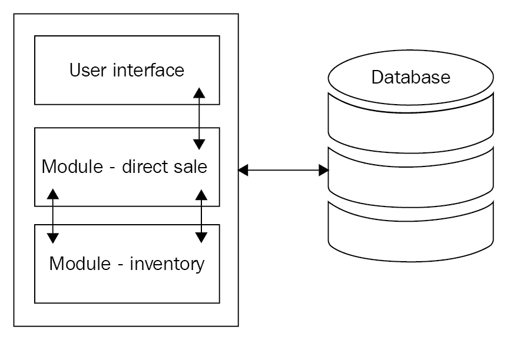

由于软件是自包含的，其组件是相互关联和相互依赖的。即使在某个模块中进行的简单代码更改也可能破坏其他模块中的主要功能。这会导致我们需要测试整个应用程序的情况。由于业务严重依赖其企业应用程序框架，这段时间可能会非常关键。

所有组件紧密耦合提出了另一个挑战——无论何时执行或编译此类软件，所有组件都应可用，否则构建将失败；参考前面的图示，它代表了一个单体架构，是一个自包含的或单个 .NET 程序集项目。然而，单体架构可能也有多个程序集。这意味着尽管业务层（程序集、数据访问层程序集等）是分离的，但在运行时，它们将一起运行作为一个进程。

用户界面以与其他组件类似的方式直接依赖其他组件的销售和库存。在这种情况下，如果没有任何一个组件，我们将无法执行此项目。升级任何一个组件的过程将更加复杂，因为我们可能需要考虑其他也需要代码更改的组件。这会导致比实际更改所需更多的发展时间。

部署此类应用程序将变成另一个挑战。在部署过程中，我们必须确保每个组件都得到正确部署；否则，我们可能会在我们的生产环境中遇到许多问题。

如果我们使用之前讨论的单体架构风格开发应用程序，我们可能会面临以下挑战：

+   大型代码库：这是一个代码行数远多于注释的情况。由于组件是相互关联的，我们将不得不忍受重复的代码库。

+   业务模块太多：这是关于同一系统内的模块。

+   代码库复杂性：这导致由于在其他模块或服务中进行的修复而出现代码破坏的可能性更高。

+   复杂代码部署：你可能会遇到需要整个系统部署的微小更改。

+   一个模块的故障影响整个系统：这是关于相互依赖的模块。

+   可扩展性：这是整个系统所需，而不仅仅是其中的模块。

+   模块间依赖：这是由于紧密耦合造成的。

+   开发时间螺旋上升：这是由于代码复杂性和相互依赖性造成的。

+   难以轻松适应新技术：在这种情况下，整个系统都需要升级。

如前所述，如果我们想减少企业应用程序的开发时间、部署的便捷性和可维护性，我们应该避免传统的或单体架构。

# 面向服务的架构

在上一节中，我们讨论了单体架构及其局限性。我们还讨论了为什么它不符合我们的企业应用程序需求。为了克服这些问题，我们应该采取模块化方法，这样我们可以将组件分开，使它们从自包含或单个.NET 组件中分离出来。

SOA 与单体架构的主要区别不在于一个或多个组件。由于 SOA 中的服务作为一个独立的过程运行，因此与单体架构相比，SOA 具有更好的可扩展性。

让我们讨论模块化架构，即 SOA。这是一种著名的架构风格，其中企业应用程序被设计为一组服务的集合。这些服务可能是 RESTful 或 ASMX Web 服务。为了更详细地了解 SOA，让我们首先讨论*服务*。

# 什么是服务？

在这个例子中，服务是 SOA 的一个基本概念。它可能是一段代码、程序或软件，为其他系统组件提供功能。这段代码可以直接与数据库交互，或者通过另一个服务间接交互。此外，它可以直接被客户端消费，客户端可能是一个网站、桌面应用程序、移动应用程序或任何其他设备应用程序。请参考以下图表：

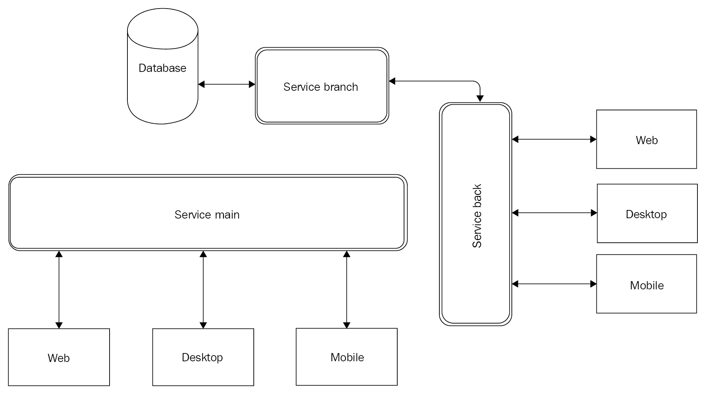

服务是指一种为其他系统（通常称为**客户端/客户端应用程序**）消费的功能类型。如前所述，它可以由一段代码、程序或软件表示。这类服务通常通过 HTTP 传输协议公开。然而，HTTP 协议并不是限制因素，可以选择适合场景的协议。 

在以下图像中，**服务 - 直接销售**直接与**数据库**交互，并且三个不同的客户端，即**Web**、**桌面**和**移动**，正在消费该服务。另一方面，我们有消费**服务 - 合作销售**的客户端，该服务正在与**服务 - 渠道合作伙伴**交互以访问数据库。

产品销售服务是一组与客户端应用程序交互并提供数据库直接访问或通过另一个服务（在这种情况下，**服务-渠道合作伙伴**）的服务。在**服务-直销**的情况下，如前图所示，它为网店、桌面应用程序和移动应用程序提供功能。此服务还与数据库进行交互，执行各种任务，即获取和持久化数据。

通常，服务通过某种通信渠道与其他系统交互，通常是 HTTP 协议。这些服务可能部署在相同的服务器上，也可能不在同一服务器上：

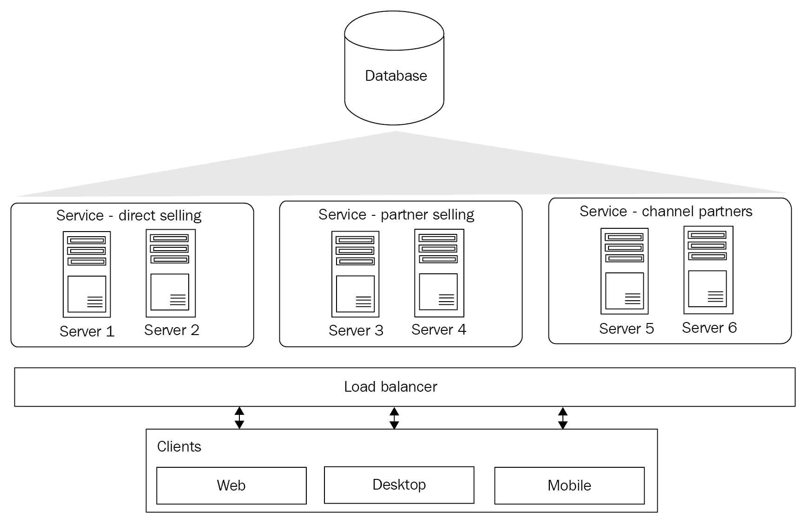

在前述图像中，我们展示了一个 SOA 示例场景。这里有许多需要注意的细微之处，所以让我们开始吧。首先，我们的服务可以分布在不同的物理机器上。在这里，**服务-直销**托管在两个独立的机器上。可能的情况是，整个业务功能不是全部都驻留在**服务器 1**上，而是部分驻留在**服务器 2**上。同样，**服务-合作伙伴销售**似乎在**服务器 3**和**服务器 4**上有相同的安排。然而，这并不妨碍**服务-渠道合作伙伴**作为一个完整的集合托管在两个服务器上：**服务器 5**和**服务器 6**。

使用前述图中提到的方式使用服务或多个服务的系统称为**SOA**。我们将在以下部分详细讨论 SOA。

让我们回顾一下单体架构。在这种情况下，我们没有使用它，因为它限制了代码的可重用性；它是一个自包含的组件，所有组件都是相互连接和相互依赖的。在部署方面，在这种情况下，在选择了 SOA（参见图表和后续讨论）之后，我们必须部署我们的完整项目。现在，由于使用了这种架构风格，我们有了代码可重用性和易于部署的好处。让我们在前述图表的基础上进行考察：

+   可重用性：多个客户端可以消费服务。服务也可以同时被其他服务消费。例如，*OrderService*被 Web 和移动客户端消费。现在，*OrderService*也可以被报告仪表板 UI 使用。

+   无状态：服务不会在客户端请求之间持久化任何状态，也就是说，服务不知道，也不关心后续请求是否来自已经/没有发出先前请求的客户端。

+   基于契约：接口在实现和消费的两端都使技术无关。它还用于使底层功能代码更新免疫。

+   可伸缩性：系统可以扩展；SOA 可以单独进行集群，并使用适当的负载均衡。

+   升级：推出新功能或引入现有功能的新的版本非常容易。系统不会阻止你保留同一业务功能的多个版本。

# 理解微服务架构

微服务架构是一种开发包含一组较小服务单一应用程序的方法。这些服务相互独立，并在它们自己的进程中运行。这些服务的一个重要优势是它们可以独立开发和部署。换句话说，我们可以认为微服务是一种将我们的服务分割开来的方法，以便在设计、开发、部署和升级的背景下完全独立地处理。

在单体应用程序中，我们有一个包含用户界面、直接销售和库存的自包含组件。在微服务架构中，应用程序的服务部分变为以下描述：

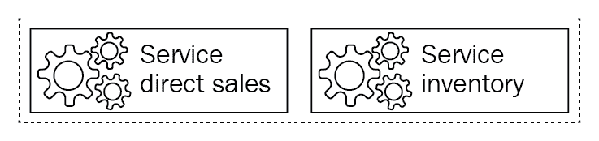

在这里，业务组件已经被分割成独立的服务。这些独立的服务现在是之前在自包含组件中存在的较小单元，在单体架构中。直接销售服务和库存服务相互独立，虚线表示它们存在于同一生态系统中，但并未被限制在单一范围内。请参考以下图表：

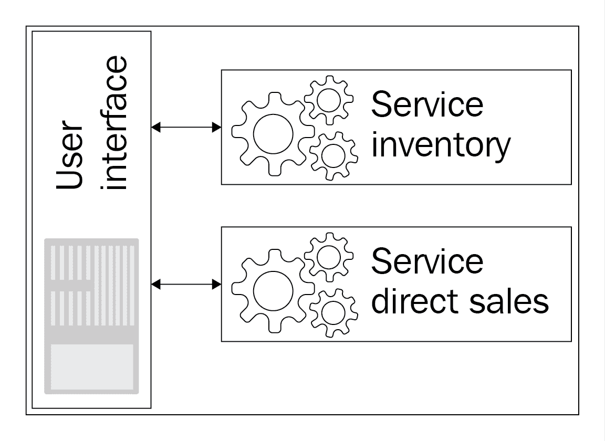

从前面的图表中可以看出，我们的用户界面可以与任何服务进行交互。当 UI 调用服务时，无需干预任何服务。这两个服务相互独立，且不知道用户界面何时会调用另一个服务。两个服务都对其自身的操作负责，而不是对整个系统中的任何其他部分负责。尽管与微服务架构非常接近，但前面的可视化并不是完全完整的微服务架构可视化。

在微服务架构中，服务是小型、独立的单元，拥有自己的持久存储。

现在让我们引入这一最终变化，以便每个服务都将拥有自己的数据库，用于持久化必要的数据。请参考以下图表：

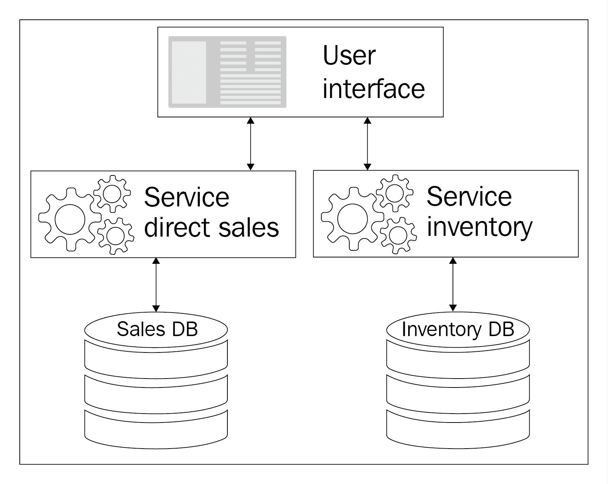

这里，**用户界面**正在与那些拥有独立存储的服务进行交互。在这种情况下，当用户界面调用直接销售服务时，直接销售的业务流程将独立于库存服务中的任何数据或逻辑执行。

微服务提供的解决方案具有许多好处，以下将进行讨论：

+   更小的代码库：每个服务都很小，因此作为单元开发和应用部署更为容易

+   独立环境的便利性：随着服务的分离，所有开发者都可以独立工作，独立部署，没有人会因任何模块依赖而感到困扰

随着微服务架构的采用，单体应用现在正在利用相关的优势，因为它现在可以轻松扩展并独立部署。

# 微服务中的消息传递

在处理微服务架构时，仔细考虑消息机制的选择非常重要。如果忽略了这个方面，那么它可能会损害使用微服务架构的整个目的。在单体应用中，这不是一个问题，因为组件的业务功能是通过函数调用来调用的。另一方面，这是通过松散耦合的基于 SOAP 的 Web 服务级别消息功能来实现的。在微服务消息机制的情况下，它应该是简单且轻量级的。

对于微服务架构，没有固定的规则来选择各种框架或协议。然而，这里有一些值得考虑的点。首先，它应该足够简单，以便实现，而不会给您的系统增加任何复杂性。其次，它应该足够轻量级，考虑到微服务架构可能会大量依赖服务间消息。让我们继续前进，考虑我们同步和异步消息以及不同消息格式的选择。

# 同步消息

当系统期望从服务中获得及时响应，并且系统会等待直到收到服务的响应，这就是同步消息。剩下的就是微服务中最受欢迎的选择。它是简单且支持 HTTP 请求-响应，因此几乎没有寻找替代方案的空间。这也是为什么大多数微服务的实现都使用 HTTP（基于 API 的风格）的原因之一。

# 异步消息

当系统不立即期望从服务中获得及时响应，并且系统可以在不阻塞该调用的情况下继续处理，这就是异步消息。

让我们将这个消息概念融入到我们的应用程序中，看看它会如何改变和看起来：

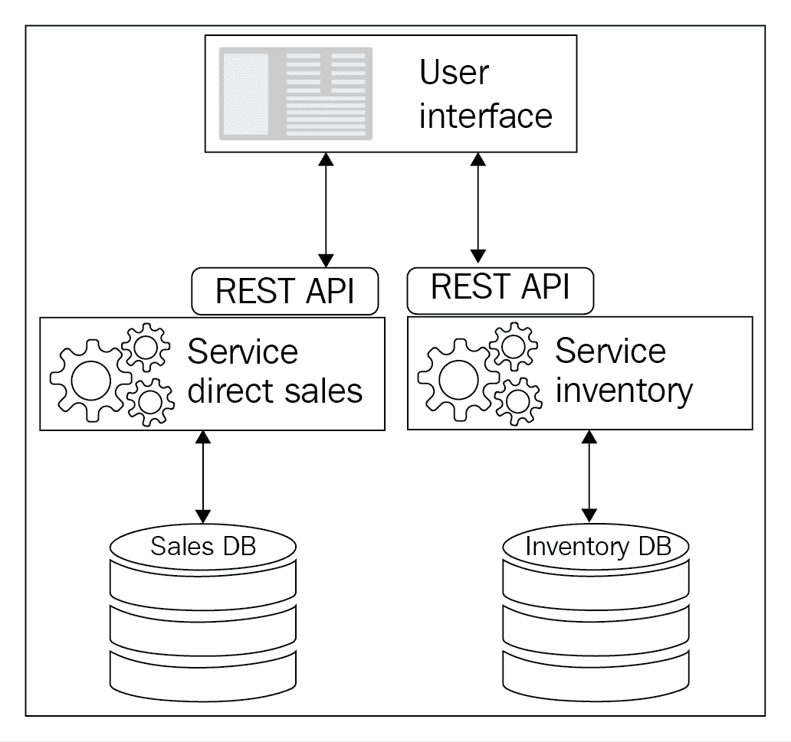

# 消息格式

在过去的几年里，使用 MVC 等工具让我对 JSON 格式产生了依赖。您也可以考虑 XML。这两种格式在 API 风格资源上都是可以接受的。如果您需要使用二进制消息格式，它们也容易获得。我们不推荐任何特定的格式；您可以选择任何选定的消息格式。

# 我们为什么应该使用微服务？

已经探索了大量的模式和架构，其中一些获得了流行；然而，还有一些正在失去互联网流量的竞争。由于每个解决方案都有其自身的优缺点，因此公司迅速响应基本需求（如可扩展性、高性能和易于部署）变得越来越重要。任何单一方面未能以成本效益的方式得到满足，都可能对大型企业产生负面影响，从而在盈利和非盈利企业之间造成巨大差异。

这就是我们在哪里看到*微服务*帮助企业系统架构师摆脱困境的地方。他们可以利用这种架构风格确保其设计不受先前提到的问题的影响。同时，考虑到所涉及的时间，以成本效益的方式实现这一目标也很重要。

# 微服务架构是如何工作的？

到目前为止，我们已经讨论了关于微服务架构的各个方面，现在我们可以描绘微服务架构是如何工作的；我们可以根据我们的设计方法使用任何组合，或者押注一个适合它的模式。以下是一些有利于微服务架构工作的要点：

+   这是现代编程，我们期望遵循所有 SOLID 原则。它是**面向对象编程**（**OOP**）。

+   这是将功能暴露给其他或外部组件的最佳方式，以便任何其他编程语言都能使用该功能，而无需遵循任何特定的用户界面，即服务（Web 服务、API、REST 服务等）。

+   整个系统按照一种非互联或相互依赖的协作方式工作。

+   每个组件都对其自身的责任负责。换句话说，组件只负责一个功能。

+   它通过分离概念来隔离代码，并且隔离的代码是可重用的。

# 微服务的优势

现在让我们快速了解微服务是如何在 SOA 和单体架构中取得飞跃的：

+   成本效益高的扩展性：您不需要投入大量资金来使整个应用具有可扩展性。就购物车而言，我们可以简单地负载均衡产品搜索模块和订单处理模块，同时排除使用频率较低的运营服务，例如库存管理、订单取消和交货确认。

+   清晰的代码边界：这一行动应与组织的部门层级相匹配。在大型企业中，不同的部门资助产品开发，这可以是一个巨大的优势。

+   更容易的代码更改：代码是以一种方式编写的，它不依赖于其他模块的代码，并且只实现隔离的功能。如果做得正确，那么微服务中的更改影响另一个微服务的可能性非常小。

+   简单部署：由于整个应用程序更像是一组相互隔离的生态系统，如果需要，可以一次部署一个微服务。任何一个微服务的失败都不会导致整个系统崩溃。

+   技术适应性：你可以在一夜之间将单个微服务或一大堆微服务迁移到不同的技术，而用户甚至可能都不知道。是的，我们希望你不要期望我们告诉你你需要维护那些服务合同。

+   分布式系统：这一点是隐含的，但在这里需要提醒一下。确保你的异步调用被正确使用，而同步调用不会真正阻塞整个信息流。合理使用数据分区。我们稍后会提到这一点，所以现在不用担心。

+   快速市场响应：世界竞争激烈是一个明显的优势；否则，如果你对新的功能请求或系统内新技术的采用反应迟缓，用户可能会迅速失去兴趣。

# SOA 与微服务

如果你没有完全理解微服务和 SOA，你会在两者之间感到困惑。从表面上看，微服务的特性和优势听起来几乎像是 SOA 的一个精简版本，许多专家建议实际上没有必要使用额外的术语，如**微服务**，SOA 可以满足微服务所列出的所有属性。然而，事实并非如此。它们之间有足够的差异，可以在技术上区分开来。

SOA 的底层通信系统固有的存在以下问题：

+   事实是，在 SOA 中开发出的系统依赖于其相互交互的组件。所以无论你多么努力，它最终都会在消息队列中遇到瓶颈。

+   SOA 的另一个焦点是命令式单例编程。因此，我们失去了使用面向对象编程（OOP）使代码单元可重用的途径。

我们都知道，组织在基础设施上的投入越来越多。企业越大，正在开发的应用程序的所有权问题就越复杂。随着利益相关者的数量不断增加，满足他们不断变化的企业需求变得不可能。这正是微服务明显区别于其他地方的地方。尽管云开发不在我们讨论的当前范围内，但说云平台可以轻松扩展微服务架构的可扩展性、模块化和适应性，并不会对我们造成伤害。是时候改变一下了。

# 微服务架构的先决条件

理解微服务架构实施后的结果生态系统非常重要。微服务的影响不仅仅是预操作性的。对于任何选择微服务架构的组织来说，变化将是如此深刻，以至于如果他们没有做好充分准备来应对，优势很快就会变成劣势。

在同意采用微服务架构之后，明智的做法是确保以下先决条件已经到位：

+   部署和 QA：需求将变得更加严格，开发需求周转速度更快。这要求你尽可能快地进行部署和测试。如果只是少数服务，那么这不会成为问题。然而，如果服务的数量在增加，这可能会很快对现有的基础设施和实践构成挑战。例如，你的 QA 和预发布环境可能不再足以测试开发团队返回的构建数量。

+   开发和运维团队的协作平台：随着应用程序进入公共领域，很快就会再次上演古老的开发与 QA 之间的对决。这次的不同之处在于，业务将受到威胁。因此，你需要准备好在需要时以自动化的方式快速响应，以确定根本原因。

+   监控框架：随着微服务数量的增加，你很快就需要一种方法来监控整个系统的运行状况和健康，以发现任何可能的瓶颈或问题。如果没有任何手段来监控已部署微服务的状态和结果业务功能，任何团队都无法采取主动部署方法。

# 理解单体架构风格的问题

在本节中，我们将讨论基于单体.NET 堆栈的应用程序所遇到的所有问题。在单体应用程序中，核心问题是这样的：单体扩展很困难。结果应用程序最终拥有一个非常大的代码库，并在可维护性、部署和修改方面提出了挑战。

# 标准化.NET 堆栈的挑战

在单体应用程序技术中，堆栈依赖阻止了从外部世界引入最新技术。当前的堆栈本身作为一个网络服务也面临一些挑战：

+   安全性：无法通过网络服务识别用户（没有关于强认证方案的明确共识）。想象一下，一个银行应用程序发送未加密的数据，其中包含用户凭据，而没有加密。所有提供免费 Wi-Fi 的机场、咖啡馆和公共场所都很容易成为身份盗窃和其他网络犯罪的受害者。

+   响应时间：尽管网络服务本身在整体架构中提供了一些灵活性，但由于服务本身的高处理时间，这种灵活性很快就会减少。因此，在这种场景下，网络服务本身并没有错。事实上，单体应用程序涉及大量的代码；复杂的逻辑使得网络服务的响应时间很高，因此，这是不可接受的。

+   吞吐量：这处于较高水平，因此会阻碍后续操作。依赖于调用库存网络服务并需要搜索数百万条记录的结账操作并非坏事。然而，当相同的库存服务为整个门户的产品搜索/浏览提供数据时，可能会导致业务损失。在十次调用中，如果有一次服务调用失败，则意味着业务转化率降低 10%。

+   经常性停机：由于网络服务是整个单体生态系统的一部分，它们在每次升级或应用程序故障时必然会出现停机且不可用。这意味着外部世界对应用程序网络服务的任何 B2B 依赖都会进一步复杂化决策过程，从而寻求停机时间。这绝对使得系统的较小升级看起来成本高昂；因此，它进一步增加了待处理的系统升级积压。

+   技术采用：为了采用或升级技术堆栈，需要整个应用程序进行升级、测试和部署，因为模块是相互依赖的，整个项目的代码库都会受到影响。考虑使用需要合规性相关框架升级的组件的支付网关模块。开发团队别无选择，只能升级框架本身，并仔细检查整个代码库以预防性地识别任何代码冲突。当然，这仍然不能排除生产崩溃的可能性，但这很容易让即使是最好的架构师和管理者都感到焦虑，甚至失眠。

**可用性**：服务运行的时间百分比。

**响应时间**：服务响应所需的时间。

**吞吐量**：处理请求的速率。

# 容错性

单体应用程序具有高度模块间依赖性，因为它们紧密耦合。不同的模块以这种方式利用模块内的功能，以至于即使是单个模块的故障也会由于级联效应而使整个系统崩溃，这与多米诺骨牌倒下的情况非常相似。我们都知道，用户在产品搜索中得不到结果会比整个系统崩溃要轻微得多。

使用网络服务进行解耦在传统上是在架构层面尝试的。对于数据库级别的策略，长期以来一直依赖于 ACID。让我们进一步探讨这两个点：

+   互联网服务：在当前的单体应用中，由于这个原因，客户体验受到了影响。即使客户试图下订单，像互联网服务的高响应时间或服务本身的完全失败这样的原因，都会导致无法成功下单。任何一次失败都是不可接受的，因为用户往往会记住他们的最后一次体验并假设可能的重现。这不仅会导致潜在销售的损失，还会导致未来商业前景的损失。互联网服务的故障可能导致依赖它们的系统出现级联故障。

+   ACID：ACID 是原子性、一致性、隔离性和持久性的缩写；它是数据库中的一个重要概念。它已经到位，但它是福是祸需要根据综合性能来判断。它负责处理数据库级别的故障，并且毫无疑问，它确实提供了一些防范数据库错误的能力。同时，每个 ACID 操作都会阻碍/延迟其他组件/模块的操作。它造成更多伤害而不是益处的点需要非常仔细地判断。

# 扩展

诸如不同通信手段的可用性、信息的便捷获取和开放的世界市场等因素导致企业迅速增长并多样化。随着业务的快速增长，满足不断增长的客户基础的需求也在不断增加。扩展是任何企业在尝试满足增加的用户基础时面临的最大挑战之一。

**可扩展性**不过是系统/程序更好地处理工作增长的能力。换句话说，可扩展性是系统/程序扩展的能力。

在开始下一节之前，让我们详细讨论和理解扩展，因为这将是我们从单体过渡到微服务时的一个重要组成部分。

系统的可扩展性是其处理不断增加/增加的工作负载的能力。我们可以通过两种主要策略或可扩展性类型来扩展我们的应用程序。

# 垂直扩展或向上扩展

在垂直扩展中，我们分析现有应用程序，以找到由于执行时间较长而使应用程序变慢的模块部分。使代码更高效可能是一种策略，这样就可以消耗更少的内存。这种减少内存消耗的练习可能针对特定的模块或整个应用程序。另一方面，由于这种策略涉及明显的挑战，我们可以在不更改应用程序的情况下，向现有的 IT 基础设施添加更多资源，例如升级 RAM 或添加更多磁盘驱动器。垂直扩展的这两条路径都有其有益程度的限制。在某个时间点之后，产生的利益将达到平台期。重要的是要记住，这种类型的扩展需要停机时间。

# 水平扩展或扩展到外部

在水平扩展中，我们深入分析那些由于高并发等因素而对整体性能影响较大的模块；因此，这将使我们的应用程序能够服务不断增长的用户基础，现在用户数量已达到百万级别。我们还实施了负载均衡来处理更多的工作量。向集群中添加更多服务器的选项不需要停机时间，这无疑是一个优势。每个案例都是不同的，因此是否值得投入额外的电力、许可证和冷却成本，以及到什么程度，将根据每个案例进行评估。

扩展将在第八章“扩展微服务”中详细讨论。

# 部署挑战

当前应用程序也存在部署挑战。它被设计为一个单体应用程序，任何对顺序模块的更改都要求重新部署整个应用程序。这是耗时且每次更改都必须重复整个周期。这意味着这可能会是一个频繁的周期。在这种情况下，扩展可能只是一个遥远的梦想。

如同讨论的关于扩展当前应用程序的部署挑战，需要我们部署整个组件，模块之间相互依赖，这是一个单一的.NET 组件应用程序。一次性部署整个应用程序也使得测试我们应用程序的整个功能成为强制性的。这种练习的影响将是巨大的：

+   高风险部署：一次性部署整个解决方案或应用程序存在高风险，因为即使是对某个模块的单个更改，所有模块都将被部署。

+   更高的测试时间：由于我们必须部署完整的应用程序，因此我们必须测试整个应用程序的功能。没有测试，我们不能上线。由于高度依赖性，更改可能会在其他模块中引起问题。

+   计划外停机时间：完整的生产部署需要代码被完全测试，因此我们需要安排我们的生产部署。这是一个耗时的工作，导致高停机时间。尽管在这个时间段内，由于系统不可用，业务和客户都会受到影响，这可能导致业务收入损失。

+   生产中的错误：任何项目经理的梦想都是无错误的部署。然而，这远非现实，每个团队都害怕这种可能性。单体应用程序与这种场景并无不同，生产错误的解决比说起来容易做起来难。如果一些之前的错误尚未解决，情况可能会变得更加复杂。

# 组织对齐

在单体应用程序中，拥有庞大的代码库并不是你将面临的唯一挑战。拥有一个庞大的团队来处理这样的代码库也是另一个会影响业务和应用程序增长的问题。

+   同样的目标：在一个团队中，所有团队成员都有相同的目标，那就是在每天结束时及时且无错误地交付。然而，拥有庞大的代码库和当前的单一架构风格，对于团队成员来说并不会感到舒适。由于代码和相关的交付成果相互依赖，开发团队中也会出现同样的效果。在这里，每个人都只是在匆忙和努力地完成工作。互相帮助或尝试新事物的想法不会出现。简而言之，这个团队不是一个自我组织的团队。

罗伊·奥斯霍夫在他的书《团队领导者》中定义了团队的三个阶段：

**生存阶段**：没有时间学习。

**学习阶段**：学习解决自己的问题。

**自我组织阶段**：促进，实验。

+   不同的视角：由于功能增强、错误修复或模块相互依赖等原因，开发团队花费太多时间来完成交付成果。QA 团队依赖于开发团队，而开发团队也有自己的问题。当开发人员开始处理错误、修复或功能增强时，QA 团队就会陷入困境。没有为 QA 提供单独的环境或构建来进行测试。这种延迟阻碍了整体交付，客户或最终用户将无法及时获得新功能或修复。

# 模块化

就我们的单体应用程序而言，我们可能有一个订单模块，模块*订单*的变化会影响模块*库存*等等。正是模块化的缺失导致了这种状况。

这也意味着我们无法在另一个模块中重用模块的功能。代码没有被分解成可以重用以节省时间和精力的结构化部分。代码模块之间没有隔离，因此没有可用的通用代码。

业务正在增长，其客户也在飞速增长。来自不同地区的新的或现有客户在应用的使用上有着不同的偏好。有些人喜欢访问网站，但其他人更喜欢使用移动应用。系统结构是这样的，我们无法在网站和移动应用之间共享组件。这使得为业务引入移动/设备应用成为一项挑战性任务。在这种情况下，公司会失去那些偏好移动应用的客户。

替换组件应用中的困难在于使用第三方库、外部系统（如支付网关）和外部订单跟踪系统。在目前风格的单体架构应用中替换旧组件是一项繁琐的工作。例如，如果我们考虑升级我们模块的库，该库正在消耗外部订单跟踪系统，那么整个变更将证明是非常困难的。此外，用另一个支付网关替换我们的支付网关也将是一项复杂的任务。

在任何上述场景中，每次我们升级组件时，都会升级应用程序中的所有内容，这要求对系统进行完全测试，并需要大量的停机时间。除此之外，升级可能会以生产中的错误形式出现，这将需要你重复整个开发、测试和部署的周期。

# 大型数据库

我们当前的应用程序拥有一个庞大的数据库，包含单一架构和大量的索引。这种结构在调整性能时提出了挑战：

+   单一架构：数据库中的所有实体都被归类到一个名为 *dbo* 的单一架构下。这又因为与单一架构相关的各种表属于不同的模块而阻碍了业务；例如，客户和供应商表属于同一个架构，即 *dbo*。

+   数量众多的存储过程：目前，数据库中拥有大量的存储过程，这些过程也包含了相当一部分的业务逻辑。一些计算是在存储过程中进行的。因此，当需要优化或将其分解成更小的单元时，这些存储过程变得难以处理。

在计划部署时，团队必须仔细审查每一个数据库变更。这又是一项耗时的工作，很多时候甚至比构建和部署本身还要复杂。

# 微服务的先决条件

为了更好地理解，让我们以 FlixOne Inc. 的一个虚构例子为例。以这个例子为基础，让我们详细讨论所有概念，并看看为微服务做好准备是什么样的。

FlixOne 是一家遍布印度的电子商务玩家（销售书籍）。他们以非常快的速度增长，并在同时多元化他们的业务。他们基于.NET 框架构建了现有的系统，这是一个传统的三层架构。他们有一个庞大的数据库，是这个系统的核心，并且在其生态系统中还有外围应用。其中一个应用是为他们的销售和物流团队设计的，碰巧是一个 Android 应用。这些应用连接到他们的集中数据中心，并面临性能问题。FlixOne 有一个内部开发团队，并得到外部顾问的支持。参看以下图表：

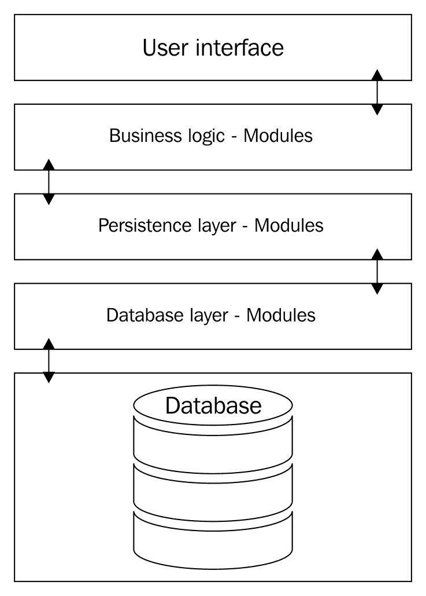

上述图表描述了我们对当前应用的更广泛的理解，这是一个单一的.NET 程序集应用。在这里，我们有用于搜索、订单、产品、跟踪订单和结账的用户界面。现在看看下面的图表：

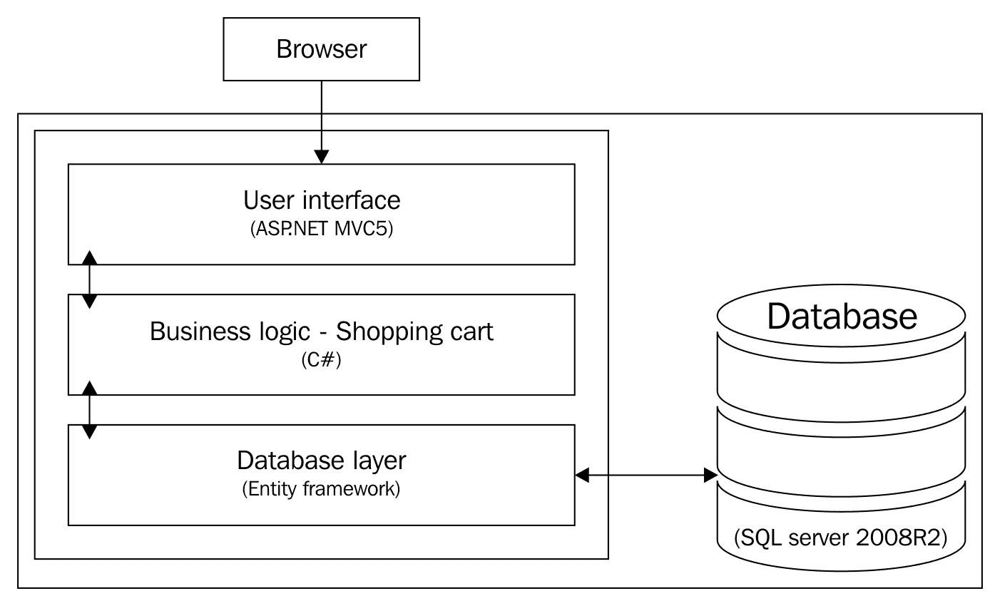

上述图表仅描述了我们的**购物车**模块。该应用是用 C#、MVC5 和 Entity Framework 构建的，并且是一个单一项目应用。这张图片只是我们应用架构的示意图。这个应用是基于 Web 的，可以通过任何浏览器访问。最初，任何使用 HTTP 协议的请求都会落在使用 MVC5 和 JQuery 开发的用户界面上。对于购物车活动，UI 与**购物车**模块交互，该模块实际上是一个业务逻辑层，它进一步与数据库层（用 C#编写）通信；数据在数据库（SQL Server 2008R2）中持久化。

# 应用功能概述

在这里，我们将了解 FlixOne 书店应用的功能概述。这只是为了可视化我们的应用。以下是从购物车到简化的功能概述的应用。

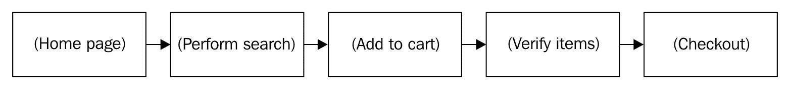

在当前的应用中，客户首先进入主页，在那里他们可以看到特色/突出显示的书籍。如果他们没有找到喜欢的书籍，他们可以选择搜索书籍项目。在得到期望的结果后，客户可以选择书籍项目并将它们添加到他们的购物车中。在最终结账之前，客户可以验证书籍项目。一旦客户决定结账，现有的购物车系统就会将他们重定向到外部支付网关，以支付购物车中所需支付的书籍项目的金额。

如前所述，我们的应用是一个单体应用；它被构建为作为一个单一单元开发和部署。这个应用有一个庞大的代码库，仍在增长。小的更新需要一次性部署整个应用。

# 当前挑战的解决方案

业务正在迅速增长，因此我们决定在另外 20 个城市开设我们的电子商务网站；然而，我们仍在面对现有应用程序的挑战，并且难以适当地服务现有用户群。在这种情况下，在我们开始过渡之前，我们应该使我们的单体应用程序准备好向微服务过渡。

在第一种方法中，**购物车**模块将被分割成更小的模块，然后你将能够使这些模块相互交互，以及与外部或第三方软件交互：

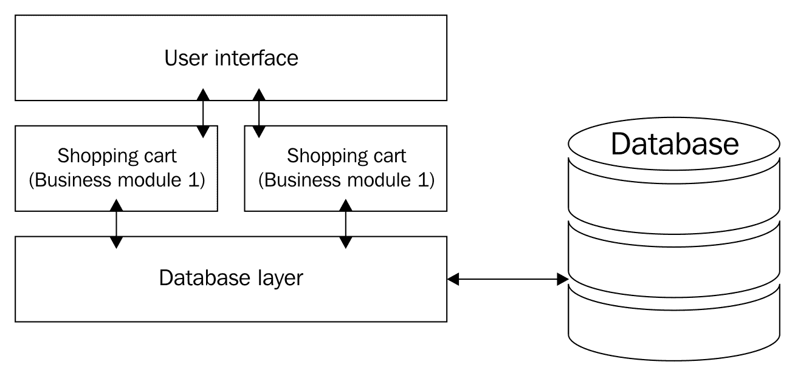

尽管开发人员能够分割代码并重用它，但这个提出的解决方案并不足以解决我们现有的应用程序问题。然而，业务逻辑的内部处理将保持不变，而不会改变它与 UI 或数据库交互的方式。新的代码将与 UI 和数据库层交互，而数据库仍然保持为同一个旧的单一数据库。由于我们的数据库保持未分割并且紧密耦合的层，必须更新和部署整个代码库的问题仍然存在。因此，这个解决方案不适合解决我们的问题。

# 处理部署问题

在上一节中，我们讨论了我们将面临的当前.NET 单体应用程序的部署挑战。在本节中，让我们看看我们如何通过在同一个.NET 堆栈内创建或适应一些实践来克服这些挑战。

在我们的.NET 单体应用程序中，我们的部署由 XCOPY 部署组成。在将我们的模块划分为不同的子模块后，我们可以借助这些策略适应部署策略。我们可以简单地部署我们的业务逻辑层或一些通用功能。我们可以适应持续集成和部署。XCOPY 部署是一个将所有文件复制到服务器的过程，主要用于 Web 项目。

# 制作更好的单体应用程序

我们理解我们现有单体应用程序的所有挑战。我们必须以更好的方式为新增长服务。随着我们广泛地增长，我们不能错过吸引新客户的机会。如果我们错过解决任何挑战，那么我们就会失去商业机会。让我们讨论一些解决这些问题的观点。

# 介绍依赖注入

我们的模块相互依赖，因此由于一个模块的变化，我们面临着诸如代码重用性和未解决的错误等问题。这些都是部署挑战。为了解决这些问题，让我们将应用程序分割成这样的方式，以便我们可以将模块划分为子模块。我们可以将我们的`订单`模块分割成这样的方式，使其能够实现接口，并且这可以从构造函数中启动。以下是一个小的代码片段，展示了我们如何在现有的单体应用程序中应用这一点。

这里是一个代码示例，展示了我们的`Order`类，其中我们使用了构造函数注入：

```cs
    namespace FlixOne.BookStore.Common
    {
      public class Order : IOrder
      {
        private readonly IOrderRepository _orderRepository;
        public Order(IOrderRepository orderRepository)
        {
          _orderRepository = orderRepository;
        }
        public OrderModel GetBy(Guid orderId)
        {
          return _orderRepository.Get(orderId);
        }
      }
    }
```

控制反转，或 IoC，不过是对象不创建它们依赖来完成工作的其他对象的一种方式。

在前面的代码片段中，我们以这种方式抽象了我们的`Order`模块，使其能够使用`IOrder`接口。之后，我们的`Order`类实现了`IOrder`接口，并且通过使用控制反转，我们创建了一个对象，因为这是通过控制反转自动解决的。

此外，`IOrderRepository`和`OrderRepository`的代码片段如下：

```cs
    namespace FlixOne.BookStore.Common
    {
      public interface IOrderRepository
      {
        OrderModel Get(Guid orderId);
      }
    }
    namespace FlixOne.BookStore.Common
    {
      public class OrderRepository : IOrderRepository
      {
        public OrderModel Get(Guid orderId)
        {
          //call data method here
          return new OrderModel
          {
            OrderId = Guid.NewGuid(),
            OrderDate = DateTime.Now,
            OrderStatus = "In Transit"
          };
        }
      }
    }
```

在这里，我们试图展示我们的`Order`模块是如何被抽象的。在前面的代码片段中，我们只为订单返回默认值，只是为了演示实际问题的解决方案。

最后，我们的表示层（MVC 控制器）将使用以下代码片段中所示的方法：

```cs
    namespace FlixOne.BookStore.Controllers
    {
      public class OrderController : Controller
      {
        private readonly IOrder _order;
        public OrderController(IOrder order)
        {
          _order = order;
        }
        // GET: Order
        public ActionResult Index()
        {
          return View();
        }
        // GET: Order/Details/5
        public ActionResult Details(string id)
        {
          var orderId = Guid.Parse(id);
          var orderModel = _order.GetBy(orderId);
          return View(orderModel);
        } 
      }
    }
```

下面的类图展示了我们的接口和类是如何相互关联的，以及它们如何公开它们的方法、属性等等：

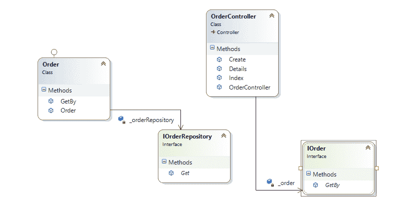

再次，我们使用了构造函数注入，其中`IOrder`传递并初始化了`Order`类；因此，所有方法都在我们的控制器中可用。

通过实现这一点，我们将克服一些问题，例如：

+   减少模块依赖：在我们的应用程序中引入`IOrder`后，我们正在减少`Order`模块的相互依赖性。这样，如果我们需要向此模块添加或从中删除任何内容，则其他模块不会受到影响，因为`IOrder`仅由`Order`模块实现。比如说，我们想要增强我们的`Order`模块；这不会影响我们的`Stock`模块。这样，我们减少了模块间的依赖性。

+   引入代码复用：如果您需要获取任何应用程序模块的订单详情，您可以使用`IOrder`类型轻松做到这一点。

+   代码可维护性的改进：我们现在已经将我们的模块划分为子模块或类和接口。现在我们可以以这种方式组织我们的代码，即所有类型，即所有接口，都放在一个文件夹下，并为存储库遵循同样的模式。有了这种结构，我们将更容易安排和维护代码。

+   单元测试：我们当前的单一应用程序没有任何类型的单元测试。随着接口的引入，我们现在可以轻松地进行单元测试，并轻松采用测试驱动开发系统。

# 数据库重构

如前所述，我们的应用程序数据库很大，依赖于单一模式。在重构时，应考虑这个庞大的数据库。我们将这样做：

+   模式修正：在一般实践中（不是必需的），我们的模式描述了我们的模块。如前所述，我们庞大的数据库有一个单一的方案，即现在的*dbo*，代码或表的每一部分都不应与*dbo*相关。可能有几个模块将与特定的表交互。例如，我们的`Order`模块应包含一些相关的模式名称，如`Order`。因此，每次我们需要使用表时，我们可以使用它们自己的模式而不是通用的*dbo*模式。这不会影响任何与从数据库中检索数据相关的功能。但它将以结构化或组织的方式排列我们的表，这样我们就能识别并关联每个表及其特定的模块。当我们处于将单体应用过渡到微服务阶段时，这项练习将非常有帮助。参见图示：

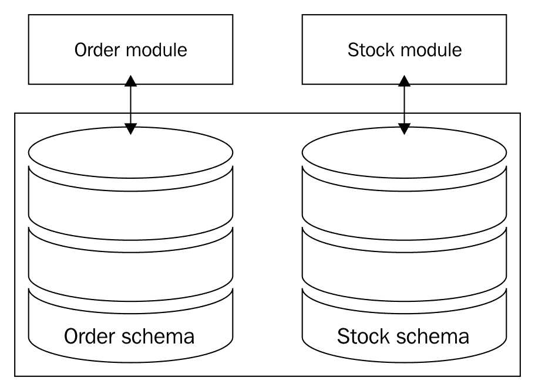

在前面的图中，我们看到数据库模式是如何在逻辑上分离的。它并不是在物理上分离——我们的**订单模式**和**库存模式**属于同一个数据库。因此，在这里我们在逻辑上而不是在物理上分离数据库模式。

我们还可以以我们的用户为例——并非所有用户都是管理员或属于特定的区域、地区或区域。但我们的用户表应该以这样的方式组织，即我们应该能够通过表名或它们的结构来识别用户。在这里，我们可以根据地区来组织我们的用户表。我们应该将用户表映射到区域表，这样它就不会影响或对现有的代码库造成任何变化。

+   将业务逻辑从存储过程迁移到代码：在当前数据库中，我们有数千行存储过程，其中包含大量的业务逻辑。我们应该将业务逻辑移动到我们的代码库中。在我们的单体应用中，我们使用 Entity Framework；在这里，我们可以避免创建存储过程。我们可以将所有的业务逻辑整合到代码中。

# 数据库分片和分区

在数据库分片和分区之间，我们可以选择数据库分片，这样我们将将其分解成更小的数据库。这些较小的数据库将部署在单独的服务器上：

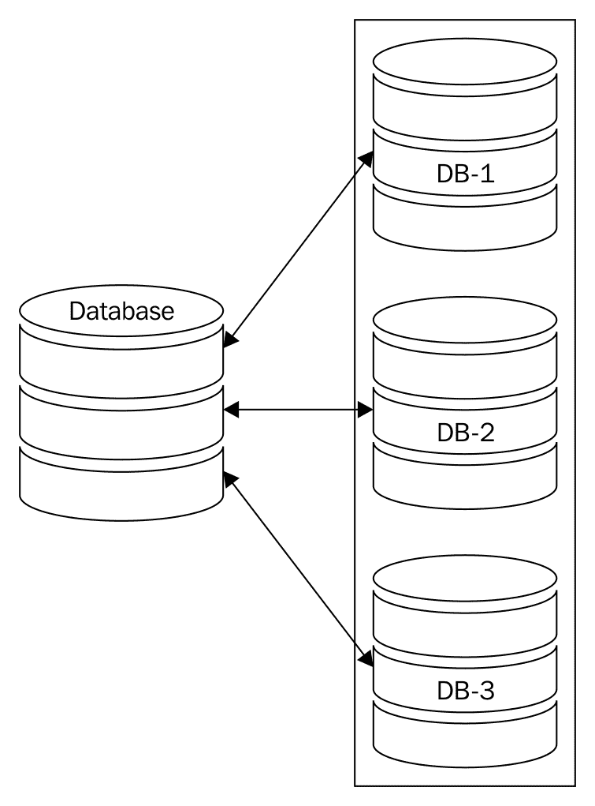

通常，数据库分片被简单地定义为大型数据库的*无共享*分区方案。这样，我们可以达到一个新的高性能和可扩展性水平。分片来自*shard*（碎片）和分散，这意味着将数据库分成块（碎片）并分散到不同的服务器。

上述图示概述了我们的数据库是如何被划分为更小的数据库的。请看以下图示：

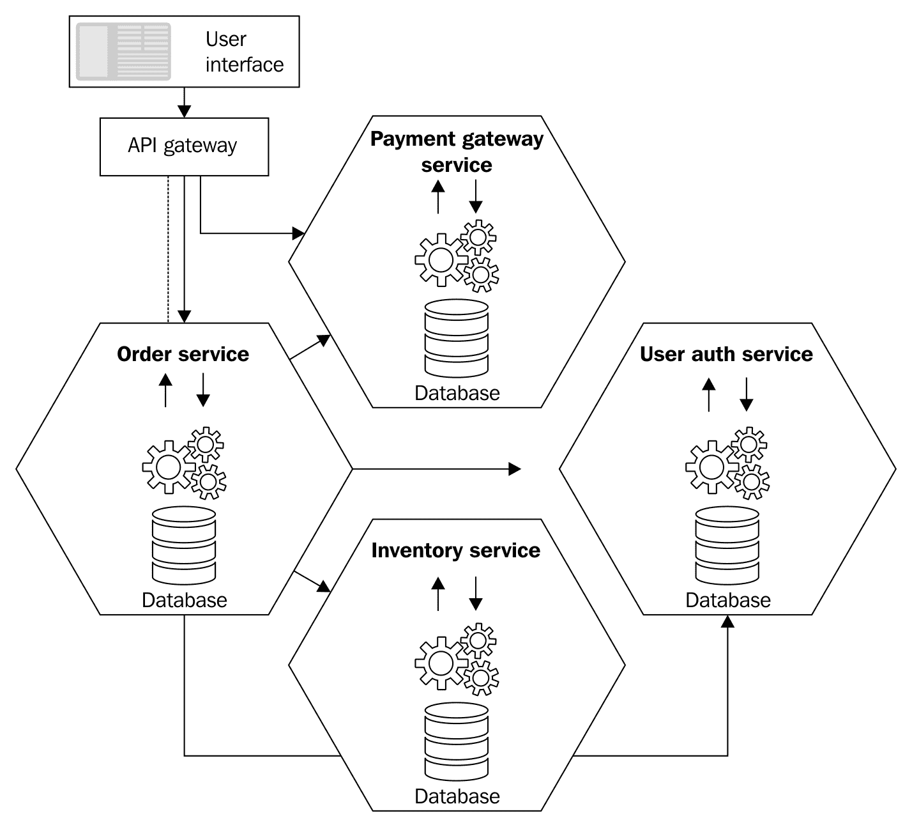

# DevOps 文化

在前面的章节中，我们讨论了团队面临的挑战和问题。在这里，我们为 DevOps 团队提出一个解决方案：强调开发团队与其他运营团队的协作。我们应该建立一个系统，其中开发、质量保证和基础设施团队可以协作工作。

# 自动化

基础设施设置可能是一个非常耗时的工作；当基础设施为他们准备时，开发者将保持空闲。他们将在加入团队并做出贡献之前花费一些时间。基础设施设置的过程不应该阻止开发者变得高效，因为这会降低整体生产力。这应该是一个自动化的过程。使用 Chef 或 PowerShell，我们可以轻松创建我们的虚拟机，并在需要时快速增加开发者数量。这样，我们的开发者可以在加入团队的当天开始工作。

Chef 是一个 DevOps 工具，它提供了一个框架来自动化和管理你的基础设施。

PowerShell 可以用来创建我们的 Azure 机器并设置 TFS。

# 测试

我们打算将自动化测试作为解决我们先前问题的方案，这些问题是在部署期间测试时遇到的。在这个解决方案的部分，我们必须将我们的测试方法划分为以下几方面：

+   采用 **测试驱动开发（TDD**）。使用 TDD，开发者需要测试自己的代码。测试不过是一段代码，可以验证功能是否按预期工作。如果发现任何功能不符合测试代码，相应的单元测试就会失败。由于你知道问题所在，因此可以轻松修复此功能。为了实现这一点，我们可以利用如 MS 测试或单元测试等框架。

+   质量保证团队可以使用脚本来自动化他们的任务。他们可以通过使用 QTP 或 Selenium 框架来创建脚本。

# 版本控制

当前系统没有任何版本控制系统，因此在变更过程中发生问题时无法回滚。为了解决这个问题，我们需要引入版本控制机制。在我们的情况下，这应该是 TFS 或 Git。使用版本控制，我们现在可以在发现更改破坏了某些功能或引入了任何意外行为时回滚更改。我们现在有能力跟踪在此应用程序上工作的团队成员所做的更改，达到个人层面。然而，在我们的单体应用程序中，我们没有这种能力。

# 部署

在我们的应用程序中，部署是一个巨大的挑战。为了解决这个问题，我们引入了**持续集成（CI**）。在这个过程中，我们需要设置一个 CI 服务器。随着 CI 的引入，整个过程实现了自动化。一旦任何团队成员通过版本控制 TFS 或 Git（在我们的案例中）将代码提交，CI 过程就会启动。它确保新代码被构建，并且运行单元测试以及集成测试。在成功构建或失败的情况下，团队都会被通知结果。这使得团队能够快速响应问题。

接下来，我们转向持续部署。在这里，我们引入了各种环境，例如开发环境、预发布环境、QA 环境，等等。现在，一旦任何团队成员将代码提交，CI 就会启动。它调用单元/集成测试套件，构建系统，并将其推送到我们已设置的各种环境中。这样，开发团队提供适合 QA 的构建的周转时间就缩短到了最小。

# 在单体架构中识别分解候选者

我们现在已经清楚地识别出当前 FlixOne 应用程序架构及其产生的代码对开发团队所提出的各种问题。此外，我们也理解了开发团队无法承担哪些商业挑战以及原因。

并非团队能力不足——问题在于代码。让我们继续前进，看看针对我们需要迁移到微服务架构的 FlixOne 应用程序各个部分的最佳策略是什么。你应该知道，你有一个单体架构的候选者，它会在以下某个领域引起问题：

+   焦点部署：尽管这在整个过程的最后阶段，但它确实需要更多的尊重，这是理所当然的。在这里，重要的是要理解这个因素从识别和设计的初始阶段开始就塑造和定义了整个开发策略。以下是一个例子：业务要求你解决两个同等重要的问题。其中一个问题可能需要你对更多相关模块进行测试，而另一个问题的解决方案可能允许你进行有限的测试。做出这样的选择是错误的。业务不应该有做出这种选择的权利。

+   代码复杂性：这里的关键是拥有较小的团队。你应该能够为与单个功能相关的更改分配小型开发团队。小型团队由一到两名成员组成。如果超过这个规模，就需要项目经理。这意味着模块之间的相互依赖性比应有的要强。

+   技术采用：你应该能够升级组件到新版本或不同技术，而不会破坏其他东西。如果你必须考虑依赖它的组件，你就有不止一个候选者。即使你必须担心这个组件所依赖的模块，你仍然有不止一个候选者。我记得我的一个客户有一个专门的团队来测试即将发布的技术是否适合他们的需求。后来我了解到，他们实际上会移植其中一个模块，并测量整个系统的性能影响、努力需求和周转时间。不过，我并不认同这一点。

+   高资源消耗：在我看来，系统中的每一件事，从内存、CPU 时间和 I/O 需求，都应该被视为一个模块。如果任何一个模块花费的时间更多，并且/或者更频繁，它应该被单独指出。在任何涉及高于正常内存的操作中，处理时间会阻塞延迟，I/O 会使系统等待；在我们的情况下，这将是好的。

+   人力资源依赖：如果跨模块移动团队成员似乎工作量太大，你就有更多的候选者。开发者很聪明，但如果他们在大系统中遇到困难，这不是他们的错。将系统分解成更小的单元，开发者将感到更加舒适和高效。

# 重要的微服务优势

我们已经完成了将候选者迁移到微服务的第一步。了解微服务提供的相应优势将是有价值的。

# 技术独立性

由于每个微服务都是相互独立的，我们现在可以为每个微服务使用不同的技术。支付网关可以使用最新的 .NET 框架，而产品搜索可以转移到任何其他编程语言。

整个应用程序可以基于 SQL 服务器进行数据存储，而库存则可以基于 NoSQL。这种灵活性是无限的。

# 消除相互依赖

由于我们试图在每个微服务中实现隔离的功能，因此很容易添加新功能、修复错误或升级技术。这将对其他微服务没有影响。现在你有了垂直代码隔离，这使你能够在保持快速部署的同时完成所有这些操作。

这还没有结束。FlixOne 团队现在有能力在现有的支付网关旁边发布一个新的支付网关选项。这两个支付网关可以共存，直到团队和业务所有者都对报告感到满意。这就是这种架构巨大力量的体现。

# 与业务目标对齐

商业主不一定擅长理解为什么某个功能更难或耗时更长来实现。他们的责任是不断推动业务并使其增长。开发团队应该成为业务目标的支点，而不是障碍。

极其重要的是要理解，能够快速响应业务需求并适应市场趋势的能力不是微服务的副产品，而是其目标。

只有较小的团队能够实现这一点，这使得它更适合商业主。

# 成本效益

每个微服务都成为业务的投资，因为它可以很容易地被其他微服务消费，而无需一次又一次地重写相同的代码。每次微服务被重用时，都可以通过避免测试和部署该部分来节省时间。

由于停机时间要么被消除要么减少到最小，用户体验得到了提升。

# 易于扩展

在垂直隔离已经实施，并且每个微服务向整个系统提供特定服务的情况下，扩展变得容易。不仅扩展候选者的识别更容易，而且成本更低。这是因为我们只扩展整个微服务生态系统的一部分。

这种练习可能对业务来说成本高昂；因此，优先考虑哪个微服务应该首先扩展现在可以成为业务团队的选择。这个决定不再需要是开发团队的选择。

# 安全性

安全性与传统分层架构提供的安全性相似；微服务可以同样容易地得到保护。可以使用不同的配置来保护不同的微服务。你可以将微服务生态系统的一部分放在防火墙后面，另一部分用于用户加密。面向 Web 的微服务可以与其他微服务不同地得到保护。你可以根据自己的需求、技术或预算来选择。

# 数据管理

在大多数单体应用中，通常只有一个数据库。几乎总是有一个数据库架构师或指定的负责人负责其完整性和维护。任何需要更改数据库的应用增强路径都必须经过这条路线。对我来说，这从来都不是一件容易的任务。这进一步减缓了应用增强、可扩展性和技术采用的过程。

因为每个微服务都有自己的**独立**数据库，与数据库更改相关的决策可以很容易地委派给相应的团队。我们不必担心对整个系统的影响，因为不会有的。

同时，这种数据库的分离为团队实现自我组织提供了可能性。他们现在可以开始尝试了。

例如，团队现在可以考虑使用 Azure Table 存储或 Azure Redis Cache 来存储庞大的产品目录，而不是像目前那样使用数据库。团队现在不仅可以进行实验，他们的经验还可以很容易地根据其他团队的需求以对他们方便的时间表进行复制。

事实上，现在没有任何东西阻止 FlixOne 团队创新并同时使用多种技术，然后在现实世界中比较性能并做出最终决定。一旦每个微服务都有自己的数据库，FlixOne 将看起来是这样的：

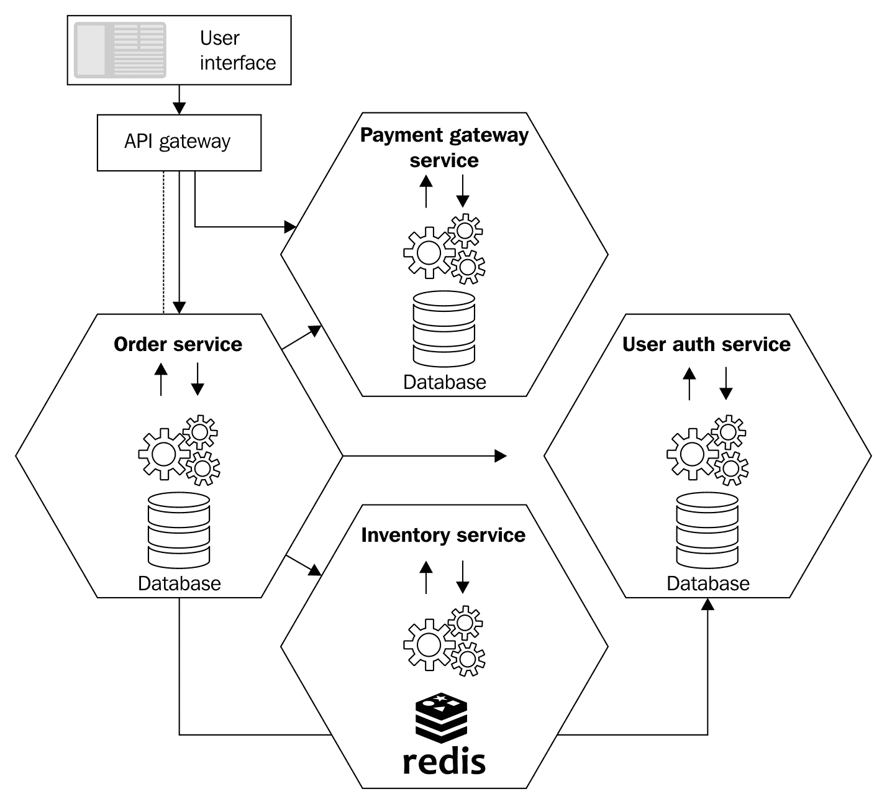

# 集成单体架构

每当选择从单体架构转向微服务风格的架构时，该活动的时序和成本轴将产生一些阻力。商业评估可能会反对迁移那些没有为过渡提供商业案例的单体应用程序的部分。

如果我们从一开始就开发应用程序，情况将会有所不同。然而，这也是我认为微服务的力量所在。对整个单体架构的正确评估可以安全地识别出以后要移植的单体部分。

然而，为了确保这些隔离的部分不会在未来对其他微服务造成问题，我们必须采取一种防范措施来降低风险。

对于单体应用程序的这些部分的目标是使它们以与其他微服务相同的方式进行通信。这样做涉及各种模式，并且你利用单体应用程序开发中使用的整个技术堆栈。

如果你使用事件驱动模式，请确保单体应用程序能够发布和消费事件，包括对源代码的详细修改以使这些操作成为可能。此过程也可以通过创建一个发布和消费事件的代理来完成。然后，事件代理可以将这些事件转换为单体应用程序，以将源代码中的更改保持在最低限度。最终，数据库将保持不变。

如果你计划使用 API 网关模式，请确保你的网关能够与单体应用程序通信。为了实现这一点，一个选项是修改应用程序的源代码以暴露 RESTful 服务，这些服务可以很容易地被网关消费。这也可以通过创建一个单独的微服务来实现，该微服务将暴露单体应用程序过程作为 REST 服务。创建一个单独的微服务可以避免对源代码进行大的更改。然而，它需要维护和部署一个新的组件。

# Azure Service Fabric 概述

当我们在.NET Core 世界中谈论微服务时，Azure Service Fabric 是广泛使用的微服务名称。在本节中，我们将讨论 Fabric 服务。

这是一个帮助我们轻松打包、部署和管理可扩展且可靠的微服务的平台（容器也类似于 Docker 等）。有时，由于复杂的架构问题，作为开发人员很难专注于您的核心职责，借助 Azure 服务 fabric，开发者无需担心架构问题。

这捆绑了 Azure SQL 数据库、Cosmos DB、Microsoft Power BI、Azure 事件中心、Azure IoT Hub 以及许多其他核心服务的功能。

如官方文档所述 ([`docs.microsoft.com/en-us/azure/service-fabric/service-fabric-overview`](https://docs.microsoft.com/en-us/azure/service-fabric/service-fabric-overview))[:](https://docs.microsoft.com/en-us/azure/service-fabric/service-fabric-overview)

+   服务 fabric——任何操作系统，任何云：您只需创建一个服务 fabric 集群，这个集群可以在 Azure（云）或本地运行，在 Linux 或 Windows 服务器上运行。此外，您还可以在其他公共云上创建集群。

+   服务 fabric - 无状态和有状态微服务：是的，借助服务 fabric，您可以构建无状态和/或有状态的应用程序。

“如官方文档 ([`docs.microsoft.com/en-us/azure/service-fabric/`](https://docs.microsoft.com/en-us/azure/service-fabric/)) 中所述的微服务：

无状态微服务（如协议网关和 Web 代理）不维护请求及其响应之外的可变状态。Azure 云服务工作角色是一个无状态服务的例子。有状态微服务（如用户账户、数据库、设备、购物车和队列）在请求及其响应之外维护可变、权威的状态。

+   完全支持应用程序生命周期管理：借助服务 fabric，获得包括开发、部署等在内的完整应用程序生命周期的支持。

+   您可以开发可扩展的应用程序。更多信息请参考：[`docs.microsoft.com/en-us/azure/service-fabric/service-fabric-application-lifecycle`](https://docs.microsoft.com/en-us/azure/service-fabric/service-fabric-application-lifecycle).

+   您可以开发高度可靠、无状态和有状态的微服务。

可用的服务 fabric 编程模型有多种，但本章范围之外。更多信息请参考：[`docs.microsoft.com/en-us/azure/service-fabric/service-fabric-choose-framework`](https://docs.microsoft.com/en-us/azure/service-fabric/service-fabric-choose-framework).

# 摘要

在本章中，我们详细讨论了微服务架构风格，其历史以及它与前辈（单体和 SOA）的不同之处。我们进一步定义了单体在处理大型系统时所面临的各项挑战。可扩展性和可重用性是 SOA 相对于单体提供的一些明确优势。我们还通过实现一个真实的单体应用程序来讨论了单体架构的局限性，包括扩展问题。微服务架构风格通过减少代码依赖性和隔离任何微服务工作的数据集大小来解决了所有这些问题。我们利用依赖注入和数据库重构实现了这一点。我们还进一步探讨了自动化、持续集成和部署。这些使得开发团队能够让业务赞助商首先选择响应哪些行业趋势。这导致了成本效益、更好的业务响应、及时的技术采用、有效的扩展和消除对人类的依赖。最后，我们讨论了 Azure 服务网格，并了解了服务网格及其不同的编程模型。

在下一章中，我们将继续将现有的应用程序过渡到微服务风格的架构，并检验我们的知识。
