# 第三章：集成技术和微服务

在上一章中，我们使用.NET 单体应用程序开发了微服务。这些服务彼此独立，位于不同的服务器上。那么，有什么更好的方法来实现服务之间的交互/通信呢？在这一章中，我们将讨论各种模式和技巧，帮助我们促进这种通信。我们将涵盖以下主题：

+   服务之间的通信

+   协作风格

+   集成模式

+   API 网关

+   事件驱动模式

+   Azure 服务总线

# 服务之间的通信

在.NET 单体应用程序的情况下，如果需要访问第三方组件或外部服务，我们使用 HTTP 客户端或另一个客户端框架来访问资源。在第二章《实现微服务》中，我们以独立工作的方式开发了**产品服务**。但情况并非如此；我们强制要求一些服务相互交互。

因此，这是一个挑战——让服务相互通信。**产品服务**和**订单服务**都托管在不同的服务器上。这两个服务器彼此独立，基于**REST**，并通过各自的端点相互通信（当服务与另一个服务交互时，我们称之为服务间通信）。

服务之间有几种通信方式；让我们简要地讨论一下：

+   同步：在这种情况下，客户端向远程服务（称为**服务**）请求特定功能，并等待直到收到响应：

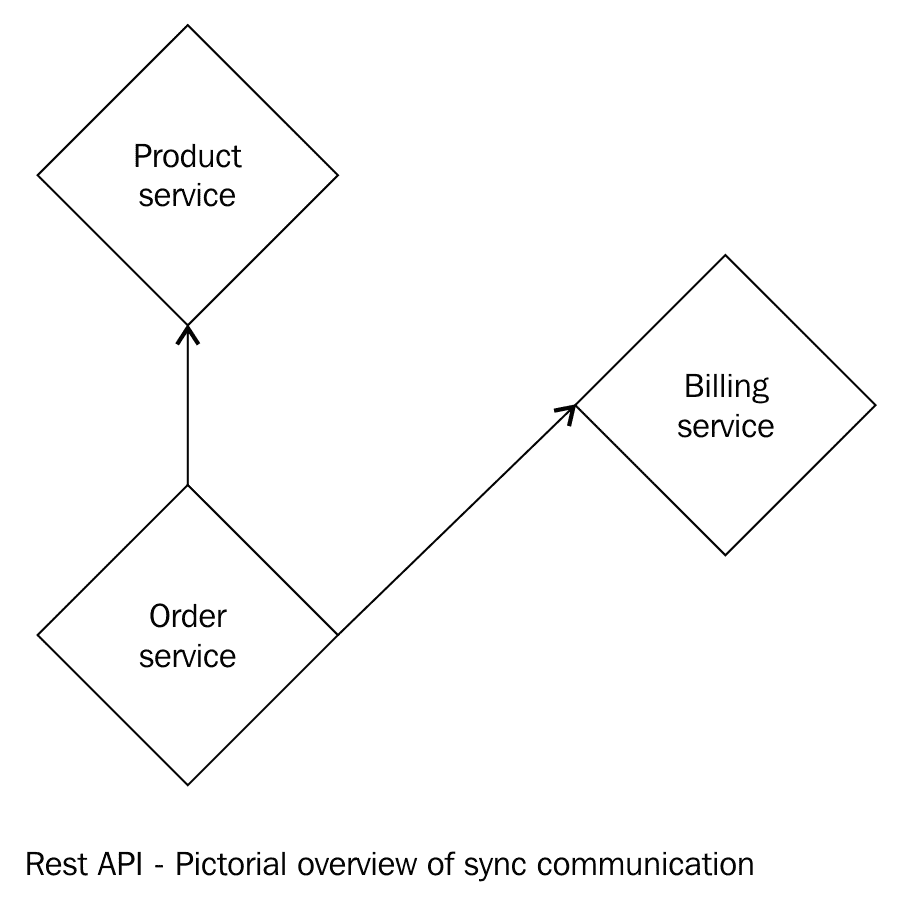

在前面的图中（图示视图，不完整），你可以看到我们的不同微服务正在相互通信。我们所有的服务都是 RESTful 的。它们基于 ASP.NET Core Web API。在接下来的部分，我们将详细讨论服务是如何被调用的。这被称为同步方法，客户端必须等待来自服务的响应。在这种情况下，客户端必须等待直到收到完整的响应。

+   异步：在这种情况下，

# 协作风格

在前一节中，我们讨论了两种不同的服务间通信模式。这些模式不过是协作风格，具体如下：

+   请求/响应：在这种情况下，客户端发送一个请求并等待来自服务器的响应。这是一个同步通信的实现。但请求/响应并不只是同步通信的一种实现；我们也可以用它来进行异步通信。

让我们通过一个例子来理解这个概念。在第二章*，* *实现微服务*中，我们开发了`ProductService`服务。这个服务有一个`GetProduct`方法，它是同步的。客户端每次调用此方法时都必须等待响应：

```cs
[HttpGet]
[Route("GetProduct")]
public IActionResult Get() => 
return new
OkObjectResult(_productRepository.GetAll().ToViewModel());
```

根据前面的代码片段，每当客户端（请求此服务的客户端）调用此方法时，他们必须等待响应。换句话说，他们必须等待`ToViewModel()`扩展方法执行完毕：

```cs
[HttpGet]
[Route("GetProductSync")]
public IActionResult GetIsStillSynchronous()
{
   var task = Task.Run(async() => await
   _productRepository.GetAllAsync());
   return new OkObjectResult(task.Result.ToViewModel());
}
```

在前面的代码片段中，我们可以看到我们的方法是以这种方式实现的，即每当客户端发起请求时，他们必须等待`async`方法执行。在这里，我们以`sync`的方式调用`async`。

为了使我们的代码更简洁，我们在第二章中编写的*实现微服务*相关代码的基础上添加了扩展方法：

```cs
using System.Collections.Generic;
using System.Linq;
using FlixOne.BookStore.ProductService.Models;

namespace FlixOne.BookStore.ProductService.Helpers
{
   public static class Transpose
   {
      public static ProductViewModel ToViewModel(this Product
      product)
      {
         return new ProductViewModel
         {
            CategoryId = product.CategoryId,
            CategoryDescription = product.Category.Description,
            CategoryName = product.Category.Name,
            ProductDescription = product.Description,
            ProductId = product.Id,
            ProductImage = product.Image,
            ProductName = product.Name,
            ProductPrice = product.Price
          };
      } 
      public static IEnumerable<ProductViewModel>
      ToViewModel(this IEnumerable<Product> products) =>
      products.Select(ToViewModel).ToList();
   }
}
```

总结来说，我们可以这样说，协作风格的请求/响应并不意味着它只能同步实现；我们也可以使用异步调用来实现。

+   基于事件的：这种协作风格的实现完全是异步的。这是一种实现方法，其中发出事件的客户端不知道如何确切地做出反应。

在前面的章节中，我们以同步的方式讨论了`ProductService`。让我们看看用户/客户如何下订单的例子；以下是功能性的图示概述：


前面的图示显示了购买书籍的过程有几个主要功能：

+   +   通过搜索功能，客户可以找到特定的书籍。

    +   在获取搜索书籍的结果后，客户可以查看书籍的详细信息。

    +   一旦用户进入**结账**环节，我们的系统将确保显示（可供购买的书本）显示正确的数量。例如，可供购买的数量是 10 本*微服务与.NET*，而顾客购买了一本书。在这种情况下，可供购买的数量现在应该显示为九本。

    +   系统将为购买的书籍生成发票并发送给客户，发送到他们注册的电子邮件。

从概念上讲，这似乎很简单；然而，当我们谈论实现微服务时，我们是在谈论那些分别托管并拥有自己的 REST API、数据库等的服务。这听起来更复杂了。涉及到的方面很多，例如，一个服务如何在从一个或多个服务成功响应后调用或调用另一个服务。这就是事件驱动架构出现的地方：

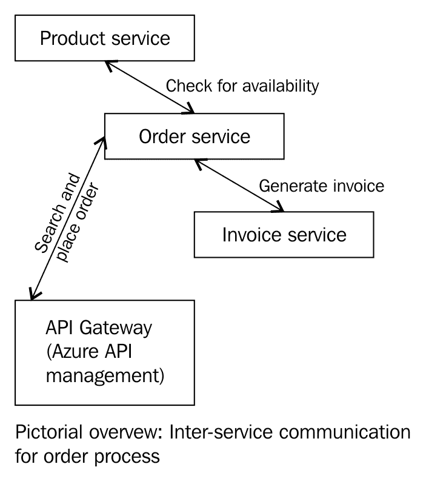

在前面的图中，我们可以看到当 **订单服务** 执行时，会触发 **发票服务** 和 **产品服务**。这些服务进一步调用内部异步方法以完成其功能。

我们正在使用 Azure API 管理作为我们的 API 网关。在接下来的部分中，我们将详细讨论这一点。

# 集成模式

到目前为止，我们已经讨论了服务间通信，并通过使用同步和异步通信实现了 `ProductService` 的实际实现。我们还使用不同的协作风格实现了微服务。我们的 *FlixOne 书店*（按照微服务架构风格开发）需要更多的交互，因此需要更多的模式。在本节中，我们将讨论为我们的应用程序所需的集成模式的实现。

*FlixOne 书店*（按照微服务架构风格开发）的完整应用可在 第十章 *创建完整的微服务解决方案* 中找到。

# API 网关

在 *协作风格* 部分，我们讨论了我们可以用来促进微服务之间交互的两种风格。我们的应用程序被分割成各种微服务：

+   产品服务

+   订单服务

+   发票服务

+   客户服务

在我们的 *FlixOne 书店*（用户界面）中，我们需要显示以下详细信息：

+   书名、作者姓名、价格、折扣等

+   可用性

+   书评

+   书籍评分

+   发布者排名等

在我们检查实现之前，让我们先讨论 API 网关。

API 网关不过是 **Backend For Frontend**（**BFF**）的实现。Sam Newman 介绍了这个模式。它充当客户端应用程序和服务之间的代理。在我们的例子中，我们使用 **Azure API 管理作为我们的 API 网关**。

它负责以下功能：

+   接受 API 调用并将它们路由到您的后端

+   验证 API 密钥、JWT 令牌和证书

+   通过 Azure AD 和 OAuth 2.0 访问令牌支持身份验证

+   强制执行使用配额和速率限制

+   无需代码修改即可动态转换您的 API

+   在设置的地方缓存后端响应

+   为分析目的记录调用元数据

参考以下链接了解有关设置 API Azure 门户和与 REST API 一起工作的更多过程：*Azure API 管理* ([`social.technet.microsoft.com/wiki/contents/articles/31923.azure-create-and-deploy-asp-net-webapi-to-azure-and-manage-using-azure-api-management.aspx`](https://social.technet.microsoft.com/wiki/contents/articles/31923.azure-create-and-deploy-asp-net-webapi-to-azure-and-manage-using-azure-api-management.aspx))。

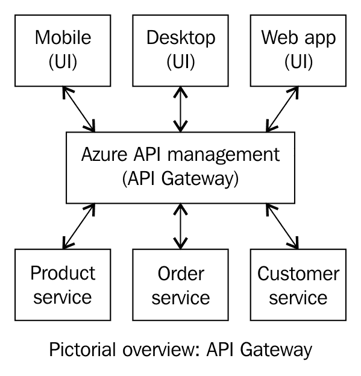

在前面的图中，我们看到了不同的客户端，例如移动和桌面应用程序以及 Web 应用程序，它们正在使用微服务。在这里，Azure API 管理正在充当 API 网关。

我们的客户端不知道我们的服务实际位于哪个服务器。API 网关为他们提供了其自己服务器的地址，并且内部使用有效的 `Ocp-Apim-Subscription-Key` 对客户端的请求进行身份验证。

我们的 `ProductService` 有一个 REST API。请参考以下表格：

| **API 资源** | **描述** |
| --- | --- |
| `GET /api/product` | 获取产品列表 |
| `GET /api/product{id}` | 获取产品 |
| `PUT /api/product{id}` | 更新现有产品 |
| `DELETE /api/product{id}` | 删除现有产品 |
| `POST /api/product` | 添加新产品 |

我们已经创建了一个名为 `ProductClient` 的 .NET 控制台应用程序。它通过绕过订阅密钥向 Azure API 管理发送请求。以下是该功能的代码片段：

```cs
namespace FlixOne.BookStore.ProductClient
{
   class Program
   {
      private const string ApiKey = "myAPI Key";
      private const string BaseUrl = "http://localhost:3097/api";
      static void Main(string[] args)
      {
         GetProductList("/product/GetProductAsync");
         //Console.WriteLine("Hit ENTER to exit...");
         Console.ReadLine();
      }
      private static async void GetProductList(string resource)
      {
         using (var client = new HttpClient())
         {
            var queryString =
            HttpUtility.ParseQueryString(string.Empty);

            client.DefaultRequestHeaders.Add("Ocp-Apim-Subscription-
            Key", ApiKey);

            var uri = $"{BaseUrl}{resource}?{queryString}";

            //Get asynchronous response for further usage
            var response = await client.GetAsync(uri);
            Console.WriteLine(response);
          }
       }
    }
 }
```

在前面的代码中，我们的客户端正在请求 REST API 以获取所有产品。以下是代码中出现的术语的简要说明：

| `BaseUrl` | 这是代理服务器的地址。 |
| --- | --- |
| `Ocp-Apim-Subscription-Key` | 这是 API 管理为客户端选择的特定产品分配的密钥。 |
| `Resource` | 这是我们的 API 资源，它是在 Azure API 管理中配置的。它将不同于我们的实际 REST API 资源。 |
| `Response` | 这指的是对特定请求的响应，在我们的案例中是默认的 JSON 格式。 |

由于我们使用 Azure API 管理作为 API 网关，我们将享受到某些好处：

+   我们可以从单个平台管理我们的各种 API，例如，`ProductService`、`OrderService` 以及其他服务可以轻松地被许多客户端管理和调用

+   由于我们使用 API 管理，它不仅为我们提供了一个代理服务器，还提供了创建和维护我们 API 文档的便利性

+   它提供了一个内置的设施来定义各种配额、输出格式和格式转换的策略，例如 XML 到 JSON 或相反

因此，借助 API 网关，我们可以访问一些出色的功能。

# 事件驱动模式

微服务架构具有每个服务一个数据库的模式，这意味着每个依赖或独立的服务都有自己的独立数据库：

+   依赖服务：我们的应用程序需要一些外部服务（第三方服务或组件等）和/或内部服务（这些是我们自己的服务）才能按预期工作或运行。例如，**结账服务**需要**客户服务**；此外，**结账服务**需要外部（第三方）服务来验证客户的身份（例如，在印度客户的情况下，需要 Aadhaar 卡 ID）。在这里，我们的**结账服务**是一个依赖服务，因为它需要两个服务（一个内部服务和外部服务）才能按预期工作。如果依赖的服务中的任何或所有服务工作不正常，依赖服务将无法工作（服务无法工作的原因有很多，包括网络故障、未处理的异常等）。

+   独立服务：在我们的应用程序中，我们有一些服务不需要其他服务正常工作。不需要其他服务即可正常工作的服务被称为独立服务；这些服务可以自行托管。我们的**客户服务**不需要其他服务即可正常工作，但其他服务可能需要或不需要此服务。

主要挑战是维护业务事务以确保这些服务之间的数据一致性。例如，何时以及如何**客户服务**知道**结账服务**已经工作；现在它需要**客户服务**的功能。一个应用程序中可能有几个服务（服务可能是自行托管的）。在我们的案例中，当**结账服务**被触发而**客户服务**未被调用时，我们的应用程序将如何识别客户的详细信息？

ASP.NET WebHooks 也可以用于提供事件通知；有关更多信息，请参阅 WebHooks 文档。

为了克服我们讨论的相关问题/挑战（针对**结账服务**和**客户服务**），我们可以使用事件驱动模式（或最终一致性方法）并使用分布式事务。

MSDN 上的文档（[`msdn.microsoft.com/en-us/library/windows/desktop/ms681205(v=vs.85).aspx`](https://msdn.microsoft.com/en-us/library/windows/desktop/ms681205(v=vs.85).aspx)）说明了以下内容：

分布式事务是更新两个或更多网络化计算机系统上数据的交易。分布式事务将事务的好处扩展到必须更新分布式数据的应用程序。实现健壮的分布式应用程序很困难，因为这些应用程序容易受到多个故障的影响，包括客户端、服务器以及客户端和服务器之间的网络连接故障。在没有分布式事务的情况下，应用程序程序本身必须检测并从这些故障中恢复。

以下图描述了我们在应用程序中实际实现的事件驱动模式，其中 **PRODUCT-SERVICE** 订阅事件，**Event-Manager** 管理所有事件：

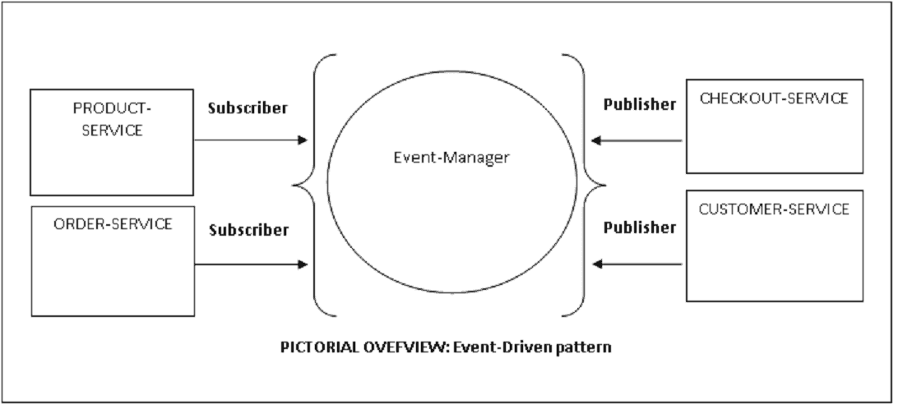

在事件驱动模式中，我们以这种方式实现服务，即每当服务更新其数据时，它都会发布一个事件，另一个服务（依赖服务）订阅此事件。现在，每当依赖服务接收到事件时，它会更新其数据。这样，我们的依赖服务可以在需要时获取和更新其数据。以下图概述了服务如何订阅和发布事件。在图中，**Event-Manager** 可以是运行在服务上的程序或帮助您管理所有订阅者和发布者事件的调解者。

它注册了 **Publisher** 的事件，并在特定事件发生/触发时通知 **Subscriber**。它还帮助您形成队列并等待事件。在我们的实现中，我们将使用 Azure Service Bus 队列来完成这项活动。

让我们考虑一个例子。在我们的应用程序中，我们的服务将这样发布和接收事件：

+   **CUSTOMER-SERVICE** 对用户执行一些检查，例如登录检查、客户详情检查等；在这些必要的检查完成后，服务会发布一个名为 `CustomerVerified` 的事件。

+   **CHECKOUT-SERVICE** 接收此事件，并在执行必要的操作后，发布一个名为 `ReadyToCheckout` 的事件。

+   **ORDER-SERVICE** 接收此事件并更新数量。

+   一旦完成结账，**CHECKOUT-SERVICE** 就会发布一个事件。无论从外部服务接收到的结果是什么，无论是 `CheckedoutSuccess` 还是 `CheckedoutFailed`，它都会被 **CHECKOUT-SERVICE** 使用。

+   当 `InventoryService` 接收到这些事件时，它会更新数据以确保确切的项目被添加或删除。

使用事件驱动模式，服务可以自动更新数据库并发布事件。

# 事件溯源

此模式帮助我们确保服务将在状态更改时发布事件。在此模式中，我们将业务实体（产品、客户等）视为一系列状态更改事件。**Event Store** 持久化事件，这些事件可用于订阅或作为其他服务。此模式通过避免同步数据模型和业务域的要求来简化我们的任务。它提高了性能、可扩展性和响应速度。

+   这只是简单地定义了一种方法，说明我们如何通过一系列事件来处理我们数据上的各种操作；这些事件记录在存储中。

+   事件代表对数据所做的更改集合，例如，`InvoiceCreated`。

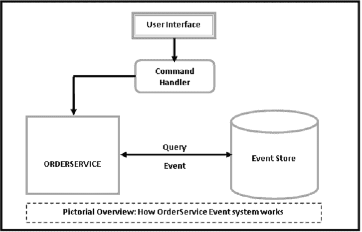

以下图描述了事件在 **ORDERSERVICE** 上的工作方式：

+   命令从**用户界面**发出，以订购书籍

+   **ORDERSERVICE**（从**事件存储**）查询并使用`CreateOrder`事件填充结果

+   然后，命令处理器引发一个事件来订购书籍

+   我们的服务执行相关操作

+   最后，系统将事件附加到事件存储

# 最终一致性

最终一致性不过是数据一致性方法的一种实现。这表明实现，因此系统将是一个具有高可用性的可扩展系统。

MSDN 上的文档（[`msdn.microsoft.com/en-us/library/dn589800.aspx`](https://msdn.microsoft.com/en-us/library/dn589800.aspx)）说明了以下内容：

“最终一致性不太可能被明确指定为分布式系统的显式要求。相反，它通常是实现必须展示可扩展性和高可用性的系统的一个结果，这排除了提供强一致性的大多数常见策略。”

根据这些分布式数据存储，它们受到 CAP 定理的约束。CAP 定理也被称为布赖尔定理。**一致性**、**可用性**、**（网络）分区容错**（**CAP**）。根据这个定理，在分布式系统中，我们只能从这三个中选择两个：

+   一致性

+   可用性

+   分区容错

# 补偿性事务

补偿性事务提供了一种方法，可以回滚或撤销一系列步骤中执行的所有任务。假设一个或多个服务已经实施了一系列操作，其中之一或多个失败了。那么你的下一步是什么？你会撤销所有步骤还是提交一个半完成的特性？

在我们的案例中，当客户订购一本书并且`ProductService`暂时标记已订购的书籍后，在订单确认后，`OrderService`调用外部服务来完成支付过程。如果支付失败，我们需要撤销之前的任务，这意味着我们必须检查`ProductService`，以便它将特定书籍标记为未售出。

# 竞争消费者

竞争消费者

它可以通过将消息系统传递给另一个服务（消费者服务）来实现，并且可以异步处理，如下所示：

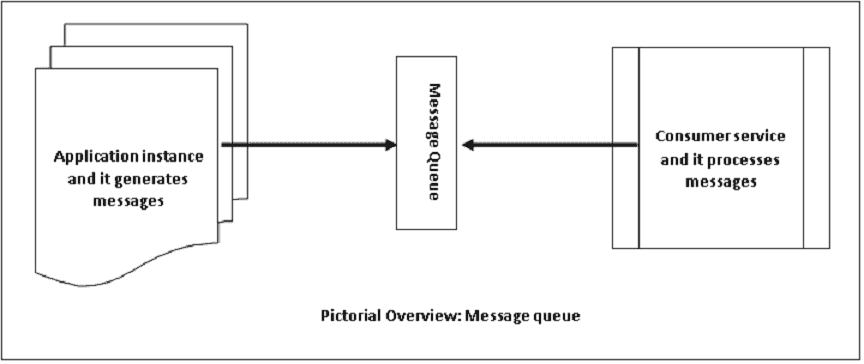

该场景可以通过使用 Azure Service Bus 队列来实现。

# Azure Service Bus

在事件驱动模式中，我们讨论了服务发布和订阅事件。我们使用**事件管理器**来管理所有事件。在本节中，我们将看到 Azure Service Bus 如何管理事件并提供与微服务一起工作的便利。

Azure 服务总线是一个信息传递服务。它用于使两个或更多组件/服务之间的通信更加容易。在我们的案例中，每当服务需要交换信息时，它们将通过此服务进行通信。Azure 服务总线在这里发挥着重要作用。Azure 服务总线提供两种主要的服务类型：

+   中介通信：此服务也可以称为**雇佣服务**。它的工作方式类似于现实世界中的邮政服务。每当一个人想要发送消息/信息时，他/她可以向另一个人发送一封信。这样，人们可以通过信件、包裹、礼物等形式发送各种类型的消息。这种消息服务确保即使在发送者和接收者不在同一时间在线的情况下，消息也能被传递。这是一个具有队列、主题、订阅等组件的消息平台。

+   非中介通信：这类似于打电话。在这种情况下，呼叫者（发送者）给一个人（接收者）打电话，而不需要任何确认来表明他/她是否会接听电话。这样，发送者发送信息，而接收者是否接收通信并将信息传回发送者完全取决于接收者。

看一下以下图表：

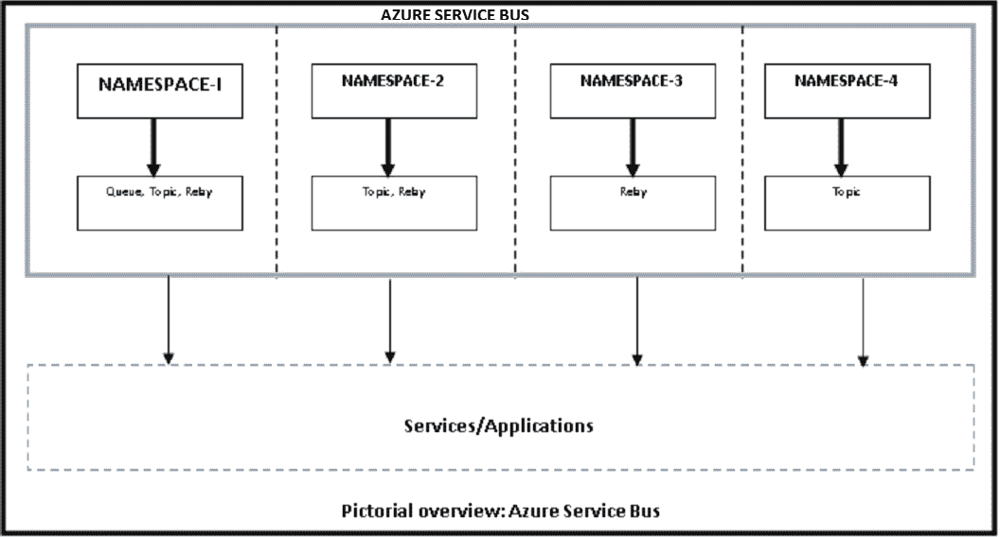

Microsoft Azure 的文档（[`docs.microsoft.com/en-us/azure/service-bus-messaging/service-bus-fundamentals-hybrid-solutions`](https://docs.microsoft.com/en-us/azure/service-bus-messaging/service-bus-fundamentals-hybrid-solutions)）说明：

“服务总线是一个多租户云服务，这意味着服务被多个用户共享。每个用户，例如应用程序开发者，都会创建一个命名空间，然后在那个命名空间内定义她需要的通信机制。”

上述图表是 Azure 服务总线的一个图形视图，它描绘了四种不同的通信机制。每个人在连接应用程序方面都有自己的喜好：

+   队列：这些允许单向通信，并充当经纪人。

+   主题：这些提供单向通信，一个主题可以有多个订阅。

+   中继：这些提供双向通信。它们不存储消息（如队列和主题所做的那样）。中继将消息传递到目标应用程序。

# Azure 队列

Azure 队列实际上就是使用 Azure 表的云存储账户。它们提供了一种在应用程序之间排队消息的方法。在接下来的章节中，我们将实现消息队列，这是 Azure 服务总线的一部分。

# 实现 Azure 服务总线队列

在本节中，我们将通过创建以下内容来查看 Azure 服务总线队列的实际实现：

+   一个服务总线命名空间

+   一个服务总线消息队列

+   一个用于发送消息的控制台应用程序

+   一个用于接收消息的控制台应用程序

# 前提条件

我们需要以下内容来实现此解决方案：

+   Visual Studio 2017 更新 3 或更高版本

+   一个有效的 Azure 订阅

如果您没有 Azure 订阅，可以通过在此处登录免费获取：[`azure.microsoft.com/en-us/free/`](https://azure.microsoft.com/en-us/free/)。

如果您拥有上述所有内容，您可以从以下步骤开始：

1.  登录到 Azure 门户([`portal.azure.com/`](https://portal.azure.com/))。

1.  在左侧导航栏中，点击“服务总线”。如果不可用，可以通过点击“更多服务”来找到它。

1.  点击“添加”：


1.  在“创建命名空间”对话框中，输入一个命名空间，例如，`flixone`。选择下一个定价层：`基本`、`标准`或`高级`。

1.  选择您的订阅。

1.  选择一个现有资源或创建一个新的资源。

1.  选择您想要托管命名空间的位置。

1.  打开一个新创建的命名空间（我们刚刚创建了`flixone`）。

1.  现在点击“共享访问策略”。

1.  点击“根管理共享访问密钥”。请参考以下截图：

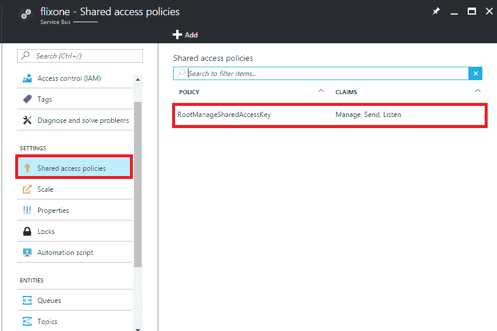

1.  在`flixone`命名空间的“主对话框”中点击“队列”。

1.  从“根管理共享访问密钥”窗口中，注意主密钥连接字符串以供进一步使用。请参考以下截图：

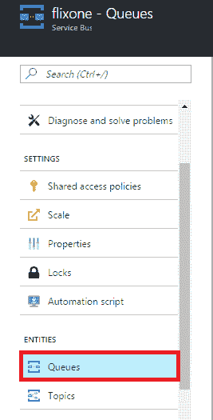

1.  点击“名称”以添加一个队列（例如，`flixonequeue`），然后点击“创建”（我们使用默认的 REST 值）。请参考以下截图：

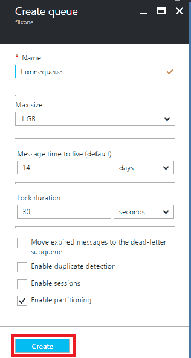

上一张图片是创建队列对话框。在创建队列对话框中，我们可以创建一个队列，例如，在上面的图片中，我们正在创建一个名为 floxxonequeue 的队列。可以通过访问队列对话框来验证队列。

现在我们已准备好创建我们的消息发送者和接收者应用程序。

# 向队列发送消息

在本节中，我们将创建一个控制台应用程序，该程序实际上会向队列发送消息。要创建此应用程序，请按照以下步骤操作：

1.  使用 Visual Studio 的新项目（C#）模板创建一个新的控制台应用程序，并将其命名为`FlixOne.BookStore.MessageSender`：

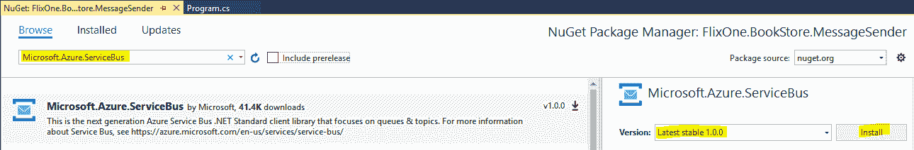

1.  通过在项目上右键单击添加 NuGet 包 Microsoft Azure Service Bus。

1.  编写代码以向队列发送消息，您的`Program.cs`文件将包含以下`MainAsync()`方法：

```cs
 private static async Task MainAsync()
 {
    const int numberOfMessagesToSend = 10;
    _client = new QueueClient(ConnectionString, QueueName);
    WriteLine("Starting...");
    await SendMessagesAsync(numberOfMessagesToSend);
    WriteLine("Ending...");
    WriteLine("Press any key...");
    ReadKey();
    await _client.CloseAsync();
 }
```

在前面的代码中，我们通过提供`ConnectionString`和`QueueName`来创建我们的队列客户端，这些我们在 Azure 门户中已经设置。它调用接受包含需要发送的消息数量的参数的`SendMessagesAsync()`方法。

1.  创建一个`SendMessagesAsync()`方法，并添加以下代码：

```cs
private static async Task SendMessagesAsync(int numberOfMessagesToSend)
{
   try
   {
      for (var index = 0; index < numberOfMessagesToSend; index++)
       {
          var customMessage = $"#{index}:
          A message from FlixOne.BookStore.MessageSender.";
          var message = new
          Message(Encoding.UTF8.GetBytes(customMessage));
          WriteLine($"Sending message: {customMessage}");
          await _client.SendAsync(message);
       }
   }
   catch (Exception exception)
   {
      WriteLine($"Weird! It's exception with message:
      {exception.Message}");
   }
}
```

1.  运行程序并等待一段时间。您将得到以下结果：


1.  前往 Azure 门户，然后转到创建的队列，检查是否显示消息。以下图像显示了 flixonequeue 的概述，我们可以看到活动消息计数等。

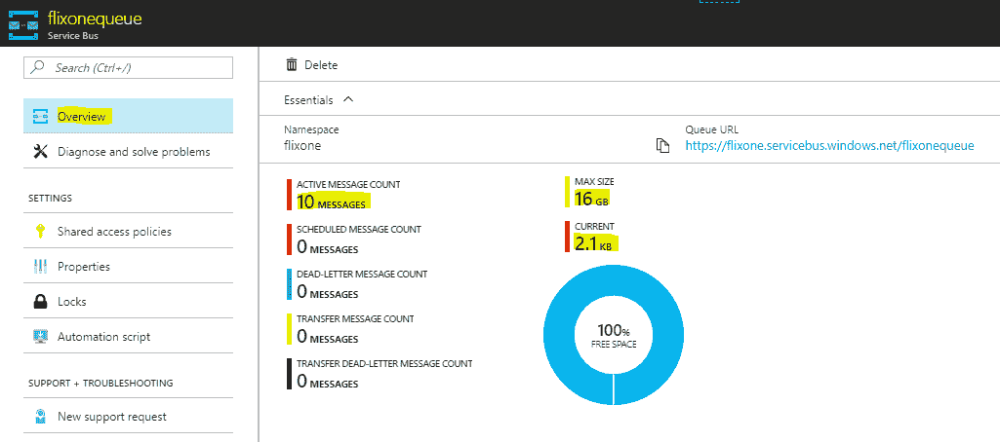

# 添加配置设置

在上一个示例中，我们为 `ConnectionString` 和 `QueueName` 两个都使用了常量值。如果我们需要更改这些设置，我们必须修改代码。但为什么我们要为了这个小小的更改而修改代码呢？为了克服这种情况，我们有配置设置。您可以在 [`docs.microsoft.com/en-us/aspnet/core/fundamentals/configuration`](https://docs.microsoft.com/en-us/aspnet/core/fundamentals/configuration) 中了解更多关于配置的信息。在本节中，我们将使用 `Microsoft.Extensions.Configuration` 命名空间中的 `IConfigurationRoot` 添加配置。

1.  首先，右键单击项目，然后单击管理 NuGet 包。搜索 `Microsoft.Extensions.Configuration` NuGet 包。参考以下截图：

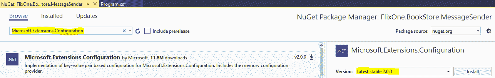

1.  现在，定位并搜索 `Microsoft.Extensions.Configuration.Json` NuGet 包。参考以下截图：

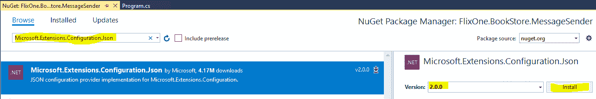

1.  将以下 `ConfigureBuilder()` 方法添加到 `Program.cs` 文件中：

```cs
private static IConfigurationRoot ConfigureBuilder()
{
   return new ConfigurationBuilder()
   .SetBasePath(Directory.GetCurrentDirectory())
   .AddJsonFile("appsettings.json")
   .Build();
}
```

1.  现在，将 `appsettings.json` 文件添加到项目中，并包含以下属性：

```cs
{
   "connectionstring":
   "Endpoint=sb://flixone.servicebus.windows.net/;
   SharedAccessKeyName=
   RootManageSharedAccessKey;SharedAccessKey=
   BvQQcB5FhNxidcgEhhpuGmi/
   XEqvGho9GmHH4yjsTg4=",
   "QueueName": "flixonequeue"
}
```

1.  将以下代码添加到 `main()` 方法中：

```cs
var builder = ConfigureBuilder();
_connectionString = builder["connectionstring"];
_queuename = builder["queuename"];
```

在添加前面的代码后，我们添加了一种从 `.json` 文件中获取 `connectionstring` 和 `queuename` 的方法。现在，如果我们需要更改这些字段中的任何一个，我们不需要修改代码文件。

# 接收队列中的消息

在本节中，我们将创建一个控制台应用程序，该程序将从队列中接收消息。要创建此应用程序，请按照以下步骤操作：

1.  创建一个新的控制台应用程序（C#），并将其命名为 `FlixOne.BookStore.MessageReceiver`。

1.  添加 Azure Service Bus 的 NuGet 包（如前一个应用程序中添加的）。

1.  编写从 Azure Bus 服务队列接收消息的代码，因此您的 `program.cs` 文件包含 `ProcessMessagesAsync()` 方法：

```cs
 static async Task ProcessMessagesAsync(Message message,
 CancellationToken token)
 {
    WriteLine($"Received message: #
    {message.SystemProperties.SequenceNumber}
    Body:{Encoding.UTF8.GetString(message.Body)}");
    await _client.CompleteAsync
    (message.SystemProperties.LockToken);
 }
```

1.  运行应用程序并查看结果。参考以下截图：

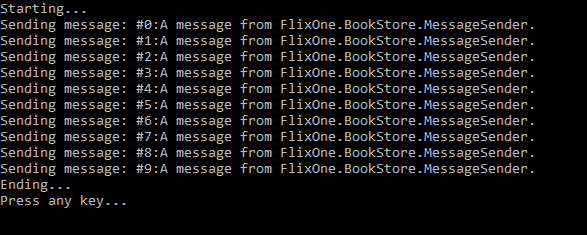

1.  控制台窗口将显示消息及其 ID。现在，前往 Azure 门户并验证消息。它应该是零。参考以下截图：

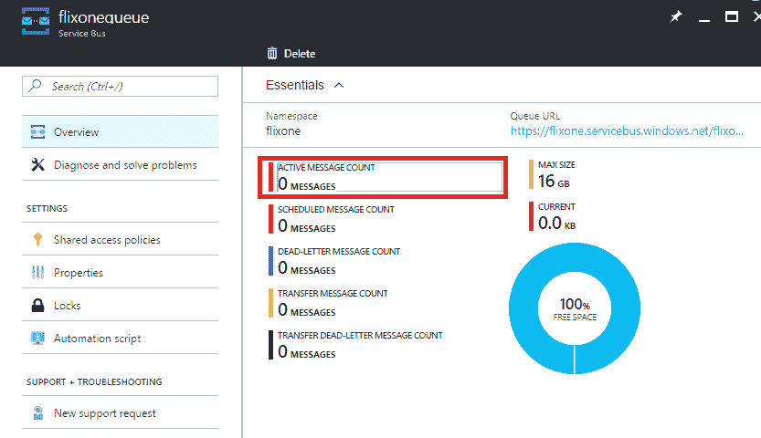

上述示例演示了如何使用 Azure Bus 服务为我们微服务发送/接收消息。

# 摘要

服务的间通信可以通过同步或异步通信实现，这些是协作的风格。微服务应该拥有异步 API。API 网关是一个代理服务器，它提供了一种允许各种客户端与 API 交互的方式。API 管理，作为一个 API 网关，提供了许多功能来管理/托管各种 RESTful API。存在各种模式帮助我们与微服务进行通信。通过使用 Azure 总线服务，我们可以轻松地管理和玩转服务间的通信，使用 Azure 总线服务的消息队列；服务可以通过这种方式轻松地相互发送或接收消息。最终一致性讨论的是具有高可扩展性的可伸缩系统，并且这一点通过 CAP 定理得到了证明。

在下一章中，我们将讨论各种测试策略来测试应用程序，并基于微服务架构风格进行构建。
