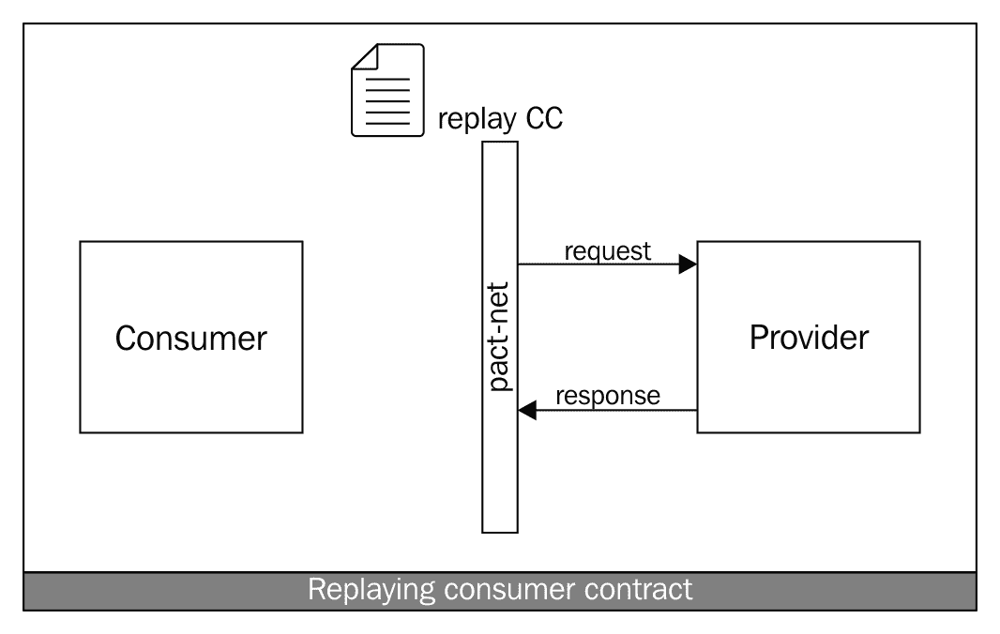
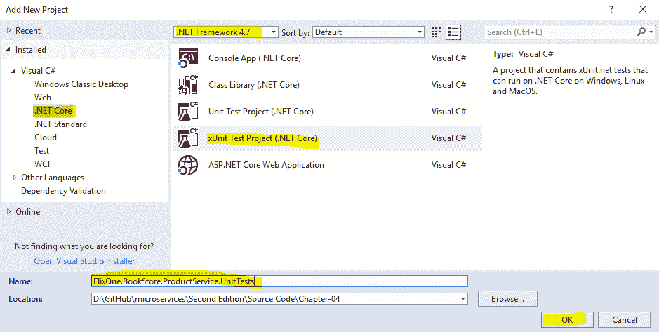
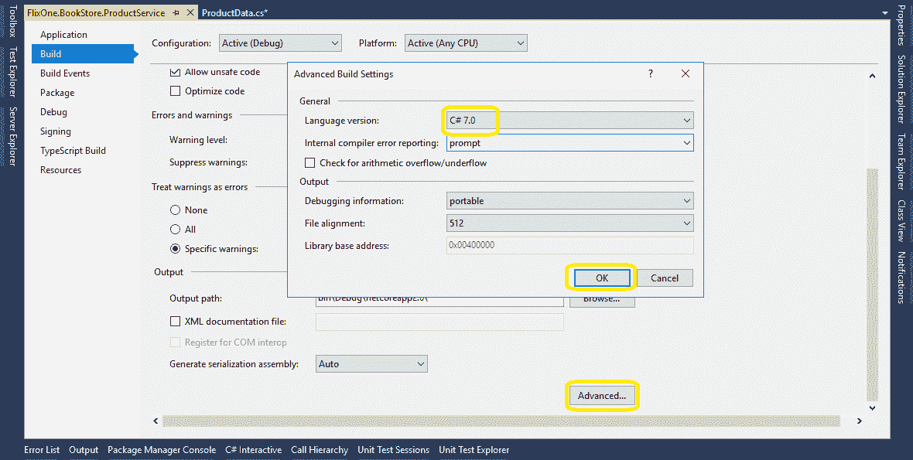
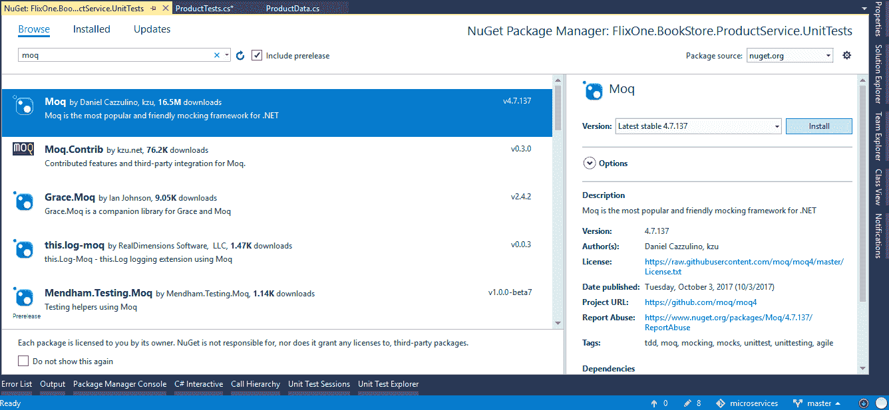
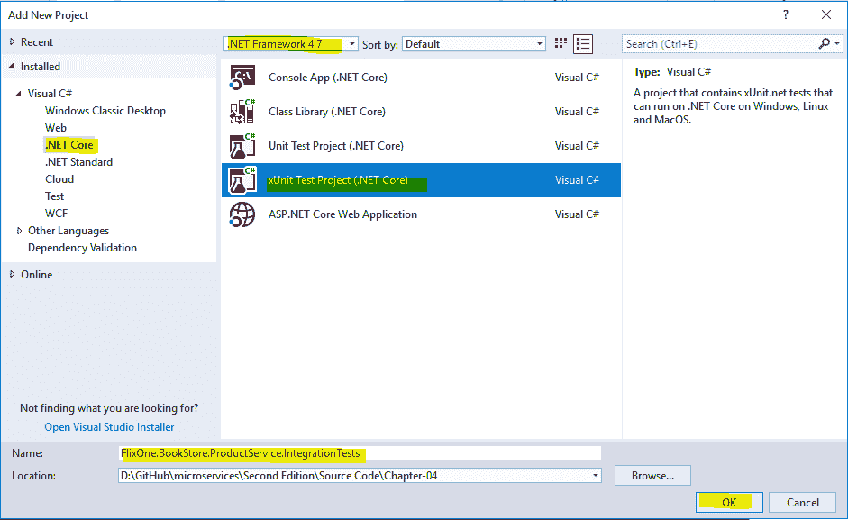
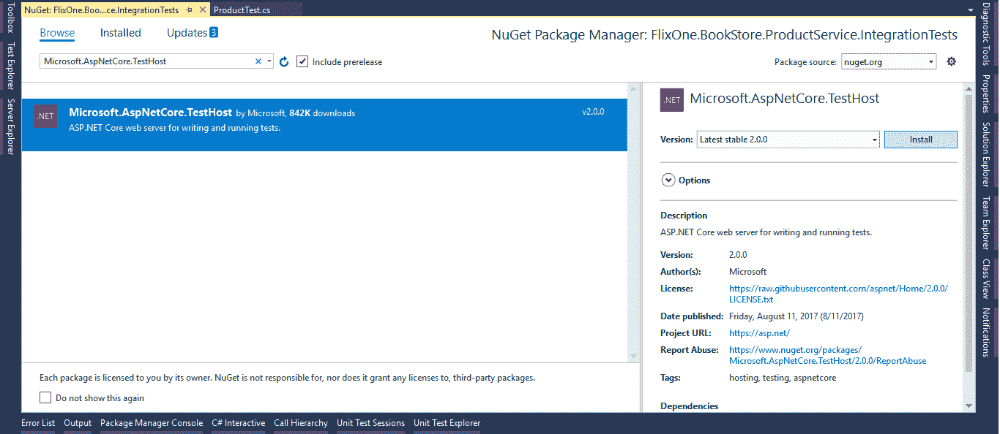

# 第四章：测试微服务

质量保证或测试是评估系统、程序或应用程序不同方面的一种很好的方式。有时，系统需要测试来识别错误代码，在其他情况下，我们可能需要它来评估我们系统的业务合规性。测试可能因系统而异，并且可能根据应用程序的架构风格而有很大差异。一切取决于我们如何制定我们的测试策略或计划。例如，测试单体.NET 应用程序与测试 SOA 或微服务不同。在本章中，我们将涵盖以下主题：

+   如何测试微服务

+   应对挑战

+   测试策略

+   测试金字塔

+   微服务测试类型

# 如何测试微服务

测试微服务可能是一项具有挑战性的工作，因为它与传统架构风格构建的应用程序测试方式不同。测试.NET 单体应用程序比测试提供实现独立性和短交付周期的微服务要容易一些。

让我们在我们的.NET 单体应用程序的背景下理解这一点，在那里我们没有利用持续集成和部署。当测试与持续集成和部署结合时，情况变得更加复杂。对于微服务，我们需要了解每个服务的测试以及这些测试如何彼此不同。此外，请注意，自动化测试并不意味着我们完全不会进行任何手动测试。

这里有一些使微服务测试变得复杂和具有挑战性的任务：

+   微服务可能包含多个服务，这些服务可以一起或单独为一个企业系统工作，因此它们可能很复杂。

+   微服务旨在针对多个客户端；因此，它们涉及更复杂的使用案例。

+   微服务架构风格中的每个组件/服务都是隔离和独立的，因此测试它们会稍微复杂一些，因为它们需要分别和作为一个完整的系统进行测试。

+   可能会有独立的小组在单独的组件/服务上工作，这些组件/服务可能需要相互交互。因此，测试不仅应该涵盖内部服务，还应该涵盖外部服务。这使得测试微服务的任务更加具有挑战性和复杂性。

+   微服务中的每个组件/服务都旨在独立工作，但它们可能需要访问公共/共享数据，其中每个服务负责修改自己的数据库。因此，测试微服务将变得更加复杂，因为服务需要通过 API 调用访问其他服务的数据，这进一步增加了对其他服务的依赖。这种类型的测试将需要使用模拟测试来处理。

# 应对挑战

在上一节中，我们讨论了测试微服务是一项复杂和具有挑战性的工作。在本节中，我们将讨论一些要点，说明进行各种测试如何帮助我们克服这些挑战：

+   单元测试框架，如 Microsoft 单元测试框架，提供了一种测试独立组件单个操作的功能。为了确保所有测试都通过，并且新的功能或更改不会破坏任何东西（如果任何功能出现故障，相关的单元测试将失败），这些测试可以在每次代码编译时运行。

+   为了确保响应与客户端或消费者的期望一致，可以使用消费者驱动的合同测试。

+   服务使用来自外部方或其他服务的数据，并且可以通过设置负责处理数据的服务的端点来对这些服务进行测试。然后我们可以使用模拟框架或库，如`moq`，在集成过程中模拟这些端点。

# 测试策略（测试方法）

如第一章“微服务简介”的“先决条件”部分所述，部署和 QA 要求可能会变得更加严格。有效处理这种情况的唯一方法是通过预先规划。我一直倾向于在早期需求收集和设计阶段就包括 QA 团队。在微服务的情况下，架构组和 QA 组之间的紧密合作变得必要。不仅 QA 团队的输入会有所帮助，他们还能够制定出一种有效测试微服务的策略。

测试策略仅仅是描述测试完整方法的地图或概述计划。

不同的系统需要不同的测试方法。对于使用较新方法而非早期开发系统开发的系统，无法实施纯测试方法。测试策略应该对每个人都很清晰，以便创建的测试可以帮助团队的非技术成员（如利益相关者）了解系统是如何工作的。这些测试可以是自动化的，简单地测试业务流程，或者它们可以是手动测试，由在用户验收测试系统上工作的用户简单地执行。

测试策略或方法具有以下技术：

+   积极的：这是一种早期方法，试图在从初始测试设计创建构建之前修复缺陷

+   反应的：在这种方法中，一旦编码完成，就开始测试

# 测试金字塔

测试金字塔是一种策略或方法，用于定义在微服务中应该测试的内容。换句话说，我们可以这样说，它帮助我们定义微服务的测试范围。测试金字塔的概念是由迈克·科恩（Mike Cohn）在 2009 年提出的。[`www.mountaingoatsoftware.com/blog/the-forgotten-layer-of-the-test-automation-pyramid`](http://www.mountaingoatsoftware.com/blog/the-forgotten-layer-of-the-test-automation-pyramid)。测试金字塔有多种变体；不同的作者通过指出他们如何放置或优先考虑他们的测试范围来描述这一点。以下图像展示了迈克·科恩定义的相同概念：


**测试金字塔**展示了如何构建一个精心设计的测试策略。当我们仔细观察时，我们可以很容易地看到我们应该如何遵循微服务的测试方法（请注意，测试金字塔并不特定于微服务）。让我们从这个金字塔的底部开始。我们可以看到测试范围仅限于使用**单元测试**。一旦我们移动到顶部，我们的测试范围就扩展到一个更广泛的范围，我们可以在这里执行完整的系统测试。

让我们详细讨论这些层（从下到上的方法）：

+   **单元测试**：这些测试基于微服务架构风格测试应用程序的小功能。

+   **服务测试**：这些测试测试一个独立的服务或与另一个/外部服务通信的服务。

+   **系统测试**：这些测试有助于测试整个系统，并涉及用户界面的一些方面。这些是端到端测试。

在这个概念中有一个有趣的观点，那就是顶层测试，即系统测试，编写和维护速度慢且成本高。另一方面，底层测试，即单元测试，相对较快且成本较低。

在接下来的章节中，我们将详细讨论这些测试。

# 微服务测试类型

在上一节中，我们讨论了测试方法或测试策略。这些策略决定了我们将如何进行系统测试。在本节中，我们将讨论各种类型的微服务测试。

# 单元测试

单元测试通常是测试单个函数调用，以确保程序的最小部分被测试。因此，这些测试旨在验证特定的功能，而不考虑其他组件：

+   当组件被分解成小而独立的部件，这些部件应该独立测试时，测试将变得更加复杂。在这里，测试策略变得很有用，并确保系统将执行最佳的质量保证。当它与**测试驱动开发**（**TDD**）方法结合使用时，它增加了更多的力量。我们将通过一个例子来讨论这一点，这个例子是*单元测试*，它是*测试实践*的一个子部分。

你可以通过 Katas 在[`github.com/garora/TDD-Katas`](https://github.com/garora/TDD-Katas)学习并练习 TDD。

+   单元测试可以是任何大小；单元测试没有固定的大小。通常，这些测试是在类级别编写的。

+   较小的单元测试适合测试复杂系统的每个可能的功能。

# 组件（服务）测试

组件或服务测试是一种方法，我们绕过 UI 并直接测试 API（在我们的案例中，是 ASP.NET Core Web API）。使用这种测试，我们确认单个服务没有代码错误，并且功能上运行良好。

测试一个服务并不意味着它是独立的服务。这个服务可能正在与外部服务交互。在这种情况下，我们不应调用实际的服务，而应使用模拟和存根方法。这样做的原因是我们的座右铭：测试代码并确保它是无错误的。在我们的案例中，我们将使用`moq`框架来模拟我们的服务。

对于组件或服务测试，有几个值得注意的事项：

+   由于我们需要验证服务的功能，这类测试应该是小而快的。

+   通过模拟的帮助，我们不需要处理实际的数据库；因此，测试执行时间较短或略高。

+   这些测试的范围比单元测试更广

# 集成测试

在单元测试中，我们测试单个代码单元。在组件或服务测试中，我们根据外部或第三方组件测试模拟服务。但在微服务中的集成测试可能有点挑战性，因为在这种测试中，我们测试的是协同工作的组件。这里应该调用与外部服务集成的服务调用。在这个测试策略中，我们确保系统正确协同工作，并且服务的表现符合预期。在我们的案例中，我们有各种微服务，其中一些依赖于外部服务。

例如，StockService 依赖于 OrderService，方式是在客户成功订购特定商品后，立即从库存中减少特定数量的商品。在这种情况下，当我们测试 StockService 时，我们应该模拟 OrderService。我们的座右铭应该是测试 StockService 而不是与 OrderService 通信。我们不直接测试任何服务的数据库。

# 合同测试

合同测试是一种方法，其中每个服务调用独立验证响应。如果任何服务有依赖，则依赖项被存根化。这样，服务在没有与其他服务交互的情况下运行。这是一种集成测试，允许我们检查外部服务的合同。在这里，我们来到了一个称为消费者驱动合同的概念（我们将在下一节中详细讨论）。

例如，CustomerService 允许新客户在 FlixOne Store 注册。我们不会在我们的数据库中存储新客户的数据。我们在这一步之前验证客户数据，以检查是否有黑名单或欺诈用户列表等情况。如果有人更改这个外部服务的契约，我们的测试仍然会通过，因为这种更改不会影响我们的测试，因为我们已经模拟了该外部服务的契约。

# 面向消费者的契约

在微服务中，我们有几个独立的服务或需要相互通信的服务。除此之外，从用户的角度来看（在这里，用户是一个开发者，他正在消费所提到的 API），他们了解服务以及它是否有或没有几个客户端/消费者/用户。这些客户端可能有相同或不同的需求。

面向消费者的契约指的是一种模式，它指定并验证客户端/消费者与 API 所有者（应用程序）之间所有的交互。因此，在这里，面向消费者意味着客户端/消费者指定它希望与定义的格式进行何种交互。另一方面，API 所有者（应用程序服务）必须同意这些契约并确保它们不会违反这些契约：


这些是契约：

+   提供者契约：这仅仅是 API 所有者（应用程序）提供的服务的一个完整描述。Swagger 的文档可以用于我们的 REST API（Web API）。

+   消费者契约：这是消费者/客户端将如何利用提供者契约的描述。

+   面向消费者的契约：这是 API 所有者满足消费者/客户端契约的描述。

# 如何实现面向消费者的测试

在微服务的情况下，实现一个面向消费者的测试比实现一个.NET 单体应用要更具挑战性。这是因为，在单体应用中，我们可以直接使用任何单元测试框架，例如 MS 测试或 NUnit，但在微服务架构中我们无法直接这样做。在微服务中，我们需要模拟不仅方法调用，还包括通过 HTTP 或 HTTPS 调用的服务本身。

要实现面向消费者的测试，有一些工具可以帮助我们。一个著名的.NET 框架的开源工具是 *PactNet* ([`github.com/SEEK-Jobs/pact-net`](https://github.com/SEEK-Jobs/pact-net))，另一个.NET Core 的工具是 *Pact.Net Core* ([`github.com/garora/pact-net-core`](https://github.com/garora/pact-net-core))。这些是基于 *Pact* ([`docs.pact.io/`](https://docs.pact.io/)) 标准的。我们将在本章末尾看到面向消费者的契约测试的实际应用。

# Pact-net-core 如何帮助我们实现目标

在消费者驱动的测试中，我们的目标是确保我们能够测试所有服务、内部组件以及依赖于或与其它/外部服务通信的服务。

Pact-net-core 是以一种保证合约能够得到满足的方式编写的。以下是一些关于它是如何帮助我们实现目标的要点：

+   执行速度非常快

+   它有助于识别故障原因

+   最重要的是，Pact 不需要单独的环境来管理自动化测试集成

使用 Pact 有两个步骤：

+   定义预期：在第一步中，消费者团队必须定义合约。在前面的图像中，Pact 帮助记录消费者合约，该合约将在回放时进行验证：


+   验证预期：作为下一步的一部分，合约被提供给提供者团队，然后提供者服务被实现以满足相同的需求。在以下图像中，我们展示了在提供者端回放合约以履行定义的合约：



我们已经经历了消费者驱动的合约；它们通过开源工具 Pact-net 的帮助，缓解了微服务架构的挑战。

# 性能测试

这是一种非功能性测试，其主要宗旨不是验证代码或测试代码的健康状况。这是为了确保系统根据各种度量标准，如可伸缩性、可靠性等，表现良好。

以下是一些不同的性能测试技术或类型：

+   压力测试：这是一个测试系统在特定负载的各种情况下的行为的过程。它还包括关键交易、数据库负载、应用服务器等。

+   压力测试：这是一种方法，系统在回归测试下运行，并找到系统的上限容量。它还确定当当前负载超过预期最大负载时，系统的行为。

+   沉浸测试：这也被称为*耐久测试*。在这个测试中，主要目的是监控内存利用率、内存泄漏或影响系统性能的各种因素。

+   峰值测试：这是一种确保系统能够承受工作负载的方法。确定性能的最佳任务之一是通过突然增加用户负载。

# 端到端（UI/功能）测试

端到端、UI 或功能测试是针对整个系统进行的测试，包括整个服务和数据库。这些测试增加了测试范围。这是测试的最高级别，包括前端集成，并测试系统作为最终用户会使用的方式。这种测试类似于最终用户在系统上的操作方式。

# 社交型与隔离型单元测试

社交单元测试是包含具体协作者和跨越边界的测试。它们不是孤立的测试。孤立的测试是确保类的方法被测试的测试。社交测试并不新鲜。这个术语由马丁·福勒详细解释为单元测试（[`martinfowler.com/bliki/UnitTest.html`](https://martinfowler.com/bliki/UnitTest.html)）：

+   社交测试：这是一种让我们知道应用程序按预期工作的测试。这是其他应用程序表现正确、运行顺畅并产生预期结果的环境。它还以某种方式测试了新功能/方法的运行情况，包括同一环境中的其他软件。社交测试类似于系统测试，因为这些测试的行为类似于系统测试。

+   独立单元测试：正如其名所示，你可以通过执行存根化和模拟来以独立的方式使用这些测试进行单元测试。我们可以使用存根对具体类进行单元测试。

# 存根和模拟

存根是测试期间对调用返回的预定义响应；模拟旨在设置期望：

+   存根：在存根对象中，我们总是得到一个有效的存根响应。响应不关心你提供什么输入。在任何情况下，输出都将相同。

+   模拟：在模拟对象中，我们可以测试或验证可以调用在模拟对象上的方法。这是一个验证单元测试是否失败或通过的假对象。换句话说，我们可以这样说，模拟对象只是我们实际对象的复制品。在以下代码中，我们使用`moq`框架实现了一个模拟对象：

```cs
 [Fact]
 public void Get_Returns_ActionResults()
 {
    // Arrange
    var mockRepo = new Mock<IProductRepository>();
    mockRepo.Setup(repo => repo.GetAll().
    ToViewModel()).Returns(GetProducts());
    var controller = new ProductController(mockRepo.Object);
    // Act
    var result = controller.Get();
    // Assert
    var viewResult = Assert.IsType<OkObjectResult>(result);
    var model = Assert.IsAssignableFrom<
    IEnumerable<ProductViewModel>>(viewResult.Value);
    Assert.Equal(2, model.Count());
 }
```

在前面的代码示例中，我们模拟了我们的`IProductRepository`存储库并验证了模拟结果。

在接下来的章节中，我们将通过从我们的 FlixOne 书店应用程序中提供更多的代码示例，更详细地了解这些术语。

# 测试行动

到目前为止，我们已经讨论了测试策略和多种类型的微服务测试。我们还讨论了如何测试以及测试什么。在本节中，我们将看到测试的实际应用；我们将使用以下内容来实现测试：

+   Visual Studio 2017 更新 3 或更高版本

+   .NET Core 2.0

+   C# 7.0

+   ASP.NET Core 2.0

+   xUnit 和 MS 测试

+   moq 框架

# 准备测试项目

我们将测试我们的微服务应用程序：FlixOne 书店。通过代码示例的帮助，我们将了解如何执行单元测试、存根化和模拟。

我们在*第二章，实现微服务*中创建了 FlixOne 书店应用程序。

在我们开始编写测试之前，我们应该在我们的现有应用程序中设置一个测试项目。我们可以通过以下简单步骤进行测试项目设置：

1.  在使用 Visual Studio 的解决方案资源管理器中，右键单击解决方案，然后单击新建项目—参考以下截图：


1.  从“添加新项目”模板中选择.NET Core 和 xUnit 测试项目(.NET Core)，并提供一个有意义的名称，例如`FlixOne.BookStore.ProductService.UnitTests`：



1.  通过在解决方案资源管理器中右键单击项目名称，转到项目属性。从属性页面打开“构建”选项卡，然后单击“高级”并选择 C# 7.0 作为语言版本：



我们的项目结构应该看起来像这样：


# 单元测试

在`ProductService`中，让我们通过测试确保我们的服务能够无故障地返回产品数据。在这里，我们将使用假对象来完成，按照以下步骤操作：

1.  在`FlixOne.BookStore.ProductService.UnitTests`项目下添加一个新的文件夹，并将其命名为`Fake`。

1.  在`Fake`文件夹下添加`ProductData.cs`类，并添加以下代码：

```cs
public class ProductData
{
  public IEnumerable<ProductViewModel> GetProducts()
  {
    var productVm = new List<ProductViewModel>
    {
      new ProductViewModel
      {
        CategoryId = Guid.NewGuid(),
        CategoryDescription = "Category Description",
        CategoryName = "Category Name",
        ProductDescription = "Product Description",
        ProductId = Guid.NewGuid(),
        ProductImage = "Image full path",
        ProductName = "Product Name",
        ProductPrice = 112M
      },
      new ProductViewModel
      {
        CategoryId = Guid.NewGuid(),
        CategoryDescription = "Category Description-01",
        CategoryName = "Category Name-01",
        ProductDescription = "Product Description-01",
        ProductId = Guid.NewGuid(),
        ProductImage = "Image full path",
        ProductName = "Product Name-01",
        ProductPrice = 12M
      }
    };
    return productVm;
  }
  public IEnumerable<Product> GetProductList()
  {
    return new List<Product>
    {
      new Product
      {
        Category = new Category(),
        CategoryId = Guid.NewGuid(),
        Description = "Product Description-01",
        Id = Guid.NewGuid(),
        Image = "image full path",
        Name = "Product Name-01",
        Price = 12M
      },
      new Product
      {
        Category = new Category(),
        CategoryId = Guid.NewGuid(),
        Description = "Product Description-02",
        Id = Guid.NewGuid(),
        Image = "image full path",
        Name = "Product Name-02",
        Price = 125M
      }
    };
  }
}
```

在前面的代码片段中，我们通过创建两个`ProductViewModel`和`Product`的列表来创建假数据。

1.  在`FlixOne.BookStore.ProductService.UnitTests`项目下添加`Services`文件夹。

1.  在`Services`文件夹下添加`ProductTests.cs`类。

1.  打开 NuGet 管理器，然后搜索并添加`moq`，参考以下截图：



1.  将以下代码添加到`ProductTests.cs`类：

```cs
public class ProductTests
{
    [Fact]
    public void Get_Returns_ActionResults()
    {
      // Arrange
      var mockRepo = new Mock<IProductRepository>();
      mockRepo.Setup(repo => repo.GetAll()).
      Returns(new ProductData().GetProductList());
      var controller = new ProductController(mockRepo.Object);
      // Act
      var result = controller.GetList();
      // Assert
      var viewResult = Assert.IsType<OkObjectResult>(result);
      var model = Assert.IsAssignableFrom<IEnumerable<
      ProductViewModel>>(viewResult.Value);
      Assert.NotNull(model);
      Assert.Equal(2, model.Count());
    }
}
```

在前面的代码示例中，这是一个单元测试示例，我们正在模拟我们的存储库并测试我们的 WebAPI 控制器的输出。这个测试基于*AAA*技术；如果在设置期间遇到模拟数据，则测试将通过。

# 集成测试

在`ProductService`中，让我们确保我们的服务能够无故障地返回产品数据。在继续之前，我们必须添加一个新的项目和随后的测试类，按照以下步骤操作：

1.  右键单击解决方案，然后添加项目。

1.  从“添加新项目”窗口中选择 XUnit 测试项目(.NET Core)并提供一个有意义的名称，例如`FlixOne.BookStore.ProductService.IntegrationTests`。参考以下截图：



1.  添加`appsettings.json`文件，并将其添加以下内容：

```cs
 {
   "ConnectionStrings": 
   {
     "ProductConnection": "Data Source=.;Initial
     Catalog=ProductsDB;Integrated
     Security=True;MultipleActiveResultSets=True"
   },
   "buildOptions": 
   {
     "copyToOutput": 
     {
       "include": [ "appsettings.json" ]
     }
   }
 } 
```

1.  打开`FlixOne.BookStore.ProductService`项目的`Startup.cs`文件。

1.  现在，将`ConfigureServices`和`Configure`方法设置为 void。这样我们就可以在我们的`TestStartup.cs`类中重写这些方法。这些方法将如下所示：

```cs
public virtual void ConfigureServices(IServiceCollection services)
{
   services.AddTransient<IProductRepository,
   ProductRepository>();
   services.AddDbContext<ProductContext>(
   o => o.UseSqlServer(Configuration.
   GetConnectionString("ProductConnection")));
   services.AddMvc();
   //Code ommited
}
public virtual void Configure(IApplicationBuilder app, IHostingEnvironment env)
{
   if (env.IsDevelopment())
   {
      app.UseDeveloperExceptionPage();
      app.UseBrowserLink();
   }
   else
   {
      app.UseExceptionHandler("/Home/Error");
   }
   app.UseStaticFiles();
   app.UseMvc(routes =>
   {
      routes.MapRoute(name: "default",
      template: "{controller=Home}/{action=
      Index}/{id?}");
    });
    // Enable middleware to serve generated Swagger 
    as a JSON endpoint.app.UseSwagger();
    // Enable middleware to serve swagger-ui (HTML, JS, 
    CSS, etc.), specifying the Swagger JSON endpoint.
    app.UseSwaggerUI(c =>
    {
      c.SwaggerEndpoint("/swagger/v1/swagger.json", 
      "Product API V1");
    });
}
```

1.  添加一个新的文件夹，命名为`Services`。

1.  添加`TestStartup.cs`类。

1.  打开 NuGet 管理器。搜索并添加`Microsoft.AspNetCore.TestHost`包。参考以下截图：



1.  将以下代码添加到`TestStartup.cs`：

```cs
public class TestStartup : Startup
{
   public TestStartup(IConfiguration 
   configuration) : base(configuration)
   { }
   public override void ConfigureServices
   (IServiceCollection services)
   {
   //mock context
   services.AddDbContext<ProductContext>(
   o => o.UseSqlServer(Configuration.
   GetConnectionString("ProductConnection")));
   services.AddMvc();
   }
   public override void Configure(IApplicationBuilder
   app, IHostingEnvironment env)
   { }
}
```

1.  在`Services`文件夹下，添加一个新的`ProductTest.cs`类，并将以下代码添加到该类中：

```cs
public class ProductTest
{
  public ProductTest()
  {
    // Arrange
    var webHostBuilder = new WebHostBuilder()
    .UseStartup<TestStartup>();
    var server = new TestServer(webHostBuilder);
    _client = server.CreateClient();
  }
  private readonly HttpClient _client;
  [Fact]
  public async Task ReturnProductList()
  {
    // Act
    var response = await _client.GetAsync
    ("api/product/productlist"); //change per //setting
    response.EnsureSuccessStatusCode();
    var responseString = await response.Content.
    ReadAsStringAsync();
    // Assert
    Assert.NotEmpty(responseString);
  }
}
```

在前面的代码示例中，我们正在检查一个简单的测试。我们通过使用 `HttpClient` 设置客户端来验证服务的响应。如果响应为空，测试将失败。

# 消费者驱动的合同测试

在上一节，*合同测试*中，我们详细讨论了相关内容。在本节中，我们将了解如何借助 pact-net-core 实现消费者驱动的合同测试。

我们将使用现有的 `FlixOne.BookStore.ProductService` 项目，它包含我们所有的 API。我们的 `FlixOne.BookStore.ProductService` 项目包含提供者测试，允许你创建提供者场景，以及我们的客户端项目，它实际消费服务，发起调用并测试合同。

要开始，你应该安装 NuGet 包。使用包控制台执行 `Install-Package PactNet.Windows`。

根据 Pact 规范（已在之前的章节 *合同测试* 中讨论过），客户端将创建一个名为 *消费者合同* 的合同（一个 `.json` 文件）。我们编写了以下代码来生成我们的合同：

```cs
public class ConsumerProductApi : IDisposable
{
  public ConsumerProductApi()
  {
    PactBuilder = new PactBuilder(new PactConfig
    {
      SpecificationVersion = Constant.SpecificationVersion,
      LogDir = Helper.SpecifyDirectory(Constant.LogDir),
      PactDir = Helper.SpecifyDirectory(Constant.PactDir)
    })
    .ServiceConsumer(Constant.ConsumerName)
    .HasPactWith(Constant.ProviderName);
    MockProviderService = PactBuilder.MockService
    (Constant.Port, Constant.EnableSsl);
  }
  public IPactBuilder PactBuilder { get; }
  public IMockProviderService MockProviderService { get; }
  public string ServiceBaseUri => $"http://localhost:{Constant.Port}";
  public void Dispose()
  {
    PactBuilder.Build();
  }
}
```

在前面的代码中，我们正在构建一个合同。除此之外，我们还模拟了客户端测试。请看以下代码片段：

```cs
[Fact]
public void WhenApiIsUp_ReturnsTrue()
{
  //Arrange
  _mockProviderService.UponReceiving("a request to
  check the api status")
  .With(new ProviderServiceRequest
  {
    Method = HttpVerb.Get,
    Headers = new Dictionary<string, object> { { "Accept",
    "application/json" } },
    Path = "/echo/status"
  })
  .WillRespondWith(new ProviderServiceResponse
  {
    Status = 200,
    Headers = new Dictionary<string, object> { {
    "Content-Type", "application/json; charset=utf-8" } },
    Body = new
    {
      up = true,
      upSince = DateTime.UtcNow,
      version = "2.0.0",
      message = "I'm up and running from last 19 hours."
    }
  });
  var consumer = new ProductApiClient(_serviceBaseUri);
  //Act
  var result = consumer.ApiStatus().Up;
  //Assert
  Assert.True(result);
  _mockProviderService.VerifyInteractions();
}
```

我们的代码将创建如下所示的消费者合同：

```cs
{
  "consumer": 
  {
    "name": "Product API Consumer"
  },
  "provider": 
  {
    "name": "Product API"
  },
  "interactions": 
  [
    {
      "description": "a request to check the api status",
      "request": 
      {
        "method": "get",
        "path": "/echo/status",
        "headers": 
        {
          "Accept": "application/json"
        }
      },
      "response": 
      {
        "status": 200,
        "headers": 
        {
          "Content-Type": "application/json; charset=utf-8"
        },
        "body": 
        {
          "up": true,
          "upSince": "2017-11-06T00:52:01.3164539Z",
          "version": "2.0.0",
          "message": "I'm up and running from last 19 hours."
        } 
      }
    }
  ],
  "metadata": 
  {
    "pactSpecification": 
    {
      "version": "2.0.0"
    }
  }
}
```

一旦创建了消费者驱动的合同，它应该遵守提供者，因此我们需要相应地编写 API（我们正在使用现有的产品 API）。以下是一个提供者的代码片段：

```cs
//Arrange
const string serviceUri = "http://localhost:13607";
var config = new PactVerifierConfig
{
  Outputters = new List<IOutput>
  {
    new CustomOutput(_output)
  }
};
//code omitted
```

我们创建了一个 Web API 和一个测试来验证消费者驱动的合同，并最终从客户端的角度进行测试。

# 摘要

测试微服务与基于传统架构风格构建的应用程序略有不同。在 .NET 单体应用程序中，与微服务相比，测试要容易一些，并且它提供了实现独立性和短交付周期。微服务在测试过程中面临挑战。借助测试金字塔概念，我们可以制定我们的测试流程。根据测试金字塔，我们可以轻松地看到单元测试提供了测试类中一个小函数的便利，并且耗时较少。另一方面，测试金字塔的顶层涉及一个较大的范围，包括系统或端到端测试，这些测试耗时且成本高昂。消费者驱动的合同是测试微服务的一种非常有用的方式。Pact-net 是为此目的而设计的开源工具。最后，我们了解了实际的测试实现。

在下一章中，我们将了解如何部署微服务应用程序。我们将详细讨论持续集成和持续部署。
