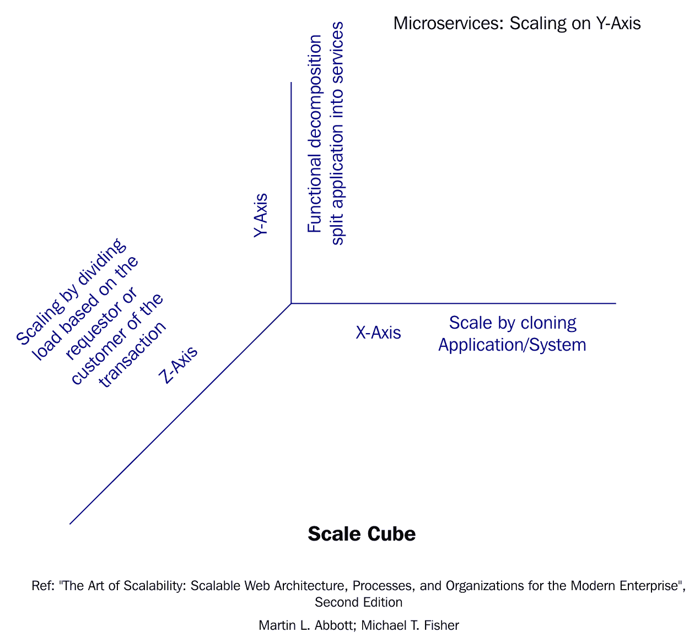
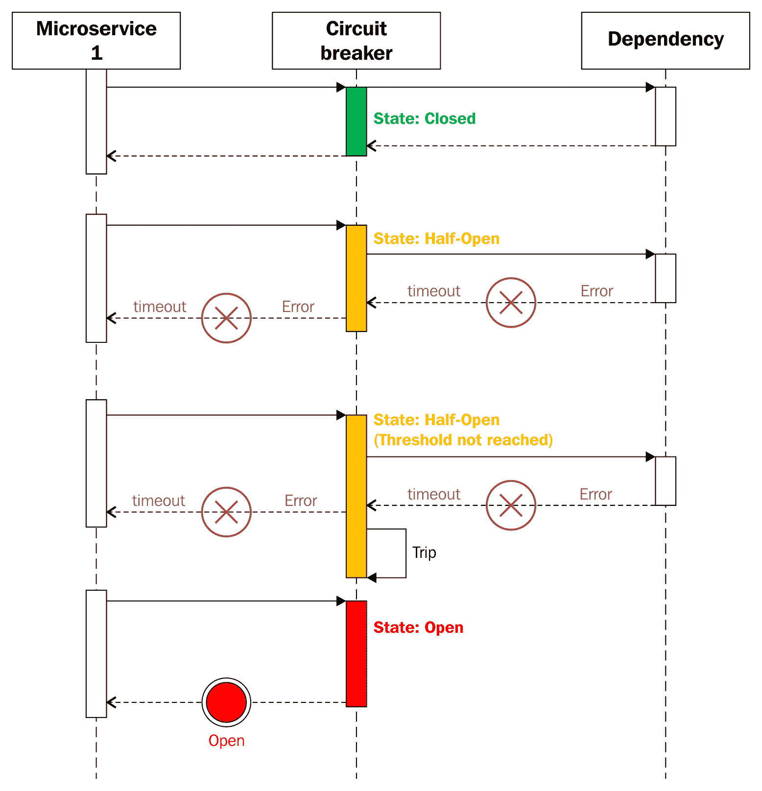

# 微服务扩展

想象你是一个开发和支持团队的一员，该团队负责开发公司的旗舰产品——TaxCloud。TaxCloud 帮助纳税人自行申报税收，并在成功申报税收后收取一小笔费用。假设你使用微服务开发了此应用程序。现在，假设产品变得流行并获得关注，突然在申报税收的最后一天，你迎来了大量消费者想要使用你的产品并申报税收。然而，你系统的支付服务速度很慢，这几乎使系统崩溃，所有新客户都转向了你的竞争对手的产品。这对你的业务来说是一个失去的机会。

尽管这是一个虚构的场景，但它可能发生在任何业务中。在电子商务中，我们在现实生活中一直经历过这些事情，尤其是在圣诞节和黑色星期五这样的特殊场合。总的来说，它们指向一个主要的重要特征——系统的扩展性。扩展性是任何关键任务系统最重要的非功能性需求之一。为几百个用户提供数百笔交易与为几百万用户提供数百万笔交易是不同的。在本章中，我们将讨论扩展性的一般概念。我们还将讨论如何单独扩展微服务，设计它们时需要考虑什么，以及如何使用不同的模式避免级联故障。到本章结束时，你将了解以下内容：

+   水平扩展

+   垂直扩展

+   扩展性立方模型

+   使用 Azure 规模集和 Docker Swarm 进行基础设施扩展

+   通过数据模型缓存和响应缓存扩展服务设计

+   断路器模式

+   服务发现

# 扩展性概述

设计决策影响单个微服务的扩展性。与其他应用程序功能一样，在设计阶段和早期编码阶段做出的决策在很大程度上影响了服务的扩展性。

微服务扩展需要平衡服务及其支持基础设施的方法。服务和其基础设施也需要和谐地扩展。

扩展性是系统最重要的非功能性特性之一，因为它可以处理更多的负载。通常认为，扩展性通常是大规模分布式系统关注的问题。性能和扩展性是系统的两种不同特性。性能涉及系统的吞吐量，而扩展性涉及为更多用户或更多交易提供服务所需的吞吐量。

# 扩展基础设施

微服务是现代应用程序，通常利用云服务。因此，当谈到可扩展性时，云提供了一定的优势。然而，这也关乎自动化和管理成本。因此，即使在云中，我们也需要了解如何配置基础设施，例如虚拟机或容器，以便在突发流量激增的情况下成功服务于我们的基于微服务应用程序。

现在我们将访问我们基础设施的每个组件，看看我们如何扩展它。最初的向上扩展和向外扩展方法更多地应用于硬件扩展。有了自动扩展功能，你将了解 Azure 虚拟管理器规模集。最后，你将学习在 Docker Swarm 模式下使用容器进行扩展。

# 垂直扩展（向上扩展）

**扩展**是一个术语，指的是通过向同一台机器添加更多资源来实现可扩展性。这包括添加更多内存或更高速度的处理器的操作，或者简单地将应用程序迁移到更强大的 macOS 上。

随着硬件的升级，你能够扩展机器的程度是有限的。更有可能的是，你只是在转移瓶颈，而不是解决提高可扩展性的真正问题。如果你向机器添加更多处理器，你可能会将瓶颈转移到内存上。处理能力并不线性地提高你的系统性能。在某个点上，即使你添加更多的处理能力，系统的性能也会稳定下来。向上扩展的另一个方面是，由于只有一个机器在处理所有请求，它也成为了一个单点故障。

总结来说，垂直扩展很容易，因为它不涉及代码更改；然而，这是一种相当昂贵的技巧。Stack Overflow 是那些罕见的基于.NET 的系统之一，它进行了垂直扩展。

# 水平扩展（向外扩展）

如果你不想垂直扩展，你总是可以水平扩展你的系统。通常，这也被称为**向外扩展**。谷歌确实使这种方法变得非常流行。谷歌搜索引擎正耗尽廉价的硬件盒子。因此，尽管它是一个分布式系统，但向外扩展帮助谷歌在其早期快速扩展其搜索过程，同时成本较低。大多数时候，常见任务分配给工作机器，它们的输出由执行相同任务的多台机器收集。这种安排也能通过故障生存。要向外扩展，负载均衡技术是有用的。在这种安排中，通常在所有节点集群的前面添加一个负载均衡器。因此，从消费者角度来看，你击中哪台机器/盒子并不重要。这使得通过添加更多服务器来增加容量变得容易。向集群添加服务器可以线性地提高可扩展性。

当应用程序代码不依赖于其运行的服务器时，扩展是成功的策略。如果请求需要在特定的服务器上执行，即如果应用程序代码具有服务器亲和性，那么扩展将会很困难。然而，在无状态代码的情况下，更容易在任何服务器上执行该代码。因此，当在水平扩展的机器或集群上运行无状态代码时，可扩展性得到了提高。

由于水平扩展的性质，这在整个行业中是一种常用的方法。你可以看到许多大型可扩展系统就是这样管理的，例如，谷歌、亚马逊和微软。我们建议你以水平方式扩展微服务。

# 微服务可扩展性

在本节中，我们将回顾可用于微服务的扩展策略。我们将查看可扩展性的规模立方体模型，如何为微服务扩展基础设施层，以及在微服务设计中嵌入可扩展性。

# 可扩展性的规模立方体模型

了解可扩展性的一种方法是通过理解规模立方体。在《可扩展性的艺术：现代企业的可扩展网络架构、流程和组织》一书中，马丁·L·艾博特和迈克尔·T·费舍尔将规模立方体定义为观察和理解系统可扩展性的方法。规模立方体也适用于微服务架构：

在这个可扩展性的三维模型中，原点（0,0,0）代表最不可扩展的系统。它假设系统是在单个服务器实例上部署的单体。如图所示，系统可以通过在三个维度上投入适量的努力来进行扩展。为了将系统推向正确的可扩展方向，我们需要做出正确的权衡。这些权衡将帮助您获得系统最高的可扩展性。这将帮助您的系统满足不断增长的客户需求。这由**规模立方体**模型表示。让我们来看看这个模型的每一个轴，并讨论它们在微服务可扩展性方面的含义。

# x 轴的扩展

在*x*轴上进行扩展意味着在负载均衡器后面运行应用程序的多个实例。这是一种在单体应用程序中非常常见的做法。这种方法的缺点之一是，应用程序的任何实例都可以利用为该应用程序提供的所有数据。它也未能解决应用程序的复杂性。

微服务不应该共享全局状态或一种可以被所有服务访问的数据存储。这将会造成瓶颈和单点故障。因此，仅仅在规模立方体的*x*轴上扩展微服务并不是正确的做法。

现在让我们来看看*z*轴的扩展。我们跳过*y*轴扩展是有原因的。

# z 轴的扩展

*z* 轴的缩放是基于一个分割，这个分割基于事务的客户或请求者。虽然 *z* 轴分割可能或可能不会解决指令、过程或代码的单一性质，但它们经常解决执行这些指令、过程或代码所需数据的单一性质。自然地，在 *z* 轴缩放中，有一个专门负责应用偏差因素的组件。偏差因素可能是一个国家、请求来源、客户细分或与请求者或请求相关的任何形式的订阅计划。请注意，*z* 轴缩放有许多好处，例如提高了请求的隔离和缓存；然而，它也遭受以下缺点：

+   它增加了应用复杂性。

+   它需要一个分区方案，这在需要重新分区数据时尤其棘手。

+   它没有解决日益增长的开发和应用复杂性问题。为了解决这些问题，我们需要应用 *y* 轴缩放。

由于 *z* 轴缩放的前置性质，它不适合在微服务中使用。

# *y* 轴的缩放

*y* 轴的缩放是基于将应用程序分解为不同组件的功能分解。Scale Cube 的 *y* 轴表示通过角色或数据类型、或某个组件在事务中执行的工作来分离责任。为了分割责任，我们需要根据系统组件执行的动作或角色来分割系统组件。这些角色可能基于事务的大块或非常小的一部分。根据角色的规模，我们可以对这些组件进行缩放。这种分割方案被称为 *服务或资源导向分割*。

这非常类似于我们在微服务中看到的情况。我们根据其角色或动作来分割整个应用程序，并根据其在系统中的角色来缩放单个微服务。这种相似性并非偶然；它是设计的结果。因此，我们可以相当肯定地说，*y* 轴缩放非常适合微服务。

理解*Y*轴的扩展对于基于微服务架构的系统的扩展非常重要。因此，实际上我们是在说，可以通过根据它们的角色和动作来分割微服务来实现扩展。考虑一个旨在满足一定初始客户需求的订单管理系统；为此，将应用程序拆分为客户服务、订单服务和支付服务等服务将工作得很好。然而，如果需求增加，您可能需要仔细审查现有系统。您可能会发现已经存在的服务的子组件，由于它们在服务以及整个应用程序中扮演着非常特定的角色，因此可以再次分离。这种针对增加的需求/负载而对设计进行回顾可能会触发将订单服务重新拆分为报价服务、订单处理服务、订单履行服务等。现在，报价服务可能需要更多的计算能力，因此与其他服务相比，我们可能会推送更多的实例（其后的相同副本）。

这是在 AFK 规模立方体的三维模型上对微服务进行扩展的近乎真实世界的例子。您可以在一些属于行业的知名微服务架构中观察到这种三维可扩展性和*Y*轴扩展的服务，例如亚马逊、Netflix 和 Spotify。

# 可扩展微服务的特性

在“规模立方体”部分，我们主要关注整个系统或应用程序特性的扩展。在本节中，我们将关注单个微服务特性的扩展。一个微服务被认为具有可扩展性和高性能，当它展现出以下主要特性时：

+   已知的增长曲线：例如，在订单管理系统的情况下，我们需要知道当前服务支持多少订单，以及它们与订单履行服务指标（以每秒请求数衡量）的比例。目前测量的指标被称为**基线数据**。

+   研究良好的使用指标：流量模式通常揭示客户需求，基于客户需求，可以计算前几节中提到的关于微服务的许多参数。因此，微服务被装备了，监控工具是微服务的必要伴侣。

+   有效利用基础设施资源：基于定性和定量参数，可以预测资源利用率。这将帮助团队预测基础设施成本并为其制定计划。

+   能够使用自动化基础设施进行测量、监控和增加容量：基于微服务资源消耗的操作和增长模式，很容易为未来的容量进行规划。如今，随着云弹性，能够规划和自动化容量变得更加重要。本质上，基于云的架构是成本驱动型架构。

+   已知的瓶颈：资源需求包括每个微服务需要的特定资源（计算、内存、存储和 I/O）。确定这些对于更顺畅的操作和可扩展的服务是至关重要的。如果我们确定了资源瓶颈，它们可以被处理并消除。

+   具有相同比例的依赖性扩展：这一点不言而喻。然而，你不能只关注一个微服务，而将其依赖项作为瓶颈。一个微服务的可扩展性与其最少的扩展依赖性一样。

+   具有容错性和高可用性：在分布式系统中，故障是不可避免的。如果你遇到一个微服务实例故障，它应该自动重定向到一个健康的微服务实例。仅仅在微服务集群前放置负载均衡器在这种情况下是不够的。服务发现工具对于满足可扩展微服务的这一特性非常有帮助。

+   具有可扩展的数据持久机制：对于可扩展的微服务，单个数据存储的选择和设计应该是可扩展和容错的。在这种情况下，缓存和分离读取和写入存储将有所帮助。

现在，当我们讨论微服务和可扩展性时，自然出现的扩展顺序是以下内容：

+   基础设施的扩展性：微服务在动态和软件定义的基础设施上运行良好。因此，扩展基础设施是扩展微服务的一个基本组成部分。

+   围绕服务设计进行扩展：微服务设计包括基于 HTTP 的 API 以及一个数据存储，其中存储了服务的本地状态。

# 扩展基础设施

在本节中，我们将访问微服务基础设施的所有层，并观察它们之间的关系，即每个单独的基础设施层如何进行扩展。在我们的微服务实现中，有两个主要组件。一个是虚拟机，另一个是托管在虚拟机或物理机上的容器。以下图表显示了微服务基础设施的逻辑视图：

# 使用规模集扩展虚拟机

在 Azure 云中扩展虚拟机非常简单和容易。这正是微服务大放异彩的地方。使用规模集，你可以在短时间内增加相同虚拟机镜像的实例，并且可以根据规则集自动进行。规模集与 Azure 自动扩展集成。

Azure 虚拟机可以以这种方式创建，使得作为一个组，它们即使在请求量增加的情况下也能始终提供服务。在特定情况下，如果这些虚拟机不需要执行工作负载，它们也可以自动删除。这是由虚拟机规模集来处理的。

规模集也与 Azure 中的负载均衡器很好地集成。由于它们被视为计算资源，因此可以与 Azure 的资源管理器一起使用。规模集可以配置为按需创建或删除虚拟机。这有助于以“宠物与牛群”的心态管理虚拟机，这是我们之前在部署章节中看到的。 

对于需要动态扩展和缩减计算资源的应用程序，扩展操作在故障域和更新域之间隐式平衡。

使用规模集，您不需要关联独立资源（如 NIC、存储帐户和虚拟机）的循环。即使在扩展时，我们如何确保这些虚拟管理器的可用性？所有这些关注和挑战都已经通过虚拟机规模集得到了解决。

规模集允许您根据需求自动扩展和缩减应用程序。假设有一个 40%的利用率阈值。所以，也许一旦我们达到 40%的利用率，我们就会开始体验到性能下降。在 40%的利用率时，会添加新的 Web 服务器。规模集允许您设置规则，如前几节所述。规模集的输入是一个虚拟机。规模集上的规则表示，在 40%的平均 CPU 使用率下，五分钟内，Azure 将为规模集添加另一个虚拟机。完成此操作后，再次校准规则。如果性能仍然高于 40%，则添加第三个虚拟机，直到达到可接受的阈值。一旦性能低于 40%，它将开始根据流量不活跃等因素删除这些虚拟机，以降低运营成本。

因此，通过实施规模集，您可以构建性能规则，并通过简单地自动添加和删除虚拟机来使应用程序变大以处理更大的负载。一旦这些规则建立，作为管理员，您将无事可做。

Azure 自动扩展会衡量性能并确定何时进行扩展和缩减。它还与负载均衡器和 NAT 集成。现在，它们与负载均衡器和 NAT 集成的理由是因为随着我们添加这些额外的虚拟机，我们将在前面有一个负载均衡器和 NAT 设备。随着请求的不断涌入，除了部署虚拟机外，我们还需要添加一条规则，允许流量被重定向到新实例。规模集的好处在于，它们不仅添加虚拟机，还与基础设施的所有其他组件协同工作，包括网络负载均衡器等。

在 Azure Portal 中，规模集可以被视为单个条目，尽管它包含多个虚拟机。要查看规模集中虚拟机的配置和详细规格，你必须使用 Azure Resource Explorer 工具。这是一个基于网络的工具，可在 [`resources.azure.com`](https://resources.azure.com) 上找到。在这里，你可以查看你订阅中的所有对象。你可以在 Microsoft.Compute 部分中查看规模集。

使用 Azure 模板存储库构建规模集非常简单。一旦你创建了自定义的 **Azure 资源管理器** (**ARM**) 模板，你还可以根据规模集创建自定义模板。由于范围和空间限制，我们省略了关于如何构建规模集的详细讨论和说明。你可以通过利用在 [`github.com/gbowerman/azure-myriad`](https://github.com/gbowerman/azure-myriad) 提供的 ARM 模板来遵循这些说明。

可用性集是一项较旧的技术，并且此功能支持有限。Microsoft 建议你迁移到虚拟机规模集以获得更快和更可靠的自动扩展支持。

# 自动扩展

通过监控解决方案，我们可以衡量基础设施的性能参数。这通常以性能 SLA 的形式出现。自动扩展使我们能够根据性能阈值增加或减少系统可用的资源。

自动扩展功能添加额外的资源以应对增加的负载。它也可以反向工作。如果负载减少，那么自动扩展会减少可用于执行任务的资源数量。自动扩展无需预先配置资源，并以自动化的方式进行。

自动扩展可以以两种方式扩展——垂直（向现有资源类型添加更多资源）或水平（通过创建该类型资源的另一个实例来添加资源）。

自动扩展功能基于两种策略来决定添加或移除资源。一种是基于资源的可用指标或达到某些系统阈值值。另一种策略是基于时间，例如，在印度标准时间上午 9 点到下午 5 点之间，系统需要 30 个 Web 服务器，而不是三个。

Azure 监控每个资源；所有与指标相关的数据都被收集和监控。基于收集的数据，自动扩展做出决策。

Azure Monitor 自动扩展仅适用于虚拟机规模集、云服务和应用程序服务（例如，Web 应用程序）。

# 使用 Docker Swarm 进行容器扩展

在前面的部署章节中，我们探讨了如何将微服务打包到 Docker 容器中。我们还详细讨论了为什么容器化在微服务世界中是有用的。在本节中，我们将通过 Docker 提升我们的技能，并了解我们如何轻松地使用 Docker Swarm 扩展我们的微服务。

本质上，微服务是分布式系统，需要分布式和隔离的资源。Docker Swarm 提供了容器编排集群功能，使得多个 Docker 引擎可以作为一个单一的虚拟引擎工作。这类似于负载均衡器的功能；此外，如果需要，它还可以创建容器的新实例或删除容器。

你可以使用任何可用的服务发现机制，如 DNS、consul 或 zookeeper 工具，与 Docker Swarm 一起使用。

一群（swarm）是由 Docker 引擎或节点组成的集群，你可以在其中部署你的微服务作为*服务*。现在，请不要将这些服务与微服务混淆。在 Docker 实现中，服务是一个不同的概念。一个**服务**是定义在工作节点上要执行的任务。你可能想了解我们上一句话中提到的节点。在 Docker Swarm 的上下文中，节点用于参与集群的 Docker 引擎。一个完整的 swarm 演示是可能的，并且 ASP.NET Core 镜像可以在 GitHub 上的 ASP.NET-Docker 项目中找到（[`github.com/aspnet/aspnet-docker`](https://github.com/aspnet/aspnet-docker)）。

Azure 容器服务最近已经可用。它是一个使用 DC/OS、Docker Swarm 或 Google Kubernetes 扩展和编排 Linux 或 Windows 容器的良好解决方案。

现在我们已经了解了如何扩展微服务基础设施，接下来让我们在以下章节中回顾微服务设计的可扩展性方面。

# 服务设计扩展

在这些章节中，我们将探讨在设计或实现微服务时需要关注的组件/问题。随着基础设施扩展负责服务设计，我们才能真正释放微服务架构的潜力，并在将微服务打造成真正的成功故事方面获得大量的商业价值。那么，服务设计中有哪些组件？让我们来看看。

# 数据持久化模型设计

在传统应用中，我们一直依赖关系型数据库来持久化用户数据。关系型数据库对我们来说并不陌生。它们在 70 年代出现，作为一种以结构化方式存储持久信息的方法，允许你进行查询和执行数据维护。

在当今的微服务世界中，现代应用程序需要在超大规模阶段进行扩展。我们在这里并不建议你完全放弃使用关系型数据库。它们仍然有其有效的用例。然而，当我们在一个数据库中混合读写操作时，会出现复杂性，需要增加可扩展性。关系型数据库强制执行关系并确保数据的一致性。关系型数据库基于众所周知的 ACID 模型。因此，在关系型数据库中，我们使用相同的数据模型进行读写操作。

然而，读操作和写操作的需求相当不同。在大多数情况下，读操作通常需要比写操作更快。读操作还可以使用不同的过滤标准进行，返回单行或结果集。在大多数写操作中，只涉及单行或列，并且通常与读操作相比，写操作需要更长的时间。因此，我们可以在同一数据模型中优化并服务读操作，或者优化并服务写操作。

我们是否可以将基本数据模型分为两半：一半用于所有读操作，另一半用于所有写操作？现在事情变得简单多了，并且可以很容易地使用不同的策略优化这两个数据模型。这对我们的微服务的影响是，它们反过来，对这两种操作都变得高度可扩展。

这种特定的架构被称为**通用查询责任分离**（**CQRS**）。作为一个自然的结果，CQRS 也在我们的编程模型方面得到了扩展。现在，我们的编程模型中的数据库-对象关系变得简单得多，并且更可扩展。

这带来了扩展微服务实现的基本要素的下一个基本元素：数据的缓存。

# 缓存机制

缓存是提高应用程序吞吐量的最简单方法。其原理非常简单。一旦数据从数据存储中读取，就尽可能地靠近处理服务器保存。在未来的请求中，数据直接从数据存储或缓存中提供。缓存的本质是尽量减少服务器需要完成的工作量。HTTP 协议本身内置了缓存机制。这也是它能够如此高效扩展的原因。

关于微服务，我们可以在三个级别上进行缓存，即客户端、代理和服务器端。让我们看看每一个。

首先，我们有客户端缓存。在客户端缓存中，客户端存储缓存的结果。因此，客户端负责执行缓存失效。通常，服务器通过使用诸如缓存控制和过期头等机制提供指导，关于数据可以保持多长时间以及何时可以请求新鲜数据。随着浏览器支持 HTML5 标准，有更多的机制可用，例如本地存储、应用程序缓存或 Web SQL 数据库，客户端可以在其中存储更多数据。

接下来，我们转向代理端。许多反向代理解决方案，如 Squid、HAProxy 和 NGINX，也可以作为缓存服务器。

现在，让我们详细讨论服务器端缓存。在服务器端缓存中，我们有以下两种类型：

+   响应缓存：这对于 Web 应用程序 UI 来说是一种重要的缓存机制，而且说实话，它简单易实现。对于缓存，相关头信息会被添加到微服务提供的响应中。这可以显著提高你的微服务性能。在 ASP.NET Core 中，你可以使用`Microsoft.AspNetCore.ResponseCaching`包实现响应缓存。

+   分布式缓存用于持久化数据：由于缓存不需要对任何外部资源进行 I/O 操作，因此分布式缓存可以提高微服务的吞吐量。这具有以下优势：

    +   微服务客户端将获得完全相同的结果。

    +   分布式缓存由持久化存储支持，并作为不同的远程进程运行。因此，即使应用服务器重启或出现任何问题，也不会影响缓存。

    +   源数据存储的请求次数更少。

你可以使用分布式提供程序，如 CacheCow、Redis（用于我们的书*Azure Redis Cache*）或 Memcache，以集群模式扩展你的微服务实现。

在下一节中，我们将概述 CacheCow 和 Azure Redis Cache。

# CacheCow

当你想要在客户端和服务器上实现 HTTP 缓存时，CacheCow 就派上用场了。这是一个轻量级的库，目前支持 ASP.NET Web API。CacheCow 是开源的，并附带 MIT 许可证，可在 GitHub 上找到([`github.com/aliostad/CacheCow`](https://github.com/aliostad/CacheCow))。

要开始使用 CacheCow，你需要为服务器和客户端做好准备。重要步骤包括：

+   在你的 ASP.NET Web API 项目中安装`Install-Package CacheCow.Server` NuGet 包；这将是你服务器。

+   在你的客户端项目中安装`Install-Package CacheCow.Client` NuGet 包；客户端应用程序将是 WPF、Windows Form、控制台或任何其他 Web 应用程序。

+   创建一个缓存存储。你需要在服务器端创建一个缓存存储，该存储需要一个数据库来存储缓存元数据([`github.com/aliostad/CacheCow/wiki/Getting-started#cache-store`](https://github.com/aliostad/CacheCow/wiki/Getting-started#cache-store))。

如果你想使用 memcache，请参考[`github.com/aliostad/CacheCow/wiki/Getting-started`](https://github.com/aliostad/CacheCow/wiki/Getting-started)获取更多信息。

# Azure Redis Cache

Azure Redis Cache 建立在开源项目**Redis**([`github.com/antirez/redis`](https://github.com/antirez/redis))之上，这是一个内存数据库，并持久化在磁盘上。根据微软([`azure.microsoft.com/en-in/services/cache/`](https://azure.microsoft.com/en-in/services/cache/))：

“Azure Redis Cache 基于流行的开源 Redis 缓存。它为你提供了一个安全、专用的 Redis 缓存，由微软管理，并且可以从 Azure 中的任何应用程序访问。”

在这些步骤的帮助下，使用 Azure Redis Cache 入门非常简单：

1.  创建一个 Web API 项目——请参阅我们第二章中的代码示例，*实现微服务*。

1.  实现 Redis——作为一个参考点使用[`github.com/StackExchange/StackExchange.Redis`](https://github.com/StackExchange/StackExchange.Redis)并安装`Install-Package StackExchange.Redis` NuGet 包。

1.  更新你的`CacheConnection`配置文件（[`docs.microsoft.com/en-us/azure/redis-cache/cache-web-app-howto#configure-the-application-to-use-redis-cache`](https://docs.microsoft.com/en-us/azure/redis-cache/cache-web-app-howto#configure-the-application-to-use-redis-cache)）。

1.  然后在 Azure 上发布（[`docs.microsoft.com/en-us/azure/redis-cache/cache-web-app-howto#publish-the-application-to-azure`](https://docs.microsoft.com/en-us/azure/redis-cache/cache-web-app-howto#publish-the-application-to-azure)）。

您也可以使用此模板创建 Azure Redis Cache：

[`github.com/Azure/azure-quickstart-templates/tree/master/201-web-app-redis-cache-sql-database`](https://github.com/Azure/azure-quickstart-templates/tree/master/201-web-app-redis-cache-sql-database) 关于 Azure Redis Cache 的完整详细信息，请参阅此 URL：

[`docs.microsoft.com/en-us/azure/redis-cache/`](https://docs.microsoft.com/en-us/azure/redis-cache/)

# 冗余和容错性

我们理解，一个系统处理故障和从故障中恢复的能力并不等同于提供的可扩展性。然而，我们无法否认，它们在系统层面上是密切相关的能力。除非我们解决可用性和容错性的问题，否则构建高度可扩展的系统将具有挑战性。在一般意义上，我们通过向系统的不同部分/组件提供冗余副本来实现可用性。因此，在接下来的章节中，我们将涉及两个这样的概念。

# 断路器

断路器是电子设备中的一个安全特性，在发生短路的情况下，它会切断电流流动并保护设备，或者防止对周围环境造成进一步损害。这个确切的想法可以应用于软件设计。当一个依赖的服务不可用或不在健康状态时，断路器会阻止调用该依赖服务，并将流量重定向到配置时间段内的备用路径。

在他的著名书籍《发布它！设计和部署生产就绪软件》中，Michael T. Nygard 详细介绍了断路器。以下图中显示了典型的断路器模式：

如图中所示，断路器作为一个具有三个状态的有限状态机。

# 关闭状态

这是电路的初始状态，描述了正常的控制流程。在这个状态下，有一个失败计数器。如果在这个流程中发生 `OperationFailedException`，失败计数器增加 `1`。如果失败计数器持续增加，意味着电路遇到更多的异常，达到设定的失败阈值，断路器将转换到开启状态。但如果调用成功且没有任何异常或失败，失败计数器将被重置。

# 开启状态

在开启状态，电路已经跳闸，并开始计时。如果达到超时并且电路仍然失败，代码流程将进入半开状态。

# 半开状态

在半开状态，状态机/断路器组件重置超时计数器，并再次尝试打开电路，重新启动状态变化到开启状态。然而，在这样做之前，它试图执行常规操作，比如对依赖项的调用；如果成功，那么断路器组件不会改变状态到开启状态，而是将状态改为关闭。这样，操作的正常流程就可以发生，电路再次关闭。

对于基于.NET 的微服务，如果您想实现断路器和一些容错模式，有一个名为 *Polly* 的优秀库，它以 NuGet 包的形式提供。它附带详细的文档和代码示例，并且还有一个流畅的接口。您可以从 [`www.thepollyproject.org/`](http://www.thepollyproject.org/) 或通过在 Visual Studio 的包管理器控制台中执行 `install--Package Polly` 命令来添加 *Polly*。

# 服务发现

对于小型实现，您如何确定微服务的地址？对于任何.NET 开发者来说，答案是我们在配置文件中简单地放置服务的 IP 地址和端口，我们就完成了。然而，当您处理数百或数千个动态配置的服务时，您就有了一个服务位置问题。

现在如果我们再深入一点，我们正在尝试解决问题的两个部分：

+   服务注册：这是在某种集中式注册中注册的过程，其中存储了所有服务级别的元数据、主机列表、端口和密钥。

+   服务发现：通过集中式注册组件在运行时与依赖项建立通信是服务发现。

任何服务注册和发现解决方案都需要以下特性，才能使其成为微服务服务发现问题的解决方案：

+   集中式注册本身应该具有高可用性

+   一旦特定的微服务启动，它应该自动接收请求

+   解决方案中应存在智能和动态的负载均衡能力

+   解决方案应该能够监控服务的健康状态和它所承受的负载

+   服务发现机制应该能够将流量从不良节点重定向到其他节点或服务，而无需停机或对其消费者产生影响。

+   如果服务位置或元数据发生变化，服务发现解决方案应该能够在不影响现有流量或服务实例的情况下应用这些更改。

一些服务发现机制在开源社区中可用。如下所示：

+   Zookeeper：Zookeeper([`zookeeper.apache.org/`](http://zookeeper.apache.org/))是一个集中式服务，用于维护配置信息和命名，提供分布式同步，并提供组服务。它用 Java 编写，强一致性（CP），并使用 Zab([`www.stanford.edu/class/cs347/reading/zab.pdf`](http://www.stanford.edu/class/cs347/reading/zab.pdf))协议在集群中协调更改。

+   Consul：Consul 使得服务能够通过 DNS 或 HTTP 接口简单地注册自己并发现其他服务。它还注册外部服务，如 SaaS 提供商。它还充当一个以键值形式存在的集中式配置存储。它还具有故障检测属性。它基于对等八卦协议。

+   Etcd：Etcd 是一个高度可用的键值存储，用于共享配置和服务发现。它受到 Zookeeper 和 Doozer 的启发。它用 Go 编写，使用 Raft([`ramcloud.stanford.edu/wiki/download/attachments/11370504/raft.pdf`](https://ramcloud.stanford.edu/wiki/download/attachments/11370504/raft.pdf))进行共识，并具有基于 HTTP-plus JSON 的 API。

# 摘要

可扩展性是追求微服务架构风格的关键优势之一。我们探讨了微服务可扩展性的特点。我们讨论了可扩展性立方体模型以及微服务如何在*y*轴上通过系统的功能分解进行扩展。然后，我们通过扩展基础设施来处理扩展问题。在基础设施部分，我们研究了 Azure Cloud 强大的扩展能力，利用 Azure 扩展集和容器编排解决方案，如 Docker Swarm、DC/OS 和 Kubernetes。

在本章的后期阶段，我们专注于通过服务设计进行扩展，并讨论了我们的数据模型应该如何设计。我们还讨论了某些考虑因素，例如在设计高可扩展性的数据模型时采用分割 CQRS 风格模型。我们还简要提到了缓存，特别是分布式缓存，以及它是如何提高系统吞吐量的。在最后一节中，为了使我们的微服务具有高度可扩展性，我们讨论了断路器模式和发现机制，这对于微服务架构的可扩展性至关重要。

在下一章中，我们将探讨微服务的反应性及其特点。
