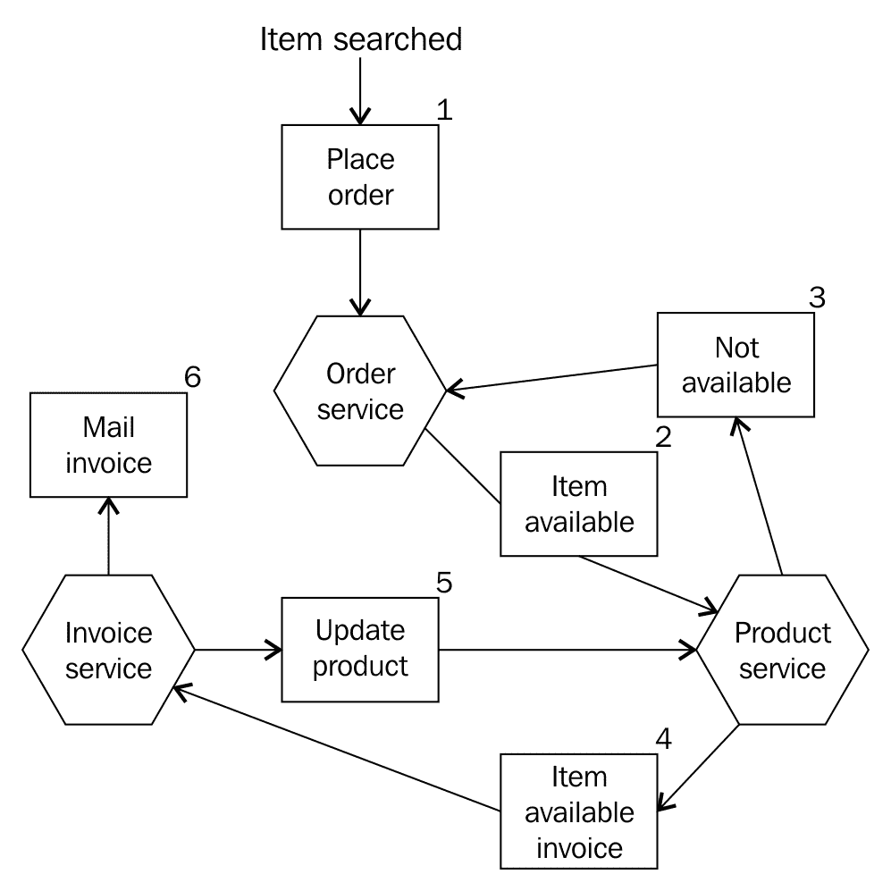
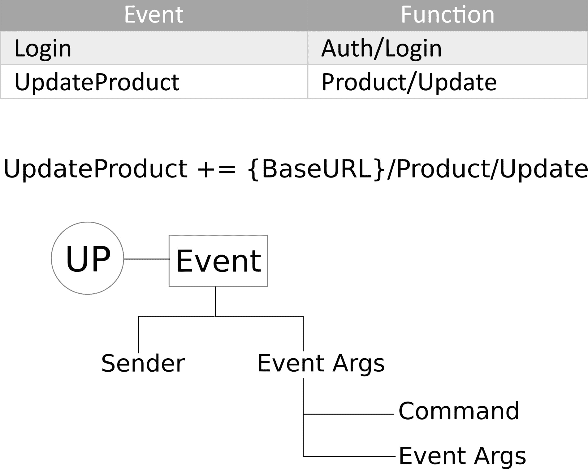
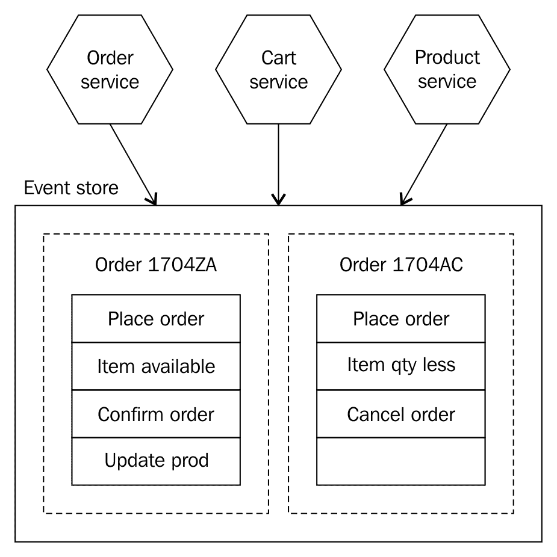
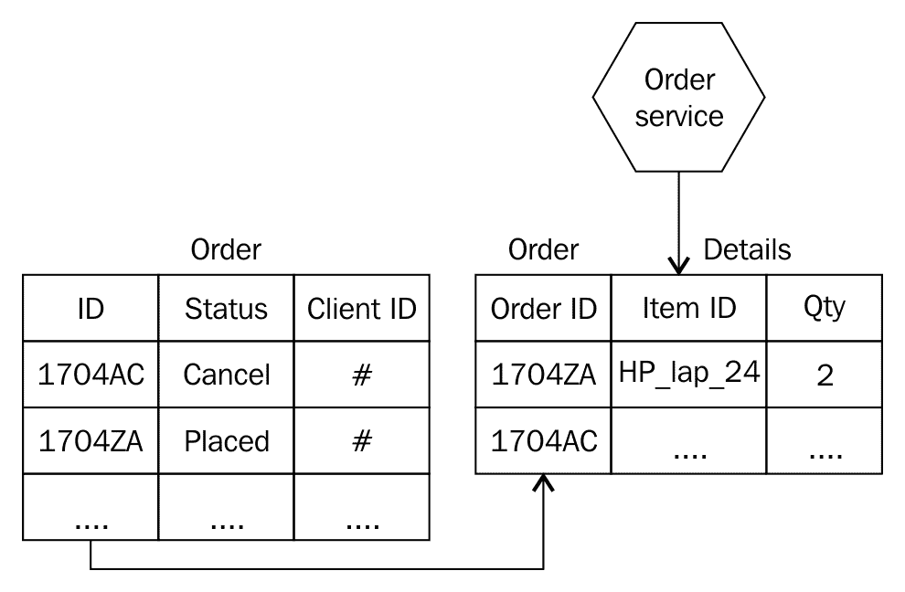
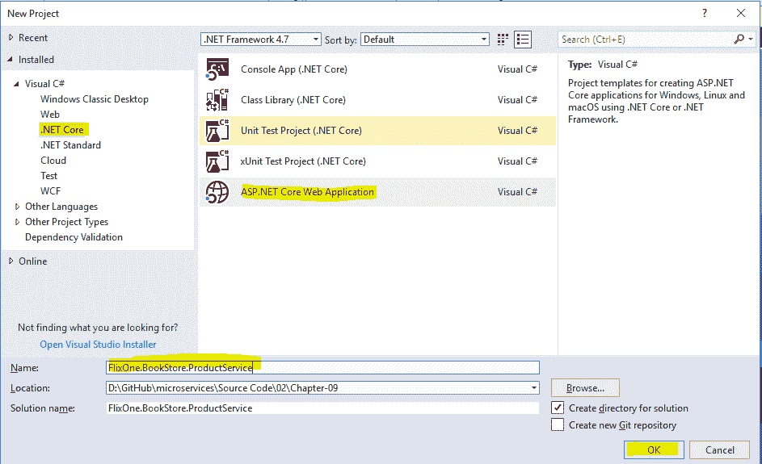
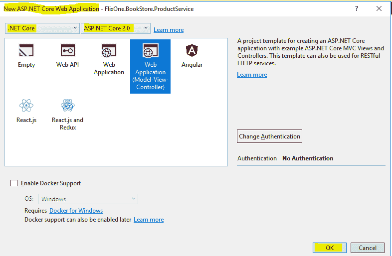
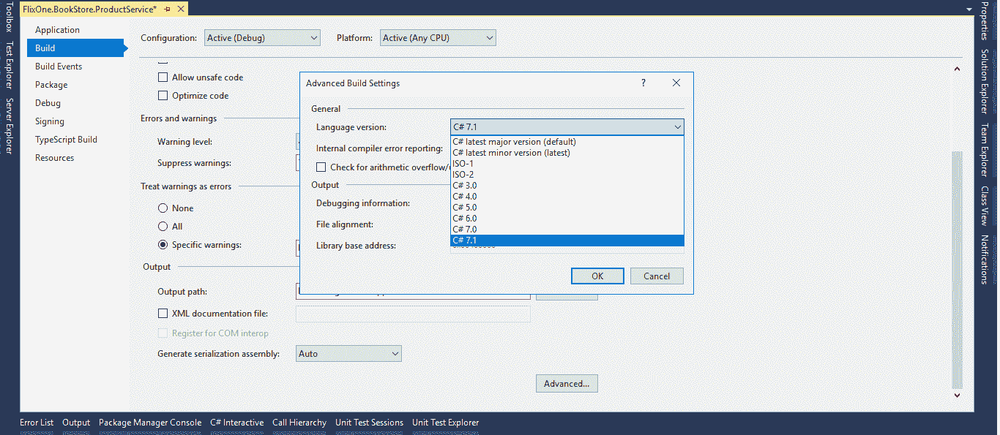
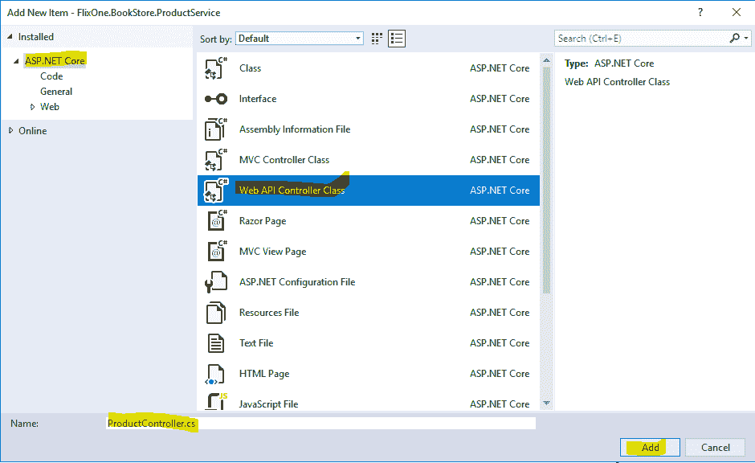
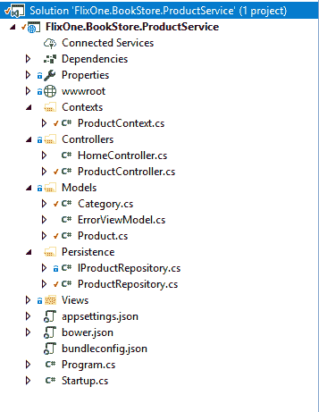

# 反应式微服务的介绍

我们现在已经清楚地理解了基于微服务的架构以及如何利用其力量。到目前为止，我们已经详细讨论了该架构的各个方面，例如通信、部署和安全。我们还研究了微服务在需要时如何协作。现在，通过在它们中引入反应式编程方面，让我们将微服务的有效性提升到下一个层次。我们将涵盖以下主题：

+   理解反应式微服务

+   流程映射

+   反应式微服务的通信

+   处理安全

+   管理数据

+   微服务生态系统

# 理解反应式微服务

在我们深入反应式微服务之前，让我们看看“反应式”这个词的含义。为了被认为是反应式的，一个软件组件必须具备某些基本属性。这些属性包括响应性、弹性、可伸缩性，最重要的是，以消息驱动。我们将详细讨论这些属性，并探讨它们如何使微服务成为满足大多数企业需求更强的候选者。

# 响应性

不久前，业务赞助商在需求收集会议中讨论的一个关键要求是保证几秒钟的响应时间。例如，一个 T 恤定制打印网店，你可以上传图片，然后将其渲染到所选的服装上。向前推进几年——我可以为此作证——如果任何网页加载时间超过几秒钟，我们将关闭浏览器窗口。

用户今天期望几乎瞬间的响应。但除非你编写的代码遵循某些标准以提供预期的性能，否则这是不可能的。总会有许多不同的组件协同合作和协调以解决某些业务问题。因此，每个组件预期返回结果的时间已经减少到现在的毫秒级。此外，当涉及到响应时间时，系统必须表现出一致性和性能。如果你有一个在定义时间段内表现出可变响应时间的服务，那么这是你系统中即将出现问题的迹象。你迟早必须处理这个负担。毫无疑问，在大多数情况下，你将设法解决这个问题。

然而，挑战比表面上的更大。任何这样的特性都需要检查设计中可能存在的问题。这可能是对另一个服务的某种依赖，服务中同时执行太多功能，或者同步通信在某些时候阻塞了工作流程。

# 弹性

在分布式计算的喧嚣声中，当系统的一个或多个组件出现故障时，用户期望从这样的系统中得到什么？单个故障会导致灾难性的多米诺骨牌效应，导致整个系统失败吗？或者系统会优雅地、在预期的时限内从这种事件中恢复过来？在这种情况下，最终用户不应受到影响，或者系统至少应将影响降至最低，确保用户体验不受影响。

反应式微服务将微服务的概念提升到了新的水平。随着微服务数量的增加，它们之间的通信需求也在增加。不久，跟踪一打其他服务的列表、在它们之间编排级联事务，或者只是向一组服务生成通知的任务，将变得具有挑战性。在本章的范围内，级联的概念比事务本身更重要。它可能不仅仅是通知外部系统的需求，而是基于某些过滤标准。

挑战在于企业级基于微服务的系统通常会远远超出几个微服务。这种规模和复杂性的全面图景在这里的章节中无法完全展现。在这种情况下，跟踪一组微服务并与它们通信的需求可能会迅速变得令人头疼。

如果我们能从单个微服务中移除向其他微服务传达事件的职责呢？这个问题的另一个方面可能是生态系统中的服务从跟踪中获得的自由。为了做到这一点，你需要跟踪它们的位置。只需添加认证，你就能轻易陷入一个你从未签约的混乱之中。

解决方案在于设计上的改变，即将跟踪事件或向他人传达事件的职责从单个微服务中移除。

在从单体应用过渡到微服务风格的架构时，我们了解到它们是隔离的。通过接口识别，我们将模块隔离成独立的服务集合，这些服务拥有自己的数据，并且不允许其他微服务/进程直接访问它们。我们通过满足单一业务功能并关注其数据和封装的业务功能等方面实现了自治。异步性是我们为微服务实现的另一个特性，以便能够进行非阻塞调用。

# 自主

从一开始，我们就强烈倡导正确地隔离微服务。在第二章“实现微服务”中，我们简要提到了一个概念——接口识别。在成功实施微服务风格的架构时，我们从中获得了许多好处。我们可以安全地断言，隔离是这里的基本要求之一。然而，成功实施隔离的好处远不止于此。

对于微服务来说，实现自主性非常重要，否则我们的工作将是不完整的。即使实现了微服务架构，如果某个微服务的故障导致其他服务延迟或产生多米诺效应，这意味着我们在设计中遗漏了某些内容。然而，如果微服务隔离做得正确，再加上对特定微服务要执行的功能的正确分解，那么其余的设计就会自行到位，以处理任何类型的解决冲突、通信或协调。

执行此类编排所需的信息主要取决于服务本身的良好定义的行为。因此，对定义良好的微服务的消费者来说，不需要担心微服务失败或抛出异常。如果在规定的时间内没有响应，只需再次尝试即可。

# 消息驱动：反应式微服务的核心

成为消息驱动是反应式微服务的核心。所有反应式微服务都将它们可能生成的事件定义为它们行为的一部分。这些事件可能包含或不包含额外的信息负载，这取决于单个事件的设计。生成此事件的微服务不会关心生成的事件是否被处理。在这个特定服务的范围内，没有关于生成此事件之外的行为定义。范围到此为止。现在，从整个系统的角度来看，其他微服务将根据它们各自的范围来处理这些信息。

这里的区别在于，所有这些生成的事件都可以通过监听它们来异步捕获。没有其他服务在等待阻塞模式下的任何这些服务。任何监听这些事件的人被称为订阅者，监听事件的行为被称为订阅。订阅这些事件的称为**观察者**，生成这些事件的源服务称为**可观察者**。这种模式被称为**观察者设计模式**。

然而，在每个观察者上具体实现的练习与我们的设计松耦合微服务的座右铭有些不一致。如果你这样想，那么你戴上了正确的思考帽，我们正走在正确的轨道上。在不久的将来，当我们将我们的流程映射为响应式微服务时，我们将看到如何在响应式微服务的世界中实现这一目标。

在我们继续映射我们的流程之前，简要讨论一下与我们的主题相关的模式是很重要的。为了对一条消息采取行动，你首先需要表明你想要观察该类型消息的意图。同时，消息的发起者必须有意向向感兴趣的观察者发布此类消息。因此，至少有一个可观察对象将被一个或多个观察者观察。为了增加一些趣味性，可观察对象可以发布多种类型的信息，而观察者可以观察他们打算采取行动的一个或多个信息。

这种模式并不限制观察者在想要停止监听这些消息时取消订阅。所以，听起来很美，但它的实现是否同样容易？让我们继续前进，亲自看看。

# 让我们编写响应式代码

让我们检查我们的应用程序，看看它将以响应式编程风格看起来如何。以下图显示了具有响应性且完全由事件驱动的应用程序的流程。在这个图中，服务以六边形表示，事件以方形框表示。以下是整个流程的详细说明：



图中描述的流程描述了客户在搜索到他们想要的商品后下订单的场景。**下订单**事件被触发到**订单服务**。对此事件的响应，我们的服务分析诸如订单项目和数量等参数，并将**项目可用**事件触发到**产品服务**。从现在开始，有两种可能的结局：要么请求的产品可用且有足够的数量，要么不可用或没有足够的数量。如果项目可用，**产品服务**会向**发票服务**触发一个名为生成发票的事件。由于开出发票意味着确认订单，发票上的项目将不再有库存；我们需要注意这一点并相应地更新库存。为了处理这个问题，我们的发票服务进一步向**产品服务**触发一个名为**更新产品数量**的事件，并处理这一需求。为了简化，我们不会深入探讨谁将处理**邮寄发票**事件的细节。

# 事件通信

前面的讨论可能让你在思考被引发的事件如何完美地映射到相应的微服务的调用；让我们进一步详细讨论这个问题。想象一下，所有被引发的事件都存储在一个事件存储中。存储的事件有一个关联的委托函数，用于处理相应的事件。尽管显示存储只有两列，但它存储了更多信息，例如发布者、订阅者等的详细信息。每个事件都包含触发相应服务所需的全部信息。因此，事件委托可能是一个要调用的服务或应用程序内的一个函数。对于这个架构来说，这并不重要：



# 安全性

在实现反应式微服务时，有无数种处理安全性的方法。然而，鉴于我们有限的范围，我们将只讨论一种类型。让我们继续讨论消息级安全，看看它是如何实现的。

# 消息级安全

消息级安全是保护你单个请求消息的最基本方法。在初始认证执行后，根据实现方式，请求消息本身可能包含 OAuth 承载令牌或 JWT。这样，每个请求都会被认证，并且与用户相关的信息可以嵌入到这些令牌中。这些信息可能很简单，比如一个用户名，以及一个表示令牌有效期的过期时间戳。毕竟，我们不想允许令牌在某个时间框架之外被使用。

然而，这里重要的是要注意，你可以自由地以这种方式实现它，以便可以嵌入和利用更多信息用于不同的用途。

# 可扩展性

这里还有一个方面你需要考虑。在这个令牌中，我们还可以嵌入除了认证信息之外的授权信息。请注意，所有这些信息都包含在频繁传递的令牌中，可能会很快成为负担。我们可以进行必要的更改，确保与授权相关的信息是一次性活动，并且随后根据需要与服务持久化。

当我们决定与各个服务持久化授权相关信息时，我们以这种方式使它们变得灵活。使用各个服务持久化授权信息的任务消除了每次都需要从认证服务获取授权相关数据的需要。这意味着我们可以非常容易地扩展我们的服务。

# 通信弹性

如果包含所有用户认证数据和授权数据的认证服务变得不可用，会发生什么？这是否意味着整个微服务生态系统都会崩溃，因为所有动作——或者大部分动作——都需要对尝试执行动作的用户进行授权？这不符合微服务架构的领域。让我们看看我们如何处理这种情况。

一种方法是在每个需要它的服务中复制用户授权数据。当授权数据已经与相应服务可用时，将减少通过 JWT（JSON Web Tokens）传输的数据量。这将实现的是，如果我们的 Auth 服务变得不可用，已经认证并访问系统的用户将不会受到影响。由于所有授权数据已经存在于需要验证的各个服务中，业务可以继续进行，没有任何阻碍。

然而，这种方法也有其自身的代价。由于数据需要随时更新以适应所有服务，维护这些数据将变得具有挑战性。为每个服务所需的复制本身就是一个挑战。尽管如此，也有解决这个特定挑战的方法。

而不是在所有微服务中提供这些数据，我们可以在一个中心存储中简单地存储它，并让服务从这个中心存储验证/访问授权相关数据。这将使我们能够构建超出认证服务的弹性。

# 管理数据

跟踪单个订单的下单过程是容易的。然而，将这个数字乘以每小时数百万个订单的下单和取消，在反应式微服务领域可能会迅速成为一个挑战。挑战在于如何在多个服务之间执行事务。不仅跟踪此类事务很困难，而且它还带来了其他挑战，例如持久化跨越数据库和消息代理的事务。如果在中间某个服务失败导致事务中断的情况下，这种操作的撤销任务可能会更加艰巨。

在这种情况下，我们可以利用事件溯源模式。这是一个强有力的候选方案，尤其是因为我们不寻求通常称为 2PC（两阶段提交）的两阶段提交。我们不是存储事务，而是持久化我们实体的所有状态改变事件。换句话说，我们以实体的形式存储所有改变它们状态的事件，例如订单和产品。当客户端下单时，在正常情况下，我们会将订单持久化到订单表作为一行。然而，在这里我们将持久化整个事件序列，直到订单被接受或拒绝的最终阶段。

参考前图，我们分析了创建订单时生成的事件序列。看看这些事件将如何在这个模式中存储，以及如何从这些事件集中推导出事务。首先，让我们看看数据将如何存储。如以下图所示，单个记录作为行保存。数据一致性在事务后得到确认：



如前图所示，**产品服务**可以订阅订单事件并相应地更新自己。从这个方法中可以衍生出许多好处，例如：

+   由于事件正在持久化，识别事务的挑战与维护数据库完整性的任务分离了

+   有可能在任何给定时间点找到系统的确切状态

+   使用这种方法更容易迁移单体应用

+   有可能回到过去，识别任何可能的问题

以下图像展示了我们的**订单**和**订单详情**表（s）在**订单服务**视图下的情况：



除了所有的好处之外，还有一些缺点。其中最重要的一点是如何查询事件存储。要重建给定业务实体在特定时间点的状态，需要一些复杂的查询。除此之外，还需要一个学习曲线来掌握事件存储替代数据库并推导实体状态的概念。查询复杂性可以通过 CQRS 模式轻松处理。然而，这超出了本章的范围。值得注意的是，事件源模式和 CQRS 在响应式微服务之后值得有单独的章节。

# 微服务生态系统

如前几章所讨论的，当我们采用微服务时，我们需要为即将到来的大变化做好准备。到目前为止，我们关于部署、安全和测试的讨论可能会让你现在开始考虑接受这个事实。与单体应用不同，采用微服务需要你事先做好准备，以便你开始构建与之相关的基础设施，而不是在之后。从某种意义上说，微服务在一个完整生态系统中蓬勃发展，从部署到测试、安全性和监控，一切都已安排妥当。接受这种变化的回报是巨大的。当然，要做出所有这些改变肯定会有成本。然而，与其有一个无法上市的产品，不如承担一些成本，设计和开发出能够茁壮成长并在最初几轮发布后不会消亡的东西。

# 编码响应式微服务

现在，让我们尝试总结一下，看看它在代码中实际上看起来如何。我们将使用 Visual Studio 2017 来完成此操作。第一步是创建一个反应式微服务，然后我们将继续创建一个客户端来消费我们创建的服务。

# 创建项目

现在，我们将继续创建我们的反应式微服务示例。为了做到这一点，我们需要创建一个 ASP.NET Web 应用程序类型的项目。只需按照以下步骤操作，你应该能够看到你的第一个反应式微服务在行动：

1.  启动 Visual Studio。

1.  通过导航到文件 | 新建 | 项目创建一个新的项目。

1.  从已安装的模板中，选择.NET Core | ASP.NET Core Web 应用程序。

1.  将其命名为`FlixOne.BookStore.ProductService`并点击确定：



1.  在“新建 ASP.NET Core Web 应用程序”窗口中，选择.NET Core 和 ASP.NET Core 2.0，然后选择 Web 应用程序（模型-视图-控制器），然后单击确定：



如果你启用了容器，你可以为 Windows 启用 Docker 支持。

1.  确保已选择 C#7.1；为此，在解决方案资源管理器中右键单击项目，然后单击属性。在项目属性窗口中，单击生成选项卡，然后滚动到高级。单击高级，然后选择 C# 7.1：



1.  打开 NuGet 管理器，并将 System.Reactive.Core NuGet 包添加到项目中。确保在屏幕上选择包含预发布版本：


你还必须添加一个 EF core 包；要这样做，请参阅第二章“实现微服务”中的*EF Core 迁移*部分。

1.  将`Product.cs`模型代码添加到`Models`文件夹中，如下所示：

```cs
namespace FlixOne.BookStore.ProductService.Models
{
  public class Product
  {
    public Guid Id { get; set; }
    public string Name { get; set; }
    public string Description { get; set; }
    public string Image { get; set; }
    public decimal Price { get; set; }
    public Guid CategoryId { get; set; }
    public virtual Category Category { get; set; }
  }
}
```

1.  将`Category.cs`模型代码添加到`Models`文件夹中，如下所示：

```cs
namespace FlixOne.BookStore.ProductService.Models
{
  public class Category
  {
    public Category() => Products = new List<Product>();
    public Guid Id { get; set; }
    public string Name { get; set; }
    public string Description { get; set; }
    public IEnumerable<Product> Products { get; set; }
  }
}
```

1.  将`context`和`persistence`文件夹添加到项目中。将`ProductContext`添加到`context`文件夹中，并将`IProductRepository`接口和`ProductRepository`类添加到`persistence`文件夹中。

考虑以下代码片段，展示了我们的上下文和持久化类：

```cs
namespace FlixOne.BookStore.ProductService.Contexts
{
  public class ProductContext : DbContext
  {
    public ProductContext(DbContextOptions<ProductContext> options)
    : base(options)
    { }
    public ProductContext()
    { }
    public DbSet<Product> Products { get; set; }
    public DbSet<Category> Categories { get; set; }
  }
}
//Persistence or repositories, following is the interface
namespace FlixOne.BookStore.ProductService.Persistence
{
  public interface IProductRepository
  {
    IObservable<IEnumerable<Product>> GetAll();
    IObservable<IEnumerable<Product>> GetAll(IScheduler scheduler);
    IObservable<Unit> Remove(Guid productId);
    IObservable<Unit> Remove(Guid productId, IScheduler scheduler);
  }
}
//ProductRepository class that implements the IProductRepository interface
namespace FlixOne.BookStore.ProductService.Persistence
{
  public class ProductRepository : IProductRepository
  {
    private readonly ProductContext _context;
    public ProductRepository(ProductContext context)
    => _context = context;
    public IObservable<IEnumerable<Product>> 
    GetAll() => Observable.Return(GetProducts());
    public IObservable<IEnumerable<Product>>
    GetAll(IScheduler scheduler) => 
    Observable.Return(GetProducts(), scheduler);
    public IObservable<Unit> Remove(Guid productId) =>
    Remove(productId, null);
    public IObservable<Unit> Remove(Guid productId,
    IScheduler scheduler)
    {
      DeleteProduct(productId);
      return scheduler != null
      ? Observable.Return(new Unit(), scheduler)
      : Observable.Return(new Unit());
    }
    private IEnumerable<Product> GetProducts()
    {
      var products = (from p in _context.Products.
      Include(p => p.Category)
      orderby p.Name
      select p).ToList();
      return products;
    }
    private Product GetBy(Guid id) => GetProducts().
    FirstOrDefault(x => x.Id == id);
    private void DeleteProduct(Guid productId)
    {
      var product = GetBy(productId);
      _context.Entry(product).State = EntityState.Deleted;
      _context.SaveChanges();
    }
  }
}
```

我们已经创建了我们的模型。我们的下一步是添加与数据库交互的代码。这些模型帮助我们将数据源中的数据投影到我们的模型中。

对于数据库交互，我们已创建了一个上下文，即`ProductContext`，它从`DbContext`派生而来。在之前的某个步骤中，我们创建了一个名为`Context`的文件夹。

Entity Framework Core 上下文有助于查询数据库。它还帮助我们汇总我们在数据上执行的所有更改，并一次性在数据库上执行它们。在这里，我们不会详细介绍 Entity Framework Core 或上下文，因为它们不属于本章的范围。

上下文从`appsettings.json`文件中的`connectionStrings`部分选择连接字符串——键名为`ProductConnectionString`。

您需要更新`startup.cs`文件以确保您使用的是正确的数据库。我们已经在第二章，*实现微服务*中讨论了修改`appsettings.json`和`Startup.cs`文件。在更新`Startup.cs`类时，您需要为项目添加`Swashbuckle.AspNetCore` NuGet 包以支持 Swagger。

您可以将其命名为以下代码片段中显示的任何名称：

```cs
 "ConnectionStrings": 
 {
   "ProductConnection": "Data Source=.;Initial
   Catalog=ProductsDB;Integrated  
   Security=True;MultipleActiveResultSets=True"
 }
```

# 应用程序与数据库之间的通信

在我们设置好上下文，并处理应用程序与数据库之间的通信后，让我们继续添加一个仓库以促进我们的数据模型与数据库之间的交互。请参考我们在*创建项目*部分的第 10 步中讨论的仓库代码。

将`GetAll`的结果标记为`IObservable`添加了我们寻找的响应式功能。同时，请注意返回语句。

使用这个可观察模型，我们可以像处理其他更简单的集合一样轻松地处理异步事件的流：

```cs
 return Observable.Return(GetProducts());
```

我们现在准备好通过我们的控制器公开功能。在控制器文件夹上右键单击，点击添加新项，然后选择 ASP.NET Core，Web API 控制器类。将其命名为`ProductController`：



我们的控制器将看起来如下：

```cs
namespace FlixOne.BookStore.ProductService.Controllers
{
  [Route("api/[controller]")]
  public class ProductController : Controller
  {
    private readonly IProductRepository _productRepository;
    public ProductController() => _productRepository =
    new ProductRepository(new ProductContext());
    public ProductController(IProductRepository 
    productRepository) => _productRepository = 
    productRepository;
    [HttpGet]
    public async Task<IEnumerable<Product>> Get() =>
    await _productRepository.GetAll().SelectMany(p => p).ToArray();
  }
}
```

最终的结构看起来与以下解决方案资源管理器截图相似：



要创建数据库，您可以参考第二章，*实现微服务*中的*EF Core 迁移*部分，或者简单地调用我们新部署的服务中的 Get API。当服务发现数据库不存在时，在这种情况下，Entity Framework Core 代码优先的方法将确保数据库被创建。

我们现在可以继续部署这项服务到我们的客户那里。随着我们的反应式微服务部署完成，我们现在需要一个客户来调用它。

# 客户端 – 编码实现

我们将使用 AutoRest 的帮助创建一个用于消费我们新部署的反应式微服务的 Web 客户端。让我们为它创建一个控制台应用程序，并添加以下 NuGet 包：`Reactive.Core`、`WebApi.Client`、`Microsoft.Rest.ClientRuntime`和`Newtonsoft.Json`：

1.  AutoRest 将为主项目添加一个名为`Models`的文件夹，并创建模型的产品和类别的副本，就像我们刚刚创建的服务一样。它将内置必要的反序列化支持。

1.  `ProductOperations.cs`和`ProductServiceClient.cs`包含了所有调用所需的主要管道。

1.  在`Program.cs`文件的`Main`函数中，按照以下方式更改`Main`函数：

```cs
 static void Main(string[] args)
 {
   var client = new ProductServiceClient {BaseUri = 
   new Uri("http://localhost:22651/")};
   var products = client.Product.Get();
   Console.WriteLine($"Total count {products.Count}");
   foreach (var product in products)
   {
     Console.WriteLine($"ProductId:{product.Id},Name:
     {product.Name}");
   }
   Console.Write("Press any key to continue ....");
   Console.ReadLine();
 }  
```

在这一点上，如果数据库尚未创建，那么它将根据 Entity Framework 的要求自动创建。

我们需要了解从我们的微服务返回的这个列表与常规列表有何不同。答案是，如果这是一个非响应式场景，并且你对列表进行了任何更改，这些更改将不会反映在服务器上。在响应式微服务的情况下，对这样一个列表所做的更改将自动持久化到服务器，而无需手动跟踪和更新更改的过程。

你可以使用任何其他客户端来执行 Web API 调用（例如，RestSharp 或 HttpClient）。

你可能已经注意到，在处理混乱的回调时，我们几乎不需要做任何工作，或者根本不需要做。这有助于保持我们的代码干净且易于维护。在使用可观察者时，当值可用时，是生产者推动这些值。此外，还有一个客户不意识到的区别：你的实现是阻塞的还是非阻塞的。对于客户来说，这一切似乎都是异步的。

现在，你可以专注于重要任务，而不是试图弄清楚下一步要调用什么或者完全错过了哪些调用。

# 摘要

在本章中，我们将响应式编程的方面添加到了我们的基于微服务的架构中。这种微服务之间通信的消息驱动方法有其权衡。然而，同时，这种方法在进一步推进我们的微服务架构时，往往能解决一些基本问题。事件溯源模式出现并帮助我们克服了 ACID 事务或两阶段提交选项的限制。这个主题需要一本书来专门讨论，将其限制在一个章节中是不公正的。我们使用我们的示例应用程序来了解如何以响应式的方式重构我们的初始微服务。

在下一章中，我们将有一个完整的应用程序供我们探索，并将我们在本书中迄今为止讨论的所有内容整合在一起。
