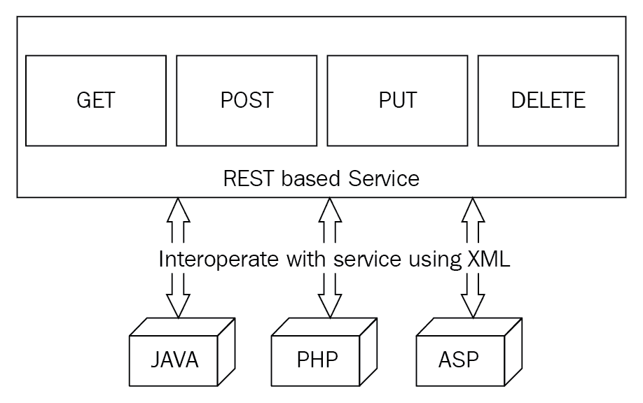
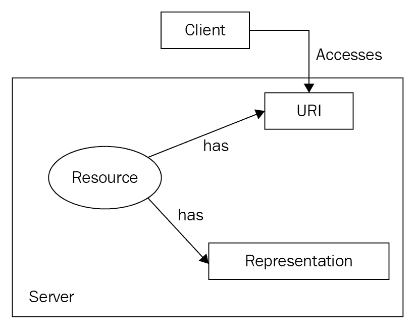
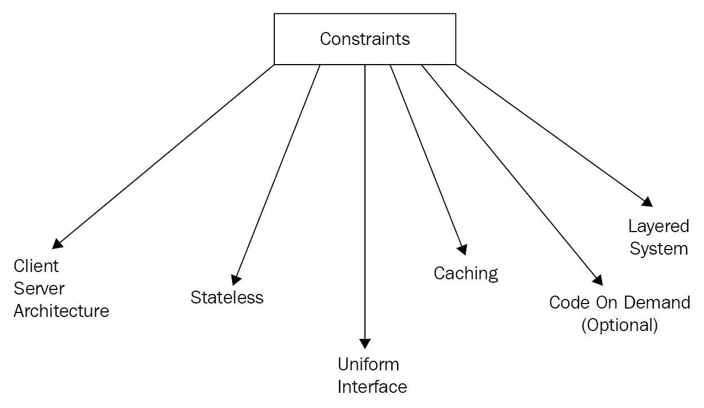
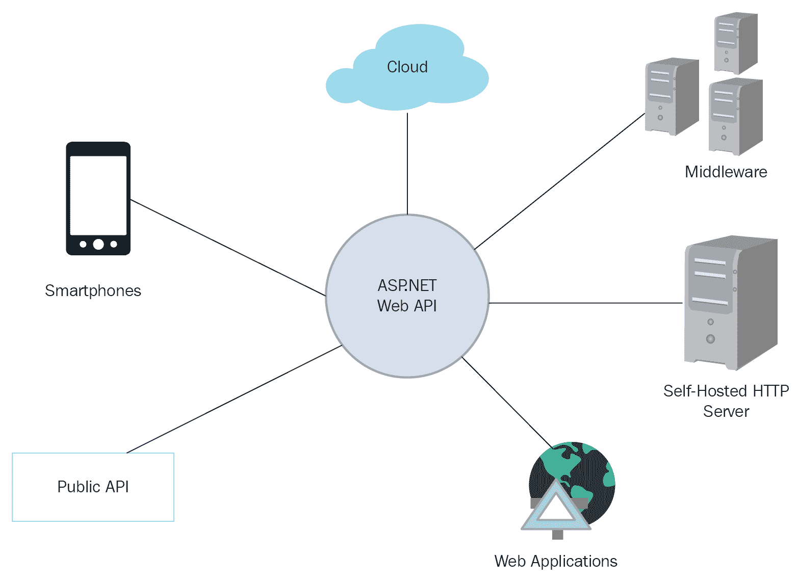
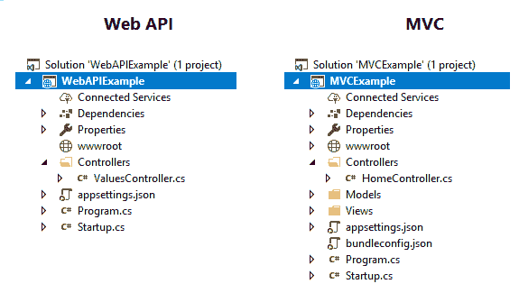

# 第一章：入门

现代 Web 开发要求与服务器交互时没有麻烦。这意味着随着不同 UI 和后端框架的演变，开发者需要找到一种方法，在不依赖任何框架的情况下与任何可用的框架共享数据。这意味着应该有一种方法从服务器向客户端共享数据，无论它们的语言和框架如何。为了使数据共享统一，首先想到的是`.xml`和`.json`格式。这些格式被每个框架所支持。

在本章中，我们将探讨一种架构风格，通过它可以从任何语言使用任何框架编写的任何程序中获取或发送数据。使用 REST，我们将讨论的架构可以引入客户端易于消费的数据操作方法。

本章将涵盖以下主题：

+   RESTful 服务

+   为什么我们应该使用 RESTful 服务？RESTful 和 RESTless 服务之间的区别

+   客户端-服务器架构

+   ASP.NET Core 和 RESTful 服务

# 讨论 RESTful 服务

**REST**代表**表征状态转移**。它是一种定义构建 Web 服务的一组指南的架构风格。

什么是架构风格？它不过是一个具有预定义原则的概念。我们稍后将讨论这些原则。当你遵循 REST 时，你实际上是在你的应用程序中实现 REST 的构建块原则。

然而，REST 的实现方式肯定会有所不同，每个开发者都有自己的实现风格。没有固定的实现方式。不要与**架构模式**混淆，架构模式不是概念，而是实际的实现。MVC 就是一个架构模式，因为它有一个固定的结构，定义了组件之间如何交互，以及它们不能有不同的实现方式。

以下是一个基于 REST 的服务非常简单的图示：



为了简化问题，考虑前面的图示，它展示了具有某些方法的服务，例如`GET`、`POST`、`PUT`和`DELETE`。这就是这种风格的核心所在。当你设计你的服务时，它将包含所有这些方法——以及它们内部预期的操作——我们可以将其视为基于 REST 的服务，也称为 RESTful 服务。更重要的是，服务可以从任何平台和任何语言构建的应用程序中调用，因为服务具有标准化的架构。

如前所述，RESTful 服务是一种支持 REST 的服务。让我们来谈谈 REST 的特性，以便我们了解对 RESTful 服务的期望。

# REST 特性

网络服务的主要构建块是客户端和服务器架构。从服务器发送的响应实际上是针对客户端请求的回复。这就像你提出一个问题，服务器在找到答案时会做出回应。从服务器返回的响应实际上是以某种格式或表示的资源。常见的格式有`.json`、`.xml`、`.pdf`、`.doc`等等。

REST 是无状态的。**无状态**意味着系统的状态始终不同。因此，当请求到达服务器时，它会被服务并遗忘。因此，下一个请求不依赖于前一个请求的状态。每个请求都由服务器独立处理。

请求是在 HTTP 连接中执行的。它们各自都采取**统一资源标识符**（**URI**）的形式。这个标识符帮助我们定位互联网服务器上的所需资源。

Roy Fielding 的博士论文，题为《架构风格和网络软件架构设计》，定义了 REST。以下是他研究中的几个关键点：

+   与许多分布式架构一样，REST 强加了层、无状态和缓存。

+   REST 提高了效率、互操作性和整体性能。

+   REST 通过遵循一系列关于如何标识和操作资源以及通过元数据简化其操作描述的过程来引入一致性。我们将更多地讨论这种一致性，这被称为**统一接口**。

+   由于 REST 是一种架构风格，只要支持 HTTP，就可以使用任何语言或平台来开发服务。

你可以在[`www.ics.uci.edu/~fielding/pubs/dissertation/top.htm`](https://www.ics.uci.edu/~fielding/pubs/dissertation/top.htm)阅读完整的论文。

# 资源导向架构

网上的每个资源都已被赋予一个唯一的标识符，也称为 URI。**统一资源定位符**（**URL**）是今天在互联网上使用最广泛的 URI 类型。URL [`www.packtpub.com/`](https://www.packtpub.com/) 识别并定位 Packt Publishing 网站。

让我们快速看一下架构的图片。在下面的图中，客户端正在尝试通过一个标识符（URL）访问资源。资源存在于服务器上，并且有一个可以在请求时返回给客户端的表示：



如其名所示，URL 是与单一资源相关联的；因此，如果我想指向一个资源，我可以在电子邮件、聊天中等轻松地共享该标识符。

如果用公司或资源名称命名，这些标识符很容易记住。最好的例子是 [www.google.com](https://www.google.com/)，因为 Google 这个名字很容易记住。因此，我们可以通过口碑传播资源链接，你可以在几秒钟内将其输入到网络浏览器中，例如 Chrome 或 Firefox。

你可能会在某个网页上找到超链接，链接到另一个网站上的另一个资源。这意味着由于超链接的存在，资源现在是相互关联的。

这些相互关联的资源构成了面向资源的架构。超链接使得通过目标资源 URI 从一个资源导航到另一个资源变得容易。

例如，在 HTML 中，你通过锚元素链接到另一个资源。以下是一个链接到 Packt 的物联网图书目录页面的锚元素：

`<a href="https://www.packtpub.com/tech/Internet%20of%20%20Things">Packt IoT Books</a>`

默认情况下，锚元素被渲染为带下划线的文本。当你悬停在它上面时，你可以在下面的截图看到附加的 URI：


你可以点击锚文本（Packt IoT Books），然后对目标资源 URI 发起一个 `GET` 请求。

注意，当你点击超链接时，你会跳转到实际上是一个资源表示的网页。你将遇到的最常见的表示形式是 HTML 格式。其他一些常见的格式包括（X）HTML、JPEG、GIF、WMV、SWF、RSS、ATOM、CSS、JavaScript/JSON 等等。当浏览器收到这些表示之一时，它会尝试解析它，并在解析成功后将其渲染供查看。

# URI

我们已经谈了很多关于资源的内容。实际上，它们是我们在一个特定网站上看到的页面。然而，HTTP 中的资源不仅仅是简单的 HTML 网页形式的文件。通常，资源被定义为任何可以通过 URI 唯一识别的信息，例如 [`packtpub.com/`](http://packtpub.com/)。

让我们暂时谈谈 URI。一个 URI 由几个组件组成：一个 URI 方案名称，例如 `http` 或 `ftp` 是第一部分，后面跟着一个冒号字符。冒号字符之后是层次结构部分：

```cs
<scheme name> : <hierarchical part> [ ? <query> ] [ # <fragment> ]
```

让我们分析一个 URI：

```cs
https://www.flipkart.com/men/tshirts/pr?sid=2oq%2Cs9b%2Cj9y
```

让我们分解前面的 URI：

+   方案名称是 `https`。

+   方案名称后面跟着层次结构部分，`//www.flipkart.com/men/tshirts/pr`。层次结构部分以 `//` 开头。

+   层次结构部分还包含一个可选的查询，例如在这个例子中是 `sid=2oq%2Cs9b%2Cj9y`。

以下是一个包含可选片段部分的 URI 示例：

```cs
https://en.wikipedia.org/wiki/Packt#PacktLib
```

# REST 约束

REST 由六个约束定义，如下所示图所示。其中一个是可选的：



这些约束中的每一个都强制服务遵循一个设计决策。如果不遵循，则该服务不能被视为 RESTful。让我们逐一讨论这些约束。

# 客户端-服务器架构

客户端或服务的消费者不需要担心服务器如何处理数据并将其存储在数据库中。同样，服务器也不需要依赖于客户端的实现，尤其是用户界面。

想象一个没有太多用户界面的物联网设备或**传感器**。然而，它通过与服务器交互使用 API 来存储数据，这些 API 被编程在特定事件上触发。假设你正在使用一个物联网设备，当你的车耗尽汽油时它会提醒你。当物联网设备中的传感器检测到汽油短缺时，它会调用配置好的 API，然后最终向车主发送警报。

这意味着客户端和服务器不是同一个实体，它们可以独立存在。它们可以独立设计和演进。现在你可能想知道，**客户端如何在没有了解服务器架构的情况下工作，反之亦然**？好吧，这正是这些约束的目的所在。当服务被客户端交互时，提供了足够的信息关于其本质：如何消费它，以及你可以使用它执行哪些操作。

随着我们进入本节内容，你会发现客户端和服务器之间完全没有关系，并且如果它们完美地遵守所有这些约束，它们可以完全解耦。

# 无状态

无状态这个术语意味着应用程序在特定时间内保持的状态可能不会持续到下一个时刻。RESTful 服务不维护应用程序的状态，因此它是无状态的。

RESTful 服务中的请求不依赖于过去的请求。服务独立处理每个请求。另一方面，有状态服务需要在请求执行时记录应用程序的当前状态，以便它可以针对下一个请求采取必要的行动。

此外，由于没有这些复杂性，无状态服务变得非常容易托管。因为我们不需要担心应用程序的状态，所以实现起来变得容易，维护也变得顺畅。

# 缓存

为了避免每次请求都生成相同的数据，存在一种称为**缓存**的技术，用于在客户端或服务器端存储数据。这些缓存数据可以在需要时用于进一步参考。

在使用缓存时，正确管理它非常重要。原因很简单。我们正在存储不会被服务器的新数据替换的数据。虽然这增加了服务的性能，但同时，如果我们不小心缓存什么以及在其生命周期内如何配置，我们可能会看到过时的数据。例如，假设我们在网站上显示黄金的实时价格，并且我们缓存了这个数字。下次价格变化时，除非我们过期之前存储的缓存，否则它不会反映出来。

让我们看看不同类型的 HTTP 头以及如何配置缓存：

| **头** | **应用** |
| --- | --- |
| 日期 | 表示生成的日期和时间。 |
| 最后修改 | 服务器最后修改此表示的时间戳。 |
| Cache-control | 这是用于控制缓存的 HTTP 1.1 头。我们将在表格之后更详细地讨论这一点。 |
| Expires | 此头帮助为表示标记一个过期日期和时间。 |
| Age | 表示自表示从服务器获取以来经过的秒数。 |

前五个头的配置取决于服务的性质。以提供实时黄金价格的服务的例子来说，理想情况下，它应该将缓存年龄限制尽可能低，或者甚至关闭缓存，因为用户每次访问网站时都应该看到最新的结果。

然而，包含许多图像的网站几乎不会更改或更新它们。在这种情况下，缓存可以配置为存储更长时间。

这些头值将根据 cache-control 头进行咨询，以检查缓存的结果是否仍然有效。

以下是最常见的 cache-control 头值：

| **指令** | **应用** |
| --- | --- |
| 公共 | 这是默认指令。这允许每个组件缓存表示。 |
| 私有 | 只有客户端或服务器可以缓存表示。但是，中间组件受到限制。 |
| no-cache/no-store | 使用此值，我们可以关闭缓存。 |
| max-age | 此值表示自*日期*头中提到的日期和时间起，经过的秒数，该头表示表示的有效性。 |
| s-maxage | 这与 max-age 的功能相同，但仅针对中间缓存。 |
| must-revalidate | 这表示如果 max-age 已过，则必须重新验证表示。 |
| proxy-validate | 这与 max-revalidate 的功能相同，但仅针对中间缓存。 |

# 需要时按需提供代码（可选）

如短语*按需代码*所暗示的，服务可能会尝试在客户端执行代码以扩展功能。然而，这是可选的，并不是每个服务都这样做。

考虑一个网络应用的例子，该应用调用票务服务以获取所有可用的票。该服务总是希望在警报中显示此信息。为此，服务可以返回与数据一起的 JavaScript 代码，其中包含带有可用票数警报的消息。因此，一旦客户端从服务接收到响应，就会执行警报并显示数据。

# 统一接口

当我们遇到“接口”这个词时，首先想到的是解耦。我们创建接口以实现松散耦合的架构，在 RESTful 的案例中也可以看到同样的架构。

在实现 REST 时，我们使用相同的概念来解耦客户端和 REST 服务的实现。然而，为了在客户端和服务之间实现这种解耦，定义了标准，每个 RESTful 服务都支持这些标准。

注意上一行中的“标准”一词。世界上有如此多的服务，显然，消费者数量超过了服务。因此，在设计服务时，我们必须遵循一些规则，因为每个客户端都应该能够轻松地理解服务，而无需任何麻烦。

REST 由四个接口约束定义：

+   **资源的标识**：URI 用于标识资源。资源是一个网络文档。

+   **通过表示操作资源**：当客户端拥有一个给定的资源——以及任何元数据——他们应该有足够的信息来修改或删除资源。例如，`GET`意味着你想要检索关于 URI 标识的资源的数据。你可以使用 HTTP 方法和 URI 来描述一个操作。

+   **自描述消息**：传递的消息应包含足够的数据信息，以便理解和处理以进行后续操作。MIME 类型用于此目的。

+   **超媒体作为应用程序状态引擎**（**HATEOAS**）：服务返回的表示应包含所有未来操作作为链接。这就像访问一个网站，你可以在其中找到不同的超链接，为你提供不同类型的可用操作。

HTTP 1.1 提供了一套称为动词的方法。在我们的服务中实现这些动词将使它们成为标准化的。重要的动词如下：

| **方法** | **在服务器上执行的操作** | **方法类型** |
| --- | --- | --- |
| `GET` | 读取/检索一个资源。 | 安全 |
| `PUT` | 要么插入一个新资源，要么如果它已经存在，则更新该资源。 | 幂等 |
| `POST` | 插入一个新资源。也可以用来更新现有资源。 | 非幂等 |
| `DELETE` | 删除一个资源。 | 幂等 |
| `OPTIONS` | 获取一个资源的所有允许的操作列表。 | 安全 |
| `HEAD` | 仅返回响应头，不返回响应体。 | 安全 |

上述表格相当直观，除了“方法类型”列。让我澄清这一点。

当在服务上执行时，一个安全的操作不会对资源的原始值产生影响。由于`GET`、`OPTIONS`和`HEAD`动词仅检索或读取与资源相关的信息，并不更新它，因此它们是安全的。

当执行幂等（可重复）操作时，无论我们执行多少次，都会得到相同的结果。例如，当你进行`DELETE`或`PUT`操作时，你实际上是在操作一个特定的资源，并且操作可以重复执行而不会出现任何问题。

`POST`与`PUT`：这是互联网上非常常见的讨论话题，也是很容易理解的一个话题。`POST`和`PUT`都可以用来插入或更新资源。然而，`POST`是非幂等的，这意味着它不可重复。原因是每次你使用`POST`调用时，如果你没有提供资源的精确 URI，它将创建一个新的资源。下次你使用`POST`时，它将再次创建一个新的资源。但在`PUT`中，它将首先验证资源是否存在。如果存在，它将更新它；否则，它将创建它。

# 更多解释

在所有可用方法中，`GET`是最受欢迎的，因为它用于获取资源。

`HEAD`方法只会返回带有空体的响应头。这通常只在不需要整个资源表示的情况下才需要。

`OPTIONS`方法用于获取资源上允许或可用的操作列表。

考虑以下请求：

```cs
OPTIONS http://packtservice.com/Authors/1 HTTP/1.1 HOST: packtservice
```

如果请求被授权和验证，它可能会返回以下内容：

```cs
200 OK Allow: HEAD, GET, PUT
```

响应实际上是在说，服务只能使用所有这些方法来调用。

确保你根据规范使用 HTTP 方法。如果你设计的服务允许`GET`，但在其中执行删除操作，那么客户端会感到困惑。因为他们试图`GET`一些内容，实际上会删除资源，这是很奇怪的。

以下是一个使用`GET`发出的请求，但实际上它删除了服务器内的资源（只需想象）：

```cs
GET http://packtservice.com/DeleteAuthor/1 HTTP/1.1 HOST: packtservice
```

前面的请求可能可以工作并删除资源，但这不被视为 RESTful 设计。推荐的操作是使用`DELETE`方法删除资源，如下所示：

```cs
DELETE http://packtservice.com/Authors/1 HTTP/1.1 HOST: packtservice
```

# POST 与 PUT 解释

`POST`和`PUT`的使用可以总结为以下两点：

+   `PUT`是幂等的——它可以重复执行，并且每次都产生相同的结果。如果资源不存在，它将创建它；否则，它将更新它。

+   `POST`是非幂等的——如果多次调用，将会创建多个资源。

这些动词之间的先前对比只是一个一般性的差异。然而，有一个非常重要且显著的区别。当使用`PUT`时，指定资源的完整 URI 是必要的。否则，它将不起作用。例如，以下将不起作用，因为它没有指定作者的确切 URI，这可以通过指定一个 ID 来完成：

```cs
PUT http://packtservice.com/Authors/
```

为了解决这个问题，你可以使用以下类似的方法通过此 URI 发送一个 ID：

```cs
PUT http://packtservice.com/Authors/19
created/updated.
```

这意味着具有 ID `19`的作者将被处理，但如果该作者不存在，它将首先被创建。随后的对此 URI 的请求将被视为修改具有 ID `19`的作者资源的更新请求。

另一方面，如果我们使用以下类似的`POST`请求，它将创建一个新的作者资源，并使用发布的数据：

```cs
POST http://packtservice.com/Authors/

```

有趣的是，如果你重复这样做，你将负责具有相同数据的重复记录。这就是为什么它在本质上是非幂等的。

注意以下带有 ID 的`POST`请求。与`PUT`不同，如果该资源不存在，`POST`不会将其视为新资源的请求。它始终被视为更新请求：

```cs
POST http://packtservice.com/Authors/19
updated.
```

在本节中，以下是一些需要关注的主要点：

+   `PUT`在调用相同的 URI 时创建或更新一个资源

+   如果资源已经存在，`PUT`和`POST`的行为相同

+   `POST`，如果没有 ID，每次触发时都会创建一个资源

# 分层系统

大多数现代应用程序都是使用多层设计的，RESTful 服务也期望如此。在分层系统中，每一层都限制在只能看到或知道层次结构中的下一层。

拥有分层架构有助于提高代码的可读性，隐藏复杂性，并提高代码的可维护性。想象一下，你只有一个层，从身份验证到数据库操作的一切都在其中进行。这绝对是不推荐的，因为主要组件，如身份验证、业务逻辑和数据库操作，并没有分离出来。

因此，从 RESTful 服务中期望这种约束，并且没有任何客户端实际上可以说它连接到了最终层。

# RESTful 服务的优缺点

以下是一些 RESTful 服务的优缺点：

# 优势

使用 RESTful 服务的优势如下：

+   不依赖于平台或任何编程语言

+   通过 HTTP 标准化的方法

+   它不会在服务器上存储客户端的状态

+   支持缓存

+   可供任何类型的客户端访问，例如移动、Web 或桌面

# 缺点

虽然有优势，但肯定也有一些缺点。让我们来看看 RESTful 服务的缺点：

+   如果不正确遵循标准，它们对客户端来说很难理解

+   由于没有提供此类元数据，文档变得有问题

+   如果没有遵循任何过程来限制资源的访问，安全性是一个关注点

# ASP.NET Core 和 RESTful 服务

.NET Core 被定义为用于创建现代 Web 应用程序、微服务、库和控制台应用程序的跨平台、开源、云就绪和模块化 .NET 平台，这些应用程序可以在任何地方（Windows、Linux 和 macOS）运行。

ASP.NET Core 是一个免费的开源 Web 框架，是 ASP.NET 的下一代。它是一个模块化框架，由运行在完整 .NET Framework、Windows 和跨平台 .NET Core 上的小型框架组件包组成。

该框架是从头开始完全重写的。它将之前分开的 ASP.NET MVC 和 ASP.NET Web API 统一成一个单一的编程模型。

ASP.NET Web API 是为了将 Web/HTTP 编程模型映射到 .NET Framework 编程模型而构建的。它使用熟悉的结构，如 Controller、Action、Filter 等，这些在 ASP.NET MVC 中使用。

ASP.NET Web API 是在 ASP.NET MVC 运行时之上设计的，包括一些简化 HTTP 编程的组件。我们可以利用 Web API 技术在 .NET Framework 上执行服务器端操作；然而，为了遵循 RESTful，我们应该遵守我们在本章前面讨论的标准。幸运的是，Web API 自动管理所有 HTTP 的底层传输细节，同时保持所有必需的约束。

由于 Web API 提供的统一性，强制执行 RESTful 原则，客户端（如移动设备、Web 应用程序、云等）可以轻松访问它而不会出现任何问题：



在 ASP.NET Core 之前，MVC 和 Web API 是不同的，因为它们分别继承了 `Controller` 和 `ApiController` 类。另一方面，在 ASP.NET Core 中，它们遵循相同的结构。

以下是 MVC 和 Web API 的解决方案资源管理器视图。您可以看到，它们具有相似的结构：



以下是在我点击 File | New | Project | ASP.NET Core Web Application | Web API 时自动创建的控制器。您可以看到，控制器的基类是 `Controller` 而不是 `ApiController`：

```cs
namespace WebAPIExample.Controllers
{
  [Route("api/[controller]")]
  public class ValuesController : Controller
  {
    // GET api/values
    [HttpGet]
    public IEnumerable<string> Get()
    {
      return new string[] { "value1", "value2" };
    }
    // GET api/values/5
    [HttpGet("{id}")]
    public string Get(int id)
    {
      return "value";
    }
    // POST api/values
    [HttpPost]
    public void Post([FromBody]string value)
    { }
    // PUT api/values/5
    [HttpPut("{id}")]
    public void Put(int id, [FromBody]string value)
    { }
    // DELETE api/values/5
    [HttpDelete("{id}")]
    public void Delete(int id)
    {  }
  }
}
```

现在不用担心代码了；我们将在本书的后面讨论所有这些内容。

# 摘要

REST 定义了如何通过额外的约束使用统一接口，如何识别资源，如何通过表示来操作资源，以及如何包含使消息自我描述的元数据。

互联网建立在 HTTP 的统一接口之上，重点是交互资源和它们的表示。REST 与任何特定的平台或技术无关；互联网是唯一一个完全体现 REST 的主要平台。RESTful Web 服务的架构风格的基本风格是客户端-服务器。

在这里，客户端请求一个资源，服务器处理并响应所请求的资源。服务器的响应是基于用户和平台无关的。关注点的分离是客户端-服务器约束背后的原则。因为在客户端-服务器架构中，存储和用户界面是由服务器和客户端分别承担的角色，这提高了用户界面在多个平台上的可移植性。

我们应该为客户端开发者记录下每一个资源和 URI。我们可以使用任何格式来结构化我们的文档，但它应该包含足够关于资源、URI、可用方法以及访问服务所需的其他信息的描述。

*Swagger* 是一个可以用于文档的工具，它在一个屏幕上提供了关于 API 端点的所有信息，你可以通过发送参数来可视化 API 并测试它。开发者可以使用另一个名为 *Postman* 的工具来测试 API。这两种工具将在本书的后续章节中通过示例进行解释。

ASP.NET Web API 是一个开发环境，用于开发 RESTful Web 服务，允许应用程序轻松地发送和接收 HTTP 请求（*Web 请求*），并根据对它提出的请求类型（如提供用户信息等）执行操作。

ASP.NET Core 中的 Web API 设计遵循与 MVC 相同的编程模型而简化。

在下一章中，我们将通过设置环境和查看 Web API 中 HTTP 动词的各种基本原理来开始编码。
