# 测试 RESTful Web 服务

一个系统在经过各种场景的测试之前无法成熟。这些场景通常基于领域专家的经验或现有的生产环境。即使在系统被称为完美系统的情况下，系统在生产环境中崩溃的可能性总是存在的。对于 Web 应用程序，由于性能问题、糟糕的用户体验等原因，条件更为关键。系统应该通过一系列开发原则的过程来应对这些问题。简单来说，我们必须测试系统。测试是一个确保系统质量的过程。

换句话说，质量保证或测试是从不同方面评估系统的一种方式。当系统需要测试以识别错误代码，或者我们想要评估其业务合规性时，这个过程也非常有用。

质量保证是一个评估系统并确保其质量的过程。

测试完全依赖于系统的架构风格，并且因系统而异；一切取决于我们如何策略性地规划测试方法或计划。

在本章中，我们将主要关注测试 RESTful 服务，并通过遵循测试驱动开发方法来使我们的代码更佳。在本章结束时，你将能够使用测试范式在日常开发活动中进行测试，了解存根、模拟以及了解集成和安全性和性能测试。

在本章中，我们将涵盖以下主题：

+   测试范式（包括测试用例创建在内的质量保证基础）

+   测试 ASP.NET 核心控制器（单元测试）

+   存根和模拟

+   安全测试

+   集成测试

+   模拟对象

+   使用 Postman、Advanced RESTClient 等工具进行服务调用测试

+   用户验收测试

+   性能或负载测试

# 测试范式

在上一节中，我们了解到测试和质量保证是软件开发周期中最重要的部分之一。我们应该采取措施设计一个测试软件的框架，这被称为**测试范式**。

测试范式是一种测试框架。它基于一个人计划实施测试的方式。简而言之，测试范式是一种测试方法。

测试方法是你决定如何创建测试用例的地方，包括它的语言将是什么，你将如何记录测试用例，等等。这也告诉你你将如何执行测试方法（例如，使用黑盒测试）。

测试方法是一种基于特定输入测试或验证特定输出的方法，而不了解系统的内部功能。

在我们创建测试用例或开发测试范式或测试框架之前，我们需要掌握一些重要的术语。

# 测试覆盖率和代码覆盖率

从一般意义上讲，覆盖率是指覆盖的内容以及如何衡量这种覆盖率。从开发者的角度来看，在测试驱动开发中编写单元测试告诉我们如何以及覆盖了代码的哪个区域。

测试期间执行的代码测量称为代码覆盖率。

测试期间执行的测试用例的测量称为测试覆盖率。

代码经过单元测试，并已证明被覆盖的代码已通过测试。在这个代码覆盖率中，会有许多被覆盖的内容，包括代码行、函数、条件、表达式、API 资源等。

对于软件测试术语，请参阅[`castb.org/wp-content/uploads/2014/05/istqb_glossary_of_testing_terms_v2.3.pdf`](http://castb.org/wp-content/uploads/2014/05/istqb_glossary_of_testing_terms_v2.3.pdf)。

测试覆盖率和代码覆盖率也可以涵盖以下任何测试类型：

+   单元测试

+   安全测试

+   集成测试

在接下来的章节中，我们将通过代码示例详细查看这些测试。

# 任务、场景和用例

当某人使用测试范式工作时，他们应该了解任务、场景和用例等术语。在本节中，我们将详细讨论这些术语：

+   **任务**：任务是一个通用词汇，不仅与软件行业相关，还与许多其他行业相关。这是一项需要完成的行动或工作。完成任务会有不同的方法，但任务的整体意图是应该完成。在不同的领域，任务有不同的目的。在敏捷开发中（[`whatis.techtarget.com/definition/storyboard`](https://whatis.techtarget.com/definition/storyboard)），故事板或任务板帮助开发者理解需要完成的工作。

以下图表说明了我们所说的任务：

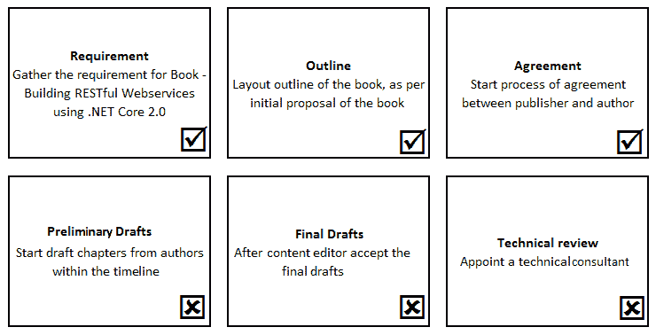

上述图表是故事板或任务板的示例；它显示了完成一本书所需的各种任务，从数据收集到技术审查。市场上有很多免费或付费的工具可用于管理这些类型的任务。

+   **场景**：通常，场景只是系统在与客户交互后失败的情况。换句话说，场景是一种详细理解和编写步骤的方式。例如，有几种情况可能导致系统登录功能失败，这些情况将被记录为场景。在软件测试中，场景也称为测试场景。一个场景通常会导致一个或多个测试。

+   **用例**：用例是一组系统与用户之间可能交互的序列集合。它也可以是一组在系统实施时应评估的可能场景集合。这些用例更加详细和文档化，并分为多个步骤，如下面的流程图所示：

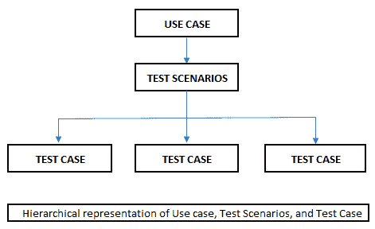

在前面的图中，很明显，“**测试用例**”是“**测试场景**”的子集，而“**用例**”是“**测试场景**”的超集。每次创建测试用例时，它都是从测试场景中下来的。

# 清单

通常，清单不过是一系列需要采取行动以实现目标的项目列表。清单可以是待办事项列表，日常活动列表，或开发者的任务列表。

在测试的世界里，列表可能包含要验证的测试用例，需要执行的测试列表等。清单因人而异，从开发者到开发者，甚至从组织到组织，但清单的目的是始终限制人类忘记某些事情的行为。

# 缺陷和错误

缺陷和错误是行业中用得最多的术语之一。在一些组织中，这些术语可以互换使用。然而，一般来说，缺陷是指执行正确但产生意外输出的东西，例如，2 + 3 = 6。另一方面，缺陷是指在规划过程中被遗漏的东西。

关于缺陷和错误的一些注意事项：

+   缺陷几乎总是由于需求的纯实现不当，例如，错误地满足基本需求的代码

+   缺陷通常在开发阶段或测试阶段被识别

+   缺陷与设计或需求差距有关，这种差距在生产过程中被客户或客户遗漏。

+   缺陷通常表明人为错误

+   在测试过程中发现缺陷时可以修复

+   缺陷可能导致系统出现故障，进而导致设计问题

# 测试方法

通常，测试方法是一个执行路径，说明了测试将如何进行。这些方法因系统而异；如果一个系统需要咨询方法，并不意味着另一个系统也是如此。不同的系统需要不同的测试方法。

测试方法是一种测试策略，它只是系统或项目的实现。

测试策略应该对每个人都很清晰，以便创建的测试可以帮助非技术团队成员（如利益相关者）了解系统是如何工作的。这些测试可以是自动化的，例如测试业务流程，也可以是用户验收测试系统上的用户可以执行的手动测试。

测试策略或方法有以下技术：

+   **主动式**：这是一种早期方法，试图在从初始测试设计中创建构建之前修复缺陷

+   **反应式**：在这种方法中，一旦编码完成就开始测试

# 测试金字塔

测试金字塔是一种策略或定义在 RESTful 服务中应该测试什么的途径。换句话说，我们可以这样说，测试金字塔帮助我们定义 RESTful 服务的测试范围。

测试金字塔的概念是由 Mike Cohn 在 2009 年开发的 ([`www.mountaingoatsoftware.com/blog/the-forgotten-layer-of-the-test-automation-pyramid`](http://www.mountaingoatsoftware.com/blog/the-forgotten-layer-of-the-test-automation-pyramid))。

测试金字塔有各种版本；不同的作者通过说明他们如何放置或优先考虑他们的测试范围来描述这一点。

下面的图表示意了 Mike Cohn 定义的相同概念：

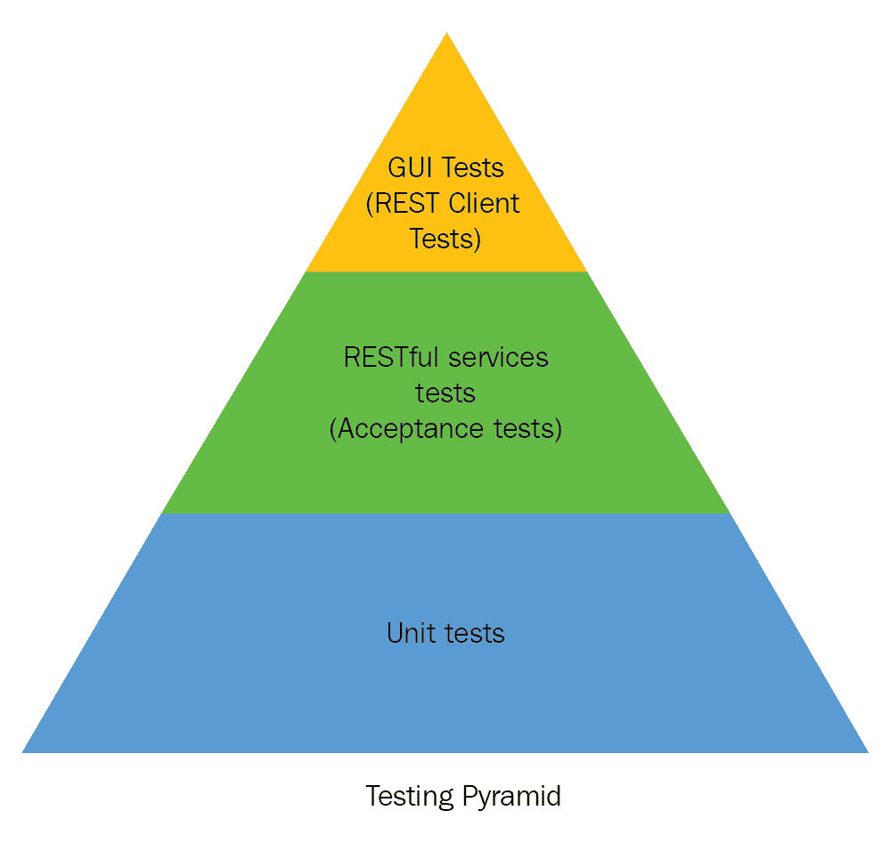

让我们详细讨论这些层。

+   **单元测试**：这些是测试在 ASP.NET Core 中开发的 RESTful 服务应用的单元中的小功能性的测试

+   **RESTful 服务测试（验收测试）**：这些是测试独立服务或与另一个服务（通常是外部服务）通信的服务的测试

+   **GUI 测试（REST 客户端测试）**：这些测试属于将消费 RESTful 服务的客户端或消费者；它们有助于测试整个系统，并具有用户界面方面的特性，是端到端测试

我们将讨论与在 ASP.NET Core 中开发的 RESTful 服务应用相关的测试。

# 测试类型

在上一节中，我们讨论了测试方法或测试策略。这些策略决定了我们将如何进行系统的测试。在本节中，我们将讨论我们应用中使用的各种测试类型。

# 测试 ASP.NET Core 控制器（单元测试）

单元测试通常是测试单个函数调用，以确保程序的最小部分得到测试。因此，这些测试旨在验证特定功能，而不考虑其他组件。在这里，测试策略派上用场，并确保系统将执行最佳的质量保证。当它与 **测试驱动开发**（**TDD**）方法结合使用时，它增加了更多的力量。

您可以通过在 [`github.com/garora/TDD-Katas`](https://github.com/garora/TDD-Katas) 上的 Katas 学习和实践 TDD。

我们将借助代码示例来讨论这一点。在继续之前，请查看以下先决条件：

+   Visual Studio 2017 更新 3 或更高版本

+   .NET Core 2.0 或更高版本

+   C# 7.0 或更高版本

+   ASP.NET Core 2.0 或更高版本

+   Entity Framework Core 2.0 或更高版本

+   xUnit 和 MS 测试

+   moq 框架

# 准备测试

在本节中，我们将创建一个 ASP.NET Core API 并对其进行单元测试。

完成以下步骤以创建您的应用程序：

1.  打开 Visual Studio。

1.  前往文件 | 新建 | 项目或按 *Ctrl* + *Shift* + *F5*：

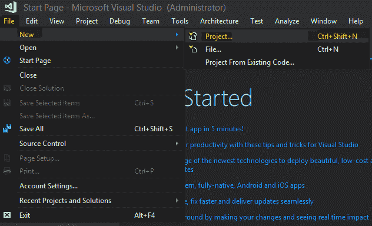

1.  选择 ASP.NET Core Web 应用程序。

1.  从模板窗口中选择 ASP.NET Core API—确保您选择了 .NET Core 2.0。

1.  为项目命名，选择解决方案的路径，然后点击确定。

1.  添加 `Core` 文件夹—在 Solution Explore 中，右键单击并选择添加新文件夹，并将其命名为 `Model`。

1.  在`Core`文件夹下添加`Interfaces`和`Model`文件夹。

1.  在`Model`文件夹下添加一个新类——在解决方案资源管理器中右键单击`Model`文件夹并选择“添加新项”。然后，选择**类**或点击*Shift* + *Alt* + *C*。

请注意，快捷键根据您对 Visual Studio 的设置而有所不同。

1.  将其命名为`Product.cs`并将以下代码添加到此类中：

```cs
namespace Chap06_01.Core.Model
{
  public class Product
  {
    public Guid Id { get; set; }
    public string Name { get; set; }
    public string Description { get; set; }
    public string Image { get; set; }
    public decimal Price { get; set; }
    public Guid CategoryId { get; set; }
    public virtual Category Category { get; set; }
  }
}
```

1.  重复*步骤 7*和*步骤 8*以添加`Category.cs`和`ProductViewModel.cs`。

1.  重复*步骤 6*并添加`Infrastructure`文件夹。

1.  在`Infrastructure`文件夹下添加一个新类——在解决方案资源管理器中右键单击`Infrastructure`文件夹，选择“添加新项”，然后选择类或点击*Shift* + *Alt* + *C*。

1.  将其命名为`ProductContext.cs`。

在这个演示项目中，我们不是遵循测试驱动开发方法；我们将仅为了演示目的对应用程序进行单元测试。

1.  现在，打开`appsettings.json`文件并添加以下代码片段：

```cs
"ConnectionStrings": 
{
  "ProductConnection": "Data Source=.;Initial
  Catalog=ProductsDB;Integrated
  Security=True;MultipleActiveResultSets=True"
}
```

1.  在解决方案资源管理器中右键单击项目，然后选择“管理 Nuget 包”。

1.  在 Nuget 包管理器屏幕下，搜索`Swashbuckle.AspNetCore`并安装它。

**Swagger**是开源的，遵循开放规范([`github.com/OAI/OpenAPI-Specification/blob/master/versions/2.0.md`](https://github.com/OAI/OpenAPI-Specification/blob/master/versions/2.0.md))。Swagger 允许您描述 API 的结构。Swagger 为用户提供文档（将要使用 API 的开发者）。有许多开源和商业工具可以与 Swagger 集成。

**Swagger CodeGen**([`swagger.io/swagger-codegen/`](https://swagger.io/swagger-codegen/))有助于为 API 生成客户端库。

**Swagger UI**([`swagger.io/swagger-ui/`](https://swagger.io/swagger-ui/))有助于生成 API 的文档。

**Swashbuckle.AspNetCore**([`github.com/domaindrivendev/Swashbuckle.AspNetCore`](https://github.com/domaindrivendev/Swashbuckle.AspNetCore))是一个帮助文档基于 ASP.NET Core 的 API 的工具。

1.  在`Core/Interfaces`下添加`interface IProductRepository`。

1.  将以下代码添加到`IProductRepository`接口中：

```cs
namespace Chap06_01.Core.Interfaces
{
  public interface IProductRepository
  {
    void Add(Product product);
    IEnumerable<Product> GetAll();
    Product GetBy(Guid id);
    void Remove(Guid id);
    void Update(Product product);
  }
}
```

请注意，对于完整的源代码，请参阅 GitHub 仓库[`github.com/PacktPublishing/Building-RESTful-Web-Services-with-DotNET-Core`](https://github.com/PacktPublishing/Building-RESTful-Web-Services-with-DotNET-Core)。

1.  在`Infrastructure`文件夹下添加`ProductRepository`类。

1.  将以下代码添加到`ProductRepository`:

```cs
namespace Chap06_01.Infrastructure
{
  public class ProductRepository : IProductRepository
  {
    private readonly ProductContext _context;
    public ProductRepository(ProductContext context)
    => _context = context;
    public IEnumerable<Product> GetAll() =>
    _context.Products.Include(c => 
    c.Category).ToList();
    public Product GetBy(Guid id) => _context.Products.
    Include(c => c.Category).FirstOrDefault(x => x.Id == id);
    public void Add(Product product)
    {
      _context.Products.Add(product);
      _context.SaveChanges();
    }
    public void Update(Product product)
    {
      _context.Update(product);
      _context.SaveChanges();
    }
    public void Remove(Guid id)
    {
      var product = GetBy(id);
      _context.Remove(product);
      _context.SaveChanges();
    }
  }
}
```

1.  打开`Startup.cs`文件并添加以下代码：

```cs
services.AddScoped<IProductRepository, ProductRepository>();
services.AddDbContext<ProductContext>
(
  o => o.UseSqlServer(Configuration.GetConnectionString
  ("ProductConnection"))
);
services.AddSwaggerGen
(
  swagger =>
  {
    swagger.SwaggerDoc("v1", new Info { Title = "Product 
    APIs", Version = "v1" });
  }
);
```

您的项目层次结构现在应该看起来像以下解决方案资源管理器截图：

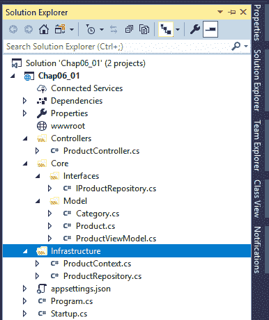

现在，您已经准备好与应用程序互动了！从菜单运行应用程序或按*F5*。在网页浏览器中，将后缀`/swagger`添加到地址栏中的 URL，如下面的截图所示：

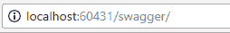

此 URL 应显示 Swagger API 文档，如下所示截图：

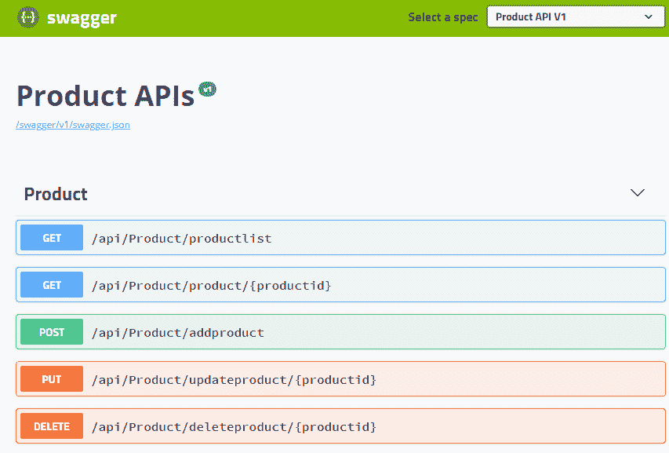

如果你点击 GET /api/Product/productlist，它应该返回产品列表，如下所示截图：

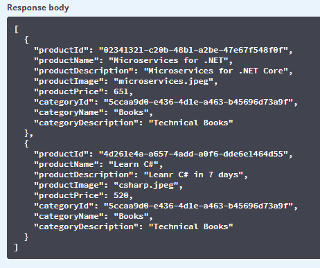

# 编写单元测试

在本节中，我们将使用 ASP.NET Core 2.0 添加一个测试项目，并使用 xUnit 编写单元测试。在我们开始编写测试之前，我们应该在我们的现有应用程序中设置一个测试项目。

为了设置我们的测试项目，以下是一些简单的步骤：

1.  在 Visual Studio 的解决方案资源管理器中，右键单击解决方案 'Chap06_01'（1 个项目），然后单击“添加”|“新建项目...”，如下所示截图：

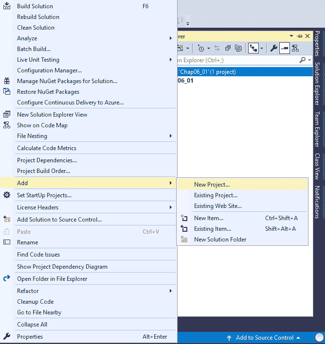

1.  从“添加新项目”模板中选择 .NET Core 和 xUnit 测试项目 (.NET Core)，并提供一个有意义的名称，例如 `Chap06_01_Test`：

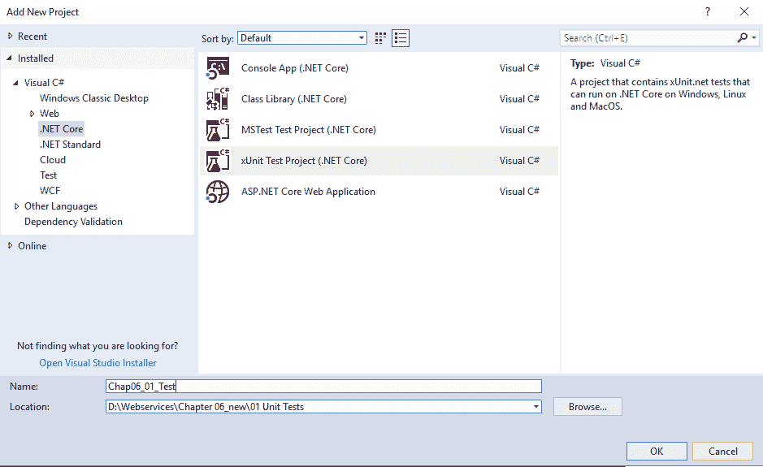

1.  添加名为 `Fake` 和 `Services` 的文件夹。（参考前一个部分，了解如何从解决方案资源管理器中添加新文件夹。）现在，你的项目结构应该看起来像以下截图：

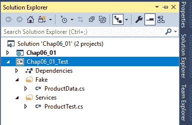

1.  `ProductData.cs` 类应该看起来如下所示：

```cs
namespace Chap06_01_Test.Fake
{
  public class ProductData
  {
    public IEnumerable<ProductViewModel> GetProducts()
    {
      var productVm = new List<ProductViewModel>
      {
        new ProductViewModel
        {
          CategoryId = Guid.NewGuid(),
          CategoryDescription = "Category Description",
          CategoryName = "Category Name",
          ProductDescription = "Product Description",
          ProductId = Guid.NewGuid(),
          ProductImage = "Image full path",
          ProductName = "Product Name",
          ProductPrice = 112M
        },
        new ProductViewModel
        {
          CategoryId = Guid.NewGuid(),
          CategoryDescription = "Category Description-01",
          CategoryName = "Category Name-01",
          ProductDescription = "Product Description-01",
          ProductId = Guid.NewGuid(),
          ProductImage = "Image full path",
          ProductName = "Product Name-01",
          ProductPrice = 12M
        }
      };
      return productVm;
    }
    public IEnumerable<Product> GetProductList()
    {
      return new List<Product>
      {
        new Product
        {
          Category = new Category(),
          CategoryId = Guid.NewGuid(),
          Description = "Product Description-01",
          Id = Guid.NewGuid(),
          Image = "image full path",
          Name = "Product Name-01",
          Price = 12M
        },
        new Product
        {
          Category = new Category(),
          CategoryId = Guid.NewGuid(),
          Description = "Product Description-02",
          Id = Guid.NewGuid(),
          Image = "image full path",
          Name = "Product Name-02",
          Price = 125M
        }
      };
    }
  }
}
```

在前面的代码片段中，我们为 `Products` 和 `ProductsViewModel` 创建了假数据。

完整代码可以从以下链接下载：[`github.com/PacktPublishing/Building-RESTful-Web-Services-with-DotNET-Core`](https://github.com/PacktPublishing/Building-RESTful-Web-Services-with-DotNET-Core)。

1.  `ProductTest.cs`，我们的单元测试类，看起来如下所示：

xUnit 的重要术语：

+   **事实（Fact）** 是一个属性，用于没有参数的正常测试方法

+   **理论（Theory）** 是一个属性，用于参数化测试方法

```cs
namespace Chap06_01_Test.Services
{
  public class ProductTests
  {
    [Fact]
    public void Get_Returns_ActionResults()
    {
      // Arrange
      var mockRepo = new Mock<IProductRepository>();
      mockRepo.Setup(repo => repo.GetAll()).Returns(new
      ProductData().GetProductList());
      var controller = new ProductController(mockRepo.Object);
      // Act
      var result = controller.GetList();
      // Assert
      var viewResult = Assert.IsType<OkObjectResult>(result);
      var model = 
      Assert.IsAssignableFrom<IEnumerable<ProductViewModel>>
      (viewResult.Value);
      Assert.NotNull(model);
      Assert.Equal(2, model.Count());
    }
  }
}
```

在前面的代码片段中，我们只是测试我们的 `ProductController`，它是一个 `Get` 资源，`GetList`。在这段代码中，我们模拟了列表；我们实际上并没有击中数据库，而是使用假数据测试我们的 `Controller` 方法。

1.  从测试资源管理器运行测试；如果你的测试通过，你应该会看到以下截图：

1.  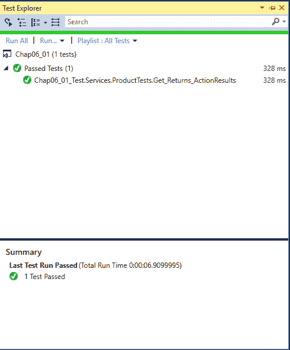

# 存根和模拟

存根是对测试期间发出的调用的预定义响应，而模拟是为了设置期望。它们可以进一步解释如下：

+   **存根（Stubs）**：在 `stubs` 对象中，我们总是得到一个有效的存根响应。响应不关心你提供了什么输入。在任何情况下，输出都将相同。

+   **模拟（Mocks）**：在 `mock` 对象中，我们可以测试或验证可以调用模拟对象的函数。这是一个验证单元测试是否失败或通过的假对象。换句话说，我们可以这样说，模拟对象只是我们实际对象的复制品。

在前面的“编写单元测试”部分中，我们使用了 moq 框架来实现模拟对象。

# 安全测试

安全是一个非常广泛的概念，不能在几行文字中解释清楚。一般来说，安全测试是一种测试应用程序是否安全或是否存在泄露他人数据的任何可能性的方法。

安全和安全的系统将在第八章 Securing RESTful Web Services 中讨论。

安全测试非常重要，尤其是在我们处理基于 Web 的应用程序时。Web 应用程序是公开可用的，容易受到攻击，因此认证和授权是这里最重要的因素。

FxCop ([`en.wikipedia.org/wiki/FxCop`](https://en.wikipedia.org/wiki/FxCop))，它是与 Visual Studio 和 VeraCode ([`www.veracode.com/`](https://www.veracode.com/)) 一起提供的，是安全测试中最受欢迎的工具之一。

# 集成测试

在单元测试中，我们测试单个代码单元，而在 Web API 的集成测试中，我们测试所有协同工作的服务（包括内部和外部服务，以及第三方组件）。应确保服务调用与外部服务集成。

# 运行测试

让我们以上一节中创建的相同应用程序进行单元测试：

1.  添加一个新的集成测试项目，并确保项目结构看起来如下截图所示：

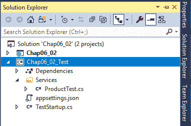

1.  在 `ProductTest.cs` 的构造函数中编写以下代码：

```cs
var server = new TestServer
(
  new WebHostBuilder()
  .UseStartup<TestStartup>()
);
_client = server.CreateClient();
```

在前面的代码块中，我们初始化了 `TestServer`，其中我们使用 `TestStartup` 作为我们的启动入口文件。最后，我们创建了一个 `WebHostBuilder()` 的 `private readonly HttpClient _client;`。

1.  然后，编写一个简单的调用产品列表资源的函数：

```cs
[Fact]
public async Task ReturnProductList()
{
  // Act
  var response = await _client.GetAsync("api/Product
  /productlist");
  response.EnsureSuccessStatusCode();
  var responseString = await response.Content.ReadAsStringAsync();
  // Assert
  Assert.NotEmpty(responseString);
}
```

在前面的代码中，我们正在消费我们的资源 `GET api/product/productlist` 并测试它是否返回预期的输出。

为了使代码运行顺畅，你需要在代码中添加 `Microsoft.AspNetCore.Hosting;` 和 `Microsoft.AspNetCore.TestHost;` 命名空间。

此测试还确保内部组件或此方法做出的任何外部服务调用按预期工作。

1.  按如下所示完成 `ProductTes.cs` 的代码：

```cs
namespace Chap06_02_Test.Services
{
  public class ProductTest
  {
    public ProductTest()
    {
      // Arrange
      var server = new TestServer(new WebHostBuilder()
      .UseStartup<TestStartup>());
      _client = server.CreateClient();
    }
    private readonly HttpClient _client;
    [Fact]
    public async Task ReturnProductList()
    {
      // Act
      var response = await
      _client.GetAsync("api/Product/productlist");
      response.EnsureSuccessStatusCode();
      var responseString = await
      response.Content.ReadAsStringAsync();
      // Assert
      Assert.NotEmpty(responseString);
    }
  }
}
```

1.  按如下所示编写 `TestStartup` 文件代码：

```cs
namespace Chap06_02_Test
{
  public class TestStartup : Startup
  {
    public TestStartup(IConfiguration configuration) : 
    base(configuration)
    {  }
    public static IConfiguration InitConfiguration()
    {
      var config = new ConfigurationBuilder()
      .AddJsonFile("appsettings.json")
      .Build();
      return config;
    }
    public override void ConfigureServices(
    IServiceCollection services)
    {
      //mock context
      services.AddDbContext<ProductContext>
      (
        o => o.UseSqlServer
        (
          InitConfiguration().GetConnectionString
          (
            "ProductConnection"
          )
        )
      );
      services.AddMvc();
      services.AddScoped<IProductRepository, 
      ProductRepository>();
    }
    public override void Configure
    (
      IApplicationBuilder app, IHostingEnvironment env
    )
    {
      app.UseStaticFiles();
      app.UseMvc();
    }
  }
}
```

在前面的代码中，我们的 `TestStartup` 类继承了 `Startup` 类，这意味着我们现在正在使用其成员和方法。

你需要将方法 `ConfigureServices` 和 `Configure` 声明为虚拟的，以便在 `TestStartup` 类中重写它们。

看一下我们的 `InitConfiguration()` 方法；此方法添加了你的测试配置文件，这样你就可以在任何其他环境中使用测试配置值。

在我们的 `TestStartup` 类中，我们重写了 `ConfigureServices` 和 `Configure` 方法，以便我们可以配置测试服务或任何专门为测试目的创建的实用工具类。

现在我们已经准备好运行我们的测试，打开测试资源管理器并运行选定的测试。您也可以从`ProductTest.cs`文件中运行测试（只需右键单击并选择运行测试）。

如果您需要调试代码，您也可以调试测试。如果您这样做，您应该得到以下结果：

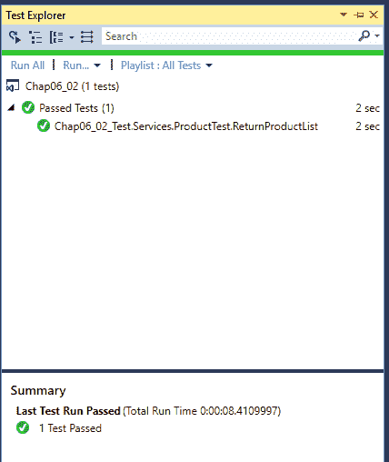

您可以编写尽可能多的测试。测试也取决于您想测试的代码。

# 模拟对象

如其名所示，模拟对象是非真实对象。模拟对象用于测试目的，包含实际代码，但并非所有真实功能。例如，我们可以创建一个模拟对象来使用 Entity Framework Core 获取数据记录；在这种情况下，我们更倾向于使用内存数据库（[`docs.microsoft.com/en-us/ef/core/miscellaneous/testing/in-memory`](https://docs.microsoft.com/en-us/ef/core/miscellaneous/testing/in-memory)）而不是直接数据库连接。

# 运行测试

让我们参考上一节中开发的单元测试应用程序。按照前面章节中提到的步骤添加一个新的 xUnit 测试项目。

我们正在寻找用于测试目的的模拟对象或数据，所以我们将不会连接到实际的数据库服务器。相反，这里我们将使用内存数据库。

您需要添加`Microsoft.EntityFrameworkCore.InMemory` NuGet 包以启动内存数据库。

我们在这里不会做任何更改，但我们将创建模拟数据和记录以进行测试。要继续，请将以下代码添加到`TestStartup.cs`文件中的`ConfigureServices`方法：

```cs
//for tests use InMemory db
services.AddDbContext<ProductContext>
(
  o => o.UseInMemoryDatabase
  (
    InitConfiguration().GetConnectionString
    (
      "ProductConnection"
    )
  )
);
```

在这里，我们使用以下内容：

+   仅用于测试目的的 InMemory 数据库，通过在`TestStartup`类中添加`.UseInMemoryDatabase`来实现。

+   对于我们的实际代码，数据库服务器在`Startup.cs`类中保持不变，即`.UseSqlServer`

现在我们需要模拟数据和记录，所以请在`TestStartup`类中添加以下方法：

```cs
private static void FakeData(DbContext context)
{
  var category = new Category
  {
    Id = ToGuid("A5DBF00D-2E29-4993-A0CA-7E861272C6DC"),
    Description = "Technical Videos",
    Name = "Videos"
  };
  context.Add(category);
  var product = new Product
  {
    Id = ToGuid("02341321-C20B-48B1-A2BE-47E67F548F0F"),
    CategoryId = category.Id,
    Description = "Microservices for .NET Core",
    Image = "microservices.jpeg",
    Name = "Microservices for .NET",
    Price = 651,
    InStock = 5
  };
  context.Add(product);
  context.SaveChanges();
}
```

然后，从`Configure(IApplicationBuilder app, IHostingEnvironment env)`方法中调用`FakeData(context)`方法，如下所示：

```cs
public override void Configure(IApplicationBuilder app, IHostingEnvironment env)
{
    var context = app.ApplicationServices.GetService<ProductContext>();
    FakeData(context);
    app.UseStaticFiles();
    app.UseMvc();
}
```

现在我们已经准备好运行测试，所以打开测试资源管理器并运行所有测试。如果测试通过，你应该会看到以下截图：

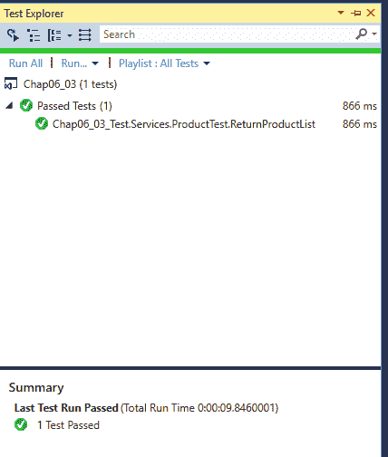

为了确保测试没有实际连接到数据库，让我们调试测试代码。打开`ProductTest.cs`类，并为以下测试设置断点：

```cs
[Fact]
public async Task ReturnProductList()
{
  // Act
  var response = await _client.GetAsync("api/Product/productlist");
  response.EnsureSuccessStatusCode();
  var responseString = await response.Content.ReadAsStringAsync();
  // Assert
  Assert.NotEmpty(responseString);
}
```

现在右键单击“调试测试”，使用单步进入（*F11*键）进入控制器和仓储，并检查实际的产品列表。您可以看到我们的测试返回的是模拟数据，这意味着它们没有连接到实际的数据库。以下是被调试代码的截图：

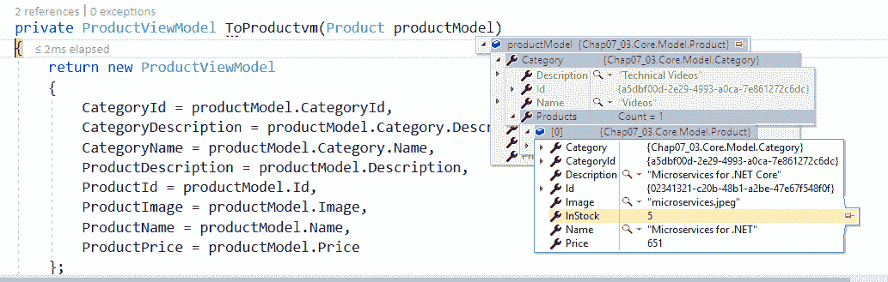

以下截图来自我们用来演示使用模拟对象进行测试的小型应用程序。在这种测试方法中，我们的模拟对象总是被击中，而不是任何实际代码。

# 使用 Postman、高级 REST 客户端等测试服务调用

有很多工具可用于测试 RESTful 网络服务和 API。这些工具提供实际输出。

当您只有 API 资源并想在不同场景中测试预期的输出，但没有实际源代码时，网络服务测试工具非常有用。

我们将使用以下两个工具测试我们的产品 API。

# Postman

**Postman**（[`www.getpostman.com/`](https://www.getpostman.com/））是测试网络服务输出时最受欢迎的工具之一。它还附带一个 Google Chrome 扩展程序：

1.  启动 Postman。如果您还没有它，可以从前面的链接安装它。

1.  选择资源类型为 GET 并输入 API 的 URL；在我们的例子中，它是 `http://localhost:60431/api/Product/productlist`。

1.  点击发送（或者，如果您需要将数据保存在文件中，您也可以点击发送并下载）。

1.  如果测试通过，你应该会看到以下截图类似的内容：

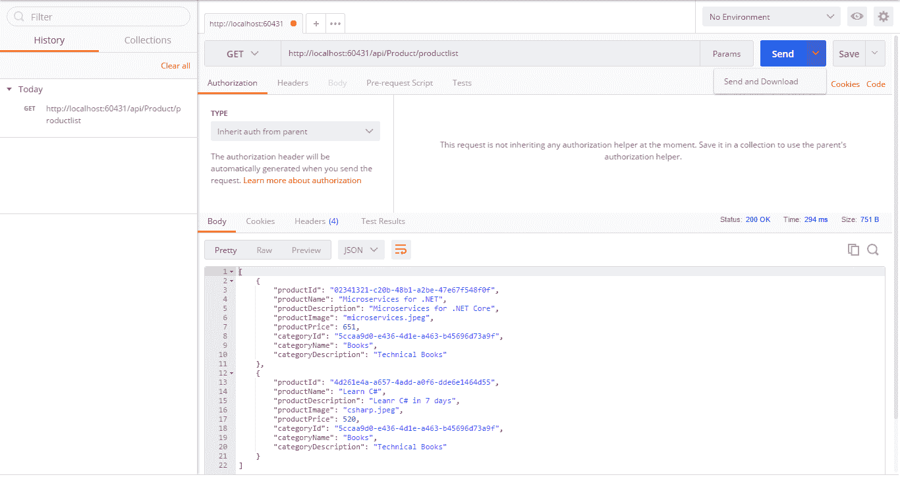

# 高级 Rest 客户端

**高级 rest 客户端**（**ARC**）是另一个流行的工具，也作为 Chrome 扩展程序提供。您可以从 Chrome 扩展程序商店安装它，或者直接从 [`install.advancedrestclient.com/`](https://install.advancedrestclient.com/) 安装：

1.  如果尚未安装，请安装 ARC 的 Chrome 扩展程序。

1.  启动 ARC。

1.  通过 GET 资源。

1.  如果测试通过，你应该会看到以下截图类似的内容：

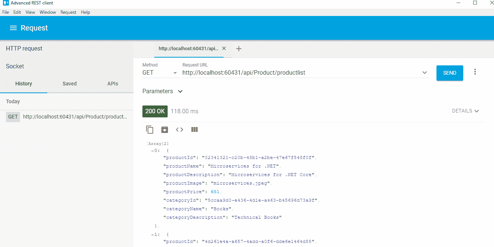

# 用户验收测试

正如其名所示，**用户验收测试**（**UAT**）是由用户执行或用户接受的测试。在这种测试方法中，可能成为应用程序最终用户的用户将直接参与测试。可能会有用户在生产环境中进行的测试场景，或者他们可能有权访问他们可以接受或拒绝的预测试结果。

这种测试取决于实际将在生产环境中使用应用程序的用户。这种测试通常在 UAT 或预生产环境中进行。

行业中典型的环境被称为开发、预发布、QA、UAT、预生产和生产。在您的组织中，您可能不会根据项目需求拥有所有这些环境；如果是这样，请参阅 [`www.guru99.com/user-acceptance-testing.html`](https://www.guru99.com/user-acceptance-testing.html)。

UAT 测试也被视为最终测试，其接受或拒绝决定告诉我们当前版本是否将被部署到生产环境中。这种测试的主要重点是业务相关的。这种测试不涉及测试代码或各种模式的实现；它只是确保所有业务规则和需求都已实现。

# 性能或负载测试

对于 Web 应用程序的性能，可伸缩性非常重要。一个应用程序可以非常安全、经过良好测试，并且使用良好的代码创建，但如果它不可伸缩，用户仍然可能会避免使用它。

我们将在第九章中详细讨论 RESTful Web 服务的扩展，*扩展 RESTful 服务（Web 服务的性能）*。

对于一个好的 API 来说，性能非常重要，因此我们需要测试并确保我们的应用程序能够处理或承受大量请求。负载测试是一种非功能性测试([`www.guru99.com/non-functional-testing.html`](https://www.guru99.com/non-functional-testing.html))，负载测试的主要目的不是验证代码或测试代码的健康状况。

这种测试的主要目的是确保基于各种指标（如可伸缩性、可靠性等）的 Web API 表现良好。

以下是一些性能测试的技术或类型：

+   **负载测试**：这种测试在特定负载的各种情况下测试系统的行为。这也包括关键交易、数据库负载、应用服务器等。

+   **压力测试**：这是一种方法，系统在回归测试中进行，以找到系统容量的上限。它还取决于系统在当前负载超过预期最大负载的关键情况下的行为。

+   **浸泡测试**：这也被称为耐久测试。在这个测试中，主要目的是监控内存利用率、内存泄漏或影响系统性能的各种因素。

+   **峰值测试**：这是一种确保系统能够承受工作负载的方法。确定性能的最佳任务之一是突然增加用户负载。

在 ASP.NET Core 中，我们可以使用以下方法进行负载测试：

+   **Visual Studio**：如果你有 Visual Studio Enterprise Edition，你可以轻松创建一个负载测试项目；更多信息，请访问以下链接：[`docs.microsoft.com/en-us/vsts/load-test`](https://docs.microsoft.com/en-us/vsts/load-test)。

+   **WebSurge**：这是一种用于 API 的负载测试工具。你可以用于云服务或免费用于学习目的。更多信息，请访问[`websurge.west-wind.com/`](http://websurge.west-wind.com/)。

+   **BenchmarkDotNet**：这个工具告诉我们代码中有多少是高效的。它测试不同代码块，这些代码块给出相同的结果，以查看哪个性能最好。更多信息，请访问 [`github.com/dotnet/BenchmarkDotNet`](https://github.com/dotnet/BenchmarkDotNet)。

+   **Netling**：这是一个针对网络应用的负载测试工具。使用 Netling，你可以修改代码并重新测试以符合你的性能规模。更多信息，请访问 [`github.com/hallatore/Netling`](https://github.com/hallatore/Netling)。

这些工具和 Visual Studio 负载测试的解释，以及工作示例，超出了本书的范围。

在本节中，我们将简单地测试我们的产品 API，以检查它们列出我们请求的产品所需的时间。

你也可以使用简单的网络客户端测试 API 的请求时间。在第十章 Building a Web Client (Consuming Web Services) 中，我们将详细讨论如何构建网络客户端。

查看我们的 `ProductTest` 类的代码，如下所示：

```cs
public class ProductTest
  {
    public ProductTest(ITestOutputHelper output)
    {
      _output = output;
    }
    private const double ExpectedRequestTime = 1000;
    private const int ApiLoad = 100;
    private const string RequestUri = 
    "http://localhost:60431/api/product/productlist";
    private readonly ITestOutputHelper _output;
    private static double RequestCallTime()
    {
      DateTime start;
      DateTime end;
      using (var client = new HttpClient())
      {
        start = DateTime.Now;
        var response = client.GetAsync(RequestUri).Result;
        end = DateTime.Now
      }
      var actual = (end - start).TotalMilliseconds;
      return actual;
    }
    [Fact]
    public void SingleCallRequestTime()
    {
      var actual = RequestCallTime();
      _output.WriteLine($"Actual time: {ExpectedRequestTime}
      millisecond. 
      Expected time: {actual} millisecond.");
      Assert.True(actual <= ExpectedRequestTime);
    }
    //code truncated
}
```

上述代码是自我解释的。我们只是在计算单个和多次请求所需的时间，并检查是否达到我们的基准。

完整的代码可以从 [`github.com/PacktPublishing/Building-RESTful-Web-Services-with-DotNET-Core`](https://github.com/PacktPublishing/Building-RESTful-Web-Services-with-DotNET-Core) 下载。

# 运行测试

要运行测试，你需要确保你的 API 正在运行，并且可以通过 URL 访问。为此，使用 CLI 完成以下步骤：

1.  打开 Visual Studio 命令提示符

1.  定位到你的 API 项目文件夹

1.  执行命令 `dotnet run`

现在，你应该会看到一个类似于以下屏幕截图的屏幕：

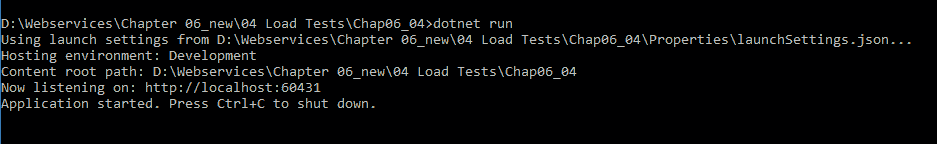

按照以下步骤使用 Visual Studio 测试资源管理器运行测试：

1.  打开 `ProductTest.cs` 文件

1.  打开测试资源管理器

1.  点击运行

这将运行所有测试；你应该会看到一个类似于以下屏幕截图的输出：

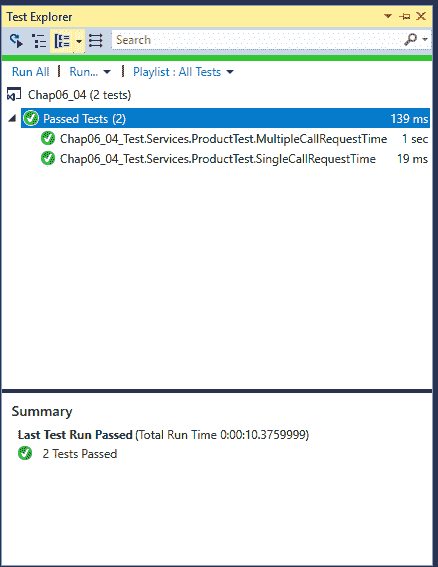

我们还可以检查单个 API 完成请求所花费的确切时间。为此，在特定 `TestCase` 结果的测试资源管理器中点击 **输出**，你应该会看到以下屏幕：

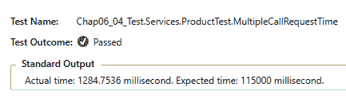

你也可以使用 CLI 运行这些测试，如下所示：

1.  打开 Visual Studio 命令提示符

1.  定位到你的 API 项目文件夹

1.  执行命令 `dotnet test`

前面的命令将运行所有测试；如果它们通过，你应该会看到一个类似于以下屏幕截图的输出：

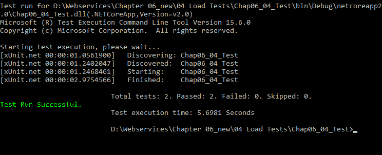

访问 [`docs.microsoft.com/en-us/dotnet/core/tools/?tabs=netcore2x`](https://docs.microsoft.com/en-us/dotnet/core/tools/?tabs=netcore2x) 检查所有可用的 CLI 命令。

在本节中，我们尝试了一个基于请求时间的简单负载测试。我们尝试了单个调用和多次调用。

# 摘要

测试有助于确保我们的代码无错误。测试也是所有希望使代码整洁和易于维护的开发者的实践。在本章中，我们涵盖了开发团队日常活动中测试范式，包括对存根和模拟的了解，以及理解集成、安全性和性能测试的重要性。

在接下来的章节中，我们将讨论安全性，包括遵循 OWASP 安全标准和 JWT 认证。我们将使用自定义过滤器和输入验证来涵盖更复杂的场景。数据保护对于任何 Web 应用来说始终是最高优先级，因此我们还将探讨敏感数据的持久化和存储。
