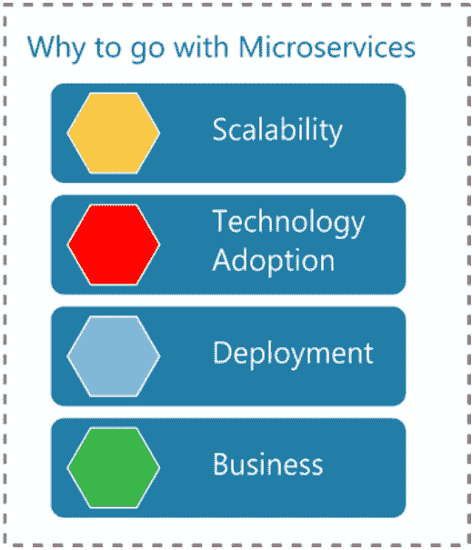
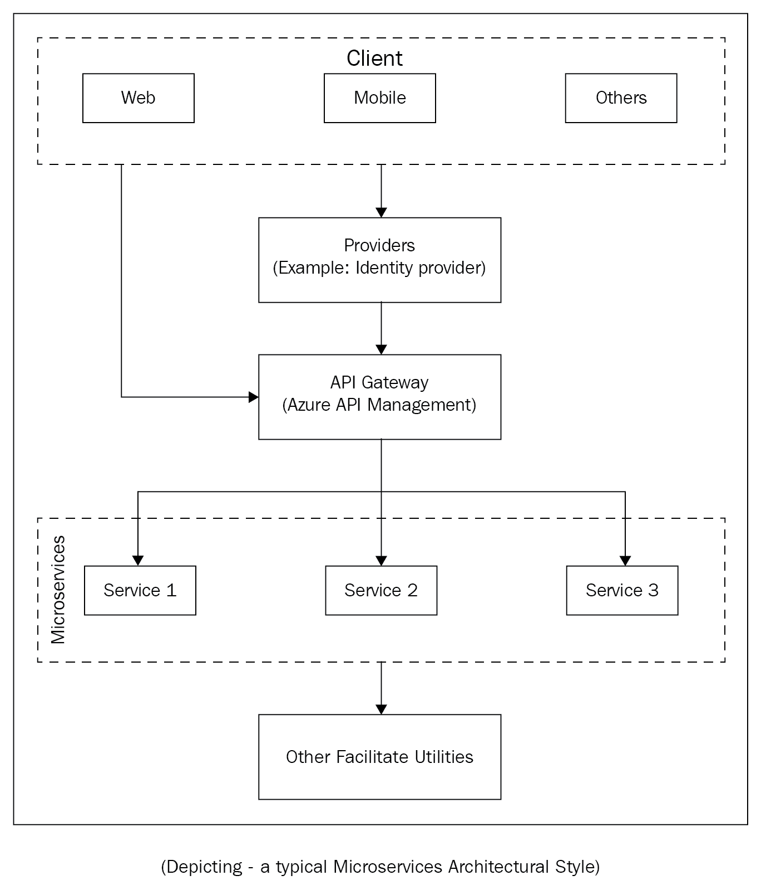

# 第十一章：微服务简介

到目前为止，我们已经通过实际操作示例学习了 RESTful API，并创建了小型应用程序。在上一章中，我们开发了一个应用程序，并讨论了 RESTful API、安全、测试、性能和部署。

本章简要介绍了微服务，这是我们在 RESTful 服务旅程中的下一站。在本章中，我们将介绍微服务的基本组件，并使用一个正在转换为微服务的单体应用程序的示例。

我们将涵盖以下主题：

+   什么是微服务？

+   微服务中的通信

+   微服务测试策略

+   可伸缩性

+   ASP.NET Core 中的微服务生态系统

# 微服务概述

简而言之，当将应用程序或模块划分为更小、独立的独立服务时，结果也被称为**微服务**。这些小部分也可以独立部署。

如果我们回顾历史，我们会发现微服务这个术语最早在 2011 年的软件架构师研讨会上被使用。2012 年 3 月，詹姆斯·刘易斯（James Lewis）提出了一些关于微服务术语的想法。到 2013 年底，IT 行业的各个群体开始讨论微服务，到 2014 年，微服务已经足够流行，被认为是大型企业的一个严肃的竞争者。

那么，微服务到底是什么呢？有各种各样的定义，因此您可以按照自己对术语的理解或可能遇到的使用案例和讨论来定义微服务。让我们看看一个官方网站上的微服务定义：（来源：[`docs.microsoft.com/en-us/azure/service-fabric/service-fabric-overview-microservices`](https://docs.microsoft.com/en-us/azure/service-fabric/service-fabric-overview-microservices)）

<q>"微服务应用程序由小型、独立版本、可伸缩且以客户为中心的服务组成，这些服务通过标准协议和定义良好的接口相互通信。"</q>

# 微服务属性

在上一节中，我们了解到微服务在系统中与其他服务完全独立，并在它们自己的进程中运行。根据这个定义，有一些属性定义了微服务与其他组件完全独立。让我们首先看看核心属性是什么：

+   **独立的功能性**：不要试图在单个微服务中实现太多功能。相反，只为一个原因设计它，并且做好这一点。这意味着设计应该尽量避免对功能其他部分的任何依赖。在我看来，这部分非常重要，因为它为其他属性奠定了基础。

+   **独立的数据和状态**：每个服务拥有自己的数据和状态。它不与其他应用程序或部分共享所有权。

+   **独立部署**：前述点的累积效应。这有助于你进行持续部署。

+   **技术采用**：当前两点得到妥善处理时，这会更容易，因为不再对任何现有模块产生影响。这里的美丽之处在于，你可以在两种不同的技术中拥有两个不同版本的微服务。这非常有益。

+   **一致性和弹性**：这必须完美无缺。如果你不能依赖服务在预期的期限内返回，或者依赖它始终可用，那么它的整个目的就失去了。

# 理解微服务架构

我们已经讨论了微服务架构是如何通过包含一组较小服务的单个应用程序来开发的一种方式。这些服务是独立的，并且在自己的进程中运行。

换句话说，我们可以这样说，微服务是一种将我们的服务分离出来的方式，这样它们就可以在设计和开发、部署和升级方面独立于彼此处理。

微服务有很多好处，如下所示：

+   **更小的代码库**：每个服务都很小，因此更容易作为一个单元进行开发和部署。

+   **独立环境的便利性**：随着服务的分离，所有开发者都可以独立工作，独立部署，没有人会担心任何模块的依赖性。

# 微服务中的通信

在处理微服务架构时，仔细考虑消息机制的选择非常重要。如果忽略了这个方面，那么它可能会损害使用微服务架构设计的整个目的。

让我们继续前进，考虑我们同步和异步消息的选择，以及不同的消息格式。

# 同步消息

当系统期望从服务中获得及时响应，并且系统会等待直到收到服务的响应时，这被称为**同步消息**。REST 是微服务架构中最受欢迎的选择之一。它简单且支持 HTTP 请求-响应，因此不需要寻找替代方案。这也是大多数微服务实现使用 HTTP（基于 API 的风格）的原因之一。

# 异步消息

当系统不需要立即从服务中获取响应，并且可以在不阻塞调用的情况下继续处理时，这被称为**异步消息**。

# 消息格式

在过去的几年里，使用 MVC 和类似技术让我对 JSON 格式产生了依赖。你也可以考虑 XML。这两种格式在 HTTP 上使用 API 风格资源时都表现良好。如果你需要使用二进制消息格式，也是可用的。我们在这里不推荐任何格式，你可以选择任何你喜欢的消息格式。

# 为什么我们应该使用微服务

已经探索了大量的模式和架构，其中一些获得了流行，而另一些则在争夺互联网流量的战斗中败下阵来。每个解决方案都有其自身的优缺点，因此对于公司来说，快速响应诸如可扩展性、高性能和易于部署等基本需求变得越来越重要。任何被发现不具备成本效益的单一方面都可能对大型企业产生负面影响，从而在盈利和非盈利企业之间造成差异。以下图表突出了选择微服务架构的优势：

正是在这里，我们看到微服务成为企业系统架构师的救星。他们可以利用这种架构风格确保他们的设计没有问题。同时，考虑这样一个事实也很重要，即这个目标是以成本效益和及时的方式实现的。

# 微服务架构是如何工作的

在前面的章节中，我们讨论了微服务架构，并试图对这个术语进行更深入的探讨。现在，您可以看到微服务架构可能的工作方式；您可以根据自己的设计方法使用任何组合。以下是一些在微服务架构工作中需要记住的要点：

+   这是面向现代时代的编程，我们应该遵循所有 SOLID 原则。它是面向对象编程（OOP）。

+   这是向其他或外部组件公开功能的最有效方式，因此任何编程语言都可以使用这些功能，而无需遵循任何用户界面或服务（如 Web 服务、API、REST 服务等）。

+   整个系统协同工作，而不是相互连接和依赖。

+   每个组件都负责其自身的功能。

+   它将代码分离。分离的代码是可重用的。

# 微服务的优势

以下是一些微服务的优势：

+   您不必投资使整个应用程序可扩展。以购物车为例，我们可以简单地负载均衡产品搜索模块和订单处理模块，同时保留使用频率较低的运营服务，如库存管理、订单取消和交货确认。

+   我们可以轻松地匹配组织的部门层级。在大企业中，不同的部门赞助产品开发，这可以是一个巨大的优势。

+   由于代码已经以不依赖于其他具有独立功能模块的代码的方式进行编写，如果做得正确，那么一个微服务中的更改影响另一个微服务的可能性非常小。

+   由于整个应用程序更像是一组相互隔离的生态系统——如果需要，我们可以一次部署一个微服务。任何单个服务的故障都不必导致整个系统崩溃。

+   你可以在一夜之间将单个微服务或一大堆微服务迁移到不同的技术，而用户甚至可能都不知道。不用说，你需要维护这些服务合同。

+   虽然不言而喻，但在此处仍需提醒注意。确保你的异步调用被正确使用，而同步调用不会真正阻塞整个信息流。合理使用数据分区。我们稍后会详细讨论这一点，所以现在不必担心。

+   在竞争激烈的世界中，如果你对新的功能请求或系统内新技术的采用反应迟缓，用户很容易迅速失去兴趣，这无疑是一个明显的优势。

# 微服务架构的先决条件

在同意采用微服务架构之后，明智的做法是确保以下先决条件已经到位：

+   随着开发周期的缩短，需求变得更加紧迫。这要求你尽可能快地部署和测试。如果只是少量服务，那么这不成问题。然而，随着服务数量的增加，这可能会很快对现有的基础设施和实践构成挑战。例如——你的质量保证和预发布环境可能不再足以测试从开发团队返回的构建数量。

+   当应用程序进入公共领域时，很快就会再次上演开发与质量保证之间的古老剧本。这次的不同之处在于，业务处于风险之中。因此，你需要准备好以自动化的方式快速响应，在需要时识别根本原因。

+   随着微服务数量的增加，你很快就需要一种方法来监控整个系统的运行状况和健康状态，以发现任何可能的瓶颈或问题。如果没有监控已部署微服务和由此产生的业务功能状态的手段，任何团队都无法采取主动部署的方法。

# 可扩展性

可扩展性是任何企业在试图满足不断增长的用户基础时面临的最大挑战之一。

可扩展性简单来说就是系统/程序处理不断增长工作的能力。换句话说，可扩展性是系统/程序扩展的能力。

系统的可扩展性是指其处理不断增加/增加的工作负载的能力。我们可以采用两种主要策略或类型来扩展我们的应用程序。

# 垂直扩展

在垂直扩展中，我们分析现有应用程序，找出由于执行时间较长而使应用程序变慢的模块部分。使代码更高效可能是一种策略，这样可以减少内存消耗。这种减少内存消耗的练习可以是针对特定模块或整个应用程序。另一方面，由于这种策略涉及明显的挑战，我们可以在不改变应用程序的情况下，向现有的 IT 基础设施添加更多资源，例如升级 RAM、添加更多磁盘驱动器等。在垂直扩展的这两条路径中，都有其有益性的极限，因为经过一段时间后，产生的效益将趋于平稳。在这里，重要的是要记住这个事实；这种扩展需要停机时间。

# 水平扩展

在水平扩展中，我们深入挖掘对整体性能影响较大的模块。我们考虑诸如高并发等因素，以使我们的应用程序能够服务更多的用户基础。我们还会实施负载均衡以处理更多的任务。向集群添加更多服务器的选项不需要停机时间，这无疑是一个优势。它可能因情况而异，因此我们需要检查额外的电力、许可证和冷却成本是否值得。

# DevOps 文化

在 DevOps 的帮助下，团队应该强调开发团队和另一个运营团队的协作。我们应该建立一个系统，让开发、Q/A 和基础设施团队协作工作。

# 自动化

基础设施设置可能是一项非常耗时的工作。在基础设施为开发者准备期间，开发者可能会闲置。在加入团队并贡献之前，他们需要等待一段时间。基础设施设置的过程不应该阻止开发者变得高效，因为这会降低整体生产力。这应该是一个自动化的过程。使用 Chef 或 PowerShell，我们可以轻松创建虚拟机，并在需要时快速增加开发者的数量。这样，我们的开发者可以从加入团队的当天开始工作。

# 测试

测试是任何应用程序的关键任务，当与微服务一起工作时，测试变得更加复杂。我们必须将我们的测试方法划分为以下几部分：

+   采用 TDD（测试驱动开发），开发者需要测试自己的代码。测试只是另一段代码，用于验证功能是否按预期工作。如果发现任何功能不符合测试代码，相应的单元测试将失败。由于已知问题所在，这种功能可以很容易地修复。为了实现这一点，我们可以利用 MSTest 或单元测试等框架。

+   Q/A 团队可以使用脚本来自动化他们的任务。他们可以通过使用 QTP 或 Selenium 框架来创建脚本。

# 部署

部署是一个巨大的挑战。为了克服这个挑战，我们可以引入持续集成（CI）。在这个过程中，我们需要设置一个 CI 服务器。随着 CI 的引入，整个过程现在已经自动化。一旦任何团队成员将代码提交到版本控制系统中，例如我们使用 TFS 或 Git，CI 过程就会启动。它确保新代码被构建，并且运行单元测试和集成测试。在两种情况下，无论是成功构建还是其他情况，团队都会被通知结果。这使得团队能够快速响应问题。

接下来，我们有持续部署。在这里，我们引入了各种环境，例如开发环境、预发布环境、Q/A 环境等。现在，一旦任何团队成员将代码提交，持续集成就会启动。它调用单元/集成测试套件，构建系统，并将其推送到我们已设置的各种环境中。这样，开发团队提供适合 Q/A 的构建的周转时间就减少了。

# ASP.NET Core 中的微服务生态系统

每当我想到 ASP.NET Core 系统中的微服务生态时，我会想到各种小型 API、异步编程、回调、事件触发等。实际上，这个生态系统要大得多，并且某种程度上更复杂。

我们已经讨论过，微服务架构风格是一种创建大型应用程序中小而独立的单元的方式。没有使用各种工具和实用程序，这是不可能实现的。

以下图表是一个典型的微服务架构风格的图示概述，它描述了不同的客户端请求到各种服务以及如何验证这些请求：

一个典型的微服务生态系统包括以下组件，你将在接下来的 ASP.NET Core 部分中了解这些组件。

# Azure Service Fabric – 微服务平台

对于任何生态系统来说，平台是一个必备的组件。它支持系统，运行顺畅，并产生预期的结果。Azure Service Fabric 是微软提供的一个平台，在微服务生态系统中非常受欢迎。它提供容器部署和编排。

官方文档可以在以下位置找到：[`docs.microsoft.com/en-us/azure/service-fabric/service-fabric-overview`](https://docs.microsoft.com/en-us/azure/service-fabric/service-fabric-overview)

"Azure Service Fabric 是一个分布式系统平台，它使得打包、部署和管理可扩展且可靠的微服务和容器变得容易。"

# 无状态和有状态服务 – 一种服务编程模型

一个健壮的服务编程模型是微服务生态系统的支柱。一个人应该知道根据他的需求应该使用哪种类型的服务模型：

+   **无状态**：服务在客户端请求之间不保留任何状态。也就是说，服务不知道，也不关心后续请求是否来自之前已经或未发起请求的客户端。当我们有外部数据存储时，这是最好的服务编程模型。我们的服务可以基于无状态服务编程模型，该模型与外部数据库存储交互并持久化数据。

+   **有状态**：服务维护一个可变的状态，积极处理或保留特定于服务任务的州数据。

# 通信 – 服务之间交换数据的方式

如果微服务都是关于服务的话，那么服务之间的通信应该是健壮的。通信是服务之间交换数据的方式。服务通过 Rest API（即 HTTP 请求/响应调用）进行通信，这些通信本质上是同步的。

当服务相互通信时，它们实际上是在交换数据，也称为服务间的消息传递。在处理微服务架构时，仔细考虑消息机制的选择非常重要。如果忽略了这个方面，那么它可能会损害使用微服务架构设计的整个目的。在单体应用程序中，这不是一个问题，因为组件的业务功能是通过函数调用调用的。另一方面，这是通过松散耦合的基于 SOAP 的 Web 服务级别消息传递发生的，其中服务主要基于 SOAP。微服务消息机制应该是简单和轻量的。

在微服务架构中，没有固定的规则来选择各种框架或协议。然而，这里有一些值得考虑的点。首先，它应该足够简单，以便在不增加系统复杂性的情况下实现。其次，它应该足够轻量，考虑到微服务架构可能会严重依赖服务间消息传递。让我们继续前进，考虑我们同步和异步消息传递的选择，以及不同的消息格式。

# 摘要

微服务架构风格提供了一些好处。它使开发变得快速且简单。它允许 DevOps（CI 和 CD）团队在地理上分离，工作顺利，同步。应用程序被划分为小的服务组件或部分，因此维护变得容易。这使得开发团队能够让业务赞助商首先选择响应哪些行业趋势。这导致了成本效益、更好的业务响应、及时的技术采用、有效的扩展和减少对人类的依赖。

在本章中，你已对典型的微服务架构风格和 ASP.NET 中的微服务生态系统有了了解。

现在，我建议你阅读以下关于微服务的文章，以提升你的技能：

+   *使用 .NET Core 2.0 构建微服务 – 第二版* 由 PACKT 出版 ([`www.packtpub.com/application-development/building-microservices-net-core-20-second-edition`](https://www.packtpub.com/application-development/building-microservices-net-core-20-second-edition))

+   *微服务模式和最佳实践* 由 PACKT 出版 ([`www.packtpub.com/application-development/microservice-patterns-and-best-practices`](https://www.packtpub.com/application-development/microservice-patterns-and-best-practices))
