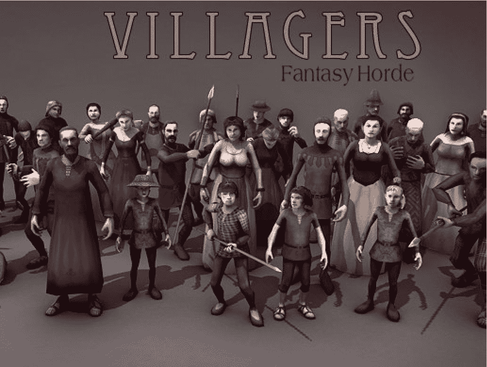

# 第二章：规划游戏

在上一章中，你得到了 RPG 的良好概述和历史背景，也许这也激发了你想象力。在本章中，我们将开始为我们自己的 RPG 打下基础。我们将从定义我们游戏的故事、情节和使游戏可玩性的任务开始。我们将查看创建我们的环境、角色所需的资产，最后，我们将设计关卡。

以下是我们将在本章中讨论的主题概述：

+   构建我们的 RPG

+   Zazar 王朝的故事

+   资产清单

+   关卡设计

+   苏醒

+   测试关卡

+   创建主菜单

激发你的创造力，让你的想象力自由驰骋！

# 构建我们的 RPG

正如所讨论的，构建一款角色扮演游戏并非易事，但一旦你踏上这条路，你就会意识到它并不像最初看起来那么困难。关键是开始行动，随着你将想法写在纸上并开始设计过程，越来越多的想法将变得清晰。

正如我们所学的，我们需要为我们的 RPG 建立一些关键元素。让我们回顾一下，也许在过程中还可以对它们进行微调。

我们游戏的关键元素如下：

+   故事和设定

+   探索和任务

+   项和库存

+   角色动作和能力

+   经验和等级

+   战斗系统

+   用户界面

# Zazar 王朝的故事

大多数角色扮演游戏的基本前提是让玩家拯救世界。随着故事的发展，常常会有意想不到的转折，比如出现疏远的亲戚，或者敌人变成朋友，反之亦然。我们将基于这样的故事创建我们的故事和游戏。

# 前传

从前，有一个伟大的王国，由伟大的国王 Zazar 统治。王国的统治者对他的臣民慷慨大方。在 Zazar 的统治下，王国和平繁荣；然而，随着时间的推移，内部的家族争斗和斗争在维持王国完整性的强大纽带中造成了裂痕。

由于神秘事件，伟大的国王决定将他的家人从王国中搬走，并信任他的儿子——将成为玩家角色——以及他信任的一位智慧长者。王国从此不再相同...直到现在！

# 探索和任务

现在我们已经定义了游戏的环境，我们可以开始进一步发展故事，并将其分解为不同的关卡。为了简单起见，我们将专注于基本的任务和关卡设计；重要的是要理解这些概念并将它们应用到自己的故事中。

# 苏醒

游戏将从让玩家沉浸在我们英雄被长者抚养和训练的环境中开始，这位长者是伟大的国王 Zazar 所信任的。

本关的主要目标将是让玩家与环境互动，学习如何与周围环境互动，如下所示：

+   **目标**：

    +   向玩家介绍用户界面

    +   移动角色

    +   与非玩家角色互动

    +   与环境互动

+   **结果**:

    +   玩家通过完成游戏任务获得积分

    +   玩家获得他的第一件武器

    +   玩家学习如何与周围世界互动

+   **总体草图**:


# 村庄

我们的英雄开始了他的自我实现之旅。他将旅行在王国的外围，到达一个被邪恶领主沙基尔雇佣的暴徒和雇佣兵恐吓过的村庄。

我们的英雄，他自己并不知道他是谁以及他为什么在这个旅程上，将会了解到自从他父亲离开以来一直在进行的节俭。这主要将通过与村民的互动来完成。

这个级别的首要目标将是让玩家学习社交技能，与村民互动，并建立关系。

有传言说村子里有间谍，每个人都互相怀疑，曾经是村庄力量的团结正在瓦解。我们角色的目标现在如下：

+   **目标**(**s**):

    +   与村民互动以获得社交技能

    +   在英雄和村民之间建立信任

    +   在村民中寻找间谍是谁

+   **结果**:

    +   提高社交技能

    +   可以在以后某个时刻利用的关系

    +   学到了基本的战斗技能

+   **总体草图**:


# 破碎的森林——地平线

我们的英雄将沿着他的任务之旅前往地平线。地平线是首次接触主要王国的边界，那里主要城堡和内城都在可触及范围内。

这基本上是一个广阔、茂密的森林，保护着王国的主体免受外界威胁。它也为那些未经世事的过客准备了一些秘密和惊喜。森林是野蛮人居住的地方，他们在周围地区制造混乱。当时不明显的是野蛮人和王国当前领主之间的联系。

就英雄而言，他或她需要能够安全地穿过森林。

地平线将为英雄带来几个意想不到的惊喜。任务的结局将严重依赖于玩家与周围环境以及非玩家角色的互动方式。

现在，我们英雄的目标如下：

+   **目标**(**s**):

    +   穿过森林而不被杀死

+   **结果**(**s**):

    +   英雄可以被野蛮人俘虏

    +   英雄可能会面临其他生命威胁的场景和/或非玩家角色

    +   英雄成功穿过森林并准备好迎接下一个挑战

    +   英雄建立新的关系以增强他的技能和能力

+   **总体草图**:


# 王国

英雄已经完成了之前的任务，现在准备好击败邪恶的领主并夺回他应得的一切。在整个任务中，我们的英雄已经进步并获得了大量的技能和能力，现在他将承担游戏中最困难、最史诗般的战斗之一。

我们的英雄被领主的庞大军队惊呆了。他需要想出一个办法穿过城市进入主城堡以击败敌人。他的目标如下：

+   **目标**(**s**)：

    +   杀死领主并夺回他的王国

+   **结果**(**s**)：

    +   在游戏过程中建立的关系中发出行动号召

    +   使用他的谈判技巧和智慧来欺骗更强大的敌人

    +   消灭敌人

+   **一般草图**：


啊，击败你的宿敌并接管你的王国是多么纯粹的快乐！

# 资产清单

现在是讨论我们 RPG 开发所需的一些基本资产的好时机。我们的游戏资产由我们为游戏描述的场景定义。对于我们的 RPG，我们已经描述了四个独特的场景。每个场景都描述得足够详细，让我们能够了解我们需要哪些类型的资产。

# 环境资产

我们游戏的主题将是中世纪。有几种方法可以做到这一点。首选的第一种方法是自己或与队友一起创建环境模型；第二种是找到第三方创建的免费模型；第三种是购买第三方创建的 3D 模型。

如果您没有能力创建自己的 3D 模型，**资产商店**是您开始寻找优质内容的好地方。您可以使用资产商店搜索可用于游戏的具有中世纪主题的环境。

我最喜欢的之一叫做 *Medieval Environment Pack*。您可能还想考虑搜索一些您喜欢的更多类似资源。

以下是一些您在环境资产中需要考虑的事项：

+   建筑

+   配件和附加功能：

    +   旗帜

    +   木桶

    +   窗户

    +   盒子

    +   四轮马车

+   岩石/植物/树木

+   粒子资产：

    +   火

    +   雾

    +   烟雾

    +   水

+   天空盒

这个列表只是一个起点，但它是您环境资产的一个起点。

我正在使用以下环境资产作为本书的演示，但您完全可以选择任何其他您想要的套餐。

# Medieval Environment Pack

如果您认真想要制作一款具有高质量图形的 RPG，这是一个非常好的套餐。它非常全面，非常适合满足您对中世纪或幻想场景的环境需求。

该套餐包括以下内容：

+   70 个模块化建筑

+   180 个附加组件 – 小屋、木桶、手推车等等

+   25 种岩石形态

+   粒子

+   纹理

它有点贵，但如果您没有 3D 建模的资源，那么它物有所值。这个套餐非常推荐。如果您正在制作桌面或控制台 RPG，那么它非常棒，但不适合移动游戏。

请查看以下截图：


中世纪环境资产

# 地形工具包 2017

此工具包是 Unity 中地形生成的优秀实用工具。它来自 2009 年 Unity 夏日代码，由 Sándor Moldán 制作。工具包已升级，可在 Unity 5.x 及以上版本中使用。它是原始工具（V1.0.2）的增强。如果您一直在跟随本书的第一版，您还会注意到工具的实际用户界面有重大改进。以下截图显示了地形工具包资产：


地形工具包资产

# 自然入门包 2

自然入门包 2 是一个包含与内置树生成器兼容的树木和灌木的出色资产。这使您能够生成各种新的变体！该包包含以下内容：

+   六棵灌木

+   四棵树

+   地面纹理

+   草地纹理

+   天空盒

以下截图展示了如果您使用此资产，您的游戏自然环境的样貌：


自然入门包 2 资产

# 角色资产

角色扮演游戏（RPGs）高度依赖于角色。因此，下一个重要的游戏资产将是角色本身。您需要为游戏定义的模型与您的剧情和设定密切相关。资产商店提供了丰富的角色模型，您可以下载并用作您游戏概念验证。

对于我们的游戏，以下是需要的角色：

+   人类：这些将代表英雄以及村民和其他非玩家角色类型的人类

+   巴比伦人：这些是英雄在游戏过程中必须面对的一些角色

+   兽人：这些是它们自己的动物

您可以选择免费模型或付费模型来代表您的角色。我们将在未来的章节中更深入地探讨角色资产。

我一直在与一个名为 Polygon 的创作者合作，为书中演示将使用的特定模型工作。这些是很好的角色，可以帮助您开始。您可以在资产商店中查看它们。

# 巴比伦人

巴比伦包包含 15 种独特的纹理。每个模型从 1,700 到 3,000 个三角形（无装备到全装备），包含超过 20 个动画。它们是 Mecanim 就绪的，并包括面部绑定。您可以在以下截图看到一些巴比伦人的示例：


巴比伦资产

# 兽人

兽人包包含独特的模型、配件、盔甲和武器。每个模型从 1,600 到 2,500 个三角形（无装备到全装备），包含 28 个动画。它也适用于 Mecanim。请查看以下截图：


兽人资产

# 村民

此包提供了一群可供使用的中世纪人类。非常适合填充物和非玩家角色。它们可以被用来在英雄进展故事中整合。它们的总多边形计数从 1,500 到 2,000（无装备到全装备），并且是带有 20 个动画的全装角色。请参阅以下截图：



村民资产

# 免费资产

最后，你还有能力从资产商店获取大量免费资产。其中一些质量确实很好。然而，如果你正在寻找特定类型的资产，你可能需要花一点钱：


顶级免费包

# 关卡设计

现在我们已经将游戏故事写在纸上，并且有了我们想要实现的想法，是时候将我们的技能应用到实际制作中去了。

由于本书的目标读者已经熟悉 Unity 的基础知识，因此我们不会涵盖软件的基本方面。

要开始，我们需要启动 Unity。我使用的是 Unity 2017.x Pro 的 64 位版本。你不需要拥有 Unity 的 Pro 版本来完成本书中的项目。请参阅以下截图：


选择你想要的地点和项目名称，然后点击创建项目按钮。此时，Unity 将为你创建一个空项目并显示 Unity IDE。它应该看起来像以下截图：


新项目

为了提高图像质量，请从[`www.packtpub.com/sites/default/files/downloads/BuildinganRPGwithUnity2018_ColorImages.pdf`](https://www.packtpub.com/sites/default/files/downloads/BuildinganRPGwithUnity2018_ColorImages.pdf)下载图形包。

你的视图可能略有不同，这取决于你如何配置你的 Unity 布局。如果你是第一次启动 Unity，你需要熟悉基础知识，因为我们不会在本书中涵盖它们。

注意：如果你之前没有使用过 Unity，你应该在继续阅读之前熟悉 IDE。

# 准备阶段

我们首先想做的事情是为我们的第一个关卡创建一个景观，这个关卡被称为*觉醒*。

Unity 本身有一些创建地形的良好工具，但说实话，这不是实现游戏中的漂亮、美丽地形的一种实用方法。为此，我们将使用另一套工具，称为 Terrain Toolkit 2009，这是由*Sánder*作为*Unity Summer of Code 2009*的一部分开发的。

工具包可在资产商店中找到：

[`www.assetstore.unity3d.com/en/#!/content/83490`](https://www.assetstore.unity3d.com/en/#!/content/83490).

我还把库作为本书提供的下载的一部分包含在内，以防原始链接在未来被弃用。

一旦你从资源商店下载了资产，你需要将其导入到项目中。如果你还没有这样做，只需点击导入按钮开始导入包：


在这一点上，让我们花点时间回到 Unity 中，实际上创建一个`Terrain`游戏对象，并查看地形修改的内置工具。要创建地形，你需要从主菜单中选择以下选项：游戏对象 | 3D 对象 | 地形。这将创建一个默认的地形在你的场景中，应该看起来像以下这样：


地形演示

当你在层次窗口中选择*地形游戏对象*时，你会看到*检查器*窗口显示通过设计器可访问的*地形游戏对象*的属性和组件。正如你所看到的，有很多属性你可以修改，通过这样做可以创建一个看起来很不错的地形。当你开始尝试使用地形工具时，你很快就会意识到它对于大型地形模型来说并不实用，对于自然外观的地形来说也是如此。

为了增强我们的地形生成，我们将使用**Terrain Toolkit 2017**。如果你还没有这样做，你需要将包导入到项目中。如果你还没有从资源商店下载该包，请继续下载，然后将其导入到项目中。

有时候当你导入较旧的 Unity 资源时，Unity 会提示你自动升级到最新版本。这通常是可以接受的，所以只需接受它，让 Unity 做它需要做的事情。

当 Unity 导入 Terrain Toolkit 2017 时，你会在项目窗口下注意到一个新的文件夹，名为 TerrainToolkit。如果你想要对其做任何修改，所有代码都将列在该文件夹下。还有一个`readme`文件，你可以用它来开始。请参见以下截图：


你还会注意到，在组件菜单下添加了一个新的**Unity 编辑器**功能，名为地形 | 地形工具包。要应用地形工具包到现有的地形上，你只需要选择该选项，它将自动为你将正确的组件附加到地形游戏对象：


如果你已经使用过较旧的地形工具包版本，你会立即看到用户界面上有显著的改进。

你会注意到一些现在通过地形工具包可以使用的选项，用于生成更自然和逼真的地形。你应该花时间熟悉每个属性，并尝试不同的值，以了解它们如何影响地形生成算法。

新的工具包预定义了可以用于快速开始的地形模型。以下是可以用的模型列表：

+   沙漠高原

+   沙漠沙丘

+   海岸

+   雪山

+   潘帕

+   肉体之路

我将让您自己尝试它们，并亲自看到结果。一个提示是，将您的`地形`属性从原始值调整一点，以获得更好的视觉效果。

# 地形工具包概述

工具包中为地形创建提供了一些预定义的生成器。它们是 Voronoi、分形和 Perlin。以下是对每个的简要说明：

+   **Voronoi**：这使用 Voronoi 图创建一系列山峰状峰顶的任意高度轮廓，并将其应用于地形抗议。

+   **分形**：这产生了一个云或等离子体分形计算的任意高度轮廓，并将其应用于地形抗议。

+   **Perlin**：这生成一个不规则的 Perlin 噪声高度轮廓，并将其应用于地形抗议。

在地形生成之后，还可以应用两种过滤器类型。这些是**平滑**和**归一化**过滤器，如下所示：

+   **平滑**：这是一个通道，它多次对地形抗议应用平滑处理，跨越多个重点。

+   **归一化**：这是一个标准化领土抗议的通道，通过将当前景观高度指南中最惊人的点设置为最大值，最小点设置为基准值。其他所有点都添加在最大值和最小值之间。

下一步是对地形应用一些侵蚀。工具包中内置了三种侵蚀类型：**热侵蚀**、**水力侵蚀**和**潮汐侵蚀**。您可以通过画笔或实际的侵蚀过滤器来应用这些侵蚀类型：

+   **热侵蚀**：这从倾斜度大于基准倾斜度的地区移除材料，并将其存储在斜坡下方。这倾向于使地形的斜坡变得平滑和笔直。

+   **水力侵蚀**：这从倾斜度小于最大倾斜度的区域移除材料，并将其存储在斜坡下方。这倾向于使地形的斜坡变得更加陡峭，并进一步平滑和笔直其他区域。

注意：有三种不同的水力侵蚀类型。

+   **潮汐侵蚀**：这将在选定的海平面处应用平滑处理，除了那些倾斜度超过给定值的地区。这模拟了波浪在海岸线周围的侵蚀活动，并形成海岸线。

最后一步是应用纹理。这将使我们的地形在运行时具有更真实的外观和感觉。工具包提供了程序化地形纹理，它自动使用地形的坡度和高度属性来确定将使用哪种纹理。

# 苏醒

我们第一级的设置和氛围将位于森林中的一个隐蔽区域。我们现在将使用上一节中讨论的“地形工具包”来生成我们的地形。

让我们创建一个新的场景，并将其命名为觉醒。默认情况下，场景将只定义一个相机和一个方向光游戏对象。

您可以在资产文件夹内保存您的场景和资产，无需过多思考。然而，通常有一个文件结构是很好的主意，这样可以使您的资产组织更简单，以及更快地找到它们。

一个首选的文件夹结构将包括场景、预制件、纹理、音频和模型。在每个文件夹内，您可以根据自己的组织需求创建子文件夹等。

现在我们准备将地形游戏对象添加到场景中。前往 GameObject | 3D Object | Terrain。这将在地形中放置一个地形游戏对象。在层次窗口中双击地形游戏对象，使其成为场景视图的中心。

默认情况下，`Terrain`对象将非常大，所以在我们做其他任何事情之前，让我们先做一些调整。以下截图显示了如何访问设置：


要调整地形大小，请选择设置图标，如图中所示。这将显示地形的基本属性。正如您所看到的，有许多属性可以调整以使其符合您的喜好。我们主要关注地形的尺寸以及地形可以升高的最大高度。因此，向下滚动直到到达分辨率部分。

将地形宽度和地形长度更改为 100。将地形高度更改为 333。这将改变尺寸，以便我们可以轻松处理场景。我们原始的地形大小非常大，设计它将花费我们很长时间。

现在我们有一个合适大小的地形。假设您已经导入了地形工具包，请前往主菜单中的 Component | Terrain | Terrain Toolkit。

我们有两种方法可以处理这个问题。由于新的工具包为我们提供了一些预构建的地形模型设置，我们可以使用这些设置快速生成随机地形，或者我们可以使用默认方法生成我们自己的自定义地形。

# 使用地形模型

选择地形游戏对象，并使用检查器窗口进入地形工具包，选择地形模型标签，如图所示：


如您所见，我们有六个预配置的地形模型可以使用。让我们尝试使用 SNOWY MOUNTS 模型。点击它，Unity 将开始生成模型。

这就是我的地形模型看起来像：


看起来相当酷。现在让我们尝试使用自定义函数创建地形。

# 使用自定义工具包

使用工具包生成随机地形时，我使用了 Delta 为`0.4`和 Blend 为`0.445`的分形地形生成器功能。这将生成一个看起来很漂亮的地形，山丘和山谷的比例很好。由于地形是随机生成的，你的可能不会完全像我的一样，但应该看起来类似以下截图：


我通常在生成地形后应用平滑过滤器，使事物看起来更加美观。

你一旦应用了过滤器，就会看到它带来的差异。让我们继续，现在应用一些纹理让它看起来更漂亮。在地形工具包中选择纹理选项卡，你将有多项选择。我们希望至少应用两种纹理，以使地形看起来更逼真。如果你选择的话，可以应用多达四种纹理！点击添加纹理按钮两次以创建纹理占位符。

由于我使用了地形模型来生成原始地形，然后应用了提到的工具包设置，模型的默认纹理已经就位。你可以根据需要更新它们。

看看下面的截图：


在图形学，尤其是游戏中，纹理非常重要。你的纹理越好、分辨率越高，你的场景看起来就越好。然而，这是一个两难的问题。通常，更高分辨率的纹理会占用更多资源。因此，你必须为你的游戏找到合适的平衡点。

现在是停下来讨论 Unity 主要优势之一的好时机：**资产商店**。资产商店是一个优秀的在线社区，Unity 开发者可以在这里获取用于游戏的资产，或者开发其他开发者将使用的资产。你可以从资产商店免费获取资产，或者花一点钱购买更高品质的资产。

对于我们的游戏，我将使用一些免费资产和一些付费资产。如果你想使用我在书中使用的相同资产，你需要购买它们。

看看下面的截图：


生成的地形样本

我接下来要做的事情是在地面上找到一个位置，我将在这里创建必要的场景对象以进行关卡演出。对于这个特定的场景，我想使用一个代表森林中古老小屋的资产，英雄将在游戏开始时在这里醒来。看看下面的截图：


这是一个来自中世纪环境包的模型。这个模型没有内部结构。这没关系，因为我没有计划在结构内部进行任何游戏玩法。它将被用作场景中的一个引人注目的对象和参考点。

你可以使用地形工具在将对象放入场景之前对地形进行平整。如果你注意到，我们的地形没有任何可以适当放置小屋的水平区域。我们将需要使用地形对象的地面组件进行一些更改，如下面的截图所示：


再次，在“层次结构”视图中选择地形 GameObject，并使用“检查器”窗口选择“绘制高度”选项卡，如图中所示（1），以启用该功能。

这是一个在特定点采样地形高度并使用画笔将相同高度应用到任何其他区域的好功能。这将使地形达到采样的高度。如果这些物品需要位于平坦的地面上，如房屋或避难所，这是一种快速平整区域并放置物品的绝佳方式。

下一步是在我们的地面上放置一些树木模型，以创建森林的外观和感觉。为了实现这一点，我们需要在场景中选择地形对象，并使用检查器窗口选择“树木放置”功能。然后您需要选择“编辑树木...”按钮来添加一个树木模型，如图所示：


使用检查器窗口，您需要选择“树木放置”选项卡，选择“编辑树木... 添加树木”功能，定位一个树木预制件，然后您就完成了！

看看设置，并将画笔大小调整到满足您的需求。在我的情况下，我将其调整为 40。我将其他属性保留在默认值，但您可以根据需要更改它们。

现在，当您在场景视图中移动鼠标时，您会注意到一个像画笔一样的突出显示。这就是在设计时树木将被放置的位置。

以下截图显示了我在调整了树木和建筑物的位置后，场景看起来是怎样的：


下一步是填充关卡以包含其他环境资产，如岩石、植被和其他道具，使关卡生动起来。这里的想法是使其既有趣又实用。有一个关卡设计的草图是个好主意。这样，你可以有一个很好的想法，了解你将如何开发你的关卡。

请记住，这也可以作为与您的团队、关卡设计师和艺术家沟通的一种方式，为他们提供方向。以下图是我们要设计的关卡设计的俯视图：


墓地

我现在将根据我已有的布局来构建我的关卡。现在是时候发挥创意，运用你的想象力来设计你的关卡了。这个练习的部分是自由形式的；你是设计师，所以你将决定如何放置和创建你的关卡，只要它符合要求。

请记住以下重要的一点：玩家将在指定的兴趣点与环境或非玩家角色互动。确保在设计关卡时，他们能够轻松访问他们需要到达的区域，以便他们可以执行给定的任务。

看看下面的截图：


关卡设计

需要注意的一点是，我们在这里定义的地形限制。当玩家走到地形边缘时，他们会掉下去！是的，他们会永远自由落体！我们不希望这种情况发生。我们需要在关卡设计中加入一些边界，以防止玩家越界，基本上。

在这种情况下创建一些限制和边界非常简单。我们可以使用木栅栏，或者我们可以使用实际的环境来限制玩家对关卡中危险区域的访问。如果你的关卡很大，这种方法可能会非常耗时。

解决这个问题的另一种方法是创建四个碰撞器，这些碰撞器将用于地形的每一侧。这些碰撞器将附加到一个空 GameObject 上，并在接触时阻止玩家前进。这是一个简单的方法，放置在场景中所需的时间会更少。

接下来，通过选择 GameObject | 创建空对象来创建一个空 GameObject。使用检查器窗口，调整 *Transform* 组件将 *位置* 设置为 `<100,50,100>`。接下来，我们需要为新建的 GameObject 添加组件。使用添加组件按钮选择 Physics | 箱体碰撞器。这将添加一个箱体碰撞器，现在我们可以使用检查器窗口更改碰撞器的 *大小*，设置为 `<200,50,1>`。

一旦你对外观和感觉满意，你需要复制它并将其放置在所有侧面边缘，以防止玩家掉落，如图所示：


关卡设计

# 天空盒

由于我们已经有了初步的关卡设计，我们可以继续添加另一个不错的细节。让我们使用天空盒来给游戏玩法带来更逼真的大气效果。

和往常一样，你可以使用资产商店搜索现有的天空盒。搜索你喜欢的天空盒并将其导入到你的项目中。

在层次结构窗口中，选择 *主摄像机* 并使用添加组件按钮将天空盒组件附加到摄像机：渲染 | 天空盒。将天空盒材质分配给 *自定义天空盒* 属性。查看以下截图：


添加天空盒

是时候进行测试运行了。我们可以使用标准资产中提供的第三人称角色控制器，快速放置我们的角色占位符并在关卡中四处游走，以获得对关卡的感觉。

# 测试关卡

在某个时候，你可能想要测试关卡并从摄像机的视角查看。我们可以使用标准资产中的内置第三人称角色控制器，快速在关卡中走一圈。

如果你创建项目时没有导入标准资产，你需要通过选择资产然后选择导入包 | 角色，来导入它们。

在您的项目窗口中，您将看到一个名为 Standard Assets 的文件夹；有一个名为 Character Controllers 的子文件夹。您需要选择 3rd Person Controller Prefab 并将其拖放到当前场景的某个位置。一个不错的选择是在小屋旁边。确保第三人称控制器（3rdPC）在地面之上，以免掉落！

您需要将 Rigidbody 组件附加到 3rdPC GameObject 上。这是确保我们的**玩家角色**（PC）使用内置的物理进行碰撞检测所必需的。

在您运行关卡之前，让我们确保相机正在跟随角色。只需将主相机设置为`ThirdPersonController`的子对象，并调整相机的方向，使其看起来像以下这样：


标准角色控制器

现在运行关卡并遍历场景。测试并确保当你在环境中导航时，PC 的行为符合预期。确保角色尊重所有碰撞体，并且在设计部分没有小错误。

# 创建主菜单

现在是创建游戏起点的好时机。保存当前场景。我们将创建一个新的场景，该场景将用作游戏起点。要创建新场景，您需要选择文件 | 新场景。保存场景。我给我的场景命名为 MainMenu。

现在我们有一个清晰的画布，我们可以用它来创建我们的主菜单。在层次结构窗口中右键单击，选择 UI | 面板。这将创建一个 Canvas GameObject 和一个 EventSystem GameObject，并将它们放置在层次结构窗口中。你会注意到**面板**UI 对象是画布的子对象。所有 UI 元素都将是一个画布的子对象。你的层次结构应该看起来像以下截图：


我们想要确保设置正确的一些关键方面。这些主要是在 Canvas GameObject 上。选择 Canvas GameObject 并查看检查器窗口。

对于这个特定的画布，请确保将**渲染模式**设置为**屏幕空间 - 叠加**。接下来需要检查的属性是 UI 缩放模式。将其更改为**与屏幕大小缩放**。这将确保 UI 始终缩放以适应运行游戏的设备的屏幕大小。

为了获得最佳效果，您可能需要为不同类型的设备创建多个菜单。

现在，让我们创建一个按钮，它将基本加载我们的**觉醒**关卡。

在层次结构窗口中右键单击面板对象，选择 UI | 按钮。这将在一个按钮上放置画布，作为`Panel`对象的子对象。在构建用户界面时，考虑父子关系非常重要。当你将 UI 元素作为另一个 UI 元素的子元素放置时，子元素将根据父元素的缩放和位置进行缩放和移动。


你可以在《游戏编程入门：使用 C#和 Unity 3D》的第五章 5，“游戏大师和游戏机制”中了解更多关于 UI 开发的内容。最终，我们希望有一个类似于前一张截图的主菜单。

我们将在未来的章节中花费时间微调我们的菜单。将按钮的标题更改为`开始游戏`。将场景对象适当地命名也是一个好主意，以保持事情整洁有序。我已经将按钮的名称更改为`butStartGame`。这可以通过在层次结构窗口中选择`Button`对象并在检查器窗口中更改名称来完成。

# 创建 GameMaster 脚本

如同在第一章 1“什么是 RPG？”中讨论的那样，我们需要一种管理游戏的方式。我们将创建一个名为 GameMaster 的脚本。这将是我们游戏的基石，将一切粘合在一起。随着我们继续阅读本书，你将看到我们将如何修改核心以适应我们的需求。

现在，我们只是创建一个简单的 C#脚本，并将其命名为`GameMaster.cs`。然后我们将创建用于处理我们想要在此阶段执行的一些基本事件的代码，即从一个场景导航到另一个场景。

在你的项目窗口中，在`scripts`文件夹下，右键单击并选择创建 | C# 脚本。将其命名为`GameMaster.cs`。双击你的脚本以启动代码编辑器，并将以下代码放入其中：

```cs
using UnityEngine; using UnityEngine.SceneManagement; namespace com.noorcon.rpg2e { 
   public class GameMaster : MonoBehaviour 
   { 

// Use this for initialization 
      void Start() 
      { 

      } 

      // Update is called once per frame 
      void Update() 
      { 

      } 

      public void StartGame() 
      { 
         // You should put in the name of the scene that represents your 
         // start level 
         SceneManager.LoadScene("Awakening"); 
      } 
   } 
} 
```

在层次结构窗口中，你需要创建一个空 GameObject。最好的方法是右键单击并选择创建空 GameObject。一个空 GameObject 将被创建。选择它并将名称更改为`_GameMaster`。

我们需要将我们的脚本附加到场景中的`_GameMaster` GameObject 上。选择`GameMaster.cs`脚本并将其拖放到`_GameMaster`上。这将把脚本附加到`_GameMaster`对象上，使其在场景中可用。

下一步是从按钮创建事件调用。这可以通过选择`butStartGame`按钮元素，并在检查器窗口中为`OnClick()`组件添加一个新的事件调用轻松实现。点击 (+) 按钮创建一个新事件，如下面的截图所示：


我们需要调用在`GameMaster.cs`脚本中创建的函数。为此，我们需要以某种方式引用它。这非常容易完成。我们可以将`_GameMaster` GameObject 拖放到槽中，就像前一张截图中的数字 2 所示。

一旦你将你的`_GameMaster` GameObject 放入槽中，你需要从下拉菜单中选择脚本，就像截图中的数字 3 所示。

就这么简单！我们现在已经将我们的按钮点击事件连接到了负责加载我们第一个级别的代码。

现在是保存你的场景并测试你的应用程序的好时机。当你第一次运行应用程序时，你会得到一个错误。不要惊讶，我们并没有做错什么。但在我们能够成功运行我们的游戏之前，我们还需要做一步。

为了能够在游戏中加载场景，你需要确保它们列在构建设置中。为此，选择文件 | 构建设置...，并通过选择添加打开的场景将当前场景添加到列表中。你的构建设置应如下所示：


再次加载 MainMenu 场景，并运行应用程序。太棒了！它按预期工作。在我们继续之前，我想在本章中添加的唯一其他项目是`GameMaster.cs`脚本中的以下代码：

```cs
using UnityEngine; 
using UnityEngine.SceneManagement; 

namespace com.noorcon.rpg2e 
{ 
   public class GameMaster : MonoBehaviour 
   { 

      // Use this for initialization 
      void Start() 
      { 
         DontDestroyOnLoad(this); 
      } 

      // Update is called once per frame 
      void Update() 
      { 

      } 

      public void StartGame() 
      { 
         // You should put in the name of the scene that represents    
            your 
         // start level 
         SceneManager.LoadScene("Awakening"); 
      } 
   } 
} 
```

`Start()`函数中的单行代码将确保当我们从一个场景移动到下一个场景时，`_GameMaster`游戏对象不会被销毁。这是很重要的，因为我们将把所有的游戏配置、统计数据等存储在这个特定的游戏对象中。当你现在从主菜单场景运行游戏时，你会注意到当你加载第 1 级时，`_GameMaster`游戏对象会自动从主菜单中过来。这很酷！

# 摘要

在本章中，我们建立了一个很好的 RPG 感觉。我们定义了我们的等级和每个等级的设置，并为每个等级定义了明确的目标和每个等级的结果。我们还创建了第一个等级，称为觉醒，并创建了环境。我们研究了如何使用我们的资产和资产商店将 3D 模型纳入我们的场景。我们还研究了如何规划等级布局。我们引入了一个第三人称角色控制器到场景中，以帮助我们从玩家的视角可视化等级的外观，并按需对其进行微调。

下面是用于本等级设计的资产列表：

+   对于地形，我使用了 Terrain Toolkit 2017 资产

+   对于等级内的模型，我使用了 Medieval Environment Pack 资产

到本章结束时，我们还开发了我们的主菜单场景和初始的`GameMaster`脚本，该脚本将用于将游戏的核心粘合在一起。在下一章中，我们将开始创建我们的玩家角色，并增强我们的**游戏大师**和**主菜单**系统。
