# RPG 角色设计

我们现在处于开发过程中的一个有趣阶段。在本章中，我们将讨论我们 RPG 角色的设计，并查看我们需要设计和实现的一些属性和特征。

下面是本章涵盖的主题概述：

+   角色定义

+   基础角色类属性

+   角色状态

+   角色模型：

    +   为你的模型绑定

    +   角色动作

    +   动画控制器

    +   动画状态

    +   角色控制器

    +   动画修改

+   反向动力学

# 角色定义

要有一个有意义且有趣的 RPG，游戏通常应该有多个角色类。在第一章“什么是 RPG？”中，我们定义了以下类类型：

+   野蛮人

+   兽人

+   村民

由于时间限制，我们无法实现所有角色类型。展示一两个角色类型的实现应该为你开发自己的角色类提供一个良好的基础。毕竟，这是本书的整体目标。

当然，主要角色之一是**玩家角色**（**PC**）。让我们先集中精力实现 PC，然后我们可以开始定义和设计`野蛮人`类、`村民`类，也许还有`兽人`类。

我的角色模型将从资源商店获取。你可以下载相同的角色，或者设计自己的角色。你也可以使用不同类型的角色模型。关键是要根据规格实现角色，这些规格将在本章及以后定义。

# 角色资源

我将使用以下资源商店的资源来创建我的角色模型：

+   幻想部落野蛮人

+   幻想部落 - 村民

+   幻想部落 - 兽人

让我们看看玩家通常将拥有的某些属性。

# 基础角色类属性

让我们开始奠定我们将需要用于实现角色类的基石。以下是一个将作为基础角色类一部分的属性列表：

+   角色类名称

+   角色类描述

+   属性列表：

    +   力量

    +   敏捷性

    +   耐力

    +   智力

    +   社会地位

    +   敏捷性

    +   警觉性

    +   生命力

    +   意志力

你为角色定义的属性取决于角色类型，但所有角色属性之间将存在一些相似之处。我们希望在所有角色类共享的一个基础类中实现这些相似之处。

提供的列表只是一个示例，你可以根据自己的需要添加或删除。

让我们保持简单。现在我们将只使用以下五个主要统计数据，如下所示：

+   **力量**：力量是衡量角色身体坚固程度的指标。质量控制角色可以传达的最极端重量，包括小规模攻击以及伤害，有时还有击中点数。防护层和武器也可能有力量要求。

+   **防御**：防御是衡量角色灵活程度的指标。保护通常通过每次打击的速率或固定金额来减少所受伤害。

+   **敏捷性**：敏捷性是衡量角色灵巧程度的指标。技能控制攻击、发展速度和精度，以及躲避敌人的攻击。

+   **智力**：智力是衡量角色批判性思维能力的指标。知识通常控制角色理解方言的能力和他们在魔法方面的才能。有时，洞察力控制角色在升级时获得的技能点数。在一些游戏中，它控制获得经验点的速率或升级所需的金额。这通常与智慧相结合，以及自律。

+   **健康**：健康决定角色是生是死。

列出的属性是所有角色类将继承的属性。现在让我们将其放入代码中。创建一个新的 C# 脚本，命名为 `BaseCharacter.cs`。打开脚本并将以下代码放入文件中：

```cs
namespace com.noorcon.rpg2e 
{ 
   public class BaseCharacter 
   { 
      public string Name; 
      public string Description; 

      public float Strength; 
      public float Defense; 
      public float Dexterity; 
      public float Intelligence; 
      public float Health; 
   } 
} 
```

# 角色状态

状态是角色设计的重要组成部分。它们还将驱动为每个状态创建的动作和移动类型。例如，我们的角色至少需要实现以下状态：

+   空闲

+   行走

+   跑步

+   跳跃

+   攻击

+   死亡

您的角色可能定义了更多状态；这是您作为游戏设计师需要识别并最终实现的事情。每个识别出的状态都需要实现为动画。创建角色模型的个人通常也会为角色开发动画。

例如，兽人模型定义了以下状态/动画：

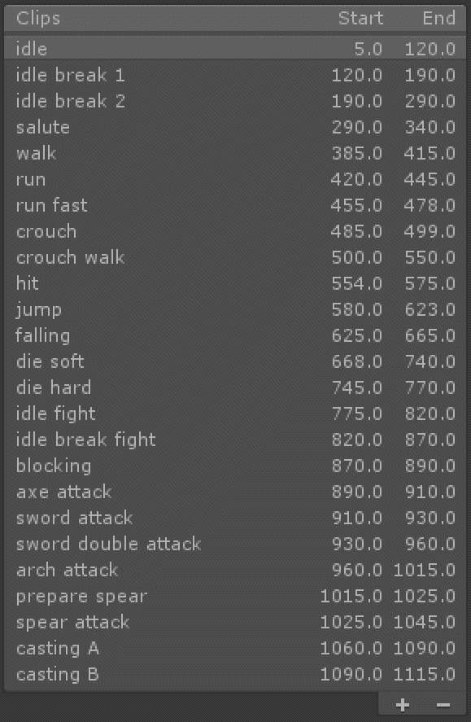

您可以考虑实现所有状态或部分状态。无论是理论还是实践，都是一样的。

我还可以使用 RawMocap 数据来为模型动画，因为我在使用的模型是 Mecanim 兼容的，包括面部绑定。实际上，我们将使用一些 RawMocap 数据来为模型动画。

随着 Unity 5 的发布，引入了 *Mecanim 动画系统*，该系统用于创建在类人角色上创建动画的简单工作流程和设置，将动画从一角色重定向到另一角色，预览动画剪辑，使用可视化工具管理动画之间的复杂交互，以及使用不同的逻辑为不同的身体部位进行动画处理。

实际上，我们现在就下载 Asset Store 上的资产吧。在 Asset Store 中搜索 *Mecanim 的原始 mocap 数据*。


该包包含几个原始动作捕捉数据文件供您使用。请注意，您可能需要自行进行一些调整。

在创建您的角色模型时，遵循为您的角色设置的适当骨骼结构是一个好主意。这将有助于使控制角色的状态和动画更容易，以及在不同的角色上重用您的动画控制器。如果您打算使用资产商店中的角色，这也同样适用。

# 角色模型

您现在应该考虑您的玩家角色将如何看起来。可以采取几种不同的方法。一种简单的方法是提供一个预定义的英雄，玩家在角色自定义方面没有太多选择或自由度。另一种方法是让玩家能够在一定程度上或完全改变和修改他们的角色。这完全取决于您的预算！

在这里，我们将采取介于两者之间的方法，以获得两个世界的优点。

您可以使用资产商店下载预定义的角色，这些角色可以在您创建自己的角色时作为占位符使用。您甚至可以使用资产商店中免费提供的某些角色，并根据您的需求进行修改。

一旦您确定了您的角色模型，下一步就是对其进行配置和自定义，以便在您的游戏中使用。我拥有的角色模型可以视觉上修改，以代表多个独特的角色。

例如，让我们看一下我们将要使用的默认角色模型，以下章节将详细介绍。

# 默认角色模型

这里是一套从资产商店购买的字符模型。我喜欢这一套模型，因为它们简单且易于使用。

# 野蛮人

此模型包含几种身体类型——肥胖、普通和瘦弱，这些类型是通过身体和布料上的混合形状设置的。它包含 15 种不同的身体和配件纹理，一种武器纹理和两种盾牌纹理。这为我们提供了一系列独特的角色定义和自定义选项，以增强 RPG 中不同 NPC 的范围。

我们将探讨如何在角色自定义时利用它们。以下截图展示了野蛮人的一个示例：

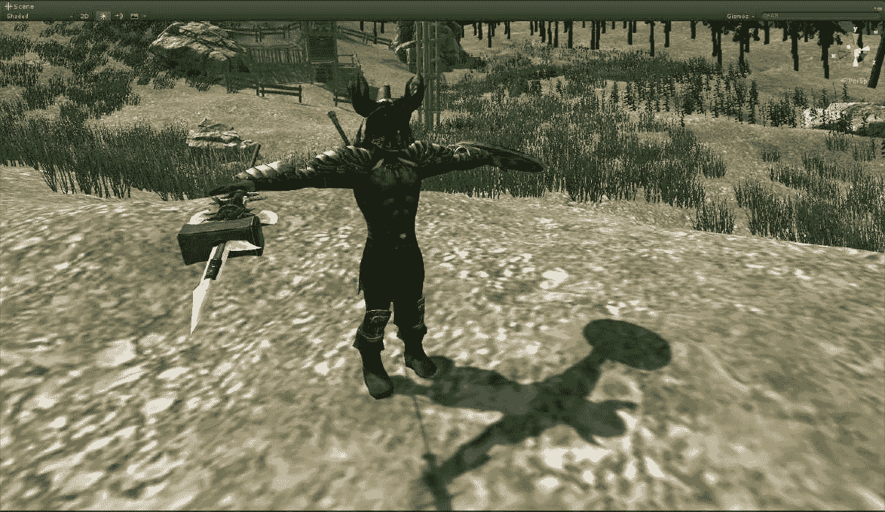

野蛮人模型

# 村民

村民模型为我们提供了两组模型：儿童和成人。在成人组中，我们有男性、女性和僧侣类型。提供了 16 个男性、3 个僧侣、8 个女性、4 个儿童和 2 个装备纹理。对于女性类型，有两种纹理类型：标准发型，用于散发的头发，和帽子，与帽子等头部配件一起使用。

有两组不同的动画集：一组用于`成人`网格类型，另一组用于`儿童`网格类型。与成人相比，儿童类型的状态较少。以下截图展示了男性、女性和儿童村民：


村民模型

# 精灵

兽人模型在其结构上可能略有不同。所有身体类型网格都将属于主要结构；有三个主要模型：肥胖、平均和健壮。也可能有一些遗留动画，我们在开始配置和编程或`Orc`类时需要处理。请参阅以下兽人的截图：

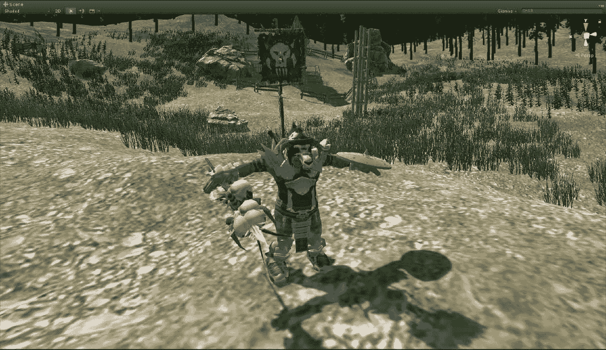

兽人模型

# 让我们开始吧

将您的项目中的野蛮人模型拖放到场景中。您需要仔细研究您的角色模型，了解它是如何构建的，这样您就可以在设计时间以及必要时在运行时对其进行修改。

这个特定的模型有几个视觉元素附加在武器、服装等上。您的模型可能配置不同；如果是这样，您需要创建自己的附加点并相应地实例化武器和其他与角色相关的资产。请参阅以下截图：

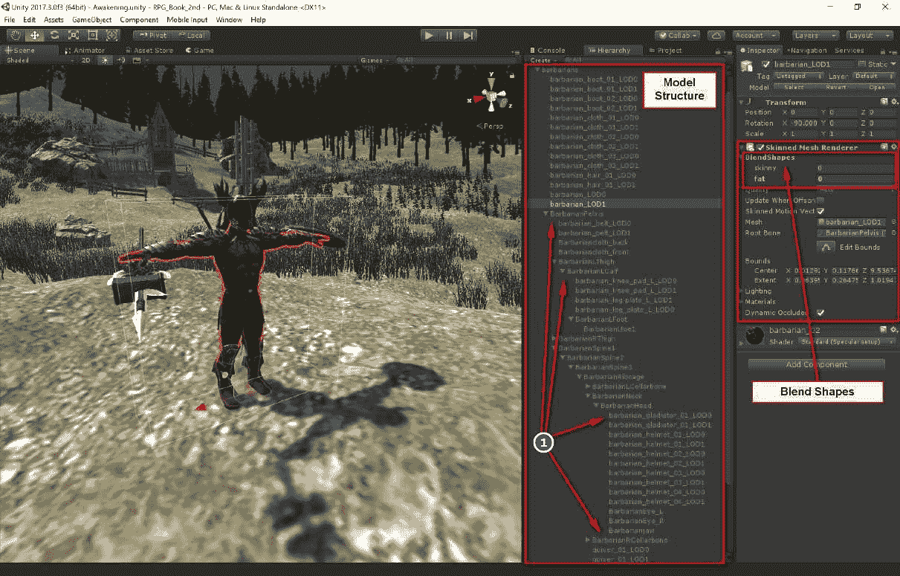

模型层级

选择您的角色模型并研究模型的架构。您会注意到模型层级中存在一定的模式和命名约定，如前一张截图所示。某些模型可能附加了动画。要检查它们，您需要从项目窗口中选择模型，并在检查器窗口中选择动画选项卡，以获取模型的嵌入动画列表，如以下截图所示：


在检查器窗口中，选择前一张截图所示的动画选项卡，并注意所有为您的角色模型开发的动画的剪辑部分，如以下截图所示：

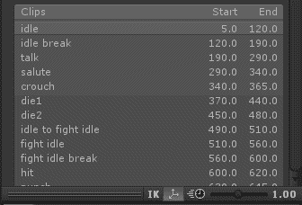

注意到动画片段有开始时间和结束时间。实际的角色模型在检查器窗口的底部以视觉方式显示。

# 为您的模型设置骨架

有时候您可能需要为您的模型设置骨架以使其适合您的游戏。这可以通过选择模型源，并在检查器窗口中选择骨架选项卡来实现，如以下截图所示：

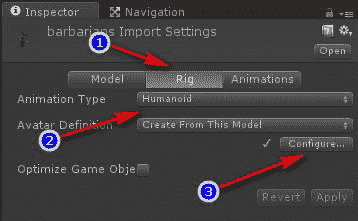

在骨架选项卡中，有一些选项您可以应用于您的模型。假设您的角色是类人型，如果您尚未选择，您需要选择类人动画类型。Avatar 定义也可以从模型创建或分配，如果您已经定义了 Avatar。最后，您可以点击“配置...”按钮以查看设置好的骨架模型的配置。请参阅以下截图：

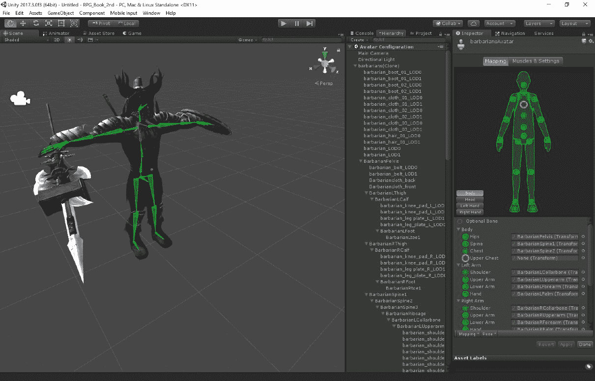

类人骨骼结构

注意从前面的截图可以看出，你的模型为其骨骼定义了映射。如果你的模型是 Humanoid 类型，并且如果你的模型结构已经被正确命名，系统将自动分配正确的骨骼和关节。如果你的命名不符合 Unity 规范，你可以导航你的模型结构并手动为身体、头部、左手和右手中的每个点分配。

肌肉和设置选项卡将允许你定义和限制模型关节的运动。这些对于创建更逼真的角色动作非常有用和实用。你可以自己进一步研究这些主题，因为它们可能需要一整章或两章来涵盖。

# 角色动作

传统上，角色的动作和运动是通过代码分别完成的。随着 *Mecanim* 的引入，你现在可以应用所谓的 *根运动*。这根据根运动中的数据修改了角色的游戏内变换。

我们将为我们的角色使用根运动。根运动与 Animator Controller 和动画状态机一起工作。身体变换和方向存储在动画剪辑中。这使得创建一个通过 Animator Controller 播放适当动画剪辑的状态机变得更容易。

# 动画控制器

在本节中，我们将使用新的 Animator Controller 来创建我们的角色状态并确定状态变化的准则。让我们在项目窗口中创建一个新的文件夹并命名为 `Animator`。选择新创建的文件夹。

要创建一个 Animator Controller，在项目窗口中，右键单击并选择 *创建 | 动画控制器*。给它起一个名字。我称之为 `BaseAnimatorController`。双击控制器以打开 Animator 窗口。

Animator Controller 是一个非常复杂的工具，你需要花一些时间来研究通过它可用的不同方面和功能。以下截图是空控制器的快照。我已经标记了 Animator 窗口的主要部分。有两个可见的选项卡，即层选项卡和 *参数* 选项卡。在 *层* 选项卡中，你可以创建不同的层，这些层包含你的动画状态以及从一种状态到另一种状态的相关 `转换`。*参数* 选项卡是定义你的参数的地方，这些参数将由 Animator Controller 以及你的代码访问和修改。

要完全理解 Mecanim 系统，你需要了解一系列的主题。在这本书中，我们不会涵盖所有方面，但会涉及一些对我们游戏所需的关键方面进行探讨。请看以下截图：

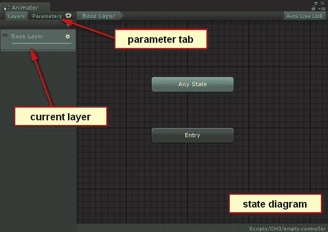

# 动画状态

要创建一个新的状态，您只需从项目窗口拖放一个动画即可。这将命名并分配相关的动画到层的该状态。您也可以通过在层中右键单击并选择*创建状态* | *空状态*来创建一个空状态。当状态创建后，您可以通过点击状态并在以下屏幕截图中所示，在检查器窗口中观察其属性：


您的模型可能或可能没有附加动画。Mecanim 系统的整个想法是使角色模型师能够在他们的模型上工作，同时动画师可以使用类人形角色的骨架来动画化角色。这反过来使得将一系列动画应用于不同类型的角色模型变得更加容易和更好！

为了识别状态，最好给它提供一个独特且易于在状态图中识别的名称。您需要给它分配一个动作；这是当状态激活时将播放的动画剪辑。下一个重要的属性将是*转换*属性。转换将确定状态将移动到另一个状态的条件，如果存在这样的要求。

例如，当角色处于空闲状态时，什么条件会使角色将其状态更改为行走状态、跑步状态等等，如以下屏幕截图所示：

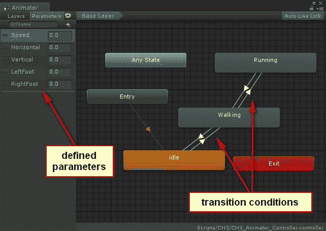

在前面的屏幕截图中，您将看到我定义了三个不同的状态：空闲、行走和跑步。您还会注意到，在*参数*选项卡中，我定义了一些参数。这些参数用于确定何时从空闲状态移动到行走状态、跑步状态，以及返回。这些参数旨在帮助您为状态机创建条件。

要从当前状态创建到下一个状态的转换，请右键单击您的状态，然后选择*创建转换*，然后选择它将转换到的状态。这将创建从起始状态到结束状态的视觉箭头。选择*转换*箭头以获取其属性，并在检查器窗口中设置条件。

在这个例子中，行走和跑步状态实际上是一个混合树。混合树用于使从一个动画状态到下一个动画状态的过渡更加自然。为了使混合动作有意义，混合的动作必须是相似性质和时序的。

混合树用于通过将它们的所有部分以不同程度地结合在一起，允许多个动画平滑地混合。每个动作对最终效果贡献的程度是通过一个混合参数控制的，这个参数只是与 Animator Controller 关联的数字动画参数之一。

例如，行走状态可能看起来像以下屏幕截图：


混合树示例

在我们的第一个*混合树*节点中，我们有五个输出：`HumanoidWalkLeftSharp`、`HumanoidWalkLeft`、`WalkFWD`、`HumanoidWalkRight`和`HumanoidWalkRightSharp`。这些是根据名为*水平*的参数值播放的动画剪辑。

这些动画来自*Mecanim 的原始 Mocap 数据*。

在行为区域，你会注意到为参数设置了一些阈值；这些阈值决定了要播放的动画。水平参数的值通过我们的 C#代码通过传递水平轴的值来设置，该值在输入管理器中定义。请看以下截图：

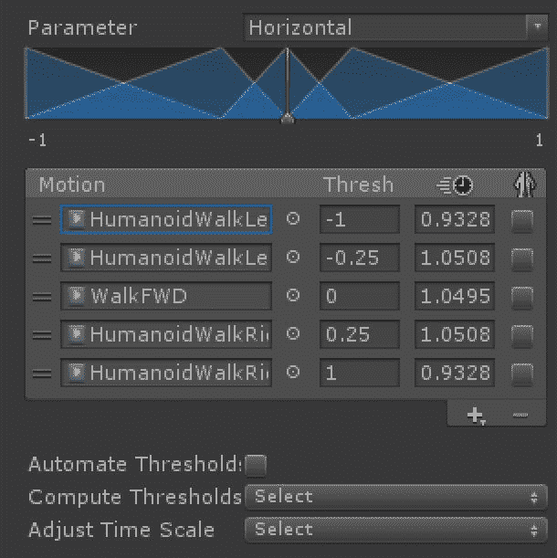

当你选择一个*混合树*节点时，你的检查器窗口将允许你添加或删除不同的动画状态，以及参数和参数的阈值，这将决定哪个动画将被渲染。

在动画中实现平滑混合的关键是注意你的动画数据。

让我们看看我们的最终状态图：

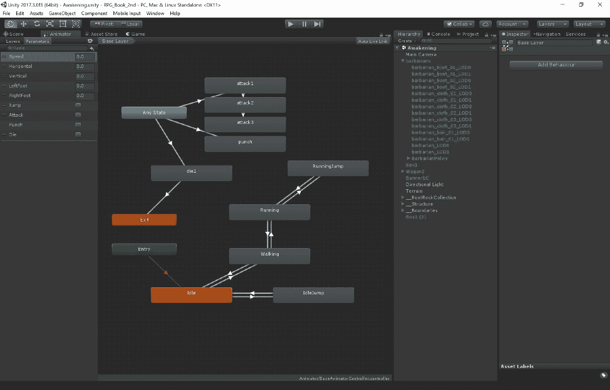

状态图

在这个阶段，我已经提前实现了*空闲*、*行走*、*奔跑*、*空闲跳跃*、*奔跑跳跃、攻击 1/2/3*、*拳头*和*死亡*的状态图。

定义从空闲状态到行走和奔跑状态的转换的参数是速度参数。如果速度值大于 0.1，它将从空闲状态转换为行走状态；如果它大于 0.6，它将从行走状态转换为奔跑状态。从奔跑状态到行走状态，以及从行走状态到奔跑状态的转换情况相反。

然而，请注意，角色只能从空闲状态或奔跑状态进入跳跃状态。控制这种转换的参数是`Jump`参数，它是一个通过按键盘上的空格键设置的布尔值。

从任意状态可以触发三种攻击状态，以及可以从任意状态进入的死亡状态。嗯，这是因为如果你不小心，你的角色在任何时候都可能死亡！

让我们看看我们如何控制这些参数。

# 角色控制器

是时候让我们的角色在场景中移动了。这通常由角色控制器处理。角色控制器将被用来处理玩家在游戏中与角色的大部分交互。

创建一个新的 C#脚本，并将其命名为`BarbarianCharacterController.cs`。在`BarbarianCharacterController`类中输入以下代码。目前代码非常基础。让我们列出代码，然后我们可以开始讨论代码的不同部分：

```cs
using UnityEngine; 

namespace com.noorcon.rpg2e 
{ 
   public class BarbarianCharacterController : MonoBehaviour 
   { 

      public Animator animator; 
      public float directionDampTime; 

      public float speed = 6.0f; 
      public float h = 0.0f; 
      public float v = 0.0f; 

      bool attack = false; 
      bool punch = false; 
      bool run = false; 

      bool jump = false; 
      bool die = false; 
      bool dead = false; 

      // Use this for initialization 
      void Start() 
      { 
         this.animator = GetComponent<Animator>() as Animator; 
      } 

      // Update is called once per frame 
      private Vector3 moveDirection = Vector3.zero; 

      void Update() 
      { 

         if (dead) 
         { 
            if (die) 
            { 
               die = !die; 
               animator.SetBool("Die", die); 
            } 
         return; 
      } 

         if (Input.GetKeyDown(KeyCode.C)) 
         { 
            attack = true; 
         } 
         if (Input.GetKeyUp(KeyCode.C)) 
         { 
            attack = false; 
         } 
         animator.SetBool("Attack", attack); 

         if (Input.GetKeyDown(KeyCode.P)) 
         { 
            punch = true; 
         } 
         if (Input.GetKeyUp(KeyCode.P)) 
         { 
            punch = false; 
         } 
         animator.SetBool("Punch", punch); 

         if (Input.GetKeyDown(KeyCode.LeftShift)) 
         { 
            this.run = true; 
         } 
         if (Input.GetKeyUp(KeyCode.LeftShift)) 
         { 
            this.run = false; 
         } 
         animator.SetBool("Run", run); 

         if (Input.GetKeyDown(KeyCode.Space)) 
         { 
            jump = true; 
         } 
         if (Input.GetKeyUp(KeyCode.Space)) 
         { 
            jump = false; 
         } 
         animator.SetBool("Jump", jump); 

         if (Input.GetKeyDown(KeyCode.I)) 
         { 
            die = true; 
            dead = true; 
         } 

         animator.SetBool("Die", die); 
      } 

```

在`Start()`函数中，我们将获取 Animator Controller 的引用。我们将使用`FixedUpdate()`函数来执行角色移动的更新，如下面的代码所示：

```cs
      void FixedUpdate() 
      { 
         // The Inputs are defined in the Input Manager 
         // get value for horizontal axis 
         h = Input.GetAxis("Horizontal"); 
         // get value for vertical axis 
         v = Input.GetAxis("Vertical"); 

         speed = new Vector2(h, v).sqrMagnitude; 

         // Used to get values on console 
         Debug.Log(string.Format("H:{0} - V:{1} - Speed:{2}", h, v,    
         speed)); 

         animator.SetFloat("Speed", speed); 
         animator.SetFloat("Horizontal", h); 
         animator.SetFloat("Vertical", v); 
      } 
   } 
} 
```

`Update()` 函数和 `FixedUpdate()` 函数的区别是什么？`Update()` 函数在每一帧都会被调用，通常用于更新非物理对象的移动、简单的计时器和输入处理。`Update()` 函数的更新间隔时间会有所不同。`FixedUpdate()` 函数在物理步骤中调用。间隔是固定的，用于调整 Rigidbody 上的物理。

在 `FixedUpdate()` 函数中，我们获取水平轴和垂直轴的输入，计算 *速度* 值，并使用 `animator.SetFloat()` 函数设置在动画控制器中定义的参数。然后，动画控制器使用这些参数来决定角色处于哪个状态。

例如，要从空闲状态过渡到行走状态，*速度* 参数需要大于 0.1，从行走状态过渡到跑步状态，*速度* 参数需要大于 0.6，并且 *run* 参数需要为 true。当你想从跑步状态回到行走状态，以及从行走状态回到空闲状态时，情况相反。水平方向和垂直方向参数控制转向左或右的移动。这三个参数的组合控制角色渲染的状态和动画。

下一步是为我们启用 *跳跃*、*死亡* 和 *攻击* 状态。跳跃状态可以在角色空闲或跑步时进入，并且跳跃布尔变量设置为 true。跳跃条件在玩家按下空格键时设置在 `Update()` 函数中。这会将变量设置为 true 并将其传递给动画控制器。

攻击和拳套状态使用相同的机制。这映射到键盘上的以下按键：*C* 和 *P*。每个按键都会将其布尔值设置为 true 并传递给动画控制器。玩家只能从 Any 状态进入这些状态。我们现在就保持这个状态。

最后，实现了死亡状态，目前我们使用键盘输入 I 来测试它。死亡状态与其他状态的主要区别在于，死亡状态可以从任何状态进入。

我们没有为这些状态使用 Blend Trees，因为这些状态只有一种动画。你也会注意到，状态只能从空闲状态过渡到。这是由于动画和模型最初设置的方式。你的可能不同。

看看下面的截图：

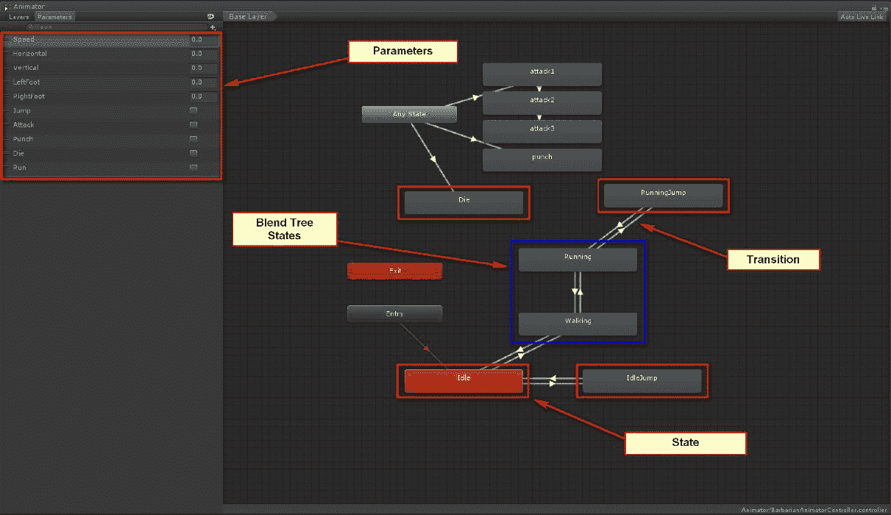

动画参数

角色可以从任何状态进入死亡和攻击状态。也就是说，你的角色玩家可以在游戏中的任何时间死亡，无论他或她当时处于什么状态。跳跃状态可以从两种状态触发，空闲和跑步。你可以根据你的动画复杂度级别改进这些过渡和状态，但就目前而言，这样应该足够了。

看看下面的截图：

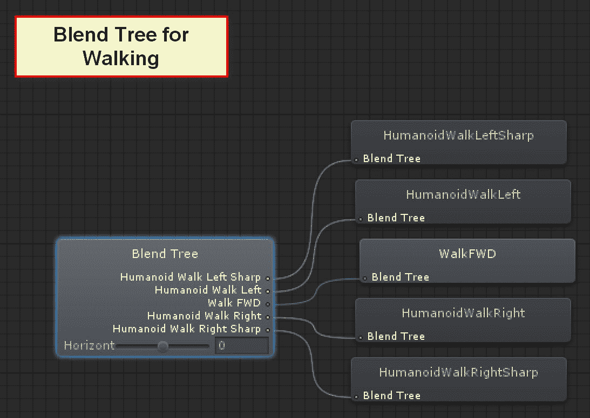

这些状态是通过动画器中定义的布尔参数控制的。在这个阶段，你应该能够使用你的模型来测试场景，以及你的角色动画和状态。

# 动画修改

有时候，你可能需要做一些更改和/或修改现有的修改，以便它能够与你的游戏和状态机正常工作。

为我的角色模型准备好的攻击动画需要调整，以便在角色仍然处于那个特定状态时循环播放。例如，如果我使用现有的动画，并且角色状态进入攻击模式，动画将只播放一次。这不是我想要的效果；我正在构建攻击输入，以便在攻击键按下时执行攻击。更改动画循环设置很简单。为此，从你的项目窗口中选择动画，然后从检查器窗口中选择*编辑...*按钮，如图下面的屏幕截图所示：


现在，你将进入动画的编辑模式，如图下面的屏幕截图所示。我把它放在旁边，以展示动画选项卡，选择我们想要修改的每个动画，一次一个，并将循环时间属性设置为 True。

在这个特定的屏幕截图中，你还会注意到动画的几个其他重要属性，例如*根变换旋转*、*镜像*、*曲线*、*事件*、*遮罩*和*运动*。当我们为我们的角色动画设置逆运动学时，我们会使用曲线属性。这基本上设置了预定义参数的值，这些值可以通过*Mecanim*来设置或获取。看看下面的屏幕截图：

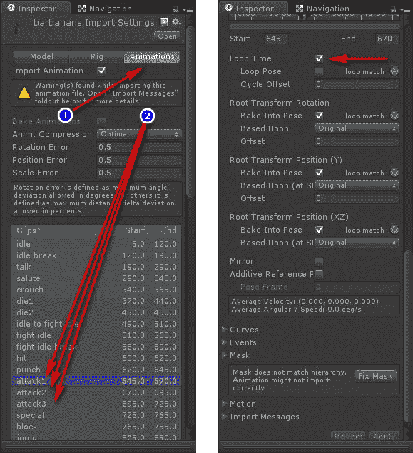

如果你的动画附加到你的模型上，并且你的动画和模型较旧，你很可能需要对其进行一些修改。

例如，你可能需要为特定动画剪辑设置的一个主要属性可能是*循环时间*属性，如图前面所示的屏幕截图。这将确保动画将在你处于运行动画的状态下循环播放。如果循环未启用，动画将只播放一次并停止，即使你仍然处于表示动画的状态。

确保空闲、行走、跑步和攻击动画的*循环时间*属性已设置。同时，并非所有动画剪辑都需要循环，例如，跳跃和死亡动画只需要播放一次。你需要做足功课，检查所有这些属性。

其他动画需要修改以启用将变换烘焙到模型中。例如，投掷和跳跃动画具有以下属性被勾选：*根变换旋转*和*根变换位置（Y）*；确保*烘焙到姿态*属性被勾选。这很重要，以确保动画和角色的骨骼运动在根变换位置上和谐一致。

如果这些属性设置不正确，你的动画可能会显得很奇怪。如果有任何异常情况发生，请务必仔细检查这些属性。

如果你还没有这样做，你应该将你的`BarbarianharacterController.cs`脚本附加到你的玩家角色上。

# 逆运动学

**逆运动学**（**IK**）在游戏编程中非常重要。它通常用于使角色的动作更加逼真。逆运动学的一个主要用途是计算玩家的脚以及它们与站立地面的关系。

简而言之，IK 用于根据空间中的给定位置确定角色的关节位置和旋转。例如，确保玩家的脚在行走的地面上的着陆位置正确。

Unity 有一个内置的逆运动学系统，可以用来进行这方面的基本计算。让我们继续为我们的角色实现脚部逆运动学。在我们为我们的拟人角色启用逆运动学之前，有一些事情需要设置。

首件事是检查你的动画控制器中的层级，并使用引擎图标进入设置窗口。确保已勾选*IK 传递*，如图下所示。如果你还没有这样做，你还需要提供一个遮罩。遮罩用于指定哪些骨骼部分受到逆运动学的影响。请参考以下截图：

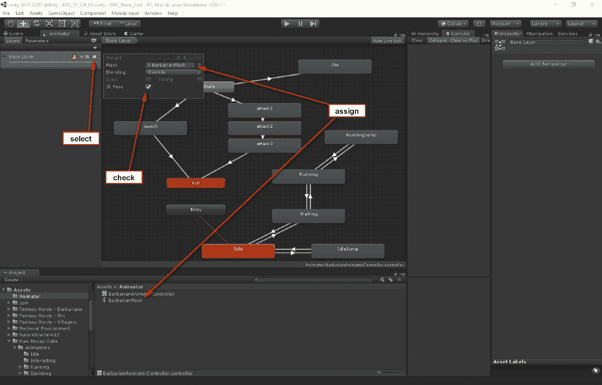

逆运动学遮罩

一旦设置好，乐趣就开始了。我们需要创建一个 C#脚本来处理我们的 IK。创建一个名为`IKHandle.cs`的 C#脚本。将以下代码输入到脚本中：

```cs
using UnityEngine; 

namespace com.noorcon.rpg2e 
{ 
   public class IKHandle : MonoBehaviour 
   { 
      Animator anim; 

      #region USED FOR MANUAL TESTING 
      Transform leftIKTarget; 
      Transform rightIKTarget; 

      Transform hintLeft; 
      Transform hintRight; 

      float ikWeight = 1f; 
      #endregion 

      // to make it dynamic 
      [Header("Dynamic IK Values")] 
      Vector3 LeftFootPosition; 
      Vector3 RightFootPosition; 

      Quaternion LeftFootRotation; 
      Quaternion RightFootRotation; 

      float LeftFootWeight; 
      float RightFootWeight; 

      public Transform LeftFoot; 
      public Transform RightFoot; 

      [Header("Adjustment Properties for IK")] 
      public float OffsetY; 

      public float LookIkWeight = 1.0f; 
      public float BodyWeight = 0.7f; 
      public float HeadWeight = 0.9f; 
      public float EyesWeight = 1.0f; 
      public float ClampWeight = 1.0f; 

      public Transform LookPosition; 

      // Use this for initialization 
      void Start() 
      { 
         anim = GetComponent<Animator>(); 

         LeftFoot = anim.GetBoneTransform(HumanBodyBones.LeftFoot); 
         RightFoot = anim.GetBoneTransform(HumanBodyBones.RightFoot); 

         LeftFootRotation = LeftFoot.rotation; 
         RightFootRotation = RightFoot.rotation; 

      } 
```

这个脚本有些复杂。为了使逆运动学，即 IK，正常工作，我们需要在空间中识别几个重要的点。其中一个点是我们要让脚移动到的目标位置在空间中的位置，另一个点是提示。这两个空间点用于控制特定关节的骨骼运动和变换，以便成功完成目标位置的 IK。请参考以下代码：

```cs
      // Update is called once per frame 
      void Update() 
      { 
         // we can set the look position here somewhere 
         Ray ray = new Ray(Camera.main.transform.position, 
         Camera.main.transform.forward); 

         Debug.DrawRay(Camera.main.transform.position, 
         Camera.main.transform.forward * 15, Color.cyan); 

         //lookPosition.position = ray.GetPoint(15); 

         RaycastHit leftHit; 
         RaycastHit rightHit; 

         Vector3 lpos = LeftFoot.TransformPoint(Vector3.zero); 
         Vector3 rpos = RightFoot.TransformPoint(Vector3.zero); 

         if (Physics.Raycast(lpos, -Vector3.up, out leftHit, 1)) 
         { 
            LeftFootPosition = leftHit.point; 
            LeftFootRotation = Quaternion.FromToRotation(transform.up, 
            leftHit.normal) * transform.rotation; 
         } 

         if (Physics.Raycast(rpos, -Vector3.up, out rightHit, 1)) 
         { 
            RightFootPosition = rightHit.point; 
            RightFootRotation = Quaternion.FromToRotation(transform.up,    
            rightHit.normal) * transform.rotation; 
         } 
      } 

      void OnAnimatorIK() 
      { 
         LeftFootWeight = anim.GetFloat("MyLeftFoot"); 
         RightFootWeight = anim.GetFloat("MyRightFoot"); 

         anim.SetIKPositionWeight(AvatarIKGoal.LeftFoot, 
         LeftFootWeight); 
         anim.SetIKPositionWeight(AvatarIKGoal.RightFoot, 
         RightFootWeight); 
         anim.SetIKPosition(AvatarIKGoal.LeftFoot, LeftFootPosition + 
         new Vector3(0f, OffsetY, 0f)); 
         anim.SetIKPosition(AvatarIKGoal.RightFoot, RightFootPosition + 
         new Vector3(0f, OffsetY, 0f)); 

         anim.SetIKRotationWeight(AvatarIKGoal.LeftFoot, 
         LeftFootWeight); 
         anim.SetIKRotationWeight(AvatarIKGoal.RightFoot, 
         RightFootWeight); 
         anim.SetIKRotation(AvatarIKGoal.LeftFoot, LeftFootRotation); 
         anim.SetIKRotation(AvatarIKGoal.RightFoot, RightFootRotation); 

      } 
   } 
} 
```

`LeftFootPosition`和`RightFootPosition`变量用于在运行时表示左右脚的目标位置。`LeftFootRotation`和`RightFootRotation`用于存储左右脚的旋转。

我们还需要两个变量来在模型中实际引用我们的左右脚。这是通过`LeftFoot`和`RightFoot`变量完成的。

其中一些变量在`Start()`函数中初始化。具体来说，我们从为人类角色定义的 Animator Controller 骨骼结构中获取左右脚的引用。

在`Update()`函数中，我们使用`Physics.Raycast()`执行一些射线投射，以确定左右脚的位置。然后，这些数据被使用并存储在`LeftFootPosition`和`RightFootPosition`变量中，以及它们在`LeftFootRotation`和`RightFootRotation`变量中的等效旋转数据。请看以下截图：

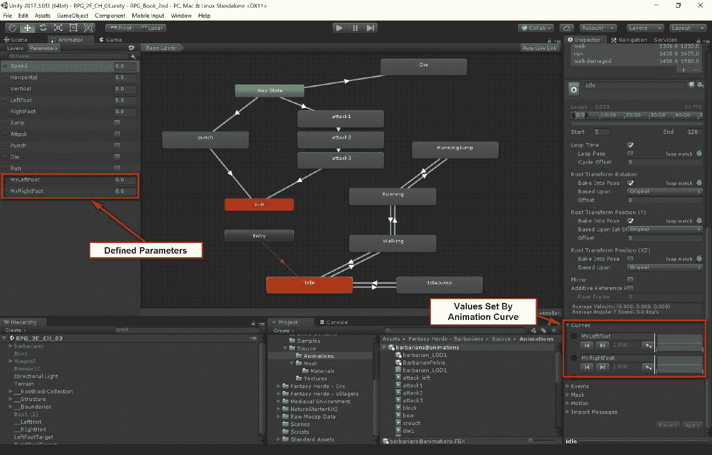

动画曲线

实际的 IK 动画是在`OnAnimatorIK()`函数中应用的。`LeftFootWeight`和`RightFootWeight`变量用于通过 Animator Controller 中的动画剪辑`Curve`函数获取为`MyLeftFoot`和`MyRightFoot`设置的参数值。

关键在于正确定义将用于驱动 IK 权重的动画剪辑曲线。前面的截图只显示了空闲状态的曲线。两只脚都放在地面上，因此值设置为 1。对于你的行走和跑步剪辑，你的曲线将不同。

最后，使用`SetIKPositionWeight()`和`SetIKPosition()`函数来正确调整脚相对于地面的位置和旋转！请注意，这是为每只脚分别执行的。

将`IKHandle.cs`脚本附加到你的角色上并执行测试运行。注意你的角色以及它与地面或你设置的地面或地形交互的方式有何不同。

# 设置动画曲线

这一步对于 IK 的正常工作非常重要。我将使用空闲动画来演示需要配置的内容，以确保动画控制器中的参数设置正确。请看以下截图：

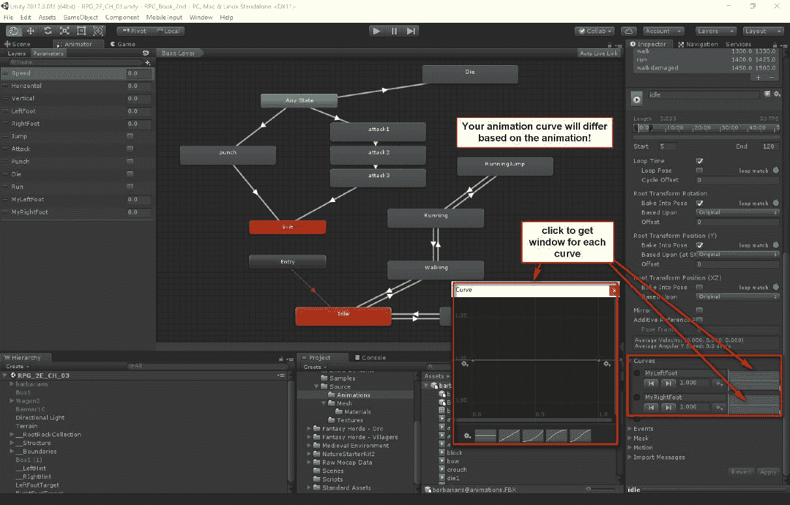

动画曲线修改

为了使 IK 正常工作并看起来不错，你需要为与脚部运动相关的每个动画设置曲线。由于我们有五套行走和跑步的动画，你需要为每个动画曲线执行相同的操作，以正确设置传递给 IK 脚本的权重值。

# 概述

我们在本章中涵盖了大量内容。我们讨论了我们将在游戏中使用的不同角色定义，查看所有角色将共享的基础角色类属性，并创建了`BaseCharacter`类，以便在游戏后期使用。我们还讨论了角色在游戏中的主要状态，以及如何使用 Animator Controller 来实现它们。

我们探讨了如何为我们的角色模型绑定，使其为 Mecanim 系统做好准备，以及如何使用 Mecanim 系统创建动画和状态图，这些图将决定角色在游戏中的行为。然后我们实现了我们的初始角色控制器脚本，该脚本处理我们角色的状态。这给了我们机会查看混合树以及使用参数从一个状态过渡到下一个状态。然后我们探讨了如果需要的话如何修改动画剪辑。

最后，我们学习了逆运动学，这将帮助我们的角色在游戏环境中表现得更加真实。

章节结束，你应该已经很好地掌握了所有共同作用使你的角色在游戏环境中看起来、表现和移动的不同组件。

在下一章中，我们将介绍非角色行为。
