# 第四章：游戏机制

在第三章，“RPG 角色设计”中，我们涵盖了广泛的主题，以准备你的角色模型用于游戏。我们探讨了如何导入和设置我们的角色模型，创建了`BaseCharacter`类，使用动画控制器设置状态图，创建了初始角色控制器来处理我们角色模型的运动和行为，最后，查看了一些基本逆运动学用于脚部。

在本章中，我们将扩展角色玩家和非角色玩家，涵盖以下主题：

+   定制玩家角色：

    +   可定制部分（模型）

    +   定制化的 C#代码

    +   保留角色状态

    +   回顾

+   非玩家角色：

    +   非玩家角色基础

    +   设置非玩家角色

    +   导航网格设置

    +   NPC 动画控制器

    +   NPC 攻击

    +   NPC AI

+   PC 和 NPC 交互

# 定制玩家角色

一个 RPG 的关键特性是能够定制你的角色玩家。在本节中，我们将探讨如何提供实现这一点的手段。

再次强调，方法和概念是通用的，但实际实现可能根据你的模型结构略有不同。

创建一个新的场景并将其命名为`CharacterCustomization`。创建一个立方体预制件并将其设置为原点。将立方体的缩放设置为`<5, 0.1, 5>`。你还可以将 GameObject 的名称更改为 Base。这将是我们角色模型站立的平台，在玩家在游戏开始前定制他的/她的角色时。

我使用我的环境资源来创建舞台。这需要更多的时间，但更加吸引人。这完全取决于你，游戏创造者和设计师，天空才是极限！

将代表你的角色模型的预制件拖放到场景视图中。接下来的几个步骤将完全取决于你设计的模型层次结构和结构。

我正在使用野蛮人模型来展示结构。

为了说明这一点，我在场景中放置了相同的模型两次。左边的是配置为仅显示基础的模型，而右边的模型是其原始状态，如下面的截图所示：


野蛮人模型：简单且全副武装

注意，我正在使用的特定模型将所有内容都附加在上面。这包括不同类型的武器、鞋子、头盔、盔甲和皮肤。左侧的实例化预制件已关闭模型层次结构中的所有额外内容。以下是`Hierarchy View`中的层次结构看起来是这样的：

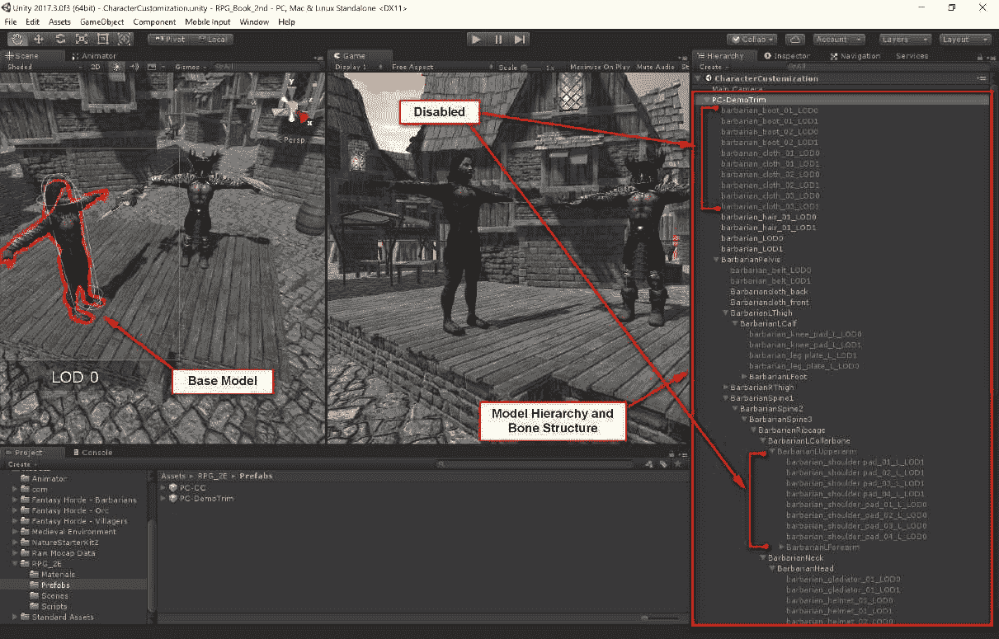

野蛮人模型结构

该模型在其结构中具有非常广泛的层次结构。前面的截图是一个小片段，以展示你需要导航结构并手动识别和启用或禁用表示模型特定部分的网格。

模型根：

骨盆：

左大腿：

+   左腿

右大腿：

+   右小腿

脊柱：

+   胸廓：

    +   左锁骨：

        +   左上臂：

            +   左前臂

    +   颈部：

        +   头部

    +   右锁骨：

        +   右上臂：

            +   右前臂：

                +   右手掌

每个角色模型都将有自己的独特层次结构和骨骼结构。你需要研究这一点，如前所述，以了解和计划你如何在游戏过程中配置和编程它们。

# 可自定义部分

使用我的野蛮人模型，我可以使用它自定义一些物品。我可以自定义肩垫、体型、武器、盔甲、头盔、鞋子，最后，模型的纹理或皮肤，以赋予它不同和独特的样子。

让我们列出我们为角色拥有的所有可自定义物品：

+   **盾牌**：有两种类型

+   **体型**：有三种体型：瘦、健壮和胖

+   **盔甲**：护膝、腿板

+   **靴子**：有两种类型

+   **头盔**：有四种类型

+   **武器**：有 13 种不同的类型

+   **皮肤**：有 13 种不同的类型

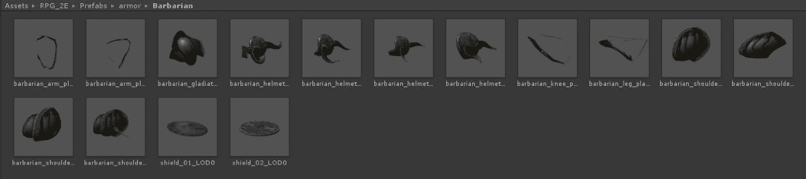

模型资产 1

你可以轻松地从主模型中提取每个配件，并为单个武器、盔甲和服装创建预制件：

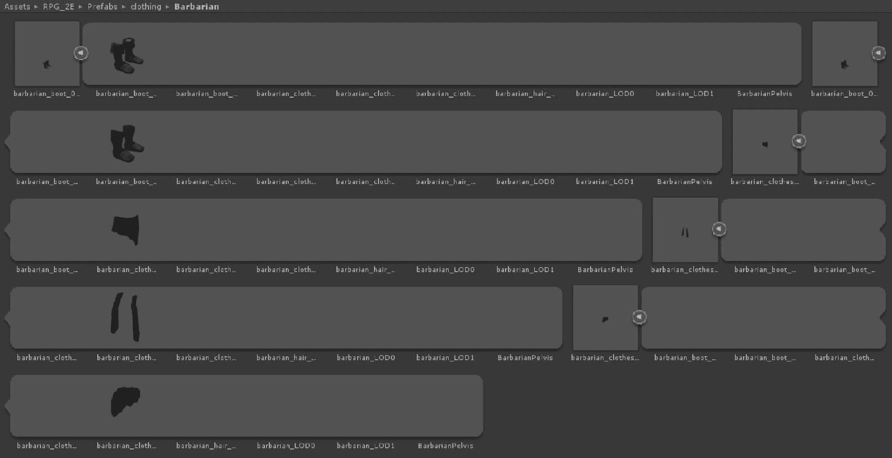

模型资产 2

我们以这种方式分离物品，以便玩家在游戏过程中能够升级或找到所需的武器或盔甲：

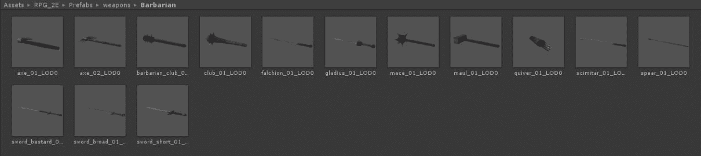

模型资产 3

一旦拾取了物品，我们就会将其放入我们的库存中，玩家可以轻松访问它。

# 用户界面

现在我们知道了我们可以如何自定义我们的玩家角色，我们可以开始考虑**用户界面**（**UI**）。UI 将用于角色的自定义。

以下是一个 UI 想法的草图。当我们开始实现 UI 时，我们可能需要做一些调整以适应原始概念的可用性：

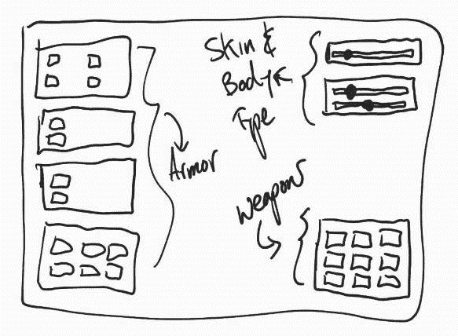

为了设计我们的 UI，我们需要创建一个 Canvas GameObject。这是通过在**层次视图**中右键单击并选择创建 *|* UI *|* Canvas 来完成的。这将在一个 Canvas GameObject 和一个`EventSystem` GameObject 中放置层次视图。

假设你已经知道如何在 Unity 中创建 UI。如果你不知道，请参阅*《游戏编程入门：使用 C#和 Unity 3D》* 第五章，*游戏大师和游戏机制*，在[`www.amazon.com/Introduction-Game-Programming-Using-Unity-ebook/dp/B01BCPRRCU/`](https://www.amazon.com/Introduction-Game-Programming-Using-Unity-ebook/dp/B01BCPRRCU/).

我将使用面板来分组可自定义的物品。目前，我将使用复选框来处理一些物品，并使用滚动条来处理武器和皮肤纹理。以下截图说明了我的自定义 UI 看起来：

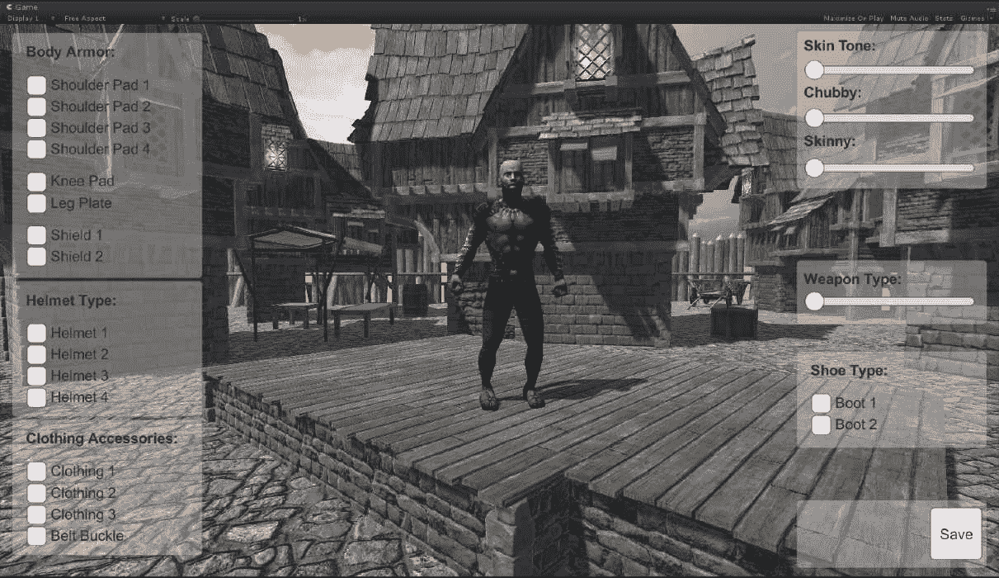

角色自定义 UI

这些 UI 元素需要与事件处理器集成，以便执行启用或禁用角色模型某些部分所需的操作。

例如，使用 UI，我可以选择肩垫 4 号，使用滚动条增加或减少身体的圆润度，并将武器类型滚动条移动到锤子武器出现的位置。选择第二个头盔复选框，选择盾牌 1 号和靴子 2 号，我的角色将看起来像以下截图。

我们需要一种方式来引用模型上代表不同可定制对象类型的每个网格。这将通过 C#脚本完成。脚本需要跟踪我们将要管理的所有定制部分。

一些模型可能没有附加额外的网格。你可以在模型的特定位置创建空的 GameObject，并且可以在给定点动态实例化代表你的自定义对象的预制体。这也可以应用于我们的当前模型。例如，如果我们有一个特殊的太空武器，某种方式被游戏世界中的外星人丢弃，我们可以通过 C#代码将武器附加到我们的模型上。重要的是要理解这个概念，其余的则由你决定！

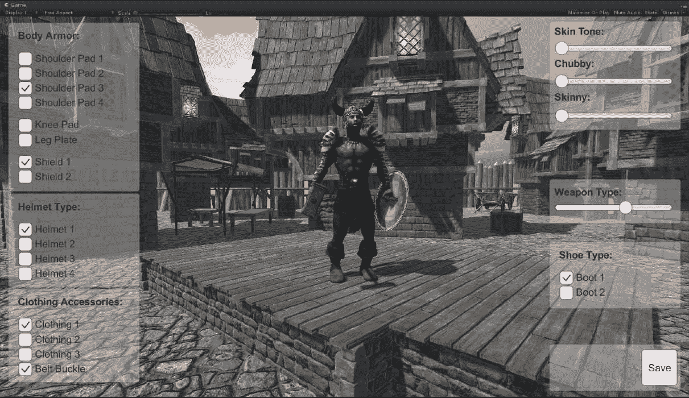

角色定制化实战

# 角色定制化代码

事情不会自动发生。我们需要创建一些 C#代码来处理我们的角色模型的定制化。我们在这里创建的脚本将处理驱动模型网格不同部分启用和禁用的 UI 事件。

创建一个新的 C#脚本，命名为`BarbarianCharacterCustomization.cs`。创建一个名为`__Base`的空 GameObject，并将脚本附加到场景中的`__Base GameObject`。以下是脚本的列表：

`代码路径`

```cs
using System;
using UnityEngine;
using UnityEngine.UI;

namespace com.noorcon.rpg2e
{
  public class BarbarianCharacterCustomization : MonoBehaviour
  {
    public GameObject PLAYER_CHARACTER;

    public PlayerCharacter PlayerCharacterData;

    public Material[] PLAYER_SKIN;

    public GameObject CLOTH_01LOD0;
    public GameObject CLOTH_01LOD0_SKIN;
    public GameObject CLOTH_02LOD0;

    // Player Character Defense Weapons
    public GameObject SHIELD_01LOD0;
    public GameObject SHIELD_02LOD0;

    public GameObject QUIVER_LOD0;
    public GameObject BOW_01_LOD0;

    // Player Character Calf - Right / Left
    public GameObject KNEE_PAD_R_LOD0;
    public GameObject LEG_PLATE_R_LOD0;

    public GameObject KNEE_PAD_L_LOD0;
    public GameObject LEG_PLATE_L_LOD0;

    public GameObject BOOT_01LOD0;
    public GameObject BOOT_02LOD0;

    // Use this for initialization
    void Start()
    {
      PlayerCharacterData = PLAYER_CHARACTER.GetComponent<PlayerAgent>().playerCharacterData;
    }

    public bool ROTATE_MODEL = false;

    // Update is called once per frame
    void Update()
    {
      if (Input.GetKeyUp(KeyCode.R))
      {
        ROTATE_MODEL = !ROTATE_MODEL;
      }

      if (ROTATE_MODEL)
      {
        PLAYER_CHARACTER.transform.Rotate(new Vector3(0, 1, 0), 33.0f * Time.deltaTime);
      }

      if (Input.GetKeyUp(KeyCode.L))
      {
        Debug.Log(PlayerPrefs.GetString("Name"));
      }

    }

        void DisableShoulderPads()
        {
            SHOULDER_PAD_R_01LOD0.SetActive(false);
            SHOULDER_PAD_R_02LOD0.SetActive(false);
            SHOULDER_PAD_R_03LOD0.SetActive(false);
            SHOULDER_PAD_R_04LOD0.SetActive(false);

            SHOULDER_PAD_L_01LOD0.SetActive(false);
            SHOULDER_PAD_L_02LOD0.SetActive(false);
            SHOULDER_PAD_L_03LOD0.SetActive(false);
            SHOULDER_PAD_L_04LOD0.SetActive(false);
        }
```

这是一个很长的脚本，但它很简单。在脚本顶部，我们定义了所有将引用模型角色中不同网格的变量。所有变量都是 GameObject 类型，除了`PLAYER_SKIN`变量，它是一个`Material`数据类型的数组。数组用于存储为角色模型创建的不同类型的纹理：

```cs
    public void SetShoulderPad(Toggle id)
    {
      try
      {
        PlayerCharacter.ShoulderPad name 
          = (PlayerCharacter.ShoulderPad)Enum.Parse(typeof(PlayerCharacter.ShoulderPad), id.name, true);
        if (id.isOn)
        {
          PlayerCharacterData.SelectedShoulderPad = name;
        }
        else
        {
          PlayerCharacterData.SelectedShoulderPad 
            = PlayerCharacter.ShoulderPad.none;
        }
      }
      catch
      {
        // if the value passed is not in the enumeration set it to none
        PlayerCharacterData.SelectedShoulderPad 
          = PlayerCharacter.ShoulderPad.none;
      }

            // disable before new selection
            DisableShoulderPads();

            switch (id.name)
      {
        case "SP01":
          {
            SHOULDER_PAD_R_01LOD0.SetActive(id.isOn);
            SHOULDER_PAD_L_01LOD0.SetActive(id.isOn);
            break;
          }
...
        case "SP04":
          {
            SHOULDER_PAD_R_04LOD0.SetActive(id.isOn);
            SHOULDER_PAD_L_04LOD0.SetActive(id.isOn);
            break;
          }
      }
    }

    public void SetShoulderPad(PlayerCharacter.ShoulderPad id)
    {
            // disable before new selection
            DisableShoulderPads();

            switch (id.ToString())
      {
        case "SP01":
          {
            SHOULDER_PAD_R_01LOD0.SetActive(true);
            SHOULDER_PAD_L_01LOD0.SetActive(true);
            break;
          }
...
        case "SP04":
          {
            SHOULDER_PAD_R_04LOD0.SetActive(true);
            SHOULDER_PAD_L_04LOD0.SetActive(true);
            break;
          }
      }
    }
...https://github.com/PacktPublishing/Building-an-RPG-with-Unity-2018-Second-Edition
```

已定义了一些函数，这些函数由 UI 事件处理器调用。这些函数是：`SetShoulderPad(Toggle id)`、`SetBodyType(Toggle id)`、`SetKneePad(Toggle id)`、`SetLegPlate(Toggle id)`、`SetWeaponType(Slider id)`、`SetHelmetType(Toggle id)`、`SetShieldType(Toggle id)`、`SetSkinType(Slider id)`、`SetBodyFat(Slider id)`和`SetBodySkinny(Slider id)`；

所有这些函数都接受一个参数，用于标识应启用或禁用的特定类型。

我们刚刚创建了一个工具，可以快速可视化角色定制。

您还可以使用我们刚刚构建的系统来创建您玩家角色的所有不同变体或非玩家角色模型，并将它们作为预制体存储！哇！这将为您节省大量创建代表不同野蛮人的角色的时间和精力！

# 保留我们的角色状态

现在我们已经花费时间定制了我们的角色，我们需要保留我们的角色并在我们的游戏中使用它。在 Unity 中，有一个名为 `DontDestroyOnLoad()` 的函数。

这是一个现在可以使用的优秀功能。它做什么？它将指定的 GameObject 在场景之间保持内存中。我们现在可以使用这些机制。然而，最终，您可能希望创建一个可以保存和加载用户数据的系统。

继续创建一个新的 C# 脚本，并将其命名为 `DoNotDestroy.cs`。这个脚本将会非常简单。以下是代码列表：

```cs
using UnityEngine; 
using System.Collections; 

public class DoNotDestroy : MonoBehaviour 
{ 

   // Use this for initialization 
   void Start() 
   { 
      DontDestroyOnLoad(this); 
   } 

   // Update is called once per frame 
   void Update() 
   { 

   } 
} 
```

在创建脚本后，将其附加到场景中的角色模型预制体上。不错；让我们快速回顾一下到目前为止我们已经做了什么。

# 概述

到现在为止，您应该有三个功能性的场景。我们有代表主菜单的场景，我们有代表初始级别的场景，我们刚刚创建了一个用于角色定制的场景。以下是到目前为止我们游戏的流程：

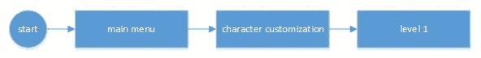

我们开始游戏，看到主菜单，选择“开始游戏”按钮进入角色定制场景，进行定制，然后点击“保存”按钮，加载第 1 级。

为了实现这一点，我们创建了以下 C# 脚本：

+   `GameMaster.cs`: 这用作跟踪游戏状态的主要脚本

+   `BarbarianCharacterCustomization.cs`: 这仅用于定制我们的角色

+   `DoNotDestroy.cs`: 这用于保存给定对象的状态

+   `BarbarianCharacterController.cs`: 这用于控制我们的角色动作

+   `IKHandle.cs`: 这用于实现脚部的逆运动学

当您将这些结合起来，现在您就拥有了一个良好的框架和流程，我们可以随着进展进行扩展和改进。

# 非玩家角色

到目前为止，我们一直专注于玩家角色。在本节中，我们将开始考虑我们的非玩家角色。让我们从我们的野蛮人开始。我们可以使用角色定制场景快速创建几个预制体，这些预制体将代表我们的独特野蛮人。

使用我们刚刚开发的工具，您可以进行调整，当对模型满意时，将代表您的角色玩家的 GameObject 拖放到“预制体”文件夹中。这将创建一个与您所看到的 GameObject 实例的副本，并将其保存为预制体。以下截图展示了我已经创建并存储为预制体的两个角色：

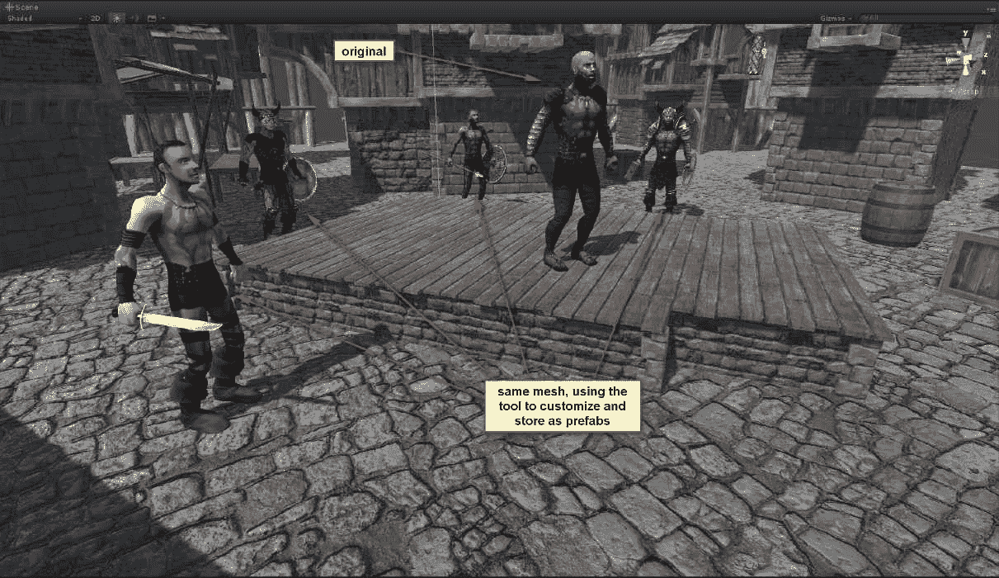

使用工具创建独特的角色

我向您展示的，如果做得恰当，可以为您节省数小时手动遍历模型结构并逐个启用和禁用不同网格的繁琐工作。换句话说，我们不仅创建了一个允许我们自定义游戏内玩家角色的场景，我们还创建了一个可以帮助我们快速自定义游戏内自己的角色模型以供使用的工具！

这里需要强调的另一个点是预制件的强大功能。将预制件想象成一个存储库，可以用来保存给定 GameObject 的状态，并在您的游戏环境中重复使用。当您更新预制件时，所有预制件的实例将自动更新！这很好，但与此同时，您必须小心不要因为同样的原因破坏任何东西。当您在附加到预制件的脚本上更新代码逻辑时，所有预制件的实例都将使用更新的脚本，因此您的一点点规划可以从长远来看节省大量时间和头疼。

# 非玩家角色基础

我们将使用新创建的预制件来实现我们的非玩家角色。由于角色模型之间存在一些相似之处，我们可以重用我们迄今为止创建的一些资产。

例如，所有角色都将继承在第三章中定义的`BaseCharacter`类，*RPG 角色设计*。它们还将包含我们为玩家角色已经创建的相同状态，并扩展一些专门为 NPC 设计的额外状态，如搜索和寻找。

我们已经使用我们的角色定制工具创建并保存了我们的非玩家角色；因此，我们对建模部分感到满意。我们需要集中精力的是我们非玩家角色的动作。我们需要创建一个新的动画控制器来处理我们 NPC 的状态。

# 设置非玩家角色

实现 NPC 的主要困难之一是赋予它真实智能的能力。这可以通过识别和实现我们 NPC 的几个关键区域来轻松实现。

我们需要将一些新组件附加到我们的 NPC 上。使用我们已保存的预制件，我们需要添加以下组件：

+   新的球体碰撞器，这将用于实现我们 NPC 的视野范围。

+   我们已经附加了一个动画组件，但我们需要创建一个新的动画控制器来捕捉 NPC 的新状态。

+   我们还需要添加一个导航网格代理组件。我们将为我们的 NPC 使用内置的导航和路径查找系统。

要添加球体碰撞器，您需要选择为 NPC 定义的预制件，并在**检查器**窗口中。选择添加组件 *|* 物理 *|* 球体碰撞器。这将为我们预制件附加一个球体碰撞器。

接下来，我们需要添加 Nav Mesh Agent*.* 再次，从检查器窗口中选择添加组件 *|* 导航 | Nav Mesh Agent。好的，现在我们已经设置了用于 NPC 的主要内置组件。

由于我们的预制件是我们玩家角色的实例，我们需要移除一些被携带过来的脚本组件。如果您的 NPC 预制件上附加了任何脚本，请现在移除它们。

如果您还没有这样做，请确保将 `Tag` 属性更改为 `Untagged`。

以下截图说明了我们到目前为止在 NPC 上设置的组件。这包括现有的组件，包括我们从玩家角色带来的脚本，以及将用于 NPC 的新增组件：

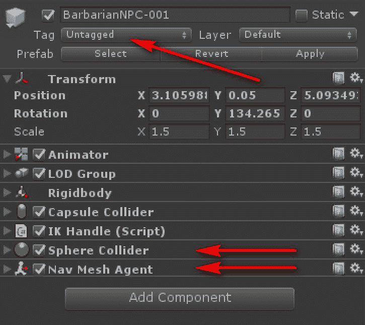

在执行下一步之前，请确保您在一个级别场景中。我将使用觉醒场景。

切换到您的可玩游戏场景之一。

下一步是设置我们的 Navmesh。要创建 Navmesh，我们需要进入导航窗口，通过选择 Window *|* 导航：

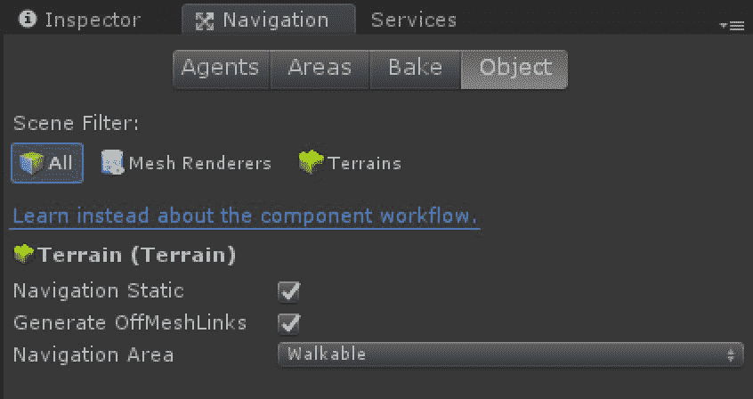

为了使 navmesh 正确工作，我们需要将场景中所有将要设置为静态的 GameObject 标记为导航静态。这将基于场景中的静态对象创建 navmesh；也就是说，在整个场景生命周期中不会移动的 GameObject：

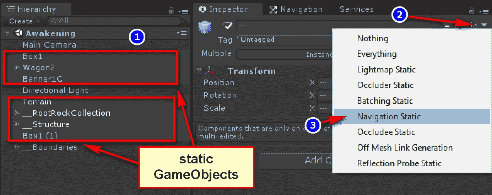

在您的活动场景中，选择将要设置为导航静态的 GameObject，如图中所示（1），使用静态下拉菜单（2），并选择导航静态选项（3）。如果您的 GameObject 是具有子对象的父 GameObject，Unity 将询问您是否要将属性更改应用于所有子对象。

注意，我已经将所有环境 GameObject 放在一个名为 `__Structure`* 的 GameObject 下，以及后来添加的一些其他 GameObject。这样，如果我有许多静态对象，我可以将属性更改应用于父对象，子对象将自动继承更改。但请确保组中的所有内容都将保持静态！

完成此操作后，我们需要回到导航窗口并做一些调整。在导航选项卡中，选择地形并确保它设置为导航静态，并且*导航区域*设置为可通行：

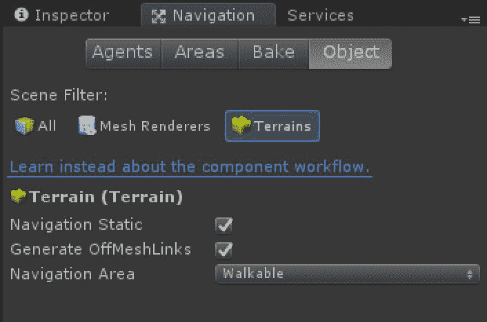

在烘焙选项卡中，将代理半径更改为 0.3，代理高度更改为 1。保持其他属性不变。这将给 NPC 带来更多的灵活性，使其能够通过狭窄的角落：

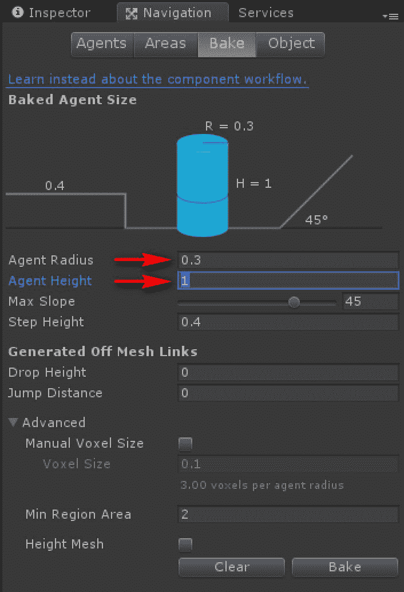

当您准备好后，您可以在导航窗口的底部选择烘焙按钮。

Unity 需要一些时间来为您场景生成 Navmesh。这取决于您级别的复杂度。如果一切操作正确，您将看到类似于以下截图所示的 Navmesh：

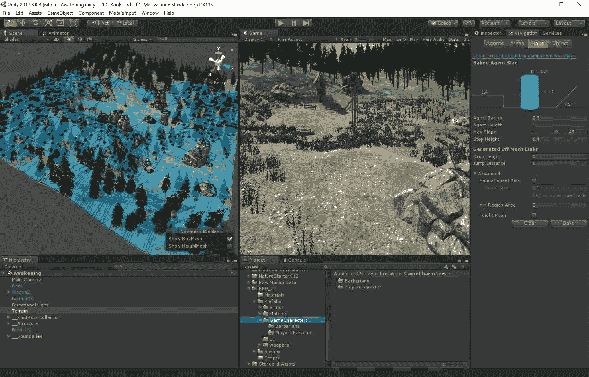

Navmesh 生成

你看到的蓝色区域都是 NPC 可以导航到的区域：

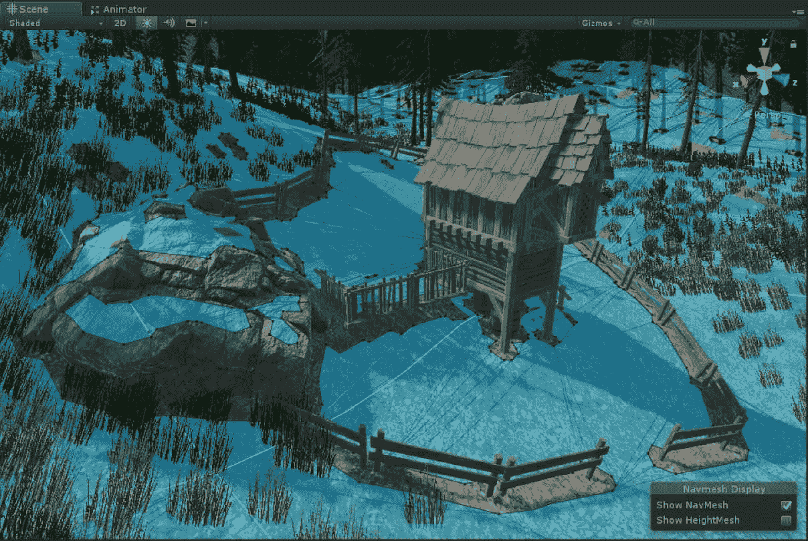

# NPC 动画控制器

我们现在需要为我们的 NPC 创建 **动画控制器**（**AC**）。动画控制器将使用来自 `MeshAgent` 的输入来控制和改变 NPC 的状态。我们还需要为 NPC AC 定义一些参数。这些将是：

+   `AngularSpeed`: 这将用于方向移动

+   `Speed`: 这将用于确定 NPC 移动的速度

+   `Attack`: 这将用于确定是否需要攻击

+   `AttackWeight`: 这可能被使用

+   `PlayerInSight`: 这将用于确定 PC 是否在视线范围内

在你的项目中创建一个新的动画控制器，并将其命名为 `NPC_BarbarianAnimatorController`。打开动画窗口。通过在动画窗口中右键单击并选择创建状态 | 从新混合树创建一个新的混合树。将名称更改为 `NPC_Locomotion`。双击它以便编辑混合树。也将节点名称更改为 `NPC_Locomotion`：

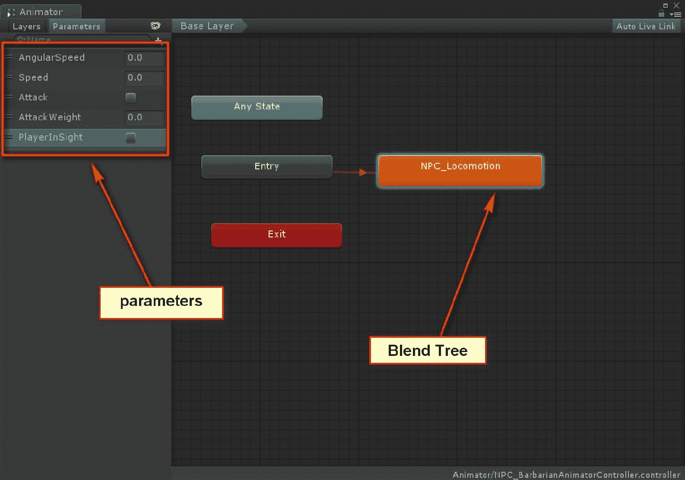

在检查器窗口中，将 *混合类型* 更改为 *2D 自由形式笛卡尔*：

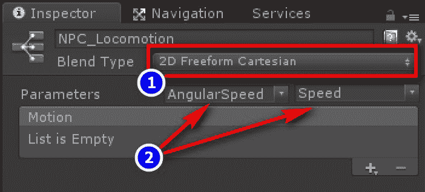

*x* 轴将由 *AngularSpeed* 表示，*y* 轴将由 *Speed* 参数表示。

混合树将包含所有不同的运动动画状态。这些将是空闲、行走和跑步状态。

我为我的 NPC 设置了 11 个不同的动画状态，用于移动。以下截图将为你提供一个混合树的概述：

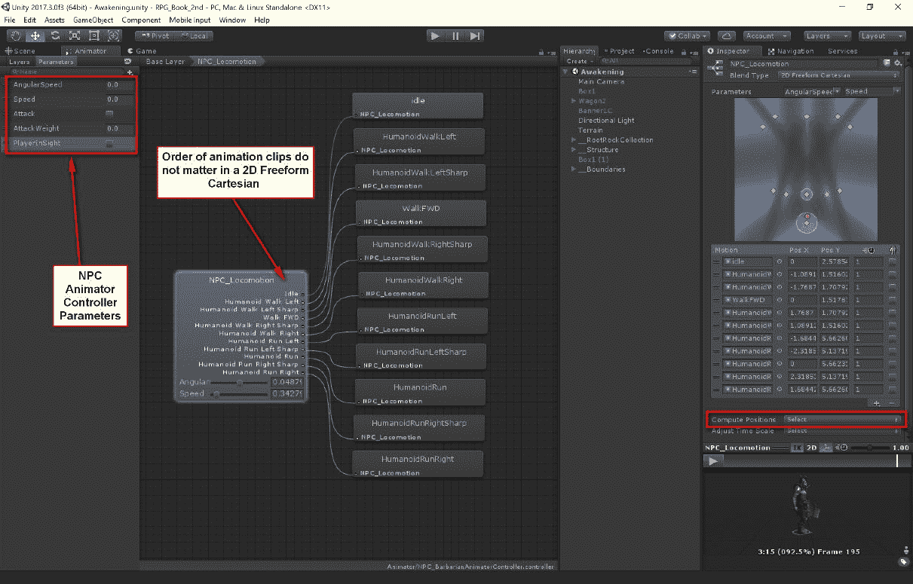

NPC 混合树

一旦你在混合树中包含了所有动画状态，你需要计算你动画的位置。一个简单的方法是选择 *计算位置* 下拉菜单并选择 *AngularSpeed 和 Speed*。这将根据根运动放置动画位置，如图所示：

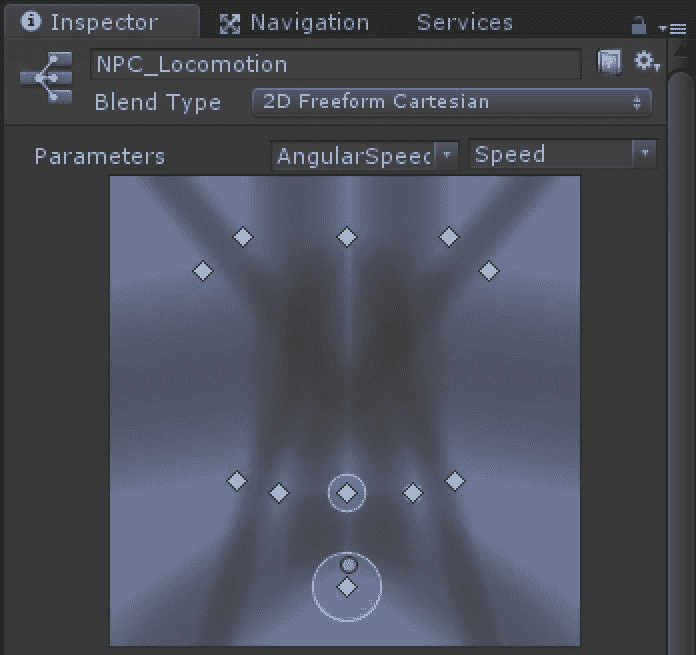

你可以使用鼠标拖动截图中的红色点来预览你的动画状态。

# NPC 攻击

为了实现我们的攻击模式，我们需要在动画控制器中创建一个新的层。继续创建一个新的层，并将其命名为 `NPC_Attack`。这个层将负责在我们进入攻击模式时对角色进行动画处理。

我们需要为这个层创建一个新的遮罩。这个遮罩将用于确定哪些人体部位会受到层动画的影响。要创建遮罩，在项目窗口中右键单击并选择创建 *|* 角色遮罩。将新遮罩命名为 `NPC_BarbarianAttackMask`。使用检查器窗口禁用我们不想受层动画影响的身体部位，如图所示：

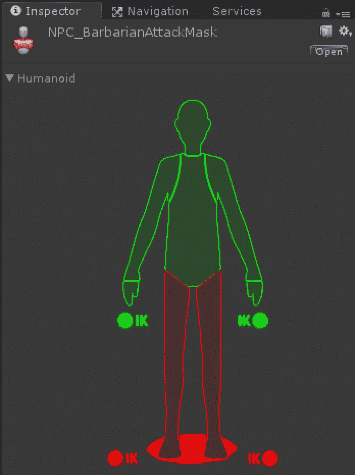

你的层设置应该看起来像以下截图：

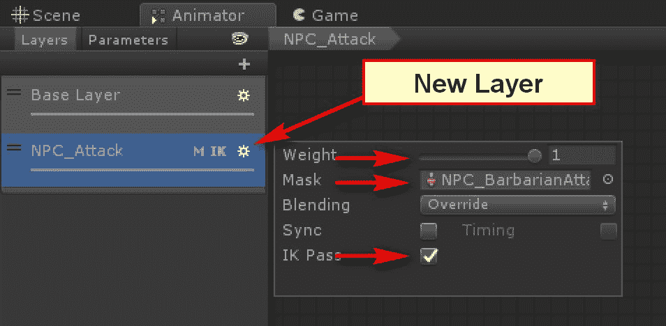

确保将权重属性更改为*1*，将分配给我们所创建的 Avatar Mask 的遮罩属性，并且还要确保 IK 属性被选中。现在我们就可以创建我们的攻击状态机了。

在动画器窗口中右键单击并选择创建状态 *|* 空状态。将你的攻击动画（们）拖放到空状态中。空状态用于在主层和返回之间有一个良好的过渡。

在你将攻击动画（们）放入动画器后，你需要使用过渡条件将它们连接起来。我已经将三个额外的参数添加到参数列表中，分别命名为 attack1、attack2 和 attack3。这些参数与攻击参数一起，将确定 NPC 将过渡到哪个攻击状态。

以下截图显示了配置到这一点的`NPC_Attack`层：

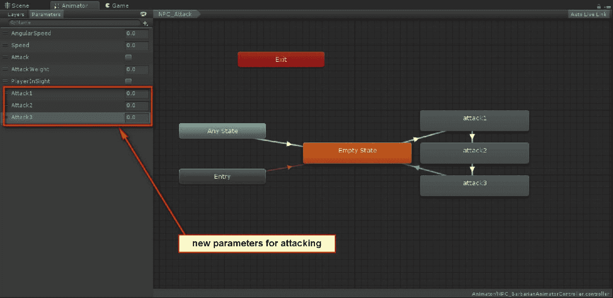

新参数

最后，你想要将新的`NPC_BarbarianAnimatorController`分配给 NPC 预制件（们）。

# NPC AI

现在是时候给我们的 NPC 添加一些智能了。我们需要创建的一个脚本是将 NPC 的能力赋予它来检测玩家。这个脚本将被命名为`NPC_BarbarianMovement.cs`。这个脚本将用于检测玩家是否在视野中，计算 NPC 的视野，以及计算 NPC 到玩家角色的路径。

这里是源代码的列表：

```cs
using UnityEngine;
using UnityEngine.AI;
namespace com.noorcon.rpg2e
{
public class NPC_BarbarianMovement : MonoBehaviour
{
// reference to the animator
public Animator animator;
// these variables are used for the speed
// horizontal and vertical movement of the NPC
public float speed = 0.0f;
public float h = 0.0f;
public float v = 0.0f;
public bool attack = false; // used for attack mode 1
public bool jump = false; // used for jumping
public bool die = false; // are we alive?
// used for debugging
public bool DEBUG = false;
public bool DEBUG_DRAW = false;
// Reference to the NavMeshAgent component.
private NavMeshAgent nav;
// Reference to the sphere collider trigger component.
private SphereCollider col;
// where is the player character in relation to NPC
public Vector3 direction;
// how far away is the player character from NPC
public float distance = 0.0f;
// what is the angle between the PC and NPC
public float angle = 0.0f;
// a reference to the player character
public GameObject player;
// is the PC in sight?
public bool playerInSight;
// what is the field of view for our NPC?
// currently set to 110 degrees
public float fieldOfViewAngle = 110.0f;
// calculate the angle between PC and NPC
public float calculatedAngle;
void Awake()
{
// get reference to the animator component
animator = GetComponent<Animator>() as Animator;
// get reference to nav mesh agent
nav = GetComponent<NavMeshAgent>() as NavMeshAgent;
// get reference to the sphere collider
col = GetComponent<SphereCollider>() as SphereCollider;
// get reference to the player
player = GameObject.FindGameObjectWithTag("Player") as GameObject;
// we don't see the player by default
playerInSight = false;
}
// Use this for initialization
void Start()
{
}
void Update()
{
// if player is in sight let's slerp towards the player
if (playerInSight)
{
transform.rotation =
Quaternion.Slerp(this.transform.rotation,
Quaternion.LookRotation(direction), 0.1f);
}
}
// let's update our scene using fixed update
void FixedUpdate()
{
h = angle; // assign horizontal axis
v = distance; // assign vertical axis
// calculate speed based on distance and delta time
speed = distance / Time.deltaTime;
if (DEBUG)
Debug.Log(string.Format("H:{0} - V:{1} - Speed:{2}", h, v, speed));
// set the parameters defined in the animator controller
animator.SetFloat("Speed", speed);
animator.SetFloat("AngularSpeed", v);
animator.SetBool("Attack", attack);
}
```

好的，那么让我们实际看看这段代码试图做什么。在`Awake()`函数中，我们初始化将在脚本中使用的变量。我们有一个指向 NPC 附加的`NavMeshAgent`、`SphereCollider`和`Animator`组件的引用。这些分别存储在`nav`、`col`和`anim`变量中：

```cs
// if the PC is in our collider, we want to examine the location
// of the player
// calculate the direction based on our position and the
// player's position
// use the DOT product to get the angle between the two vectors
// calculate the angle between the NPC forward vector and the PC
// if it falls within the field of view, we have the player in
// sight
// if the player is in sight, we will set the nav agent destination
// if we are within a certain distance from the PC, the NPC has
// the ability to attack
void OnTriggerStay(Collider other)
{
if (other.transform.tag.Equals("Player"))
{
// Create a vector from the enemy to the player and store
// the angle between it and forward.
direction = other.transform.position - transform.position;
distance = Vector3.Distance(other.transform.position, transform.position) - 1.0f;
float DotResult = Vector3.Dot(transform.forward, player.transform.position);
angle = DotResult;
if (DEBUG_DRAW)
{
Debug.DrawLine(transform.position + Vector3.up, direction * 50, Color.gray);
Debug.DrawLine(other.transform.position, transform.position, Color.cyan);
}
playerInSight = false;
calculatedAngle = Vector3.Angle(direction, transform.forward);
if (calculatedAngle < fieldOfViewAngle * 0.5f)
{
RaycastHit hit;
if (DEBUG_DRAW)
Debug.DrawRay(transform.position + transform.up, direction.normalized, Color.magenta);
// ... and if a raycast towards the player hits something...
if (Physics.Raycast(transform.position + transform.up, direction.normalized, out hit,
col.radius))
{
// ... and if the raycast hits the player...
if (hit.collider.gameObject == player)
{
// ... the player is in sight.
playerInSight = true;
if (DEBUG)
Debug.Log("PlayerInSight: " + playerInSight);
}
}
}
if (playerInSight)
{
nav.SetDestination(other.transform.position);
CalculatePathLength(other.transform.position);
if (distance < 1.1f)
{
attack = true;
}
else
{
attack = false;
}
}
}
}
```

我们还需要获取对玩家和玩家动画组件的引用。这是通过`player`变量来完成的。我们还默认将`playerInSight`变量设置为 false：

```cs
void OnTriggerExit(Collider other)
{
if (other.transform.tag.Equals("Player"))
{
distance = 0.0f;
angle = 0.0f;
attack = false;
playerInSight = false;
}
}
// this is a helper function at this point
// in the future we will use it to calculate distance around
// the corners
// it currently is also used to draw the path of the nav mesh
// agent in the
// editor
float CalculatePathLength(Vector3 targetPosition)
{
// Create a path and set it based on a target position.
NavMeshPath path = new NavMeshPath();
if (nav.enabled)
nav.CalculatePath(targetPosition, path);
// Create an array of points which is the length of the number
// of corners in the path + 2.
Vector3[] allWayPoints = new Vector3[path.corners.Length + 2];
// The first point is the enemy's position.
allWayPoints[0] = transform.position;
// The last point is the target position.
allWayPoints[allWayPoints.Length - 1] = targetPosition;
// The points inbetween are the corners of the path.
for (int i = 0; i < path.corners.Length; i++)
{
allWayPoints[i + 1] = path.corners[i];
}
// Create a float to store the path length that is by default 0.
float pathLength = 0;
// Increment the path length by an amount equal to the
// distance between each waypoint and the next.
for (int i = 0; i < allWayPoints.Length - 1; i++)
{
pathLength += Vector3.Distance(allWayPoints[i], allWayPoints[i + 1]);
if (DEBUG_DRAW)
Debug.DrawLine(allWayPoints[i], allWayPoints[i + 1], Color.red);
}
return pathLength;
}
}
}
```

目前`Update()`函数没有执行任何重大操作。它只是检查玩家角色是否在视野中，如果是的话，确保 NPC 正在调整自己的方向以看向玩家。

我们代码的大部分内容都在`OnTriggerStay()`函数中。我们首先需要做的是确保进入我们碰撞器的对象是玩家对象。这是通过检查另一个碰撞器的标签属性来完成的。

如果玩家在我们的碰撞器内，我们就继续计算玩家相对于 NPC 的方向、距离和角度。这是通过以下行来完成的：

```cs
direction = other.transform.position - transform.position; 

distance = Vector3.Distance(other.transform.position, transform.position) - 1.0f; 

float DotResult = Vector3.Dot(transform.forward,player.transform.position); 

angle = DotResult; 
```

然后，如果角度小于`fieldOfViewAngle`变量，我们可以使用射线投射来确定是否能击中玩家。如果是这样，玩家就在 NPC 的视野中：

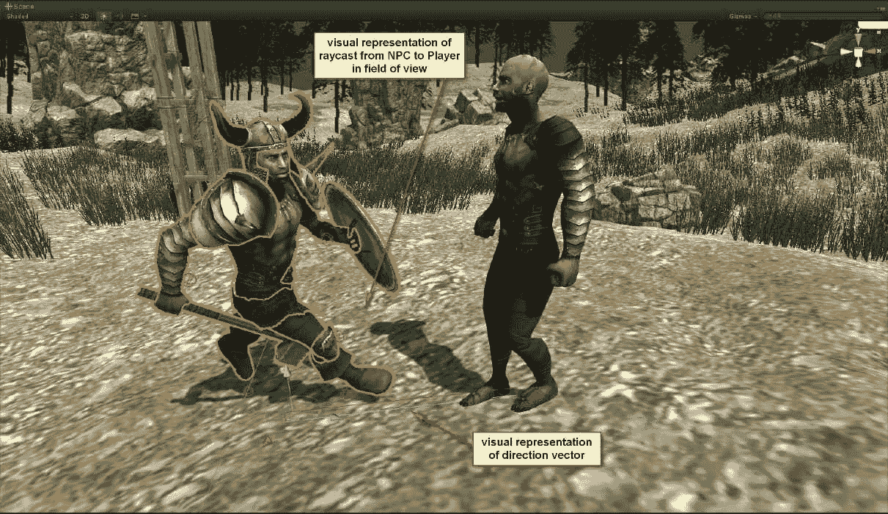

调试射线

NPC 需要执行的一个更关键的计算是如何在到达范围内后到达玩家。一旦我们确定玩家在范围内，并且我们面对玩家，我们需要让 NPC 找到到达玩家的路径。这就是`NavMesh`和`NavMeshAgent`发挥作用的地方。

`CalculatePathLength()`是一个函数，它接受玩家的位置，并使用网格数据，计算出从 NPC 位置到玩家位置的最佳路径。

然而，我们还在执行一个额外的计算，那就是计算两点之间的路径长度。这个长度计算将在未来用于执行以下操作：

如果路径长度超过我们设定的阈值，那么我们不会让 NPC 发起攻击。如果它在平均值范围内，那么我们可以让 NPC 向玩家移动以进行战斗。

在最后一个函数`OnTriggerExit()`中，我们将`playerInSight`变量设置为 false。这将阻止 NPC 追逐玩家：

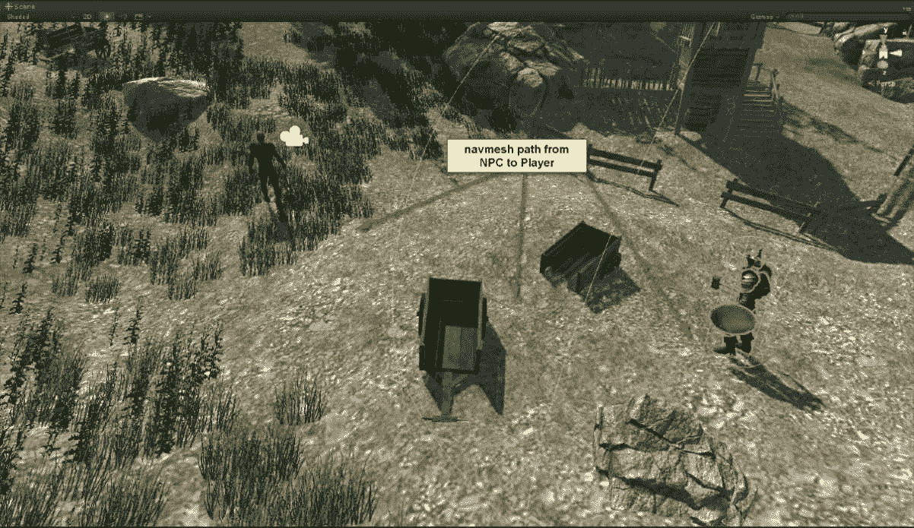

Navmesh path

上述截图展示了基于实时计算的 NPC 和玩家之间的路径。

如果你还没有这样做，请将脚本附加到 NPC 预制体上，并运行应用程序以测试它。如果一切正常，那么你将能够移动玩家角色在关卡中移动，一旦玩家角色进入 NPC 视野，NPC 将开始向玩家移动，并在足够接近时攻击：

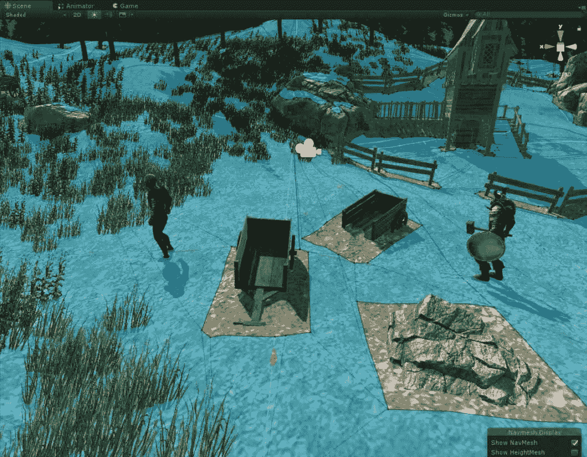

到目前为止，你的 NPC 应该在其预制体上附加以下组件：

+   Animator

+   Rigidbody

+   Capsule 和 sphere colliders

+   NavMesh Agent

+   `NPC_BarbarianMovement`脚本

我们已经覆盖了大量的信息。我鼓励你花时间再次阅读它，并在继续之前理解这些概念。

# PC 和 NPC 交互

到目前为止，我们已经为我们的 PC 和 NPC 创建了基本移动。我接下来想要完成的是 PC 和 NPC 角色的攻击机制。让我们先实现 NPC 的击中效果。

根据我们在上一节中创建的代码，我们的 NPC 能够检测到玩家角色。当玩家角色在视野中时，NPC 将找到到达玩家角色的最短路径，并在给定范围内攻击玩家角色。我们已经完成了移动和动画机制。下一个目标是跟踪 NPC 攻击时的生命值。

我们需要在`NPC_Animator_Controller`中进行一些调整。打开 Animator 窗口，并选择`NPC_Attack`层：

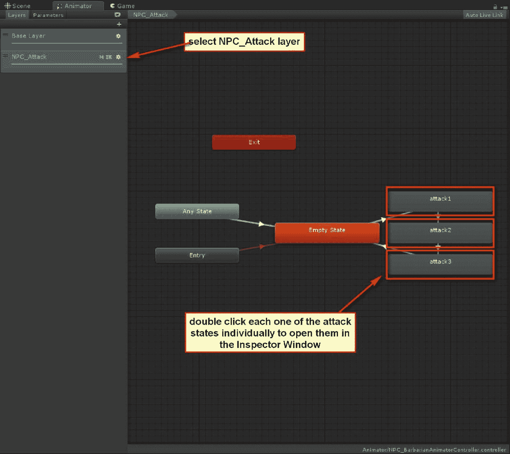

NPC 攻击层

双击*attack1*状态，或者你在状态机中定义的攻击状态。这将在检查器窗口中打开相关的动画。

在检查器窗口中，向下滚动到 *曲线* 部分。我们将通过在 *曲线* 部分的 (+) 符号下选择来创建一个新的曲线。我们还将创建一个新的参数，称为 *Attack1C*，以表示曲线的值。此参数应为 float 类型：

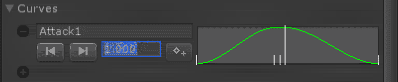

前一个屏幕截图显示的曲线将基于你的动画：

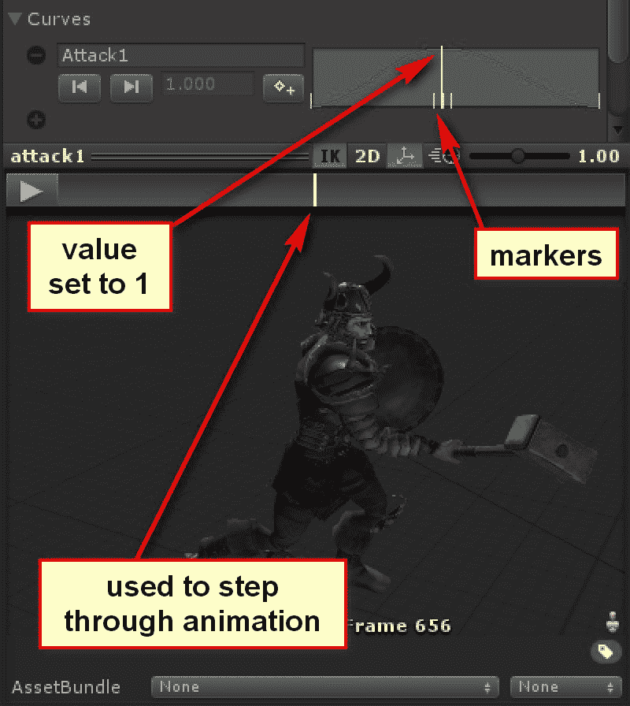

在前一个屏幕截图中，我标记了你需要与之交互以配置动画曲线的接口的重要部分。第一步是实际预览你的动画，并对其有一个感觉。

我特定的动画序列的下一步是确定模型的右手何时进入，我在曲线上设置了一个标记。我在动画中稍后位置又设置了一个标记，此时右手已经从右侧很好地跨到了左侧。

这些标记将在 NPC 攻击模式下的动画中指示击中点：

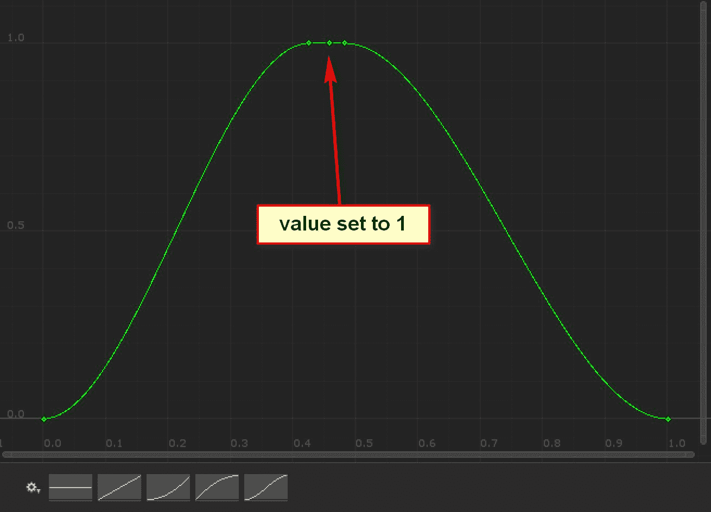

好的，我们为什么要这样做呢？简单。这将帮助我们仅根据动画曲线生成击中效果。这样，当武器远离玩家身体时，我们不会击中玩家并减少玩家的生命值。

接下来，我们需要更新我们的 `NPC_BarbarianMovement.cs` 代码来编程 NPC 攻击。

注意：我只列出了已更新的部分。

这是代码的更新列表：

```cs
using UnityEngine; 
using System.Collections; 

public class NPC_Movement : MonoBehaviour 
{ 
... 
    void Update() 
    { 
        // if player is in sight let's slerp towards the player 
        if (playerInSight) 
        { 
            this.transform.rotation = 
                Quaternion.Slerp(this.transform.rotation, 
                Quaternion.LookRotation(direction), 0.1f); 
        } 

        if(this.player.transform.GetComponent<CharacterController>().die) 
        { 
            animator.SetBool("Attack", false); 
            animator.SetFloat("Speed", 0.0f); 
            animator.SetFloat("AngularSpeed", 0.0f); 
        } 
    } 

    // let's update our scene using fixed update 
    void FixedUpdate() 
    { 
        h = angle;          // assign horizontal axis 
        v = distance;       // assign vertical axis 

        // calculate speed based on distance and delta time 
        speed = distance / Time.deltaTime; 

        if (DEBUG) 
            Debug.Log(string.Format("H:{0} - V:{1} - Speed:{2}", h, v, speed)); 

        // set the parameters defined in the animator controller 
        animator.SetFloat("Speed", speed); 
        animator.SetFloat("AngularSpeed", v); 
        animator.SetBool("Attack", attack1); 
        animator.SetBool("Attack1", attack1); 

        if(playerInSight) 
        { 
            if (animator.GetFloat("Attack1C") == 1.0f) 
            { 
                this.player.GetComponent<PlayerAgent>().playerCharacterData.HEALTH -= 1.0f; 
            } 
        } 
    } 
... 
} 
```

代码的新增部分检查玩家是否在视线范围内，如果是这样，我们检查我们是否在攻击范围内。如果是这样，我们就进入攻击模式。如果我们处于攻击模式，就播放攻击动画。

在代码中，我们检查新创建的参数 *Attack1* 的值，如果它恰好是 1.0，我们就继续减少玩家角色的生命值。

如果玩家在 NPC 攻击时死亡，它将停止攻击并返回空闲状态。

好吧，你可能想知道我们是如何获得从玩家角色获取信息的能力的。这是因为我们需要创建一些额外的 C# 脚本。让我们继续这样做。创建以下 C# 脚本：

+   `PlayerCharacter.cs`: 这将是我们的玩家角色类，它将继承我们之前定义的 `BaseCharacter` 类

+   `PlayerAgent.cs`: 这将用于存储玩家数据并继承 `MonoBehaviour`

+   `NPC.cs`: 这将是我们的非玩家角色类，它将继承自 `BaseCharacter` 类

+   `NPC_Agent.cs`: 这将用于存储 NPC 数据并继承 `MonoBehaviour`

我对 `BaseCharacter.cs` 脚本进行了一些修改，使其通过编辑器更容易访问。以下是新的列表：

```cs
    using System;
    using UnityEngine;

    namespace com.noorcon.rpg2e
    {
       [Serializable]
       public class BaseCharacter
       {
          [SerializeField]
          public string Name;
          [SerializeField]
          public string Description;

          [SerializeField]
          public float Strength;
          [SerializeField]
          public float Defense;
          [SerializeField]
          public float Dexterity;
          [SerializeField]
          public float Intelligence;
          [SerializeField]
          public float Health;
       }
    }
```

我已经创建了类和字段，使其可序列化。

让我们看看 `PlayerCharacter.cs` 的列表：

```cs
using System; 
using UnityEngine; 

namespace com.noorcon.rpg2e 
{ 
   [Serializable] 
   public class PlayerCharacter : MonoBehaviour 
   { 

   } 
} 
```

目前那里没有什么动作。现在让我们看看`PlayerAgent.cs`：

```cs
using System; 
using UnityEngine; 

namespace com.noorcon.rpg2e 
{ 
   [Serializable] 
   public class PlayerAgent : MonoBehaviour 
   { 
      public PlayerCharacter playerCharacterData; 

      void Awake() 
      { 
         PlayerCharacter tmp = new PlayerCharacter(); 
         tmp.Name = "Maximilian"; 
         tmp.Health = 100.0f; 
         tmp.Defense = 50.0f; 
         tmp.Description = "Our Hero"; 
         tmp.Dexterity = 33.0f; 
         tmp.Intelligence = 80.0f; 
         tmp.Strength = 60.0f; 

         playerCharacterData = tmp; 
      } 

      // Use this for initialization 
      void Start() 
      { 

      } 

      // Update is called once per frame 
      void Update() 
      { 
         if (playerCharacterData.Health < 0.0f) 
         { 
            playerCharacterData.Health = 0.0f; 

            transform.GetComponent<BarbarianCharacterController>().die = true; 
         } 
      } 
   } 
} 
```

在玩家代理代码中，我们在`Awake()`函数中为我们的 PC 数据初始化了一些默认值。由于类已被序列化，我们实际上可以在运行时看到这些数据，用于调试目的。

在`Update()`函数中，我们检查我们的 PC 的健康值是否小于 0.0f，如果是，那么这表明玩家已经死亡。然后我们使用我们创建的`CharacterController`组件将*死亡*属性设置为 true。`CharacterController`随后将使用新值并与玩家角色的动画控制器通信，使玩家角色进入死亡状态。

注意，我们的`NPC_BarbarianMovement.cs`脚本正在通过脚本中创建的引用访问确切的 PC 数据。

您需要将`PlayerAgent.cs`脚本附加到场景中的玩家角色上：

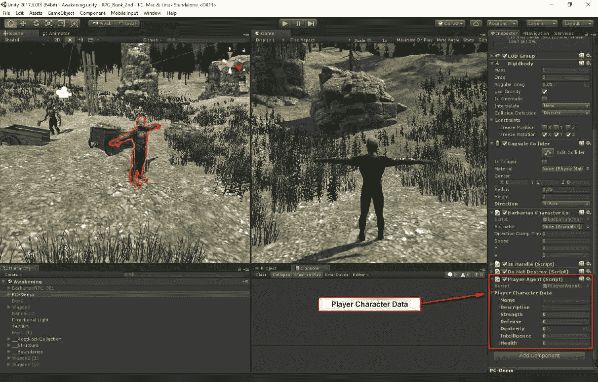

玩家角色数据

在前面的屏幕截图中，您可以看到我们对脚本所做的添加以及它们在运行时的外观。我们将在未来的章节中列出`NPC.cs`和`NPC_Agent.cs`。目前，它们尚未使用。

# 摘要

这一章内容非常丰富。我们涵盖了章节中一些非常重要的主题和概念，这些可以用于并增强您的游戏。我们通过研究如何定制玩家角色开始了这一章。您从该部分学到的概念可以应用于各种不同的场景。

我们研究了如何理解您的人物模型的结构，以便您可以更好地确定定制方法。这些包括不同的武器、服装、盔甲、盾牌等等。

我们接着研究了如何创建用户界面，以帮助我们在游戏过程中定制我们的玩家角色。我们还了解到，我们开发的工具可以快速创建几个不同的角色模型（定制）并将它们作为预制件存储以供以后使用。节省了大量时间！我们还学习了如何在定制后保存玩家角色的游戏状态。

我们接下来研究了非玩家角色。我们了解了如何设置 NPC 的不同必要组件的基础知识。然后我们研究了如何创建导航网格以及如何使用导航网格与导航网格代理和路径查找进行交互。

我们为 NPC 创建了一个新的动画控制器。我们创建了一个用于 NPC 动画的 2D 自由形式笛卡尔混合树。我们研究了如何在动画控制器中创建多个层级并启用不同区域的人形骨骼的逆运动学（IK）。我们创建了初始的 NPC AI 脚本，用于检测并确定玩家是否足够接近，以便它进行移动和攻击。最后，我们创建了新的脚本，使 NPC 与玩家角色之间的交互成为可能。

到本章结束时，你应该对一切是如何相互关联的有一个很好的理解，并且对如何处理你的项目有一个想法。

在下一章中，我们将创造一种更好的方法来管理我们的游戏状态。
