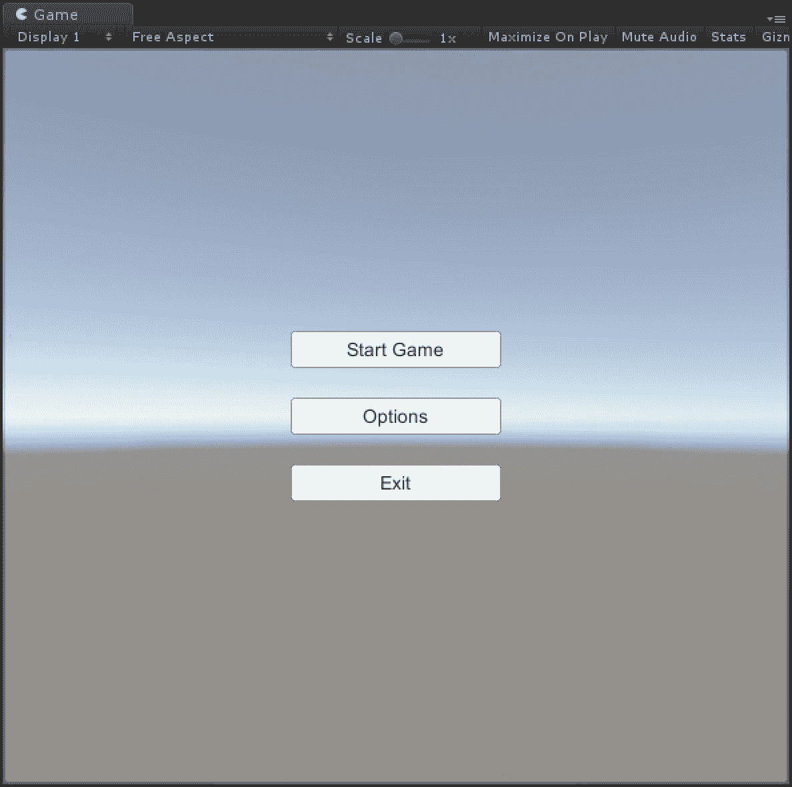
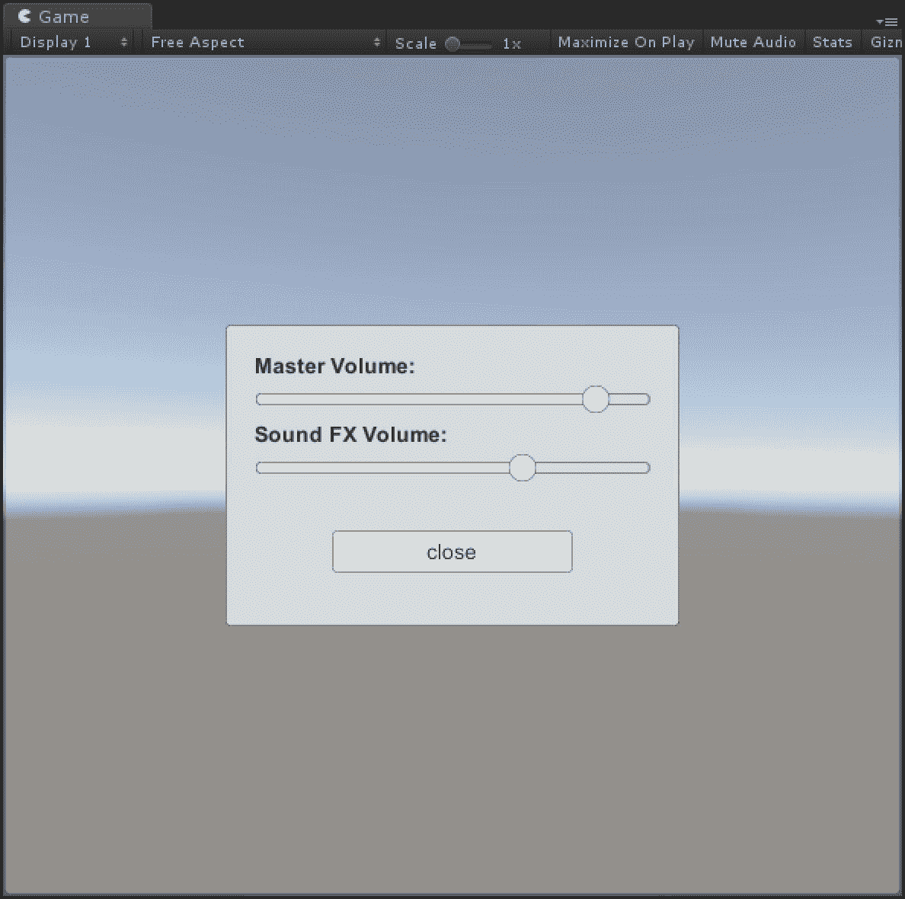
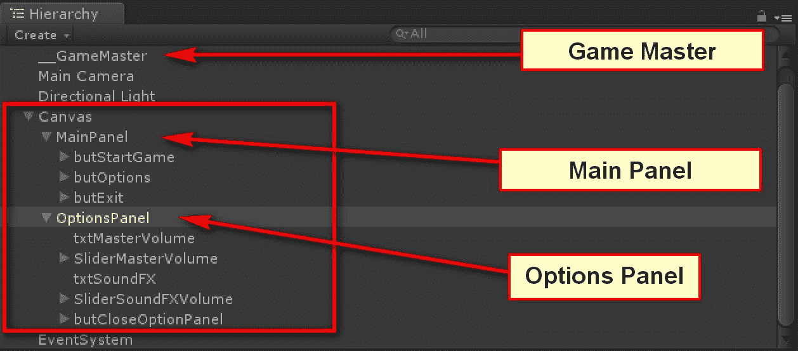
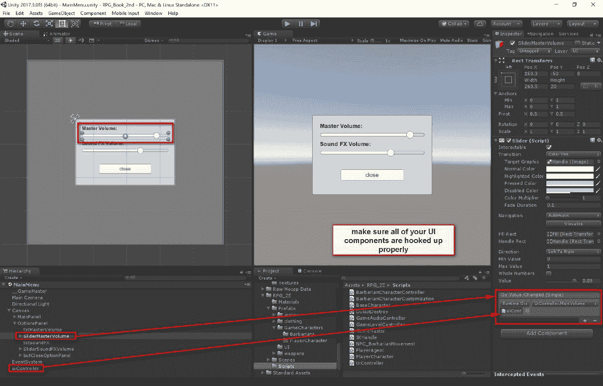
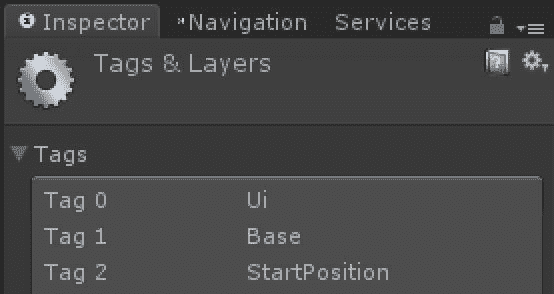
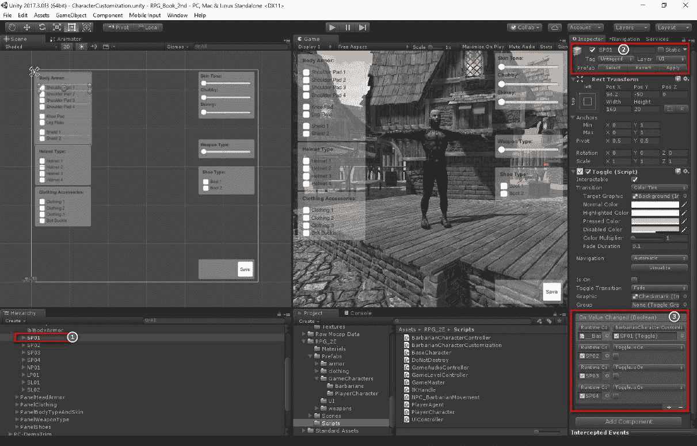
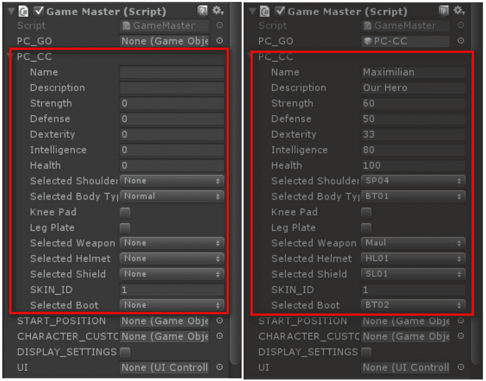

# 游戏大师和游戏机制

在第一章到第四章中，我们学习了如何制作我们 RPG 设计和实现所需的一些必要组件。例如，你应该对如何组织和安排你的玩家角色和非玩家角色资产和组件有一个很好的理解。

下面是本章内容的概述：

+   游戏大师

    +   管理游戏设置和场景

    +   场景管理

+   完善 GameMaster

    +   级别控制器

    +   音频控制器

+   玩家数据管理

    +   PC 类增强

    +   角色定制类更新

+   UI 控制器的更改

+   测试

在本章中，我们将对迄今为止所做的一切进行更多调整和更新。

# 游戏大师

尽管我们已经创建了 `GameMaster.cs` 脚本，但我们并没有真正利用它来管理我们的游戏。我们创建了一些游戏资产的部分，并使用它们进行快速测试。现在是时候开始考虑如何将所有这些结合起来，为我们的 RPG 创建一个更好的游戏管理器。

我希望 `GameMaster.cs` 执行以下几件事情。具体如下：

+   每个特定场景的 UI 控制器引用

+   在场景中拥有玩家角色的引用

+   在场景中拥有非玩家角色（NPC）的引用

+   拥有音频源的引用以进行控制

+   应始终有一个 `GameMaster` 类的实例可用

在创建我们的 GameMaster 时，我们将根据需要添加或删除一些元素。让我们从将用户界面与 GameMaster 集成开始。

打开主菜单场景。它应该看起来像以下截图：



以下截图显示了为我们设计的 RPG 主菜单：



这相当简单，只是为了说明概念。当玩家点击选项按钮时，他们将获得选项窗口，在那里他们可以调整游戏中的音量。完成操作后，他们将点击关闭按钮并返回主菜单。

这是主菜单场景的层次结构窗口截图：



# 管理游戏设置和音频

创建一个名为 `uiController` 的空 GameObject。我们现在需要创建一个 UI 控制器脚本，该脚本将处理用户交互。创建一个新的 C# 脚本并命名为 `UiController.cs`。

注意：随着我们的进展，本章中的脚本将进行更新和修改。

UI 控制器的列表如下：

```cs
using UnityEngine; 
using UnityEngine.UI; 

namespace com.noorcon.rpg2e 
{ 
   public class UiController : MonoBehaviour 
   { 
      public RectTransform OptionsPanel; 
      public Slider ControlMainVolume; 
      public Slider ControlFXVolume; 

      public void Update() 
      { 
      } 

      public void DisplaySettings() 
      { 
         GameMaster.instance.DisplaySettings = !GameMaster.instance.DisplaySettings; 
         OptionsPanel.gameObject.SetActive(GameMaster.instance.DisplaySettings); 
      } 

      public void MainVolume() 
      { 
         GameMaster.instance.MasterVolume(ControlMainVolume.value); 
      } 
      public void FXVolume() 
      { 
         GameMaster.instance.SoundFxVolume(ControlFXVolume.value); 
      } 
   } 
} 
```

目前，我们只定义了几个函数：`DisplaySettings()` 和 `MainVolume()`。这些函数非常简单；它们引用了用于显示设置面板以及检索音量控制滑块值的 UI 组件。然后，这些信息被传递到 `GameMaster.cs` 脚本以进行进一步处理。

我们需要对 `GameMaster.cs` 脚本进行一些更改。以下是代码列表：

```cs
using UnityEngine; 
using UnityEngine.SceneManagement; 

namespace com.noorcon.rpg2e 
{ 
   public static class SceneName 
   { 
      public const string MainMenu = "MainMenu"; 
      public const string CharacterCustomization = "CharacterCustomization"; 
      public const string Level_1 = "Awakening"; 
   } 

   public class GameMaster : MonoBehaviour 
   { 
      public static GameMaster instance; 

      // let's have a reference to the player character 
      // and start position of player character 
      public GameObject Pc; 
      public GameObject StartPosition; 
      public GameObject CharacterCustomization; 

      // let's have a reference to the current scene/level 
      public Scene CurrentScene; 

      // Ref to UI Elements ... 
      public bool DisplaySettings = false; 
      public UiController uiController; 

      public int Level = 0; 

      // initial audio levels for background and 
      // sound FX 
      public float AudioLevel = 0.33f; 
      public float FxLevel = 0.33f; 

      void Awake() 
      { 
         // simple singleton 
         if (instance == null) 
         { 
            instance = this; 
         } 
         else if (instance != this) 
         { 
            Destroy(this); 
         } 

         // keep the game object when moving from 
         // one scene to the next scene 
         DontDestroyOnLoad(this); 
      } 

      // Use this for initialization 
      void Start() 
      { 
         // let's find a reference to the UI controller of the loaded scene 
         if (GameObject.FindGameObjectWithTag("UI") != null) 
         { 
            instance.uiController = GameObject.FindGameObjectWithTag("UI").GetComponent<UiController>(); 
         } 

         instance.uiController.OptionsPanel.gameObject.SetActive(instance.DisplaySettings); 
      } 

      // Update is called once per frame 
      void Update() 
      { 

      } 

      public void MasterVolume(float volume) 
      { 
         instance.AudioLevel = volume; 
         instance.GetComponent<AudioSource>().volume = instance.AudioLevel; 
      } 

      public void StartGame() 
      { 
         // NOTE: Start the game, load the scene that allows the player 
         // to customize their character 
         SceneManager.LoadScene(SceneName.CharacterCustomization); 
      } 
   } 
} 
```

这段代码需要一点解释。首先要理解的最重要概念是 Singleton 的概念。这是通过首先定义一个静态变量来完成的，该变量将用于保存我们的 `GameMaster` 实例：

```cs
public static GameMaster instance;
```

然后，在我们的 `Awake()` 函数中，我们需要以下代码：

```cs
void Awake()
{
// simple singleton
if (instance == null)
{
instance = this;
}
else if (instance != this)
{
Destroy(this);
}
// keep the game object when moving from
// one scene to the next scene
DontDestroyOnLoad(this);
}
```

在 `Awake()` 函数中，我们正在检查 `instance` 变量是否已初始化。它将 `instance` 变量初始化一次。接下来的检查确保我们始终只有一个实例。换句话说，如果由于错误而再次实例化 `GameMaster` 对象，它将被销毁。代码的最后一条，`DotDestroyOnLoad()`，将确保当从当前场景移动到下一个场景时，GameObject 不会被销毁。

在 `Start()` 函数中，我们检查 `uiController` 是否存在，如果存在，我们就获取它的引用。一旦我们有了 `uiController` 的引用，我们确保设置面板默认是禁用的，也就是说，是隐藏的。

`MasterVolume()` 函数由 `UIController.cs` 脚本调用，然后传递从定义的滑块中获取的实际音量值来控制背景音乐的音量。

# 管理场景

下一个我想实现的是让 `GameMaster` 控制游戏的不同场景加载。让我们看看 `GameMaster.cs` 将如何看起来，随着场景管理的添加：

```cs
using UnityEngine;
using UnityEngine.SceneManagement;
namespace com.noorcon.rpg2e
{
public static class SceneName
{
public const string MainMenu = "MainMenu";
public const string CharacterCustomization =
"CharacterCustomization";
public const string Level_1 = "Awakening";
}
[RequireComponent(typeof(AudioSource))]
public class GameMaster : MonoBehaviour
{
public static GameMaster instance;
// let's have a reference to the player character
// and start position of player character
public GameObject Pc;
public GameObject StartPosition;
public GameObject CharacterCustomization;
// let's have a reference to the current scene/level
public Scene CurrentScene;
// Ref to UI Elements ...
public bool DisplaySettings = false;
public UiController Ui;
public int Level = 0;
// initial audio levels for background and
// sound FX
public float AudioLevel = 0.33f;
public float FxAudioLevel = 0.33f;
void Awake()
{
// simple singlton
if (instance == null)
{
instance = this;
}
else if (instance != this)
{
Destroy(this);
}
// keep the game object when moving from
// one scene to the next scene
DontDestroyOnLoad(this);
}
// for each level/scene that has been loaded
// do some of the preparation work
void OnLevelWasLoaded()
{
instance.CurrentScene = SceneManager.GetActiveScene();
if (instance.CurrentScene.name.Equals(SceneName.CharacterCustomization))
{
if (GameObject.FindGameObjectWithTag("BASE") != null)
{
instance.CharacterCustomization = GameObject.FindGameObjectWithTag("BASE") as GameObject;
}
}
// If we are at any other scene except character customization
// let's go ahead and get reference to player and player
// stat position
if (!this.CurrentScene.name.Equals(SceneName.CharacterCustomization))
{
// let's get a reference to our player character
if (instance.Pc == null)
{
if (GameObject.FindGameObjectWithTag("Player") != null)
{
instance.Pc = GameObject.FindGameObjectWithTag("Player") as GameObject;
}
}
```

```cs
if (GameObject.FindGameObjectWithTag("START_POSITION") != null)
...
```

我们已经讨论了 `Awake()` 函数的作用，现在让我们看看下一个重要的函数，`OnLevelWasLoaded()`。看看以下代码：

```cs
public void MasterVolume(float volume)
{
instance.AudioLevel = volume;
instance.GetComponent<AudioSource>().volume = instance.AudioLevel;
}
public void SoundFxVolume(float volume)
{
instance.FxAudioLevel = volume;
}
public void StartGame()
{
// NOTE: Start the game, load the scene that allows the player
// to customize their character
SceneManager.LoadScene(SceneName.CharacterCustomization);
}
public void LoadLevel()
{
switch (instance.Level)
{
// load level 1
case 1:
{
instance.Pc = GameObject.FindGameObjectWithTag("Player") as GameObject;
SceneManager.LoadScene(SceneName.Level_1);
break;
}
}
}
}
}
```

`OnLevelWasLoaded()` 函数是在场景加载后由 Unity 调用的。我们在 `GameMaster` 脚本中使用此函数执行一些任务。我们首先做的事情是获取我们当前所在的场景。这些信息将用于稍后确定 `GameMaster` 将执行什么操作。

我们检查是否处于角色定制场景。这是玩家在开始游戏之前可以定制 PC 的地方。如果我们处于角色定制场景，我们想要获取场景中 `Base` GameObject 的引用。如果你还记得，`Base` GameObject 上附加了 `CharacterCutomization.cs` 脚本，该脚本用于定制角色。

如果我们处于任何其他场景，那么我们想要获取玩家角色的引用，以及场景开始时玩家角色的起始位置（如果有的话）。

然后，我们使用 `DetermineLevel()` 函数来确定我们当前所在的级别，以便进行更多配置。

当前实现用于启动游戏和加载级别的两个函数由 `StartGame()` 函数和 `LoadLevel()` 函数处理。

```cs
public static class SceneName
{
public const string MainMenu = "MainMenu";
public const string CharacterCustomization = "CharacterCustomization";
public const string Level_1 = "Awakening";
}
```

`SceneName` 类旨在使在 C# 代码中引用场景名称变得更加容易。这使得在项目中更改实际场景名称变得更容易，但代码中的调用名称保持一致。

到目前为止，一切都很顺利，但我们可以尝试让它变得更好。

# 改进 GameMaster

我们目前拥有的代码是可行的，但它并不十分整洁。让我们继续改进代码结构。让我们创建一个新的脚本，命名为`GameLevelController.cs`。这个新的脚本将处理我们的等级管理逻辑。

# 等级控制器

`GameLevelController.cs`的代码列表如下：

```cs
using UnityEngine;
using UnityEngine.SceneManagement;
namespace com.noorcon.rpg2e
{
public static class SceneName
{
public const string MainMenu = "MainMenu";
public const string CharacterCustomization = "CharacterCustomization";
public const string Level_1 = "Awakening";
}
public class GameLevelController
{
// let's have a reference to the current scene/level
public Scene CurrentScene
{
get { return SceneManager.GetActiveScene(); }
}
// keep the numerical level value
public int Level = 0;
public void OnLevelWasLoaded()
{
// if we are in the character customization scene,
// let's get a reference to the Base game object for future use.
if (CurrentScene.Equals(SceneName.CharacterCustomization))
{
if (GameObject.FindGameObjectWithTag("Base") != null)
{
GameMaster.instance.CharacterCustomization = GameObject.FindGameObjectWithTag("Base") as GameObject;
}
}
// If we are at any other scene except character customization
// let's go ahead and get reference to player and player
// stat position
if (CurrentScene.name.Equals(SceneName.CharacterCustomization))
{
// let's get a reference to our player character
if (GameMaster.instance.Pc == null)
{
if (GameObject.FindGameObjectWithTag("Player") != null)
{
GameMaster.instance.Pc = GameObject.FindGameObjectWithTag("Player") as GameObject;
}
}
if (GameObject.FindGameObjectWithTag("StartPosition") != null)
{
GameMaster.instance.StartPosition = GameObject.FindGameObjectWithTag("StartPosition") as GameObject;
}
if (GameMaster.instance.StartPosition != null && GameMaster.instance.Pc != null)
{
GameMaster.instance.Pc.transform.position = GameMaster.instance.StartPosition.transform.position;
GameMaster.instance.Pc.transform.rotation = GameMaster.instance.StartPosition.transform.rotation;
}
}
// determine what level we are on
DetermineLevel();
}
// this function will set a numerical value for our levels
private void DetermineLevel()
{
switch (CurrentScene.name)
{
case SceneName.MainMenu:
case SceneName.CharacterCustomization:
{
Level = 0;
break;
}
case SceneName.Level_1:
{
Level = 1;
GameMaster.instance.Pc.GetComponent<IKHandle>().enabled = true;
break;
}
default:
{
Level = 0;
break;
}
}
}
.....
```

我所做的是基本上将所有处理等级管理的代码移动到了`GameLevelController.cs`文件中。我们的`GameMaster`脚本来驱动 LevelController 类。我们稍后会看到这一点。

# 音频控制器

下一个代码清理工作是我想要对音频进行的。让我们创建一个新的脚本，命名为`GameAudioController.cs`。新脚本的代码如下：

```cs
using UnityEngine;
namespace com.noorcon.rpg2e
{
public class GameAudioController : MonoBehaviour
{
// initial audio levels for background and
// sound FX
public float AudioLevel = 0.33f;
public float FxAudioLevel = 0.33f;
public AudioSource audioSource;
public void SetDefaultVolume()
{
audioSource.volume = AudioLevel;
}
public void MasterVolume(float volume)
{
AudioLevel = volume;
audioSource.volume = AudioLevel;
}
public void SoundFxVolume(float volume)
{
FxAudioLevel = volume;
}
}
}
```

代码相当直接。现在，让我们看看`GameMaster.cs`的样子：

```cs
using UnityEngine;
namespace com.noorcon.rpg2e
{
[RequireComponent(typeof(AudioSource))]
public class GameMaster : MonoBehaviour
{
public static GameMaster instance;
// let's have a reference to the player character
// and start position of player character
public GameObject Pc;
public GameObject StartPosition;
public GameObject CharacterCustomization;
public GameLevelController LevelController;
public GameAudioController AudioController;
// Ref to UI Elements ...
public bool DisplaySettings = false;
public UiController Ui;
void Awake()
{
// simple singlton
if (instance == null)
{
instance = this;
// initialize level controller
instance.LevelController = new GameLevelController();
// initialize audio controller
instance.AudioController = new GameAudioController();
instance.AudioController.audioSource = instance.GetComponent<AudioSource>();
instance.AudioController.SetDefaultVolume();
}
else if (instance != this)
{
Destroy(this);
}
// keep the game object when moving from
// one scene to the next scene
DontDestroyOnLoad(this);
}
// for each level/scene that has been loaded
// do some of the preparation work
void OnLevelWasLoaded()
{
instance.LevelController.OnLevelWasLoaded();
}
// Use this for initialization
void Start()
{
// let's find a reference to the UI controller of the loaded scene
if (GameObject.FindGameObjectWithTag("Ui") != null)
{
instance.Ui = GameObject.FindGameObjectWithTag("Ui").GetComponent<UiController>();
}
instance.Ui.OptionsPanel.gameObject.SetActive(instance.DisplaySettings);
}
// Update is called once per frame
void Update()
{
}
public void MasterVolume(float volume)
{
instance.AudioController.MasterVolume(volume);
}
public void SoundFxVolume(float volume)
{
instance.AudioController.SoundFxVolume(volume);
}
public void StartGame()
{
instance.LoadLevel();
}
public void LoadLevel()
{
instance.LevelController.LoadLevel();
}
}
}
```

如你所见，代码更容易阅读，并且结构也更好。GameMaster 正在使用控制器来执行每个具体任务。这也使得维护我们游戏中不同任务中的代码更容易。例如，所有与音频相关的代码现在可以实现在控制器中，等等。

为了使所有这些工作，你必须确保你已经正确地将你的`uiController`GameObject 连接到`UiController.cs`类，以便当用户与选项/设置菜单交互时进行通信，如下面的截图所示：



UI 元素事件

你的项目现在应该已经定义了以下标签：



这些在 C#代码中用于在运行时识别 GameObject。

# 玩家数据管理

我们还没有保存代表玩家定制的数据的实际数据。下一步是增强我们的`PlayerCharacter.cs`和`BarbarianCharacterCustomization.cs`脚本，以便实际上在我们的 PC 对象中保存所选数据。

# PC 类增强

要做到这一点，我们需要修改我们的`PlayerCharacter.cs`代码。新的代码列表如下：

```cs
using System;
namespace com.noorcon.rpg2e
{
[Serializable]
public class PlayerCharacter : BaseCharacter
{
public enum ShoulderPad
{
none = 0,
SP01 = 1,
SP02 = 2,
SP03 = 3,
SP04 = 4
};
public enum BodyType { normal = 1, BT01 = 2, BT02 = 3
};
// Shoulder Pad
public ShoulderPad selectedShoulderPad = ShoulderPad.none;
public BodyType selectedBodyType = BodyType.normal;
public bool kneePad = false;
public bool legPlate = false;
public enum WeaponType
{
none = 0,
axe1 = 1,
axe2 = 2,
club1 = 3,
club2 = 4,
falchion = 5,
gladius = 6,
mace = 7,
maul = 8,
scimitar = 9,
spear = 10,
sword1 = 11,
sword2 = 12,
sword3 = 13
};
public WeaponType selectedWeapon = WeaponType.none;
public enum HelmetType { none = 0, HL01 = 1, HL02 = 2, HL03 = 3, HL04 = 4 };
public HelmetType selectedHelmet = HelmetType.none;
public enum ShieldType { none = 0, SL01 = 1, SL02 = 2 };
public ShieldType selectedShield = ShieldType.none;
public int SKIN_ID = 1;
public enum ShoeType { none = 0, BT01 = 1, BT02 = 2 };
public ShoeType selectedBoot = ShoeType.none;
}
}
```

我们定义了几个枚举类型，用于描述玩家角色定制的不同部分。使用枚举在我们的代码中有几个优点，其中一些是命名常量，名称描述了它们的作用，类型安全，并且更容易更改枚举的值，而无需检查代码中的数百个不同位置。

如前几章所述，角色定制代码与你的角色模型以及你如何为游戏使用角色模型绑定紧密相关。

你需要修改你的 UI 元素的名称，以匹配新的代码。

看看下面的截图：



连接 UI 元素事件

为了确保代码能够正常工作，你需要配置一些事情。首先，你需要正确命名你的 UI 元素，以匹配枚举。前面的截图展示了代表肩垫的一个 UI 元素。

# 角色定制类更新

驱动角色定制的活动附加到具有 `CharacterCustomization.cs` 脚本组件的 `Base` 预制件上。`CharacterCustomization.cs` 脚本如下所示：

```cs
using System;
using UnityEngine;
using UnityEngine.UI;

namespace com.noorcon.rpg2e
{
  public class BarbarianCharacterCustomization : MonoBehaviour
  {
    public GameObject PLAYER_CHARACTER;

    public PlayerCharacter PlayerCharacterData;

    public Material[] PLAYER_SKIN;

...

    // Use this for initialization
    void Start()
    {
      PlayerCharacterData = PLAYER_CHARACTER.GetComponent<PlayerAgent>().playerCharacterData;
    }

    public bool ROTATE_MODEL = false;

    // Update is called once per frame
    void Update()
    {
      if (Input.GetKeyUp(KeyCode.R))
      {
        ROTATE_MODEL = !ROTATE_MODEL;
      }

      if (ROTATE_MODEL)
      {
        PLAYER_CHARACTER.transform.Rotate(new Vector3(0, 1, 0), 33.0f * Time.deltaTime);
      }

      if (Input.GetKeyUp(KeyCode.L))
      {
        Debug.Log(PlayerPrefs.GetString("Name"));
      }

    }

        void DisableShoulderPads()
        {
            SHOULDER_PAD_R_01LOD0.SetActive(false);
            SHOULDER_PAD_R_02LOD0.SetActive(false);
            SHOULDER_PAD_R_03LOD0.SetActive(false);
            SHOULDER_PAD_R_04LOD0.SetActive(false);

            SHOULDER_PAD_L_01LOD0.SetActive(false);
            SHOULDER_PAD_L_02LOD0.SetActive(false);
            SHOULDER_PAD_L_03LOD0.SetActive(false);
            SHOULDER_PAD_L_04LOD0.SetActive(false);
        }

    public void SetShoulderPad(Toggle id)
    {
      try
      {
        PlayerCharacter.ShoulderPad name 
          = (PlayerCharacter.ShoulderPad)Enum.Parse(typeof(PlayerCharacter.ShoulderPad), id.name, true);
        if (id.isOn)
        {
          PlayerCharacterData.SelectedShoulderPad = name;
        }
        else
        {
          PlayerCharacterData.SelectedShoulderPad 
            = PlayerCharacter.ShoulderPad.none;
        }
      }
      catch
      {
        // if the value passed is not in the enumeration set it to none
        PlayerCharacterData.SelectedShoulderPad 
          = PlayerCharacter.ShoulderPad.none;
      }

            // disable before new selection
            DisableShoulderPads();

            switch (id.name)
      {
        case "SP01":
          {
            SHOULDER_PAD_R_01LOD0.SetActive(id.isOn);
            SHOULDER_PAD_L_01LOD0.SetActive(id.isOn);
            break;
          }
...
        case "SP04":
          {
            SHOULDER_PAD_R_04LOD0.SetActive(id.isOn);
            SHOULDER_PAD_L_04LOD0.SetActive(id.isOn);
            break;
          }
      }
    }

...
```

在列出的代码中，我们所做的是添加了一个名为 `PlayerCharacterData` 的新变量，其类型为 `PlayerCharacter`。`PlayerCharacter` 类是我们定义并增强的玩家角色类，用于包含我们的玩家角色的数据，如下所示：

```cs
    public void SetKneePad(Toggle id)
    {
      KNEE_PAD_R_LOD0.SetActive(id.isOn);
      KNEE_PAD_L_LOD0.SetActive(id.isOn);
    }

    public void SetLegPlate(Toggle id)
    {
      LEG_PLATE_R_LOD0.SetActive(id.isOn);
      LEG_PLATE_L_LOD0.SetActive(id.isOn);
    }

        void DisableWeapons()
        {
            AXE_01LOD0.SetActive(false);
            AXE_02LOD0.SetActive(false);
            CLUB_01LOD0.SetActive(false);
            CLUB_02LOD0.SetActive(false);
            FALCHION_LOD0.SetActive(false);
            GLADIUS_LOD0.SetActive(false);
            MACE_LOD0.SetActive(false);
            MAUL_LOD0.SetActive(false);
            SCIMITAR_LOD0.SetActive(false);
            SPEAR_LOD0.SetActive(false);
            SWORD_BASTARD_LOD0.SetActive(false);
            SWORD_BOARD_01LOD0.SetActive(false);
            SWORD_SHORT_LOD0.SetActive(false);
        }

    public void SetWeaponType(Slider id)
    {
      try
      {
        PlayerCharacter.WeaponType weapon = (PlayerCharacter.WeaponType)Convert.ToInt32(id.value);

        PlayerCharacterData.SelectedWeapon = weapon;
      }
      catch
      {
        PlayerCharacterData.SelectedWeapon = PlayerCharacter.WeaponType.none;
      }

            // disable weapons
            DisableWeapons();

      switch (Convert.ToInt32(id.value))
      {
        case 0:
          {
                        DisableWeapons();
            break;
          }
        case 1:
          {
            AXE_01LOD0.SetActive(true);
            break;
          }
...
        case 13:
          {
            SWORD_SHORT_LOD0.SetActive(true);
            break;
          }
      }
    }

    public void SetWeaponType(PlayerCharacter.WeaponType id)
    {
            // disable Weapons
            DisableWeapons();

      switch (Convert.ToInt32(id))
      {
        case 0:
          {
                        DisableWeapons();
            break;
          }
        case 1:
          {
            AXE_01LOD0.SetActive(true);
            break;
          }
...
        case 13:
          {
            SWORD_SHORT_LOD0.SetActive(true);
            break;
          }
      }
    }
```

我们接下来需要实现的是检测玩家通过角色定制 UI 选择的哪个选项，并适当地设置 `PlayerCharacter` 对象中的数据。请看以下代码：

```cs
        void DisableHelmets()
        {
            HELMET_01LOD0.SetActive(false);
            HELMET_02LOD0.SetActive(false);
            HELMET_03LOD0.SetActive(false);
            HELMET_04LOD0.SetActive(false);
        }

    public void SetHelmetType(Toggle id)
    {
      try
      {
        PlayerCharacter.HelmetType helmet 
          = (PlayerCharacter.HelmetType)Enum.Parse(typeof(PlayerCharacter.HelmetType), id.name, true);
        if (id.isOn)
        {
          PlayerCharacterData.SelectedHelmet = helmet;
        }
        else
        {
          PlayerCharacterData.SelectedHelmet 
            = PlayerCharacter.HelmetType.none;
        }
      }
      catch
      {
        // if the value passed is not in the enumeration set it to none
        PlayerCharacterData.SelectedHelmet 
          = PlayerCharacter.HelmetType.none;
      }

            // disable helmets
            DisableHelmets();

      switch (id.name)
      {
        case "HL01":
          {
            HELMET_01LOD0.SetActive(id.isOn);
            break;
          }
        case "HL02":
          {
            HELMET_02LOD0.SetActive(id.isOn);
            break;
          }
        case "HL03":
          {
            HELMET_03LOD0.SetActive(id.isOn);
            break;
          }
        case "HL04":
          {
            HELMET_04LOD0.SetActive(id.isOn);
            break;
          }
      }
    }

...

    public void SetShieldType(PlayerCharacter.ShieldType id)
    {
      switch (id.ToString())
      {
        case "SL01":
          {
            SHIELD_01LOD0.SetActive(true);
            SHIELD_02LOD0.SetActive(false);
            break;
          }
        case "SL02":
          {
            SHIELD_01LOD0.SetActive(false);
            SHIELD_02LOD0.SetActive(true);
            break;
          }
      }
    }

    public void SetSkinType(Slider id)
    {
      PlayerCharacterData.SkinId = Convert.ToInt32(id.value);
      SKN_LOD0.GetComponent<Renderer>().material = PLAYER_SKIN[System.Convert.ToInt32(id.value)];
    }

...
```

对于所有可以定制的玩家角色不同部分，实现概念是相同的。以下是一个例子：

```cs
      public void SetClothingType(Toggle id)
      {
         try
         {
            PlayerCharacter.ClothingType clothing
               = (PlayerCharacter.ClothingType)Enum.Parse(typeof(PlayerCharacter.ClothingType), id.name, true);
            if (id.isOn)
            {
               PlayerCharacterData.selectedClothing = clothing;
            }
            else
            {
               PlayerCharacterData.selectedClothing
                  = PlayerCharacter.ClothingType.none;
            }
         }
         catch
         {
            // if the value passed is not in the enumeration set it to             none
            PlayerCharacterData.selectedClothing
               = PlayerCharacter.ClothingType.none;
         }

         switch (id.name)
         {
            case "CT01":
               {
                  CLOTH_01LOD0.SetActive(id.isOn);
                  CLOTH_02LOD0.SetActive(false);
                  CLOTH_03LOD0.SetActive(false);
                  break;
               }
            case "CT02":
               {
                  CLOTH_01LOD0.SetActive(false);
                  CLOTH_02LOD0.SetActive(id.isOn);
                  CLOTH_03LOD0.SetActive(false);
                  break;
               }
            case "CT03":
               {
                  CLOTH_01LOD0.SetActive(false);
                  CLOTH_02LOD0.SetActive(false);
                  CLOTH_03LOD0.SetActive(id.isOn);
                  break;
               }
            case "CT04":
               {
                  BELT_LOD0.SetActive(id.isOn);
                  break;
               }
         }
      }
```

上述代码是用于定制玩家角色身体类型的。它首先尝试解析并转换由 UI 组件传递给函数的值。接下来，它设置 `PlayerCharacter` 对象中的 `selectedClothing` 变量。如果由于某种原因，传递的值在枚举中不存在，我们将为 `selectedClothing` 变量分配默认值。同时也有调试语句来提供关于当前值的反馈。

# 游戏关卡控制器的更改

游戏关卡控制器现在也需要更新，以便对 `GameMaster` 对象进行必要的更改。我们需要更新 `LoadLevel()` 函数，如下所示：

```cs
   public void LoadLevel()
   {
      switch (GameMaster.instance.LevelController.Level)
      {
         case 0:
            {
               SceneManager.LoadScene(SceneName.CharacterCustomization);
               break;
            }

         // load level 1
         case 1:
            {
               GameMaster.instance.PlayerCharacterGameObject = GameObject.FindGameObjectWithTag("Player") as GameObject;
               SceneManager.LoadScene(SceneName.Level_1);
               break;
            }
      }
   }
```

这将确保 `GameMaster` 被更新为正确的玩家角色数据。让我们继续测试代码。

# 测试

从 `Main Menu` 场景开始，确保场景中有以下 GameObjects：`uiController` 和 `_GameMaster`。`uiController` GameObject 应该附加 `UiController.cs`，而 `_GameMaster` 应该附加以下组件：`GameMaster.cs` 和一个用于背景音乐的 `AudioSource` 组件。

在层次结构窗口中选择 `_GameMaster` GameObject，并运行游戏。选择开始游戏按钮。这将加载角色定制场景。`_GameMaster` GameObject 应仍然被选中。如果不是，请从层次结构窗口中选择它，进行一些角色定制，然后点击保存按钮。请参考以下截图：



第一级应该已经加载了你在上一步中为角色所做的定制和你的角色。因此，从视觉上看，你的角色保留了你所做的所有定制，从数据角度来看，当你查看检查器窗口中的 `_GameMaster` GameObject 时，你会注意到数据已经正确保存，如前一张截图所示。

# 摘要

本章主要是代码。我们增强了`GameMaster`类以处理游戏设置和场景管理。我们开始本章时让`GameMaster`处理用户界面、玩家角色数据和游戏设置，目前只是背景音乐的音量。

我们添加了一个新的 UI 元素，用于显示游戏的设置面板。目前，它只包含主音量控制。接下来，我们在`UiController`类和`GameMaster`类中添加了必要的代码，以处理设置窗口的显示，以及从 UI 组件传递到`UiController`再到`GameMaster`类的滑块值。

我们还将`GameMaster`类设计为单例模式。在软件工程中，单例模式是一种设计模式，它限制一个类的实例只能有一个对象。这种模式非常适合`GameMaster`，因为我们只需要在任何给定时间内游戏生命周期中有一个活跃的实例。

我们还研究了如何执行场景管理。我们定义了一个名为`SceneName`的静态类，其中包含标识我们游戏中场景引用的常量字符串变量。

然后，我们采取下一步改进`GameMaster`和代码内部结构。我们创建了一个新类，称为`GameLevelController.cs`，该类处理场景管理，这反过来又由`GameMaster`驱动。我们实际上从`GameMaster`类中提取了级别处理的逻辑，并在`GameLevelController`类中重新工作并改进了它。

接下来，我们开发了一个`AudioController`类，该类基本上管理我们游戏中的音频。这个类也是由`GameMaster`驱动的。到这时，`GameMaster`已经是一个精简的脚本，负责管理所有其他组件。

接下来的重大挑战是如何处理玩家角色数据。具体来说，如何在玩家定制角色后，内部保存角色定制数据。为了保存数据，我们必须修改`PlayerCharacter.cs`类。

我们创建了几个枚举，代表可以定制的角色各个部分，例如护肩、体型、武器类型、头盔类型等等。我们使用枚举来使它们在代码中更容易引用。

这种方法迫使我们修改了之前实现的现有角色定制设置。我们必须更新 UI 组件以反映为每个可定制类型定义的枚举，还必须修改`BarbarianCharacterCustomization.cs`类以处理新的更改。

`BarbarianCharacterCustomization`类实现了一个 PC 类型变量来跟踪定制，并最终将数据传递给`GameMaster`。在这个过程中，我们还改进了`BarbarianCharacterCustomization`类的默认值等案例处理。

最后，我们对游戏进行了测试运行，以确保一切按设计实施的方式正常工作。

在本章中，我们编写了大量的代码。在下一章，我们将开始构建我们的库存系统，是的，这将涉及更多的代码！
