# 库存系统

库存系统是 RPG 中最关键的组件之一。它将用于存储玩家在游戏环境中需要的所有重要游戏元素。本章将指导您如何创建一个简单通用的库存系统，您可以按需利用和扩展。

下面是本章的概述：

+   设计库存系统

    +   加权库存

    +   确定物品类型

+   创建库存物品

    +   创建预制件

    +   添加库存物品代理

    +   将库存物品定义为预制件

+   设计库存界面

    +   创建库存 UI 框架

    +   设计动态物品查看器

        +   添加滚动视图

        +   向 PanelItem 和 Scroll View 添加元素

        +   动态添加 txtItemElement

    +   构建最终的库存物品 UI

+   将用户界面与实际库存系统集成

    +   连接分类按钮并显示数据

    +   测试库存系统

+   库存物品和玩家角色

    +   应用库存物品

    +   它看起来如何

本章前有许多工作要做。让我们开始吧！

# 设计库存系统

与我们迄今为止讨论的每一件事一样，设计您的**库存系统**也将严重依赖于您的游戏。有许多不同类型的库存系统机制可以研究并选择，这取决于其与您游戏的关联性。

# 加权库存

我将倾向于实现所谓的**加权库存**。在这种类型的库存系统中，每个物品或装备都被分配一个数值，代表物品的重量。反过来，这个数值用于确定玩家在游戏过程中任何给定时间可以携带多少库存。如果您这么想，这对我们的 RPG 来说是有意义的。

以以下内容为例：假设你是一名想要攀登阿勒山（Mount Ararat）的徒步者。攀登本身将花费一定的时间。在攀登过程中，你需要携带完成旅程或攀登所需的必要装备。从现实的角度来看，作为徒步者，你需要携带一些关键物品，如下列所示：

+   服装

+   帐篷

+   睡袋

+   鞋子

+   打破僵局的物品

+   食物

+   光源

+   个人物品

列出的每个类别在现实生活中都与特定的重量相关联。因此，在规划您的徒步旅行时，您需要提前规划，看看您如何满足攀登需求，同时在此期间减少需要携带在背上的物品数量和总重量。实际的物流要复杂一些，但您应该明白了。

在我们的 RPG 游戏中，情况并无不同。玩家角色只能携带一定数量的物品和/或装备进行旅行。例如，玩家角色在任何时候都不能携带二十种不同的武器！从现实的角度来看，这是不可能的。因此，在游戏玩法中加入一些现实感将是一个很好的触点。

同样，就像现实生活中一样，一个人携带的装备越重，所需的能量就越多。因此，我们也可以在我们的游戏中加入这样的系统。例如，携带过多的武器将对玩家角色在长时间内产生重大影响。首先，它将大大降低其速度和移动能力；其次，它可能对玩家的健康产生重大影响。这就是你的创造力和设计技能发挥作用的地方。你是游戏的主宰，你决定如何实现它！

为了演示的目的，我会保持简单！

# 确定项目类型

首先，我们将专注于在我们的游戏中定义的一些基本项目类型，例如武器、盔甲和服装。在此基础上，我们还可以添加健康包、药水以及可收集物品。

我们将创建三个新的脚本，名为`BaseItem.cs`、`InventoryItem.c`和`InventorySystem.cs`。`BaseItem`类将包含所有项目的通用属性，就像我们之前定义的`BaseCharacter`类一样。`InventoryItem`类将继承`BaseItem`类并定义项目类型。

下面是`BaseItem.cs`的列表：

```cs
using System;
using UnityEngine;
namespace com.noorcon.rpg2e
{
[Serializable]
public class BaseItem
{
public enum ItemCatrgory
{
Weapon = 0,
Armour = 1,
Clothing = 2,
Health = 3,
Potion = 4
}
[SerializeField]
private string name;
[SerializeField]
private string description;
public string Name
{
get { return name; }
set { name = value; }
}
public string Description
{
get { return description; }
set { description = value; }
}
}
}
```

上一段代码中的主要思想是`ItemCateogry`。目前，我将其保留为仅五种不同的类别，库存将跟踪这些类别。

一个类别可以包含多个项目类型。例如，有不同类型的武器等等。

下面是`InventoryItem.cs`的列表：

```cs
using System;
using UnityEngine;
namespace com.noorcon.rpg2e
{
[Serializable]
public class InventoryItem : BaseItem
{
[SerializeField]
private ItemCatrgory category;
[SerializeField]
private float strength;
[SerializeField]
private float weight;
public ItemCatrgory Category
{
get { return category; }
set { category = value; }
}
public float Strength
{
get { return strength; }
set { strength = value; }
}
public float Weight
{
get { return weight; }
set { weight = value; }
}
}
}
```

上述代码为库存中使用的项目实现了更多属性或属性。目前，我们只需保持现状；我们以后总是可以更改它。

下一个重要的脚本就是实际用于管理库存的脚本。实现库存系统逻辑的方法有很多。为了保持简单，当前的脚本将包含五种`List`数据类型，类型为`InventoryItem`，每种项目类别一个。

下面是`InventorySystem.cs`的列表：

```cs
using System.Collections.Generic;
using UnityEngine;
namespace com.noorcon.rpg2e
{
public class InventorySystem
{
[SerializeField]
private List<InventoryItem> weapons = new List<InventoryItem>();
[SerializeField]
private List<InventoryItem> armour = new List<InventoryItem>();
[SerializeField]
private List<InventoryItem> clothing = new List<InventoryItem>();
[SerializeField]
private List<InventoryItem> health = new List<InventoryItem>();
[SerializeField]
private List<InventoryItem> potion = new List<InventoryItem>();
private InventoryItem selectedWeapon;
private InventoryItem selectedArmour;
public InventoryItem SelectedWeapon
{
get { return selectedWeapon; }
set { selectedWeapon = value; }
}
public InventoryItem SelectedArmour
{
get { return selectedArmour; }
set { selectedArmour = value; }
}
public InventorySystem()
{
ClearInventory();
}
public void ClearInventory()
{
weapons.Clear();
armour.Clear();
clothing.Clear();
health.Clear();
potion.Clear();
}
// this function will add an inventory item
public void AddItem(InventoryItem item)
{
switch (item.Category)
{
case BaseItem.ItemCatrgory.Armour:
{
armour.Add(item);
break;
}
case BaseItem.ItemCatrgory.Clothing:
{
clothing.Add(item);
break;
}
case BaseItem.ItemCatrgory.Health:
{
health.Add(item);
break;
}
case BaseItem.ItemCatrgory.Potion:
{
potion.Add(item);
break;
}
case BaseItem.ItemCatrgory.Weapon:
{
weapons.Add(item);
break;
}
}
}
```

我们将无法直接访问将用于包含库存项目的列表。目前，我们已经实现了两个函数，`AddItem()`和`DeleteItem()`，它们将处理库存的两个基本功能，即向其中添加项目或从其中删除项目。这两个函数将接受一个`InventoryItem`对象，并根据`ItemCategory`将其添加或删除到库存中适当的列表中，如下面的代码所示：

```cs
// this function will remove an inventory item
public void DeleteItem(InventoryItem item)
{
switch (item.Category)
{
case BaseItem.ItemCatrgory.Armour:
{
armour.Remove(item);
break;
}
case BaseItem.ItemCatrgory.Clothing:
{
clothing.Remove(item);
break;
}
case BaseItem.ItemCatrgory.Health:
{
health.Remove(item);
break;
}
case BaseItem.ItemCatrgory.Potion:
{
potion.Remove(item);
break;
}
case BaseItem.ItemCatrgory.Weapon:
{
weapons.Remove(item);
break;
}
}
}
}
}
```

基础设施已经到位。现在我们需要将其与`GameMaster.cs`脚本集成。为此，我们需要在`GameMaster.cs`脚本的`Awake()`函数中创建一个名为`INVENTORY`的新变量，其类型为`InventorySystem`。

下面的列表仅展示了新增内容：

```cs
public static GameMaster instance;
// let's have a reference to the player character
// and start position of player character
public GameObject PlayerCharacterGameObject;
public GameObject StartPosition;
public GameObject CharacterCustomization;
public PlayerCharacter PlayerCharacterData;
public InventorySystem Inventory;
public GameLevelController LevelController;
public GameAudioController AudioController;
// Ref to UI Elements ...
public bool DisplaySettings = false;
public UiController Ui;
void Awake()
{
// simple singlton
if (instance == null)
{
instance = this;
// initialize level controller
instance.LevelController = new GameLevelController();
// initialize audio controller
instance.AudioController = new GameAudioController();
instance.AudioController.audioSource = instance.GetComponent<AudioSource>();
instance.AudioController.SetDefaultVolume();
// initialize Inventory System
instance.Inventory = new InventorySystem();
InventoryItem tmpInvItem = new InventoryItem();
tmpInvItem.Category = BaseItem.ItemCatrgory.Clothing;
tmpInvItem.Name = "Testing";
tmpInvItem.Description = "Testing clothing item type";
tmpInvItem.Strength = 0.5f;
tmpInvItem.Weight = 0.2f;
instance.Inventory.AddItem(tmpInvItem);
}
else if (instance != this)
{
Destroy(this);
}
// keep the game object when moving from
// one scene to the next scene
DontDestroyOnLoad(this);
}
```

注意我们实际上正在创建一个`InventoryItem`对象并将其插入到`InventorySystem`中，用于测试目的。另一个很棒的功能是，由于我们已经序列化了类和字段，您可以在设计时看到`InventorySystem`。请看以下截图：

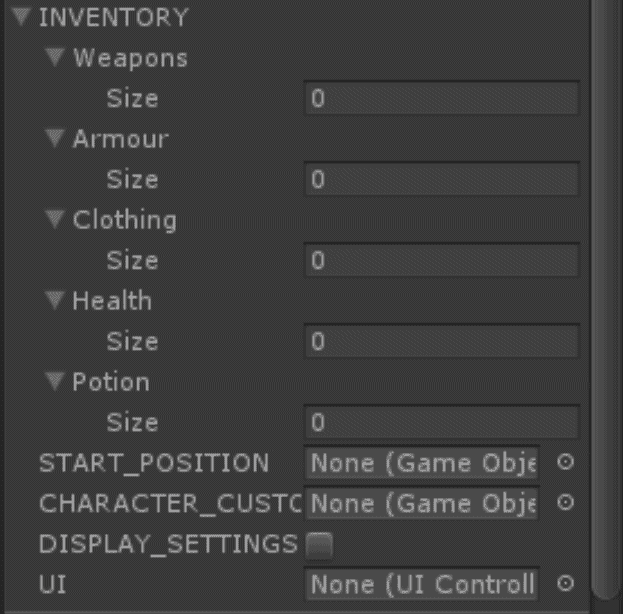

上述截图显示了在您选择`GameMaster`对象时在检查器窗口中看到的库存系统。当您运行游戏进行测试时，您将看到以下更新：

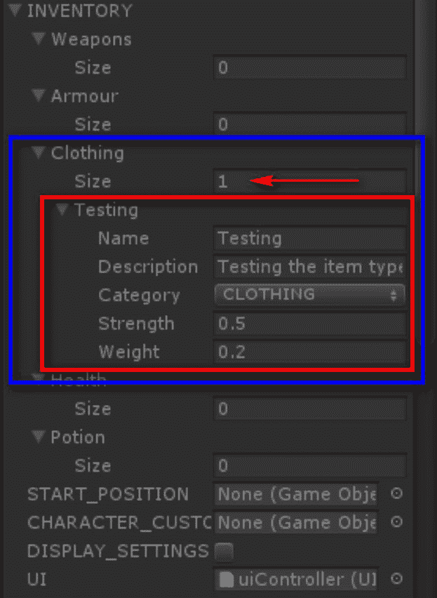

注意数据如何如预期地在库存系统中适当反映！服装列表的大小已增加到 1，列表中的`InventoryItem`对象被正确存储和显示以供测试和调试。我们有一个名为 Testing 的服装项目，具有给定的描述，力量为 0.5，重量为 0.2。

到目前为止，一切顺利。现在我们需要实际创建用于视觉表示库存物品的项目！这将在下一节中讨论。

# 创建库存物品

现在是实际创建我们将用于库存系统的项目（资产）的时候了。我将从每个项目类别创建一个项目类型以保持简单。本节将再次高度依赖于您如何建模您的角色模型。正如本书前面所讨论的，在我的特定模型中，角色的所有基本部分都嵌入在**fbx**中。在这种情况下，您需要导航到您的模型层次结构并提取特定装甲或武器的网格，或者您将用于库存的任何其他东西。

您还可以使用代表您的库存物品的独立模型，这些模型可能与您的角色模型网格相关或不相关。这些物品仅用于在世界上进行视觉表示，以便玩家可以捡起它们。

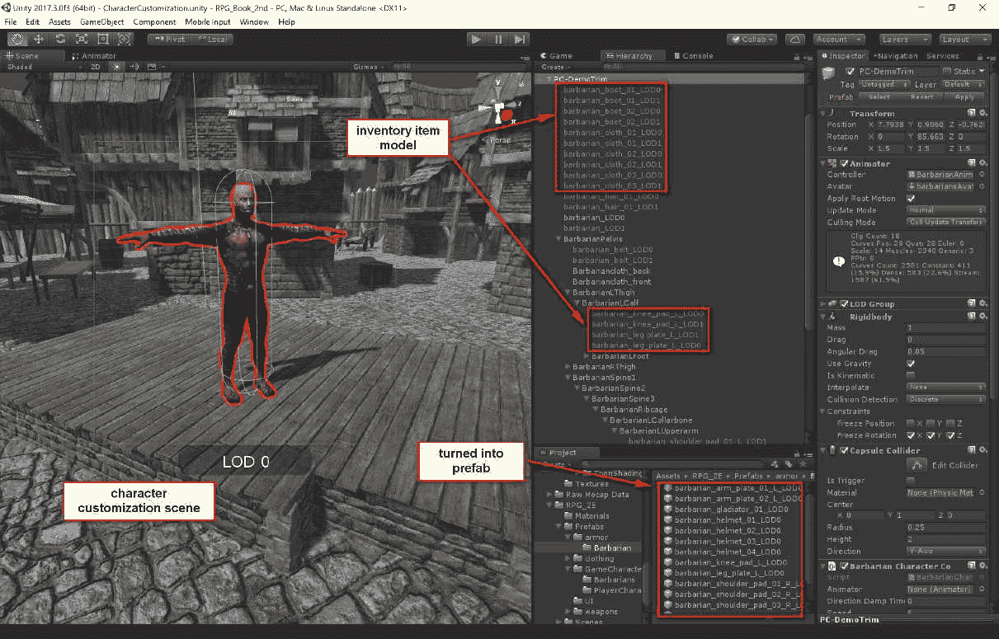

创建资产预制件

如果您还记得角色定制场景，我们已经通过了模型并确定了玩家可以通过界面选择启用或禁用的部分。

# 创建预制件

如果您还没有这样做，请在您的项目窗口中创建一个名为“Prefab”的文件夹。在此文件夹内，创建一个新的文件夹并命名为“InventoryItems”，然后创建一个名为 ShoulderPads 的子文件夹。如果您选择不同的命名和文件夹结构，只要您感到舒适并且它对您的工作是有组织的，您都可以这样做。

要创建一个预制体，你只需要将存在于场景窗口中的现有 GameObject 拖入项目窗口。为了保持组织有序，我们将使用前面段落中定义的结构。所以你需要导航到项目窗口中的 ShoulderPads 文件夹，然后简单地将你的模型中的一个肩垫网格拖到 ShoulderPads 文件夹中。看看下面的屏幕截图：

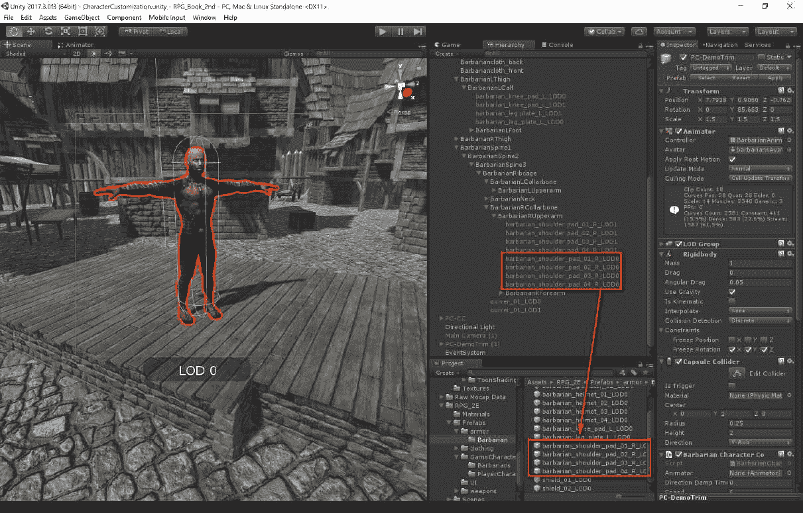

创建资产预制体

观察一下，当你创建一个预制体时，该预制体将是活动场景中 GameObject 的精确副本！在这种情况下，我的网格在场景中是禁用的；因此，当我为网格创建预制体时，它也将被禁用！由于它是禁用的，当你将新创建的预制体作为新的 GameObject 拖入场景时，它将是不可见的；你需要启用它。

# 添加库存物品代理

我们需要与我们的库存物品进行交互的手段。为了做到这一点，我们需要创建一个新的脚本，该脚本将在游戏过程中处理我们与库存物品的交互。这将在`InventoryItemAgent.cs`脚本中编码。目前，这个脚本将使我们能够通过 IDE 与`InventoryItem`对象进行交互。

脚本列表如下：

```cs
using UnityEngine;
namespace com.noorcon.rpg2e
{
public class InventoryItemAgent : MonoBehaviour
{
public InventoryItem Item;
}
}
```

非常简单，为了我们能够与 GameObject 进行交互，我们需要使用一个继承自*MonoBehaviour*的脚本。现在将这个脚本附加到你的预制体上。现在你可以轻松地通过视觉设置你的库存物品。看看下面的屏幕截图：

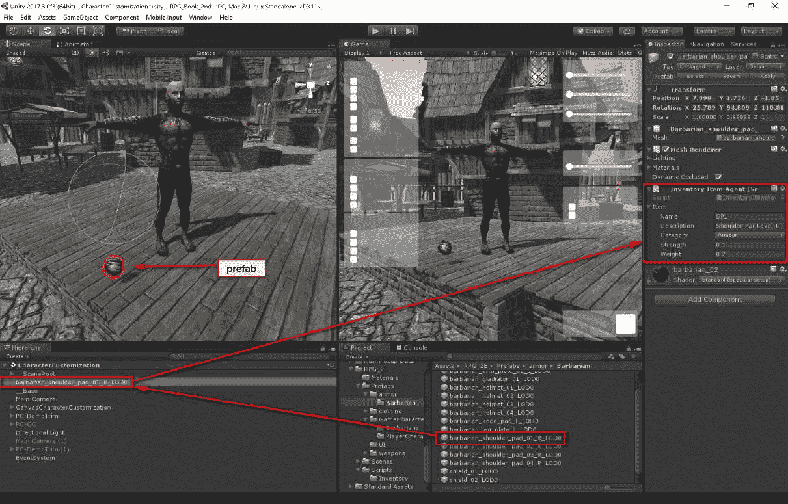

库存物品代理

在前面的屏幕截图中，你可以看到我们已经从一个预制体创建了一个 GameObject，并且使用 InventoryItemAgent 组件，我们可以访问 InventoryItem 对象的属性。利用这个概念，你现在可以创建不同类型库存物品的预制体。

如果你正在场景窗口中应用更改，请确保你将它们应用到原始预制体上，以便将其保留在内存中。

注意：当你对一个预制体应用更改时，所有预制体的实例都将更新为新属性。

目前我们已经实现了一种定义我们的库存物品的简单方法，但我们仍然需要实现用户与物品的交互。交互的逻辑将在`InventoryItemAgent.cs`脚本中实现。首先，我们需要确定我们与谁发生了碰撞；在这种情况下，我们想确保是玩家将要收集的物品。其次，我们需要在`GameMaster`中存储数据，并从活动场景中删除`GameObject`。最后两部分将由`GameMaster`处理，正如你将看到的。

`InventoryItemAgent.cs`的新代码列表如下：

```cs
using UnityEngine;
namespace com.noorcon.rpg2e
{
public class InventoryItemAgent : MonoBehaviour
{
public InventoryItem Item;
public void OnTriggerEnter(Collider c)
{
// make sure we are colliding with the player
if (c.gameObject.tag.Equals("Player"))
{
// Make a copy of the Inventory Item Object
InventoryItem myItem = new InventoryItem();
myItem.CopyInventoryItem(Item);
// Add the item to our inventory
GameMaster.instance.Inventory.AddItem(myItem);
// Destroy the GameObject from the scene
GameMaster.instance.RpgDestroy(gameObject);
}
}
}
}
```

我在`InventoryItem.cs`脚本中创建了一个名为`CoptInventoryItem()`的新函数。此函数用于将一个`InventoryItem`对象复制到另一个对象中。`InventoryItem`类中新添加的函数的代码如下：

```cs
public void CopyInventoryItem(InventoryItem item)
{
Category = item.Category;
Description = item.Description;
Name = item.Name;
Strength = item.Strength;
Weight = item.Weight;
}
```

我们已经看到了如何使用`GameMaster`添加项目到库存中。然而，我们需要添加一个新函数来处理我们游戏中`GameObjects`的销毁。这是通过`RPG_Destroy()`函数完成的。

由于`Destroy()`、`DestroyImmediate()`或`DestroyObject()`是 Unity 中所有`GameObjects`的一部分，因此你不能使用它们。因此，请谨慎地在自己的类中使用命名约定。

新函数的列表如下：

```cs
public void RpgDestroy(GameObject obj)
{
Destroy(obj);
}
```

需要添加到代表库存物品的预制件中的最后一个组件是一个*碰撞器*。请看下面的截图：


网格碰撞器

我使用了一个网格碰撞器来简化事物。可以通过从检查器窗口中选择“添加组件 | 物理 | 网格碰撞器”来添加碰撞器，如下面的截图所示：

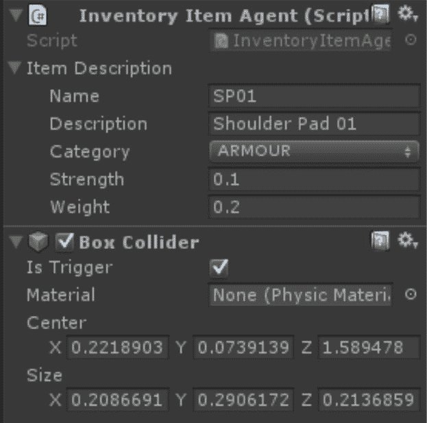

# 定义为预制件的库存物品

下图显示了为演示目的创建的一些库存物品预制件：

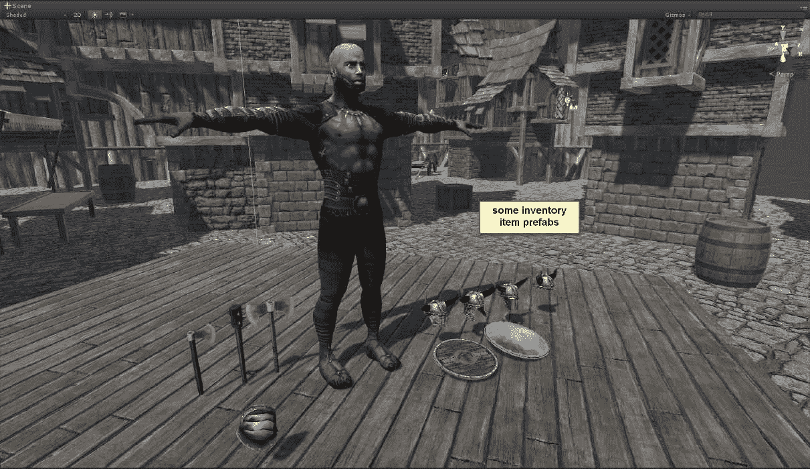

库存预制件样本

所有这一切能够工作的关键是要确保你的预制件具有`InventoryItemAgent.cs`脚本以及附加到预制件上的`Collider`组件。然后你需要通过 IDE 提供独特的库存项目数据，以标识每个项目。

下表列出了每个定义的库存物品的数据：

| **预制件** | **名称** | **描述** | **类别** | **强度** | **重量** |
| --- | --- | --- | --- | --- | --- |
| 头盔 | HL01 | 带有两个角的黄铜头盔 | 防具 | 0.2 | 0.2 |
|  | HL02 | 黄铜头盔（面部防护） | 防具 | 0.3 | 0.25 |
|  | HL03 | 青铜头盔（保护面部） | 防具 | 0.3 | 0.3 |
|  | HL04 | 青铜头盔 | 防具 | 0.2 | 0.25 |
| 盾牌 | SL01 | 铁盾 | 防具 | 0.3 | 0.3 |
|  | SL02 | 木盾 | 防具 | 0.2 | 0.2 |
| 肩部护甲 | SP01 | 肩部护甲 01 | 防具 | 0.1 | 0.2 |
|  | SP02 | 肩部护甲 02 | 防具 | 0.1 | 0.2 |
|  | SP03 | 肩部护甲 03 | 防具 | 0.15 | 0.25 |
|  | SP04 | 肩部护甲 04 | 防具 | 0.2 | 0.25 |
| 武器 | Axe1 | 单头斧 | 武器 | 0.2 | 0.1 |
|  | Axe2 | 双头斧 | 武器 | 0.25 | 0.2 |
|  | Club1 | 木棍 | 武器 | 0.2 | 0.1 |

再次强调，数据是任意的：你决定什么最适合你的游戏和游戏设计。通常，你将有一个表格，该表格将加载此类信息，并且你的游戏管理器将在运行时从服务器中预加载它。

# 设计库存界面

现在是时候考虑我们如何在游戏过程中可视化库存了。为任何游戏创建用户界面都是一个具有挑战性的任务。你需要对在游戏时间显示的信息量有一个平衡的方法，同时不干扰游戏玩法。同时，你想要确保玩家手头有完成他们任务所必需的最关键和最重要的信息。

话虽如此，让我们看看我们如何设计一个简单的用户界面，使玩家能够与库存系统进行基本的交互。以下是一个玩家应该能够执行的最小功能列表：

+   在游戏过程中任何时间都可以显示库存

+   根据类别导航

+   查看每个类别下列出的物品

+   能够从库存中移除物品

+   能够从库存中消耗物品

+   查看玩家已经使用的库存物品

上述列表将为我们实现库存界面提供一个良好的起点。让我们首先确定需要显示的类别。这些类别在`BaseItem`类中定义为名为`ItemCategory`的枚举。

我们有以下几种：武器、盔甲、服装、健康和药水。请查看以下截图：

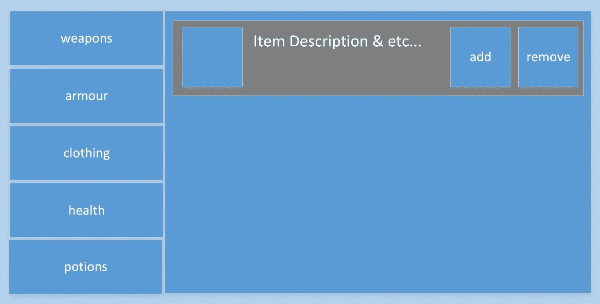

上一张截图显示了我在实现库存界面时所倾向于的一个概念。界面可以通过以下 UI 元素构建：

+   按钮

+   面板

+   文本

+   图片

每个类别将有一个按钮，将有一个包含每个类别物品列表的主要面板，如图中所示。每个物品都将包含在其自己的面板中，该面板将包含库存物品的图片、物品描述以及两个按钮，可以用来将物品添加到或从库存系统中移除。

# 创建库存 UI 框架

让我们先从实现我们的库存系统图形界面的初始框架开始。在你的项目主场景中，如果你还没有这样做，请创建一个新的*Canvas* GameObject。

要这样做，右键单击层次结构*窗口，然后选择 UI | 面板。这将自动创建一个 Canvas GameObject 和一个作为画布子项的 Panel UI 元素。

将此面板重命名为 PanelInventory。这将是一个包含所有其他内容的主体面板。现在，让我们开始构建代表我们主要类别的按钮。

同样，右键单击 PanelInventory GameObject，然后选择 UI | 按钮。这将确保新创建的按钮成为 PanelInventory 的子项。如果在创建按钮（s）后，在层次结构窗口中由于任何原因这不是这种情况，只需将新创建的按钮（s）拖到 PanelInventory 面板下。为所有五个类别都这样做。适当地重命名按钮，例如 butWeaponsCategory 等等。

更改按钮的标题，使其反映按钮的功能。同时，将文本元素重命名为类似以下的内容：txtWeaponsCategory 等等。查看以下截图：

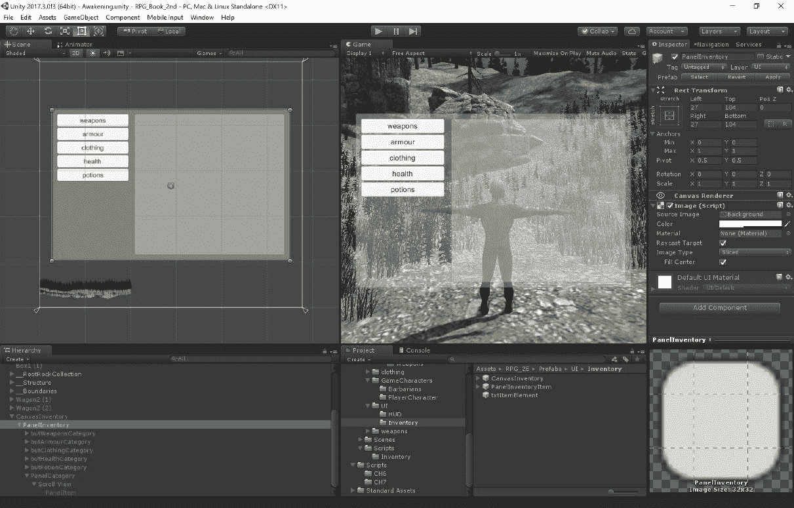

库存 UI

最后，再次在 PanelInventory 中添加一个新的 Panel 元素，通过选择 PanelInventory GameObject 并右键点击选择 UI | Panel。将新创建的面板重命名为 PanelCategory。查看以下截图：

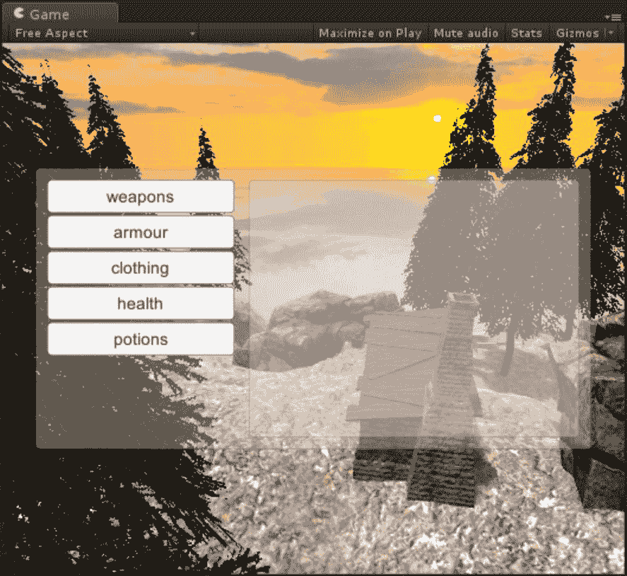

你的库存用户界面应该看起来像前面的截图。在我们进一步深入之前，让我们先为显示和隐藏玩家库存界面的一些基本操作建立连接。为此，我们需要修改`UiController.cs`、`GameLevelController.cs`和`GameMaster.cs`脚本。

我不会列出整个源文件，因为我们将在本章的后面部分进行。目前每个脚本的更改如下：

+   `UiController.cs`: 添加了一个名为`DisplayInventory()`的新函数和一个名为`InventoryCanvas`的新变量，用于引用库存画布。请看以下代码：

```cs
      public void DisplayInventory() 
      { 
         InventoryCanvas.gameObject.SetActive(GameMaster.instance.DisplayInventory); 
         Debug.Log("Display Inventory Function"); 
      } 
```

+   `GameLevelController.cs`: 更新了`OnlevelWasLoaded()`函数，将`uiController` GameObject 分配给`GameMaster`实例（如果存在）。请看以下代码：

```cs
         if (GameObject.FindGameObjectWithTag("Ui")) 
         { 
            GameMaster.instance.Ui  
               = GameObject.FindGameObjectWithTag("Ui").GetComponent<UiController>(); 
         } 
```

+   `GameMaster.cs`: 修改了`Update()`函数，以检查 J 键是否被按下和释放。这会切换一个布尔变量，以查看我们是否应该显示或隐藏库存界面。请看以下代码：

```cs
void Update()
{
if (instance.LevelController.CurrentScene.name != SceneName.MainMenu)
{
if (Input.GetKeyUp(KeyCode.I))
{
instance.DisplayInventory = !DisplayInventory;
instance.Ui.DisplayInventory();
}
}
}
```

如果你从主菜单测试场景，你将能够测试界面并切换其开关。

不要忘记，在设计时或在游戏最初加载时，你需要禁用库存系统的 Canvas。

# 设计动态物品查看器

我们接下来的挑战是创建一种方法，以动态填充库存物品并在用户界面上正确显示它们。我们将使用两个之前未曾使用过的新 UI 元素。我们将使用一个*滚动视图*来提供在需要时滚动浏览物品的能力。

让我们先设置好滚动视图，并查看如何将一个简单的 UI 预制件添加到滚动视图中。一旦完成，我们就可以继续增强 UI 预制件，以处理上一节中概述的内容。

# 添加滚动视图

接下来的几个截图将展示如何将滚动视图功能添加到你的用户界面中：

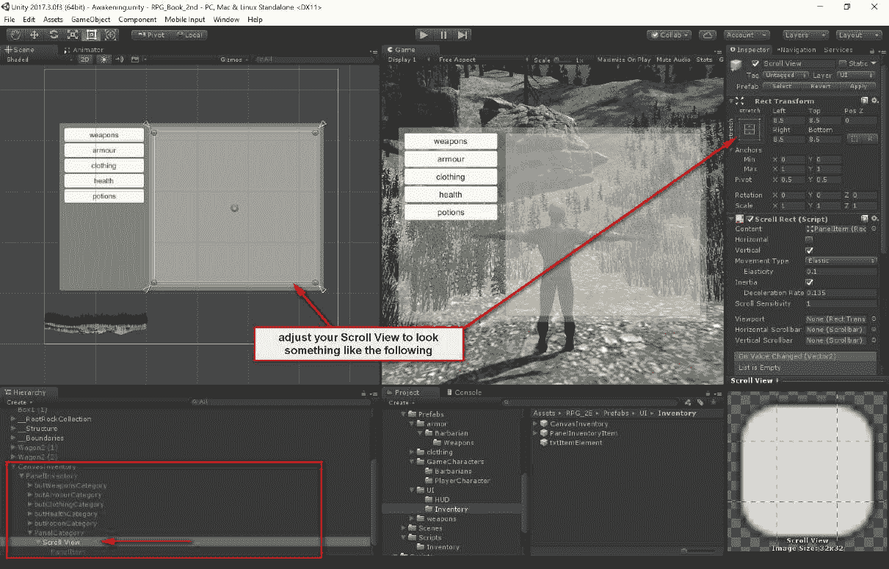

添加滚动视图

前往你创建库存 UI 的场景，然后在*Canvas*中选择*PanelCategory*。右键点击并选择*UI | 滚动视图*以添加一个滚动视图 UI 元素。查看以下截图：

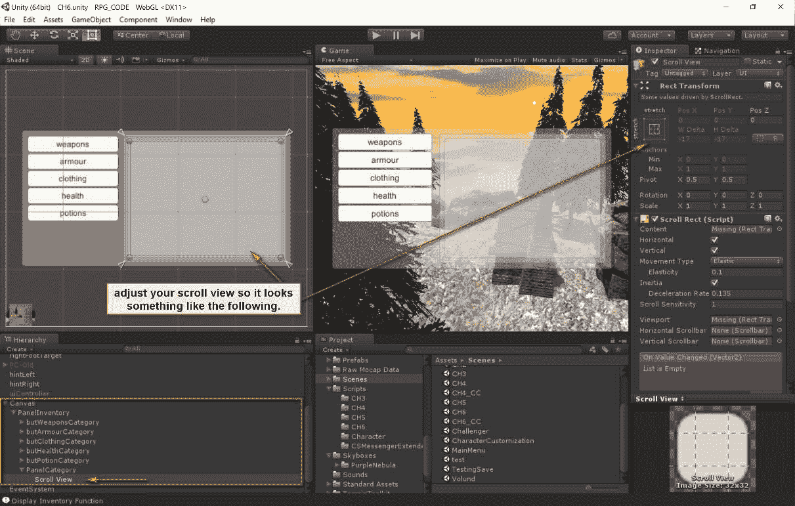

添加滚动视图

你现在应该在 *PanelCategory* 面板下拥有一个带有相关子元素的滚动视图 UI 元素。这些子元素将是 *Viewport*、*Scrollbar Horizontal* 和 *Scrollbar Vertical*。

在删除子元素之前，调整滚动视图 UI 元素的设置。

我们将对默认的滚动视图进行一些修改。请从 *Scroll View:* 中删除以下内容：*Scrollbar Horizontal*、*Scrollbar Vertical* 和 *Viewport* 子元素。完成后，你的屏幕应该看起来像上一张截图。现在请看以下截图：

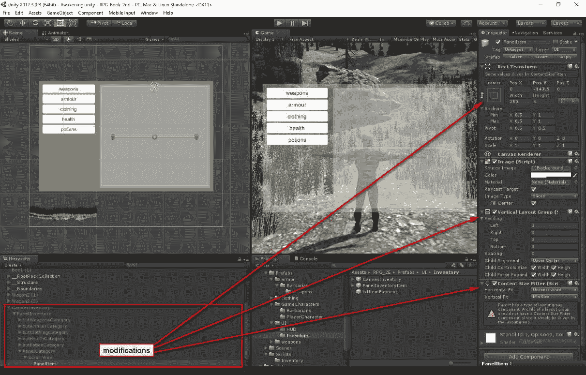

布局调整

接下来，我们需要将一个面板元素作为子元素添加到我们的 Scroll View 中。请选择滚动视图，右键单击，并选择 UI | Panel。将新添加的面板重命名为 PanelItem。我们需要向 PanelItem 添加两个布局组件。为此，选择 PanelItem，从检查器窗口中选择添加组件 | 布局 | 垂直布局组，然后再次选择添加组件 | 布局 | 内容大小过滤器。请看以下截图：

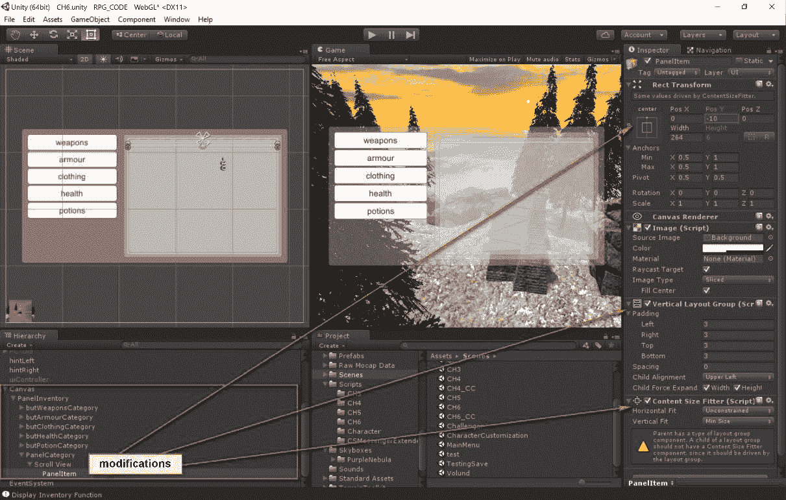

布局调整

在垂直布局组组件下进行以下属性的修改。将左、右、上、下内边距设置为 3，将间距设置为 0，将子元素对齐方式更改为左上角，并将子元素强制扩展设置为 True（宽度和高度）。

对于内容大小过滤器组件，将水平适配设置为非约束，将垂直适配设置为最小大小。

最后，在 Rect Transform 组件中，将锚点设置为顶部居中，并将 Pos Y 修改为 -10。

到目前为止，我们已经建立了基本框架。下一步是填充我们新创建的 ScrollView！

# 向 PanelItem 和 Scroll View 添加元素

首先，让我们在 `PanelItem` 面板下添加一个 *Text* 元素。再次选择 `PanelItem` 元素，右键单击并选择 UI | Text。然后选择文本元素，将其重命名为 `txtItemElement`。我们需要向文本元素添加一个新的组件，从检查器窗口中选择添加组件 | 布局 | 布局元素。

将布局元素组件的 Min Height 属性修改为 20。请看以下截图：

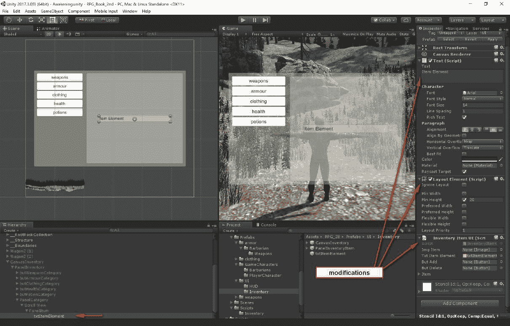

修改

上一张截图展示了 `InventoryItem` 元素和 UI 的设置。现在请看以下截图：

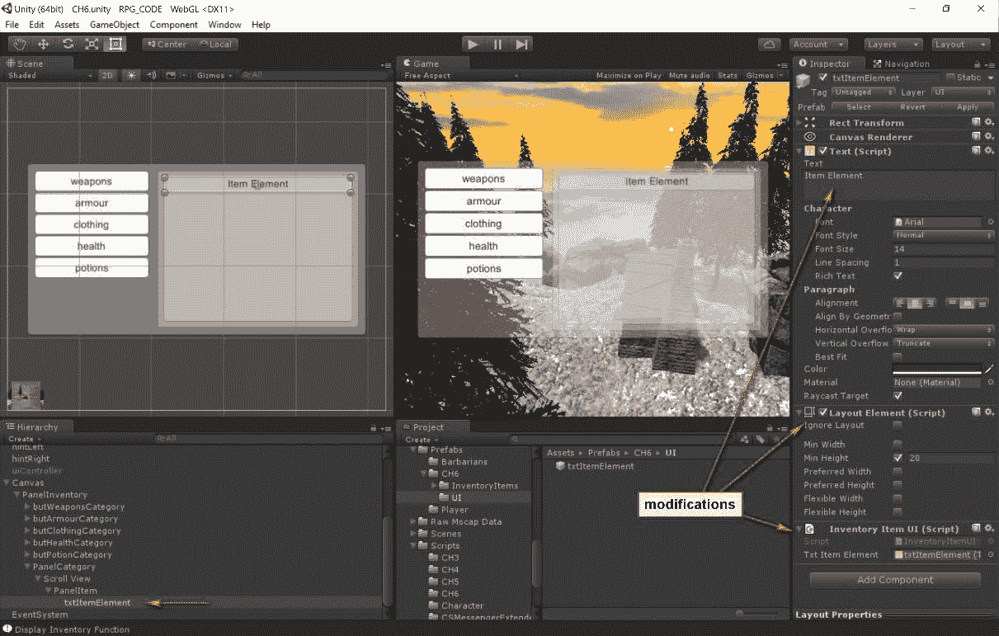

添加库存项目

我们需要一个方法来访问和修改新 `Text` UI 元素的 Text 属性。为了做到这一点，我们需要创建一个新的脚本，名为 InventoryItemUI.cs。代码将只有一个公共变量，它将引用 `Text` 元素。代码如下：

```cs
using UnityEngine;
using UnityEngine.UI;
namespace com.noorcon.rpg2e
{
    public class InventoryItemUi : MonoBehaviour
    {
        public Text txtItemElement;
    }
}
```

最后，将层次窗口中的 `Text` 元素拖放到 txtItemElement 对象附加的 InventoryItemUI 组件的 TextItemElement 属性中。参看上一张截图。

该脚本用于自引用。我们将用它来修改`Text` UI 元素的文本组件。

现在我们需要通过拖放它到指定的文件夹来创建 txtItemElement 的 Prefab。我在我的 Prefab 文件夹下创建了一个名为*UI*的新文件夹，并在该文件夹中创建了 Prefab。参考前面的截图。

你现在可以从层次结构窗口下的 PanelItem 对象中删除 txtItemElement。我们将在运行时动态添加它们。

在我们继续之前，你还需要进行一项最后的配置。你需要在`ScrollView` UI 元素上添加一个`Mask`组件。从层次结构窗口中选择滚动视图，从检查器窗口中选择添加组件 | UI | 遮罩。在添加遮罩组件后，确保 Show Mask Graphics 属性是*未选中*的。

# 动态添加 txtItemElement

现在是时候将我们的库存项目占位符动态添加到`PanelItem` UI 元素中。为此，我们将使用`UiController.cs`脚本。打开脚本并添加以下变量到类中：

```cs
public Transform InventoryPanelItem
public GameObject InventoryItemElement;
```

在设计器中，你需要从*Canvas*游戏对象分配`PanelItem` UI 元素，以及从预制件文件夹中的`txtItemElement`预制件。

接下来，我们将修改`Update()`函数，以便当我们按下键盘上的 H 键时，它会创建一个新的`InventoryItemElement`实例，并将其作为`PanelItem`对象的子元素。

代码列表如下：

```cs
public void Update()
{
if (Input.GetKeyUp(KeyCode.H))
{
GameObject newButton
= Instantiate(InventoryItemElement) as GameObject;
InventoryItemUi txtItem
= newButton.GetComponent<InventoryItemUi>();
txtItem.txtItemElement.text
= string.Format("New Item {0}", Time.time);
newButton.transform.SetParent(InventoryPanelItem);
}
}
```

上述代码列表仅实例化了预制件并将其作为`PanelItem`元素的子元素。我们还在元素上更改了标题，并放置了一个时间戳以查看每个 UI 元素的唯一性。

结果如以下截图所示：

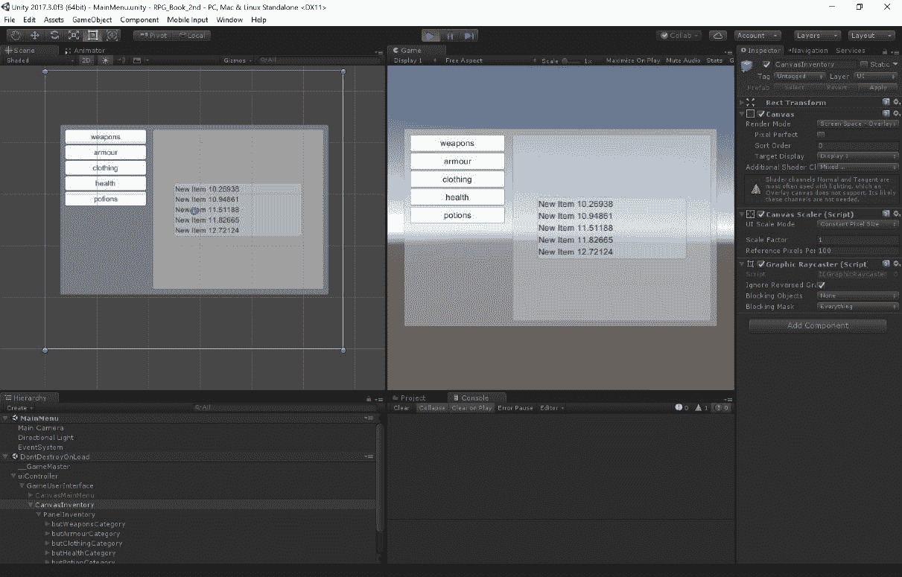

库存视图

到目前为止，我们已经组装了主要元素，以便我们的库存界面可以动态列出项目，并且能够滚动浏览它们。

# 构建最终的库存项目 UI

要创建实际的库存项目用户界面，我们需要使用几个 UI 元素。我们需要一个面板作为项目的容器。在*Panel*中，我们需要使用一个*Image*、一个*Text*和两个*Button* UI 元素。

注意：我将不会讲解如何组装面板的步骤。你现在应该知道如何创建用户界面。

确保你将*Layout Element*组件和*Inventory Item UI*脚本添加到将成为库存项目基础的面板中。

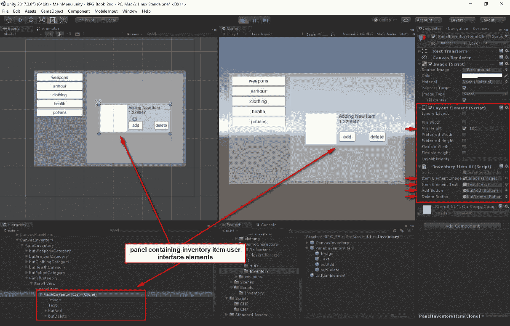

包含库存项目 UI 元素的面板

下图展示了为显示库存项目而开发的 UI 组件。由于 UI 组件已修改，我们还需要更新`InventoryItemUI.cs`脚本，以包含对*Panel*中所有新 UI 元素的引用。

新的`InventoryItemUi.cs`的列表如下：

```cs
using UnityEngine;
using UnityEngine.UI;
namespace com.noorcon.rpg2e
{
public class InventoryItemUi : MonoBehaviour
{
public Image ItemElementImage;
public Text ItemElementText;
public Button AddButton;
public Button DeleteButton;
}
}
```

我们还需要更新`UiController.cs`脚本以相应地处理新的预制件。

新 UI 预制件在`UiController.cs`中的列表如下：

```cs
public void Update()
{
if (Input.GetKeyUp(KeyCode.H))
{
GameObject newItem
= Instantiate(InventoryItemElement) as GameObject;
InventoryItemUi txtItem
= newItem.GetComponent<InventoryItemUi>();
txtItem.ItemElementText.text
= string.Format("Adding New Item {0}", Time.time);
// button triggers
txtItem.AddButton.GetComponent<Button>().onClick.AddListener(() => {
Debug.Log(string.Format("You have clicked ADD Button for {0}",
txtItem.ItemElementText.text));
});
txtItem.DeleteButton.GetComponent<Button>().onClick.AddListener(() =>
{
Debug.Log(string.Format("You have clicked DELETE Button for {0}",
txtItem.ItemElementText.text));
Destroy(newItem);
});
```

```cs
newItem.transform.SetParent(InventoryPanelItem);
}
}
```

在前面的列表中，我想指出的主要概念是预制件中按钮的`onClick()`事件处理器的实现。

由于我们正在动态生成我们的 UI，因此按钮，我们需要能够以某种方式触发`onClick()`函数；这通过添加监听器来完成，如代码所示。

目前，当你点击 AddButton 按钮时，你将在控制窗口中看到带有适当标题的输出。当你点击 DeleteButton 按钮时，你将在控制窗口中看到另一个输出，带有适当的标题。然后，物品将被销毁，即从库存中移除。

# 将 UI 与实际库存系统集成

我们已经看到并实现了使我们的库存系统 UI 正常工作的必要概念。现在，是时候用存储在`GameMaster`中的实际数据填充用户界面了。

# 将类别按钮挂钩并显示数据

使用`UiController.cs`脚本，我们将创建五个新方法来处理我们库存系统的适当可视化。我们将添加以下五个函数：

+   `DisplayWeaponsCategory()`

+   `DisplayArmourCategory()`

+   `DisplayClothingCategory()`

+   `DisplayHealthCategory()`

+   `DisplayPotionsCategory()`

当用户从一个类别切换到下一个类别时，我们还需要从面板中清除现有的库存物品。这需要名为`ClearInventoryItemPanel()`的私有函数，它只会做这件事。

新的`UiController.cs`脚本的列表如下：

```cs
using UnityEngine;
using UnityEngine.UI;
namespace com.noorcon.rpg2e
{
public class UiController : MonoBehaviour
{
[Header("Settings Window")]
public RectTransform OptionsPanel;
public Slider ControlMainVolume;
public Slider ControlFXVolume;
[Header("Inventory Window")]
public RectTransform InventoryCanvas;
[Tooltip("root for inventory items")]
public Transform InventoryPanelItem;
[Tooltip("prefab representing invenotry item UI")]
public GameObject InventoryItemElement;
public void Update()
{
if (Input.GetKeyUp(KeyCode.H))
{
GameObject newItem
= Instantiate(InventoryItemElement) as GameObject;
InventoryItemUi txtItem
= newItem.GetComponent<InventoryItemUi>();
txtItem.ItemElementText.text
= string.Format("Adding New Item {0}", Time.time);
// button triggers
txtItem.AddButton.GetComponent<Button>().onClick.AddListener(() => {
Debug.Log(string.Format("You have clicked ADD Button for {0}",
txtItem.ItemElementText.text));
});
txtItem.DeleteButton.GetComponent<Button>().onClick.AddListener(() =>
{
Debug.Log(string.Format("You have clicked DELETE Button for {0}",
txtItem.ItemElementText.text));
Destroy(newItem);
});
newItem.transform.SetParent(InventoryPanelItem);
}
}
public void DisplaySettings()
{
GameMaster.instance.DisplaySettings = !GameMaster.instance.DisplaySettings;
OptionsPanel.gameObject.SetActive(GameMaster.instance.DisplaySettings);
}
public void MainVolume()
{
GameMaster.instance.MasterVolume(ControlMainVolume.vale);
}
public void FXVolume()
{
GameMaster.instance.SoundFxVolume(ControlFXVolume.value);
}
#region INVENTORY UI FUNCTIONS
public void DisplayInventory()
{
InventoryCanvas.gameObject.SetActive(GameMaster.instan
e.DisplayInventory);
Debug.Log("Display Inventory Function");
}
public void DisplayWeaponsCategory()
{
if (GameMaster.instance.DisplayInventory)
{
ClearInventoryPanelItems();
foreach (InventoryItem item in GameMaster.instance.Inventory.Weapons)
{
GameObject newItem
= Instantiate(InventoryItemElement) as GameObject;
InventoryItemUI txtItem
= newItem.GetComponent<InventoryItemUI>();
txtItem.txtItemElement.text =
string.Format("Name: {0}, Description: {1}, Strength: {2}, Weight: {3}",
item.Name,
item.Description,
item.Strength,
item.Weight);
...
```

我们还必须对`InventorySystem.cs`脚本进行一些修改，以便我们更容易访问存储数据的属性。

脚本的新列表如下：

```cs
using System;
using System.Collections.Generic;
using UnityEngine;
namespace com.noorcon.rpg2e
{
[Serializable]
public class InventorySystem
{
[SerializeField]
private List<InventoryItem> weapons = new List<InventoryItem>();
[SerializeField]
private List<InventoryItem> armour = new List<InventoryItem>();
[SerializeField]
private List<InventoryItem> clothing = new List<InventoryItem>();
[SerializeField]
private List<InventoryItem> health = new List<InventoryItem>();
[SerializeField]
private List<InventoryItem> potion = new List<InventoryItem>();
public List<InventoryItem> Weapons
{
get { return weapons; }
}
public List<InventoryItem> Armour
{
get { return armour; }
}
public List<InventoryItem> Clothing
{
get { return clothing; }
}
public List<InventoryItem> Health
{
get { return health; }
}
public List<InventoryItem> Potion
{
get { return potion; }
}
private InventoryItem selectedWeapon;
private InventoryItem selectedArmour;
public InventoryItem SelectedWeapon
{
get { return selectedWeapon; }
set { selectedWeapon = value; }
}
public InventoryItem SelectedArmour
{
get { return selectedArmour; }
set { selectedArmour = value; }
}
public InventorySystem()
{
ClearInventory();
}
public void ClearInventory()
{
weapons.Clear();
armour.Clear();
clothing.Clear();
health.Clear();
potion.Clear();
}
// this function will add an inventory item
public void AddItem(InventoryItem item)
{
switch (item.Category)
{
case BaseItem.ItemCatrgory.Armour:
{
armour.Add(item);
break;
}
case BaseItem.ItemCatrgory.Clothing:
{
clothing.Add(item);
break;
}
case BaseItem.ItemCatrgory.Health:
{
health.Add(item);
break;
}
case BaseItem.ItemCatrgory.Potion:
...
```

注意，我已经从`UiController.cs`脚本中的`Update()`函数中删除了代码，因为它是仅用于测试目的的。

# 测试库存系统

为了测试目的，我在本章中创建的一些库存物品预制件中放置了一些。看看下面的截图：

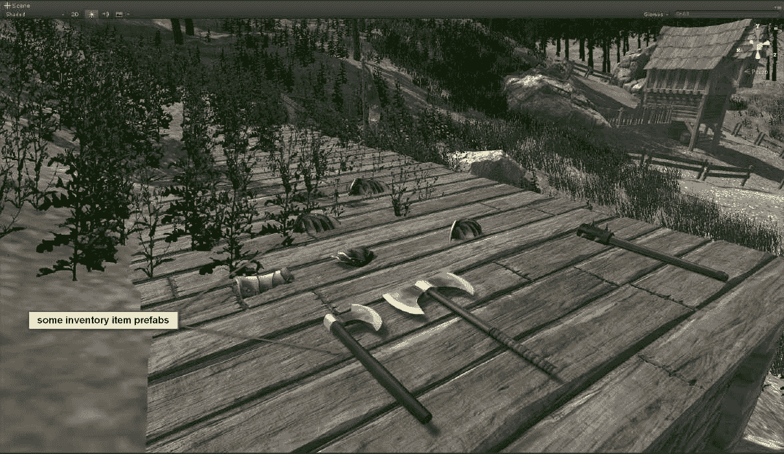

要收集的库存物品

从主菜单开始游戏，并通过角色定制场景保存角色玩家并开始游戏。一旦你进入可玩场景，就继续收集场景中放置的一些物品。看看下面的截图：

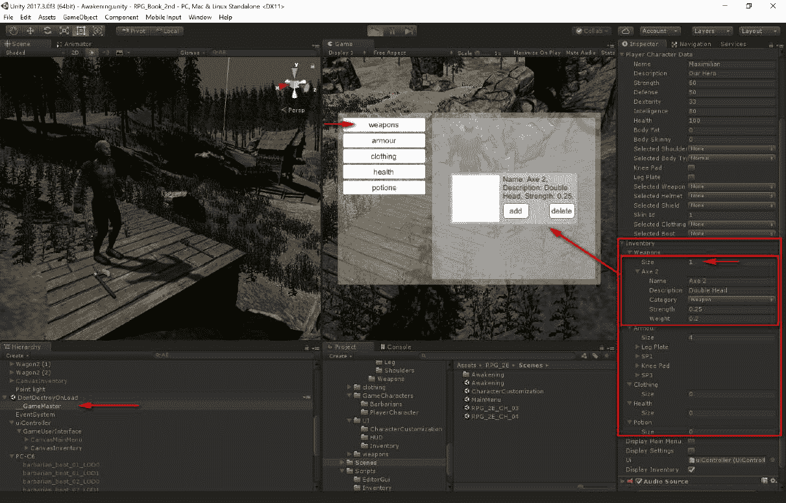

存入库存的物品 - 1

注意以下截图，我已经选择了`_GameMaster`游戏对象，在检查器窗口中显示库存数据：

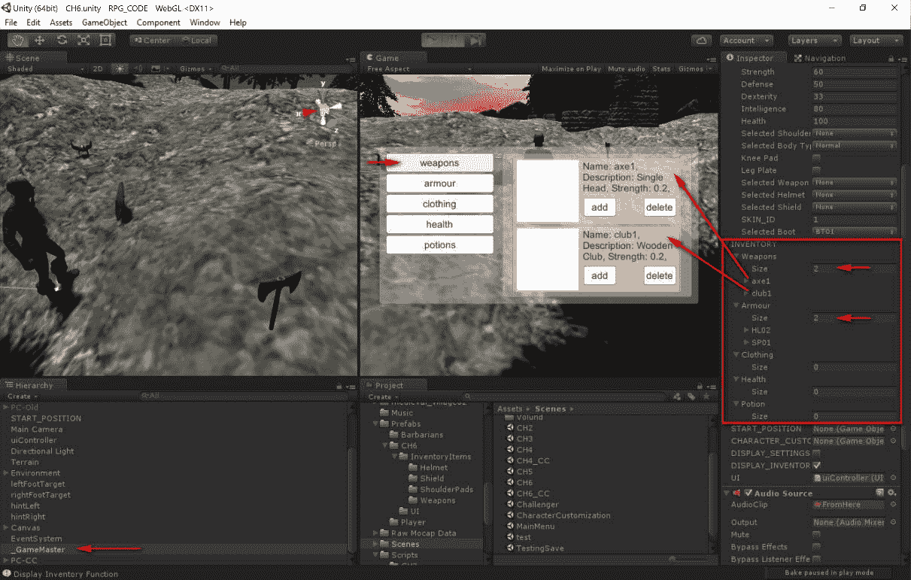

存入库存的物品 - 2

我们已经选择了两种武器类型和两种盔甲类型。我们选择的武器物品是：斧头 2。我们选择的盔甲物品包括：腿甲、SP1、护膝和 SP3，如检查器窗口中所示。请看下面的截图：

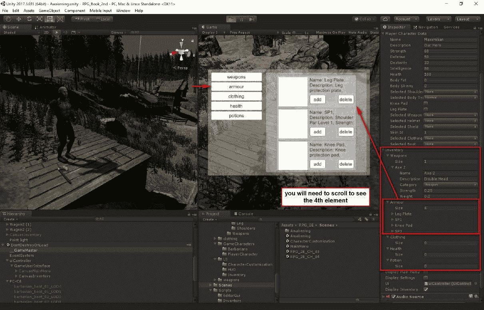

插入到库存中的物品 - 3

注意，在游戏窗口中，当我们打开用于显示的库存窗口并点击武器按钮时，我们会得到两个列表。这些列表显示了每个库存物品在类别中的正确数据。请看下面的截图：

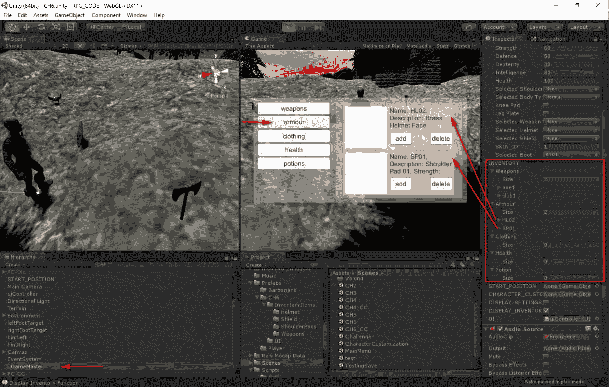

盔甲类别

要说明添加按钮的`onClick()`事件，请参阅以下来自控制台窗口的截图：

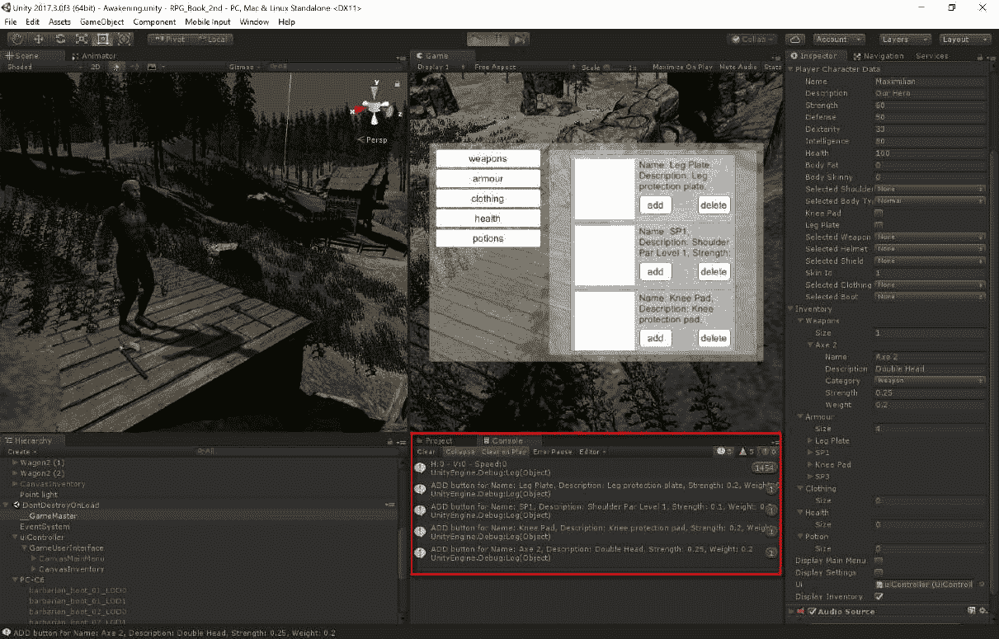

库存物品属性

要在库存中列出盔甲物品，我们将点击盔甲按钮。以下截图显示了基于我们的数据的库存中盔甲类别的物品：

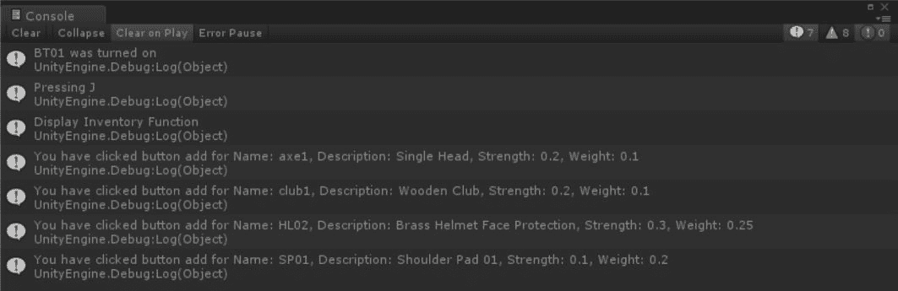

我们已经走了很长的路。让我们花点时间来审视一下。

我们首先创建了以下脚本，为我们在游戏中的库存系统奠定基础：

`BaseItem.cs`

`InventoryItem.cs`

`InventoryItemAgent.cs`

`InventorySystem.cs`

下一步是创建每个库存物品的预制件并将它们添加到`InventoryItemAgent.cs`脚本中。这反过来又允许我们在游戏过程中将必要的数据分配给预制件，以将其识别为库存物品。

接下来，我们开始设计和开发库存系统的用户界面。我们绘制了我们希望库存窗口看起来如何的草图，并使用内置的 UI 架构实现了框架。

逐步添加到 UI 并应用不同的概念和新元素，我们构建了库存系统的最终用户界面。

最后，我们使用预制件来测试从用户界面中完全添加和删除库存物品。

我们面临的下一个挑战是如何实际将库存物品应用到玩家角色上。

# 库存物品和玩家角色

现在我们已经看到了如何创建库存系统，我们需要能够在游戏过程中使用它来对我们的玩家角色应用更改。在本节中，我们将探讨如何做到这一点！

这里是我们需要工作的新功能之一：

+   将选定的库存物品应用到玩家角色上

+   对玩家角色和库存系统进行会计处理

+   根据情况更新游戏状态

# 应用库存物品

我们需要在如何处理将库存物品应用到玩家角色上以及系统如何处理该事件方面做出一些设计决策。例如，让我们假设玩家角色已经获得了几件武器；比如说武器 A、B 和 C。

让我们再假设，最初，玩家没有任何激活的武器。现在，玩家选择激活武器 A。对于这种情况，我们只需使用库存物品数据并激活武器 A，同时考虑到武器带来的所有会计问题。

现在，玩家想要将他的/她的武器换成武器 B，因为它更强大，他们需要它来击败 Boss。由于玩家已经激活了武器 A，在我们激活武器 B 之前，我们该如何处理它？我们是将其放回游戏世界，还是将其放回我们的库存中以便以后使用？

在我们的案例中，一旦你在库存中有物品，它将一直陪伴你，直到你实际上从库存中删除它，在这种情况下，它将被销毁。我们需要进行一些代码修改，以及一些预制体修改，以确保一切协同工作。

让我们从`InventoryItem.cs`脚本开始。我们将添加新的数据来存储库存物品的类型。这是必要的，因为我们有一个类别，在类别中我们有不同类型的物品。这对盔甲类别尤其如此！例如，我们有头盔、盾牌、肩垫等等。

代码列表如下：

```cs
using System;
using UnityEngine;
namespace com.noorcon.rpg2e
{
[Serializable]
public class InventoryItem : BaseItem
{
public enum ItemType
{
Helmet = 0,
Shield = 1,
ShoulderPad = 2,
KneePad = 3,
Boots = 4,
Weapon = 5
}
[SerializeField]
private ItemCatrgory category;
[SerializeField]
private ItemType type;
[SerializeField]
private float strength;
[SerializeField]
private float weight;
public ItemCatrgory Category
{
get { return category; }
set { category = value; }
}
public ItemType Type
{
get { return type; }
set { type = value; }
}
public float Strength
{
get { return strength; }
set { strength = value; }
}
public float Weight
{
get { return weight; }
set { weight = value; }
}
public void CopyInventoryItem(InventoryItem item)
{
Category = item.Category;
Description = item.Description;
Name = item.Name;
Strength = item.Strength;
Weight = item.Weight;
}
}
}
```

当你更新你的脚本时，确保回到 IDE 并选择我们创建的每个预制体的正确类型，以表示你的库存物品。看看下面的截图：

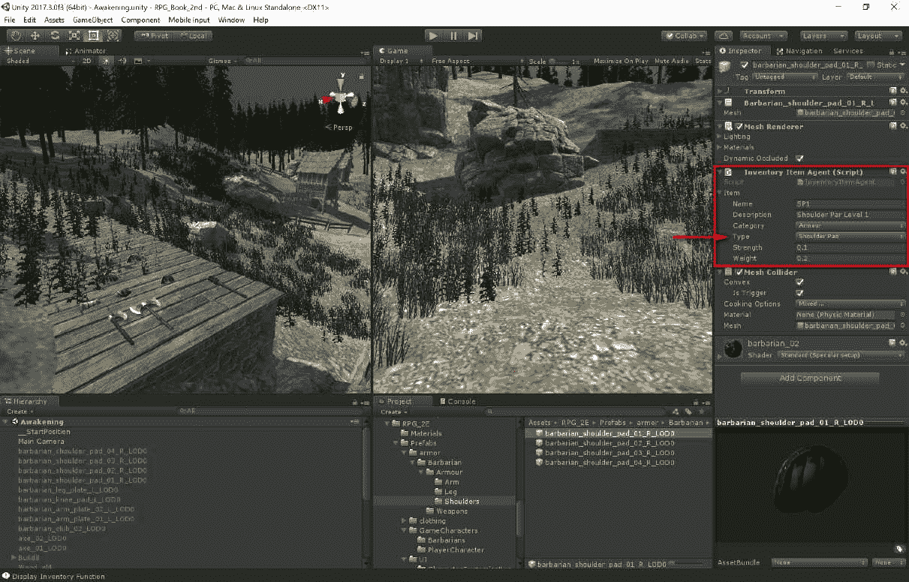

库存物品类型字段

你需要更新你为库存物品创建的每个预制体的类型字段。

我们还需要更新`PlayerCharacter.cs`脚本。我们将使原始数据变量为私有，并创建公共属性来访问它们。这样，如果我们需要在设置或获取属性值之前或之后执行任何额外的工作，我们可以轻松地做到这一点。

`PlayerCharacter.cs`脚本的列表如下：

```cs
using System;
using UnityEngine;
namespace com.noorcon.rpg2e
{
public delegate void WeaponChangedEventHandler(PlayerCharacter.WeaponType weapon);
[Serializable]
public class PlayerCharacter : BaseCharacter
{
public enum ShoulderPad
{
none = 0,
SP01 = 1,
SP02 = 2,
SP03 = 3,
SP04 = 4
};
// Older version of the model
public enum BodyType { normal = 1, BT01 = 2, BT02 = 3 };
// New support for character model
public float BodyFat = 0.0f;
public float BodySkinny = 0.0f;
// Shoulder Pad
public ShoulderPad selectedShoulderPad = ShoulderPad.none;
public BodyType selectedBodyType = BodyType.normal;
public bool kneePad = false;
public bool legPlate = false;
public enum WeaponType
{
none = 0,
axe1 = 1,
axe2 = 2,
club1 = 3,
club2 = 4,
falchion = 5,
gladius = 6,
mace = 7,
maul = 8,
scimitar = 9,
spear = 10,
sword1 = 11,
sword2 = 12,
sword3 = 13
};
[SerializeField]
private WeaponType selectedWeapon = WeaponType.none;
public WeaponType SelectedWeapon
{
get { return selectedWeapon; }
set { selectedWeapon = value; }
}
public enum HelmetType { none = 0, HL01 = 1, HL02 = 2, HL03 = 3, HL04 = 4 };
[SerializeField]
private HelmetType selectedHelmet = HelmetType.none;
public HelmetType SelectedHelmet
{
get { return selectedHelmet; }
set { selectedHelmet = value; }
}
public enum ShieldType { none = 0, SL01 = 1, SL02 = 2 };
[SerializeField]
private ShieldType selectedShield = ShieldType.none;
public ShieldType SelectedShield
{
get { return selectedShield; }
set { selectedShield = value; }
}
public int SkinId = 1;
public enum ClothingType { none=0, CT01=1, CT02=2, CT03=3, CT04=4 };
[SerializeField]
private ClothingType selectedClothing = ClothingType.none;
public ClothingType SelectedClothing
{
get { return selectedClothing; }
set { selectedClothing = value; }
}
public enum ShoeType { none = 0, BT01 = 1, BT02 = 2 };
[SerializeField]
private ShoeType selectedShoe = ShoeType.none;
public ShoeType SelectedShoe
{
get { return selectedShoe; }
set { selectedShoe = value; }
}
[SerializeField]
private InventoryItem selectedArmour;
public InventoryItem SelectedArmour
{
get { return selectedArmour; }
set { selectedArmour = value; }
}
}
}
```

下一个代码修改将是在`BarbarianCharacterCustomization.cs`脚本上。由于这个脚本已经在角色定制场景中使用过，我们可以利用这个脚本并将其扩展以应用于我们的玩家角色。但在我们能够利用这个脚本之前，我们需要从我们在角色定制场景中定义的`Base`GameObject 中复制实际的组件，并将其粘贴到代表我们的玩家角色的`PC_C6`GameObject 中！

当你使用“检查器窗口”中的齿轮菜单复制组件时，所有配置、链接和引用都保持完整！再次使用“检查器窗口”中的齿轮菜单粘贴组件时，你将得到组件的精确副本。这将消除我们重新布线所有 GameObject 到脚本中引用的需要。

以下两个截图说明了从`_Base`GameObject 到`PC_C6`GameObject 的组件复制过程：

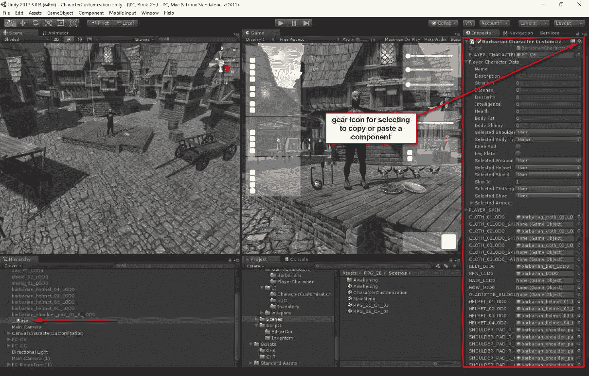

使用齿轮图标复制和粘贴组件

如前述截图所示，`_Base`游戏对象上附加了定制脚本，将值从`_Base`游戏对象复制并传输到 PC-C6 对象。看看下面的截图：

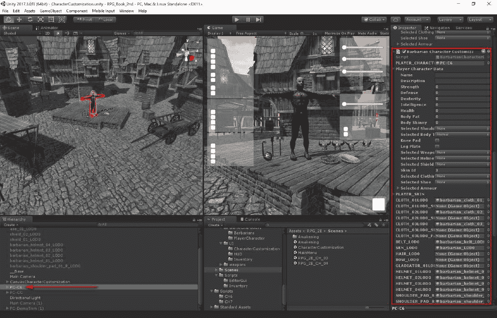

使用齿轮图标复制和粘贴组件

这之所以有效，是因为脚本实际上首先引用了`PC_C6`游戏对象层次结构的不同部分。区别在于它以前是附加到用于定制的`_Base`游戏对象上的。

注意：它们现在可以在同一场景中同时激活吗？是的！然而，如果你有时间，你可能想重新设计你的 UI 事件触发器以使用`PC_CC`游戏对象，然后你可以从`_Base`游戏对象中移除`BarbarianCharacterCustomization.cs`脚本。

现在，我们实际上需要修改`BarbarianCharacterCustomization.cs`脚本，以便使用从`GameMaster.cs`脚本接收到的数据激活玩家角色模型的不同部分。

`CharacterCustomization.cs`脚本的局部列表如下：

```cs
        void DisableWeapons()
        {
            AXE_01LOD0.SetActive(false);
            AXE_02LOD0.SetActive(false);
            CLUB_01LOD0.SetActive(false);
            CLUB_02LOD0.SetActive(false);
            FALCHION_LOD0.SetActive(false);
            GLADIUS_LOD0.SetActive(false);
            MACE_LOD0.SetActive(false);
            MAUL_LOD0.SetActive(false);
            SCIMITAR_LOD0.SetActive(false);
            SPEAR_LOD0.SetActive(false);
            SWORD_BASTARD_LOD0.SetActive(false);
            SWORD_BOARD_01LOD0.SetActive(false);
            SWORD_SHORT_LOD0.SetActive(false);
        }

    public void SetWeaponType(Slider id)
    {
      try
      {
        PlayerCharacter.WeaponType weapon = (PlayerCharacter.WeaponType)Convert.ToInt32(id.value);

        PlayerCharacterData.SelectedWeapon = weapon;
      }
      catch
      {
        PlayerCharacterData.SelectedWeapon = PlayerCharacter.WeaponType.none;
      }

            // disable weapons
            DisableWeapons();

      switch (Convert.ToInt32(id.value))
      {
        case 0:
          {
                        DisableWeapons();
            break;
          }
        case 1:
          {
            AXE_01LOD0.SetActive(true);
            break;
          }
        case 2:
          {
            AXE_02LOD0.SetActive(true);
            break;
          }
        case 3:
          {
            CLUB_01LOD0.SetActive(true);
            break;
          }
        case 4:
          {
            CLUB_02LOD0.SetActive(true);
            break;
          }
        case 5:
          {
            FALCHION_LOD0.SetActive(true);
            break;
          }
        case 6:
          {
            GLADIUS_LOD0.SetActive(true);
            break;
          }
        case 7:
          {
            MACE_LOD0.SetActive(true);
            break;
          }
        case 8:
          {
            MAUL_LOD0.SetActive(true);
            break;
          }
        case 9:
          {
            SCIMITAR_LOD0.SetActive(true);
            break;
          }
        case 10:
          {
            SPEAR_LOD0.SetActive(true);
            break;
          }
        case 11:
          {
            SWORD_BASTARD_LOD0.SetActive(true);
            break;
          }
        case 12:
          {
            SWORD_BOARD_01LOD0.SetActive(true);
            break;
          }
        case 13:
          {
            SWORD_SHORT_LOD0.SetActive(true);
            break;
          }
      }
    }
```

我没有列出整个脚本，因为这会占用很多页面。但基本概念是重载`SetXXXXX()`函数，以便它们根据传入的参数执行必要的任务，就像前面的例子`PlayerCharacter.WeaponType`一样。

下一个需要修改的脚本是`UiController.cs`脚本。这是我们之前创建的五个函数将实际应用于玩家角色的地方。让我们看看已经被修改的一个函数，不列出整个代码，如下所示：

```cs
  public void DisplayWeaponsCategory() 
  { 
    if(GameMaster.instance.DISPLAY_INVENTORY) 
    { 
      this.ClearInventoryItemsPanel(); 

      foreach (InventoryItem item in GameMaster.instance.INVENTORY.WEAPONS) 
      { 
        GameObject objItem = GameObject.Instantiate(this.InventoryItemElement) as GameObject; 
        InventoryItemUI invItem = objItem.GetComponent<InventoryItemUI>(); 
        invItem.txtItemElement.text = 
          string.Format("Name: {0}, Description: {1}, Strength: {2}, Weight: {3}", 
                                  item.NAME, 
                                  item.DESCRIPTION, 
                                  item.STRENGTH, 
                                  item.WEIGHT); 

        invItem.item = item; 

        // add button triggers 
        invItem.butAdd.GetComponent<Button>().onClick.AddListener(() => 
        { 
          Debug.Log(string.Format("You have clicked button add for {0}, {1}", invItem.txtItemElement.text, invItem.item.NAME)); 

          // let's apply the selected item to the player character 
          GameMaster.instance.PC_CC.SELECTED_WEAPON = (PC.WEAPON_TYPE)Enum.Parse(typeof(PC.WEAPON_TYPE), invItem.item.NAME); 
          GameMaster.instance.PlayerWeaponChanged(); 
        }); 

        // delete button triggers 
        invItem.butDelete.GetComponent<Button>().onClick.AddListener(() => 
        { 
          Debug.Log(string.Format("You have clicked button delete for {0}", invItem.txtItemElement.text)); 
          Destroy(objItem); 
        }); 

        objItem.transform.SetParent(this.PanelItem); 
      } 

    } 
  }  
```

注意，我们还将从`foreach`循环中保存的`*item*`放入`invItem.item`变量中。这很重要，以确保`OnClick()`监听器能够从列表中获取当前的`InventoryItem`变量。

大部分工作是在每个按钮的`onClick.AddListener()`中完成的。我们基本上使用`GameMaster.instance`设置选定的武器以存储，然后调用`PlayerWeaponChanged()`函数来处理更多功能。这将在下一个代码列表中演示。

你需要以类似的方式处理每个添加按钮监听器，这取决于你如何设计和实现你的代码以及你的预制件。

最后，我们将对`GameMaster.cs`脚本进行一些修改。列表如下：

```cs
using UnityEngine; 
using UnityEngine.UI; 
using UnityEngine.SceneManagement; 

using System.Collections; 
using System; 

public class GameMaster : MonoBehaviour 
{ 
  public static GameMaster instance; 

  // let's have a reference to the player character GameObject 
  public GameObject PC_GO; 

  // reference to player Character Customization 
  public PC PC_CC; 
  public InventorySystem INVENTORY; 

  public GameObject START_POSITION; 

  public GameObject CHARACTER_CUSTOMIZATION; 

  public LevelController LEVEL_CONTROLLER; 
  public AudioController AUDIO_CONTROLLER; 

  // Ref to UI Elements ... 
  public bool DISPLAY_SETTINGS = false; 
  public bool DISPLAY_INVENTORY = false; 

  public UIController UI; 

  void Awake() 
  { 
    // simple singlton 
    if (instance == null) 
    { 
      instance = this; 

      instance.DISPLAY_INVENTORY = false; 
      instance.DISPLAY_SETTINGS = false; 

      // initialize Level Controller 
      instance.LEVEL_CONTROLLER = new LevelController(); 

      // initialize Audio Controller 
      instance.AUDIO_CONTROLLER = new AudioController(); 
      instance.AUDIO_CONTROLLER.AUDIO_SOURCE = GameMaster.instance.GetComponent<AudioSource>(); 
      instance.AUDIO_CONTROLLER.SetDefaultVolume(); 

      // initialize Inventory System 
      instance.INVENTORY = new InventorySystem(); 

    } 
    else if (instance != this) 
    { 
      Destroy(this); 
    } 

    // keep the game object when moving from 
    // one scene to the next scene 
    DontDestroyOnLoad(this); 
  } 

....
```

我要你注意的唯一函数是`PlayerArmourChanged()`函数。正是因为这个函数，我们才需要在`InventoryItem`类中添加新的`*Type*`数据变量和数据类型。看看下面的代码：

```cs
  // for each level/scene that has been loaded 
  // do some of the preparation work 
  void OnLevelWasLoaded() 
  { 
    GameMaster.instance.LEVEL_CONTROLLER.OnLevelWasLoaded(); 
  } 

  // Use this for initialization 
  void Start() 
  { 
    // let's find a reference to the UI controller of the loaded scene 
    if (GameObject.FindGameObjectWithTag("UI") != null) 
    { 
      GameMaster.instance.UI = GameObject.FindGameObjectWithTag("UI").GetComponent<UIController>(); 
    } 

    GameMaster.instance.UI.SettingsCanvas.gameObject.SetActive(GameMaster.instance.DISPLAY_SETTINGS); 
  } 

  // Update is called once per frame 
  void Update() 
  { 
    // only when we are in the game level 
    if(instance.LEVEL_CONTROLLER.CURRENT_SCENE.name==SceneName.Level_1) 
    { 
      if (Input.GetKeyUp(KeyCode.J)) 
      { 
        //Debug.Log("Pressing J"); 
        instance.DISPLAY_INVENTORY = !instance.DISPLAY_INVENTORY; 
        instance.UI.DisplayInventory(); 
      } 
    } 
  } 

  public void MasterVolume(float volume) 
  { 
    GameMaster.instance.AUDIO_CONTROLLER.MasterVolume(volume); 
  } 

  public void StartGame() 
  { 
    GameMaster.instance.LoadLevel(); 
  } 

  public void LoadLevel() 
  { 
    GameMaster.instance.LEVEL_CONTROLLER.LoadLevel(); 
  } 

  public void RPG_Destroy(GameObject obj) 
  { 
    Destroy(obj); 
  } 
} 
```

我们有很多不同类型的盔甲，我们需要一种方法来区分它们。根据盔甲类型，然后调用适当的函数在玩家角色上激活它们。

# 看起来是这样的

本章在配置 GameObject 和预制件方面有些复杂，更重要的是，与之相关的代码，用于将所有这些粘合在一起。我已经尽量使事情尽可能简单。话虽如此，我们本章没有讨论和包含一些项目——与升级、经验和任务相关的话题。如果您真正学习和理解了库存系统，您可以非常容易地驱动和扩展它以涵盖所有其他部分。不幸的是，我们无法在一本书中实现所有内容。

以下是一个截图，展示了在玩家拾取放置在关卡上的物品之前的玩家角色。注意，在`GameMaster`对象中`INVENOTRY`是空的。同样，在`PC-C6`对象中也没有选中的物品：

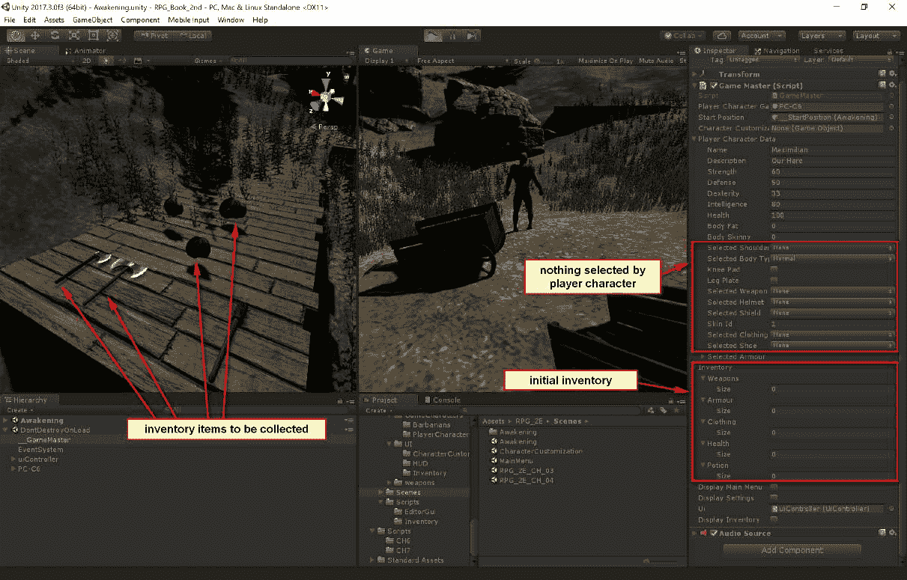

玩家角色数据

在我将玩家角色移动到拾取库存物品之后，我将使用编程的热键来打开库存窗口。在我的情况下，是 J 键。以下截图捕捉了交互：

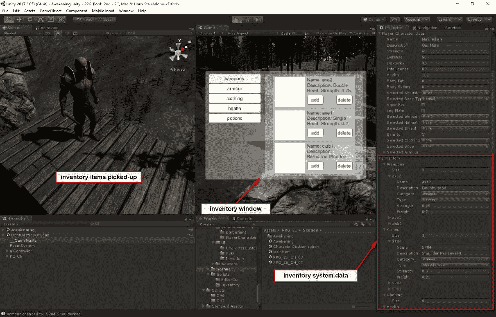

玩家角色数据库存

现在，让我们看看当我们将一些库存物品应用到玩家角色上时，事情会有怎样的变化。您可以在前面的截图中的库存集合中看到所应用的变化。

# 摘要

本章涵盖了大量的内容。本章的核心是创建一个可用的库存系统。我们本章开始时讨论了加权库存，并简要概述了该概念。然后我们确定了我们将为游戏使用的项目类型。

我们创建了`BaseItem.cs`、`InventoryItem.cs`和`InventorySystem.cs`脚本。然后，我们将这些脚本用作设计和发展我们库存的起点。接着，我们更新了`GameMaster.cs`脚本，以测试新创建的脚本的基本功能，并通过序列化属性在 Unity IDE 中查看数据。我们通过实例化一个`InventoryItem`并将其插入到`InventorySystem`中来实现这一点，并通过 IDE 直观地验证了操作。

下一步是实际创建库存物品预制件。本节介绍了如果您的模型包括了实际的 fbx 模型上的所有内容，如何导航和找到可定制的库存物品，如何从模型中提取它，以及如何将其转换为预制件以供以后使用。然后我们创建了一个新的脚本，称为`InventoryItemAgent.cs`，它被附加到每个创建的预制件上，以表示库存物品。这个脚本基本上让我们能够在 IDE 中设置每个库存物品的数据。非常有用！我们还必须将一个碰撞器附加到每个预制件上，以处理碰撞并在玩家与对象碰撞时触发拾取调用。

一旦我们建立了基础，我们就开始考虑如何设计和实现库存系统的用户界面。我们讨论了想要表示的分类，以及每个分类中的项目在游戏过程中如何列出/显示给玩家。我们实现了库存窗口的初始框架，并将其与游戏集成。

现在，我们准备讨论如何创建一个动态的项目查看器，它可以在运行时填充，并正确表示我们收集的库存项目。我们介绍了一些新的用户界面概念，例如滚动视图以及如何在我们的界面中利用布局。我们用一个简单的占位符进行了快速测试，仅显示项目的名称。一旦我们使机制正常工作，我们就实现了主要的库存项目控制面板，并将其转换为预制件，以便在需要时在运行时实例化。

最后，我们着手将库存系统与库存用户界面以及游戏大师和玩家角色集成，以实现最终的实现。这需要我们更新和修改更多的脚本。

到本章结束时，你将拥有一个功能齐全的库存系统，可以根据需要扩展。
