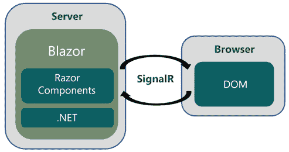
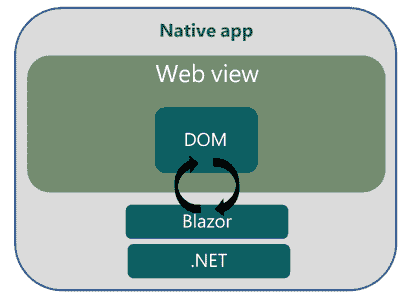
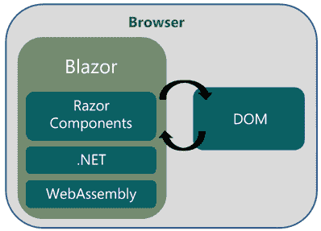
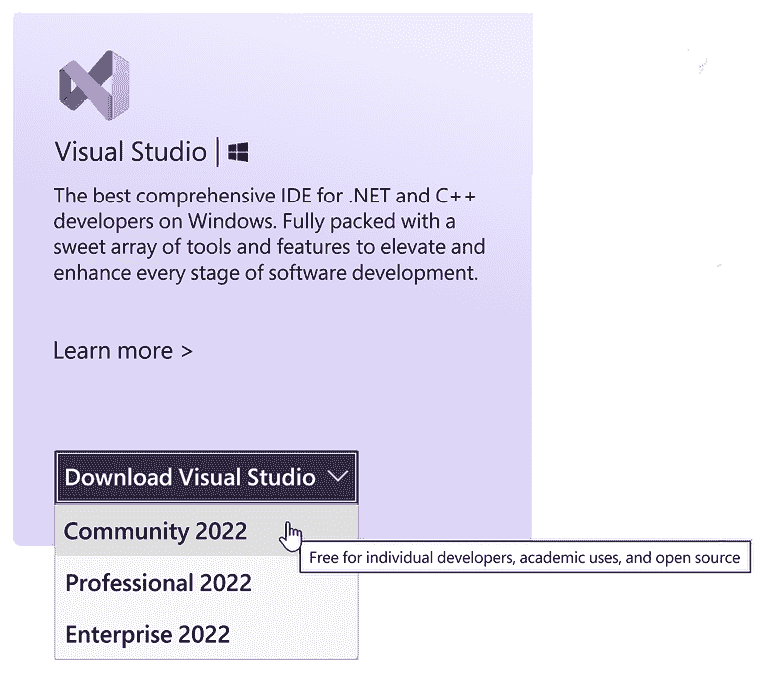
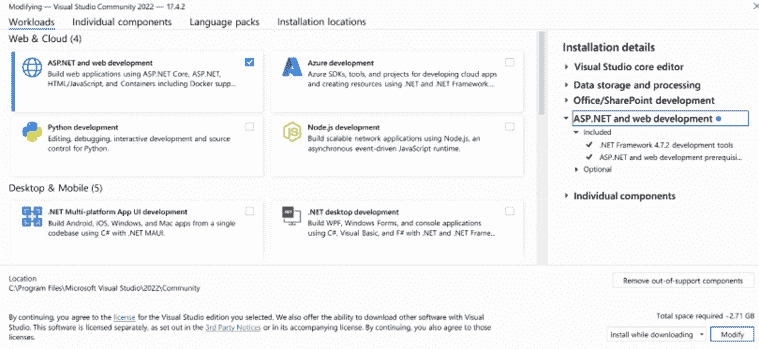
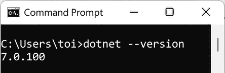
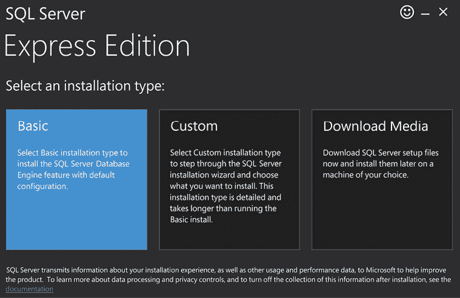
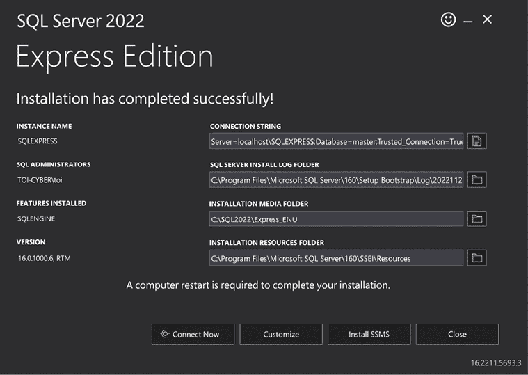
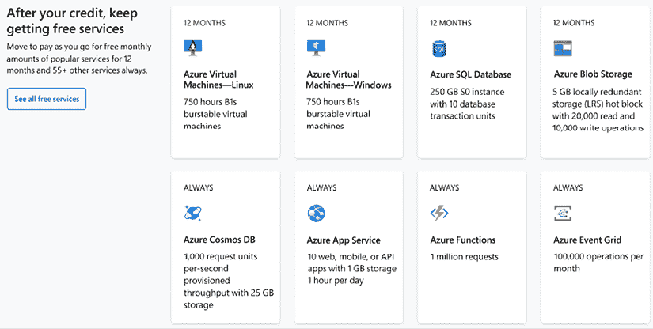

# 第一章：Blazor WebAssembly 简介

**Blazor WebAssembly** 是微软为在 **.NET Framework** 上构建交互式 Web 应用程序而推出的新 **单页应用程序**（SPA）框架。由于它基于 .NET Framework，Blazor WebAssembly 允许您在客户端和服务器上运行 C# 代码。因此，我们不再被迫在客户端编写 **JavaScript**，现在我们可以到处使用 C#。

> Blazor 火热非凡！
> 
> 在客户端运行 C#。
> 
> 再见，JavaScript！

在本章中，我们将解释使用 **Blazor** 框架的好处。我们将介绍三种不同的 Blazor 主机模型，并讨论每个模型的优缺点。此外，我们还将讨论 **WebAssembly** 的目标，并分享其支持情况。最后，我们将指导您设置计算机以完成本书中的项目。

在本章中，我们将涵盖以下主题：

+   使用 Blazor 框架的好处

+   主机模型：

    +   **Blazor Server**

    +   **Blazor Hybrid**

    +   Blazor WebAssembly

+   Blazor 主机模型之间的区别

+   什么是 **WebAssembly**？

+   设置您的 PC

# 使用 Blazor 框架的好处

使用 Blazor 框架提供了几个好处。首先，它是一个基于微软强大且成熟的 .NET Framework 的免费和开源框架。此外，它是一个使用 **Razor** 语法并可以使用微软卓越的工具开发的 SPA 框架。最后，微软正在积极支持和更新 Blazor 框架。让我们在接下来的部分中详细检查这些好处。

## .NET Framework

Blazor 框架建立在 .NET Framework 之上。因此，熟悉 .NET Framework 的人可以快速使用 Blazor 框架变得高效。Blazor 框架利用了 .NET Framework 的强大生态系统，包括 .NET 库和 NuGet 包。此外，由于客户端和服务器都可以用 C# 编写代码，因此客户端和服务器可以共享代码和库。例如，客户端和服务器可以共享用于数据验证的应用程序逻辑。

## 开源

Blazor 框架是开源的。由于 Blazor 是 **ASP.NET** 框架的一个功能，因此 Blazor 的所有源代码都可在 GitHub 上找到，作为 `dotnet/aspnetcore` 仓库的一部分，该仓库由 **.NET Foundation** 管理。.NET Foundation 是一个独立的、非盈利的组织，旨在支持围绕 .NET 平台的创新、商业友好型开源生态系统。.NET 平台拥有一个强大的社区，超过 3,700 家公司贡献了超过 100,000 次的贡献。

由于 .NET Framework 是免费的，这意味着 Blazor 也是免费的。使用 Blazor，包括商业用途，没有任何费用或许可费用。

## SPA 框架

Blazor 框架是一个单页应用（SPA）框架。正如其名所示，SPA 是由单个页面组成的网页应用。应用会动态重写页面中已更改的区域，而不是在每次 UI 更新时加载全新的页面。目标是实现更快的转换，使网页应用感觉更像原生应用。

当页面渲染时，Blazor 会创建一个渲染树，这是一个页面组件的图。它就像浏览器创建的 **文档对象模型**（**DOM**）。然而，它是一个虚拟 DOM。UI 的更新应用于虚拟 DOM，并且只有 DOM 和虚拟 DOM 之间的差异会被浏览器渲染。

## Razor 语法

**Razor** 是用于使用 C# 创建动态网页的 ASP.NET 视图引擎。Razor 是一种将 HTML 标记与 C# 代码结合的语法，旨在提高开发者的生产力。它允许开发者在同一文件中使用 HTML 标记和 C#。

Blazor 网页应用使用 **Razor 组件** 构建。Razor 组件是包含 C# 代码、标记和其它 Razor 组件的可重用 UI 元素。Razor 组件可以说是 Blazor 框架的基石。有关 Razor 组件的更多信息，请参阅 *第二章*，*构建您的第一个 Blazor WebAssembly 应用程序*。

**重要提示**

**Razor Pages** 和 **MVC** 也使用 Razor 语法。与渲染整个页面的 Razor Pages 和 MVC 不同，Razor 组件只渲染 DOM 变更。区分它们的一种简单方法是，Razor 组件使用 `RAZOR` 文件扩展名，而 MVC 和 Razor Pages 使用 `CSHTML` 文件扩展名。

Blazor 框架的名称有一个有趣的起源故事。术语 *Blazor* 是由单词 *browser* 和单词 *razor* 组合而成的。

## 精彩的工具集

您可以使用 **Microsoft Visual Studio** 或 **Microsoft Visual Studio Code** 来开发 Blazor 应用程序。Microsoft Visual Studio 是一个 **集成开发环境**（**IDE**），而 Microsoft Visual Studio Code 是一个轻量级但功能强大的编辑器。它们都是构建企业应用的绝佳工具。作为额外的好处，这两个工具都有免费版本。

## 由微软支持

虽然 Blazor 框架是开源的，但它由微软维护。他们继续对 Blazor 的未来进行大量投资。以下列表包括微软正在积极开发并添加到 Blazor 中的功能：

+   热重载改进

+   **提前编译**（**AOT**）编译性能改进

+   认证改进

+   额外的内置组件

+   多线程

使用 Blazor 框架开发 Web 应用程序有许多相关的好处。由于它建立在 .NET 框架之上，它使开发者能够使用他们已经掌握的技能，如 C#，以及他们已经熟悉的工具，如 Visual Studio。此外，由于它是一个 SPA 框架，Blazor Web 应用对用户来说感觉就像原生应用程序。最后，微软正在对 Blazor 的未来进行大量投资。

# 主机模型

正如我们之前提到的，Razor 组件是 Blazor 应用程序的基本构建块。这些 Razor 组件托管的位置取决于主机模型。

Blazor 有三种不同的主机模型：

+   Blazor Server

+   Blazor Hybrid

+   Blazor WebAssembly

微软发布的第一个主机模型是 Blazor Server。在此主机模型中，Razor 组件在服务器上执行。微软发布的第二个主机模型，也是本书的主题，是 Blazor WebAssembly。在此主机模型中，Razor 组件使用 WebAssembly 在浏览器上执行。最新的主机模型是 Blazor Hybrid。Blazor Hybrid 允许您通过在嵌入的 Web View 控件中托管 Razor 组件来构建原生客户端应用程序。

每种主机模型都有其自身的优缺点。然而，它们都依赖于相同的底层架构。因此，可以独立于主机模型编写和测试代码。

主机模型之间的主要区别在于代码的执行位置、延迟、安全性、有效负载大小和离线支持。所有主机模型共同的一点是它们都能以接近原生速度执行。

## Blazor Server

正如我们刚才提到的，Blazor Server 主机模型是微软发布的第一个主机模型。它于 2019 年 9 月作为 .NET Core 3 版本的一部分发布。

以下图示说明了 Blazor Server 主机模型：



图 1.1：Blazor Server

在此主机模型中，Web 应用在服务器上执行，并且只有 UI 更新发送到客户端浏览器。浏览器被视为瘦客户端，所有处理都在服务器上完成。因此，此模型需要与服务器保持持续连接。当使用 Blazor Server 时，UI 更新、事件处理和 JavaScript 调用都是通过 ASP.NET Core **SignalR** 连接来处理的。

**重要提示**

SignalR 是一个软件库，允许 Web 服务器向浏览器推送实时通知。Blazor Server 使用它将 UI 更新发送到浏览器。

### Blazor Server 的优势

与使用 Blazor WebAssembly 相比，使用 Blazor Server 有一些优势。然而，关键优势是所有操作都在服务器上完成。由于 Web 应用在服务器上运行，它可以访问服务器上的所有内容。因此，安全和数据访问得到了简化。此外，由于所有操作都在服务器上完成，包含 Web 应用代码的程序集（DLL）也保留在服务器上。

使用 Blazor Server 的另一个优势是它可以在不支持 WebAssembly 的瘦客户端和旧浏览器（如 Internet Explorer）上运行。

最后，使用 Blazor Server 的网络应用在首次使用时的初始加载时间可以远小于使用 Blazor WebAssembly 的网络应用，因为需要下载的文件要少得多。

### Blazor Server 的缺点

与 Blazor WebAssembly 相比，Blazor Server 托管模型有几个缺点。最大的缺点是浏览器必须保持与服务器的一致连接。由于没有离线支持，每次用户交互都需要网络往返。由于所有这些往返，Blazor Server 网络应用的延迟比 Blazor WebAssembly 网络应用高，可能会感觉响应缓慢。此外，网络中断可能导致客户端意外断开连接。

**提示**

延迟是 UI 操作与 UI 更新时间之间的时间。

使用 Blazor Server 的另一个缺点是它依赖于 SignalR 进行每个 UI 更新。微软对 SignalR 的支持正在改善，但扩展可能具有挑战性。当打开到服务器的并发连接太多时，连接耗尽可能会阻止其他客户端建立新的连接。

最后，Blazor Server 网络应用必须从 **ASP.NET Core** **服务器**上提供服务。

## Blazor Hybrid

Blazor Hybrid 托管模型是微软最近发布的托管模型。它于 2021 年 11 月作为 .NET 6 发布的一部分发布。

下面的图示说明了 Blazor Hybrid 托管模型：



图 1.2：Blazor Hybrid

在此模型中，Razor 组件在嵌入的 Web View 控件中运行。Blazor Hybrid 应用包括 Windows Forms、WPF 和 .NET MAUI 应用。通过使用 Blazor Hybrid 托管模型，您的应用可以完全访问您选择的目标设备的原生功能。

### Blazor Hybrid 的优势

与 Blazor WebAssembly 相比，使用此模型的优势在于它不需要 WebAssembly。此外，由于组件的 C# 代码在宿主进程中执行，Blazor Hybrid 应用可以访问设备的原生功能。

### Blazor Hybrid 的缺点

使用 Blazor Hybrid 的主要缺点是它们在原生应用中的 Web View 组件中托管。因此，开发者必须知道如何开发他们想要针对的每种类型的原生客户端应用。另一个缺点是它们通常需要一个服务器来交付应用。相比之下，Blazor WebAssembly 应用可以作为一组静态文件下载。

## Blazor WebAssembly

Blazor WebAssembly 托管模型是本书的主题。

**Blazor WebAssembly 3.2.0** 于 2020 年 5 月发布。**.NET 5 中的 Blazor WebAssembly** 是作为 **.NET 5.0** 发布的一部分在 2020 年 11 月发布的。**ASP.NET Core Blazor** 是作为 .NET 6.0 发布的一部分在 2021 年 11 月发布的，它是一个 **长期支持**（**LTS**）版本。Blazor WebAssembly 的最新版本是作为 .NET 7 发布的一部分在 2022 年 11 月发布的。本书将使用 **.NET 7 中的 Blazor WebAssembly** 用于所有项目。

**提示**

LTS 版本在初始发布后至少由微软支持 3 年。.NET 7 中的 Blazor WebAssembly 是一个当前版本，而不是 LTS 版本。当前版本将获得 18 个月的免费支持和补丁。我们建议，如果你正在使用 Blazor WebAssembly 开发一个新项目，你应该使用最新的版本。

以下图表说明了 Blazor WebAssembly 托管模型：



图 1.3：Blazor WebAssembly

在这种托管模型中，Web 应用在浏览器上执行。为了使 Web 应用和 .NET 运行时在浏览器上运行，浏览器必须支持 WebAssembly。WebAssembly 是所有现代浏览器（包括移动浏览器）支持的网络标准。虽然 Blazor WebAssembly 本身不需要服务器，但 Web 应用可能需要服务器进行数据访问和身份验证。

在过去，在浏览器上运行 C# 代码的唯一方法是使用插件，例如 **Silverlight**。Silverlight 是微软提供的一个免费浏览器插件。它非常受欢迎，直到苹果决定禁止在 iOS 上使用任何浏览器插件。由于苹果的决定，微软放弃了 Silverlight。

**重要提示**

Blazor 不依赖于插件或重新编译代码到其他语言。相反，它基于开放的 Web 标准，并受到所有现代浏览器（包括移动浏览器）的支持。

### Blazor WebAssembly 的优势

Blazor WebAssembly 有许多优势。首先，由于它在浏览器上运行，它依赖于客户端资源而不是服务器资源。因此，处理工作被卸载到客户端。此外，与 Blazor Server 不同，由于每个 UI 交互都需要往返服务器，因此没有延迟。

Blazor WebAssembly 可以用来创建 **渐进式 Web 应用**（**PWA**）。PWA 是看起来和感觉像原生应用的网络应用。它们提供离线功能、后台活动、原生 API 层和推送通知。它们甚至可以列在各种应用商店中。通过将你的 Blazor WebAssembly 应用配置为 PWA，你的应用可以通过单一代码库在任何设备上触达任何人。有关创建 PWA 的更多信息，请参阅 *第六章*，*作为渐进式 Web 应用（PWA）构建天气应用*。

最后，Blazor WebAssembly 网页应用程序不依赖于 ASP.NET Core 服务器。实际上，您可以通过内容分发网络（**CDN**）部署 Blazor WebAssembly 网页应用程序。

### Blazor WebAssembly 的缺点

公平地说，使用 Blazor WebAssembly 时存在一些缺点，应该予以考虑。首先，在使用 Blazor WebAssembly 时，.NET 运行时、`dotnet.wasm` 文件以及您的程序集需要下载到浏览器中才能使您的网页应用程序工作。因此，第一次运行 Blazor WebAssembly 应用程序通常比相同的 Blazor Server 应用程序初始加载时间更长。然而，您可以使用一些策略来加快初始加载时间，例如将一些程序集的加载推迟到需要时。此外，这仅是初始加载时的问题，因为应用程序的后续运行将访问来自本地缓存中的文件。

Blazor WebAssembly 网页应用程序的另一个缺点是它们的强大程度取决于运行的浏览器。因此，不支持瘦客户端。Blazor WebAssembly 只能在支持 WebAssembly 的浏览器上运行。幸运的是，由于世界 Wide Web Consortium（**W3C**）与苹果、谷歌、微软和 Mozilla 的工程师之间的大量协调，所有现代浏览器都支持 WebAssembly。

## 托管模型差异

下表显示了三种模型之间的差异：

|  | Blazor WebAssembly | Blazor Hybrid | Blazor Server |
| --- | --- | --- | --- |
| 原生执行速度 | X | X | X |
| 在客户端执行 | X | X |  |
| 在服务器上执行 |  |  | X |
| 初始加载后低延迟 | X | X |  |
| 快速初始加载时间 |  |  | X |
| 离线支持 | X | X |  |
| 不需要服务器 | X |  |  |
| 需要持续连接到服务器 |  |  | X |
| 可构建 PWA | X |  |  |
| 将程序集发送到客户端 | X | X |  |
| 程序集保留在服务器上 |  |  | X |
| 可访问原生客户端功能 |  | X |  |
| 需要 WebAssembly | X |  |  |
| 需要 SignalR |  |  | X |
| 可在瘦客户端上运行 |  |  | X |

表 1.1：托管模型差异

Blazor 框架提供了三种不同的托管模型，分别是 Blazor Server、Blazor Hybrid 和 Blazor WebAssembly。Blazor Server 网页应用程序在服务器上运行，并使用 SignalR 将 HTML 传输到浏览器。Blazor Hybrid 网页应用程序在原生应用程序的 Web View 控件中运行。Blazor WebAssembly 网页应用程序直接在浏览器中使用 WebAssembly 运行。它们各自都有其优缺点。然而，如果您想创建交互性强、响应速度快、类似原生的离线可用的网页应用程序，我们推荐使用 Blazor WebAssembly。接下来，我们将学习更多关于 WebAssembly 的知识。

# 什么是 WebAssembly？

WebAssembly 是一种二进制指令格式，它允许用高级语言（如 C#）编写的代码以接近原生的速度在浏览器上运行。要在网页浏览器中运行 .NET 二进制文件，它使用的是编译为 WebAssembly 的 .NET 运行时版本。你可以将其视为在浏览器中执行原生编译的代码。

WebAssembly 是由 W3C 社区组开发的开放标准。它最初于 2015 年宣布，第一个支持它的浏览器于 2017 年发布。

## WebAssembly 目标

当 WebAssembly 最初开发时，该项目有四个主要设计目标。以下是 WebAssembly 的原始目标列表：

+   快速且高效

+   安全

+   开放

+   不要破坏网络

WebAssembly 快速且高效。它旨在允许开发者用任何语言编写代码，然后编译为在浏览器中运行。由于代码是编译的，因此它运行速度快，性能接近原生速度。

WebAssembly 是安全的。它不允许直接与浏览器的 DOM 交互。相反，它在自己的内存安全、沙箱执行环境中运行。您必须使用 JavaScript 互操作来与 DOM 交互。*第五章*中的项目，*使用 JavaScript 互操作构建本地存储服务（JS 互操作）*，将教会您如何使用 JavaScript 互操作。

WebAssembly 是开放的。尽管它是一种低级汇编语言，但可以手动编辑和调试。

WebAssembly 没有破坏网络。它是一种旨在与其他网络技术协同工作的网络标准。此外，WebAssembly 模块可以访问与 JavaScript 可访问的相同 Web API。

总体而言，WebAssembly 能够实现所有原始目标，并且迅速获得了所有现代浏览器的支持。

## WebAssembly 支持

如前所述，WebAssembly 在所有现代浏览器上运行，包括移动浏览器。从下表可以看出，所有最流行浏览器的当前版本都与 WebAssembly 兼容：

| 浏览器 | 版本 |
| --- | --- |
| 微软 Edge | 当前 |
| Mozilla Firefox，包括 Android | 当前 |
| Google Chrome，包括 Android | 当前 |
| Safari，包括 iOS | 当前 |
| Opera，包括 Android | 当前 |
| 微软 Internet Explorer | 不支持 |

表 1.2：WebAssembly 浏览器兼容性

**重要提示**

自 2022 年 6 月 15 日起，微软不再支持微软 Internet Explorer。它不支持 WebAssembly，并且永远不会支持 WebAssembly。

WebAssembly 是一种网络标准，允许开发者在浏览器中运行用任何语言编写的代码。它被所有现代浏览器支持。

现在我们已经讨论了使用 Blazor 框架的好处，并比较了各种托管模型，现在是时候开始使用 Blazor WebAssembly 框架进行开发了。然而，在我们开始之前，您需要设置您的电脑。

# 设置您的电脑

对于本书中的项目，我们使用 Microsoft Visual Studio Community 2022、.NET 7、Microsoft SQL Server 2022 Express Edition 和 Microsoft Azure。

所有项目都是使用 **Microsoft** **Visual Studio Community 2022 (64 位) – 当前版本** 17.4.2 以及 ASP.NET 和 Web 开发工作负载构建的。如果您需要安装 Microsoft Visual Studio Community 2022，请遵循本章后面 *安装 Microsoft Visual Studio Community Edition* 部分的说明。

**提示**

尽管我们使用的是 Microsoft Visual Studio Community 2022，但本书中的任何版本的 Microsoft Visual Studio 2022 都可以用来完成项目。Microsoft Visual Studio Code 也可以使用。然而，所有截图均来自 Microsoft Visual Studio Community 2022。

.NET 7 中的 Blazor WebAssembly 需要 .NET 7.0。要确定计算机上运行的 .NET 版本，请打开 **命令提示符** 并输入以下命令：

```cs
dotnet –-version 
```

如果您的计算机未运行 .NET 7.0 或更高版本，请遵循本章后面 *安装 .NET 7.0* 部分的说明。

*第三章* 和 *第十章* 使用 Microsoft Azure。*第三章* 使用 Microsoft Azure 发布 Blazor WebAssembly 应用程序，而 *第十章* 使用 Microsoft Azure Active Directory 保护 Blazor WebAssembly 应用程序。

本书最后两个项目使用 **Microsoft** **SQL Server 2022 Express Edition** 作为后端数据库。如果您需要安装 Microsoft SQL Server Express Edition，请遵循本章后面 *安装 Microsoft SQL Server Express* 部分的说明。

**提示**

尽管我们使用的是 Microsoft SQL Server 2022 Express Edition，但任何年份或版本的 SQL Server 都可以用来完成本书中的项目。

## 安装 Microsoft Visual Studio Community Edition

Microsoft Visual Studio Community Edition 是 Microsoft Visual Studio 的免费版。要安装 Microsoft Visual Studio Community Edition，请执行以下步骤：

1.  从 [`visualstudio.microsoft.com`](https://visualstudio.microsoft.com) 下载 **Visual Studio 安装程序**。



图 1.4：下载 Visual Studio 选择器

1.  下载完成后，运行安装程序以完成安装。

1.  在安装过程的第一个步骤中，Visual Studio 安装程序将检查系统中现有的 Visual Studio 版本。一旦安装程序完成对已安装版本的检查，它将打开以下安装对话框：



图 1.5：Visual Studio 安装程序

1.  选择 **ASP.NET 和 Web 开发** 工作负载，然后点击 **安装** 按钮完成安装。

## 安装 .NET 7.0

要安装 .NET 7.0，请执行以下步骤：

1.  从 [`dotnet.microsoft.com/download/dotnet/7.0`](https://dotnet.microsoft.com/download/dotnet/7.0) 下载 **.NET 7.0** 安装程序。我们使用的是 **Windows x64 SDK 安装程序**。

1.  下载完成后，运行安装程序以完成 .NET 7.0 在您计算机上的安装。

1.  打开**命令提示符**并输入以下命令以验证您的计算机现在正在运行 .NET 7.0：

    ```cs
    dotnet –-version 
    ```

    以下截图来自运行 .NET 7.0 的计算机：

    

    图 1.6: .NET 版本

## 安装 Microsoft SQL Server Express

Microsoft SQL Server Express 是 Microsoft SQL Server 的免费版。要安装 Microsoft SQL Server Express，请执行以下操作：

1.  从 [`www.microsoft.com/en-us/sql-server/sql-server-downloads`](https://www.microsoft.com/en-us/sql-server/sql-server-downloads) 下载 **SQL Server Express** 的 Microsoft SQL Server 安装程序。

1.  下载完成后，运行 SQL Server 安装程序。

1.  选择**基本**安装类型：



图 1.7: SQL Server 安装程序

1.  点击**接受**按钮以接受 Microsoft SQL Server 许可条款。

1.  点击**安装**按钮完成安装。

    以下截图显示了 SQL Server Express 安装成功后出现的对话框：

    

    图 1.8: SQL Server Express 版本

## 创建 Microsoft Azure 账户

Microsoft Azure 是微软的云平台，它提供超过 200 个产品和云服务。您可以使用它来运行和管理您选择工具和框架的应用程序。

如果您还没有 Microsoft Azure 账户，您可以创建一个免费账户。每个免费账户都附带 200 美元的信用额度，以帮助您开始使用，并提供超过 55+ 的免费服务。



图 1.9: Microsoft Azure

要创建一个免费的 Microsoft Azure 账户，请执行以下操作：

1.  导航到 Microsoft Azure 页面，[`azure.microsoft.com/`](https://azure.microsoft.com/)。

1.  点击**免费账户**按钮。

1.  点击**开始免费**按钮。

1.  完成协议并点击**注册**按钮。

要完成本书中的所有项目，您需要一个代码编辑器，例如 Microsoft Visual Studio Community 2022、.NET 7.0、Microsoft Azure 和 Microsoft SQL Server。在本章中，我们向您展示了如何安装 Visual Studio 2022 社区版、.NET 7.0 和 SQL Server 2022 Express 版本。我们还向您展示了如何开通免费的 Microsoft Azure 账户。

# 摘要

完成本章后，您应该了解使用 Blazor WebAssembly 相比其他 Blazor 托管模型的好处，并准备好完成本书中的项目。

在本章中，我们介绍了 Blazor 框架。Blazor 框架建立在 .NET Framework 之上，允许网络开发者在网络应用程序的客户机和服务器端使用 C#。

之后，我们比较了 Blazor WebAssembly 与 Blazor Server 和 Blazor Hybrid。所有三种托管模型都用于托管 Razor 组件。它们各自都有其优势和劣势。我们更喜欢 Blazor WebAssembly。

在本章的最后部分，我们解释了如何使用 Microsoft Visual Studio Community Edition、.NET 7.0 和 Microsoft SQL Server Express 设置您的计算机，以及如何打开 Microsoft Azure 账户，所有这些都是在完成本书中的项目所必需的。

现在您的计算机已设置好以完成本书中的项目，是时候开始行动了。在下一章中，您将创建您的第一个 Blazor WebAssembly 网络应用程序。

# 问题

以下问题供您思考：

1.  以下哪种托管模型需要持续连接到服务器：Blazor WebAssembly、Blazor Server 或 Blazor Hybrid？

1.  使用 Blazor WebAssembly 是否意味着你永远不再需要编写 JavaScript？

1.  Blazor WebAssembly 是否需要在浏览器上安装任何插件？

1.  使用 Blazor WebAssembly 开发需要多少钱？

# 进一步阅读

以下资源提供了关于本章主题的更多信息：

+   关于 Blazor 的更多信息，请参阅 [`blazor.net`](https://blazor.net)。

+   关于 .NET 基金会的更多信息，请参阅 [`dotnetfoundation.org`](https://dotnetfoundation.org)。

+   关于 GitHub 上的 ASP.NET 仓库的更多信息，请参阅 [`github.com/dotnet/aspnetcore`](https://github.com/dotnet/aspnetcore)。

+   关于 WebAssembly 的一般信息，请参阅 [`webassembly.org`](https://webassembly.org)。

+   关于 WebAssembly 与浏览器的兼容性信息，请参阅 [`caniuse.com/?search=wasm`](https://caniuse.com/?search=wasm)。

+   关于 Razor Pages 的更多信息，请参阅 [`learn.microsoft.com/en-us/aspnet/core/razor-pages`](https://learn.microsoft.com/en-us/aspnet/core/razor-pages)。

# 加入我们的 Discord 社区

加入我们的 Discord 社区空间，与作者和其他读者进行讨论：

[`packt.link/BlazorWASM2e`](https://packt.link/BlazorWASM2e)


