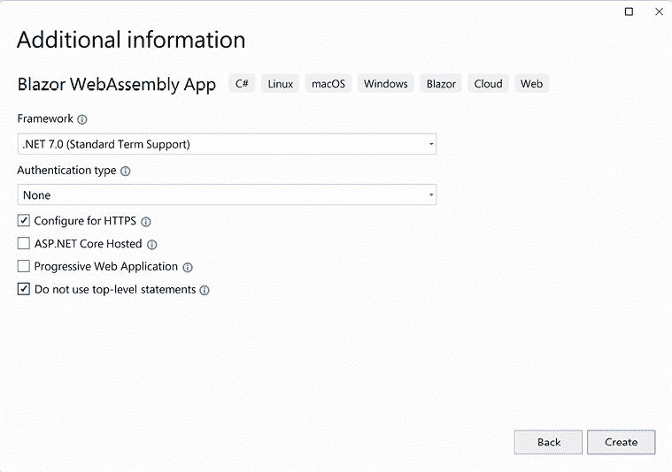
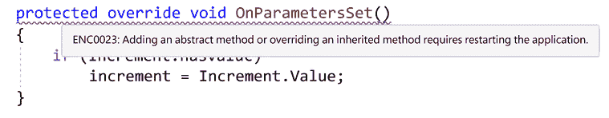

# 构建您的第一个 Blazor WebAssembly 应用程序

**Razor 组件**是 Blazor WebAssembly 应用程序的构建块。Razor 组件是一块用户界面，它可以被共享、嵌套和重用。Razor 组件是普通的 C#类，可以放置在项目的任何位置。

> Razor 组件。
> 
> Blazor 应用程序的构建块。
> 
> 可嵌套的魔法。

在本章中，我们将学习关于 Razor 组件的内容。我们将学习如何使用它们，如何应用参数，以及如何创建它们。我们还将熟悉它们的生命周期和结构。我们将学习如何使用`@page`指令来定义路由，以及如何使用**Razor 语法**将 C#代码与 HTML 标记组合。最后，我们将介绍**热重载**体验。

本章中的 Blazor WebAssembly 项目将通过使用 Microsoft 提供的**Blazor WebAssembly App 项目模板**来创建。创建项目后，我们将检查它以进一步熟悉 Razor 组件。我们将学习如何使用它们，如何添加参数，如何应用路由，如何使用 Razor 语法，以及如何将 Razor 标记和代码分离到不同的文件中。在编辑代码时，我们将使用`Hot Reload`来自动更新浏览器。

在本章中，我们将涵盖以下主题：

+   Razor 组件

+   路由

+   Razor 语法

+   热重载

+   创建 demo WebAssembly 项目

# 创建 Demo Blazor WebAssembly 项目的技术要求

要完成此项目，您需要在您的 PC 上安装 Microsoft Visual Studio 2022。有关如何安装 Microsoft Visual Studio 2022 免费社区版的说明，请参阅*第一章*，*Blazor WebAssembly 简介*。

本章的源代码可在以下 GitHub 仓库中找到：[`github.com/PacktPublishing/Blazor-WebAssembly-by-Example-Second-Edition/tree/main/Chapter02`](https://github.com/PacktPublishing/Blazor-WebAssembly-by-Example-Second-Edition/tree/main/Chapter02)。

代码在行动视频在此处可用：[`packt.link/Ch2`](https://packt.link/Ch2)。

# Razor 组件

Blazor WebAssembly 是一个以组件为驱动的框架。Razor 组件是 Blazor WebAssembly 应用程序的基本构建块。它们是使用 C#、HTML 和 Razor 语法组合实现的类。当 Web 应用程序加载时，这些类会以正常的.NET 程序集（DLLs）的形式下载到浏览器中。

**重要提示**

在这本书中，术语“Razor 组件”和“组件”是可互换使用的。

## 使用组件

使用 HTML 元素语法将一个组件添加到另一个组件中。标记看起来像一个 HTML 标签，其中标签的名称是组件类型。

在本章稍后我们将创建的`Demo`项目的`Pages/Index.razor`文件中的以下标记将渲染一个`SurveyPrompt`实例：

```cs
<SurveyPrompt Title="How is Blazor working for you?" /> 
```

前面的`SurveyPrompt`元素包含一个名为`Title`的属性参数。

## 参数

组件参数用于使组件动态化。参数是组件的公共属性，用 `Parameter` 属性或 `CascadingParameter` 属性装饰。参数可以是简单类型、复杂类型、函数、**RenderFragments** 或事件回调。

以下名为 `Hello` 的组件的代码包括一个名为 `Text` 的参数：

**Hello.razor**

```cs
<h1>Hello @Text!</h1>
@code {
    [Parameter] public string? Text { get; set; }
} 
```

要使用 `Hello` 组件，请在另一个组件中包含以下 HTML 语法：

```cs
<Hello Text="World" /> 
```

在前面的示例中，`Hello` 组件的 `Text` 属性是 `Text` 参数的来源。此截图显示了使用组件的结果：


图 2.1：Hello 组件

参数的 `get` 和 `set` 访问器不得包含自定义逻辑。它们仅作为从父组件流向子组件的信息通道。此外，如前所述，它们必须是公共的。

**重要提示**

如果子组件包含导致父组件重新渲染的参数，应用程序将进入无限循环。

### 必需参数

您可以通过使用 `EditorRequired` 属性来装饰参数，指定编辑器需要该参数。在 `Hello2` 组件的以下版本中，`Text` 参数是必需的：

**Hello2.razor**

```cs
<h1>Hello @Text!</h1>
@code {
    [Parameter] 
    [EditorRequired]
    public string? Text { get; set; }
} 
```

如果我们尝试在一个组件中使用 `Hello2` 并不包括 `Text` 属性，Visual Studio 将显示以下警告：


图 2.2：缺少参数警告

前面的警告不会阻止应用程序构建，并且在运行时也不强制执行。它仅由编辑器使用。

**重要提示**

使用 `EditorRequired` 属性装饰参数不能保证在运行时参数将有值。

### 查询字符串

组件还可以从查询字符串接收参数。查询字符串用于将值分配给指定的参数。为了指示参数可以来自查询字符串，我们用 **SupplyParameterFromQuery** 属性装饰参数。

在以下示例中，`Increment` 参数已被 `SupplyParameterFromQuery` 属性装饰：

```cs
[Parameter] 
[SupplyParameterFromQuery]
public int? Increment { get; set; } 
```

这是将 `Increment` 的值设置为 `5` 的代码：

[`localhost:7097/counter?increment=5`](https://localhost:7097/counter?increment=5)

在前面的示例中，问号之后的所有内容都是查询字符串。查询字符串不区分大小写。此外，前面的示例假设我们在本地端口 7097 上运行我们的应用程序。由于所使用的端口会因应用程序而异，因此我们将在其余示例中省略端口。

**提示**

**applicationUrl** 在 `Properties/launchSettings.json` 文件中定义。每次我们使用 Microsoft 项目模板创建新的 Blazor 项目时，`applicationUrl` 将随机引用不同的端口。

查询字符串提供的参数限于以下类型、以下类型的数组及其可空变体：

+   `bool`

+   `DateTime`

+   `decimal`

+   `double`

+   `float`

+   `Guid`

+   `int`

+   `long`

+   `string`

它们也可以由前面类型组成的数组。

## 组件命名

Razor 组件的名称必须使用标题格式。因此，`hello` 不是一个有效的 Razor 组件名称，因为 h 没有被大写。此外，Razor 组件使用 `RAZOR` 扩展名，而不是 `Razor` Pages 使用的 `CSHTML` 扩展名。

**重要提示**

Razor 组件必须以大写字母开头。

## 组件生命周期

Razor 组件继承自 `ComponentBase` 类。`ComponentBase` 类包含异步和同步方法，用于管理组件的生命周期。在本书中，我们将使用方法的异步版本，因为它们执行时不会阻塞其他操作。组件生命周期中方法的调用顺序如下：

+   **SetParametersAsync**：此方法设置组件父级在渲染树中提供的参数。

+   **OnInitializedAsync**：此方法在参数设置完成后，组件成功初始化后调用。

+   **OnParametersSetAsync**：此方法在组件初始化后以及每次组件重新渲染时调用。当父组件重新渲染且至少有一个参数已更改时，组件将重新渲染。此外，当调用组件的 **StateHasChanged** 方法时，组件也会重新渲染。

+   **OnAfterRenderAsync**：此方法在组件完成渲染后调用。此方法用于与 JavaScript 一起使用，因为 JavaScript 需要在执行任何工作之前渲染 **Document Object Model** (**DOM**) 元素。

## 组件结构

下面的图示展示了我们将在此章节中创建的 `Demo` 项目的 `Counter` 组件的代码：


图 2.3：组件结构

上述示例中的代码分为三个部分：

+   指令

+   标记

+   代码块

每个部分都有不同的用途。

### 指令

指令用于添加特殊功能，例如路由、布局和依赖注入。文件级指令在 Razor 中定义，并且不能定义自己的指令。Razor 指令以 `@` 符号开头。

在上述示例中，只使用了单个指令——`@page` 指令。`@page` 指令用于路由。在此示例中，以下 URL 将将用户路由到 `Counter` 组件：

```cs
/counter 
```

一个典型的页面可以在页面的顶部包含许多指令。此外，许多页面有多个 `@page` 指令。

大多数 Razor 指令都可以在 Blazor WebAssembly 应用程序中使用。以下是按字母顺序排列的 Blazor 中使用的 Razor 指令：

+   `@attribute`: 这个指令向组件添加类级属性。以下示例添加了 `[Authorize]` 属性：

    ```cs
    @attribute [Authorize] 
    ```

+   `@code`: 这个指令向组件添加类成员。在示例中，它用于区分代码块。

+   `@implements`: 这个指令为指定的类实现接口。

+   `@inherits`: 这个指令提供了对视图继承的类的完全控制。

+   `@inject`: 这个指令用于依赖注入。它使组件能够从依赖注入容器中注入服务到视图中。以下示例将定义在 `Program.cs` 文件中的 **HttpClient** 注入到组件中：

    ```cs
    @inject HttpClient Http 
    ```

+   `@layout`: 这个指令用于指定包含 `@page` 指令的 Razor 组件的布局。

+   `@namespace`: 这个指令设置组件的命名空间。只有当你不想使用组件的默认命名空间时，才需要使用此指令。默认命名空间基于组件的位置。

+   `@page`: 这个指令用于路由。

+   `@preservewhitespace`: 这个指令用于保留渲染的标记中的空白。如果设置为 `true`，则保留空白。默认值为 `false`。

+   `@using`: 这个指令控制作用域内的组件。

### 标记

标记是带有 Razor 语法标记的 HTML。Razor 语法可以用来渲染文本，并允许 C# 作为标记的一部分被包含。我们将在本章后面更详细地介绍 Razor 语法。

### 代码块

代码块包含页面的逻辑。它以 `@code` 指令开始。按照惯例，代码块位于页面底部。它是唯一一个不在页面顶部放置的文件级指令。

代码块是我们向组件添加 C# 字段、属性和方法的地方。在本章的后面部分，我们将把代码块移动到一个单独的后台代码文件中。

Razor 组件是 Blazor WebAssembly 应用程序的基本构建块。由于它们仅仅是 HTML 标记和 C# 代码的组合，因此它们易于使用。它们通过指令、标记和代码块进行结构化。组件具有明确的生命周期。它们可以嵌套并利用不同类型的参数来使它们动态化。在下一节中，我们将解释如何使用路由在组件之间进行导航。

# 路由

在 Blazor WebAssembly 中，路由在客户端处理，而不是在服务器端。当你通过浏览器导航时，Blazor 会拦截该导航并渲染与匹配路由的组件。

URL 是相对于在 `wwwroot/index.html` 文件中指定的基本路径解析的。基本路径使用以下语法在 `head` 元素中指定：

```cs
<base href="/" /> 
```

与您可能使用过的其他框架不同，路由不是从其文件位置推断出来的。例如，在 `Demo` 项目中，`Counter` 组件位于 `/Pages/Counter` 文件夹中，但它使用以下路由：

```cs
/counter 
```

这是 `Counter` 组件使用的 `@page` 指令：

```cs
@page "/counter" 
```

## 路由参数

路由参数可以用来填充组件的参数。组件和路由的参数必须具有相同的名称，但它们不区分大小写。

您可以为组件提供多个 `@page` 指令。以下 `RoutingExample` 组件演示了如何包含多个 `@page` 参数：

**RoutingExample.razor**

```cs
@page "/routing"
@page "/routing/{text}"
<h1>Blazor WebAssembly is @Text!</h1>
@code {
    [Parameter] public string? Text { get; set; }
    protected override void OnInitialized()
    {
        Text = Text ?? "fantastic";
    }
} 
```

在前面的代码中，第一个 `@page` 指令允许在无参数的情况下导航到组件，而第二个 `@page` 指令包含一个路由参数。如果提供了 `text` 的值，它将被分配给组件的 `Text` 属性。如果组件的 `Text` 属性为 `null`，则将其设置为 `fantastic`。

以下 URL 将将用户路由到 `RoutingExample` 组件：

```cs
/routing 
```

以下 URL 也将将用户路由到 `RoutingExample` 组件，但这次 `Text` 参数将由路由设置：

```cs
/routing/amazing 
```

此截图显示了使用指示路由的结果：


图 2.4：`RoutingExample` 组件

**重要提示**

路由参数不区分大小写。

## 可选路由参数

Blazor 支持可选路由参数。在以下 `RoutingExample` 组件版本中，`Text` 属性是可选的：

**RoutingExample.razor**

```cs
@page "/routing/{text?}"
<h1>Blazor WebAssembly is @Text!</h1>
@code {
    [Parameter] public string? Text { get; set; }
    protected override void OnInitialized()
    {
        Text = Text ?? "fantastic";
    }
} 
```

`RoutingExample` 组件的这个版本与原始版本的区别在于，两个 `@page` 指令已被合并，并且 `text` 路由参数已被更改为可空类型。通过使用可选路由参数，我们可以减少应用程序所需的 `@page` 指令数量。

**提示**

如果需要组件使用不同的可选参数值导航到自身，您应该在 `OnParametersSet` 事件中设置该值，而不是在 `OnInitialized` 事件中。

## 通配符路由参数

通配符路由参数用于捕获跨越多个文件夹边界的路径。此类路由参数是 `string` 类型，并且只能放置在 URL 的末尾。通配符路由参数用星号表示。

这是一个使用通配符路由参数的示例组件：

**CatchAll.razor**

```cs
@page "/error/{*path}"
@page "/warning/{*path}"
<h1>Catch All</h1>
Route: @Path
@code {
    [Parameter] public string? Path { get; set; }
} 
```

对于 `/error/type/3` URL，前面的代码将设置 `Path` 参数的值为 `type/3`，如下所示图所示：


图 2.5：通配符路由参数示例

## 路由约束

路由约束用于强制路由参数的数据类型。要定义约束，请在参数后添加冒号和约束类型。在以下示例中，路由期望一个名为`Increment`且类型为`int`的路由参数：

```cs
@page "/counter/{increment:int}" 
```

对于路由约束，以下类型及其可空变体都受到支持：

+   `bool`

+   `datetime`

+   `decimal`

+   `double`

+   `float`

+   `guid`

+   `int`

+   `long`

    **重要提示**

    路由约束使用不变文化，并且不支持本地化。例如，日期仅以 MM-dd-yyyy 或 yyyy-MM-dd 的形式有效，布尔值必须是`true`或`false`。

以下类型目前不支持作为约束：

+   正则表达式

+   枚举

+   自定义约束

路由约束支持可选参数。在以下示例中，名为`increment`且类型为`int`的路由参数是可选的：

```cs
@page "/counter/{increment:int?}" 
```

路由在客户端处理。每个可路由组件可以包含一个或多个路由。我们可以使用路由参数和通配符路由参数来定义路由。路由约束用于确保路由参数是所需的数据类型。Razor 组件使用 Razor 语法将 HTML 与 C#代码无缝合并，这是我们将在下一节中看到的。

# Razor 语法

Razor 语法由 HTML、Razor 标记和 C#组成。从 Razor 组件渲染 HTML 与从 HTML 文件渲染 HTML 相同。Razor 语法使用内联表达式和控制结构来渲染动态值。

## 内联表达式

内联表达式以`@`符号开头，后跟变量或函数名。这是一个内联表达式的示例：

```cs
<h1>Blazor is @Text!</h1> 
```

在前面的示例中，Blazor 将`@`符号后面的文本解释为属性名或方法名。

## 控制结构

控制结构也以`@`符号开头。花括号内的内容将被评估并渲染到输出中。这是一个来自我们将在本章后面创建的`Demo`项目中的`FetchData`组件的`if`语句示例：

```cs
@if (forecasts == null)
{
    <p><em>Loading...</em></p>
} 
```

### 条件语句

Razor 语法包括以下类型的条件语句：

+   `if`语句

+   `switch`语句

这是一个`if`语句的示例：

```cs
@if (DateTime.Now.DayOfWeek.ToString() != "Friday")
{
    <p>Today is not Friday.</p>
}
else if (DateTime.Now.Day != 13)
{
    <p>Today is not the 13th.</p>
}
else
{
    <p>Today is Friday the 13th.</p>
} 
```

前面的代码使用`if`语句检查当前星期几是否为星期五以及/或当前月份是否为 13 日。结果渲染相应的`p`元素。

这是一个`switch`语句的示例：

```cs
@switch (value)
{
    case 1:
        <p>The value is 1!</p>
        break;
    case 42:
        <p>Your number is 42!</p>
        break;
    default:
        <p>Your number was not 1 or 42.</p>
        break;
}
@code {
    private int value = 2;
} 
```

前面的`switch`语句将`value`变量与`1`和`42`进行比较。结果渲染相应的`p`元素。

### 循环

Razor 语法提供了以下类型的循环：

+   **for**循环

+   **foreach**循环

+   **while**循环

+   **do while**循环

下面的每个示例都循环遍历 `WeatherForecast` 项的数组，以显示数组中每个项的 `Summary` 属性。

这是一个 `for` 循环的示例：

```cs
@for (var i = 0; i < forecasts.Count(); i++)
{
   <div>@forecasts[i].Summary</div>
}
@code {
    private WeatherForecast[] forecasts;
} 
```

这是一个 `foreach` 循环的示例：

```cs
@foreach (var forecast in forecasts)
{
    <div>@forecast.Summary</div>
}
@code {
    private WeatherForecast[] forecasts;
} 
```

这是一个 `while` 循环的示例：

```cs
@while (i < forecasts.Count())
{
    <div>@forecasts[i].Summary</div>
    i++;
}
@code {
    private WeatherForecast[] forecasts;
    private int i = 0;
} 
```

这是一个 `do while` 循环的示例：

```cs
@do
{
    <div>@forecasts[i].Summary</div>
    i++;
} while (i < forecasts.Count());
@code {
    private WeatherForecast[] forecasts;
    private int i = 0;
} 
```

所有的前述循环示例都渲染相同的输出。使用 Razor 语法循环遍历集合有许多方法。

如果你已经了解 C#，Razor 语法很容易学习。它包括内联表达式和控制结构，如条件语句和循环。通过使用 `Hot Reload`，我们可以在浏览器中立即编辑代码并查看结果。

# 热重载

`Hot Reload` 允许开发者在无需重新构建或刷新应用程序的情况下编辑正在运行的应用程序的标记和 C# 代码。同时，它还保持应用程序的状态。

你可以使用或不需要调试器来使用 `Hot Reload`。要触发 `Hot Reload`，你可以使用工具栏上的 **热重载** 下拉按钮或按 *Alt*+*F10*。

这是从工具栏访问的 **热重载** 下拉按钮：


图 2.6：热重载下拉按钮

如你所见，从 **热重载** 下拉按钮中，你可以设置 **热重载** 在你保存文件时自动触发。通过菜单上的 **设置** 选项还有更多设置可用。**热重载** 支持对组件的大部分更改，包括样式表。但是，有时更改可能需要重启应用程序。

这是一个需要重启的一些活动的列表：

+   添加新的局部函数

+   添加新的 lambda 表达式

+   添加新的字段

+   更改参数的名称

+   添加 await 操作符

如果需要重启，将显示以下对话框：


图 2.7：热重载警告对话框

如果你勾选了 **当无法应用更新时始终重新构建** 复选框，Visual Studio 将在 `Hot Reload` 无法自动应用更改时自动重新构建和重新加载应用程序。此外，此对话框将不再显示，直到在 **设置** 中更改此设置或关闭解决方案。

**重要提示**

如果启用了原生代码调试，则 `Hot Reload` 将无法工作。此外，你可以在项目的 `Properties/launchSettings.json` 文件中将 `hotReloadEnabled` 设置为 `false` 来在项目级别禁用它。

热重载使你更有效率，因为你不需要每次更新时都停止并重新启动你的应用程序。

# 创建演示 Blazor WebAssembly 项目

本章将要构建的 Blazor WebAssembly 应用程序是一个简单的三页应用程序。每一页都将用于演示 Razor 组件的一个或多个功能。

这是我们完成的`Demo`项目的截图：


图 2.8：`Demo`项目的首页

此项目的构建时间大约为 60 分钟。

## 项目概述

我们正在创建的`Demo`项目是基于`Blazor WebAssembly App`项目模板提供的示例项目之一。在用模板创建项目后，我们将检查示例项目中的文件，并更新一些文件以展示如何使用 Razor 组件。为了提升开发体验，我们将启用`热重载`。最后，我们将一个组件的代码块分离到一个单独的文件中，以展示如何使用代码后技术将标记与代码分离。

## 开始使用项目

Visual Studio 附带了许多项目模板。我们将使用**Blazor WebAssembly App**项目模板来创建我们的第一个 Blazor WebAssembly 项目。由于此项目模板可以用来创建许多不同类型的 Blazor 项目，因此必须精确遵循这些说明：

1.  打开 Microsoft Visual Studio 2022。

1.  点击**创建新项目**按钮。

1.  在**搜索模板**（*Alt*+*S*）文本框中输入`Blazor`并按*Enter*键。

    以下截图显示了我们将要使用的**Blazor WebAssembly App**项目模板：

    

    图 2.9：Blazor WebAssembly App 项目模板

1.  选择**Blazor WebAssembly App**项目模板并点击**下一步**按钮。

1.  在**项目名称**文本框中输入`Demo`并点击**下一步**按钮。

    这是配置我们新项目的对话框截图：

    

    图 2.10：配置新项目的对话框

    **提示**

    在前面的示例中，我们将`Demo`项目放置在`E:\Blazor`文件夹中。然而，这个项目的位置并不重要。

1.  将**框架**版本选择为**.NET 7.0**。

1.  将**身份验证类型**选择为**无**。

1.  勾选**配置为 HTTPS**复选框。

1.  取消勾选**ASP.NET Core 承载**复选框。

1.  取消勾选**渐进式 Web 应用程序**复选框。

1.  勾选**不使用顶级语句**复选框。

    这是创建我们新的 Blazor WebAssembly 应用程序时使用的对话框截图：

图 2.11：Blazor WebAssembly App 对话框的附加信息

1.  点击**创建**按钮。

    您已创建`Demo`项目。

## 运行`Demo`项目

一旦项目创建完成，你需要运行它来了解它所做的工作。`Demo` 项目包含三个页面：**首页**、**计数器**和**获取数据**：

1.  从**调试**菜单中选择**不调试启动**（*Ctrl*+*F5*）选项来运行 `Demo` 项目。

    **重要提示**

    如果这是你的第一个 Web 应用程序，Visual Studio 将要求设置 Web 应用的证书。你应该信任该证书。

    这是 `Demo` 项目的 **首页** 的截图：

    

    图 2.12：首页

    **首页**分为两个部分。导航菜单位于页面左侧，主体位于页面右侧。**首页**的主体包含一些静态文本和一个指向调查的链接。

1.  点击导航菜单上的 **计数器** 选项，导航到 **计数器** 页面。

    这是 `Demo` 项目的 **计数器** 页面的截图：

    

    图 2.13：计数器页面

    **计数器** 页面的主体包含 **当前计数** 和一个 **点击我** 按钮。每次点击 **计数器** 页面上的按钮，**当前计数** 就会增加。

    **重要提示**

    由于 `Demo` 项目是一个**单页应用程序**（**SPA**），只有页面变化的部分会被更新。

1.  点击导航菜单上的 **获取数据** 选项，导航到 **获取数据** 页面。

    这是 `Demo` 项目的 **获取数据** 页面的截图：

    

    图 2.14：获取数据页面

    **获取数据** 页面的主体包含一个表格，显示 2022 年 1 月第二周的虚构天气预报。正如你将看到的，表格中显示的数据只是来自 `wwwroot\sample-data\weather.json` 文件的静态数据。

## 检查 `Demo` 项目的结构

现在让我们回到 Visual Studio 来检查 `Demo` 项目中的文件。

下图显示了项目的文件结构：


图 2.15：`Demo` 项目的文件结构

项目包含相当多的文件，其中一些被分到了自己的文件夹中。让我们来检查它们。

### 属性文件夹

`Properties` 文件夹包含 `launchSettings.json` 文件。此文件包含为每个配置文件定义的各种设置。如本章前面所述，`applicationUrl` 在此文件中定义。此外，可以通过将 `hotReloadEnabled` 设置为 `false` 来禁用 `Hot Reload`。

**提示**

`launchSettings.json` 文件中的设置仅适用于你的本地开发机器。

### wwwroot 文件夹

`wwwroot` 文件夹是应用程序的 Web 根目录。只有此文件夹中的文件是可通过 Web 地址访问的。`wwwroot` 文件夹包含一系列 **层叠样式表**（**CSS**）、一个示例数据文件、图标文件、字体和 `index.html` 文件。在本书的后续部分，除了这些类型的文件外，我们还将使用此文件夹来存储公共静态资源，如图片和 JavaScript 文件。

`index.html` 文件是 Web 应用的根页面。每当请求页面时，`index.html` 页面的内容都会在响应中渲染并返回。`index.html` 文件的 `head` 元素包含对 `css` 文件夹中每个 CSS 文件的链接，并指定用于 Web 应用的基本路径。`index.html` 文件的 `body` 元素包含两个 `div` 元素和对 `blazor.webassembly.js` 文件的引用。

这是 `index.html` 文件 `head` 元素中的代码：

```cs
<head>
    <meta charset="utf-8" />
    <meta name="viewport" 
          content="width=device-width, 
                   initial-scale=1.0, 
                   maximum-scale=1.0, 
                   user-scalable=no" />
    <title>Demo</title>
    <base href="/" />
    <link href="css/bootstrap/bootstrap.min.css" 
          rel="stylesheet" />
    <link href="css/app.css" rel="stylesheet" />
    <link rel="icon" type="image/png" href="favicon.png" />
    <link href="Demo.styles.css" rel="stylesheet" />
</head> 
```

`base` 元素用于指示使用 `@path` 指令表示的 URL 的基本路径。在 `Demo` 项目中，`href` 属性指向应用程序的根目录。`index.html` 文件中需要 `base` 元素。

`index.html` 引用了三个不同的样式表。`bootstrap.min.css` 文件用于 `Bootstrap 5.1`，位于 `/css/bootstrap` 文件夹中。`app.css` 文件位于 `/css` 文件夹中，它包含应用于 `Demo` 项目的全局样式。最后，`Demo.styles.css` 文件用于将定义在组件级别的任何 CSS 文件捆绑到一个文件中。这样做是为了实现 CSS 隔离。捆绑的 CSS 文件在构建时在 `obj` 文件夹中创建。

**提示**

`Demo` 项目的 `Demo.styles.css` 的副本位于 `…\Demo\Demo\obj\Debug\net7.0\scopedcss\bundle`。

这是 `index.html` 文件 `body` 元素中的代码：

```cs
<body>
    <div id="app">
        <svg class="loading-progress">
            <circle r="40%" cx="50%" cy="50%" />
            <circle r="40%" cx="50%" cy="50%" />
        </svg>
        <div class="loading-progress-text"></div>
    </div>
    <div id="blazor-error-ui">
        An unhandled error has occurred.
        <a href="" class="reload">Reload</a>
        <a class="dismiss">X</a>
    </div>
    <script src="img/blazor.webassembly.js"></script>
</body> 
```

在前面的代码中，高亮的 `div` 元素加载了 `App` 组件。如您所见，`App` 组件包含一个加载进度指示器。由于 `Demo` 项目非常简单，您在运行应用程序时可能没有注意到它，因为它加载得非常快。这是加载进度指示器的图片：


图 2.16：加载进度指示器

您可以通过更新高亮的 `div` 为以下内容来移除加载进度指示器：

```cs
<div id="app">
</div> 
```

此外，您还可以通过更新 `\css\app.css` 文件中的相关样式来自定义加载进度指示器的外观和感觉。

`blazor-error-ui div` 元素用于显示未处理的异常。此 `div` 元素的样式也位于 `\css\app.css` 文件中。`blazor.webassembly.js` 文件是下载 .NET 运行时、您的应用程序的组件和依赖项的脚本。它还初始化运行时以运行 Web 应用程序。

### App 组件

`App` 组件在 `App.razor` 文件中定义：

**App.razor**

```cs
<Router AppAssembly="@typeof(App).Assembly">
    <Found Context="routeData">
        <RouteView RouteData="@routeData" 
                   DefaultLayout="@typeof(MainLayout)" />
        <FocusOnNavigate RouteData="@routeData" Selector="h1" />
    </Found>
    <NotFound>
        <PageTitle>Not found</PageTitle>
        <LayoutView Layout="@typeof(MainLayout)">
            <p role="alert">
                Sorry, there's nothing at this address.
                </p>
        </LayoutView>
    </NotFound>
</Router> 
```

`App` 组件是 Blazor WebAssembly 应用程序的根组件。它使用 `Router` 组件来设置 web 应用的路由。在前面代码中，如果找到路由，`RouteView` 组件接收 `RouteData` 并使用指定的 `DefaultLayout` 渲染指定的组件。如果未找到路由，则使用 `NotFound` 模板，并使用指定的 `Layout` 渲染 `LayoutView`。

如您所见，在 `Demo` 项目中，`Found` 模板和 `NotFound` 模板都使用了相同的布局。它们都使用了 `MainLayout` 组件。然而，它们不需要使用相同的布局组件。我们将在本章后面检查 `MainLayout` 组件。

`Found` 模板包含一个 `FocusOnNavigate` 组件。它包含两个属性：

+   `RouteData` – 来自 `Router` 组件的路由数据

+   `Selector` – 当导航完成时应该获得焦点的元素的 CSS 选择器

在前面的代码中，当 Router 导航到新页面时，焦点将放在该页面的第一个 `h1` 元素上。

### 共享文件夹

`Demo` 项目的 `Shared` 文件夹包含共享的 Razor 组件，包括 `MainLayout` 组件。这些组件中的每一个都可能被其他 Razor 组件使用一次或多次。`Shared` 文件夹中的所有组件都不包含 `@page` 指令，因为它们不是可路由的。

### 页面文件夹

`Pages` 文件夹包含项目使用的可路由 Razor 组件。可路由组件是 `Counter`、`FetchData` 和 `Index`。这些组件中的每一个都包含一个 `@page` 指令，用于将用户路由到页面。

### 客户端文件夹

`Client` 文件夹包含 `Program.cs` 文件。`Program.cs` 文件是应用程序的入口点。它包含名为 `Main` 的方法：

```cs
public static async Task Main(string[] args)
{
    var builder = WebAssemblyHostBuilder.CreateDefault(args);
    builder.RootComponents.Add<App>("#app");
    builder.RootComponents.Add<HeadOutlet>("head::after");
    builder.Services.AddScoped(sp => 
        new HttpClient { 
            BaseAddress = 
            new Uri(builder.HostEnvironment.BaseAddress) 
        });
    await builder.Build().RunAsync();
} 
```

在前面的方法中，构建并运行了 `WebAssemblyHost`。作为该过程的一部分，`App` 组件被定义为 `RootComponent` 并放置在 `wwwroot/index.html` 文件的 `app` 对象中。此外，当 `HttpClient` 在依赖注入服务中注册时，配置了 `HttpClient` 的基本地址。可以使用 `@inject` 指令将注册的服务注入到组件中。有关依赖注入的更多信息，请参阅 *第七章*，*使用 AppState 构建购物车*。

**提示**

`HttpClient` 允许应用程序发送 HTTP 请求并接收 HTTP 响应。

### `_Imports.razor` 文件

`_Imports.razor` 文件包含多个 Razor 组件共享的常见 Razor 指令。通过将它们包含在这个文件中，它们不需要包含在各个组件中。一个项目可以包含多个 `_Imports.razor` 文件。每个文件应用于其当前文件夹和子文件夹。

`_Imports.razor`文件中的任何`@using`指令仅应用于 Razor（RAZOR）文件。它们不应用于 C#（CS）文件。当我们在本章后面讨论代码隐藏技术时，这种区别很重要。

`Demo`项目包括许多类型的文件，分为不同的文件夹。接下来，我们将检查`Shared`文件夹的内容。

## 检查共享 Razor 组件

共享 Razor 组件位于`Shared`文件夹中。`Demo`项目中有三个共享 Razor 组件：

+   `MainLayout`组件

+   `NavMenu`组件

+   `SurveyPrompt`组件

### `MainLayout`组件

`MainLayout`组件用于定义`Demo`项目的页面布局：

**Shared/MainLayout.razor**

```cs
**@inherits LayoutComponentBase**
<div class="page">
    <div class="sidebar">
        <NavMenu />
    </div>
    <main>
        <div class="top-row px-4">
            <a href="https://docs.microsoft.com/aspnet/"  
               target="_blank">About</a>
        </div>
        <article class="content px-4">
            @Body
        </article>
    </main>
</div> 
```

突出的代码表明`MainLayout`组件继承自`LayoutComponentBase`类。`LayoutComponentBase`类代表一个布局，并且只有一个属性，即`Body`属性。`Body`属性获取要渲染在布局内的内容。

以下图表展示了由`Demo`项目的`MainLayout`组件定义的页面布局：


图 2.17：Demo 项目的页面布局

**提示**

`Blazor WebAssembly App`项目模板使用`Bootstrap 5.1`来样式化其页面。如果你不熟悉 Bootstrap 5.1，可以参考[`getbootstrap.com/docs/5.1/getting-started/introduction/`](https://getbootstrap.com/docs/5.1/getting-started/introduction/)来熟悉其语法。遗憾的是，Microsoft 提供的项目模板并没有使用 Bootstrap 的最新版本。要了解更多关于 Bootstrap 最新版本的信息，请参考[`getbootstrap.com`](https://getbootstrap.com)。

`MainLayout`组件包括其自己的专用 CSS 样式，这些样式定义在`MainLayout.razor.css`文件中。这是一个**CSS 隔离**的例子。通过使用 CSS 隔离，我们可以减少全局样式的数量，并避免嵌套内容中的样式冲突。正如我们之前提到的，所有组件级别的样式将在构建过程中打包到一个 CSS 文件中。

### `NavMenu`组件

`NavMenu`组件定义了`Demo`项目的导航菜单。它使用多个`NavLink`组件来定义各种菜单选项。这是`NavMenu`组件引用用于项目导航的`NavLink`组件的部分：

```cs
<div class="@NavMenuCssClass nav-scrollable" @onclick="ToggleNavMenu">
    <nav class="flex-column">
        <div class="nav-item px-3">
            <NavLink class="nav-link" 
                     href="" Match="NavLinkMatch.All">
                <span class="oi oi-home" 
                      aria-hidden="true">
                </span> Home
            </NavLink>
        </div>
        <div class="nav-item px-3">
            <NavLink class="nav-link" href="counter">
                <span class="oi oi-plus" 
                      aria-hidden="true">
                </span> Counter
            </NavLink>
        </div>
        <div class="nav-item px-3">
            <NavLink class="nav-link" href="fetchdata">
                <span class="oi oi-list-rich" 
                      aria-hidden="true">
                </span> Fetch data
            </NavLink>
        </div>
    </nav>
</div> 
```

`NavLink`组件定义在`Microsoft.AspNetCore.Components.Routing`命名空间中。它表现得像一个`a`元素，但它增加了突出当前 URL 的功能。这是当`Counter`组件被选中时`NavLink`为`Counter`组件渲染的 HTML：

```cs
<a href="counter" class="nav-link active">
    <span class="oi oi-plus" aria-hidden="true"></span>
    Counter
</a> 
```

用于`nav-link`类的样式来自 Bootstrap。

`NavMenu`组件包括其自己的专用 CSS 样式，这些样式在`NavMenu.razor.css`文件中定义。这是 CSS 隔离的另一个例子。

### SurveyPrompt 组件

`SurveyPrompt`组件创建了一个指向 Blazor 简短调查的链接。

在`Demo`项目中，`Shared`文件夹包含非路由组件。接下来，我们将检查`Pages`文件夹中的路由组件。

## 检查可路由的 Razor 组件

可路由的 Razor 组件位于`Pages`文件夹中。一个可路由的 Razor 组件在文件顶部包含一个或多个`@page`指令。`Demo`项目中有三个可路由的 Razor 组件：

+   Index 组件

+   Counter 组件

+   FetchData 组件

### Index 组件

`Demo`项目的`Home`页面使用了在`Pages/Index.razor`文件中定义的`Index`组件：

**Pages/Index.razor**

```cs
@page "/"
<PageTitle>Index</PageTitle>
<h1>Hello, world!</h1>
Welcome to your new app.
<SurveyPrompt Title="How is Blazor working for you?" /> 
```

上述代码包括一个`@page`指令，它引用了 Web 应用的根目录和一些标记。标记包括一个`PageTitle`组件和一个`SurveyPrompt`组件。

`PageTitle`组件是一个内置的 Razor 组件，它渲染一个 HTML `title`元素。`title`元素用于在浏览器中定义页面的标题，并在浏览器标签上显示的文本。它还在页面被添加到收藏夹时使用。

**重要提示**

如果你的组件包含多个`PageTitle`组件，则只使用最后一个被渲染的组件。其他组件将被忽略。

`SurveyPrompt`组件是一个在`Shared`文件夹中定义的自定义组件。

### Counter 组件

`Counter`组件比`Index`组件更复杂。像`Index`组件一样，它包含一个用于路由的`@page`指令和一些标记。然而，它还包含一个 C#代码块：

**Pages/Counter.razor**

```cs
@page "/counter"
<PageTitle>Counter</PageTitle>
<h1>Counter</h1>
<p role="status">Current count: @currentCount</p>
<button class="btn btn-primary" @onclick="IncrementCount">Click me</button>
@code {
    private int currentCount = 0;
    private void IncrementCount()
    {
        currentCount++;
    }
} 
```

在前面的代码块中，使用一个私有的`currentCount`变量来保存按钮被点击的次数。每次点击`Counter`按钮时，都会调用`Counter`组件注册的`@onclick`处理程序。在这种情况下，它是`IncrementCount`方法。

`IncrementCount`方法增加`currentCount`变量的值，`Counter`组件重新生成其渲染树。Blazor 将新的渲染树与之前的渲染树进行比较，并将任何修改应用到浏览器的 DOM 上。这导致显示的计数被更新。

### FetchData 组件

`FetchData`组件到目前为止是`Demo`项目中最复杂的组件。

这些是`Pages/FetchData.razor`文件中的指令：

```cs
@page "/fetchdata"
@inject HttpClient Http 
```

`@page`指令用于路由，`@inject`指令用于依赖注入。在此组件中，定义在`Program.cs`文件中的`HttpClient`被注入到视图中。有关依赖注入的更多信息，请参阅*第七章*，*使用应用程序状态构建购物车*。

下面的标记演示了在开发 Blazor WebAssembly 应用程序时经常使用的一个非常重要的模式。因为应用在浏览器上运行，所以所有数据访问都必须是异步的。这意味着当页面首次加载时，数据将是 `null`。因此，在尝试处理数据之前，您始终需要测试 `null` 的情况。

这是 `Pages/FetchData.razor` 文件中的标记：

```cs
<PageTitle> Weather forecast</PageTitle>
<h1>Weather forecast</h1>
<p>This component demonstrates fetching data from the server.</p>
@if (forecasts == null)
{
    <p><em>Loading...</em></p>
}
else
{
    <table class="table">
        <thead>
            <tr>
                <th>Date</th>
                <th>Temp. (C)</th>
                <th>Temp. (F)</th>
                <th>Summary</th>
            </tr>
        </thead>
        <tbody>
            @foreach (var forecast in forecasts)
            {
                <tr>
                    <td>@forecast.Date.ToShortDateString()</td>
                    <td>@forecast.TemperatureC</td>
                    <td>@forecast.TemperatureF</td>
                    <td>@forecast.Summary</td>
                </tr>
            }
        </tbody>
    </table>
} 
```

前面的标记包括一个 `if` 语句和一个 `foreach` 循环。当 `forecasts` 的值为 `null` 时，会显示 `Loading` 消息。一旦 `forecasts` 的值不再为 `null`，数组中的所有项都会以表格的形式呈现。

**重要提示**

页面首次渲染时，`forecasts` 的值将是 `null`。如果您没有处理 `forecasts` 的值为 `null` 的情况，框架将抛出异常。

如前所述，Blazor 组件有一个定义良好的生命周期。当组件被渲染时，会调用 `OnInitializedAsync` 方法。在 `OnInitializedAsync` 方法完成后，组件将被重新渲染。

这是 `Pages/FetchData.razor` 文件中的代码块：

```cs
@code {
    private WeatherForecast[]? forecasts;
    protected override async Task OnInitializedAsync()
    {
        forecasts = await
            Http.GetFromJsonAsync<WeatherForecast[]>
            ("sample-data/weather.json");
    }
    public class WeatherForecast
    {
        public DateOnly Date { get; set; }
        public int TemperatureC { get; set; }
        public string? Summary { get; set; }
        public int TemperatureF => 
            32 + (int)(TemperatureC / 0.5556);
    }
} 
```

首先，前面的代码块声明了一个参数来包含类型为 `WeatherForecast` 的可空数组。然后，它使用 `OnInitializedAsync` 异步方法填充数组。为了填充数组，使用了 `HttpClient` 服务的 `GetFromJsonAsync` 方法。有关 `HttpClient` 的更多信息，请参阅 *第十一章*，*使用 *ASP.NET* *Web API* 构建 Task Manager*。

## 使用组件

通过在另一个组件的标记中包含它们来使用 Razor 组件。我们将向 `Home` 页面添加一个 `Counter` 组件。我们这样做如下：

1.  返回 Visual Studio。

1.  打开 `Pages/Index.razor` 文件。

1.  删除 `PageTitle` 组件之后的所有标记。

    确保您不要删除文件顶部的 `@page` 指令。

1.  在 `PageTitle` 组件下方添加以下标记：

    ```cs
    <Counter /> 
    ```

1.  从 **构建** 菜单中选择 **构建解决方案** 选项。

1.  返回浏览器并导航到 **首页**。如果 `Demo` 项目没有运行，从 **调试** 菜单中选择 **不调试启动** (*Ctrl*+*F5*) 选项来运行它。

1.  按 *Ctrl*+*R* 刷新浏览器。

**提示**

每次您更新 C# 代码时，您需要刷新浏览器以便浏览器加载更新的 DLL，除非您使用 `热重载`。

1.  点击 `Click me` 按钮三次以测试 `Counter` 组件。

1.  **当前值**现在是 `3`。

    我们在另一个 Razor 组件内部嵌套了一个 Razor 组件。接下来，我们将使用 `热重载` 更新组件。

## 修改组件

通过使用 `热重载`，我们可以自动更新应用，而无需重新构建它或刷新浏览器。我们将使用 `热重载` 更新 `Counter` 组件并重新构建应用。我们这样做如下：

1.  返回 Visual Studio，无需关闭浏览器。

    如果可以，请配置您的屏幕同时显示浏览器和 Visual Studio。

1.  打开`Pages/Counter.razor`文件。

1.  将`h1`元素中的文本更改为以下内容：

    ```cs
    <h1>Count by 1</h1> 
    ```

1.  在工具栏上点击**Hot Reload**下拉按钮或按*Alt*+*F10*。

1.  验证浏览器上的文本是否已更改。

1.  点击**点击我**按钮 3 次。

1.  **当前值**现在是`6`。

**重要提示**

当使用`Hot Reload`更新代码时，当前计数的值没有改变。

1.  使用工具栏上的**Hot Reload**下拉按钮选择**文件保存时 Hot Reload**。

1.  更新`PageTitle`组件下方的标记为以下内容：

    ```cs
    <div class="alert alert-info">
        <h1>Count by 1</h1>
        <p role="status">Current value: @currentCount</p>
        <button class="btn btn-primary"
                @onclick="IncrementCount">
            Click me
        </button>
    </div> 
    ```

1.  上述代码将为`Counter`组件添加一些格式，并将标签从**当前计数**更改为**当前值**。

1.  将以下代码添加到代码块的顶部：

    ```cs
    private int increment = 1; 
    ```

1.  点击*Ctrl*+*S*。

1.  显示**Hot Reload**警告对话框。

1.  选择**当更新无法应用时始终重新构建**复选框。

1.  点击**重建并应用更改**按钮。

1.  将`IncrementCount`方法更新为以下内容：

    ```cs
    private void IncrementCount()
    {
        currentCount += increment;
    } 
    ```

1.  点击*Ctrl*+*S*。

应用程序重新构建并刷新浏览器，而不显示**Hot Reload**警告对话框。

通过使用`Hot Reload`，我们能够修改代码并立即在浏览器中看到这些更改。在这个例子中，我们并没有处于调试模式，但重要的是要记住`Hot Reload`在调试模式下也有效。接下来，我们需要设置增量的值。

## 向组件添加参数

大多数组件都需要参数。要将参数添加到组件中，请使用`Parameter`属性。我们将添加一个参数来指定`IncrementCount`方法使用的增量。我们这样做如下：

1.  返回 Visual Studio。

1.  打开`Pages/Counter.razor`文件。

1.  将以下代码添加到代码块的顶部以定义新参数：

    ```cs
    [Parameter] 
    [SupplyParameterFromQuery]
    public int? Increment { get; set; } 
    ```

1.  添加以下`OnParametersSet`方法，将`increment`的值设置为`Increment`参数的值：

    ```cs
    protected override void OnParametersSet()
    {
        if (Increment.HasValue)
            increment = Increment.Value;
    } 
    ```

    添加`OnParametersSet`方法将需要重启，如下图所示：

    

    图 2.18：Demo 项目的页面布局

1.  从**Hot Reload**下拉按钮中选择**重启应用程序**。

1.  将`h1`元素中的文本更改为以下内容：

    ```cs
    <h1>Count by @increment</h1> 
    ```

1.  更新地址栏为以下内容

    ```cs
    /counter?increment=5 
    ```

1.  点击**点击我**按钮 3 次。

1.  **当前值**现在是`15`。

我们添加了一个参数，可以从查询字符串中获取其值。它也可以从属性中获取其值。接下来，我们将向`Index`组件添加一个`Counter`组件，每次点击时增加其值 7。

## 使用具有属性的参数

我们将在`Home`页面上添加另一个`Counter`组件实例，该实例使用新的参数。我们这样做如下：

1.  打开`Pages/Index.razor`文件。

1.  将以下标记添加到`Index.razor`文件的底部：

    ```cs
    <hr>
    <Counter Increment="7"/> 
    ```

    在添加标记时，会为新的 `Increment` 参数提供 **IntelliSense** 支持：

    

    图 2.19：IntelliSense

1.  按 *Ctrl*+*S*。

1.  返回浏览器。

1.  导航到 **首页**。

    现在的 **首页** 包含了两个 `Counter` 组件的实例。如果你点击第一个 **Click me** 按钮，第一个计数器会增加 1；如果你点击第二个 **Click me** 按钮，第二个计数器会增加 7。

1.  点击每个 **Click me** 按钮，以验证它们是否按预期工作。

## 添加路由参数

组件可以拥有多个 `@page` 指令。我们将向 `Counter` 组件添加一个使用参数的 `@page` 指令。我们这样做如下：

1.  返回 Visual Studio。

1.  打开 `Pages/Counter.razor` 文件。

1.  从 `Increment` 参数中移除 `SupplyParameterFromQuery` 属性。

1.  在文件顶部添加以下 `@page` 指令：

    ```cs
    @page "/counter/{increment:int}" 
    ```

1.  `Counter` 组件现在包含两个 `@page` 指令。

1.  按 *Ctrl*+*S*。

1.  导航到 `Counter` 页面。

1.  更新 URL 到以下：

    ```cs
    /counter/4 
    ```

**重要提示**

由于页面在更改 URL 时会自动重新加载，因此你不需要刷新浏览器来重新加载页面。

1.  点击 **Click me** 按钮。

    计数器现在应该增加 4。

1.  更新 URL 到无效的路由：

    ```cs
    /counter/a 
    ```

    由于这不是一个有效的路由，你将被重定向到 `App` 组件中定义的 `NotFound` 内容：

    

    图 2.20：页面未找到

**提示**

如果你需要在代码中导航到 URL，你应该使用 `NavigationManager`。`NavigationManager` 提供了一个 `NavigateTo` 方法，用于将用户导航到指定的 URI，而不会强制页面加载。

## 使用部分类将标记与代码分离

许多开发者更喜欢将他们的标记与 C# 字段、属性和方法分开。由于 Razor 组件是常规的 C# 类，它们支持部分类。使用 `partial` 关键字创建部分类。我们将使用部分类将代码块从 `RAZOR` 文件移动到 `CS` 文件。我们这样做如下：

1.  返回 Visual Studio。

1.  右键单击 `Pages` 文件夹，从菜单中选择 **Add**，**Class**。

1.  将新类命名为 `Counter.razor.cs`。

1.  使用 `partial` 关键字将 `Counter` 类更新为部分类：

    ```cs
    public `partial` class Counter{} 
    ```

1.  打开 `Pages/Counter.razor` 文件。

1.  将代码块中的所有代码复制到 `Counter.razor.cs` 文件中的部分 `Counter` 类。

1.  从 `Counter.razor` 文件中删除代码块。

1.  按 *Ctrl*+*S*。

1.  导航到 **Counter** 页面。

1.  点击 **Click me** 按钮以验证它是否仍然工作。

1.  关闭浏览器。

    使用部分类可以让你将代码块中的代码移动到单独的文件，从而允许你使用代码隐藏技术。

**提示**

创建代码后页面的快速方法是右键单击代码块，并使用**快速操作和重构**选项将块提取到代码后。

我们使用 Microsoft 提供的**Blazor WebAssembly App**项目模板创建了一个`Demo`项目。我们为`Counter`组件添加了一个参数，并将`Counter`组件代码块中的代码移动到了一个单独的文件中。

# 摘要

现在，你应该能够创建一个 Blazor WebAssembly 应用程序。

在本章中，我们介绍了 Razor 组件。我们学习了它们的参数、命名约定、生命周期和结构。我们还学习了路由和 Razor 语法。最后，我们学习了如何使用`热重载`。

之后，我们使用了 Microsoft 提供的**Blazor WebAssembly App**项目模板创建了`Demo`项目。我们检查了`Demo`项目中的每个文件。我们为`Counter`组件添加了一个参数，并检查了路由的工作方式。最后，我们练习了使用`热重载`。

# 问题

以下问题供您考虑：

1.  Razor 组件可以包含 JavaScript 吗？

1.  Razor 语法支持哪些类型的循环？

1.  组件的参数可以使用 POCO 定义吗？

1.  `热重载`会渲染 CSS 文件中的更改吗？

1.  子组件如何触发无限循环？

# 进一步阅读

以下资源提供了有关本章主题的更多信息：

+   关于 Bootstrap 的更多信息，请参阅[`getbootstrap.com`](https://getbootstrap.com)。

+   关于 Razor 语法的更多信息，请参阅[`learn.microsoft.com/en-us/aspnet/core/mvc/views/razor`](https://learn.microsoft.com/en-us/aspnet/core/mvc/views/razor)。

+   关于`热重载`的更多信息，请参阅[`learn.microsoft.com/en-us/visualstudio/debugger/hot-reload`](https://learn.microsoft.com/en-us/visualstudio/debugger/hot-reload)。
