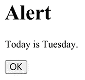
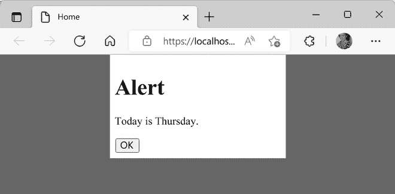
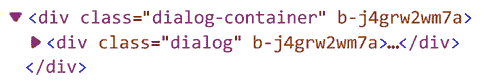
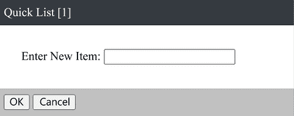
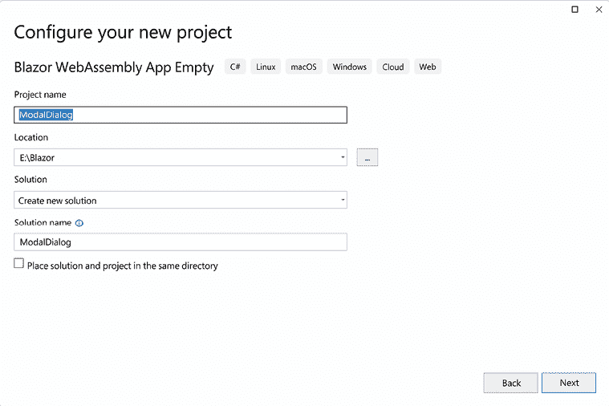
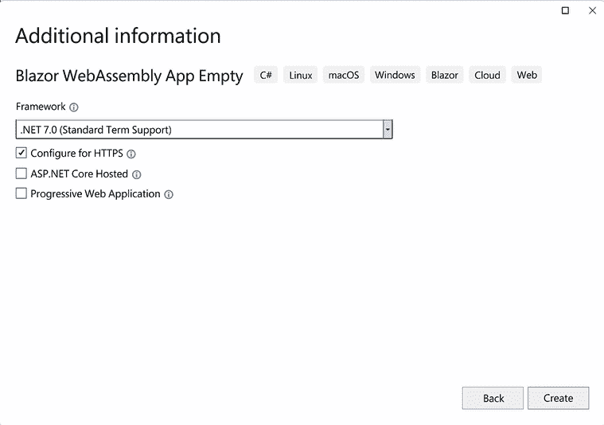
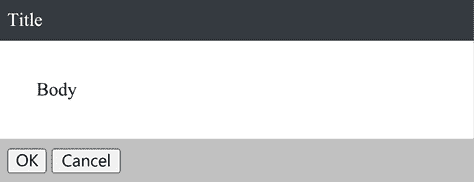
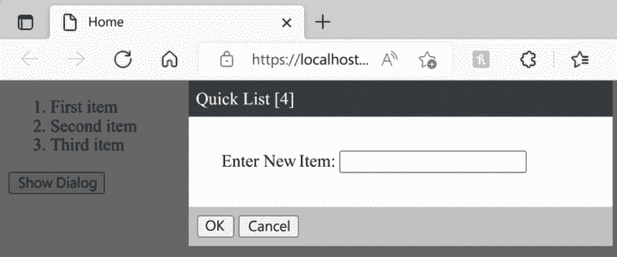
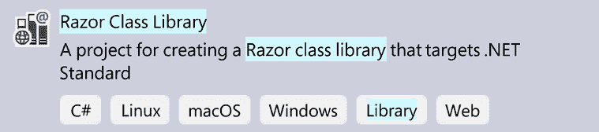
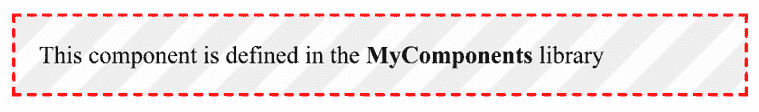

# 使用模板组件构建模态对话框

模态对话框是一个出现在窗口所有其他内容之上的对话框，需要用户交互才能关闭它。模板组件是一个接受一个或多个 UI 模板作为参数的组件。模板组件的 UI 模板可以包含任何 Razor 标记。

在本章中，我们将学习**RenderFragment**参数、**EventCallback**参数以及 CSS 隔离。当父组件需要与子组件共享信息时，会使用`RenderFragment`参数，反之，当子组件需要与其父组件共享信息时，会使用`EventCallback`参数。CSS 隔离用于将 CSS 样式限定在特定的组件范围内。

在本章中，我们将创建一个模态对话框组件。该组件将是一个模板组件，可以根据其参数渲染不同的 HTML。它将使用事件回调将事件返回给调用组件。它将使用 CSS 隔离来添加使其表现得像模态对话框的格式。我们将通过将其添加到另一个组件来测试模态对话框组件。最后，我们将该组件移动到**Razor 类库**中，以便它可以轻松地与其他项目共享。

> 自定义组件
> 
> 可以重复使用。
> 
> 创建库！

在本章中，我们将涵盖以下主题：

+   使用`RenderFragment`参数

+   使用`EventCallback`参数

+   理解 CSS 隔离

+   创建 Razor 类库

+   创建模态对话框项目

# 技术要求

要完成此项目，您需要在您的 PC 上安装 Visual Studio 2022。有关如何安装 Visual Studio 2022 免费社区版的说明，请参阅*第一章*，*Blazor WebAssembly 简介*。

本章的源代码可在以下 GitHub 仓库中找到：[`github.com/PacktPublishing/Blazor-WebAssembly-by-Example-Second-Edition/tree/main/Chapter04`](https://github.com/PacktPublishing/Blazor-WebAssembly-by-Example-Second-Edition/tree/main/Chapter04)。

《Code in Action》视频在此处可用：[`packt.link/Ch4`](https://packt.link/Ch4)。

# 使用`RenderFragment`参数

一个`RenderFragment`参数是 UI 内容的一部分。它用于从父组件向子组件传递 UI 内容。UI 内容可以包括纯文本、HTML 标记、Razor 标记或另一个组件。

以下代码是`Alert`组件的代码。当`Alert`组件的`Show`属性值为`true`时，会显示其 UI 内容：

**Alert.razor**

```cs
@if (Show)
{
    <div>
        <div>
            <div>
                @ChildContent
            </div>
            <div>
                <button @onclick="OnOk">
                    OK
                </button>
            </div>
        </div>
    </div>
}
@code {
    [Parameter] public bool Show { get; set; }
    [Parameter] public EventCallback OnOk { get; set; }
    [Parameter] public RenderFragment ChildContent { get; set;} 
} 
```

上述代码，对于`Alert`组件，包括三种不同类型的参数：简单类型、`EventCallback`和`RenderFragment`：

+   第一个参数是`Show`属性。它是一个简单类型，类型为`Boolean`。有关如何将简单类型用作参数的更多信息，请参阅*第二章*，*构建您的第一个 Blazor WebAssembly 应用程序*。

+   第二个参数是 `OnOk` 属性。它属于 `EventCallback` 类型。在下一节中，我们将了解更多关于 `EventCallback` 参数的信息。

+   最后一个参数是 `ChildContent` 属性。它属于 `RenderFragment` 类型，是本节的主题。

以下标记使用 `Alert` 组件在点击 **Show Alert** 按钮时在对话框中显示当前星期几。在 `Alert` 元素的开始标签和结束标签之间的 Razor 标记绑定到 `Alert` 组件的 `ChildContent` 属性：

```cs
@page "/"
<PageTitle>Home</PageTitle>
<Alert Show="showAlert" OnOk="@(() => showAlert = false)">
    <h1>Alert</h1>
    <p>Today is @DateTime.Now.DayOfWeek.</p>
</Alert>
@if (!showAlert)
{
    <button @onclick="@(() => showAlert = true)">
        Show Alert
    </button>
}
@code {
    private bool showAlert = false;
} 
```

以下截图显示了点击 **Show Alert** 按钮时显示的对话框：



图 4.1：示例警报

要使用元素的内容而不明确指定参数的名称，`RenderFragment` 参数的名称必须是 `ChildContent`。例如，以下标记的结果与前面未明确指定 `ChildContent` 元素的标记相同：

```cs
<Alert Show="showAlert" OnOk="@(() => showAlert = false)">
    **<****ChildContent****>**
        <h1>Alert</h1>
        <p>Today is @DateTime.Now.DayOfWeek.</p>
    **</****ChildContent****>**
</Alert> 
```

上一段标记中突出显示了 `ChildContent` 元素。

**重要提示**

按照惯例，用于捕获父元素内容的 `RenderFragment` 参数的名称必须是 `ChildContent`。

通过在标记中明确指定每个参数的名称，可以在组件中包含多个 `RenderFragment` 参数。在本章中，我们将使用多个 `RenderFragment` 参数来完成项目。

`RenderFragment` 参数允许父组件将其要由子组件使用的 UI 内容传达给子组件，而 `EventCallback` 参数用于从子组件向父组件传达。在下一节中，我们将解释如何使用 `EventCallback` 参数。

# 使用 EventCallback 参数

事件回调是在特定事件发生时传递给另一个方法的函数。例如，当 `Alert` 组件上的按钮被点击时，`@onclick` 事件使用 `OnOk` 参数来确定应该调用哪个方法。`OnOK` 参数引用的方法是在父组件中定义的。

如前所述，`EventCallback` 参数用于从子组件向父组件共享信息。它们与父组件共享信息，并在发生某些事件，例如按钮点击时通知父组件。父组件只需指定在事件触发时调用的方法。

这是一个 `EventCallback` 参数的示例：

```cs
[Parameter] public EventCallback OnOk { get; set; } 
```

以下示例使用 lambda 表达式为 `OnOk` 方法。当调用 `OnOk` 方法时，`showAlert` 属性的值设置为 `false`：

```cs
<Alert Show="showAlert" OnOk="@(() => showAlert = false)">
        <h1>Alert</h1>
        <p>Today is @DateTime.Now.DayOfWeek.</p>
</Alert>
@code {
    private bool showAlert = false;
} 
```

使用 lambda 表达式创建匿名函数。然而，在使用 `EventCallback` 参数时，我们不需要使用匿名函数。以下示例展示了如何使用方法而不是匿名函数来更新 `OnOk` 方法：

```cs
<Alert Show="showAlert" OnOk="OkClickHandler">
    <h1>Alert</h1>
    <p>Today is @DateTime.Now.DayOfWeek.</p>
</Alert>
@code {
    private bool showAlert = false;
    private void OkClickHandler()
    {
        showAlert = false;
    }
} 
```

上述代码定义了一个新的 `OkClickHandler` 方法，当按钮被点击时调用。

当编写 `Alert` 组件时，你可能想直接从组件上的 `OnOk` 事件更新 `Show` 参数。你必须不要这样做，因为如果你直接在组件中更新值，并且组件需要重新渲染，任何状态更改都将丢失。如果你需要在组件中维护状态，你应该向组件添加一个私有字段。

**重要提示**

组件不应向自己的参数写入数据。

有关使用事件的更多信息，请参阅 *第八章*，*使用事件构建看板*。

`Alert` 组件在页面上显示文本，但它还没有像模态对话框那样工作。要使其像模态对话框一样工作，我们需要更新组件使用的样式表。我们可以通过使用 CSS 隔离来实现这一点。在下一节中，我们将解释如何使用 CSS 隔离。

# 理解 CSS 隔离

用于样式化我们的 Blazor WebAssembly 应用程序的 **级联样式表**（**CSS**）的位置通常是 `wwwroot` 文件夹。通常，这些 CSS 文件中定义的样式应用于 Web 应用程序中的所有组件。然而，有时我们希望对应用于特定组件的样式有更多的控制。为了实现这一点，我们使用 CSS 隔离。使用 CSS 隔离，指定 CSS 文件中的样式将覆盖全局样式，并且仅针对特定组件及其子组件。

## 启用 CSS 隔离

要添加一个针对特定组件的 CSS 文件，请在与组件相同的文件夹中创建一个与组件同名的 CSS 文件，但带有 CSS 文件扩展名。例如，`Alert.razor` 组件的 CSS 文件将被称为 `Alert.razor.css`。

以下标记是 `Alert` 组件的更新版本。在这个版本中，我们添加了两个突出显示的类：

**Alert.razor**

```cs
@if (Show)
{
    <div **class****=****"dialog-container"**>
        <div **class****=****"dialog"**>
            <div>
                @ChildContent
            </div>
            <div>
                <button @onclick="OnOk">
                    OK
                </button>
            </div>
        </div>
    </div>
} 
```

以下 `Alert.razor.css` 文件定义了新类所使用的样式：

**Alert.razor.css**

```cs
.dialog-container {
    position: absolute;
    top: 0;
    bottom: 0;
    left: 0;
    right: 0;
    background-color: rgba(0,0,0,0.6);
    z-index: 2000;
}
.dialog {
    background-color: white;
    margin: auto;
    width: 15rem;
    padding: .5rem
} 
```

上述 CSS 包含了 `dialog-container` 类和 `dialog` 类的样式：

+   `dialog-container`: 此类将元素的背景色设置为带有 60% 透明度的黑色，并通过将其 z-index 设置为 2,000 将其放置在其他元素之上。

+   `dialog`: 此类将元素的背景色设置为白色，将其水平居中在其父元素内，并将其宽度设置为 15 REM。

为了使项目能够使用 CSS，我们需要在 `wwwroot/index.html` 文件中添加一个链接。按照惯例，需要链接的 CSS 文件名是程序集的名称后跟 `.styles.css`。例如，如果项目的名称是 `Demo4`，则需要将 `Demo4.styles.css` 的链接添加到 `wwwroot/index.html` 文件中。以下高亮标记显示了应用于 `Alert.razor.css` 文件中定义的样式的链接：

```cs
<head>
    <meta charset="utf-8" />
    <base href="/" />
    <link href="css/app.css" rel="stylesheet" />
    **<****link****href****=****"Demo4.styles.css"****rel****=****"****stylesheet"** **/>**
</head> 
```

以下截图显示了使用前面的 `Alert.razor.css` 文件创建的 `Alert` 组件：



图 4.2：Alert 组件

在前面的例子中，链接的 `Demo4.style.css` 文件是在构建时创建的。当它被创建时，Blazor 引擎通过附加框架为每个组件生成的唯一字符串重写每个组件的 CSS 和 HTML。重写的 CSS 样式被捆绑到一个文件中，并保存为静态资源。

这是 `Demo4.styles.css` 文件的一部分：

```cs
.dialog-container[b-j4grw2wm7a] {
    position: absolute;
    top: 0;
    bottom: 0;
    left: 0;
    right: 0;
    background-color: rgba(0,0,0,0.6);
    z-index: 2000;
}
.dialog[b-j4grw2wm7a] {
    background-color: white;
    margin: auto;
    width: 15rem;
    padding: .5rem
} 
```

这是引用重写样式的重写 HTML：



图 4.3：重写的 HTML

按照惯例，`Demo4.styles.css` 文件的内容位于 `obj/{CONFIGURATION}/{TARGET FRAMEWORK}/scopedcss/projectbundle/{ASSEMBLY NAME}.bundle.scp.css` 文件中。在上面的例子中，文件位于 `\Demo4\obj\Debug\net7.0\scopedcss\bundle` 文件夹中。

## 支持子组件

默认情况下，当使用 CSS 隔离时，CSS 样式只应用于当前组件。如果我们想让 CSS 样式应用于当前组件的子组件，我们需要在我们的样式中使用 `::deep` 伪元素。这个伪元素选择元素标识符的子元素。

例如，以下样式将应用于当前组件内的任何 `H1` 标题，以及当前组件的子组件内的任何 `H1` 标题：

```cs
::deep h1 {
    color: red;
} 
```

如果你不想你的组件使用全局样式或者想要通过 Razor 类库共享你的组件，CSS 隔离是有用的。

**重要提示**

作用域 CSS 不适用于 Razor 组件。它只适用于由 Razor 组件渲染的 HTML 元素。

现在，让我们看看本章我们将要构建的项目。

# 创建模态对话框项目

在本章中，我们将构建一个模态对话框组件。我们将通过 Razor 标记启用模态对话框组件的 `Title` 和 `Body` 可以自定义。我们将把模态对话框组件添加到另一个组件中。

这是模态对话框的截图：



图 4.4：模态对话框

在我们完成模态对话框组件后，我们将将其移动到 Razor 类库中，以便它可以与其他项目共享。

此项目的构建时间大约为 90 分钟。

## 项目概述

`ModalDialog` 项目将通过使用 Microsoft 的 **Blazor WebAssembly App 空项目模板** 创建一个空的 Blazor WebAssembly 项目。我们将添加一个包含多个部分的 `Dialog` 组件，并使用 CSS 隔离来应用使其表现得像模态对话框的样式。我们将使用 `EventCallback` 参数在按钮点击时从组件向父组件通信。我们将使用 `RenderFragment` 参数允许 Razor 标记从父组件向组件通信。最后，我们将创建一个 Razor 类库并将 `Dialog` 组件移动到其中，以便模态对话框可以与其他项目共享。

## 项目入门

我们需要创建一个新的 Blazor WebAssembly 应用程序。我们这样做如下：

1.  打开 Visual Studio 2022。

1.  点击 **创建新项目** 按钮。

1.  按 *Alt*+*S* 进入搜索模板文本框。

1.  输入 `Blazor` 并按 *Enter* 键。

    以下截图显示了 **Blazor WebAssembly App 空项目模板**。

    

    图 4.5：Blazor WebAssembly App 空项目模板

1.  选择 **Blazor WebAssembly App 空项目模板** 并点击 **下一步** 按钮。

1.  在 **项目名称** 文本框中输入 `ModalDialog` 并点击 **下一步** 按钮。

    这是一张用于配置我们新项目的对话框截图：

    

    图 4.6：配置新项目对话框

    **提示**

    在前面的示例中，我们将 `ModalDialog` 项目放置到了 `E:\Blazor` 文件夹中。然而，这个项目的位置并不重要。

1.  选择 **.NET 7.0** 作为要使用的 **框架** 版本。

1.  勾选 **配置为 HTTPS** 复选框。

1.  取消勾选 **ASP.NET Core 承载** 复选框。

1.  取消勾选 **渐进式 Web 应用程序** 复选框。

    这是一张用于收集关于我们新项目额外信息的对话框截图。

    

    图 4.7：附加信息对话框

1.  点击 **创建** 按钮。

我们已经创建了 `ModalDialog` Blazor WebAssembly 项目。然而，它实际上是一个空项目。让我们添加 `Dialog` 组件。

## 添加 Dialog 组件

`Dialog` 组件将被共享。因此，我们将将其添加到 `Shared` 文件夹中。我们这样做如下：

1.  右键点击 `ModalDialog` 项目并从菜单中选择 **添加**，**新建文件夹** 选项。

1.  将新文件夹命名为 `Shared`。

1.  右键点击 `Shared` 文件夹并从菜单中选择 **添加**，**Razor 组件** 选项。

1.  将新组件命名为 `Dialog`。

1.  点击 **添加** 按钮。

1.  将 `Dialog.razor` 文件中的标记替换为以下标记：

    ```cs
    @if (Show)
    {
        <div class="dialog-container">
            <div class="dialog">
                <div class="dialog-title">Title</div>
                <div class="dialog-body">Body</div>
                <div class="dialog-buttons">
                    <button>
                        Ok
                    </button>
                    <button>
                        Cancel
                    </button>
                </div>
            </div>
        </div>
    }
    @code {
        [Parameter] public bool Show { get; set; }
    } 
    ```

在前面的代码中，使用 `Show` 属性来显示和隐藏组件的内容。

我们已经添加了一个 `Dialog` 组件，但除非向项目中添加了适当的样式，否则它不会像模态对话框那样表现。

## 添加 CSS 文件

前面的标记包括五个我们将用于将 `Dialog` 组件样式化为模态对话框的类：

+   `dialog-container`：此类用于将元素的背景颜色设置为黑色，60% 透明度，并通过将其 z-index 设置为 2,000 将其放置在其他元素之上。

+   `dialog`：此类用于将元素的背景颜色设置为白色，在其父元素内水平居中，并将其宽度设置为 25 REM。

+   `dialog-title`：此类用于将背景颜色设置为深灰色，将文本设置为白色，并添加一些填充。

+   `dialog-body`：此类用于向主体添加一些填充。

+   `dialog-buttons`：此类用于将背景颜色设置为银色并添加一些填充。

我们需要创建一个 `CSS` 文件来定义如何为这些类设置样式。我们这样做如下：

1.  右键单击 `Shared` 文件夹，从菜单中选择 **添加**、**新建项** 选项。

1.  在 **搜索** 框中输入 `css`。

1.  选择 **样式表**。

1.  将样式表命名为 `Dialog.razor.css`。

1.  点击 **添加** 按钮。

1.  将以下样式输入到 `Dialog.razor.css` 文件中：

    ```cs
    .dialog-container {
        position: absolute;
        top: 0;
        bottom: 0;
        left: 0;
        right: 0;
        background-color: rgba(0,0,0,0.6);
        z-index: 2000;
    }
    .dialog {
        background-color: white;
        margin: auto;
        width: 25rem;
    }
    .dialog-title {
        background-color: #343a40;
        color: white;
        padding: .5rem;
    }
    .dialog-body {
        padding: 2rem;
    }
    .dialog-buttons {
        background-color: silver;
        padding: .5rem;
    } 
    ```

1.  打开 `wwwroot/index.html` 文件。

1.  取消注释以下 `link` 元素并将其添加到 `head` 元素的底部：

    ```cs
    <link href="ModalDialog.styles.css" rel="stylesheet" /> 
    ```

由于 CSS 隔离，`Dialog.razor.cs` 文件中的样式只将由 `Dialog` 组件使用。接下来，让我们测试 `Dialog` 组件。

## 测试 Dialog 组件

要测试 `Dialog` 组件，我们需要将其添加到另一个组件中。我们将将其添加到用作应用程序 `Home` 页面的 `Index` 组件中。我们这样做如下：

1.  打开 `_Imports.razor` 文件。

1.  添加以下 `using` 语句：

    ```cs
    @using ModalDialog.Shared 
    ```

1.  打开 `Pages/Index.razor` 文件。

1.  从 `Index.razor` 文件中删除 `h1` 元素。

1.  向 `Index.razor` 文件添加以下标记：

    ```cs
    <PageTitle>Home</PageTitle>
    <Dialog Show="showDialog"></Dialog>
    <button @onclick="OpenDialog">Show Dialog</button>
    @code {
        private bool showDialog = false;
        private void OpenDialog()
        {
            showDialog = true;
        }
    } 
    ```

**重要提示**

在编辑 `Index` 组件时，不要从文件顶部删除 `@page` 指令。

1.  按 *Ctrl*+*F5* 启动应用程序，不进行调试。

1.  点击 **显示对话框** 按钮。

    这是显示的模态对话框：

    

    图 4.8：示例模态对话框

1.  点击 **确定** 按钮。

    当你点击 **确定** 按钮时没有发生任何事情，因为我们还没有添加 `@onclick` 事件。

1.  关闭浏览器。

我们将添加几个 `EventCallback` 参数，以便从 `Dialog` 组件与 `Index` 组件进行通信。

## 添加事件回调参数

我们需要为 **确定** 按钮和 **取消** 按钮添加 `@onclick` 事件。我们这样做如下：

1.  返回 Visual Studio。

1.  打开 `Shared/Dialog.razor` 文件。

1.  添加如下高亮显示的代码指示的每个按钮的 `@onclick` 事件：

    ```cs
    <button **@****onclick****=****"OnOk"**>
        OK
    </button>
    <button **@****onclick****=****"OnCancel"**>
        Cancel
    </button> 
    ```

1.  向代码块添加以下参数：

    ```cs
    [Parameter]
    public EventCallback<MouseEventArgs> OnOk { get; set; }
    [Parameter]
    public EventCallback<MouseEventArgs> OnCancel { get; set; } 
    ```

**提示**

`Parameter`属性不需要与它应用的属性在同一行上。

1.  打开`Pages/Index.razor`文件。

1.  通过添加以下高亮标记来更新`Dialog`元素的标记：

    ```cs
    <Dialog Show="showDialog"
    **OnCancel****=****"DialogCancelHandler"**
    **OnOk****=****"DialogOkHandler"****>**
    </Dialog> 
    ```

1.  将以下方法添加到代码块中：

    ```cs
    private void DialogCancelHandler(MouseEventArgs e)
    {
        showDialog = false;
    }
    private void DialogOkHandler(MouseEventArgs e)
    {
        showDialog = false;
    } 
    ```

**提示**

由于`e`在前面方法中没有使用，我们不需要在方法定义中指定`MouseEventArgs`。我们包括它是为了演示目的。

1.  按*Ctrl+F5*启动应用程序而不进行调试。

1.  点击**显示对话框**按钮。

1.  点击**确定**按钮。

当你点击**确定**按钮时，对话框将关闭。

现在让我们更新`Dialog`组件，以便我们可以自定义它创建的模态对话框的`Title`和`Body`属性。

## 添加`RenderFragment`参数

我们将为`Dialog`组件的`Title`和`Body`属性使用`RenderFragment`参数。我们这样做如下：

1.  返回 Visual Studio。

1.  打开`Shared/Dialog.razor`文件。

1.  将`dialog-title`的标记更新为以下内容：

    ```cs
    <div class="dialog-title">**@Title**</div> 
    ```

1.  将`dialog-body`的标记更新为以下内容：

    ```cs
    <div class="dialog-body">**@Body**</div> 
    ```

1.  将以下参数添加到代码块中：

    ```cs
    [Parameter]
    public RenderFragment Title { get; set; }
    [Parameter]
    public RenderFragment Body { get; set; } 
    ```

1.  打开`Pages/Index.razor`文件。

1.  将`Dialog`元素的标记更新为以下内容：

    ```cs
    <Dialog Show="showDialog"
            OnCancel="DialogCancelHandler"
            OnOk="DialogOkHandler">
    **<****Title****>****Quick List [@(Items.Count + 1)]****</****Title****>**
    **<****Body****>**
     **Enter New Item:** **<****input** **@****bind****=****"****NewItem"** **/>**
    **</****Body****>**
    </Dialog> 
    ```

    之前的标记将对话框的标题更改为`快速列表`并为用户提供一个文本框来输入列表项。

1.  在`Dialog`元素下添加以下标记：

    ```cs
    <ol>
        @foreach (var item in Items)
        {
            <li>@item</li>
        }
    </ol> 
    ```

    之前的代码将在有序列表中显示`Items`列表中的每个项目。

1.  在代码块顶部添加以下变量：

    ```cs
    private string? NewItem;
    private List<string> Items = new List<string>(); 
    ```

1.  将`DialogCancelHandler`更新为以下内容：

    ```cs
    private void DialogCancelHandler(MouseEventArgs e)
    {
        **NewItem =** **""****;**
        showDialog = false;
    } 
    ```

    之前的代码将清除文本框并隐藏`Dialog`组件的内容。

1.  将`DialogOkHandler`更新为以下内容：

    ```cs
    private void DialogOkHandler(MouseEventArgs e)
    {
    **if** **(!****string****.IsNullOrEmpty(NewItem))**
     **{**
     **Items.Add(NewItem);**
     **NewItem =** **""****;**
     **};**
        showDialog = false;
    } 
    ```

    之前的代码将`NewItem`添加到`Items`列表中，清除文本框，并隐藏`Dialog`组件的内容。

1.  按*Ctrl*+*F5*启动应用程序而不进行调试。

1.  点击**显示对话框**按钮。

1.  在**输入新项**字段中输入一些文本。

1.  点击**确定**按钮。

1.  重复。

    每次点击**确定**按钮，**输入新项**字段中的文本将被添加到列表中。以下截图显示了一个已添加三个项目并即将使用模态对话框添加第四个项目的列表：

    

    图 4.9：示例快速列表

1.  关闭浏览器。

要将此新组件与其他项目共享，我们需要将其添加到 Razor 类库中。

## 创建 Razor 类库

我们可以通过使用 Razor 类库在项目之间共享组件。要创建 Razor 类库，我们将使用**Razor 类库**项目模板。我们这样做如下：

1.  右键单击解决方案，从菜单中选择**添加**、**新建项目**选项。

1.  在**搜索模板**文本框中输入`Razor 类库`以定位**Razor 类库**项目模板。

    以下截图显示了 **Razor 类库** 项目模板：

    

    图 4.10：Razor 类库项目模板

1.  选择 **Razor 类库** 项目模板。

1.  点击 **下一步** 按钮。

1.  将项目命名为 `MyComponents` 并点击 **下一步** 按钮。

1.  选择 **.NET 7.0** 作为要使用的 **框架** 版本。

1.  取消选择 **支持页面和视图** 复选框。

1.  点击 **创建** 按钮。

1.  右键单击 `ModalDialog` 项目，并从菜单中选择 **添加**、**项目引用** 选项。

1.  选择 `MyComponents` 复选框并点击 **确定** 按钮。

我们已经创建了 `MyComponents` Razor 类库，并且从 `ModalDialog` 项目中添加了对它的引用。让我们测试它。

## 测试 Razor 类库

我们刚刚使用项目模板创建的 `MyComponents` Razor 类库包含一个组件，称为 `Component1`。在我们继续之前，我们需要测试新的 Razor 类库是否正常工作。我们这样做如下：

1.  打开 `ModalDialog.Pages/Index.razor` 文件。

1.  在 `@page` 指令下方添加以下 `using` 语句：

    ```cs
    @using MyComponents; 
    ```

    **提示**

    如果你将在多个页面上使用此项目，你应该考虑将 `using` 语句添加到 `ModalDialog._Imports.razor` 文件中，这样你就不需要在每个使用它的组件中包含它。

1.  在 `PageTitle` 元素下方添加以下标记：

    ```cs
    <Component1 /> 
    ```

1.  按 *Ctrl*+*F5* 以不带调试启动应用程序。

    以下截图显示了 `Component1` 组件应该如何渲染：

    

    图 4.11：Component1

    **重要提示**

    如果 `Component1` 组件缺少样式，那是因为 CSS 文件被缓存了。使用以下快捷键组合，*Ctrl*+*Shift*+*R*，来清空缓存并重新加载页面。

1.  关闭浏览器。

1.  返回 Visual Studio。

1.  从 `Index` 组件中删除 `Component1` 元素。

我们已经完成了 `MyComponents` Razor 类库的测试。现在，是时候将我们的自定义 `Dialog` 组件添加到 `MyComponents` Razor 类库中。

## 向 Razor 类库添加一个组件

要共享 `Dialog` 组件，我们需要将其移动到我们刚刚创建和测试的 Razor 类库中。我们这样做如下：

1.  右键单击 `ModalDialog.Shared/Dialog.razor` 文件，并从菜单中选择 **复制** 选项。

1.  右键单击 `MyComponents` 项目，并从菜单中选择 **粘贴** 选项。

1.  右键单击 `MyComponents.Dialog.razor` 文件，并从菜单中选择 **重命名** 选项。

1.  重命名文件 `BweDialog.razor`。

    在这种情况下，`Bwe` 代表 *Blazor WebAssembly by Example*。

    **提示**

    在命名 Razor 类库中的组件时，你应该给它们唯一的名称以避免模糊引用错误。大多数组织都会在所有共享组件前加上相同的文本。例如，名为 **One Stop Designs** （**OSD**） 的公司可能会在所有共享组件前加上 `Osd`。

1.  打开 `ModalDialog.Pages/Index.razor` 文件。

1.  将 `Dialog` 元素重命名为 `BweDialog`。

1.  按 *Ctrl*+*F5* 以无调试模式启动应用程序。

1.  点击 **Show Dialog** 按钮。

1.  在 **Enter New Item** 字段中输入一些文本。

1.  点击 **Ok** 按钮。

1.  重复。

`BweDialog` 组件现在正从 `MyComponents` Razor 类库中使用。由于 `BweDialog` 组件包含在 Razor 类库中，它可以很容易地与其他项目共享。

# 摘要

现在，你应该能够通过使用 Razor 类库创建一个模态对话框，并将其与多个项目共享。

在本章中，我们介绍了 `RenderFragment` 参数、`EventCallback` 参数和 CSS 隔离。

之后，我们使用了 **Blazor WebAssembly App Empty** 项目模板来创建一个新的项目。我们创建了一个 `Dialog` 组件，它就像一个模态对话框。`Dialog` 组件使用 `RenderFragment` 参数和 `EventCallback` 参数在它与其父组件之间共享信息。此外，它还使用 CSS 隔离来设置样式。

在本章的最后部分，我们创建了一个 Razor 自定义库，并将 `Dialog` 组件移动到了新的库中。

到目前为止，在这本书中，我们避免使用 JavaScript。不幸的是，还有一些功能我们只能通过 JavaScript 来完成。在这本书的下一章中，我们将学习如何使用 JavaScript interop 在 Blazor WebAssembly 应用中调用 JavaScript。

# 问题

以下问题供您思考：

1.  你如何用模板组件替换表格？

1.  你会如何为 `Dialog` 组件的 `Title` 属性和 `Body` 属性添加默认值？

1.  在处理 `@onclick` 事件时，你如何确定哪个按钮被点击了？

1.  你能否使用 NuGet 包分发你的 `Dialog` 组件？

# 进一步阅读

以下资源提供了关于本章主题的更多信息：

+   关于 CSS 的更多信息，请参阅[`www.w3schools.com/css/default.asp`](https://www.w3schools.com/css/default.asp)。

+   关于 lambda 表达式的更多信息，请参阅[`learn.microsoft.com/en-us/dotnet/csharp/language-reference/operators/lambda-expressions`](https://learn.microsoft.com/en-us/dotnet/csharp/language-reference/operators/lambda-expressions)。

+   关于 ASP.NET Core Razor 组件类库的更多信息，请参阅[`learn.microsoft.com/en-us/aspnet/core/blazor/components/class-libraries`](https://learn.microsoft.com/en-us/aspnet/core/blazor/components/class-libraries)。

+   关于 NuGet 的更多信息，请参阅[`www.nuget.org`](https://www.nuget.org)。

# 加入我们的 Discord 社区

加入我们社区的 Discord 空间，与作者和其他读者进行讨论：

[`packt.link/BlazorWASM2e`](https://packt.link/BlazorWASM2e)


