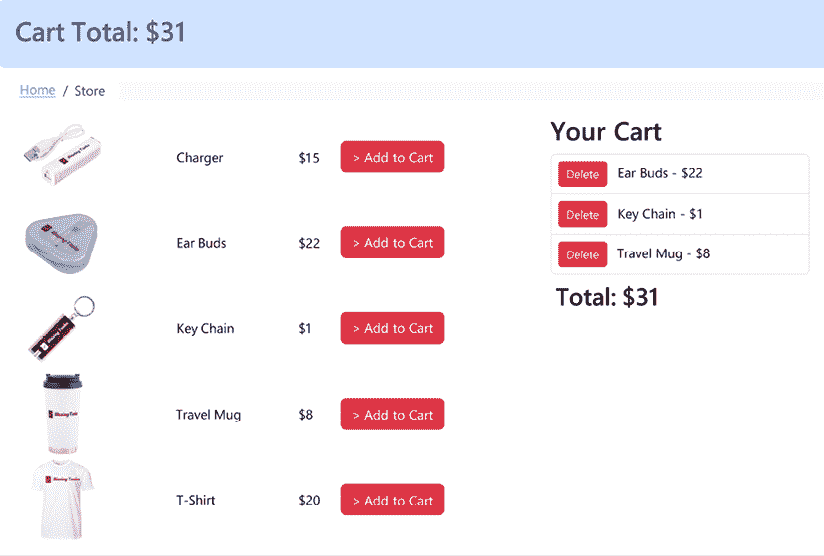
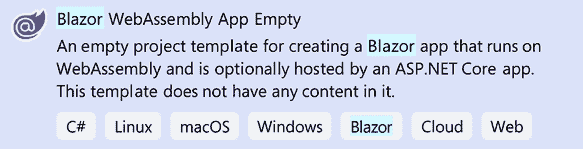
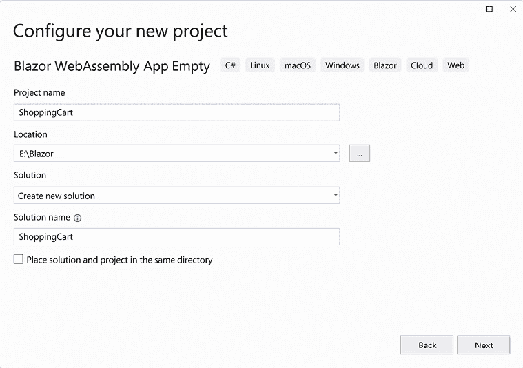
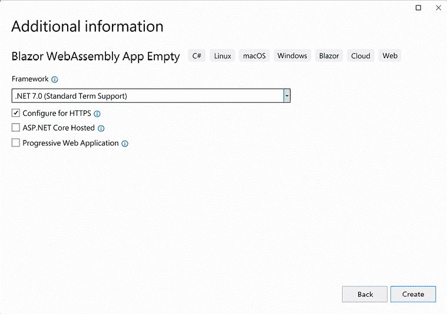
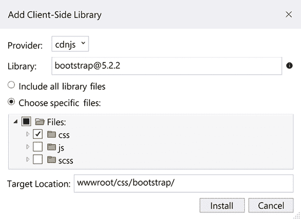
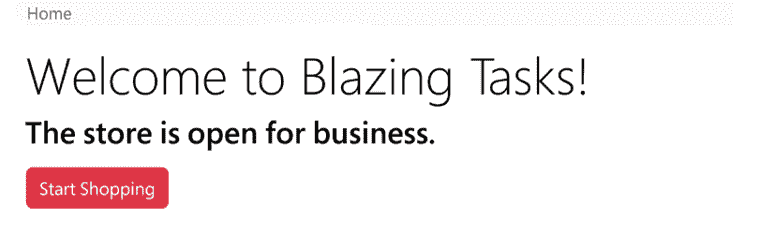

# 使用应用程序状态构建购物车

有时，我们需要我们的应用程序在不同的页面之间保持其状态。我们可以通过使用 **依赖注入**（**DI**）来实现这一点。DI 用于访问在中央位置配置的服务。

在本章中，我们将创建一个购物车。当我们从购物车中添加和删除项目时，应用程序将维护购物车中项目的列表。当我们导航到另一个页面然后再返回到带有购物车的页面时，购物车的内容将被保留。此外，购物车的总额将在所有页面上显示。

> 应用程序状态，
> 
> 依赖注入
> 
> 一个建立在信任基础上的团队！

在本章中，我们将涵盖以下主题：

+   介绍应用程序状态

+   理解 DI

+   创建购物车项目

# 技术要求

要完成此项目，您需要在您的电脑上安装 Visual Studio 2022。有关如何安装 Visual Studio 2022 免费社区版的说明，请参阅 *第一章*，*Blazor WebAssembly 简介*。

本章的源代码可在以下 GitHub 仓库中找到：[`github.com/PacktPublishing/Blazor-WebAssembly-by-Example-Second-Edition/tree/main/Chapter07`](https://github.com/PacktPublishing/Blazor-WebAssembly-by-Example-Second-Edition/tree/main/Chapter07)。

代码实战视频在此处提供：[`packt.link/Ch7`](https://packt.link/Ch7)。

# 介绍应用程序状态

在 Blazor WebAssembly 应用中，浏览器的内存用于保存应用程序的状态。这意味着当用户在页面之间导航时，除非我们保留它，否则状态会丢失。我们将使用 `AppState` 模式来保留应用程序的状态。

在 `AppState` 模式中，一个服务被添加到 DI 容器中，以协调相关组件之间的状态。该服务包含所有需要维护的状态。因为服务由 DI 容器管理，所以它可以比单个组件存活更久，并且可以在 UI 发生变化时保留应用程序的状态。

该服务可以是一个简单的类或一个复杂的类。一个服务可以用来管理整个应用程序中多个组件的状态。`AppState` 模式的优点之一是它导致了展示逻辑和业务逻辑之间更大的分离。

**重要提示**

当用户重新加载页面时，保存在浏览器内存中的应用程序状态会丢失。

对于本章的项目，我们将使用 DI 服务实例来保留应用程序的状态。

# 理解 DI

DI（依赖注入）是一种技术，其中对象访问在中央位置配置的服务。中央位置是 DI 容器。在使用 DI 时，每个消费类不需要创建它所依赖的注入类的实例。它由框架提供，并被称为服务。在 Blazor WebAssembly 应用程序中，服务在`program.cs`文件中定义。

我们在这本书中已经使用了 DI（依赖注入），以下是一些使用的服务：

+   `HttpClient`

+   `IJSRuntime`

+   `NavigationManager`

## DI 容器

当 Blazor WebAssembly 应用程序启动时，它配置一个 DI 容器。DI 容器负责构建服务的实例，并且它一直存在，直到用户关闭运行 web 应用的浏览器标签页。在以下示例中，`CartService`实现被注册为`ICartService`：

```cs
builder.Services.AddSingleton<ICartService, CartService>(); 
```

在服务被添加到 DI 容器后，我们使用`@inject`指令将服务注入到任何依赖它的类中。`@inject`指令接受两个参数，`类型`和`属性`：

+   `类型`：这是服务的类型。

+   `属性`：这是接收服务的属性的名称。

以下示例展示了如何使用`@inject`指令来引用在前面代码中注册的`CartService`：

```cs
@inject ICartService cartService 
```

依赖注入在组件实例创建后、`OnInitialized`或`OnInitializedAsync`生命周期事件执行之前进行。这意味着你无法在组件的构造函数中使用注入的类，但你可以在`OnInitialized`或`OnInitializedAsync`方法中使用它。

每个服务在其注册时指定其生命周期。

## 服务生命周期

使用 DI 注入的服务生命周期可以是以下任何值之一：

+   **单例**

+   **范围限定**

+   **短暂**

### 单例

如果服务的生命周期被定义为`Singleton`，这意味着将创建一个类的单个实例，并且该实例将在整个应用程序中共享。任何使用该服务的组件都将收到相同服务的实例。在 Blazor WebAssembly 应用程序中，这适用于当前在浏览器当前标签页中运行的当前应用程序的生命周期。

以下代码将创建`ICartService`类的共享实例：

```cs
builder.Services.AddSingleton<ICartService, CartService>(); 
```

这是我们将在本章的项目中用来管理应用程序状态的服务的生命周期。

### 范围限定

如果服务的生命周期被定义为`Scoped`，这意味着将为每个范围创建类的新的实例。由于 Blazor WebAssembly 应用程序的范围概念与应用程序的生命周期相一致，因此注册为`Scoped`的服务被当作`Singleton`服务处理。

以下代码将创建`ICartService`类的共享实例：

```cs
builder.Services.AddScoped<ICartService, CartService>(); 
```

上述代码创建的实例与使用`AddSingleton`方法创建的实例相同。

**重要提示**

在 Microsoft 提供的 Blazor WebAssembly 项目模板中，他们使用`Scoped`服务来创建数据访问的`HttpClient`实例。这是因为 Microsoft 的项目模板使用`Scoped`服务生命周期来与服务器端 Blazor 保持对称。

### 瞬时

如果服务的生命周期被定义为`Transient`，这意味着每次请求服务实例时都会创建该类的新实例。当使用`Transient`服务时，DI 容器充当工厂，创建类的唯一实例。一旦实例创建并注入到依赖组件中，容器就不再对它感兴趣。

以下代码将创建`OneUseService`类的瞬时实例：

```cs
builder.Services.AddTransient<IOneUseService, OneUseService>(); 
```

服务的生命周期在 DI 容器中定义。服务实例可以是作用域的或瞬时的。

我们可以使用 DI 将相同的服务实例注入到多个组件中。DI 被`AppState`模式使用，以允许应用程序在组件之间保持状态。

现在，让我们快速了解一下我们将在本章中构建的项目。

# 创建购物车项目

在本章中，我们将构建一个包含购物车的 Blazor WebAssembly 应用。我们将能够向购物车添加和删除不同的产品。购物车的总价将在应用的每个页面上显示。

以下为完成的应用程序的截图：



图 7.1：购物车应用

此项目的构建时间大约为 60 分钟。

## 项目概述

将使用 Microsoft 的**Blazor WebAssembly App Empty**项目模板创建一个空的 Blazor WebAssembly 项目来创建`ShoppingCart`项目。首先，我们将添加逻辑以向购物车添加和删除产品。然后，我们将演示在页面之间导航时购物车的状态会丢失。为了保持购物车的状态，我们将在 DI 容器中注册一个使用`AppState`模式的服务。最后，我们将演示通过将新服务注入相关组件，购物车的状态不会丢失。

## 创建购物车项目

我们需要创建一个新的 Blazor WebAssembly 应用。我们这样做如下：

1.  打开 Visual Studio 2022。

1.  点击**创建新项目**按钮。

1.  按*Alt*+*S*键进入搜索模板文本框。

1.  输入`Blazor`并按**Enter**键。

    以下截图显示了**Blazor WebAssembly App Empty**项目模板。

    

    图 7.2：Blazor WebAssembly App Empty 项目模板

1.  选择**Blazor WebAssembly App Empty**项目模板并点击**下一步**按钮。

1.  在**项目名称**文本框中输入`ShoppingCart`并点击**下一步**按钮。

    这是用于配置我们新项目的对话框截图：

    

    图 7.3：配置新项目对话框

    **提示**

    在前面的示例中，我们将 `ShoppingCart` 项目放置在 `E:/Blazor` 文件夹中。然而，此项目的位置并不重要。

1.  选择**.NET 7.0**作为要使用的**框架**版本。

1.  选择**配置为 HTTPS**复选框。

1.  取消选择**ASP.NET Core 托管**复选框。

1.  取消选择**渐进式 Web 应用**复选框。

    这是用于收集有关我们新项目额外信息的对话框截图：

    

    图 7.4：额外信息对话框

1.  点击**创建**按钮。

我们已创建了一个空的 `ShoppingCart` Blazor WebAssembly 项目。我们将使用 `Bootstrap` 来样式化我们的前端。

## 安装 Bootstrap

我们需要在我们的 Web 应用中安装 `Bootstrap`。我们这样做如下：

1.  右键单击 `wwwroot/css` 文件夹，从菜单中选择**添加**、**客户端库**选项。

1.  在**库**搜索文本框中输入`bootstrap`并按*Enter*键。

1.  选择**选择特定文件**。

1.  仅选择**css**文件，如图下所示：

    图 7.5：添加客户端库对话框

    **提示**

    尽管前面的截图选择了 `Bootstrap` 版本 5.2.2，但你可以使用任何版本的 `Bootstrap` 来完成此项目。

1.  点击**安装**按钮。

    **重要提示**

    安装 `Bootstrap` 后，将在 `wwwroot/css` 文件夹中添加一个新文件夹。这个新文件夹包含 `Bootstrap` 所需的所有 CSS 文件。在这个项目中，我们只会使用 `bootstrap.min.css` 文件。

1.  打开 `wwwroot/index.html` 文件。

1.  在 `css/app.css` 样式表链接之前，将以下标记添加到 `head` 元素中：

    ```cs
    <link href="css/bootstrap/css/bootstrap.min.css" 
            rel="stylesheet" /> 
    ```

1.  打开 `MainLayout.razor` 文件。

1.  将 `main` 元素更新为以下内容：

    ```cs
    <main class="px-4">
        @Body
    </main> 
    ```

    上述代码使用 `Bootstrap` 在页面主体周围添加填充。

1.  打开 `Pages/Index.razor` 文件。

1.  删除 `h1` 元素。

1.  添加以下标记：

    ```cs
    <PageTitle>Home</PageTitle>
    <div class="bg-light">
        <ol class="breadcrumb">
            <li class="breadcrumb-item active">Home</li>
        </ol>
    </div>
    <h1 class="display-3">Welcome to Blazing Tasks!</h1>
    <h2>
        The store is open for business.
    </h2>
    <button type="button" class="btn btn-danger mt-2">
        Start Shopping
    </button> 
    ```

    上述代码包含一个面包屑，该面包屑将使用`Bootstrap`进行样式化。面包屑指示页面在导航层次结构中的当前位置。代码还包括一个按钮。然而，该按钮目前还没有任何功能。

1.  按 *Ctrl*+*F5* 以不带调试启动应用程序。

    这是**主页**的截图：

    

    图 7.6：ShoppingCart 项目的首页

1.  点击**开始购物**按钮以验证没有任何操作发生。

1.  关闭浏览器。

当用户点击**开始购物**按钮时，他们应该导航到**商店**页面。然而，**商店**页面目前还不存在。

## 添加 Store 组件

我们需要添加一个`Store`组件。我们这样做：

1.  右键点击`Pages`文件夹，从菜单中选择**添加**、**Razor 组件**选项。

1.  将新组件命名为`Store`。

1.  点击**添加**按钮。

1.  删除`H3`元素。

1.  在代码块之前添加以下标记：

    ```cs
    @page "/store"
    <PageTitle>Store</PageTitle>
    <ol class="breadcrumb bg-light">
        <li class="breadcrumb-item"><a href="#">Home</a></li>
        <li class="breadcrumb-item active">Store</li>
    </ol> 
    ```

    上述代码包含一个面包屑，我们可以使用它来导航到**首页**。

1.  打开`Pages/Index.razor`文件。

1.  添加以下`@inject`指令：

    ```cs
    @inject NavigationManager navigation 
    ```

    `NavigationManager`服务由框架提供，用于管理 URI 导航。

1.  添加以下代码块：

    ```cs
    @code{
        protected void OpenStore()
        {
            navigation.NavigateTo("store");
        }  
    } 
    ```

    在上述代码中，当调用`OpenStore`时，`NavigationManager`将导航到`Store`页面。由于这是一个 SPA，页面不需要重新加载。

1.  向**开始购物**按钮添加以下`@onclick`事件：

    ```cs
    @onclick="OpenStore" 
    ```

1.  按*Ctrl*+*F5*启动应用程序，不进行调试。

1.  点击**开始购物**按钮以导航到**商店**页面。

1.  点击**首页**面包屑以返回**首页**。

1.  关闭浏览器。

我们已经添加了**商店**页面。然而，它是空的。

## 添加 Product 类

我们需要添加可供销售的产品。我们这样做：

1.  右键点击`ShoppingCart`项目，从菜单中选择**添加**、**新建文件夹**选项。

1.  将新文件夹命名为`Models`。

1.  右键点击`Models`文件夹，从菜单中选择**添加**、**类**选项。

1.  将新类命名为`Product`。

1.  点击**添加**按钮。

1.  将以下属性添加到`Product`类中：

    ```cs
    public int ProductId { get; set; }
    public string? ProductName { get; set; }
    public int Price { get; set; }
    public string? Image { get; set; } 
    ```

1.  右键点击`wwwroot`文件夹，从菜单中选择**添加**、**新建文件夹**选项。

1.  将新文件夹命名为`sample-data`。

1.  右键点击`sample-data`文件夹，从菜单中选择**添加**、**新建项**选项。

1.  在**搜索**框中输入`json`。

1.  选择**JSON 文件**。

1.  将文件命名为`products.json`。

1.  点击**添加**按钮。

1.  将文件更新为以下内容：

    ```cs
    [
      {
        "productId": 1,
        "productName": "Charger",
        "price": 15,
        "image": "charger.jpg"
      },
      {
        "productId": 2,
        "productName": "Ear Buds",
        "price": 22,
        "image": "earbuds.jpg"
      },
      {
        "productId": 3,
        "productName": "Key Chain",
        "price": 1,
        "image": "keychain.jpg"
      },
      {
        "productId": 4,
        "productName": "Travel Mug",
        "price": 8,
        "image": "travelmug.jpg"
      },
      {
        "productId": 5,
        "productName": "T-Shirt",
        "price": 20,
        "image": "tshirt.jpg"
      }
    ] 
    ```

**提示**

您可以从 GitHub 仓库复制`products.json`文件。

1.  右键点击`wwwroot`文件夹，从菜单中选择**添加**、**新建文件夹**选项。

1.  将新文件夹命名为`images`。

1.  从 GitHub 仓库复制以下图片到`images`文件夹：`Charger.jpg`、`Earbuds.jpg`、`KeyChain.jpg`、`TravelMug.jpg`和`Tshirt.jpg`。

我们已经将产品集合添加到我们的 Web 应用中。接下来，我们需要完成`Store`页面。

## 完成 Store 组件

我们需要添加我们商店中可供销售的项目列表，并且我们需要添加选择我们想要购买的项目的能力。我们这样做：

1.  打开`Pages/Store.razor`文件。

1.  添加以下指令：

    ```cs
    @using ShoppingCart.Models
    @inject HttpClient Http 
    ```

1.  向代码块添加以下代码：

    ```cs
    public IList<Product>? products;
    public IList<Product> cart = new List<Product>();
    private int total;
    protected override async Task OnInitializedAsync()
    {
        products = await Http.GetFromJsonAsync<Product[]>
                ("sample-data/products.json");
    } 
    ```

    上述代码使用`HttpClient`从`products.json`文件中填充产品列表。

1.  在代码块之前添加以下`if`语句：

    ```cs
    @if (products == null)
    {
        <p><em>Loading...</em></p>
    }
    else
    {
        <h1 class="display-3">Products</h1>
        <div class="row">
            <div id="products" class="col-xl-4 col-lg-6">
            </div>
            <div id="cart" class="col-xl-3 col-lg-4">
            </div>
        </div>
    } 
    ```

    上述代码在产品列表加载前显示**加载中...**消息。一旦产品列表加载完成，它将显示产品和购物车。

1.  将以下标记添加到`products`元素中：

    ```cs
    <table width="100%">
        @foreach (Product item in products)
        {
            <tr>
                <td>
                    
                </td>
                <td class="align-middle">
                    @item.ProductName
                </td>
                <td class="align-middle">
                    $@item.Price
                </td>
                <td class="align-middle">
                    <button type="button" 
                            class="btn btn-danger">
                        Add to Cart
                    </button>
                </td>
            </tr>
        }
    </table> 
    ```

    前面的标记添加了一个显示所有销售产品的表格。

1.  将以下标记添加到`cart`元素中：

    ```cs
    @if (cart.Any())
    {
        <h2>Your Cart</h2>
        <ul class="list-group">
            @foreach (Product item in cart)
            {
                <li class="list-group-item p-2">
                    <button type="button" 
                            class="btn btn-sm btn-danger me-2">
                        Delete
                    </button>
                    @item.ProductName - $@item.Price
                </li>
            }
        </ul>
        <div class="p-2">
            <h3>Total: $@total</h3>
        </div>
    } 
    ```

    前面的标记显示了购物车中的所有项目。

1.  将`AddProduct`方法添加到代码块：

    ```cs
    private void AddProduct(Product product)
    {
        cart.Add(product);
        total += product.Price;
    } 
    ```

    前面的代码将指定的产品添加到购物车，并按产品的价格增加总额。

1.  将`DeleteProduct`方法添加到代码块：

    ```cs
    private void DeleteProduct(Product product)
    {
        cart.Remove(product);
        total -= product.Price;
    } 
    ```

    前面的代码从购物车中删除指定的产品，并按产品的价格减少总额。

1.  将以下`@onlclick`事件添加到**添加到购物车**按钮：

    ```cs
    @onclick="@(() => AddProduct(item))" 
    ```

1.  前面的代码在按钮点击时调用`AddProduct`方法。有关事件处理的更多信息，请参阅*第八章*，*使用事件构建看板*。

1.  将以下`@onlclick`事件添加到**删除**按钮：

    ```cs
    @onclick="@(()=>DeleteProduct(item))" 
    ```

    前面的代码在按钮点击时调用`DeleteProduct`方法。

我们已经完成了对**Store**页面的更新。现在我们需要测试它。

## 展示应用程序状态已丢失

我们需要运行我们的 Web 应用程序以测试`Store`页面。我们这样做如下：

1.  按*Ctrl*+*F5*启动应用程序，不进行调试。

1.  点击**开始购物**按钮。

1.  使用**添加到购物车**按钮添加几个产品。

1.  使用**删除**按钮从购物车中删除产品。

1.  在导航菜单中选择**主页**选项。

1.  点击**开始购物**按钮返回**Store**页面。

1.  确认购物车现在为空。

    当我们在 Web 应用程序中的页面之间导航时，状态会丢失。

1.  关闭浏览器。

我们可以通过使用 DI 来启用`AppState`模式来维护状态。我们将在项目中添加一个`CartService`，我们将使用 DI 来管理它。

## 创建 ICartService 接口

我们需要创建一个`ICartService`接口。我们这样做如下：

1.  返回 Visual Studio。

1.  右键单击`ShoppingCart`项目，从菜单中选择**添加**、**新建文件夹**选项。

1.  将新文件夹命名为`Services`。

1.  右键单击`Services`文件夹，从菜单中选择**添加**、**新建项**选项。

1.  在**搜索**框中输入`interface`。

1.  选择**接口**。

1.  将文件命名为`ICartService`。

1.  点击**添加**按钮。

1.  输入以下代码：

    ```cs
     IList<Product> Cart { get; }
            int Total { get; }
            event Action OnChange;
            void AddProduct(Product product);
            void DeleteProduct(Product product); 
    ```

    **重要提示**

    Visual Studio 将自动添加以下`using`语句：

    `using ShoppingCart.Models;`

我们已经创建了`ICartService`接口。现在我们需要创建一个继承它的类。

## 创建 CartService 类

我们需要创建`CartService`类。我们这样做如下：

1.  右键单击`Services`文件夹，从菜单中选择**添加**、**类**选项。

1.  将类命名为`CartService`。

1.  点击**添加**按钮。

1.  更新类如下：

    ```cs
    public class CartService : ICartService
    {
       private List<Product> cart = new();
        private int total;
        public IList<Product> Cart
        {
            get => cart;
        }
        public int Total
        {
            get => total;
        }
        public event Action? OnChange;
    } 
    ```

    `CartService`类继承自`ICartService`接口。

1.  将`NotifyStateChanged`方法添加到类中：

    ```cs
    private void NotifyStateChanged() => OnChange?.Invoke(); 
    ```

    在之前的代码中，当调用`NotifyStateChanged`方法时，会触发`OnChange`事件。

1.  将`AddProduct`方法添加到类中：

    ```cs
    public void AddProduct(Product product)
    {
        cart.Add(product);
        total += product.Price;
        NotifyStateChanged();
    } 
    ```

    之前的代码将指定的产品添加到产品列表中并增加总数。它还调用了`NotifyStateChanged`方法。

1.  将`DeleteProduct`方法添加到类中：

    ```cs
    public void DeleteProduct(Product product)
    {
        cart.Remove(product);
        total -= product.Price;
        NotifyStateChanged();
    } 
    ```

    之前的代码从产品列表中移除了指定的产品并减少了总数。它还调用了`NotifyStateChanged`方法。

我们已经完成了`CartService`类的编写。现在我们需要在 DI 容器中注册`CartService`。

## 在 DI 容器中注册 CartService

在将`CartService`注入到我们的`Store`组件之前，我们需要在 DI 容器中注册`CartService`。我们这样做如下：

1.  打开`Program.cs`文件。

1.  在注册`HttpClient`的代码之后添加以下代码：

    ```cs
    builder.Services.AddScoped<ICartService, CartService>(); 
    ```

我们已经注册了`CartService`。现在我们需要更新`Store`页面以使用它。

## 将`CartService`注入到 Store 组件中

我们需要将`CartService`注入到`Store`组件中。我们这样做如下：

1.  打开`Pages\Store.razor`文件。

1.  添加以下指令：

    ```cs
    @using ShoppingCart.Services
    @inject ICartService cartService 
    ```

1.  将**添加到购物车**按钮的`@onclick`事件更新如下：

    ```cs
    @onclick="@(() => cartService.AddProduct(item))" 
    ```

    之前的标记使用`cartService`将产品添加到购物车中。

1.  更新`cart`元素如下：

    ```cs
    @if (cartService.Cart.Any())
    {
        <h2>Your Cart</h2>
        <ul class="list-group">
            @foreach (Product item in cartService.Cart)
            {
                    <li class="list-group-item p-2">
                    <button class="btn btn-sm btn-danger me-2">
                        Delete
                    </button>
                    @item.ProductName - $@item.Price
                </li>
            }
        </ul>
        <div class="p-2">
            <h3>Total: $@cartService.Total</h3>
        </div>
    } 
    ```

    之前的代码将`cart`属性的引用替换为`cartService`的引用。

1.  向**删除**按钮添加以下`@onclick`事件：

    ```cs
    @onclick="@(() =>cartService.DeleteProduct(item))" 
    ```

    之前的标记使用`cartService`从购物车中删除产品。

1.  从代码块中删除`cart`属性、`total`属性、`AddProduct`方法和`DeleteProduct`方法。

1.  按*Ctrl*+*F5*以无调试模式启动应用程序。

1.  点击**开始购物**按钮。

1.  使用**添加到购物车**按钮添加一些产品。

1.  使用**删除**按钮从购物车中删除一个产品。

1.  在导航菜单中选择**主页**选项。

1.  点击**开始购物**按钮返回**商店**页面。

1.  确认购物车不为空。

我们已经确认`CartService`正在工作。现在我们需要将购物车总额添加到所有页面。

## 将购物车总额添加到所有页面

要在所有页面上查看购物车总额，我们需要将购物车总额添加到一个在所有页面上都使用的组件中。由于`MainLayout`组件被所有页面使用，我们将购物车总额添加到其中。我们这样做如下：

1.  返回 Visual Studio。

1.  打开`Shared\MainLayout.razor`文件。

1.  添加以下`@using`指令：

    ```cs
    @using ShoppingCart.Services 
    ```

1.  添加以下`@inject`指令：

    ```cs
    @inject ICartService cartService 
    ```

1.  在`main`元素上方添加以下标记：

    ```cs
    <div class="alert alert-primary">
        <h2>Cart Total: $@cartService.Total</h2>
    </div> 
    ```

1.  按*Ctrl*+*F5*以无调试模式启动应用程序。

1.  向购物车添加一些商品。

1.  确认页面顶部的**购物车总额**字段没有更新。

当我们向购物车添加新项目时，页面顶部的购物车总额没有更新。我们需要处理这个问题。

## 使用 OnChange 方法

我们需要通知组件何时需要更新。我们这样做如下：

1.  返回 Visual Studio。

1.  打开 `Shared\MainLayout.razor` 文件。

1.  添加以下 `@implements` 指令：

    ```cs
    @implements IDisposable 
    ```

1.  添加以下 `@code` 块：

    ```cs
    @code{
        protected override void OnInitialized()
        {
            cartService.OnChange += StateHasChanged;
        }
        public void Dispose()
        {
            cartService.OnChange -= StateHasChanged;
        }
    } 
    ```

    在前面的代码中，组件的 `StateHasChanged` 方法在 `OnInitialized` 方法中订阅了 `cartService.OnChange` 方法，并在 `Dispose` 方法中取消订阅。

1.  按 *Ctrl*+*F5* 启动应用程序，不进行调试。

1.  使用 **添加到购物车** 按钮添加一些产品到购物车。

1.  确认页面顶部的 **购物车总计** 字段已更新。

1.  使用 **删除** 按钮从购物车中删除一个产品。

1.  确认页面顶部的 **购物车总计** 字段已更新。

1.  在导航菜单中选择 **首页** 选项。

1.  确认 **首页** 顶部的 **购物车总计** 字段正确显示。

    我们已更新组件，使其在 `CartService` 的 `OnChange` 方法被调用时调用 `StateHasChanged` 方法。

**提示**

不要忘记在销毁组件时取消订阅事件。

你必须取消订阅事件，以防止每次 `cartService.OnChange` 事件被触发时 `StateHasChanged` 方法被调用。否则，你的应用程序将经历资源泄漏。

# 摘要

你现在应该能够使用 DI 将 `AppState` 模式应用到 Blazor WebAssembly 应用程序中。

在本章中，我们介绍了应用程序状态和 DI。我们解释了如何使用 DI 容器以及如何将服务注入到组件中。我们还讨论了单例、作用域和瞬态服务生命周期的区别。

之后，我们使用了 **Blazor WebAssembly App Empty** 项目模板来创建一个新的项目。我们安装了 `Bootstrap` 来美化前端。我们将一个 `Store` 组件添加到项目中，并演示了在页面间导航时应用程序状态会丢失。为了保持应用程序的状态，我们在 DI 容器中注册了 `CartService` 服务。最后，我们演示了通过使用 `AppState` 模式，我们可以保持购物车的状态。

我们可以将我们的新技能与 DI 结合起来，以维护任何 Blazor WebAssembly 应用的应用程序状态。

在下一章中，我们将使用事件构建一个看板板。

# 问题

以下问题供你思考：

1.  当页面重新加载时，可以使用 `localStorage` 来维护购物车的状态吗？

1.  为什么我们不需要在 `Store` 组件中调用 `StateHasChanged` 方法？

1.  你会如何更新购物车，以便一次可以添加多种类型的产品？

1.  在使用 DI 时，各种服务生命周期之间有什么区别？

# 进一步阅读

以下资源提供了有关本章涵盖主题的更多信息：

+   想了解更多关于依赖注入（DI）的信息，请参阅[`learn.microsoft.com/en-us/aspnet/core/fundamentals/dependency-injection?view=aspnetcore-7.0`](https://learn.microsoft.com/en-us/aspnet/core/fundamentals/dependency-injection?view=aspnetcore-7.0)。

+   想了解更多关于事件的信息，请参阅[`learn.microsoft.com/en-us/dotnet/csharp/programming-guide/events/`](https://learn.microsoft.com/en-us/dotnet/csharp/programming-guide/events/)。

# 加入我们的 Discord 社区

加入我们社区的 Discord 空间，与作者和其他读者进行讨论：

[`packt.link/BlazorWASM2e`](https://packt.link/BlazorWASM2e)


