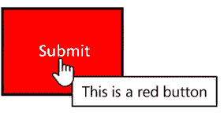
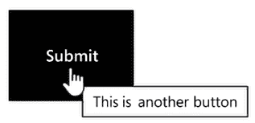
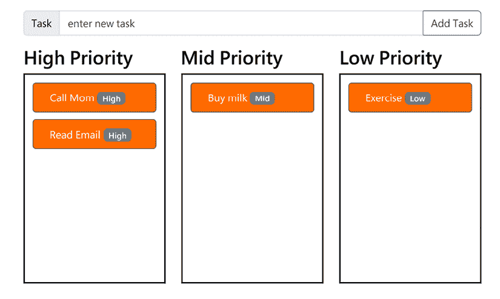
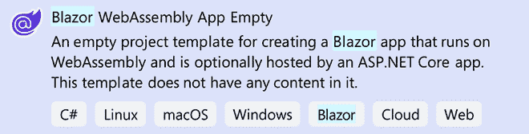
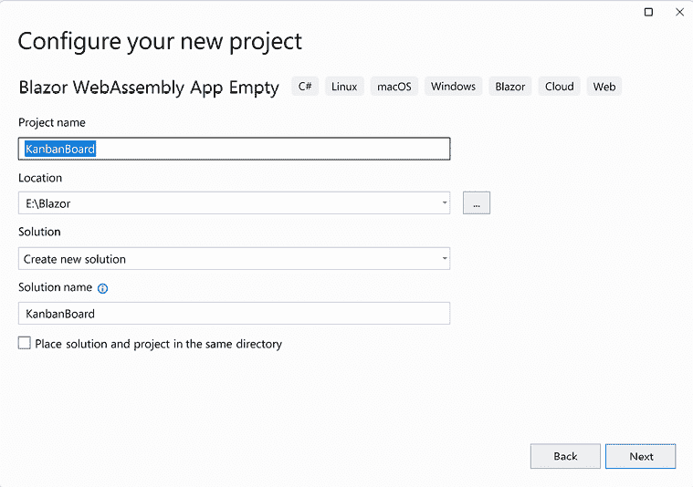
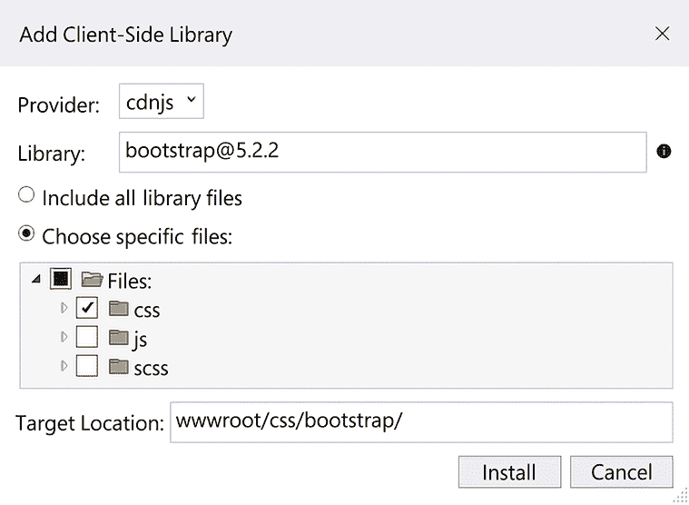

# 8

# 使用事件构建看板

作为开发者，我们努力使我们的应用程序尽可能动态。为此，我们使用**事件**。事件是对象发送的消息，指示已发生动作。Razor 组件可以处理许多不同类型的事件。

在本章中，我们将学习如何在 Blazor WebAssembly 应用程序中处理不同类型的事件。我们将学习如何使用 lambda 表达式以及如何防止默认操作。我们还将学习如何使用**任意**参数和**属性展开**来简化我们对组件分配属性的方式。

本章中创建的项目将是一个使用拖放 API 的看板。看板以视觉方式表示流程的各个阶段的工作。我们的看板将由三个`Dropzone`组件组成，每个组件代表不同的阶段。最后，我们将使用任意参数和属性展开来创建一个组件，用于向我们的看板添加新任务。

> 需要处理事件。
> 
> 内置事件参数
> 
> lambda 表达式。

在本章中，我们将涵盖以下主题：

+   事件处理

+   属性展开

+   任意参数

+   创建看板项目

# 技术要求

要完成此项目，您需要在您的 PC 上安装 Visual Studio 2022。有关如何安装 Visual Studio 2022 免费社区版的说明，请参阅*第一章*，*Blazor WebAssembly 简介*。

本章的源代码可在以下 GitHub 存储库中找到：[`github.com/PacktPublishing/Blazor-WebAssembly-by-Example-Second-Edition/tree/main/Chapter08`](https://github.com/PacktPublishing/Blazor-WebAssembly-by-Example-Second-Edition/tree/main/Chapter08)。

《Code in Action》视频在此处可用：[`packt.link/Ch8`](https://packt.link/Ch8)。

# 事件处理

Razor 组件通过使用名为`@on{EVENT}`的 HTML 元素属性来处理事件，其中`EVENT`是事件名称。

以下代码在点击**点击我**按钮时调用`OnClickHandler`方法：

```cs
<button type="button" @onclick="OnClickHandler">
    Click Me
</button>
@code {
    private void OnClickHandler()
    {
        // ...
    }
} 
```

事件处理器会自动触发 UI 渲染。因此，在处理它们时，我们不需要调用`StateHasChanged`。事件处理器可以引用与事件相关联的任何参数。此外，它们可以用来调用同步和异步方法。

以下代码在复选框更改时调用异步的`OnChangeHandlerAsync`方法：

```cs
<input type="checkbox" @onchange="OnChangedHandlerAsync" />Is OK?
@code {
    bool isOk;
    private async Task OnChangedHandlerAsync(ChangeEventArgs e)
    {
        isOk = (bool)e.Value!; 
        // await ...
    }
} 
```

在前面的代码中，使用`ChangeEventArgs`类提供有关更改事件的信息。`ChangeEventArgs`类只有一个属性。它是`Value`属性，对于此对象，它可以是`true`或`false`。

**提示**

事件参数是可选的，并且只有在它们被方法使用时才应包含。

`ChangeEventArgs` 类继承自 `EventArgs` 类。ASP.NET Core 框架支持的 `EventArgs` 类也由 Blazor WebAssembly 框架支持。以下是支持的 `EventArgs` 列表：

+   `ClipboardEventArgs`

+   `DragEventArgs`

+   `ErrorEventArgs`

+   `EventArgs`

+   `FocusEventArgs`

+   `ChangeEventArgs`

+   `KeyboardEventArgs`

+   `MouseEventArgs`

+   `PointerEventArgs`

+   `WheelEventArgs`

+   `ProgressEventArgs`

+   `TouchEventArgs`

`EventArgs` 类是前面每个类的基类。我们可以通过创建一个从 `EventArgs` 类派生的类来创建我们自己的自定义事件数据类。

到目前为止，我们已经探讨了调用不带参数或带有由事件自动提供的参数的方法的方法。然而，有时我们需要提供自己的参数。

## Lambda 表达式

当我们需要向方法提供参数时，我们可以使用 lambda 表达式。Lambda 表达式用于创建匿名函数。它们使用 `=>` 操作符来分隔参数和表达式的主体。

Lambda 表达式的主体可以使用两种形式。它们可以使用表达式或语句块作为其主体。在以下示例中，第一个按钮使用表达式，第二个按钮使用 `statement` 块：

```cs
<h1>@message</h1>
<button type="button"
        @onclick="@(() => SetMessage("Blazor is Awesome!"))">
    Who Is Awesome?
</button>
<button type="button"
        @onclick="@(() => { @message = "Blazor Rocks!"; })">
    Who Rocks?
</button>
@code{
    private string? message;
    private void SetMessage(string newMessage)
    {
        message = newMessage;
    }
} 
```

在前面的代码中，当点击 **Who Is Awesome?** 按钮时，lambda 表达式调用 `SetMessage` 方法来更新 `message` 字段的值。当点击 **Who Rocks?** 按钮时，语句 lambda 表达式使用语句来更新 `message` 字段的值。

**提示**

如果语句 lambda 的主体只包含一个语句，则括号是可选的。此外，尽管您可以在语句 lambda 的主体中包含任意数量的语句，但我们建议最多限制为两到三个语句。

## 阻止默认操作

有时，我们需要阻止与事件相关联的默认操作。我们可以通过使用 `@on{EVENT}:preventDefault` 指令属性来实现，其中 `EVENT` 是事件名称。

例如，在拖动元素时，默认行为阻止它被拖放到另一个元素中。然而，对于本章中的看板项目，我们需要将项目拖放到各种拖放区。因此，我们需要阻止这种行为。

以下代码阻止了 `ondragover` 默认行为的发生。通过阻止默认行为，我们将允许将元素拖放到用作拖放区的 `div` 元素中：

```cs
<div class="dropzone"
     dropzone="true"
     ondragover="event.preventDefault();">
</div> 
```

## 聚焦元素

有时我们需要以编程方式将焦点给予 HTML 元素。在这些情况下，我们使用 `ElementReference` 类型的 `FocusAsync` 方法。`ElementReference` 通过向我们要给予焦点的 HTML 元素添加 `@ref` 属性来识别。要分配焦点到 HTML 元素，必须定义一个类型为 `ElementReference` 的字段。

以下代码在每次点击按钮时将输入元素的值添加到任务列表中，并将焦点设置回输入元素：

**Focus.razor**

```cs
@page "/focus"     
<input type="text" @ref="taskInput" @bind-value="@taskName" />
<button type="button" @onclick="OnClickHandlerAsync">
     Add Task
 </button>
@foreach (var item in tasks)
{
    <div>@item</div>
}
@code {
    private string? taskName;
    private ElementReference taskInput;
    private List<string> tasks = new();
    private async Task OnClickHandlerAsync()
    {
        tasks.Add(taskName!);
        taskName = "";
        await taskInput.FocusAsync();
    }
} 
```

在前面的代码中，`taskInput` 被定义为 `ElementReference`。它通过 `@ref` 属性与 `input` 元素相关联。在 `OnClickHandlerAsync` 事件中，调用了 `FocusAsync` 方法。结果是每次点击按钮时，焦点都会返回到 `input` 元素。

**重要提示**

由于 `FocusAsync` 方法依赖于 DOM，它仅在元素渲染后才能工作。

Blazor WebAssembly 框架使我们能够通过使用 `@on{EVENT}` 属性轻松访问事件。所有我们在 ASP.NET 框架中习惯使用的 `EventArgs` 都受支持。我们使用 lambda 表达式为被事件调用的方法提供参数。我们使用 `preventDefault` 指令属性来防止默认操作。最后，使用 `ElementReference` 类型的 `FocusAsync` 方法以编程方式将焦点分配给 HTML 元素。

在处理组件时，我们通常需要提供多个属性。使用属性展开，我们可以避免在 HTML 标记中直接分配属性。

# 属性展开

当子组件有许多参数时，在 HTML 中为每个值分配可能会很繁琐。为了避免这样做，我们可以使用属性展开。

使用属性展开，属性被捕获在一个字典中，然后作为一个单元传递给组件。每个字典条目添加一个属性。该字典必须实现 `IEnumerable<KeyValuePair<string,object>>` 或 `IReadOnlyDictionary<string, object>` 并具有字符串键。我们使用 `@attributes` 指令引用字典。

这是名为 `BweButton` 的组件的代码，它包含许多不同的参数：

**BweButton.razor**

```cs
<button type="@Type"
        class="@Class" 
        disabled="@Disabled" 
        title="@Title" 
        @onclick="@ClickEvent">
    @ChildContent
</button>
@code {
  [Parameter] public string? Class { get; set; }
  [Parameter] public bool Disabled { get; set; }
  [Parameter] public string? Title { get; set; }
  [Parameter] public string? Type { get; set; }
  [Parameter] public EventCallback ClickEvent { get; set; }
  [Parameter] public RenderFragment? ChildContent { get; set; }
} 
```

这是用于渲染 `BweButton` 组件而不使用属性展开的示例标记：

```cs
<BweButton Class="button button-red" 
           Disabled="false"
           Title="This is a red button"
           Type="button"
           ClickEvent="OnClickHandler">
    Submit
</BweButton> 
```

这是前面标记渲染的按钮：



图 8.1：渲染的 BweButton

这是我们在本节中用于样式化按钮的 CSS：

```cs
.button {
    color: white;
    cursor: pointer;
    padding: 2em;
}
.button-red {
    background-color: red;
}
.button-black {
    background-color: black;
} 
```

在前面的 CSS 中，`button` 类中的所有元素都将具有白色文本和 2em 的填充。`button-red` 类中的元素将具有红色背景色，而 `button-black` 类中的元素将具有黑色背景色。

通过使用属性展开，我们可以将前面的标记简化为以下内容：

```cs
<BweButton @attributes="InputAttributes"
           ClickEvent="OnClickHandler">
    Submit
</BweButton> 
```

这是前面标记中使用的 `InputAttributes` 的定义：

```cs
public Dictionary<string, object> InputAttributes { get; set; } =
    new ()  
    {
        { "Class", "button button-red"},
        { "Disabled", false},
        { "Title", "This is a red button" },
        { "Type", "submit" }
    }; 
```

上述代码定义了传递给 `BweButton` 的 `InputAttributes`。生成的按钮与之前直接设置属性而不使用 `InputAttributes` 的按钮相同。

属性展开的真正威力在于它与任意参数结合时。

# 随意参数

在前面的例子中，我们使用了明确定义的参数来分配按钮的属性。一种更高效的方法是使用随意参数。随意参数是一个没有由组件明确定义的参数。`Parameter` 属性有一个 `CaptureUnmatchedValues` 属性，用于允许参数捕获不匹配其他任何参数的值。

这是我们的按钮的新版本，称为 `BweButton2`。它使用随意参数：

**BweButton2.razor**

```cs
<button @attributes="InputAttributes" >
    @ChildContent
</button>
@code {
    [Parameter(CaptureUnmatchedValues = true)]
    public Dictionary<string, object>? InputAttributes{get; set;}
    [Parameter]
    public RenderFragment? ChildContent { get; set; }
} 
```

前面的代码包括一个名为 `InputAttributes` 的参数，其 `CaptureUnmatchedValues` 属性设置为 `true`。

**重要提示**

一个组件只能有一个参数，其 `CaptureUnmatchedValues` 属性设置为 `true`。

这是用于渲染我们按钮新版本的更新后的标记：

```cs
<BweButton2 @attributes="InputAttributes2"
            @onclick="OnClickHandler"
            class="button button-black">
    Submit
</BweButton2> 
```

这是前面标记中使用的 `InputAttributes2` 的定义：

```cs
public Dictionary<string, object> InputAttributes2 { get; set; } =
    new()
    {
        { "class", "button button-red" },
        { "title", "This is another button" },
        { "name", "btnSubmit" },
        { "type", "button" },
        { "myAttribute", "123"}
    }; 
```

尽管在按钮的新版本中，字典中的所有属性都没有被明确定义，`BweButton2` 仍然被渲染。在前面的例子中，类属性被设置了两次。

这是前面代码渲染的按钮：



图 8.2：使用随意参数渲染的 BweButton2

按钮现在是黑色的原因是因为按钮标记中的 `@attributes` 指令的位置。当属性被撒到元素上时，它们是从左到右处理的。因此，如果有重复的属性被分配，那么在顺序中出现的较晚的那个将被使用。

随意参数用于允许组件渲染之前未定义的属性。这对于支持大量自定义的组件非常有用，例如包含 `input` 元素的组件。

现在，让我们快速了解一下本章将要构建的项目。

# 创建看板板项目

在本章中，我们将构建的 Blazor WebAssembly 应用程序是一个看板（Kanban）板。这个看板将包含三个拖放区域：`高优先级`、`中优先级`和`低优先级`。我们可以在这些拖放区域之间拖放任务，并添加额外的任务。每当任务被拖放到不同的拖放区域时，任务上的徽章指示器将更新以匹配拖放区域的优先级。

以下是完成的应用程序的截图：



图 8.3：看板应用

此项目的构建时间大约为 45 分钟。

## 项目概述

将使用 Microsoft 的**Blazor WebAssembly App Empty**项目模板创建一个空的 Blazor WebAssembly 项目来创建`KanbanBoard`项目。首先，我们将向项目中添加`Bootstrap`。然后，我们将创建`TaskItem`类和一个`Dropzone`组件。我们将向`Home`页面添加三个`Dropzone`组件以创建看板。最后，我们将添加`NewTask`组件，以便我们能够向看板添加新任务。

## 创建看板项目

我们需要创建一个新的 Blazor WebAssembly 应用程序。我们按照以下步骤进行：

1.  打开 Visual Studio 2022。

1.  点击**创建新项目**按钮。

1.  按*Alt*+*S*键进入搜索模板文本框。

1.  输入`Blazor`并按*Enter*键。

    下面的截图显示了**Blazor WebAssembly App Empty**项目模板。

    

    图 8.4：Blazor WebAssembly App Empty 项目模板

1.  选择**Blazor WebAssembly App Empty**项目模板并点击**下一步**按钮。

1.  在**项目名称**文本框中输入`KanbanBoard`并点击**下一步**按钮。

    这是用于配置我们新项目的对话框截图：

    

    图 8.5：配置新项目对话框

    **提示**

    在前面的示例中，我们将`KanbanBoard`项目放置在`E:/Blazor`文件夹中。然而，此项目的位置并不重要。

1.  选择**.NET 7.0**作为要使用的**框架**版本。

1.  选择**配置为 HTTPS**复选框。

1.  取消选择**ASP.NET Core 承载**复选框。

1.  取消选择**渐进式 Web 应用程序**复选框。

    这是用于收集有关我们新项目额外信息的对话框截图：

    

    图 8.6：附加信息对话框

1.  点击**创建**按钮。

我们已创建了一个空的`KanbanBoard` Blazor WebAssembly 项目。我们将使用 Bootstrap 的网格系统来布局我们的看板。

## 安装 Bootstrap

我们需要在我们的 web 应用程序中安装`Bootstrap`。我们按照以下步骤进行：

1.  右键点击`wwwroot/css`文件夹，从菜单中选择**添加**，**客户端库**选项。

1.  在**库**搜索文本框中输入`bootstrap`并按*Enter*键。

1.  选择**选择特定文件**。

1.  仅选择以下截图所示的**css**文件。

    图 8.7：添加客户端库对话框

    **提示**

    虽然前面的截图选择了`Bootstrap`的 5.2.2 版本，但你可以使用任何版本的`Bootstrap`来完成此项目。

1.  点击**安装**按钮。

    **重要提示**

    安装`Bootstrap`后，`wwwroot/css`文件夹中会新增一个文件夹。这个新文件夹包含了`Bootstrap`所需的所有 CSS 文件。在本项目中，我们只会使用`bootstrap.min.css`文件。

1.  打开`wwwroot/index.html`文件。

1.  在`css/app.css`样式表的链接之前添加以下标记：

    ```cs
    <link href="css/bootstrap/css/bootstrap.min.css" 
            rel="stylesheet" /> 
    ```

1.  打开`MainLayout.razor`文件。

1.  更新`main`元素为以下内容：

    ```cs
    <main class="container">
        @Body
    </main> 
    ```

前面的代码在页面主体周围添加了一个`container`。在本项目中，我们将使用 Bootstrap 的网格系统来布局我们的内容。它依赖于一系列容器、行和列。我们将在稍后添加行和列。

我们将使用看板板来优先处理任务。但首先，我们需要一种定义任务的方法。

## 添加以下类

我们需要添加一个`TaskPriority`枚举和一个`TaskItem`类。我们这样做如下：

1.  右键点击`KanbanBoard`项目，从菜单中选择**添加**，**新建文件夹**选项。

1.  将新文件夹命名为`Models`。

1.  右键点击`Models`文件夹，从菜单中选择**添加**，**类**选项。

1.  将新类命名为`TaskPriority`。

1.  点击**添加**按钮。

1.  将类替换为以下`TaskPriority`枚举：

    ```cs
    public enum TaskPriority
    {
        High,
        Mid,
        Low
    } 
    ```

1.  右键点击`Models`文件夹，从菜单中选择**添加**，**类**选项。

1.  将新类命名为`TaskItem`。

1.  点击**添加**按钮。

1.  将以下属性添加到`TaskItem`类中：

    ```cs
    public string? TaskName { get; set; }
    public TaskPriority Priority { get; set; } 
    ```

我们已添加`TaskPriority`枚举和`TaskItem`类来表示看板板上的任务。接下来，我们需要创建拖放区域。

## 创建拖放组件

我们需要添加一个`Dropzone`组件。我们这样做如下：

1.  右键点击`KanbanBoard`项目，从菜单中选择**添加**，**新建文件夹**选项。

1.  将新文件夹命名为`Shared`。

1.  右键点击`Shared`文件夹，从菜单中选择**添加**，**Razor 组件**选项。

1.  将新组件命名为`Dropzone`。

1.  点击**添加**按钮。

1.  删除`h3`元素。

1.  添加以下`@using`指令：

    ```cs
    @using KanbanBoard.Models 
    ```

1.  将以下参数添加到代码块中：

    ```cs
    [Parameter]
    public List<TaskItem> TaskItems { get; set; } = new();
    [Parameter]
    public TaskPriority Priority { get; set; }
    [Parameter]
    public EventCallback<TaskPriority> OnDrop { get; set; }
    [Parameter]
    public EventCallback<TaskItem> OnStartDrag { get; set; } 
    ```

    在前面的代码中，`TaskItems`参数用于跟踪已拖放到`Dropzone`中的任务。`Priority`参数用于指示`Dropzone`中任务的优先级。

    `OnDrop`事件表示当任务被拖放到`Dropzone`时触发的事件，而`OnStartDrag`事件表示当任务从`Dropzone`拖动时触发的事件。

1.  添加以下标记：

    ```cs
    <div class="col">
        <h2 style="">@Priority.ToString() Priority</h2>
        <div class="dropzone"
             ondragover="event.preventDefault();"
             @ondrop="OnDropHandler">
            @foreach (var item in TaskItems
                .Where(q => q.Priority == Priority))
                {

                }
        </div>
    </div> 
    ```

    前面的标记通过优先级标记了`Dropzone`，并通过防止`ondragover`事件的默认值，允许元素被拖放到其中。当元素被拖放到`Dropzone`时，会调用`OnDropHandler`方法。最后，它遍历`TaskItems`类中所有匹配`Priority`的项。

1.  在`@foreach`循环内添加以下标记：

    ```cs
    <div class="draggable" 
        draggable="true" 
        @ondragstart="@(() => OnDragStartHandler(item))">
        @item.TaskName
        <span class="badge text-bg-secondary">
            @item.Priority
        </span>
    </div> 
    ```

    上述标记通过将 `draggable` 属性设置为 `true` 使 `div` 元素可拖动。当元素被拖动时，将调用 `OnDragStartHandler` 方法。

1.  将以下 `OnDropHandler` 方法添加到代码块中：

    ```cs
    private void OnDropHandler()
    {
        OnDrop.InvokeAsync(Priority);
    } 
    ```

    上述代码调用了 `OnDrop` 方法。

1.  将以下 `OnDragStartHandler` 方法添加到代码块中：

    ```cs
    private void OnDragStartHandler(TaskItem task)
    {
        OnStartDrag.InvokeAsync(task);
    } 
    ```

上述代码调用了 `OnStartDrag` 方法。

我们已经添加了一个 `Dropzone` 组件。现在我们需要给组件添加一些样式。

## 添加样式表

我们将通过 CSS 隔离向 `Dropzone` 组件添加样式表。我们这样做：

1.  右键单击 `Shared` 文件夹，从菜单中选择 **添加**，**新项目** 选项。

1.  在 **搜索** 框中输入 `css`。

1.  选择 **样式表**。

1.  将样式表命名为 `Dropzone.razor.css`。

1.  点击 **添加** 按钮。

1.  输入以下样式：

    ```cs
    .draggable {
        margin-bottom: 10px;
        padding: 10px 25px;
        border: 1px solid #424d5c;
        background: #ff6a00;
        color: #ffffff;
        border-radius: 5px;
        cursor: grab;
    }
        .draggable:active {
            cursor: grabbing;
        }
    .dropzone {
        padding: .75rem;
        border: 2px solid black;
        min-height: 20rem;
    } 
    ```

    **提示**

    您可以从 GitHub 仓库复制 `Dropzone.razor.css` 文件。

1.  打开 `wwwroot/index.html` 文件。

1.  在 `head` 元素的底部取消注释以下 `link` 元素：

    ```cs
    <link href="KanbanBoard.styles.css" rel="stylesheet" /> 
    ```

我们已经完成了 `Dropzone` 组件的样式设置。现在我们可以组合看板了。

## 创建看板

我们需要添加三个 `Dropzone` 组件来创建我们的看板，每个类型一个。我们这样做：

1.  打开 `_Imports.razor` 文件。

1.  添加以下 `using` 语句：

    ```cs
    @using KanbanBoard.Models
    @using KanbanBoard.Shared 
    ```

1.  打开 `Pages\Index.razor` 文件。

1.  移除 `h1` 元素。

1.  添加以下标记：

    ```cs
    <PageTitle>Kanban Board</PageTitle>
    <div class="row">
        <Dropzone Priority="TaskPriority.High"
                  TaskItems="TaskItems"
                  OnDrop="OnDrop"
                  OnStartDrag="OnStartDrag" />
        <Dropzone Priority="TaskPriority.Mid"
                  TaskItems="TaskItems"
                  OnDrop="OnDrop"
                  OnStartDrag="OnStartDrag" />
        <Dropzone Priority="TaskPriority.Low"
                  TaskItems="TaskItems"
                  OnDrop="OnDrop"
                  OnStartDrag="OnStartDrag" />
    </div> 
    ```

    上述代码为每个优先级添加了三个 `Dropzone` 组件。

1.  添加以下代码块：

    ```cs
    @code {
        public TaskItem? CurrentItem;
        List<TaskItem> TaskItems = new();

        protected override void OnInitialized()
        {
            TaskItems.Add(new TaskItem
            {
                TaskName = "Call Mom",
                Priority = TaskPriority.High
            });
           TaskItems.Add(new TaskItem
           {
               TaskName = "Buy milk",
               Priority = TaskPriority.Mid
            });
            TaskItems.Add(new TaskItem
            {
                TaskName = "Exercise",
                Priority = TaskPriority.Low
            });    
        }
    } 
    ```

    上述代码使用三个任务初始化了 `TaskItems` 对象。

1.  将 `OnStartDrag` 方法添加到代码块中：

    ```cs
    private void OnStartDrag(TaskItem item)
    {
        CurrentItem = item;
    } 
    ```

    上述代码将 `CurrentItem` 的值设置为当前正在拖动的项目。当项目随后被放下时，我们将使用此值。当 `Dropzone` 组件触发 `@ondragstart` 事件时，它将调用此方法。

1.  将 `OnDrop` 方法添加到代码块中：

    ```cs
    private void OnDrop(TaskPriority priority)
    {
        CurrentItem!.Priority = priority;
    } 
    ```

    上述代码将 `CurrentItem` 的 `Priority` 属性设置为与 `CurrentItem` 放入的 `Dropzone` 相关的优先级。当 `Dropzone` 组件触发 `@ondrop` 事件时，它将调用此方法。

1.  按 *Ctrl*+*F5* 启动应用程序，不进行调试。

1.  将所有任务拖到 **高优先级** 拖放区域。

在将每个任务拖入 **高优先级** 拖放区域后，请确认任务的徽章已更新为 **高**。

我们已经创建了一个非常简单的包含三个项目的看板。让我们添加通过 UI 添加更多项目的功能。

## 创建 NewTask 组件

我们需要添加一个 `NewTask` 组件。我们这样做：

1.  返回 Visual Studio。

1.  右键单击 `Shared` 文件夹，从菜单中选择 **添加**，**Razor 组件** 选项。

1.  将新组件命名为 `NewTask`。

1.  点击 **添加** 按钮。

1.  移除 `h3` 元素。

1.  添加以下标记：

    ```cs
    <div class="row pt-3" >
        <div class="input-group mb-3">
            <label class="input-group-text"
              for="inputTask">
                Task
            </label>
            <input @ref="taskInput"
                   type="text"
                   id="inputTask"
                   class="form-control"
                   @bind-value="@taskName"
                   @attributes="InputParameters" />
            <button type="button"
                    class="btn btn-outline-secondary"
                    @onclick="OnClickHandlerAsync">
                Add Task
            </button>
        </div>
    </div> 
    ```

    上述标记包括一个标签、一个文本框和一个按钮。文本框包含一个`@ref`属性，我们将在稍后使用它来设置文本框的焦点。

    这是我们在工作的`NewTask`组件的截图：

    

    图 8.8：NewTask 组件

1.  将以下代码添加到代码块中：

    ```cs
    private string? taskName;
    private ElementReference taskInput;
    [Parameter(CaptureUnmatchedValues = true)]
    public Dictionary<string, object>? 
        InputParameters{ get; set; }
    [Parameter]
    public EventCallback<string> OnSubmit { get; set; } 
    ```

    上述代码定义了一个参数，`InputParameters`，它将被用于属性展开。

1.  将`OnClickHandlerAsync`方法添加到代码块中：

    ```cs
    private async Task OnClickHandlerAsync()
    {
        if (!string.IsNullOrWhiteSpace(taskName))
        {
            await OnSubmit.InvokeAsync(taskName);
            taskName = null;
            await taskInput.FocusAsync();
        }
    } 
    ```

上述代码调用`OnSubmit`方法，将`taskName`字段设置为`null`，并将焦点设置到`taskInput`对象。

我们现在已经创建了`NewTask`组件。接下来，我们需要开始使用它。

## 使用 NewTask 组件

我们需要将`NewTask`组件添加到`Home`页面。我们这样做如下：

1.  打开`Pages\Index.razor`文件。

1.  在`PageTitle`组件下方添加以下标记：

    ```cs
    <NewTask OnSubmit="AddTask"
             @attributes="InputAttributes" /> 
    ```

1.  将以下代码添加到代码块中：

    ```cs
    public Dictionary<string, object> InputAttributes = new ()
    {
        { "maxlength", "25" },
        { "placeholder", "enter new task" },
        { "title", "This textbox is for adding your tasks." }
    }; 
    ```

    在上述代码中，属性正在被设置，而没有被显式定义。

1.  将`AddTask`方法添加到代码块中：

    ```cs
    private void AddTask(string taskName)
    {
        var taskItem = new TaskItem()
            {
                TaskName = taskName,
                Priority = TaskPriority.High
            };
        TaskItems.Add(taskItem);
    } 
    ```

    上述代码将新项的优先级设置为`高`，并将其添加到`TaskItems`对象中。

1.  按*Ctrl*+*F5*以无调试模式启动应用程序。

1.  输入一个新任务并点击**添加任务**按钮。

    当点击`NewTask`组件的**添加任务**按钮时，会调用`AddTask`方法。文本框会被清空，并且焦点会回到文本框。

1.  输入另一个新任务并点击**添加任务**按钮。

1.  拖放任务以更改它们的优先级。

我们已经增加了向看板添加新任务的功能。

# 摘要

你现在应该能够处理你的 Blazor WebAssembly 应用中的事件。你也应该对使用属性展开和任意参数感到舒适。

在本章中，我们介绍了事件处理。我们解释了如何使用`EventArgs`以及如何使用 lambda 表达式向方法提供参数。我们还解释了如何防止默认操作以及如何使用`@ref`属性以编程方式将焦点设置到特定元素。最后，我们介绍了属性展开和任意参数。

之后，我们使用了**Blazor WebAssembly App Empty**项目模板来创建一个新的项目，并将`Bootstrap`添加到项目中。接下来，我们向项目中添加了一个`Dropzone`组件，并使用它来创建看板。最后，我们在演示属性展开和任意参数的同时，增加了向看板添加任务的功能。

现在你已经知道如何在你的 Blazor WebAssembly 应用中处理不同类型的事件，你可以创建更响应式的应用程序。而且，由于你可以使用字典来传递显式声明的属性和隐式属性到组件中，你可以更快地创建组件，因为你不需要显式地定义每个参数。

在下一章中，我们将创建一个可以上传和读取 Excel 文件的应用程序。

# 问题

以下问题供您思考：

1.  你如何更新看板，以便用户可以删除任务？

1.  你为什么想在用于属性展开的字典中包含一个在组件上未定义的属性，无论是显式还是隐式？

1.  `DragEventArgs`类的基类是什么？

# 进一步阅读

以下资源提供了关于本章涵盖主题的更多信息：

+   更多关于**文档对象模型**（**DOM**）事件的信息，请参阅[`developer.mozilla.org/en-US/docs/Web/Events`](https://developer.mozilla.org/en-US/docs/Web/Events)。

+   更多关于`EventArgs`类的信息，请参阅[`learn.microsoft.com/en-us/dotnet/api/system.eventargs`](https://learn.microsoft.com/en-us/dotnet/api/system.eventargs)。

+   更多关于`DragEventArgs`类的信息，请参阅[`learn.microsoft.com/en-us/dotnet/api/microsoft.aspnetcore.components.web.drageventargs`](https://learn.microsoft.com/en-us/dotnet/api/microsoft.aspnetcore.components.web.drageventargs)。
