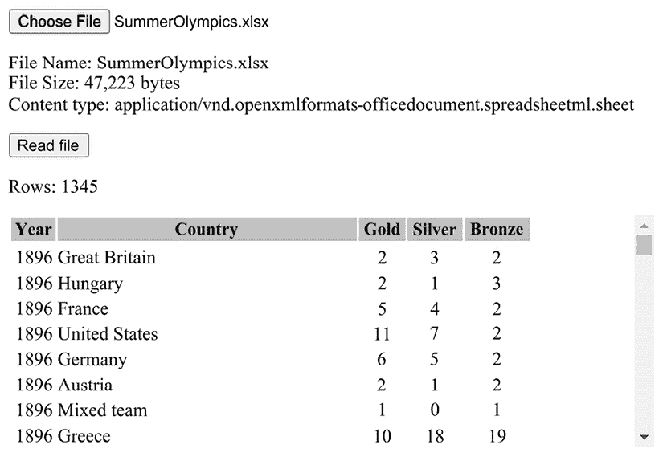

# 上传和读取 Excel 文件

There are many different scenarios that require a web app to allow users to upload local files. Also, there are just as many different types of files that a user may need to upload.

在本章中，我们将学习如何使用 **InputFile** 组件上传不同类型的文件。我们将学习如何上传图像文件以及如何调整上传的图像大小。我们还将学习如何使用 **Virtualize** 组件进行虚拟化，仅渲染可见数据。最后，我们将学习如何使用 **Open XML SDK** 读取 Microsoft Excel 文件。

本章中创建的项目将是一个 Excel 读取器，它将允许我们上传 Excel 文件并在表中查看其内容，使用虚拟化。

> 解析各个部分
> 
> 读取 Excel 文件 –
> 
> 不复杂！

在本章中，我们将涵盖以下主题：

+   上传文件

+   使用虚拟化

+   读取 Excel 文件

+   创建 Excel 读取器项目

# 技术要求

要完成此项目，您需要在您的 PC 上安装 Visual Studio 2022。有关如何安装 Visual Studio 2022 的免费社区版的说明，请参阅 *第一章*，*Blazor WebAssembly 简介*。

本章的源代码可在以下 GitHub 仓库中找到：[`github.com/PacktPublishing/Blazor-WebAssembly-by-Example-Second-Edition/tree/main/Chapter09`](https://github.com/PacktPublishing/Blazor-WebAssembly-by-Example-Second-Edition/tree/main/Chapter09)。

The Code in Action video is available here: [`packt.link/Ch9`](https://packt.link/Ch9).

# 上传文件

`InputFile` 组件是一个内置的 Blazor 组件，用于将文件上传到 Blazor 应用程序。它渲染一个 HTML `input` 元素，类型为 `file`，并为文件内容提供流。它位于 `Microsoft.AspNetCore.Components.Forms` 命名空间中。

`InputFile` 组件的 `OnChange` 事件用于设置在文件被选中时调用的回调。以下是一个在文件被选中时调用 `OnChangeHandler` 方法的 `InputFile` 组件示例：

```cs
<InputFile OnChange="OnChangeHandler" 
           accept="image/png, image/jpeg" /> 
```

这是前面示例的结果 HTML 标记：

```cs
<input accept="image/png, image/jpeg" type="file" _bl_2=""> 
```

在前面的 HTML 标记中，`_bl_2` 属性用于 Blazor 的内部处理，但其他一切都是典型的 `input` 元素。`accept` 属性用于过滤在 **选择文件** 对话框中显示的文件类型。

以下截图显示了前面的标记是如何渲染的：


图 9.1：渲染的 InputFile 组件

当点击 `InputFile` 组件的 **选择文件** 按钮时，将打开 **选择文件** 对话框，允许用户选择文件。以下是 **选择文件** 对话框的截图：


图 9.2：选择文件对话框

**重要提示**

虽然我们已经指出，只有 `image/png` 和 `image/jpg` 类型的文件应该被接受，但 **选择文件** 对话框允许用户通过文件类型选择器选择 **所有文件 (*.*)**。因此，永远无法保证用户选择的文件类型。

`InputFileChangeEventArgs` 类用于提供有关正在引发的 `OnChange` 事件的信息。以下代码将 `selectedFile` 字段设置为提供给 `OnChangeHandler` 方法的 `InputFileChangeEventArgs` 对象的 `File` 属性的值：

```cs
IBrowserFile? selectedFile;
private void OnChangeHandler(InputFileChangeEventArgs e)
{
    selectedFile = e.File;
} 
```

`File` 属性表示上传的文件，其类型为 `IBrowserFile`。

这些是 `IBrowserFile` 接口的属性：

+   `ContentType` – 文件的内容类型

+   `LastModified` – 文件的最后修改日期

+   `Name` – 文件名

+   `Size` – 文件的大小（以字节为单位）

**重要提示**

你永远不应该信任从互联网上传的文件。你应该将其视为可能对你的应用程序、服务器和网络构成安全风险的潜在威胁。`ContentType`、`LastModified`、`Name` 和 `Size` 属性都可以被操纵以损害你的系统，并且不可信。

`IBrowserFile` 接口只有一个方法。它是 `OpenReadStream` 方法，用于读取上传的文件。默认情况下，流的最大大小为 500 KB。但是，可以使用 `maxAllowedSize` 参数来增加流的最大大小。在以下示例中，流的最大大小被设置为 `MAXFILESIZE` 的值：

```cs
var stream = await file.OpenReadStream(MAXFILESIZE); 
```

## 缩放图像

图像可能非常大。有时我们需要限制允许上传到应用程序中的图像的大小。在这些情况下，我们可以使用 `RequestImageFileAsync` 方法来缩放图像。以下是 `RequestImageFileAsync` 方法的参数：

+   `Format` – 新图像的格式

+   `MaxWidth` – 新图像的最大宽度

+   `MaxHeight` – 新图像的最大高度

**重要提示**

`RequestImageFileAsync` 方法不会验证图像是否有效。因此，任何结果都应被视为不可信。

当使用 `RequestImageFileAsync` 方法时，图像会使用提供的尺寸进行缩放，同时保留原始图像的宽高比。以下 `UploadImage` 组件会缩放上传的图像：

**UploadImage.razor**

```cs
@page "/uploadImage"
@using Microsoft.AspNetCore.Components.Forms
<PageTitle>Upload Image</PageTitle>
<h1>Upload Image</h1>
<InputFile OnChange="OnChangeHandler" 
    accept="image/png, image/jpeg" />
@if (@image != null)
{
    <p>Old file size: @uploadedFile!.Size.ToString("N0") bytes</p>
    <p>New file size: @resizedFile!.Size.ToString("N0") bytes</p>
    
}
@code {
    IBrowserFile? uploadedFile;
    IBrowserFile? resizedFile;
    string? image;
    async Task OnChangeHandler(InputFileChangeEventArgs e)
    {
        uploadedFile = e.File;
        resizedFile = await uploadedFile.RequestImageFileAsync(
               uploadedFile.ContentType, 
               100, 
               100
        );
        var buffer = new byte[resizedFile.Size]; 
        var stream = await resizedFile.OpenReadStream()
                                      .ReadAsync(buffer);
        image = Convert.ToBase64String(buffer);
    }
} 
```

上述代码使用 `RequestImageFileAsync` 方法将图像缩放为 100 x 100 像素。它使用 `OpenReadStream` 方法读取文件，然后将其编码为 `Base64` 字符串。最后，当 `image` 属性的值不再是 `null` 时，渲染图像的原始大小、缩放后图像的新大小以及缩放后的图像本身。

**提示**

虽然我们的示例直接将文件读入内存，但我们建议你直接将流复制到磁盘上的文件或上传到外部服务，例如 Azure Blob 存储。

这是一张使用 **上传图片** 页面上传的一张非常大的照片的截图，照片是在我们前往美国维尔京群岛圣约翰的旅行中拍摄的：


图 9.3：上传图片结果

在前面的示例中，我们能够将文件大小从 6,413,880 字节减少到 4,719 字节。

## 处理多个文件

默认情况下，`InputFile` 组件只允许选择单个文件。然而，可以通过使用 `multiple` 属性来使用 `InputFile` 组件上传多个文件，如下面的示例所示：

```cs
<InputFile OnChange="OnChange" multiple /> 
```

当使用 `multiple` 属性时，`InputFileChangeEventArgs` 的 `FileCount` 属性用于确定已上传的文件数量。当允许上传多个文件时，而不是使用 `File` 属性来访问文件，我们使用 `InputFileChangeEventArgs` 的 `GetMultipleFiles` 方法来遍历已上传的文件列表。

在以下示例中，使用 `GetMultipleFiles` 方法来返回所选文件的列表。然后使用 `foreach` 循环遍历文件列表：

```cs
async Task OnChange(InputFileChangeEventArgs e)
{
   var files = e.GetMultipleFiles(); 
   foreach (var file in files)
   {
   // do something
   }
} 
```

**重要提示**

您不能向已选文件的列表中添加文件。每次使用 `InputFile` 时，之前的文件列表都会被新的文件列表替换。

`InputFile` 组件可以通过使用 `multiple` 属性将一个或多个文件一次性上传到 Blazor WebAssembly 应用程序。

`InputFile` 组件可以用来上传许多不同类型的文件，例如 Excel 文件和图片文件。通过使用 `RequestImageFileAsync` 方法，我们可以调整上传的图片大小。我们可以使用 `multiple` 属性来允许用户上传多个文件。

# 使用虚拟化

有时候我们需要处理大量项目。在这种情况下，渲染每个项目并不高效。仅渲染项目子集会更高效。这种技术称为 **虚拟化**。

内置的 `Virtualize` 组件用于渲染集合的可见项目。具体来说，当我们在使用循环渲染项目集合并使用滚动来限制在任何给定时刻可见的项目数量时，会使用它。`Virtualize` 组件计算可见项目的列表并仅渲染这些项目。由于它不渲染不可见的项目，因此比使用渲染集合中每个项目的方程序能效更高。它位于 `Microsoft.AspNetCore.Components.Web.Virtualization` 命名空间中。

**重要提示**

当使用 `Virtualize` 组件时，所有项目必须在像素中具有相同的高度。

`Virtualize<TItem>` 类包含以下属性：

+   `ItemContent` – 项目模板。仅在使用 `Placeholder` 属性时需要。

+   `Items` – 项目集合。此属性不能与 `ItemsProvider` 方法一起使用。

+   `ItemSize` – 每个项目的高度（以像素为单位）。默认值为 50 像素。

+   `ItemsProvider` – 异步检索项目集合的函数。此属性不能与 `Items` 方法一起使用。

+   `OverscanCount` – 在可见区域前后应渲染的项目数量。在滚动时，这将有助于减少渲染量。默认值为 3。

+   `Placeholder` – 在组件等待 `ItemsProvider` 提供项目时渲染的内容。此属性不能与 `Items` 方法一起使用。

+   `SpacerElement` – 用于显示每个项目的元素类型。默认为 `div`。

在我们家的附近，有一个气象站，它持续记录当前的温度和湿度。每天收集了数千个数据点。

这是用于从气象站收集数据的 `Weather` 类：

```cs
public class Weather
{
    public DateTime Date { get; set; }
    public int Temperature { get; set; }
    public int Humidity { get; set; }
} 
```

以下代码将使用 `foreach` 循环显示每个数据点：

```cs
@using Microsoft.AspNetCore.Components.Web.Virtualization
<div style="height:200px;overflow-y:scroll">
    @foreach (Weather weather in weatherHistory)
    {
        <p>
            @weather.Date.ToShortTimeString():
            Temp:@weather.Temperature
            Humidity:@weather.Humidity
        </p>
    }
</div> 
```

在前面的代码中，尽管 `foreach` 循环位于限制显示行数的 `div` 元素内，但 UI 仍然需要在将控制权返回给用户之前渲染所有行。由于 `Weather` 对象集合包含数千条记录，用户在等待 UI 渲染所有行时将经历一些延迟。我们可以使用 `Virtualize` 组件只渲染显示的数据。

## 渲染本地数据

以下代码使用 `Virtualize` 组件而不是 `foreach` 循环来从内存中渲染数据：

```cs
<div style="height:200px;overflow-y:scroll">
    <Virtualize Items="@weatherHistory" Context="weather">
        <p>
            @weather.Date.ToShortTimeString():
            Temp:@weather.Temperature
            Humidity:@weather.Humidity
        </p>
    </Virtualize>
</div> 
```

前面的代码将允许页面更快地加载，因为只有位于 `div` 元素内部的行才会被渲染。`Virtualize` 组件计算容器内可以容纳的项目数量，并且只渲染这些项目。当用户滚动浏览项目时，`Virtualize` 组件确定需要渲染哪些项目，并将它们渲染出来。

## 渲染远程数据

以下代码使用 `ItemsProvider` 方法从远程数据源获取要渲染的项目列表：

```cs
<div style="height:200px;overflow-y:scroll">
    <Virtualize ItemsProvider="@LoadWeather" 
                Context="weather" 
                ItemSize="10" 
                OverscanCount="2">
        <ItemContent>
            <p>
                @weather.Date.ToShortTimeString():
                Temp:@weather.Temperature
                Humidity:@weather.Humidity
            </p>
        </ItemContent>
        <Placeholder>
            <p><em>Loading  Weather...</em></p>
        </Placeholder>
    </Virtualize>
</div> 
```

在前面的示例中，当 `Virtualize` 组件需要更新正在渲染的 `Weather` 对象列表时，会调用 `LoadWeather` 方法。

这是 `LoadWeather` 方法的简单实现：

```cs
private async ValueTask<ItemsProviderResult<Weather>> 
     LoadWeather(ItemsProviderRequest request)
{
    return new ItemsProviderResult<Weather>(
        await FetchWeather(request.StartIndex, request.Count), 
        totalCount);
} 
private async Task<IEnumerable<Weather>> 
    FetchWeather(int start, int count)
{
    // call a service
} 
```

在前面的代码中，`LoadWeather` 方法接受 `ItemsProviderRequest` 并返回 `ItemsProviderResult`。需要注意的是，`ItemsProviderRequest` 包含一个 `StartIndex` 属性和一个 `Count` 属性。`StartIndex` 是请求数据的起始索引，而 `Count` 是请求的项目数量。

在本章的项目中，我们将从上传到我们应用程序的 Excel 电子表格中读取值。因此，我们需要学习如何从 Excel 电子表格中读取。

# 读取 Excel 文件

我们可以使用 `Open XML SDK` 来读取和写入 Microsoft Excel 文件。它为我们提供了处理 Excel 文件、Word 和 PowerPoint 文件的工具。要使用 `Open XML SDK`，我们需要将 `DocumentFormat.OpenXml NuGet` 包添加到我们的项目中。

带有 XLSX 文件扩展名的现代 Excel 文件是由压缩的 XML 文件集合组成的。要查看单个文件，将文件扩展名从 XLSX 更改为 ZIP，并使用 `.zip` 查看器查看文件。你也可以提取文件。

当使用 `Open XML SDK` 时，Excel 文档用 `SpreadsheetDocument` 类表示。这是该类中元素的层次结构：

+   `workbook` – 文档的根元素

+   `sheets` – 工作表的容器

+   `sheet` – 指向工作表定义文件的指针

+   `worksheet` – 包含工作表数据的定义

+   `sheetData` – 数据

+   `row` – 数据行

+   `c` – 数据行中的一个单元格

+   `v` – 单元格的值

为了演示 Excel 文件的格式，我们创建了一个名为 `Sample.xlsx` 的示例 Excel 文件。该示例工作簿包含两个工作表。第一个工作表标题为 **Numbers**，第二个工作表标题为 **Welcome**。**Numbers** 工作表包含两行数字，而 **Welcome** 工作表在 A1 单元格中包含字符串 **Hello World**。

这是 `Sample.xlsx` 文件的截图：


图 9.4：Sample.xlsx

**重要提示**

你可以从 GitHub 仓库下载 `Sample.xlsx` 的副本。

如果我们将 `Sample.xlsx` 的文件名更改为 `Sample.zip` 并提取所有文件，这将得到以下文件结构：


图 9.5：Sample.zip 的文件结构

如果你熟悉 Microsoft Excel，`xl` 文件夹下的文件将对你来说很熟悉。`xl` 文件夹包含一个 `workbook.xml` 文件和一个 `worksheets` 文件夹，每个工作表都有一个文件。

`workbook.xml` 文件列出了工作簿中的所有工作表。以下来自 `workbook.xml` 文件的标记显示了 `sheets` 元素的内容：

```cs
<sheets>
    <sheet name="Numbers" sheetId="1" r:id="rId1"/>
    <sheet name="Welcome" sheetId="2" r:id="rId2"/>
</sheets> 
```

这是遍历给定 `SpreadsheetDocument` 中所有工作表的代码：

```cs
private List<string> ReadSheetList(SpreadsheetDocument doc)
{
    List<string> mySheets = new();
    WorkbookPart wbPart = doc.WorkbookPart;
    Sheets sheets = wbPart.Workbook.Sheets;
    foreach (Sheet item in sheets)
    {
        mySheets.Add(item.Name);
    }
    return mySheets;
} 
```

`worksheets` 文件夹包含一个文件，对应于 `workbook.xml` 文件中 `sheets` 元素中标识的每个工作表。在我们的例子中，它们被命名为 `sheet1.xml` 和 `sheet2.xml`。以下来自 `sheets1.xml` 文件的标记显示了 `Numbers` 工作表的 `sheetData` 元素的内容：

```cs
<sheetData>
   <row r="1" spans="1:3" x14ac:dyDescent="0.25">
      <c r="A1"><v>1</v></c>
      <c r="B1"><v>2</v></c>
      <c r="C1"><v>3</v></c>
   </row>
   <row r="2" spans="1:3" x14ac:dyDescent="0.25">
      <c r="A2"><v>4</v></c>
      <c r="B2"><v>5</v></c>
      <c r="C2"><v>6</v></c>
   </row>
</sheetData> 
```

如你所见，`sheetData` 由一系列行组成。每一行有几个单元格，每个单元格都有一个值。

以下来自 `sheets2.xml` 文件的标记显示了 `Welcome` 工作表的 `sheetData` 元素的内容：

```cs
<sheetData>
   <row r="1" spans="1:1" x14ac:dyDescent="0.25">
      <c r="A1" t="s"><v>0</v></c>
   </row>
</sheetData> 
```

我们期望 A1 单元格的值为**Hello World**。然而，它的值却是`0`（零）。原因是所有字符串都存储在`sharedStrings.xml`文件中，而`sheetData`中只包含字符串在`sharedStrings.xml`文件中的位置索引。每个唯一的字符串在`sharedStrings.xml`文件中只包含一次。

这是`sharedStrings.xml`文件中的数据：

```cs
<sst count="1" uniqueCount="1">
   <si><t>Helllo World</t></si>
</sst> 
```

以下代码遍历`SpreadsheetDocument`中的每个工作表，并返回每个工作表第一行第一个单元格的值：

```cs
private List<string> ReadFirstCell(SpreadsheetDocument doc)
{
    List<string> A1Value = new();
    WorkbookPart wbPart = doc.WorkbookPart;
    var stringTable = wbPart
        .GetPartsOfType<SharedStringTablePart>()
        .FirstOrDefault();
    Sheets sheets = wbPart.Workbook.Sheets;
    foreach (Sheet item in sheets)
    {
        WorksheetPart wsPart = 
            (WorksheetPart)(wbPart.GetPartById(item.Id));
        SheetData sheetData = wsPart
            .Worksheet.Elements<SheetData>().First();
        Row row = sheetData.Elements<Row>().First();
        Cell cell = row.Elements<Cell>().First();
        string value = cell.CellValue.Text;
        if (cell.DataType != null)
        {
            if (cell.DataType.Value == CellValues.SharedString)
            {
                value = stringTable
                    .SharedStringTable
                    .ElementAt(int.Parse(value)).InnerText;
            }
        }
        A1Value.Add(value);
    }
    return A1Value;
} 
```

您已经学会了如何使用`Open XML SDK`读取 Excel 文件。`Open XML SDK`非常强大。它不仅可以读取 Excel 文件，还可以创建新的 Excel 文件和更新现有的文件。它还可以用于创建、读取和更新 Word 和 PowerPoint 文件。

现在，让我们快速了解一下本章将要构建的项目。

# 创建 Excel 读取器项目

本章我们将构建的 Blazor WebAssembly 应用程序是一个 Excel 文件读取器。我们将使用`InputFile`组件上传 Excel 文件。然后，我们将使用`Open XML SDK`遍历 Excel 文件中某个工作表的行。最后，我们将使用`Virtualize`组件在 HTML 表中渲染 Excel 文件中的数据。

以下是完成的应用程序截图：



图 9.6：Excel 读取器应用

此项目的构建时间大约为 45 分钟。

## 项目概述

将使用 Microsoft 的**Blazor WebAssembly App Empty**项目模板创建一个空的 Blazor WebAssembly 项目来创建`ExcelReader`项目。首先，我们将向项目中添加`Open XML SDK`。然后，我们将添加一个模型来捕获我们从 Excel 文件中读取的信息。我们将使用`InputFile`组件上传 Excel 文件。我们将使用`Open XML SDK`读取 Excel 文件。最后，我们将使用`Virtualize`组件显示 Excel 文件中的数据。

## 创建 Excel 读取器项目

我们需要创建一个新的 Blazor WebAssembly 应用程序。我们这样做如下：

1.  打开 Visual Studio 2022。

1.  点击**创建新项目**按钮。

1.  按*Alt*+*S*键进入**搜索模板**文本框。

1.  输入`Blazor`并按*Enter*键。

    以下截图显示了**Blazor WebAssembly App Empty**项目模板：

    

    图 9.7：Blazor WebAssembly App Empty 项目模板

1.  选择**Blazor WebAssembly App Empty**项目模板并点击**下一步**按钮。

1.  在**项目名称**文本框中输入`ExcelReader`并点击**下一步**按钮。

    这是配置我们新项目的对话框截图：

    

    图 9.8：配置新项目对话框

    TIP

    在前面的例子中，我们将`ExcelReader`项目放置在`E:/Blazor`文件夹中。然而，这个项目的位置并不重要。

1.  选择**.NET 7.0**作为要使用的**Framework**版本。

1.  选择**Configure for HTTPS**复选框。

1.  取消选择**ASP.NET Core Hosted**复选框。

1.  取消选择**Progressive Web Application**复选框。

    这是我们用于收集有关新项目额外信息的对话框截图：

    

    图 9.9：额外信息对话框

1.  点击**Create**按钮。

我们创建了一个空的`ExcelReader` Blazor WebAssembly 项目。我们将使用`Open XML SDK`来读取 Microsoft Excel 文件。

## 安装 Open XML SDK

我们需要将`Open XML SDK`安装到我们的 web 应用中。我们这样做如下：

1.  从 Visual Studio 菜单中选择**Tools**，**NuGet Package Manager**，**Package Manager Console**以打开**Package Manager Console**。

1.  输入以下命令：

    ```cs
    Install-Package DocumentFormat.OpenXml 
    ```

1.  按下*Enter*键。

`Open XML SDK`现在已安装。

现在，我们需要添加一个类来包含我们从 Excel 文件中读取的信息。

## 添加 Medals 类

我们将要上传的 Excel 文件将包括自 1896 年以来每个夏季奥运会每个国家获得的奖牌数量。我们需要添加一个`Medals`类来收集这些信息。我们这样做如下：

1.  右键点击**ExcelReader**项目，从菜单中选择**Add**，**New Folder**选项。

1.  将新文件夹命名为`Models`。

1.  右键点击**Models**文件夹，从菜单中选择**Add**，**Class**选项。

1.  将新类命名为`Medals`。

1.  点击**Add**按钮。

1.  将以下属性添加到`Medals`类中：

    ```cs
    public int Year { get; set; }
    public string? Country { get; set; }
    public int Gold { get; set; }
    public int Silver { get; set; }
    public int Bronze { get; set; } 
    ```

我们已经添加了`Medals`类来捕获 Excel 文件中的数据。接下来，我们需要添加上传我们想要读取的 Excel 文件的能力。

## 上传 Excel 文件

我们将使用`InputFile`组件来选择和上传 Excel 文件。我们这样做如下：

1.  打开`Pages/Index.razor`文件。

1.  删除`h1`元素。

1.  添加以下`using`语句：

    ```cs
    @using Microsoft.AspNetCore.Components.Forms; 
    ```

1.  添加以下标记：

    ```cs
    <PageTitle>Excel Reader</PageTitle>
    <InputFile OnChange="@SelectFile" accept=".xlsx" />
    @if (file != null)
    {
        if (errorMessage == null)
        {
            <p>
                <div>File Name: @file.Name</div>
                <div>
                   File Size: @file.Size.ToString("N0") bytes
                </div>
                <div>Content type: @file.ContentType</div>
            </p>
            <button type="button">Read file</button>
        }
        <p>@errorMessage</p>
    }
    @code {
    } 
    ```

    上述标记包括一个`InputFile`组件和一个`if`语句。如果`file`不为空，则显示文件名、大小和内容类型。

1.  将以下代码添加到代码块中：

    ```cs
    IBrowserFile? file;
    int MAXFILESIZE = 50000;
    string? errorMessage;
    private void SelectFile(InputFileChangeEventArgs e)
    {
        file = e.File;
        errorMessage = null;
        if ((file.Size >= MAXFILESIZE) ||
        (file.ContentType != "application/vnd.openxmlformats-officedocument.spreadsheetml.sheet"))
        {
            errorMessage = "Invalid file";
        }
    } 
    ```

    上述代码检查文件的大小和内容类型，如果它们无效，则显示错误消息。始终设置最大文件大小是一个好习惯，因为文件越大，处理它所需的资源就越多。

1.  按*Ctrl*+*F5*以无调试模式启动应用程序。

1.  点击**Choose file**按钮。

1.  选择`SummerOlympics.xlsx`文件，并点击**Open**按钮。

    以下截图显示了结果：

    

    图 9.10：选择 SummerOlympics.xlsx

    **重要提示**

    您必须从 GitHub 存储库下载`SummerOlympics.xlsx`文件。它包含两个工作表：`olympic_hosts`和`olympic_medals`。我们将使用`olympic_medals`工作表。它包括夏季奥运会的按国家和年份的奖牌计数。

1.  点击**读取文件**按钮。

1.  验证没有任何操作发生。

我们已成功上传 Excel 文件，但当我们点击**读取文件**按钮时，没有任何操作。现在我们需要编写代码来从 Excel 文件中读取数据。

## 读取 Excel 文件

我们将使用`SpreadsheetDocument`类从 Excel 文件中读取数据。我们这样做如下：

1.  返回 Visual Studio。

1.  打开`Pages\Index.razor`文件。

1.  添加以下`using`语句：

    ```cs
    @using DocumentFormat.OpenXml;
    @using DocumentFormat.OpenXml.Packaging;
    @using DocumentFormat.OpenXml.Spreadsheet; 
    ```

1.  在代码块中添加以下字段：

    ```cs
    bool loaded;
    int rowCount; 
    ```

    `loaded`字段将用于切换用于显示数据的标记，而`rowCount`字段将用于存储 Excel 文件中的行数。

1.  在代码块中添加以下`ReadFile`方法：

    ```cs
    private async Task ReadFile()
    {
        try
        {
            var stream = new MemoryStream();
            await file.OpenReadStream(MAXFILESIZE)
                      .CopyToAsync(stream);
            SpreadsheetDocument doc = 
                 SpreadsheetDocument.Open(stream, false);
            WorkbookPart wbPart = doc.WorkbookPart;
            var sheet = wbPart.Workbook
                 .Descendants<Sheet>()
                 .Where(s => s.Name == "olympic_medals")
                 .FirstOrDefault();
            WorksheetPart wsPart = 
                 (WorksheetPart)(wbPart.GetPartById(sheet.Id));
            SheetData sheetData =
                wsPart.Worksheet.Elements<SheetData>().First();
            rowCount = sheetData.Elements<Row>().Count();
            loaded = true;
        }
        catch (Exception)
        {
            errorMessage = "Invalid Excel file";
        }
    } 
    ```

    前面的代码将`rowCount`的值设置为`olympic_medals`工作表的行数。

1.  将**读取文件**按钮更新为以下内容：

    ```cs
    <button type="button" @onclick="ReadFile">
        Read file
    </button> 
    ```

    当点击**读取文件**按钮时，将调用`ReadFile`方法。

1.  在**读取文件**按钮之后添加以下`if`语句：

    ```cs
    if (!loaded)
    {
        <p><em>Loading...</em></p>
    }
    else
    {
        <p>Rows: @rowCount</p>
    } 
    ```

    前面的代码将在文件加载后显示`rowCount`。

1.  按*Ctrl*+*F5*以无调试模式启动应用程序。

1.  点击**选择文件**按钮。

1.  选择`SummerOlympics.xlsx`文件并点击**打开**按钮。

1.  点击**读取文件**按钮。

1.  验证是否显示了正确数量的行。

我们已读取`SummerOlympics.xlsx`文件中`olympic_medals`工作表的行数。接下来，我们将通过遍历工作表中的每一行来填充奖牌集合。

## 填充奖牌集合

我们需要遍历所有行以填充奖牌集合。我们这样做如下：

1.  返回 Visual Studio。

1.  打开`Pages\Index.razor`文件。

1.  添加以下`using`语句：

    ```cs
    @using ExcelReader.Models;
    @using System.Collections.ObjectModel; 
    ```

1.  在代码块中添加以下字段：

    ```cs
    Collection<Medals> allMedals = new(); 
    ```

    `allMedals`字段将用于存储从 Excel 文件中读取的数据。

1.  在设置`rowCount`的代码之后，在`ReadFile`方法中添加以下代码：

    ```cs
    var stringTable = wbPart
        .GetPartsOfType<SharedStringTablePart>()
        .FirstOrDefault();
    foreach (Row r in sheetData.Elements<Row>())
    {
        if (r.RowIndex! == 1)
        {
            continue;
        };
        int col = 1;
        var medals = new Medals();
        foreach (Cell c in r.Elements<Cell>())
        {
            string value = c.InnerText;
            if (c.DataType != null)
            {
                if (c.DataType.Value == 
                    CellValues.SharedString)
                {
                    value = stringTable.SharedStringTable
                        .ElementAt(int.Parse(value))
                        .InnerText;
                }
            }
            switch (col)
            {
                case 1:
                    medals.Year = int.Parse(value);
                    break;
                case 2:
                    medals.Country = value;
                    break;
                case 3:
                    medals.Gold = int.Parse(value);
                    break;
                case 4:
                    medals.Silver = int.Parse(value);
                    break;
                case 5:
                    medals.Bronze = int.Parse(value);
                    break;
                default:
                    break;
            }
            col = col + 1;
        }
        allMedals.Add(medals);
    } 
    ```

    前面的代码首先加载`stringTable`。然后，它确定单元格的`value`并根据正在读取的列更新`Medals`对象的相应属性。如果单元格是`SharedString`类型，它将使用`stringTable`确定其值。

1.  按*Ctrl*+*F5*以无调试模式启动应用程序。

1.  点击**选择文件**按钮。

1.  选择`SummerOlympics.xlsx`文件并点击**打开**按钮。

1.  点击**读取文件**按钮。

1.  验证是否仍然显示了正确数量的行。

我们正在将所有行读入奖牌的集合中，但我们没有渲染它们。接下来，我们需要将它们渲染到屏幕上。

## 渲染奖牌集合

我们需要将`Virtualize`组件添加到`Home`页面以渲染数据。我们这样做如下：

1.  打开`Pages\Index.razor`文件。

1.  添加以下`using`语句：

    ```cs
    @using Microsoft.AspNetCore.Components.Web.Virtualization 
    ```

1.  在显示`rowCount`的`p`元素下方添加以下标记：

    ```cs
    <div style="height:200px;overflow-y:scroll" tabindex="-1">
        <table width="450">
            <thead style="position: sticky; top: 0; background-color: silver">
                <tr>
                    <th>Year</th>
                    <th width="255">Country</th>
                    <th>Gold</th>
                    <th>Silver</th>
                    <th>Bronze</th>
                </tr>
            </thead>
            <tbody>
                <Virtualize Items="@allMedals"  
                            SpacerElement="tr">
                    <tr>
                        <td align="center">@context.Year</td>
                        <td>@context.Country</td>
                        <td align="center">@context.Gold</td>
                        <td align="center"> 
                            @context.Silver
                        </td>
                        <td align="center"> 
                            @context.Bronze
                        </td>
                    </tr>
                </Virtualize>
            </tbody>
        </table>
    </div> 
    ```

    上述标记使用`Virtualize`组件来显示集合中的每个对象。

1.  按*Ctrl*+*F5*启动应用程序而不进行调试。

1.  点击**选择文件**按钮。

1.  选择`SummerOlympics.xlsx`文件并点击**打开**按钮。

1.  点击**读取文件**按钮。

1.  滚动项目列表。

我们已经添加了使用`Virtualize`组件显示集合中所有项的功能。

# 摘要

现在，你应该能够将文件上传到你的 Blazor WebAssembly 应用中。你应该能够在处理大量数据集时使用虚拟化来更快地渲染你的页面。最后，你应该对与 Microsoft Excel 文件一起工作感到舒适。

在本章中，我们解释了如何上传文件以及如何调整图像文件的大小。我们还介绍了如何使用虚拟化。最后，我们介绍了`Open XML SDK`并解释了如何使用它来读取 Excel 文件。

之后，我们使用**Blazor WebAssembly App Empty**项目模板创建了一个新项目，并将`Open XML SDK`添加到项目中。接下来，我们添加了一个`InputFile`组件来上传 Excel 文件到应用中。我们使用`Open XML SDK`读取特定工作表中的行数。然后，我们遍历所选工作表中的所有行，并将它们的值存储在一个集合中。最后，我们使用`Virtualize`组件来显示集合中的所有项目。

现在你已经知道如何将文件上传到你的 Web 应用中，你的用户可以用各种不同的格式向你的应用程序提供数据。在这个项目中，我们使用了 Excel 文件，但你很容易将你学到的知识应用到其他类型的文件上。

在下一章中，我们将使用 SQL Server 和 ASP.NET Web API 构建一个任务管理器。

# 问题

以下问题供你思考：

1.  `SummerOlypics.xlsx`文件包含两个工作表。在显示之前，你如何将两个工作表中的数据合并？

1.  调整图像大小有哪些好处？

1.  在使用`Virtualize`组件时始终包含`Placeholder`是否是一个好的做法？

1.  `Open XML SDK`能否用来创建一个新的 Excel 文件？

1.  在使用`InputFile`组件时，如何避免将整个文件读入内存？

# 进一步阅读

以下资源提供了有关本章涵盖主题的更多信息：

+   关于上传文件时的安全最佳实践，请参阅 [`learn.microsoft.com/en-us/aspnet/core/mvc/models/file-uploads`](https://learn.microsoft.com/en-us/aspnet/core/mvc/models/file-uploads).

+   关于 GitHub 上的 `Virtualize` 组件源代码，请参阅 [`github.com/dotnet/aspnetcore/blob/main/src/Components/Web/src/Virtualization/Virtualize.cs`](https://github.com/dotnet/aspnetcore/blob/main/src/Components/Web/src/Virtualization/Virtualize.cs).

+   关于 `Open XML SDK` 的更多信息，请参阅 [`learn.microsoft.com/en-us/office/open-xml/open-xml-sdk`](https://learn.microsoft.com/en-us/office/open-xml/open-xml-sdk).

+   关于 Open XML 规范的更多信息，请参阅 [`www.ecma-international.org/publications-and-standards/standards/ecma-376/`](https://www.ecma-international.org/publications-and-standards/standards/ecma-376/).
