# 10

# 使用 Azure Active Directory 保护 Blazor WebAssembly 应用程序

安全性很重要。大多数应用程序在用户可以访问应用程序提供的所有功能之前，都需要用户提供其凭据。管理用户名、密码、角色和组可能会很繁琐且复杂。使用**Azure Active Directory**（**Azure AD**）可以使其变得简单。Azure AD 是云中的身份提供者。

本章中我们将创建的项目将允许用户查看在用户通过 Azure AD 进行身份验证后，Azure AD 返回的令牌所提供的声明。我们将使用**Microsoft 身份验证库**（**MSAL**）从 Azure AD 获取**JSON Web 令牌**（**JWTs**）。我们将使用**Open ID Connect**（**OIDC**）端点进行用户身份验证。OIDC 是在行业标准 OAuth 2.0 协议之上构建的一个简单的身份层。它允许客户端根据身份提供者（如 Duende Identity Server 或 Azure AD）执行的认证来验证用户的身份。

在本章中，我们将学习身份验证和授权之间的区别。我们将学习如何使用`RemoteAuthenticationView`组件来处理身份验证每个阶段所需的各项操作。我们还将学习如何使用`CascadingAuthenticationState`组件将其身份验证状态与其每个子组件共享。最后，我们将学习如何通过使用`Authorize`属性和`AuthorizeView`组件来控制呈现给用户的内容。

本章中我们将创建的项目将是一个声明读取器。它将允许属于 Azure AD 中特定组的用户查看在身份验证后 Azure AD 返回的令牌的内容。如果用户未进行身份验证或不属于适当的组，他们将收到警告消息。

> 你是谁？你有什么
> 
> 你是否有权限执行？
> 
> 您的身份。

在本章中，我们将涵盖以下主题：

+   理解身份验证和授权之间的区别

+   与身份验证一起工作

+   使用授权控制用户界面

+   创建声明查看器项目

# 技术要求

要完成此项目，您需要在您的 PC 上安装 Visual Studio 2022。有关如何安装 Visual Studio 2022 免费社区版的说明，请参阅*第一章*，*Blazor WebAssembly 简介*。由于我们将使用 Azure AD 进行身份验证，您需要在 Microsoft Azure 上有一个账户。如果您没有 Microsoft Azure 账户，请参阅*第一章*，*Blazor WebAssembly 简介*，以创建一个免费账户。

本章的源代码可在以下 GitHub 仓库中找到：[`github.com/PacktPublishing/Blazor-WebAssembly-by-Example-Second-Edition/tree/main/Chapter10`](https://github.com/PacktPublishing/Blazor-WebAssembly-by-Example-Second-Edition/tree/main/Chapter10).

代码在行动视频在此处可用：[`packt.link/Ch10`](https://packt.link/Ch10)。

# 理解认证和授权之间的区别

认证和授权是同一枚安全硬币的两面。认证是从用户那里获取凭证以验证用户身份的过程。授权是检查用户访问特定资源的权限的过程。

认证始终先于授权。

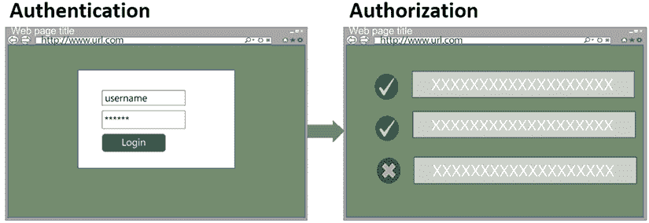

图 10.1：认证与授权对比

前面的图像说明了认证和授权之间的区别。图像的左侧显示了一个用于确定用户身份的示例登录屏幕。图像的右侧显示了用户属于或不属于的组或角色列表，这用于确定用户可以做什么。

## 认证

Blazor 提供了 **RemoteAuthenticatorView** 组件，以简化创建各种认证页面的过程。此组件在认证操作之间持久化和控制状态。

这是对认证工作原理的高级解释：

1.  匿名用户尝试登录或请求带有 `Authorize` 属性的页面。

1.  用户将被重定向到 `/authentication/login` 页面。

1.  用户输入他们的凭证。

1.  如果他们已认证，他们将被重定向到 `/authentication/login-callback` 页面。

1.  然而，如果他们未认证，他们将被重定向到 `/authentication/login-failed` 页面。

这是依赖于 `RemoteAuthenticatorView` 组件处理各种认证操作的示例 `Authentication` 组件的代码：

**Authentication.razor**

```cs
@page "/authentication/{action}"
@using Microsoft.AspNetCore.Components.WebAssembly.Authentication
<RemoteAuthenticatorView Action="@Action">
    <LoggingIn>
        Please sign in to your account ...
    </LoggingIn>
</RemoteAuthenticatorView>
@code{
    [Parameter] public string? Action { get; set; }
} 
```

在前面的代码中，`Action` 属性由路由确定，而 `LoggingIn` 属性用于定义用户登录时渲染的 UI。`LoggingIn` 属性是一个 `RenderFragment`。我们不需要提供 `LoggingIn` 属性，因为 `RemoteAuthenticatorView` 组件已经定义了一个默认值。我们只将其包括作为示例。`RemoteAuthenticatorView` 组件中所有类型为 `RenderFragment` 的属性都由框架提供了默认值。

在前面的代码中，`RemoteAuthenticatorView` 组件只定义了两个属性。然而，还有许多其他属性可用。

这些是 `RemoteAuthenticatorView` 类的属性：

+   `Action`: 当前操作。选项包括 `LogIn`、`LogInCallback`、`LogInFailed`、`LogOut`、`LogOutCallback`、`LogOutFailed`、`LogOutSucceeded`、`Profile` 和 `Register`。

+   `ApplicationPaths`：各种认证页面的路径。由于我们将使用每个路径的默认值，因此我们不会使用此属性。

+   `AuthenticationState`: 认证状态。在认证操作期间保持持久。它是 `TAuthenticationState` 类型。

+   `CompletingLoggingIn`: 当处理 `LogInCallback` 时显示的 UI。它是一个 `RenderFragment`。

+   `CompletingLogOut`: 当处理 `LogOutCallback` 时显示的 UI。它是一个 `RenderFragment`。

+   `LoggingIn`: 当处理 `LogIn` 时显示的 UI。它是一个 `RenderFragment`。

+   `LogInFailed`: 当处理 `LogInFailed` 时显示的 UI。它是一个 `RenderFragment`。

+   `LogOut`: 当处理 `LogOut` 时显示的 UI。它是一个 `RenderFragment`。

+   `LogOutFailed`: 当处理 `LogOutFailed` 时显示的 UI。它是一个 `RenderFragment`。

+   `LogOutSucceeded`: 当处理 `LogOutSucceeded` 时显示的 UI。它是一个 `RenderFragment`。

+   `OnLogInSucceeded`: 当登录操作成功时调用的回调事件。

+   `OnLogOutSucceeded`: 当注销操作成功时调用的回调事件。

+   `Registering`: 当处理 `Register` 时显示的 UI。它是一个 `RenderFragment`。

+   `UserProfile`: 当处理 `Profile` 时显示的 UI。它是一个 `RenderFragment`。

使用 `RemoteAuthenticatorView` 组件可以轻松处理认证过程。

## 授权

在 Blazor WebAssembly 应用程序中，授权检查都在客户端处理。由于恶意用户可以更改客户端代码的行为，我们的授权检查可能会受到损害。因此，我们只会使用授权来处理根据用户权限而变化的用户界面差异。

**提示**

永远不要相信客户端！

只有通过使用后端服务器，才能强制执行真实的安全。我们无法在客户端认证我们的用户，也无法在客户端可靠地授权他们的操作。

认证和授权协同工作以保护我们的应用程序。认证用于确定用户是谁，而授权用于确定他们可以做什么。

除了 `RemoteAuthenticatorView` 组件之外，Blazor WebAssembly 还提供了一些其他内置组件，以帮助我们处理认证。

# 与认证一起工作

`CascadingAuthenticationState` 组件和 `AuthorizeRouteView` 组件协同工作，使认证更简单。`CascadingAuthenticationState` 组件负责将用户的认证状态级联到所有后代。它通常用于包装 `Router` 组件。

在以下示例中，`App` 组件依赖于 `CascadingAuthenticationState` 组件，为所有可路由组件提供用户的认证状态：

**重要提示**

有时我们将可路由组件称为页面。

**App.razor**

```cs
@inject NavigationManager Navigation
<CascadingAuthenticationState>
    <Router AppAssembly="@typeof(App).Assembly">
        <Found Context="routeData">
        </Found>
        <NotFound>
            <PageTitle>Not found</PageTitle>
            <LayoutView Layout="@typeof(MainLayout)">
                <p>Sorry, there's nothing here.</p>
            </LayoutView>
        </NotFound>
    </Router>
</CascadingAuthenticationState> 
```

在前面的标记中，`Found` 属性包含以下 `AuthorizeRouteView` 组件：

```cs
<AuthorizeRouteView RouteData="@routeData" 
                    DefaultLayout="@typeof(MainLayout)">
    <NotAuthorized>
        @if (context.User.Identity?.IsAuthenticated != true)
        {
            Navigation.NavigateToLogin($"authentication/login");
        }
        else
        {
            <p>
                ERROR: You are not authorized to access 
                this page.
            </p>
        }
    </NotAuthorized>
</AuthorizeRouteView>
<FocusOnNavigate RouteData="@routeData" Selector="h1" /> 
```

在前面的代码中，`Router` 组件用于路由请求。如果找到有效的路由，它将使用 `AuthorizeRouteView` 组件而不是 `RouteView` 组件来确定用户是否有权查看页面。如果他们没有授权并且尚未认证，它将重定向用户到 `/authentication/login` 页面。然而，如果他们没有授权并且已经认证，它将渲染错误信息。

由于 `App` 组件正在使用 `CascadingAuthenticationState` 组件，因此 `Task<AuthenticationState>` 级联参数被提供给每个页面。以下代码使用它来填充 `userName` 字段：

```cs
[CascadingParameter] 
private Task<AuthenticationState> authStateTask { get; set; }
private string userName;
protected override async Task OnInitializedAsync()
{
    var authState = await authStateTask;
    var user = authState.User;
    if (user.Identity.IsAuthenticated)
    {
        userName = user.Identity.Name;
    };
} 
```

在前面的代码中，`authStateTask` 参数用于将 `CascadingAuthenticationState` 组件的 `AuthenticationState` 值级联传递。

Blazor WebAssembly 使用名为 `AuthenticationStateProvider` 的内置 DI 服务来确定用户是否已登录。`AuthenicationStateProvider` 类提供了关于当前用户认证状态的信息。`AuthenicationStateProvider` 的 `User` 属性提供了当前用户的 **ClaimsPrincipal**。`ClaimsPrincipal` 简单来说就是基于声明的用户身份。

通过使用内置组件，我们可以确认用户的身份。接下来，我们需要确定用户被授权执行的操作。

# 使用授权控制用户界面

用户认证后，授权规则用于控制用户可以看到和执行的操作。`Authorize` 属性和 `AuthorizeView` 组件用于控制用户界面。

## `Authorize` 属性

`Authorize` 属性用于要求用户有权查看带有该属性的页面。它应该只用于可路由组件。以下组件包含 `Authorize` 属性：

**Secure.razor**

```cs
@page "/secure"
@using Microsoft.AspNetCore.Authorization
@attribute [Authorize]
<h2>Secure Page</h2>
Congratulations, you have been authenticated! 
```

当未认证的用户尝试导航到带有 `Authorize` 属性的页面时，他们将被自动重定向到 `/authentication/login` 页面。

**提示**

您可以通过在 `_Imports.razor` 文件中添加 `Authorize` 属性来要求每个页面进行认证。但是，如果您这样做，您必须将 `AllowAnonymous` 属性添加到 `Authentication` 组件，否则您的用户将无法登录。

`Authorize` 组件支持基于角色的授权和基于策略的授权。如果用户已经认证并且尝试导航到包含基于角色或基于策略授权的页面，并且不符合要求，他们将收到 `App` 组件提供的信息。在前面的示例 `App` 组件中，信息如下：

```cs
ERROR: You are not authorized to access this page 
```

此示例使用 `Roles` 参数进行基于角色的授权：

```cs
@page "/secure"
@attribute [Authorize(Roles = "admin, siteadmin")] 
```

在前面的示例中，只有处于 `admin` 或 `siteadmin` 角色的用户才能访问此页面。

此示例使用 `Policy` 参数进行基于策略的授权：

```cs
@page "/secure"
@attribute [Authorize(Policy = "content-admin")] 
```

在前面的示例中，只有满足`content-admin`策略要求的用户才能访问该页面。

应仅在可路由组件上使用`Authorize`属性，因为页面内的子组件不会执行授权。

例如，如果我们创建一个名为`Secure`的可路由组件并使用基于角色或基于策略的授权来保护它，那么如果用户的凭据不符合要求，用户将无法导航到该页面。然而，如果我们将相同的组件放置在用户被授权查看的另一个页面上，他们可以看到`Secure`组件的内容。

要仅授权显示页面的一定部分，请使用`AuthorizeView`组件。

## `AuthorizeView`组件

`AuthorizeView`组件用于控制基于用户授权可以查看的内容的用户界面部分。

**重要提示**

默认情况下，未经认证的用户无权查看任何内容。

`AuthorizeView`类具有以下属性：

+   `Authorized`：当用户被授权时渲染的内容。它是一个`RenderFragment`。

+   `Authorizing`：在用户进行认证时渲染的内容。它是一个`RenderFragment`。

+   `NotAuthorized`：当用户未授权时渲染的内容。它是一个`RenderFragment`。

+   `Policy`：确定内容是否可以渲染的策略。

+   `Roles`：允许渲染内容的角色的逗号分隔列表。

与`RemoteAuthenticatorView`组件不同，框架没有为`AuthorizeView`组件使用的`RenderFragments`提供默认值。

以下代码使用`AuthorizeView`组件创建`LoginDisplay`组件：

**LoginDisplay.razor**

```cs
@using Microsoft.AspNetCore.Components.Authorization
@using Microsoft.AspNetCore.Components.WebAssembly.Authentication
@inject NavigationManager Navigation
<AuthorizeView>
    <Authorized>
        Hello, @context.User.Identity?.Name!
        <button @onclick="BeginLogout">Log out</button>
    </Authorized>
    <NotAuthorized>
        <a href="authentication/login">Log in</a>
    </NotAuthorized>
    <Authorizing>
        Please be patient. We are trying to authorize you.
    </Authorizing>
</AuthorizeView>
@code{
    private void BeginLogout(MouseEventArgs args)
    {
        Navigation.NavigateToLogout("authentication/logout");
    }
} 
```

前面的示例提供了`Authorized`模板和`NotAuthorized`模板。如果用户被授权，则显示其姓名，并渲染**注销**按钮。如果用户未授权，则渲染**登录**链接。

`AuthorizeView`组件支持基于角色和基于策略的授权。如果用户已经认证并且他们尝试导航到一个包含基于角色或基于策略的授权的页面，并且他们满足要求，则渲染`Authorized`模板中的 UI；否则，渲染`NotAuthorized`模板中的 UI。

本例使用`Roles`参数进行基于角色的授权：

```cs
<AuthorizeView Roles="admin, siteadmin">
    <p>
        You can only view this content if you are an admin or
        siteadmin.
    </p>
</AuthorizeView> 
```

在前面的示例中，只有属于`admin`或`siteadmin`角色的用户才会渲染指示的文本。

本例使用`Policy`参数进行基于策略的授权：

```cs
<AuthorizeView Policy="content-admin">
    <p>
        You can only view this content if you satisfy 
        the "content-admin" policy.
    </p>
</AuthorizeView> 
```

在前面的示例中，只有满足`content-admin`策略要求的用户才会渲染指示的文本。

`AuthorizeView` 组件可以在 `NavMenu` 组件中使用。然而，尽管组件没有出现在 `NavMenu` 中，但这并不能阻止用户直接导航到该组件。因此，您必须在组件级别始终设置授权规则。

**提示**

不要依赖 `NavMenu` 组件来隐藏未授权用户无法访问的组件。

我们可以使用 `Authorize` 属性和 `AuthorizeView` 组件强制用户进行身份验证并隐藏用户界面的部分。

现在，让我们快速概述一下本章将要构建的项目。

# 创建声明查看器项目

在本章中，我们将构建的 Blazor WebAssembly 应用程序是一个声明查看器。首先，我们将应用程序添加到 Azure AD。添加应用程序后，我们将向 Azure AD 添加一个组和用户。我们将添加所需的 NuGet 包并配置项目以使用 MSAL 身份验证。接下来，我们将添加身份验证和登录显示组件。我们还将添加以下可路由组件：**Secure** 和 **WhoAmI**。最后，我们将添加并测试一个身份验证策略。

以下是从完成的应用程序中截取的 **WhoAmI** 组件的截图：

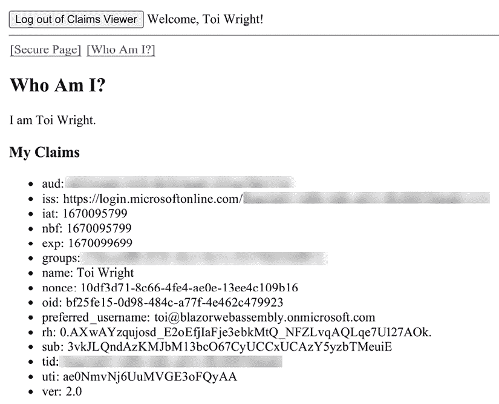

图 10.2：Claims Viewer 中的 WhoAmI 组件

此项目的构建时间大约为 60 分钟。

## 项目概述

使用 Microsoft 的 **Blazor WebAssembly App Empty** 项目模板创建一个空的 Blazor WebAssembly 项目，`ClaimsViewer` 项目将通过这种方式创建。创建完我们的项目后，我们将通过添加应用程序、一个新的组和一个新的用户到我们的 Azure AD 租户中来配置 Azure AD。然后，我们将添加所需的 NuGet 包并更新项目设置。接下来，我们将添加一个身份验证组件和一个登录显示组件。我们还将添加一个用于显示声明内容的组件。最后，我们将添加并测试一个身份验证策略。

**重要提示**

由于 Microsoft 持续更新 Azure Portal，Azure Portal 中的一些屏幕可能不再与本章中的信息匹配。

## 创建声明查看器项目

我们需要创建一个新的 Blazor WebAssembly 应用程序。我们可以这样做：

1.  打开 Visual Studio 2022。

1.  点击 **创建新项目** 按钮。

1.  按 *Alt*+*S* 进入 **搜索模板** 文本框。

1.  输入 `Blazor` 并按 *Enter* 键。

    以下截图显示了 **Blazor WebAssembly App Empty** 项目模板：

    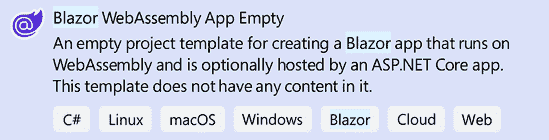

    图 10.3：Blazor WebAssembly App Empty 项目模板

1.  选择 **Blazor WebAssembly App Empty** 项目模板并点击 **下一步** 按钮。

1.  在 **项目名称** 文本框中输入 `ClaimsViewer` 并点击 **下一步** 按钮。

    这是用于配置我们新项目的对话框截图：

    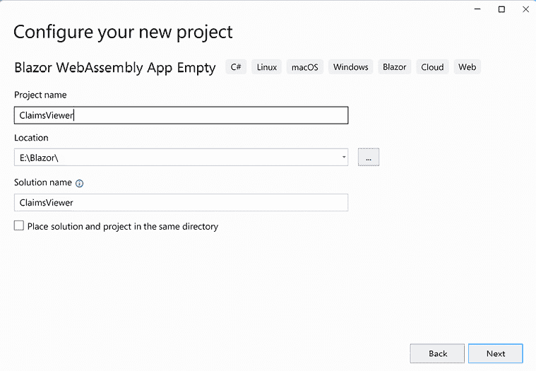

    图 10.4：Blazor WebAssembly App 空项目模板

    **提示**

    在前面的示例中，我们将`ClaimsViewer`项目放置在`E:/Blazor`文件夹中。然而，此项目的位置并不重要。

1.  选择**.NET 7.0**作为要使用的`Framework`版本。

1.  选择**配置 HTTPS**复选框。

1.  取消选择**ASP.NET Core 托管**复选框。

1.  取消选择**渐进式 Web 应用程序**复选框。

    这是用于收集有关我们新项目额外信息的对话框截图：

    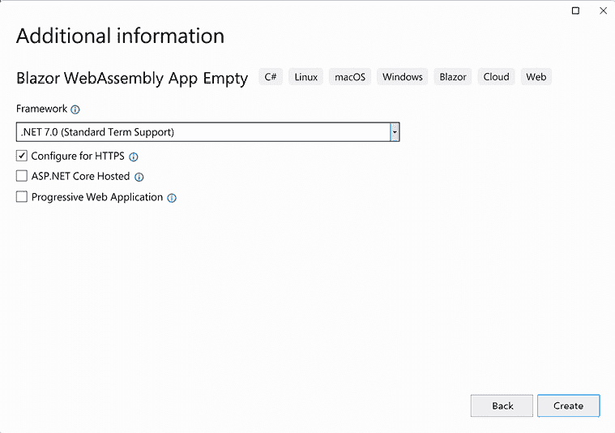

    图 10.5：额外信息对话框

1.  点击**创建**按钮。

我们已创建了一个空的`ClaimsViewer` Blazor WebAssembly 项目。我们将使用 Azure AD 来提供身份服务。

## 将应用程序添加到 Azure AD

我们需要在 Azure AD 中注册应用程序并向项目中添加一个`appsettings.json`文件。我们这样做如下：

1.  右键点击`wwwroot`文件夹，从菜单中选择**添加**，**新建项**选项。

1.  在**搜索**框中输入`json`。

1.  选择**应用程序设置文件**。

1.  将新项目命名为`appsettings.json`。

1.  点击**添加**按钮。

1.  将文件中的所有文本替换为以下内容：

    ```cs
    {
      "AzureAd": {
        "Authority": "https://login.microsoftonline.com/{Directory (tenant) ID}",
        "ClientId": "{Application (client) ID}",
        "ValidateAuthority": true
      }
    } 
    ```

    在我们将应用程序添加到 Azure AD 之后，我们将替换前面代码中使用的`{Directory (tenant) ID}`和`{Application (client) ID}`占位符。

1.  导航到 Azure 门户，[`portal.azure.com`](https://portal.azure.com)。

1.  打开您的`Azure Active Directory`资源。

    **重要提示**

    当您注册 Microsoft 云服务订阅时，会自动创建一个`Azure Active Directory`实例。

1.  从**添加**菜单中选择**应用程序注册**。

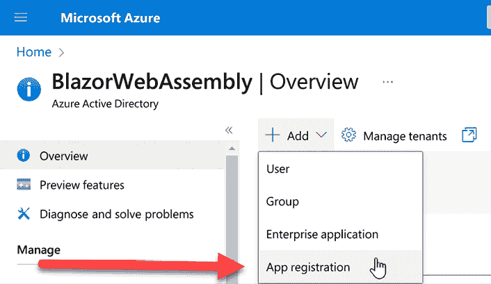

图 10.6：Azure AD 中的应用程序注册

1.  对于面向用户的显示名称，输入`ClaimsViewer`。

1.  对于支持的账户类型，选择**仅此组织目录中的账户**选项。

1.  对于重定向 URI，选择**单页应用程序（SPA）**作为平台，并输入以下文本作为 URI：

    ```cs
    https://localhost:5001/authentication/login-callback 
    ```

    以下截图显示了完成的**注册应用程序**对话框：

    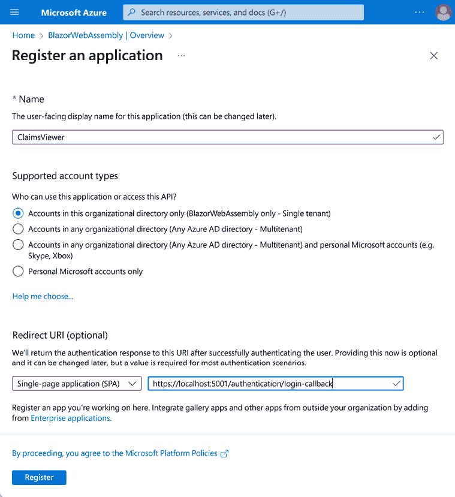

    图 10.7：注册应用程序对话框

1.  点击**注册**按钮。

    以下截图突出了我们需要复制到我们项目中`appsettings.json`文件中的信息：

    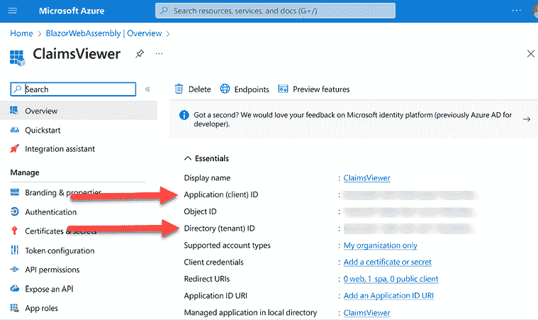

    图 10.8：Azure AD 中的 ClaimsViewer 应用程序

1.  返回 Visual Studio。

1.  打开`appsettings.json`文件。

1.  将 **{目录（租户）ID}** 占位符替换为从 Azure AD 获取的 `目录（租户）ID` 的值。

1.  将 **{应用程序（客户端）ID}** 占位符替换为从 Azure AD 获取的 `应用程序（客户端）ID` 的值。

为了测试我们的应用程序，我们需要添加至少一个用户。此外，在本项目的后期，我们还需要使用一个组来启用基于策略的认证。因此，让我们添加一个用户和一个组。

## 将用户和组添加到 Azure AD

在我们退出 Azure Portal 之前，让我们创建一个新的组并向该组添加一个新用户。我们这样做如下：

1.  返回您的 `Azure Active Directory` 租户。

1.  从菜单中选择 **组**。

1.  从顶部菜单中选择 **新建组**。

1.  对于 **组类型**，保留 **安全** 选中。

1.  对于 **组名**，输入 `ViewAll`。

1.  对于 **组描述**，输入 `Members` `can` `view` `all` `of` `the` `claims`。

    以下截图显示了完成的 **新组** 对话框：

    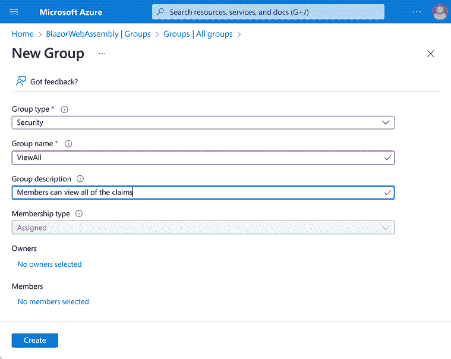

    图 10.9：Azure AD 中的新组对话框

1.  点击 **创建** 按钮。

    您现在应该看到新组。如果您看不到新组，请从顶部菜单中选择 **刷新** 选项。以下截图突出显示了我们需要完成此项目的信息：

    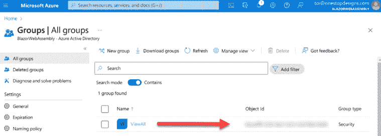

    图 10.10：Azure AD 中的组

1.  复制您新组的 **对象 ID** 并保存以备后用。

    当我们在项目中添加认证策略时，我们需要该组的 `对象 ID`。

1.  返回您的 `Azure Active Directory` 租户。

1.  从菜单中选择 **应用程序注册**。

1.  点击 **ClaimsViewer** 应用程序。

1.  从菜单中选择 **令牌配置**。

1.  点击 **添加组声明** 选项。

1.  选择 **安全组** 复选框。

1.  点击 **添加** 按钮。

1.  返回您的 **Azure Active Directory** 资源。

1.  从菜单中选择 **用户**。

1.  从 **新用户** 顶部菜单中选择 **创建新用户**，如图所示：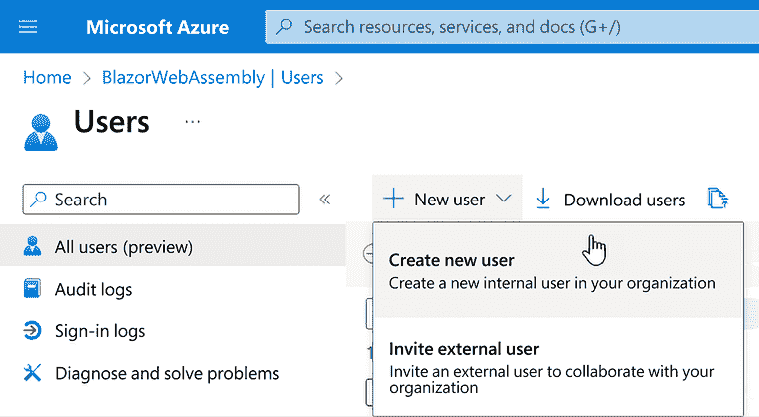

    图 10.11：在 Azure AD 中创建新用户

1.  为新用户输入 **用户名** 和 **姓名**。

1.  输入 **密码**。

1.  添加 **ViewAll** 组。

1.  点击 **创建** 按钮。

您现在应该看到您的新用户。如果您看不到您的新用户，请从顶部菜单中选择 **刷新** 选项。

您已向 Azure AD 添加了一个新用户，该用户是 **ViewAll** 组的成员。我们已经完成了 Azure AD 的设置。现在我们可以返回 Visual Studio。

## 添加所需的 NuGet 包

我们需要向我们的应用程序添加三个 NuGet 包。我们这样做如下：

1.  返回 Visual Studio。

1.  从 Visual Studio 菜单中选择 **工具**、**NuGet 包管理器** 和 **包管理器控制台** 以打开 **包管理器控制台**。

1.  输入以下命令：

    ```cs
    Install-package Microsoft.AspNetCore.Authorization 
    ```

1.  按下 *Enter* 键。

    您已安装了 ASP.NET Core 授权类。

1.  输入以下命令：

    ```cs
    Install-package Microsoft.AspNetCore.Components.Authorization 
    ```

1.  按下 *Enter* 键。

    您已为 Blazor 应用程序安装了认证和授权类。

1.  输入以下命令：

    ```cs
    Install-package Microsoft.Authentication.WebAssembly.Msal 
    ```

1.  按下 *Enter* 键。

    您已安装了 `Microsoft Authentication Library`。它用于从 Microsoft 身份平台获取安全令牌。这些令牌可以用于认证用户和访问 Web API。

1.  打开 `_Imports.razor` 文件。

1.  添加以下 `using` 语句：

    ```cs
    @using Microsoft.AspNetCore.Authorization
    @using Microsoft.AspNetCore.Components.Authorization
    @using Microsoft.AspNetCore.Components.WebAssembly.Authentication 
    ```

所有必需的 NuGet 包都已安装。现在我们需要更新一些项目设置。

## 启用认证

我们需要更新一些项目文件以启用认证。我们这样做如下：

1.  打开 `wwwroot/index.html` 文件。

1.  在现有的 `script` 元素上方添加以下 `script` 元素：

    ```cs
    <script
    src="img/AuthenticationService.js">
    </script> 
    ```

1.  打开 `Properties/launchSettings.json` 文件。

1.  在 `iisSettings` 中添加以下内容：

    ```cs
     "windowsAuthentication": false,
        "anonymousAuthentication": true, 
    ```

1.  打开 `Program.cs` 文件。

1.  在文件的最后一行上方添加以下代码：

    ```cs
    builder.Services.AddMsalAuthentication(options =>
    {
        builder.Configuration.Bind("AzureAd", 
            options.ProviderOptions.Authentication);
        options.ProviderOptions.LoginMode = "redirect";
    }); 
    ```

    在前面的代码中，应用程序被指示引用 `appsetting.json` 文件的 **AzureAd** 部分，以获取认证应用程序所需的参数。`LoginMode` 的值可以是 `popup` 或 `redirect`。我们使用 `redirect`，因为弹出登录对话框不是模态的，并且很容易被其他窗口隐藏。

1.  打开 `App.Razor` 文件。

1.  添加以下指令：

    ```cs
    @inject NavigationManager Navigation 
    ```

1.  将 `Router` 元素用以下 `CascadingAuthenticationState` 元素包围：

    ```cs
    <CascadingAuthenticationState>
    </CascadingAuthenticationState> 
    ```

1.  将 `RouteView` 元素替换为以下 `AuthorizeRouteView` 元素：

    ```cs
    <AuthorizeRouteView RouteData="@routeData"  
        DefaultLayout="@typeof(MainLayout)">
        <NotAuthorized>
            @if (context.User.Identity?.IsAuthenticated != 
               true)
            {
                Navigation.NavigateTo($"authentication/login");
            }
            else
            {
                <p>
                    You are not authorized to access 
                    this resource.
               </p>
            }
        </NotAuthorized>
    </AuthorizeRouteView> 
    ```

在前面的代码中，如果用户未经授权且未进行认证，他们将被重定向到 `authentication/login` 页面。然而，如果他们未经授权但已进行认证，将渲染错误消息。

我们已在应用程序中启用了认证。现在我们需要添加一个 `Authentication` 组件。

## 添加一个认证组件

我们需要添加一个 `Authentication` 组件来处理我们的认证操作。我们这样做如下：

1.  右键单击 `Pages` 文件夹，从菜单中选择 **添加**，**Razor 组件** 选项。

1.  将新组件命名为 `Authentication`。

1.  用以下内容替换文件中的所有文本：

    ```cs
    @page "/authentication/{action}"
    @using Microsoft.AspNetCore.Components.WebAssembly.Authentication
    <RemoteAuthenticatorView Action="@Action" />
    @code {
        [Parameter] public string? Action { get; set; }
    } 
    ```

通过利用 `RemoteAuthenticatorView` 组件的强大功能，我们仅用几行代码就创建了一个 `Authentication` 组件。现在让我们添加一种让用户登录和注销我们应用程序的方法。

## 添加一个 LoginDisplay 组件

我们将添加一个 `LoginDisplay` 组件来登录和注销我们的应用程序。我们这样做如下：

1.  右键单击 `ClaimsViewer` 项目，从菜单中选择 **添加**，**新建文件夹** 选项。

1.  将新文件夹命名为 `Shared`。

1.  右键单击 `Shared` 文件夹，从菜单中选择 **添加**，**Razor 组件** 选项。

1.  将新组件命名为 `LoginDisplay`。

1.  用以下内容替换文件中的所有文本：

    ```cs
    @inject NavigationManager Navigation
    <AuthorizeView>
        <Authorized>
            <button @onclick="BeginLogout">
                Log out of Claims Viewer
            </button>
            Welcome, @context.User.Identity?.Name!
        </Authorized>
        <NotAuthorized>
            <button @onclick="BeginLogin">
                Log in to Claims Viewer
            </button>
        </NotAuthorized>
    </AuthorizeView>
    <hr />
    @code {

    } 
    ```

    前面的标记包括一个`AuthorizeView`组件。如果用户已经认证，则渲染**退出 Claims Viewer**按钮。如果用户尚未认证，则渲染**登录到 Claims Viewer**按钮。

1.  将以下代码添加到代码块中：

    ```cs
    private void BeginLogin(MouseEventArgs args)
    {
        Navigation
            .NavigateToLogin($"authentication/login");
    }
    private void BeginLogout(MouseEventArgs args)
    {
        Navigation
            .NavigateToLogout($"authentication/logout", $"/");
    } 
    ```

    `BeginLogin`方法和`BeginLogout`方法都将用户重定向到`Authentication`页面。`BeginLogin`方法将操作参数设置为`login`，而`BeginLogout`方法将操作参数设置为`logout`并包含一个`ReturnUrl`的值。在此示例中，`ReturnUrl`是`Home`页面。

1.  打开`_Imports.razor`文件。

1.  添加以下`using`语句：

    ```cs
    @using ClaimsViewer.Shared 
    ```

1.  打开`MainLayout.razor`文件。

1.  将`main`元素更新为以下内容：

    ```cs
    <main style="padding:10px">
        <LoginDisplay />
        <a href="/secure">[Secure Page]</a>
        <a href="/whoami">[Who Am I?]</a>
        @Body
    </main> 
    ```

由于我们已经将`LoginDisplay`组件添加到`MainLayout`组件中，它将出现在我们应用程序的每个页面上。

现在用户可以登录和登出，让我们通过向可路由组件添加`Authorize`属性来测试我们的应用程序。

## 添加一个 Secure 组件

我们将添加可路由的`Secure`组件来演示`Authorize`属性。我们这样做如下：

1.  右键单击`Pages`文件夹，从菜单中选择**添加**，**Razor 组件**选项。

1.  将新组件命名为`Secure`。

1.  将文件中的所有文本替换为以下内容：

    ```cs
    @page "/secure"
    @attribute [Authorize]
    <h2>Secure Page</h2>
    Congratulations, you have been authenticated! 
    ```

1.  打开`Pages`/`Index.razor`页面。

1.  将`h1`元素的内容替换为以下内容：

    ```cs
    Welcome to the Claims Viewer app. 
    ```

1.  按*Ctrl*+*F5*启动应用程序，不进行调试。

1.  点击**登录到 Claims Viewer**按钮。

1.  输入您的凭据并点击**登录**按钮。

    第一次登录时，您将收到以下对话框：

    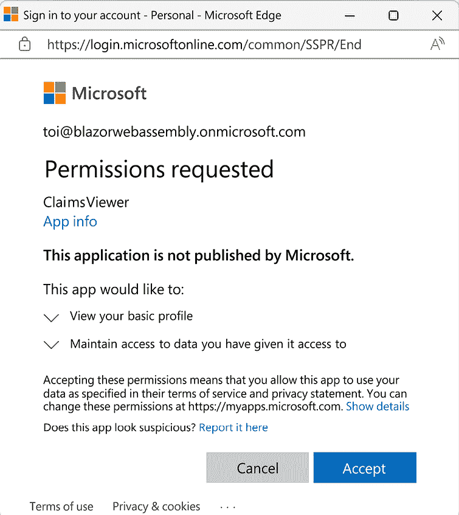

    图 10.12：请求权限对话框

1.  点击**接受**按钮。

    点击**接受**按钮后，您将收到以下对话框：

    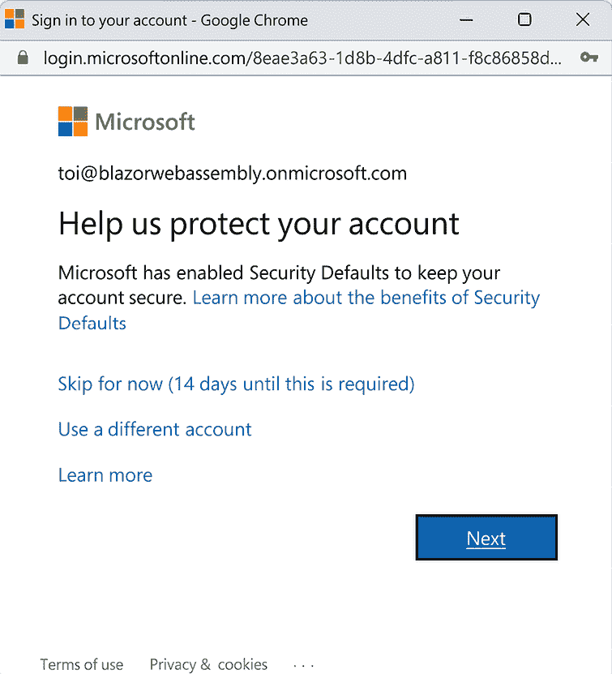

    图 10.13：安全默认值对话框

1.  点击**稍后跳过**链接。

    **重要提示**

    如果您不想使用 Microsoft Authenticator，请不要点击前面的对话框中的**下一步**按钮。

1.  当询问您是否想保持登录状态时，点击**是**按钮。

    您现在已认证。请注意，`LoginDisplay`已更新以显示**退出 Claims Viewer**按钮和用户名。

1.  点击**Secure Page**链接。

    **重要提示**

    如果您点击**Secure Page**链接时尚未认证，您将被强制登录，因为该页面包含一个`Authenticate`属性。

1.  点击**退出 Claims Viewer**按钮。

1.  选择要登出的账户。

1.  关闭浏览器。

我们已经演示了`Authorize`属性。现在让我们再次使用`AuthorizeView`组件。

## 添加一个 WhoAmI 组件

我们需要创建一个 `WhoAmI` 组件，用于显示有关用户的信息。我们将使用 `AuthorizeView` 组件根据用户的身份验证状态渲染不同的信息。我们这样做如下：

1.  返回 Visual Studio。

1.  右键单击 `Pages` 文件夹，从菜单中选择 **添加**，**Razor 组件** 选项。

1.  将新组件命名为 `WhoAmI`。

1.  将文件中的所有文本替换为以下内容：

    ```cs
    @page "/whoami"
    @using System.Security.Claims;
    <h1>Who Am I?</h1>
    <AuthorizeView>
        <NotAuthorized>
            <div>
                <b>WARNING: You are not authenticated!</b>
                You must log in to Claims Viewer.
            </div>
        </NotAuthorized>
        <Authorized>
            I am @myName
        </Authorized>
    </AuthorizeView>
    @code {
    } 
    ```

    上述代码在用户已认证的情况下渲染用户的名字。如果用户尚未认证，则渲染警告信息。

1.  将以下代码添加到代码块中：

    ```cs
    [CascadingParameter]
    private Task<AuthenticationState>?
    authStateTask
    { get; set; }
    private string? myName;
    private List<Claim>? myClaims;
    protected override async Task OnInitializedAsync()
    {
        var authState = await authStateTask!;
        var user = authState.User;
        if (user.Identity!.IsAuthenticated)
        {
            myName = user.Identity.Name;
            myClaims = user.Claims.ToList();
        };
    } 
    ```

    在前面的代码中，`authStateTask` 的值是从 `App` 组件级联下来的。

1.  按 *Ctrl*+*F5* 以无调试模式启动应用程序。

1.  点击 **我是谁** 链接。

    `AuthorizeView` 组件正在渲染 `NotAuthorized` 元素中的文本。

1.  点击 **登录到声明查看器** 按钮。

1.  提供您的凭据并完成登录过程。

    `AuthorizeView` 组件正在渲染用户的名字。

1.  点击 **从声明查看器注销** 按钮。

上述代码将 `myClaims` 的值设置为用户的声明列表。但我的应用程序是如何获取声明列表的呢？声明来自 Azure AD 发送的 ID 令牌。我们可以通过使用浏览器的开发者工具来查看 ID 令牌。ID 令牌是一个 **JSON Web Token** (**JWT**)。

## 查看 JSON Web Token (JWT)

我们将查看从 Azure AD 发送到我们 Web 应用的 ID 令牌。ID 令牌使用 JWT 在服务器和客户端之间共享安全信息。我们这样做如下：

1.  按 *F12* 打开浏览器的开发者工具。

1.  选择 **网络** 选项卡。

1.  点击 **登录到声明查看器** 按钮。

1.  提供您的凭据并完成登录过程。

1.  点击 **token** 并选择 **预览** 选项卡，如图下所示：

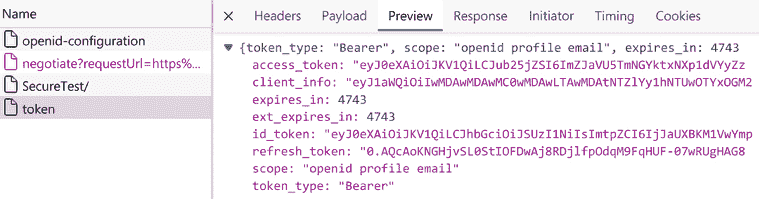

图 10.14：示例令牌

1.  将 `id_token` 的值复制到剪贴板。

    导航到 [`jwt.ms/`](https://jwt.ms/)。

1.  将剪贴板的内容粘贴到空文本区域中。

    在您粘贴令牌内容后，将渲染解码后的令牌。这是将在我们的 **WhoAmI** 页面上显示的信息。在 **解码令牌** 选项卡旁边是 **声明** 选项卡。

1.  点击 **声明** 选项卡以了解令牌中每个声明的详细信息。

1.  关闭浏览器。

现在我们已经知道我们的 **WhoAmI** 页面上将有什么，让我们完成它。

## 添加身份验证策略

我们希望将用户声明的列表访问权限限制为仅限于 Azure AD 中的 `ViewAll` 组成员。为此，我们将添加一个身份验证策略。我们这样做如下：

1.  返回 Visual Studio。

1.  打开 `Program.cs` 文件。

1.  在文件的最后一行上方添加以下代码：

    ```cs
    builder.Services.AddAuthorizationCore(options =>
    {
        options.AddPolicy("view-all", policy =>
            policy.RequireAssertion(context => 
            context.User.HasClaim(c => 
                c.Type == "groups" && 
                c.Value.Contains("{Object ID}"))));
    }); 
    ```

1.  打开 `Pages/Secure.razor` 页面。

1.  将 **view-all** 策略添加到 `Authorize` 属性中，如下所示：

    ```cs
    @attribute [Authorize(Policy = "view-all")] 
    ```

    上述代码将阻止不符合`view-all`策略所有要求的用户查看页面。

1.  打开`Pages/WhoAmI.razor`页面。

1.  在现有的`AuthorizeView`组件下方添加以下标记：

    ```cs
    <h2>My Claims</h2>
    <AuthorizeView Policy="view-all">
        <NotAuthorized>
            <div>
                <b>WARNING: You are not authorized!</b>
                You must be a member of the ViewAll 
                group in Azure AD.
            </div>
        </NotAuthorized>
        <Authorized>
            <ul>
                @foreach (Claim item in myClaims!)
                {
                    <li>@item.Type: @item.Value</li>
                }
            </ul>
        </Authorized>
    </AuthorizeView> 
    ```

    上述代码将阻止不符合`view-all`策略所有要求的用户查看声明列表。

1.  按*Ctrl*+*F5*启动应用程序而不进行调试。

1.  点击**登录到声明查看器**按钮。

1.  点击**安全页面**链接。

    **您无权查看此页面，因为用户不符合策略的要求**。此消息来自`App`组件。

1.  点击**我是谁？**链接。

    **您无权查看您的声明**。此消息直接来自`WhoAmI`组件。

1.  返回 Visual Studio。

1.  打开`Program.cs`文件。

1.  将`{Object ID}`占位符替换为 Azure AD 中**ViewAll**组的**对象 ID**的值。

    **重要提示**

    在**添加用户和组到 Azure AD**步骤中添加**ViewAll**组后，你保存了组的**对象 ID**的值。

1.  从**构建**菜单中选择**构建解决方案**。

1.  返回浏览器。

    由于用户现在符合策略的要求，你现在可以查看他们的声明列表。

1.  点击**安全页面**链接。

    同样，由于用户现在符合策略的所有要求，你现在可以查看**安全**页面。

我们已经创建了一个安全的应用程序，允许认证用户（他们是`ViewAll`组的成员）查看由 Azure AD 提供的 ID 令牌中的声明。

# 摘要

你现在应该能够通过将身份管理委托给 Azure AD 来渲染已认证用户的声明列表。

在本章中，我们学习了认证和授权之间的区别。我们还学习了如何与认证组件一起工作。最后，我们学习了如何通过使用`Authorize`属性和`AuthorizeView`组件来控制用户界面。

之后，我们使用了**Blazor WebAssembly App Empty**项目模板来创建一个新的项目。接下来，我们使用 Azure Portal 配置我们的 Azure AD 租户以添加一个新应用程序。然后我们在新应用程序中添加了一个组，并将用户添加到该组。我们使用 Azure AD 中的客户端 ID 和租户 ID 来更新项目中`appsettings.json`文件。我们添加了所需的 NuGet 包，并完成了配置应用程序以使用认证。我们添加了`Authentication`、`LoginDisplay`、`Secure`和`WhoAmI`组件。最后，我们使用策略来限制对声明列表的访问。

在下一章中，我们将使用 SQL Server 和 ASP.NET Web API 构建一个任务管理器。

# 问题

以下问题供您考虑：

1.  认证和授权之间有什么区别？

1.  如果你在**主页**上添加一个`Secure`组件，用户是否需要认证才能渲染它？

1.  如何在不使用每个可路由组件上的 `Authorize` 属性的情况下保护 Blazor WebAssembly 应用？

1.  **JSON Web Token**（**JWT**）中包含哪些声明？

# 进一步阅读

以下资源提供了有关本章涵盖主题的更多信息：

+   有关当前认证状态更多信息，请参阅 [`learn.microsoft.com/en-us/dotnet/api/microsoft.aspnetcore.components.authorization`](https://learn.microsoft.com/en-us/dotnet/api/microsoft.aspnetcore.components.authorization)。

+   有关 `ClaimsPrincipal` 类更多信息，请参阅 [`learn.microsoft.com/en-us/dotnet/api/system.security.claims.claimsprincipal`](https://learn.microsoft.com/en-us/dotnet/api/system.security.claims.claimsprincipal)。

+   有关 Microsoft 身份平台更多信息，请参阅 [`learn.microsoft.com/en-us/azure/active-directory/develop`](https://learn.microsoft.com/en-us/azure/active-directory/develop)。

+   GitHub 上的 `RemoteAuthenticatorViewCore` 源代码，请参阅 [`github.com/dotnet/aspnetcore/blob/600eb9aa53c052ec7327e2399744215dbe493a89/src/Components/WebAssembly/WebAssembly.Authentication/src/RemoteAuthenticatorViewCore.cs`](https://github.com/dotnet/aspnetcore/blob/600eb9aa53c052ec7327e2399744215dbe493a89/src/Components/WebAssembly/WebAssembly.Authentication/src/RemoteAuthenticatorViewCore.cs)。

+   要解码 **JSON Web Token**（**JWT**），请参阅 [`jwt.ms`](https://jwt.ms)。

# 加入我们的 Discord 社区

加入我们的 Discord 空间，与作者和其他读者进行讨论：

[Blazor WebAssembly 2e](https://packt.link/BlazorWASM2e)


