# 使用 ASP.NET Web API 构建任务管理器

大多数网站都不是孤岛独立存在的。它们需要一个服务器。它们在数据访问和安全性等众多服务上依赖于服务器。

在本章中，我们将学习如何创建一个托管的 Blazor WebAssembly 应用程序。我们将学习如何使用 **HttpClient** 服务调用 Web API，并且我们还将学习如何使用 **JSON 辅助方法** 向 Web API 发送请求以读取、添加、编辑和删除数据。

本章中我们将创建的项目将是一个 **任务管理器**。我们将使用多项目架构将 Blazor WebAssembly 应用程序与 ASP.NET Web API 端点分离。托管的 Blazor WebAssembly 应用程序将使用 JSON 辅助方法读取、添加、编辑和删除存储在 SQL Server 数据库中的任务。一个 ASP.NET 核心项目将托管 Blazor WebAssembly 应用程序并提供 ASP.NET Web API 端点。第三个项目将用于定义其他两个项目共享的类。

> 孤岛独立存在。
> 
> 大多数网站都不是孤岛 -
> 
> 它们需要一个服务器。

在本章中，我们将介绍以下主题：

+   理解托管应用程序

+   使用 `HttpClient` 服务

+   使用 JSON 辅助方法

+   创建任务管理器项目

# 技术要求

要完成此项目，您需要在您的电脑上安装 Visual Studio 2022。有关如何安装 Visual Studio 2022 的免费社区版的说明，请参阅 *第一章*，*Blazor WebAssembly 简介*。您还需要访问 SQL Server 的某个版本。有关如何安装 SQL Server 2022 的免费版的说明，请参阅 *第一章*，*Blazor WebAssembly 简介*。

本章的源代码可在以下 GitHub 仓库中找到：[`github.com/PacktPublishing/Blazor-WebAssembly-by-Example-Second-Edition/tree/main/Chapter11`](https://github.com/PacktPublishing/Blazor-WebAssembly-by-Example-Second-Edition/tree/main/Chapter11)。

代码实战视频在此处可用：[`packt.link/Ch11`](https://packt.link/Ch11)。

# 理解托管应用程序

当我们使用 Microsoft 的 **Blazor WebAssembly App Empty** 项目模板创建一个新的 Blazor WebAssembly 项目时，我们可以通过勾选 **ASP.NET Core 托管** 复选框来创建一个托管的 Blazor WebAssembly 应用程序。

以下截图突出了 **ASP.NET Core 托管** 复选框：

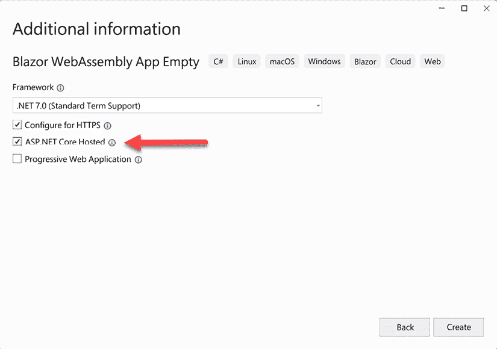

图 11.1：Blazor WebAssembly App Empty 项目模板

由 **Blazor WebAssembly App Empty** 项目模板创建的托管 Blazor WebAssembly 应用程序包括以下三个项目：

+   客户端项目

+   服务器项目

+   共享项目

## 客户端项目

客户端项目是一个客户端 Blazor WebAssembly 项目。它与我们在 *第二章*，*构建您的第一个 Blazor WebAssembly 应用程序* 中创建的独立 Blazor WebAssembly 应用几乎相同。唯一的重大区别在于数据访问方式。在客户端项目中，示例数据是通过 Web API 端点从服务器项目访问的，而不是静态文件。由于服务器项目既托管客户端项目，又通过 ASP.NET Web API 提供数据服务，因此它不会遇到任何 CORS 问题。

## 服务器项目

服务器项目是一个 ASP.NET Core 项目。该项目负责提供客户端应用程序。除了托管客户端应用程序外，服务器项目还提供了 Web API 端点。

**重要提示**

在这种情况下，由于 ASP.NET Core 项目正在提供 Blazor WebAssembly 应用，因此它必须在解决方案中设置为启动项目。

## 共享项目

共享项目也是一个 ASP.NET Core 项目。它包含在另外两个项目之间共享的应用程序逻辑。在过去，我们不得不在客户端和服务器上编写验证代码。我们必须为客户端编写 JavaScript 验证代码，为服务器编写 C# 验证代码。不出所料，有时这两个验证模型并不匹配。共享项目解决了这个问题，因为所有验证代码都使用单一语言在单个位置维护。

通过使用多项目解决方案，我们可以创建一个更健壮的应用程序。共享项目定义了类，而客户端项目使用 `HttpClient` 服务从服务器项目请求数据。

# 使用 HttpClient 服务

HTTP 不仅用于提供网页服务，还可以用于提供数据。以下是本章我们将使用的 HTTP 方法：

+   `GET`：此方法用于请求一个或多个资源。

+   `POST`：此方法用于创建新的资源。

+   `PUT`：此方法用于更新指定的资源。

+   `DELETE`：此方法用于删除指定的资源。

`HttpClient` 服务是一个预配置的服务，用于从 Blazor WebAssembly 应用向服务器发送 HTTP 请求。它在 `Client/Program.cs` 文件中配置。以下代码用于配置它：

```cs
builder.Services.AddScoped(sp => new HttpClient { 
    BaseAddress = new Uri(builder.HostEnvironment.BaseAddress) }); 
```

使用 **依赖注入**（**DI**）将 `HttpClient` 服务添加到页面中。要在组件中使用 `HttpClient` 服务，您必须通过使用 `@inject` 指令或 `Inject` 属性来注入它。有关依赖注入的更多信息，请参阅 *第七章*，*使用应用程序状态构建购物车*。

以下代码演示了将 `HttpClient` 服务注入到组件中的两种不同方法：

```cs
@inject HttpClient Http[Inject]
public HttpClient Http { get; set; } 
```

第一个示例用于 `.razor` 文件，而第二个示例用于 `.razor.cs` 文件。在我们将 `HttpClient` 服务注入到组件后，我们可以使用 JSON 辅助方法向 Web API 发送请求。

# 使用 JSON 辅助方法

有三种 JSON 辅助方法。一个用于读取数据，一个用于添加数据，一个用于更新数据。由于没有用于删除数据的方法，我们将使用 `HttpClient.DeleteAsync` 方法来删除数据。

以下表格显示了 JSON 辅助方法与 HTTP 方法之间的关系：

| JSON 辅助方法 | HTTP 方法 | 操作 |
| --- | --- | --- |
| `GetFromJsonAsync` | GET | 读取 |
| `PostAsJsonAsync` | POST | 创建 |
| `PutAsJsonAsync` | PUT | 更新 |
| `HttpClient.DeleteAsync` | DELETE | 删除 |

表 11.1：HTTP 方法与 JSON 辅助方法之间的关系

**提示**

您还可以使用 `HttpClient` 服务和 JSON 辅助方法来调用外部 Web API 端点。例如，请参阅 *第六章*，*构建作为渐进式 Web 应用 (PWA) 的天气应用*。

在以下代码示例中，我们将参考 `TaskItem` 类。这是 `TaskItem` 类：

```cs
public class TaskItem
{
    public int TaskItemId { get; set; }
    public string? TaskName { get; set; }
    public bool IsComplete { get; set; }
} 
```

## GetFromJsonAsync

`GetFromJsonAsync` 方法用于读取数据。它执行以下操作：

+   向指定的 URI 发送 `HTTP GET` 请求。

+   将 JSON 响应体反序列化为指定的对象。

以下代码使用 `GetFromJsonAsync` 方法返回一个 `TaskItem` 对象的集合：

```cs
IList<TaskItem>? tasks;
string requestUri = "api/TaskItems";

tasks = await Http.GetFromJsonAsync<IList<TaskItem>>(requestUri); 
```

在前面的代码中，`GetFromJsonAsync` 方法返回的对象类型是 `IList<TaskItem>`。

我们还可以使用 `GetFromJsonAsync` 方法来获取单个对象。以下代码使用 `GetFromJsonAsync` 方法返回一个单个 `TaskItem` 对象，其中 `id` 是对象的唯一标识符：

```cs
TaskItem? task;
string requestUri = "api/TaskItems/{id}";
task = await Http.GetFromJsonAsync<TaskItem>(requestUri); 
```

在前面的代码中，`GetFromJsonAsync` 方法返回的对象类型是 `TaskItem`。

## PostAsJsonAsync

`PostAsJsonAsync` 方法用于添加数据。它执行以下操作：

+   向指定的 URI 发送 `HTTP POST` 请求。请求包含用于创建新数据的 JSON 编码内容。

+   返回一个包含状态码和数据的 `HttpResponseMessage` 实例。

以下代码通过使用 `PostAsJsonAsync` 方法创建一个新的 `TaskItem` 对象：

```cs
TaskItem newTaskItem = new() { TaskName = "Buy Milk"};
string requestUri = "api/TaskItems";
var response = 
    await Http.PostAsJsonAsync(requestUri, newTaskItem);
if (response.IsSuccessStatusCode)
{
    var task = 
        await response.Content.ReadFromJsonAsync<TaskItem>();
}
else
{
    // handle error
}; 
```

在前面的代码中，如果 HTTP 响应返回成功状态码，则使用 `ReadFromJsonAsync` 方法将新的 `TaskItem` 对象反序列化。

**提示**

`ReadFromJsonAsync` 方法返回反序列化后的内容。它包含在由微软提供的 `System.Text.Json` 库中。`System.Text.Json` 库包括用于将 JSON 文本序列化和反序列化到对象的高性能、低分配方法。

## PutAsJsonAsync

`PutAsJsonAsync` 方法用于更新数据。它执行以下操作：

+   向指定的 URI 发送 `HTTP PUT` 请求。请求包含用于更新数据的 JSON 编码内容。

+   返回一个包含状态码和数据的 `HttpResponseMessage` 实例。

以下代码使用 `PutAsJsonAsync` 方法通过更新现有的 `TaskItem` 对象：

```cs
string requestUri = $"api/TaskItems/{updatedTaskItem.TaskItemId}";
var response = 
    await Http.PutAsJsonAsync<TaskItem>
        (requestUri, updatedTaskItem);
if (response.IsSuccessStatusCode)
{
    var task = 
        await response.Content.ReadFromJsonAsync<TaskItem>();
}
else
{
    // handle error
}; 
```

在前面的代码中，如果 HTTP 响应返回成功状态码，则使用 `ReadFromJsonAsync` 方法将更新的 `TaskItem` 从响应反序列化。

## HttpClient.DeleteAsync

`HttpClient.DeleteAsync` 方法用于删除数据。它执行以下操作：

+   向指定的 URI 发送 `HTTP DELETE` 请求。

+   返回一个包含状态码和数据的 `HttpResponseMessage` 实例。

以下代码使用 `Http.DeleteAsync` 方法删除现有的 `TaskItem` 对象：

```cs
string requestUri = $"api/TaskItems/{taskItem.TaskItemId}";
var response = await Http.DeleteAsync(requestUri);
if (!response.IsSuccessStatusCode)
{
    // handle error
}; 
```

在前面的代码中，删除了具有指定 `TaskItemId` 的 `TaskItem`。

JSON 辅助方法使得消费 Web API 变得容易。我们使用它们来读取、创建和更新数据。我们使用 `HttpClient.DeleteAsync` 来删除数据。

现在，让我们快速了解一下本章将要构建的项目。

# 创建 TaskManager 项目

在本章中，我们将构建一个托管 Blazor WebAssembly 应用程序来管理任务。我们将能够查看、添加、编辑和删除任务。任务将存储在 SQL Server 数据库中。

这是完成的应用程序的截图：

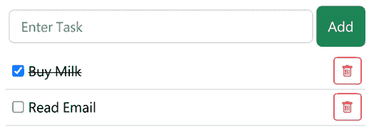

图 11.2：任务管理器项目

此项目的构建时间大约为 60 分钟。

## 项目概述

将使用 Microsoft 的 **Blazor WebAssembly App Empty** 项目模板创建 `TaskManager` 项目，以创建一个托管 Blazor WebAssembly 项目。首先，我们将添加一个 `TaskItem` 类和一个 `TaskItemsController` 类。接下来，我们将使用 `Entity Framework` 迁移在 SQL Server 中创建数据库。我们将向项目中添加 `Bootstrap` 和 `Bootstrap icons` 以样式化我们的 UI。最后，我们将演示如何使用 `HttpClient` 服务读取数据、更新数据、删除数据和添加数据。

## 创建 TaskManager 项目

我们需要创建一个新的托管 Blazor WebAssembly 应用程序。我们这样做如下：

1.  打开 Visual Studio 2022。

1.  点击 **创建新项目** 按钮。

1.  按下 *Alt*+*S* 进入 **搜索模板** 文本框。

1.  输入 `Blazor` 并按 *Enter* 键。

    以下截图显示了 **Blazor WebAssembly App Empty** 项目模板：

    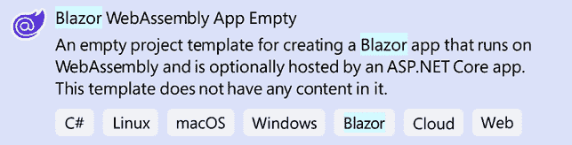

    图 11.3：Blazor WebAssembly App Empty 项目模板

1.  选择 **Blazor WebAssembly App Empty** 项目模板并点击 **下一步** 按钮。

1.  在 **项目名称** 文本框中输入 `TaskManager` 并点击 **下一步** 按钮。

    这是配置我们新项目的对话框截图：

    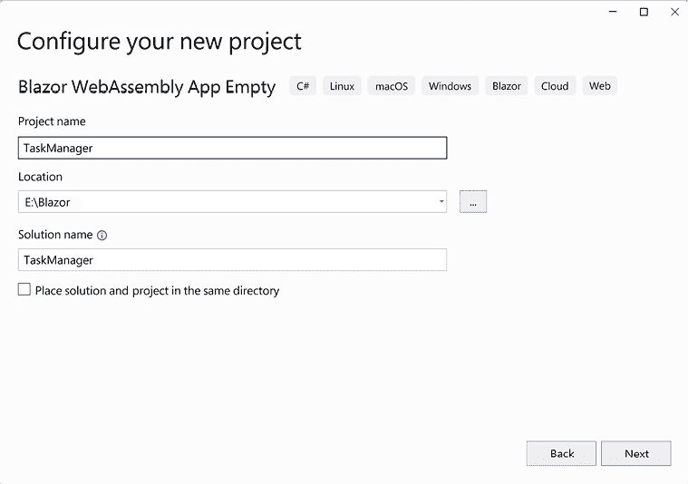

    图 11.4：配置新项目对话框

    **提示**

    在前面的示例中，我们将 `TaskManager` 项目放置在 `E:/Blazor` 文件夹中。然而，此项目的位置并不重要。

1.  选择 **.NET 7.0** 作为要使用的 `Framework` 版本。

1.  勾选**配置为 HTTPS**复选框。

1.  勾选**ASP.NET Core 托管**复选框。

1.  取消勾选**渐进式 Web 应用**复选框。

    这是用于收集有关我们新项目附加信息的对话框截图：

    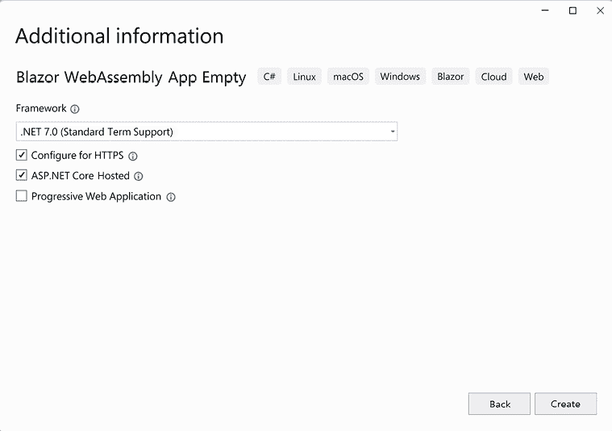

    图 11.5：附加信息对话框

1.  点击**创建**按钮。

    我们已创建一个托管的**TaskManager** Blazor WebAssembly 项目。

    **TaskManager**解决方案包含三个不同的项目。以下 Visual Studio 的**解决方案资源管理器**截图显示了解决方案中的三个项目：

    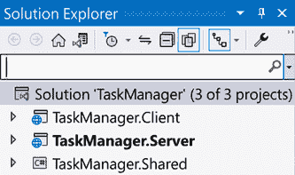

    图 11.6：解决方案资源管理器

1.  右键点击**TaskManager.Server**项目，从菜单中选择**设置为启动项目**选项。

我们已创建**TaskManager**解决方案并将**TaskManager.Server**项目设置为启动项目。现在我们需要向**TaskManager.Shared**项目添加一个共享类。

## 添加 TaskItem 类

我们需要添加`TaskItem`类。我们这样做如下：

1.  右键点击**TaskManager.Shared**项目，从菜单中选择**添加**，**类**选项。

1.  将新类命名为`TaskItem`。

1.  点击**添加**按钮。

1.  通过添加`public`修饰符使类公开：

    ```cs
    **public** class TaskItem 
    ```

1.  向`TaskItem`类添加以下属性：

    ```cs
    public int TaskItemId { get; set; }
    public string? TaskName { get; set; }
    public bool IsComplete { get; set; } 
    ```

1.  从**构建**菜单中选择**构建解决方案**选项。

我们已添加了`TaskItem`类。接下来，我们需要为`TaskItem`类添加一个`API 控制器`。`API 控制器`将处理来自 Blazor WebAssembly 客户端的传入 HTTP 请求，并将响应发送回它。

## 添加 TaskItem API 控制器

我们需要添加一个`TaskItemsController`类。我们这样做如下：

1.  右键点击**TaskManager.Server**项目，从菜单中选择**添加**，**新建文件夹**选项。

1.  将新文件夹命名为`Controllers`。

1.  右键点击`TaskManager.Server.Controllers`文件夹，从菜单中选择**添加**，**控制器**选项。

1.  选择**使用 Entity Framework 添加具有操作的 API 控制器**选项：

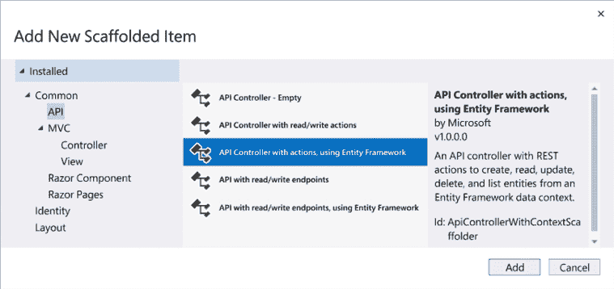

图 11.7：添加新模板项对话框

1.  点击**添加**按钮。

1.  将**模型类**设置为**TaskItem (TaskManager.Shared)**。

1.  点击**添加数据上下文**按钮以打开**添加数据上下文**对话框：

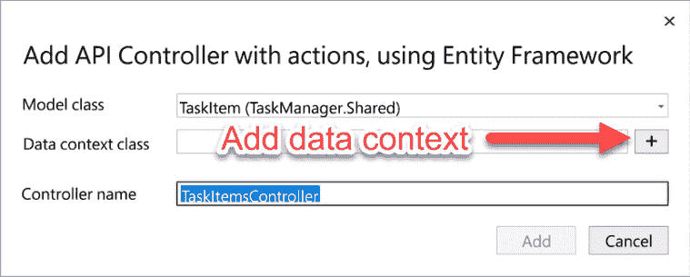

图 11.8：添加 API 控制器（使用 Entity Framework）对话框

1.  点击**添加**按钮以接受默认值。

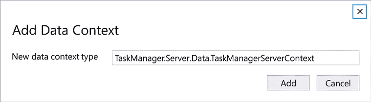

图 11.9：添加数据上下文对话框

1.  在**添加 API 控制器（使用 Entity Framework）**对话框中点击**添加**按钮。

我们已经创建了`TaskItemsController`类。现在我们需要设置 SQL Server。

## 设置 SQL Server

我们需要在 SQL Server 上创建一个新的数据库并添加一个包含任务的表。我们这样做如下：

1.  打开`TaskManager.Server/appsettings.json`文件。

1.  将连接字符串更新为以下内容：

    ```cs
    "ConnectionStrings": {
      "TaskManagerServerContext": "Server={Server name}; Database=TaskManager; Trusted_Connection=True; Encrypt=False;"
    } 
    ```

1.  将`{服务器名称}`占位符替换为你的 SQL Server 名称。

**重要提示**

虽然我们使用的是 SQL Server 2022 Express，但对于这个项目来说，你使用什么版本的 SQL Server 都无关紧要。

1.  从**工具**菜单中选择**NuGet 包管理器**，**包管理控制台**选项。

1.  在**包管理控制台**中，使用下拉列表将**默认项目**更改为**TaskManager.Server**。

1.  在**包管理控制台**中执行以下命令：

    ```cs
    Add-Migration Init
    Update-Database 
    ```

    前面的命令使用`Entity Framework`迁移来更新 SQL Server。

1.  从**视图**菜单中选择**SQL Server 对象资源管理器**。

1.  如果你没有看到用于此项目的 SQL Server 实例，请单击**添加 SQL Server**按钮来连接它：

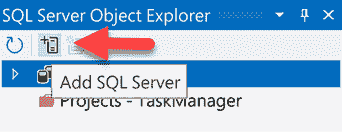

图 11.10：SQL Server 对象资源管理器

1.  导航到**任务管理器**数据库。

    **提示**

    如果你没有在**数据库**下看到**TaskManager**数据库，请右键单击**数据库**并选择**刷新**选项。

1.  导航到**任务管理器**，**表格**，**dbo.TaskItem**：

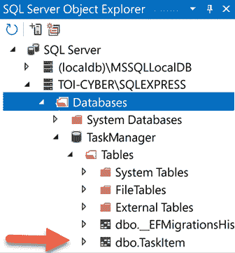

图 11.11：TaskManager 数据库

1.  右键单击**dbo.TaskItem**并选择**查看数据**选项。

1.  通过完成**任务名称**字段并将**IsComplete**字段设置为**False**来输入几个任务：

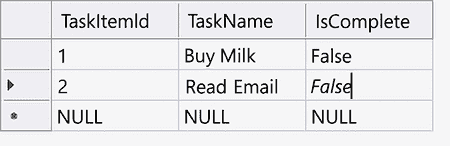

图 11.12：示例数据

1.  按*Ctrl*+*F5*键以无调试模式启动应用程序。

1.  将`/api/taskitems`添加到地址栏并按*Enter*键。

    以下截图显示了`TaskItemsController`返回的 JSON：

    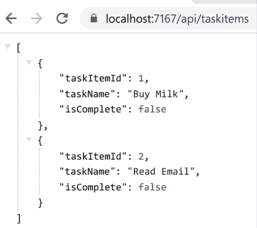

    图 11.13：TaskItem API 控制器返回的 JSON

1.  关闭浏览器。

我们已经证明`TaskItemsController`可以工作。现在我们可以开始工作在`TaskManager.Client`项目上了。我们将使用`Bootstrap`来美化我们的 UI，并使用`Bootstrap icons`在删除按钮上提供垃圾桶图像。

## 安装 Bootstrap

我们需要在我们的 Web 应用中安装`Bootstrap`和`Bootstrap icons`。我们这样做如下：

1.  返回 Visual Studio。

1.  按*Ctrl*+*Alt*+*L*键查看**解决方案资源管理器**。

1.  右键单击`TaskManager.Client/wwwroot/css`文件夹，从菜单中选择**添加**，**客户端库**选项。

1.  在**库**搜索文本框中输入`bootstrap`并按*Enter*键。

1.  选择**选择特定文件**。

1.  如以下截图所示，仅选择 **css** 文件：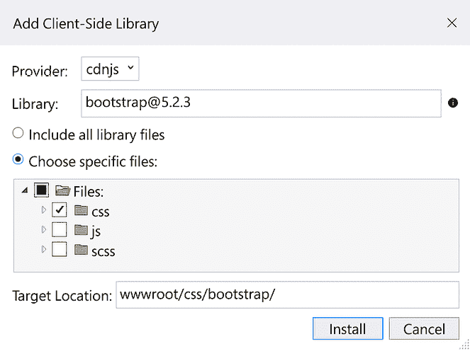

    图 11.14：添加客户端库对话框

    **提示**

    尽管前面的截图选择了 Bootstrap 的 5.2.3 版本，但你可以使用任何版本的 Bootstrap 5 来完成此项目。

1.  点击 **安装** 按钮。

    **重要提示**

    安装 `Bootstrap` 后，将在 `wwwroot/css` 文件夹中添加一个新文件夹。这个新文件夹包含 `Bootstrap` 所需的所有 CSS 文件。在本项目中，我们只将使用 `bootstrap.min.css` 文件。

1.  打开 `TaskManager.Client/wwwroot/index.html` 文件。

1.  在链接到 `css/app.css` 样式表的 `head` 元素之前添加以下标记：

    ```cs
    <link href="css/bootstrap/css/bootstrap.min.css" 
            rel="stylesheet" /> 
    ```

1.  右键点击 `TaskManager.Client/wwwroot/css` 文件夹，从菜单中选择 **添加，客户端库** 选项。

1.  在 **库** 搜索文本框中输入 `bootstrap-icons` 并按 *Enter* 键。

1.  选择 **选择特定文件**。

1.  如以下截图所示，仅选择 **字体** 文件：

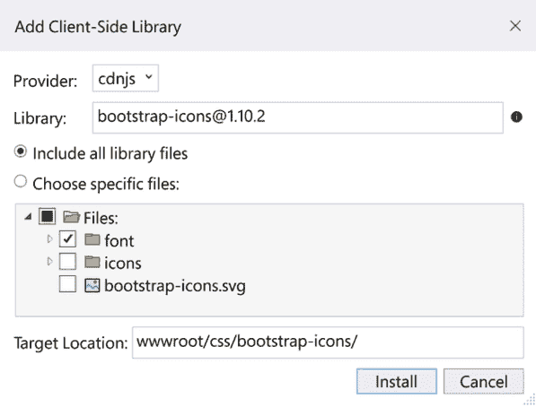

图 11.15：添加客户端库对话框

1.  打开 `TaskManager.Client/wwwroot/index.html` 文件。

1.  在链接到 `css/app.css` 样式表的 `head` 元素之前添加以下标记：

    ```cs
    <link href="css/bootstrap-icons/font/bootstrap-icons.css"
          rel="stylesheet" /> 
    ```

我们已安装了 `Bootstrap` 和 `Boostrap icons`。现在我们将更新 **主页** 以显示存储在 SQL Server 中的任务。

## 显示任务

我们需要获取任务列表并将其显示给用户。我们这样做如下：

1.  右键点击 `TaskManager.Client.Pages` 文件夹，从菜单中选择 **添加**，**类** 选项。

1.  将新类命名为 `Index.razor.cs`。

1.  点击 **添加** 按钮。

1.  将 `partial` 修饰符添加到类中。

    ```cs
    public **partial** class Index 
    ```

1.  添加以下 `using` 语句：

    ```cs
    using Microsoft.AspNetCore.Components; 
    ```

1.  将以下属性添加到 `Index` 类中：

    ```cs
    [Inject] public HttpClient Http { get; set; } 
    ```

    前面的代码将 `HttpClient` 服务注入到组件中。

1.  将以下代码添加到 `Index` 类中：

    ```cs
    private IList<TaskItem>? tasks;
    private string? error;
    protected override async Task OnInitializedAsync()
    {
        try
        {
            string requestUri = "api/TaskItems";
            tasks =
                await Http.GetFromJsonAsync<IList<TaskItem>>
                (requestUri);
        }
        catch (Exception)
        {
            error = "Error Encountered";
        };
    } 
    ```

    前面的代码使用 `GetFromJsonAsync` 方法返回 `TaskItem` 对象的集合。

1.  确认 Visual Studio 已自动添加以下 `using` 语句：

    ```cs
    using System.Net.Http.Json;
    using TaskManager.Shared; 
    ```

1.  打开 `TaskManager.Client.Pages/Index.razor` 页面。

1.  删除 `h1` 元素。

1.  添加以下 `@if` 语句：

    ```cs
    @if (tasks == null)
    {
        <p><em>Loading...</em></p>
    }
    else
    {
        @foreach (var taskItem in tasks)
        {
        }
    } 
    ```

    前面的标记在 `tasks` 的值为 `null` 时显示加载消息。否则，它将遍历 `tasks` 中 `TaskItem` 对象的集合。

1.  在 `@foreach` 循环中添加以下标记：

    ```cs
    <div class="d-flex col-md-6 mx-auto border-bottom" 
        @key="taskItem">
        <div class="p-2 flex-fill">
            <input type="checkbox"
                checked="@taskItem.IsComplete" />
            <span>
                @taskItem.TaskName
            </span>
        </div>
        <div class="p-1">
            <button type="button" 
                    class="btn btn-outline-danger btn-sm" 
                    title="Delete task"> 
                <span class="bi bi-trash"></span>
            </button>
        </div>
    </div> 
    ```

    前面的标记为每个 `TaskItem` 类显示一个复选框、`TaskName` 字段和一个删除按钮。

1.  按 *Ctrl*+*F5* 启动应用程序，不进行调试。

    以下是一个 **主页** 的截图：

    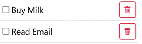

    图 11.16：任务列表

我们已经在 **主页** 上添加了一个任务列表，但点击复选框或 **删除** 按钮时没有任何反应。接下来，我们需要允许用户标记任务为完成。

## 完成任务

我们将允许用户通过点击任务名称旁边的复选框来标记任务为完成。我们这样做如下：

1.  返回 Visual Studio。

1.  右键点击 `TaskManager.Client`/`Pages` 文件夹，从菜单中选择 **添加**，**新建项** 选项。

1.  在 **搜索** 框中输入 `css`。

1.  选择 **样式表**。

1.  将文件命名为 `Index.razor.css`。

1.  点击 **添加** 按钮。

1.  将默认文本替换为以下样式：

    ```cs
    .completed-task {
        text-decoration: line-through;
    } 
    ```

    上述样式将渲染一个穿过 `completed-task` 类任务的线条。

1.  打开 `TaskManager.Client/wwwroot/index.html` 文件。

1.  取消注释以下链接元素：

    ```cs
    <link href="TaskManager.Client.styles.css" 
          rel="stylesheet" /> 
    ```

1.  打开 `Index.razor` 文件。

1.  更新用于显示任务名称的 `span` 元素如下：

    ```cs
    <span 
       class="@((taskItem.IsComplete? "completed-task" : ""))">
       @taskItem.TaskName
    </span> 
    ```

    上述标记将在任务通过勾选与任务关联的复选框完成时，将 `span` 元素的类设置为 `completed-task`。

1.  向复选框类型的 `input` 元素添加以下标记：

    ```cs
    @onchange="@(()=>CheckboxChecked(taskItem))" 
    ```

1.  打开 `TaskManager.Client.Pages/Index.razor.cs` 文件。

1.  添加以下 `CheckboxChecked` 方法：

    ```cs
    private async Task CheckboxChecked(TaskItem task)
    {
        task.IsComplete = !task.IsComplete;
        string requestUri = $"api/TaskItems/{task.TaskItemId}";
        var response =
            await Http.PutAsJsonAsync<TaskItem>
            (requestUri, task);
        if (!response.IsSuccessStatusCode)
        {
            error = response.ReasonPhrase;
        };
    } 
    ```

    上述代码使用 `PutAsJsonAsync` 方法更新指定的 `TaskItem` 类。

1.  按 *Ctrl*+*F5* 以无调试模式启动应用程序。

1.  通过点击旁边的复选框标记其中一个任务为完成。

    以下截图显示了一个已完成的任务：

    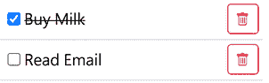

    图 11.17：完成的任务

1.  返回 Visual Studio。

1.  选择 **dbo.TaskItem [数据]** 选项卡。

1.  点击 *Shift*+*Alt*+*R* 来刷新数据。

1.  验证标记为完成的 `TaskItem` 的 **IsComplete** 字段是否已更新为 **True**。

当用户勾选任务旁边的复选框时，UI 将更新，SQL Server 数据库也将更新。接下来，我们需要添加删除任务的功能。

## 删除任务

我们需要允许用户删除任务。我们这样做如下：

1.  打开 `Index.razor` 文件。

1.  通过添加高亮代码更新 `button` 元素如下：

    ```cs
    <button type="button" 
            class="btn btn-outline-danger btn-sm"
            title="Delete task" 
            **@****onclick****=****"@(()=>DeleteTask(taskItem))"****>**
        <span class="bi bi-trash"></span>
    </button> 
    ```

1.  打开 `TaskManager.Client.Pages/Index.razor.cs` 文件。

1.  添加以下 `DeleteTask` 方法：

    ```cs
    private async Task DeleteTask(TaskItem taskItem)
    {
        tasks!.Remove(taskItem);
        StateHasChanged();
        string requestUri = 
            $"api/TaskItems/{taskItem.TaskItemId}";
        var response = await Http.DeleteAsync(requestUri);
        if (!response.IsSuccessStatusCode)
        {
            error = response.ReasonPhrase;
        };
    } 
    ```

    上述代码使用 `Http.DeleteAsync` 方法删除指定的 `TaskItem` 类。

1.  按 *Ctrl*+*F5* 以无调试模式启动应用程序。

1.  点击带有垃圾箱图标的按钮来删除一个任务。

1.  返回 Visual Studio。

1.  选择 **dbo.TaskItem [数据]** 选项卡。

1.  点击 *Shift*+*Alt*+*R* 来刷新数据。

1.  验证 `TaskItem` 是否已被删除。

我们已经添加了删除任务的功能。现在我们需要添加添加新任务的功能。

## 添加新任务

我们需要提供一个让用户添加新任务的方法。我们这样做如下：

1.  打开 `Index.razor` 文件。

1.  在 `@foreach` 循环之前添加以下标记：

    ```cs
    <div class="d-flex col-md-6 mx-auto py-2">
        <input type="text" 
               class="form-control m-1" 
               placeholder="Enter Task" @bind="newTask" />
        <button type="button" class="btn btn-success"
            @onclick="AddTask">
            Add
        </button>
    </div> 
    ```

1.  打开 `TaskManager.Client.Pages/Index.razor.cs` 文件。

1.  添加以下字段：

    ```cs
    private string? newTask; 
    ```

1.  添加以下 `AddTask` 方法：

    ```cs
    private async Task AddTask()
    {
        if (!string.IsNullOrWhiteSpace(newTask))
        {
            TaskItem newTaskItem = new TaskItem
            {
                TaskName = newTask,
                IsComplete = false
            };
            tasks!.Add(newTaskItem);
            string requestUri = "api/TaskItems";
            var response =
                await Http.PostAsJsonAsync
                (requestUri, newTaskItem);
            if (response.IsSuccessStatusCode)
            {
                newTask = string.Empty;
            }
            else
            {
                error = response.ReasonPhrase;
            };
        };
    } 
    ```

    上述代码使用 `PostAsJsonAsync` 方法创建一个新的 `TaskItem` 类。

1.  按 *Ctrl*+*F5* 以无调试模式启动应用程序。

1.  添加几个新任务。

1.  返回 Visual Studio。

1.  选择 **dbo.TaskItem [数据]** 选项卡。

1.  按 *Shift*+*Alt*+*R* 刷新数据。

1.  验证新任务是否已添加到 SQL Server 数据库中。

我们已经添加了用户添加新任务的功能。

# 摘要

现在，您应该能够创建一个托管 Blazor WebAssembly 应用程序，该程序使用 ASP.NET Web API 更新 SQL Server 数据库中的数据。

在本章中，我们介绍了托管 Blazor WebAssembly 应用程序、`HttpClient` 服务以及用于读取、创建和更新数据的 JSON 辅助方法。我们还演示了如何使用 `HttpClient.DeleteAsync` 方法删除数据。

之后，我们使用 Microsoft 的 **Blazor WebAssembly App Empty** 项目模板创建了一个托管 Blazor WebAssembly 应用程序。我们将 `TaskItem` 类添加到 `TaskManager.Shared` 项目中，并将 `TaskItem API 控制器` 添加到 `TaskManager.Server` 项目中。接下来，我们通过更新数据库的连接字符串和使用 `Entity Framework` 迁移来配置 SQL Server。为了增强 UI，我们添加了 `Bootstrap` 和 `Bootstrap icons`。最后，我们使用 `HttpClient` 服务读取任务列表、更新任务、删除任务以及添加新任务。

我们可以将我们的新技能应用于创建一个作为多项目解决方案一部分的托管 Blazor WebAssembly 应用程序，并使用 ASP.NET Web API 读取、创建、更新和删除数据。

在下一章中，我们将使用 `EditForm` 组件构建一个支出跟踪器。

# 问题

以下问题供您参考：

1.  使用托管 Blazor WebAssembly 项目与独立 Blazor WebAssembly 项目相比有哪些好处？

1.  HTTP GET、HTTP POST 和 HTTP PUT 之间有什么区别？

1.  在我们的项目中，我们如何通过使用 `PostAsJsonAsync` 方法创建的 `TaskItem` 获取 `TaskItemId`？

1.  您能否直接从 Visual Studio 中添加、编辑和删除 SQL Server 数据库中的数据？

# 进一步阅读

以下资源提供了有关本章涵盖主题的更多信息：

+   有关 `HttpClient` 类的更多信息，请参阅 [`learn.microsoft.com/en-us/dotnet/api/system.net.http.httpclient`](https://learn.microsoft.com/en-us/dotnet/api/system.net.http.httpclient)。

+   有关从 Blazor WebAssembly 调用 Web API 的更多信息，请参阅 [`learn.microsoft.com/en-us/aspnet/core/blazor/call-web-api`](https://learn.microsoft.com/en-us/aspnet/core/blazor/call-web-api)。

+   如需了解使用 `System.Text.Json` 执行序列化和反序列化操作的扩展方法，请参阅 [`learn.microsoft.com/en-us/dotnet/api/system.text.json`](https://learn.microsoft.com/en-us/dotnet/api/system.text.json)。

+   如需了解有关 `Entity Framework` 的更多信息，请参阅 [`learn.microsoft.com/en-us/ef`](https://learn.microsoft.com/en-us/ef)。

+   如需了解有关 `Bootstrap` 的更多信息，请参阅 [`getbootstrap.com`](https://getbootstrap.com)。
