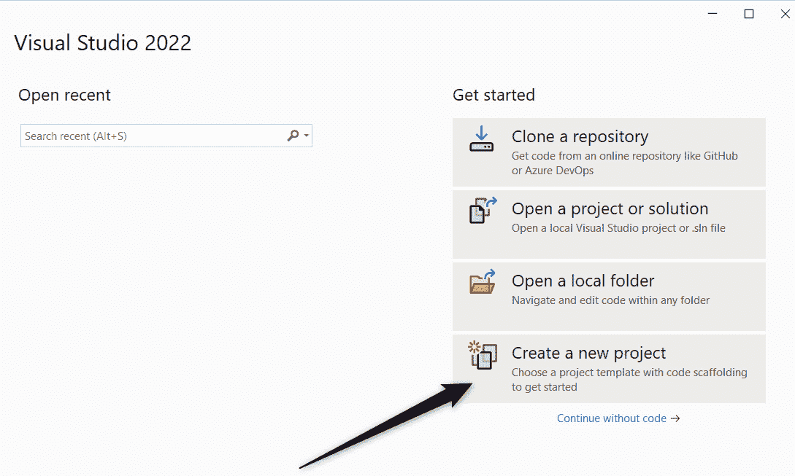
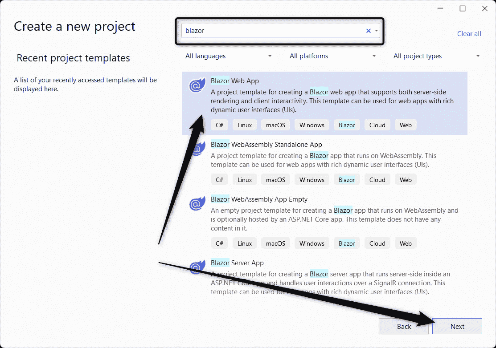
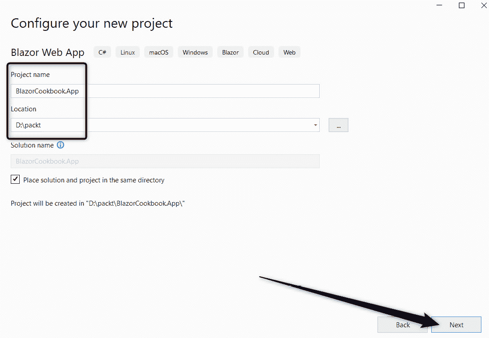
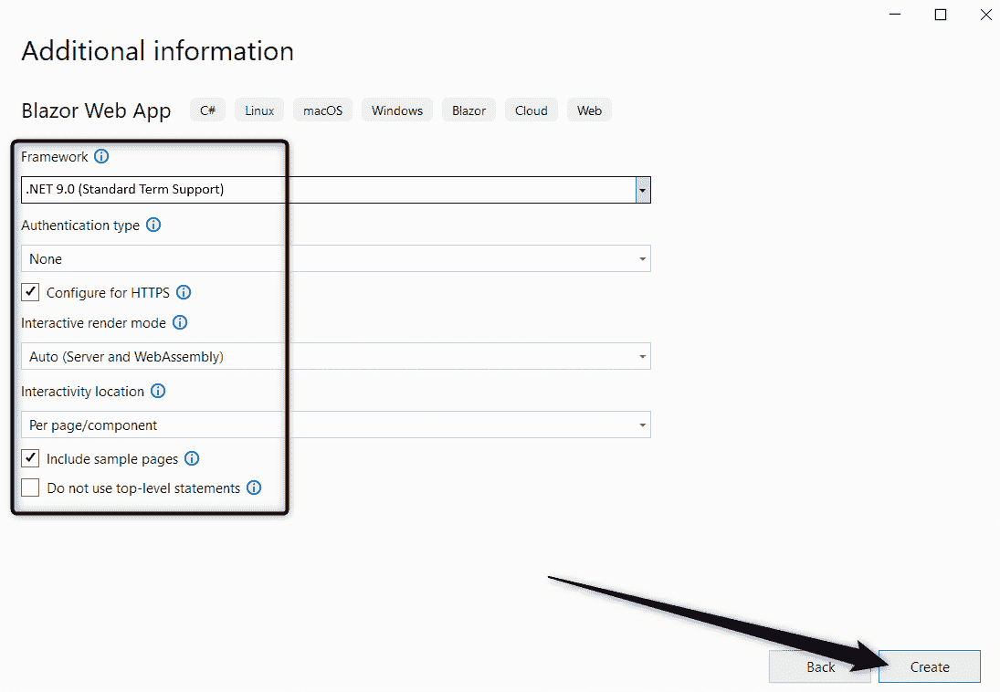
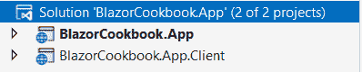
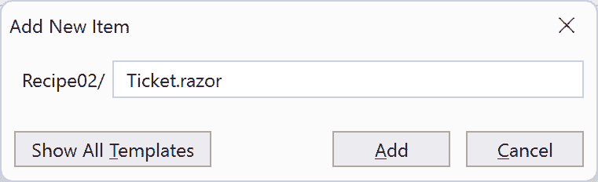
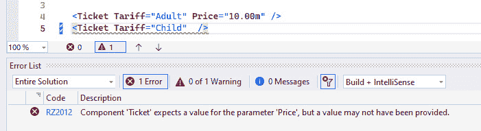
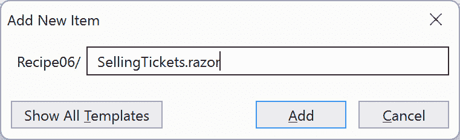
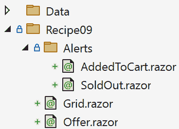

# 与基于组件的架构一起工作

欢迎使用**Blazor Web Development Cookbook**。本书将成为您在 Blazor 中构建动态和可扩展 Web 应用的全面指南。它提供了一系列实用解决方案和技术，用于应对 Web 开发中最常见的挑战。在每一章中，我们将深入研究应用开发的各个领域。本书包含详细的示例和可操作的建议。我们将探讨一系列主题——从优化组件，到管理**应用程序状态**，再到提高您应用程序的交互性和安全性。拥有这样的资源将使您能够提高开发速度，并专注于满足业务需求。

在本章中，您将了解 Blazor 中基于组件架构的核心原则。我们将从创建一个基本的**组件**开始，并逐步过渡到更复杂的方面，如参数化以提高可重用性和处理必需参数。我们还将探讨高级主题，例如使用可定制内容的组件构建、实现泛型组件以及通过**DynamicComponent**增加**松耦合**。

到本章结束时，您将能够实现和优化**Blazor**中的组件。理解**基于组件的架构**是构建更复杂、交互性和响应性 Web 应用的基础。它对于编写可扩展、可维护和可重用的代码也是必不可少的。

我们将在本章中介绍以下食谱：

+   初始化项目

+   创建您的第一个基本组件

+   在组件上声明参数

+   在运行时检测渲染模式

+   确保参数是必需的

+   使用**CascadingParameter**从父组件传递值

+   创建具有可定制内容的组件

+   使组件泛型

+   使用**DynamicComponent**解耦组件

# 技术要求

您不需要任何付费工具或附加组件来开始您的 Blazor 之旅。为了帮助您，我们决定限制本书中食谱的依赖项。您可以在需要时独立选择任何主题。

对于本章，您需要以下内容：

+   一个现代 IDE。我们将使用 Visual Studio 17.12.0，但任何其他支持.NET 9 开发的 IDE 也是可以的。

+   一个现代网络浏览器。

+   .NET 9 SDK。如果它不是您 IDE 安装的一部分，您可以从[`dotnet.microsoft.com/en-us/download/dotnet/9.0`](https://dotnet.microsoft.com/en-us/download/dotnet/9.0) 获取。

您可以在 GitHub 上找到本章的所有代码示例：[`github.com/PacktPublishing/Blazor-Web-Development-Cookbook/tree/main/BlazorCookbook.App.Client/Chapters/Chapter01`](https://github.com/PacktPublishing/Blazor-Web-Development-Cookbook/tree/main/BlazorCookbook.App.Client/Chapters/Chapter01) 。

# 初始化项目

使用 .NET 9，.NET 团队专注于提高 Blazor 应用程序的质量、稳定性和性能。幸运的是，在 .NET 8 和 .NET 9 之间没有破坏性更改，因此您可以安全地提高应用程序的目标框架。然而，在 .NET 8 中，Blazor 获得了全新的解决方案类型和渲染体验，因此我们将在此处回顾初始化新项目所需的步骤。

让我们初始化一个具有按组件渲染范围的 **Blazor Web App**。这是一个战略选择，因为它使我能够在探索不同领域的 Web 开发时突出显示各种渲染模式的注意事项。

## 准备工作

在本食谱中，我们将展示使用 Visual Studio 提供的图形用户界面初始化项目。因此，启动您的 IDE 并开始操作。

如果您在环境中使用 **.NET CLI**，我将在 *更多...* 部分提供等效的命令。

## 如何操作...

执行以下步骤以初始化 Blazor Web App 项目：

1.  启动 Visual Studio 并从欢迎窗口中选择 **创建新项目**：



图 1.1：导航到项目创建面板

1.  使用下一面板顶部的搜索栏缩小可用的项目类型列表，选择 **Blazor Web App**，并通过点击 **下一步** 确认您的选择：



图 1.2：从可用的项目类型中选择 Blazor Web App

1.  在 **配置您的新的项目** 面板上，定义项目的名称和位置，并通过点击 **下一步** 确认这些详细信息：



图 1.3：设置新项目的名称和位置

1.  在 **附加信息** 面板上，选择以下选项：

    +   **.NET 9.0（标准术语支持）** 在 **框架** 下

    +   **自动（服务器和 WebAssembly）** 在 **交互** **渲染模式** 下

    +   **按页面/组件** 在 **交互位置** 下

    此外，勾选 **包含示例页面** 复选框。通过点击 **创建** 确认您的选择：



图 1.4：配置项目的框架和交互性

您的初始解决方案结构将如下所示：



图 1.5：初始项目结构

## 它是如何工作的...

在**步骤 1**中，我们启动了 Visual Studio，并从欢迎菜单中选择**创建新项目**选项。由于 Visual Studio 预装了许多项目模板，在**步骤 2**中，我们利用面板顶部的搜索栏，通过搜索**blazor**关键字，我们快速从结果列表中找到了并选择了**Blazor Web App**。然后，我们通过点击**下一步**按钮进入下一阶段。在**步骤 3**中，我们定义了项目名称和位置。对于这本书，我选择了**BlazorCookbook.App**和**D:\packt**。我们通过点击**下一步**按钮继续设置过程。

在**步骤 4**中，我们配置了项目。考虑到我们将专注于.NET 9 中的 Blazor，我们从**框架**下拉菜单中选择了**.NET 9.0 (标准支持期)**。然后，我们从**交互式渲染模式**下拉菜单中为我们的应用程序选择了一个**渲染模式**。使用**无**选项，我们有效地表明 Blazor 应使用**服务器端渲染**（**SSR**）模式。SSR 是渲染速度最快的模式，因为标记是在服务器上静态生成的，但提供的交互性有限或没有。当我们期望交互性时，我们必须从交互式模式中选择。在这里，**服务器**（在代码中表示为**InteractiveServer**）在服务器上渲染组件，并通过**SignalR**连接管理 UI 交互，允许动态内容更新，同时将组件逻辑保持在服务器端。或者，**WebAssembly**（**InteractiveWebAssembly**）直接在浏览器中使用**WebAssembly**渲染组件，便于实现无需服务器通信即可更新 UI 的完全交互式体验。最后，使用**自动（服务器和 WebAssembly）**选项（**InteractiveAuto**），我们让 Blazor 根据当前环境状态和网络条件选择最佳的渲染方法。我们想探索各种渲染模式的行为，因此**自动（服务器和 WebAssembly）**对我们来说是最好的选项。对于**交互性位置**，我们选择了**每页/组件**，这样我们就可以在组件级别定义渲染模式，而不是选择**全局**，这将在整个项目中设置渲染模式。我们还勾选了**包含示例页面**复选框以触发基本布局和 CSS 的生成。我们故意将**身份验证类型**设置为**无**，以避免不必要的复杂性，尽管我们计划在*第八章*中重新访问身份验证。我们通过点击**创建**按钮最终完成了项目创建过程。

在此阶段，您应该看到初始项目结构。如果您发现有两个项目，**BlazorCookbook.App** 和 **BlazorCookbook.App.Client**，这是正确的。在这里，**BlazorCookbook.App** 代表我们应用程序的服务器端组件，而 **BlazorCookbook.App.Client** 是客户端部分，它编译成 WebAssembly 代码。放置在 **BlazorCookbook.App.Client** 中的所有内容都将传输到用户的浏览器，因此您不应将其中的任何敏感或机密信息放置在那里。由于 **BlazorCookbook.App** 引用了 **BlazorCookbook.App.Client**，因此无论最初如何渲染，都不需要重复代码。

## 更多内容...

如果您的 IDE 没有类似于 Visual Studio 的 GUI，您可以使用跨平台的 .NET CLI。导航到您的工作目录，并运行以下命令以使用与 *步骤 4* 中概述的相同配置初始化一个 Blazor Web App 项目：

```cs
dotnet new blazor -o BlazorCookbook.App -int Auto --framework net9.0
```

# 创建第一个基本组件

组件是一个独立的用户界面（**UI**）块。在 Blazor 中，组件是一个具有标记的 .NET 类，以 **Razor**（**.razor**）文件的形式创建。在 Blazor 中，组件是任何应用程序的主要构建块，封装了标记、逻辑和样式。它们使代码可重用，并提高了代码的可维护性和可测试性。这种模块化方法极大地简化了开发过程。

对于我们的第一个组件，我们将创建一个 **Ticket** 组件，当用户导航到页面时，它会渲染一个运费名称和价格。

## 准备工作

在您开始创建第一个组件之前，在您的 Blazor 项目中创建一个 **Recipe02** 目录——这将成为您的工作目录。

## 如何操作...

按照以下步骤创建您的第一个组件：

1.  导航到您刚刚创建的 **Recipe02** 目录。

1.  使用 **添加新项目** 功能创建一个 Razor 组件：



图 1.6：添加新的 Razor 组件提示

1.  在 **Ticket** 组件中，添加支持 HTML 标记：

    ```cs
    <div class="ticket">
        <div class="name">Adult</div>
        <div class="price">10.00 $</div>
    </div>
    ```

1.  添加一个新的 **Offer** 组件。使用 **@page** 指令使其可导航，并在其中渲染 **Ticket** 组件：

    ```cs
    @page "/ch01r02"
    <Ticket />
    ```

## 它是如何工作的...

在**步骤 1**中，我们导航到**Recipe02** – 我们的工作目录。在**步骤 2**中，我们利用内置的 Visual Studio 提示创建文件并创建了第一个组件：**Ticket**。在构建使用 Razor 标记语法组件的过程中，我们命名了组件文件为 **Ticket.razor**。在**步骤 3**中，我们在**Ticket**中添加了简单的标记 – 我们渲染了**Adult**和**10.00 $**，这些描述了一个给定的票。在**步骤 4**中，我们创建了我们的第一个页面 – **Offer**页面。在 Blazor 中，任何组件都可以通过**@page**指令的帮助成为一个页面，该指令需要一个以**/**开头的固定路径参数。**@page "/ch01r02"**指令允许导航到该组件。在**Offer**标记中，我们使用**自闭合标签**语法嵌入**Ticket** – 这是显式打开和关闭标签（**<Ticket></Ticket>**）的更简单、更方便的等效方式。然而，我们只能在组件不需要渲染任何额外内容时使用它。

## 更多...

虽然 Blazor 中的组件化提供了许多好处，但了解何时以及如何使用它是至关重要的。组件是重用各种数据对象的表示标记的绝佳方式。它们显著提高了代码的可读性和可测试性。然而，需要谨慎 – 你可能会过度组件化。使用过多的组件会导致反射开销增加和管理渲染模式的不必要复杂性。当你重构网格或表单时，这尤其容易忽视。问问自己是否每个单元格都必须是一个组件，以及你是否需要封装该输入。始终权衡从更高的标记粒度中获得的好处与它带来的性能成本。

# 在组件上声明参数

在 Blazor 中，组件参数允许你将数据传递到组件中。这是使你的应用程序动态化的第一步。组件参数类似于传统编程中的方法参数。你可以利用相同的原始类型，以及引用和复杂类型。这导致代码灵活性、简化的 UI 结构和高度的标记重用性。

让我们创建一个参数化组件来表示票，这样我们就可以显示任何传入的运费和价格，而无需不必要的代码重复或标记不一致。

## 准备工作

在你深入组件参数化之前，请执行以下操作：

+   创建一个**Recipe03**目录 – 这将是你的工作目录

+   从**创建你的第一个基本组件**食谱复制**Ticket**组件，或者从本书 GitHub 存储库的**Chapter01** / **Recipe02**目录中复制其实现

## 如何操作...

要在组件中声明参数，请从以下基础步骤开始：

1.  在**Ticket**组件中，在**@** **code**块中声明参数：

    ```cs
    @code {
        [Parameter] public string Tariff { get; set; }
        [Parameter] public decimal Price { get; set; }
        [Parameter]
        public EventCallback OnAdded { get; set; }
    }
    ```

1.  修改**Ticket**标记，以便可以从参数渲染值：

    ```cs
    <div class="ticket">
        <div class="name">@Tariff</div>
        <div class="price">
            @(Price.ToString("0.00 $"))
        </div>
        <div class="ticket-actions">
            <button @onclick="@OnAdded">
                Add to cart
            </button>
        </div>
    </div>
    ```

1.  创建一个**Offer**页面，并增强它以便以**InteractiveWebAssembly**模式渲染：

    ```cs
    @page "/ch01r03"
    @rendermode InteractiveWebAssembly
    ```

1.  在**Offer**组件的功能指令下方，添加两个参数化的**Ticket**实例。实现一个**Add()**方法作为交互性的占位符：

    ```cs
    <Ticket Tariff="Adult" Price="10.00m"
            OnAdded="@Add" />
    <Ticket Tariff="Child" Price="5.00m"
            OnAdded="@Add" />
    @code {
        private void Add()
            => Console.WriteLine("Added to cart!");
    }
    ```

## 它是如何工作的...

在*步骤 1*中，我们通过一个**@code**块扩展了**Ticket**组件，Blazor 将其识别为 C#代码的容器。在这个**@code**块内部，我们使用了**Parameter**属性来标记可外部设置的属性，例如 C#中的方法参数。在我们的例子中，我们使用字符串作为票价，使用十进制表示价格。对于最后一个参数，我们使用了**EventCallback**类型。这是一个 Blazor 特定的**struct**，它携带一个可调用的操作，并具有额外的优势。当你更改 UI 状态时，你应该使用**StateHasChanged()**生命周期方法来通知 Blazor 发生了什么。按照设计，**EventCallback**会自动触发**StateHasChanged()**，所以你不会意外地省略它。在*步骤 2*中，我们根据使用**@**符号访问的参数值重新构建了**Ticket**标记。该符号向编译器发出信号，我们正在切换到动态 C#代码。如果你搭配圆括号，你还可以嵌入复杂的代码块，就像我们格式化价格时使用货币格式一样。

在*步骤 3*中，我们创建了一个可导航的**Offer**页面。这次，除了**@page**指令外，我们还声明了一个**@rendermode**指令，这允许我们控制组件的初始渲染方式。我们可以选择 Blazor Web App 支持的任何渲染模式，但由于我们预计页面会有一些交互性，我们选择了**InteractiveWebAssembly**模式。在*步骤 4*中，在**Offer**的**@code**块中，我们实现了一个**Add()**占位符方法，模拟将票添加到购物车。我们还实现了**Offer**标记，其中我们渲染了两个具有不同参数的**Ticket**实例。你传递参数的方式类似于标准 HTML 属性，如**class**或**style**。Blazor 会自动识别你正在调用的是一个组件，而不是一个 HTML 元素。最后，我们渲染了**Adult**和**Child**票，并将**Add()**方法附加到暴露的**EventCallback**参数上。

## 还有更多...

你必须意识到参数的数量可以直接影响渲染速度。这是因为渲染器使用反射来解析参数值。过度依赖反射会显著降低性能。你可以通过覆盖组件生命周期中的**SetParametersAsync()**方法来优化这个过程，尽管这是一个高级操作。相反，你应该专注于保持参数列表简洁或在必要时引入包装类。

在本章的早期部分，我们为组件声明了特定的渲染模式，当你的 Blazor 应用程序设置为在页面或组件级别期望交互性时。然而，当你全局启用交互性时，你仍然可以排除某些页面从交互路由中。你会发现这对于依赖于标准请求/响应周期或读取或写入 HTTP cookies 的页面很有用：

```cs
@attribute [ExcludeFromInteractiveRouting]
```

要在页面上强制执行静态服务器端渲染，你必须使用**@attribute**指令在页面的顶部添加**ExcludeFromInteractiveRouting**属性。在这种情况下，你不再添加**@rendermode**指令，因为它专门用于声明交互渲染模式。

# 在运行时检测渲染模式

了解你的组件在哪里以及如何渲染对于优化性能和定制用户体验至关重要。Blazor 允许你在运行时检测渲染位置、交互性和分配的渲染模式。你可以查询组件是否处于交互状态或只是预渲染。这些见解为调试、性能优化和构建能够动态适应其渲染上下文的组件开辟了新的可能性。

让我们隐藏**Offer**组件中的票据区域，以防止用户交互，例如将票据添加到购物车，直到组件准备就绪并具有交互性。

## 准备中

在你探索渲染模式检测之前，请执行以下操作：

+   创建一个**Recipe04**目录——这将是你的工作目录

+   从**在组件上声明参数**菜谱中复制**Offer**和**Ticket**组件，或者从本书 GitHub 存储库的**Chapter01** / **Recipe03**目录中复制它们的实现

## 如何操作...

按照以下步骤操作：

1.  导航到**Offer**组件并更新附加到**@page**指令的路径，以避免路由冲突：

    ```cs
    @page "/ch01r04"
    @rendermode InteractiveWebAssembly
    ```

1.  在组件指令下方添加一些条件标记，以根据**RendererInfo.IsInteractive**属性的值指示组件正在准备中：

    ```cs
    @if (!RendererInfo.IsInteractive)
    {
        <p>Getting ready...</p>
        return;
    }
    @* existing markup is obscured, but still down here *@
    ```

## 它是如何工作的...

在**步骤 1**中，我们导航到**Offer**组件并更新了分配给**@page**指令的路径。Blazor 不允许重复的路由，因此我们由于从**在组件上声明参数**菜谱中复制了**Offer**组件并带有路由而触发了冲突。

在**步骤 2**中，我们在组件指令下方引入了一个条件标记块。我们利用了**ComponentBase**类公开的**RendererInfo**属性，使我们能够跟踪组件的渲染状态。**RendererInfo**属性有两个属性：

+   **RendererInfo.Name**属性告诉我们组件当前正在哪里运行，并返回以下选项：

    +   **静态**：这表示组件正在服务器上运行，没有任何交互性

    +   **服务器**：这表示组件正在服务器上运行，并在完全加载后具有交互性

    +   **WebAssembly**：这表示组件在客户端浏览器中运行，并在加载后变得交互式

    +   **WebView**：这表示它是为.NET MAUI 和原生设备定制的

+   **RendererInfo.IsInteractive**属性显示组件是否处于交互状态（例如，在预渲染或静态 SSR 期间）

我们利用**RendererInfo.IsInteractive**属性来检测交互性是否就绪。如果没有就绪，我们显示**正在准备...**消息，通知用户他们应该等待。

# 确保参数是必需的

**EditorRequired**属性指示你的 IDE，向组件传递数据在功能上是关键的。此属性在编译时触发数据验证，创建一个快速反馈循环并提高代码质量。使用**EditorRequired**属性确保你或你的团队中的任何人都不会因为缺少参数而陷入错误。你可以通过跳过初始参数值验证来简化你的代码。使用**EditorRequired**属性可以使组件在整个应用程序中表现出稳健和可预测的行为。

让我们增强**Ticket**组件的参数，以便 Blazor 将它们视为必需的。你还将学习如何配置你的 IDE，以便你可以将任何缺少的必需参数标记为编译错误。

## 准备中

在设置必需参数之前，执行以下操作：

+   创建一个**Recipe05**目录 – 这将是你的工作目录

+   从上一个食谱复制**Ticket**和**Offer**组件，或者从本书 GitHub 仓库的**Chapter01** / **Recipe04**目录中复制它们的实现

## 如何做到...

通过以下步骤确保组件中的参数是必需的：

1.  导航到**Ticket**组件的**@code**块，并使用**EditorRequired**属性扩展参数的属性集合：

    ```cs
    @code {
        [Parameter, EditorRequired]
        public string Tariff { get; set; }
        [Parameter, EditorRequired]
        public decimal Price { get; set; }
        [Parameter]
        public EventCallback OnAdded { get; set; }
    }
    ```

1.  现在，导航到包含你的组件的项目中的**.csproj**文件。

1.  将**RZ2012**代码添加到**WarningsAsErrors**部分：

    ```cs
    <Project Sdk="Microsoft.NET.Sdk.Web">
      <PropertyGroup>
        <TargetFramework>net9.0</TargetFramework>
        <ImplicitUsings>enable</ImplicitUsings>
        <WarningsAsErrors>RZ2012</WarningsAsErrors>
      </PropertyGroup>
      <!-- ... -->
    </Project>
    ```

1.  在**Offer**标记中，通过从两个实例中移除**OnAdded**参数以及从第二个实例中移除**Price**参数来修改**Ticket**实例：

    ```cs
    <Ticket Tariff="Adult" Price="10.00m" />
    <Ticket Tariff="Child" />
    ```

1.  编译你的应用程序，以便你可以看到你的 IDE 标记省略但必需的**Price**参数：



图 1.7：IDE 将缺少 Price 参数视为编译错误

## 它是如何工作的...

在**步骤 1**中，我们增强了**票价**和**价格**参数的**票**组件的**EditorRequired**属性。这会提示您的 IDE 在编译期间期望这些值，并将默认情况下缺失的值标记为警告。我建议您提高严重性。在**步骤 2**中，您导航到您项目的**.csproj**文件。在这里，如**步骤 3**中概述的，您要么找到了它，要么添加了**WarningsAsErrors**部分，并包含了**RZ2012**代码。在**步骤 4**中，我们稍微修改了**报价**标记。我们从两个**票**实例中移除了**OnAdded**参数，并从其中一个实例中移除了**价格**参数。现在，任何编译尝试都将以错误结束，类似于**步骤 5**中显示的错误。这使得实际上不可能错过所需的分配并遇到相关的渲染错误。请注意，由于我们没有将**OnAdded**参数标记为**EditorRequired**属性，编译器将将其视为可选的，并允许跳过它。

# 使用 CascadingParameter 从父组件传递值

在 Web 应用程序中，跨多个组件共享参数是一个常见场景。它可以提高性能，因为数据可以共享，而不是每个组件都从外部源请求。它还简化了代码，尤其是在父子场景中。在 Blazor 中，这就是**级联参数**概念发挥作用的地方。其对应物，**级联值**，允许您提供在组件树中级联的值。这对组合使子组件能够接收和使用这些共享数据或状态。这种方法解决了通过组件层次结构传递信息而不需要复杂的管道或紧密耦合通信的挑战。

让我们实现一个**购物车**服务，并以级联方式向下传递，这样我们就可以在由**票**组件表示的报价区域内拦截它。我们还将渲染**购物车**摘要——完全解耦于**票**行为。

## 准备工作

在我们开始探索如何传递级联值之前，请执行以下操作：

+   创建一个**Recipe06**目录——这将是你的工作目录

+   从*确保参数是必需的*食谱中复制**票**组件，或者从本书 GitHub 存储库的**Chapter01** / **Recipe05**目录中复制其实现。

## 如何做...

按照以下步骤实现**级联参数**以实现值共享：

1.  添加一个**购物车**类并声明支持**内容**和**值**属性。扩展**购物车**，以便可以通过要求具有主要构造函数的回退**操作**属性来通过通信状态变化，并实现基本的**添加()**方法，该方法触发此通知：

    ```cs
    public class Cart(Action onStateHasChanged)
    {
        public List<string> Content { get; init; } = [];
        public decimal Value { get; private set; }
        public int Volume => Content.Count;
        public void Add(string tariff, decimal price)
        {
            Content.Add(tariff);
            Value += price;
            onStateHasChanged.Invoke();
        }
    }
    ```

1.  创建一个**SellingTickets**组件，以便我们可以出售我们的票：



图 1.8：添加新的 SellingTickets 组件

1.  使用 **@rendermode** 属性声明 **SellingTickets** 在 **InteractiveWebAssembly** 模式下运行，并使用 **@page** 指令启用路由：

    ```cs
    @page "/ch01r06"
    @rendermode InteractiveWebAssembly
    ```

1.  在 **SellingTickets** 的 **@code** 块中，声明 **Cart** 对象并在 **OnInitialized()** 生命周期方法中初始化它：

    ```cs
    @code {
        protected Cart Cart;
        protected override void OnInitialized()
        {
            Cart = new(() =>
                InvokeAsync(StateHasChanged));
        }
    }
    ```

1.  在 **SellingTickets** 标记中，添加带有 **Cart** 实例作为其值的 **CascadingValue** 包装器。在购物车操作范围内声明两个可售票，利用 **Ticket** 组件：

    ```cs
    <CascadingValue Value="Cart">
        <Ticket Tariff="Adult" Price="10.00m" />
        <Ticket Tariff="Child" Price="5.00m" />
    </CascadingValue>
    ```

1.  在 **SellingTickets** 标记的 **Cart** 区域下方，附加额外的标记以显示 **Cart** 摘要：

    ```cs
    <div class="cart-summary">
        <div class="cart-content">
            Items: @Cart.Volume
        </div>
        <div class="cart-value">Price: @Cart.Value</div>
    </div>
    ```

1.  导航到 **Ticket** 组件。在 **@code** 块中，声明 **CascadingParameter** 以便拦截 **Cart** 实例，并将 **OnAdded** 参数替换为 **Add()** 方法：

    ```cs
    @code {
        [CascadingParameter]
        public Cart Cart { get; set; }
        public void Add() => Cart.Add(Tariff, Price);
    }
    ```

1.  在 **Ticket** 标记中，替换 **@onclick** 按钮动作，以便执行新的 **Add()** 方法：

    ```cs
    <div class="ticket-actions">
        <button @onclick="@Add">Add to cart</button>
    </div>
    ```

## 它是如何工作的...

在 *步骤 1* 中，我们实现了 **Cart** 类。我们声明了一个 **Value** 属性来存储当前购物车价值，一个 **Content** 集合来存储添加的票价格。我们还实现了一个无参数的 **Volume** 方法来计算当前购物车中的票数量。然后，我们实现了一个 **Add()** 方法，除了正常的添加到购物车的逻辑外，还负责通过调用通过 **primary constructor** 模式传递的 **onStateHasChanged** 委托来将这些更改通知外部对象。这样，我们确保 **Cart** 初始化需要我们提供一个在状态更改时执行的操作。

在 *步骤 2* 中，我们创建了 **SellingTickets** 组件。在 *步骤 3* 中，我们将其声明为以 **InteractiveWebAssembly** 模式渲染，并利用 **@page** 指令启用路由。在 *步骤 4* 中，在 **SellingTickets** 的 **@code** 块中，我们声明了一个 **Cart** 实例。我们将 **Cart** 作为重写的 **OnInitialized()** 生命周期方法的一部分进行初始化，并且作为负责应用状态变化的可调用 **Action** 委托，我们传递了 **StateHasChanged()** 生命周期方法。这样一来，任何对 **Cart** 对象的更改都会促使 Blazor 在 **SellingTicket** 组件的级别重新计算 DOM 变更。为了避免任何线程或竞态条件问题，我们在 **InvokeAsync()** 组件基方法中包装了 **StateHasChanged()** 方法。在 *步骤 5* 中，我们实现了 **SellingTickets** 标记。我们使用了一个 **CascadingValue** 组件，并将其值设置为 **Cart**。我们还通过添加两个代表可供销售的票的 **Ticket** 实例来声明 **CascadingValue** 内容。在 *步骤 6* 中，我们通过添加一个包含购物车摘要的节来进一步扩展 **SellingTickets** 标记，显示其当前大小和价值。

在 *步骤 7* 中，我们导航到 **Ticket** 组件的 **@code** 块并声明了 **CascadingParameter**。Blazor 将拦截此参数的值，因为它从父组件传递下来。值得注意的是，我们在这里没有使用 **EditorRequired** - 因为 Blazor 在编译时解析级联值，所以它不会对编译产生影响。由于 **Cart** 在 **Ticket** 组件的作用域内可用，我们用直接调用 **Cart.Add()** 的 **Add()** 方法替换了现有的 **OnAdded** 参数。在 *步骤 8* 中，我们通过将现有按钮上的过时 **@onclick** 赋值替换为对新实现的 **Add()** 方法的引用来更新了 **Ticket** 标记。

## 更多内容...

那么，为什么 **Cart** 的实现需要一个 **Action** 委托才能工作？在这里，**StateHasChanged()** 是一个组件生命周期方法，因此它触发该组件及其嵌套子组件的 DOM 重新渲染。由于添加到购物车是在 **Ticket** 组件级别发生的，并调用 **StateHasChanged()**，因此它不会影响父 **SellingTickets** 组件，并且 **Cart** 摘要部分保持不变！拥有 **Action** 委托允许 **Cart** 对象持久化对原始组件的引用，从而在任何组件树级别触发 DOM 更新。

# 创建具有可定制内容的组件

在 Blazor 应用程序中创建具有可定制内容的组件是构建灵活且可重用 UI 元素的一个新层次。这种方法允许你设计功能组件，这些组件可以适应各种内容需求和数据类型。我们将利用 **RenderFragment** 功能来实现这一点。**RenderFragment** 功能表示一段 UI 内容。它允许组件接受任意 HTML 标记作为参数。这就是你如何实现更高灵活性的方法。你可以使用不同的内容重用单个组件结构，从而增强代码库的模块化和可重用性。

让我们创建一个具有可定制显示票务详情的 **Ticket** 组件，同时保留一个固定的按钮，以便你可以将票务添加到购物车中。

## 准备工作

在开始实现具有可定制内容的组件之前，请执行以下操作：

+   创建一个 **Recipe07** 目录 - 这将是你的工作目录

+   将 **Chapter01** / **Data** 目录复制到工作目录旁边，该目录包含此食谱所需的 **Samples** 和 **TicketViewModel** 对象

## 如何操作...

按照以下步骤构建具有可定制内容的组件：

1.  创建一个新的 **Ticket** 组件。我们将使用它来显示单个票务详情。

1.  在 **Ticket** 的 **@code** 块中，添加 **Id** 和 **ChildContent** 参数以及一个简单的 **Add()** 占位符方法，该方法仅显示添加到购物车中的票务 ID 的控制台消息：

    ```cs
    @code {
        [Parameter, EditorRequired]
        public Guid Id { get; set; }
        [Parameter, EditorRequired]
        public RenderFragment ChildContent { get; set; }
        public void Add()
            => Console.WriteLine($"Ticket {Id} added!");
    }
    ```

1.  作为 **Ticket** 标记，渲染 **ChildContent** 值和一个按钮以触发 **Add()** 方法：

    ```cs
    <div class="ticket">
        <div class="ticket-info">@ChildContent</div>
        <div class="ticket-actions">
            <button @onclick="@Add">Add to cart</button>
        </div>
    </div>
    ```

1.  创建一个可路由的**Offer**组件，以**InteractiveWebAssembly**模式渲染。添加一个**@using**指令，以便可以引用**Samples**对象：

    ```cs
    @page "/ch01r07"
    @using
        BlazorCookbook.App.Client.Chapters.Chapter01.Data
    @rendermode InteractiveWebAssembly
    ```

1.  作为**Offer**组件的标记，在利用**Ticket**组件的同时，渲染一个**Samples.Adult**成人票运费和价格，以及一个仅包含运费名称的**Samples.FreeAdmission**免费入场票，因为这样做是免费的：

    ```cs
    <Ticket Id="@Samples.Adult.Id">
        @Samples.Adult.Tariff (@Samples.Adult.Price)
    </Ticket>
    <Ticket Id="@Samples.FreeAdmission.Id">
        <div class="free-ticket">
            @Samples.FreeAdmission.Tariff
        </div>
    </Ticket>
    ```

## 它是如何工作的...

在**步骤 1**中，我们创建了一个新的**Ticket**组件，并在**步骤 2**中实现了其**@code**块。然后，我们声明了一组必需的参数——**Id**用于将票添加到购物车，以及**ChildContent**，它是**RenderFragment**类型，用于保存**Ticket**实例的自定义标记。我们利用了**EditorRequired**属性，并使这两个参数成为必需的。在**步骤 3**中，我们实现了**Ticket**标记。我们将**ChildContent**值嵌入其中，通过将其放置在与其他参数相同的位置来渲染票详情。我们还添加了一个按钮，允许用户通过利用**Add()**方法将票添加到购物车。

在**步骤 4**中，我们创建了一个**Offer**组件。我们使用了**@page**指令使其可路由，并声明它以**InteractiveWebAssembly**模式渲染。在此基础上，我们添加了一个带有**Samples**对象命名空间的**@using**指令，以便我们可以在**Offer**组件中引用它（命名空间可能根据解决方案的结构和名称而变化）。在**步骤 5**中，我们实现了**Offer**标记，并看到了**RenderFragment**对象的实际应用。对于带有价格标签的成人票，我们渲染了其运费和价格。对于免费入场票，我们选择只渲染运费名称。Blazor 将在**Ticket**组件内将自定义标记注入到**ChildContent**参数中，同时保留并重用交互式按钮的实现，无论定制内容如何。

## 更多内容...

您可以使用**RenderFragment**对象来封装组件的公共部分。您的代码的测试和可维护性将大幅提升。利用它们的另一个原因是静态的**RenderFragment**实例对性能有积极影响。

您可能已经注意到，当**RenderFragment**参数命名为**ChildContent**时，编译器会自动识别并分配其值。您仍然可以选择显式声明**<ChildContent>** **</ChildContent>**，但这样做没有必要使代码复杂化。

然而，你可能会遇到需要在一个组件内具有多个可自定义部分的场景。幸运的是，Blazor 允许你拥有多个**RenderFragment**参数。为了实现这一点，你必须在组件中显式声明两个**RenderFragment**值，使用标记元素语法。这种方法使你的 UI 具有更高的模块化和适应性。例如，你可以有**详情**和**操作**内容来结构化你的组件，具有多个可自定义区域。你可以在以下代码块中看到这一点。

这里是**票据**组件，它允许我们自定义**详情**和**操作**区域：

```cs
<div class="ticket">
    <div class="ticket-info">@Details</div>
    <div class="ticket-actions">@Actions</div>
</div>
@code {
    [Parameter, EditorRequired]
    public RenderFragment Details { get; set; }
    [Parameter, EditorRequired]
    public RenderFragment Actions { get; set; }
}
```

这是**票据**组件的实际应用，带有自定义的**详情**和**操作**区域：

```cs
<Ticket>
    <Details>
        @Samples.Adult.Tariff (@Samples.Adult.Price)
    </Details>
    <Actions>
        <button @onclick="@(() => Add(Samples.Adult.Id))">
            Add to cart
        </button>
    </Actions>
</Ticket>
```

# 使组件通用

C#中的**通用类**是一个使用占位符类型定义的类，允许它使用任何数据类型进行操作。这种灵活性使得可以创建一个可以适应多种数据类型的单个类，从而提高代码的可重用性和效率。Blazor 应用程序中的通用组件是一个类似的概念。这些组件在不同上下文和数据类型之间具有高度的可重用性。它们抽象出特定细节，允许在各种数据或功能上具有最小更改的高适应性。这种方法显著减少了代码重复。有了这种灵活性，你可以实现更高的交付速度。你会在最常见的情况下看到通用组件的亮点，尤其是在重复数据显示，尤其是网格中。

让我们创建一个通用的**Grid**组件，它可以通过提供的行模板渲染任何类型的对象。

## 准备工作

在开始实现通用网格之前，执行以下操作：

+   创建一个**Recipe08**目录——这将是你的工作目录

+   复制**Chapter01**/ **数据**目录，该目录包含此食谱所需的**样本**和**TicketViewModel**对象，并将其放在工作目录旁边

## 如何做到这一点...

按照以下步骤构建和使用你的通用组件：

1.  创建一个**Grid**组件。在文件顶部，使用**@** **typeparam**属性将其声明为通用：

    ```cs
    @typeparam T
    ```

1.  在**Grid**组件的**@code**块中，声明数据源和表格区域自定义的参数。源和行模板必须是通用的：

    ```cs
    @code {
        [Parameter, EditorRequired]
        public IList<T> Data { get; set; }
        [Parameter, EditorRequired]
        public RenderFragment Header { get; set; }
        [Parameter, EditorRequired]
        public RenderFragment<T> Row { get; set; }
    }
    ```

1.  对于**Grid**标记，添加一个标准的 HTML 表格，将**标题**内容渲染在表格标题的位置。对于表格主体，遍历**数据**并渲染每个元素的**行**模板：

    ```cs
    <table class="grid">
        <thead>
            @Header
        </thead>
        <tbody>
            @foreach (var item in Data)
                @Row(item)
        </tbody>
    </table>
    ```

1.  创建一个可路由的**报价**组件，以**交互式 WebAssembly**模式渲染，并使用**样本**组件，以便以后可以引用**样本**：

    ```cs
    @page "/ch01r08"
    @using
        BlazorCookbook.App.Client.Chapters.Chapter01.Data
    @rendermode InteractiveWebAssembly
    ```

1.  在**Offer**的**@code**块中，实现一个**Add()**占位符方法，将简单的操作确认写入**控制台**：

    ```cs
    public void Add(TicketViewModel ticket)
       => Console.WriteLine($"Ticket {ticket.Id} added!");
    ```

1.  在**报价**组件的标记中，使用**Grid**组件并将**Samples.Tickets**作为**Grid**的数据源：

    ```cs
    <Grid Data="@Samples.Tickets">
        @* you will add areas here *@
    </Grid>
    ```

1.  在**Offer**标记中的**Grid**实例内实现所需的**Header**区域：

    ```cs
    <Header>
        <tr>
            <td>Ticket code</td>
            <td>Tariff</td>
            <td>Price</td>
            <td></td>
        </tr>
    </Header>
    ```

1.  在**Grid**实例内，**Offer**标记中，实现所需的**Row**模板，以便可以渲染**TicketViewModel**类型的元素：

    ```cs
    <Row>
        <tr>
            <td>@context.Id</td>
            <td>@context.Tariff</td>
            <td>@context.Price</td>
            <td @onclick="() => Add(context)">
                Add to Cart
            </td>
        </tr>
    </Row>
    ```

## 它是如何工作的...

我们通过实现创建通用组件的基础开始这个食谱。在*第 1 步*中，我们创建了一个**Grid**组件，并在顶部添加了**@typeparam**属性。我们还指定了参数类型占位符的名称——就像在后端开发中做的那样。我们选择称之为**T**。Blazor 识别了**@typeparam**，现在允许我们在组件内部操作**T**。IDE 还将应用所有泛型模块所需的验证。在*第 2 步*中，我们通过添加一个将持有要渲染的元素的**Data**参数和两个**RenderFragment**参数来实现**Grid**组件的**@code**块，这些参数使**Grid**可定制。你可以在*创建具有可定制内容的组件*部分了解更多关于**RenderFragment**的信息。值得注意的是，**Data**集合并不是唯一的泛型对象。包含行模板的**Row**参数也是泛型的，这意味着它将期望一个类型为**T**的数据对象进行初始化。在*第 3 步*中，我们实现了**Grid**标记。我们在**<thead>**标签内渲染了**Header**值，这是表格标题通常出现的地方；对于表格主体，我们使用**foreach**循环遍历**Data**集合，并为每个元素渲染**Row**模板。

在*第 4 步*中，我们创建了一个可路由的**Offer**组件来测试我们的网格。正如我们所期望的交互性，我们声明**Offer**以**InteractiveWebAssembly**模式渲染。我们还利用了**Samples**对象，因此我们使用**@using**指令公开了所需的程序集。在*第 5 步*中，我们在**Offer**组件的**@code**块内实现了一个**Add()**占位符方法来测试**Grid**组件的交互性。在*第 6 步*中，我们开始实现**Offer**标记。我们嵌入**Grid**组件，并将**Samples.Tickets**数组作为**Data**参数的值传递。在*第 7 步*中，我们声明了**Header**的内容，在我们的案例中，它是一组表示**TicketViewModel**属性的列以及一个放置操作按钮的额外列。真正的渲染魔法发生在*第 8 步*。由于**Row**模板期望一个**TicketViewModel**对象，我们可以在标记中使用**@context**指令访问**TicketViewModel**属性，并将它们放置在与**Header**声明匹配的表格列中。

## 还有更多...

通用组件的力量在于其对数据类型的不可知性。它只知道如何构建模板，以及在哪里放置可定制的内容。定义用于呈现数据属性的标记取决于你。

您可能会发现自己需要嵌套多个泛型组件。为此，您必须定义所有必需的 **RenderFragment** 参数。然而，这里的挑战将是区分每个泛型上下文。在这种情况下，您必须使用 **Context** 参数为每个泛型组件的上下文分配自定义名称。此参数会自动继承，简化流程并提高代码的可读性。

尽管我们的示例不需要嵌套，我们仍然可以利用 **Context** 命名功能来提高代码的可读性：

```cs
<Grid Data="@Data.Tickets" Context="ticket">
    ...
    <Row>
        <tr>
            <td>@ticket.Id</td>
            ... *
        </tr>
    </Row>
</Grid>
```

请记住，您的代码越直观，导航和更新就越容易，尤其是在团队环境中工作或一段时间后返回代码时。

# 使用 DynamicComponent 解耦组件

**解耦** 是一种设计原则，它增强了您应用程序的灵活性和可维护性。这涉及到减少代码各部分之间的直接依赖。Blazor 提供了一种优雅的动态渲染组件的解决方案。在本配方中，我们将探讨 **DynamicComponent** 的战略使用。它允许您根据某些条件或参数在运行时动态渲染组件。您不需要在编译时显式指定组件类型。请注意 - 大多数编译验证器在这里不适用。

让我们根据该票的可用性，实现用户将票添加到购物车时完全解耦和动态提示成功和失败通知。

## 准备工作

在您开始实现 **DynamicComponent** 之前，请执行以下操作：

+   创建一个 **Recipe09** 目录 - 这将是您的工作目录

+   从 *制作组件泛型* 配方复制 **Offer** 和 **Grid** 组件，或从本书 GitHub 存储库的 **Chapter01** / **Recipe08** 目录复制它们的实现

+   将 **Chapter01** / **Data** 目录复制到工作目录旁边，该目录包含本配方所需的 **Samples** 和 **TicketViewModel** 对象

## 如何做到...

按照以下步骤学习如何使用 **DynamicComponent** 创建更模块化和独立的组件：

1.  在您的项目中添加一个新的 **Alerts** 目录。

1.  在 **Alerts** 目录中创建 **AddedToCart** 和 **SoldOut** 组件：



图 1.9：包含新添加的警报组件和示例对象的工程结构

1.  导航到 **AddedToCart** 组件并添加一个成功警报标记：

    ```cs
    <div class="alert alert-success" role="alert">
        Added to cart successfully.
    </div>
    ```

1.  导航到 **SoldOut** 组件。声明一个 **Tariff** 参数，并使用 **Tariff** 值添加一个危险警报标记：

    ```cs
    <div class="alert alert-danger" role="alert">
        Ticket @Tariff is sold out!
    </div>
    @code {
        [Parameter] public string Tariff { get; set; }
    }
    ```

1.  导航到 **Offer** 组件，在 **@code** 块中声明额外的 **AlertType** 和 **AlertParams** 变量：

    ```cs
    protected Type AlertType;
    protected Dictionary<string, object> AlertParams;
    ```

1.  在 **Offer** 的 **@code** 块中，替换 **Add()** 方法的实现以验证票务可用性并显示指定的通知：

    ```cs
    public void Add(TicketViewModel ticket)
    {
        AlertType = ticket.AvailableSeats == 0 ?
            typeof(Alerts.SoldOut) :
            typeof(Alerts.AddedToCart);
        AlertParams = new();
        if (ticket.AvailableSeats == 0)
        {
            AlertParams.Add(
                nameof(ticket.Tariff),
                ticket.Tariff
            );
        }
    }
    ```

1.  在 **Offer** 标记中，在现有的 **Grid** 实例下方，添加对 **DynamicComponent** 的条件渲染，同时利用已解析的 **AlertType** 和 **AlertParams** 变量的值：

    ```cs
    @if (AlertType is null) return;
    <DynamicComponent Type="@AlertType"
                      Parameters="@AlertParams" />
    ```

## 它是如何工作的...

在 *步骤 1* 中，我们添加了一个 **Alerts** 目录，我们可以将不同的警报组件放置在那里。在 *步骤 2* 中，我们创建了 **AddedToCart** 和 **SoldOut** 组件，分别代表将票务添加到购物车时的成功和失败通知。在 *步骤 3* 中，我们专注于实现 **AddedToCart** 组件，它渲染一个带有 **Added to cart successfully** 消息的 **alert-success** 类。在 *步骤 4* 中，我们实现了 **SoldOut** 组件，它渲染一个 **alert-danger** 类，并渲染已售罄的票务价格。

在 *步骤 5* 中，我们添加了两个对 **DynamicComponent** 至关重要的变量。第一个是 **AlertType**，它是 **Type** 类型，它决定了要渲染的组件类型。第二个是 **AlertParams**，这是一个字典，允许我们动态传递参数值到加载的组件。在 *步骤 6* 中，我们解析了请求的票务状态。我们检查了座位可用性，并决定是否使用 **SoldOut** 或 **AddedToCart** 组件。当座位不可用时，我们条件性地将 **Tariff** 参数添加到我们的动态参数集合中。最后，在 *步骤 7* 中，我们在 **Offer** 标记中嵌入了 **DynamicComponent** 组件。如果 **AlertType** 值未设置，我们跳过渲染。否则，我们附加动态解析的标记。

注意，我们使用了内置的 **typeof()** 和 **nameof()** 函数来声明当前通知的类型和参数。如果你想或需要进一步解耦，你可以完全从 **string** 变量中初始化它们。当你在一个如 **micro-frontends** 这样的架构中工作时，这尤其强大。
