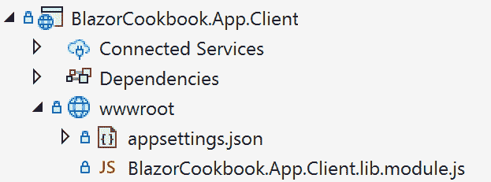

# 3

# 掌控事件处理

在本章中，我们将深入探讨 Blazor 应用程序中的事件处理世界。**事件** 是一个基本构建块，表示浏览器内的动作，如点击、输入或页面加载。事件允许开发者在用户交互时执行特定代码，从而创建一个交互性和动态的用户体验。

我们将首先探讨如何钩入事件委托，为事件管理打下基础。接下来，我们将讨论使用 **EventCallback** 和 lambda 表达式进行责任委托，这增加了事件处理中的灵活性。

我们还将涵盖控制事件传播和防止触发默认事件的必要策略。这些技能对于创建直观的用户界面，其中你可以完全控制用户交互至关重要。此外，我们还将介绍自定义事件的概念，扩展了 **事件驱动** 应用程序设计的可能性。

本章节的重点将在于理解事件如何在 Blazor 中触发渲染。这种理解对于优化应用程序性能和确保无缝的用户体验至关重要。到本章结束时，你将深入理解 Blazor 的事件处理，并掌握将这些概念有效地应用于你的 Web 开发项目的实践技能。

下面是我们将在本章中涵盖的菜谱列表：

+   钩入事件委托

+   使用 lambda 表达式进行委托

+   使用 **EventCallback** 进行委托

+   阻止默认事件行为

+   控制事件传播

+   介绍自定义事件

+   处理长时间运行的事件

# 技术要求

本章的目标是使示例保持简单，并专注于 Blazor 事件处理的原则。换句话说，你不需要任何额外的工具，只需这些基础知识：

+   一个支持 Blazor 开发的现代 IDE

+   在你的开发机器上安装 .NET 9

+   一个支持 WebAssembly 的现代网络浏览器

+   一个 Blazor 项目（你将在其中编写代码）

你将看到的全部代码示例（和数据样本）都可以在以下 GitHub 仓库中找到：[`github.com/PacktPublishing/Blazor-Web-Development-Cookbook/tree/main/BlazorCookbook.App.Client/Chapters/Chapter03`](https://github.com/PacktPublishing/Blazor-Web-Development-Cookbook/tree/main/BlazorCookbook.App.Client/Chapters/Chapter03) 。在需要任何样本的每个菜谱中，我还会指导你找到它们的目录。

# 钩入事件委托

UI 事件是网络用户交互的基础——标记每一次点击、滚动或键盘按键，并使您能够构建一个交互式应用程序。事件委托充当浏览器和您的代码之间的桥梁。每次用户交互都会触发一个指定的处理程序，执行预定义的操作。在本例中，我们将深入了解事件委托的机制，展示它们如何在 Blazor 应用程序中被检测和管理。

让我们创建一个页面，用户可以通过点击按钮来显示和隐藏一系列票据。

## 准备工作

在实现可点击按钮之前，执行以下操作：

+   创建**Chapter03** / **Recipe01**目录——这将成为您的工作目录

+   从 GitHub 仓库中的**Chapter03** / **Data**目录复制**Ticket**和**Tickets**样本文件

## 如何实现...

按照以下步骤实现基本的事件委托钩子：

1.  创建一个新的可路由的**TicketManager**组件，以**InteractiveWebAssembly**模式渲染：

    ```cs
    @page "/ch03r01"
    @rendermode InteractiveWebAssembly
    ```

1.  在您的**TicketManager**组件中添加**@code**部分。声明一个类型为**bool**的**ShowTickets**属性，该属性将决定票据列表的可见性：

    ```cs
    @code {
        protected bool ShowTickets { get; set; }
    }
    ```

1.  此外，仍然在**@code**块内部，实现一个方法来切换**ShowTickets**属性以改变票据列表的可见性：

    ```cs
    private void ToggleTickets()
        => ShowTickets = !ShowTickets;
    ```

1.  在**TicketManager**组件的标记区域中，引入一个按钮，该按钮利用**ToggleTickets()**方法并允许用户相应地更新 UI：

    ```cs
    <button class="btn btn-sm btn-success"
        @onclick="@ToggleTickets">
        Toggle Tickets
    </button>
    ```

1.  在按钮下方，根据**ShowTickets**属性的当前值，有条件地跳过显示票据列表或渲染水平分隔符，指示票据区域开始的位置：

    ```cs
    @if (!ShowTickets) return;
    <hr />
    ```

1.  在水平分隔符下方，渲染票据列表，利用从复制的样本数据中获取的**Tickets.All**集合作为数据源：

    ```cs
    @foreach (var ticket in Tickets.All)
    {
        <div class="d-flex justify-content-between mb-1"
             id="ticket-@ticket.Id">
            <div>@ticket.Title</div>
        </div>
    }
    ```

## 它是如何工作的...

我们开始实现的过程是创建一个可路由的**TicketManager**组件，如*步骤 1*所述。我们使用**@page**指令声明可导航路径。我们还声明了一个交互式渲染模式，因为我们需要我们的按钮是可操作的。接下来，在*步骤 2*中，我们引入了一个后备的**ShowTickets**属性。此属性作为标志，指示票据列表当前的可见状态——要么显示，要么隐藏。然后，在*步骤 3*中，我们引入了一个**ToggleTickets()**方法，用于切换**ShowTickets**属性。

我们通过挂钩 Blazor 的事件回调机制，在*步骤 4*中实现了交互的核心。我们在组件的标记中添加了一个按钮，使用户能够控制票据列表的显示状态。使用**@onclick**，我们可以在发生**onclick**事件时触发我们的**ToggleTickets()**方法。

在 *步骤 5* 中，我们检查 **ShowTickets** 属性的值，并决定是否完全跳过渲染票据列表。在渲染列表的情况下，我们添加一个 **<hr />** 标签，以清楚地指示票据区域开始的位置。在 *步骤 6* 中，我们遍历 **Tickets.All** 样本集合，并在灵活的 **div** 容器中渲染所有可用的票据标题。通过这种设置，**TicketManager** 会根据 **ShowTickets** 属性的当前值响应用户交互，并相应地渲染或隐藏票据列表。

## 更多内容...

Blazor 提供了与 **onclick**、**ondrag**、**oncopy** 以及您已经熟悉的其他 HTML 事件的无缝集成，允许进行动态和交互式 Web 应用程序开发。通过在事件名称前加上 **@** 符号，您向 Blazor 表明您正在使用 Blazor 特定的事件而不是标准 HTML 事件。这种区别对于充分利用 Blazor 事件系统的全部功能至关重要。

使用 Blazor 事件的一个主要优势是它们能够实时更新 DOM。Blazor 使用一个本地的 **diffing 算法**，该算法精确地计算出 DOM 中哪些部分已更改，并仅更新这些部分。这导致与服务器通信时的负载显著减小，并且无论选择的渲染模式如何，渲染时间都会更快。

需要注意的是，Blazor 渲染通常仅在组件的初始渲染时触发，或者当您显式调用 **StateHasChanged()** 生命周期方法时。如果我们进一步探讨，Blazor 中的 HTML 事件对应项实际上是 **EventCallback<T>** 的实例（包括事件参数）。仔细查看 **EventCallback** 的实现可以发现，它调用 **Receiver** 对象的 **HandleEventAsync()** 方法：

```cs
public Task InvokeAsync(object? arg)
{
    if (Receiver == null)
    {
        return EventCallbackWorkItem
            .InvokeAsync<object?>(Delegate, arg);
    }
    return Receiver
        .HandleEventAsync(
            EventCallbackWorkItem(Delegate),arg);
}
```

在大多数情况下，我们的接收器继承自 **ComponentBase**。有趣的是，**ComponentBase.HandleEventAsync()** 方法会自动调用 **StateHasChanged()**。因此，组件的状态更新无需手动干预：

```cs
Task IHandleEvent.HandleEventAsync(
    EventCallbackWorkItem callback, object? arg)
{
    // ...
    StateHasChanged();
    // ...
}
```

# 使用 lambda 表达式进行委托

在这个菜谱中，我们将探讨 .NET 中 lambda 表达式的力量及其在 Blazor 事件处理中的关键作用。最简单的说法，lambda 表达式是一个遵循特定语法的匿名方法。这些表达式是 .NET 中函数式编程的基石，并提供了一种简化的方法来编写内联委托实现。当涉及到 Blazor 时，使用 lambda 表达式进行委托变得特别有利。它们在定义标记内的直接事件处理程序和回调时非常有用。它们还使您能够拦截传入的参数和当前的运行上下文。

让我们利用 lambda 表达式并给票据列表添加更多操作，以便我们能够修改指定票据的状态。

## 准备中

在深入使用 lambda 表达式进行委托之前，请执行以下操作：

+   创建一个**Chapter03** / **Recipe02**目录——这将是你的工作目录

+   从*钩入事件委托*食谱或从 GitHub 仓库中的**Chapter03** / **Recipe01**目录复制**TicketManager**组件

+   从 GitHub 仓库中的**Chapter03** / **Data**目录复制**Ticket**和**Tickets**样本文件

## 如何做到这一点...

按照以下步骤查看使用 lambda 表达式进行委托的强大功能：

1.  导航到**TicketManager**的**@code**代码块，并在现有代码下方初始化一个**Ticket**类型的对象来存储当前选中票的详细信息：

    ```cs
    protected Ticket SelectedTicket;
    ```

1.  在下面的**@code**代码块中，实现一个**Show()**方法，以便设置当前选中票的值：

    ```cs
    private void Show(Ticket ticket)
        => SelectedTicket = ticket;
    ```

1.  跳转到**TicketManager**的标记，通过在**Title**部分下方添加两个操作按钮并使用 lambda 表达式附加其操作来扩展票详情的渲染：

    ```cs
    <div>@ticket.Title</div>
    <div>
        <button class="btn btn-sm btn-success"
                @onclick=@(() => Show(ticket))>
            Show details
        </button>
        <button class="btn btn-sm btn-success"
                @onclick=@(() => ticket.Stock += 5)>
            Top up
        </button>
    </div>
    ```

1.  在循环渲染票详情下方，检查用户是否已经设置了**SelectedTicket**值，并根据条件跳过特定票详情的渲染：

    ```cs
    @if (SelectedTicket is null) return;
    <hr />
    ```

1.  对于**SelectedTicket**变量有值的情况，渲染票标题、价格和可用性。确保此部分仅在**SelectedTicket**的值可用时可见：

    ```cs
    <div>Title: @SelectedTicket.Title</div>
    <div>Price: @SelectedTicket.Price</div>
    <div>Stock: @SelectedTicket.Stock</div>
    ```

## 它是如何工作的…

在*步骤 1*中，我们导航到**TicketManager**的**@code**代码块，并初始化一个**SelectedTicket**变量，该变量将保存对当前选中票的引用。接下来，在*步骤 2*中，我们实现一个**Show()**方法，该方法接受**Ticket**作为参数。**Show()**方法的单一职责是更新**SelectedTicket**引用。

在*步骤 3*中，我们转向**TicketManager**的标记，遍历样本中的**Tickets.All**集合并渲染每个票标题。在**Title**部分下方，我们添加了两个按钮，允许执行管理操作，利用 lambda 表达式进行委托。使用第一个按钮，我们允许用户通过将**Show()**方法附加到按钮的**@onclick**事件并传递当前迭代的**ticket**对象来显示给定票的详细信息。在这里，lambda 表达式的使用允许实现精确和上下文相关的操作。第二个按钮允许用户补充票库存。这次，我们使用了一个**匿名 lambda 表达式**——一个封装操作本身而不是委托给现有方法的 lambda 表达式。我们在遍历**Tickets.All**样本集合时访问每个票的**Stock**属性，并在标记内直接将**Stock**值增加 5。

然而，lambda 表达式的灵活性和强大功能也带来了巨大的责任。在标记中尽量减少 C#代码的数量是一种良好的实践。使用强类型方法封装复杂和冗长的 lambda 表达式，以保持代码的清晰性。

在*步骤 4*中，我们进一步扩展了**TicketManager**的标记。类似于检查**ShowTickets**值并条件性地显示票务列表（我们在*Hooking into event delegates*菜谱中实现），我们检查用户是否设置了**SelectedTicket**的值，并条件性地跳过渲染特定的票务详情。我们在*步骤 5*中通过添加简单的标记来渲染用户选择的票务的**标题**、**价格**和**库存**属性。由于 Blazor 将 lambda 表达式转换为**EventCallback**对象，用户将在每次点击**充值**按钮后立即看到**库存**属性值的更新。

## 参见

如果你想要了解更多关于 lambda 表达式角色和功能的信息，请访问 Microsoft Learn 部分：

[`learn.microsoft.com/en-us/dotnet/csharp/language-reference/operators/lambda-expressions`](https://learn.microsoft.com/en-us/dotnet/csharp/language-reference/operators/lambda-expressions)

# 使用 EventCallback 进行委托

在这个菜谱中，我们借助**EventCallback**来探索事件委托。Blazor 中的**EventCallback**是一种机制，它使组件能够监听并响应用户生成的事件或交互，与框架的架构设计紧密相连。这个 Blazor 原生特性通过无缝集成组件生命周期和整体应用程序状态，使开发者能够编写更干净、更高效的代码。事件回调的主要优势在于它们能够通过**StateHasChanged()**方法自动管理 UI 更新，确保用户界面与应用程序状态保持同步。**EventCallback**也是一个空安全对象——当它未被分配但被调用时，它会安全地跳过而不是抛出**NullReferenceException**。你将在本章的所有菜谱中看到**EventCallback**，因为它是 Blazor 中大多数交互的基础。

让我们实现一个组件，利用**EventCallback**参数封装管理票务操作。使用该组件，我们还将简化票务列表的标记。

## 准备工作

在我们实现使用**EventCallback**的委托之前，请执行以下操作：

+   创建一个**Chapter03**/**Recipe03**目录——这将是你的工作目录

+   从*Delegating with lambda expressions*菜谱或从 GitHub 仓库中的**Chapter03**/**Recipe02**目录复制**TicketManager**组件

+   从 GitHub 仓库中的**Chapter03**/**Data**目录复制**Ticket**和**Tickets**样本文件

## 如何做到这一点…

按照以下步骤使用**EventCallback**委托实现文章管理系统：

1.  创建一个新的**TicketOptions**组件。

1.  在**TicketOptions**中初始化**@code**块并声明三个必需的参数，每个参数的类型为**EventCallback**，对应不同的管理操作：

    ```cs
    @code {
        [Parameter, EditorRequired]
        public EventCallback OnShow { get; set; }
        [Parameter, EditorRequired]
        public EventCallback OnTopUp { get; set; }
        [Parameter, EditorRequired]
        public EventCallback OnRemove { get; set; }
    }
    ```

1.  跳转到**TicketOptions**标记并构建允许用户调用**OnShow**、**OnTopUp**和**OnRemove**操作的按钮：

    ```cs
    <button class="btn btn-sm btn-success"
            @onclick="@OnShow">
        Show
    </button>
    <button class="btn btn-sm btn-info"
            @onclick="@OnTopUp ">
        Top up
    </button>
    <button class="btn btn-sm btn-danger"
            @onclick="@OnRemove">
        Remove
    </button>
    ```

1.  导航到**TicketManager**组件。

1.  在**TicketManager**的**@code**块中，实现两个新方法，允许你移除和补充**Ticket**对象的库存：

    ```cs
    private void TopUp(Ticket ticket)
        => ticket.Stock += 5;
    private void Remove(Ticket ticket)
        => Tickets.All.Remove(ticket);
    ```

1.  在**TicketManager**标记中，将现有的操作按钮替换为**TicketOptions**实例：

    ```cs
    <div>@ticket.Title</div>
    <div>
        <TicketOptions
            OnShow="@(() => Show(ticket))"
            OnTopUp="@(() => TopUp(ticket))"
            OnRemove="@(() => Remove(ticket))" />
    </div>
    ```

## 它是如何工作的...

在**步骤 1**中，我们创建一个新的**TicketOptions**组件。在**步骤 2**中，我们在**TicketOptions**中初始化**@code**块并声明三个必需的**EventCallback**参数，这些参数将携带触发管理票务操作的必要的行为委托。接下来，在**步骤 3**中，我们使用三个按钮构建**TicketOptions**标记，每个按钮在用户点击时将调用**OnShow**、**OnTopUp**或**OnRemove**参数。请注意，我们将**EventCallback**参数直接附加到每个按钮的**@onclick**事件上。我们不需要添加额外的作为代理的方法。Blazor 将无缝地将 UI 交互与我们的预定义操作链接起来。

在**步骤 4**中，我们导航到**TicketManager**组件。在**步骤 5**中，我们在**TicketManager**的**@code**块中扩展两个额外的方法。首先，我们实现一个**TopUp()**方法，该方法将当前票的**Stock**属性值增加 5。接下来，我们实现一个**Remove()**方法，该方法简单地从**Tickets.All**集合中移除指定的票。在**步骤 6**中，我们定位到渲染每个票的原始操作按钮的**TicketManager**标记区域。我们将这些按钮替换为**TicketOptions**标记，并将相应的操作附加到每个必需的**EventCallback**参数上。

## 还有更多...

在**TicketOptions**组件就位后，我们已经显著简化了**TicketsManager**标记代码。我们以更组织化和可读的方式重构了与票务相关的操作，使整体代码库更干净且易于维护。

但是，由于**TicketOptions**仅作为操作代理，并不基于**Ticket**引用，因此每次渲染**TicketOptions**组件时，我们实际上都创建了新的委托实例，将可操作的方法包裹在其中。即使有所有 C#优化魔法，这种操作也可能带来性能损失。在简单应用程序中，性能影响可能微乎其微。然而，当与数据密集型或高度反应性系统一起工作时，你必须记住这一点。

# 防止默认事件操作

在这个菜谱中，我们探讨了浏览器自动执行特定操作以响应用户事件的机制。默认事件操作可能包括当按下回车键时表单提交或当点击链接时导航到链接的 URL。然而，在 Blazor 应用程序中，您可能需要拦截这些自动行为以控制用户体验。无论是管理表单验证、确认用户意图还是管理不刷新页面的动态内容更新，防止默认操作变得至关重要。我将指导您如何在应用程序中以编程方式停止这些默认行为。

让我们实现一个快速创建票据的功能，我们将拦截并应用每个用户创建的键的自定义逻辑，并存储。

## 准备工作

在探索如何拦截和防止默认事件操作之前，执行以下操作：

+   创建一个**Chapter03** / **Recipe04**目录——这将成为您的工作目录

+   从*事件回调中的委托*菜谱或从 GitHub 仓库中的**Chapter03** / **Recipe03**目录复制**TicketManager**和**TicketOptions**

+   从 GitHub 仓库中的**Chapter03** / **Data**目录复制**Ticket**，**Tickets**和**Extensions**文件

## 如何做到这一点…

通过以下步骤防止默认事件操作：

1.  导航到**TicketManager**的**@code**块，并在现有代码下方初始化一个新的**Creator**变量：

    ```cs
    internal string Creator = string.Empty;
    ```

1.  在**Creator**变量下方，仍然在**@code**块中，实现一个**MonitorCreation()**方法，该方法拦截一个**KeyboardEventArgs**参数，解析其有效负载，并在用户在键盘上按下*+*符号时创建一个新的票据实例：

    ```cs
    private void MonitorCreation(KeyboardEventArgs args)
    {
        if (args.Key == "+")
        {
            Tickets.All.Add(new() { Title = Creator });
            Creator = string.Empty;
            return;
        }
        if (args.IsBackspace() && Creator.Length > 0)
        {
            Creator = Creator[..¹];
            return;
        }
        if (args.IsLetter())
        {
            Creator += args.Key;
            return;
        }
    }
    ```

1.  跳转到**TicketManager**标记。在顶部的渲染模式声明下方，通过添加一个部分标题和一个带有附加到其**@onkeydown**事件的**MonitorCreation()**方法的输入来构建一个票据创建区域，防止默认的**@** **onkeydown**行为：

    ```cs
    <h5>Quick creation</h5>
    <p>
        <input value="@Creator"
               @onkeydown="MonitorCreation"
               @onkeydown:preventDefault />
    </p>
    ```

## 它是如何工作的…

在*步骤 1*中，我们导航到**TicketManager**的**@code**块，并初始化一个**Creator**变量，该变量将保存用户在快速创建票据字段中输入的当前文本。我们将在稍后构建创建字段本身。

在 *第 2 步* 中，在 **Creator** 变量旁边，我们实现了一个 **MonitorCreation()** 方法，我们将在这里放置 Blazor 执行的自定义 **@onkeydown** 逻辑，而不是默认的。**MonitorCreation()** 方法接收一个 **KeyboardEventArgs** 对象，它有一个 **Key** 属性，这是我们自定义创建逻辑所需要的。首先，我们检查点击的符号是否匹配 **+** 键，并将一个新的 **Ticket** 对象添加到 **Tickets.All** 集合中。接下来，我们利用数据样本提供的 **Extensions** 文件中的 **IsBackspace()** 扩展方法。如果用户点击了退格键，并且 **Creator** 的长度指示有字符可以删除，我们将使用 **范围运算符** 从 **Creator** 的值中删除最后一个字符。最后，我们利用 **Extensions** 文件中的另一个自定义扩展方法 – **IsLetter()** – 来检查用户按在键盘上的键是否实际上是一个字母，并将其附加到当前 **Creator** 值的末尾。通过这种实现，我们忽略了所有其他键盘操作。我强烈建议您进行实验，并自行添加数字支持！

在 *第 3 步* 中，我们跳转到 **TicketManager** 标记，并构建一个用户可以快速创建新票据的部分。我们添加了一个 **快速创建** 标题，以便清楚地了解下面输入的目的。最后，我们构建了 **输入** 字段，所有的事件预防都发生在这里。我们将 **输入** 的值设置为反映 **Creator** 的值。请注意，我们在这里没有利用任何绑定（更多关于绑定的内容请参阅 *第二章*）。接下来，我们将 **MonitorCreation()** 方法附加到输入的 **@onkeydown** 事件上，以便 Blazor 无缝地触发我们的自定义逻辑。但是 **@onkeydown** 有浏览器默认逻辑，与我们刚刚附加的逻辑冲突。在这里，我们使用 **@onkeydown:preventDefault**，指示 Blazor 跳过任何默认的键按下行为。

## 还有更多...

Blazor 中的所有事件在渲染模式方面表现几乎相同。然而，一些事件，如 **@onkeydown**，在预期的结果上本质上是客户端的 – 立即响应用户输入。当在 **InteractiveServer** 模式下使用 **@onkeydown** 时，你必须考虑到每个事件触发器在反映到 UI 之前将往返于服务器。在高延迟场景中，这种往返可能会导致 UI 的不稳定和不稳定行为。始终考虑你选择的事件的性质和适当的渲染模式，以确保你的应用程序保持用户友好。

当构建一个国际化的应用程序时，你可能需要支持特殊的地方字符，这些字符需要特定的键组合，例如使用 *Alt* + *a* 来生成波兰语的字母 **ą**。为了有效地处理这些情况，Blazor 提供了管理键盘组合事件的能力。

```cs
private void MonitorCreation(KeyboardEventArgs args)
{
    if (args.IsComposing) return;
    //rest of the processing logic obscured for simplicity
}
```

您可以使用 **KeyboardEventArgs** 中的 **IsComposing** 属性来跟踪输入的组成状态。当 **IsComposing** 设置为 **true** 时，表示用户正在输入一个复合字符。您应该在 **IsComposing** 返回到 **false** 之前延迟处理输入。

# 控制事件传播

在本食谱中，我们探讨了在 Blazor 应用程序中控制事件如何在 **Document Object Model** ( **DOM** ) 中传播的过程。当我们与嵌套组件或元素一起工作时，停止默认事件传播变得至关重要。您可以通过确保事件（如点击、悬停或键盘输入）具有局部影响来避免在 UI 中产生意外的涟漪效果或行为。通过掌握事件传播的控制，您可以在应用程序中微调交互模式，从而实现更流畅、更直观的用户体验。

让用户能够点击票记录的任何位置来显示其详细信息，同时确保点击嵌套的任何管理操作都不会无控制地传播。

## 准备工作

在深入控制事件传播之前，请执行以下操作：

+   创建一个 **Chapter03** / **Recipe05** 目录 – 这将是您的工作目录

+   从 *Preventing default event actions* 食谱或从 GitHub 仓库中的 **Chapter03** / **Recipe04** 目录复制 **TicketManager** 和 **TicketOptions**

+   从 GitHub 仓库中的 **Chapter03** / **Data** 目录复制 **Ticket**、**Tickets** 和 **Extensions** 文件

## 如何实现...

要控制事件传播并查看 **stopPropagation** 属性的作用，请按照以下步骤操作：

1.  导航到 **TicketManager** 标记，并找到我们为每个票渲染的容器标记。在 **id** 属性的分配旁边，将 **Show()** 方法附加到容器的 **@** **onclick** 事件：

    ```cs
    <div class="d-flex justify-content-between mb-1"
         id="ticket-@ticket.Id"
         @onclick="() => Show(ticket)">
        @* here's still the ticket container body *@
    </div>
    ```

1.  导航到 **TicketOptions** 标记，并将 **stopPropagation** 属性附加到每个管理操作按钮的 **@onclick** 事件：

    ```cs
    <button class="btn btn-sm btn-success"
            @onclick="@OnShow"
            @onclick:stopPropagation>
        Show
    </button>
    <button class="btn btn-sm btn-info"
            @onclick="@OnTopUp"
            @onclick:stopPropagation>
        Top up
    </button>
    <button class="btn btn-sm btn-danger"
            @onclick="@OnRemove"
            @onclick:stopPropagation>
        Remove
    </button>
    ```

## 它是如何工作的...

在 *步骤 1* 中，我们导航到 **TicketManager** 标记，在那里我们在一个专门的容器中渲染每个票的详细信息。您将在 **foreach** 循环内找到容器标记，其 **id** 属性设置为对应当前票 ID。为了允许用户通过点击容器上的任何位置来显示票详情，我们在 **id** 属性旁边将我们的 **Show()** 方法附加到容器的 **@onclick** 事件。现在，无论用户点击 **Show** 按钮，还是点击票容器内的任何位置，Blazor 都将触发相同的操作并渲染给定票的详细信息。

现在，这里有个关键点。在票据容器内部，我们还嵌入了**Top Up**和**Remove**按钮——它们对**@onclick**事件的反应各不相同。然而，在同一区域内嵌套的**@onclick**事件默认情况下会同时触发。在我们的例子中，当用户点击**Top Up**按钮时，它将同时增加票据库存并渲染其详情。对于**Remove**按钮来说，情况更加复杂，因为用户可以在移除票据的同时显示其详情。这就是我们需要**stopPropagation**属性的地方。将**stopPropagation**属性附加到所需事件上，我们指示 Blazor 阻止事件传播到父 DOM 元素。

在**步骤 2**中，我们导航到**TicketOptions**标记，其中包含所有管理操作按钮。在每个三个按钮的**@onclick**属性旁边，我们附加了**@onclick:stopPropagation**属性。这就足够确保用户可以安全地增加票据库存或完全移除它，而不会遇到不希望的票据详情显示渲染。

## 还有更多...

虽然**stopPropagation**属性是 Blazor 应用程序中管理事件流的有力工具，但了解其作用域和限制是至关重要的。该属性专门设计用于与 Blazor 事件一起工作，并且不会直接影响标准 HTML 事件的行为。HTML 事件必须首先允许正常执行；然后 Blazor 才能拦截这些事件并就事件从子组件传播到父组件做出决策。

在我们的实现中，我们专注于控制**@onclick**事件，但在处理需要控制多个事件的复杂界面时，**stopPropagation**必须对每个事件都是明确的。

此外，当将外部库中的组件集成到 Blazor 应用程序中时，可能会遇到直接控制事件传播并不直接的情况。在这种情况下，一个实用的解决方案是将外部组件包裹在一个中立的 HTML 元素中，例如，一个**span**元素。通过将**stopPropagation**应用于**span**上的事件，你实际上创建了一个阻止事件传播的屏障，其中**span**充当最近的父元素。这种方法允许你在复杂的组件层次结构中管理事件流，确保预期的行为，而不会受到外部组件的意外副作用。

# 引入自定义事件

在这个菜谱中，我们探讨了丰富我们的 Blazor 应用程序的自定义事件的可能性，深入到稍微更高级的领域，其中 **JavaScript** 与 Blazor 交互。除了自定义事件外，自定义事件参数的概念也出现了，允许传递超出标准事件负载的定制数据。当预定义的事件不足时，自定义事件及其相应的参数变得非常有价值，提供了捕捉和精确响应特定用户操作或外部系统触发的灵活性。

让我们实现一个组件，该组件覆盖用户尝试从该组件保护区域复制的所有数据。

## 准备工作

在我们探索自定义事件的实现之前，请执行以下操作：

+   创建一个 **Chapter03** / **Recipe06** 目录——这将是你的工作目录

+   从 *控制事件传播* 菜谱或从 GitHub 仓库的 **Chapter03** / **Recipe05** 目录复制 **TicketManager** 和 **TicketOptions**

+   从 GitHub 仓库的 **Chapter03** / **Data** 目录复制 **Ticket**、**Tickets** 和 **Extensions** 文件

## 如何操作…

按照以下步骤实现复制事件的自定义逻辑：

1.  向应用程序的 wwwroot 目录添加一个新的 JavaScript（**.js**）文件。遵循命名约定 **{ASSEMBLY NAME}.lib.module.js**。此文件将包含我们自定义事件所需的函数。



图 3.1：添加包含 JavaScript 函数的 BlazorCookbook.App.Client.lib.module.js 文件

1.  在你新创建的 **.js** 文件中，声明一个 **afterWebStarted()** 函数。使用 **registerCustomEventType** API 声明一个新的 **preventcopy** 事件。在事件中实现自定义逻辑以覆盖当前的剪贴板数据：

    ```cs
    export function afterWebStarted(blazor) {
        blazor.registerCustomEventType('preventcopy', {
            browserEventName: 'copy',
            createEventArgs: event => {
                event.clipboardData.setData('text/plain',
                    '-------');
                event.preventDefault();
                return {
                    stamp: new Date()
                };
            }
        });
    }
    ```

1.  创建一个新的 **CustomEvents.cs** 文件，该文件将作为所有与自定义事件相关的详细信息的中枢存储库。

1.  在 **CustomEvents.cs** 中，添加一个名为 **PreventedCopyEventArgs** 的类，该类扩展了 **EventArgs**。包括一个 **Stamp** 属性，以便在 Blazor 阻止复制操作时持久化：

    ```cs
    public class PreventedCopyEventArgs : EventArgs
    {
        public DateTime Stamp { get; init; }
    }
    ```

1.  仍然在 **CustomEvents.cs** 文件中，声明一个名为 **EventHandlers** 的 **public** 和 **static** 类。向这个类添加一个自定义的 **EventHandler** 属性，并定义一个返回 **PreventedCopyEventArgs** 的 **onpreventcopy** 事件。

    ```cs
    [EventHandler("onpreventcopy",
        typeof(PreventedCopyEventArgs))]
    public static class EventHandlers { }
    ```

1.  添加一个新的 **PreventCopy** 组件，用于调用你定义的自定义事件逻辑。

1.  在 **PreventCopy** 组件的 **@code** 部分，声明一个必需的 **ChildContent** 参数，其类型为 **RenderFragment**。同时，实现一个 **Log()** 方法来拦截并记录 **PreventedCopyEventArgs** 带有的时间戳：

    ```cs
    @code {
        [Parameter, EditorRequired]
        public RenderFragment ChildContent { get; set; }
        private void Log(PreventedCopyEventArgs args)
            => Console.WriteLine(
                $"Prevented data leak at {args.Stamp}
                    UTC.");
    }
    ```

1.  在 **PreventCopy** 标记内部，构建一个包装容器，其中拦截自定义的 **@onpreventcopy** 事件并将其委托给 **Log()** 方法，同时在内部渲染 **ChildContent**：

    ```cs
    <div @onpreventcopy="@Log">
         @ChildContent
    </div>
    ```

1.  导航到**TicketManager**标记，找到我们渲染**SelectedTicket**详情的区域，并用**PreventCopy**标签包裹它：

    ```cs
    <PreventCopy>
        <div>Title: @SelectedTicket.Title</div>
        <div>Price: @SelectedTicket.Price</div>
        <div>Stock: @SelectedTicket.Stock</div>
    </PreventCopy>
    ```

## 它是如何工作的...

我们通过在 Blazor 和 JavaScript 之间建立桥梁来启动自定义事件的集成。在**第 1 步**中，我们在**wwwroot**目录中添加了一个**.js**文件，遵循特定的命名约定（**{ASSEMBLY NAME}.lib.module.js**或**{PACKAGE ID}.lib.module.js**）。这个约定至关重要，因为 Blazor 会自动搜索这些文件以支持在应用程序中定义的自定义事件。在**第 2 步**中，我们定义了一个**afterWebStarted()**函数，它接受一个**blazor**参数（有意使用小写字母以区分全局可用的**Blazor**对象），这是 Blazor 编译器期望的。使用**registerCustomEventType** API，我们声明了我们的**preventcopy**事件，该事件旨在拦截浏览器的**copy**事件并覆盖剪贴板数据。在此过程中，我们还必须使用**preventDefault()**方法取消浏览器默认的复制行为。我们返回一个标记事件触发的时间戳，我们将在以后使用。

在**第 3 步**过渡到 Blazor 时，我们引入了**CustomEvents.cs**文件来定义我们的 Blazor 端自定义事件处理。在**第 4 步**中，我们实现了**PreventedCopyEventArgs**类，它继承自**EventArgs**，并反映了我们的 JavaScript 函数的结构，包括一个**Stamp**属性。在**第 5 步**中，我们使用 Razor 编译器的功能注册了一个 Blazor 自定义事件。遵循代码生成器的约定，我们声明了一个**public static class EventHandlers**，并利用**[EventHandler]**属性通知 Razor 编译器我们的自定义**onpreventcopy**事件。Razor 编译器将自动将**onpreventcopy**与其 JavaScript 对应者**preventcopy**对齐。

接下来，在**第 6 步**中，我们添加了一个**PreventCopy**组件作为包装器，防止在指定内容内进行复制操作。在**第 7 步**中，在**PreventCopy**的**@code**块中，我们声明了一个**ChildContent**参数，其中我们可以提供要保护的内容和一个原始的**Log()**方法来记录被阻止的复制尝试的时间戳。在**第 8 步**中，我们构建了**PreventCopy**标记。我们添加了一个容器并拦截了**@onpreventcopy**事件，同时每次它被触发时都会调用**Log()**方法。在容器内部，我们渲染提供的**ChildContent**标记。现在，Blazor 将有效地防止数据泄露，同时维护任何数据复制尝试的审计记录。

## 还有更多...

虽然 **afterWebStarted()** 函数在集成 **Blazor Web App** 中的自定义事件时至关重要，但需要注意的是，它专门为这个环境设计。当在 Blazor Web App 上下文之外工作时，需要采用类似的方法，但需要在函数命名上进行轻微调整。对于普通的服务器或 WebAssembly 项目，你必须实现 **afterStarted()** 函数。这种命名区分使我们能够清楚地定义 Blazor 注册自定义事件的时间，并确保应用程序生命周期的清晰性。

# 处理长时间运行的事件

在这个菜谱中，我们解决 **单页应用程序** ( **SPA** ) 开发的一个关键方面 - 确保用户意识到后台正在进行的操作。与传统 Web 应用程序不同，SPAs 并不自然地指示后台正在执行的过程。这种缺乏反馈可能导致用户盯着看似停滞或无响应的页面，从而导致挫败感和困惑。在应用程序中融入视觉动作指示器，如预加载器、加载旋转器或进度条，是至关重要的。这些元素作为视觉提示，告知用户正在发生的事情，通过提供活动感和进度感来提升用户体验。我将指导你如何在你的 SPA 中实现这些指示器，确保在长时间运行请求或操作期间，你的用户能够保持了解，保持对应用程序的参与和满意度。

让我们实现两种动作指示器 - 一个简单的加载指示器和一种原始的进度指示器。

## 准备工作

在开始实现用户友好的状态指示器之前，执行以下操作：

+   创建一个 **Chapter03** / **Recipe07** 目录 - 这将是你的工作目录

+   从 *介绍自定义事件* 菜谱或从 GitHub 仓库中的 **Chapter03** / **Recipe07** 目录复制 **TicketManager**、**TicketOptions**、**PreventCopy** 和 **CustomEvents**

+   从 GitHub 仓库中的 **Chapter03** / **Data** 目录复制 **Ticket**、**Tickets** 和 **Extensions** 文件

## 如何操作...

要构建改进应用程序用户体验的加载和进度指示器，请按照以下步骤操作：

1.  创建一个新的 **LoadingIndicator** 组件，该组件将向用户直观地传达操作正在加载。

1.  在 **LoadingIndicator** 的 **@code** 块中，声明一个 **Job** 参数 - 表示用于显示加载状态的任务，以及一个 **ChildContent** 参数，允许在加载完成后传递要渲染的内容：

    ```cs
    @code {
        [Parameter, EditorRequired]
        public Func<Task> Job { get; set; }
        [Parameter, EditorRequired]
        public RenderFragment ChildContent { get; set; }
    }
    ```

1.  在参数声明下方，仍然在 **@code** 块内，初始化一个 **IsLoading** 状态变量并实现一个 **RunAsync()** 方法，该方法封装了在执行 **Job** 委托时管理加载状态的逻辑：

    ```cs
    internal bool IsLoading;
    private async Task RunAsync()
    {
        IsLoading = true;
        StateHasChanged();
        await Job.Invoke();
        IsLoading = false;
    }
    ```

1.  在**LoadingIndicator**标记中，添加一个按钮，用户可以通过将其**@onclick**事件附加到**RunAsync()**方法来启动加载过程，并在加载过程中条件性地禁用它：

    ```cs
    <button class="btn btn-sm btn-success"
            @onclick="@RunAsync"
            disabled="@IsLoading">
        Load
    </button>
    ```

1.  在加载按钮下方，根据**IsLoading**状态变量的值构建两个区域——当加载正在进行时和加载完成后：

    ```cs
    @if (IsLoading)
    {
        <hr />
        <p>Loading...</p>
    }
    else
    {
        @ChildContent
    }
    ```

1.  创建另一个组件——**ProgressIndicator**——将向用户直观地传达他们请求的操作的进度：

1.  在**ProgressIndicator**的**@code**块内，声明两个必需的参数：一个**Job**参数——表示进度指示器应监控的抽象操作，以及一个**Total**参数——提供操作应运行的元素数量：

    ```cs
    @code {
        [Parameter, EditorRequired]
        public Func<int, Task> Job { get; set; }
        [Parameter, EditorRequired]
        public int Total { get; set; }
    }
    ```

1.  在参数声明下方，初始化一个**Progress**状态变量以反映操作的进度：

    ```cs
    internal double Progress = 0;
    ```

1.  仍然在**@code**块内，实现一个表达式体的**Label**属性，根据**Progress**值构建动作按钮的标签（我们将在稍后添加）：

    ```cs
    private string Label
        => Progress > 0 ? $"Processing {Progress:0%}"
                        : "Process";
    ```

1.  通过实现一个**RunAsync()**方法来完成**@code**块，该方法遍历总元素数量并为每个索引执行作业：

    ```cs
    private async Task RunAsync()
    {
        for (int i = 0; i < Total; i++)
        {
            Progress = 1.0 * (1 + i) / Total;
            StateHasChanged();
            await Job.Invoke(i);
        }
        Progress = 0;
    }
    ```

1.  在**ProgressIndicator**标记中，构建一个按钮，用户可以通过调用**RunAsync()**方法来调用处理。检查**Progress**变量的当前值以条件性地禁用动作按钮，并利用**Label**属性动态生成按钮标签：

    ```cs
    <button class="btn btn-sm btn-success"
            @onclick="@RunAsync"
            disabled="@(Progress > 0)">
        @Label
    </button>
    ```

1.  导航到**TicketManager**组件，到其**@code**块，并实现一个简单的**SaveAsync()**方法，利用提供的数据样本的**Tickets.SaveAsync()**：

    ```cs
    public Task SaveAsync(int index)
        => Tickets.SaveAsync(Tickets.All[index]);
    ```

1.  在**TicketManager**标记中，在渲染模式声明下方，使用**SaveAsync()**和**Tickets.All.Count**分别附加到**Job**和**Total**参数上嵌入**ProgressIndicator**：

    ```cs
    <ProgressIndicator Job="SaveAsync" Total="@Tickets.All.Count" />
    ```

1.  仍然在**TicketManager**标记中，移除允许切换票据的按钮和**ShowTickets**复选框。

1.  现在，在**TicketManager**标记中找到**foreach**循环，其中渲染每个票据容器，并将其包裹在**LoadingIndicator**组件内部。将**Tickets.GetAsync()**方法附加到**LoadingIndicator**所需的**Job**参数：

    ```cs
    <LoadingIndicator Job="@(() => Tickets.GetAsync())">
        <hr />
        @foreach (var ticket in Tickets.All)
        {
            @* here's still the ticket container markup *@
        }
    </LoadingIndicator>
    ```

## 它是如何工作的…

在*步骤 1*中，我们创建一个新的**LoadingIndicator**组件。在*步骤 2*中，我们初始化**LoadingIndicator**组件的**@code**块并声明两个关键参数：**Func<Task> Job**用于引用我们打算监控的异步操作，以及**ChildContent**允许在加载完成后传递要显示的内容。这两个参数都被设计为操作无关，使组件具有通用性和适应性，适用于各种用例。在*步骤 3*中，我们初始化一个**IsLoading**状态变量并在**RunAsync()**方法中实现核心功能。**RunAsync()**更新**IsLoading**的值以反映操作的开始，执行声明的**Job**委托，并在完成后重置**IsLoading**，无缝地过渡到显示**ChildContent**。请注意，我们在开始**Job**操作之前调用了**StateHasChanged()**生命周期方法。有了这种实现，当 Blazor 达到异步操作并释放 UI 线程时，它将重新渲染组件标记，根据**IsLoading**的值反映状态变化。在*步骤 4*中，我们构建**LoadingIndicator**的标记。首先，我们使用**RunAsync()**构建一个用于启动加载过程的操作按钮。我们还把**disabled**按钮的属性附加到**IsLoading**状态变量的值上。现在，每当加载正在进行时，Blazor 将禁用操作按钮，有效地防止用户重新排队已经正在运行的操作。在*步骤 5*中，我们添加视觉加载指示器。在操作执行期间，我们渲染一个简单的**Loading...**消息，您可以使用 CSS 增强其现代外观，例如加入一个旋转器。当加载完成后，我们渲染**ChildContent**参数提供的标记。

在*第 6 步*中，我们创建了一个具有不同类型指示器的组件 – **ProgressIndicator**。在*第 7 步*中，我们初始化**@code**块并定义一个**Job**参数 – 允许我们定义一个要运行的操作 – 以及一个**Total**参数 – 表示操作必须经历的迭代次数。**Job**签名有效地抽象了任何异步操作，同时也确保操作接受一个**int**参数，表示当前执行迭代的索引。在*第 8 步*中，我们初始化一个**Progress**变量，我们将用它来监控实际的执行进度，从 0%到 100%。在*第 9 步*中，我们实现了一个**Label**属性。通过简单的逻辑，基于当前的**Progress**值，我们生成一个**Process**调用操作或实际的进度处理。在*第 10 步*中，我们通过实现核心的**RunAsync()**方法来完成**@code**块。在**RunAsync()**中，我们从**0**循环到**Total**，并对每个索引调用**Job**委托，同时持续更新**Progress**值。当处理完成时，我们将**Progress**值重置为一个中性的**0**。在*第 11 步*中，我们构建**ProgressIndicator**标记。我们构建一个按钮，允许我们通过在**@onclick**事件上触发**RunAsync()**来启动处理。我们还根据**Progress**值禁用动作按钮，以防止正在运行的操作重新排队，类似于**LoadingIndicator**组件中的动作按钮。最后，为了提供实时的进度反馈，我们利用**Label**属性在按钮上渲染文本。现在，当操作正在运行时，Blazor 不仅会禁用按钮，还会在它上面渲染当前的进度。

在*步骤 12*中，我们导航到**TicketManager**组件的**@code**块并实现一个**SaveAsync()**方法。**SaveAsync()**方法只是一个代理方法，允许拦截当前迭代索引，在**Tickets.All**集合中找到相关的票据对象，并将其传递以保存。在*步骤 13*中，我们跳转到**TicketManager**标记，并在顶部嵌入**ProgressIndicator**。由于有**SaveAsync()**方法，我们可以将其附加到需要**Job**参数的**ProgressIndicator**组件。对于其他必需参数——**Total**——我们计算**Tickets.All**集合中的对象数量。有了这样的设置，**ProgressIndicator**允许用户触发每个票据的保存并看到操作进度。在*步骤 14*中，我们移除允许切换票据和相关**ShowTickets**复选框的按钮。我们将不再需要它们，因为我们将会将显示**Tickets.All**集合的控制权委托给**LoadingIndicator**。在*步骤 15*中，我们定位到渲染票据容器的循环。我们将整个区域包裹在**LoadingIndicator**组件内部。由于**LoadingIndicator**需要一个**Job**委托，我们利用 lambda 表达式并附加**Tickets.GetAsync()**方法。现在，当用户请求加载数据时，**LoadingIndicator**渲染**Loading…**消息并无缝触发**Tickets.GetAsync()**。当加载完成时，**LoadingIndicator**组件使用一组新的票据容器更新 UI。

## 还有更多...

你可能已经意识到加载和进度指示器适用于哪些场景，但让我给你一个简单的经验法则。

任何加载指示器都非常适合具有不可预测完成时间的操作，例如从 API 获取数据，其中结果的数量和到达时间都是未知的。

进度指示器，如进度条，非常适合已知结果的操作，例如提交数据更改或发送通知。
