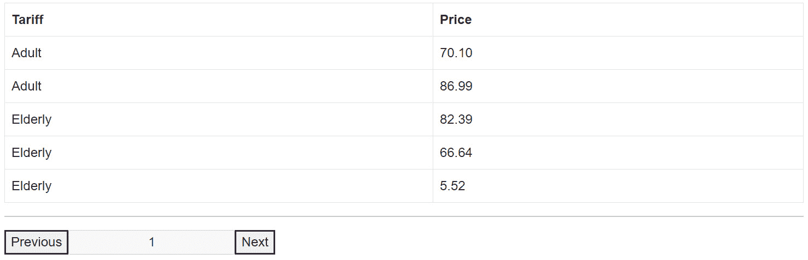
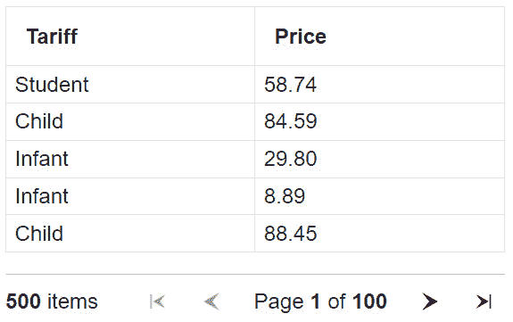

# 第四章：使用网格增强数据展示

在本章中，我们将通过实现高级网格功能来深入探讨 Blazor 应用程序中的数据展示。从将传统表格重构为更动态的网格组件的基本任务开始，我们将探讨将交互式操作附加到网格的各个部分（如单元格中的按钮或链接）的重要性，从而增强用户参与度和操作效率。

我们还将涵盖分页技术，以有效地管理大型数据集，并探讨无限滚动作为传统分页的现代替代方案。此外，我们将逐步创建一个可定制的网格，提供灵活性以适应特定应用程序的需求。最后，我们将讨论**QuickGrid**——一个具有预定义功能集、可立即使用的 Blazor 网格组件，这是您可以利用的最快、最简单的数据网格选项。

到本章结束时，您将具备增强 Blazor 应用程序中数据展示的知识，通过有效使用网格来提升数据展示的美观性和功能性。

本章我们将遵循以下食谱：

+   将表格重构为网格组件

+   将操作附加到网格的各个部分

+   实现分页

+   实现排序

+   实现无限滚动

+   利用 QuickGrid

# 技术要求

我们将在所有示例中保持简洁，以促进理解和学习。我们将使用相同的数据集来展示所有食谱，以便您可以看到不同技术方面与网格组件协同工作的影响。不需要外部工具，但以下是一些基本要求：

+   一个支持 Blazor 开发的现代 IDE

+   在您的开发机器上安装 .NET 9

+   一个支持 WebAssembly 的现代网络浏览器

+   一个 Blazor 项目（您将在其中边做边写代码）

您将看到的所有代码示例（和数据样本）都可以在专门的 GitHub 仓库中找到：[`github.com/PacktPublishing/Blazor-Web-Development-Cookbook/tree/main/BlazorCookbook.App.Client/Chapters/Chapter04`](https://github.com/PacktPublishing/Blazor-Web-Development-Cookbook/tree/main/BlazorCookbook.App.Client/Chapters/Chapter04) 。在需要任何样本的每个食谱中，我还会指向您可以找到它们的目录。

# 将表格重构为网格组件

在这个食谱中，我们将探讨开发可重用网格组件的基本原理。网格是设计直观和组织良好的用户界面的基石，它能够实现结构化数据展示。从使用基本表格到实现可重用网格组件的转变，是朝着实现模块化、可维护和可扩展的前端架构的战略举措。这样的组件可以适应应用程序的不同部分，确保一致性并减少代码中的冗余。

让我们从基础知识开始，将现有的标准 HTML 表格重构为一个组件化的网格。

## 准备就绪

在我们深入探索网格和重构标记之前，让我们先准备好舞台：

+   创建**Chapter04** / **Recipe01**目录——这将是你的工作目录

+   从 GitHub 仓库的**Chapter04** / **Data**目录复制**Samples**和**HtmlGrid**文件

## 如何做到这一点…

按照以下步骤将标准 HTML 标记重构为模块化网格组件：

1.  定位**HtmlGrid**组件。将**HtmlGrid**重命名为**Grid**，并通过在文件顶部添加**@typeparam**属性将其转换为通用版本：

    ```cs
    @typeparam T
    ```

1.  在**Grid**组件内添加一个**@code**部分。声明三个关键参数：**Header**和通用的**Data**以及**Row**，允许动态内容渲染：

    ```cs
    @code {
        [Parameter, EditorRequired]
        public List<T> Data { get; set; }
        [Parameter, EditorRequired]
        public RenderFragment Header { get; set; }
        [Parameter, EditorRequired]
        public RenderFragment<T> Row { get; set; }
    }
    ```

1.  修改表格标题单元格标记以利用**Header**参数，代表一个灵活的模板：

    ```cs
    <thead>
        @Header
    </thead>
    ```

1.  修订负责渲染表格体的循环。而不是使用固定数据集，遍历通过参数提供的**Data**集合。同样，用**Row**模板参数替换静态行单元格：

    ```cs
    <tbody>
        @foreach (var element in Data)
        {
            @Row(element)
        }
    </tbody>
    ```

1.  创建一个新的可路由的**TicketManager**组件，并将新模块化的**Grid**组件嵌入到标记区域。利用提供的**Tickets.All**样本数据作为**Grid**的数据源：

    ```cs
    @page "/ch04r01"
    <Grid Data="@Tickets.All">
        @* we will construct the grid body next @*
    </Grid>
    ```

1.  通过从原始原始表格中提取标题区域来声明嵌入网格的**Header**标记：

    ```cs
    <Header>
        <tr>
            <td>Tariff</td>
            <td>Price</td>
        </tr>
    </Header>
    ```

1.  通过从原始原始表格中提取行标记来构建嵌入网格的**Row**标记：

    ```cs
    <Row>
        <tr>
            <td>@context.Tariff</td>
            <td>@context.Price</td>
        </tr>
    </Row>
    ```

## 它是如何工作的…

在*步骤 1*中，我们通过将**HtmlGrid**重命名为**Grid**开始实现模块化网格。然后，我们在文件顶部添加**@typeparam T**属性，将**Grid**组件转换为通用组件。如果你之前没有见过通用组件，我们已经在*第一章*中的*使组件通用*配方中探讨了该主题。在*步骤 2*中，我们声明了三个必需的参数。通过通用的**Data**集合和通用的**Row**模板，我们能够动态渲染任何对象作为表格行。通过**Header**，我们可以动态提供表格标题设置，而不依赖于任何固定布局。在*步骤 3*中，我们利用**Header**参数对表格的**thead**内容进行模块化，从而使得表格标题完全可定制。在*步骤 4*中，我们配置表格体渲染。我们遍历**Data**集合，并利用类型感知的**Row**模板动态渲染提供的模板的表格行。

在*步骤 5*中，我们添加了一个新的可路由**TicketManager**组件。我们展示了新的模块化**Grid**组件，并将其嵌入到**TicketManager**的标记区域中。我们使用**Tickets.All**数据集样本作为**Grid**实例的数据源。在*步骤 6*中，我们通过重新利用原始表格标题来构建**Header**标记。在*步骤 7*中，我们对**Row**标记做同样的处理。然而，对于**Row**，这里不需要实现循环——**Grid**组件已经遍历了提供的数据集。

这种模块化方法不仅简化了实现，还确保了网格保持高度可定制性和适应各种数据类型。我们实际上只简化了渲染网格行的循环机制，但展示将 HTML 表格拆分为模块化部分背后的思考过程很重要。理解这一点使我们能够在接下来的菜谱中进一步扩展网格概念。

## 还有更多……

在 Blazor 应用程序中将网格模块化可以提高灵活性和可重用性，但你必须考虑这种做法可能带来的潜在渲染开销，尤其是在交互式网格中。每一次用户交互都可能激活差异算法（我们在*第三章* 中提到了差异算法）并触发重新渲染，这可能会根据你逻辑的复杂性显著影响性能。在组件化你的网格时找到平衡至关重要——实现足够的模块化以保持灵活性，同时不要过度复杂化你的组件。策略性地放置 API 调用和审慎使用静态**RenderFragment**实例可以帮助管理性能影响。

提高网格性能的有效策略是利用**@key** Blazor 属性。此属性帮助 Blazor 的差异算法更有效地识别元素，通过将每个网格行或组件与一个唯一标识符关联，减少不必要的 DOM 更新。如果我们假设我们期望网格中只有行级变化，那么我们可以利用**Ticket**对象的**Id**属性，并按以下方式附加**@key**：

```cs
<Grid Tickets="@Tickets.All">
    @* ... *@
    <Row>
        <tr @key="context.Id">
            <td>@context.Tariff</td>
            <td>@context.Price</td>
        </tr>
    </Row>
</Grid>
```

当 Blazor 能够将 DOM 元素与支持数据对象相关联时，它可以智能地决定何时重新渲染实际上是必要的，何时可以跳过更新 DOM 的某些部分。通过使用**@key**属性，你不仅提高了网格的渲染性能，还确保了更流畅的用户体验，尤其是在数据密集型场景中，网格的内容经常发生变化。

# 将操作附加到网格的部分

交互式网格在增强前端应用程序的用户体验中起着关键作用，使用户能够以直观和高效的方式与数据交互和操作。通过将动作附加到网格的某些部分，你可以显著提高网格的功能性，为高级功能如排序、过滤和动态数据管理铺平道路。我们在*第三章*中探讨了动作和事件在 Blazor 中的相关性。在本食谱中，你将了解在网格组件中集成可操作元素的技巧和最佳实践。有效地将动作附加到网格部分不仅丰富了用户界面，还为用户提供了与应用程序交互时的无缝体验。

让我们实现一个表格，允许你为其列附加一个动作，当用户点击时 Blazor 将执行该动作，并重构网格以使其更灵活。

## 准备工作

在深入制作交互式列和行之前，请执行以下操作：

+   创建一个**Chapter04** / **Recipe02**目录——这将是你的工作目录

+   从*重构表格为网格组件*食谱或从 GitHub 仓库中的**Chapter04** / **Recipe01**目录复制**Grid**和**TicketManager**：

+   从 GitHub 仓库中的**Chapter04** / **Data**目录复制**Samples**：

## 如何完成它...

要实现交互式表格列和行，请按照以下步骤操作：

1.  创建一个新的、通用的**ColumnViewModel**类，具有**Label**、**Template**和**OnSort**属性：

    ```cs
    public class ColumnViewModel<T>
    {
        public string Label { get; init; }
        public RenderFragment<T> Template { get; init; }
        public EventCallback OnSort { get; init; }
    }
    ```

1.  导航到**Grid**组件，并在**@typeparam**指令下方添加一个属性，指示**Grid**组件的泛型类型应级联到子组件：

    ```cs
    @typeparam T
    @attribute [CascadingTypeParameter(nameof(T))]
    ```

1.  在**Grid**组件的**@code**块中，删除**Row**参数，并将**Header**参数重命名为**ChildContent**。你已经有**Data**集合，你还需要它：

    ```cs
    @code {
        [Parameter, EditorRequired]
        public List<T> Data { get; set; }
        [Parameter, EditorRequired]
        public RenderFragment ChildContent { get; set; }
    }
    ```

1.  在参数下方，初始化一个**Columns**集合，包含类型为**ColumnViewModel**的对象，并实现一个**AddColumn()**方法，允许你向内部集合添加新的列：

    ```cs
    protected List<ColumnViewModel<T>> Columns = [];
    public void AddColumn(ColumnViewModel<T> column)
        => Columns.Add(column);
    ```

1.  最后，在**@code**块的最后，重写**OnAfterRender()**生命周期方法，以确保在所有嵌套组件渲染完成后 Blazor 重新渲染**Grid**：

    ```cs
    protected override void OnAfterRender(
        bool firstRender)
    {
        if (firstRender) StateHasChanged();
    }
    ```

1.  移动到**Grid**标记，并用一个循环替换现有的表头，该循环基于**Columns**集合中的对象构建列头：

    ```cs
    <thead>
        <tr>
            @foreach (var column in Columns)
            {
                <th @onclick="@column.OnSort">
                    @column.Label
                </th>
            }
        </tr>
    </thead>
    ```

1.  仍然在**Grid**标记内，在表格体区域，嵌套另一个**foreach**循环，在其中渲染**Data**集合中所有元素的每个列模板：

    ```cs
    <tbody>
        @foreach (var element in Data)
        {
            <tr>
                @foreach (var column in Columns)
                {
                    <td>@column.Template(element)</td>
                }
            </tr>
        }
    </tbody>
    ```

1.  为了完成标记，添加一个**CascadingValue**标记以与所有可能包含的嵌套组件共享当前的**Grid**实例：

    ```cs
    <CascadingValue Value="this">
        @ChildContent
    </CascadingValue>
    ```

1.  创建一个新的通用**Column**组件，其中包含一个**@code**块，在该块中拦截对**Grid**实例的级联引用，并允许传递**Label**、**ChildContent**和**OnSort**参数：

    ```cs
    @typeparam T
    @code {
        [CascadingParameter]
        public Grid<T> Grid { get; set; }
        [Parameter, EditorRequired]
        public string Label { get; set; }
        [Parameter, EditorRequired]
        public RenderFragment<T> ChildContent { get; set; }
        [Parameter]
        public EventCallback OnSort { get; set; }
    }
    ```

1.  仍然在**Column**组件的**@code**块中，重写**OnInitialized()**生命周期方法以将**Column**参数转换为**ColumnViewModel**并将**model**实例传递给父**Grid**组件：

    ```cs
    protected override void OnInitialized()
    {
        var model = new ColumnViewModel<T>
        {
            Label = Label,
            Template = ChildContent,
            OnSort = OnSort
        };
        Grid.AddColumn(model);
    }
    ```

1.  导航到**TicketManager**组件并初始化一个**@code**块以实现一个**Sort()**占位符方法，你只需记录意图：

    ```cs
    @code {
        private void Sort(string prop)
            => Console.WriteLine($"Sorted by {prop}!");
    }
    ```

1.  在**TicketManager**标记中，用通过**Column**组件渲染的列替换不再兼容的**Grid**内容：

    ```cs
    <Column OnSort="@(() => Sort(nameof(Ticket.Tariff)))"
            Label="Tariff">
        @context.Tariff
    </Column>
    <Column OnSort="@(() => Sort(nameof(Ticket.Price)))"
            Label="Price">
        @context.Price
    </Column>
    ```

1.  最后，增强**TicketManager**组件以在**InteractiveWebAssembly**模式下渲染：

    ```cs
    @rendermode InteractiveWebAssembly
    ```

## 它是如何工作的……

在*步骤 1*中，我们创建了一个通用的**ColumnViewModel**类。**ColumnViewModel**包含三个属性：**Label**，表示列的标题；**Template**，表示列中每个数据点要渲染的标记；以及**OnSort**，当用户点击列标题时触发的回调。使用**ColumnViewModel**，你可以简化网格中列的定义，而无需显式传递所有列属性。

在*步骤 2*中，我们导航到**Grid**组件并执行一些重构以使其构建更加动态。虽然**Grid**组件已经是通用的，但我们接下来将处理级联值，并希望 Blazor 自动将这些值类型向下传递到组件树。为了实现这种后代共享，我们利用**CascadingTypeParameter**属性。**CascadingTypeParameter**允许在组件树中共享通用类型。我们不是将通用类型**"T"**作为字符串传递，而是使用**nameof()**方法，以实现相同的结果同时保持编译时验证。

在*步骤 3*中，我们更改了**Grid**所需的参数。我们移除了**Row**参数，因为我们将数据点模板移动到**ColumnViewModel**。由于**Grid**组件现在只需要一个**RenderFragment**参数，我们将**Header**重命名为**ChildContent**，以便稍后简化网格的构建。

在*步骤 4*中，我们添加了一个**Columns**集合，它将作为我们将要渲染的网格列的容器。为了填充这个集合，我们公开了一个**AddColumn()**方法，它接受一个**ColumnViewModel**对象并将其添加到**Columns**。

在*步骤 5*中，我们重写了**Grid**组件的**OnAfterRender()**生命周期方法。这指示 Blazor 在初始渲染完成后立即重新渲染**Grid**组件。现在这可能会显得有些反直觉，但当我们稍后实现**Column**组件时，它将更有意义。

在*步骤 6*中，我们调整**网格**标记以符合**@code**块中的更改。由于我们已移除**标题**参数，我们重建表格标题区域。我们通过显式嵌入**tr**标签并渲染**Columns**集合中列的**标签**属性来重构**thead**内容。我们还将每个列声明的排序操作附加到每个**th**元素的**@onclick**事件。您将操作附加到网格元素的方式与任何其他 HTML 元素相同。

在*步骤 7*中，我们重构表格主体。我们将（我们已移除的）**行**引用替换为在遍历**数据**集合的循环中显式的**tr**标签。在每个**tr**内部，我们嵌套另一个循环，指示 Blazor 使用当前列的**模板**属性中的模板渲染每个**数据**元素。

在*步骤 8*中，我们通过构建**级联值**区域来完成**网格**标记，在该区域中，我们与嵌套组件共享当前网格实例。我们还需要**列**组件来理解这部分，因此我们将在下一步实现它。

在*步骤 9*中，我们创建一个通用的**列**组件，它将成为网格的主要构建元素。**列**组件拦截其渲染的**网格**实例，并需要**标签**和**子内容**参数。**标签**参数定义列标题，而**子内容**代表属于该列的数据点的模板。此标记将为网格中**数据**集合的每个元素渲染。我们还声明了一个可选参数**OnSort**，允许通过点击列标题附加排序行为。

在*步骤 10*中，我们通过重写**OnInitialized()**生命周期方法来完成**列**的实现，在该方法中，我们将传入的参数转换为**ColumnViewModel**对象，然后使用之前实现的**AddColumn()**方法将其注册到**网格**组件中。**列**组件按设计是无标记的——它不会显式渲染任何标记。相反，它直接在**网格**实例中注册行模板和列定义，该实例知道如何根据这些详细信息构建表格标记。

在*步骤 11*中，我们导航到**票务管理器**组件。首先，我们初始化一个**@code**块，在其中实现一个**Sort()**方法——一个仅记录操作意图的行为占位符（我们将在单独的步骤中实现排序）。

在*步骤 12*中，我们利用**Column**组件重构网格内容。由于所有网格元素都是通用的，并且**Grid**组件将泛型参数类型向下传递，我们可以使用**context**引用访问**Ticket**属性。了解这一点后，我们构建了第一个带有**Tariff**标题的列，并声明对于每个数据点，我们想要渲染当前元素的**Tariff**属性的值。我们还声明**Column**暴露的**OnSort**回调将触发**Tariff**属性的**Sort()**方法。对于第二列，我们对**Price**属性重复这些步骤。

在*步骤 13*中，由于我们期望网格是交互式的，我们声明**TicketManager**组件将以**InteractiveWebAssembly**模式渲染。

现在，随着整个实现的完成，理解增强的**Grid**组件的渲染将更容易。如您所见，我们用于构建网格的**Column**组件不携带任何标记，因此在 DOM 中将完全透明。然而，**Column**仍然需要级联访问**Grid**实例，这就是为什么我们在*步骤 8*中将所有可定制的**Grid**内容放入**CascadingValue**标签中。有了这个，每个**Column**实例可以直接在**Grid**实例中注册它携带的渲染模板，因此它与**Grid**标记一起渲染。这也是为什么我们在*步骤 5*中覆盖了**Grid**组件的**OnAfterRender()**生命周期方法。我们必须在网格的初始渲染之后以及所有**Column**实例在**Grid**实例中注册其有效负载之后重新渲染表格标记。

## 还有更多...

在某些场景中，您可能需要将操作附加到整个网格行和特定的网格单元格。当一行与单元格重叠时，您将面临**事件冒泡**。当浏览器中发生事件，如鼠标点击或按键时，它从目标元素通过其祖先传播（或冒泡），导致父元素中监听相同事件的不当行为。使用 Blazor 的**@onEvent:stopPropagation**属性，您可以防止这种传播，确保只有预期的处理程序执行：

```cs
<tr @onclick="@ShowTicketDetails">
    <td>@ticket.Tariff</td>
    <td @onclick="@AddToCart"
        @onclick:stopPropagation>
        @ticket.Price
    </td>
</tr>
```

在这个代码片段中，我们允许用户在点击表格行时显示票务详情，在点击带有价格的单元格时将票务添加到购物车。我们已经将所需的事件处理程序附加到**tr**和**td**元素上。此外，我们还将**@onclick:stopPropagation**属性附加到带有价格的**td**上。现在，我们阻止点击事件传播到父行。因此，当用户点击单元格时，Blazor 只执行**AddToCart()**处理程序，并省略**ShowTicketDetails()**处理程序。通过**@onclick:stopPropagation**，我们确保点击事件仅由单元格处理，不会影响周围的行元素。

# 实现分页

分页是指将内容分成单独的页面，这对于显示大量数据的表格和网格尤其重要。这种方法提高了数据的可读性和可导航性，并通过减少在任何给定时间内加载和渲染的数据量来显著提高性能。在表格和网格中，分页通常需要有效地管理大量数据，防止用户一次性接收过多信息而感到不知所措，并确保应用程序保持响应。

让我们给网格添加简单的分页。

## 准备工作

在我们深入之前，请确保你做了以下事情：

+   创建一个**Chapter04**/**Recipe03**目录——这将是你的工作目录

+   从*将操作附加到网格的一部分*配方或 GitHub 仓库中的**Chapter04**/**Recipe02**目录复制**Column**、**ColumnViewModel**、**Grid**和**TicketManager**：

+   从 GitHub 仓库中的**Chapter04**/**Data**目录复制**Samples**：

## 如何做到这一点…

要将分页添加到你的**Grid**组件中，请按照以下步骤操作：

1.  创建一个新的带有**Page**和**Size**属性的**PaginateEventArgs**记录：

    ```cs
    public record PaginateEventArgs(int Page, int Size);
    ```

1.  添加一个新的**Paginator**组件，并使用两个必需参数初始化一个**@code**块：一个带有**PaginateEventArgs**和**DataSize**的**Paginate**回调：

    ```cs
    [Parameter, EditorRequired]
    public EventCallback<PaginateEventArgs>
        Paginate { get; set; }
    [Parameter, EditorRequired]
    public int DataSize { get; set; }
    ```

1.  在参数下方，初始化定义分页状态的变量：**TotalPages**、**CurrentPage**和**PageSize**，并使用默认的初始值：

    ```cs
    protected int TotalPages,
        CurrentPage = 1, PageSize = 5;
    ```

1.  在状态变量旁边，重写**OnInitialized()**生命周期方法并计算**TotalPages**值：

    ```cs
    protected override void OnInitialized()
        => TotalPages =
            (DataSize + PageSize - 1)
            / PageSize;
    ```

1.  仍然在**@code**块内，实现一个**LoadAsync()**方法，调用**Paginate**回调并传递当前的分页状态：

    ```cs
    private Task LoadAsync()
    {
        var state = new PaginateEventArgs(
            CurrentPage,
            PageSize
        );
        return Paginate.InvokeAsync(state);
    }
    ```

1.  在加载方法下方，定义一个**NextAsync()**方法以启用数据页面的前进导航：

    ```cs
    private async Task NextAsync()
    {
        if (CurrentPage == TotalPages) return;
        CurrentPage++;
        await LoadAsync();
    }
    ```

1.  类似地，在前进导航旁边，实现一个**PreviousAsync()**方法来处理数据页面的向后导航：

    ```cs
    private async Task PreviousAsync()
    {
        if (CurrentPage == 1) return;
        CurrentPage--;
        await LoadAsync();
    }
    ```

1.  通过重写**OnAfterRenderAsync()**生命周期方法并加载初始数据页面来完成**@code**块，在第一次渲染之后：

    ```cs
    protected override async Task
        OnAfterRenderAsync(bool firstRender)
    {
        if (firstRender) await LoadAsync();
    }
    ```

1.  移动到**Paginator**标记区域，并构建一个包含两个用于页面导航的**button**元素和一个用于显示**CurrentPage**值的**input**字段的容器：

    ```cs
    <div class="d-flex">
        <button @onclick="@PreviousAsync">
            Previous
        </button>
        <input disabled
               class="text-center"
               value="@CurrentPage" />
        <button @onclick="@NextAsync">
            Next
        </button>
    </div>
    ```

1.  导航到**Grid**组件，并在**@code**块内初始化一个通用的**Set**集合以持久化当前显示的数据：

    ```cs
    protected IEnumerable<T> Set = [];
    ```

1.  在**Set**初始化旁边，实现一个接受**PaginationEventArgs**参数的**LoadAsync()**方法，该方法根据传入的分页状态详细信息从**Data**集合中获取数据的一个片段：

    ```cs
    public Task LoadAsync(PaginateEventArgs args)
    {
        Set = Data
            .Skip((args.Page - 1) * args.Size)
            .Take(args.Size);
        return Task.CompletedTask;
    }
    ```

1.  跳转到**Grid**组件的标记，并更新生成表格行的循环以遍历**Set**集合：

    ```cs
    <tbody>
        @foreach (var element in Set)
        {
            @* nested loop through Columns *@
        }
    </tbody>
    ```

1.  仍然在 **Grid** 标记的表格下方嵌入 **Paginator** 组件，将其 **LoadAsync()** 方法附加到其 **Paginate** 回调，并将 **Data** 集合的大小作为 **DataSize** 参数传递：

    ```cs
    <hr />
    <Paginator Paginate="@LoadAsync"
               DataSize="@Data.Count"/>
    ```

## 它是如何工作的…

在 *步骤 1* 中，我们创建了一个带有 **Page** 和 **Size** 属性的 **PaginateEventArgs** 记录，分别表示当前可见的页面和用户查看的每页大小。拥有这些详细信息使我们能够有效地按预期批次获取数据。由于我们期望 **PaginateEventArgs** 表示一个分页事件，因此使该对象不可变是有意义的，所以我们将其声明为 **record** 对象。为了简化 **PaginateEventArgs** 的初始化，我们还利用了主构造函数而不是传统的构造函数和显式属性声明。

在 *步骤 2* 中，我们引入了一个 **Paginator** 组件来封装网格分页逻辑。首先，我们在 **Paginator** 内初始化一个 **@code** 块。我们声明一个返回 **PaginateEventArgs** 的 **Paginate** 回调，以通信页面导航更改。我们还声明了一个 **DataSize** 参数。知道要分页的数据量使我们能够通过设置用户可以达到的最大页数来改进分页体验。

在 *步骤 3* 中，我们初始化了三个状态属性：**TotalPages**，表示分页导航器应该停止的位置；**CurrentPage**，表示用户正在查看的当前页面；以及 **PageSize**，定义我们允许每页加载的元素数量。对于 **CurrentPage**，我们将初始值设置为 **1**，因为我们自然从第一页开始。我们还固定 **PageSize** 为 **5**，以便我们能够专注于分页行为。

在 *步骤 4* 中，我们重写了 **Paginator** 的 **OnInitialized()** 生命周期方法，根据传入的 **DataSize** 参数和 **PageSize** 变量计算 **TotalPages** 值。我们实现了最简单的算术计算，该计算始终向上取整到下一个整数，当 **DataSize** 和 **PageSize** 的除法结果为奇数时，这表明最后一页不是满的。

在 *步骤 5* 中，我们实现了一个 **LoadAsync()** 方法，这是分页请求通信的核心。每次 Blazor 调用 **LoadAsync()** 时，我们都会从 **CurrentPage** 和 **PageSize** 变量的当前值创建一个 **PaginationEventArgs** 实例，并将其异步传递给 **Paginate** 回调，以便回调消费者进行解释。

在 *步骤 6* 中，我们通过实现一个 **NextAsync()** 方法构建了 **Paginator** 导航能力的第一部分。**NextAsync()** 允许用户获取下一页的数据 – 我们检查用户是否已经在最后一个可用的页面上，以防止进一步的导航；如果不是，我们增加 **CurrentPage** 并调用 **LoadAsync()** 方法。

在 *步骤 7* 中，我们构建 **NextAsync()** 的对应方法，**PreviousAsync()**。**PreviousAsync()** 方法允许用户向后导航并获取前一个数据集。为了防止用户导航得太远，我们检查 **CurrentPage** 是否已经是第一页。如果不是，我们减少 **CurrentPage** 并调用 **LoadAsync()**。

我们必须覆盖的最后一件事是数据的初始加载。在 *步骤 8* 中，我们重写了 **Paginator** 的 **OnAfterRenderAsync()** 生命周期方法。在第一次渲染后，我们调用 **LoadAsync()** 指示 Blazor 加载定义的初始页面，并带有指定的元素数量。

在 *步骤 9* 中，我们构建 **Paginator** 标记。我们构建了一个原始的条形，包含两个按钮，分别允许使用 **PreviousAsync()** 和 **NextAsync()** 进行前后导航。我们还添加了一个禁用的输入字段，显示基于 **CurrentPage** 变量的当前页。

在 *步骤 10* 中，我们转向 **Grid** 组件并增强它以符合 **Paginator** 和分页。首先，我们关注 **@code** 块并声明一个通用的 **Set** 集合来存储当前获取的数据集。

在 *步骤 11* 中，我们实现了一个 **LoadAsync()** 方法，该方法消费 **PaginateEventArgs** 并响应 **Paginator** 回调。在 **LoadAsync()** 内部，我们使用 **LINQ 方法** 从 **Data** 中仅加载所需元素。我们使用 **Skip()** 方法跳过用户已经看到的元素。由于 **Paginator** 组件从 **1** 开始计数页面，而集合索引从 **0** 开始，所以我们减去 **args.Page** 的值 **1**，然后乘以 **args.Size** 以获取从 **Data** 集合开始要跳过的元素数量。然后，我们使用 **Take()** 方法获取所需数量的元素。

在 *步骤 12* 中，我们跳转到 **Grid** 标记，找到迭代 **Data** 元素的循环，并将循环更新为使用 **Set**。

最后，在 *步骤 13* 中，我们将 **Paginator** 组件嵌入到 **Grid** 标记中。我们将 **LoadAsync()** 方法附加到 **Paginate** 回调，并计算 **Data** 元素以提供所需的 **DataSize** 参数。

仅用少量代码，我们就实现了完全功能和通用的分页功能。



图 4.1：带有功能分页条的网格加载

## 还有更多...

在分页实现中，我们有一些返回**Task**的方法，我们没有将其声明为**async**，而是返回了**Task.CompletedTask**对象。当我们在方法内部不执行异步操作但必须遵守异步方法签名时，这种方法是有益的。在这种情况下返回**Task.CompletedTask**更高效，因为我们避免了编译器为**async**方法生成的异步状态机的开销。通过不等待**Task**并简单地返回**Task.CompletedTask**，我们最小化了与任务调度和上下文切换相关的性能成本。

## 相关内容

在这个菜谱中，我们还看到了 LINQ 方法的应用。LINQ 方法本身就可以写成一本书，所以如果你想探索这个话题，请访问[`learn.microsoft.com/en-us/dotnet/csharp/linq/`](https://learn.microsoft.com/en-us/dotnet/csharp/linq/)。

# 实现排序

在这个菜谱中，我们深入探讨如何在网格中组织数据，通过根据列值排列行来实现。排序允许用户根据相关标准（如字母顺序、数值、日期或自定义参数）优先排序数据，从而轻松地导航和分析数据。在处理大量数据集的应用程序中，这种能力变得越来越重要，如果没有有效的排序机制，查找特定信息或理解数据趋势可能会变得很麻烦。通过引入排序功能，开发者可以显著提升用户体验，提供直观的交互和数据洞察。

让我们增强网格，添加用户可以通过点击网格列标题触发的排序功能。

## 准备工作

在我们探索网格中的排序之前，请执行以下操作：

+   创建一个**Chapter04** / **Recipe04**目录——这将是你的工作目录。

+   从**Implementing pagination**菜谱或从 GitHub 仓库的**Chapter04** / **Recipe04**目录复制**Column**、**ColumnViewModel**、**Grid**、**PaginateEventArgs**、**Paginator**和**TicketManager**。

+   从 GitHub 仓库的**Chapter04** / **Data**目录复制**Samples**。

## 如何实现...

按以下步骤向网格添加排序：

1.  导航到**ColumnViewModel**类，并将**OnSort**回调替换为**Property**委托，封装从泛型模型中选择属性的逻辑：

    ```cs
    public Func<T, object> Property { get; init; }
    ```

1.  前往**Column**组件的**@code**块，并将**OnSort**参数替换为**Property**委托参数，允许你从泛型模型传递属性选择器：

    ```cs
    [Parameter]
    public Func<T, object> Property { get; set; }
    ```

1.  仍然在**Column**组件中，通过更新**ColumnViewModel**构造函数以利用**Property**参数来修复重写的**OnInitialized()**方法：

    ```cs
    var model = new ColumnViewModel<T>
    {
        Label = Label,
        Template = ChildContent,
        Property = Property
    };
    ```

1.  移动到**Grid**组件。在**@code**块的末尾，声明变量以持久化当前排序列和顺序：

    ```cs
    private string _currentSortColumn;
    private bool _isAsc;
    ```

1.  在排序状态变量下方，添加一个 **PaginatorRef** 变量，以便在 **Grid** 代码中引用 **Paginator** 组件：

    ```cs
    protected Paginator PaginatorRef;
    ```

1.  通过实现一个 **SortAsync()** 方法来完成 **Grid** 组件的 **@code** 块，允许你根据为每个 **ColumnViewModel** 列对象设置的 **Property** 选择器动态地对 **Data** 集合进行排序：

    ```cs
    public Task SortAsync(ColumnViewModel<T> column)
    {
        if (_currentSortColumn == column.Label)
            _isAsc = !isAsc;
        else
            _isAsc = true;
        Comparison<T> comparer = (left, right) =>
        {
            var result = Comparer<object>.Default
                .Compare(column.Property(left),
                    column.Property(right));
            return _isAsc ? result : -result;
        };
        Data.Sort(comparer);
        _currentSortColumn = column.Label;
        return PaginatorRef.LoadAsync();
    }
    ```

1.  在 **Grid** 标记中，将附加到表格列标题的委托替换为新实现的 **SortAsync()**：

    ```cs
    <th @onclick="@(() => SortAsync(column))">
        @column.Label
    </th>
    ```

1.  仍然在 **Grid** 标记内，找到 **Paginator** 实例并将其引用附加到 **PaginatorRef** 变量：

    ```cs
    <Paginator @ref="@PaginatorRef"
               Paginate="@LoadAsync"
               DataSize="@Data.Count" />
    ```

1.  导航到 **TicketManager** 组件，并通过传递 **Property** 选择器和定义要排序的 **Ticket** 属性来修复 **Column** 实例：

    ```cs
    <Column Property="@(it => it.Tariff)"
            Label="Tariff">
        @context.Tariff
    </Column>
    <Column Property="@(it => it.Price)"
            Label="Price">
        @context.Price
    </Column>
    ```

## 它是如何工作的…

在 *步骤 1* 中，我们更新 **ColumnViewModel** 类，并将 **OnSort** 回调替换为泛型 **Func<T, object>**。**Func<T, object>** 是一个表示从给定类型 **T** 返回对象的委托。我们使用 **Func<T, object>** 作为排序属性的选择器，并直观地命名为 **Property**。

在 *步骤 2* 中，我们跳转到 **Column** 组件，使用与 **ColumnViewModel** 相同的逻辑更新 **Grid** 构建块。在 **Column** 的 **@code** 块内部，我们将 **OnSort** 回调替换为 **Func<T, object>** 参数。在 *步骤 3* 中，我们在重写的 **OnInitialized()** 方法中修复映射，将排序属性选择器传递给 **ColumnViewModel** 构造函数，从而传递给 **Grid** 实例。

在 *步骤 4* 中，我们导航到 **Grid** 组件并实现排序功能的后端逻辑。首先，我们声明两个变量来表示排序的当前状态：**_currentSortColumn**，表示当前选中的排序属性，以及一个 **_isAsc** 标志，表示排序顺序是升序还是降序。

在 *步骤 5* 中，我们引入一个类型为 **Paginator** 的 **PaginatorRef** 变量。一开始可能会有些困惑。在 Blazor 的 C# 代码中使用组件作为变量允许你与组件的公共 API 进行交互。此外，使用 **@ref** 属性，你可以捕获渲染组件的引用并利用其方法和属性。但是 **@ref** 有一个主要限制——引用仅在组件渲染完成后才会填充。由于 Blazor 的渲染过程是异步的，在组件初始化后立即尝试使用引用可能会失败，因为引用可能尚未可用。因此，你必须确保仅在组件渲染周期完成后访问绑定到 **@ref** 的引用。

在**步骤 6**中，我们实现了一个**SortAsync()**方法，这是我们的排序逻辑的核心。**SortAsync()**方法需要一个**ColumnViewModel**对象来定义要执行的排序。首先，我们通过检查当前排序列标签是否与用户选择的标签匹配来确定排序顺序。如果它们匹配，这表明用户试图反转排序顺序，因此我们翻转当前**_isAsc**的值。否则，我们将其设置为升序，这是预期的初始行为。接下来，我们利用一个通用的**Comparison** C#对象。**Comparison<T>**委托代表一个比较方法，用于比较相同类型的两个对象。我们使用一个 lambda 表达式构建**comparer**委托，该表达式使用默认的**Comparer**比较集合中的**left**和**right**对象。**Comparer<T>**类提供了一种比较两个对象并返回表示它们相对顺序的整数的方法。通过检查**_isAsc**，我们可以否定比较结果，从而轻松地得到降序。有了**comparer**实例，我们使用**Sort()** LINQ 扩展方法在**Data**集合上重新排列元素，根据我们的逻辑。最后，我们使用最新的**column.Label**值更新当前排序列引用，并调用**PaginatorRef**对象公开的**LoadAsync()**方法，用新的排序重新加载数据集。

在**步骤 7**中，我们跳转到**Grid**标记，定位到渲染每个表格列标题的表头区域，并将**SortAsync()**方法附加到带有当前**column**引用的**@onclick**事件处理器。在**步骤 8**中，我们向下滚动到构建**Paginator**实例的位置，并借助**@ref**属性，将**Paginator**实例附加到组件代码部分中的**PaginatorRef**变量。

在所有排序增强之后，**TicketManager**组件不再兼容。在**步骤 9**中，我们转向**TicketManager**标记，并通过为每个渲染的列声明带有 lambda 表达式的**Property**委托来更新**Column**实例。

# 实现无限滚动

在用户体验趋势中，从传统的分页方式转向了更动态和流畅的无缝滚动方式。**虚拟化**（Virtualize），集成到 Blazor 框架中，旨在通过在用户滚动页面时按需加载内容来增强用户界面。它通过仅渲染视口中的项目并在需要时获取额外内容来智能管理资源，显著提高了性能和用户体验，尤其是在处理大量数据集的应用程序中。通过使用**Virtualize**组件实现无限滚动，您可以提供一个更平滑、更吸引人的交互模式，消除手动页面导航的需求，使内容浏览变得轻松。

让我们构建一个简单的网格并实现无限滚动，利用 **Virtualize** 组件。

## 准备工作

为了简化网格本身并专注于无限滚动实现，我们不会利用之前食谱中内置的任何网格标记，而是从头开始。但在你深入之前，请执行以下操作：

+   创建一个 **Chapter04** / **Recipe05** 目录 – 这将是你的工作目录

+   从 GitHub 仓库中的 **Chapter04** / **Data** 目录复制 **Samples**

+   导航到应用程序的 **Program** 文件并注册来自 **Samples** 的 **TicketsApi** 服务，在应用程序依赖注入容器中：

    ```cs
    builder.Services.AddScoped<TicketsApi>();
    ```

## 如何做到这一点…

按照以下步骤向网格添加无限滚动：

1.  使用 **typeparam** 属性创建一个泛型 **Grid** 组件：

    ```cs
    @typeparam T
    ```

1.  在 **Grid** 组件的 **@code** 块内部，声明三个必需的参数：

    ```cs
    [Parameter, EditorRequired]
    public Func<int, int, CancellationToken,
        Task<(int, List<T>)>> Provider { get; set; }
    [Parameter, EditorRequired]
    public RenderFragment Header { get; set; }
    [Parameter, EditorRequired]
    public RenderFragment<T> Row { get; set; }
    ```

    三个参数是：

    +   **Provider** – 封装数据获取的代理

    +   **Header** – 表格表头模板的 **RenderFragment**

    +   **Row** – 表格行模板的泛型 **RenderFragment**

1.  在参数下方，实现一个 **LoadAsync()** 方法来处理动态数据加载；接受 **ItemsProviderRequest** 作为输入并返回一个泛型 **ItemsProviderResult** 对象：

    ```cs
    private async ValueTask<ItemsProviderResult<T>>
        LoadAsync(ItemsProviderRequest request)
    {
        (var total, var data) = await Provider
            .Invoke(request.StartIndex, request.Count,
                    request.CancellationToken);
        return new(data, total);
    }
    ```

1.  移动到 **Grid** 组件的标记区域并构建一个表格：将 **Header** 模板嵌入到 **<thead>** 标签内，对于 **<tbody>** 部分，使用 **Virtualize** 组件，通过其 **ItemsProvider** 参数将其链接到 **LoadAsync()** 方法，并将 **Row** 模板作为其 **ChildContent** 参数传递：

    ```cs
    <table class="table table-bordered">
        <thead>
            @Header
        </thead>
        <tbody>
            <Virtualize ItemsProvider="@LoadAsync">
                @Row(context)
            </Virtualize>
        </tbody>
    </table>
    ```

1.  创建一个可路由的 **TicketManager** 组件。将 **TicketManager** 设置为以 **InteractiveWebAssembly** 模式渲染并注入 **TicketsApi** :

    ```cs
    @page "/ch04r05"
    @rendermode InteractiveWebAssembly
    @inject TicketsApi Tickets
    ```

1.  在 **TicketManager** 标记内，包含新创建的 **Grid** 组件。将 **Tickets.GetAsync()** 方法附加到 **Provider** 参数，并定义 **Header** 和 **Row** 模板以在网格中渲染 **Ticket** 属性：

    ```cs
    <Grid Provider="@Service.GetAsync">
        <Header>
            <tr>
                <td>Id</td>
                <td>Tariff</td>
                <td>Price</td>
            </tr>
        </Header>
        <Row>
            <tr>
                <td>@context.Id</td>
                <td>@context.Tariff</td>
                <td>@context.Price</td>
            </tr>
        </Row>
    </Grid>
    ```

## 它是如何工作的…

在 *步骤 1* 中，我们创建了一个泛型 **Grid** 组件，它作为动态以无限滚动能力显示表格格式的数据的基础。

在 *步骤 2* 中，我们在 **Grid** 组件内声明了一些必需的参数。**Header** 和 **Row** ，类型为 **RenderFragment** ，允许自定义表格的表头并简化表格行的动态渲染。此外，我们指定了一个 **Provider** 代理来封装获取数据的逻辑。我们特意设计 **Provider** 以匹配 **Virtualize** 组件所需的 **ItemsProvider** 签名，确保兼容性和无缝集成。

在 *步骤 3* 中，我们实现了一个 **LoadAsync()** 方法，它在响应用户滚动操作获取数据时起着关键作用。它接受一个 **ItemsProviderRequest** 参数，并返回一个 **ItemsProviderResult<T>** 对象，以使 **Virtualize** 组件能够连续填充网格，当用户滚动内容时。**ItemsProviderRequest** 提供了当前滚动状态，暴露了 **StartIndex**，它定义了下一个数据批次应从哪个索引开始。为了构建 **ItemsProviderResult<T>** 响应，我们需要渲染的新对象子集和集合中的总对象数。**Virtualize** 组件使用这个总数来安全地停止数据获取，避免抛出索引异常。

在 *步骤 4* 中，我们设置了 **Grid** 标记。我们添加了一个 **<table>** 结构，在其中我们将 **Header** 模板放置在 **<thead>** 标签内，并在 **<tbody>** 标签内使用 **Virtualize** 组件。通过将 **LoadAsync()** 方法作为 **ItemsProvider** 参数附加，并将 **Row** 模板作为 **Virtualize** 组件的 **ChildContent**，网格动态渲染额外的数据行，创建无限滚动效果。

为了演示 **Grid** 组件的使用，在 *步骤 5* 中，我们引入了一个可路由的 **TicketManager** 组件。我们将 **TicketManager** 设置为以 **InteractiveWebAssembly** 模式渲染，并注入 **TicketsApi**，因为我们将其作为数据源。在 *步骤 6* 中，我们将 **Grid** 组件集成到 **TicketManager** 标记中，其中 **Tickets.GetAsync** 作为数据提供者，并指定了 **Header** 和 **Row** 模板以显示 **Ticket** 对象的属性。

## 还有更多...

在您的 Blazor 应用程序中使用 **Virtualize** 组件可以带来许多好处，这些好处既提高了性能，也改善了用户体验：

+   首先，**Virtualize** 在处理大量数据集时显著提高了性能并减少了内存使用。这种效率的提高来自于其渲染方法，即在任何给定时间只渲染可见的项目子集，从而减少了浏览器上的总体负载。

+   其次，**Virtualize** 提供的简洁性不容小觑。您可以用最少的代码实现复杂的无限滚动功能，因为该组件抽象了项目虚拟化和自动事件处理的复杂性。

+   最后，**Virtualize** 提供了卓越的灵活性，使其能够无缝集成到各种数据源中。这种灵活性对于需要实时数据获取的应用程序特别有益，因为您可以根据特定的数据获取逻辑定制 **ItemsProvider** 委托，确保应用程序保持响应并更新到最新信息。

# 利用 QuickGrid

在这个菜谱中，我们将探索现在直接嵌入到 Blazor 框架中的强大组件 – **QuickGrid**。QuickGrid 简化了在 Blazor 应用程序中创建和管理动态、数据驱动的网格，提供开箱即用的功能，如排序、分页和过滤。该组件因其易于实现和通过内置虚拟化在呈现和操作大数据集时的高性能而脱颖而出。QuickGrid 消除了对额外 NuGet 包的需求，简化了开发过程并减少了项目复杂性。

让我们浏览 QuickGrid 的基本知识，并展示其实现是多么简单。

## 准备工作

在我们探索 QuickGrid 的实现之前，请执行以下操作：

+   创建一个 **Chapter04** / **Recipe06** 目录 – 这将是你的工作目录

+   从 GitHub 仓库中的 **Chapter04** / **Data** 目录复制 **Samples**

+   导航到你的应用程序的 **Program** 文件并注册来自 **Samples** 的 **TicketsApi** 服务到应用程序依赖注入容器中：

    ```cs
    builder.Services.AddScoped<TicketsApi>();
    ```

## 如何操作…

要使用 QuickGrid 渲染网格，请按照以下步骤操作：

1.  导航到你的项目的 **.csproj** 配置文件，并添加 **Microsoft.AspNetCore.Components.QuickGrid** 包到你的项目中：

    ```cs
    <ItemGroup>
      <PackageReference
          Include=
              "Microsoft.AspNetCore.Components.QuickGrid"
          Version="8.0.2" />
    </ItemGroup>
    ```

1.  创建一个新的可路由的 **TicketManager** 组件，引用 **QuickGrid** 包，以 **InteractiveWebAssembly** 模式渲染，并注入 **TicketApi** 服务：

    ```cs
    @page "/ch04r06"
    @using Microsoft.AspNetCore.Components.QuickGrid
    @rendermode InteractiveWebAssembly
    @inject TicketsApi Tickets
    ```

1.  在 **TicketManager** 组件的 **@code** 块中，引入一个类型为 **PaginationState** 的 **Pagination** 变量来配置 **QuickGrid** 实例的数据分页：

    ```cs
    @code {
        protected PaginationState Pagination = new()
        {
            ItemsPerPage = 5
        };
    }
    ```

1.  在 **TicketManager** 标记中，使用嵌套的 **PropertyColumn** 组件构建 **QuickGrid** 组件以定义数据列，并集成 **Paginator** 组件来管理数据分页：

    ```cs
    <QuickGrid Class="w-100 table table-bordered"
               Items="@Tickets.Get()"
               Pagination="@Pagination">
        <PropertyColumn Property="@(x => x.Tariff)"
                        Sortable="true" />
        <PropertyColumn Property="@(x => x.Price)"
                        Sortable="true" Format="0.00" />
    </QuickGrid>
    <Paginator State="@Pagination" />
    ```

## 它是如何工作的…

在 *步骤 1* 中，我们导航到项目的配置文件（具有 **.csproj** 扩展名的文件）并将 **Microsoft.AspNetCore.Components.QuickGrid** 包添加到项目中。QuickGrid 是 Blazor 生态系统的一部分，但默认情况下并不包含在 Blazor 项目中。

在 *步骤 2* 中，我们创建一个新的可路由的 **TicketManager** 组件，我们将在这里测试 **QuickGrid**。由于网格将是交互式的，我们声明 **TicketManager** 以 **InteractiveWebAssembly** 模式渲染。我们还包含一个 **using** 指令，引用 **QuickGrid** 命名空间。最后，我们注入 **TicketsApi** 服务以提供网格的数据源。

在 *步骤 3* 中，我们在 **TicketManager** 组件的 **@code** 块中初始化，其中我们构建一个 **Pagination** 变量的实例并设置其 **ItemsPerPage** 属性。**QuickGrid** 需要一个 **PaginationState** 对象来启用分页。

最后，在*步骤 4*中，我们将**QuickGrid**嵌入到**TicketManager**标记中。我们将**Tickets.Get()**方法和**Pagination**对象分别附加到**QuickGrid**的**Items**和**Pagination**参数上。接下来，我们使用**PropertyColumn**组件构建网格列。我们通过委托指定要渲染的属性，并通过设置**Sortable**参数来启用排序。对于**价格**列，我们还设置了**Format**参数。**QuickGrid**组件将自动将此格式应用于该列中的所有价格。最后，我们引入了一个**Paginator**组件，并将其链接到与**QuickGrid**实例相同的**Pagination**变量。**Paginator**向用户公开分页 UI，并直接在**QuickGrid**上执行导航请求。

最后，我们得到了一个功能齐全、优化良好且功能丰富的网格：



图 4.2：使用 QuickGrid 渲染的具有可排序列和分页的网格
